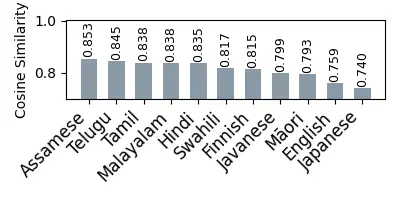
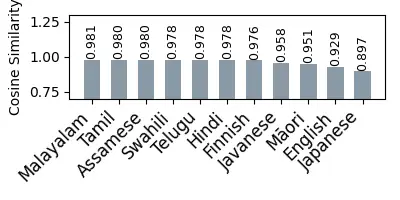
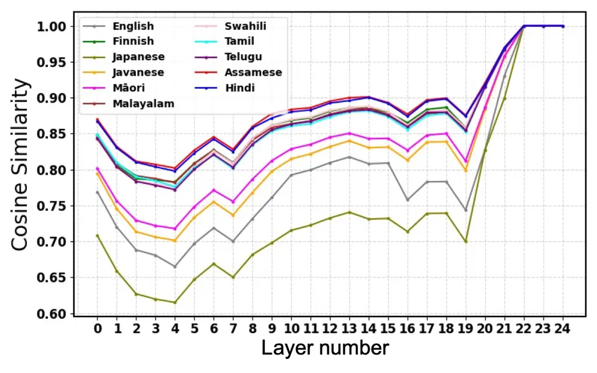
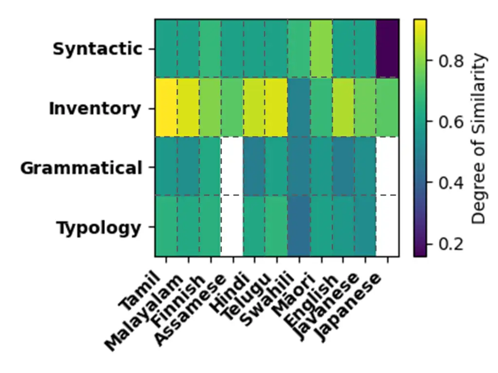
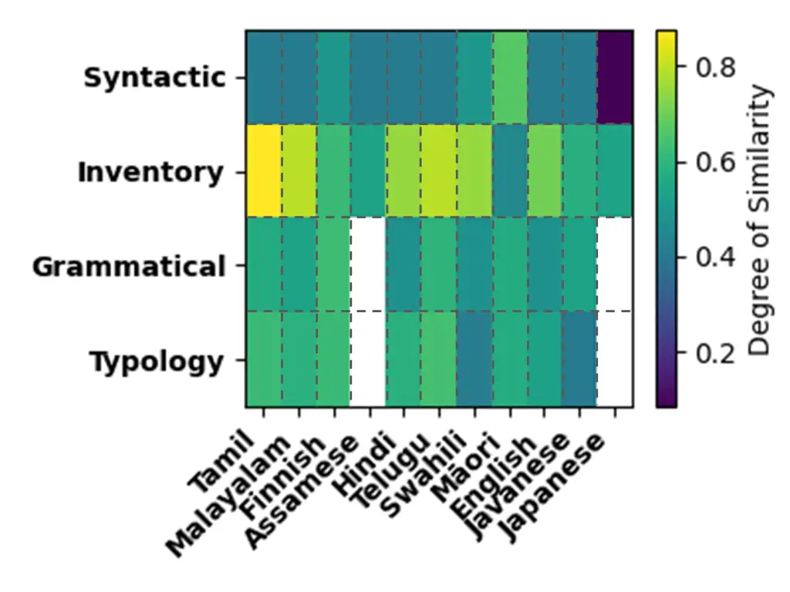

Mylvaganam Ambikairajah Dang Sethu Szalay

# Which Languages Transfer Best to Warlpiri? A Similarity-Based Study for Low-Resource ASR

Pravina    Eliathamby    Ting    Vidhyasaharan    Tuende

###### Abstract

This paper investigates how language similarity can improve
cross-lingual transfer for automatic speech recognition (ASR) in
extremely low-resource settings. Warlpiri, an Australian Aboriginal
language, has very limited transcribed speech data, making transfer
learning essential. We propose a framework combining acoustic similarity
from pre-trained speech models with linguistic similarity based on
typology, phoneme inventories, grammatical, and syntactic features to
rank high-resource source languages and evaluate their effectiveness for
ASR transfer to Warlpiri. Experiments with Whisper show that
acoustically and typologically similar languages outperform monolingual
and multilingual baselines. Assamese and Hindi achieve substantial
reductions in word and character error rates. Correlation analysis
further indicates that acoustic similarity is the strongest predictor of
fine-tuning performance, while phoneme inventory and typological
similarity better explain zero-shot transfer.

###### keywords

low-resource ASR, cross-lingual transfer, language similarity, speech
embeddings, Aboriginal languages

^(†)^(†)address: ¹ University of New South Wales, Australia  
² University of Melbourne, Australia  
³ University of Sydney, Australia ^(†)^(†)email:
p.mylvaganam@unsw.edu.au , e.ambikairajah@unsw.edu.au,
ting.dang@unimelb.edu.au, v.sethu@unsw.edu.au,
tuende.szalay@sydney.edu.au

## 1 Introduction

Automatic Speech Recognition (ASR) has become a transformative
technology that enables natural human–computer interaction in
applications such as virtual assistants, language learning, and
accessibility tools. In recent years, ASR has advanced markedly due to
large-scale annotated datasets and powerful deep learning models \[1\].
However, many languages, especially Indigenous and low-resource
languages, remain underrepresented and perform worse than high-resource
languages due to the limited transcribed corpora \[2\]. Warlpiri, an
Australian Aboriginal language spoken by a small community in the
Northern Territory \[3\], exemplifies this challenge, as its extremely
limited data hinder robust ASR development.

Cross-lingual transfer has emerged as a promising solution to data
scarcity, leveraging acoustic and linguistic knowledge from
high-resource languages to support low-resource ones \[4, 5\]. However,
its effectiveness depends on the selection of suitable source languages
for knowledge transfer \[6\]. Existing studies often choose source
languages based on data availability, language families, or heuristics
\[7, 8, 9, 10\], which may not reflect true acoustic or linguistic
similarity \[11, 12\]. Recent work instead highlights acoustic and
phonetic similarity as more reliable indicators \[13\], often yielding
better transfer than genealogical or geographical closeness alone \[14,
15\], given that geographically or genealogically related languages can
still differ substantially in their acoustic properties \[16, 17, 18\].
This highlights the need for systematic, similarity-based source
language selection to maximize transfer in low-resource settings.

Warlpiri is typologically distant (i.e., differing substantially in
grammar, morphology, and syntax) from most high-resource languages \[19,
20, 21\] and has received limited attention, making it unclear which
high-resource languages are the most suitable transfer sources. Its
segmental and suprasegmental properties further underscore the need for
a systematic similarity analysis: the vowel system of Warlpiri is
relatively small, while its consonant inventory is extensive, including
dental, alveolar, retroflex, and palatal sounds that are uncommon in
many high-resource languages \[3, 19, 22\]. Acoustically, it exhibits
characteristic stress patterns, vowel harmony, and prosodic structures
that differentiate it from languages such as English \[23, 24, 25\].
These distinctive phonological and prosodic patterns suggest that
transfer effectiveness is unlikely to be captured by broad criteria such
as data availability alone, and instead depends on more fine-grained
forms of similarity. This motivates a multi-level similarity analysis
that examines syntactic, phoneme-inventory, grammatical, and typological
similarity, with detailed acoustic measures, to systematically identify
high-resource source languages that align with Warlpiri.

A recent study \[26\] examined similarity between Warlpiri and several
high-resource languages using a language identification framework. While
providing preliminary insights, it is limited to sentence-level acoustic
similarity and does not consider fine-grained acoustic similarity across
low- to high-level speech representations. More importantly, it excludes
linguistic similarity measures, leaving the analysis largely
descriptive. In addition, the proposed similarity metrics have not been
evaluated on downstream tasks, leaving no empirical evidence of their
utility for applications such as ASR improvements.

To address these challenges, this study investigates two central
questions: (1) which high-resource languages are most similar to
Warlpiri across acoustic and linguistic dimensions, and (2) whether
similarity-based source language selection improves the effectiveness of
cross-lingual transfer for ASR tasks. Specifically, we consider two
categories of similarity: (1) embedding-based acoustic similarity
derived from pre-trained speech models, and (2) linguistic-feature-based
similarity computed from syntactic, phoneme inventory, grammatical, and
typological characteristics. These measures are used to rank the
high-resource languages and identify promising source languages for
transfer through cross-lingual ASR experiments.

To our knowledge, this is the first systematic study analysing
similarity between Warlpiri and high-resource languages across acoustic
and linguistic features, and linking it directly to ASR performance. It
provides a principled approach for developing ASR systems for
low-resource languages.

## 2 Similarity Analysis

The detailed similarity analysis between Warlpiri and the selected
high-resource languages is presented in this section. Candidate
languages are first identified using the LID-based similarity approach
\[26\], which selects languages proximate to Warlpiri, providing a
principled basis for in-depth similarity analysis while ensuring
computational feasibility by limiting the study to the most acoustically
proximate languages.

### 2.1 LID-based similarity

This approach identifies acoustically similar high-resource languages to
Warlpiri as suitable candidates for further similarity analysis using
our proposed acoustic and linguistic feature methods (sections 2.2 and
2.3). We employ a widely used multilingual pre-trained ECAPA-TDNN model
\[27\] trained on the diverse VoxLingua107 \[28\], providing broad
coverage across language families for reliable cross-language
comparison. Warlpiri utterances are fed to the model to generate
predictions over 107 languages, with higher predicted probabilities
indicating greater acoustic similarity to Warlpiri \[26\].

### 2.2 Acoustic Similarity

We propose an acoustic approach to quantify language similarity using
only speech signals. Speech embeddings are first obtained using the
pre-trained speech model $`f(\cdot)`$. The model maps each speech
utterance $`x`$ to a fixed-dimensional embedding space
$`\mathbf{e}=f(x)\in\mathbb{R}^{d}`$ . The language similarity, $`s`$,
is then calculated using the cosine similarity between the embedding
vectors $`\mathbf{e}_{w}`$ and $`\mathbf{e}_{\ell}`$ of Warlpiri and a
high-resource language $`\ell`$:

```math
\mathrm{s}(x^{w},x^{\ell})=(\mathbf{e}_{w}\cdot\mathbf{e}_{\ell})/(\lVert\mathbf{e}_{w}\rVert\,\lVert\mathbf{e}_{\ell}\rVert) \tag{1}
```

For each Warlpiri utterance, similarity is computed against a
representative subset of utterances (described in Section 3.1) from
language $`\ell`$. The resulting pairwise cosine similarities are
averaged to obtain a similarity score for language $`\ell`$ per Warlpiri
utterance, and the overall acoustic similarity $`S(w,\ell)`$ is computed
by averaging these scores across all Warlpiri utterances.

```math
S(w,\ell)=\frac{1}{N_{w}}\sum_{i=1}^{N_{w}}\left(\frac{1}{N_{\ell}}\sum_{j=1}^{N_{\ell}}\mathrm{s}\big(x_{i}^{w},x_{j}^{\ell}\big)\right) \tag{2}
```

where $`N_{w}`$ and $`N_{\ell}`$ are the number of utterances in
Warlpiri and language $`\ell`$, respectively. Retaining utterance-level
embeddings rather than collapsing them into a single global
representation ensures a robust and fine-grained estimate of
cross-language acoustic proximity.

To further analyse how acoustic similarity evolves across representation
depth, we extract embeddings from intermediate layers of
transformer-based speech models. Layer-wise similarity is then computed
using the same cosine formulation, yielding $`S_{k}(w,\ell)`$ for each
layer $`k`$. This enables us to examine how similarity patterns shift
from lower-level acoustic representations to higher-level phonetic or
linguistic abstractions.

In this study, we evaluate several pre-trained speech models, including
ECAPA-TDNN \[27\], wav2vec 2.0 \[29\], and XLSR-53 \[30\]. ECAPA-TDNN
captures speaker and language-discriminative acoustic characteristics,
while wav2vec 2.0 is a self-supervised model trained on large-scale
English speech that generates contextualised embeddings containing rich
acoustic and phonetic information. Using both models, we extract the
final-layer embeddings for each utterance. Since ECAPA-TDNN lacks a
transformer hierarchy and monolingual wav2vec 2.0 is not well-suited for
cross-lingual layer-wise analysis, we focus on XLSR-53 \[30\], a
multilingual extension of wav2vec 2.0 trained on 53 languages, for
layer-wise evaluation. Unlike its monolingual counterpart, XLSR-53 is
particularly well-suited for cross-lingual investigations. Its
hierarchical transformer architecture produces representations that
progress from low-level acoustic features to higher-level phonetic and
linguistic abstractions \[31\], enabling a detailed examination of how
Warlpiri’s similarity to other languages evolves across layers.

Finally, acoustic similarity analysis ranks high-resource languages by
proximity to Warlpiri across models and layers. Although Warlpiri is
unseen during training, embedding similarity serves as a proxy for
acoustic and phonetic affinity.

### 2.3 Linguistic-feature Similarity

We further examined non-acoustic features, i.e., typological properties
documented in linguistic studies \[32\]. We analyze language similarity
across four complementary dimensions: syntactic structure, phoneme
inventory, grammatical features, and overall typology, providing a
multi-level characterization grounded in established linguistic
resources. Languages are represented as feature vectors extracted from
publicly available databases, and similarity between Warlpiri and each
high-resource language is computed using cosine and Hamming distances.
The four dimensions are defined as follows:

1.  1.  Syntactic Distance: Measures similarity between syntax feature
        vectors using data from the World Atlas of Language Structures
        (WALS) \[33\], Syntactic Structures of World Language Structures
        (SSWL) \[34\], and Ethnologue \[35\], encoding sentence structure
        and word order.
2.  2.  Inventory Distance: Measures similarity in phoneme inventories,
        reflecting the sound systems of languages. The binary phoneme
        vectors are derived from the PHOIBLE database \[36\].
3.  3.  Grammatical Distance: Captures grammatical structure, such as case
        marking, agreement, tense–aspect–mood, using Grambank feature
        vectors \[37\].
4.  4.  Typology Distance: Overall structural similarity from concatenated
        vectors of the above three dimensions, reflecting global typological
        similarity.

To ensure reliability, features with missing values were ignored rather
than predicted \[15, 37\]. Predicting missing feature values can
introduce artificial patterns that distort similarity measurements, so
only attested feature values were used to compute similarity scores.

## 3 Experiments

### 3.1 Datasets

Warlpiri speech recordings and their corresponding transcriptions were
obtained from the DoReCo dataset \[38\]. The recordings were first
pre-processed by removing low-quality segments and utterances containing
excessive noise or irrelevant speech. The remaining audio signals were
then downsampled to 16 kHz to match the input requirements of the speech
models used in this study. The final dataset consists of approximately
1.5 hours of speech from 18 speakers. This reflects realistic
documentation conditions for endangered languages, where only limited
amounts of transcribed speech are typically available. The data were
split into training, validation, and test sets with durations of 1 hour,
15 minutes, and 15 minutes, respectively.

For acoustic analysis (Section 2.2), a representative subset of each
high-resource language is randomly sampled from the VoxLingua107
training split \[28\], on which the pre-trained models were optimized,
ensuring reliable acoustic and phonetic representations. For
computational efficiency, each subset is limited to 2,500 utterances (10
hours) per language while preserving speaker diversity and broad
phonetic coverage.

### 3.2 ASR model and Implementation Details

For ASR on Warlpiri, we use the Whisper model \[39\], a large-scale
multilingual encoder–decoder trained on diverse speech data, known for
strong cross-lingual transfer in low-resource ASR \[40, 9\]. Given the
limited availability of Warlpiri speech data, we use the Whisper small
variant for all experiments. It comprises a 12-layer encoder and
decoder, a model dimension of 768, 12 attention heads, and 244 million
trainable parameters. This configuration balances recognition
performance and computational efficiency, ensuring consistent and
controlled cross-lingual transfer experiments.

We start with the multilingual Whisper small model and fine-tune it
individually on each selected high-resource source language dataset. The
resulting source-adapted models are then fine-tuned on Warlpiri data.
All encoder and decoder layers are updated, as full-model fine-tuning
enables better adaptation of both acoustic and linguistic
representations to the low-resource language. The procedure follows
Hugging Face guidelines \[41\]. Specifically, each model is trained for
10 epochs with a batch size of 2, using a 10% warm-up of total steps,
after which the learning rate reaches $`10^{-5}`$ and decays linearly.
This setup ensures stable and sufficient training on the low-resource
dataset.

During training, checkpoints were saved every 200 steps, and each was
evaluated on the validation set. The checkpoint with the lowest word
error rate (WER) was selected as the final model. This configuration was
kept consistent across all experiments to ensure fair comparison between
source languages. The final model was evaluated on a held-out test set
that was not used during training using WER and character error rate
(CER). Performance was compared against three baselines: (1) monolingual
training, where the same model architecture was trained using only
Warlpiri data without adaptation or transfer from any other language,
(2) multilingual transfer using the original Whisper and XLSR-53 models,
and (3) models pre-trained on languages least similar to Warlpiri. This
setup assesses whether similarity-based source language selection
improves ASR performance.

## 4 Results and Discussion

### 4.1 Candidate Language Selection

Based on the LID-based pre-selection in Section 2.1, the top nine of 107
languages were selected as acoustically similar candidates: Assamese,
Hindi, Tamil, Telugu, Malayalam, Finnish, Māori, Javanese, and Swahili,
as they show higher similarity than the others. Notably, these languages
are neither part of the Pama–Nyungan language family to which Warlpiri
belongs, nor geographically close, indicating that selecting source
languages solely based on genealogical or geographical similarity may
not be effective, which is commonly used in the literature for
cross-lingual transfer. This further underscores the need for a more
principled strategy for selecting source languages.

To ensure a comprehensive evaluation, the acoustically least similar
languages, English and Japanese, were also included. This resulted in a
total of 11 high-resource languages, selected from an initial pool of
107, which were used for both the embedding-based acoustic similarity
and linguistic similarity analyses described in Sections 2.2 and 2.3.
These languages were selected to span a broad range of similarity levels
and language families for controlled comparison. However, due to missing
linguistic feature data for Assamese and Japanese, only syntactic and
phoneme inventory distances could be analyzed for these two languages.

### 4.2 Language Similarity



(a) ECAPA-TDNN



(b) Wav2vec 2.0

Figure 1: Embedding-based cosine similarity between Warlpiri and
selected high-resource languages using ECAPA-TDNN and Wave2vec 2.0.

Embedding-based acoustic similarity: Figure 1 shows cosine similarity
between Warlpiri and 11 selected high-resource languages using
final-layer embeddings from ECAPA-TDNN and wav2vec 2.0, as they are the
standard representation for downstream fine-tuning. Although rankings
vary slightly, a consistent pattern appears: Assamese, Tamil, Telugu,
Malayalam, and Hindi rank highest, indicating stronger acoustic
similarity to Warlpiri, while English and Japanese rank lower. This
consistency across models suggests that the observed similarities
reflect genuine acoustic relationships rather than model-specific
effects.



Figure 2: Cosine similarity between Warlpiri and selected high-resource
languages across layers of XLSR-53.

Figure 2 reinforces these findings with a layer-wise analysis using the
XLSR-53 model, showing cosine similarity between Warlpiri and the 11
languages across the final convolutional layer (Layer 0) and transformer
layers (Layer 1-24). Prior work \[31\] indicates that lower layers
capture acoustic features, middle layers encode phonetic information,
and higher layers represent task-specific characteristics. This enables
examination of how Warlpiri’s similarity to high-resource languages
evolves across model layers. Among the 11 languages, Assamese and Hindi
show consistently high similarity with Warlpiri across lower and middle
transformer layers, indicating strong acoustic and phonetic proximity,
whereas English and Japanese remain relatively dissimilar. Together,
Figures 1 and 2 show that Assamese and Hindi are acoustically closer to
Warlpiri, supporting a similarity-based source language selection
strategy.

Linguistic feature similarity: Figure 3 shows the language similarity
matrix based on linguistic features. Tamil, Telugu, Finnish, and Hindi
exhibit greater overall linguistic similarity to Warlpiri. Assamese also
ranks relatively high based on available features, while Japanese
exhibits lower similarity.

The linguistic-feature results largely align with the embedding-based
acoustic findings, suggesting that acoustically similar languages often
share linguistic traits as well. However, some discrepancies exist; for
instance, Māori shows higher syntactic similarity despite lower acoustic
proximity, highlighting the importance of considering multiple
similarity dimensions. By integrating acoustic and linguistic-feature
analyses, we gain a more comprehensive view of language proximity
between Warlpiri and the 11 high-resource languages, enabling the
identification of robust candidate source languages for downstream
speech tasks.





Figure 3: The language similarity matrix measures cosine (left) and
hamming (right) similarity between Warlpiri and selected high-resource
languages.

### 4.3 ASR Performance

Table 1 presents the ASR performance of the five most similar and three
least similar source languages selected from the 11 candidate
high-resource languages based on different similarity measures. Among
the baseline, the monolingual model performs poorly, with a WER of 86.9%
and a CER of 41.3%, indicating that training solely on the limited
Warlpiri data is insufficient. The multilingual Whisper model improves
performance substantially, reducing WER and CER by 52.8% and 63.4%
relative to the monolingual baseline, demonstrating the benefits of
cross-lingual transfer. Fine-tuning the self-supervised XLSR-53 model,
previously shown effective for low-resource languages \[42\], also
improves results but struggles to predict Warlpiri accurately given the
extremely limited data.

When Whisper models are fine-tuned using our similarity-based source
selection, a clear trend emerges. Assamese, the most acoustically
similar language to Warlpiri, achieves the best performance with a WER
of 32.6% and CER of 12.3%, surpassing all baselines. Hindi, Telugu, and
Tamil also perform competitively, with WERs between 37.6% and 40.7%,
showing that acoustically and linguistically similar languages enable
better transfer, due to shared vowel space and overlapping consonant
inventories. In particular, Assamese shows comparable vowel
distributions and bilabial/alveolar consonants relative to Warlpiri,
while Tamil shares retroflex consonants, supporting their higher
similarity scores. In contrast, less similar languages like Japanese and
Javanese perform worse, with WERs of 49.7% and 48.0%, respectively.
These results demonstrate that similarity-based source selection
consistently improves cross-lingual ASR, with acoustically close
languages like Assamese and Hindi providing the most effective transfer.

|          |                  |         |         |
| -------- | ---------------- | ------- | ------- |
| Backbone | Source languages | WER (%) | CER (%) |
| Whisper  | Baselines        |         |         |
|          | Monolingual      | 86.9    | 41.3    |
|          | Multilingual     | 41.0    | 15.1    |
| XLSR-53  | –                | 72.7    | 26.5    |
| Whisper  | Assamese         | 32.6    | 12.3    |
|          | Hindi            | 37.6    | 14.3    |
|          | Telugu           | 39.9    | 15.6    |
|          | Tamil            | 40.7    | 15.2    |
|          | English          | 41.1    | 15.7    |
|          | Finnish          | 41.5    | 15.8    |
|          | Javanese         | 48.0    | 24.1    |
|          | Japanese         | 49.7    | 24.5    |

Table 1: ASR performance (WER and CER) using different backbones and
source languages. Best results are highlighted in Bold.

### 4.4 Correlation between Similarity and ASR Performance

To evaluate the effectiveness of each language similarity measure for
cross-lingual ASR, we computed the Spearman rank correlation between the
similarity scores and the resulting WER and CER values under two
settings: (1) zero-shot, where source-adapted models are evaluated
directly on Warlpiri speech without any further training, and (2)
fine-tuning, where models are adapted using our similarity-based
approach. Table 2 summarizes the strength of the relationship between
each similarity measure and ASR performance in these scenarios. In this
analysis, a strong negative correlation indicates that higher similarity
is associated with lower error rates, making it a reliable predictor of
cross-lingual transfer.

In the zero-shot setting, inventory similarity shows the strongest
correlation overall, followed by typology and acoustic measures,
indicating their importance for direct cross-lingual transfer without
adaptation. In the fine-tuning setting, acoustic similarity demonstrates
the highest correlation, followed by typology, suggesting that once
adaptation is allowed, acoustic proximity between the source and target
languages becomes the dominant factor for improving ASR performance. By
contrast, syntactic and grammatical similarity measures show weaker or
inconsistent correlations with ASR metrics in both settings. Together,
these findings imply that structural compatibility, particularly phoneme
inventory overlap, is more important when no adaptation data is
available (zero-shot), whereas acoustic proximity dominates once
fine-tuning is introduced in cross-lingual transfer for Warlpiri in this
study.

| Similarity  | Zero-shot             |                       | Fine-tuning           |                       |
| ----------- | --------------------- | --------------------- | --------------------- | --------------------- |
|             | $`\rho_{\text{WER}}`$ | $`\rho_{\text{CER}}`$ | $`\rho_{\text{WER}}`$ | $`\rho_{\text{CER}}`$ |
| Acoustic    | -0.45                 | -0.12                 | -0.67                 | -0.62                 |
| Syntactic   | 0.11                  | 0.33                  | -0.11                 | 0.11                  |
| Inventory   | -0.54                 | -0.35                 | -0.31                 | 0.24                  |
| Grammatical | -0.03                 | -0.32                 | 0.17                  | -0.03                 |
| Typology    | -0.49                 | -0.54                 | -0.54                 | -0.49                 |

Table 2: Spearman correlation between language similarity and ASR
performance (WER and CER) for zero-shot and fine-tuning settings. Best
results are highlighted in Bold.

## 5 Conclusion

This study examined the role of language similarity in cross-lingual ASR
for Warlpiri, an extremely low-resource Australian Aboriginal language.
We presented a systematic framework that combines embedding-based
acoustic similarity with linguistic-feature-based similarity to guide
source language selection. Experimental results show that source
languages selected based on acoustic and typological similarity
consistently outperform monolingual and multilingual baselines. In
particular, acoustically similar languages such as Assamese and Hindi
provide the strongest transfer performance, while less similar languages
perform substantially worse.

Correlation analysis shows that acoustic similarity is the strongest
predictor of ASR performance in fine-tuning scenarios, while phoneme
inventory and typological similarity are more informative for zero-shot
transfer. This framework offers a practical and general strategy for
improving ASR in extremely low-resource and endangered language
settings.

## 6 Acknowledgment

The authors would like to thank the School of Electrical Engineering and
Telecommunications at UNSW Sydney, Australia, for providing funding for
this research initiative. Ethics approval was granted by the Human
Research Ethics Advisory Panel Executive (HREAP) at UNSW Sydney,
Australia, under Reference Number iRECS6867.

## 7 Generative AI use disclosure

During the preparation of this work, the authors used an AI tool in
order to refine the academic language, improve the structural flow of
the manuscript, and optimise technical terminology. After using this
tool, the authors reviewed and edited the content as needed and take
full responsibility for the content of the publication.

## References

- \[1\] R. Prabhavalkar, T. Hori, T. N. Sainath, R. Schlüter, and S.
  Watanabe (2023) End-to-end speech recognition: a survey. IEEE/ACM
  Transactions on Audio, Speech, and Language Processing 32,
  pp. 325–351. Cited by: §1.
- \[2\] L. Besacier, E. Barnard, A. Karpov, and T. Schultz (2014)
  Automatic speech recognition for under-resourced languages: a survey.
  Speech communication 56, pp. 85–100. Cited by: §1.
- \[3\] E. Bavin (1993) Language and culture: socialisation in a
  warlpiri community. Language and culture in Aboriginal Australia,
  pp. 85–96. Cited by: §1, §1.
- \[4\] A. Das and M. Hasegawa-Johnson (2015) Cross-lingual transfer
  learning during supervised training in low resource scenarios.. In
  INTERSPEECH, pp. 3531–3535. Cited by: §1.
- \[5\] S. Khurana, N. Dawalatabad, A. Laurent, L. Vicente, P.
  Gimeno, V. Mingote, and J. Glass (2024) Cross-lingual transfer
  learning for low-resource speech translation. In 2024 IEEE
  International Conference on Acoustics, Speech, and Signal Processing
  Workshops (ICASSPW), pp. 670–674. Cited by: §1.
- \[6\] D. Malkin, T. Limisiewicz, and G. Stanovsky (2022) A balanced
  data approach for evaluating cross-lingual transfer: mapping the
  linguistic blood bank. In Proceedings of the 2022 Conference of the
  North American Chapter of the Association for Computational
  Linguistics: Human Language Technologies, pp. 4903–4915. Cited by: §1.
- \[7\] S. Khare, A. R. Mittal, A. Diwan, S. Sarawagi, P. Jyothi, and S.
  Bharadwaj (2021) Low resource asr: the surprising effectiveness of
  high resource transliteration.. In Interspeech, pp. 1529–1533. Cited
  by: §1.
- \[8\] L. Pandey, K. Li, J. Guo, D. Paul, A. Guo, J. Mahadeokar, and X.
  Zhang (2024) Towards scalable efficient on-device asr with transfer
  learning. arXiv preprint arXiv:2407.16664. Cited by: §1.
- \[9\] Y. Liu, X. Yang, and D. Qu (2024) Exploration of whisper
  fine-tuning strategies for low-resource asr. EURASIP Journal on Audio,
  Speech, and Music Processing 2024 (1), pp. 29. Cited by: §1, §3.2.
- \[10\] W. Hou, H. Zhu, Y. Wang, J. Wang, T. Qin, R. Xu, and T.
  Shinozaki (2021) Exploiting adapters for cross-lingual low-resource
  speech recognition. IEEE/ACM Transactions on Audio, Speech, and
  Language Processing 30, pp. 317–329. Cited by: §1.
- \[11\] C. Gooskens, V. J. Van Heuven, J. Golubović, A. Schüppert, F.
  Swarte, and S. Voigt (2018) Mutual intelligibility between closely
  related languages in europe. International Journal of Multilingualism
  15 (2), pp. 169–193. Cited by: §1.
- \[12\] W. Heeringa, C. Gooskens, and V. J. Van Heuven (2023) Comparing
  germanic, romance and slavic: relationships among linguistic
  distances. Lingua 287, pp. 103512. Cited by: §1.
- \[13\] M. Umar Farooq and T. Hain (2022) Investigating the impact of
  cross-lingual acoustic-phonetic similarities on multilingual speech
  recognition. arXiv e-prints, pp. arXiv–2207. Cited by: §1.
- \[14\] P. Wu, J. Shi, Y. Zhong, S. Watanabe, and A. W. Black (2021)
  Cross-lingual transfer for speech processing using acoustic language
  similarity. In 2021 IEEE Automatic Speech Recognition and
  Understanding Workshop (ASRU), pp. 1050–1057. Cited by: §1.
- \[15\] M. Kim, K. Jang, and H. Kim (2025) Improving cross-lingual
  phonetic representation of low-resource languages through language
  similarity analysis. In ICASSP 2025-2025 IEEE International Conference
  on Acoustics, Speech and Signal Processing (ICASSP), pp. 1–5. Cited
  by: §1, §2.3.
- \[16\] C. Themistocleous, V. Fyndanis, and K. Tsapkini (2022) Sonorant
  spectra and coarticulation distinguish speakers with different
  dialects. Speech Communication 142, pp. 1–14. Cited by: §1.
- \[17\] H. Harnud and Z. Xuewen (2021) On the relation between the
  similarity of the acoustic distribution patterns of vowels and the
  language closeness. International Journal of Anthropology and
  Ethnology 5 (1), pp. 14. Cited by: §1.
- \[18\] Y. Lin, C. Chen, J. Lee, Z. Li, Y. Zhang, M. Xia, S.
  Rijhwani, J. He, Z. Zhang, X. Ma, et al. (2019) Choosing transfer
  languages for cross-lingual learning. In Proceedings of the 57th
  Annual Meeting of the Association for Computational Linguistics,
  pp. 3125–3135. Cited by: §1.
- \[19\] E. L. Bavin and E. L. Bavin (1987) Warlpiri in the 80s: an
  overview of research into language variation and child language. Cited
  by: §1.
- \[20\] T. Shopen (2001) Explaining typological differences between
  languages: de facto topicalisation in english and warlpiri. Cited by:
  §1.
- \[21\] D. M. Bryant (2021) Contrasting warlpiri and english language
  features. International Journal of Culture and History 8 (2),
  pp. 1–15. External Links:
  [Document](https://dx.doi.org/10.5430/ijch.v8n2p1) Cited by: §1.
- \[22\] K. Hale (1983) Warlpiri and the grammar of non-configurational
  languages. Natural language & linguistic theory 1 (1), pp. 5–47. Cited
  by: §1.
- \[23\] M. Harvey and B. Baker (2005) Vowel harmony, directionality and
  morpheme structure constraints in warlpiri. Lingua 115 (10),
  pp. 1457–1474. Cited by: §1.
- \[24\] C. Pentland and M. Laughren (2005) Distinguishing prosodic word
  and phonological word in warlpiri: prosodic constituency in
  morphologically complex words. Cited by: §1.
- \[25\] A. Butcher and J. Harrington (2003) An acoustic and
  articulatory analysis of focus and the word/morpheme boundary
  distinction in warlpiri. In Proceedings of the 6th international
  seminar on speech production, pp. 19–24. Cited by: §1.
- \[26\] E. Ambikairajah, J. Wu, T. Dang, and V. Sethu (2025) A study of
  speech embedding similarities between australian aboriginal and
  high-resource languages. Proc. Interspeech 2025, pp. 1498–1502. Cited
  by: §1, §2.1, §2.
- \[27\] B. Desplanques, J. Thienpondt, and K. Demuynck (2020)
  Ecapa-tdnn: emphasized channel attention, propagation and aggregation
  in tdnn based speaker verification. arXiv preprint arXiv:2005.07143.
  Cited by: §2.1, §2.2.
- \[28\] J. Valk and T. Alumäe (2021) VoxLingua107: a dataset for spoken
  language recognition. In 2021 IEEE Spoken Language Technology Workshop
  (SLT), pp. 652–658. Cited by: §2.1, §3.1.
- \[29\] A. Baevski, Y. Zhou, A. Mohamed, and M. Auli (2020) Wav2vec
  2.0: a framework for self-supervised learning of speech
  representations. Advances in neural information processing systems 33,
  pp. 12449–12460. Cited by: §2.2.
- \[30\] A. Conneau, A. Baevski, R. Collobert, A. Mohamed, and M.
  Auli (2020) Unsupervised cross-lingual representation learning for
  speech recognition. arXiv preprint arXiv:2006.13979. Cited by: §2.2.
- \[31\] A. Pasad, J. Chou, and K. Livescu (2021) Layer-wise analysis of
  a self-supervised speech representation model. In 2021 IEEE Automatic
  Speech Recognition and Understanding Workshop (ASRU), pp. 914–921.
  Cited by: §2.2, §4.2.
- \[32\] H. Ye, Y. Liu, and H. Schütze (2023) A study of conceptual
  language similarity: comparison and evaluation. arXiv preprint
  arXiv:2305.13401. Cited by: §2.3.
- \[33\] M. S. Dryer and M. Haspelmath (Eds.) (2013) WALS online
  (v2020.4). Data set, Zenodo. External Links:
  [Link](https://doi.org/10.5281/zenodo.13950591),
  [Document](https://dx.doi.org/10.5281/zenodo.13950591) Cited by:
  item 1.
- \[34\] C. C and K. R (Eds.) (2009) SSWL database of syntactic
  parameters. Data set. Cited by: item 1.
- \[35\] D. M. Eberhard, G. F. Simons, and C. D. Fennig (Eds.) (2025)
  Ethnologue: languages of the world. Twenty-eighth edition, SIL
  International, Dallas, Texas. External Links:
  [Link](https://www.ethnologue.com/) Cited by: item 1.
- \[36\] S. Moran and D. McCloy (Eds.) (2019) PHOIBLE 2.0. External
  Links: [Link](https://phoible.org) Cited by: item 2.
- \[37\] H. Skirgård, H. J. Haynie, D. E. Blasi, H. Hammarström, J.
  Collins, J. J. Latarche, J. Lesage, T. Weber, A.
  Witzlack-Makarevich, S. Passmore, et al. (2023) Grambank reveals the
  importance of genealogical constraints on linguistic diversity and
  highlights the impact of language loss. Science Advances 9 (16),
  pp. eadg6175. Cited by: item 3, §2.3.
- \[38\] C. O’Shannessy (2024) Warlpiri doreco dataset. In Language
  Documentation Reference Corpus (DoReCo) 2.0, F. Seifart, L. Paschen,
  and M. Stave (Eds.), External Links:
  [Link](https://doreco.huma-num.fr/languages/warl1254),
  [Document](https://dx.doi.org/10.34847/nkl.042dv614) Cited by: §3.1.
- \[39\] A. Radford, J. W. Kim, T. Xu, G. Brockman, C. McLeavey, and I.
  Sutskever (2023) Robust speech recognition via large-scale weak
  supervision. In International conference on machine learning,
  pp. 28492–28518. Cited by: §3.2.
- \[40\] D. K. Gete, B. Y. Ahmed, T. D. Belay, Y. A. Ejigu, S. H.
  Imam, A. B. Tessema, M. O. Adem, T. A. Belay, R. Geislinger, U. A.
  Musa, et al. (2025) Whispering in amharic: fine-tuning whisper for
  low-resource language. arXiv preprint arXiv:2503.18485. Cited by:
  §3.2.
- \[41\] External Links:
  [Link](https://huggingface.co/blog/fine-tune-whisper) Cited by: §3.2.
- \[42\] P. Arisaputra, A. T. Handoyo, and A. Zahra (2024) XLS-r deep
  learning model for multilingual asr on low-resource languages:
  indonesian, javanese, and sundanese. arXiv preprint arXiv:2401.06832.
  Cited by: §4.3.
