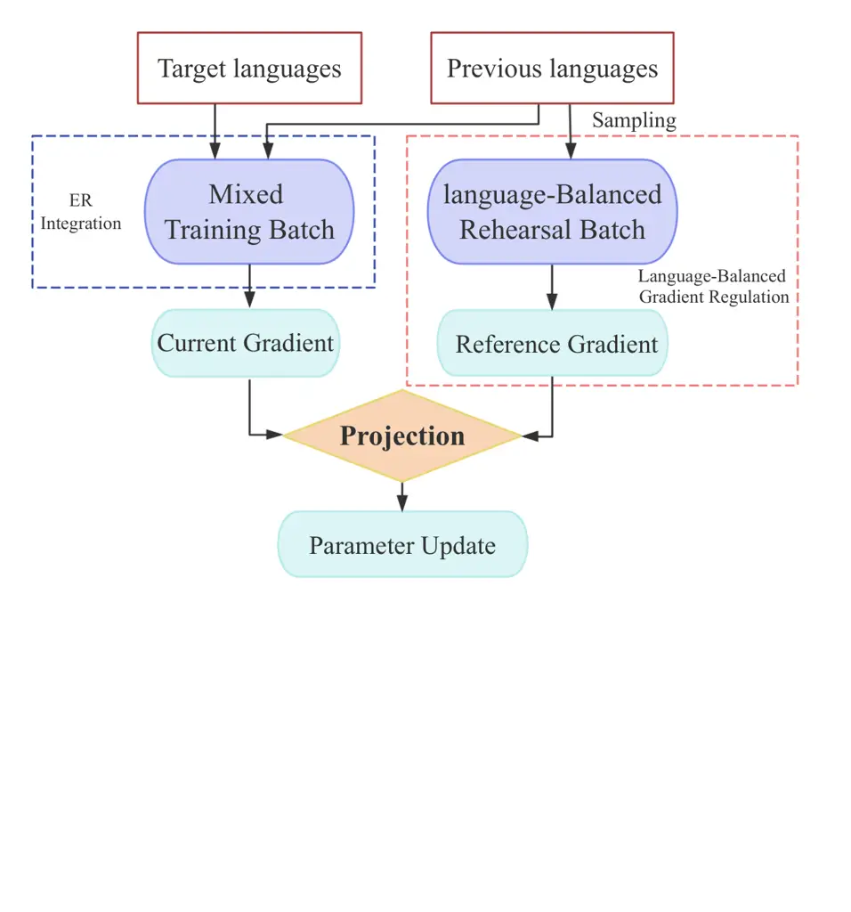
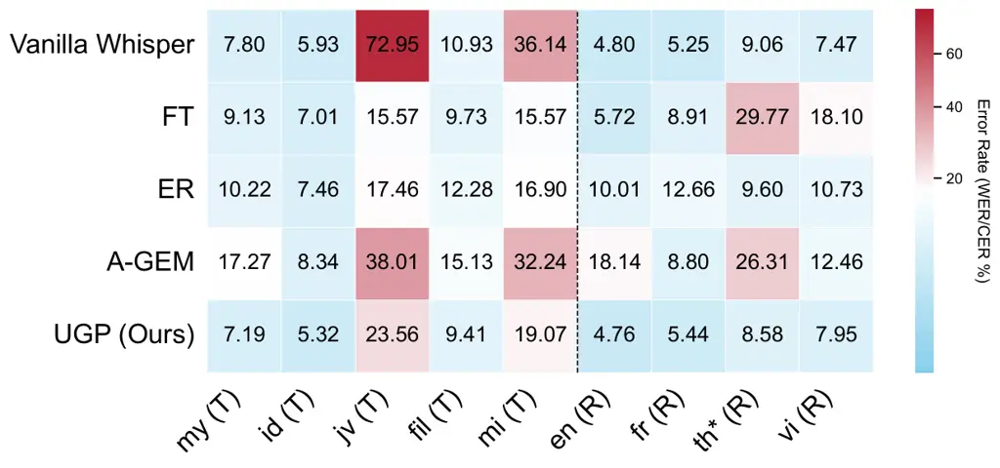
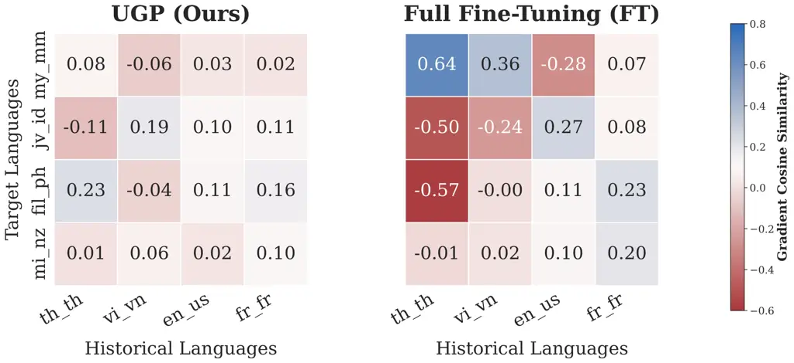

Ren Lin Ai Tan Zhang

# Unified Gradient Projection: Language-Balanced Continual Learning for Multilingual Low-Resource ASR Thanks: This work was supported by the National Natural Science Foundation of China under Grant No. 62276153.

Ziang    Guodong    Yuchen    Kaize    Wei-Qiang

###### Abstract

Large-scale pretrained ASR models such as Whisper exhibit strong
multilingual capabilities. However, fine-tuning on low-resource
languages often causes catastrophic forgetting. Although continual
learning mitigates this issue, existing methods struggle to regulate
cross-task interference in multilingual settings, where dominant
languages bias optimization. We propose Unified Gradient Projection
(UGP), which constrains parameter updates using reference gradients from
language-balanced replay in a unified projection space. By equalizing
per-language contributions in the projection, UGP reduces
dominant-language bias and improves cross-lingual stability. We further
show that combining gradient-level projection with data-level replay
yields complementary gains in stability and plasticity. Across diverse
low-resource language groups and model scales, UGP enables effective
adaptation while substantially mitigating forgetting. On
Whisper-large-v3, it achieves near-zero average forgetting.

###### keywords

Continual Learning, Multilingual ASR, Low-Resource Speech, Gradient
Projection

^(†)^(†)address: Department of Electronic Engineering, Tsinghua
University, China ^(†)^(†)email: ziangren65@gmail.com,
wqzhang@tsinghua.edu.cn

## 1 Introduction

The field of Automatic Speech Recognition (ASR) is undergoing a paradigm
shift driven by large-scale foundation models\[1, 2\]. OpenAI’s
Whisper \[3\], for example, leverages massive weakly supervised data and
a unified sequence-to-sequence architecture to achieve remarkable
cross-lingual generalization within a single model. Such scaling has
significantly narrowed performance gaps across many languages.
Nevertheless, performance on numerous low-resource languages remains
sub-optimal \[4, 5\], posing a fundamental challenge to the vision of
truly universal speech recognition.

Adapting foundation models to under-represented languages through
fine-tuning can substantially improve recognition accuracy \[6\].
However, sequential multilingual adaptation inevitably introduces the
plasticity–stability dilemma \[7\]: improving plasticity for newly
encountered languages often compromises stability on previously learned
ones. As parameters shift to accommodate new linguistic patterns,
representations essential to prior languages may be overwritten, leading
to catastrophic forgetting \[8\]. This tension becomes particularly
pronounced in large multilingual ASR models \[9\], where shared
representations must support heterogeneous phonetic and linguistic
structures.

Continual learning (CL) \[10\] offers various strategies for the
plasticity–stability trade-off, yet existing approaches remain imperfect
in large-scale multilingual ASR \[11, 12\]. Parameter-isolation methods
such as LoRA \[13\] retain plasticity but do not explicitly constrain
cross-task interference and may reduce parameter sharing across
languages \[14\]; regularization-based methods like EWC \[15, 16\]
promote stability but rely on approximate importance estimation and
incur substantial overhead at model scale. Replay-based paradigms,
particularly Experience Replay (ER) \[17\], mitigate forgetting through
data rehearsal, yet lack explicit gradient control and may struggle
under severe gradient conflicts \[12\].

Among these paradigms, gradient-based continual learning regulates
interference by constraining update directions. Methods such as
GEM \[18\] and its scalable variant A-GEM \[19\] preserve prior
knowledge by projecting gradients using reference information from
previous tasks, with A-GEM approximating multiple constraints through a
single reference gradient for improved scalability. However,
multilingual ASR inherently involves imbalanced language distributions
in both pretraining data and replay buffers. Under such heterogeneity,
reference gradient estimation can be biased toward dominant languages,
skewing update directions and resulting in uneven stability \[20\],
where low-resource tasks remain more susceptible to forgetting \[21\].
As model capacity increases, richer representations further amplify
cross-lingual gradient interactions, making balanced gradient regulation
increasingly critical.

Motivated by this observation, we propose Unified Gradient Projection
(UGP), a unified continual learning framework for multilingual ASR that
integrates language-balanced gradient regulation with ER. At the
gradient level, UGP projects parameter updates into relatively
independent subspaces, effectively decoupling cross-lingual knowledge to
mitigate inter-language interference \[20\]. At the data level, UGP
synergizes with ER, which prevents catastrophic forgetting while
simultaneously acting as joint multilingual training to promote positive
knowledge transfer for low-resource target language \[22\].

Our main contributions are summarized as follows:

1.  1.  Language-Balanced Gradient Regulation:

    We introduce a novel language-balanced gradient regulation strategy.
    By estimating a language-balanced holistic reference gradient, this
    strategy reshapes the optimization geometry toward less antagonistic
    cross-lingual gradient interactions.

2.  2.  Unified Gradient Projection (UGP):

    We propose Unified Gradient Projection (UGP), a unified framework
    that embeds Experience Replay within the language-balanced gradient
    regulation mechanism. Projection regulates destructive update
    directions at the optimization level, while ER mitigates harmful
    drift on previously learned languages and enables data-level joint
    training to encourage positive cross-lingual transfer. This
    coordinated design improves the stability–plasticity trade-off for
    low-resource multilingual adaptation.

3.  3.  Scale-Dependent & Low-Resource Analysis:

    Through systematic empirical studies from Whisper-small to large-v3,
    we reveal that larger-capacity models empower UGP to achieve
    near-zero average forgetting. Furthermore, we demonstrate UGP’s
    exceptional structural stability even under extreme data scarcity
    (down to 5 hours), suggesting its robustness under severe data
    scarcity.

## 2 Method

In this section, we present the proposed Unified Gradient Projection
(UGP), a unified continual learning framework for multilingual ASR that
integrates gradient-level interference regulation with data-level
replay.

### 2.1 Foundational Fine-tuning Overview

To maintain the pre-trained feature extraction capability of the model,
we adopt a foundational fine-tuning strategy for medium and large
models, where the encoder is frozen and only the decoder and embeddings
are updated. For Whisper-small, full-parameter fine-tuning is applied to
avoid capacity under-utilization.

### 2.2 Gradient-Level Language-Balanced Projection

Catastrophic forgetting arises from conflicting gradients between the
current target language and previously learned languages. To address
this, UGP performs gradient-level interference regulation through a
single, dynamically constructed reference gradient.

Let $`g_{\text{cur}}`$ denote the gradient of the current training
batch, and $`g_{\text{ref}}`$ denote a reference gradient computed from
a language-balanced mixture of replay samples representing past
knowledge. Compared with A-GEM, which approximates constraints from
randomly sampled historical data, this balanced reference ensures that
each language contributes equally when estimating $`g_{\text{ref}}`$,
mitigating dominant-language bias. To construct a language-balanced
reference gradient, UGP uniformly samples the same number of replay
samples from each historical language at every training step. Formally,
assume the replay buffer contains $`K`$ languages with sample sets
$`B_{1},B_{2},\dots,B_{K}`$. For each language $`i`$, we draw $`n`$
samples uniformly at random:

```math
\tilde{B}_{i}\sim\text{UniformSample}(B_{i},n),\quad i=1,\dots,K. \tag{1}
```

The reference gradient is then computed as:

```math
g_{\text{ref}}=\frac{1}{Kn}\sum_{i=1}^{K}\sum_{x\in\tilde{B}_{i}}\nabla_{\theta}\mathcal{L}(x). \tag{2}
```

Interference is detected by the inner product
$`\langle g_{\text{cur}},g_{\text{ref}}\rangle`$. If the gradients
conflict (i.e., the angle is obtuse), the current gradient is projected
onto the orthogonal complement of $`g_{\text{ref}}`$:

```math
g_{\text{final}}=\begin{cases}g_{\text{cur}}&\text{if }\langle g_{\text{cur}},g_{\text{ref}}\rangle\geq 0,\\[8.0pt]
g_{\text{cur}}-\dfrac{\langle g_{\text{cur}},g_{\text{ref}}\rangle}{\|g_{\text{ref}}\|^{2}+\epsilon}\cdot g_{\text{ref}}&\text{if }\langle g_{\text{cur}},g_{\text{ref}}\rangle<0,\end{cases} \tag{3}
```

where $`\epsilon`$ is a small constant for numerical stability.



Figure 1: Workflow of the proposed Unified Gradient Projection (UGP),
highlighting the dynamic holistic constraint.

### 2.3 Integration with Experience Replay

UGP is designed to integrate seamlessly with data-level ER. For each
update, a mixed batch is constructed by uniformly sampling historical
data from all languages in the replay buffer, ensuring balanced coverage
across tasks. ER provides data-driven representation correction via
standard loss optimization, while gradient-level language-balanced
projection regulates gradient directions to mitigate cross-task
interference.

From an optimization perspective, this combined mechanism can be
interpreted as a two-level regulation process. ER modifies the empirical
training objective by augmenting the current-language loss with replayed
samples, yielding a mixed objective:

```math
\mathcal{L}_{\text{total}}=\mathcal{L}_{\text{cur}}+\lambda\mathcal{L}_{\text{replay}}, \tag{4}
```

where $`\lambda`$ controls the relative contribution of historical data.
In our setting, $`\lambda=1`$. This objective-level mixing anchors
parameter updates to previously learned tasks.

Gradient-Level Language-Balanced Projection further regulates the
resulting gradients by removing components that conflict with balanced
historical knowledge. Consequently, ER shapes the optimization landscape
through data rehearsal, while Gradient-Level Language-Balanced
Projection governs the trajectory taken within that landscape.

Together, these two mechanisms form the complete Unified Gradient
Projection (UGP) framework, which:

- •
  Reduces catastrophic forgetting by preserving historical knowledge.
- •
  Encourages positive transfer across languages by promoting
  optimization directions beneficial to multiple tasks.
- •
  Maintains strong adaptation to the current target language without
  diluting gradients or requiring additional memory overhead.

|                 | whisper-small |       |                     |                     | whisper-medium |       |                     |                     | whisper-large-v3 |       |                     |                     |
| --------------- | ------------- | ----- | ------------------- | ------------------- | -------------- | ----- | ------------------- | ------------------- | ---------------- | ----- | ------------------- | ------------------- |
| Method          | TWER          | RWER  | AWER $`\downarrow`$ | FWER $`\downarrow`$ | TWER           | RWER  | AWER $`\downarrow`$ | FWER $`\downarrow`$ | TWER             | RWER  | AWER $`\downarrow`$ | FWER $`\downarrow`$ |
| Vanilla Whisper | 46.11         | 16.42 | 31.26               | –                   | 46.76          | 10.50 | 28.63               | –                   | 26.75            | 6.65  | 16.70               | –                   |
| FT              | 20.80         | 70.83 | 45.82               | 54.42               | 18.61          | 99.80 | 59.20               | 89.80               | 11.40            | 15.63 | 13.51               | 8.98                |
| Standard ER     | 22.62         | 36.14 | 29.38               | 19.72               | 17.06          | 18.82 | 17.94               | 8.82                | 12.86            | 10.75 | 11.81               | 4.11                |
| Standard A-GEM  | 23.70         | 73.56 | 48.63               | 57.14               | 15.86          | 25.51 | 20.68               | 15.51               | 22.20            | 16.43 | 19.32               | 9.78                |
| UGP (Ours)      | 23.26         | 28.36 | 25.81               | 11.94               | 16.50          | 21.05 | 18.78               | 10.05               | 12.91            | 6.68  | 9.80                | 0.04                |

Table 1: We report WER on the target languages (TWER), previous
languages (RWER), average (AWER), and the degree of catastrophic
forgetting (FWER) across three Whisper scales on the Southeast Asian
core set. Target: Malay (10.47h), Indonesian (10.24h), Filipino (9.68h),
Javanese (11.33h), Māori (20.48h). Replay: Thai (2h), Vietnamese (2h),
English (2h), French (2h).

## 3 Experiments

To evaluate our continual learning strategies, we conducted experiments
across three model scales: Whisper-small (244M), medium (769M), and
large-v3 (1550M).

### 3.1 Datasets and Scenarios

To comprehensively assess scalability and robustness, we designed two
distinct experimental scenarios primarily utilizing the FLEURS dataset
\[23\].

Core Evaluation Set: For the main cross-scale evaluation (Small to
Large-v3), we constructed a highly interfering set comprising five
target languages (Malay, Indonesian, Filipino, Javanese, Māori) and four
previous languages (Thai, Vietnamese, English, French).

Extended & Data Scaling Set: To further validate generalizability and
investigate the impact of extreme data scarcity, we introduced an
extended language set evaluated on the Whisper-small model. The target
group consists of Swahili, Persian, and Arabic, representing distinct
language families, while the previous group includes English, French,
and Russian. Furthermore, to conduct a rigorous data-scaling analysis,
we mixed the FLEURS and CommonVoice\[24\] datasets to create precisely
controlled subsets of 50h, 30h, 10h, and 5h per language.

### 3.2 Evaluation Metrics

We evaluate the performance using Word Error Rate (WER), noting that
Character Error Rate (CER) is reported for Thai due to its lack of word
boundaries. We report four key metrics. Target WER (TWER) and Retention
WER (RWER) denote the average WER across the target and rehearsal
languages, reflecting the model’s plasticity and stability. Average WER
(AWER) represents the group-balanced overall performance between target
and rehearsal languages, defined as:

```math
\mathrm{AWER}=\frac{1}{2}(\mathrm{TWER}+\mathrm{RWER}). \tag{5}
```

To precisely quantify catastrophic forgetting on previous languages
$`\mathcal{L}_{\text{prev}}`$, we use Forgetting WER (FWER) \[12\],
formulated as:

```math
\text{FWER}=\frac{1}{|\mathcal{L}_{\text{prev}}|}\sum_{l\in\mathcal{L}_{\text{prev}}}(\text{WER}_{l}^{\text{end}}-\text{WER}_{l}^{\text{min}}) \tag{6}
```

where $`\text{WER}_{l}^{\text{end}}`$ is the final WER after all
training, and $`\text{WER}_{l}^{\text{min}}`$ is the historical best WER
for language $`l`$.

### 3.3 Baselines

We compare our proposed UGP and its variant without Experience Replay
(UGP w/o ER) against four established baselines: Vanilla Whisper,
Vanilla FT (full-parameter fine-tuning on target languages only),
Standard ER, and Standard A-GEM.

### 3.4 Implementation Details

Models were trained on NVIDIA A40 GPUs using the AdamW optimizer \[25\]
with early stopping (patience=3), applied uniformly across all
data-scaling subsets to evaluate the genuine forgetting rate at optimal
plasticity. The encoder was frozen for medium and large-v3 models;
full-parameter fine-tuning was applied to the small model to avoid
capacity under-utilization. For UGP, $`n{=}4`$ utterances are drawn per
historical language per step, with each per-language reference pool
capped at 2,000 utterances; the ER buffer contains 2,000 utterances
distributed uniformly across prior languages. Data was doubled via
waveform augmentation, and SpecAugment \[26\] was applied to all target
samples.

## 4 Results

|                |          |        |          |        |          |       |         |       |
| -------------- | -------- | ------ | -------- | ------ | -------- | ----- | ------- | ----- |
|                | 50 Hours |        | 30 Hours |        | 10 Hours |       | 5 Hours |       |
| Method         | AWER     | FWER   | AWER     | FWER   | AWER     | FWER  | AWER    | FWER  |
| Full FT        | 79.59    | 112.11 | 83.59    | 112.39 | 60.96    | 63.86 | 50.24   | 35.47 |
| Standard ER    | 34.12    | 27.88  | 36.69    | 20.75  | 41.39    | 14.07 | 45.11   | 10.73 |
| Standard A-GEM | 36.54    | 27.43  | 38.91    | 22.41  | 41.50    | 15.15 | 44.49   | 12.70 |
| UGP (wo ER)    | 35.93    | 26.32  | 38.70    | 20.02  | 35.73    | 12.76 | 37.89   | 11.28 |
| UGP(ours)      | 31.47    | 15.62  | 35.66    | 12.09  | 38.48    | 9.22  | 43.40   | 8.17  |

Table 2: Data-scaling (50h to 5h) and language extension evaluation on
low-resource targets (Swahili, Persian, Arabic) against replay languages
(English, French, Russian) using Whisper-small. Evaluated on the Common
Voice testset, reporting Average WER (AWER) and Forgetting WER (FWER).

### 4.1 Overall Performance Across Scales

As shown in Table 1, UGP achieves a strong stability–plasticity
trade-off across scales, obtaining the best overall results on
Whisper-small and Whisper-large-v3 while remaining competitive on
Whisper-medium.

Specifically, standard full-parameter fine-tuning (FT) suffers from
severe catastrophic forgetting, reaching an FWER of 89.80% on the medium
model. Standard ER offers limited mitigation, and while Standard A-GEM
protects past knowledge, it severely limits target language plasticity
and inflates the TWER. UGP successfully overcomes this trade-off across
all scales. Notably, its advantage increases with model capacity. On
Whisper-large-v3, UGP exploits the model’s vast representational
flexibility to achieve near-zero average forgetting with an FWER of just
0.04%. Simultaneously, it maintains highly competitive target plasticity
with a TWER of 12.91%, yielding an exceptional overall AWER of 9.80%.



Figure 2: Per-language Word Error Rate (%) comparison of different
methods on Whisper-large-v3. Target newly-learned languages and
previously learned languages are denoted by (T) and (R), respectively.
The asterisk (\*) indicates that CER is reported for Thai (th).

This optimal equilibrium is clearly visualized in the Whisper-large-v3
per-language heatmap in Figure 2. Unlike standard FT, which causes
catastrophic degradation in historical tasks—highlighted by sharp error
spikes like the prominent red region for Thai—UGP effectively alleviates
this interference. It preserves baseline performance across all
historical languages while significantly reducing error rates on target
languages. This demonstrates UGP’s ability to safely adapt foundation
models to new domains without overriding critical historical
representations.

### 4.2 Ablation Study

|                                   |          |          |
| --------------------------------- | -------- | -------- |
| Configuration                     | TWER (%) | FWER (%) |
| Vanilla FT                        | 13.48    | 13.79    |
| FT + Augment + Freeze Enc. (Base) | 19.04    | 2.77     |
| Base + Standard ER                | 12.86    | 4.11     |
| Base + Standard A-GEM             | 22.20    | 9.78     |
| Base + Unified Proj. (w/o ER)     | 15.80    | 4.20     |
| Base + Unified Proj. + ER (UGP)   | 12.91    | 0.04     |

Table 3: Ablation study on Whisper-large-v3.

Table 3 details our component-wise ablation study on Whisper-large-v3.
Compared with vanilla fine-tuning in this ablation setting, the baseline
with a frozen encoder and data augmentation reduces forgetting but
limits target plasticity. Integrating ER restores this plasticity
because the replay mechanism increases the total training data volume
and drives positive cross-lingual transfer through multilingual joint
training\[22\]. However, its unconstrained optimization slightly
increases forgetting. Meanwhile, standard A-GEM preserves past knowledge
but severely stifles target adaptation. Replacing it with our unified
projection resolves this bottleneck, suggesting that a holistic,
language-balanced reference gradient generalizes far better. Ultimately,
the complete UGP framework synergizes these approaches. It maintains
strong target plasticity while achieving a near-zero forgetting rate of
0.04%, demonstrating that data-level representation alignment and
gradient-level interference correction are highly complementary.

### 4.3 Mechanism Analysis: Gradient Decoupling and Orthogonalization



Figure 3: Pairwise gradient cosine similarity between a representative
subset of target and historical languages during the adaptation of
Whisper-large-v3. Our proposed UGP (left) stabilizes the analyzed
updates near orthogonality, while standard Full Fine-Tuning (right)
exhibits stronger gradient conflicts in this subset.

To examine how UGP affects the learned parameter geometry, we analyze
the fully trained Whisper-large-v3 models obtained via UGP and standard
Full Fine-Tuning (FT). After convergence, we compute pairwise gradient
cosine similarities between a representative subset of target and
historical languages. As illustrated in Figure 3, the FT-trained model
exhibits persistent negative cosine values in this subset, indicating
that its converged parameter configuration remains prone to
cross-lingual gradient conflicts. In contrast, the UGP-trained model
yields gradient interactions concentrated near orthogonality.

This suggests that UGP does not merely constrain individual updates
during training; rather, it shapes the optimization landscape toward a
parameter state in which language-specific gradients are structurally
less antagonistic, thereby reducing destructive interference at
convergence.

### 4.4 Language Extension and Extreme Data Scaling

Due to computational constraints, data-scaling analyses (50h to 5h) were
evaluated on Whisper-small. While UGP ensures robust knowledge
preservation under extreme scarcity, Table 2 reveals that increasing
data volume significantly boosts ER’s positive transfer to target
languages. Crucially, UGP effectively inherits this amplified plasticity
while suppressing the severe catastrophic forgetting seen in Full FT.
Consequently, UGP consistently minimizes catastrophic forgetting across
all data regimes, yielding robust overall performance (AWER) even under
extreme data scarcity.

## 5 Conclusion

To mitigate catastrophic forgetting in multilingual ASR, we propose
Unified Gradient Projection (UGP). By combining language-balanced
projection with Experience Replay, UGP orthogonalizes conflicting
updates to achieve near-zero forgetting on Whisper-large-v3, providing
an efficient solution for universal speech recognition.

## 6 Generative AI Use Disclosure

Generative AI tools were used only to assist with language polishing and
to support the analysis and interpretation of related materials. All
research ideas, experimental design, implementation, experiments, data
analysis, results, and conclusions were independently completed and
verified by the authors.

## References

- \[1\] S.-W. Yang, H.-J. Chang, Z. Huang, A. T. Liu, C. Lai, H. Wu, J.
  Shi, X. Chang, H.-S. Tsai, W.-C. Huang, T.-H. Feng, P.-H. Chi, Y. Y.
  Lin, Y.-S. Chuang, T.-H. Huang, W.-C. Tseng, K. Lakhotia, S.-W. Li, A.
  Mohamed, S. Watanabe, and H.-Y. Lee (2024) A large-scale evaluation of
  speech foundation models. IEEE/ACM Trans. Audio, Speech, Lang.
  Process. 32, pp. 2884–2899. Cited by: §1.
- \[2\] A. Babu, C. Wang, A. Tjandra, K. Lakhotia, Q. Xu, N. Goyal, K.
  Singh, P. von Platen, Y. Saraf, J. Pino, A. Baevski, A. Conneau,
  and M. Auli (2021) XLS-r: self-supervised cross-lingual speech
  representation learning at scale. External Links: 2111.09296,
  [Link](https://arxiv.org/abs/2111.09296) Cited by: §1.
- \[3\] A. Radford, J. W. Kim, T. Xu, G. Brockman, C. McLeavey, and I.
  Sutskever (2023) Robust speech recognition via large-scale weak
  supervision. In Proc. Int. Conf. Mach. Learn. (ICML), pp. 28492–28518.
  Cited by: §1.
- \[4\] R. S. A. Pratama and A. Amrullah (2024) Analysis of Whisper
  automatic speech recognition performance on low-resource languages.
  J. Pilar Nusa Mandiri 20 (1), pp. 1–8. Cited by: §1.
- \[5\] Y. Liu, X. Yang, and D. Qu (2024) Exploration of Whisper
  fine-tuning strategies for low-resource ASR. EURASIP J. Audio, Speech,
  Music Process. 2024 (1), pp. 29. Cited by: §1.
- \[6\] J. Zhao and W.-Q. Zhang (2022) Improving automatic speech
  recognition performance for low-resource languages with
  self-supervised models. IEEE J. Sel. Top. Signal Process. 16 (6),
  pp. 1227–1241. Cited by: §1.
- \[7\] M. Mermillod, A. Bugaiska, and P. Bonin (2013) The
  stability-plasticity dilemma: investigating the continuum from
  catastrophic forgetting to age-limited learning effects. Front.
  Psychol. 4, pp. 504. Cited by: §1.
- \[8\] R. M. French (1999) Catastrophic forgetting in connectionist
  networks. Trends Cogn. Sci. 3 (4), pp. 128–135. Cited by: §1.
- \[9\] B. Li, R. Pang, Y. Zhang, T. N. Sainath, T. Strohman, P.
  Haghani, M. Prasad, et al. (2022) Massively multilingual asr: a
  lifelong learning solution. In 2022 IEEE International Conference on
  Acoustics, Speech and Signal Processing (ICASSP), pp. 6397–6401. Cited
  by: §1.
- \[10\] G. I. Parisi, R. Kemker, J. L. Part, C. Kanan, and S.
  Wermter (2019) Continual lifelong learning with neural networks: a
  review. Neural Netw. 113, pp. 54–71. Cited by: §1.
- \[11\] S. V. Eeckt and H. V. Hamme (2023) Using adapters to overcome
  catastrophic forgetting in end-to-end automatic speech recognition. In
  Proc. IEEE Int. Conf. Acoust., Speech, Signal Process. (ICASSP),
  pp. 1–5. Cited by: §1.
- \[12\] L. D. Libera, P. Mousavi, S. Zaiem, C. Subakan, and M.
  Ravanelli (2024) CL-MASR: a continual learning benchmark for
  multilingual ASR. IEEE/ACM Trans. Audio, Speech, Lang. Process.. Cited
  by: §1, §3.2.
- \[13\] E. J. Hu, Y. Shen, P. Wallis, Z. Allen-Zhu, Y. Li, S. Wang, L.
  Wang, and W. Chen (2022) LoRA: low-rank adaptation of large language
  models. In Proc. Int. Conf. Learn. Represent. (ICLR), Cited by: §1.
- \[14\] H. Ban and K. Ji (2025) Rethinking parameter sharing for llm
  fine-tuning with multiple loras. External Links: 2509.25414,
  [Link](https://arxiv.org/abs/2509.25414) Cited by: §1.
- \[15\] J. Kirkpatrick et al. (2017) Overcoming catastrophic forgetting
  in neural networks. Proc. Natl. Acad. Sci. U.S.A. 114 (13),
  pp. 3521–3526. Cited by: §1.
- \[16\] M. Qian, S. Tang, R. Ma, K. M. Knill, and M. J. Gales (2024)
  Learn and don’t forget: adding a new language to asr foundation
  models. arXiv preprint arXiv:2407.06800. Cited by: §1.
- \[17\] D. Rolnick, A. Ahuja, J. Schwarz, T. Lillicrap, and G.
  Wayne (2019) Experience replay for continual learning. In Adv. Neural
  Inf. Process. Syst. (NeurIPS), Vol. 32. Cited by: §1.
- \[18\] D. Lopez-Paz and M. Ranzato (2017) Gradient episodic memory for
  continual learning. In Advances in Neural Information Processing
  Systems, Vol. 30, pp. 169–179. Cited by: §1.
- \[19\] A. Chaudhry, M. Ranzato, M. Rohrbach, and M. Elhoseiny (2018)
  Efficient lifelong learning with A-GEM. arXiv:1812.00420. Cited by:
  §1.
- \[20\] T. Yu, S. Kumar, A. Gupta, S. Levine, K. Hausman, and C.
  Finn (2020) Gradient surgery for multi-task learning. In Advances in
  Neural Information Processing Systems, Vol. 33, pp. 5824–5836. Cited
  by: §1, §1.
- \[21\] Z. Zhang, J. Shen, C. Cao, G. Dai, S. Zhou, Q. Zhang, S. Zhang,
  and E. Shutova (2024) Proactive gradient conflict mitigation in
  multi-task learning: a sparse training perspective. External Links:
  2411.18615, [Link](https://arxiv.org/abs/2411.18615) Cited by: §1.
- \[22\] T. Pekarek Rosin and S. Wermter (2023) Replay to remember:
  continual layer-specific fine-tuning for german speech recognition. In
  International Conference on Artificial Neural Networks, ICANN 2023,
  Cham, pp. 489–500. External Links:
  [Document](https://dx.doi.org/10.1007/978-3-031-44226-1%5F40) Cited
  by: §1, §4.2.
- \[23\] A. Conneau, M. Ma, S. Khanuja, Y. Zhang, V. Axelrod, S.
  Dalmia, J. Riesa, C. Rivera, and A. Bapna (2023) FLEURS: few-shot
  learning evaluation of universal representations of speech. In Proc.
  IEEE Spoken Lang. Technol. Workshop (SLT), pp. 798–805. Cited by:
  §3.1.
- \[24\] R. Ardila, M. Branson, K. Davis, M. Henretty, M. Kohler, J.
  Meyer, R. Morais, L. Saunders, F. M. Tyers, and G. Weber (2020) Common
  voice: a massively-multilingual speech corpus. In Proceedings of the
  12th Conference on Language Resources and Evaluation (LREC 2020),
  pp. 4211–4215. Cited by: §3.1.
- \[25\] I. Loshchilov and F. Hutter (2017) Decoupled weight decay
  regularization. arXiv:1711.05101. Cited by: §3.4.
- \[26\] D. S. Park, W. Chan, Y. Zhang, C.-C. Chiu, B. Zoph, E. D.
  Cubuk, and Q. V. Le (2019) SpecAugment: a simple data augmentation
  method for automatic speech recognition. In Proc. INTERSPEECH,
  pp. 2613–2617. Cited by: §3.4.
