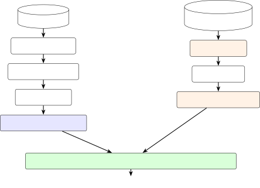

# Route Based Map Matching via a Structured Codebook and Token Sequence Decoding

Journal: Transportation Research Part C (preprint)

Takara Sakai Email: <sakai.t.dcad@m.isct.ac.jp> Corresponding
author: Corresponding author. Affiliation: Department of Civil and
Environmental Engineering,  
Institute of Science Tokyo, 2-12-1 W6-9, Ookayama, Meguro, Tokyo,
152-8550, Japan    Hiroyuki Hasada Affiliation: Institute of Industrial
Science,  
The University of Tokyo, Komaba 4-6-1, Meguro-ku, Tokyo, 153-8505, Japan

###### Abstract

This study proposes an efficient and computationally light route based
map matching method for GPS track data on urban expressway networks. The
key idea is to exploit a symbolic structure of named lines and named
junctions that link level map matching leaves unused. We represent each
candidate route as a sequence of line and junction names, take the set
of such sequences as a route codebook, and formulate map matching as
scored alignment of a probe trajectory against members of the codebook.
Probes become token sequences via a mesh quantizer, a precomputed grid
mapping each coordinate to a line or junction token, and the decoder
returns a member of the codebook by construction. The codebook is
indexed by a DAFSA $`\times`$ Levenshtein automaton, a fuzzy lookup
technique from approximate string matching and speech recognition; the
per query decoding cost is orders of magnitude lower than a brute force
scan. We evaluate the method on a deformed replica of the Tokyo
Metropolitan Expressway topology. The method recovers the exact route at
moderate GPS noise and continues to identify the line and junction
sequence under heavy noise; a sensitivity analysis maps the mesh
resolution operating range. Real probe evaluation, channel model
calibration, and a head to head HMM comparison are left to a forthcoming
version.

###### Keywords: 

map matching , urban expressway , route codebook , token sequence
decoding , mesh quantizer , DAFSA , Levenshtein automaton , probe data ,
Tokyo Metropolitan Expressway

## 1 Introduction

Map matching, the problem of associating a noisy GPS trajectory with a
path on a road network, has been dominated for over a decade by per
link, per observation decoding: each observation is matched to the most
likely link, and the link sequence is recovered by Viterbi decoding
(Newson and Krumm, 2009). The broader landscape is surveyed by Quddus et
al. (2007), and speed oriented descendants such as fmm (Yang and
Gidófalvi, 2018) amortize the Viterbi cost while keeping the per link
decoding granularity.

However, on urban expressway networks per link decoding faces two
structural difficulties. First, a single misidentification at a junction
propagates into a wrong route for the remainder of the trajectory, since
the choice of branch determines all downstream links. Second, main
lines, branching ramps, and elevated decks of a ring road and a radial
route sit within a few metres of each other on a multilayer structure,
so GPS noise easily renders alternative links indistinguishable.

To address both difficulties, this paper shifts the unit of map matching
from links to routes. The decoding decision is then made globally over a
precomputed set of valid routes, rather than locally at each
observation, which prevents an early junction error from propagating
downstream. By construction the decoder returns a route that exists in
the candidate set; a per link decoder makes independent per observation
decisions and can produce a link sequence that corresponds to no valid
route. This reformulation rests on a symbolic structure that general
road networks lack: every segment of an urban expressway belongs to a
named line, and every junction and interchange has a proper name. A
driver describes a trip as “took C1 inbound, transferred at
Hamazakibashi JCT to Route 3, exited at Shibuya”, not as a list of link
IDs.

A finite vocabulary $`\mathcal{T}`$ collects line, junction, and
interchange tokens from each link, and a candidate route maps to the
token sequence its links carry, with consecutive duplicates contracted.
The set of these sequences is the route _codebook_ $`\mathcal{C}`$. A
probe trajectory becomes an observation token sequence via a mesh
quantizer: the network is rasterized once into a grid in which each cell
carries the line or junction token it covers, and each probe point is
mapped to its token by integer division and table lookup, with no per
query link distance computation at inference time. Decoding is the
scored alignment of the observation against members of $`\mathcal{C}`$.
Figure 1 shows the processing flow.



Figure 1: Processing flow. The route side becomes a codebook of token
sequences; the probe side becomes an observation sequence via mesh
lookup; the decoder returns the best aligned codebook member.

For the search to scale, we index the codebook with finite state
automata. A prefix sharing trie (Fredkin, 1960) and the deterministic
acyclic finite state automaton (DAFSA) of Daciuk et al. (2000) represent
the codebook compactly through prefix and suffix sharing, and the
product of the DAFSA with the weighted Levenshtein automaton of Schulz
and Mihov (2002) casts bounded edit fuzzy lookup as a shortest path
search on the product automaton. The same product construction is a
standard tool in approximate string matching and is the dictionary
backbone of weighted finite state transducer (WFST) decoders in speech
recognition (Mohri et al., 2002). On the route codebook the index lowers
the per query decoding cost by orders of magnitude relative to a brute
force scan, while symbolic trajectory work such as SAX (Lin et al., 2007) operates at different granularities (time series) and does not
target network level route identity.

The contributions of this paper are the following two.

1.  1.  We cast urban expressway map matching as scored alignment over a
        route codebook whose vocabulary consists of line and junction names,
        with a mesh quantizer that maps each probe coordinate to a line or
        junction token by table lookup, replacing per point link distance
        computation.
2.  2.  We compare prefix sharing and minimal automaton indices for the
        codebook and combine the latter with a Levenshtein automaton for
        fuzzy decoding; the combined index lowers the per query decoding
        cost by orders of magnitude relative to a brute force scan.

This version focuses on the methodological formulation and a controlled
synthetic validation. The evaluation uses a toy network data set: a
topological replica of the Tokyo Metropolitan Expressway (760 links, 695
nodes, 15 named lines, 24 junctions, 102 interchanges) with deliberately
deformed node coordinates, and synthetic probe trajectories generated
from ground truth routes with an additive Gaussian noise model.
Validation on real probe data, channel model calibration, and a head to
head comparison with an HMM baseline are reserved for the journal
version. The remainder of the paper is organized as follows: Section 2
presents the methodology, Section 3 describes the experimental setup,
Section 4 reports results across three experiments (noise robustness,
mesh resolution sensitivity, and indexing structure efficiency), and
Section 5 concludes.

## 2 Methodology

The methodology follows the processing flow of Figure 1. The route side
(Section 2.1) turns candidate routes into token sequences over a line
name alphabet and forms the codebook $`\mathcal{C}`$. The probe side
(Section 2.5 and Section 2.3) turns each probe trajectory into an
observation token sequence via a mesh quantizer, without per query link
distance computation at inference time. The decoder (Section 2.2)
returns the member of $`\mathcal{C}`$ with the highest alignment score.
Section 2.4 discusses pairwise separation in $`\mathcal{C}`$ and the
conditions under which $`\Phi`$-collisions can occur, and Section 2.6
develops the index structures on which decoding is executed.

We illustrate the three stages on a small synthetic \#-shaped network
running throughout this section. The network has two horizontal lines
(H1, H2) and two vertical lines (V1, V2) crossing at four named
junctions JCT_A--D, with eight named interchanges at the line tips
(Figure 2(a)). On this network we trace a single route from IC_W1
through JCT_A and JCT_C to IC_S1: Figure 2(b) shows the mesh quantizer
applied to a noisy probe sequence sampled along this route, and
Figure 2(c) shows the decoded route overlaid on the same probes.

(a) Network.

(b) Mesh quantizer with noisy probes.

(c) Decoded route on top of the probes.

Figure 2: The \#-shaped running example. Two horizontal lines (H1, H2)
and two vertical lines (V1, V2) cross at four named junctions JCT_A--D,
with eight named interchanges at the tips (squares: JCT, circles: IC).
Panel (b) shows the mesh quantizer applied to a noisy probe sequence
along the route IC_W1 $`\to`$ JCT_A $`\to`$ JCT_C $`\to`$ IC_S1; panel
(c) shows the decoded route, recovered as the codeword \[IN@W1, LINE_H1,
JCT_A, LINE_V1, OUT@S1\].

### 2.1 Routes as codewords: a line name language

Each link of an urban expressway network carries structural semantic
labels: a line name, a junction name, and the name of the interchange
where it enters or exits the expressway. From these labels we construct
a finite vocabulary $`\mathcal{T}`$ organized in four categories: entry
tokens IN@\*, exit tokens OUT@\*, line tokens LINE\_\*, and junction
tokens JCT\_\*. A candidate route $`R=(\ell_{1},\dots,\ell_{m})`$ is
mapped to a token sequence by the normalization

```math
\displaystyle\Phi(R)=\mathrm{canonicalize}\bigl(\lambda(\ell_{1}),\dots,\lambda(\ell_{m})\bigr)\in\mathcal{T}^{*}, \tag{1}
```

which concatenates the structural label of each link and contracts
consecutive duplicates. On the \#-shaped running example, the route
IC_W1 $`\to`$ JCT_A $`\to`$ JCT_C $`\to`$ IC_S1 of Figure 2(c) produces
the codeword \[IN@W1, LINE_H1, JCT_A, LINE_V1, OUT@S1\].

The labelling carries junction identity at the node level rather than
the link level: a node whose name ends with JCT marks the junction it
belongs to, and $`\lambda`$ emits a JCT\_\<name\> token on any link with
such a node as an endpoint. Two physically distinct traversals of the
same ring (for example clockwise versus counter clockwise on C1, or two
passes of the C1 mainline that visit different junctions) then yield
distinct codewords through their interior junction sequences, even
though the line token alone would be the same. Decoding operates
entirely in this token space; the decoder consumes no link level
geometric information.

### 2.2 Scored alignment over the route codebook

The image of the candidate route set $`\mathcal{R}`$ under the
normalization $`\Phi:\mathcal{R}\to\mathcal{T}^{*}`$ is the route
codebook

```math
\displaystyle\mathcal{C}:=\{\Phi(R)\mid R\in\mathcal{R}\}\subset\mathcal{T}^{*}. \tag{2}
```

We refer to elements of $`\mathcal{C}`$ as “codewords” and to
$`\mathcal{T}`$ as the “alphabet”; the vocabulary is borrowed for
organizational convenience and not a claim that $`\mathcal{C}`$ is a
designed error correcting code. The map $`\Phi`$ is in general not
injective: distinct routes can collapse to the same token sequence, and
the decoder then returns an equivalence class of routes rather than a
single one. The frequency of such collisions is an empirical property of
the network and the labelling; it is zero by construction on the toy
network used here, and Section 2.4 examines the conditions under which
it can be non-zero.

Let $`\bm{o}\in\mathcal{T}^{*}`$ denote the observation token sequence
obtained from a probe trajectory by the mesh quantizer of Section 2.5.
For each $`\bm{c}\in\mathcal{C}`$, we compute an alignment score
$`S(\bm{o},\bm{c})`$ by dynamic programming with match, observation
skip, and route skip operations (Section 2.3). The decoded route is

```math
\displaystyle\hat{R}(\bm{o}):=\Phi^{-1}\!\left(\arg\max_{\bm{c}\in\mathcal{C}}S(\bm{o},\bm{c})\right), \tag{3}
```

which, by construction, is a member of $`\mathcal{R}`$. A per link
decoder that makes independent decisions at each observation time does
not have this property; its output can correspond to no member of
$`\mathcal{R}`$. A direct empirical comparison with such a decoder is
left to the journal version.

### 2.3 Token level noisy channel model

The proposed decoder operates entirely in token space and performs no
per query link distance computation at inference time. A probe
trajectory is treated as a noisy received word, and decoding is
performed by dynamic programming alignment under the token confusion
matrix.

For each point of a probe trajectory, the mesh cell containing the point
determines a token (a line, junction, or interchange label), and the per
cell sequence is contracted by run length encoding on the dominant token
to produce an observation token sequence $`\bm{o}=(o_{1},\dots,o_{n})`$.
The mesh is rasterized once offline from the network’s link geometry; at
inference time the line assignment consists of the integer division that
locates the cell and a single table lookup, with no per query link
distance computation. The observation sequence contains all token
categories that the mesh can attest spatially: IN@\*, LINE\_\*, JCT\_\*,
and OUT@\*.

The confusion probability $`P(o\mid t)`$, the probability of observing
token $`o`$ when the true token is $`t`$, is defined from the
topological adjacency of lines:

```math
\displaystyle P(o\mid t)\propto\exp\!\left(-\frac{d_{\mathrm{topo}}(o,t)^{2}}{2\sigma_{\mathrm{conf}}^{2}}\right), \tag{4}
```

where $`d_{\mathrm{topo}}(o,t)`$ is the hop distance between the lines
of tokens $`o`$ and $`t`$ on the line adjacency graph, and
$`\sigma_{\mathrm{conf}}`$ is a sharpness parameter. The confusion
matrix depends only on graph adjacency, not on coordinate information.
Tokens on the same line have distance zero; tokens on adjacent lines
have small distance; distant lines have large distance. We caution that
this $`P(o\mid t)`$ is not a calibrated physical observation model
derived from a noise process; it should be read as a token space
smoothing kernel that softens the alignment score around adjacent lines
and is a parameter of the decoder, set by hand here and learnable from
data in future work.

The alignment score of a route token sequence
$`\Phi(R)=(r_{1},\dots,r_{m})`$ and an observation token sequence
$`\bm{o}=(o_{1},\dots,o_{n})`$ is computed by dynamic programming with
three operations.

- •
  Match: when observation $`o_{i}`$ is matched to route token $`r_{j}`$,
  the score is incremented by $`\log P(o_{i}\mid r_{j})`$.
- •
  Observation skip (insertion noise): when observation $`o_{i}`$ is not
  matched to any route token, a penalty proportional to its information
  cost is charged.
- •
  Route skip: when route token $`r_{j}`$ is not matched to any
  observation, a penalty proportional to its information cost is
  charged.

The decoded route is obtained by maximizing the alignment score over all
candidates, as in Equation 3.

A naive implementation evaluates every candidate route and runs in time
$`O(|\mathcal{R}|\cdot L_{R}\cdot L_{\mathrm{obs}})`$. In the proposed
implementation, the token sequences of all candidates are indexed in a
trie, a shared prefix tree, and the DP alignment is executed once on the
trie. Routes with a common prefix share trie nodes, so the DP is
evaluated without duplication. The total time is
$`O(|\mathrm{trie}|\cdot L_{\mathrm{obs}})`$, where $`|\mathrm{trie}|`$
is the number of trie nodes; prefix sharing makes this number
substantially smaller than $`|\mathcal{R}|\cdot L_{R}`$.

### 2.4 Pairwise separation in the codebook

The difficulty of discrimination inside $`\mathcal{C}`$ depends on how
close its members are as token sequences. We measure pairwise distance
in $`\mathcal{C}`$ by the Hamming distance between equal length
codewords,

```math
\displaystyle d_{H}(\bm{c}_{1},\bm{c}_{2}):=\lvert\{i:(c_{1})_{i}\neq(c_{2})_{i}\}\rvert, \tag{5}
```

and the edit distance for unequal length codewords. The minimum
$`d_{H}`$ over distinct $`\bm{c}_{1},\bm{c}_{2}\in\mathcal{C}`$ we
denote $`d_{\min}(\mathcal{C})`$. On the test networks of this paper
$`d_{\min}(\mathcal{C})=1`$: some route pairs differ only at a single
transfer junction token (concrete example in Section 4.4). The hard
decision argument that a code with $`d_{\min}=1`$ admits no guaranteed
error correction applies here, but the decoder of Equation 3 is not hard
decision: it accumulates the scored alignment of Section 2.3 over full
sequences, and continuous differences in score resolve pairs that the
hard decision argument would not distinguish. The experimental question
addressed in Section 4.1 is how well this continuous scoring
discriminates on specific networks and noise levels.

The $`\Phi`$-injectivity assumption of Section 2.2 does not hold on
every network. When $`\Phi(R_{1})=\Phi(R_{2})`$ for distinct routes
$`R_{1},R_{2}`$, the decoder returns the equivalence class of routes
that share the same token sequence, not a single route. For downstream
tasks that are invariant under this equivalence (travel time aggregation
on shared segments, for example), the ambiguity is harmless; for tasks
that require the underlying link sequence, the ambiguity must be
resolved by auxiliary information not modeled here. The frequency of
$`\Phi`$-collisions on a given network is an empirical quantity; on the
networks used in Section 3.1 the collision rate is zero by construction.

### 2.5 Mesh quantizer

The conversion from probe coordinates to tokens can be read as a scalar
quantizer in the sense of signal processing and communication theory.
Link based map matching quantizes a probe point to a link; the proposed
method quantizes into the line space instead.

The road network is rasterized at a resolution $`\delta`$, producing a
two dimensional grid $`\mathcal{M}=\{(i,j)\}`$. For each cell we
accumulate, by densely sampling every link’s polyline, the multiset of
tokens that pass through it (one of LINE\_\*, JCT\_\*, IN@\*, OUT@\*,
depending on the link’s labelling). The cell label

```math
\displaystyle L(i,j)\;=\;\arg\max_{t}\,n_{ij}(t), \tag{6}
```

is the most frequent token in the cell; ties are broken in the priority
order JCT\_\* $`>`$ IN@\* $`>`$ OUT@\* $`>`$ LINE\_\*, with the
lexicographically smallest token chosen within a category, and cells
that no link visits are assigned the empty token $`\emptyset`$. The
quantization of a probe point $`(x,y)`$ is

```math
\displaystyle\mathrm{Quant}(x,y)=L(\lfloor x/\delta\rfloor,\lfloor y/\delta\rfloor), \tag{7}
```

and probes that hit empty cells are dropped from the observation
sequence (their position is preserved by the surrounding probes). The
vocabulary
$`\mathcal{T}_{\mathrm{cell}}=\{\texttt{LINE\_*},\texttt{JCT\_*},\texttt{IN@*},\texttt{OUT@*},\emptyset\}`$
is the cell label space; consecutive cells with identical labels are run
length contracted on the way to the observation sequence. Figure 2(b)
illustrates the mesh structure on the \#-shaped running example: each
cell is shaded by its dominant token, and a probe point is mapped to a
token by integer division and table lookup with no per point iteration
over candidate links.

Link based map matching searches over all links at each probe point,

```math
\displaystyle\hat{\ell}=\arg\min_{\ell\in\mathcal{L}}\lVert(x,y)-m(\ell)\rVert,
```

at $`O(|\mathcal{L}|)`$ cost per point. The proposed mesh quantization
$`\hat{t}=L(\lfloor x/\delta\rfloor,\lfloor y/\delta\rfloor)`$ runs in
$`O(1)`$.

The mesh resolution $`\delta`$ governs a tradeoff between quantization
error at cell boundaries and robustness to GPS noise of scale
$`\sigma`$. A larger $`\delta`$ yields more stable line assignment near
boundaries but increases cell level confusion. A smaller $`\delta`$
reduces boundary sensitivity but increases the length of the observation
sequence. When $`\delta\gg\sigma`$, most probe points fall in cells
corresponding to the true line, and confusion is low. When
$`\delta\approx\sigma`$, confusion increases near cell boundaries. When
$`\delta\ll\sigma`$, confusion approaches uniform and the quantizer
carries negligible information. Experiment 2 (Section 4.2) traces this
tradeoff empirically across three categorical resolution settings.

### 2.6 Codebook indexing

The codebook is indexed by three sequence level structures that share
the same scored alignment rule but trade space against time. The trie of
Section 2.3 shares prefixes; the DAFSA obtained by backward suffix
merging (Daciuk et al., 2000) adds suffix sharing and is the minimal
deterministic automaton recognizing $`\mathcal{C}`$; the product of the
DAFSA with the weighted Levenshtein automaton of an observation
$`\bm{o}`$ (Schulz and Mihov, 2002) casts decoding as a shortest path.

The Levenshtein automaton of $`\bm{o}`$ with error bound $`k`$ accepts
exactly those sequences within edit distance $`k`$. Its weighted variant
carries the costs of Section 2.3: match $`-\log P(o\mid t)`$,
substitution from the confusion matrix, and observation/route skips at
the per token cost set in Section 2.3. The product automaton
$`A=\mathrm{DAFSA}\times\mathrm{LevAut}(\bm{o})`$ has states
$`(q_{D},q_{L})`$, and a source to sink shortest path by Dijkstra
returns the codeword of smallest total cost in $`O(|A|\log|A|)`$. Prefix
and suffix sharing in the DAFSA combined with the bounded fanout of the
Levenshtein automaton keeps $`|A|`$ substantially smaller than
$`|\mathcal{C}|\cdot L_{\mathrm{obs}}`$; the same product construction
is the dictionary backbone of WFST decoders in speech recognition (Mohri
et al., 2002). The DAFSA $`\times`$ Levenshtein search is therefore a
budgeted decoder: codewords whose alignment cost exceeds the edit budget
$`k`$ are pruned at the product level rather than scored. At a moderate
budget the optimum can be missed when the true codeword lies just
outside the budget; in this paper we set $`k`$ to a value at which
Experiment 1 shows the proposed decoder remaining at the trie’s
accuracy, and we report the speed up of the budgeted decoder against the
same scoring rule run by an unbudgeted scan or trie traversal.
Section 4.3 benchmarks the three sequence level indices on toy network
data.

## 3 Experimental Setup

### 3.1 Test network: toy network data

The evaluation testbed is the toy network data introduced in Section 1:
the Tokyo Metropolitan Expressway (Shuto) topology with deliberately
deformed node coordinates. The deformation preserves the link, line, and
junction structure but alters local distances and angles, both for
visibility and to make the symbolic content of the framework visible
without distraction from real geographic detail. The graph has 695
nodes, 760 directed links, two ring routes (C1, C2) and 13 further
routes (Table 1), 24 junctions (JCTs), and 102 interchanges (ICs), with
118 entry ramps and 118 exit ramps. Junction identity is carried at the
node level: a node whose name ends with JCT marks the junction it
belongs to, and the labelling map $`\ell`$ emits a JCT\_\<name\> token
on any link with such a node as an endpoint. This treatment lets a route
through C1 mainline that passes a junction without taking the branch
still produce the corresponding JCT token, which is necessary to
distinguish inner loop and outer loop traversals of the C1 ring through
their junction sequences.

Candidate routes are enumerated for every reachable origin destination
pair (entry IC, exit IC) in the directed graph using a _shortest path
plus slack_ cutoff: for each pair $`(s,t)`$ with shortest path length
$`\ell^{\star}(s,t)`$ in links, all simple paths with at most
$`\ell^{\star}(s,t)+10`$ links are enumerated, and physical paths
sharing the same line name codeword $`\Phi(r)`$ are deduplicated by
keeping the shortest length representative. Table 2 summarizes the
resulting codebook statistics; Figure 3 visualizes the topology, and
Figure 4 illustrates the typical within-OD route variety on the OD pair
IN@Kuko-chuo $`\to`$ OUT@Yashio (Kuko-chuo IC to Yashio IC).

|             |            |                                |
| ----------- | ---------- | ------------------------------ |
| Token       | Short name | Full name                      |
| Ring routes |            |                                |
| C1          | C1         | Inner Circular Route           |
| C2          | C2         | Central Circular Route         |
| Routes      |            |                                |
| B           | B          | Wangan Route                   |
| S1          | S1         | Saitama Route 1 (Kawaguchi)    |
| 1H          | 1H         | Route 1 Haneda Line            |
| 1U          | 1U         | Route 1 Ueno Line              |
| 2           | 2          | Route 2 Meguro Line            |
| 3           | 3          | Route 3 Shibuya Line           |
| 4           | 4          | Route 4 Shinjuku Line          |
| 5           | 5          | Route 5 Ikebukuro Line         |
| 6           | 6          | Route 6 Mukojima / Misato Line |
| 7           | 7          | Route 7 Komatsugawa Line       |
| 9           | 9          | Route 9 Fukagawa Line          |
| 10          | 10         | Route 10 Harumi Line           |
| 11          | 11         | Route 11 Daiba Line            |

Table 1: Named lines of the toy network data and their formal Tokyo
Shuto Expressway names.

|                       |         |                      |             |
| --------------------- | ------- | -------------------- | ----------- | --- | ------ | ---------------------- | ----- |
| Topology              |         | Codebook             |             |
| Nodes                 | 623     | OD pairs (grid)      | 13,924      |
| Directed links        | 682     | Reachable OD pairs   | 10,094      |
| Named lines           | 14      | OD pairs with routes | 10,094      |
| Junctions (JCT)       | 24      | Codewords $`         | \mathcal{C} | `$  | 24,193 |
| Entry ramps (IN)      | 118     | Distinct $`\Phi`$    | 24,193      |
| Exit ramps (OUT)      | 118     | Vocabulary $`        | \mathcal{T} | `$  | 274    |
| Length statistics     |         | Index size           |             |
| Median links / route  | 36      | Trie states          | 44,810      |
| Median tokens / route | 15      | DAFSA states         | 3,269       |
| Median compression $` | \Phi(r) | /                    | r           | `$  | 0.42   | DAFSA / Trie reduction | 92.7% |

Table 2: Summary statistics of the toy network data testbed and the line
name codebook.

Figure 3: The toy network data: Tokyo Shuto Expressway topology with
deliberately deformed coordinates. Squares: 24 junctions with romanised
labels. Boxed labels (C1, C2, B, 1H, 3, $`\dots`$) mark each of the 15
named lines listed in Table 1.

Figure 4: Within-OD route variety on IN@Kuko-chuo $`\to`$ OUT@Yashio:
four representative codewords (north via C2, centre via C1, east via
B+C2, south via B+9) sharing many endpoints but differing in interior
line and junction sequence.

### 3.2 Synthetic probe data

Ground truth routes are sampled uniformly from the codebook
$`\mathcal{C}`$ (with the constraint $`|r|\geq 5`$ links to avoid
degenerate cases), and synthetic probe trajectories are generated along
the polyline implied by each route’s node coordinate sequence. The
polyline is sampled at a fixed step relative to the typical link length,
yielding raw probe points $`\{p_{1}^{\circ},\ldots,p_{T}^{\circ}\}`$,
and isotropic Gaussian noise is added at each point:
$`p_{t}=p_{t}^{\circ}+\varepsilon_{t}`$ with
$`\varepsilon_{t}\sim\mathcal{N}(0,\sigma^{2}I)`$. Because the toy
network coordinates are deformed, $`\sigma`$ is reported in _link length
units_ (LLU): one LLU equals one typical link length, and we sweep
$`\sigma`$ over a range that brackets realistic GPS noise on a single
link. Figure 5 shows how a single long route’s probe trajectory scatters
as $`\sigma`$ moves from low to high.

Figure 5: Probe spread on one long route at three relative noise levels
(low / mid / high). Red: ground truth route polyline; blue dots: noisy
probes.

The line assignment of each noisy probe is performed by the mesh
quantizer; the per probe candidate token set is run length contracted on
its argmax token to obtain the observation sequence fed to the decoder.
The mesh resolution is treated as a categorical factor with three
settings (high, middle, low), whose boundary effects appear visually in
Figure 6 and quantitatively in Section 4.2.

Figure 6: Mesh quantizer at three relative resolutions. Each cell is
shaded by its dominant token; the network is overlaid in grey. Fine
cells track individual line segments at the cost of empty cells under
noise; coarse cells lump distinct lines together.

### 3.3 Evaluation metrics

We evaluate decoding performance with three metrics at three
granularities. The _exact match rate_ (top 1) is the fraction of
trajectories for which the decoded route is identical to the ground
truth route as a link sequence; it captures global route level
correctness. The _token F1_ measures the agreement between the token
sequences $`\Phi(\hat{R})`$ and $`\Phi(R)`$ of the decoded and ground
truth routes (their multiset overlap, treating each token as one item);
it captures token level correctness and is robust to the within OD
ambiguity that the codebook representation deliberately equates. The
_top 5 hit rate_ is the fraction of trajectories for which the ground
truth route lies within the top 5 returned codewords; it captures
whether the correct route is in the soft decision shortlist.
Applications such as travel time estimation, origin destination
inference, route based tolling, and bottleneck analysis require the
exact match, so we adopt it as the primary metric, with token F1 and top
5 hit as diagnostics. We do not report a separate link level F1 in this
paper, since the codebook decoder returns a route in $`\mathcal{R}`$ by
construction and the link level multiset is determined by the route
choice; on a per query basis link F1 reduces to a thresholded variant of
exact match.

## 4 Results

### 4.1 Experiment 1: accuracy under observation noise

The first experiment varies the observation noise level $`\sigma`$ over
five values (in link length units, LLU; one LLU $`=280`$ m, the typical
link length) at a fixed mesh resolution of 250 m. Each noise level is
evaluated over 100 trials drawn from 50 distinct ground truth routes
(with two probe noise seeds per route). Table 3 reports the resulting
top-1 exact, top-5 hit, and token level $`F_{1}`$ values; Figure 7 shows
the same numbers as a function of $`\sigma`$.

| $`\sigma`$ (LLU) | top-1 | top-5 | mean F1 |
| ---------------- | ----- | ----- | ------- |
| 0.10             | 0.79  | 0.95  | 0.964   |
| 0.20             | 0.78  | 0.95  | 0.968   |
| 0.30             | 0.78  | 0.96  | 0.970   |
| 0.50             | 0.68  | 0.92  | 0.943   |
| 1.00             | 0.51  | 0.78  | 0.914   |

Table 3: Experiment 1: decoding accuracy at five noise levels
($`\sigma`$ in link length units, LLU). Mesh resolution: middle.

Three regimes appear in the accuracy curve (Figure 7). In the low to
moderate noise regime ($`\sigma\leq 0.30`$ LLU, i.e., up to about one
third of the typical link length), the top-1 exact match rate is
essentially flat at 0.78–0.79; the proposed method either decodes the
correct route or returns a route in the same origin destination
neighbourhood whose codeword is one substitution away. In the same
regime, the top-5 hit rate is at least 0.95: the ground truth route is
almost always present in the top five candidates of the soft decision
decoder. In the moderate noise regime ($`\sigma=0.50`$ LLU), the top-1
rate falls to 0.68 while $`F_{1}`$ remains at 0.94; the per token
alignment is still mostly correct, but the route level identity becomes
harder to fix. In the high noise regime ($`\sigma=1.00`$ LLU, equal to
one full link length), the top-1 rate degrades to 0.51 and the top-5
rate to 0.78, but the token level $`F_{1}`$ stays above 0.91, which
confirms that the line name representation is still informative about
the route even when the exact codeword cannot be recovered.

Figure 7: Experiment 1: top-1 exact, top-5 hit, and token $`F_{1}`$ as a
function of noise $`\sigma`$ (link length units).

The accuracy regime delineated above also identifies where the method
does _not_ apply. The framework targets sparse, structured expressway
networks where every segment belongs to a named line and every junction
has a name; on dense urban street networks without a named line
structure no compact line name alphabet exists, and very short routes
that collapse to one or two tokens lose codebook based disambiguation.
At very high noise the mesh quantizer’s line assignment becomes close to
uniform and the scoring loses discriminative power. The accuracy gap
between top-1 and top-5 originates in the within-OD ambiguity quantified
in Section 4.4; when this within-OD separation matters, vocabulary
enrichment (e.g., context tagged exit tokens such as
OUT@\<IC\>\_FROM\_\<ring\>) widens it at the cost of index size.

### 4.2 Experiment 2: mesh resolution sensitivity

The mesh resolution controls the granularity of probe to line
assignment. Experiment 2 evaluates the three resolution categories
(high, middle, low) of Figure 6 at four noise levels
$`\sigma\in\{0.10,0.30,0.50,1.00\}`$ LLU. At each cell of the
$`3\times 4`$ grid we evaluate 15 ground truth routes drawn from
$`\mathcal{C}`$. Figure 8 shows the resulting top-1 accuracy and token
level $`F_{1}`$ at each setting.

Figure 8: Experiment 2: (a) top-1 exact and (b) mean token $`F_{1}`$ at
the three mesh resolution categories of Figure 6, at four noise levels.

Three patterns appear in Figure 8. First, at low noise
($`\sigma=0.10`$ LLU) the high and middle settings are within a few
points of each other: every fine enough mesh assigns most probes to the
correct cell. Second, at high noise ($`\sigma=1.00`$ LLU) the high
resolution setting collapses to a top-1 of 0.07: probes scatter into
cells that the noisy displacement pushes them into, and the resulting
observation sequence does not align with the true codeword. The middle
resolution setting holds top-1 above 0.4 at the same noise level because
the cell size now absorbs the noise. Third, at every noise level the low
resolution setting underperforms: cells are large enough that the
dominant token rule conflates lines that physically share the cell, and
the observation sequence becomes ambiguous. The token level $`F_{1}`$ in
panel (b) shows the same U shape with smaller amplitude: even when the
route level identity is missed, the token level overlap remains above
0.85. The middle setting balances the two failure modes and is the
operating point used in the rest of the paper.

### 4.3 Experiment 3: indexing structures and decoding speed

Experiment 3 compares four implementations of the same scored alignment
decoder: brute force linear scan over the codebook, the trie variant,
the DAFSA variant with path traced route lookup, and the DAFSA
$`\times`$ Levenshtein product with a bounded edit budget. All four
share the cost model
$`(\mathrm{sub},\mathrm{ins},\mathrm{del})=(1,1,1)`$ and the symmetric
Levenshtein distance over candidate sets; they differ only in the index
structure on which the search runs. The benchmark uses 20 ground truth
routes at $`\sigma=0.30`$ LLU; each query is run on every variant and
timed individually.

Figure 9: Experiment 3: (a) median per query decode time (whiskers:
min–p95; log axis) and (b) index size for the four decoder variants. The
DAFSA $`\times`$ Levenshtein bar (rightmost in panel (a)) is the
proposed decoder.

Figure 9 reports the median decode time per query for each variant
alongside the index sizes; Table 4 tabulates the numerical breakdown.
Table 5 summarizes the corresponding theoretical complexity.

|                      |                        |           |             |
| -------------------- | ---------------------- | --------- | ----------- |
| index / decoder      | median (ms)            | mean (ms) | 95%ile (ms) |
| brute                | 3689.7                 | 3956.0    | 6046.5      |
| trie                 | 3881.2                 | 4302.5    | 9527.4      |
| DAFSA                | 278.1                  | 299.2     | 533.1       |
| DAFSA $`\times`$ Lev | 41.6                   | 64.1      | 225.1       |
| trie states / edges  | 44,810 / 44,809        |           |             |
| DAFSA states / edges | 3,269 / 8,283          |           |             |
| DAFSA / trie states  | 7.3% (92.7% reduction) |           |             |

Table 4: Experiment 3: per query decode latency at $`\sigma=0.30`$ LLU,
20 queries. “DAFSA $`\times`$ Lev” is the proposed decoder.

| Method                                             | Time complexity |
| -------------------------------------------------- | --------------- | -------------------------- | ------------------------------------ | --------------------- | --- |
| Brute force DP                                     | $`O(            | \mathcal{C}                | \cdot L*{R}\cdot L*{\mathrm{obs}})`$ |
| Trie DP                                            | $`O(            | \mathcal{T}\_{\mathcal{C}} | \cdot L\_{\mathrm{obs}})`$           |
| DAFSA DP                                           | $`O(            | \mathcal{A}\_{\mathcal{C}} | \cdot L\_{\mathrm{obs}})`$           |
| DAFSA $`\times`$ Levenshtein (Dijkstra) (proposed) | $`O(            | \mathcal{A}\_{\times}      | \log                                 | \mathcal{A}\_{\times} | )`$ |

Table 5: Time complexity of the decoding variants.
$`|\mathcal{T}_{\mathcal{C}}|`$: trie nodes;
$`|\mathcal{A}_{\mathcal{C}}|`$: DAFSA states;
$`|\mathcal{A}_{\times}|`$: product automaton size.

The empirical ordering of decode latencies is the same as the
theoretical ordering: brute force is the slowest, the trie is comparable
to brute force at this codebook size, the DAFSA is roughly an order of
magnitude faster than the trie, and the DAFSA $`\times`$ Levenshtein
product is fastest by another order of magnitude. The intuition is that
suffix sharing in the DAFSA collapses the many same-OUT token suffixes
of toy network data into a small number of accept states (24 distinct
JCT\_\* tokens, 118 distinct OUT@\* tokens, against 24,193 codewords),
so a single search visits far fewer states than a search on the trie.
The Levenshtein product additionally caps the search radius via the edit
budget, which is the largest individual speed up at low to moderate
noise. None of the four runtimes depends directly on the number of links
$`N`$: the cost is governed by the indexed codebook size and the
observation length $`L_{\mathrm{obs}}`$. The observation length itself
stays short because consecutive repeated tokens are run length
contracted (median codeword length is 15 tokens against a median of 36
links per route).

### 4.4 Pairwise separation of the codebook

The codebook on toy network data has $`|\mathcal{C}|=24{,}193`$
codewords over an alphabet of $`|\mathcal{T}|=274`$ tokens (14 LINE\_\*,
24 JCT\_\*, 118 IN@\*, 118 OUT@\*). Within an origin destination pair,
alternative routes typically differ in their interior junction sequence
and ring traversal direction, with codeword length differences of a few
tokens. A representative pair of same-OD codewords (entry $`\to`$ exit
at distinct interior junctions) is

```math
\displaystyle R_{a}:\texttt{[IN@Shibuya-Up, LINE\_3, JCT\_Tanimachi, LINE\_C1, OUT@Kasumigaseki-In]},
```

```math
\displaystyle R_{b}:\texttt{[IN@Shibuya-Up, LINE\_3, JCT\_Ohashi, LINE\_C2, OUT@Kasumigaseki-In]}, \tag{8}
```

which differ at the interior JCT\_\* and LINE\_\* tokens that
distinguish the C1 versus C2 ring choice.

Same origin to destination routes are the hardest region to separate,
and inner loop versus outer loop traversals of the same ring are
distinguished only through the interior junction sequence. This is the
rationale for moving the JCT identity from links to nodes (Section 3.1):
without that, two physically distinct C1 traversals collapse to the same
codeword and become indistinguishable. The scored alignment decoder of
Equation 3 is not a hard decision matcher; it accumulates continuous
scores from the confusion matrix of Equation 4 and the DP skip
penalties, and the noise robustness reported in Section 4.1 reflects
this continuous scoring rather than any explicit error correction
guarantee.

## 5 Conclusion

We presented a map matching method for urban expressway networks that
operates at the line name granularity: routes become token sequences
over a finite line and junction alphabet, the set of such sequences is a
route codebook, probes are tokenised by a mesh quantizer (a precomputed
coordinate to token grid), and decoding is scored alignment of the
observation against codebook members. By construction the decoder
returns a member of the codebook, that is, a valid candidate route. On a
toy network data set, a deliberately deformed replica of the Tokyo
Metropolitan Expressway, the method is robust at moderate GPS noise;
suffix shared automaton indexing combined with a Levenshtein automaton
yields a substantial decoding speed up over a linear scan; mesh
resolution shows a U shaped sensitivity that bounds the operating range
from both sides.

The evaluation in this preprint is limited to synthetic probe
trajectories on a topology with deliberately deformed coordinates, with
hand set confusion matrix and skip penalty parameters and no head to
head HMM comparison. The primary remaining task before journal
submission is therefore evaluation on real probe data collected on the
Tokyo Metropolitan Expressway through established research channels such
as ETC2.0; the same evaluation will also support data driven tuning of
the channel model parameters and a structured comparison with an HMM
baseline.

## Acknowledgements

The authors thank Hiroki Abe, Taisei Koshiji, Shuya Miyazu, and Seo
Yanagawa for their help with organising the network and probe data used
in this study.

## References

- Daciuk et al. (2000) J. Daciuk, S. Mihov, B. W. Watson, and R. E.
  Watson Incremental construction of minimal acyclic finite-state
  automata. Computational Linguistics 26 (1), pp. 3–16. Cited by: §1,
  §2.6.
- Fredkin (1960) E. Fredkin Trie memory. Communications of the ACM 3
  (9), pp. 490–499. Cited by: §1.
- Lin et al. (2007) J. Lin, E. Keogh, L. Wei, and S. Lonardi
  Experiencing SAX: a novel symbolic representation of time series. Data
  Mining and Knowledge Discovery 15 (2), pp. 107–144. Cited by: §1.
- Mohri et al. (2002) M. Mohri, F. Pereira, and M. Riley Weighted
  finite-state transducers in speech recognition. Computer Speech and
  Language 16 (1), pp. 69–88. Cited by: §1, §2.6.
- Newson and Krumm (2009) P. Newson and J. Krumm Hidden Markov map
  matching through noise and sparseness. In Proceedings of the 17th ACM
  SIGSPATIAL International Conference on Advances in Geographic
  Information Systems, pp. 336–343. Cited by: §1.
- Quddus et al. (2007) M. A. Quddus, W. Y. Ochieng, and R. B. Noland
  Current map-matching algorithms for transport applications:
  state-of-the-art and future research directions. Transportation
  Research Part C 15 (5), pp. 312–328. Cited by: §1.
- Schulz and Mihov (2002) K. U. Schulz and S. Mihov Fast string
  correction with Levenshtein automata. International Journal on
  Document Analysis and Recognition 5 (1), pp. 67–85. Cited by: §1,
  §2.6.
- Yang and Gidófalvi (2018) C. Yang and G. Gidófalvi Fast map matching,
  an algorithm integrating hidden Markov model with precomputation.
  International Journal of Geographical Information Science 32 (3),
  pp. 547–570. Cited by: §1.

## Appendix A Glossary of cross field terminology

The paper uses vocabulary from several fields; the correspondences are
listed for reference. Table 6 summarizes the correspondences used
throughout the text.

|                             |                               |                                                                             |
| --------------------------- | ----------------------------- | --------------------------------------------------------------------------- |
| Field                       | Term                          | Meaning in this paper                                                       |
| Codebook vocabulary         | Codebook $`\mathcal{C}`$      | Set of token sequences of candidate routes, Equation 2                      |
|                             | Codeword $`\bm{c}=\Phi(R)`$   | Token sequence of a single route                                            |
|                             | Vocabulary $`\mathcal{T}`$    | Finite set of line and junction tokens                                      |
|                             | Minimum distance $`d_{\min}`$ | Minimum Hamming distance in $`\mathcal{C}`$, Equation 5                     |
| Formal language             | Trie                          | Shared prefix tree index of $`\mathcal{C}`$                                 |
|                             | DAFSA                         | Minimal acyclic DFA for $`\mathcal{C}`$                                     |
|                             | Levenshtein automaton         | Accepter of strings within edit distance $`k`$                              |
|                             | Product automaton             | Decoding graph for scored alignment search                                  |
| Speech recognition analogue | WFST composition              | Structurally isomorphic to DAFSA $`\times`$ Levenshtein                     |
| Transportation              | Link $`\ell`$                 | Directed road segment                                                       |
|                             | Line                          | Named roadway grouping consecutive links                                    |
|                             | Junction (JCT)                | Transfer point between lines                                                |
|                             | Interchange (IC)              | Entry/exit to/from the expressway                                           |
|                             | OD pair                       | Origin destination pair                                                     |
| Specific to this paper      | Mesh quantizer                | Probe to line lookup table, Equation 7                                      |
|                             | Occurrence numbered token     | Line token with traversal index Line.k                                      |
|                             | Out of codebook route         | Link sequence returned by a per link decoder that is not in $`\mathcal{R}`$ |

Table 6: Cross field terminology used in this paper.
