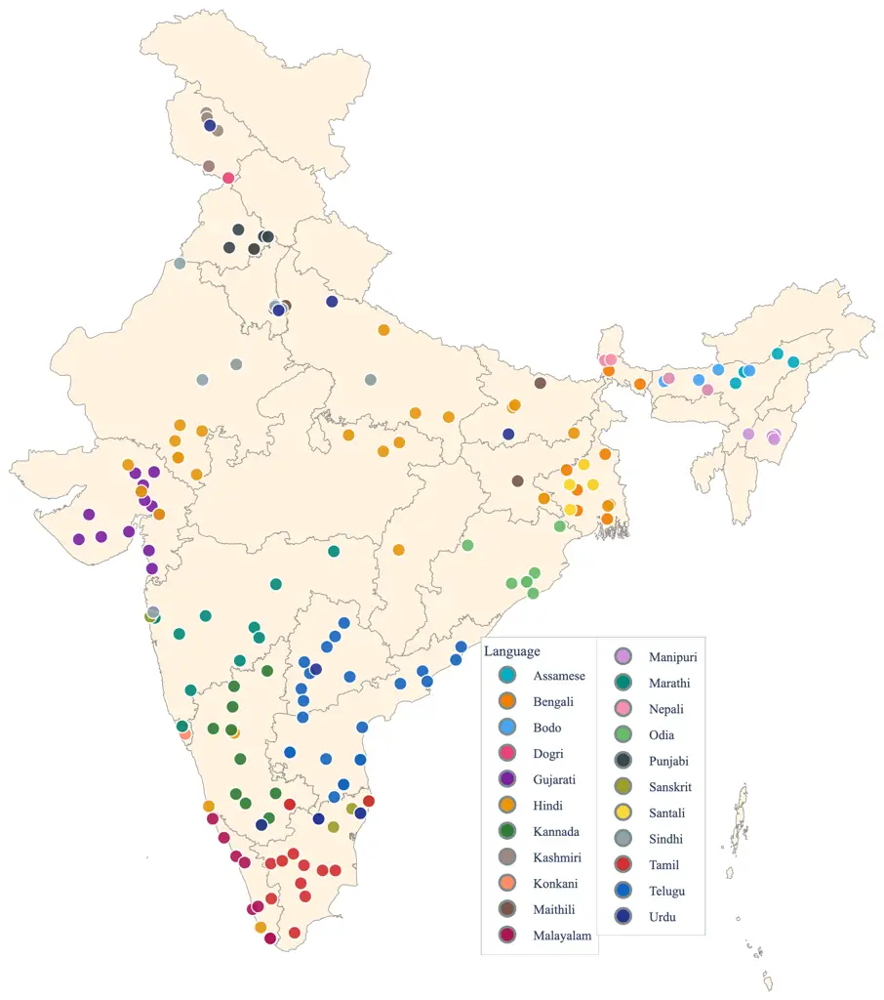
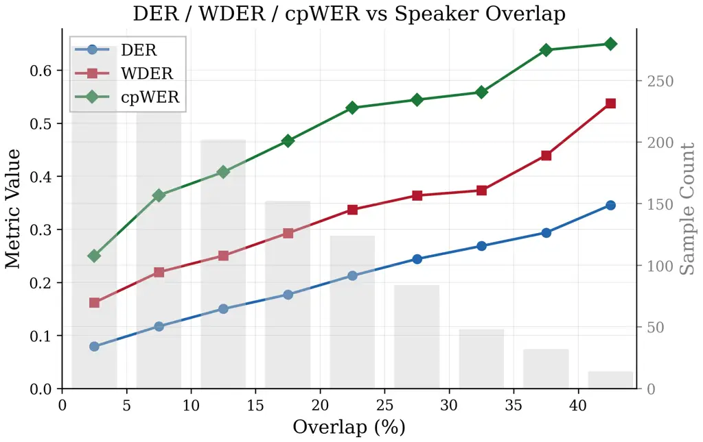

Mehendale Mehndiratta Rathi Bhogale Khapra

# Indic DiarBench: A Multilingual Joint Diarization and ASR Benchmark for Indian Languages

Deovrat    Aditya    Dhruv    Kaushal    Mitesh M

###### Abstract

In this work, we introduce Indic DiarBench, a speaker diarization and
ASR benchmark dataset spanning all 22 scheduled languages of India. This
corpus comprises approximately 108 hours of natural multi-speaker audio
from near-field meetings, far-field recordings, and in-the-wild audios.
All annotations are human-corrected with time-aligned speaker attributed
transcriptions. The dataset captures conversational nuance prevalent in
Indian speech, such as English code-mixing, dialectal variation, and
frequent speaker overlap. To establish a baseline for joint ASR and
diarization capabilities we evaluate leading systems including
commercial speech APIs and multimodal large language models. Indic
DiarBench is released as an open-access resource¹¹ 1
[https://huggingface.co/datasets/sarvamai/indic-diarbench](https://huggingface.co/datasets/sarvamai/indic-diarbench)
to advance inclusive, multilingual speech technology research for Indian
languages.

###### keywords

speaker diarization, Indian languages, multilingual benchmark,
speaker-attributed ASR, code-mixing

^(†)^(†)address: ¹ Sarvam AI, India ² AI4Bharat, IIT Madras, India
^(†)^(†)email: deovrat.mehendale@gmail.com, adityam0309@gmail.com,
dhruvsubhashrathi@gmail.com

## 1 Introduction

Recent years have seen significant progress in automatic speech
recognition (ASR) for Indian languages. Large scale data collection
efforts such as IndicVoices \[1\] have enabled multilingual ASR systems
that begin to cover India’s linguistic diversity. However, most of this
progress has focused on single speaker speech, while many real world
scenarios such as meetings, interviews, panel discussions, and casual
conversations involve multiple interacting speakers. In practical multi
speaker transcription pipelines, speaker diarization is first used to
identify and segment speakers, after which ASR is applied to each
segment.

Despite substantial advances in speaker diarization research \[2\],
existing datasets and benchmarks remain heavily concentrated in English
and a few other high resource languages, leaving no standardized
benchmark for multi speaker speech processing in Indian languages. This
gap is particularly consequential because diarization and ASR must
operate jointly in real deployments. Evaluating them independently masks
important failure modes: ASR performance often degrades sharply when
applied to the short, fragmented, and overlapping segments produced by
diarization systems. As a result, progress in real world conversational
transcription requires benchmarks that evaluate speaker attributed ASR
under realistic multi speaker conditions, a capability that remains
largely unexplored for Indian languages spanning 22 constitutionally
recognized languages and four major language families.

To address this gap, we introduce Indic DiarBench, an open-access
benchmark for evaluating speaker-attributed ASR in multilingual Indian
conversational speech. Our contributions can be summarised as follows:

- •
  A corpus of 108 hours of conversational speech covering all 22
  scheduled Indian languages, collected across near-field meetings,
  far-field recordings, and in-the-wild YouTube conversations.
- •
  Meeting recordings include 485 unique speakers from 189 districts
  across India (Figure 1). The in-the-wild data further includes
  $`\approx 750`$ speakers across the 10 most widely spoken Indian
  languages.
- •
  Human-corrected, speaker-attributed, segment-level transcriptions
  paired with aligned speaker time annotations (RTTM format), enabling
  evaluation of joint diarization and ASR performance.
- •
  Baseline results from multiple state-of-the-art commercial APIs,
  multimodal LLMs, and Indic-specialized systems, establishing reference
  performance across languages and acoustic conditions.

  Indic DiarBench, along with all annotations, evaluation protocols, and
  baseline systems, is publicly released to support reproducible
  research and advancement of speaker-attributed ASR and diarization for
  Indian languages.

Figure 1: Speaker Data Collection by District and Language

## 2 Related Work

Early diarization benchmarks such as the AMI \[3\] and ICSI \[4\]
meeting corpora provided multi-channel English recordings in controlled
rooms. CALLHOME \[5\] extended coverage to six languages but is limited
to telephonic speech with two to six speakers. The DIHARD challenge
series \[6\] pushed evaluation toward degraded and diverse domains,
while VoxConverse \[7\] introduced in-the-wild YouTube audio with
audio-visual annotation. For Mandarin, AliMeeting \[8\] and
AISHELL-4 \[9\] provide meeting-style corpora. LibriCSS \[10\] targets
continuous speech separation with controlled overlap ratios. More
recently, SDBench \[11\] unified 13 datasets under a single evaluation
framework, and NOTSOFAR-1 \[12\] introduced realistic meeting data with
tcpWER evaluation. Despite this progress, none of these benchmarks
provide substantial coverage of Indian languages. Table 1 summarizes key
datasets. At a broader multilingual ASR level, Common Voice \[13\] and
FLEURS \[14\] significantly expanded language coverage, but both are
primarily designed for single-speaker recognition and do not provide
speaker-attributed conversational diarization labels.

For Indian languages, the DISPLACE challenges \[15, 16\] represent the
first attempts at diarization benchmarks. DISPLACE 2023 provided 32
hours of conversational audio across seven languages, while the 2024
edition expanded to 158 hours (38 hours labelled). However, the ASR
track in 2024 was evaluated on a separate 12-hour subset of cleaner
near-field, single-speaker audio. By decoupling diarization from ASR and
covering only a subset of Indian Languages, DISPLACE leaves critical
gaps for evaluation of speaker-attributed transcriptions for Indian
languages in multi-speaker conversational settings.

| Dataset      | Lang.    | Hrs           | Domain       | Spkrs | ASR |
| ------------ | -------- | ------------- | ------------ | ----- | --- |
| CALLHOME     | 6 langs  | 20            | Telephone    | 2–6   | ✓   |
| AMI          | English  | 100           | Meeting      | 3–5   | ✓   |
| DIHARD III   | Multi    | 33            | Mixed        | 1–10  | –   |
| VoxConverse  | Multi    | 70            | YouTube      | 1–21  | –   |
| LibriCSS     | English  | 10            | Simulated    | 8     | ✓   |
| AliMeeting   | Mandarin | 118           | Meeting      | 2–4   | ✓   |
| NOTSOFAR-1   | English  | 28            | Distant mtg. | 4–8   | ✓   |
| DISPLACE ’24 | 5 Indic  | 38            | Conversation | 3–5   | –   |
| Ours         | 22 Indic | $`{\sim}`$108 | Mixed        | 2–9   | ✓   |

Table 1: Comparison of diarization evaluation datasets. Indic DiarBench
is the first to cover all 22 Indian scheduled languages with joint
ASR + diarization labels.

## 3 The Indic DiarBench Corpus

Indic DiarBench is a multilingual conversational speech benchmark
designed to evaluate speaker attributed ASR in realistic multi speaker
settings for Indian languages. The following subsections describe the
data collection process, annotation pipeline, and dataset statistics.

### 3.1 Data Collection

We now describe the recording conditions represented in the corpus,
followed by the criteria used for audio selection and the
characteristics of the speaker population.

#### 3.1.1 Recording Conditions

- •
  Near-field meetings ($`{\sim}`$ 53 hrs): Recorded using one
  close-proximity microphone per speaker and designed to capture
  spontaneous interaction, frequent interjections, and overlapping
  speech. Participants were not co-located; they joined virtually via an
  online meeting platform. This setup allowed accurate capture of
  speaker turns by combining individual microphone streams. This subset
  covers all 22 scheduled Indian languages. The top eight languages by
  native-speaker population (Hindi, Bengali, Marathi, Telugu, Tamil,
  Gujarati, Punjabi, Kannada) contribute $`{\sim}`$ 4 hours each, while
  the remaining 14 languages contribute $`{\sim}`$ 1.5 hours each.
- •
  Far-field meetings ($`{\sim}`$ 27 hrs): Recorded using distant
  microphones, introducing reverberation, background noise, and variable
  speaker-to-microphone distances. This subset includes approximately
  1.4 to 4.2 hours per language for the top eight languages, with
  sessions involving 2–8 speakers.
- •
  In-the-wild audio ($`{\sim}`$ 28 hrs): Curated from publicly available
  YouTube videos to capture unconstrained acoustic environments.
  Approximately 2 hours per language are collected for the ten most
  widely spoken Indian languages. Selected clips emphasize sustained
  multi-speaker interaction and avoid broadcast-style content dominated
  by a single speaker.

#### 3.1.2 Data Curation and Quality Control

To encourage natural conversation and avoid scripted turn-taking,
participants were provided debate topics and quiz questionnaires in
advance and asked to speak freely. An initial warm-up portion of each
recording is discarded to retain only spontaneous interaction. Sessions
with same-gender speakers are included to increase speaker
confusability. After collection, all recordings undergo a curation and
quality control process to ensure suitability for multi-speaker
evaluation.

For meeting recordings, trained language experts review sessions for
recording quality, vocabulary diversity, speaker overlap, and
conversational spontaneity. Sessions that are overly scripted or exhibit
poor audio quality are discarded. Noise cancellation is kept at “low”
whenever possible during recording to preserve natural ambient sound and
conversational artifacts.

For in-the-wild audio, clips are curated from publicly available videos
that (i) contain sustained multi-speaker interaction, (ii) avoid
advertisements and non-speech-dominant music, and (iii) provide a clear
visual indication of the active speaker, enabling reliable speaker
identification during annotation.

#### 3.1.3 Speaker Population

Following the data collection principles established in
IndicVoices \[1\], we recruit speakers from diverse geographic,
demographic, and dialectal backgrounds across India. Figure 1
illustrates the geographic distribution of speaker data collection
across districts and languages. Meeting recordings across near- and
far-field conditions include 485 unique speakers drawn from urban and
rural populations across 22 languages and 189 districts, capturing
substantial accent and dialectal variation. Speaker identities and
associated metadata (e.g., language, region, and demographics) are
tracked using unique speaker IDs and session-level metadata files that
will be released with the meetings dataset. The speaker pool is
gender-balanced and spans a range of educational backgrounds.

For in-the-wild audio, speaker uniqueness is enforced by restricting the
dataset to one video per channel. Speaker embeddings are subsequently
clustered to identify potential overlaps across videos, followed by
manual verification to ensure distinct speaker identities.

### 3.2 Annotation Pipeline

All recordings are annotated using a unified human-in-the-loop pipeline
designed to produce high-quality speaker-attributed transcriptions. The
pipeline combines automatic transcription with three stages of human
verification to ensure accurate transcriptions, timestamps, and speaker
labels.

1.  1.  Bootstrap Transcription. Initial transcripts are generated using
        multiple independent ASR systems, including publicly available
        models and closed source APIs. Annotators are presented with these
        hypotheses as editable drafts, reducing annotation effort while
        limiting bias from any single system.
2.  2.  Human Transcription and Speaker Attribution. Professional annotators
        produce time-aligned, speaker-attributed transcriptions by verifying
        and correcting word sequences, timestamps, and speaker labels. No
        machine-generated annotation is retained without human validation.
        For meeting recordings, where the number of speakers is known and
        individual microphone channels provide reliable speaker timing,
        annotators may adjust timestamps or speaker labels but cannot
        introduce new speakers. For in-the-wild audio, where visual cues are
        available, annotators may add, merge, or remove speaker labels when
        necessary.
3.  3.  Code-Mixed Transcription. Indian conversational speech has frequent
        code-mixing with English. To accommodate this, annotators produce
        two transcription formats. The first is a native-script form in
        which all text, including English words, is rendered in the Indic
        script. The second is a normalized form in which English words are
        written using Roman script and numerals using Arabic digits. Both
        formats are accepted during word error rate computation to avoid
        penalizing models that differ in output conventions.
4.  4.  Quality Control. Dedicated quality checkers (2–3 per language)
        verify transcription consistency, code-mixing conventions, numeral
        representations, non-speech tags (\<laughter\>, \<noise\>, \<cry\>,
        etc.), and speaker timestamps and labels. Particular attention is
        paid to overlapping speech segments, which often require multiple
        rounds of review. Minor corrections are applied at this stage, while
        major issues are returned to annotators for revision.
5.  5.  Expert Review. Finally, each file undergoes language specific
        quality checks by an in-house expert (superchecker). Rather than
        correcting instances directly, the expert identifies systematic
        issues and returns substandard annotations for revision until
        quality standards are met.

### 3.3 Dataset Statistics

Indic DiarBench contains approximately 108 hours of annotated audio
across all 22 scheduled Indian languages. Table 2 presents per-language
statistics including duration by acoustic condition, speaker counts, and
overlap ratios.

| Language  | Family        | NF   | FF   | ITW  | Total         | Overlap % |
| --------- | ------------- | ---- | ---- | ---- | ------------- | --------- |
| Assamese  | Indo-Aryan    | 1.5  | –    | –    | 1.5           | 13.9      |
| Bengali   | Indo-Aryan    | 4.4  | 4.1  | 4.1  | 12.6          | 7.8       |
| Bodo      | Sino-Tibetan  | 1.6  | –    | –    | 1.6           | 15.2      |
| Dogri     | Indo-Aryan    | 1.4  | –    | –    | 1.4           | 24.2      |
| Gujarati  | Indo-Aryan    | 4.1  | 4.2  | 2.8  | 11.1          | 7.6       |
| Hindi     | Indo-Aryan    | 4.2  | 4    | 2.5  | 10.7          | 16.6      |
| Kannada   | Dravidian     | 3.7  | 1.4  | 3.3  | 8.5           | 15.2      |
| Kashmiri  | Indo-Aryan    | 1.1  | –    | –    | 1.1           | 21.2      |
| Konkani   | Indo-Aryan    | 1.6  | –    | –    | 1.6           | 14.0      |
| Maithili  | Indo-Aryan    | 1.3  | –    | –    | 1.3           | 24.7      |
| Malayalam | Dravidian     | 1.3  | –    | 2.4  | 3.7           | 12.9      |
| Manipuri  | Sino-Tibetan  | 1.5  | –    | –    | 1.5           | 20.6      |
| Marathi   | Indo-Aryan    | 4.2  | 3.5  | 2.7  | 10.4          | 11.3      |
| Nepali    | Indo-Aryan    | 1.3  | –    | –    | 1.3           | 22.9      |
| Odia      | Indo-Aryan    | 1.5  | –    | 1.6  | 3.1           | 11.1      |
| Punjabi   | Indo-Aryan    | 4.3  | 4    | 2.4  | 10.6          | 6.1       |
| Sanskrit  | Indo-Aryan    | 1.6  | –    | –    | 1.6           | 21.4      |
| Santali   | Austroasiatic | 1.6  | –    | –    | 1.6           | 6.5       |
| Sindhi    | Indo-Aryan    | 1.5  | –    | –    | 1.5           | 16.0      |
| Tamil     | Dravidian     | 4.2  | 2.5  | 3.2  | 10            | 12.4      |
| Telugu    | Dravidian     | 3.8  | 3    | 2.5  | 9.3           | 20.4      |
| Urdu      | Indo-Aryan    | 1.6  | –    | –    | 1.6           | 12.5      |
| Total     | 4 families    | 53.2 | 26.8 | 27.6 | $`{\sim}`$108 | 12.8      |

Table 2: Per-language statistics for Indic DiarBench. All durations are
in hours. Hours are broken down by acoustic condition (NF = near-field,
FF = far-field, ITW = in-the-wild). Overlap % is averaged over all
conditions. “–” indicates that the condition is not available for that
language.

Limitations. The in-the-wild subset covers 10 of the 22 languages;
extending coverage to all languages is planned. We do not provide
speaker IDs for the in-the-wild subset. The dataset is designed for
evaluation rather than training.

|                |                   |      |       |      |      |     |      |
| -------------- | ----------------- | ---- | ----- | ---- | ---- | --- | ---- |
| Category       | Model             | DER  | cpWER | WDER | Miss | FA  | Conf |
| Indic-Spec.    | Sarvam            | 16.0 | 38.8  | 33.1 | 6.3  | 3.9 | 5.9  |
| Comm. APIs     | AWS Transcribe    | 23.5 | 43.7  | 34.3 | 13.1 | 3.1 | 7.4  |
|                | ElevenLabs Scribe | 35.0 | 58.3  | 40.7 | 13.6 | 6.2 | 15.3 |
|                | Azure STT         | 34.8 | 60.8  | 39.5 | 24.4 | 1.7 | 8.7  |
|                | Deepgram Nova-3   | 32.0 | 63.2  | 39.3 | 18.3 | 5.4 | 8.3  |
|                | AssemblyAI        | 40.5 | 88.6  | 43.7 | 25.5 | 5.5 | 9.6  |
| Multimod. LLMs | GPT-4o            | 36.2 | 83.1  | 40.4 | 17.7 | 3.8 | 14.7 |
|                | Gemini 3 Pro      | 74.0 | 58.9  | 33.0 | 41.7 | 5.8 | 26.5 |

Table 3: Duration-weighted aggregate metrics across all three acoustic
conditions (%). Best values in bold.

## 4 Evaluation Setup

Metrics. We report evaluation metrics along two complementary axes:
acoustic diarization and word-level speaker attribution. For acoustic
segmentation, we report Diarization Error Rate (DER) computed without a
forgiveness collar and including overlapping speech.

To jointly evaluate ASR and diarization performance, we use Concatenated
minimum-permutation Word Error Rate (cpWER) \[17\] and Word Diarization
Error Rate (WDER) \[18\]. cpWER primarily reflects transcription
accuracy after resolving speaker permutations, whereas WDER explicitly
penalizes speaker attribution errors and therefore more directly
captures diarization quality.

Models: We benchmark several prominent ASR–diarization systems,
including commercial speech APIs (Sarvam AI \[19\], Deepgram
Nova-3 \[20\], ElevenLabs Scribe \[21\], AssemblyAI Universal-2 \[22\],
Azure STT \[23\], AWS Transcribe \[24\]) and multimodal large language
models (Gemini 3 Pro \[25\] and GPT-4o Transcribe \[26\]).

Evaluation is restricted to systems capable of producing joint ASR and
diarization outputs, as assessing diarization independently of
transcription is increasingly misaligned with the requirements of modern
speech applications. Consequently, diarization-only models (e.g.,
Pyannote \[27\]) are excluded. Language coverage varies across systems,
as not all commercial providers support all 22 scheduled Indian
languages.

(a) cpWER (%)  
As  Bn  Brx  Doi  Gu  Hi  Kn  Ks  Kok  Mai  Ml  Mni  Mr  Ne  Or  Pa  Sa 
Sat  Sd  Ta  Te  Ur  Assembly 99 99 – – 100 50 98 – – – 95 – 92 97 – 100
95 – 92 90 99 51 AWS – 37 – – 37 37 53 – – – 56 – 39 – 54 35 – – – 63 57
– Azure 100 50 – – 57 49 69 – – – 70 – 59 100 65 66 – – – 63 66 100
Deepgram – 52 – – – 49 79 – – – – – 61 – – – – – – 90 63 – ElevenLabs 53
58 – – 47 44 70 – – – 67 – 54 65 63 58 – – 75 70 67 93 Gemini 65 54 77
81 49 39 66 103 67 78 56 116 39 64 70 71 58 99 78 61 67 100 Sarvam 46 35
59 53 27 31 51 58 41 65 38 56 34 49 37 34 51 28 44 48 51 26  
 \< 30   30–44   45–59   60–74   $`\geq`$ 75   N/A 

(b) WDER (%)  
As  Bn  Brx  Doi  Gu  Hi  Kn  Ks  Kok  Mai  Ml  Mni  Mr  Ne  Or  Pa  Sa 
Sat  Sd  Ta  Te  Ur  20 26 – – 15 40 49 – – – 51 – 52 42 – 34 35 – 33 54
40 28 – 28 – – 31 41 27 – – – 35 – 30 – 27 37 – – – 35 44 – 52 30 – – 36
42 40 – – – 40 – 43 42 31 45 – – – 38 48 27 – 37 – – – 36 36 – – – – –
40 – – – – – – 48 45 – 34 38 – – 33 44 42 – – – 40 – 41 47 36 40 – – 29
45 49 23 32 28 44 41 27 32 30 49 29 41 35 56 33 42 30 32 39 34 28 35 41
29 28 31 37 31 24 39 34 27 21 36 34 33 32 41 24 35 30 18 26 34 44 28  
 \< 15   15–24   25–34   35–49   $`\geq`$ 50   N/A 

Figure 2: Per-language (a) cpWER and (b) WDER (%) heatmap.

## 5 Results and Analysis

For evaluation, all systems were provided the same single-channel mixed
audio to ensure fairness. Figure 2 presents per-language cpWER and WDER
for all evaluated systems across 22 Indic languages. Grey cells indicate
unsupported languages; consequently, global averages over languages are
inherently skewed, and we focus instead on duration-weighted aggregates
and category-wise trends. Table 3 summarizes duration-weighted
performance across all three acoustic conditions.

Model Comparison. We first compare overall performance across model
categories. Among all evaluated systems, the Indic-specialized Sarvam
pipeline consistently achieves the strongest results, obtaining the
lowest DER (16.0%) and cpWER (38.8%) in Table 3. Other model APIs
exhibit moderate performance, with AWS Transcribe performing best in
this group (23.5% DER, 43.7% cpWER), while other APIs show substantially
higher error rates. Multimodal LLMs present a contrasting trade-off:
Gemini 3 Pro achieves competitive WDER (33.0%) due to strong ASR quality
on detected speaker segments, but suffers from very high DER (74.0%),
whereas GPT-4o achieves better diarization accuracy but exhibits poor
cpWER, particularly on lower-resource languages.

Figure 3: Metrics variation vs overlap ratio

Error Analysis. To better understand system behavior beyond aggregate
metrics, we decompose DER into missed detection, false alarm, and
speaker confusion errors (see Table 3). This breakdown reveals distinct
failure patterns across model classes. Indic-specialized pipelines
exhibit a balanced error profile: Sarvam’s 16.0% DER is composed of 6.3%
missed detection, 3.9% false alarms, and 5.9% speaker confusion,
indicating no single dominant failure mode. In contrast, multimodal LLMs
are dominated by missed detection errors. Gemini 3 Pro’s 74.0% DER
includes 41.7% missed detection and 26.5% confusion, largely due to
unreliable timestamping and missed detection on small utterances like
affirmations and interjections. Despite this, its cpWER of 58.9% remains
competitive with commercial ASR APIs, indicating strong transcription
quality when speaker segments are correctly identified. Generic
Commercial APIs exhibit more model-specific behavior: Azure STT achieves
low false alarm rates (1.7%) due to conservative voice-activity
detection, but incurs high missed detection (24.4%), while AWS
Transcribe has relatively more balanced error decomposition.

Effects of overlap In the Indic-specific model (Sarvam), across the 22
languages overlap ratio is strongly correlated with DER and cpWER
(Figure 3).

Performance across languages. We provide language-wise and near-field vs
far-field results in the supplementary material (DatasetSummary.csv) and
discuss them briefly here. In the near-field condition, Telugu emerges
as the most challenging language, exhibiting the highest overlap (24.7%)
and 4.5 speakers per recording on average, yielding a DER of 27.7%.
Maithili (24.7% overlap, 4.7 speakers, 22.7% DER) and Dogri (24.2%, 5.3
speakers, 23.2% DER) follow closely. At the other end, Santali (6.5%
overlap, 4.2 speakers, 9.7% DER) and Urdu (12.5%, 3.8 speakers, 12.8%
DER) are among the easiest; these trends are consistently reflected
across all evaluated systems. In-the-wild YouTube recordings, which have
the lowest overlap (6.5%) and cleaner turn-taking, yield the best
performance. Lower-resource languages compound these effects. The 12
languages available only in near-field recordings show higher DER and
cpWER compared to the 10 higher-resource languages that span multiple
acoustic conditions. Across language families, Dravidian
languages (Kannada, Malayalam, Tamil, Telugu) show near-field cpWER
roughly 5 percentage points above Indo-Aryan languages at comparable
DER.

## 6 Conclusion

We present Indic DiarBench, the first open benchmark for joint
diarization and speaker-attributed ASR spanning all 22 scheduled Indian
languages. By unifying near-field meetings, far-field recordings, and
in-the-wild conversations, the benchmark captures realistic variation in
speaker counts, overlap ratios, and acoustic conditions, establishing a
standardized evaluation framework for multi-speaker conversational
speech in Indian languages. Our results underline that robust
speaker-attributed recognition remains challenging in short-utterance,
high-overlap, and low-resource settings, motivating continued research
on tightly coupled diarization and ASR systems.

## 7 Generative AI use disclosure

Generative AI tools were used only for limited language editing and
polishing of parts of the manuscript. All technical content, analyses,
results, and conclusions were produced and verified by the authors.

## References

- \[1\] T. Javed, J. Nawale, E. I. George, S. Joshi, K. S. Bhogale, et
  al. (2024) IndicVoices: towards building an inclusive multilingual
  speech dataset for Indian languages. In Findings of ACL,
  pp. 10740–10782. Cited by: §1, §3.1.3.
- \[2\] T. J. Park, N. Kanda, D. Dimitriadis, K. J. Han, S. Watanabe,
  and S. Narayanan (2022) A review of speaker diarization: recent
  advances with deep learning. Computer Speech & Language 72,
  pp. 101317. Cited by: §1.
- \[3\] J. Carletta, S. Ashby, S. Bourban, M. Flynn, M. Guillemot, T.
  Hain, et al. (2005) The AMI meeting corpus: a pre-announcement. In
  Proc. Machine Learning for Multimodal Interaction (MLMI), pp. 28–39.
  Cited by: §2.
- \[4\] A. Janin, D. Baron, J. Edwards, D. Ellis, D. Gelbart, N.
  Morgan, B. Peskin, T. Pfau, E. Shriberg, A. Stolcke, and C.
  Wooters (2003) The ICSI meeting corpus. In Proc. ICASSP, pp. 364–367.
  Cited by: §2.
- \[5\] A. Canavan, D. Graff, and G. Zipperlen (1997) CALLHOME American
  English speech. Linguistic Data Consortium. Note: LDC97S42 Cited by:
  §2.
- \[6\] N. Ryant, P. Singh, V. Krishnamohan, R. Varma, K. Church, C.
  Cieri, J. Du, S. Ganapathy, and M. Liberman (2021) The third DIHARD
  diarization challenge. In Proc. Interspeech, pp. 3570–3574. Cited by:
  §2.
- \[7\] J. S. Chung, J. Huh, A. Nagrani, T. Afouras, and A.
  Zisserman (2020) Spot the conversation: speaker diarisation in the
  wild. In Proc. Interspeech, pp. 299–303. Cited by: §2.
- \[8\] F. Yu, S. Zhang, Y. Fu, L. Xie, et al. (2022) M2MeT: the ICASSP
  2022 multi-channel multi-party meeting transcription challenge. In
  Proc. ICASSP, pp. 6167–6171. Cited by: §2.
- \[9\] Y. Fu, L. Cheng, S. Lv, Y. Jv, Y. Kong, Z. Chen, Y. Hu, L.
  Xie, J. Wu, H. Bu, X. Xu, J. Du, and J. Chen (2021) AISHELL-4: an open
  source dataset for speech enhancement, separation, recognition and
  speaker diarization in conference scenario. In Proc. Interspeech,
  pp. 3665–3669. Cited by: §2.
- \[10\] Z. Chen, T. Yoshioka, L. Lu, T. Zhou, Z. Meng, Y. Luo, X.
  Xiao, J. Li, and J. Wu (2020) Continuous speech separation: dataset
  and analysis. In Proc. ICASSP, pp. 7284–7288. Cited by: §2.
- \[11\] B. Durmus, B. Munyampirwa, E. Pacheco, A. Orhon, and A.
  Leonov (2025) SDBench: a comprehensive benchmark suite for speaker
  diarization. In Proc. Interspeech, pp. 1598–1602. Cited by: §2.
- \[12\] A. Vinnikov, A. Ivry, A. Hurvitz, I. Abramovski, S. Koubi, I.
  Gurvich, S. Peer, X. Xiao, B. M. Elizalde, N. Kanda, X. Wang, S.
  Shaer, S. Yagev, Y. Asher, S. Sivasankaran, Y. Gong, M. Tang, H. Wang,
  and E. Krupka (2024) NOTSOFAR-1 challenge: new datasets, baseline, and
  tasks for distant meeting transcription. In Proc. Interspeech,
  pp. 5003–5007. External Links:
  [Document](https://dx.doi.org/10.21437/Interspeech.2024-1788) Cited
  by: §2.
- \[13\] R. Ardila et al. (2020) Common voice: a massively-multilingual
  speech corpus. In Proc. LREC, pp. 4218–4222. Cited by: §2.
- \[14\] A. Conneau, M. Ma, S. Khanuja, Y. Zhang, V. Axelrod, S.
  Dalmia, J. Riesa, C. Rivera, and A. Bapna (2023) FLEURS: few-shot
  learning evaluation of universal representations of speech. In 2022
  IEEE Spoken Language Technology Workshop (SLT), pp. 798–805. External
  Links: [Document](https://dx.doi.org/10.1109/SLT54892.2023.10023141)
  Cited by: §2.
- \[15\] S. Baghel, S. Ramoji, Sidharth, R. H, P. Singh, S. Jain, P. R.
  Chowdhuri, K. Kulkarni, S. Padhi, D. Vijayasenan, and S.
  Ganapathy (2023) The DISPLACE challenge 2023 – DIarization of SPeaker
  and LAnguage in Conversational Environments. In Proc. Interspeech,
  pp. 3562–3566. External Links:
  [Document](https://dx.doi.org/10.21437/Interspeech.2023-2367) Cited
  by: §2.
- \[16\] S. B. Kalluri, P. Singh, P. R. Chowdhuri, A. Kulkarni, S.
  Baghel, P. Hegde, S. Sontakke, D. K T, S. R. M. Prasanna, D.
  Vijayasenan, and S. Ganapathy (2024) The second DISPLACE challenge:
  DIarization of SPeaker and LAnguage in Conversational Environments. In
  Proc. Interspeech, pp. 1630–1634. External Links:
  [Document](https://dx.doi.org/10.21437/Interspeech.2024-1833) Cited
  by: §2.
- \[17\] S. Watanabe, M. Mandel, J. Barker, E. Vincent, A. Araki, X.
  Chang, et al. (2020) CHiME-6 challenge: tackling multispeaker speech
  recognition for unsegmented recordings. In Proc. CHiME Workshop, Cited
  by: §4.
- \[18\] L. El Shafey, H. Soltau, and I. Shafran (2019) Joint speech
  recognition and speaker diarization via sequence transduction. In
  Proc. Interspeech, pp. 396–400. Cited by: §4.
- \[19\] Sarvam AI Sarvam ASR. Note:
  [https://www.sarvam.ai/blogs/asr/](https://www.sarvam.ai/blogs/asr/)Accessed:
  2026-03-05 Cited by: §4.
- \[20\] Deepgram Introducing Nova-3 Speech-to-Text API. Note:
  [https://deepgram.com/learn/introducing-nova-3-speech-to-text-api](https://deepgram.com/learn/introducing-nova-3-speech-to-text-api)Accessed:
  2026-03-05 Cited by: §4.
- \[21\] ElevenLabs Speech to Text Capabilities. Note:
  [https://elevenlabs.io/docs/overview/capabilities/speech-to-text](https://elevenlabs.io/docs/overview/capabilities/speech-to-text)Accessed:
  2026-03-05 Cited by: §4.
- \[22\] AssemblyAI Universal-2 Speech Recognition Model. Note:
  [https://www.assemblyai.com/universal-2](https://www.assemblyai.com/universal-2)Accessed:
  2026-03-05 Cited by: §4.
- \[23\] Microsoft Azure Azure Speech-to-Text. Note:
  [https://learn.microsoft.com/en-us/azure/ai-services/speech-service/speech-to-text](https://learn.microsoft.com/en-us/azure/ai-services/speech-service/speech-to-text)Accessed:
  2026-03-05 Cited by: §4.
- \[24\] Amazon Web Services Amazon Transcribe. Note:
  [https://aws.amazon.com/transcribe/](https://aws.amazon.com/transcribe/)Accessed:
  2026-03-05 Cited by: §4.
- \[25\] Google Gemini 3. Note:
  [https://blog.google/products-and-platforms/products/gemini/gemini-3/](https://blog.google/products-and-platforms/products/gemini/gemini-3/)Accessed:
  2026-03-05 Cited by: §4.
- \[26\] OpenAI GPT-4o Transcribe Model Documentation. Note:
  [https://developers.openai.com/api/docs/models/gpt-4o-transcribe](https://developers.openai.com/api/docs/models/gpt-4o-transcribe)Accessed:
  2026-03-05 Cited by: §4.
- \[27\] H. Bredin (2023) Pyannote.audio 2.1 speaker diarization
  pipeline: principle, benchmark, and recipe. In Proc. Interspeech,
  pp. 1983–1987. External Links:
  [Document](https://dx.doi.org/10.21437/Interspeech.2023-105) Cited by:
  §4.
