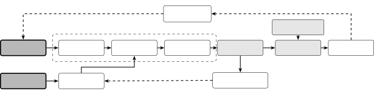

# Extracting Voice Styles from Frozen TTS Models via Gradient-Based Inverse Optimization

Gyeongmin Kim

###### Abstract

Some text-to-speech systems ship a synthesis model and preset style
vectors but withhold the reference encoder that turns a recording into a
style vector, so a user cannot obtain a style for a new voice. We
recover that vector without the encoder by inverting the released
pipeline with gradient descent: all weights stay frozen and only the
style vector is optimized, against time-pooled WavLM statistics of one
recording of the target. The objective discards the time axis, so no
transcript is needed. Two constraints from the release make the result a
drop-in style: every row of the timbre style stays on the unit sphere
where the presets lie, and the small duration style, which a time-pooled
loss cannot see, is fitted to the recording’s speaking rate. On
SupertonicTTS, over 147 speakers and 100 held-out sentences each,
ECAPA-TDNN similarity rises from 0.129 to 0.419, every recovered style
starts from a preset and ends closer to its target than that preset was,
and the pooled word error rate stays below that of the presets. A
verifier at its equal-error point accepts 52% of the recovered voices as
the target speaker, against 1% of the presets.

###### Index Terms: 

Speaker verification, spoofing, voice cloning, model inversion, WavLM

^(†)^(†)address: Department of Computer Science, Hanyang University,
Seoul, South Korea  
kdrkdrkdr@hanyang.ac.kr

## 1 Introduction

Neural text-to-speech (TTS) models such as SupertonicTTS \[1\]
synthesize speech far faster than real time with a fraction of the
parameters of earlier systems. Many condition generation on a style
vector that encodes speaker identity and vocal character, so one model
can voice any speaker for which such a vector exists. The vector for a
new speaker normally comes from a reference encoder, called a speaker
encoder in some systems. Some released systems ship the synthesis model
and a handful of preset styles but keep this encoder private. The
synthesizer still takes a style vector. Only the map from audio to it is
missing. Producing the vector for a given recording without the encoder
is model inversion \[2\]: the function is fixed and public, and the
unknown is one of its inputs.

We recover the missing input by optimization: given the released
pipeline and one target recording, we search for the style vector whose
synthesized output matches the target voice, with nothing trained and
nothing in the release modified. Three difficulties follow from the
missing encoder. Gradients have to pass through an inference graph never
meant for training. The objective has to measure speaker identity while
the generated and the target utterance say different words. And with no
encoder there is no description of where valid styles lie, nor of how
far the loss should be driven.

Fitting a conditioning vector while the generator is held fixed is a
known form of speaker adaptation \[3, 4, 5\], but the published methods
adapt a model their authors trained, and they supervise the fit by
reconstructing the target’s own transcribed utterance frame by frame.
Here the generator is someone else’s inference-only release and the
target is a bare recording. We therefore discard the time axis and match
per-dimension statistics of an early self-supervised learning (SSL)
layer, which are content-independent up to a measurable floor
(Section 3.4).

Our contributions are:

1.  1.  A procedure that recovers a withheld style vector from a released
        synthesizer. Nothing is trained, and no transcript, forced aligner,
        speaker-verification model, enrolled population, or reference
        encoder is needed.
2.  2.  What the release itself supplies. The presets reveal the geometry of
        the style space, which the recovered vector is kept on, and the loss
        floor at which to stop. They also give the duration style a starting
        point for matching the speaking rate.
3.  3.  An evaluation on 147 speakers from two corpora, on 100 held-out
        sentences per speaker. Code and demo:  
        [github.com/kdrkdrkdr/supertonic.embed](https://github.com/kdrkdrkdr/supertonic.embed).



Figure 1: The timbre style $`\mathbf{s}_{\text{ttl}}`$ (dark) receives
the gradient of the time-pooled WavLM loss and is projected back onto
the unit sphere after every step. The duration style
$`\mathbf{s}_{\text{dp}}`$ sets the latent length and is fitted so that
the speaking rate of the synthesis matches the target. All modules of
the TTS pipeline and of WavLM remain frozen; generated and target audio
may carry different text.

## 2 Related Work

Cloning and adaptation. Zero-shot systems obtain a voice from a speaker
encoder \[6\] or by prompting on codec tokens \[7\]. Closer to our
setting, VoiceLoop \[3\], the embedding-only variant of Arik et
al. \[4\], and SEA-EMB \[5\] keep the generator fixed and fit a
conditioning vector for one speaker. They differ from our case in two
respects. The generator is one the authors trained, so its weights and
corpus are theirs to use. And the objective reconstructs the target’s
own transcribed utterance with a per-frame loss, which, as the VoiceLoop
paper notes, “requires an exact temporal alignment of the input and the
output sequence.” SEA-EMB also needs linguistic features and $`f_{0}`$
from the adaptation data. None of this is available for a bare recording
or accepted by an inference-only release.

Optimizing a conditioning vector toward other goals. Other work
optimizes inside a frozen speech generator without touching its weights:
a style code driven until an automatic speech recognition (ASR) system
returns a chosen transcript \[8\], or a speaker embedding driven toward
endless generation \[9\]. Neither objective refers to a target voice.
Closest to us, Marras et al. \[10\] optimize the conditioning embedding
of a frozen cloner to maximize speaker-embedding similarity to a proxy
population, an approach they call “untargeted dictionary attacks.” The
vector is made to pass as many speakers at once rather than to reproduce
one, and the objective needs a speaker-verification encoder, which our
method never uses.

Reaching a voice without a speaker encoder. kNN-VC \[11\] and
kNN-TTS \[12\] reach a chosen voice from untranscribed audio and public
self-supervised features, but by retrieval: the target is kept as a
database of frames, not reduced to a vector, and nothing is optimized
toward it. Aldeneh et al. \[13\] use the time-pooled mean and standard
deviation of a frozen self-supervised layer, as our loss does, but as a
similarity score between two real recordings.

Latent optimization. GAN inversion \[14\] recovers latent codes through
a frozen generator. Where alignment is meaningless, the image domain
replaces the pixel loss with a pooled statistic: Image2StyleGAN++ \[15\]
has a mode that optimizes the latent against a style loss alone, with
its pixel losses switched off. Audio style transfer \[16\] matches such
statistics too, but optimizes the output signal rather than an input to
a fixed generator. A layer-wise probe of WavLM-Large places peak
speaker-identification accuracy at layer 4 \[17\].

## 3 Method

The deployment pattern we target is a TTS release that publishes the
synthesis model and preset style vectors while keeping the reference
encoder private. Few systems fit it. Most either ship the speaker
encoder with the weights (CosyVoice \[18\]), prompt directly on
reference audio without an explicit style vector (F5-TTS \[19\]), or
condition on discrete codec tokens (VALL-E \[7\]). We study
SupertonicTTS, which fits the pattern and is small enough to
differentiate through end to end (Fig. 1).

### 3.1 Problem formulation

Let $`G`$ be a frozen TTS pipeline mapping text $`t`$ and a style
$`\mathbf{s}`$ to a waveform. For a target recording $`\mathbf{y}^{*}`$
we solve

```math
\mathbf{s}^{*}=\arg\min_{\mathbf{s}}\;\mathcal{L}\big(G(t,\mathbf{s}),\ \mathbf{y}^{*}\big), \tag{1}
```

where $`t`$ is text of our choosing, unrelated to what
$`\mathbf{y}^{*}`$ says. SupertonicTTS exposes a timbre style
$`\mathbf{s}_{\text{ttl}}\in\mathbb{R}^{50\times 256}`$, which enters
the acoustic modules as cross-attention keys and values, and a duration
style $`\mathbf{s}_{\text{dp}}\in\mathbb{R}^{8\times 16}`$, which enters
only the duration predictor and sets how long the utterance runs. We
recover both: the 12,800 parameters of $`\mathbf{s}_{\text{ttl}}`$ by
the gradient of Eq. 3, the 128 of $`\mathbf{s}_{\text{dp}}`$ by fitting
the speaking rate of the recording afterwards (Section 3.6).

### 3.2 Gradient flow through a deployed graph

The released pipeline consists of four ONNX modules built for inference.
We simplify each graph with onnxslim, lower the opset from 19 to 17, and
remove trailing empty inputs from Clip operators, after which onnx2torch
yields a differentiable PyTorch module. All converted parameters and all
WavLM parameters are kept frozen.

### 3.3 A content-independent objective

The generated and the target utterance contain different words, so the
objective has to ignore content. Let
$`\mathbf{H}=[\mathbf{h}_{1},\dots,\mathbf{h}_{T}]\in\mathbb{R}^{T\times D}`$
denote the WavLM-Large layer-4 hidden states, $`D{=}1024`$. We collapse
the time axis into per-dimension statistics,

```math
\boldsymbol{\mu}=\tfrac{1}{T}\textstyle\sum_{\tau}\mathbf{h}_{\tau},\qquad\boldsymbol{\sigma}^{2}=\tfrac{1}{T-1}\textstyle\sum_{\tau}(\mathbf{h}_{\tau}-\boldsymbol{\mu})^{2}, \tag{2}
```

the square taken elementwise, and compare the synthesized utterance
$`\hat{\mathbf{y}}=G(t,\mathbf{s})`$ with the target $`\mathbf{y}^{*}`$
by the mean squared error

```math
\mathcal{L}=\tfrac{1}{D}\big\|\boldsymbol{\mu}_{\hat{y}}-\boldsymbol{\mu}_{y^{*}}\big\|_{2}^{2}+\tfrac{1}{D}\big\|\boldsymbol{\sigma}_{\hat{y}}-\boldsymbol{\sigma}_{y^{*}}\big\|_{2}^{2}. \tag{3}
```

This is the statistics pooling used in x-vector speaker
embeddings \[20\]. Even taken directly from frozen SSL states, without a
trained head, these statistics separate the speakers of a clean corpus
at an equal-error rate of a few percent \[13\], which is presumably why
the objective transfers to verification metrics it never saw. We use
layer 4 because Chiu et al. \[17\] report the highest
speaker-identification accuracy for this model there. Their indexing
counts the CNN encoder output as layer 0, as ours does.

### 3.4 Staying on the manifold, and where to stop

With the encoder unavailable, the region of valid styles is documented
only by the presets. Every one of the 500 token rows across the ten
released $`\mathbf{s}_{\text{ttl}}`$ vectors has unit L2 norm, to within
$`2{\times}10^{-7}`$, so each row lies on the unit sphere
$`S^{255}\subset\mathbb{R}^{256}`$ and the withheld encoder evidently
writes onto the product of 50 such spheres. Free gradient descent has no
reason to stay on that surface, so we project every row back to unit
norm after each optimizer step. The rows of $`\mathbf{s}_{\text{dp}}`$
are unit vectors in the presets as well, and the fit in Section 3.6
keeps them so.

The presets also fix the stopping point. Two different sentences
synthesized from the same preset leave a residual loss that is not due
to the speaker. Over the ten presets and the five prompts of
Section 3.5, these 100 same-preset pairs give losses between $`0.148`$
and $`0.413`$, mean $`0.242`$. Inside that band the objective can no
longer tell a different sentence from a different speaker. We stop as
soon as the loss reaches $`0.24`$, the mean of the band.

### 3.5 Optimization details

Optimization starts from the nearest preset, the one of the ten released
presets whose output on the first prompt is closest to the target under
Eq. 3. Five English prompts chosen for phoneme coverage rotate from step
to step, so the style vector cannot overfit one phoneme set. We use Adam
with learning rate $`2{\times}10^{-4}`$, gradient clipping at
max-norm $`1.0`$, and ReduceLROnPlateau with patience 200 and
factor $`0.5`$. Each prompt has its own noise latent, drawn once from a
fixed seed and reused at every step and for every speaker. Its length is
set once from the predicted duration of one preset, so during this stage
only the timbre differs between two speakers. Since each style vector
influences only its own output, several speakers are optimized in one
forward pass by summing their losses, and a speaker that reaches the
threshold leaves the batch immediately for a waiting one. With a batch
of 16 on one RTX 3090, the timbre stage takes about half a minute per
speaker.

### 3.6 Recovering the duration style

A time-pooled loss discards the time axis, which is where speaking rate
lives, so $`\mathbf{s}_{\text{dp}}`$ cannot be recovered by the same
gradient. Its entire audible effect is a single number, the length the
duration predictor assigns to an utterance, and we fit this number to
the recording from audio alone. The speaking rate of a clip is measured
as the number of peaks of its smoothed RMS envelope per second of
trimmed speech, a crude syllable-nucleus count that needs no transcript.
The same detector runs on the target and on the synthesis, so its
undercount cancels in the ratio.

Starting from the preset’s $`\mathbf{s}_{\text{dp}}`$, we look for the
multiplier $`\rho`$ on its predicted durations at which the synthesis
speaks at the target’s rate. Each iteration has four steps. It inverts
the frozen duration predictor by gradient descent so that it outputs the
current target durations, with a small penalty toward the starting
vector and the eight rows projected to unit norm. It synthesizes the
five prompts at the latent length this $`\mathbf{s}_{\text{dp}}`$
commands, as inference does. It measures their rate. And it takes a
secant step in log-duration toward the target. $`\rho`$ itself is not
clamped, but one iteration may change the duration by at most a factor
of two, and up to eight iterations are allowed, a budget no speaker
exhausted. The iteration stops when the rates agree within 3%, when two
consecutive moves fail to improve the match, or when the length has
moved by about a fifth without the rate following it. The fit takes
about a minute per speaker.

## 4 Experiments

### 4.1 Setup

We evaluate the public SupertonicTTS 2 release \[21\] (internal version
v1.6.0), whose architecture is described in \[1\]. It ships 10 preset
styles and no reference encoder.

Targets come from two corpora with different recording conditions: 110
speakers from VCTK \[22\] (studio, 8 to 12 s of reference audio, gender
and accent metadata) and 44 from the Common Voice subset of Seed-TTS
Eval \[23\] (crowdsourced, 3 to 16 s). Because the objective pools over
time, a reference that is mostly silence describes the room rather than
a voice. We keep a reference only if its measured speaking rate over the
whole file is at least 2.2 nuclei per second and the mean RMS of its
loudest fifth of frames is at least 22 dB above that of its quietest
fifth. The rule looks at the reference alone, never at what the
extraction produced. It removes 7 of the 110 VCTK references (six below
the rate threshold, two below the noise threshold, one below both), and
all numbers below are over the remaining 147 speakers. The kept
references all lie clear of both thresholds, the lowest at 2.44 nuclei
per second and 23.4 dB, and the same rule leaves all 44 Seed-TTS
references in place.

For every speaker we synthesize 100 Harvard sentences (IEEE 1969, lists
1 to 10), none of them among the five optimization prompts, from the
extracted style and from the preset it started from, so the two are
compared on the same sentences. The recording’s own words are never
used. Speaker similarity is the cosine similarity between the speaker
embeddings of the reference and of each generated clip, averaged over
the 100 sentences. We compute it under ECAPA-TDNN \[24\] (SIM*(E)) and a
ResNet (SIM*(R)), both VoxCeleb models from SpeechBrain, and under
WavLM-base-plus-sv (SIM\_(W)), a WavLM-family verifier of the kind many
TTS papers report similarity with. The first two are trained
independently of our objective, and the third shares the WavLM family
with it. Intelligibility is the word error rate (WER) under
Whisper-large-v3, pooled over all words of a system. We then read the
transcripts and removed differences that are not errors, using one fixed
list applied to every system: digits against number words, seven
compound spellings, three spelling variants, apostrophes, and three
homophone pairs.

For scale, pairs of different speakers, which a verifier calls impostor
pairs, score $`0.100`$ ECAPA similarity on average over 6000 pairs of
these references, with a 95th percentile of $`0.302`$ and a maximum of
$`0.554`$. A second recording of the same VCTK speaker scores a median
of $`0.680`$. The nearest preset starts at the impostor floor, and since
the impostor tail is long, the comparison that matters is the paired
change per speaker.

### 4.2 Main results

|               |           | SIM\_(E)$`\uparrow`$ | SIM\_(R)$`\uparrow`$ | SIM\_(W)$`\uparrow`$ | WER$`\downarrow`$ |
| ------------- | --------- | -------------------- | -------------------- | -------------------- | ----------------- |
| All (147)     | Preset    | 0.129                | 0.095                | 0.703                | 6.00%             |
|               | Extracted | 0.419                | 0.409                | 0.837                | 5.71%             |
| VCTK (103)    | Preset    | 0.128                | 0.092                | 0.691                | 5.73%             |
|               | Extracted | 0.416                | 0.406                | 0.833                | 4.37%             |
| Seed-TTS (44) | Preset    | 0.130                | 0.102                | 0.731                | 6.65%             |
|               | Extracted | 0.427                | 0.415                | 0.847                | 8.86%             |

Table 1: 147 speakers, 100 held-out sentences each; the Preset row is
the preset each speaker started from, on the same sentences. WER is
adjudicated (raw pooled over all speakers: 7.24% preset, 7.00%
extracted). Bold marks the better of the two.

Figure 2: (a) Best-so-far loss for all 147 speakers (light: individual
speakers, dark: their mean); every speaker reaches 0.24, after a median
of 460 steps (range 190 to 2197). (b) ECAPA similarity over the 100
sentences before and after extraction.

Table 1 compares the extracted styles with the preset each started from,
the nearest of the ten released presets under Eq. 3. Speaker similarity
rises from the impostor floor to SIM*(E) 0.419 and SIM*(R) 0.409 on
sentences the optimization never saw. Bootstrap 95% confidence intervals
over speakers are $`[0.405,0.434]`$ and $`[0.395,0.423]`$. On the five
prompts the style was fitted to, SIM\_(E) is 0.475, and on five further
held-out prompts of similar length 0.467, so new text costs about a
hundredth.

The rise holds for every speaker: all 147 recovered styles end closer to
their target than their starting preset under SIM*(E) and SIM*(R), and
141 of 147 under SIM*(W). The objective sees none of these three
metrics. A Wilcoxon signed-rank test gives $`p<10^{-25}`$ for both
independent metrics, with paired effect sizes $`d*{z}`$ of 3.44 and
3.46, and the two verification models rank speakers similarly (Spearman
$`\rho=0.857`$).

Intelligibility is not affected overall. Pooled over about 114,000
words, the extracted voices are transcribed at 5.71% word error rate
against 6.00% for the presets they started from, and the per-speaker
median falls from 3.88% to 2.84%. The 6% floor belongs to the frozen
model. SupertonicTTS occasionally drops or repeats words, and in our
measurement the same sentence from the same preset can move by eighteen
points of WER between noise seeds. This is why we report word error
pooled over 100 sentences. Extraction raises the word error rate only on
the Seed-TTS subset, where the fitted duration styles move furthest from
the presets, and a tempo pushed toward the edge of the model’s range
costs words.

The recovered duration style does what it was fitted for. On the five
prompts used by the fit, the synthesized speaking rate deviates from the
recording by 9.4% with the preset’s $`\mathbf{s}_{\text{dp}}`$ and by
2.0% with the recovered one; on five held-out prompts the error falls
from 11.9% to 8.1%. The multipliers range from 0.61 to 1.30, and 26
speakers move by more than a fifth. Similarity is unchanged (SIM*(E)
0.477 before the fit, 0.475 after), as expected, since
$`\mathbf{s}*{\text{dp}}`$ reaches the audio only through its length.
Only about half of the reduction in rate error carries over to new text,
because nuclei per second also depend on how dense the sentence is.

Predicted naturalness (UTMOS \[25\]) over the same sentences is 4.03 for
the extracted voices against 4.27 for the presets, that is 94% of the
preset score, and above the 3.92 of the real references under the same
predictor. The median speaker loses 0.11 ($`d_{z}=0.68`$, against 3.44
for the change in similarity); VCTK speakers keep 98% of the preset
score, Seed-TTS speakers 86%, so the drop falls where the word errors
do. UTMOS was trained on earlier systems, so only the paired comparison
should be read.

### 4.3 Would a verifier accept these voices?

| Operating point | Thresh. | Genuine | Extracted | Preset |
| --------------- | ------- | ------- | --------- | ------ |
| EER (1.0%)      | 0.410   | 99.0%   | 51.7%     | 1.4%   |
| FAR = 5%        | 0.302   | 100.0%  | 89.1%     | 2.7%   |
| FAR = 1%        | 0.417   | 98.1%   | 47.6%     | 0.0%   |
| FAR = 0.1%      | 0.527   | 95.1%   | 11.6%     | 0.0%   |

Table 2: Acceptance by an ECAPA verifier tuned to a given false-accept
rate. Genuine: a second real recording of the same speaker (103 VCTK
speakers); impostor: 6000 pairs over all 147 references; extracted: each
speaker’s mean over the 100 sentences.

A cosine similarity is difficult to interpret as a risk, so Table 2
restates the result as a verification decision: with the verifier tuned
to a given false-accept rate (FAR) on genuine and impostor trials, how
often does it accept an extracted voice as the target speaker? The
verifier separates real speakers well, with an equal-error rate (EER) of
1.0% at a threshold of 0.410. At that operating point it accepts 51.7%
of the extracted voices and 1.4% of the presets they were built from; at
a 5% false-accept rate, 89.1% against 2.7%.

VCTK’s gender labels also allow the initialization to be checked. The
nearest preset matches the labeled gender for 98 of 103 speakers, and
all five errors are one male preset (M1) chosen for a female speaker.
The descent recovers from the wrong start: those five also end well
above the impostor floor.

## 5 Discussion and Limitations

We adopt the layer that Chiu et al. \[17\] report as best for speaker
identity. Neighboring early layers would plausibly work too, but each
would need its own content floor and stopping point. The rate detector
cancels its own bias but not the effect of the sentence, so a rate
matched on five prompts transfers only partly to other sentences.
Normalizing by the syllable count of the text would narrow that gap, at
the price of needing a transcript on the target side. We measure
acceptance by a speaker verifier, not by a spoofing countermeasure.
Synthetic speech from this model may well be detectable even when the
verifier accepts it, and our result only bounds how much identity
information the conditioning space carries. Finally, the results come
from a single TTS model, naturalness is a predicted score rather than a
listening test, and the weakest results fall on the crowdsourced
Seed-TTS subset.

## 6 Conclusion

We have recovered a withheld style vector from a released synthesizer by
optimization alone. A time-pooled early-layer WavLM statistic makes the
comparison content-independent up to a measured floor, so one
untranscribed recording is enough, and the released presets provide the
rest: the surface the style vector has to stay on, the floor at which to
stop, and a starting point for the speaking rate. Across 147 speakers
and 100 held-out sentences each, the method raises ECAPA similarity from
0.129 to 0.419, moves every speaker from its preset closer to its
target, does not cost intelligibility overall, and takes about ninety
seconds of GPU time per voice. A verifier at its equal-error point
accepts 52% of the recovered voices as the target speaker, against 1%
for the presets. Withholding the encoder removed a convenience but not
the capability, and we think a partial release should be judged by what
its released components already determine.

## 7 Compliance with Ethical Standards

Use of a released model outside its intended interface. SupertonicTTS
ships synthesis weights and preset voices and withholds the reference
encoder; we reach the conditioning space without it. We used only public
artifacts, circumvented no access control, and modified no released
file, but operating a release outside its intended interface still
carries obligations beyond its license.

Dual use. The measurement is directly usable to imitate a real person:
what we report is how convincingly a recovered vector reproduces a
specific voice, so a high number is also what makes misuse feasible. We
report it because the same number tells a provider, or a user relying on
one, how much of a voice a partial release already determines.

Data, approval and funding. All evaluation uses consented, openly
licensed corpora: VCTK (CC BY 4.0) and the Common Voice subset of
Seed-TTS Eval (CC0). The study was retrospective, on openly available
speech data. No new recordings were collected and ethical approval was
not required. No identifiable individual is targeted and no public
figure appears. The only extracted style vectors we release belong to
the five example speakers whose CC0 Common Voice recordings ship with
the code; they are published with the demo page, and both the code and
the page tell users to obtain explicit consent from anyone whose voice
they clone. This work received no external funding, and the author
declares no conflict of interest.

What we release, and mitigations. We publish the procedure and the code
that produced the numbers; the technique they build on has been public
since 2018 \[3, 4, 5\]. The conditioning space is reachable because it
is continuous, differentiable, and shipped with working examples.
Perturbing or quantizing the released presets, watermarking synthesizer
output, or serving the acoustic modules behind an interface that hides
gradients would each raise the cost of what we did. We measured none of
these.

## References

- \[1\] H. Kim, J. Yang, Y. Yu, S. Ji, J. Morton, F. Bous, J. Byun, and
  J. Lee, “SupertonicTTS: Towards highly efficient and streamlined
  text-to-speech system,” arXiv:2503.23108, 2025.
- \[2\] M. Fredrikson, S. Jha, and T. Ristenpart, “Model inversion
  attacks that exploit confidence information and basic
  countermeasures,” in Proc. ACM CCS, 2015, pp. 1322–1333.
- \[3\] Y. Taigman et al., “VoiceLoop: Voice fitting and synthesis via a
  phonological loop,” in Proc. ICLR, 2018.
- \[4\] S. Ö. Arik et al., “Neural voice cloning with a few samples,” in
  Proc. NeurIPS, 2018, pp. 10040–10050.
- \[5\] Y. Chen et al., “Sample efficient adaptive text-to-speech,” in
  Proc. ICLR, 2019.
- \[6\] Y. Jia et al., “Transfer learning from speaker verification to
  multispeaker text-to-speech synthesis,” in Proc. NeurIPS, 2018, pp.
  4485–4495.
- \[7\] C. Wang et al., “Neural codec language models are zero-shot text
  to speech synthesizers,” arXiv:2301.02111, 2023.
- \[8\] W. Jin et al., “Towards evaluating the robustness of automatic
  speech recognition systems via audio style transfer,” in Proc. ACM
  SecTL Workshop, 2024, pp. 47–55.
- \[9\] X. Gao, Y. Chen, X. Yue, Y. Tsao, and N. F. Chen, “TTSlow: Slow
  down text-to-speech with efficiency robustness evaluations,” IEEE
  Trans. Audio, Speech, Lang. Process., vol. 33, pp. 693–704, 2025.
- \[10\] M. Marras et al., “Dictionary attacks on speaker verification,”
  IEEE Trans. Inf. Forensics Security, vol. 18, pp. 773–788, 2023.
- \[11\] M. Baas, B. van Niekerk, and H. Kamper, “Voice conversion with
  just nearest neighbors,” in Proc. Interspeech, 2023, pp. 2053–2057.
- \[12\] K. El Hajal et al., “kNN retrieval for simple and effective
  zero-shot multi-speaker text-to-speech,” in Proc. NAACL, 2025, pp.
  778–786.
- \[13\] Z. Aldeneh et al., “Can you remove the downstream model for
  speaker recognition with self-supervised speech features?,” in Proc.
  Interspeech, 2024, pp. 4648–4652.
- \[14\] R. Abdal, Y. Qin, and P. Wonka, “Image2StyleGAN: How to embed
  images into the StyleGAN latent space?,” in Proc. ICCV, 2019, pp.
  4431–4440.
- \[15\] R. Abdal, Y. Qin, and P. Wonka, “Image2StyleGAN++: How to edit
  the embedded images?,” in Proc. CVPR, 2020, pp. 8293–8302.
- \[16\] E. Grinstein, N. Q. K. Duong, A. Ozerov, and P. Pérez, “Audio
  style transfer,” in Proc. ICASSP, 2018, pp. 586–590.
- \[17\] A. Y. F. Chiu et al., “A large-scale probing analysis of
  speaker-specific attributes in self-supervised speech
  representations,” arXiv:2501.05310v3, 2026.
- \[18\] Z. Du et al., “CosyVoice: A scalable multilingual zero-shot
  text-to-speech synthesizer based on supervised semantic tokens,”
  arXiv:2407.05407, 2024.
- \[19\] Y. Chen et al., “F5-TTS: A fairytaler that fakes fluent and
  faithful speech with flow matching,” in Proc. ACL, 2025, pp.
  6255–6271.
- \[20\] D. Snyder et al., “X-vectors: Robust DNN embeddings for speaker
  recognition,” in Proc. ICASSP, 2018, pp. 5329–5333.
- \[21\] Supertone Inc., “Supertonic 2 open-weight release,” 2026.
  \[Online\]. Available:
  [https://huggingface.co/Supertone/supertonic-2](https://huggingface.co/Supertone/supertonic-2).
- \[22\] J. Yamagishi, C. Veaux, and K. MacDonald, “CSTR VCTK corpus:
  English multi-speaker corpus for CSTR voice cloning toolkit (version
  0.92),” Univ. of Edinburgh, 2019.
- \[23\] P. Anastassiou et al., “Seed-TTS: A family of high-quality
  versatile speech generation models,” arXiv:2406.02430, 2024.
- \[24\] B. Desplanques, J. Thienpondt, and K. Demuynck, “ECAPA-TDNN:
  Emphasized channel attention, propagation and aggregation in TDNN
  based speaker verification,” in Proc. Interspeech, 2020, pp.
  3830–3834.
- \[25\] T. Saeki et al., “UTMOS: UTokyo-SaruLab system for VoiceMOS
  Challenge 2022,” in Proc. Interspeech, 2022, pp. 4521–4525.
