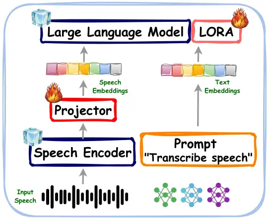
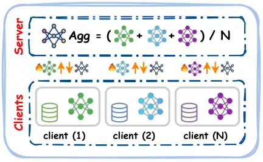

# SpeechLLM Meets Federated Learning for End-to-End ASR: English and Italian Case Studies

1^(st) Mohamed Nabih Ali Affiliation: Center of Augmented Intelligence  
Fondazione Bruno Kessler  
Trento, Italy  
mnabih@fbk.eu    2^(nd) Daniele Falavigna Affiliation: Center of
Augmented Intelligence  
Fondazione Bruno Kessler  
Trento, Italy  
falavi@fbk.eu    3^(rd) Alessio Brutti Affiliation: Center of Augmented
Intelligence  
Fondazione Bruno Kessler  
Trento, Italy  
brutti@fbk.eu Affiliation: 

###### Abstract

Federated learning (FL) enables privacy-preserving training of automatic
speech recognition (ASR) systems across distributed data sources, yet
its application to large-scale speech language models (SpeechLLMs)
remains unexplored. This paper presents the first systematic study of
federated training for SpeechLLM-based end-to-end ASR systems. We design
a communication-efficient federated optimization strategy tailored to
the unique challenges of large speech-language architectures, addressing
high-dimensional parameter spaces, gradient communication overhead, and
computational constraints in distributed settings. Through extensive
empirical evaluation on monolingual ASR tasks in English and Italian, we
demonstrate the effectiveness and stability of our federated approach
compared to centralized training baselines across diverse acoustic
conditions and speaking styles. Additionally, we conduct a comprehensive
ablation study analyzing the impact of different speech encoder
architectures on monolingual English ASR performance within the
federated framework, providing insights into optimal model
configurations for decentralized training. Our results achieve
competitive word error rates while reducing communication costs,
establishing practical foundations for federated SpeechLLM deployment in
real-world multilingual scenarios.

###### Index Terms: 

Federated Learning, Automatic Speech Recognition, SpeechLLM

## I Introduction

Large Language Models (LLMs) have revolutionized artificial intelligence
by demonstrating remarkable capabilities in language understanding,
reasoning, and generation across a wide range of applications \[1\].
Their success has recently extended beyond text-only processing to
multimodal domains, including speech \[2\]. In particular, Speech Large
Language Models (SpeechLLMs) integrate acoustic modeling with the
powerful contextual modeling abilities of LLMs, enabling unified
end-to-end systems for automatic speech recognition (ASR), speech
translation, and spoken dialogue. Recent frameworks such as SLAM-ASR
\[3\] have demonstrated that incorporating LLM-based architectures into
speech recognition pipelines can significantly improve robustness,
contextual awareness, and generalization compared to traditional
encoder-decoder or CTC-based systems \[4\]. These approaches move toward
a unified modeling paradigm where speech and text are processed within a
shared representational space, reducing the need for complex cascaded
pipelines and task-specific architectures.

Despite these advances, the training of SpeechLLM-based ASR systems
typically relies on centralized data collection, where large volumes of
speech data are aggregated on remote servers \[5\]. This paradigm raises
significant privacy and data governance concerns, particularly in
real-world scenarios involving personal devices, call centers,
healthcare applications, or multilingual communities \[6\]. As an
example, speech data is inherently sensitive, often containing biometric
information and personal content that may be sensitive for data privacy
issues \[7\].

Federated Learning (FL) offers a promising alternative by enabling
collaborative model training without transferring raw data to a central
server \[8\]. Instead, client devices compute local updates that are
aggregated globally, preserving data locality and enhancing privacy
\[9\]. Federated Learning has shown effectiveness in domains such as
mobile keyboard prediction and healthcare analytics; however, its
application to large-scale SpeechLLM-based ASR remains underexplored
\[10\]. Challenges, including client heterogeneity, communication
efficiency, and model stability, become even more pronounced when
scaling to large speech-language architectures \[11\].

In this work, we propose a federated training framework for end-to-end
SpeechLLM-based ASR. Our approach enables decentralized optimization of
SpeechLLM models while maintaining competitive recognition performance.
We focus on monolingual settings and conduct comprehensive experiments
in two languages, English and Italian, to validate the robustness and
generality of our method across distinct linguistic conditions. The
proposed framework addresses key challenges in federated speech
training, including communication constraints and large model
adaptation. Through careful optimization strategies and aggregation
mechanisms, we demonstrate that SpeechLLMs can be effectively trained in
a federated environment without sacrificing accuracy.

The main contributions of this paper are summarized as follows:

- •
  We present the first systematic study of federated training for
  SpeechLLM-based end-to-end ASR.
- •
  We propose a communication-efficient federated optimization method for
  large SpeechLLM models that aggregates only trainable parameters on
  the server.
- •
  We introduce a modified FedAvg using a unified exponential learning
  rate decay.
- •
  We provide an extensive empirical evaluation on monolingual ASR tasks
  in English and Italian, demonstrating the effectiveness and stability
  of the proposed approach.
- •
  We analyze the impact of different speech encoders on Monolingual ASR
  for the English language as an ablation study.

## II Related Work

In this section, we review the state of the art, first examining FL
applied to ASR and related common practices, then discussing the most
common communication-efficient approaches for FL.

### II-A Federated Learning for ASR

Beyond the standard hurdles of non-IID and imbalanced data, Federated
Learning for ASR is further complicated by the intensive resource
requirements of contemporary architectures. Models such as
Transformers \[12\], Transducers \[13, 14\], and RNNs \[15\] often
impose a computational burden that exceeds the hardware constraints of
edge devices. Furthermore, ASR traditionally relies on the massive,
centralized datasets \[16\] typically unavailable at the client level.
The resulting scarcity of ground-truth labels on client devices
necessitates the adoption of unsupervised or self-supervised paradigms.

The literature surrounding FL-based ASR has expanded significantly in
recent years. While \[17, 18\] offer exhaustive surveys of optimization
and training strategies, we focus here on the most pertinent
methodological advancements.

Foundational work by \[19\] introduced dynamic gradient aggregation
specifically for ASR tasks. Subsequent studies, such as \[20\], have
demonstrated that weighting client updates by Word Error Rate (WER)
yields superior performance compared to traditional loss-based
weighting. This research also highlights the necessity of a centralized
pre-training phase to ensure convergence, supplemented by a
post-aggregation training stage to mitigate model divergence across
communication rounds findings corroborated by \[21\]. Conversely, \[22\]
suggests that effective cross-domain ASR in an FL environment is
primarily achievable only through large-scale pre-trained models, such
as Wav2Vec2.0 \[23\].

To counter the lack of local labels, several works \[24, 19\] have
explored self-supervised and unsupervised FL frameworks. However, as the
present study concentrates on specific neural architectures for
Efficient Federated Learning (EFL), we treat these supervision
strategies as orthogonal and applicable to our proposed structural
improvements.

### II-B Communication Efficient FL

A wide array of techniques has been developed to optimize bandwidth
efficiency in distributed systems by minimizing the data volume
transmitted to central servers. Sparsification methods, which restrict
communication to a strategic subset of model updates—such as top-$`K`$
gradients \[25, 26, 27\]—have been successfully adapted for ASR
frameworks \[24\]. Alternatively, Quantization strategies compress local
gradients prior to transmission to reduce bit-rate requirements, though
this often necessitates a trade-off between communication gains and
potential accuracy loss or increased local computation \[28, 29, 30\].
Furthermore, Knowledge Distillation has emerged as a viable solution for
reducing exchange overhead by training compact student models to emulate
the behavior of high-capacity teacher architectures \[31\].

Beyond compression, recent research has shifted toward modifying model
parameterization to alleviate resource bottlenecks. Low-rank
factorization facilitates the distribution of compact representations to
heterogeneous devices for subsequent full-rank global aggregation, a
technique explored for CNNs in \[32\]. Similarly, Early-Exit
architectures allow clients to transmit only specific model components
during the aggregation process \[33, 34\].

Recently, Parameter-Efficient Fine-Tuning (PEFT) methodologies including
Low-Rank Adaptation (LoRA) \[35, 36\] and various adapter modules \[37,
38\] have proven highly effective for adapting massive pre-trained
models like Llama \[39\], Gemini \[40\], and Mistral \[41\]. Given that
PEFT typically introduces only $`1\%`$–$`2\%`$ additional parameters
relative to the base model \[42\], it is exceptionally well-suited for
environments with stringent computational and bandwidth constraints.
However, it is important to note that PEFT methods can exhibit higher
sensitivity to non-IID data distributions than full fine-tuning,
necessitating the use of specialized mitigation strategies \[42\].

Despite advances in communication efficiency, current FL methods are
largely optimized for smaller, specialized architectures. Thus, it may
struggle to scale to SpeechLLMs. Existing strategies often face
convergence instability when applied to billion-parameter architectures
on non-IID speech data. This leads to a ”client drift,” where the global
model fails to reconcile the diverse acoustic and linguistic profiles
across decentralized devices, resulting in poor accuracy and training
volatility.

This work presents the first systematic study of FL for SpeechLLM-based
ASR. We propose a communication-efficient framework that aggregates only
trainable parameters, significantly reducing bandwidth for large-scale
models. By introducing a modified FedAvg with unified exponential
learning rate decay, we ensure stable convergence across heterogeneous
datasets. Our approach is validated on English and Italian ASR tasks,
featuring an ablation study on the impact of various speech encoders.

## III Federated SpeechLLM Architecture

The proposed pipeline, illustrated in Figure 1, consists of two main
components: (a) a conventional SpeechLLM-based ASR architecture and (b)
the federated training pipeline. In the following sections, we discuss
in detail each part of the proposed pipeline.



(a)



(b)

Fig. 1: (a) Conventional Speech-LLM architecture. (b) Proposed federated
Speech-LLM training pipeline.

### III-A SpeechLLM-Based ASR Architecture

As shown in Figure 1(a), the SpeechLLM architecture integrates three
components: a speech encoder, a projection layer, and an LLM backbone
integrated with LoRA. The speech encoder converts raw waveforms into
frame-level acoustic embeddings. The projection layer then maps these
embeddings into the LLM’s token embedding space. Finally, the LLM
performs auto-regressive decoding to generate transcriptions. For
efficient adaptation, LoRA modules are integrated into the LLM layers,
allowing only the LoRA and projector parameters to be trained while
keeping the LLM backbone frozen. In the following sections, we briefly
explain each component of the SpeechLLM pipeline.

### III-B Speech Encoder

In our experiments we investigate the performance of two common speech
encoders ❶ WavLM-large and ❷ Whisper-medium.

❶WavLM-Large \[43\] is a self-supervised speech encoder developed by
Microsoft with 317 million parameters. It uses masked prediction and
denoising objectives trained on unlabeled speech data (LibriLight,
GigaSpeech, VoxPopuli). The model excels at extracting robust speech
representations that capture both content and speaker characteristics,
making it effective for downstream tasks like speaker verification,
speech separation, and ASR \[44\]. Its transformer-based architecture
learns generalizable features without requiring labeled data.

❷Whisper-Medium \[45\] is OpenAI’s 769-million parameter multilingual
speech recognition model trained on 680,000 hours of weakly-supervised
data. It uses an encoder-decoder transformer architecture where the
encoder processes mel-spectrograms and the decoder generates text
transcriptions. Whisper-Medium supports recognition in 99 languages and
translation to English. It demonstrates strong robustness to diverse
accents, background noise, and audio quality variations, making it
practical for real-world ASR applications.

### III-C Large Language Model

In our pipeline, we rely on TinyLlama-1.1B-Chat-v1.0 \[46\], a compact
open-source language model with 1.1 billion parameters, trained on
approximately 3 trillion tokens following the Llama 2 architecture.
Despite its small size, it’s specifically fine-tuned for conversational
interactions using instruction-following and chat datasets. The model is
designed for efficient deployment on resource-constrained devices while
maintaining reasonable performance on dialogue tasks, question
answering, and text generation. TinyLlama uses the same tokenizer and
architecture principles as larger Llama models but offers significantly
faster inference and lower memory requirements, making it practical for
edge computing, mobile applications, and scenarios where computational
resources are limited \[47\]. Contemporary LLMs are frequently
fine-tuned using LoRA \[48\]. LoRA  \[49\] introduces trainable low-rank
matrices into transformer layers to approximate weight updates. For a
pre-trained weight matrix $`\mathbf{W}\in\mathbb{R}^{d\times d_{k}}`$,
LoRA represents its update with a low-rank decomposition
$`\mathbf{W}+\Delta\mathbf{W}=\mathbf{W}+\mathbf{AB}`$, where
$`\mathbf{A}\in\mathbb{R}^{d\times r}`$,
$`\mathbf{B}\in\mathbb{R}^{r\times d}`$ are learnable and $`r\ll d`$
\[50\].

### III-D Projector

To align the dimensionality between the speech encoder and language
model, we use a simple two-stage linear adapter network: a projection
layer followed by average pooling \[51\]. The projection layer
transforms the speech encoder embeddings into the 2048-dimensional input
space of TinyLlama. Subsequently, we apply 1D average pooling with a
kernel size and stride of $`k=2`$ along the time axis, which compresses
the sequence length by half. This pooling step reduces computational
costs during auto-regressive decoding while consolidating local temporal
features into more compact representations. This architecture maintains
a minimal parameter footprint, concentrating trainable parameters in the
linear transformation while the pooling operation provides
parameter-free compression. During training, only the adapter parameters
are updated while both the speech encoder and language model remain
frozen, allowing efficient bridging between the two pretrained modules.

### III-E Federated Training Framework

Figure 1(b) shows the proposed federated learning framework for
decentralized SpeechLLM training. Instead of aggregating speech data on
a central server, training is performed collaboratively across multiple
clients, each holding local speech datasets.

At each communication round, the central server broadcasts the current
global model parameters to a subset of participating clients. Each
client performs local training using its private speech data, updating
the trainable components of the SpeechLLM (i.e., LoRA and projector
layers). The updated local model parameters are then transmitted back to
the server. The server aggregates these parameters using a weighted
averaging strategy \[52\]:

```math
\boldsymbol{\theta}^{(t+1)}=\sum_{k=1}^{N}\frac{n_{k}}{\displaystyle\sum_{i=1}^{N}n_{i}}\boldsymbol{\theta}_{k}^{(t)} \tag{1}
```

where $`\boldsymbol{\theta}^{(t+1)}`$ denotes the updated global model
parameters at communication round $`t+1`$,
$`\boldsymbol{\theta}_{k}^{(t)}`$ represents the locally updated model
parameters obtained by client $`k`$ at round $`t`$, $`n_{k}`$ is the
number of local training samples at client $`k`$, $`N`$ is the total
number of participating clients in round $`t`$, and
$`\sum_{i=1}^{N}n_{i}`$ represents the total number of training samples
across all participating clients. The aggregated model is redistributed
in the next communication round.

By restricting parameter updates to lightweight adaptation modules, the
proposed framework reduces communication costs and improves scalability
when training large SpeechLLMs in federated environments. Furthermore,
since raw speech data never leaves client devices, the framework
enhances privacy preservation while enabling collaborative learning
across geographically distributed users.

Overall, the proposed architecture bridges SpeechLLM modeling and
federated optimization, enabling privacy-aware, decentralized training
for end-to-end ASR systems.

## IV Experimental Setup

### IV-A Dataset

For English, we utilize the LibriSpeech-100 dataset (LS) \[53\],
consisting of approximately 100 hours of read English speech from
LibriVox audiobooks with high-quality, time-aligned transcriptions. We
use the train-clean-100 split for training and the standard test-clean
set for evaluation. For Italian, we use the Italian portion of the
Multilingual LibriSpeech (MLS) corpus \[54\], comprising several hundred
hours of read Italian speech with corresponding transcriptions from
public-domain LibriVox audiobooks. This dataset enables evaluation of
multilingual ASR models in a non-English scenario. Table I summarizes
the statistics of both datasets in terms of hours and speakers.

### IV-B FedAvg with learning rate scheduler (Adaptive FedAvg)

The proposed federated learning strategy introduces key enhancements
over vanilla FedAvg \[52\], making it well-suited for large-scale speech
model adaptation. Rather than assigning static and heterogeneous
learning rates across client subsets, the modified strategy adopts a
unified exponential learning rate decay schedule defined as:

```math
\eta_{t}=\eta_{0}\cdot\gamma^{\lfloor t/\tau\rfloor} \tag{2}
```

where $`\eta_{0}=0.001`$ is the initial learning rate, $`\gamma=0.9`$ is
the decay factor, $`\tau=10`$ is the decay period in rounds, and $`t`$
is the current federated round. This promotes training stability and
smoother convergence, as clients collectively transition from aggressive
early-round updates to more refined late-round refinements.

### IV-C Federated Learning Setup

We implement our FL framework using Flower \[55\]. We deploy a client
for each speaker in the datasets. In each round, $`30\%`$ of the clients
are randomly instantiated for 10 epochs of local training. The resulting
gradients are centrally agglomerated using FedAvg strategy \[52\]. FL is
applied for 100 rounds. All FL results marked as —- , —- for LS and MLS,
respectively, are compared with those achieved with central training
marked as $`\star`$ , $`\star`$ for LS and MLS, respectively. More
details related to training hyperparameters are publicly available in
our GitHub repository ¹¹ 1 https://github.com/mnabihali/Fed-SpeechLLM.

|       |             |          |        |          |
| ----- | ----------- | -------- | ------ | -------- |
|       | LibriSpeech |          | MLS    |          |
|       | hours       | \# Spks. | hours  | \# Spks. |
| Train | 100         | 251      | 247.38 | 65       |
| Test  | 5.4         | 40       | 5.27   | 10       |

TABLE I: Statistics (duration in hours, and the number of speakers) of
LibriSpeech and MLS datasets.

## V Experimental Results

### V-A Adaptive FedAvg

We conduct a comparative evaluation of both vanilla and adaptive FedAvg
on the LS dataset, employing WavLM as the speech encoder. Model
performance is quantified using WER to assess recognition accuracy
rigorously.

The WER reported in Figure 2 across 100 federated rounds confirm the
superiority of the proposed Adaptive FedAvg strategy. At round 20,
Adaptive FedAvg achieves a WER of 9.7% compared to 19.7% for standard
FedAvg with a relative improvement of nearly 51%. This demonstrates
significantly faster early convergence. By round 100, the proposed
strategy attains a final WER of 6.4% versus 7.9% for the baseline,
approaching the central training reference of 6.1%. These results
confirm that the exponential learning rate decay yields both faster
convergence and a stronger final model, underscoring the practical value
of Adaptive FedAvg for federated speech model adaptation.

Fig. 2: WER comparison between FedAvg and Adaptive FedAvg on the LS
dataset using WavLM as speech encoder. The dashed line indicates the
central training reference (6.1%).

### V-B Monolingual FL with WavLM

In this scenario, we utilize WavLM as a speech encoder for the SpeechLLM
architecture for both federated and centralized approaches on LS and MLS
monolingual datasets, evaluating convergence behavior over 100 federated
rounds. Figure 3 presents the WER trajectories, revealing distinct
convergence patterns and language-specific challenges in federated
speech recognition systems.

In the case of the LS dataset, as depicted in Figure 3(a), FL
demonstrates remarkable convergence characteristics, starting from an
initial WER of $`\approx`$ 100% and rapidly improving to approximately
10% by round 20. The steepest performance gains occur within the first
20-40 rounds, after which the learning curve stabilizes. By round 100,
the FL pipeline achieves a WER of 6.4%, effectively matching the
centralized training baseline of approximately 6.1%. This convergence
demonstrates that federated optimization can successfully aggregate
gradients across distributed clients to reach performance parity with
centralized training, despite the challenges of non-collocated data and
communication constraints.

Regarding the Italian MLS dataset, as shown in Figure 3(b), exhibits
more challenging federated learning dynamics. While the convergence
pattern follows a similar trajectory starting at 100% WER and rapidly
decreasing through early rounds, a persistent performance gap remains
throughout training. The federated model achieves approximately 22% WER
by round 100, compared to 20.1% WER for centralized training. This
absolute WER difference $`\approx`$ 2% highlights the robustness and
strong generalization capability of the federated approach, even under
more challenging data conditions. The language-dependent performance gap
between English and Italian federated training highlights the impact of
data characteristics on federated optimization effectiveness.

From a communication efficiency perspective, both experiments
demonstrate that meaningful convergence occurs within 60-80 federated
rounds, with diminishing returns beyond this point. This finding is
practically significant, as it establishes a reasonable communication
budget for federated SpeechLLM training.

(a)

(b)

Fig. 3: WER in Monolingual scenario with SpeechLLM in both central and
Federated scenarios using WavLM as speech encoder. (a) LS English
dataset. (b) MLS Italian dataset.

### V-C Monolingual FL with Whisper

(a)

(b)

Fig. 4: WER in Monolingual scenario with SpeechLLM in both central and
Federated scenarios using Whisper as speech encoder. (a) LS English
dataset. (b) MLS Italian dataset.

In this scenario, we investigate the Whisper model as a speech encoder,
evaluated under both federated and centralized optimization strategies,
with the same hyperparameters and datasets as the previous experiment.
Figure 4 illustrates the WER trends for both monolingual datasets.

For LS dataset (Figure 4(a), FL shows rapid convergence, reducing WER
from 100% to approximately 7% by round 20. The performance then
stabilizes, reaching 6.6% at round 100, closely matching the performance
of the centralized baseline of 6.0%. The small absolute gap of 0.6%
demonstrates that federated optimization can effectively preserve
Whisper’s pretrained representations and achieve near-centralized
performance.

For the MLS Italian dataset (Figure 4(b), convergence follows a similar
trend but with a slightly larger gap. The federated model decreases from
100% WER to $`\approx`$ 20% within the first 20 rounds and continues
improving gradually. By round 100, federated training achieves 18.7% WER
compared to 17.5% under centralized training, resulting in a modest 1.2%
absolute difference.

Overall, the results indicate that Whisper enables stable and efficient
federated fine-tuning, substantially reducing the centralized–federated
performance gap. Moreover, most performance gains occur within the first
40–60 rounds, suggesting that effective convergence can be achieved with
a limited communication budget.

Compared to WavLM, the Whisper-based federated model exhibits greater
robustness to client heterogeneity and sustains a consistently smaller
performance gap relative to centralized training, particularly on the
MLS dataset. This suggests that Whisper’s pretrained representations and
stronger cross-lingual generalization capabilities better accommodate
the statistical variability inherent in MLS, leading to more stable
convergence and enhanced performance under decentralized optimization
settings.

### V-D SpeechLLM versus PEFT

Table 2 highlights the impact of model parameterization on optimization
stability and performance under centralized and FL using the LS dataset.
While full fine-tuning of WavLM (85.1M parameters) achieves the best
centralized WER (4.4%), this approach requires updating all model
parameters and is therefore ill-suited for federated settings due to
excessive communication cost and optimization instability. In contrast,
parameter-efficient methods reduce the number of trainable parameters by
over 89% (EL-adapters: 9.1M) and 90% (Speech-LLM: 8.4M) relative to full
fine-tuning, while maintaining competitive recognition accuracy.

In the federated regime, full WavLM fine-tuning fails to converge,
confirming the difficulty of optimizing large acoustic models under
non-IID data distributions and limited client communication.
Adapter-based approaches remain viable, with federated adapters
achieving a WER of 6.1%. Notably, Speech-LLM exhibits stable convergence
and attains a comparable WER of 6.4% while updating 90.1% fewer
parameters than WavLM-FT. This demonstrates that the modular
speech–language architecture of Speech-LLM is well aligned with
federated optimization, enabling effective parameter aggregation without
sacrificing robustness.

Overall, these results suggest that LLM-augmented speech models, when
combined with parameter-efficient training strategies, can significantly
mitigate the communication and optimization challenges of federated
learning. Speech-LLM thus offers a practical trade-off between model
expressiveness and federated efficiency, narrowing the performance gap
between centralized and decentralized ASR while reducing both training
and communication overhead.

[TABLE]

TABLE II: Comparison of centralized and federated training setups using
PEFT and SpeechLLM approaches.

### V-E From Monolingual to Multilingual

(a)

(b)

Fig. 5: WER in Multilingual scenario with SpeechLLM in both central and
Federated scenarios using WavLM as speech encoder. (a) LS English
dataset. (b) MLS Italian dataset.

This scenario leverages WavLM as the speech encoder using all available
speakers from both LS and MLS Italian, with a total of 316 speakers
available during training rounds. Figure  5 illustrates the WER
performance across communication rounds for both datasets. Starting from
an untrained initialization with 100% WER, both datsets demonstrate
rapid error reduction in early rounds followed by gradual convergence.
By round 100, the federated model achieves 16.8% WER on LS (Figure
 5(a)) and 19.7% WER on MLS Italian (Figure  5(b)). LibriSpeech exhibits
greater variability across rounds with notable fluctuations between
rounds 20 and 60, while MLS Italian demonstrates more stable monotonic
convergence.

Compared to centralized training (6.1% WER on LS and 18.4.% WER on MLS
Italian), the federated approach shows performance gaps of 10.7
percentage points for LibriSpeech and a negligible 0.3 percentage points
(actually outperforming) for MLS Italian.

Overall, these results demonstrate effective federated convergence
leveraging all available clients, with the multilingual model achieving
near-parity with centralized training on Italian while maintaining a
moderate gap on English.

## VI Conclusion and Future Work

This paper presented a systematic study of federated training for
SpeechLLM-based end-to-end ASR in both English and Italian monolingual
settings. By integrating parameter-efficient adaptation (LoRA and
projector layers) within a federated framework, we demonstrated that
large speech–language architectures can be effectively optimized without
centralized data aggregation. The proposed Adaptive FedAvg strategy
improved convergence stability and reduced the performance gap between
centralized and federated training. Experimental results showed that
federated SpeechLLM achieves near-centralized performance on LibriSpeech
and maintains competitive accuracy on MLS Italian, while significantly
reducing communication overhead by updating only a small fraction of
model parameters. Furthermore, the comparison between WavLM and Whisper
encoders highlights the importance of pretrained multilingual robustness
in federated environments. Overall, our findings establish SpeechLLM
combined with PEFT as a practical and scalable solution for
privacy-preserving ASR.

Future research will extend this framework toward large-scale
multilingual and cross-domain federated ASR scenarios involving more
diverse acoustic conditions and highly non-IID client distributions.
Incorporating advanced communication-efficient techniques such as
gradient compression, adaptive client selection, or hierarchical
aggregation could further improve scalability. Additionally, integrating
differential privacy mechanisms would provide formal privacy guarantees
beyond data locality. Exploring personalization strategies, including
client-specific adapters or federated continual learning, may help
mitigate heterogeneity and close the remaining centralized federated
performance gap. Finally, scaling to larger LLM backbones and evaluating
real-world on-device deployment constraints will be essential for
practical federated SpeechLLM applications.

## References

- \[1\] M. U. Hadi et al. (2023) Large language models: a comprehensive
  survey of its applications, challenges, limitations, and future
  prospects. Authorea preprints 1 (3), pp. 1–26. Cited by: §I.
- \[2\] D. Zhang et al. (2024) Mm-llms: recent advances in multimodal
  large language models. In Proc. of ACL 2024, pp. 12401–12430. Cited
  by: §I.
- \[3\] Z. Ma et al. (2025) Speech recognition meets large language
  model: benchmarking, models, and exploration. In Proceedings of the
  AAAI Conference on Artificial Intelligence, Vol. 39, pp. 24840–24848.
  Cited by: §I.
- \[4\] J. Yoo et al. (2025) SpeechLLM: unified speech and language
  model for enhanced multi-task understanding in low resource settings.
  arXiv preprint arXiv:2509.04473. Cited by: §I.
- \[5\] S. Alhumoud (2025) ASR systems using llms a review.
  International Journal of Computer Science & Network Security 25 (1),
  pp. 1–12. Cited by: §I.
- \[6\] Q. Li et al. (2024) Llm-pbe: assessing data privacy in large
  language models. arXiv preprint arXiv:2408.12787. Cited by: §I.
- \[7\] L. Cheng, J. Han, and J. Nasirov (2024) Ethical considerations
  related to personal data collection and reuse: trust and transparency
  in language and speech technologies. International Journal of Legal
  Discourse 9 (2), pp. 217–235. Cited by: §I.
- \[8\] M. N. Ali, D. Falavigna, and A. Brutti (2025) EFL-peft: a
  communication efficient federated learning framework using peft
  sparsification for asr. In In Proc. of ICASSP, pp. 1–5. Cited by: §I,
  TABLE II, TABLE II.
- \[9\] M. Nabih, D. Falavigna, and A. Brutti (2023) Fed-ee: federating
  heterogeneous asr models using early-exit architectures. In
  Proceedings of 3rd Neurips Workshop on Efficient Natural Language and
  Speech Processing, Cited by: §I.
- \[10\] M. N. Ali, D. Falavigna, and A. Brutti (2025) Federating
  dynamic models using early-exit architectures for automatic speech
  recognition on heterogeneous clients. Progress in Artificial
  Intelligence, pp. 1–14. Cited by: §I.
- \[11\] P. Hamedi, R. Razavi-Far, and E. Hallaji (2025) Federated
  continual learning: concepts, challenges, and solutions.
  Neurocomputing, pp. 130844. Cited by: §I.
- \[12\] A. Zeyer, P. Bahar, K. Irie, R. Schlüter, and H. Ney (2019) A
  comparison of transformer and lstm encoder decoder models for asr. In
  Proc. of ASRU, pp. 8–15. Cited by: §II-A.
- \[13\] T. Moriya, T. Ashihara, H. Sato, K. Matsuura, T. Tanaka, and R.
  Masumura (2023) Improving scheduled sampling for neural
  transducer-based asr. In Proc. of ICASSP, pp. 1–5. Cited by: §II-A.
- \[14\] M. Zeineldeen, J. Xu, C. Lüscher, W. Michel, A.
  Gerstenberger, R. Schlüter, and H. Ney (2022) Conformer-based hybrid
  asr system for switchboard dataset. In Proc. of ICASSP, pp. 7437–7441.
  Cited by: §II-A.
- \[15\] J. Oruh, S. Viriri, and A. Adegun (2022) Long short-term memory
  recurrent neural network for automatic speech recognition. IEEE Access
  10, pp. 30069–30079. Cited by: §II-A.
- \[16\] C. Wang et al. (2021) VoxPopuli: a large-scale multilingual
  speech corpus for representation learning, semi-supervised learning
  and interpretation. In In Proc. of ACL, Online, pp. 993–1003. Cited
  by: §II-A.
- \[17\] S. S. Azam et al. (2023) Importance of smoothness induced by
  optimizers in fl4asr: towards understanding federated learning for
  end-to-end asr. In Proc. of ASRU, pp. 1–8. Cited by: §II-A.
- \[18\] W. Yu, J. Freiwald, S. Tewes, F. Huennemeyer, and D.
  Kolossa (2021) Federated learning in ASR: not as easy as you think. In
  Speech Communication; 14th ITG Conference, pp. 1–5. Cited by: §II-A.
- \[19\] D. Dimitriadis, R. G. Ken’ichi Kumatani, R. Gmyr, Y. Gaur,
  and S. E. Eskimez (2020) A federated approach in training acoustic
  models.. In Proc. of Interspeech, pp. 981–985. Cited by: §II-A, §II-A.
- \[20\] Y. Gao et al. (2022) Federated self-supervised speech
  representations: are we there yet?. arXiv preprint arXiv:2204.02804.
  Cited by: §II-A.
- \[21\] Y. Gao T. Parcollet et al. (2022) End-to-end speech recognition
  from federated acoustic models. In Proc. of ICASSP, pp. 7227–7231.
  Cited by: §II-A.
- \[22\] T. Nguyen et al. (2023) Federated learning for ASR based on
  Wav2vec 2.0. In Proc. of ICASSP, pp. 1–5. Cited by: §II-A.
- \[23\] A. Baevski, Y. Zhou, A. Mohamed, and M. Auli (2020) Wav2vec
  2.0: a framework for self-supervised learning of speech
  representations. Advances in neural information processing systems 33,
  pp. 12449–12460. Cited by: §II-A.
- \[24\] J. Jia, J. Mahadeokar, W. Zheng, Y. Shangguan, O. Kalinli,
  and F. Seide (2022) Federated domain adaptation for asr with full
  self-supervision. arXiv preprint arXiv:2203.15966. Cited by: §II-A,
  §II-B.
- \[25\] F. Sattler et al. (2019) Robust and communication-efficient
  federated learning from non-iid data. IEEE transactions on neural
  networks and learning systems 31 (9), pp. 3400–3413. Cited by: §II-B.
- \[26\] L. Li et al. (2021) To talk or to work: flexible communication
  compression for energy efficient federated learning over heterogeneous
  mobile edge devices. In Proc. of INFOCOM, pp. 1–10. Cited by: §II-B.
- \[27\] S. U. Stich, J. Cordonnier, and M. Jaggi (2018) Sparsified SGD
  with memory. Advances in neural information processing systems 31.
  Cited by: §II-B.
- \[28\] N. Tonellotto et al. (2021) Neural network quantization in
  federated learning at the edge. Information Sciences 575, pp. 417–436.
  Cited by: §II-B.
- \[29\] F. Yu et al. (2023) Communication-efficient personalized
  federated meta-learning in edge networks. IEEE Transactions on Network
  and Service Management 20 (2), pp. 1558–1571. Cited by: §II-B.
- \[30\] L. Liu, J. Zhang, S. Song, and K. B. Letaief (2022)
  Hierarchical federated learning with quantization: convergence
  analysis and system design. IEEE Transactions on Wireless
  Communications 22 (1), pp. 2–18. Cited by: §II-B.
- \[31\] Z. Zhu, J. Hong, and J. Zhou (2021) Data-free knowledge
  distillation for heterogeneous federated learning. In International
  conference on machine learning, pp. 12878–12889. Cited by: §II-B.
- \[32\] D. Yao et al. (2021) FedHM: efficient federated learning for
  heterogeneous models via low-rank factorization. arXiv preprint
  arXiv:2111.14655. Cited by: §II-B.
- \[33\] M. N. Ali, A. Brutti, and D. Falavigna (2024) Federating
  dynamic models using early-exit architectures for automatic speech
  recognition on heterogeneous clients. arXiv preprint arXiv:2405.17376.
  Cited by: §II-B.
- \[34\] R. Lee et al. (2024) Recurrent early exits for federated
  learning with heterogeneous clients. arXiv preprint arXiv:2405.14791.
  Cited by: §II-B.
- \[35\] E. Hu et al. (2022) LoRA: low-rank adaptation of large language
  models. In In Proc. of ICLR, Cited by: §II-B.
- \[36\] Q. Zhang et al. (2023) Adaptive budget allocation for
  parameter-efficient fine-tuning. In ICLR, Cited by: §II-B.
- \[37\] J. Pfeiffer et al. (2021) AdapterFusion: non-destructive task
  composition for transfer learning. In EACL, Cited by: §II-B.
- \[38\] N. Houlsby et al. (2019) Parameter-efficient transfer learning
  for NLP. In ICML, Cited by: §II-B.
- \[39\] H. Touvron et al. (2023) Llama: open and efficient foundation
  language models. arXiv preprint arXiv:2302.13971. Cited by: §II-B.
- \[40\] G. Team et al. (2023) Gemini: a family of highly capable
  multimodal models. arXiv preprint arXiv:2312.11805. Cited by: §II-B.
- \[41\] A. Q. o. Jiang (2023) Mistral 7b. arXiv preprint
  arXiv:2310.06825. Cited by: §II-B.
- \[42\] S. Babakniya et al. (2023) SLoRA: federated parameter efficient
  fine-tuning of language models. In International Workshop on Federated
  Learning in the Age of Foundation Models, NeurIPS, Cited by: §II-B.
- \[43\] S. Chen et al. (2022) Wavlm: large-scale self-supervised
  pre-training for full stack speech processing. IEEE Journal of
  Selected Topics in Signal Processing 16 (6), pp. 1505–1518. Cited by:
  §III-B.
- \[44\] S. Hu et al. (2024) Wavllm: towards robust and adaptive speech
  large language model. In In Proc. of EMNLP 2024, pp. 4552–4572. Cited
  by: §III-B.
- \[45\] A. Radford et al. (2023) Robust speech recognition via
  large-scale weak supervision. In International conference on machine
  learning, pp. 28492–28518. Cited by: §III-B.
- \[46\] P. Zhang, G. Zeng, T. Wang, and W. Lu (2024) Tinyllama: an
  open-source small language model. arXiv preprint arXiv:2401.02385.
  Cited by: §III-C.
- \[47\] X. Wang et al. (2024) Efficient and personalized mobile health
  event prediction via small language models. In In Proc. of Annual
  International Conference on Mobile Computing and Networking,
  pp. 2353–2358. Cited by: §III-C.
- \[48\] B. Zhang et al. (2024) When scaling meets llm finetuning: the
  effect of data, model and finetuning method. arXiv preprint
  arXiv:2402.17193. Cited by: §III-C.
- \[49\] E. J. Hu et al. (2022) LoRA: low-rank adaptation of large
  language models. In International Conference on Learning
  Representations, External Links:
  [Link](https://openreview.net/forum?id=nZeVKeeFYf9) Cited by: §III-C.
- \[50\] S. Pletenev et al. (2025) How much knowledge can you pack into
  a lora adapter without harming llm?. In In Proc. of NAACL,
  pp. 4309–4322. Cited by: §III-C.
- \[51\] Z. Ma et al. (2026) SLAM-llm: a modular, open-source multimodal
  large language model framework and best practice for speech, language,
  audio and music processing. IEEE Journal of Selected Topics in Signal
  Processing. Cited by: §III-D.
- \[52\] B. McMahan et al. (2017) Communication-efficient learning of
  deep networks from decentralized data. In Artificial intelligence and
  statistics, pp. 1273–1282. Cited by: §III-E, §IV-B, §IV-C.
- \[53\] V. Panayotov et al. (2015) Librispeech: an asr corpus based on
  public domain audio books. In In Proc. of ICASSP, pp. 5206–5210. Cited
  by: §IV-A.
- \[54\] V. Pratap et al. (2020) Mls: a large-scale multilingual dataset
  for speech research. arXiv preprint arXiv:2012.03411. Cited by: §IV-A.
- \[55\] D. J. Beutel et al. (2020) Flower: a friendly federated
  learning research framework. arXiv preprint arXiv:2007.14390. Cited
  by: §IV-C.
