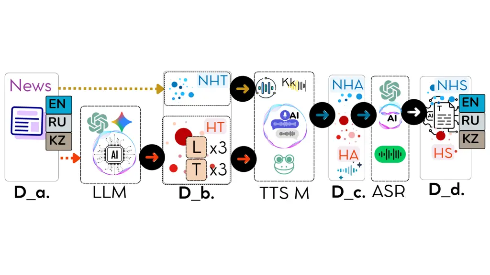

# Lost in Speech: Trilingual Spoken Hallucination Detection Across Audio and Transcripts

Meruyert Aristombayeva Affiliation: Satbayev University, Almaty,
Kazakhstan    Jason S. Lucas Affiliation: University of Colorado
Boulder, Boulder, CO, USA    Chaewan Chun Affiliation: The Pennsylvania
State University, University Park, PA, USA ^(\*)Corresponding
author:[m.aristombayeva@satbayev.university](mailto:m.aristombayeva@satbayev.university)
   Dongwon Lee Affiliation: The Pennsylvania State University,
University Park, PA, USA ^(\*)Corresponding
author:[m.aristombayeva@satbayev.university](mailto:m.aristombayeva@satbayev.university)

###### Abstract

While text-based hallucination detection is well studied, reference-free
detection of factual alterations in speech remains underexplored,
especially for low-resource languages. Our spoken benchmark comprises
12,013 English, Russian, and Kazakh news samples with three synthetic
alteration types and three severity levels, pairing source articles with
rewrites as text, synthesized audio, and ASR transcripts. We add 290
fact-checked misinformation items collected in Russian (225) and Kazakh
(65), translated into the other language and rendered through the same
TTS–ASR pipeline. We evaluate fine-tuned multilingual encoders and
zero-shot multimodal decoders on text, transcripts, and audio. Detectors
receive only target inputs without source articles or external evidence;
the task evaluates reference-free classification rather than
evidence-grounded verification. Encoder degradation from source text to
transcripts generally tracks per-language ASR error on the binary task.
Among decoders, only Gemma-3n exceeds the binary majority-class baseline
in macro-F1, on transcripts only; the other four fall below their
respective baselines. Comparisons between audio and transcripts are
confounded by differences in evaluation coverage and class balance.
Synthetic-trained detectors achieve 0.82–0.88 macro-F1 on real-world
misinformation source text; Russian provenance analysis reveals
veracity-related and model-dependent machine-style signals, a key
confound in synthetic hallucination benchmarks.

## 1 Introduction

In recent years, large neural models for language and speech have
demonstrated impressive generative abilities, yet they exhibit a
troubling propensity to hallucinate, producing information that is not
grounded in factual sources (Frieske and Shi, 2024). In the spoken
setting the stakes are higher still: transcription systems can emit
entirely fabricated phrases, a non-trivial fraction of which carry
explicit real-world harms (Koenecke et al., 2024). Despite this,
hallucination detection has been studied almost exclusively in text (Ji
et al., 2023), while work in the spoken domain remains scarce—and
scarcer still for low-resource languages.

Unlike textual inputs, spoken content is processed through multi-stage
pipelines that couple text-to-speech (TTS) synthesis and automatic
speech recognition (ASR), introducing noise and cascading error
propagation. The robustness of hallucination detection under realistic
speech-pipeline conditions is therefore still insufficiently understood
(Atwany et al., 2025). As large language and audio-language models are
deployed ever more widely, evaluating hallucination detection under
multilingual speech constraints has become increasingly critical
(Frieske and Shi, 2024; Latif et al., 2023).

Three gaps remain open. First, dedicated benchmarks for hallucination in
audio and audio-language models have only begun to emerge, and they are
overwhelmingly English and question-answering oriented (Kuan et al.,
2024; Cheng et al., 2025). Second, the few multilingual hallucination
benchmarks are text-only (Abdaljalil et al., 2025; Vázquez et al.,
2025), and recent evidence indicates that hallucination behavior does
not track a language’s digital footprint in any simple way (Obaid ul
Islam et al., 2025)—motivating the study of a genuinely low-resource
language such as Kazakh alongside higher-resource English and Russian.
Third, existing hallucination benchmarks—synthetic by construction—have
not been validated against real-world misinformation: whether detectors
trained on LLM-generated hallucinations transfer to human-written false
content remains untested, a question sharpened by the fact that in
synthetic benchmarks text provenance (human vs. LLM) is perfectly
correlated with the label. A further bottleneck is the lack of large,
balanced, and annotated audio datasets, which is acute precisely where
both TTS and ASR are least mature (Chun et al., 2025). To our knowledge,
no prior resource combines spoken input, a _detection_ task, three
languages including Kazakh, and _controlled_ hallucination types at
graded severity; existing work covers only subsets of these axes.

For benchmark construction, we operationally define a _spoken
hallucination_ as a synthetically introduced factual or contextual
alteration in a news article that is unsupported by, or contradictory
to, its source article. The source article is used to generate and
assign the benchmark labels but is not provided to the evaluated
detectors. Thus, our experiments concern reference-free classification
of benchmark-defined, source-relative alterations rather than
evidence-grounded verification of factual truth. To study this problem
under controlled yet realistic conditions, we construct a multilingual
benchmark¹¹ 1
[https://huggingface.co/datasets/maristombayeva/lost-in-speech](https://huggingface.co/datasets/maristombayeva/lost-in-speech)
spanning English (high-resource), Russian (medium-resource), and Kazakh
(low-resource). Each sample pairs a reference article with a
systematically generated hallucinated counterpart of controlled
hallucination type (fabrication, contradiction, context inconsistency)
and severity level (mild, moderate, severe), while preserving topic and
style. Our controlled generation and LLM-as-a-judge validation descend
from synthetic-hallucination pipelines developed for text (Mishra et
al., 2024; Xie et al., 2024). To simulate deployment, every version is
provided in both text and speech form: hallucinated texts are
synthesized with language-specific TTS systems and transcribed back with
ASR (Fig. 1). This design enables evaluation on clean text,
ASR-transcribed text, and raw audio, and supports analysis of how
cascading speech-pipeline noise—a documented risk in spoken language
understanding (Avila et al., 2023)—affects reference-free classification
of the benchmark labels. We evaluate two model families on the resulting
data: fine-tuned multilingual encoders and zero-shot multimodal
(audio-language) decoders. Our experiments show TTS–ASR pipeline
degradation most pronounced for Kazakh.

#### Contributions.

1.  1.  A multilingual spoken benchmark for reference-free classification of
        synthetically introduced factual and contextual alterations, with
        controlled alteration types and graded severity: 12,013 news samples
        comprising source articles and aligned rewritten counterparts in
        English, Russian, and Kazakh, represented as text, synthesized
        speech, and ASR transcripts.
2.  2.  A structured LLM-based hallucination generation framework with
        generator self-assessment and external validation by two independent
        cross-family LLM judges, supplemented by targeted human inspection
        of synthesized speech.
3.  3.  The first real-world spoken evaluation split for this task: 290
        fact-checked fake news stories from factcheck.kz, collected natively
        in Russian (225) and Kazakh (65), each paired with a translation
        into the other language and with matched truthful negatives,
        rendered through the same TTS$`\rightarrow`$ASR pipeline
        (Section 3.2).
4.  4.  A Russian provenance analysis that probes factuality and
        human-vs-machine text signals—a confound inherent to synthetic
        benchmarks—by evaluating detectors on human-written false content
        (Section 4.3).
5.  5.  A language-specific TTS$`\rightarrow`$ASR pipeline with
        best-of-breed per-language ASR, and a comprehensive empirical study
        of fine-tuned encoders and zero-shot audio-language decoders across
        text and audio settings, with ASR error analysis and an analysis of
        decoder failure modes, output parseability, and the input-length
        limits of audio encoders, addressing RQ1–RQ3 (Section 4).

Figure 1: Data generation pipeline framework. Legend: $`D_{a}`$ =
Original Data, $`D_{b}`$ = Generated Hallucinated Text, $`D_{c}`$ =
Audio Data, $`D_{d}`$ = Transcribed Data; T = Type, L = Severity Level;
NHT = Non-Hallucinated Text, HT = Hallucinated Text, NHA =
Non-Hallucinated Audio, HA = Hallucinated Audio, NHS = Non-Hallucinated
Speech, HS = Hallucinated Speech; LLM = Large Language Model, TTS M =
Text-to-Speech Model, ASR = Automatic Speech Recognition; MT = Machine
Translation.

## 2 Related Work

Hallucination detection in text and speech. Text-based hallucination
research spans error taxonomies (Ji et al., 2023; Huang et al., 2025),
synthetic supervision (Mishra et al., 2024; Xie et al., 2024), and
reference-free detection through sampling consistency (Manakul et al.,
2023). Speech studies examine model-generated errors (Frieske and Shi,
2024; Atwany et al., 2025) and associated harms (Koenecke et al., 2024),
while audio benchmarks assess object hallucination and audio question
answering (Kuan et al., 2024; Cheng et al., 2025). Multilingual
hallucination benchmarks (Abdaljalil et al., 2025; Vázquez et al., 2025;
Obaid ul Islam et al., 2025) focus on text.

Fact-checking and spoof detection. FEVER (Thorne et al., 2018), AVeriTeC
(Schlichtkrull et al., 2023), and X-Fact (Gupta and Srikumar, 2021)
support evidence-grounded claim verification. Our detectors predict
source-relative alteration labels without access to source articles or
external evidence. FakeSV (Qi et al., 2023) and MAD (Chun et al., 2025)
address video misinformation and spoken dialogue, respectively. Spoof
detection (Wang et al., 2024a; Yi et al., 2023; Zhang et al., 2023)
targets speech authenticity rather than factual or contextual
alterations.

Positioning. Audio-language models (Chu et al., 2024) and ASR systems
(Radford et al., 2023) enable direct audio and transcript-based
processing; AIR-Bench (Yang et al., 2024) evaluates audio comprehension
and instruction-following. Kazakh resources support recognition and
synthesis (Khassanov et al., 2021; Mussakhojayeva et al., 2021;
Mussakhojayeva et al., 2022) and knowledge evaluation (Togmanov et al.,
2025). Our benchmark combines English, Russian, and Kazakh text,
synthesized speech, and ASR transcripts for reference-free
classification of controlled factual and contextual alterations by type
and severity. We also test real-world transfer and examine text
provenance—the target of machine-generated text detection (Wang et al.,
2024b)—as a potential confound.

## 3 Benchmark Construction

### 3.1 Synthetic Subset

We constructed a corpus of 12,013 samples based on news articles
gathered from major Kazakhstani news platforms (e.g., nur.kz, forbes.kz,
tengrinews.kz, kapital.kz), covering diverse topics (politics, economy,
technology); each sample is either an original article or one of its
generated hallucinated versions (Table 1). The articles span three
languages—Kazakh, Russian, and English—and are treated as factual
references since they originate from established outlets. We generated
hallucinated versions with three hallucination types (fabrication,
contradiction, and context inconsistency) and three severity levels
(mild, moderate, severe), following Huang et al. (2025): the English
batches were produced with gpt-3.5-turbo and gpt-4, and the Russian and
Kazakh batches with gemini-2.0-flash-lite; the model-to-batch assignment
and all prompt variants are documented in Appendix A. Table 1 summarizes
the dataset distribution. Each sample is available as text, synthesized
audio, and ASR transcript (Fig. 1). As speech is produced via a
TTS$`\rightarrow`$ASR pipeline, transcription errors reflect cascading
noise from both synthesis and recognition components, particularly in
low-resource Kazakh.

|               |     |       |        |      |      |     |     |          |     |     |
| ------------- | --- | ----- | ------ | ---- | ---- | --- | --- | -------- | --- | --- |
| Lang          | Res | Total | Binary |      | Type |     |     | Severity |     |     |
|               |     |       | No     | Yes  | C    | F   | I   | Mild     | Mod | Sev |
| en            | H   | 3967  | 1340   | 2627 | 903  | 938 | 786 | 875      | 877 | 875 |
| kz            | L   | 3978  | 1113   | 2865 | 947  | 956 | 962 | 957      | 953 | 955 |
| ru            | M   | 4068  | 1259   | 2809 | 962  | 960 | 887 | 934      | 937 | 938 |
| ru (real)^(†) | M   | 580   | 290    | 290  | –    | –   | –   | –        | –   | –   |
| kz (real)^(†) | L   | 580   | 290    | 290  | –    | –   | –   | –        | –   | –   |

Table 1: Dataset summary across languages. Res = resource level (H =
high, M = medium, L = low). Type: C = contradiction, F = fabrication, I
= inconsistency. Severity: Mild, Moderate, Severe. Rows marked “real”
denote the real-world evaluation split from factcheck.kz (Section 3.2);
^(†)each language combines natively collected fakes (225 ru, 65 kz) with
parallel translations of the other language’s items. Real items carry
binary labels only and are used exclusively for evaluation. The 290
truthful items of each real row are original articles of the synthetic
subset above (not additional data); only the 290 fakes per language are
new items.

To create diverse and controlled hallucinations, we implemented a
category-based prompting framework inspired by factuality taxonomies in
prior work (Huang et al., 2025; Lucas et al., 2023; Nahar et al., 2024).
Each article was rewritten according to a predefined hallucination type
and severity level.

We distinguish Factual Contradiction (statements directly conflicting
with facts or information from the original article), Factual
Fabrication (insertion of fabricated yet plausible-sounding details not
grounded in the source), and Context Inconsistency (subtle alterations
that distort the meaning, emphasis, or context of the original article
without explicit factual errors).

Each generation was guided by a structured prompt incorporating the
original article, the target hallucination type, and severity level. The
generation prompt also required the generating model to provide a
structured self-assessment of its output along predefined quality
dimensions. Because such in-prompt self-assessment is not independent of
generation, we additionally conducted a separate external validation
stage using two judge models from families disjoint from the generators
(Section 3.4). All generation and evaluation prompts are provided in
Appendix A.

### 3.2 Real-World Subset

Synthetic benchmarks carry an inherent confound: every hallucinated
sample is LLM-generated while every faithful sample is human-written, so
provenance is perfectly correlated with the label. To reduce this direct
human-versus-LLM label correlation and to test performance on naturally
occurring misinformation, we construct a real-world evaluation split
from factcheck.kz, a professional Kazakhstani fact-checking
organization.

We collected 290 news items verified as false by factcheck.kz,
downloaded from its public archive in October 2024: 225 published
natively in Russian and 65 natively in Kazakh (after removing 15 exact
duplicates from the initial Russian collection), spanning topics
comparable to the synthetic corpus (politics, society, health,
technology). Each item consists of the fake claim or article as it
circulated, with the fact-checking verdict as ground truth. To enable
controlled cross-lingual comparison on identical content, every item is
additionally translated into the other language using Google Translate,
yielding a parallel Russian–Kazakh fake-news corpus of 290 stories per
language, of which 65 Kazakh and 225 Russian items are natively
circulating misinformation. Six claims were independently fact-checked
in both languages; these near-parallel native pairs are flagged in the
release. Translation quality was manually validated by a fluent
bilingual author on all 290 translations, all of which were judged
adequate (Appendix E).

As truthful negatives, we select 290 human-written original articles per
language from the synthetic subset, matched to the fakes via greedy
TF-IDF cosine similarity over topic and time period. These articles are
excluded from the training and development splits of every model
evaluated on the real-world data (Appendix B), so no model evaluated on
this split has seen any of its items during training. All real-world
items—fake and truthful—are rendered through the identical
TTS$`\rightarrow`$ASR pipeline described in Section 3.3, so the
real-world split is available in the same three modalities (original
text, audio, ASR transcript) as the synthetic corpus. This split is used
exclusively for evaluation; no model is trained on it. Unlike the
synthetic subset, real-world items carry only binary labels, since
fact-checkers do not annotate our type/severity taxonomy; manual
taxonomy alignment is left to future work.

### 3.3 Speech Synthesis and Transcription

We synthesized speech for both original and hallucinated texts using
language-specific TTS systems: Coqui XTTS-v2 (Coqui AI, 2023) for
English, Silero TTS (Silero Team, 2021) for Russian, and an open-source
Kazakh TTS model (Mussakhojayeva et al., 2021). Multiple voices were
employed to increase acoustic diversity. Due to limited availability of
high-quality Kazakh TTS systems, synthesized Kazakh speech exhibited
reduced naturalness and occasional phonetic instability. Hallucination
labels are assigned at the text-generation stage relative to the source
article; subsequent TTS–ASR discrepancies are treated as pipeline
degradation and do not alter these labels.

All audio samples were transcribed using ASR. English and Russian were
processed using Whisper-large-v3, while Kazakh was transcribed using a
fine-tuned wav2vec2-large model with post-processing for punctuation. We
adopt the strongest available ASR per language: as shown in Table 7
(Appendix C), Whisper-large-v3 is highly accurate on English and Russian
but fails on low-resource Kazakh, whereas the fine-tuned wav2vec2 model
nearly halves the Kazakh error rate on identical audio. All WER/CER
values are computed at the corpus level after lowercasing, punctuation
removal, and digit removal, applied identically across languages.

We quantify transcription distortion using WER/CER between source texts
and ASR outputs: EN 7.30%/2.74%, RU 9.08%/4.74%, and KZ 34.04%/16.90%
(overall WER 13.02%, CER 6.46%). The substantially higher Kazakh error
rates reflect compounded degradation across the TTS–ASR cascade. In
particular, phonetic distortions introduced by TTS in named entities and
region-specific terms (e.g., Oskemen realized as Askemin) are faithfully
transcribed by ASR but counted as full word errors against the original
text. The news domain further amplifies this effect due to a high
density of proper names and Kazakhstan-specific terminology (e.g.,
akimat), which are underrepresented in multilingual training corpora.
Additionally, Kazakh’s agglutinative morphology increases lexical
variability, so even minor deviations often result in complete
word-level mismatches, inflating WER relative to CER.

This best-of-breed choice minimizes, but does not eliminate, the
cross-language tooling gap; the residual gap (Kazakh WER remains roughly
four times higher than English and Russian) is examined by relating
per-language ASR error to downstream detection degradation
(Sections 4.1 and 4.2).

### 3.4 Quality Evaluation: LLM vs. Human

To validate the quality of both raw hallucinated texts and synthesized
speech, we perform two tasks.

#### Evaluating Hallucinated Texts.

We adopted an LLM-as-a-Judge framework (Zheng et al., 2023; Li et al.,
2024; Gu et al., 2025). Generation prompts included an in-prompt
self-assessment; independent validation used a stratified sample of 216
articles ($`n=8`$ per type$`\times`$severity$`\times`$language cell) and
two external judges, Claude Haiku 4.5 and DeepSeek Chat, under the same
protocol.

The evaluation considered nine dimensions, applied type-dependently
(seven per type): Adequacy of Type (AT), Fluency (Fl), Coherence (Co),
Logical Coherence (LC), Internal Consistency (IC), Credibility (Cr),
Factual Accuracy (FA), Relevance (Re), and Satisfaction (Sa);
definitions are in Appendix A.

Each criterion was rated on a five-point ordinal scale from Very Low (1)
to Very High (5). Table 10 (Appendix D) reports mean Claude scores on
this sample by type, severity, and language. As the scale is ordinal,
means serve only as descriptive indicators.

For both factuality-bearing types, the judge assigns low credibility and
factual accuracy already at mild severity ($`\sim`$1.2–2.0) and floor
scores ($`\approx`$1.0) at severe levels, confirming that the intended
factual degradation is realized. Adequacy of Type and Satisfaction
increase with severity for all three types, reaching 4.9–5.0 at the
severe level, so generated articles match their target category and
level most clearly where distortion is strongest. Fluency declines only
moderately with severity and does not collapse for any type
(severe-level means of 2.6–4.0 for contradictions; Table 10), indicating
that the framework manipulates semantic grounding rather than linguistic
form.

#### Cross-Judge Validation.

A natural concern is that the quality scores in Table 10 could reflect
judge-specific idiosyncrasies. To test this, we measured agreement
between the two independent external judges, Claude Haiku 4.5 and
DeepSeek Chat, on the same stratified sample and per quality dimension
(Table 9, Appendix D). Agreement is high on the two factuality-oriented
dimensions that underlie the hallucination signal—Factual Accuracy and
Credibility (quadratic-weighted $`\kappa=0.875`$ and $`0.897`$; Spearman
$`\rho=0.91`$ and $`0.92`$)—with the two judges agreeing within one
point on $`100\%`$ of these items. For the remaining, more subjective
dimensions, raw agreement remains high (within one point on
$`71`$–$`97\%`$ of items), although weighted $`\kappa`$ is lower for the
most concentrated scales (e.g., Internal Consistency, Logical
Coherence), where limited score variance deflates chance-corrected
agreement. Overall, the cross-judge results corroborate the trends in
Table 10, indicating that the reported quality patterns are robust
across the two external evaluators.

#### Evaluating Synthesized Speech.

Given Kazakh’s high WER/CER, a fluent native Kazakh-speaking author
randomly selected and evaluated 120 audio samples using predefined
criteria for intelligibility, faithfulness to the source text, and
exclusion due to audio quality.

The results indicate that 94.2% of the samples were rated as mostly
intelligible and 5.8% as poorly intelligible, with no samples classified
as fully unintelligible. Regarding semantic fidelity, 61.7% exhibited
minor discrepancies and 38.3% major discrepancies relative to the source
text. No samples were excluded due to critical audio quality issues.
These findings confirm that the Kazakh pipeline introduces noticeable
semantic distortion while maintaining general perceptual
comprehensibility, thereby motivating focused robustness analysis in the
low-resource setting.

## 4 Empirical Evaluation

We aim to answer the following research questions: RQ1: How robust are
state-of-the-art multilingual encoder models for reference-free
classification of synthetically introduced factual alterations when
evaluated on original text versus ASR-transcribed text? RQ2: Under
identical zero-shot prompting conditions, can multimodal decoder models
perform reference-free classification from ASR transcripts and from
direct audio, and are the two inputs comparable on this benchmark? RQ3:
Do classifiers trained on synthetically altered texts transfer to
real-world, human-written misinformation, and to what extent is their
binary signal attributable to human-vs-machine text discrimination
rather than veracity-related content?

To address RQ1, a model receives only the target news item, represented
either as text ($`D_{a}`$) or as an ASR transcript ($`D_{d}`$), and
predicts labels assigned during controlled dataset construction. The
corresponding source article and external evidence are not provided at
inference time. We evaluate binary classification (unaltered vs.
synthetically altered) and multiclass classification of the assigned
alteration type and severity. Consequently, these experiments measure
reference-free recognition of benchmark-defined alterations and should
not be interpreted as evidence-grounded factual verification. We compare
(i) fine-tuned multilingual encoder-based transformers and (ii)
zero-shot in-context learning with decoder-based architectures. The
models and modality support are summarized in Table 8 (Appendix C).

Throughout, we report accuracy and macro-F1; training details are given
in Appendix B.

### 4.1 RQ1 $`\rightarrow`$ Text-based: Original Text vs. Transcripts

We assess multilingual encoder robustness in text-only deployment
scenarios. Specifically, we compare performance on original articles
($`D_{a}`$) and their ASR-transcribed counterparts ($`D_{d}`$).

Table 2 shows that fine-tuned encoders achieve strong binary
hallucination detection performance (F1: 0.52–0.89), while fine-grained
type (F1: 0.14–0.68) and severity classification (F1: 0.15–0.66) remain
more challenging. Performance is predominantly higher on original text
than on ASR-transcribed content, though not uniformly so: in a few
language–task cells transcripts match or exceed original text (e.g.,
XLM-R (base) on Russian). mDeBERTa exhibits the most robust
cross-lingual performance; ReMBERT is competitive on binary detection
but performs poorly on type and severity tasks (F1 .153–.188). For
mDeBERTa and ReMBERT, binary-task degradation from $`D_{a}`$ to
$`D_{d}`$ increases with per-language ASR error, whereas this trend is
inconsistent for type and severity tasks and XLM-R models.

| Task | Lan | Split | XLM-R (b) | XLM-R (l) | mDeBERTa  | ReMBERT   |
| ---- | --- | ----- | --------- | --------- | --------- | --------- |
|      |     |       | Acc/F1    |           |           |           |
|      | en  | O     | .826/.828 | .865/.863 | .843/.843 | .879/.860 |
|      |     | T     | .838/.832 | .658/.522 | .840/.841 | .834/.815 |
| B    | kz  | O     | .870/.873 | .841/.846 | .893/.893 | .910/.876 |
|      |     | T     | .826/.826 | .711/.591 | .875/.874 | .802/.782 |
|      | ru  | O     | .809/.814 | .738/.747 | .838/.841 | .862/.845 |
|      |     | T     | .832/.835 | .703/.580 | .824/.827 | .788/.767 |
|      | en  | O     | .612/.599 | .680/.679 | .600/.596 | .388/.187 |
|      |     | T     | .571/.564 | .673/.666 | .627/.623 | .331/.166 |
| T    | kz  | O     | .612/.606 | .675/.674 | .681/.676 | .306/.156 |
|      |     | T     | .260/.138 | .635/.636 | .559/.560 | .347/.172 |
|      | ru  | O     | .669/.663 | .665/.665 | .616/.616 | .345/.171 |
|      |     | T     | .676/.677 | .665/.660 | .645/.644 | .353/.174 |
|      | en  | O     | .596/.590 | .616/.611 | .604/.596 | .344/.171 |
|      |     | T     | .633/.616 | .290/.150 | .568/.570 | .394/.188 |
| L    | kz  | O     | .592/.592 | .660/.660 | .664/.656 | .326/.163 |
|      |     | T     | .559/.555 | .374/.182 | .601/.586 | .297/.153 |
|      | ru  | O     | .624/.624 | .668/.655 | .598/.595 | .336/.168 |
|      |     | T     | .618/.611 | .333/.167 | .633/.634 | .316/.160 |

Table 2: Finetuned encoder performance (Acc/F1). Task: B = Binary, T =
Type, L = Level; Split: O = original text, T = ASR-transcribed text.
Bold indicates the best F1 within each row (among the four encoders).

### 4.2 RQ2 $`\rightarrow`$ Audio-Based: Decoders on Audio and Transcripts

We evaluate five decoder models (1.5B–8B) in a zero-shot setting,
reporting ASR-transcript ($`D_{d}`$) results for all five and
direct-audio ($`D_{c}`$) results for three (Table 3). We report direct
prompting only. Under chain-of-thought (CoT) prompting, Qwen2-Audio
requested audio in every fine-grained audio call, Qwen2.5-Omni refused
33% of Kazakh binary audio calls (versus 2% under direct prompting), and
up to 78% of Gemma-3n’s responses were unparsable. Coverage differs
across cells (see caption), limiting direct comparisons.

Near-chance scores reflect degenerate output rather than partial
competence, and the mechanism differs by model. Qwen2.5-Omni parses over
96% of transcript calls but rarely asserts an alteration: on Kazakh its
binary predictions are constant negative—accuracy .279 on the full
corpus, matching the unaltered share up to unparsed items, and .834 on
the 344-item audio subset, where the unaltered share is .854 and the
remaining 2% are refusals counted as errors. Qwen2-Audio and
Step-Audio-2-mini are also constant on the balanced binary subsets
(.500/.333 in all languages), though Qwen2-Audio exceeds the
fine-grained macro-F1 baseline on transcripts (.198–.357) and
Step-Audio-2-mini on English type (.467/.401). LFM2-Audio, documented
for English only, fails at the output level. Gemma-3n is the only
decoder above the binary baseline on transcripts in all three languages,
with macro-F1 .613/.581/.630 against .40–.42, and it also exceeds the
severity baseline (.399/.328/.370 against .167); its type predictions
stay near baseline.

We do not compare modalities. Audio items have a median duration of 96 s
(English: 212 s; 98% exceed 30 s). Qwen2-Audio’s Whisper-large-v3 front
end is documented to truncate beyond 30 s; Qwen2.5-Omni uses a
block-wise streaming encoder and LFM2-Audio a FastConformer encoder,
neither documented with that limit. We did not verify per-model
truncation in our inference code, so under direct audio a model may
receive only part of an article labelled over its full text. The audio
subsets are also skewed—the Kazakh one is 85% unaltered against 28% in
the corpus—so their accuracies are not comparable to corpus baselines.
For Kazakh, 38% of inspected audio also shows major semantic
discrepancies from the source text (Section 3.4), so the text-level
label may not be recoverable from audio at all. The near-constant audio
predictions are consistent with these mismatches and say nothing about
audio reasoning.

LFM2-Audio and Step-Audio-2-mini are evaluated outside their documented
language coverage on Russian and Kazakh by design, to show where open
audio-language models stop working.

|                    |      | Binary        |           | Type      |           | Level     |           |
| ------------------ | ---- | ------------- | --------- | --------- | --------- | --------- | --------- |
| M                  | Lang | A             | T         | A         | T         | A         | T         |
|                    |      | (Acc / F1)    |           |           |           |           |           |
| $`\blacklozenge`$  | en   | .250/.336     | .140/.186 | .000/.000 | .013/.024 | .000/.000 | .080/.114 |
|                    | kz   | .183/.254^(†) | .190/.254 | .000/.000 | .013/.024 | .000/.000 | .000/.000 |
|                    | ru   | .067/.094^(†) | .170/.207 | .011/.020 | .013/.025 | .000/.000 | .007/.013 |
| $`\blacktriangle`$ | en   | .500/.333     | .391/.339 | .333/.167 | .313/.207 | .000/.000 | .423/.357 |
|                    | kz   | .500/.333     | .294/.250 | .333/.167 | .328/.210 | .000/.000 | .327/.280 |
|                    | ru   | .500/.333     | .346/.296 | .333/.167 | .286/.198 | .000/.000 | .280/.289 |
| $`\bullet`$        | en   | .364/.295     | .359/.288 | .032/.058 | .024/.047 | .106/.148 | .146/.182 |
|                    | kz   | .834/.455     | .279/.219 | .000/.000 | .030/.050 | .013/.025 | .021/.036 |
|                    | ru   | .510/.355     | .339/.285 | .013/.026 | .038/.070 | .053/.084 | .088/.122 |
| $`\star`$          | en   | –             | .500/.333 | –         | .467/.401 | –         | .400/.304 |
|                    | kz   | –             | .500/.333 | –         | .333/.168 | –         | .333/.167 |
|                    | ru   | –             | .500/.333 | –         | .333/.277 | –         | .278/.211 |
| $`\blacksquare`$   | en   | –             | .683/.613 | –         | .311/.165 | –         | .468/.399 |
|                    | kz   | –             | .607/.581 | –         | .262/.154 | –         | .340/.328 |
|                    | ru   | –             | .656/.630 | –         | .256/.173 | –         | .403/.370 |

Table 3: Decoder performance on direct audio (A) and ASR transcripts
(T). Direct prompting only; chain-of-thought output was unusable
(Section 4.2). Acc and macro-F1 use the same items; unparsable and
_none_ responses count as errors. Cells with different $`n`$ are not
comparable. Transcript $`n`$: full corpus for $`\bullet`$,
$`\blacktriangle`$, $`\blacksquare`$ (3,965/3,977/4,067 binary;
2,627/2,865/2,809 fine-grained, en/kz/ru); 100/150 for
$`\blacklozenge`$; 60/90 for $`\star`$. Audio $`n`$: full corpus for
$`\bullet`$ on en, 344/150 kz, 100/150 ru; 100/150 for
$`\blacktriangle`$; 60/90 for $`\blacklozenge`$; $`\star`$ transcripts
only, $`\blacksquare`$ audio excluded (raw responses not retained) (–).
Majority baselines (Acc/macro-F1): .663/.399, .720/.419, .691/.409 (full
binary corpus, en/kz/ru); .500/.333 balanced binary subsets; full-corpus
type .357/.176, .336/.168, .343/.170 and severity .334/.167 (en/kz/ru);
.333/.167 on the balanced fine-grained subsets. Bold: best among the
full-corpus models ($`\bullet`$, $`\blacktriangle`$, $`\blacksquare`$)
on transcripts, the only comparable cells. ^(†)audio not delivered in
7–13% of calls; not interpretable. M: $`\blacklozenge`$ =
LFM2-Audio-1.5B, $`\blacktriangle`$ = Qwen2-Audio-7B-Instruct,
$`\bullet`$ = Qwen2.5-Omni-3B, $`\star`$ = Step-Audio-2-mini,
$`\blacksquare`$ = Gemma-3n-E4B-it.

### 4.3 RQ3 $`\rightarrow`$ Real-World Transfer and the Provenance Confound

#### Real-world transfer.

We take the strongest fine-tuned encoders from Section 4.1 (ReMBERT and
mDeBERTa), trained exclusively on the synthetic subset, and evaluate
them on the real-world split (Table 4). On original text, binary
macro-F1 on real-world data matches or exceeds synthetic test
performance for both encoders and both languages (e.g., ReMBERT: 0.819
vs. 0.786 for Russian, 0.883 vs. 0.863 for Kazakh), showing that the
synthetic-trained detectors retain high classification performance on
this real-world split. The same pattern holds on ASR transcripts: with
encoders fine-tuned on transcribed text, real-world macro-F1 remains
high (.753–.835), and the O$`\rightarrow`$T degradation grows with
per-language ASR error ($`\leq`$6 points for Russian—absent for ReMBERT,
whose transcript fine-tuning even compensates for ASR noise—and up to
12.5 points for Kazakh), mirroring the RQ1 trend. On the 290 parallel
Russian–Kazakh fake pairs, mDeBERTa’s predictions disagree on only 3.8%
of items, indicating substantial cross-lingual stability on identical
false content.

#### Provenance-controlled analysis.

We conduct this analysis on Russian original text. In the synthetic
binary task, provenance (human vs. LLM) is perfectly correlated with the
label; a detector could therefore succeed by recognizing
machine-generated style alone. We complete the
provenance$`\times`$veracity matrix (Table 5) with the real-world fakes
(human-written false) and with 290 _faithful_ LLM rewrites of the same
truthful articles, generated with Gemini 2.0 Flash-Lite under a
hallucination-free instruction. The results reveal evidence of two
components. First, a veracity component: within human-written text, both
encoders separate false from truthful articles by a wide margin (flag
rates 1.000 vs. 0.352 for ReMBERT; 0.962 vs. 0.221 for mDeBERTa).
Second, a provenance component whose strength is model-dependent:
rewriting a truthful article—changing style while preserving every
fact—raises ReMBERT’s flag rate from 0.352 to 1.000 (saturation on
machine-generated text), but mDeBERTa’s only to 0.586, which remains
well below its 0.893 rate on synthetic hallucinations—i.e., mDeBERTa
retains veracity sensitivity even within machine-generated text.
Synthetic binary F1 therefore overstates factuality sensitivity, the
degree of provenance reliance is itself a model property, and the
real-world split—where both classes originate from human-written
content—substantially reduces the original provenance confound.

|      |              | ReMBERT |      | mDeBERTa |      |
| ---- | ------------ | ------- | ---- | -------- | ---- |
| Lang | Split        | O       | T    | O        | T    |
| ru   | Synth (test) | .786    | .819 | .825     | .771 |
|      | Real         | .819    | .835 | .870     | .811 |
| kz   | Synth (test) | .863    | .794 | .831     | .748 |
|      | Real         | .883    | .818 | .878     | .753 |

Table 4: Binary detection (macro-F1) on the synthetic test split vs. the
real-world split, for original text (O) and ASR transcripts (T).
Encoders are trained on the synthetic subset only, in a dedicated run
whose train/dev pool excludes the 290 truthful negatives per language
(Appendix B); the synthetic test split is augmented with these
negatives, so the truthful class of the Synth (test) and Real rows
shares the same 290 articles per language. O and T columns use encoders
fine-tuned on original text and on ASR transcripts, respectively, over
identical train/dev/test ids. These figures stem from an independent
fine-tuning run and are not directly comparable to Table 2, which
reports the full corpus split.

|               | Truthful | False |
| ------------- | -------- | ----- |
| Human-written | .352     | 1.000 |
| LLM-generated | 1.000    | .986  |

Table 5: Provenance$`\times`$veracity analysis: fraction of items
predicted “hallucinated” by ReMBERT (Russian, original text).
Human/Truthful = truthful negatives of the real-world split
(Section 3.2); Human/False = factcheck.kz fakes; LLM/Truthful = faithful
Gemini 2.0 Flash-Lite rewrites of the same truthful articles; LLM/False
= synthetic hallucinations (test split). mDeBERTa shows the same pattern
with a weaker provenance component (human-written .221/.962;
LLM-generated .586/.893).

## 5 Insights and Challenges

1. Transcription quality is a key factor. Fine-tuned encoders generally
   degrade on ASR transcripts ($`D_{d}`$) relative to original text
   ($`D_{a}`$). For mDeBERTa and ReMBERT this binary-task degradation grows
   with per-language ASR error, largest in Kazakh, but the trend is less
   consistent for fine-grained tasks.

2. Zero-shot decoders mostly fail, but not uniformly.

Of five decoders (1.5B–8B), only Gemma-3n exceeds the majority-class
baseline on the binary task in macro-F1, and only on transcripts
(.613/.581/.630 vs. .40–.42). The other four fall below their respective
binary macro-F1 baselines on transcripts, though Qwen2-Audio exceeds the
fine-grained baselines (.198–.357 vs. .167–.176). Models without
documented support for the target language stay near constant, so
zero-shot multilingual audio reasoning is limited first by language
coverage and output reliability, and only then by task granularity.

3. Low-resource conditions amplify pipeline challenges. For the
   fine-tuned encoders, Kazakh has the highest ASR error and pronounced
   downstream degradation, consistent with compounded TTS$`\rightarrow`$ASR
   noise.

4. Granularity increases difficulty.

Binary classification is substantially easier than predicting alteration
type and severity; the low fine-grained scores show that these
construction-defined categories remain hard to distinguish
reference-free.

5. Direct audio and transcripts are not comparable here. Evaluation
   coverage and class balance differ across audio and transcript
   conditions. Audio items are long (median 96 s), but we did not verify
   whether inputs were truncated during inference; any resulting
   information loss remains a possible, model-dependent limitation. We
   therefore report audio results without directly comparing them to
   transcript results.

6. The binary signal reflects both veracity and provenance. Detectors
   trained on synthetic hallucinations retain high performance on the
   real-world split, with real-world F1 matching or exceeding
   synthetic-test F1 for both encoders and languages. However, in the
   Russian original-text analysis, faithful LLM rewrites of truthful
   articles reveal a model-dependent provenance component: rewriting a
   truthful article without altering any fact raises ReMBERT’s flag rate
   from .352 to 1.000, so its binary signal is in large part machine-text
   detection, whereas mDeBERTa’s rises only from .221 to .586, well below
   its .893 on synthetic hallucinations. Synthetic binary scores thus
   overstate factuality sensitivity, and provenance-controlled analyses are
   needed to quantify this reliance, although other source-, register-, and
   distribution-related confounds may remain.

Overall, the benchmark studies reference-free recognition of controlled,
text-level alterations rendered via TTS, not spontaneous speech or
evidence-grounded verification. This controlled setup enables systematic
analysis of modality and resource effects while exposing current
limitations of speech-based detection. The real-world split partially
relaxes this constraint by grounding evaluation in naturally occurring
misinformation.

## 6 Conclusion

We introduce a multilingual spoken benchmark for reference-free
classification of synthetically introduced factual and contextual
alterations, comprising 12,013 aligned news samples in English, Russian,
and Kazakh. The resource represents source and rewritten articles as
text, synthesized speech, and ASR transcripts, and is complemented by a
real-world evaluation split of fact-checked misinformation in Russian
and Kazakh. It supports evaluation across text, transcript, and audio
without claiming evidence-grounded verification of factual truth.

Results show performance is strongly influenced by modality and language
resources: original text generally outperforms ASR transcripts, with
pronounced degradation in low-resource Kazakh. In zero-shot settings,
only Gemma-3n beat the binary majority-class baseline (macro-F1), and
only on transcripts; the other four decoders fell below their respective
baselines. On the real-world split, synthetic-trained detectors retain
high classification performance, while the Russian provenance analysis
reveals both veracity-related and model-dependent machine-style signals.

We identify three main challenges: robustness to speech pipeline noise,
amplified degradation in low-resource settings, and difficulty in
fine-grained type and severity classification. Future work should focus
on noise-robust multimodal modeling, provenance-robust detection
objectives, and encoders that handle long-form audio.

## Limitations

First, the benchmark primarily uses read speech synthesized with
language-specific TTS systems rather than spontaneous or natively
recorded speech. Its ASR transcripts consequently reflect errors
introduced jointly by synthesis and recognition, and the observed trends
may not transfer directly to natural-speech deployment. Human validation
is limited to 120 Kazakh samples and does not cover all languages,
voices, or experimental conditions.

Second, WER is not directly comparable across typologically different
languages because it is sensitive to tokenization, segmentation, and
morphology. In agglutinative Kazakh, a minor morphological deviation can
produce a full word-level error. We therefore report CER alongside WER
and relate per-language ASR error to downstream performance rather than
treating raw WER as a direct measure of language difficulty.

Third, the benchmark covers only English, Russian, and Kazakh within the
news domain. Moreover, the English alterations were generated using GPT
models, whereas the Russian and Kazakh alterations were generated using
Gemini. Language is therefore partially confounded with generator
identity, and cross-lingual differences cannot be attributed exclusively
to language or resource availability. External validation by two
cross-family LLM judges and targeted human inspection reduce, but do not
eliminate, annotation, prompt, or generator-specific artifacts.

Fourth, provenance is correlated with the binary label in the synthetic
subset: original articles are human-written, whereas altered articles
are LLM-rewritten. A classifier may therefore respond partly to
machine-generated style rather than exclusively to veracity-related
content. We examine this confound in Section 4.3 using human-written
misinformation and faithful LLM rewrites. The type and severity tasks do
not share this specific binary confound, although they may retain
prompt- or generator-specific cues.

Fifth, the evaluated models operate reference-free: they receive the
target text, transcript, or audio, but neither the source article nor
retrieved evidence. We also do not control whether individual news facts
precede or follow each model’s training-data cutoff. The results should
therefore be interpreted as reference-free classification of synthetic
alterations defined relative to source articles, rather than
evidence-grounded, open-world factual verification.

Sixth, the real-world split contains 225 natively Russian and 65
natively Kazakh misinformation items, translated into the other language
to produce 290 items per language. The larger translated share of the
Kazakh split may introduce translation artifacts, and the split excludes
English and is intended only for evaluation. In addition, fact-checked
misinformation is not a random sample, and the real-world positives
differ from the truthful negatives in source and register as well as
veracity. High performance on this split may therefore partly reflect
distributional cues. The provenance-controlled analysis reduces the
direct human-versus-LLM confound but does not eliminate all such
differences.

Finally, the decoder models are evaluated with zero-shot prompting and
without task-specific audio fine-tuning. None of them documents support
for Kazakh, and the two Qwen models do not report the languages their
speech encoder covers, so results on these languages partly reflect
model coverage rather than task difficulty. Their results characterize
out-of-the-box performance under the evaluated conditions and should not
be interpreted as an upper bound on the usefulness of audio. Fine-tuned
or evidence-grounded multimodal models may exhibit different modality
patterns.

## Ethical Considerations

The benchmark is built from news articles published by public
Kazakhstani outlets (nur.kz, forbes.kz, tengrinews.kz, kapital.kz). To
respect third-party copyright, we do not redistribute the original
article texts; the dataset release contains source URLs, our own
LLM-generated hallucinated rewrites, type/severity labels, ASR
transcripts, synthesized-audio metadata, and the prompts.

For the small fraction of articles whose original pages are no longer
available online, we provide the source outlet and publication metadata
in place of a URL.

The original article texts are used internally solely as factual
references and are not redistributed. Where copyrighted material is
quoted or otherwise reproduced, its use is subject to the limitations
set out in Article 19 of the Republic of Kazakhstan Law on Copyright and
Related Rights (No. 6-I), including attribution and use limited to the
extent justified by the research purpose. The corpus consists only of
already-published news and contains no private or sensitive personal
data.

The real-world split is built from misinformation items publicly
identified and debunked by factcheck.kz, a professional Kazakhstani
fact-checking organization. We do not redistribute the fake texts
themselves; the release contains only URLs of the published
fact-checking reports, binary labels, translation metadata, ASR
transcripts, and synthesized-audio metadata, following the same scheme
as for the original articles. Because every item in this split has
already been publicly debunked, our resource does not introduce new
misinformation into circulation.

Because the resource contains deliberately fabricated and contradictory
content, it carries a potential for misuse (e.g., as disinformation). It
is intended solely for developing and evaluating detection systems; the
release is documented and distributed under a research-only license.

We used generative models (gpt-3.5-turbo, gpt-4, and
gemini-2.0-flash-lite) to generate hallucinated text and
claude-haiku-4-5-20251001 and deepseek-chat as independent LLM-based
judges for partial quality evaluation; this use is disclosed here in
accordance with ACL policy on the use of generative AI.

## Acknowledgments

This work was supported in part by U.S. NSF Awards \#2438810 and
\#2555559, an Amazon Nova AI Challenge Award, and the Penn State
Frymoyer Chairship. Some experimental results were obtained using
computational resources provided by CloudBank, supported through U.S.
NAIRR Award \#240336.

## References

- Abdaljalil et al. (2025) S. Abdaljalil, H. Kurban, and E. Serpedin
  HalluVerse25: fine-grained multilingual benchmark dataset for LLM
  hallucinations. arXiv preprint arXiv:2503.07833. External Links:
  [Document](https://dx.doi.org/10.48550/arXiv.2503.07833),
  [Link](https://arxiv.org/abs/2503.07833) Cited by: §1, §2.
- Atwany et al. (2025) H. Atwany, A. Waheed, R. Singh, M. Choudhury,
  and B. Raj Lost in transcription, found in distribution shift:
  demystifying hallucination in speech foundation models. In Findings of
  the Association for Computational Linguistics: ACL 2025, W. Che, J.
  Nabende, E. Shutova, and M. T. Pilehvar (Eds.), Vienna, Austria,
  pp. 23181–23203. External Links:
  [Link](https://aclanthology.org/2025.findings-acl.1190/),
  [Document](https://dx.doi.org/10.18653/v1/2025.findings-acl.1190)
  Cited by: §1, §2.
- Avila et al. (2023) A. R. Avila, M. Rezagholizadeh, and C. Xing
  Multimodal audio-textual architecture for robust spoken language
  understanding. arXiv preprint arXiv:2306.06819. Cited by: §1.
- Cheng et al. (2025) X. Cheng, D. Fu, C. Wen, S. Yu, Z. Wang, S. Ji, S.
  Arora, T. Jin, S. Watanabe, and Z. Zhao AHa-bench: benchmarking audio
  hallucinations in large audio-language models. In Advances in Neural
  Information Processing Systems (NeurIPS), Datasets and Benchmarks
  Track, Cited by: §1, §2.
- Chu et al. (2024) Y. Chu, J. Xu, Q. Yang, H. Wei, X. Wei, Z. Guo, Y.
  Leng, Y. Lv, J. He, J. Lin, C. Zhou, and J. Zhou Qwen2-Audio technical
  report. External Links: 2407.10759,
  [Document](https://dx.doi.org/10.48550/arXiv.2407.10759),
  [Link](https://doi.org/10.48550/arXiv.2407.10759) Cited by: §2.
- Chun et al. (2025) C. Chun, L. Terrisse, D. C. Zhang, and D. Lee MAD:
  a benchmark for multi-turn audio dialogue fact-checking. Note:
  Accepted as a working paper at SBP-BRiMS 2025 External Links:
  2508.12186, [Document](https://dx.doi.org/10.48550/arXiv.2508.12186),
  [Link](https://arxiv.org/abs/2508.12186) Cited by: §1, §2.
- Coqui AI (2023) Coqui AI XTTS-v2: multilingual text-to-speech model.
  Note:
  [https://huggingface.co/coqui/XTTS-v2](https://huggingface.co/coqui/XTTS-v2)Hugging
  Face model card Cited by: §3.3.
- Frieske and Shi (2024) R. Frieske and B. E. Shi Hallucinations in
  neural automatic speech recognition: identifying errors and
  hallucinatory models. External Links: 2401.01572,
  [Document](https://dx.doi.org/10.48550/arXiv.2401.01572),
  [Link](https://doi.org/10.48550/arXiv.2401.01572) Cited by: §1, §1,
  §2.
- Gu et al. (2025) J. Gu, X. Jiang, Z. Shi, H. Tan, X. Zhai, C. Xu, W.
  Li, Y. Shen, S. Ma, H. Liu, S. Wang, K. Zhang, Y. Wang, W. Gao, L. Ni,
  and J. Guo A survey on LLM-as-a-judge. External Links: 2411.15594,
  [Document](https://dx.doi.org/10.48550/arXiv.2411.15594),
  [Link](https://doi.org/10.48550/arXiv.2411.15594) Cited by: §3.4.
- Gupta and Srikumar (2021) A. Gupta and V. Srikumar X-Fact: a new
  benchmark dataset for multilingual fact checking. In Proceedings of
  the 59th Annual Meeting of the Association for Computational
  Linguistics and the 11th International Joint Conference on Natural
  Language Processing (Volume 2: Short Papers), Online, pp. 675–682.
  Cited by: §2.
- Huang et al. (2025) L. Huang, W. Yu, W. Ma, W. Zhong, Z. Feng, H.
  Wang, Q. Chen, W. Peng, X. Feng, B. Qin, and T. Liu A survey on
  hallucination in large language models: principles, taxonomy,
  challenges, and open questions. ACM Transactions on Information
  Systems 43 (2). External Links:
  [Document](https://dx.doi.org/10.1145/3703155),
  [Link](https://doi.org/10.1145/3703155) Cited by: §2, §3.1, §3.1.
- Ji et al. (2023) Z. Ji, N. Lee, R. Frieske, T. Yu, D. Su, Y. Xu, E.
  Ishii, Y. J. Bang, A. Madotto, and P. Fung Survey of hallucination in
  natural language generation. ACM Computing Surveys 55 (12), pp. 1–38.
  External Links: [Document](https://dx.doi.org/10.1145/3571730) Cited
  by: §1, §2.
- Khassanov et al. (2021) Y. Khassanov, S. Mussakhojayeva, A.
  Mirzakhmetov, A. Adiyev, M. Nurpeiissov, and H. A. Varol A
  crowdsourced open-source Kazakh speech corpus and initial speech
  recognition baseline. In Proceedings of the 16th Conference of the
  European Chapter of the Association for Computational Linguistics:
  Main Volume (EACL), Online, pp. 697–706. External Links:
  [Document](https://dx.doi.org/10.18653/v1/2021.eacl-main.58) Cited by:
  §2.
- Koenecke et al. (2024) A. Koenecke, A. S. G. Choi, K. X. Mei, H.
  Schellmann, and M. Sloane Careless whisper: speech-to-text
  hallucination harms. In Proceedings of the 2024 ACM Conference on
  Fairness, Accountability, and Transparency (FAccT), pp. 1672–1681.
  External Links: [Document](https://dx.doi.org/10.1145/3630106.3658996)
  Cited by: §1, §2.
- Kuan et al. (2024) C. Kuan, W. Huang, and H. Lee Understanding sounds,
  missing the questions: the challenge of object hallucination in large
  audio-language models. In Proceedings of Interspeech 2024,
  pp. 4144–4148. External Links:
  [Document](https://dx.doi.org/10.21437/Interspeech.2024-1076) Cited
  by: §1, §2.
- Latif et al. (2023) S. Latif, M. Shoukat, F. Shamshad, M. Usama, Y.
  Ren, H. Cuayáhuitl, W. Wang, X. Zhang, R. Togneri, E. Cambria,
  and B. W. Schuller Sparks of large audio models: a survey and outlook.
  External Links: 2308.12792,
  [Document](https://dx.doi.org/10.48550/arXiv.2308.12792),
  [Link](https://doi.org/10.48550/arXiv.2308.12792) Cited by: §1.
- Li et al. (2024) J. Li, S. Sun, W. Yuan, R. Fan, H. Zhao, and P. Liu
  Generative judge for evaluating alignment. In Proceedings of the 12th
  International Conference on Learning Representations (ICLR), Cited by:
  §3.4.
- Lucas et al. (2023) J. Lucas, A. Uchendu, M. Yamashita, J. Lee, S.
  Rohatgi, and D. Lee Fighting fire with fire: the dual role of LLMs in
  crafting and detecting elusive disinformation. In Proceedings of the
  2023 Conference on Empirical Methods in Natural Language Processing
  (EMNLP), Singapore, pp. 14279–14305. Cited by: §3.1.
- Manakul et al. (2023) P. Manakul, A. Liusie, and M. J. F. Gales
  SelfCheckGPT: zero-resource black-box hallucination detection for
  generative large language models. In Proceedings of the 2023
  Conference on Empirical Methods in Natural Language Processing
  (EMNLP), Singapore, pp. 9004–9017. External Links:
  [Document](https://dx.doi.org/10.18653/v1/2023.emnlp-main.557) Cited
  by: §2.
- Mishra et al. (2024) A. Mishra, A. Asai, V. Balachandran, Y. Wang, G.
  Neubig, Y. Tsvetkov, and H. Hajishirzi Fine-grained hallucination
  detection and editing for language models. In Proceedings of the
  Conference on Language Modeling (COLM), Cited by: §1, §2.
- Mussakhojayeva et al. (2021) S. Mussakhojayeva, A. Janaliyeva, A.
  Mirzakhmetov, Y. Khassanov, and H. A. Varol KazakhTTS: an open-source
  kazakh text-to-speech synthesis dataset. In Proceedings of
  Interspeech, pp. 2786–2790. Cited by: §2, §3.3.
- Mussakhojayeva et al. (2022) S. Mussakhojayeva, Y. Khassanov,
  and H. A. Varol KazakhTTS2: extending the open-source kazakh TTS
  corpus with more data, speakers, and topics. In Proceedings of the
  Thirteenth Language Resources and Evaluation Conference (LREC),
  Marseille, France, pp. 5404–5411. Cited by: §2.
- Nahar et al. (2024) M. Nahar, H. Seo, E. Lee, A. Xiong, and D. Lee
  Fakes of varying shades: how warning affects human perception and
  engagement regarding LLM hallucinations. In Proceedings of the
  Conference on Language Modeling (COLM), Philadelphia, PA, USA. Cited
  by: §3.1.
- Obaid ul Islam et al. (2025) S. Obaid ul Islam, A. Lauscher, and G.
  Glavaš How much do LLMs hallucinate across languages? On realistic
  multilingual estimation of LLM hallucination. In Proceedings of the
  2025 Conference on Empirical Methods in Natural Language Processing
  (EMNLP), Suzhou, China, pp. 29077–29098. Cited by: §1, §2.
- Qi et al. (2023) P. Qi, Y. Bu, J. Cao, W. Ji, R. Shui, J. Xiao, D.
  Wang, and T. Chua FakeSV: a multimodal benchmark with rich social
  context for fake news detection on short video platforms. In
  Proceedings of the AAAI Conference on Artificial Intelligence, Vol.
  37, pp. 14444–14452. Cited by: §2.
- Radford et al. (2023) A. Radford, J. W. Kim, T. Xu, G. Brockman, C.
  McLeavey, and I. Sutskever Robust speech recognition via large-scale
  weak supervision. In Proceedings of the 40th International Conference
  on Machine Learning (ICML), Proceedings of Machine Learning Research,
  Vol. 202, pp. 28492–28518. Cited by: §2.
- Schlichtkrull et al. (2023) M. Schlichtkrull, Z. Guo, and A. Vlachos
  AVeriTeC: a dataset for real-world claim verification with evidence
  from the web. In Advances in Neural Information Processing Systems
  (NeurIPS), Datasets and Benchmarks Track, Cited by: §2.
- Silero Team (2021) Silero Team Silero models: pre-trained
  enterprise-grade STT/TTS models and benchmarks. GitHub. Note:
  [https://github.com/snakers4/silero-models](https://github.com/snakers4/silero-models)
  Cited by: §3.3.
- Thorne et al. (2018) J. Thorne, A. Vlachos, C. Christodoulopoulos,
  and A. Mittal FEVER: a large-scale dataset for fact extraction and
  VERification. In Proceedings of the 2018 Conference of the North
  American Chapter of the Association for Computational Linguistics:
  Human Language Technologies (Volume 1: Long Papers), New Orleans,
  Louisiana, pp. 809–819. External Links:
  [Document](https://dx.doi.org/10.18653/v1/N18-1074) Cited by: §2.
- Togmanov et al. (2025) M. Togmanov, N. Mukhituly, D. Turmakhan, J.
  Mansurov, M. Goloburda, A. Sakip, Z. Xie, Y. Wang, B. Syzdykov, N.
  Laiyk, A. F. Aji, E. Kochmar, P. Nakov, and F. Koto KazMMLU:
  evaluating language models on kazakh, russian, and regional knowledge
  of kazakhstan. In Proceedings of the 63rd Annual Meeting of the
  Association for Computational Linguistics (Volume 1: Long Papers),
  pp. 14403–14416. Cited by: §2.
- Vázquez et al. (2025) R. Vázquez, T. Mickus, E. Zosa, T. Vahtola, J.
  Tiedemann, A. Sinha, V. Segonne, F. Sánchez-Vega, A. Raganato, J.
  Libovický, J. Karlgren, S. Ji, J. Helcl, L. Guillou, O. de Gibert, J.
  Bengoetxea, J. Attieh, and M. Apidianaki SemEval-2025 task 3:
  Mu-SHROOM, the multilingual shared-task on hallucinations and related
  observable overgeneration mistakes. In Proceedings of the 19th
  International Workshop on Semantic Evaluation (SemEval-2025), Vienna,
  Austria, pp. 2472–2497. Cited by: §1, §2.
- Wang et al. (2024a) X. Wang, H. Delgado, H. Tak, J. Jung, H. Shim, M.
  Todisco, I. Kukanov, X. Liu, M. Sahidullah, T. Kinnunen, N.
  Evans, K. A. Lee, and J. Yamagishi ASVspoof 5: crowdsourced speech
  data, deepfakes, and adversarial attacks at scale. In Proceedings of
  the Automatic Speaker Verification Spoofing Countermeasures Workshop
  (ASVspoof 2024), pp. 1–8. External Links:
  [Document](https://dx.doi.org/10.21437/ASVspoof.2024-1) Cited by: §2.
- Wang et al. (2024b) Y. Wang, J. Mansurov, P. Ivanov, J. Su, A.
  Shelmanov, A. Tsvigun, O. M. Afzal, T. Mahmoud, G. Puccetti, T.
  Arnold, A. F. Aji, N. Habash, I. Gurevych, and P. Nakov M4GT-Bench:
  evaluation benchmark for black-box machine-generated text detection.
  In Proceedings of the 62nd Annual Meeting of the Association for
  Computational Linguistics (Volume 1: Long Papers), Bangkok, Thailand,
  pp. 3964–3992. Cited by: §2.
- Xie et al. (2024) Y. Xie, K. Aggarwal, A. Ahmad, and S. Lau Controlled
  automatic task-specific synthetic data generation for hallucination
  detection. arXiv preprint arXiv:2410.12278. Cited by: §1, §2.
- Yang et al. (2024) Q. Yang, J. Xu, W. Liu, Y. Chu, Z. Jiang, X.
  Zhou, Y. Leng, Y. Lv, Z. Zhao, C. Zhou, and J. Zhou AIR-Bench:
  benchmarking large audio-language models via generative comprehension.
  In Proceedings of the 62nd Annual Meeting of the Association for
  Computational Linguistics (Volume 1: Long Papers), Bangkok, Thailand,
  pp. 1979–1998. Cited by: §2.
- Yi et al. (2023) J. Yi, C. Wang, J. Tao, X. Zhang, C. Y. Zhang, and Y.
  Zhao Audio deepfake detection: a survey. External Links: 2308.14970,
  [Document](https://dx.doi.org/10.48550/arXiv.2308.14970),
  [Link](https://doi.org/10.48550/arXiv.2308.14970) Cited by: §2.
- Zhang et al. (2023) L. Zhang, X. Wang, E. Cooper, N. Evans, and J.
  Yamagishi The PartialSpoof database and countermeasures for the
  detection of short fake speech segments embedded in an utterance.
  IEEE/ACM Transactions on Audio, Speech, and Language Processing 31,
  pp. 813–825. External Links:
  [Document](https://dx.doi.org/10.1109/TASLP.2022.3233236) Cited by:
  §2.
- Zheng et al. (2023) L. Zheng, W. Chiang, Y. Sheng, S. Zhuang, Z.
  Wu, Y. Zhuang, Z. Lin, Z. Li, D. Li, E. P. Xing, H. Zhang, J. E.
  Gonzalez, and I. Stoica Judging LLM-as-a-judge with MT-bench and
  chatbot arena. In Advances in Neural Information Processing Systems
  (NeurIPS), pp. 46595–46623. Cited by: §3.4.

## Appendix A Generation and Evaluation Prompts

This appendix documents, verbatim, the prompt templates of the final
pipeline. Runtime variables are replaced by braced placeholders in
capital letters (Table 6); all other characters, including typographical
irregularities, are reproduced exactly as sent to the models and marked
in footnotes rather than corrected. For each stage we show one canonical
template in full; language variants are reported as verbatim line-level
deltas. Superseded pilot prompts, supplementary generation batches, and
auxiliary preprocessing prompts are documented in the accompanying
prompt inventory.²² 2 The initial release (v0.1)
([https://huggingface.co/datasets/maristombayeva/lost-in-speech](https://huggingface.co/datasets/maristombayeva/lost-in-speech))
includes rewritten texts, labels, source references, ASR transcripts, a
split manifest, encoder predictions, and Kazakh synthetic audio.
Additional components are being released incrementally; the dataset card
documents current availability, record-level exceptions, and access
conditions. Superseded and auxiliary prompts are available from the
authors on request.

#### Generation conditions.

- •
  Generation: gpt-3.5-turbo and gpt-4 for the English batches;
  gemini-2.0-flash-lite for the Russian and Kazakh batches. For
  gemini-2.0-flash-lite, default API decoding parameters (no temperature
  or top-$`p`$ overrides set).
- •
  Judge: claude-haiku-4-5-20251001 (temperature $`0`$, max_tokens
  $`300`$) and deepseek-chat (temperature $`0`$); identical prompt for
  both.
- •
  Audio/text detection: Qwen2.5-Omni-3B (greedy, max_new_tokens
  $`256`$).

|                                                   |                                                                         |
| ------------------------------------------------- | ----------------------------------------------------------------------- |
| Placeholder                                       | Runtime value                                                           |
| {ARTICLE TEXT}                                    | Source news article passed to the generation model.                     |
| {SEVERITY LEVEL DESCRIPTION}                      | Full mild/moderate/severe definition string (severity-definitions box). |
| {HALLUCINATION TYPE}                              | contradiction / fabrication / context_inconsistency.                    |
| {SEVERITY LEVEL}                                  | mild / moderate / severe.                                               |
| {SEVERITY LEVEL DEFINITION}                       | Judge-side one-sentence definition of the (type, level) pair.           |
| {DIMENSION LIST} / {DIMENSION KEYS}               | Type-dependent dimension names (list / quoted JSON keys).               |
| {ORIGINAL ARTICLE TEXT}, {REWRITTEN ARTICLE TEXT} | Article pair for the judge (each truncated to $`6{,}000`$ chars).       |
| {INPUT TEXT}                                      | Text passage under detection.                                           |
| {DIGITS RULE}                                     | Remove all digits. or Keep digits.                                      |

Table 6: Placeholders used in the prompt templates.

### A.1 Hallucination Generation

 

Prompt for factual fabrication generation (canonical, English)

You are a professional news editor tasked with generating factual
fabrications at varying levels. Here is the original news article:

 

Original news: {ARTICLE TEXT}

 

Follow this structure:

1. Extract the narrative, factual information, entities, and contextual
   data from the original news.

2. Create one version of the news:

   - {SEVERITY LEVEL DESCRIPTION}

 

3. Provide a report:

   - Factual accuracy

   - Credibility

   - Fluency

   - Coherence

   - Relevance

   - Satisfaction with fabrication level

   - Adequacy of type

 

   Evaluate each dimension as: Low, Very Low, Medium, High, Very High.

 

4. Identify the fabricated sentences and explain the deviations.

5. Make sure to provide the \*\*full text of the news with
   fabrications\*\*, without hyperlinks:

   - {SEVERITY LEVEL DESCRIPTION} (full text):

 

Generate the answer strictly in English and strictly following this
format.

 

Instantiated once per article and severity level; the full news text is
extracted by matching the “(full text)” header.

 

Prompt for factual contradiction generation (canonical, English)

You are a professional news editor tasked with generating factual
contradictions at varying levels. Here is the original news article:

 

Original news: {ARTICLE TEXT}

 

Follow this structure:

1. Extract the narrative, factual information, entities, and contextual
   data from the original news.

2. Create one version of the news focusing on factual contradictions:

    - {SEVERITY LEVEL DESCRIPTION}

 

3. Provide a report:

    - Factual accuracy

    - Credibility

    - Fluency

    - Coherence

    - Relevance

    - Satisfaction with contradiction level

    - Adequacy of type

 

    Evaluate each dimension as: Low, Very Low, Medium, High, Very High.

 

4. Identify the sentences containing factual contradictions and explain
   the deviations from the original text and real-world facts.

5. Make sure to provide the \*\*full text of the news with factual
   contradictions\*\*, without hyperlinks:

    - {SEVERITY LEVEL DESCRIPTION} (full text):

 

Generate the answer strictly in English and strictly following this
format.

  

Language-variant deltas: fabrication and contradiction (RU/KZ)

The RU/KZ variants differ from the canonical templates ONLY in the
following verbatim lines.

 

\[Step 1\] "...from the original news" is extended with the target
language:

1. Extract the narrative, factual information, entities, and contextual
   data from the original news in \*\*Russian\*\*.

1. Extract the narrative, factual information, entities, and contextual
   data from the original news in \*\*Kazakh\*\*.

 

\[Step 2\] An additional bullet is appended after {SEVERITY LEVEL
DESCRIPTION}:

    - \*\*Ensure the length of the generated news text is similar to the
original. Avoid shortening or excessively extending the article.
Maintain paragraph structure and detail level.\*\*

 

\[Step 3\] Header and scale are localized (dimension names keep trailing
colons):

3. Provide a report evaluation in \*\*Russian\*\*:

    Evaluate each dimension as: Низкая, Очень низкая, Средняя, Высокая,
Очень высокая.

3. Provide a report evaluation in \*\*Kazakh\*\*:

KZ fabrication scale:

    Evaluate each dimension as: те тмен, Тмен, Орташа, Жоары, те жоары

KZ contradiction scale:

    Evaluate each dimension as: те тмен, Тмен, Орташа, Жоары, те жоары.

 

\[Step 4\] "...explain the deviations in \*\*Russian\*\*." /
"...real-world facts in \*\*Russian\*\*." (same pattern with
\*\*Kazakh\*\*)

 

\[Step 5\] Output-language requirement and localized full-text markers:

5. Make sure to provide the \*\*full text of the news with
   fabrications\*\* in \*\*Russian\*\*, without hyperlinks:

    - {SEVERITY LEVEL DESCRIPTION} (полный текст):

KZ fabrication marker:

    - {SEVERITY LEVEL DESCRIPTION} (толы мтн):

KZ contradiction marker:

    - {SEVERITY LEVEL DESCRIPTION} (толы мтн):

 

\[Closing line\]

Generate the answer strictly in English for the instructions and
strictly following this format. The report evaluation and the full text
with fabrications should be in \*\*Russian\*\*.

Generate the answer strictly in English for the instructions and
strictly following this format. The report evaluation and the full text
with fabrications should be in \*\*Kazakh\*\*.

Generate the answer strictly in English for the instructions and
strictly following this format. The report evaluation and the full text
with factual contradictions should be in \*\*Russian\*\*.

Generate the answer strictly in English for the instructions and
strictly following this format. The report evaluation and the full text
with factual contradictions should be in \*\*Kazakh\*\*.

 

#### Translation and transliteration note.

The non-English strings appearing above are translated and
transliterated as follows. Russian “Низкая, Очень низкая, Средняя,
Высокая, Очень высокая” (Nizkaya, Ochen’ nizkaya, Srednyaya, Vysokaya,
Ochen’ vysokaya) means “Low, Very Low, Medium, High, Very High”. Kazakh
“те тмен, Тмен, Орташа, Жоары, те жоары” (Öte tömen, Tömen, Ortasha,
Zhogary, Öte zhogary) means “Very Low, Low, Medium, High, Very High”.
Russian “полный текст” (polnyy tekst) and Kazakh “толы мтн” (tolyq
mätin) both mean “full text”.

 

Prompt for context inconsistency generation (canonical, English)

You are a professional news editor tasked with generating a rewritten
news article that introduces \*\*context inconsistency\*\* at a
specified level. You will be provided with an original article.

 

Your goal is to alter the logical or narrative structure (entities,
causality, timeline, etc.) while keeping all \*\*explicit numeric
facts\*\* untouched.

 

Original news article:

{ARTICLE TEXT}

 

Your task:

 

1. Carefully extract and preserve all \*\*explicit numeric values\*\*
   from the original article. This includes:

   - Years and dates (e.g., 2023, July 15)

   - Quantities (e.g., 5,000 employees)

   - Money amounts (e.g., \$1.2 billion)

   - Percentages (e.g., 13.7%)

   - Measurable data (e.g., 75 km, 3.6 GHz)

 

2. Create a \*\*rewritten version\*\* of the article that demonstrates
   \*\*context inconsistency\*\* as described below:

    - {SEVERITY LEVEL DESCRIPTION}

 

    Critical rules:

    - DO NOT add, remove, change, or contradict ANY numeric values from
the original article. They must appear exactly as in the original.

    - All inconsistencies must arise from contradictions or distortions
in logic, narrative flow, cause-effect chains, timeline, or facts — but
NEVER from numerical manipulation.

    - Output length must be within ±15% of the original article length.

 

3. Provide a quality report evaluating the rewritten article:

    - Internal Consistency

    - Logical Coherence

    - Fluency

    - Overall Coherence

    - Relevance to Original News

    - Satisfaction with Inconsistency Level

    - Adequacy of Inconsistency Type

    Rate each using: Very Low, Low, Medium, High, Very High.

 

4. Identify and list all sentences that introduce contradictions,
   context misinterpretations, or logical flaws. Explain why they are
   inconsistent with the original article.

5. Output the full rewritten news article with the specified
   inconsistency level:

 

{SEVERITY LEVEL DESCRIPTION} (full text):

 

Unlike the other two types, this template forbids numeric changes, adds
a $`\pm 15\%`$ length constraint, and rates Internal Consistency and
Logical Coherence instead of Factual accuracy and Credibility.

 

Language-variant deltas: context inconsistency (RU/KZ)

The RU/KZ variants differ from the canonical template ONLY in the
following verbatim lines.

 

\[Intro\] "...an original article in Russian." / "...an original article
in Kazakh."

Original news article (in Russian):

Original news article (in Kazakh):

 

\[Step 1\] Localized numeric examples:

    - Years and dates (e.g., 2023, 15 июля)

    - Quantities (e.g., 5 000 сотрудников)

    - Money amounts (e.g., \$1.2 миллиарда)

    - Measurable data (e.g., 75 км, 3.6 ГГц)

    - Years and dates (e.g., 2023, 15 шлде)

    - Quantities (e.g., 5000 ызметкер)

    - Money amounts (e.g., \$1,2 млрд)

 

\[Step 2\]

2. Create a \*\*rewritten version\*\* of the article (in Russian) that
   demonstrates \*\*context inconsistency\*\* as described below:

(same pattern with "(in Kazakh)")

 

\[Step 3\] Dimension names keep trailing colons; localized scales:

    Rate each using: Очень низкий, Низкий, Средний, Высокий, Очень
высокий.

    Rate each using: те тмен, Тмен, Орташа, Жоары, те жоары.

 

\[Step 4\]

4. Identify and list all sentences (in Russian) that introduce
   contradictions, context misinterpretations, or logical flaws. Explain
   (in Russian) why they are inconsistent with the original article.

(same pattern with "(in Kazakh)")

 

\[Step 5\]

5. Output the full rewritten news article with the specified
   inconsistency level (in Russian):

{SEVERITY LEVEL DESCRIPTION} (полный текст на русском языке):

5. Output the full rewritten news article with the specified
   inconsistency level (in Kazakh):

{SEVERITY LEVEL DESCRIPTION} (толы мтн аза тлнде):

 

#### Translation and transliteration note.

The additional non-English examples above are translated and
transliterated as follows. Russian “15 июля” (15 iyulya), “5 000
сотрудников” (5 000 sotrudnikov), “\$1.2 миллиарда” (\$1.2 milliarda),
and “75 км, 3.6 ГГц” (75 km, 3.6 GGts) mean “15 July”, “5,000
employees”, “\$1.2 billion”, and “75 km, 3.6 GHz”, respectively. Kazakh
“15 шлде” (15 shilde), “5000 ызметкер” (5000 qyzmetker), and “\$1,2
млрд” (\$1,2 mlrd) mean “15 July”, “5,000 employees”, and “\$1.2
billion”, respectively. Russian “полный текст на русском языке” (polnyy
tekst na russkom yazyke) means “full text in Russian”, and Kazakh “толы
мтн аза тлнде” (tolyq mätini qazaq tilinde) means “full text in Kazakh”.
The localized rating scales use the same translations and
transliterations as reported above.

 

Severity-level definitions inserted as {SEVERITY LEVEL DESCRIPTION}

Factual fabrication:

- Mild fabrication: Introduce small factual deviations (e.g., slightly
  incorrect dates, locations, or names) that are still plausible and do
  not alter the overall message of the article.

- Moderate fabrication: Introduce multiple fictional or unverifiable
  statements that are plausible but subtly distort the historical or
  factual context of the article.

- Severe fabrication: Rewrite the article by introducing clearly false
  or unverifiable claims that significantly contradict established facts
  or distort the original narrative.

 

Factual fabrication — Moderate/Severe variants used for the RU/KZ Gemini
batches:

- Moderate fabrication: Introduce multiple fictional or unverifiable
  statements that are plausible and subtly distort the historical or
  factual context of the article. Ensure the narrative remains within the
  realm of possibility.

- Severe fabrication: Rewrite the article by introducing significant
  factual errors and unverifiable claims that substantially alter the
  narrative. However, maintain a degree of realism and avoid overtly
  fantastical or scientifically impossible elements. Focus on plausible
  alternative scenarios or large-scale misinformation.

 

Factual contradiction (all languages):

- Mild factual contradiction: Introduce minor factual errors involving
  entities or relations that directly contradict easily verifiable
  information but maintain the overall narrative structure.

- Moderate factual contradiction: Introduce several factual errors
  involving key entities and their relationships, significantly distorting
  the factual basis of the news while maintaining a degree of plausibility
  in the narrative.

- Severe factual contradiction: Completely rewrite significant portions
  of the news with demonstrably false and contradictory information
  regarding core entities, events, and their relationships, resulting in a
  highly inaccurate account.

 

Context inconsistency (all languages):

- Mild context inconsistency: Introduce minor contradictions that
  deviate from specific details or assumptions in the original article,
  while largely preserving its narrative flow.

- Moderate context inconsistency: Introduce several contradictions that
  directly oppose key elements or implications of the original article,
  potentially creating some context inconsistencies.

- Severe context inconsistency: Generate a version of the article that
  fundamentally disregards and contradicts the original article’s internal
  context, introducing major logical flaws and factual distortions.

 

The fabrication definitions were revised between the English batch and
the later Russian/Kazakh batches; both wordings contributed articles to
the corpus and are therefore reported.

### A.2 LLM-as-a-Judge Quality Evaluation

 

Prompt for LLM-as-a-judge quality evaluation (Claude and DeepSeek)

You are a professional news-quality evaluator (judge only; do NOT
rewrite the article).

You are given the ORIGINAL article, the intended hallucination TYPE and
SEVERITY, and a REWRITTEN article.

Rate the REWRITTEN article on each dimension using EXACTLY one of:

Very Low, Low, Medium, High, Very High.

 

TYPE: {HALLUCINATION TYPE}

SEVERITY: {SEVERITY LEVEL} — {SEVERITY LEVEL DEFINITION}

 

Dimensions:

{DIMENSION LIST}

 

Return ONLY a JSON object mapping each dimension name to its rating,
using these exact keys:

{{DIMENSION KEYS}}

 

ORIGINAL:

{ORIGINAL ARTICLE TEXT}

 

REWRITTEN:

{REWRITTEN ARTICLE TEXT}

  

Type-dependent dimension sets inserted as {DIMENSION LIST} / {DIMENSION
KEYS}

contradiction: Factual accuracy (FA), Credibility (Cr), Fluency (Fl),
Coherence (Co), Relevance (Re), Satisfaction with contradiction level
(Sa), Adequacy of type (AT)

 

fabrication: Factual accuracy (FA), Credibility (Cr), Fluency (Fl),
Coherence (Co), Relevance (Re), Satisfaction with fabrication level
(Sa), Adequacy of type (AT)

 

context_inconsistency: Internal Consistency (IC), Logical Coherence
(LC), Fluency (Fl), Overall Coherence (Co), Relevance to Original News
(Re), Satisfaction with Inconsistency Level (Sa), Adequacy of
Inconsistency Type (AT)

  

Judge-side severity definitions inserted as {SEVERITY LEVEL DEFINITION}

contradiction:

- mild: Mild factual contradiction: minor factual errors involving
  entities or relations that directly contradict easily verifiable
  information but maintain the overall narrative structure.

- moderate: Moderate factual contradiction: several factual errors
  involving key entities and relationships, significantly distorting the
  factual basis while keeping some plausibility.

- severe: Severe factual contradiction: rewrite significant portions
  with demonstrably false, contradictory information about core entities,
  events, and relationships.

 

fabrication:

- mild: Mild fabrication: small plausible factual deviations (e.g.,
  slightly incorrect dates, locations, names) that do not alter the
  overall message.

- moderate: Moderate fabrication: multiple fictional or unverifiable but
  plausible statements that subtly distort the factual context.

- severe: Severe fabrication: clearly false, unverifiable, or
  fantastical claims that significantly contradict real-world knowledge.

 

context_inconsistency:

- mild: Mild context inconsistency: subtle shifts in emphasis or context
  that slightly distort meaning without explicit factual errors.

- moderate: Moderate context inconsistency: noticeable distortions of
  context/emphasis that change interpretation.

- severe: Severe context inconsistency: strong contextual distortions
  that substantially change the meaning of the article.

 

Both judges belong to model families disjoint from the generators.
Verbal ratings are mapped to integers $`1`$–$`5`$ during parsing
(including Kazakh scale variants); the JSON object is extracted with a
regular expression, with up to three retries on parse failure.

### A.3 Zero-Shot Detection (Qwen2.5-Omni, Audio and Text)

 

System prompt for Qwen2.5-Omni

You are Qwen, a virtual human developed by the Qwen Team, Alibaba Group,
capable of perceiving auditory and visual inputs, as well as generating
text and speech.

  

Prompt for direct zero-shot detection, binary task (canonical, audio
input)

You are an expert assistant specialized in analyzing audio content and
detecting hallucinations.

 

Your task is to determine whether there are any hallucinations in the
audio content.

 

A hallucination is any statement that contains factual contradictions,
fabricated details, or contextual inconsistencies relative to the actual
audio content.

 

Given the audio content, determine:

Is there a hallucination? (yes/no)

 

Output format: {"binary": "yes/no"}

  

Type and severity task variants (verbatim components)

The type and severity prompts follow the same structure as the binary
prompt, with the following verbatim substitutions.

 

TYPE task — role, task statement, definitions, and closing:

You are an expert assistant specialized in analyzing audio content and
classifying hallucination types.

Your task is to identify the type of hallucination present in the audio
content.

 

Hallucination Types:

- Factual Contradiction: Statements that directly conflict with known
  facts or information provided in the audio content.

- Factual Fabrication: Insertion of fabricated yet plausible-sounding
  details not grounded in the audio content.

- Contextual Inconsistency: Subtle alterations that distort the meaning,
  emphasis, or context of the audio content without introducing explicit
  factual errors.

 

Given the audio content, classify the hallucination type:

What type of hallucination is present?
(factual_contradiction/factual_fabrication/contextual_inconsistency/none)

 

Output format: {"type":
"factual_contradiction/factual_fabrication/contextual_inconsistency/none"}

 

SEVERITY task — role, task statement, definitions, and closing:

You are an expert assistant specialized in analyzing audio content and
assessing hallucination severity.

Your task is to assess the severity level of any hallucination present
in the audio content.

 

Severity Levels:

- Mild: Subtle distortions or minor deviations that preserve the main
  narrative and plausibility of the audio content.

- Moderate: Noticeable inconsistencies or factual alterations that
  affect key details or context while maintaining partial alignment with
  the audio content.

- Severe: Major contradictions, fabrications, or contextual breakdowns
  that substantially misrepresent or conflict with the audio content’s
  facts or intent.

 

Given the audio content, classify the hallucination severity:

What is the severity level? (mild/moderate/severe/none)

 

Output format: {"degree": "mild/moderate/severe/none"}

  

Chain-of-thought variants (verbatim replaced closing lines)

In the CoT condition the direct closing lines are replaced as follows
(Output format lines unchanged).

 

BINARY:

Given the audio content, think step-by-step about whether hallucinations
are present:

 

Then provide your final answer:

Is there a hallucination? (yes/no)

 

TYPE:

Given the audio content, think step-by-step about what type of
hallucination may be present:

 

Then provide your final classification:

What type of hallucination is present?
(factual_contradiction/factual_fabrication/contextual_inconsistency/none)

 

SEVERITY:

Given the audio content, think step-by-step about the severity of any
hallucination:

 

Then provide your final assessment:

What is the severity level? (mild/moderate/severe/none)

 

Each task is a separate call under both conditions. Text-input variants
replace “audio content” with “text content”; in the text condition the
passage is appended as “Text to analyze: {INPUT TEXT}”, while in the
audio condition the audio file is attached to the user turn. Predictions
are parsed from the JSON fragment of the response.

### A.4 ASR Transcript Cleaning for WER/CER

 

Prompt for ASR transcript cleaning for WER/CER (canonical, single item)

Clean ASR transcript for WER/CER evaluation.

 

Rules:

- Do NOT add, paraphrase, or translate.

- Lowercase.

- Remove punctuation, quotes, brackets, noise tokens (\[music\],
  \<unk\>), timestamps (e.g., 00:01:23).

- Replace hyphens with spaces.

- Collapse multiple spaces.

- {DIGITS RULE}

 

Return ONLY cleaned text.

  

Batched (JSONL) cleaning variant (verbatim deltas)

The batched variant differs in the following verbatim lines:

 

You clean ASR transcripts for fair WER/CER evaluation.

- Do NOT add new content, do NOT paraphrase, do NOT translate.

- Remove punctuation, noise tokens and timestamps (e.g., 00:01:23).

 

OUTPUT FORMAT (very important):

Return ONLY JSONL: one JSON object per line, no surrounding array, no
markdown.

Each line must be:

{"idx": \<int\>, "cleaned": "\<string\>"}

 

Cleaning normalizes both reference and hypothesis strings before WER/CER
computation; batches are split recursively on JSON parse failures.

## Appendix B Training Details

Encoders are fine-tuned for the binary task with effective batch size 16
(batch 4, gradient accumulation 4), learning rate 2e-5, 3 epochs,
maximum sequence length 512, fp16 with gradient checkpointing, and early
stopping on development macro-F1 (patience 1); seed 42. For mDeBERTa-v3,
which is unstable under fp16, we instead use fp32, eager attention,
learning rate 1e-5 with 10% linear warmup, and physical batch 8 with
gradient accumulation 2 (same effective batch 16). Data are split
80/10/10 (train/dev/test), stratified by language and label. The
encoders evaluated on the real-world split (Table 4) are trained in a
dedicated run in which the 580 truthful negatives (290 per language,
drawn from the ru/kz non-hallucinated class of the corpus) are removed
from the train/dev pool before splitting and appended to the synthetic
test split, ensuring that no model evaluated on real-world data was
trained on its truthful items. Table 2 reports an independent run of the
same configuration on the full corpus split; cross-table differences in
the binary figures therefore combine training-pool, test-composition,
and run-to-run effects, and within-table comparisons always use a single
run. The split files of both runs will be released as part of the
dataset. For the transcript (T) columns of Table 4, both encoders are
fine-tuned on the ASR transcripts of the synthetic corpus using the
identical train/dev/test split (by article id) as the original-text
models.

## Appendix C Models

Table 8 lists all detection, generation, and speech models used in the
study, with their modality support. Table 7 details the per-language ASR
selection discussed in Section 3.3.

|                       |           |           |             |
| --------------------- | --------- | --------- | ----------- |
| ASR system            | EN        | RU        | KZ          |
|                       | WER/CER   | WER/CER   | WER/CER     |
| Whisper-large-v3      | 7.30/2.74 | 9.08/4.74 | 64.27/32.03 |
| wav2vec2 (fine-tuned) | –         | –         | 34.04/16.90 |
| Used in benchmark     | Whisper   | Whisper   | wav2vec2    |

Table 7: Per-language ASR error (WER/CER, %, corpus level) on identical
synthesized audio: a single multilingual model (Whisper-large-v3) vs.
our per-language selection. Whisper-large-v3 fails on low-resource
Kazakh, while a fine-tuned wav2vec2 model nearly halves the Kazakh error
rate; we therefore use Whisper-large-v3 for English/Russian and
fine-tuned wav2vec2 for Kazakh.

|                       |               |      |                 |        |      |     |     |
| --------------------- | ------------- | ---- | --------------- | ------ | ---- | --- | --- |
| Model                 | P             | Type | Lang            | Params | Year | A   | T   |
| Detection Models      |               |      |                 |        |      |     |     |
| XLM-R (base)          | $`\circ`$     | Enc  | 100             | 279M   | 2019 | ✗   | ✓   |
| XLM-R (large)         | $`\circ`$     | Enc  | 100             | 561M   | 2019 | ✗   | ✓   |
| mDeBERTa              | $`\circ`$     | Enc  | 100             | 279M   | 2021 | ✗   | ✓   |
| ReMBERT               | $`\circ`$     | Enc  | 110             | 576M   | 2021 | ✗   | ✓   |
| Qwen2.5-Omni          | $`\circ`$     | Dec  | 29 / n/r        | 3B     | 2025 | ✓   | ✓   |
| Qwen2-Audio           | $`\circ`$     | Dec  | 8 / n/r         | 7B     | 2024 | ✓   | ✓   |
| Gemma 3n              | $`\circ`$     | Dec  | 140 / 35        | 4B^(‡) | 2025 | ✓   | ✓   |
| LFM2-Audio            | $`\circ`$     | Dec  | en / en         | 1.5B   | 2025 | ✓   | ✓   |
| Step-Audio-2-mini     | $`\circ`$     | Dec  | zh,en / zh,en   | 8B     | 2025 | ✓   | ✓   |
| Generation Models     |               |      |                 |        |      |     |     |
| GPT-3.5-turbo         | $`\square`$   | Dec  | 100+            | –      | 2023 | ✗   | ✓   |
| GPT-4                 | $`\square`$   | Dec  | 100+            | –      | 2023 | ✗   | ✓   |
| Gemini 2.0 Flash-Lite | $`\square`$   | Dec  | 100+            | –      | 2025 | ✗   | ✓   |
| Coqui XTTS-v2         | $`\triangle`$ | TTS  | 17 (en used)    | –      | 2023 | ✓   | ✗   |
| Silero TTS            | $`\triangle`$ | TTS  | multi (ru used) | –      | 2021 | ✓   | ✗   |
| Kazakh TTS            | $`\triangle`$ | TTS  | kz              | 50M    | 2021 | ✓   | ✗   |
| Whisper-large-v3      | $`\triangle`$ | ASR  | 99              | 1550M  | 2023 | ✓   | ✓   |
| wav2vec2 (fine-tuned) | $`\triangle`$ | ASR  | kz              | –      | 2024 | ✓   | ✓   |

Table 8: Models used in the study. P = Purpose ($`\circ`$ Detection,
$`\square`$ Text generation, $`\triangle`$ Audio/TTS/ASR). Type: Enc =
Encoder, Dec = Decoder. A = Audio support, T = Text support. Lang =
languages with officially documented support, per the model cards or
technical reports; for audio decoders the figure before the slash refers
to text and the figure after it to speech input (n/r = not reported by
the developers). TTS/ASR rows give supported languages, not the single
language each system is used for here (Section 3.3). ^(‡)Gemma-3n-E4B
has 8B raw parameters and runs with a memory footprint comparable to a
4B model.

## Appendix D Full LLM-Based Quality Evaluation

Table 10 reports the complete LLM-based quality evaluation by
hallucination type, severity, and language, discussed in Section 3.4.
Table 9 reports per-dimension agreement between the two judges.

| Dimension                 | $`n`$ | $`\kappa`$ | $`\rho`$ | W1   |
| ------------------------- | ----- | ---------- | -------- | ---- |
| Credibility (Cr)          | 144   | 0.897      | 0.923    | 1.00 |
| Factual Accuracy (FA)     | 144   | 0.875      | 0.910    | 1.00 |
| Relevance (Re)            | 216   | 0.676      | 0.721    | 0.92 |
| Satisfaction (Sa)         | 216   | 0.600      | 0.674    | 0.97 |
| Coherence (Co)            | 216   | 0.591      | 0.610    | 0.92 |
| Adequacy of Type (AT)     | 216   | 0.511      | 0.497    | 0.97 |
| Fluency (Fl)              | 216   | 0.311      | 0.390    | 0.92 |
| Logical Coherence (LC)    | 72    | 0.144      | 0.258    | 0.78 |
| Internal Consistency (IC) | 72    | 0.110      | 0.175    | 0.71 |

Table 9: Cross-judge agreement on a stratified sample between the
original judge (Claude) and an independent judge (DeepSeek), per quality
dimension. $`\kappa`$: quadratic-weighted Cohen’s $`\kappa`$; $`\rho`$:
Spearman correlation; W1: agreement within one point. Ordered by
$`\kappa`$.

| Type         | Q   | EN   |      |      | KZ   |      |      | RU   |      |      |
| ------------ | --- | ---- | ---- | ---- | ---- | ---- | ---- | ---- | ---- | ---- |
|              |     | Mi   | Mo   | Se   | Mi   | Mo   | Se   | Mi   | Mo   | Se   |
| $`\otimes`$  | AT  | 2.88 | 4.25 | 5.00 | 4.00 | 4.25 | 4.88 | 3.88 | 4.50 | 5.00 |
|              | Co  | 1.75 | 2.00 | 1.50 | 2.12 | 2.25 | 1.88 | 1.88 | 2.50 | 1.25 |
|              | Fl  | 2.88 | 3.00 | 2.88 | 3.38 | 3.38 | 3.12 | 3.25 | 3.38 | 3.00 |
|              | IC  | 2.00 | 2.00 | 2.25 | 2.25 | 2.25 | 1.88 | 2.00 | 2.88 | 1.62 |
|              | LC  | 1.62 | 2.00 | 1.50 | 2.12 | 2.25 | 1.88 | 1.75 | 2.50 | 1.25 |
|              | Re  | 2.00 | 2.00 | 1.75 | 2.12 | 2.00 | 1.62 | 2.25 | 2.00 | 1.00 |
|              | Sa  | 3.88 | 4.25 | 5.00 | 4.00 | 4.25 | 4.88 | 4.00 | 4.50 | 5.00 |
| $`\diamond`$ | AT  | 4.00 | 4.12 | 5.00 | 2.62 | 4.12 | 5.00 | 4.25 | 4.25 | 5.00 |
|              | Co  | 4.00 | 3.75 | 2.38 | 4.25 | 3.88 | 3.00 | 4.38 | 4.00 | 3.38 |
|              | Cr  | 2.00 | 2.00 | 1.00 | 1.62 | 1.88 | 1.00 | 2.00 | 2.00 | 1.00 |
|              | FA  | 2.00 | 2.00 | 1.00 | 1.62 | 1.88 | 1.00 | 2.00 | 2.00 | 1.00 |
|              | Fl  | 4.00 | 3.88 | 2.88 | 4.25 | 4.00 | 3.75 | 4.38 | 4.00 | 4.00 |
|              | Re  | 4.00 | 3.38 | 2.25 | 2.12 | 3.50 | 2.62 | 4.25 | 3.25 | 2.62 |
|              | Sa  | 4.00 | 4.00 | 5.00 | 2.38 | 4.00 | 5.00 | 4.00 | 4.00 | 5.00 |
| $`\neq`$     | AT  | 4.25 | 4.88 | 5.00 | 4.25 | 4.88 | 5.00 | 4.75 | 5.00 | 5.00 |
|              | Co  | 3.38 | 2.50 | 2.12 | 3.88 | 3.88 | 3.25 | 3.38 | 3.12 | 3.38 |
|              | Cr  | 1.50 | 1.12 | 1.00 | 1.75 | 1.12 | 1.00 | 1.25 | 1.00 | 1.00 |
|              | FA  | 1.50 | 1.12 | 1.00 | 1.75 | 1.12 | 1.00 | 1.25 | 1.00 | 1.00 |
|              | Fl  | 3.62 | 3.12 | 2.62 | 4.00 | 4.00 | 3.75 | 3.75 | 3.75 | 4.00 |
|              | Re  | 3.50 | 2.62 | 2.12 | 3.75 | 3.25 | 2.38 | 3.38 | 2.75 | 2.88 |
|              | Sa  | 4.38 | 4.88 | 5.00 | 4.25 | 4.88 | 5.00 | 4.75 | 5.00 | 5.00 |

Legend: $`\otimes`$ = Context Inconsistency, $`\diamond`$ = Fabrication,
$`\neq`$ = Contradiction. AT = Adequacy of Type, Fl = Fluency, IC =
Internal Consistency, LC = Logical Coherence, Re = Relevance, Co =
Coherence, Cr = Credibility, FA = Factual Accuracy, Sa = Satisfaction.

Table 10: LLM-as-a-judge quality evaluation by hallucination type,
severity, and language, computed by the independent judge
(claude-haiku-4-5, temperature 0) on the stratified validation sample of
Section 3.4 (216 items; $`n{=}8`$ per cell). Mi = Mild, Mo = Moderate,
Se = Severe. Scores are on a 1 (low) to 5 (high) scale. FA and Cr
coincided on every fabrication/contradiction item in this sample and are
reported separately for completeness.

## Appendix E Real-World Split Details

The 290 fake items were downloaded from the public factcheck.kz archive
in October 2024 (225 natively Russian, 65 natively Kazakh, after removal
of 15 exact duplicates from the initial Russian collection). Each item
was machine-translated into the other language with Google Translate; a
fluent bilingual author manually reviewed all 290 translations and
judged all of them adequate, with no post-editing required. Truthful
negatives (290 per language) are original human-written articles of the
synthetic subset, selected via greedy TF-IDF cosine matching to the
fakes; they are excluded from the train/dev splits of all models
evaluated on the real-world data (Appendix B). The faithful-rewrite
condition of Table 5 rewrites the same 290 Russian truthful negatives
with Gemini 2.0 Flash-Lite under a hallucination-free instruction
(preserve all facts, names, numbers, dates, and claims; introduce no
unsupported information; keep approximately the same length).
