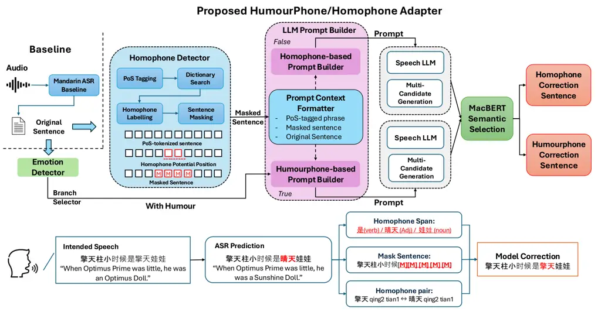
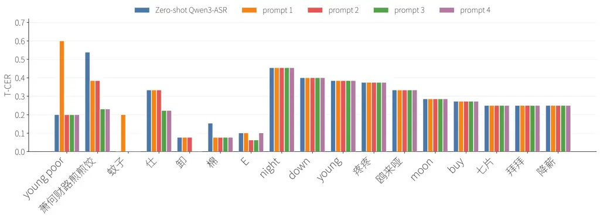

# Mandarin Humorous Homophone Recognition and Disambiguation in Automatic Speech Recognition

###### Abstract

Mandarin homophones remain a key challenge to improving automatic speech
recognition (ASR) accuracy due to the amount of potential homophones.
Mandarin speakers use this feature casually to convey emotions such as
humour. Recent homophone-aware ASR studies have improved recognition
accuracy, but intentional homophone twists in speech remain
underexplored. In this paper, we identify patterns of homophone-based
rhetorical wordplay in Mandarin, referred to as _HumourPhone_, and
propose an ASR Adapter for homophone and HumourPhone recovery.
Experimental results show that the proposed approach improves the recall
of recognising HumourPhone by over 5% and achieves a 4.35% drop in
target-span character error rate for homophone correction compared to
baseline. These results highlight the need for homophone-aware modelling
of lexical ambiguity and rhetorical wordplay in Mandarin speech
recognition.

Sicheng
Jin[](https://orcid.org/0009-0009-4492-8146)^(1,∗),
Jinghao
Chen[](https://orcid.org/0009-0004-3707-0747)^(2,∗),
Liuheng
Zhou[](https://orcid.org/0009-0009-0861-9071)²,
Mostafa
Shahin[](https://orcid.org/0000-0002-1091-8531)²,
Beena
Ahmed[](https://orcid.org/0000-0002-1240-6572)²,
Aditya
Joshi[](https://orcid.org/0000-0003-2200-9703)¹

¹School of Computer Science & Engineering, UNSW Sydney, Australia  
²School of Electrical Engineering & Telecommunications, UNSW Sydney,
Australia

{z5317861,z5327748,z5271696,m.shahin,beena.ahmed,z3539958}@unsw.edu.au

¹¹footnotetext: Equal contribution

Index Terms: speech recognition, Mandarin HumourPhone, computational
paralinguistics

## 1 Introduction

Mandarin ASR systems and speech LLMs have achieved strong performance
across a wide range of speech understanding tasks. However, they still
struggle in homophone-rich scenarios, where the same or similar
pronunciations map to semantically distinct written forms \[1\]. This
challenge is amplified for rare, context-dependent, or deliberately
playful forms, as models tend to output high-frequency lexical
choices \[2\]. Mandarin Chinese has a high density of homophones due to
its tonal system and constrained syllable inventory; over 62.2% of
Chinese characters have been reported to exhibit homophonic
features \[1\]. Speakers often exploit this ambiguity for rhetorical
wordplay and humour, including homophonic puns, allegorical sayings, and
online linguistic creativity \[3, 4, 5\]. Such wordplay may involve
identical homophones with the same syllable and tone, or near homophones
with small phonetic shifts \[6\]. This makes Mandarin homophones
challenging for speech models, as current speech LLMs still struggle to
capture subtle prosodic and pitch cues that interact with syntax,
semantics, and pragmatics \[7\]. In this work, HumourPhone refers to
utterances that evoke a familiar word or scenario through phonetic
ambiguity and introduce an unexpected semantic twist \[8, 9\].

Across languages, prior work has addressed homophones and phonetic
ambiguity by explicitly incorporating pronunciation information. In
Mandarin ASR, pronunciation-aware encodings, homophone-based label
smoothing, and phonological speech attributes have been used to reduce
character confusion and distinguish acoustically similar forms \[10, 11,
12\]. Contextual biasing further uses homophone detectors to correct
low-confidence outputs \[13\]. Related approaches include
homophone-aware decoding for low-resource Cantonese ASR \[14\] and
staged recognition and interpretation of spoken puns in English
audio-language models \[15\]. Together, these studies highlight the
value of linking pronunciation with candidate written forms and
contextual interpretation.

Recent Mandarin homophone studies provide further evidence for this
pronunciation–orthography–context connection. Beyond phonological
ambiguity, homophones have been studied as intentional devices in
internet slang, memes, humour, and toxicity evasion \[16, 17\]. Existing
methods therefore often combine phonological cues with higher-level
interpretation, including pinyin-guided reasoning \[18\], multimodal
chain-of-thought (CoT) verification for homophone and pun
understanding \[19\], and template-based or sequence-to-sequence
generation supported by human-engineered lexicons \[20\]. However, these
methods generally rely on auxiliary textual, phonological, or
lexicon-based information and are mainly designed for homophone
disambiguation rather than speech-based humourphone, where the intended
written form and humorous semantic twist must be inferred directly from
audio.

In this work, we focus on speech-based Mandarin humourphone recognition
and correction, aiming to identify intentional homophone-based wordplay
in speech and restore its intended written form. Ordinary homophone
correction is also reported as a secondary evaluation setting. We
propose a task-conditioned ASR adaptation framework that detects
potential humourphone spans, generates LLM-based candidates, and selects
contextually appropriate corrections. Our contributions are: 1) a
humourphone-oriented ASR adapter that also supports ordinary homophone
correction; 2) a target-aware evaluation protocol for measuring
recognition and correction within annotated regions; and 3) a
humourphone dataset for evaluating speech models on homophone-based
wordplay.



Figure 1: Workflow of the proposed adapter for potential-span-based
homophone correction and humourphone recovery. In the bottom diagram,
intended speech refers to the input audio, ASR prediction refers to the
original sentence (i.e. baseline), while the three subsequent blocks are
the output of the Homophone Detector.

## 2 Methodology

Fig. 1 illustrates the proposed task-conditioned adapter for Mandarin
homophone correction and humourphone recovery. We define homophones as
words with similar or identical pronunciation but different meanings,
and humourphones as homophones used intentionally for humorous effect.
Given an utterance, the system first obtains an ASR transcription and
routes it to either the homophone or humourphone branch using an emotion
detector. Branch-specific contextual information is then converted into
prompts for the speech LLM, which generates multiple candidate
transcriptions from the original audio. A semantic selector chooses the
final output while balancing correction accuracy and overcorrection
risk.

### 2.1 Humourphone Dataset Construction

We collect Humourphone instances from internet sources, including text
and images containing textual wordplay, and manually extract and
normalise image text. As no publicly available Mandarin speech corpus
specifically targets intentional humorous homophones, we synthesise
Mandarin audio from the collected text using Microsoft Edge TTS \[21\],
resulting in 80 audio samples. The dataset therefore serves as a
controlled evaluation set for humourphone recovery rather than a
comprehensive representation of natural humorous speech. We manually
remove samples with unreliable pronunciation, ambiguous polyphonic
characters, inappropriate or non-humorous content, and rare derogatory
expressions. The final set contains Full Homophones with identical
pronunciation and Near Homophones with slight phonemic variation.

### 2.2 Humourphone Pattern Guidelines

Based on the retained samples and literature on Mandarin homophonic
wordplay \[8, 9\], we identify recurring humourphone patterns to guide
the emotion detector and the prompt builder in the humourphone branch.
These cases typically involve a recognisable source expression,
scenario, or discourse structure that is intentionally disrupted through
identical or near-homophonic substitution. We summarise the observed
patterns into six prompt-level guidelines: Phonetic Phrase Deviation,
Phonetic Code-Switching, Rapid Q&A and Punchline Structure,
Anachronistic Semantic Clashes, Typographical and Visual Wordplay, and
Anthropomorphic Attribution. These guidelines cover cases where
homophones modify idioms or fixed expressions, imitate foreign words,
letters, or numbers, create compact setup–punchline structures, or rely
on contextual, visual, or anthropomorphic incongruity. Rather than
serving as strict linguistic categories, these guidelines help
distinguish intentional homophonic wordplay from ordinary ASR errors.

### 2.3 Homophone and Humourphone Adapter

The proposed adapter consists of a Homophone Detector, a branch-specific
LLM prompt builder, and an output selector. Given an ASR transcription,
the Homophone Detector performs PoS-aware span detection, while an
Emotion Detector using an external API routes the utterance to either
the homophone or humourphone branch.

We segment and PoS-tag the transcription using Jieba \[22\]. Suspicious
lexical units and local combinations are identified by comparison with a
Chinese word-frequency dictionary \[23\]. To account for segmentation
uncertainty, we retain the top three suspicious spans and expand them
with neighbouring PoS-tagged context before masking. The LLM is then
prompted to generate two alternatives in addition to the original
transcription, with modifications constrained primarily to the masked
span to avoid unrestricted sentence-level rewriting. The homophone
branch encourages homophone or near-homophone substitutions, while the
humourphone branch additionally incorporates the pattern guidelines in
Section 2.2.

For homophone correction, candidates are ranked using a MacBERT-based
naturalness score \[24\]. For a candidate transcription
$`x=(x_{1},\dots,x_{N})`$, we compute the masked pseudo-log-likelihood
as

```math
S(x)=\frac{1}{N}\sum_{i=1}^{N}\log p_{\mathrm{MacBERT}}\left(x_{i}\mid x_{\mathrm{mask}}^{(i)}\right), \tag{1}
```

where $`x_{\mathrm{mask}}^{(i)}`$ denotes the transcription obtained by
replacing token $`x_{i}`$ with \[MASK\]. A higher $`S(x)`$ indicates a
more contextually natural candidate. The original transcription is
retained when an alternative does not provide sufficient improvement,
reducing overcorrection. In the humourphone branch, selection
additionally considers consistency with the detected homophonic pattern
while allowing the semantic incongruity characteristic of intentional
wordplay.

## 3 Experiments and Results

### 3.1 Data

We construct Mandarin homophone evaluation sets from AISHELL-3
(AS-3) \[25\] and CommonVoice 25 Chinese (CV25-CN) \[26\]. We identify
homophone targets using the ChineseHomophones dictionary \[27\]. The
final CN Dataset is formed by merging the subsets using unique
pinyin-based homophone categories, and removing invalid targets such as
person and location names. HumourPhone is excluded from this merged set
due to its small scale and is evaluated separately for humour-oriented
analysis. Table 1 summarises the resulting datasets.

|                          |             |           |        |
| ------------------------ | ----------- | --------- | ------ |
| Dataset                  | Hom. Groups | Hom. Occ. | Hours  |
| CN Dataset (with filter) | 1,303       | 85,706    | 125.73 |
| HumourPhone (proposed)   | 80          | 80        | 0.08   |

Table 1: Statistics of the evaluation datasets. CN Dataset combines
filtered AS-3 and CV25-CN, while HumourPhone is constructed for humour
evaluation. Hom. Groups and Hom. Occ. denote homophone groups and
occurrences.

### 3.2 Experimental Setup

We evaluate Mandarin homophone ASR on the merged CN Dataset in an
inference-only setting. We compare Qwen3-ASR \[28\] and
Whisper-v3 \[29\], a prompt-only Qwen3-LLM baseline using a single
generic homophone-aware instruction, and the proposed emotion-guided
adapter. Unlike the baseline, the adapter prompt incorporates detected
suspicious spans, masked local context, PoS information, and, for the
humourphone branch, the pattern guidelines in Section 2.2.
Qwen2.5-7B-Instruct \[30\] generates two alternatives plus the original
transcription using deterministic decoding ($`T=0`$, maximum 256 new
tokens).

For frequency-based analysis, targets are labelled as common or uncommon
using corpus frequency and a word-frequency dictionary \[23\]. The
adapter uses Jieba \[22\] for span processing, Chinese
MacBERT-large \[24\] for naturalness-based selection, and GPT-5.5 via
the OpenAI API \[31\] for routing. The emotion detector achieves 97.0%
and 76.0% accuracy on Qwen3-ASR and Whisper-v3 HumourPhone transcripts,
respectively, indicating sensitivity to upstream ASR outputs. All
references and outputs are normalised to Simplified Chinese with
numerals expanded into Mandarin written forms.

### 3.3 Evaluation Metrics

We evaluate Mandarin homophone ASR using target-span character error
rate (T-CER), computed by character-level Levenshtein distance \[32\]
over annotated target spans only. For correction, we report Recovery
Rate (RR), the proportion of initially incorrect targets corrected by
the pipeline, and Detection Rate (DetR), which measures whether an
annotated target span overlaps with a predicted mask span.

For HumourPhone, we use T-CER and Mean Uncommon Recall (MUR), which
measure recall over uncommon HumourPhone characters in the target span.
We also report MacBERT-based Utterance-level Semantic Similarity (USS)
and Target-span Semantic Similarity (TSS) to assess semantic consistency
at full-utterance and target-span levels.

### 3.4 Homophone Differentiation

Table 2 reports the effect of the proposed adapter on Whisper-v3 and
Qwen3-ASR across common and uncommon homophone targets. We also evaluate
a prompt-only speech-LLM baseline, Qwen3-LLM, but omit it from the table
to focus on the adapter comparison. This baseline does not improve over
Qwen3-ASR, with overall T-CER increasing slightly from 3.60% to 3.70%.
This suggests that instruction-only speech-LLM decoding is insufficient
for fine-grained homophone correction, as the model may struggle to
locate suspicious homophone spans and can introduce incorrect
substitutions.

With the proposed adapter, Whisper-v3 improves on both frequency groups.
T-CER decreases from 6.43% to 5.07% on common forms, and more
substantially from 24.74% to 20.39% on uncommon forms. The larger 4.35%
drop on uncommon homophones suggests that the adapter is particularly
useful for correcting less frequent lexical choices. This is also
reflected in the higher RR of Whisper-v3+Adapter, since Whisper-v3
produces more unstable lexical realisations and occasional phrase-level
errors in Mandarin transcription, leaving more recoverable errors for
span-level correction.

For Qwen3-ASR, the adapter reduces T-CER on uncommon homophones from
13.56% to 12.85%, indicating that span-level correction remains useful
for less frequent lexical forms. In contrast, T-CER on common homophones
increases from 2.19% to 3.42%. Since Qwen3-ASR already achieves a low
error rate on common forms, there is limited room for further
correction, and unnecessary substitutions can instead introduce errors
into otherwise correct outputs. Qualitative inspection shows that many
of the remaining Qwen3-ASR errors involve highly confusable lexical
variants, such as the alternative written forms ”部份” and ”部分”.
Overall, this suggests that the adapter is most beneficial for difficult
or uncommon homophones, while stronger ASR outputs require more
conservative correction to avoid overcorrection.

|            |          |        |                      |        |                   |                 |
| ---------- | -------- | ------ | -------------------- | ------ | ----------------- | --------------- |
| Model      | Type     | Occ.   | T-CER $`\downarrow`$ |        | DetR $`\uparrow`$ | RR $`\uparrow`$ |
|            |          |        | Base                 | Adapt. |                   |                 |
| Whisper-v3 | Common   | 75,079 | 6.43                 | 5.07   | 37.22             | 7.18            |
|            | Uncommon | 10,627 | 24.74                | 20.39  | 47.27             | 20.87           |
| Qwen3-ASR  | Common   | 75,079 | 2.19                 | 3.42   | 44.42             | 2.79            |
|            | Uncommon | 10,627 | 13.56                | 12.85  | 50.67             | 8.94            |

Table 2: Baseline (Base) and adapter-enhanced (Adapt.) ASR performance
on the CN Dataset. T-CER, DetR, and RR denote target CER, detection
rate, and recovery rate. Common/uncommon indicate high-/low-frequency
reference forms. All values are percentages.



Table 3: Comparison of predictions from ASR prompt variants for
non-full-homophone, full-homophone, and overall humourphone cases. The
USS and TSS are calculated from the MacBERT Semantic Selector. We
compare the candidates produced by the Speech LLM with candidates
produced by prompts constructed with the Homophone Detector.

|                                   |                      |                  |                  |                  |                      |                  |                  |                  |                      |                  |                  |                  |
| --------------------------------- | -------------------- | ---------------- | ---------------- | ---------------- | -------------------- | ---------------- | ---------------- | ---------------- | -------------------- | ---------------- | ---------------- | ---------------- |
|                                   | Near-homophone       |                  |                  |                  | Full-homophone       |                  |                  |                  | Overall              |                  |                  |                  |
| Method                            | T-CER $`\downarrow`$ | MUR $`\uparrow`$ | USS $`\uparrow`$ | TSS $`\uparrow`$ | T-CER $`\downarrow`$ | MUR $`\uparrow`$ | USS $`\uparrow`$ | TSS $`\uparrow`$ | T-CER $`\downarrow`$ | MUR $`\uparrow`$ | USS $`\uparrow`$ | TSS $`\uparrow`$ |
| Qwen3-ASR                         | 11.61                | 0.6116           | 0.9902           | 0.9793           | 16.96                | 0.3095           | 0.9814           | 0.9614           | 15.21                | 0.4043           | 0.9854           | 0.9696           |
| 1-English-basic                   | 13.15                | 0.6295           | 0.9924           | 0.9818           | 17.33                | 0.2810           | 0.9796           | 0.9596           | 15.97                | 0.3903           | 0.9855           | 0.9697           |
| 2-Chinese-basic                   | 10.65                | 0.6295           | 0.9904           | 0.9798           | 16.50                | 0.3381           | 0.9814           | 0.9614           | 14.59                | 0.4295           | 0.9856           | 0.9697           |
| 3-Chinese-guidelines              | 9.69                 | 0.6473           | 0.9931           | 0.9823           | 15.92                | 0.3667           | 0.9812           | 0.9629           | 13.88                | 0.4547           | 0.9867           | 0.9718           |
| 4-Chinese-guidelines with example | 9.69                 | 0.6473           | 0.9931           | 0.9823           | 16.15                | 0.3381           | 0.9814           | 0.9596           | 14.04                | 0.4351           | 0.9868           | 0.9700           |

Figure 2: T-CER of different humourphone words transcribed by Qwen3-ASR
across prompt variants. Some prompts reached T-CER=0 for certain words,
hence the missing bars.

### 3.5 HumourPhone Contextual Adaptation

We further evaluate Qwen3-ASR \[28\] on the constructed HumourPhone
dataset, which contains humorous Mandarin utterances involving
humour-bearing homophones. Unlike homophone evaluation, the target word
may be intentionally ambiguous or semantically unexpected due to
wordplay. This experiment examines whether ASR can recover such
humour-bearing target spans under different levels of contextual
guidance. As shown in Table 3, we compare a zero-shot Qwen3-ASR \[28\]
baseline with four prompt settings. In the zero-shot setting, the audio
is transcribed without any task-specific instruction. For Prompts 1–4,
we progressively modify the instructions used by the HumourPhone-based
prompt builder, following the guidelines in Section 2.2. Initially, we
provide the context only in English; for subsequent prompts, we change
the instruction to Chinese. In prompt 3, we incorporate all the
aforementioned guidelines, and we provide an example for prompt 4. We
evaluate all settings using the metrics defined in Section 3.3.

Contextual prompting can improve the model’s ability to disambiguate
intentional wordplay, although the effect depends on the prompt design.
Prompt 1 slightly degrades performance relative to the zero-shot
baseline, increasing the overall mean T-CER by 0.76%, from 15.21% to
15.97%. However, with richer contextual background, this trend reverses
starting with prompt 2. Prompt 3 achieves the strongest overall
performance, reducing mean T-CER by 8.7% relative, from 15.21% to
13.88%. The improvement is more pronounced for near-homophones, where
T-CER decreases by 16.5% relative, from 11.61% to 9.69%. Near-homophone
TSS also increases by an absolute 0.003, reaching 0.9823. However,
prompt 4 slightly worsened the overall performance. These results
suggest that targeted contextual information generally helps the model
select the intended, less frequent humourphone characters rather than
defaulting to common homophones.

However, as illustrated in Figure 2, the gains remain limited,
especially for full homophones. The difference in gains is not
associated with whether the humourphone substitution is fully Chinese or
bilingual. For example, the leftmost phrase ”young poor” is a
humourphone of the Chinese word ”杨浦”, which had a lower T-CER than the
full Chinese pair ”仕” and ”事”. Since full homophones share identical
syllables and tones, the model cannot rely on phonetic deviation and
must instead infer the intended humorous form from contextual and
pragmatic cues. Therefore, prompting alone is insufficient for robust
HumourPhone recovery. Future work should incorporate more HumourPhone
examples and confidence-aware correction strategies to improve accuracy
and reduce over-correction.

## 4 Conclusion

This paper proposed a task-conditioned ASR adapter for Mandarin
homophone recognition and humourphone recovery. Results show that
standard ASR systems favour common homophone forms, while simple LLM
prompting provides limited gains. Adapter-based post-processing and
targeted prompting show promising results for both ordinary homophone
correction and humourphone recovery. The main limitations are the small
synthetic HumourPhone dataset, lack of human evaluation, high LLM
inference cost, and occasional overcorrection. Future work will expand
natural-speech evaluation, incorporate human assessment, and reduce
overcorrection.

## References

- \[1\] Y. Sun, Y. Qin, W. Chen, X. Li, and C. Li (2025) Context-aware
  multimodal fusion with sensor-augmented cross-modal learning: the blaf
  architecture for robust chinese homophone disambiguation in dynamic
  environments. Applied Sciences 15 (13), pp. 7068. Cited by: §1.
- \[2\] L. Fu, Y. Xin, S. Zeng, L. Fan, Y. Wu, and X. He (2026) PAC:
  pronunciation-aware contextualized large language model-based
  automatic speech recognition. In ICASSP 2026-2026 IEEE International
  Conference on Acoustics, Speech and Signal Processing (ICASSP),
  pp. 16377–16381. Cited by: §1.
- \[3\] R. Xu (2024) Exploring chinese humor generation: a study on
  two-part allegorical sayings. In 2024 International Joint Conference
  on Neural Networks (IJCNN), pp. 1–8. Cited by: §1.
- \[4\] A. S. Partington (2009) A linguistic account of wordplay: the
  lexical grammar of punning. Journal of Pragmatics 41 (9),
  pp. 1794–1809. Cited by: §1.
- \[5\] D. A. Alindra, F. Y. Siregar, and D. S. P. Siregar (2026) Online
  language phenomena in modern mandarin: a linguistic study of popular
  expressions and digital neologisms. Linguistik, Terjemahan, Sastra
  (LINGTERSA) 7 (1), pp. 59–69. Cited by: §1.
- \[6\] C. Hiruncharoenvate, Z. Lin, and E. Gilbert (2015)
  Algorithmically bypassing censorship on sina weibo with
  nondeterministic homophone substitutions. In Proceedings of the
  international AAAI conference on web and social media, Vol. 9,
  pp. 150–158. Cited by: §1.
- \[7\] Z. Wang, X. Zhang, X. Jiang, K. Song, and J. Yu (2025) Can ai
  understand mandarin speech prosody? a framework and benchmark
  showcase. In Proc. Interspeech 2025, pp. 5378–5382. Cited by: §1.
- \[8\] N. Xu, J. Sheng, C. Li, C. Zhou, Y. Li, T. Du, J. Wang, Z.
  Fu, J. Li, and S. Ji (2026) ” I see what you did there”: can large
  vision-language models understand multimodal puns?. arXiv preprint
  arXiv:2604.05930. Cited by: §1, §2.2.
- \[9\] S. Hong (2024) Homophones in mandarin chinese. International
  Journal of Linguistics 16, pp. 79. External Links:
  [Document](https://dx.doi.org/10.5296/ijl.v16i6.22504) Cited by: §1,
  §2.2.
- \[10\] Y. Zheng, X. Yang, and X. Dang (2020) Homophone-based label
  smoothing in end-to-end automatic speech recognition. arXiv preprint
  arXiv:2004.03437. Cited by: §1.
- \[11\] P. Shen, X. Lu, and H. Kawai (2023) Pronunciation-aware unique
  character encoding for rnn transducer-based mandarin speech
  recognition. In 2022 IEEE Spoken Language Technology Workshop (SLT),
  pp. 123–129. Cited by: §1.
- \[12\] J. Chen, M. Shahin, and B. Ahmed (2026) Using
  phonological-level wav2vec2 for mandarin automatic mispronunciation
  detection and diagnosis. In Proceedings of Interspeech 2026, Note:
  arXiv:2606.22022 Cited by: §1.
- \[13\] C. Yang, L. Zheng, S. Tian, G. Cheng, S. Xiao, and T. Li (2024)
  Contextual biasing with confidence-based homophone detector for
  mandarin end-to-end speech recognition.. In INTERSPEECH, Cited by: §1.
- \[14\] H. Chung, J. Li, P. Liu, W. Leung, X. Wu, and H. Meng (2022)
  Improving rare words recognition through homophone extension and
  unified writing for low-resource cantonese speech recognition. In
  Proc. ISCSLP, pp. 26–30. External Links:
  [Document](https://dx.doi.org/10.1109/ISCSLP57327.2022.10038220) Cited
  by: §1.
- \[15\] Y. Su, S. Zhong, Y. Zhu, R. Wang, Z. Huang, Q. Wang, N.
  Zhao, D. Benavides-Prado, and M. Witbrock (2026) Words at play:
  benchmarking audio pun understanding in large audio-language models.
  arXiv preprint arXiv:2603.18678. Cited by: §1.
- \[16\] D. Lin, T. Lan, J. Zhu, J. Li, W. Chen, X. Liu, X. Su, H.
  Hou, G. Gao, et al. (2026) Exploring the capability boundaries of llms
  in mastering of chinese chouxiang language. arXiv preprint
  arXiv:2604.15841. Cited by: §1.
- \[17\] H. Guo, J. He, J. Ma, H. Na, Z. Wang, H. Zhang, Q. Chen, W.
  Wang, Z. Shi, T. Shen, et al. (2025) Lost in pronunciation: detecting
  chinese offensive language disguised by phonetic cloaking replacement.
  In Proceedings of the 2025 Conference on Empirical Methods in Natural
  Language Processing: Industry Track, pp. 2538–2550. Cited by: §1.
- \[18\] J. Ma, Z. Feng, H. Song, E. Chersoni, and Z. Chen (2025)
  Reasoning or memorization? investigating llms’ capability in restoring
  chinese internet homophones. In Proceedings of the 3rd Workshop on
  Towards Knowledgeable Foundation Models (KnowFM), pp. 120–139. Cited
  by: §1.
- \[19\] Z. Wang, Y. Rong, D. Jiang, H. Wu, S. Zhou, and B. Xu (2024)
  Cieasr: contextual image-enhanced automatic speech recognition for
  improved homophone discrimination. In Proceedings of the 32nd ACM
  International Conference on Multimedia, pp. 915–924. Cited by: §1.
- \[20\] Y. Su, Y. Zhu, R. Wang, Z. Huang, D. Benavides-Prado, and M.
  Witbrock (2025) A survey of pun generation: datasets, evaluations and
  methodologies. Findings of the Association for Computational
  Linguistics: EMNLP 2025, pp. 7375–7395. Cited by: §1.
- \[21\] rany2 (2026) Edge-tts. Note:
  [https://pypi.org/project/edge-tts/](https://pypi.org/project/edge-tts/)Python
  package version 7.2.8 Cited by: §2.1.
- \[22\] J. Sun (2026) jieba: Chinese Text Segmentation. Note:
  [https://github.com/fxsjy/jieba](https://github.com/fxsjy/jieba)Python
  Chinese word segmentation toolkit Cited by: §2.3, §3.2.
- \[23\] lxs602 Chinese Word Frequencies. Note:
  [https://github.com/lxs602/Chinese-Mandarin-Dictionaries/tree/main/Chinese%20Word%20Frequencies](https://github.com/lxs602/Chinese-Mandarin-Dictionaries/tree/main/Chinese%20Word%20Frequencies)Aggregated
  Chinese character and word frequency resource; Cited by: §2.3, §3.2.
- \[24\] Y. Cui, W. Che, T. Liu, B. Qin, S. Wang, and G. Hu (2020)
  Revisiting pre-trained models for Chinese natural language processing.
  In Proceedings of the 2020 Conference on Empirical Methods in Natural
  Language Processing: Findings, Online, pp. 657–668. External Links:
  [Link](https://www.aclweb.org/anthology/2020.findings-emnlp.58) Cited
  by: §2.3, §3.2.
- \[25\] Y. Shi, H. Bu, X. Xu, S. Zhang, and M. Li (2021) AISHELL-3: A
  Multi-Speaker Mandarin TTS Corpus and the Baselines. In Proceedings of
  INTERSPEECH, pp. 2756–2760. External Links:
  [Document](https://dx.doi.org/10.21437/Interspeech.2021-755),
  [Link](https://arxiv.org/abs/2010.11567) Cited by: §3.1.
- \[26\] Common Voice (2026) Common Voice Scripted Speech 25.0 – Chinese
  (China). Note: Mozilla Data CollectiveDataset ID:
  cmn3iaztg00e4mb070uvufz7q; License: CC0-1.0 External Links:
  [Link](https://mozilladatacollective.com/datasets) Cited by: §3.1.
- \[27\] LiangsLi (2020) ChineseHomophones: chinese homophone word and
  character lexicon. Note:
  [https://github.com/LiangsLi/ChineseHomophones](https://github.com/LiangsLi/ChineseHomophones)GitHub
  repository, accessed 9 June 2026 Cited by: §3.1.
- \[28\] X. Shi, X. Wang, Z. Guo, Y. Wang, P. Zhang, X. Zhang, Z.
  Guo, H. Hao, Y. Xi, B. Yang, J. Xu, J. Zhou, and J. Lin (2026)
  Qwen3-asr technical report. arXiv preprint arXiv:2601.21337. External
  Links: [Link](https://arxiv.org/abs/2601.21337) Cited by: §3.2, §3.5.
- \[29\] A. Radford, J. W. Kim, T. Xu, G. Brockman, C. McLeavey, and I.
  Sutskever (2022) Robust speech recognition via large-scale weak
  supervision. arXiv preprint arXiv:2212.04356. External Links:
  [Document](https://dx.doi.org/10.48550/arXiv.2212.04356),
  [Link](https://arxiv.org/abs/2212.04356) Cited by: §3.2.
- \[30\] Q. Team (2024) Qwen2.5: a party of foundation models. External
  Links: [Link](https://qwenlm.github.io/blog/qwen2.5/) Cited by: §3.2.
- \[31\] OpenAI (2026) GPT-5.5 System Card. Note:
  [https://openai.com/index/gpt-5-5-system-card/](https://openai.com/index/gpt-5-5-system-card/)Accessed:
  2026-09-03 Cited by: §3.2.
- \[32\] V. I. Levenshtein (1966) Binary codes capable of correcting
  deletions, insertions and reversals. Soviet Physics Doklady 10,
  pp. 707–710. Cited by: §3.3.
