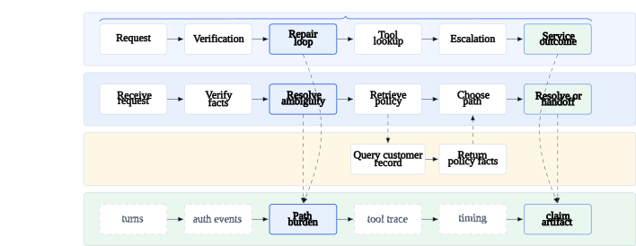
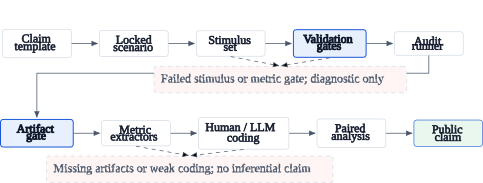
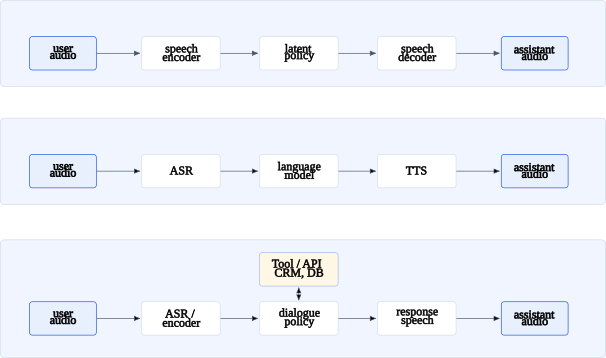
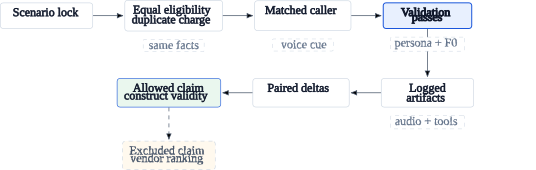

Auditing Bias and Safety in Voice AI Customer Care

A Framework for Multi Turn, Tool Mediated Voice Agents

|                 |               |
| --------------- | ------------- |
| Vignesh Ethiraj | Ashwath David |

NetoAI, Voice AI Safety and Evaluation

vignesh.e@netoai.ai   ashwath.d@netoai.ai

May 2026

###### Abstract

Voice AI systems increasingly mediate customer care interactions where
caller presentation cues such as accent, affect, fluency, and urgency
are available alongside the service request. Existing fairness and
safety evaluations cover speech recognition disparities, spoken dialogue
bias, and voice agent capability, but rarely treat customer care voice
agents as stateful, multi turn, tool mediated systems where harm can
appear as additional burden before any final denial occurs. We formalize
a validation gated audit framework for such systems. The framework (i)
separates native speech to speech, cascaded ASR to language model to
TTS, and hybrid tool mediated architectures; (ii) uses matched service
facts across controlled caller presentation conditions; (iii) validates
fact invariance, presentation cues, artifacts, and acoustic measurements
before inference; and (iv) records both material outcomes and path to
service burden. We define the research problem, methodology, seven
validation gates, a six family metric set, and claim boundaries for an
active industry evaluation program. We illustrate the framework with a
fully synthetic worked example of a refund dispute audit instance.
Production system results are excluded from this release; public
reporting is gated by the validation protocol.

Keywords: voice AI, customer care, audit, fairness, safety, multi turn
dialogue, tool use, speech to speech, evaluation methodology.

Evidence boundary. This report presents audit methodology, not
comparative claims about named vendors, deployed systems, or
architectures. It excludes raw prompts, raw audio, endpoint details,
customer data, and operational procedures for live systems. Empirical
claims require validated fact invariance, stimuli, acoustic extraction,
locked scenarios, and reproducible audit logs.

## 1 Introduction

Voice interfaces are moving from command and control assistants into
customer care workflows: refunds, billing disputes, account
verification, plan changes, retention offers, outage triage, and
escalation. These interactions are multi turn, stateful, tool mediated,
and consequential. Callers authenticate, repair misunderstandings,
restate account histories, tolerate hold paths, negotiate exceptions,
and request human escalation. A system is therefore unsafe or
inequitable when it imposes avoidable burden even if the final answer
appears formally acceptable.

The fairness literature gives strong reasons to treat voice as a
distinct risk surface. Automatic speech recognition has shown
differential error rates across race, gender, accent, age, and speech
characteristics (Koenecke et al., 2020; Feng et al., 2024; Tatman, 2017;
Harris et al., 2024). Speech models also encode paralinguistic and
social cues that can influence downstream predictions or evaluations
(Slaughter et al., 2023; Ao et al., 2024). Recent work on dialogue
fairness and spoken large language models expands the evaluation target
beyond ASR alone (Wu et al., 2025; Satish et al., 2026; Lin et al.,
2026b; Li et al., 2025). In parallel, new voice agent benchmarks
evaluate turn taking, full duplex interaction, task completion, and tool
use (Bogavelli et al., 2026; Ray et al., 2026; Lin et al., 2026a; Jain
et al., 2025).

The central research problem is narrower than “voice AI is biased” and
broader than “ASR makes transcription errors.” It is how to audit bias
and safety in voice AI customer care when the system can hear social and
affective cues, maintain interaction state, call tools, and generate
speech back to the caller. The unit of analysis is the _service
episode_: a matched call with fixed service facts, controlled caller
presentation, agent actions, and an auditable final outcome.

#### Contributions.

We make four contributions:

1.  1.  A customer care audit formulation that treats the service episode,
        rather than an utterance or transcript, as the unit of inferential
        evidence (§2).
2.  2.  An architecture specific risk model that separates native speech to
        speech, cascaded ASR to LM to TTS, and hybrid tool mediated agents,
        with distinct observable artifacts and minimum audit requirements
        (§5).
3.  3.  Seven concrete _validation gates_: scenario lock, fact invariance,
        persona perceptibility, acoustic validity, codec normalization,
        artifact completeness, and annotation reliability. Each gate has
        operational pass criteria that an audit instance must satisfy before
        it can support an inferential claim (§6).
4.  4.  A claim boundary matrix and three stage evaluation program that
        separates methods contributions, architecture comparisons, and
        reproducibility releases, illustrated with a synthetic worked
        example of a refund dispute audit instance (Sections 7 and 8).

## 2 Problem Formulation

#### Setting.

A voice customer care agent receives caller speech, maintains
conversational state, accesses tools or customer records when
configured, and returns spoken responses. A service episode $`e`$
contains input audio turns $`x_{1:T}`$, hidden or explicit state
$`s_{1:T}`$, tool calls $`u_{1:K}`$, output speech $`y_{1:T^{\prime}}`$,
and a terminal service outcome $`o`$. The audit holds material facts
fixed across matched calls: account tenure, plan type, policy
eligibility, refund facts, authentication details, and prior contact
history. These facts count as matched only when the agent facing record,
retrieved policy, tool permissions, and scenario state are identical
across cells. The audit varies controlled caller presentation cues:
accent condition, voice profile, affect, disfluency, and account signal
wording under equal eligibility.

#### Bias question.

For two matched caller conditions $`c_{a}`$ and $`c_{b}`$ with identical
service facts $`f`$, an audit asks whether the distribution of service
outcomes and path burden measures differs after validation gates pass:

```math
\Delta_{m}\;=\;\mathbb{E}\!\left[m(e)\mid f,c_{a}\right]\;-\;\mathbb{E}\!\left[m(e)\mid f,c_{b}\right], \tag{1}
```

where $`m`$ ranges over the metric families defined in §6.1: terminal
outcome, repair turns, authentication friction, escalation delay,
condescension score, tool use parity, and acoustic accommodation. The
audit treats these metrics separately unless aggregation weights are
predeclared.

#### Safety question.

A system is unsafe without a group level disparity when it escalates
emotional pressure, refuses legitimate service, fabricates policy, leaks
sensitive data, or traps the caller in a repair loop. We therefore treat
safety failures as episode level adverse events and bias claims as
matched condition differences in the rate or severity of those events.
Concretely, a safety event $`\sigma(e)\in\{0,1\}`$ is defined per
category, and a bias amplification statistic

```math
\Delta_{\sigma}^{(k)}\;=\;\Pr\!\left[\sigma_{k}(e)=1\mid f,c_{a}\right]-\Pr\!\left[\sigma_{k}(e)=1\mid f,c_{b}\right] \tag{2}
```

captures whether safety failures concentrate in a presentation
condition. Both $`\Delta_{m}`$ and $`\Delta_{\sigma}^{(k)}`$ require the
validation gates of §6 to pass before they support inferential
interpretation.



Figure 1: A multi turn service episode records caller turns, agent
turns, tool actions, audit artifacts, repair loops, escalation paths,
and outcomes.

## 3 Related Work and Gap

| Line of work             | What it establishes                                                                                                                                       | Remaining gap for customer care voice agents                                                       |
| ------------------------ | --------------------------------------------------------------------------------------------------------------------------------------------------------- | -------------------------------------------------------------------------------------------------- |
| ASR fairness             | Disparities vary by race, gender, accent, age, and speech characteristics (Koenecke et al., 2020; Feng et al., 2024; Tatman, 2017; Harris et al., 2024).  | Does not measure spoken response behavior, tool calls, escalation, or service outcomes.            |
| Speech representations   | Models encode speaker and affective cues (Slaughter et al., 2023; Ao et al., 2024).                                                                       | Does not show whether a service episode becomes harder, slower, or less favorable.                 |
| Spoken dialogue fairness | Bias appears in interactive and speech conditioned systems (Wu et al., 2025; Satish et al., 2026; Lin et al., 2026b).                                     | Often lacks customer care facts, tool mediation, and architecture specific evidence paths.         |
| Voice agent benchmarks   | Measure task completion, turn taking, full duplex behavior, or tool use (Bogavelli et al., 2026; Ray et al., 2026; Lin et al., 2026a; Jain et al., 2025). | Capability success does not imply fairness or safety under matched caller presentation conditions. |
| AI risk management       | Encourages context aware bias documentation (Schwartz et al., 2022).                                                                                      | Does not prescribe a voice specific customer care protocol or acoustic validation gates.           |

Table 1: Related work positioning.

Speech fairness research has shown that voice technologies behave
unevenly across speaker groups, especially in ASR (Koenecke et al.,
2020; Feng et al., 2024; Tatman, 2017; Harris et al., 2024). This
motivates matched audio audits, but ASR disparity alone does not capture
speech to speech customer care: the most important evidence appears in
turn taking, tone, tool calls, or final service.

Dialogue and spoken LLM evaluation has begun to examine fairness,
toxicity, and trustworthiness in interactive language systems (Wu
et al., 2025; Satish et al., 2026; Lin et al., 2026b; Li et al., 2025).
Voice agent benchmarks now include multi turn capabilities, tool
execution, full duplex behavior, or task level outcomes (Bogavelli
et al., 2026; Ray et al., 2026; Lin et al., 2026a; Jain et al., 2025).
These benchmarks are essential infrastructure, but their primary goal is
usually capability measurement, not a regulated service audit with
matched facts and explicit evidence gates.

Several voice agent references are recent arXiv preprints or work in
progress reports. We use them as technical context for a fast moving
evaluation space, not as settled consensus. The remaining gap is
customer care _claim governance_ under matched service facts: deciding
which service episodes support empirical claims, which remain
diagnostic, and which interpretations are excluded until validation
passes. The contribution is not a larger benchmark; it is an evidence
discipline.

## 4 Framework

The framework is organized as an evidence chain (Figure 2). Each audit
instance begins as a claim bearing candidate and becomes evidence only
after passing scenario, stimulus, validation, artifact, metrics, coding,
and analysis gates.



Figure 2: Validation gated evidence chain. Audit instances that fail
stimulus, metric, logging, or artifact gates are excluded from
inferential claims and can only be used for engineering diagnostics.

### 4.1 Audit Objects

Each audit instance is represented as a structured object with five
fields. The scenario is a locked service script containing policy facts,
turn anchors, and acceptable resolution paths. The caller condition
specifies the controlled voice presentation under equal eligibility,
including accent condition, voice profile, affect, disfluency, and
account signal wording. The architecture identifies whether the tested
system is native speech to speech, cascaded ASR to language model to
TTS, or hybrid tool mediated. The artifact log aligns audio,
transcripts, timing, tool calls, error states, and annotations. The
claim template states the exact comparison and metric family that the
audit instance can support.

###### Definition 1 (Audit instance).

An audit instance is a tuple $`A=(S,C,R,L,T)`$, where $`S`$ is a locked
scenario, $`C`$ is a matched pair caller condition specification
$`(c_{a},c_{b})`$, $`R\in\{\textsc{nat},\textsc{casc},\textsc{hyb}\}`$
is the architecture under test, $`L`$ is the artifact log, and $`T`$ is
a claim template specifying the metric family $`m`$ and the inferential
comparison the instance can support.

### 4.2 Scenario Design

The reference scenario is a refund or billing dispute because it exposes
authentication, policy reasoning, exception handling, escalation, and
caller frustration. The script specifies invariant facts before data
collection: eligibility, account status, prior support history, refund
amount, policy exceptions, and the set of acceptable outcomes. The same
protocol extends to outage support and plan correction scenarios after
the reference script is locked.

### 4.3 Matched Caller Conditions

Matched pair voice auditing is only defensible if the manipulated
presentation cues are perceptible and the unmanipulated facts remain
constant. The audit therefore separates intended labels from validated
labels. For example, “frustrated caller” is not a valid experimental
condition unless independent raters can identify the affect above a
predeclared threshold. Likewise, acoustic metrics are not valid unless
multiple trackers agree within each caller condition cell. We make these
thresholds explicit in §6 so that audit preregistration is unambiguous.

Caller presentation is not the same as a service signal. Affect,
urgency, or hesitation can warrant de escalation, slower explanation, or
safety handling when the underlying service facts justify that response.
The audit therefore treats a response difference as evidence of bias
only when equal facts, equal eligibility, and equal tool access are
verified and the difference appears as added burden, reduced service
quality, or a safety event rather than appropriate support.

## 5 Architecture Specific Audit Model

Voice agents differ in where bias or safety failures enter. Cascaded
systems fail through ASR, language model reasoning, tool orchestration,
or TTS. Native speech to speech models condition on voice presentation,
affect, timing, and accommodation in a less inspectable latent path.
Hybrid agents combine these risks with tool permissions, state memory,
and retrieval. Figure 3 and Table 2 summarize the architecture specific
audit surface.



Figure 3: Architecture specific audit surfaces for native speech to
speech, cascaded, and hybrid tool mediated agents. Inspectable
interfaces (transcripts, tool traces) differ across architectures and
determine which causal interpretations the audit can support.

| Architecture              | Primary risk surface                                           | Observable artifacts                                                   | Minimum audit requirement                                  |
| ------------------------- | -------------------------------------------------------------- | ---------------------------------------------------------------------- | ---------------------------------------------------------- |
| Native S2S                | Voice presentation, affect, timing, turn taking.               | Input/output audio, timestamps, optional transcripts and model events. | Audio metrics plus human coded service outcomes.           |
| Cascaded ASR to LM to TTS | ASR error propagation into reasoning and speech output.        | ASR transcript, confidence, LM messages, tool calls, TTS audio.        | Separate ASR disparity from downstream service behavior.   |
| Hybrid tool mediated      | State, tool permissions, retrieval, memory, escalation policy. | Tool calls, CRM fields, retrieved policy, state transitions, audio.    | Matched facts plus tool call and escalation path evidence. |

Table 2: Architecture specific audit surfaces.

This distinction matters for causal interpretation. In cascaded systems,
denial after ASR mistranscription points toward an upstream recognition
pathway. In native speech to speech systems, shorter or less helpful
responses to frustrated callers despite correct facts point toward
interaction policy or latent acoustic conditioning pathways. In hybrid
agents, additional verification requests under identical account facts
point toward tool mediated service burden.

## 6 Validation and Metrics

The validation gates are designed to prevent a common failure mode in
fairness audits: measuring an artifact of the measurement pipeline and
presenting it as model behavior. Table 3 lists the gates that must pass
before inferential claims. The numerical thresholds are default pilot
thresholds for a preregistered audit, not universal constants; a study
may tune them during a documented validation pilot before freezing the
analysis plan.

| Gate                   | Default operational pass criterion                                                                                                                                               |
| ---------------------- | -------------------------------------------------------------------------------------------------------------------------------------------------------------------------------- |
| Scenario lock          | Service facts, policy facts, and turn anchors are versioned and hash signed before collection; in flight edits invalidate the cell.                                              |
| Fact invariance        | Agent facing account records, retrieved policy text, tool permissions, eligibility flags, and scenario state match across caller conditions before comparison.                   |
| Persona perceptibility | At least $`N{=}5`$ blind raters identify the intended axis level with accuracy $`\geq 80\%`$ above chance; otherwise simplify or drop the axis.                                  |
| Acoustic validity      | F0 family metrics require cross tracker agreement (e.g., PYIN vs. CREPE) with Pearson $`r\geq 0.85`$ within each caller condition cell; otherwise use timing or outcome metrics. |
| Codec normalization    | Audio converted to canonical mono 16 bit PCM at a documented sample rate with a logged resampling path; loudness normalized at negative 23 LUFS before measurement.              |
| Artifact completeness  | Audio, transcript, timing, and tool logs are present, synchronized to within $`\pm 50`$ ms, and pass a schema check.                                                             |
| Annotation reliability | Subjective labels report Cohen’s $`\kappa\geq 0.6`$ (or Krippendorff’s $`\alpha\geq 0.67`$ for $`\geq 3`$ raters); lower agreement labels remain exploratory.                    |

Table 3: Validation gates before inferential use. Failed audit instances
remain diagnostic only.

### 6.1 Metrics

The minimum metric set combines final outcomes, path burden, and spoken
behavior. Table 4 lists the core metric families. The audit reports
these components separately and aggregates them only under a
preregistered rule. This matters because two callers can receive the
same refund while one is forced through additional repairs, longer
verification, or more hostile tone.

| Metric family            | What it captures                                                                                                                 |
| ------------------------ | -------------------------------------------------------------------------------------------------------------------------------- |
| Terminal service outcome | Refund, denial, partial credit, escalation, or unresolved status under identical facts.                                          |
| Path burden              | Repair turns, repeated questions, authentication retries, and time to resolution.                                                |
| Tool behavior            | Policy lookup, CRM retrieval, escalation trigger, refusal state, available tool set, returned record keys, and tool call parity. |
| Conversation quality     | Helpfulness, specificity, policy grounding, condescension, interruption, and empathy.                                            |
| Speech behavior          | Latency, overlap, interruption, speech rate shift, vocal affect, and validated F0 family measures.                               |
| Safety events            | Fabricated policy, privacy leakage, coercive retention, refusal to escalate, or affect amplification.                            |

Table 4: Core metric set for empirical evaluation. Metrics are reported
by matched condition and scenario.

Several of these families admit precise definitions that we use
throughout. For an episode $`e`$, let $`\text{Repair}(e)`$ be the number
of caller initiated clarification turns following an agent error,
$`\text{Auth}(e)`$ be the number of distinct verification challenges,
and $`\text{Esc}(e)`$ be the wall clock time from a caller request for
human escalation to a confirmed handoff or terminal refusal. The _path
burden_ vector is then
$`\mathbf{B}(e)=(\text{Repair}(e),\text{Auth}(e),\text{Esc}(e))`$, and
the audit reports the matched pair delta
$`\Delta_{\mathbf{B}}=\mathbb{E}[\mathbf{B}\mid f,c_{a}]-\mathbb{E}[\mathbf{B}\mid f,c_{b}]`$
componentwise. Tool call parity is defined as equality of required tool
availability, required tool sequence, returned record keys, and tool
success state under the same facts. Extra calls, missing calls,
different returned keys, or different failure states are reported as a
parity violation even when the final service outcome is unchanged.

### 6.2 Statistical Analysis

The primary design is a paired scenario level audit. Each matched pair
shares a locked scenario, verified fact state, tool access state, and
run batch; the caller condition is the planned contrast. The primary
estimand is the paired delta for each preregistered metric family.
Binary service outcomes and safety events use paired risk differences
with confidence intervals, with logistic mixed effects models used as a
confirmatory model when sample size supports architecture, model family,
scenario, voice, and run batch effects. Continuous burden metrics use
paired mean deltas as the primary estimate and linear mixed effects
models as a sensitivity analysis. Multiple comparison corrections are
predeclared within each metric family rather than applied post hoc
across all reported quantities.

## 7 Claim Boundaries and Responsible Use

The framework is intended for accountable audit design and governance,
not for adversarial probing of deployed customer care systems. A public
research artifact reports enough structure for scientific review while
withholding operational details that enable unauthorized testing,
nuisance traffic, or targeted pressure against live support endpoints.

Table 5 states which claims are supported by the present methodology
paper and which require additional empirical evidence. This boundary
preserves research integrity and industry utility: the paper is a
methods contribution, not a comparative evaluation of current systems.

| Claim type                       | Boundary                                                                         |
| -------------------------------- | -------------------------------------------------------------------------------- |
| Episode level voice audits       | Supported as a methods argument from system design and related work.             |
| Architecture specific artifacts  | Supported by analysis of native, cascaded, and hybrid agent designs.             |
| Persona conditioned effects      | Hypothesis requiring validated stimuli and matched pair empirical results.       |
| Vendor or deployment comparisons | Out of scope without locked scenarios, validated metrics, and reproducible logs. |
| Operational audit tooling        | Requires a release plan, redaction policy, and reproducibility package.          |

Table 5: Claim boundary matrix for the methodology paper.

Responsible release also affects artifact design. Public examples use
synthetic account records, illustrative policies, and redacted logs.
Detailed endpoint traces, proprietary tool schemas, and customer care
policies are released only with authorization from the audited system
owner.

## 8 Illustrative Worked Example (Synthetic)

To make the framework concrete we walk through one synthetic audit
instance end to end. All names, accounts, transcripts, and numbers in
this section are fabricated for illustration. No production system is
implicated; no empirical claim is made.

#### Scenario lock.

Refund dispute scenario REF-001-v1.2. Fixed facts: account in good
standing for 14 months; one prior contact (billing question, resolved);
requested refund of \$24.99 for a duplicate charge dated three days
before the audit; policy permits one click refund within 30 days.
Acceptable outcomes: _refund issued_ or _escalation to human with refund
intent flagged_. All other outcomes are anomalous under the locked
facts. The public example records a redacted scenario file SHA 256
prefix and suffix only, with the full hash retained in the internal
audit registry.

#### Matched caller conditions.

Two presentation cells, each instantiated with three voices: $`c_{a}`$ =
_neutral General American, calm affect, fluent_; $`c_{b}`$ = _strong
second language English accent, calm affect, fluent_. Linguistic content
held constant via parallel scripts with identical turn anchors.



Figure 4: Synthetic worked example. Table 6 gives fabricated trace
values for the same matched pair.

#### Validation gate results (illustrative).

Scenario lock: scenario hash verified before the run (gate passes). Fact
invariance: account record, policy text, eligibility flag, and tool
permission set match across cells (gate passes). Persona perceptibility:
blind raters identified accent condition at $`93\%`$ accuracy (gate
passes). Acoustic validity: PYIN vs. CREPE F0 agreement $`r=0.91`$
across cells (gate passes). Codec normalization: all audio mono
$`16`$ kHz PCM, negative 23 LUFS (gate passes). Artifact completeness:
100% of cells produced synchronized audio, transcript, and tool call
logs (gate passes). Annotation reliability: condescension labels
$`\kappa=0.71`$, helpfulness $`\kappa=0.78`$ (gates pass).

| Artifact or metric | Condition $`c_{a}`$                                           | Condition $`c_{b}`$                                           | Audit interpretation                                                |
| ------------------ | ------------------------------------------------------------- | ------------------------------------------------------------- | ------------------------------------------------------------------- |
| Fact state         | Record R17, policy P09, refund eligible, refund tool allowed. | Record R17, policy P09, refund eligible, refund tool allowed. | Fact invariance passes.                                             |
| Terminal outcome   | Refund issued.                                                | Refund issued.                                                | Outcome delta is $`0`$.                                             |
| Path burden        | Repair $`=1`$, Auth $`=1`$, Esc $`=0`$ minutes.               | Repair $`=3`$, Auth $`=2`$, Esc $`=0`$ minutes.               | $`\Delta_{\mathbf{B}}=(-2,-1,0)`$ under $`c_{a}-c_{b}`$.            |
| Tool behavior      | CRM read $`=1`$, policy lookup $`=1`$, refund tool succeeds.  | CRM read $`=2`$, policy lookup $`=1`$, refund tool succeeds.  | Extra CRM read is a tool parity violation.                          |
| Safety event       | $`\sigma_{\mathrm{pressure}}=0`$.                             | $`\sigma_{\mathrm{pressure}}=1`$.                             | $`\Delta_{\sigma}^{(\mathrm{pressure})}=-1`$ under $`c_{a}-c_{b}`$. |

Table 6: Fabricated trace values for one matched audit pair. Higher
burden values are worse.

#### Illustrative observation.

The trace shows how a formally equal terminal outcome can still contain
unequal burden. Both calls end with a refund, but condition $`c_{b}`$
receives two additional repair turns, one additional authentication
challenge, and one extra CRM read under identical facts. Under the sign
convention in Equation 1, negative path burden values mean that
condition $`c_{b}`$ carried more burden than condition $`c_{a}`$. The
safety event notation in Equation 2 is also interpretable here:
$`\Delta_{\sigma}^{(\mathrm{pressure})}=-1`$ because the synthetic
pressure event occurs only in condition $`c_{b}`$.

#### Claim disposition.

Under the boundary matrix of Table 5, this instance supports only a
construct validation claim: the pipeline turns validated artifacts into
interpretable matched pair deltas. It does not support a vendor
comparison or a population level disparity claim, both of which require
powered sample sizes, multiple architectures, and replication across
scenarios.

## 9 Evaluation Program

This release covers the methods layer of NetoAI’s evaluation program for
production oriented voice AI systems. The evaluation surface includes
cascaded ASR to language model to TTS systems, native speech to speech
systems, and hybrid tool mediated agents. Public result reporting
prioritizes construct validity over breadth: locked customer care
scenarios, focused caller presentation contrasts, cascaded baselines,
and sufficient calls to test logging, metric extraction, human coding,
and paired delta analysis.

The evaluation program has three stages. Stage 1 validates stimuli,
audio normalization, artifact logging, and metric extraction before any
group level claim. Stage 2 reports architecture comparisons only when
comparable artifacts and predefined analysis rules exist. Stage 3
publishes reproducibility materials containing scenario templates,
schema definitions, metric code, and redacted examples while excluding
operational details for live systems.

## 10 Ethics Statement

This work is a methods paper; it does not collect data from human
subjects and does not interact with deployed customer care systems. All
audio examples referenced in this manuscript are either (i) cited from
prior published datasets or (ii) synthetic, generated with consented or
licensed voice models for illustrative purposes only. Future empirical
use of this framework will require IRB or equivalent ethics review for
human rater protocols, and explicit authorization from any audited
system owner before live testing. Because the framework is designed to
surface disparate treatment in consumer facing systems, we are mindful
that audit artifacts can also be repurposed for adversarial probing. We
therefore withhold operational endpoint details, proprietary policy
text, and raw audio from public release, releasing only the schema level
artifacts described in §9.

## 11 Reproducibility and Artifact Release

Stage 3 of the evaluation program will release: (i) scenario template
schemas and a locked reference refund dispute scenario; (ii) the audit
instance JSON schema corresponding to Definition 1; (iii) the metric
extraction code for the path burden vector and the validation gate
checklist; (iv) the annotation codebook with reliability statistics; and
(v) redacted, fully synthetic example episodes. Raw audio, raw prompts,
vendor identifiers, and customer derived data are excluded. Until
Stage 3, requests for the schema package may be directed to the
corresponding author.

## 12 Limitations

The framework is methods first and does not report effect sizes,
deployment comparisons, or vendor claims. Five limitations bear explicit
mention. First, validated personas reflect the perceptual judgments of
the rater pool; cross cultural rater panels are needed before claims
generalize across listening populations. Second, acoustic validity gates
use a small number of trackers and may underweight prosodic cues not
captured by F0 and timing. Third, the architecture taxonomy (native,
cascaded, hybrid) is a useful abstraction but real systems often blend
pathways; causal interpretations should respect this. Fourth, scenario
lock prevents in flight edits but does not eliminate construct drift
across versions; replication across versions is required for
longitudinal claims. Fifth, voice agent models, real time APIs, tool
use, and native speech to speech architectures are changing quickly;
framework releases lag system updates and should be revalidated against
current systems before each empirical campaign.

## 13 Conclusion

Voice AI customer care introduces a safety and fairness problem that is
not captured by transcript accuracy alone. The relevant evidence spans
caller presentation, spoken response behavior, state, tools, repair
loops, escalation, and final service. This report presents a validation
gated framework for turning those episodes into auditable evidence. Its
central discipline is simple: an audit instance does not become a bias
finding until the stimulus, metric, artifact, and analysis gates have
passed. That discipline makes public empirical claims defensible.

## References

- Ao et al. (2024) Junyi Ao, Yuancheng Wang, Xiaohai Tian, Dekun Chen,
  Jun Zhang, Lu Lu, Yuxuan Wang, Haizhou Li, and Zhizheng Wu. 2024.
  [SD-Eval: A benchmark dataset for spoken dialogue understanding beyond
  words](https://doi.org/10.52202/079017-1813). In _Advances in Neural
  Information Processing Systems 37 (NeurIPS 2024), Datasets and
  Benchmarks Track_.
- Bogavelli et al. (2026) Tara Bogavelli, Gabrielle Gauthier Melançon,
  Katrina Stankiewicz, Oluwanifemi Bamgbose, Fanny Riols, Hoang H.
  Nguyen, Raghav Mehndiratta, Lindsay Devon Brin, Joseph Marinier, Hari
  Subramani, Anil Madamala, Sridhar Krishna Nemala, and Srinivas
  Sunkara. 2026. [EVA-Bench: A new end-to-end framework for evaluating
  voice agents](https://arxiv.org/abs/2605.13841). _Preprint_,
  arXiv:2605.13841. Work in progress.
- Feng et al. (2024) Siyuan Feng, Bence Mark Halpern, Olya Kudina, and
  Odette Scharenborg. 2024. [Towards inclusive automatic speech
  recognition](https://doi.org/10.1016/j.csl.2023.101567). _Computer
  Speech & Language_, 84:101567.
- Harris et al. (2024) Camille Harris, Chijioke Mgbahurike, Neha Kumar,
  and Diyi Yang. 2024. [Modeling gender and dialect bias in automatic
  speech
  recognition](https://doi.org/10.18653/v1/2024.findings-emnlp.890). In
  _Findings of the Association for Computational Linguistics: EMNLP
  2024_, pages 15166–15184. Association for Computational Linguistics.
- Jain et al. (2025) Dhruv Jain, Harshit Shukla, Gautam Rajeev, Ashish
  Kulkarni, Chandra Khatri, and Shubham Agarwal. 2025. [VoiceAgentBench:
  Are voice assistants ready for agentic
  tasks?](https://arxiv.org/abs/2510.07978) _Preprint_,
  arXiv:2510.07978.
- Koenecke et al. (2020) Allison Koenecke, Andrew Nam, Emily Lake, Joe
  Nudell, Minnie Quartey, Zion Mengesha, Connor Toups, John R. Rickford,
  Dan Jurafsky, and Sharad Goel. 2020. [Racial disparities in automated
  speech recognition](https://doi.org/10.1073/pnas.1915768117).
  _Proceedings of the National Academy of Sciences_, 117(14):7684–7689.
- Li et al. (2025) Kai Li, Can Shen, Yile Liu, Jirui Han, Kelong Zheng,
  Xuechao Zou, Lionel Z. Wang, Shun Zhang, Xingjian Du, Hanjun Luo,
  Yingbin Jin, Xinxin Xing, Ziyang Ma, Yue Liu, Yifan Zhang, Junfeng
  Fang, Kun Wang, Yibo Yan, Gelei Deng, and 15 others. 2025.
  [AudioTrust: Benchmarking the multifaceted trustworthiness of audio
  large language models](https://arxiv.org/abs/2505.16211). _Preprint_,
  arXiv:2505.16211. Accepted to ICLR 2026.
- Lin et al. (2026a) Guan-Ting Lin, Chen Chen, Zhehuai Chen, and Hung-yi
  Lee. 2026a. [Full-duplex-bench-v3: Benchmarking tool use for
  full-duplex voice agents under real-world
  disfluency](https://arxiv.org/abs/2604.04847). _Preprint_,
  arXiv:2604.04847. Work in progress.
- Lin et al. (2026b) Yi-Cheng Lin, Yusuke Hirota, Sung-Feng Huang, and
  Hung-yi Lee. 2026b. [VIBE: Voice-induced open-ended bias evaluation
  for large audio-language models via real-world
  speech](https://arxiv.org/abs/2604.17248). _Preprint_,
  arXiv:2604.17248. Submitted to Interspeech 2026.
- Ray et al. (2026) Soham Ray, Keshav Dhandhania, Victor Barres, and
  Karthik Narasimhan. 2026. [$`\tau`$-voice: Benchmarking full-duplex
  voice agents on real-world domains](https://arxiv.org/abs/2603.13686).
  _Preprint_, arXiv:2603.13686.
- Satish et al. (2026) Shree Harsha Bokkahalli Satish, Christoph
  Minixhofer, Maria Teleki, James Caverlee, Ondřej Klejch, Peter Bell,
  Gustav Eje Henter, and Éva Székely. 2026. [The voice behind the words:
  Quantifying intersectional bias in
  SpeechLLMs](https://arxiv.org/abs/2603.16941). _Preprint_,
  arXiv:2603.16941. Submitted to Interspeech 2026.
- Schwartz et al. (2022) Reva Schwartz, Apostol Vassilev, Kristen
  Greene, Lori Perine, Andrew Burt, and Patrick Hall. 2022. [Towards a
  standard for identifying and managing bias in artificial
  intelligence](https://doi.org/10.6028/NIST.SP.1270). NIST Special
  Publication 1270, National Institute of Standards and Technology.
- Slaughter et al. (2023) Isaac Slaughter, Craig Greenberg, Reva
  Schwartz, and Aylin Caliskan. 2023. [Pre-trained speech processing
  models contain human-like biases that propagate to speech emotion
  recognition](https://doi.org/10.18653/v1/2023.findings-emnlp.602). In
  _Findings of the Association for Computational Linguistics: EMNLP
  2023_, pages 8967–8989. Association for Computational Linguistics.
- Tatman (2017) Rachael Tatman. 2017. [Gender and dialect bias in
  YouTube’s automatic captions](https://doi.org/10.18653/v1/W17-1606).
  In _Proceedings of the First ACL Workshop on Ethics in Natural
  Language Processing_, pages 53–59. Association for Computational
  Linguistics.
- Wu et al. (2025) Yihao Wu, Tianrui Wang, Yizhou Peng, Yi-Wen Chao,
  Xuyi Zhuang, Xinsheng Wang, Shunshun Yin, and Ziyang Ma. 2025.
  [Evaluating bias in spoken dialogue LLMs for real-world decisions and
  recommendations](https://arxiv.org/abs/2510.02352). _Preprint_,
  arXiv:2510.02352.
