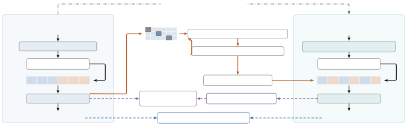

# Alignment-Path Distillation from Non-streaming ASR-LLMs for Streaming Speech Recognition

Yan Jia    Kai Huang    Junjie Chen    Feng-Long Xie    Xu Tang    Yao
Hu

###### Abstract

In this paper, we propose an alignment-path distillation framework for
streaming automatic speech recognition (ASR) with large language models
(LLMs). Interleaved streaming ASR-LLMs use forced alignments (FA) from
alignment models, such as those trained with connectionist temporal
classification (CTC), to construct speech–text training sequences.
However, alignments obtained from a separate acoustic model may be
inconsistent with those learned by LLM-based ASR. This motivates us to
transfer alignment information from a non-streaming ASR-LLM to improve
streaming recognition. Specifically, we extract monotonic alignment
paths from a non-streaming teacher’s soft text–audio attention and use
them to construct interleaved training sequences. The framework also
includes logit and hidden-state distillation to learn from the teacher’s
output distributions and internal representations. Experimental results
show that, without logit or hidden-state distillation, training with
teacher-derived alignment paths achieves a 5.2% relative error rate
reduction compared with training using forced alignments. When both
models use logit and hidden-state distillation, teacher-derived
alignments yield a 3.9% relative error rate reduction, with similar mean
emission latency but higher flicker. The complete framework achieves a
16.6% relative error rate reduction compared with training using forced
alignments without logit or hidden-state distillation.

###### Index Terms: 

streaming speech recognition, large language models, alignment-path
distillation, knowledge distillation

^(†)^(†)address: Xiaohongshu Inc.



Figure 1: Framework overview. The dash-dotted arrow denotes student
initialization. FA fallback and monotonic search determine audio–text
interleaving. Dashed arrows denote logit/hidden KD. The teacher and
auxiliary blocks are used only during training. Alignment scores are
illustrative.

## 1 Introduction

Recent studies have explored streaming recognition with LLM-based ASR
systems and related decoder-only architectures. Speech ReaLLM
interleaves speech and text embeddings using alignments from an external
CTC model and predicts BLANK to wait for the next speech
embedding \[1\]. SpeechLLM-XL processes audio in chunks and segments
training transcripts using FA from the encoder’s CTC outputs \[2\].
BESTOW uses a streaming read/write policy \[3\]. In a related
decoder-only ASR architecture, Tsunoo et al. combine CTC compression
with prefix training \[4\]. Uni-ASR trains one LLM-based model for both
streaming and non-streaming recognition \[5\]. In interleaved systems,
the assignment of text tokens to audio chunks determines the acoustic
context available for each token prediction.

Limited audio context remains a challenge for streaming recognition.
Knowledge distillation (KD) transfers supervision from a non-streaming
teacher through generated transcripts \[6\], soft output
distributions \[7, 8\], and hidden representations \[9, 10\]. Joint
streaming and non-streaming training also transfers full-context
knowledge to streaming recognition \[11\]. Beyond these targets, several
studies investigate temporal alignment in distillation by aligning
transducer posterior peaks \[8\], accounting for time shifts between
streaming and non-streaming outputs \[12, 13\], transferring CTC token
boundaries to monotonic attention \[14\], or distilling output
distributions along teacher alignment paths \[15\] and alignment
distributions themselves \[16\]. These studies motivate transferring
alignment knowledge in addition to predictions and representations. For
interleaved ASR-LLMs, we use the teacher’s own text–audio attention to
construct streaming training sequences, whose token-to-chunk assignments
are not determined by logit or hidden-state losses alone.

However, alignments obtained from a separate acoustic model may be
inconsistent with those learned by LLM-based ASR. In this paper, we
propose an alignment-path distillation framework that uses alignment
information from a non-streaming ASR-LLM teacher to improve streaming
recognition. We extract text–audio attention from the teacher, replace
low-confidence attention distributions with FA distributions, and obtain
monotonic alignment paths to construct the student’s interleaved
training sequences. On this training sequence, logit and hidden-state
distillation provide additional supervision from the teacher’s output
distributions and internal representations. Hidden-state distillation
uses auxiliary decoder blocks to transform student representations
before comparison with the teacher representations. The teacher and
auxiliary blocks are used only during training. Inference uses the
streaming student. Compared with training using FA, teacher-aligned
training achieves relative error rate reductions of 5.2% without logit
or hidden-state distillation and 3.9% with both losses, with similar
mean emission latency but higher flicker in the latter comparison. The
complete framework achieves a 16.6% relative error rate reduction over
FA-based training without either loss.

## 2 Method

Figure 1 shows the interleaved ASR-LLM and our alignment-path
distillation framework.

### 2.1 Interleaved ASR-LLM Architecture and Training

The speech encoder extracts acoustic features, which the projector
downsamples and maps to the LLM embedding space. The model processes
consecutive audio chunks while retaining preceding audio and text as
context.

Following the interleaved training paradigm of Uni-ASR \[5\], we divide
speech into fixed-duration chunks and segment the reference transcript
according to token alignment timestamps. Each audio chunk is followed by
its assigned reference text. With audio embeddings $`\mathbf{a}_{k}`$
and text embeddings $`\mathbf{y}^{(k)}`$, the LLM input is

```math
[\mathbf{a}_{1},\mathbf{y}^{(1)},\mathbf{a}_{2},\mathbf{y}^{(2)},\ldots,\mathbf{a}_{K},\mathbf{y}^{(K)}], \tag{1}
```

where $`K`$ is the number of chunks. Text segments may be empty.

The LLM predicts each text token conditioned on the available audio
embeddings and preceding reference tokens. The cross-entropy loss
$`\mathcal{L}_{\mathrm{CE}}`$ is computed over the target text tokens.
Chunk-restricted encoder attention and causal LLM attention prevent
access to subsequent audio chunks.

During decoding, the embeddings of each incoming audio chunk are
appended to the audio–text history of each beam hypothesis after
encoding and projection. The LLM extends the hypotheses autoregressively
using beam search, with a token limit per chunk. At each output update,
we display the current highest-scoring hypothesis. Changes in the best
hypothesis can revise previously displayed text, resulting in flicker.
Audio processing and text generation alternate as new chunks arrive.

### 2.2 Alignment-path Distillation Framework

The non-streaming model used to initialize the student is kept fixed as
the teacher. The teacher-derived alignment path is used to construct the
student’s interleaved training sequence, with logit and hidden-state
losses providing additional supervision.

#### 2.2.1 Alignment-path distillation

Attention extraction. We extract each text token’s attention scores over
audio embeddings from the non-streaming ASR-LLM teacher, using its final
LLM layer and averaging across all attention heads. Applying softmax
over the audio positions yields an alignment matrix
$`A\in\mathbb{R}^{U\times F}`$, where $`U`$ and $`F`$ are the numbers of
text and audio tokens, respectively. The text tokens correspond to the
modeling units of the LLM. Each row $`A_{i,:}`$ gives the attention
distribution of text token $`i`$ over audio tokens.

Confidence-based FA fallback. Let $`A^{\mathrm{FA}}_{i,:}`$ denote the
FA alignment distribution over audio tokens for text token $`i`$. When
the peak attention probability $`s_{i}=\max_{j}A_{ij}`$ over audio
positions falls below $`\theta_{\mathrm{FA}}`$, we replace its attention
distribution with the FA distribution:

```math
\widetilde{A}_{i,:}=\begin{cases}A^{\mathrm{FA}}_{i,:},&s_{i}<\theta_{\mathrm{FA}},\\
A_{i,:},&\text{otherwise}.\end{cases} \tag{2}
```

Global monotonic anchor search. Independent peak selection can produce
non-monotonic anchors. Applying a cumulative maximum afterwards may
propagate an early mistake to subsequent units. Let $`e_{i}`$ denote the
audio position index assigned to text unit $`i`$, and let
$`\mathbf{e}=(e_{0},\ldots,e_{U-1})`$ denote the alignment path.
Inspired by monotonic alignment search in Glow-TTS \[17\], we optimize
all anchors jointly using the updated alignment matrix
$`\widetilde{A}`$:

```math
\mathbf{e}^{*}=\arg\max_{0\leq e_{0}<\cdots<e_{U-1}<F}\sum_{i=0}^{U-1}\log(\widetilde{A}_{i,e_{i}}+\epsilon), \tag{3}
```

where $`\epsilon=10^{-9}`$. The search selects one acoustic anchor per
text unit and allows acoustic positions to be skipped. It differs from a
duration path that assigns every acoustic frame to a text unit.

Let $`V(i,j)`$ be the largest sum of log-alignment probabilities for
text units $`0,\ldots,i`$ when unit $`i`$ is assigned to audio position
$`j`$. The recurrence is

```math
V(i,j)=\log(\widetilde{A}_{i,j}+\epsilon)+\max_{k<j}V(i-1,k). \tag{4}
```

Prefix maxima and their indices allow this recurrence to be evaluated in
$`O(UF)`$ time. Backtracking from the best last-row position recovers
the anchor sequence.

Audio position indices are converted to timestamps using the time step
of the projected features. These timestamps determine the text segments
assigned to the fixed-duration audio chunks in the interleaved training
sequence.

#### 2.2.2 Logit and Hidden-State Distillation

Logit supervision.

The student and teacher use the same LLM architecture, tokenizer, and
target transcript, so their target tokens correspond one-to-one despite
different speech–text sequence layouts. Let $`\mathcal{P}`$ contain the
corresponding prediction-position pairs for all target tokens and
$`N=|\mathcal{P}|`$. Following temperature-scaled KD \[7\], we minimize

```math
\mathcal{L}_{\mathrm{logit}}=\frac{\tau^{2}}{N}\sum_{i\in\mathcal{P}}D_{\mathrm{KL}}\left(p_{i}^{T,\tau}\,\|\,p_{i}^{S,\tau}\right), \tag{5}
```

where $`p^{T,\tau}`$ and $`p^{S,\tau}`$ are teacher and student softmax
distributions at temperature $`\tau`$.

Hidden-state supervision. Hidden KD constrains internal representations
at corresponding target-token prediction positions. Each selected LLM
layer has its own auxiliary decoder block $`g_{\ell}`$. We compute

```math
\mathcal{L}_{\mathrm{hid}}=\frac{1}{|\mathcal{S}|N}\sum_{\ell\in\mathcal{S}}\sum_{i\in\mathcal{P}}\left[1-\cos\left(g_{\ell}(\mathbf{H}^{S}_{\ell})_{i},\mathbf{h}^{T}_{\ell,i}\right)\right], \tag{6}
```

where $`\mathcal{S}`$ denotes the selected LLM layers. Auxiliary blocks
use bidirectional self-attention over the student sequence, masking
padding only. They can access later audio and text positions during
training but are removed at inference, preserving the causal student
path.

The complete training objective on the path-derived sequence is

```math
\mathcal{L}=\mathcal{L}_{\mathrm{CE}}+\lambda\mathcal{L}_{\mathrm{logit}}+h\mathcal{L}_{\mathrm{hid}}. \tag{7}
```

The teacher and auxiliary blocks are used only during training.
Inference uses the student model.

|                         |         |          |             |              |             |            |       |
| ----------------------- | ------- | -------- | ----------- | ------------ | ----------- | ---------- | ----- |
|                         | AISHELL | KeSpeech | WeNetSpeech |              | LibriSpeech |            | All   |
| System                  | test    | test     | test-net    | test-meeting | test-clean  | test-other |       |
| Teacher (non-streaming) | 1.09    | 3.57     | 5.05        | 4.71         | 1.60        | 3.04       | 3.99  |
| MMS                     | 3.48    | 9.84     | 10.78       | 9.90         | 4.85        | 9.29       | 9.35  |
| MMS+LOGIT               | 3.10    | 9.59     | 9.73        | 8.39         | 4.19        | 8.66       | 8.51  |
| MMS+HID                 | 3.30    | 9.64     | 9.78        | 8.75         | 4.20        | 8.67       | 8.63  |
| MMS+COMBO               | 2.94    | 9.23     | 9.13        | 8.24         | 3.87        | 8.13       | 8.12  |
| TA w/o FA fallback      | 3.05    | 9.12     | 11.63       | 16.81        | 12.11       | 18.43      | 11.55 |
| TA                      | 3.25    | 9.76     | 10.07       | 9.21         | 4.30        | 8.82       | 8.86  |
| TA+LOGIT                | 2.69    | 9.08     | 8.92        | 8.09         | 3.22        | 7.41       | 7.88  |
| TA+HID                  | 2.71    | 9.07     | 8.80        | 8.03         | 3.55        | 7.78       | 7.86  |
| TA+COMBO                | 2.71    | 9.11     | 8.67        | 8.07         | 3.43        | 7.43       | 7.80  |

Table 1: Recognition error rates (%): CER for Chinese and WER for
English (LibriSpeech). The non-streaming teacher uses full-utterance
audio and is included for reference. All is the reported aggregate error
rate. Bold marks the best streaming result in each column.

## 3 Experimental Results

### 3.1 Data and experimental setup

The training data include AISHELL \[18\], WeNetSpeech \[20\],
LibriSpeech \[21\], GigaSpeech \[22\], and KeSpeech \[19\]. All systems
use the same training data. Table 1 lists the six evaluation sets.

All systems use a streaming Conformer \[23\], a temporally downsampling
projector, and Qwen2-1.5B \[24\]. They are initialized from the same
non-streaming ASR-LLM trained on the same Chinese and English speech
data. Before training on these data, the non-streaming model’s encoder
and projector are initialized with pretrained parameters from
FireRedASR2S \[25\]. This non-streaming model provides the distillation
targets, with its parameters fixed throughout student training.
Hidden-state distillation uses LLM layers
$`\mathcal{S}=\{7,14,21,28\}`$, each with a separate, randomly
initialized auxiliary Qwen2 decoder block. The encoder, projector, and
LLM are jointly updated without LoRA. We train all models for five
epochs on 32 GPUs using Adam with an initial learning rate of
$`10^{-3}`$, a plateau-based learning-rate scheduler, and a gradient
clipping threshold of 5. The audio-duration batch budget is set to 90
seconds. The distillation temperature is $`\tau=2`$. We ablate
alignment-path, logit, and hidden-state supervision to assess their
contributions.

The audio chunk duration is 240 ms. The text-token limit per chunk is
seven in both training and evaluation. All reported variants use this
same evaluation configuration. Both FA training labels and evaluation
timestamps are generated using the MMS multilingual forced aligner, a
CTC-based model trained on 31,000 hours of speech covering 1,130
languages \[26\].

In the experiments, MMS denotes systems trained with MMS forced
alignments, while TA (teacher-aligned) denotes systems trained with
alignment paths derived from the non-streaming teacher, including
confidence-based FA fallback. Without a suffix, MMS and TA use neither
logit nor hidden-state distillation. TA+LOGIT adds logit distillation,
TA+HID adds hidden-state distillation, and TA+COMBO uses both. The same
suffixes apply to the MMS variants. The fallback threshold
$`\theta_{\mathrm{FA}}`$ was set to 0.30 based on preliminary
experiments on AISHELL-1 and kept fixed for all TA variants across the
evaluation datasets. With this threshold, FA fallback is applied to
59.44% of alignment units across the training data before monotonic
search. MMS and TA weights were selected separately (Table 2).

### 3.2 Evaluation metrics

We report character error rate (CER) for Chinese and word error rate
(WER) for English. All denotes the aggregate error rate reported across
the six test sets.

Flicker measures revisions between consecutive partial hypotheses. Let
$`H_{u,t}`$ be the hypothesis after update $`t`$ of utterance $`u`$,
with $`H_{u,0}=\varnothing`$, and $`T_{u}`$ its final update. The
revision count is

```math
r_{u,t}=\left[d(H_{u,t-1},H_{u,t})-\left(|H_{u,t}|-|H_{u,t-1}|\right)_{+}\right]_{+}, \tag{8}
```

where $`d`$ is Levenshtein distance, $`|H|`$ is sequence length, and
$`(x)_{+}=\max(0,x)`$. We set $`r_{u,t}=0`$ for updates consisting only
of completing the last English word and appending new words. Chinese
uses character units and English uses word units. We report
micro-averaged flicker:

```math
\mathrm{Flicker}=100\%\times\frac{\sum_{u}\sum_{t=1}^{T_{u}}r_{u,t}}{\sum_{u}|H_{u,T_{u}}|}. \tag{9}
```

Emission delay is the difference between the output timestamp and the
corresponding FA reference endpoint. We report the mean emission delay.

### 3.3 Recognition performance

Without logit or hidden KD, TA improves all six test sets, reducing
aggregate error rate from 9.35% to 8.86% (5.2% relative; Table 1).
Without fallback, error rises to 11.55% despite gains on AISHELL-1 and
KeSpeech. Degradation on WeNetSpeech and LibriSpeech may stem from
complex acoustic conditions and dispersed attention for English function
words such as prepositions, respectively, highlighting the need for
fallback.

KD improves both MMS and TA. Distilled TA variants achieve 7.80–7.88%,
versus 8.12% for MMS+COMBO. TA+COMBO is best overall and improves all
six sets over MMS+COMBO, with relative reductions of 3.9% over MMS+COMBO
and 16.6% over undistilled MMS. A substantial gap to the non-streaming
teacher remains (7.80% versus 3.99%).

| System    | $`\lambda`$ | $`h`$ | F$`\downarrow`$ | L$`\downarrow`$ |
| --------- | ----------- | ----- | --------------- | --------------- |
| MMS       | 0           | 0     | 3.47            | 129.9           |
| MMS+LOGIT | 0.2         | 0     | 2.59            | 124.9           |
| MMS+HID   | 0           | 0.1   | 3.15            | 130.7           |
| MMS+COMBO | 0.2         | 0.5   | 2.49            | 127.3           |
| TA        | 0           | 0     | 4.01            | 132.2           |
| TA+LOGIT  | 0.05        | 0     | 3.25            | 126.0           |
| TA+HID    | 0           | 0.5   | 3.52            | 124.2           |
| TA+COMBO  | 0.05        | 1.0   | 3.18            | 128.3           |

Table 2: KD weights and streaming behavior. $`\lambda/h`$: logit/hidden
weights; F: micro flicker (%); L: mean emission delay (ms).

### 3.4 Streaming stability and delay

Within TA, combined KD reduces flicker from 4.01% to 3.18% and mean
emission delay from 132.2 to 128.3 ms (Table 2). TA+HID achieves the
lowest mean emission delay at 124.2 ms, while TA+COMBO has the lowest
flicker among the TA variants.

However, all teacher-aligned variants exhibit higher flicker than their
forced-alignment counterparts under the corresponding distillation
configurations. Without logit or hidden-state KD, TA increases flicker
from 3.47% to 4.01% relative to MMS. With both distillation losses,
TA+COMBO has higher flicker than MMS+COMBO (3.18% versus 2.49%), despite
similar mean emission delays (128.3 versus 127.3 ms). Thus, distillation
improves stability within TA, but the recognition gains over the
corresponding MMS systems come with increased flicker.

## 4 Conclusions

We proposed alignment-path distillation to transfer a non-streaming
teacher’s text–audio alignments to streaming speech recognition.
Compared with training using FA, teacher-aligned training achieves
relative error rate reductions of 5.2% without logit or hidden-state
distillation and 3.9% with both losses. The complete framework achieves
a 16.6% relative error rate reduction over FA-based training without
either loss. With both losses, teacher-aligned training yields similar
mean emission delay but higher flicker than FA-based training.

## References

- \[1\] F. Seide et al., “Speech ReaLLM—Real-time streaming speech
  recognition with multimodal LLMs by teaching the flow of time,”
  arXiv:2406.09569, 2024.
- \[2\] J. Jia et al., “Efficient streaming LLM for speech
  recognition,” arXiv:2410.03752, 2024.
- \[3\] Z. Chen et al., “BESTOW: Efficient and streamable speech
  language model with the best of two worlds in GPT and T5,”
  arXiv:2406.19954, 2024.
- \[4\] E. Tsunoo et al., “Decoder-only architecture for streaming
  end-to-end speech recognition,” in Proc. Interspeech, 2024.
- \[5\] Y. Xia et al., “Uni-ASR: Unified LLM-based architecture for
  non-streaming and streaming automatic speech recognition,”
  arXiv:2603.11123, 2026.
- \[6\] T. Doutre et al., “Improving streaming automatic speech
  recognition with non-streaming model distillation on unsupervised
  data,” arXiv:2010.12096, 2020.
- \[7\] G. Hinton, O. Vinyals, and J. Dean, “Distilling the knowledge
  in a neural network,” arXiv:1503.02531, 2015.
- \[8\] G. Kurata and G. Saon, “Knowledge distillation from offline to
  streaming RNN transducer for end-to-end speech recognition,” in Proc.
  Interspeech, 2020.
- \[9\] A. Kojima, “Knowledge distillation for streaming
  Transformer–Transducer,” in Proc. Interspeech, 2021.
- \[10\] K. Shim et al., “Knowledge distillation from non-streaming to
  streaming ASR encoder using auxiliary non-streaming layer,” in Proc.
  Interspeech, 2023, pp. 1663–1667.
- \[11\] J. Yu et al., “Dual-mode ASR: Unify and improve streaming ASR
  with full-context modeling,” arXiv:2010.06030, 2020.
- \[12\] F. Weninger et al., “Conformer with dual-mode chunked
  attention for joint online and offline ASR,” in Proc. Interspeech,
  2022, pp. 2053–2057.
- \[13\] L. Li et al., “Delayed-KD: Delayed knowledge distillation
  based CTC for low-latency streaming ASR,” in Proc. Interspeech, 2025,
  pp. 4413–4417.
- \[14\] H. Inaguma and T. Kawahara, “Alignment knowledge distillation
  for online streaming attention-based speech recognition,”
  arXiv:2103.00422, 2021.
- \[15\] X. Yang, Q. Li, and P. C. Woodland, “Knowledge distillation
  for neural transducers from large self-supervised pre-trained models,”
  in Proc. ICASSP, 2022.
- \[16\] O. Chang, D. Hwang, and O. Siohan, “Revisiting the entropy
  semiring for neural speech recognition,” in Proc. ICLR, 2023.
- \[17\] J. Kim et al., “Glow-TTS: A generative flow for text-to-speech
  via monotonic alignment search,” in Proc. NeurIPS, 2020.
- \[18\] H. Bu et al., “AISHELL-1: An open-source Mandarin speech
  corpus and a speech recognition baseline,” in Proc. Oriental
  COCOSDA, 2017.
- \[19\] Z. Tang et al., “KeSpeech: An open source speech dataset of
  Mandarin and its eight subdialects,” in NeurIPS Datasets and
  Benchmarks, 2021.
- \[20\] B. Zhang et al., “WenetSpeech: A 10000+ hours multi-domain
  Mandarin corpus for speech recognition,” arXiv:2110.03370, 2021.
- \[21\] V. Panayotov et al., “LibriSpeech: An ASR corpus based on
  public domain audio books,” in Proc. ICASSP, 2015.
- \[22\] G. Chen et al., “GigaSpeech: An evolving, multi-domain ASR
  corpus with 10,000 hours of transcribed audio,” in Proc. Interspeech,
  2021, pp. 3670–3674.
- \[23\] A. Gulati et al., “Conformer: Convolution-augmented
  Transformer for speech recognition,” in Proc. Interspeech, 2020.
- \[24\] A. Yang et al., “Qwen2 technical report,”
  arXiv:2407.10671, 2024.
- \[25\] K. Xu et al., “FireRedASR2S: A state-of-the-art
  industrial-grade all-in-one automatic speech recognition system,”
  arXiv:2603.10420, 2026.
- \[26\] V. Pratap et al., “Scaling speech technology to 1,000+
  languages,” arXiv:2305.13516, 2023.
- \[27\] Montreal Corpus Tools, “English alignment benchmarks,” Montreal
  Forced Aligner model documentation.
  [https://mfa-models.readthedocs.io/en/latest/benchmarks/english_alignments.html](https://mfa-models.readthedocs.io/en/latest/benchmarks/english_alignments.html)
