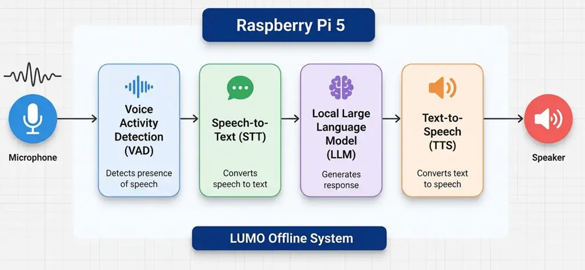
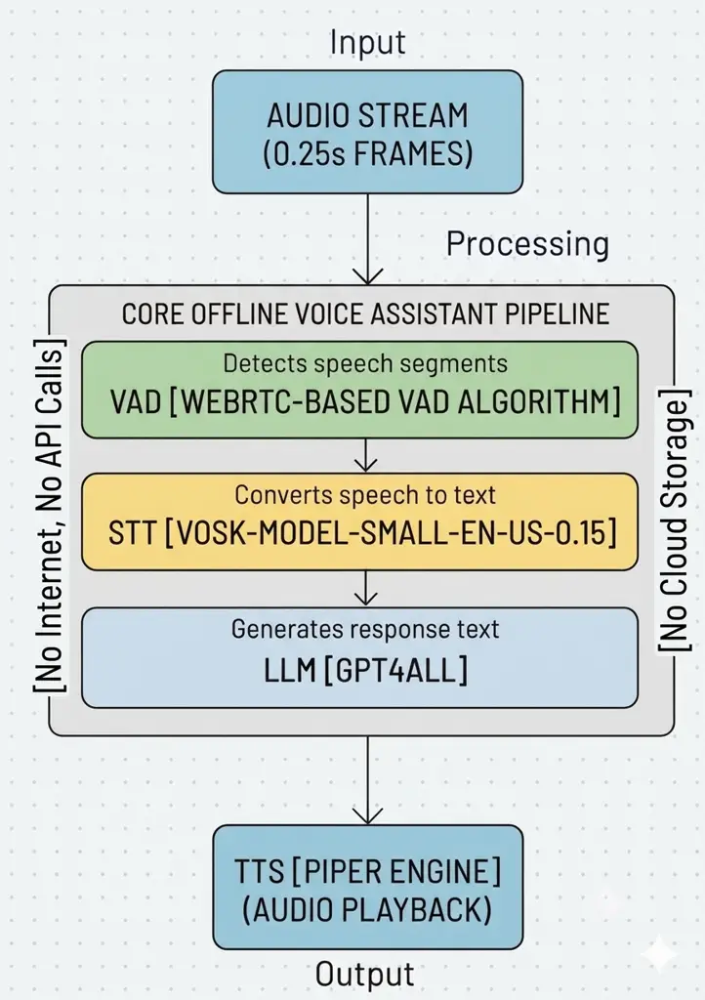
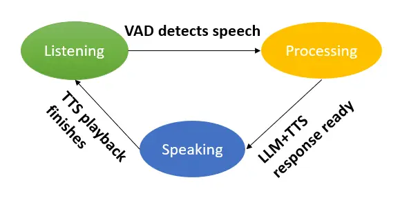
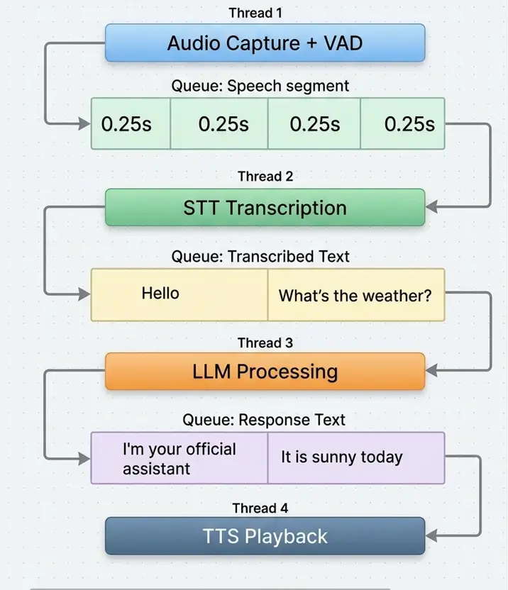
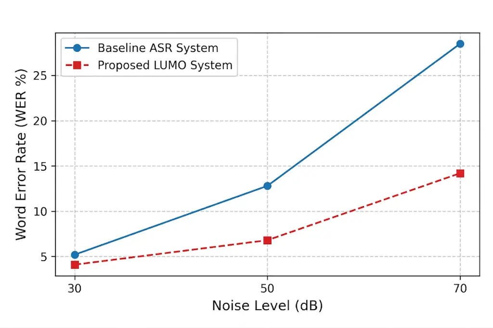
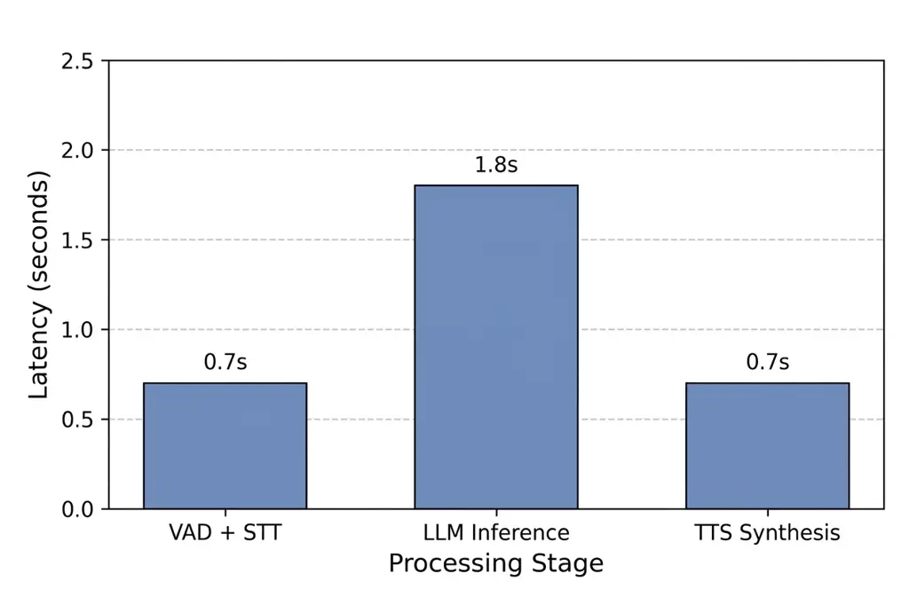
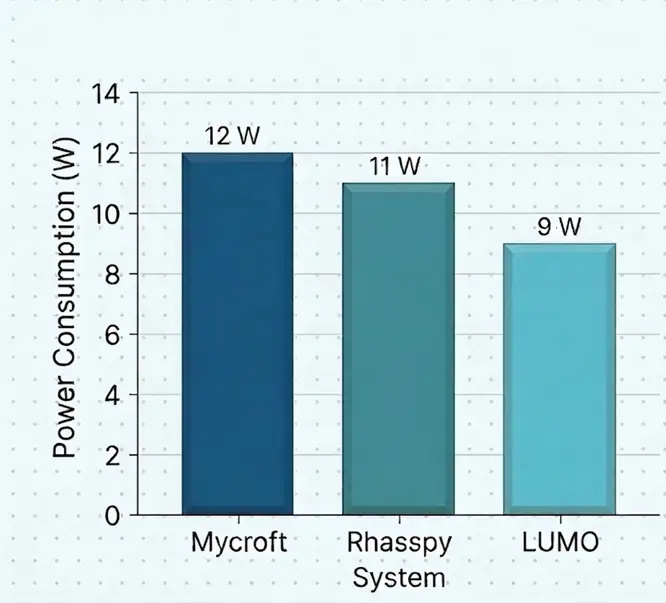
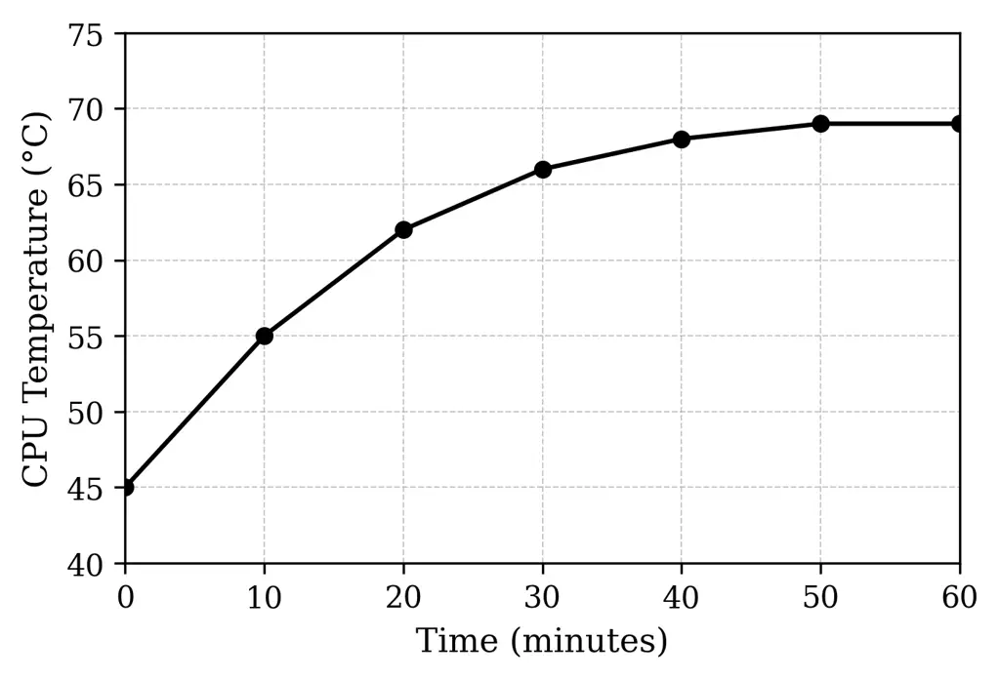

# LUMO (Lightweight Unified Multilingual Orchestrator): A Privacy Preserving Offline Voice Assistant

Md. Mehedi Hasan Naeem, Mst. Kamrunnahar Ruma, Nafiza Anjum, Shakila
Sultana, Md. Sujan Ali Affiliation: Department of Computer Science and
Engineering  
Jatiya Kabi Kazi Nazrul Islam University  
Mymensingh, Bangladesh  
mehedinaeem00@gmail.com, kamrunnaharruma242@gmail.com  
nafizaanjum.2002@gmail.com, shakila161470@gmail.com,
sujan_cse@jkkniu.edu.bd

###### Abstract

Reliable voice interaction is essential in environments with limited
internet connectivity and strong privacy. However, most existing voice
assistants depend on cloud-based services, which leads to latency
issues, dependency on internet access, and privacy vulnerabilities. This
research presents LUMO (Lightweight Unified Multilingual Orchestrator),
a privacy preserving offline voice assistant designed for edge computing
environments. This system integrates local Automatic Speech Recognition
(ASR), locally deployed quantized Large Language Model (LLM), and
Text-to-Speech (TTS) synthesis into a fully offline pipeline running on
a Raspberry Pi 5 with 8 GB RAM. To enable efficient operation on
resource constrained hardware, the language model is compressed using
4-bit GGUF quantization, which reduces memory usage while preserving
practical conversational capability. Existing edge based voice
assistants Mycroft provides partial offline functionality without a
generative LLM, with an approximate latency of $`\sim`$5 s and power
consumption of $`\sim`$12 W, while Rhasspy supports full offline
operation but lacks generative capabilities, with $`\sim`$3 s latency
and $`\sim`$11 W power usage. In contrast, LUMO achieves a Word Error
Rate (WER) of 6.8% for short English utterances in low noise conditions,
an end-to-end response latency of 2.0–4.0 s, and a lower peak power
consumption of approximately 9.0 W.The system also achieves effective
offline recognition for Bangla speech, supporting multilingual
accessibility in low resource settings. By operating entirely offline,
LUMO provides strong data privacy, reduced need for cloud connectivity,
and suitability for privacy sensitive edge execution such as rural
healthcare, education, and disaster response scenarios.

###### Index Terms: 

Voice assistant, edge AI, offline LLM, Raspberry Pi 5, privacy
preserving system, IoT, quantization, multilingual speech processing

## I Introduction

Voice assistant have become an important part of human computer
interaction, enabling applications in smart homes, healthcare, education
and assistive technology. However, most commercial systems use cloud
infrastructure for speech recognition, language understanding, and
response generation.This dependency introduces network requirements,
latency and privacy concerns due to the transmission of user data to
remote servers. Recent advances in edge AI and lightweight language
models enable intelligent applications on resource constrained
devices.TinyLlama provides language reasoning with a relatively small
number of parameters \[1\]. Local ASR enables speech recognition without
internet connection \[2\]. Model quantization reduces the memory and
computational requirements and has practical performance \[3\].These
developments are making fully offline voice assistants more real than
ever. Despite this progress, it is still challenging to deploy
conversational assistants on edge hardware.Lightweight models need to
balance inference speed, memory consumption and response quality.
Rule-based intent recognition is used by many existing offline
assistants, which limits theirability to support open-ended
conversation.Generative models like LLaMA allow for more flexible,
context-aware interaction \[4\], but many studies focus on individual
models rather than full offline systems that integrate speech
recognition, language reasoning, and speech synthesis.Also, system-level
evaluation is important for practical edge deployment.Metrics like
response latency, power consumption, memory usage, and thermal stability
are directly impactful in real-world operation, yet are often less
emphasized than model-level benchmarks \[5\].To tackle these challenges,
this paper proposes LUMO (Lightweight Unified Multilingual
Orchestrator), a privacy-preserving offline voice assistant for
Raspberry Pi devices.LUMO is a combination of local automatic speech
recognition, 4-bit GGUF-quantized lightweight language model, and
offline text-to-speech synthesis in an 8GB memory environment.The system
supports interaction in English and Bangla and is evaluated on the basis
of speech recognition accuracy, response latency, memory usage, power
consumption, and thermal performance. Section II presents related work.
Section III presents system design and methodology. Section IV describes
experimental setup. Section V discusses results. Section VI concludes
the paper.

## II Background Study and Related Work

The cloud-based voice assistants offer strong computational power but
are hampered by latency, internet dependency and privacy issues. Edge
computing addresses these issues by processing data near the source,
reducing communication delay and bandwidth requirements \[1, 2\]. Recent
studies have further explored efficient AI deployment on
resource-constrained edge platforms \[3, 4\].

Raspberry Pi and similar embedded devices have been widely studied for
lightweight AI applications \[5\]. Techniques for efficient
deep-learning execution on mobile and embedded hardware have also been
proposed \[6, 7\]. However, deploying large language models on such
devices remains difficult because of their high memory and computational
requirements. While LLaMA and LLaMA 2 demonstrated strong
transformer-based language capabilities \[8, 9\], lightweight models
such as TinyLlama offer more practical alternatives for edge deployment
\[10, 11\]. Quantization methods including GPTQ and QLoRA further reduce
memory and computation requirements \[12, 13\], while LLMPi demonstrates
the feasibility of optimized LLM inference on Raspberry Pi devices
\[14\].

Speech processing is another essential component of offline voice
assistants. Kaldi provides a widely used ASR framework \[15\], while
voice activity detection improves real-time speech processing efficiency
\[16\]. Research has also addressed offline ASR and robustness in noisy
environments \[17, 18, 19\]. Multilingual resources such as Common Voice
\[20\], multilingual ASR models \[21\], and Whisper \[22\] have further
improved multilingual speech recognition. VOSK provides efficient
offline recognition for embedded platforms \[23\].

Although embedded voice assistants have been proposed \[24\], many
systems still rely on rule-based command processing and provide limited
open-ended conversational capability. Existing lightweight-LLM studies
also mainly emphasize model efficiency rather than complete offline
voice-assistant integration, while practical factors such as latency,
thermal behavior, and power consumption are often insufficiently
evaluated.

To address these gaps, this work introduces LUMO (Lightweight Unified
Multilingual Orchestrator), a privacy-preserving offline voice assistant
for Raspberry Pi. LUMO integrates a quantized lightweight language
model, on-device speech recognition, and text-to-speech synthesis into a
unified multilingual architecture designed for efficient operation on
resource-constrained hardware.

## III Proposed System Design and Methodology

This section presents the architecture and implementation of LUMO, which
integrates speech processing, language reasoning, and speech synthesis
within a fully offline edge framework.

### III-A System Overview

LUMO is a modular pipeline of Voice Activity Detection (VAD),
Speech-to-Text (STT), local Large Language Model (LLM), and
Text-to-Speech (TTS) based on Raspberry Pi 5. It detects and transcribes
the speech. The local LLM processes it and converts it to audio to play
back.



Fig. 1: Overall architecture of the proposed LUMO offline voice
assistant system running on Raspberry Pi 5.

All the processing is done locally as shown in Fig. 1, which helps
preserve user privacy, reduces dependence on network, and enables
low-latency interaction \[1\].

### III-B Multilingual Speech Dataset Design

A custom multilingual dataset was developed to evaluate speech
recognition using short command-style English and Bangla utterances,
such as “play meditation music” and “dhyaner gaan chalu koro.” Ten
bilingual speakers (3 male and 7 female) recorded manually transcribed
utterances using the same USB condenser microphone and deployment
environment. Since pretrained ASR and language models were used without
task-specific fine-tuning, the dataset served only for evaluation.

### III-C Hardware Configuration

LUMO runs on a Raspberry Pi 5 with 8 GB RAM, selected for its low cost,
flexibility, and Linux compatibility \[5\]. A USB condenser microphone
and speaker provide audio input and output, while all processing is
performed locally. Raspberry Pi supports optimized edge-AI inference
frameworks \[7\]. A NeoPixel LED ring indicates listening, processing,
and speaking states.

### III-D Software Pipeline

LUMO is implemented in Python on a Linux-based operating system and
performs the complete processing pipeline locally.



Fig. 2: Software processing pipeline for the LUMO voice assistant
system.

As shown in Fig. 2, audio is captured in approximately 0.25-second
frames and analyzed by VAD. Detected speech is transcribed, processed by
the LLM, and converted into speech by the TTS module. The modular design
enables independent component optimization and efficient edge deployment
\[6\].

### III-E Voice Activity Detection and Speech Recognition

WebRTC-based VAD identifies speech frames before transcription, reducing
unnecessary processing \[16\]. Detected speech is transcribed using the
VOSK offline ASR framework based on Kaldi, which provides efficient
speech recognition for resource-constrained devices \[15, 17\].

### III-F Local LLM Integration

Recognized text is passed to a locally deployed LLM for response
generation. LUMO uses GGUF-quantized models with lower-precision weights
to reduce memory requirements while preserving language understanding
\[13\]. Local inference provides context-aware responses without
transmitting user data to cloud services.

### III-G Text-to-Speech Module

LUMO uses Piper TTS to convert generated responses into speech with low
computational requirements.



Fig. 3: Operational state transitions of LUMO during voice interaction.

Fig. 3 shows the listening, processing, and speaking states. Offline TTS
engines such as Piper and Coqui TTS support natural speech generation
without internet connectivity \[25\].

### III-H Concurrency and Control Logic



Fig. 4: Multithreaded processing architecture used in the LUMO system.

LUMO uses separate threads for audio capture, speech recognition, LLM
inference, and playback. As shown in Fig. 4, audio and text are passed
between modules through queues, reducing blocking and supporting
low-latency real-time interaction \[26\].

### III-I Deployment Optimization

Quantization reduces memory and computational requirements, while short
audio frames reduce processing latency. USB SSD storage improves model
loading speed, and active cooling maintains stable temperature during
prolonged inference \[27\].

## IV Experimental Setup

LUMO was evaluated in a fully offline edge environment using speech
recognition accuracy, response latency, memory usage, power consumption,
and thermal behavior as the primary performance metrics. The experiments
were designed to reflect realistic operation on resource-constrained
hardware without internet connectivity.

### IV-A Hardware and Software Environment

LUMO was evaluated on a Raspberry Pi 5 with an ARM Cortex-A76 processor,
8 GB RAM, and 64-bit Raspberry Pi OS. A USB condenser microphone and
standard speaker were used for audio input and output. The Python 3.10
implementation integrates VOSK for offline speech recognition, WebRTC
for voice activity detection, GPT4All for quantized local LLM inference,
and Piper for offline text-to-speech synthesis.

### IV-B Speech Dataset

A custom bilingual speech dataset containing 1,000 command-style
utterances was developed to evaluate LUMO’s offline speech recognition.
Ten bilingual speakers recorded 500 English and 500 Bangla utterances,
each containing 3–10 words and representing typical voice-assistant
interactions.

| Attribute        | Value                                  |
| ---------------- | -------------------------------------- |
| Languages        | English, Bangla                        |
| Speakers         | 10 bilingual speakers                  |
| Utterances       | 1,000 (500 per language)               |
| Command Length   | 3–10 words                             |
| Audio            | 16-kHz mono WAV                        |
| Recording Device | USB condenser microphone               |
| Annotation       | Manually verified transcripts          |
| Metadata         | Speaker ID, language, transcript (CSV) |

TABLE I: LUMO Speech Dataset Summary

Recordings were captured using the same USB condenser microphone used in
the deployment setup and stored as 16-kHz mono WAV files. Ground-truth
transcriptions were manually verified, while speaker ID, language, and
transcript information were stored as CSV metadata. The dataset and LUMO
implementation are publicly available at
[https://github.com/mehedinaeem/lumo-speech-dataset](https://github.com/mehedinaeem/lumo-speech-dataset)
and
[https://github.com/mehedinaeem/Lumo](https://github.com/mehedinaeem/Lumo),
respectively.

### IV-C Noise-Level Test Conditions

Speech recognition robustness was evaluated under three controlled
ambient noise conditions: quiet ($`<30`$ dB), moderate (45–60 dB), and
high (70–75 dB), representing quiet indoor, office, and crowded
environments, respectively. Noise levels were measured using a sound
level meter, and the same speech commands were tested under each
condition \[19\].

### IV-D Evaluation Metrics

LUMO was evaluated using Word Error Rate (WER), response latency, memory
usage, power consumption, and thermal stability. Speech recognition
performance was measured as

```math
WER=\frac{S+D+I}{N}, \tag{1}
```

where $`S`$, $`D`$, and $`I`$ denote substitution, deletion, and
insertion errors, respectively, and $`N`$ is the total number of
reference words. Lower WER indicates better recognition performance.

End-to-end response latency was measured from the end of user speech to
the start of synthesized audio:

```math
T_{\mathrm{total}}=T_{\mathrm{ASR}}+T_{\mathrm{LLM}}+T_{\mathrm{TTS}}, \tag{2}
```

where the terms represent ASR, language-model inference, and
speech-synthesis latency, respectively. Memory usage, power consumption,
and CPU temperature were monitored during continuous inference to
evaluate resource efficiency and thermal stability \[28\].

### IV-E Privacy Preservation and Cloud Independence

Cloud independence was evaluated using network ingress/egress volume
($`V_{net}`$) and external data exposure time ($`T_{exp}`$):

```math
V_{net}=B_{in}+B_{out}, \tag{3}
```

where $`B_{in}`$ and $`B_{out}`$ represent transmitted and received
network data, respectively.

```math
T_{exp}=t_{return}-t_{transit}, \tag{4}
```

where $`T_{exp}`$ represents the duration for which user data remains
outside the local device. Since LUMO performs ASR, LLM inference, and
TTS entirely on-device without external APIs or cloud storage, both
metrics remain zero during offline operation ($`V_{net}=0`$ and
$`T_{exp}=0`$).

### IV-F Baseline Systems for Comparison

LUMO was conceptually compared with Rhasspy and Mycroft, two open-source
voice-assistant frameworks. These systems primarily use predefined
intents, command grammars, or rule-based processing, whereas LUMO
combines offline speech processing with a quantized local LLM for more
flexible and context-aware interaction \[29\].

## V Results and Discussion

This section evaluates LUMO in terms of speech recognition, multilingual
capability, lightweight LLM performance, response latency, power
consumption, thermal stability, and offline operation on Raspberry Pi 5.

### V-A Offline Speech Recognition Performance

Speech recognition was evaluated using Word Error Rate under different
environmental noise levels.

| Noise Level | Environment        | WER (%) |
| ----------- | ------------------ | ------- |
| 30 dB       | Quiet room         | 4.1     |
| 50 dB       | Office noise       | 6.8     |
| 70 dB       | Public environment | 14.2    |

TABLE II: Speech Recognition Performance Under Noise Levels

Table II shows that WER increased with environmental noise.



Fig. 5: Comparison of Word Error Rates under different noise conditions.

As shown in Fig. 5, WER was 4.1% at 30 dB, increased to 6.8% at 50 dB,
and reached 14.2% at 70 dB.The results show strong recognition in quiet
and moderate noise conditions and deterioration in high noise. Similar
behavior has been observed for Kaldi-based embedded ASR systems \[15\].

### V-B Multilingual Performance Analysis

LUMO was tested on spoken commands in English and Bangla.WER was better
in English but Bangla had a slightly higher error rate as expected since
the training resources are limited for low resource languages \[21\].

| Language | Avg. Utterance Length | WER (%) |
| -------- | --------------------- | ------- |
| English  | 3–5 words             | 6.8     |
| Bangla   | 3–5 words             | 9.9     |

TABLE III: Multilingual Speech Recognition Results

The results show that LUMO supports English and Bangla speech
recognition and works totally offline.

### V-C Lightweight LLM Benchmark and Model Selection

Several lightweight language models were evaluated for edge deployment
based on inference speed, memory consumption, and reasoning capability.
TinyLLaMA was selected because it provided the most suitable balance
between inference speed and memory requirements \[10\].

| Model      | Parameters | Tokens/s | Memory |
| ---------- | ---------- | -------- | ------ |
| TinyLLaMA  | 1.1B       | 12.3     | 640 MB |
| Gemma-2B   | 2B         | 4.5      | 1.4 GB |
| Phi-3 Mini | 3.8B       | 2.8      | 2.2 GB |

TABLE IV: Lightweight LLM Benchmark on Raspberry Pi 5

As shown in Table IV, TinyLLaMA achieved the highest inference speed and
lowest memory consumption among the evaluated models.

### V-D Quantization Impact on Memory and Speed

Quantization reduces model memory requirements and improves inference
efficiency on Raspberry Pi. Lower-precision formats substantially
reduced model size while maintaining practical execution performance
\[13\].

| Precision  | Model Size | Reduction |
| ---------- | ---------- | --------- |
| FP16       | 2.2 GB     | –         |
| 8-bit      | 1.1 GB     | 50%       |
| 4-bit GGUF | 640 MB     | 72%       |

TABLE V: Impact of Quantization on Model Size

Table V shows that 4-bit GGUF was the largest reducer, reducing the
model size by 72% in comparison with FP16.

### V-E End-to-End Latency Analysis

End-to-end latency was measured from when the user stopped talking to
when synthesized audio playback started.

| Processing Stage | Latency (s) |
| ---------------- | ----------- |
| VAD + STT        | 0.7         |
| LLM Inference    | 1.8         |
| TTS Synthesis    | 0.7         |
| Total            | 3.2         |

TABLE VI: Latency Breakdown of LUMO Processing Pipeline



Fig. 6: Latency contributions of different stages in the LUMO pipeline.

The latency of VAD+STT and TTS was 0.7 s each, and that of LLM inference
was 1.8 s, which accounted for 56.3% of the total response time of
3.2 s, as shown in Fig. 6. Therefore, the dominant computational
bottleneck is LLM inference.Similar patterns of latency have been
observed in mobile and embedded deep-learning systems \[6\].

### V-F Power Consumption Analysis

The power consumption was monitored continuously during system
operation. Results show that LUMO works at a power range that is
suitable for edge computing \[28\].

| System State       | Power (W) |
| ------------------ | --------- |
| Idle               | 4.2       |
| Speech Recognition | 6.8       |
| LLM Inference      | 9.0       |

TABLE VII: Power Consumption During System Operation

LUMO consumed 4.2 W at idle, 6.8 W during speech recognition and 9.0 W
during LLM inference.



Fig. 7: LUMO vs. Other Offline Assistants: Power Consumption Comparison

LUMO consumed 9 W (vs. about 11 W for Rhasspy and 12 W for Mycroft, see
Fig. 7).This equates to reductions of 18.2% and 25.0%, respectively.

### V-G Thermal Stability Analysis

We also monitored the CPU temperature during LLM inference continuously
to assess the thermal stability.



Fig. 8: CPU temperature change for continual LLM inference.

As shown in Fig. 8, the temperature of the CPU increased gradually
during the LLM inference, but it was below $`70^{\circ}`$C, which
indicates the stable operation of the CPU without any sudden thermal
degradation. Temperature control is required for reliable embedded
artificial intelligence systems \[1\].

### V-H Comparison with Rhasspy and Mycroft

LUMO was compared with Rhasspy and Mycroft to assess privacy,
connectivity, latency, power consumption, and local language-model
support.

| System  | Processing  | $`\mathbf{V}_{net}`$ | Medium      | Risk    |
| ------- | ----------- | -------------------- | ----------- | ------- |
| Mycroft | Local/Cloud | Variable             | Local+Cloud | Partial |
| Rhasspy | Fully Local | Minimal              | Local Only  | Low     |
| LUMO    | On-Device   | 0.0 KB               | None        | Zero    |

TABLE VIII: Comparison Based on Data Privacy and Cloud Connectivity

Table VIII shows that LUMO operates entirely on-device with zero
outbound traffic during offline execution, preventing conversational
data from being transmitted to external services.

| System  | Offline | LLM | Latency       | Power |
| ------- | ------- | --- | ------------- | ----- |
| Mycroft | Partial | No  | $`\sim`$5 s   | 12 W  |
| Rhasspy | Yes     | No  | $`\sim`$3.5 s | 11 W  |
| LUMO    | Yes     | Yes | 3.2 s         | 9 W   |

TABLE IX: Comparison with Existing Offline Assistants

Table IX shows that LUMO achieved 3.2 s latency, improving by 36.0% over
Mycroft and 8.6% over Rhasspy. Its 9 W power consumption was also lower
than Rhasspy (11 W) and Mycroft (12 W). Unlike the compared systems,
LUMO supports local generative LLM-based reasoning for more flexible
conversational interaction.

LUMO’s performance is supported by 4-bit GGUF quantization, TinyLLaMA,
multithreaded processing, and fully offline execution, resulting in
3.2 s response latency and 9 W peak power consumption. WebRTC VAD, VOSK
ASR, and the command-style dataset support low speech-recognition error
rates. Current limitations include performance in highly noisy
environments, limited advanced reasoning, voice-only interaction, and
the absence of IoT context and long-term memory. Future work will
investigate broader multilingual evaluation, newer edge language models,
and sensor-based context-aware interaction.

## VI Conclusion

This paper presented LUMO (Lightweight Unified Multilingual
Orchestrator), a privacy-preserving offline voice assistant for
resource-constrained edge devices that integrates offline ASR, a
quantized lightweight language model, and text-to-speech synthesis on a
Raspberry Pi. By eliminating cloud dependence, LUMO supports private and
reliable operation in connectivity-limited environments. Experimental
results demonstrated reliable speech recognition under varying noise
conditions, practical response latency, and stable power and thermal
performance, supporting its feasibility for edge-AI applications. There
are still some limitations such as limited reasoning capability of the
compact language model, comparatively higher Bangla WER and limited
evaluation on the longer multi-turn conversations.In conclusion, we show
that privacy-preserving conversational assistants can be successfully
deployed on low-power edge devices through model optimization and
efficient pipeline integration.Future work will focus on improvements in
Bangla ASR, evaluation of newer light-weight reasoning models, and
evaluation of conversational scalability under edge hardware constraints
for further extension of LUMO for edge-based conversational AI.

## References

- \[1\] W. Shi, J. Cao, Q. Zhang, Y. Li, and L. Xu (2016) Edge
  computing: vision and challenges. IEEE Internet of Things Journal.
  Cited by: §II, §III-A, §V-G.
- \[2\] M. Satyanarayanan (2017) The emergence of edge computing.
  Computer. Cited by: §II.
- \[3\] M. Chen (2023) Edge ai: technologies, applications, and
  challenges. IEEE Internet of Things Journal. Cited by: §II.
- \[4\] Y. Li, J. Wang, and W. Chen (2024) Edge ai: trends, challenges,
  and future directions. IEEE Internet of Things Journal. Cited by: §II.
- \[5\] J. Uthayakumar et al. (2022) Raspberry pi based embedded systems
  for edge ai. IEEE Access. Cited by: §II, §III-C.
- \[6\] N. Lane and P. Georgiev (2017) Squeezing deep learning into
  mobile and embedded devices. IEEE Pervasive Computing. Cited by: §II,
  §III-D, §V-E.
- \[7\] M. Verhelst (2023) Edge ai hardware and systems. IEEE Micro.
  Cited by: §II, §III-C.
- \[8\] H. Touvron et al. (2023) LLaMA: open and efficient foundation
  language models. arXiv preprint arXiv:2302.13971. Cited by: §II.
- \[9\] H. Touvron et al. (2023) Llama 2: open foundation and fine-tuned
  chat models. arXiv preprint arXiv:2307.09288. Cited by: §II.
- \[10\] P. Zhang, G. Zeng, T. Wang, and W. Lu (2024) TinyLlama: an
  open-source small language model. arXiv preprint arXiv:2401.02385.
  Cited by: §II, §V-C.
- \[11\] K. Gupta (2024) Tiny transformers for efficient edge ai. ACM
  Computing Surveys. Cited by: §II.
- \[12\] E. Frantar and D. Alistarh (2023) GPTQ: accurate post-training
  quantization for generative pre-trained transformers. arXiv preprint
  arXiv:2210.17323. Cited by: §II.
- \[13\] T. Dettmers (2023) QLoRA: efficient finetuning of quantized
  llms. NeurIPS. Cited by: §II, §III-F, §V-D.
- \[14\] M. Ahmed and S. Rahman (2025) LLMPi: optimizing large language
  models for efficient inference on raspberry pi. arXiv preprint
  arXiv:2504.02118. Cited by: §II.
- \[15\] D. Povey (2011) The kaldi speech recognition toolkit. IEEE
  ASRU. Cited by: §II, §III-E, §V-A.
- \[16\] Z. Tan (2020) WebRTC voice activity detection for speech
  systems. IEEE Signal Processing. Cited by: §II, §III-E.
- \[17\] T. Ko (2023) Efficient offline automatic speech recognition
  systems. IEEE Access. Cited by: §II, §III-E.
- \[18\] J. Li (2023) Robust speech recognition for noisy environments.
  IEEE Signal Processing Magazine. Cited by: §II.
- \[19\] D. Kim (2022) Robust speech recognition in noisy environments.
  IEEE Signal Processing Magazine. Cited by: §II, §IV-C.
- \[20\] R. Ardila (2020) Common voice: a massively multilingual speech
  corpus. Proceedings of LREC. Cited by: §II.
- \[21\] V. Pratap, A. Sriram, P. Tomasello, A. Hannun, V.
  Liptchinsky, G. Synnaeve, and R. Collobert (2020) Massively
  multilingual asr: 50 languages, 1 model, 1 billion parameters. arXiv
  preprint arXiv:2007.03001. Cited by: §II, §V-B.
- \[22\] A. Radford et al. (2023) Robust speech recognition via
  large-scale weak supervision. OpenAI Research. Cited by: §II.
- \[23\] A. Cephei (2024) VOSK speech recognition toolkit. Note:
  [https://alphacephei.com/vosk](https://alphacephei.com/vosk) Cited by:
  §II.
- \[24\] L. Lazzaroni, F. Bellotti, and R. Berta (2024) An embedded
  end-to-end voice assistant. Engineering Applications of Artificial
  Intelligence 136, pp. 108998. Cited by: §II.
- \[25\] E. Casanova (2024) Coqui tts: open source neural speech
  synthesis. arXiv. Cited by: §III-G.
- \[26\] X. Li (2022) Real-time speech processing systems. IEEE Signal
  Processing Magazine. Cited by: §III-H.
- \[27\] Y. Chen (2023) Efficient ai deployment on edge devices. IEEE
  Internet of Things Journal. Cited by: §III-I.
- \[28\] S. Han (2024) Energy efficient ai for edge computing. IEEE
  Micro. Cited by: §IV-D, §V-F.
- \[29\] Y. Wu (2023) Speech llm: large language models for spoken
  dialogue systems. IEEE Transactions on Audio Speech and Language
  Processing. Cited by: §IV-F.
