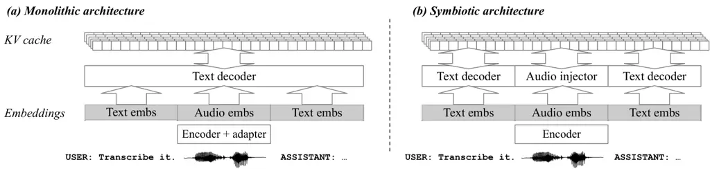
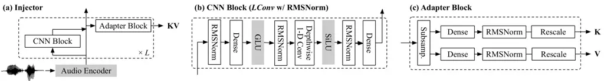

# SYMBIOTIC ARCHITECTURE FOR POST-HOC AUDIO EXTENSION OF FROZEN LANGUAGE MODELS

Yotaro Kubo    Qi Sun    Yujin Tang

###### Abstract

This paper proposes an architecture for equipping large language models
(LLMs) with audio-understanding capabilities without fine-tuning their
weights. The proposed symbiotic architecture employs an injector module
that writes audio-conditioned vectors directly into the target LLM’s
short-term memory, i.e., the key-value (KV) cache, enabling the LLM to
behave as an audio language model (ALM). The architectural advantages
are twofold. First, it improves the scalability of ALMs: because the
proposed method bypasses the LLM during audio injection, the injection
cost is governed by the injector width rather than the backbone width,
and can therefore scale more slowly than the cost of full-backbone
prefilling. Second, since the training scheme does not update the LLM
weights, the original capabilities of the LLM are preserved without the
risk of degradation from fine-tuning. The effectiveness of the proposed
method is evaluated on both audio-understanding tasks (automatic speech
recognition, audio question answering, and acoustic scene
classification) and text-only tasks. We confirm that, while activating
fewer parameters during audio prefilling, our architecture outperforms
the conventional method with a frozen LLM and approaches the performance
of a fine-tuned ALM, all while preserving the backbone LLM’s original
text-only task performance by construction.

###### Index Terms: 

Audio language model, context optimization, prefilling, catastrophic
forgetting, short-term memory.

^(†)^(†)address: Sakana AI, Tokyo, Japan.  
{yotarokubo,qisun,yujin}@sakana.ai



Figure 1: The conventional “monolithic” architecture and the proposed
“symbiotic” architecture, which can accommodate both a large decoder and
a fast, small injector.

## 1 Introduction

Audio language models (ALMs) \[10\] are a promising approach to enabling
machines to understand general audio signals. By leveraging the strong
language-understanding capabilities of large language models (LLMs), an
ALM can serve as a general-purpose solution for a wide range of
audio-understanding tasks, including automatic speech recognition (ASR),
audio question answering (AQA), and acoustic scene classification
(ASC) \[1\].

A typical ALM consists of three components: an input encoder, an
adapter, and a backbone LLM. The input encoder converts raw audio into a
hidden representation. The adapter, typically a very thin neural
network, transforms the hidden representation into embedding vectors
that are compatible with the backbone LLM. Finally, the LLM
autoregressively models interleaved sequences of text and audio
embedding vectors. To inherit the strong language-understanding
capabilities of LLMs, a model pretrained on vast amounts of text data is
adopted as a seed model and then fine-tuned to handle audio embedding
vectors that were unseen during pretraining. Although this monolithic
architecture is advantageous in its simplicity, we identify two key
drawbacks: limited prefilling scalability and catastrophic forgetting.

(a) Limited prefilling scalability: In a typical ALM, audio data is
provided as part of the input sequence and is passed to the response
generation phase via a short-term memory implemented in the form of a
key-value (KV) cache. The KV cache is read later when the LLM generates
the response text. The conversion process from embedding vectors to the
KV cache is called “prefilling.” Since this process is performed solely
by the LLM in the conventional monolithic architecture, the
computational cost of prefilling is proportional to the size of the
backbone LLM. Because audio token sequences tend to be long in typical
audio-understanding tasks, this prefilling cost is not negligible. More
importantly, given the current trend toward ever-larger backbone LLMs,
most of this computation is unrelated to audio processing; prefilling
should therefore be decoupled from the backbone so that its cost no
longer scales with the backbone size.

(b) Catastrophic forgetting: The typical training process of an ALM
involves supervised fine-tuning with audio and instruction data. Adding
a supervised training phase often degrades capabilities acquired during
previous training phases. This phenomenon is known as “catastrophic
forgetting.” To avoid this, it is common practice to employ a carefully
crafted mixture of datasets that includes tasks from earlier training
phases. However, using such a multimodal data mixture can make this
post-training process more complicated and computationally expensive.

In this paper, the above two drawbacks are addressed by introducing a
novel architecture. In the proposed architecture, we introduce a more
expressive adapter, called the injector, that directly writes the input
representations into the short-term memory, specifically the KV cache of
the LLM. Prefilling scalability is then improved by delegating
prefilling to this injector, which can be a narrower model with fewer
parameters than the LLM. Motivated by the ability of contextual
representations to steer frozen language models \[17\], we formulate
audio adaptation as the generation of an input-dependent, layer-wise KV
cache rather than an update to the backbone weights. This allows the
injector to optimize the KV cache instead of updating the LLM weights,
thereby preventing degradation of the frozen backbone caused by audio
fine-tuning.

## 2 Related Work

The proposed architecture can be viewed as a Mixture-of-Experts (MoE)
model \[11\] with routing predetermined by the input modality. Like MoE
models, this architecture offers the advantage of activating only a
subset of parameters at any given time. MoST \[14\] extends the MoE
architecture by selecting expert modules based on the modality (audio or
text) of each token. Our approach shares the core idea of using
different modules depending on the input modality. However, because MoST
is built on the MoE framework of the backbone LLM, the prefilling cost
is still dominated by the backbone LLM.

The prefilling cost also depends on the frame rate of the input audio
embedding vectors. To reduce the number of input frames, several
subsampling techniques have been proposed. SSR-Connector \[19\]
integrates an alignment module to perform adaptive subsampling based on
segments aligned to text tokens. SALMONN \[20\] integrates
Q-Former \[12\] to obtain a fixed-length representation for each
segment, which can also be viewed as adaptive subsampling. The proposed
method may further improve prefilling efficiency when used in
combination with these advanced subsampling techniques.

Whereas we integrate an expressive injector, several efforts instead aim
to make the audio encoder and adapter more lightweight. SLM \[22\]
demonstrated that optimizing only a lightweight adapter suffices to
train a speech LLM. Because the LLM parameters remain unchanged while
the model is adapted to audio tasks, this method inherently mitigates
catastrophic forgetting. Taking this direction to an extreme,
Gemma 4 \[21\] adopts an encoder-free approach that maps audio signals
directly to LLM inputs with only an affine transformation. In this
paper, we compare our method with SLM and show SLM’s limitations on
generic (non-speech) audio tasks.

For post-hoc multimodal extension, LLaMA-Adapter \[27\] optimizes a
fixed-length KV prefix augmented by the output of an image encoder. In
terms of how it controls the backbone LLM, this approach is similar to
the proposed method. Although LLaMA-Adapter can also keep the LLM
parameters completely unchanged, it requires modification to the
computation graph and is therefore not frozen from a computational
standpoint, unlike the proposed method. We aim for a post-hoc extension
that can reuse even the existing software infrastructure developed for
the backbone LLM.

## 3 Symbiotic Architecture

Fig. 1 illustrates the differences between the conventional monolithic
architecture and the proposed architecture for ALMs. In the monolithic
architecture, input audio signals are first converted into audio
embeddings. This step often involves a thin adapter layer to adjust the
feature dimensionality and a subsampling module to reduce the number of
embeddings. Even with the subsampling module applied, the process of
audio prefilling remains computationally expensive because the backbone
LLM itself must transform audio embeddings into the KV cache.

In contrast, our architecture uses the injector to transform audio
embeddings into the KV cache. This decoupling lets the injector be much
narrower than the backbone LLM, so the cost of audio injection does not
scale with the LLM width, enabling the use of arbitrarily large LLMs
without a proportional increase in injection cost.

Additionally, this architecture leverages the flexibility of context
optimization by integrating the injector as a context controller. Unlike
the monolithic architecture, the proposed architecture can introduce
arbitrary vectors into the KV cache while keeping the LLM weights
untouched. This adaptation scheme can effectively transform an LLM
trained solely on text datasets into an ALM without fine-tuning the LLM,
addressing the two aforementioned problems.

## 4 Injector Module

Fig. 2 shows the block diagram of our injector module. Because the
injector must produce a KV cache for every LLM layer, it is designed to
have the same number of layers as the backbone LLM.

### 4.1 CNN Block



Figure 2: Block diagrams of (a) the injector model, (b) the CNN block,
and (c) the adapter block.

The injector module is a stacked convolutional neural network (CNN)
based on “LConv” modules, which play a crucial role in the Conformer
architecture \[6\]. An LConv module consists of a depthwise convolution
flanked by two pointwise dense layers. Note that we replace
normalization layers in Conformer’s LConv with RMSNorm to improve
stability during small-batch training. In the experiments, we feed
2,048-dimensional vectors into the depthwise 1-D convolution with a
kernel size of 15.

In this paper, we employ a CNN-based architecture rather than a vanilla
Transformer because we hypothesize that local context is more important
than global context in audio prefilling. Because the backbone LLM is a
Transformer capable of integrating global context, the injector is
designed as a complementary module that focuses on local context. In
preliminary experiments, we found that optimization was unstable when
self-attention modules were used instead of “LConv”.

### 4.2 Adapter Block

In the adapter block, the outputs of CNN layers are subsampled and
mapped into the key and value vector spaces of the backbone LLM.

The adapter block first applies max pooling to subsample the sequence
with a fixed stride of 8. Then, the key and value vectors are extracted
using two affine transformations (“Dense” modules). As in Qwen3, RMSNorm
layers shared among multiple attention heads are applied to key vectors.
To stabilize training, RMSNorm modules with the same parametrization are
also applied to the value vectors.

### 4.3 KV Scale Matching

To facilitate optimization, especially during the early phase of
training, the key vectors generated by the injector must attract high
attention scores; otherwise, too little gradient reaches the injector,
and optimization plateaus. In our experiments, we use Qwen3 \[23\] as
the backbone LLM. Therefore, the distribution of the KV cache produced
by the injector module should match that of Qwen3’s KV cache. The
details in this section are specific to the Qwen3 backbone; however, the
scale-matching strategy can also be applied to other backbones.

The matching is done by adjusting the initialization of the scale
parameters of RMSNorm and introducing additional head-wise scale
parameters. Let $`\bm{k}^{(\ell)}_{h,t}`$ and $`\bm{v}^{(\ell)}_{h,t}`$
be the output key and value vectors from the injector for the $`h`$-th
head in the $`\ell`$-th layer at time step $`t`$. To match their
distributions to those of the LLM’s internal key and value vectors,
RMSNorm is applied as follows:

```math
\displaystyle\bm{k}^{(\ell)}_{h,t}:= \displaystyle\bm{\alpha}^{(\ell)}_{h}\odot\mathrm{RMSNorm}({\bm{k}}^{(\ell)}_{h,t};\bm{s}^{(\ell)}), \tag{1}
```

```math
\displaystyle\bm{v}^{(\ell)}_{h,t}:= \displaystyle\bm{\beta}^{(\ell)}_{h}\odot\mathrm{RMSNorm}({\bm{v}}^{(\ell)}_{h,t};\bm{r}^{(\ell)}),
```

where $`\bm{s}^{(\ell)}`$ and $`\bm{r}^{(\ell)}`$ are the scale
parameters of RMSNorm modules.

The objective of scale matching is to adjust the magnitudes of
$`\bm{k}^{(\ell)}_{h,t}`$ and $`\bm{v}^{(\ell)}_{h,t}`$ to match those
in the backbone LLM. Because Qwen3 also normalizes its key vectors using
RMSNorm with scale parameters shared across attention heads, scale
matching for $`\bm{k}^{(\ell)}_{h,t}`$ can be performed by initializing
$`\bm{s}^{(\ell)}`$ with the corresponding Qwen3 RMSNorm scale
parameters. For $`\bm{r}^{(\ell)}`$, we empirically obtained the initial
values for those scales by feeding a few calibration sentences into
Qwen3 and computing the standard deviation of the elements of the value
vectors. The calibration sentences were designed to emulate
instruction-response text pairs for typical audio tasks.

Because we share RMSNorm’s scale parameters across attention heads, the
RMSNorm outputs have limited per-head flexibility. To compensate for
this, we introduce additional scale parameters, initialized to 1, to
rescale the RMSNorm output.

### 4.4 Noisy RoPE Training

RoPE \[18\] is known to make models overfit to the sequence lengths seen
during training. If the backbone LLM uses RoPE, the injector must also
apply RoPE and thus inherit this fragility. DroPE \[4\] alleviates this
problem by removing RoPE during LLM training, but it is inapplicable
here because our method does not fine-tune the backbone LLM. To improve
robustness to inputs with unseen lengths, we introduce a simple
randomized training scheme for RoPE.

Let $`x`$ and $`y`$ denote the $`2i`$-th and $`(2i+1)`$-th elements of
$`\bm{k}^{(\ell)}_{h,t}`$. RoPE applies the following transformation:

```math
\begin{pmatrix}x\\
y\end{pmatrix}:=\begin{pmatrix}\cos\left(t^{\prime}\theta_{i}\right)&-\sin\left(t^{\prime}\theta_{i}\right)\\
\sin\left(t^{\prime}\theta_{i}\right)&\cos\left(t^{\prime}\theta_{i}\right)\end{pmatrix}\begin{pmatrix}x\\
y\end{pmatrix}, \tag{2}
```

where $`t^{\prime}=t_{0}+\tau+\kappa t`$, and $`\theta_{i}`$ is the
angular velocity for the $`i`$-th dimension pair as defined in \[18\].
Here, $`t_{0}`$ is the position offset for each instance, $`\tau`$ is a
random offset variable drawn from the uniform integer distribution over
$`[0,\tau_{\mathrm{MAX}}]`$, and $`\kappa`$ is a random time-scale
factor drawn from a uniform distribution over
$`[\kappa_{\mathrm{MIN}},\kappa_{\mathrm{MAX}})`$.

The conventional RoPE is a special case of this noisy RoPE, obtained by
setting $`\tau=0`$ and $`\kappa=1`$. The randomization introduced here
follows the position-perturbation technique of \[25\] and improves
robustness to input sequences of unseen lengths. In the experimental
section, we used $`\tau_{\mathrm{MAX}}=256`$,
$`\kappa_{\mathrm{MIN}}=0.75`$, and $`\kappa_{\mathrm{MAX}}=1.5`$.

|              |          |       |      |             |           |            |            |            |            |
| ------------ | -------- | ----- | ---- | ----------- | --------- | ---------- | ---------- | ---------- | ---------- |
|              | \#Params |       |      | LibriSpeech |           |            |            | Clotho-AQA | CochlScene |
| Architecture | Total    | Audio | Text | dev-clean   | dev-other | test-clean | test-other |            |            |
| Encoder-only | 1108M    | 1108M | 752M | 2.22        | 4.07      | 2.33       | 4.25       | 62.6       | 52.9       |
| Symbiotic    | 1303M    | 551M  | 752M | 1.91        | 3.73      | 2.07       | 3.91       | 47.1       | 41.7       |
| Monolithic   | 1108M    | 1108M | 752M | 2.16        | 3.68      | 2.26       | 4.01       | 45.4       | 32.7       |

Table 1: Error rates (%) on audio and speech tasks. “Audio” and “Text”
denote the number of parameters involved during audio prefilling and
text prefilling, respectively.

## 5 Experiments

### 5.1 Model Configuration

The pretrained WavLM (wavlm-large) model \[2\] was adopted as our base
audio encoder. During training, LoRA was applied to this encoder module
with the parameters $`r=64,\alpha=64`$. As mentioned in the previous
section, Qwen3 \[23\] was adopted as our LLM component. Specifically,
Qwen3-0.6B was chosen to evaluate the effectiveness of the proposed
approach for compact ALMs.

For comparison, we built a model based on the SLM \[22\] architecture
using the same backbone LLM (Qwen3-0.6B) and the same audio encoder
(wavlm-large). We refer to this baseline as “Encoder-only”. We also
evaluated “Monolithic,” a reference that adapts the backbone LLM with
LoRA ($`r=16,\alpha=16`$). In both conventional models, the connector
stacks eight consecutive 1,024-dimensional audio representations and
maps the resulting 8,192-dimensional vector into the LLM’s
1,024-dimensional embedding space using an affine transformation. This
gives the same subsampling rate as the symbiotic architecture.

### 5.2 Training Configuration

| Dataset                | \#hrs | Mix weight | Task |
| ---------------------- | ----- | ---------- | ---- |
| LibriSpeech \[16\]     | 960   | 90%        | ASR  |
| CompA-R \[5\]          | 159   | 2.5%       | AQA  |
| DCASE2025 Task5 \[24\] | 7.4   | 2.5%       | AQA  |
| Clotho-AQA \[13\]      | 7.4   | 2.5%       | AQA  |
| CochlScene \[8\]       | 169   | 2.5%       | ASC  |

Table 2: Training datasets.

Table 2 lists the training datasets covering ASR, AQA, and ASC tasks.
The audio from the LibriSpeech dataset was augmented using the speed
perturbation technique \[9\]. LibriSpeech signals were speed-perturbed
with 40% probability, using a factor of 1.1 for 20% of the samples and
0.9 for another 20%. For computational efficiency, utterances longer
than 25 seconds after speed perturbation were excluded from training.
For the Clotho-AQA dataset, which contains answers from three
annotators, we retained only instances for which at least two annotators
agreed and used the majority label as the target. The training
configuration was determined through preliminary experiments, using the
LibriSpeech dev-other word error rate (WER) as the primary metric.

All models were trained using AdamW for 80,000 steps with a cosine
learning-rate scheduler. The peak and minimum learning rates were set to
$`5\times 10^{-4}`$ and $`5\times 10^{-6}`$, respectively, and the
number of warm-up steps was set to 2,000. The batch size was set to 64.

### 5.3 Experimental Results and Discussion

Table 1 reports WERs for LibriSpeech and classification error rates for
Clotho-AQA and CochlScene. In the table, “Encoder-only” and “Symbiotic”
denote architectures that keep the backbone LLM frozen. Compared with
“Encoder-only”, the proposed “Symbiotic” substantially reduced error
rates, especially on non-ASR tasks. The high error rates on non-ASR
tasks for “Encoder-only” suggest that adapting only the input embeddings
provides limited control over the frozen LLM.

To assess how well “Symbiotic” controls the backbone LLM without
fine-tuning, we compare it with “Monolithic”, which adapts the backbone
LLM directly. We observed that “Symbiotic” closely approached this
reference while reducing the number of parameters activated during audio
prefilling from 1,108M to 552M. The remaining gap on CochlScene may stem
from our CNN-centric injector design; exploring alternative designs is
promising future work.

Prefilling speed was measured on the LibriSpeech “dev-other” dataset
using an H100 accelerator with a batch size of 4. The proposed approach
processed all utterances in 157.1 seconds, whereas the monolithic
architecture required 199.8 seconds. Although our injector performs
subsampling at a later stage in the pipeline and therefore requires more
FLOPs in theory, it still achieved a shorter wall-clock time. We
attribute this improvement to fewer kernel invocations and a
cache-friendly parameter size. In real-world applications with longer
system prompts, the additional FLOPs may be amortized because the
monolithic architecture relies on quadratic-time self-attention modules
for prefilling.

| Task                               | Frozen LLM | Audio FT |
| ---------------------------------- | ---------- | -------- |
| WikiText-2 (BPB; $`\downarrow`$)   | 0.88       | 1.32     |
| HellaSwag (Accuracy; $`\uparrow`$) | 47.3       | 38.2     |
| GSM8K (Accuracy; $`\uparrow`$)     | 57.8       | 2.0      |

Table 3: Benchmark scores on text tasks.

To measure the impact of catastrophic forgetting, we evaluated both the
original and the fine-tuned (“Monolithic”) models on the text tasks.
WikiText-2 \[15\] and HellaSwag \[26\] assess next-token prediction,
whereas GSM8K \[3\] assesses reasoning ability. Table 3 shows that
catastrophic forgetting due to audio-instruction fine-tuning (“Audio
FT”) was severe. By contrast, because the symbiotic architecture keeps
the backbone LLM frozen, its text-only task scores are identical to that
of “Frozen LLM” by construction. Unlike multi-dataset training, which
may compromise target-task performance \[7\], our architecture preserves
the original text-only performance without sacrificing audio-task
quality.

Finally, Table 4 reports LibriSpeech WERs as we incrementally add the
two stabilization techniques, noisy RoPE and KV scale matching. The last
column reports the WER on a long-utterance set comprising 86 utterances
longer than 25 seconds from the LibriSpeech development and test
partitions; utterances of these lengths were excluded from training.

Noisy RoPE substantially improved performance, reducing the WER on long
utterances from 120.68% to 10.49%. KV scale matching further reduced it
to 4.70% while also improving the results on the standard splits. These
results demonstrate that both techniques improve robustness to sequence
lengths unseen during training.

| Model                | LibriSpeech         | Long   |
| -------------------- | ------------------- | ------ |
| Architecture-only    | 5.68/7.44/6.97/6.37 | 120.68 |
| \+ Noisy RoPE        | 2.13/3.97/2.21/4.09 | 10.49  |
| \+ KV Scale Matching | 1.91/3.73/2.07/3.91 | 4.70   |

Table 4: Effect of training techniques on ASR WER (%). The four
LibriSpeech values correspond to
dev-clean/dev-other/test-clean/test-other.

## 6 Conclusions

In this paper, we proposed a symbiotic architecture that couples an
audio encoder with a backbone LLM through the LLM’s short-term memory,
specifically its KV cache. By construction, it decouples audio-injection
cost from the backbone width and eliminates catastrophic forgetting,
since the backbone LLM is never updated. Our experiments showed that, in
the compact regime, the proposed architecture approaches a fine-tuned
reference on audio tasks while activating fewer parameters during audio
prefilling and preserving the backbone LLM’s text-only performance
exactly. Among methods that keep the backbone frozen, it substantially
outperforms the encoder-only SLM baseline, especially on non-speech
audio tasks.

Since we focused on compact ALMs, our experiments used a single small
backbone; verifying the scalability advantage with larger backbones
remains important.

## References

- \[1\] D. Barchiesi, D. Giannoulis, D. Stowell, and M. D.
  Plumbley (2015) Acoustic scene classification: classifying
  environments from the sounds they produce. Signal Processing Magazine
  32 (3). Cited by: §1.
- \[2\] S. Chen, C. Wang, Z. Chen, Y. Wu, S. Liu, Z. Chen, J. Li, N.
  Kanda, T. Yoshioka, X. Xiao, et al. (2022) WavLM: large-scale
  self-supervised pre-training for full stack speech processing. IEEE J.
  STSP 16 (6). Cited by: §5.1.
- \[3\] K. Cobbe, V. Kosaraju, M. Bavarian, M. Chen, H. Jun, L.
  Kaiser, M. Plappert, J. Tworek, J. Hilton, R. Nakano, C. Hesse, and J.
  Schulman (2021) Training verifiers to solve math word problems. arXiv
  preprint arXiv:2110.14168. Cited by: §5.3.
- \[4\] Y. Gelberg, K. Eguchi, T. Akiba, and E. Cetin (2026) Extending
  the context of pretrained llms by dropping their positional embedding.
  In Proc. ICLR, Cited by: §4.4.
- \[5\] S. Ghosh, S. Kumar, A. Seth, C. K. R. Evuru, U. Tyagi, S.
  Sakshi, O. Nieto, R. Duraiswami, and D. Manocha (2024) GAMA: a large
  audio-language model with advanced audio understanding and complex
  reasoning abilities. In Proc. EMNLP, Cited by: Table 2.
- \[6\] A. Gulati, J. Qin, C. Chiu, N. Parmar, Y. Zhang, J. Yu, W.
  Han, S. Wang, Z. Zhang, Y. Wu, and R. Pang (2020) Conformer:
  convolution-augmented transformer for speech recognition. In Proc.
  INTERSPEECH, Cited by: §4.1.
- \[7\] Y. Huang, J. Lin, C. Zhou, H. Yang, and L. Huang (2022) Modality
  competition: what makes joint training of multi-modal network fail in
  deep learning? (Provably). In Proc. ICML, Cited by: §5.3.
- \[8\] I. Jeong and J. Park (2022) CochlScene: acquisition of acoustic
  scene data using crowdsourcing. In Proc. APSIPA–ASC, Cited by: Table 2.
- \[9\] T. Ko, V. Peddinti, D. Povey, and S. Khudanpur (2015) Audio
  augmentation for speech recognition. In Proc. INTERSPEECH, Cited by:
  §5.2.
- \[10\] S. Latif, M. Shoukat, F. Shamshad, M. Usama, Y. Ren, H.
  Cuayáhuitl, W. Wang, X. Zhang, R. Togneri, E. Cambria, et al. (2023)
  Sparks of large audio models: a survey and outlook. arXiv preprint
  arXiv:2308.12792. External Links:
  [Link](https://arxiv.org/abs/2308.12792) Cited by: §1.
- \[11\] D. Lepikhin, H. Lee, Y. Xu, D. Chen, O. Firat, Y. Huang, M.
  Krikun, N. Shazeer, and Z. Chen (2021) GShard: scaling giant models
  with conditional computation and automatic sharding. In Proc. ICLR,
  External Links: [Link](https://openreview.net/forum?id=qrwe7XHTmYb)
  Cited by: §2.
- \[12\] J. Li, D. Li, S. Savarese, and S. Hoi (2023) BLIP-2:
  bootstrapping language-image pre-training with frozen image encoders
  and large language models. In Proc. ICML, Cited by: §2.
- \[13\] S. Lipping, P. Sudarsanam, K. Drossos, and T. Virtanen (2022)
  Clotho-AQA: a crowdsourced dataset for audio question answering. In
  Proc. EUSIPCO, Cited by: Table 2.
- \[14\] Y. Lou, K. Yang, and Y. You (2026) MoST: mixing speech and text
  with modality-aware mixture of experts. In Proc. ICML, External Links:
  [Link](https://openreview.net/forum?id=32jYxFTcNX) Cited by: §2.
- \[15\] S. Merity, C. Xiong, J. Bradbury, and R. Socher (2016) Pointer
  sentinel mixture models. arXiv preprint arXiv:1609.07843. Cited by:
  §5.3.
- \[16\] V. Panayotov, G. Chen, D. Povey, and S. Khudanpur (2015)
  Librispeech: an asr corpus based on public domain audio books. In
  Proc. ICASSP, Cited by: Table 2.
- \[17\] R. Pryzant, D. Iter, J. Li, Y. Lee, C. Zhu, and M. Zeng (2023)
  Automatic prompt optimization with “gradient descent” and beam search.
  In Proc. EMNLP, Cited by: §1.
- \[18\] J. Su, M. Ahmed, Y. Lu, S. Pan, W. Bo, and Y. Liu (2024)
  RoFormer: enhanced transformer with rotary position embedding.
  Neurocomputing 568. Cited by: §4.4, §4.4.
- \[19\] W. Tan, H. Inaguma, N. Dong, P. D. Tomasello, and X. Ma (2025)
  SSR: alignment-aware modality connector for speech language models. In
  Proc. IWSLT, Cited by: §2.
- \[20\] C. Tang, W. Yu, G. Sun, X. Chen, T. Tan, W. Li, L. Lu, Z. Ma,
  and C. Zhang (2024) SALMONN: towards generic hearing abilities for
  large language models. In Proc. ICLR, Cited by: §2.
- \[21\] G. Team (2026) Gemma 4 technical report. arXiv preprint
  arXiv:2607.02770. External Links:
  [Link](https://arxiv.org/abs/2607.02770) Cited by: §2.
- \[22\] M. Wang, W. Han, I. Shafran, Z. Wu, C. Chiu, Y. Cao, N.
  Chen, Y. Zhang, H. Soltau, P. K. Rubenstein, L. Zilka, D. Yu, G.
  Pundak, N. Siddhartha, J. Schalkwyk, and Y. Wu (2023) SLM: bridge the
  thin gap between speech and text foundation models. In Proc. ASRU,
  Cited by: §2, §5.1.
- \[23\] A. Yang, A. Li, B. Yang, B. Zhang, B. Hui, B. Zheng, B. Yu, C.
  Gao, C. Huang, C. Lv, et al. (2025) Qwen3 technical report. arXiv
  preprint arXiv:2505.09388. External Links:
  [Link](https://arxiv.org/abs/2505.09388) Cited by: §4.3, §5.1.
- \[24\] C. H. Yang, S. Ghosh, Q. Wang, J. Kim, H. Hong, S. Kumar, G.
  Zhong, Z. Kong, S. Sakshi, V. Lokegaonkar, O. Nieto, R. Duraiswami, D.
  Manocha, G. Kim, J. Du, R. Valle, and B. Catanzaro (2025) Multi-domain
  audio question answering toward acoustic content reasoning in the
  dcase 2025 challenge. arXiv preprint arXiv:2505.07365. External Links:
  [Link](https://arxiv.org/abs/2505.07365) Cited by: Table 2.
- \[25\] H. Yu, T. Jiang, S. Jia, S. Yan, S. Liu, H. Qian, G. Li, S.
  Dong, and C. Yuan (2025) Comrope: scalable and robust rotary position
  embedding parameterized by trainable commuting angle matrices. In
  Proc. CVPR, Cited by: §4.4.
- \[26\] R. Zellers, A. Holtzman, Y. Bisk, A. Farhadi, and Y.
  Choi (2019) HellaSwag: can a machine really finish your sentence?. In
  Proc. Annual Meeting of ACL, Cited by: §5.3.
- \[27\] R. Zhang, J. Han, C. Liu, P. Gao, A. Zhou, X. Hu, S. Yan, P.
  Lu, H. Li, and Y. Qiao (2024) LLaMa-adapter: efficient fine-tuning of
  language models with zero-init attention. In Proc. ICLR, Cited by: §2.
