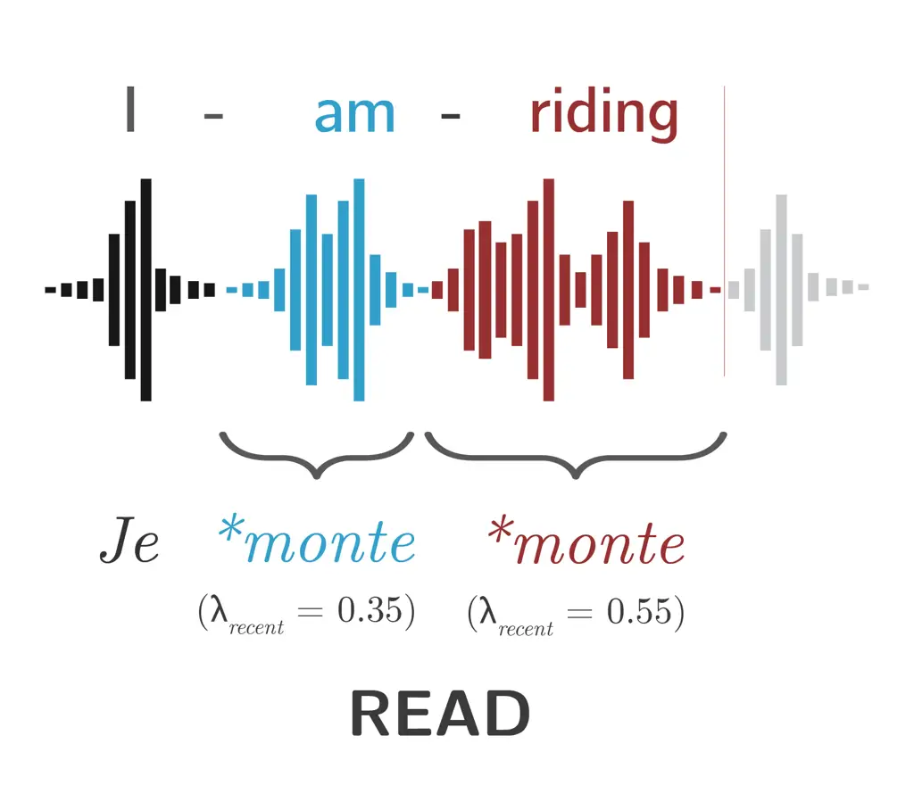
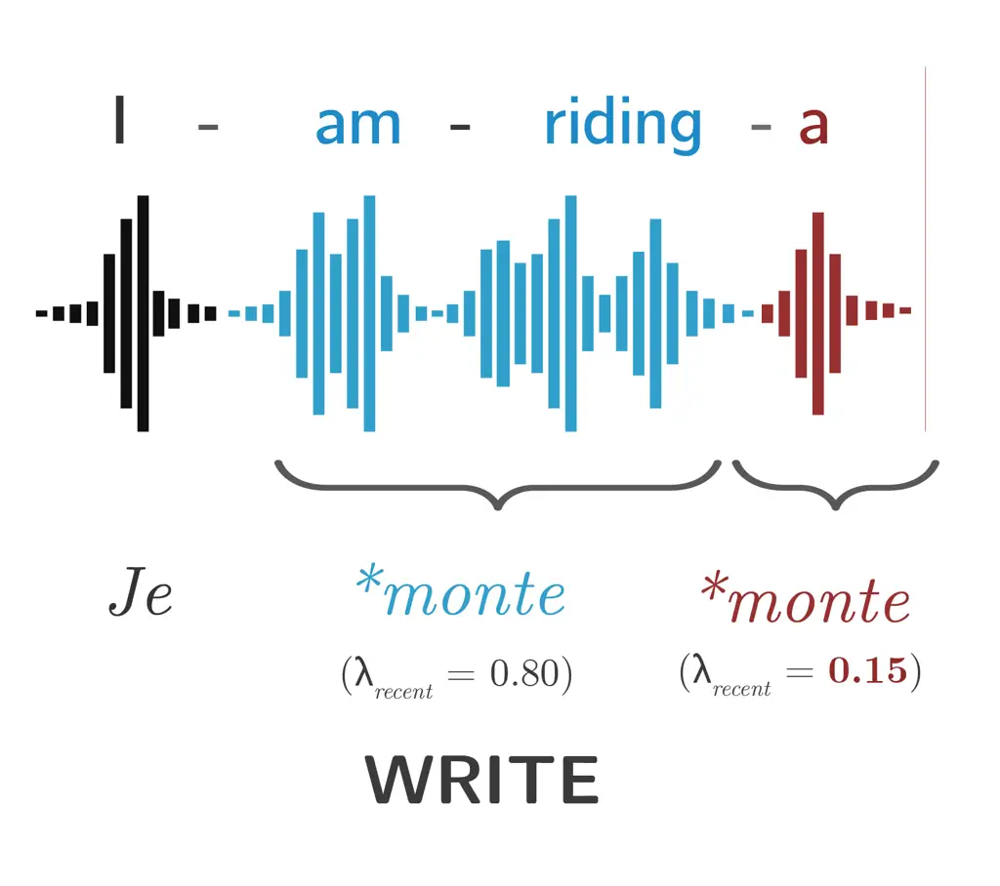
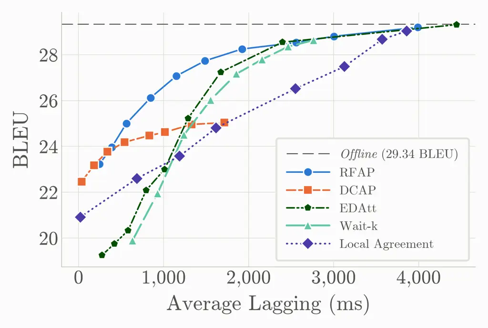
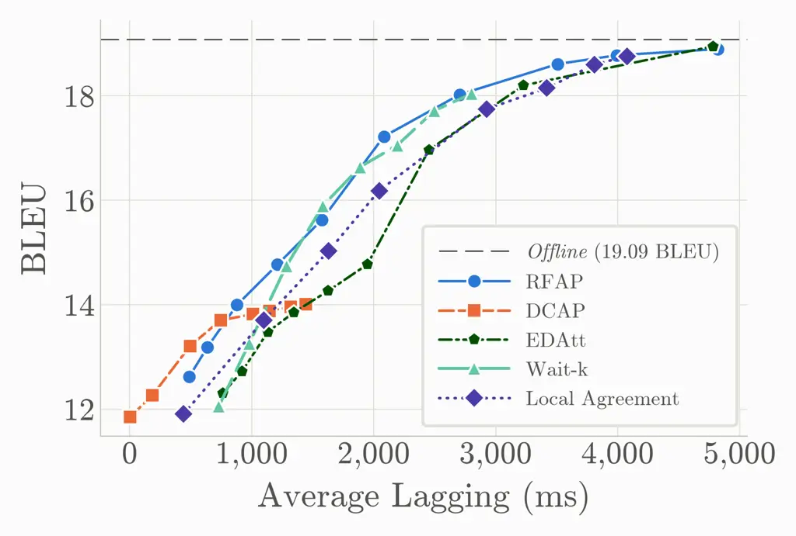
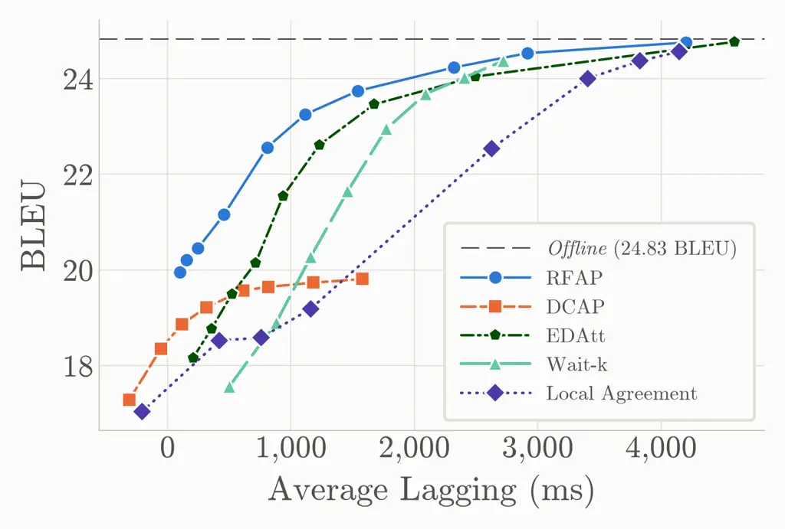

# Attention-Based Adaptive Policies for Simultaneous Speech-to-Text Translation

Filip Tășădan    Ema Tomanová    Ondrej Lopuch    Paweł Bilko    Anders
Søgaard

###### Abstract

Simultaneous speech-to-text translation (Simul-S2TT) consists of
generating partial translations while the incoming audio frames are
processed by the system. However, the streaming nature of this setup
creates the challenge of deciding the best moment to perform an accurate
translation while minimizing the delay. To address this challenge, we
utilize the cross-attention mechanism of the encoder-decoder
architecture to find the right alignment between the input speech frames
and the target text tokens. In this paper, we propose the Recent Frame
Attention Policy (RFAP) and the Dual-Condition Attention Policy (DCAP)
that allow offline trained speech-to-text translation models to be used
in streaming scenarios without requiring additional training. Results on
three different language translation pairs over the CVSS-C corpus show
that the RFAP is able to surpass other policies with gains of up to 4.0
BLEU while reducing the translation delay by almost 1 second. Moreover,
the DCAP is able to preserve a high translation quality when the latency
is very low.

###### Index Terms: 

simultaneous speech translation, decision policy, cross-attention,
low-latency inference

^(†)^(†)address: University of Copenhagen  
tasadan.filip@gmail.com

## 1 Introduction

Simultaneous speech-to-text translation (Simul-S2TT) is used for
real-time translation of international conferences and live streams in
various languages \[2\] \[1\]. In order to balance the translation
quality with latency, a decision policy is employed that guides the
system when to READ (wait for more audio) or WRITE (output a partial
translation for the accumulated input chunks) \[8\].

The simultaneous decision policies are categorized into two main types:
fixed and adaptive. Fixed policies, such as the widely used Wait-$`k`$
approach, rely on simple heuristics where the model waits for a
predetermined number of speech segments before generating the output
\[11\]. The main limitation of the fixed policy models is that they
cannot determine whether at each time step they have enough information
context to be able to generate an accurate translation or not, thus
leading to suboptimal performance \[6\].

In order to mitigate this issue, adaptive decision policies have been
proposed. These policies determine the moment of translation by finding
correlations between the input context and the translation output
\[15\]. The goal of the adaptive policies is to provide the Simul-S2TT
models with a mechanism that dynamically determines the moments when the
accumulated information is sufficient for the model to accurately
produce a translation. On the other hand, if the adaptive decision
mechanism has any indication that the current input buffer does not
contain enough information to reliably translate it (i.e. partial words,
incomplete expressions), it will signal to the model that it must wait
for more information to be received before translating it. The issue
with most of the models that have built-in adaptive decision components
is that they are provided with partial input during training to simulate
the real-time translation conditions \[9\] \[20\] \[10\], thus
increasing the computation costs and making the models more prone to
errors when training and testing conditions are different from each
other.

To avoid simulating the streaming conditions during training, adaptive
policies applied to offline-trained models have been proposed by \[12\],
\[13\] and \[18\]. The main advantage of these policies is that they do
not require any additional modules for the decision policy. In the case
of \[12\] and \[13\] the policy is determined by the attention-heads
alignment between the input speech and the generated output. In \[18\],
the decision policy is computed by performing a beam search and
selecting the best hypothesis for each chunk.

In this paper, we propose the Recent Frame Attention Policy (RFAP) and
the Dual-Condition Attention Policy (DCAP) that allow standard offline
speech-to-text models to be used in streaming scenarios. Our research
can be summarized as follows:

- •
  We show that RFAP outperforms all the other evaluated policies by
  gaining up to 4.0 BLEU while reducing the delay by almost 1 second.
- •
  We show that the DCAP is capable of achieving negative average latency
  with high translation quality

## 2 Preliminary

Our adaptive decision policies use the cross-attention mechanism of the
decoder module to determine the right translation moment \[16\]. This
mechanism enables the model to learn the relationship between the
encoded speech tokens and the generated text tokens. The attention score
is computed as:

```math
\operatorname{Attention}(Q,K,V)=\operatorname{softmax}\!\left(\frac{QK^{\top}}{\sqrt{d_{k}}}\right)V \tag{1}
```

To compute the cross attention for our models, at each time step $`t`$,
the Simul-S2TT model receives $`n`$ speech frames
$`X_{n}=[x_{1},x_{2},...,x_{n}]`$ and it has previously generated the
output sequence $`Y_{m-1}=[y_{1},y_{2},...,y_{m-1}]`$. The input
sequence $`X_{n}`$ is further used to compute the key ($`K^{t}`$) and
value ($`V^{t}`$) matrices. For the first cross-attention layer, the
query ($`Q^{t}`$) is obtained from the generated text sequence
$`Y_{m-1}`$. For the subsequent attention layers, $`Q^{t}`$ is obtained
from the output of the previous attention layer. Thus, the
cross-attention at a given time step $`t`$ can be regarded as a function
of $`X_{n}`$ and $`Y_{m-1}`$, defined as:

```math
\lambda^{t}(X_{n},Y_{m-1})=\operatorname{softmax}\!\left(\frac{Q^{t}(K^{t})^{\top}}{\sqrt{d_{k}}}\right)V^{t} \tag{2}
```

As observed in \[12\], when the attention score for the generated output
is concentrated on the most recent speech frames, the model requires
more context before emitting a new translation. On the other hand, when
the attention of the generated output is focused on older frames, the
model has accumulated enough information to generate the translation. In
order to quantify the relationship between the source speech frames and
the generated translation, we focus on the recent frames attention,
defined as the sum of attention weights allocated to the $`r`$ most
recently received speech frames, i.e. the frames of the latest input
chunk, for the target token $`y_{m}`$:

```math
\lambda_{\text{recent}}^{t}(X_{n},y_{m})=\sum_{i=n-r+1}^{n}\lambda^{t}(x_{i},y_{m}) \tag{3}
```

Since $`y_{m}`$ is the text token generated at time step $`t`$, we have
to employ a two-pass inference on the auto-regressive decoder in order
to compute the cross attention score as presented in Equation 3. First,
the encoded speech frames $`X_{n}`$ together with the previously
generated tokens $`Y_{m-1}`$ are provided to the decoder in order to
compute the output token $`y_{m}`$. Afterwards, we run again the
inference on the decoder having as input the same $`X_{n}`$ but the
output text sequence becomes $`Y_{m}`$ since we append the token
$`y_{m}`$ to $`Y_{m-1}`$. In this second pass, we are able to extract
from the decoder the cross attention score as defined by Equation 3 and
further use it for the decision policies presented by the next section.

## 3 Method

### 3.1 Recent Frame Attention Policy (RFAP)

The Recent Frame Attention Policy is built on the hypothesis that the
cross attention mechanism shifts its focus from the most recent audio
frames once it has gathered enough information \[12\]. The RFAP compares
the sum of the attention weights
$`\lambda_{\text{recent}}^{t}(X_{n},y_{m})`$ of the most recently
received frames for the generated text token $`y_{m}`$ against a fixed
threshold $`\alpha`$:

```math
\lambda_{\text{recent}}^{t}(X_{n},y_{m})<\alpha,\alpha\in(0,1) \tag{4}
```



Figure 1: READ Decision: High recent attention score
($`\lambda_{\text{recent}}^{t}=0.55>\alpha,\alpha=0.2`$) indicates the
model requires more source context. Recent frames are denoted in red,
previous frames with lambda over threshold in blue and previous frames
that invoked WRITE decision in black. Future source frames in light
gray. Next target token prediction marked with \*.



Figure 2: WRITE Decision: Focus shifts to earlier context
($`\lambda_{\text{recent}}^{t}=0.15<\alpha,\alpha=0.2`$), signaling
sufficient information to emit the target text token ’monte’.

Following Eq. 4, when the $`\lambda^{t}_{\text{recent}}`$ score is
higher than the threshold $`\alpha`$, the incoming audio chunks are
strongly correlated with the generated output, so the system has to wait
for more context before translating. In this case, the READ action will
be emitted by the policy as depicted in Figure 1. Otherwise, when the
recent attention score is lower than the threshold $`\alpha`$, the
necessary information to translate token $`y_{m}`$ has a lower
correlation with the most recently received speech frames. Thus, the
policy will trigger the WRITE action as in Figure 2. The threshold
$`\alpha`$ can be used to balance the translation quality and latency.

Due to the two-pass inference strategy, the RFAP only computes the
cross-attention score between the next output token and the most recent
speech frames, thus preserving the same hypothesis as \[12\] while
eliminating the need for a excessive accumulation of speech frames
before emitting the WRITE action.

### 3.2 Dual-Condition Attention Policy (DCAP)

The RFAP waits for the attention score to stabilize before triggering
the WRITE action, which improves the translation quality but increases
the delay. In order to mitigate this issue, we propose the
Dual-Condition Attention Policy that extends the RFAP by considering not
only the correlation between the speech frames and the generated
translation tokens, but also the rate of change in the attention focus
on the most recent frames. The information provided by the rate of
change allows the model to trigger the WRITE action whenever new tokens
that impact the translation are being read by the model.

To calculate the rate of change, we look at the difference of the recent
attention score at the current time step $`t`$ and the previous time
step $`t-1`$ for the target token $`y_{m}`$. We define this relationship
as:

```math
\Delta\lambda_{\text{recent}}(X_{n},y_{m})=\lambda_{\text{recent}}^{t}(X_{n},y_{m})-\lambda_{\text{recent}}^{t-1}(X_{n-r},y_{m}) \tag{5}
```

The DCAP policy is built on the idea that the cross-attention mechanism
exhibits two phases where the translation can be made: the Discovery
Phase and the Completion Phase. In order to capture both phases, the
DCAP policy uses a dual-condition as presented in Equation 6:

```math
\Delta\lambda_{\text{recent}}(X_{n},y_{m})\geq 0\quad\lor\quad\lambda_{\text{recent}}^{t}(X_{n},y_{m})<\alpha \tag{6}
```

The rate of change condition
($`\Delta\lambda_{\text{recent}}(X_{n},y_{m})\geq 0`$) acts as a trigger
for the Discovery Phase. A positive rate of change shows that the model
is finding relevant information in the new audio frames. Instead of
waiting for the attention score to peak and then drop, this condition
lets the system produce the translation as soon as it detects the new
information.

The recent attention condition
($`\lambda_{\text{recent}}^{t}(X_{n},y_{m})<\alpha`$) acts as a trigger
for the Completion Phase. This rule ensures that the translation is
triggered once the decoder shifts its focus away from the most recent
frames, particularly in cases when the rate of change condition is not
triggered because the recent attention has a descending curve and it
eventually gets below the threshold $`\alpha`$. In this case, the model
has all the relevant context for translation.



(a) FR-EN



(b) DE-EN



(c) ES-EN

Figure 3: BLEU score vs. Average Lagging (AL) for the (a) FR-EN, (b)
DE-EN, and (c) ES-EN translation pairs.

## 4 Experiments

### 4.1 Experimental Setup

| Language Pair | Split | No. Samples | Hours | Avg. SRC Duration (s) | Avg. TGT Tokens Count |
| ------------- | ----- | ----------- | ----- | --------------------- | --------------------- |
| FR-EN         | Train | 207,364     | 174.0 | 4.57                  | 11.6                  |
|               | Dev   | 14,759      | 13.0  | 5.28                  | 12.4                  |
|               | Test  | 14,759      | 13.3  | 5.66                  | 12.7                  |
| DE-EN         | Train | 127,822     | 112.4 | 5.17                  | 12.3                  |
|               | Dev   | 13,511      | 12.5  | 5.48                  | 13.0                  |
|               | Test  | 13,504      | 12.1  | 5.72                  | 12.7                  |
| ES-EN         | Train | 79,012      | 69.5  | 5.13                  | 12.0                  |
|               | Dev   | 13,212      | 12.4  | 5.92                  | 12.9                  |
|               | Test  | 13,216      | 12.4  | 6.17                  | 12.9                  |

Table 1: CVSS-C Dataset Statistics

For our experiments, we utilized the CVSS-C dataset \[4\] on the
French-English (FR-EN), German-English (DE-EN), Spanish-English (ES-EN)
language pairs. This dataset is derived from the CoVoST 2 speech-to-text
translation corpus \[17\], that consists of synthetically generated
input speech in a single canonical voice. Table 1 presents the
distribution of the data in the CVSS-C dataset.

Our speech-to-text translation model is based on the StreamSpeech
architecture \[19\] adapted for offline speech-to-text translation. The
model has a size of 55 million parameters. The encoder follows the
Conformer architecture \[3\], consisting of 12 layers, 4 attention
heads, an embedding dimension of 256, and a feed-forward dimension of 2048. The decoder is a standard Transformer \[16\] with 4 layers, 8
attention heads, an embedding dimension of 512, and a feed-forward
dimension of 2048. The encoder produces one speech frame every 40 ms,
and the input is received in fixed chunks of 320 ms. We therefore set
the number of the most recent speech frames $`r=8`$. Moreover, for the
attention-based decision policies, we extract
$`\lambda_{\text{recent}}^{t}`$ from the last cross-attention layer,
which we empirically found to yield the best results.

The model was trained on an NVIDIA RTX 4000 GPU with 31GB of memory for
80 epochs. Training was conducted with mixed-precision (FP16) to improve
computational efficiency.

### 4.2 Results

In this section, we present the experimental results of the RFAP and the
DCAP policies on the FR-EN, DE-EN and ES-EN language translation pairs
from the CVSS-C dataset \[4\]. The main goal is to evaluate how well
these attention-based policies balance the trade-off between translation
quality and latency. The translation quality is measured by the BLEU
score \[14\], whereas the delay is computed as average latency (AL)
measured in milliseconds \[7\]. We compare our proposed decision
policies against EDAtt \[12\], and two baseline policies, namely Wait-K
\[7\] and Local Agreement (LA) \[5\]. In Fig. 3, we report the
evaluation results of the proposed policies in terms of latency-quality
trade-off. Table 2 groups the operating points of each policy from
Fig. 3 into AL ranges and reports the best BLEU reached within each
range, allowing a direct comparison of the policies under the same
latency constraints.

|                         |              |       |       |       |       |       |       |        |
| ----------------------- | ------------ | ----- | ----- | ----- | ----- | ----- | ----- | ------ |
|                         | AL range (s) |       |       |       |       |       |       |        |
| Policy                  | $`<`$0       | 0–0.5 | 0.5–1 | 1–1.5 | 1.5–2 | 2–2.5 | 2.5–3 | $`>`$3 |
| French-English (FR-EN)  |              |       |       |       |       |       |       |        |
| RFAP                    | –            | 23.97 | 26.12 | 27.73 | 28.25 | –     | 28.53 | 29.20  |
| DCAP                    | –            | 23.77 | 24.48 | 24.96 | 25.04 | –     | –     | –      |
| EDAtt                   | –            | 19.75 | 22.08 | 25.22 | 27.24 | 28.55 | –     | 29.31  |
| Wait-K                  | –            | –     | 21.95 | 24.50 | 27.17 | 28.35 | 28.64 | –      |
| Local Agreement         | –            | –     | 22.60 | 23.57 | 24.80 | –     | 26.52 | 29.03  |
| German-English (DE-EN)  |              |       |       |       |       |       |       |        |
| RFAP                    | –            | 12.62 | 14.00 | 14.77 | 15.62 | 17.22 | 18.02 | 18.89  |
| DCAP                    | –            | 13.21 | 13.70 | 14.01 | –     | –     | –     | –      |
| EDAtt                   | –            | –     | 12.72 | 13.85 | 14.77 | 16.97 | –     | 18.95  |
| Wait-K                  | –            | –     | 13.26 | 14.74 | 16.64 | 17.72 | 18.04 | –      |
| Local Agreement         | –            | 11.90 | –     | 13.71 | 15.03 | 16.18 | 17.75 | 18.76  |
| Spanish-English (ES-EN) |              |       |       |       |       |       |       |        |
| RFAP                    | –            | 21.16 | 22.56 | 23.25 | 23.74 | 24.23 | 24.53 | 24.75  |
| DCAP                    | 17.29        | 19.22 | 19.65 | 19.73 | 19.81 | –     | –     | –      |
| EDAtt                   | –            | 18.77 | 21.54 | 22.61 | 23.46 | 24.04 | –     | 24.77  |
| Wait-K                  | –            | 17.57 | 18.90 | 21.65 | 22.95 | 24.02 | 24.37 | –      |
| Local Agreement         | 17.04        | 18.52 | 18.59 | 19.19 | –     | –     | 22.54 | 24.56  |

Table 2: Best BLEU reached by each policy within a given AL range. –
marks a range where policy has no result.

Table 2 shows RFAP as strong contender across all latencies. In the
mid-range latencies it performs better than any other policy except for
wait-k in DE-EN dataset. When compared to EDAtt, the RFAP is capable to
preserve high BLEU score even with latency lower by 500 ms on average.
In high-latency settings RFAP keeps up on par with all other policies.
On the FR-EN translation, the RFAP gains $`\approx`$4.0 BLEU points
compared to EDAtt when the AL is below 500ms. This result experimentally
proves what was stated in Section 3.1, i.e. that RFAP eliminates the
need for a large accumulation of speech frames before emitting the WRITE
action, thus preserving a very strong translation quality even when the
latency is low. The RFAP achieves a decrease in latency of around 1
second when compared to Wait-K and 2 seconds to LA on the FR-EN and
ES-EN translations for similar translation qualities.

The nature of DCAP allows it to excell in low-latency settings. The rate
of change mechanism employed by this policy makes it generate the output
translation very soon, but it also leads to degraded performance as the
latency is increased. On the FR-EN translation, the DCAP is able to
achieve a BLEU score of 22.46 with only 36ms AL. Moreover, on the ES-EN
translation, the DCAP is able to achieve negative latency (AL = -311ms)
while preserving a translation quality of 17.29 BLEU. Since the speech
input chunk size is fixed to 320ms, we can infer that on the ES-EN
translation, DCAP is able on average to translate with almost one chunk
ahead of the target reference.

## 5 Conclusion

In this paper, we proposed the Recent Frame Attention Policy and the
Dual-Condition Attention Policy, two simultaneous translation decision
policies that leverage the cross-attention mechanism of offline-trained
speech-to-text models. Our experimental results show that the RFAP
achieves a superior translation quality in mid-range latency settings
compared to existing policies, outperforming the EDAtt, Wait-$`k`$ and
Local Agreement policies with gains of up to 4.0 in BLEU score. On the
other hand, the DCAP is highly effective in low-latency settings, since
it is capable of achieving negative AL while preserving a strong
translation quality. In conclusion, this research demonstrates that
attention-based policies enable offline models to balance translation
quality and latency in real-time streaming scenarios without requiring
additional training or complex decision components.

## 6 Compliance with Ethical Standards

This research was conducted using the publicly available CVSS-C corpus
\[4\], derived from CoVoST 2 \[17\]. No new data involving human
subjects were collected, and ethical approval was not required.

## References

- \[1\] S. Bangalore, V. K. R. Sridhar, P. Kolan, L. Golipour, and A.
  Jimenez (2012) Real-time incremental speech-to-speech translation of
  dialogs. In Proc. Conf. North Amer. Chapter Assoc. Comput.
  Linguistics: Human Lang. Technol. (NAACL-HLT), pp. 437–445. Cited by:
  §1.
- \[2\] C. Fügen, A. Waibel, and M. Kolss (2007) Simultaneous
  translation of lectures and speeches. Machine Translation 21 (4),
  pp. 209–252. Cited by: §1.
- \[3\] A. Gulati, J. Qin, C.-C. Chiu, N. Parmar, Y. Zhang, J. Yu, W.
  Han, S. Wang, Z. Zhang, Y. Wu, and R. Pang (2020) Conformer:
  convolution-augmented transformer for speech recognition. In Proc.
  Interspeech, pp. 5036–5040. Cited by: §4.1.
- \[4\] Y. Jia, M. T. Ramanovich, Q. Wang, and H. Zen (2022) CVSS corpus
  and massively multilingual speech-to-speech translation. arXiv
  preprintarXiv:2201.03713. Cited by: §4.1, §4.2, §6.
- \[5\] D. Liu, G. Spanakis, and J. Niehues (2020) Low-latency
  sequence-to-sequence speech recognition and translation by partial
  hypothesis selection. arXiv preprintarXiv:2005.11185. Cited by: §4.2.
- \[6\] X. Liu, G. Hu, Y. Du, E. He, Y. Luo, C. Xu, T. Xiao, and J.
  Zhu (2024) Recent advances in end-to-end simultaneous speech
  translation. arXiv preprintarXiv:2406.00497. Cited by: §1.
- \[7\] M. Ma, L. Huang, H. Xiong, R. Zheng, K. Liu, B. Zheng, C.
  Zhang, Z. He, H. Liu, X. Li, et al. (2019) STACL: simultaneous
  translation with implicit anticipation and controllable latency using
  prefix-to-prefix framework. In Proc. Annu. Meeting Assoc. Comput.
  Linguistics (ACL), pp. 3025–3036. Cited by: §4.2.
- \[8\] X. Ma, M. J. Dousti, C. Wang, J. Gu, and J. Pino (2020)
  SimulEval: an evaluation toolkit for simultaneous translation. arXiv
  preprintarXiv:2007.16193. Cited by: §1.
- \[9\] X. Ma, J. Pino, and P. Koehn (2020) SimulMT to SimulST: adapting
  simultaneous text translation to end-to-end simultaneous speech
  translation. arXiv preprintarXiv:2011.02048. Cited by: §1.
- \[10\] X. Ma, A. Sun, S. Ouyang, H. Inaguma, and P. Tomasello (2023)
  Efficient monotonic multihead attention. arXiv
  preprintarXiv:2312.04515. Cited by: §1.
- \[11\] H. Nguyen, Y. Estève, and L. Besacier (2021) An empirical study
  of end-to-end simultaneous speech translation decoding strategies. In
  Proc. IEEE Int. Conf. Acoust., Speech, Signal Process. (ICASSP),
  pp. 7528–7532. Cited by: §1.
- \[12\] S. Papi, M. Negri, and M. Turchi (2023) Attention as a guide
  for simultaneous speech translation. In Proc. Annu. Meeting Assoc.
  Comput. Linguistics (ACL), pp. 13340–13356. Cited by: §1, §2, §3.1,
  §3.1, §4.2.
- \[13\] S. Papi, M. Turchi, and M. Negri (2023) AlignAtt: using
  attention-based audio-translation alignments as a guide for
  simultaneous speech translation. arXiv preprintarXiv:2305.11408. Cited
  by: §1.
- \[14\] K. Papineni, S. Roukos, T. Ward, and W.-J. Zhu (2002) BLEU: a
  method for automatic evaluation of machine translation. In Proc. Annu.
  Meeting Assoc. Comput. Linguistics (ACL), pp. 311–318. Cited by: §4.2.
- \[15\] N. Sethiya and C. K. Maurya (2025) End-to-end speech-to-text
  translation: a survey. Computer Speech & Language 90, pp. 101751.
  Cited by: §1.
- \[16\] A. Vaswani, N. Shazeer, N. Parmar, J. Uszkoreit, L.
  Jones, A. N. Gomez, L. Kaiser, and I. Polosukhin (2017) Attention is
  all you need. Advances in Neural Information Processing Systems 30.
  Cited by: §2, §4.1.
- \[17\] C. Wang, A. Wu, J. Gu, and J. Pino (2021) CoVoST 2 and
  massively multilingual speech translation. In Proc. Interspeech,
  pp. 2247–2251. Cited by: §4.1, §6.
- \[18\] B. Yan, J. Shi, S. Maiti, W. Chen, X. Li, Y. Peng, S. Arora,
  and S. Watanabe (2023) CMU’s IWSLT 2023 simultaneous speech
  translation system. In Proc. Int. Conf. Spoken Lang. Transl. (IWSLT),
  pp. 235–240. Cited by: §1.
- \[19\] S. Zhang, Q. Fang, S. Guo, Z. Ma, M. Zhang, and Y. Feng (2024)
  StreamSpeech: simultaneous speech-to-speech translation with
  multi-task learning. arXiv preprintarXiv:2406.03049. Cited by: §4.1.
- \[20\] S. Zhang and Y. Feng (2022) Gaussian multi-head attention for
  simultaneous machine translation. arXiv preprintarXiv:2203.09072.
  Cited by: §1.
