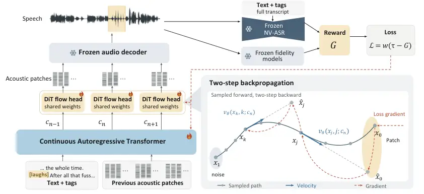

# NVAlign: Direct-Gradient Optimization for Non-Verbal Control in Continuous Autoregressive Flow Matching Text-to-Speech

Qiaolin Wang    Pedro Sandoval-Segura    Anunaya Joshi    Edvardas
Jurkonis    Jake Downie ^(†)^(†)thanks: ^(†)project lead.

###### Abstract

While modern text-to-speech (TTS) systems generate highly natural speech
and support inline non-verbal vocalization (NVV) tags, accurate control
over these events remains challenging. A key gap is the lack of
established post-training methods for non-verbal control in continuous
autoregressive flow-matching TTS. To this end, we present NVAlign, a
direct-gradient post-training framework for NVV tag-following in this
architecture. We first perform supervised fine-tuning (SFT) of TTS
models and an NVV-aware automatic speech recognition (NV-ASR) model on
NVV-annotated speech, then freeze the NV-ASR model to serve as the
reward model for post-training. A two-step gradient surrogate enables
efficient reward backpropagation through the flow-matching sampler to
jointly update the autoregressive backbone and acoustic flow head.
Fidelity penalties and reference-velocity regularization help preserve
speaker similarity and speech quality. Results from NVV-SuperBench and
human listening evaluations show that NVAlign improves tag-following
accuracy over SFT and Flow-GRPO baselines. These findings demonstrate
that direct reward-gradient optimization can improve non-verbal control
in continuous autoregressive flow-matching TTS. Audio samples are
available at [nvalign.github.io](https://nvalign.github.io/).

###### Index Terms: 

non-verbal vocalizations, text-to-speech, flow matching, post-training

^(†)^(†)address: ¹Bland AI, USA

## 1 Introduction



Figure 1: Overview of NVAlign post-training. Differentiable NVV rewards
and fidelity penalties guide joint LoRA adaptation of the autoregressive
backbone and flow head, while the decoder and evaluators remain frozen.
Reference-velocity regularization (Sec. 3.3) is not shown.

A human voice conveys meaning beyond words. A laugh can soften a remark,
a sigh can express reluctance, and a gasp can signal surprise.
Non-verbal vocalizations shape how listeners interpret speech, making
their control an important part of expressive text-to-speech. Inline NVV
tags allow users to specify these events alongside spoken content \[1,
2\], and annotated speech corpora provide supervision for their
generation \[3, 4, 5\]. However, learning the acoustic variation of
vocalizations across speakers and contexts requires diverse annotated
examples, which are scarce for less common sounds. Models consequently
omit or confuse tagged vocalizations even after supervised fine-tuning
\[6, 7\].

Post-training has been used to improve expressive speech and NVV
generation across TTS architectures \[8, 9, 10\]. Recent continuous
autoregressive flow matching (AR-FM) TTS systems report competitive
speech quality and controllable generation \[11, 12, 13, 14\],
motivating NVV post-training for this architecture. Unlike
discrete-token TTS, where token probabilities support likelihood-ratio
methods such as group relative policy optimization (GRPO) \[15, 16\],
continuous AR-FM models use an autoregressive transformer backbone to
process text tokens and preceding acoustic patches, producing continuous
conditioning vectors for a diffusion transformer (DiT) flow head trained
with flow matching to generate the next acoustic patch \[13, 14\]. To
accommodate continuous sampling, Flow-GRPO adapts likelihood-ratio
optimization to flow models by sampling with stochastic differential
equations \[17, 18\]. Existing work in continuous AR-FM TTS has also
optimized reward-weighted flow losses or preference objectives \[19, 20,
6\].

Continuous sampling also permits direct-gradient optimization: studies
on image diffusion and flow matching models backpropagate differentiable
rewards through the generation process to update model parameters \[21,
22, 23\]. Direct-gradient optimization has also been explored across
different TTS architectures, primarily targeting intelligibility,
speaker identity, emotion, or representation alignment \[24, 25, 26\].
This raises a central question: can an NV-ASR model provide effective
reward gradients for improving tag-following in continuous
autoregressive flow matching TTS?

To answer this question, we introduce NVAlign, a direct-gradient
post-training framework for NVV tag-following in continuous AR-FM TTS.
We first fine-tune TTS models and an NV-ASR model on NVV-annotated
speech, then freeze the NV-ASR model and use its target-tag
probabilities on generated speech as differentiable rewards. Using a
two-step gradient surrogate \[23\], NVAlign efficiently backpropagates
reward gradients through the flow-matching sampler to jointly adapt the
backbone and flow head. Fidelity penalties and reference-velocity
regularization \[27\] help preserve speech quality and speaker
similarity during this optimization. Our main contributions are as
follows:

- •
  We propose NVAlign, a direct-gradient post-training framework for NVV
  tag-following in continuous AR-FM TTS that jointly adapts the
  autoregressive backbone and flow head.
- •
  We formulate a differentiable NVV recognition objective with fidelity
  penalties and reference-velocity regularization to improve
  tag-following and preserve speech quality.
- •
  We demonstrate gains in NVV tag-following over SFT and Flow-GRPO on
  NVV-SuperBench and in human listening evaluations.

## 2 Related work

### 2.1 Non-verbal vocalizations.

Annotated NVV speech datasets support supervised training for NVV
recognition and controllable speech generation \[3, 5, 4, 28, 29, 30,
31\], while dedicated benchmarks assess recognition, generation, and
perceptual quality \[32, 7, 33, 34, 35\]. For NVV post-training, Hu et
al. \[6\] use audio-language model rankings for rejection-sampling
fine-tuning and Anchored Flow-DPO on VoxCPM2. NVAlign shares this focus
on NVV control, but uses a frozen NV-ASR model’s target-tag
probabilities as differentiable rewards, backpropagating them through
speech generation rather than training on utterances selected or paired
by an audio-language evaluator.

### 2.2 Reward and preference optimization.

Post-training methods for diffusion and flow-based TTS differ in how
reward feedback enters the optimization. GROW trains the backbone and
acoustic head with reward-weighted flow matching \[19\], whereas VGPO
uses gradients from a learned causal value model to update the
generator \[36\]. FlowTTS-GRPO applies likelihood-ratio updates to
stochastic transitions in flow-matching acoustic models \[18\], while
ARDM-DPO fine-tunes DiTAR using preferred and rejected speech
pairs \[20\].

Direct-gradient methods backpropagate differentiable objectives through
generation, as explored in image models \[21, 37, 22\], with LeapAlign
reducing the backward trajectory to a two-step gradient
surrogate \[23\]. In speech, DMOSpeech differentiates automatic speech
recognition (ASR) and speaker objectives through a distilled diffusion
model, while DiffRO uses differentiable codec-token relaxations \[24,
25\]. SR-FD is a close architectural precedent, optimizing a
distributional speech-representation objective through VoxCPM2 and
updating language-model and DiT adapters \[26\]. NVAlign extends
direct-gradient speech optimization to NVV tag-following in continuous
AR-FM TTS.

## 3 Method

NVAlign uses differentiable NVV recognition scores to post-train
continuous AR-FM TTS (Fig. 1). Starting from supervised models, we
freeze the NV-ASR model and optimize the TTS backbone and flow head
through generated speech, with fidelity penalties and velocity
regularization constraining the update.

### 3.1 Supervised initialization

Since post-training primarily reinforces and recombines capabilities of
the base model \[38\], we first fine-tune the NV-ASR model and TTS
model, parameterized by $`\phi`$ and $`\theta`$, on an NVV-annotated
dataset $`\mathcal{D}`$ (Sec. 4.1). Each recording $`a`$ is paired with
an $`L`$-token transcript $`y_{1:L}`$ containing words and tags such as
\[laughs\]. The NV-ASR model $`p_{\phi}`$, based on
Qwen3-Omni-30B \[39\], learns the complete transcript:

```math
\mathcal{L}_{\mathrm{ASR}}(\phi)=-\mathrm{E}_{(a,y)\sim\mathcal{D}}\sum_{\ell=1}^{L}\log p_{\phi}(y_{\ell}\mid y_{<\ell},a). \tag{1}
```

For continuous AR-FM TTS \[11, 13, 14\], each training waveform is
encoded into $`N`$ patches of consecutive latent frames. The continuous
autoregressive transformer backbone maps tagged text, the speaker
prompt, and preceding patches to a conditioning vector $`c_{n}`$ for
patch $`n`$. A flow head $`v_{\theta}`$, shared across patches, predicts
the velocity at a noised patch state $`x_{n,t}`$ and flow time $`t`$.
The frozen audio decoder converts the generated patch sequence into a
speech waveform $`a`$. The training target $`u_{n,t}`$ is the time
derivative of the noising path:

```math
\displaystyle\mathcal{L}_{\mathrm{FM}} \displaystyle=\mathrm{E}\big\|v_{\theta}(x_{n,t},t;c_{n})-u_{n,t}\big\|_{\mathrm{mse}}^{2}, \tag{2}
```

```math
\displaystyle\mathcal{L}_{\mathrm{TTS}} \displaystyle=\mathcal{L}_{\mathrm{FM}}+\mathcal{L}_{\mathrm{aux}}.
```

The expectation averages over recordings, patches, flow times, and
noise; $`\|\cdot\|_{\mathrm{mse}}^{2}`$ averages squared latent entries.
We retain each TTS model’s auxiliary losses, including stop-prediction
losses \[13, 14\].

### 3.2 NVV reward and fidelity penalties

The frozen NV-ASR model evaluates a generated waveform $`a`$ against its
target transcript $`y`$ under teacher forcing: each token is scored
using the audio and preceding target tokens. Let $`K(y)`$ be the number
of NVV tags in transcript $`y`$, and let $`S_{r}`$ denote the token
positions belonging to the $`r`$-th tag. We define the NVV reward as

```math
R_{\mathrm{NVV}}(a,y)=\sum_{r=1}^{K(y)}\min_{\ell\in S_{r}}p_{\phi}(y_{\ell}\mid y_{<\ell},a). \tag{3}
```

For a tag spanning multiple tokens, the minimum requires all of its
tokens to receive high probability; summing over tags supports multiple
vocalizations within an utterance.

Fidelity penalties help preserve speaker identity and audio quality
during NVV reward optimization. A frozen ECAPA-TDNN \[40\] extracts a
speaker embedding from generated speech. Its cosine similarity to the
speaker’s mean embedding from SFT generations measures speaker
consistency; similarity to the speaker-prompt embedding measures speaker
similarity. A frozen UTMOS model \[41\] predicts the mean opinion score
(MOS) of generated speech. We penalize these three scores $`q_{m}(a)`$
below their respective bounds $`b_{m}`$. We also include signal terms
for excessive waveform peaks and low signal levels:

```math
\displaystyle P_{\mathrm{fid}}(a)={} \displaystyle\sum_{m}\lambda_{m}[b_{m}-q_{m}(a)]_{+}+\lambda_{\mathrm{peak}}\sum_{h}[|a_{h}|-0.80]_{+}^{2} \tag{4}
```

```math
\displaystyle+\lambda_{\mathrm{level}}\min\!\left\{[d_{\mathrm{SFT}}(y)-3-d(a)]_{+},\,6\right\}.
```

Here, $`[u]_{+}=\max(u,0)`$, all weights are nonnegative, and $`a_{h}`$
denotes the waveform amplitude at time index $`h`$. In dB, $`d(a)`$
denotes the waveform’s root-mean-square (RMS) level and
$`d_{\mathrm{SFT}}(y)`$ the median SFT level for the same text.

### 3.3 Direct-gradient post-training

We use the NV-ASR reward and fidelity penalties as differentiable
objectives on the generated waveform, allowing their gradients to
propagate through the continuous AR-FM TTS model. For each acoustic
patch $`n`$, let $`x_{t}=x_{n,t}`$ denote a sampled state at flow time
$`t`$ along the trajectory from noise $`x_{n,1}`$ to the generated patch
$`x_{n,0}`$, conditioned on $`c_{n}`$. During post-training, we generate
the patch sequence without gradients, then recompute $`c_{n}`$ using the
previous acoustic patches and apply the two-step gradient
surrogate \[23\] illustrated in Fig. 1, replacing backpropagation
through the full trajectory with two DiT flow-head evaluations.

We choose flow times $`1\geq k>j>0`$ from the sampling grid, using the
same $`k`$ and $`j`$ across patches. The first flow-head evaluation, at
time $`k`$, estimates the state at $`j`$. We connect the estimate to the
sampled state using a straight-through latent connector with
stop-gradient $`\operatorname{sg}`$:

```math
\displaystyle\hat{x}_{j} \displaystyle=x_{k}-(k-j)v_{\theta}(x_{k},k;c_{n}), \tag{5}
```

```math
\displaystyle x_{j} \displaystyle\leftarrow\hat{x}_{j}+\operatorname{sg}(x_{j}-\hat{x}_{j}).
```

The connector keeps the forward value equal to the sampled $`x_{j}`$
while routing gradients through $`\hat{x}_{j}`$. The second flow-head
evaluation then uses $`x_{j}`$ to produce an estimate $`\hat{x}_{0}`$ of
the generated patch $`x_{0}`$:

```math
\displaystyle\hat{x}_{0} \displaystyle=x_{j}-jv_{\theta}(x_{j},j;c_{n}), \tag{6}
```

```math
\displaystyle x_{0} \displaystyle\leftarrow\hat{x}_{0}+\operatorname{sg}(x_{0}-\hat{x}_{0}).
```

The frozen audio decoder maps the generated patch sequence to waveform
$`a`$, on which the NV-ASR reward and fidelity penalties are evaluated.
Reward gradients pass through the frozen evaluators and decoder to the
two flow-head evaluations and, through $`c_{n}`$, to the AR backbone.

Following Flow-OPD \[27\], we further anchor the flow field to the SFT
model by penalizing deviations from its reference velocity at the
sampled states $`x_{k}`$ and $`x_{j}`$:

```math
P_{\mathrm{vel}}=\frac{\lambda_{v}}{N}\sum_{n=1}^{N}\sum_{s\in\{k,j\}}\big\|v_{n,s}-\operatorname{sg}(v^{\mathrm{ref}}_{n,s})\big\|_{\mathrm{mse}}^{2}. \tag{7}
```

Here $`\lambda_{v}\geq 0`$ is the regularization weight and
$`v_{n,s}=v_{\theta}(x_{n,s},s;c_{n})`$ denotes the current velocity,
while $`v^{\mathrm{ref}}_{n,s}`$ is evaluated with the SFT flow head at
the same state and conditioning $`c_{n}`$ from the adapted backbone.

For a batch of $`B`$ utterances, we combine the NVV reward and penalties
in $`G_{i}`$ and minimize:

```math
\displaystyle G_{i} \displaystyle=R_{\mathrm{NVV}}(a_{i},y_{i})-P_{\mathrm{fid},i}-P_{\mathrm{vel},i}, \tag{8}
```

```math
\displaystyle\mathcal{L}_{\mathrm{NVAlign}} \displaystyle=\frac{1}{B}\sum_{i=1}^{B}w_{i}\,(\tau_{i}-G_{i}).
```

Here, $`\tau_{i}=K(y_{i})`$ is the maximum NVV reward, and $`w_{i}`$ are
the detached LeapAlign weights \[23, Eqs. (12)–(13)\]. We optimize
low-rank adaptation (LoRA) adapters \[42\] in the AR backbone, the
projections mapping inputs into the flow head’s feature space, and the
flow head.

Model Method NVV-SuperBench Human listening sets Quality metrics Gemini
Human NVV detection Acc. MOS SIM^(∗) UTMOS^(∗) DNSMOS Mandarin VoxCPM2
SFT 3.36 / 2.93 27.4 26.9 / 30.2 43.2 3.11 0.551 2.44 2.99 VoxCPM2
Flow-GRPO^($`\dagger`$) 3.04 / 2.66 19.2 27.0 / 27.7 37.8 3.25 0.594
2.82 3.03 VoxCPM2 NVAlign 3.24 / 2.68 34.9 39.1 / 41.9 47.6 3.03 0.690
3.29 3.56 dots.tts SFT 4.09 / 3.64 57.1 30.8 / 40.9 63.2 3.13 0.567 2.50
2.79 dots.tts Flow-GRPO^($`\dagger`$) 4.04 / 3.66 58.5 31.8 / 40.4 61.1
3.08 0.617 2.65 2.92 dots.tts NVAlign 3.76 / 2.88 54.4 49.3 / 48.5 65.4
3.04 0.722 2.97 3.65 English Production TTS SFT 3.86 / 3.25 33.7 30.6 /
62.7 39.8 3.89 0.742 3.48 3.63 Production TTS Flow-GRPO^($`\dagger`$)
3.84 / 3.28 45.3 29.1 / 57.0 31.8 3.92 0.743 3.56 3.67 Production TTS
NVAlign 3.95 / 2.75 53.7 42.7 / 79.9 54.0 3.95 0.815 4.06 3.98

Table 1: Results on NVV-SuperBench, human listening sets, and
speech-quality metrics. Gemini reports Accuracy / PE, and NVV detection
reports Whisper / SED. ^(∗) marks metrics optimized by NVAlign.


Table 2: NVAlign ablations on 100 held-out VoxCPM2 texts. The middle
block removes penalties cumulatively; the final two rows compare
flow-head-only NVAlign and Flow-GRPO. NVV reward is averaged per tag;
Gemini reports Accuracy / PE.

## 4 Experiments

### 4.1 Datasets and experimental setup

We aggregate 834.5 hours of speech across six public NVV datasets  \[3,
5, 4, 28, 29, 30\] to fine-tune VoxCPM2, dots.tts, and a
Qwen3-Omni-30B-based NV-ASR model, unifying annotations into a 39-tag
NVV inventory and removing benchmark text and speaker overlap. Only 18.9
hours of the public mixture are English, so for a separate production
study we collect a proprietary English NVV dataset and train a separate
NV-ASR model. We evaluate a production TTS model with the same
continuous AR-FM architecture and NVAlign objective, using a separate
internal training configuration. Within each TTS architecture, Flow-GRPO
and NVAlign are initialized from the same SFT checkpoint. For VoxCPM2
and dots.tts, both methods use the NVV reward and fidelity penalties of
Sec. 3.2. Following \[18\], our Flow-GRPO baseline updates only the flow
head with KL regularization, whereas NVAlign jointly updates the flow
head and AR backbone with reference-velocity regularization.

For VoxCPM2 and dots.tts, we use LoRA ranks 16, 32, and 64 for the AR
backbone, flow-head input projections, and flow head, respectively, with
$`\alpha=2r`$. The fidelity weights are $`\lambda_{\mathrm{cons}}=5`$,
$`\lambda_{\mathrm{sim}}=\lambda_{\mathrm{UTMOS}}=\lambda_{\mathrm{peak}}=2`$,
and $`\lambda_{\mathrm{level}}=0.5`$, with $`\lambda_{v}=0.5`$. We use
$`b_{\mathrm{cons}}=0.75`$ and $`b_{\mathrm{sim}}=0.65`$. For UTMOS, we
set the lower bound 0.1 below the median UTMOS score of SFT generations.
For each utterance, we sample $`k>j`$ from a 10-step flow grid and use
the same pair for all patches.

We evaluate on NVV-SuperBench \[7\], retaining texts whose NVV tags are
supported by each system. Gemini 2.5 Pro scores NVV accuracy and
perceptual effect (PE) on a 0–5 scale using the official benchmark
evaluation prompt. Gemini scores are comparable only within each
comparison group. To compare Gemini scores with human judgments, we
cover all 21 Mandarin and 19 English benchmark tags with 147 and 95
single-tag NVV-SuperBench texts, respectively, balanced across tags.
Three blinded raters evaluate the generated clips; one text whose marker
raters reported missing is excluded from the Mandarin VoxCPM2 subset.
Whisper-large-v3 \[43\], fine-tuned on the public NVV corpus, measures
tag recovery, while BEATs/ATST sound-event detection (SED) \[44\] covers
cough, laugh, breath, and cry using thresholds calibrated on real
recordings.

Separate 100-text listening sets per language evaluate individual tags
and tag combinations, with the Mandarin set covering all 39 tags. Using
reference audio, three blinded raters judge each target sound at its
marked position; tag accuracy requires agreement from all three raters.
Human accuracy and NVV detection rates are reported as percentages.
These sets also provide naturalness MOS (1–5), averaged over raters and
clips.

For fidelity evaluation, SIM measures ECAPA-TDNN cosine similarity
between generated and speaker-reference audio, while UTMOS and
DNSMOS-Pro (DNSMOS) \[45\] estimate speech quality. We compute these
metrics over benchmark outputs and 100 held-out clips per system. We
bootstrap texts to obtain paired 95% confidence intervals for human
accuracy differences; Paraformer-zh \[46\] measures CER for Mandarin and
pretrained Whisper-large-v3 \[43\] measures WER for English using
reference transcripts without NVV tags.

### 4.2 Results and analysis

NVAlign improves tag-following over SFT and Flow-GRPO on the separate
human listening sets for all three systems (Table 1), with accuracy
increasing from 43.2% to 47.6% for VoxCPM2, 63.2% to 65.4% for dots.tts,
and 39.8% to 54.0% for the English production system. On the
NVV-SuperBench human subset, VoxCPM2 gains 7.5 percentage points over
SFT and 15.8 points over Flow-GRPO, while dots.tts is 2.7 points below
SFT. Whisper and SED detection rates likewise increase with NVAlign
across all three systems. Paired 95% bootstrap confidence intervals
exclude zero for both English gains over SFT, both Mandarin VoxCPM2
gains over Flow-GRPO, and the English 100-text gain over Flow-GRPO;
confidence intervals for all other comparisons include zero.

²²footnotetext:
[https://github.com/yifan123/flow_grpo](https://github.com/yifan123/flow_grpo)

Table 2 examines the contributions of joint adaptation and the penalty
terms. When NVAlign is restricted to the flow head, its NVV reward still
reaches 0.441, compared with 0.392 for Flow-GRPO and 0.397 for SFT;
allowing joint backbone and flow-head adaptation further increases the
reward and Gemini ratings. The cumulative ablations also show why the
NVV objective requires additional constraints. Removing velocity
regularization raises the reward from 0.468 to 0.488 while reducing
Gemini accuracy/PE from 3.54/3.34 to 2.88/1.94, so greater target-tag
likelihood does not necessarily correspond to better perceptual output.
Removing UTMOS next lowers its predicted quality score from 3.39 to 3.01
even as Gemini ratings partially recover, and subsequently removing the
peak and level terms lowers both. Removing the speaker terms then
sharply reduces SIM from 0.796 to 0.360. Together, these ablations show
that the different constraints control properties that are not captured
by the NV-ASR reward itself.

Across the main experiments, NVAlign also increases SIM, UTMOS, and
DNSMOS for all three systems. Because SIM and UTMOS are part of the
training objective, we report DNSMOS and human naturalness MOS alongside
them; human naturalness MOS stays within 0.1 of SFT for all three
systems. Relative to SFT, Mandarin CER rises by 1.26 and 0.13 points for
VoxCPM2 and dots.tts respectively; English WER rises by 0.07 on the
listening set and 1.33 on NVV-SuperBench. A similar distinction appears
in the English benchmark, where human tag-following rises from 33.7% to
53.7% while Gemini PE decreases. Tag presence, expressive quality, and
speech quality therefore need not improve together.

## 5 Discussion and limitations

NVAlign is motivated by sparse supervision for less common NVVs, but the
same scarcity can limit the NV-ASR reward used for post-training.
Optimizing that learned reward can exploit NVV recognition shortcuts or
degrade properties such as prosody because tag likelihood does not
capture the full speech distribution; fidelity penalties and
reference-velocity regularization constrain this drift, but adding
objectives makes gradient balance itself part of the optimization
problem. The current formulation also assumes discrete NVV events,
leaving continuous or overlapping vocalizations outside its scope.

## 6 Conclusion

We introduced NVAlign, a direct-gradient post-training framework for
non-verbal control in continuous AR-FM TTS. By backpropagating NV-ASR
rewards through a two-step flow surrogate and constraining the update
with fidelity and reference-velocity penalties, NVAlign improves human
tag-following on the listening sets across VoxCPM2, dots.tts, and an
English production system, while also increasing Whisper tag-recovery
and SED detection rates.

## 7 Compliance with Ethical Standards

Human listening evaluations were conducted through
[Podonos](https://www.podonos.com/). No institutional ethics approval,
exemption, or waiver was obtained.

## References

- \[1\] ElevenLabs, “Introducing Eleven v3 (alpha),” 2025,
  [https://elevenlabs.io/blog/eleven-v3](https://elevenlabs.io/blog/eleven-v3),
  Accessed: Sep. 23, 2026.
- \[2\] Alibaba Cloud, “Qwen-Audio-3.0-TTS: More multilingual, easier to
  direct,” 2026,
  [https://www.alibabacloud.com/blog/qwen-audio-3-0-tts-more-multilingual-easier-to-direct_603379](https://www.alibabacloud.com/blog/qwen-audio-3-0-tts-more-multilingual-easier-to-direct_603379),
  Accessed: Sep. 23, 2026.
- \[3\] Borisov et al., “NonverbalTTS: A public English corpus of
  text-aligned nonverbal vocalizations with emotion annotations for
  text-to-speech,” in Proc. SSW, 2025, pp. 104–109.
- \[4\] Liao et al., “Emilia-NV: A non-verbal speech dataset with
  word-level annotation for human-like speech modeling,” in Proc.
  ICASSP, 2026, pp. 17587–17591.
- \[5\] Ye et al., “A scalable pipeline for enabling non-verbal speech
  generation and understanding,” arXiv:2508.05385, 2025.
- \[6\] Hu et al., “Preference optimization with LALM feedback for
  continuous autoregressive non-verbal vocalization generation,”
  arXiv:2609.11260, 2026.
- \[7\] Xue et al., “NVV-SuperBench: Beyond words, beyond
  quality—benchmarking nonverbal vocalizations in speech generation,” in
  Proc. Interspeech, 2026, pp. 7343–7352.
- \[8\] Atamanenko et al., “TTS-1 technical report,”
  arXiv:2507.21138, 2025.
- \[9\] Liao et al., “Fish Audio S2 technical report,”
  arXiv:2603.08823, 2026.
- \[10\] Li et al., “Preference optimization for non-verbal vocalization
  synthesis,” arXiv:2608.24163, 2026.
- \[11\] Jia et al., “DiTAR: Diffusion transformer autoregressive
  modeling for speech generation,” in Proc. ICML, 2025, pp. 27255–27270.
- \[12\] Zhou et al., “VoxCPM: Tokenizer-free TTS for context-aware
  speech generation and true-to-life voice cloning,”
  arXiv:2509.24650, 2025.
- \[13\] Zhou et al., “VoxCPM2 technical report,”
  arXiv:2606.06928, 2026.
- \[14\] Lian et al., “dots.tts technical report,”
  arXiv:2606.07080, 2026.
- \[15\] Liu et al., “Group relative policy optimization for
  text-to-speech with large language models,” in Proc. ICASSP, 2026, pp.
  16132–16136.
- \[16\] Li et al., “IndexTTS 2.5 technical report,”
  arXiv:2601.03888, 2026.
- \[17\] Liu et al., “Flow-GRPO: Training flow matching models via
  online RL,” in Proc. NeurIPS, 2025, vol. 38.
- \[18\] Wang et al., “FlowTTS-GRPO: Online reinforcement learning with
  multi-objective reward optimization for flow-matching based
  text-to-speech,” in Proc. Interspeech, 2026, pp. 1297–1306.
- \[19\] Yang et al., “GROW: Group-relative advantage-weighted on-policy
  reinforcement learning of autoregressive-diffusion text-to-speech
  model,” arXiv:2608.03215, 2026.
- \[20\] Liu et al., “Direct preference optimization for speech
  autoregressive diffusion models,” in Proc. ICASSP, 2026, pp.
  18357–18361.
- \[21\] Clark et al., “Directly fine-tuning diffusion models on
  differentiable rewards,” in Proc. ICLR, 2024.
- \[22\] Wu et al., “Deep reward supervisions for tuning text-to-image
  diffusion models,” in Proc. ECCV, 2024.
- \[23\] Liang et al., “LeapAlign: Post-training flow matching models at
  any generation step by building two-step trajectories,” in Proc. CVPR,
  2026, pp. 23238–23248.
- \[24\] Li et al., “DMOSpeech: Direct metric optimization via distilled
  diffusion model in zero-shot speech synthesis,” in Proc. ICML, 2025,
  pp. 35186–35208.
- \[25\] Gao et al., “Differentiable reward optimization for LLM based
  TTS system,” in Proc. Interspeech, 2025, pp. 2450–2454.
- \[26\] Chung et al., “Fréchet distance loss on speech representations
  for text-to-speech synthesis,” arXiv:2607.06027, 2026.
- \[27\] Fang et al., “Flow-OPD: On-policy distillation for flow
  matching models,” arXiv:2605.08063, 2026.
- \[28\] Mai et al., “MNV-17: A high-quality performative Mandarin
  dataset for nonverbal vocalization recognition in speech,” in Proc.
  ICASSP, 2026, pp. 18312–18316.
- \[29\] Bai et al., “SynParaSpeech: Automated synthesis of
  paralinguistic datasets for speech generation and understanding,” in
  Proc. ICASSP, 2026, pp. 15527–15531.
- \[30\] Wu et al., “SMIIP-NV: A multi-annotation non-verbal expressive
  speech corpus in Mandarin for LLM-based speech synthesis,” in Proc.
  ACM Multimedia, 2025, pp. 12564–12570.
- \[31\] Kanda et al., “Making flow-matching-based zero-shot
  text-to-speech laugh as you like,” arXiv:2402.07383, 2024.
- \[32\] Ni et al., “NV-Bench: Benchmark of nonverbal vocalization
  synthesis for expressive text-to-speech generation,” in Proc.
  Interspeech, 2026, pp. 2515–2519.
- \[33\] Yang et al., “WESR: A benchmark and strong baseline for
  word-level event-speech recognition,” in Findings of ACL, 2026, pp.
  3121–3134.
- \[34\] Mai et al., “NVMOS: Non-verbal vocalization quality assessment
  in speech,” arXiv:2606.15888, 2026.
- \[35\] Manakul et al., “AudioJudge: Understanding what works in large
  audio model based speech evaluation,” in Proc. EACL, 2026, pp.
  3644–3663.
- \[36\] Liu et al., “VGPO: Fine-tuning speech autoregressive diffusion
  models with value guided policy optimization,” 2025, [OpenReview
  preprint](https://openreview.net/forum?id=LLWIaUZvEu).
- \[37\] Prabhudesai et al., “Aligning text-to-image diffusion models
  with reward backpropagation,” arXiv:2310.03739, 2023.
- \[38\] Yuan et al., “From $`f(x)`$ and $`g(x)`$ to $`f(g(x))`$: LLMs
  learn new skills in RL by composing old ones,” in Proc. ICLR, 2026,
  pp. 147547–147574.
- \[39\] Xu et al., “Qwen3-Omni technical report,”
  arXiv:2509.17765, 2025.
- \[40\] Desplanques et al., “ECAPA-TDNN: Emphasized channel attention,
  propagation and aggregation in TDNN based speaker verification,” in
  Proc. Interspeech, 2020, pp. 3830–3834.
- \[41\] Saeki et al., “UTMOS: UTokyo-SaruLab system for VoiceMOS
  challenge 2022,” in Proc. Interspeech, 2022, pp. 4521–4525.
- \[42\] Hu et al., “LoRA: Low-rank adaptation of large language
  models,” in Proc. ICLR, 2022.
- \[43\] Radford et al., “Robust speech recognition via large-scale weak
  supervision,” in Proc. ICML, 2023, pp. 28492–28518.
- \[44\] Schmid et al., “Effective pre-training of audio transformers
  for sound event detection,” in Proc. ICASSP, 2025, pp. 1–5.
- \[45\] Cumlin et al., “DNSMOS Pro: A reduced-size DNN for
  probabilistic MOS of speech,” in Proc. Interspeech, 2024, pp.
  4818–4822.
- \[46\] Gao et al., “Paraformer: Fast and accurate parallel transformer
  for non-autoregressive end-to-end speech recognition,” in Proc.
  Interspeech, 2022, pp. 2063–2067.
