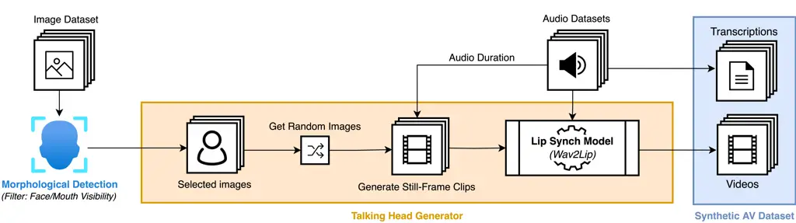
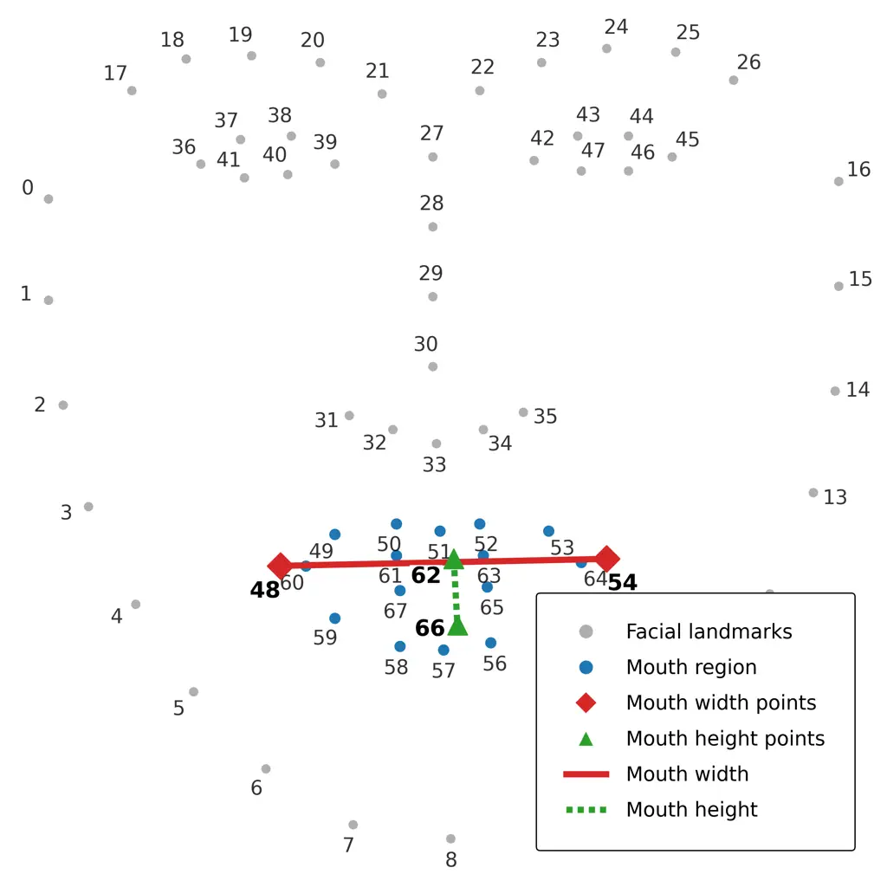
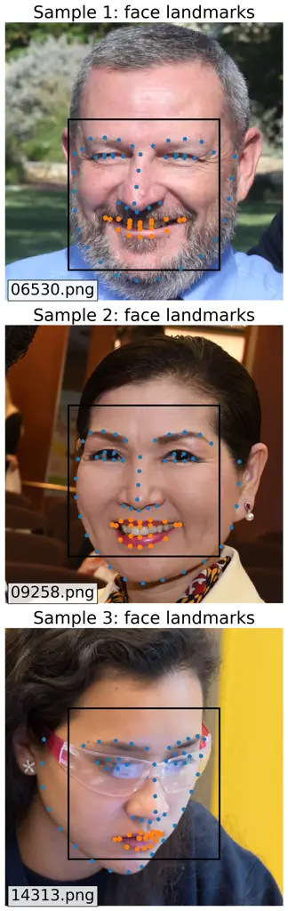
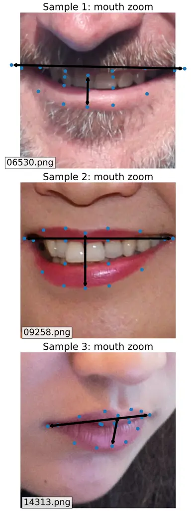
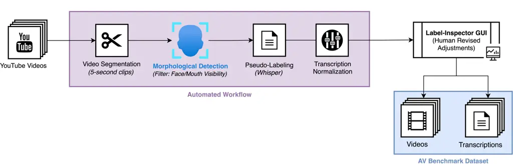
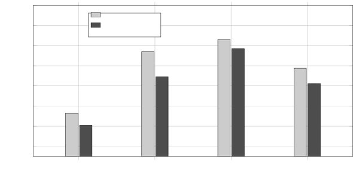
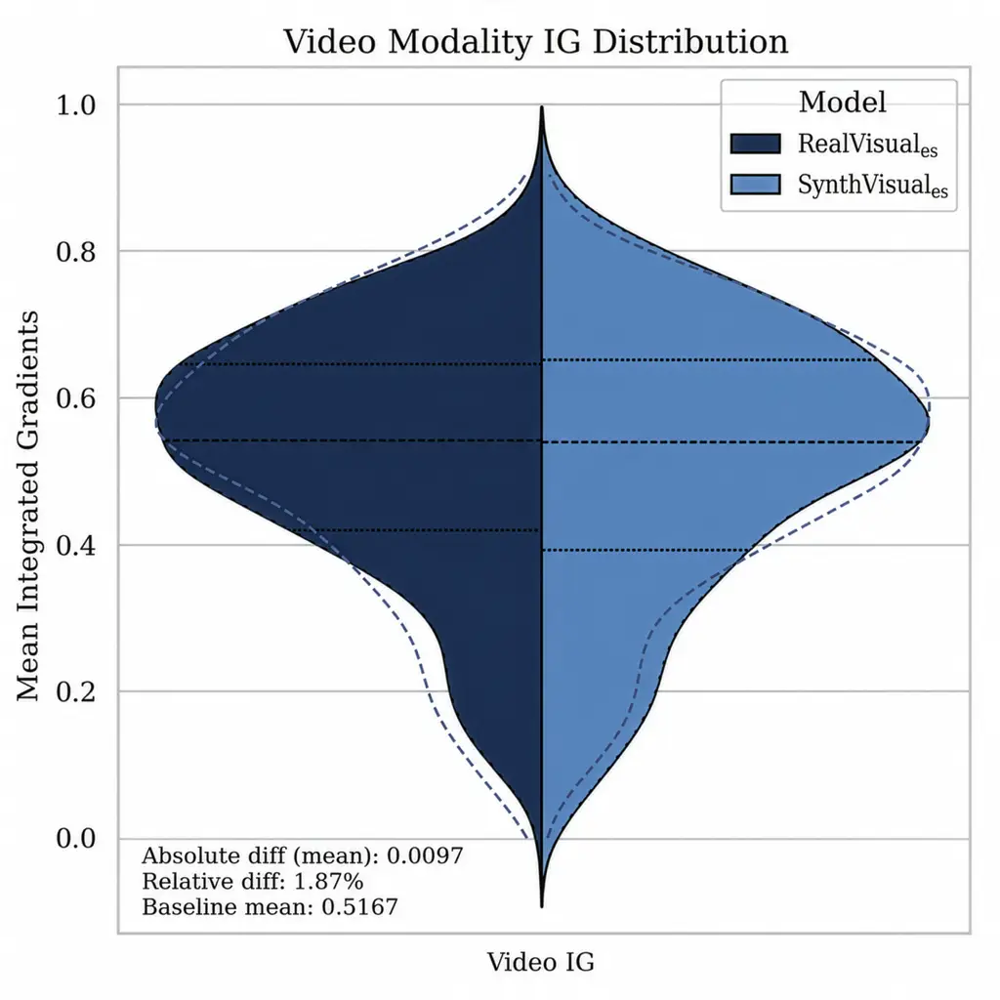
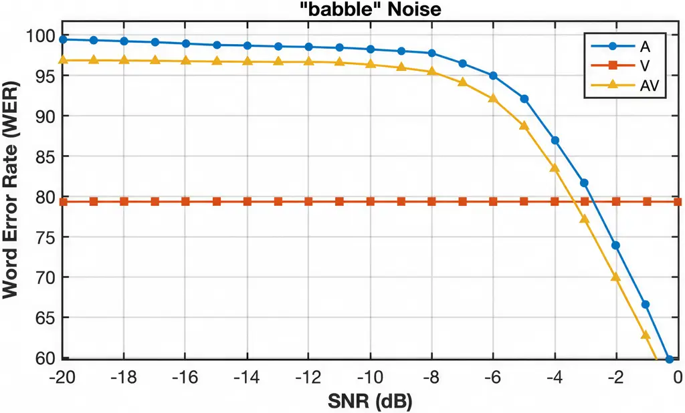
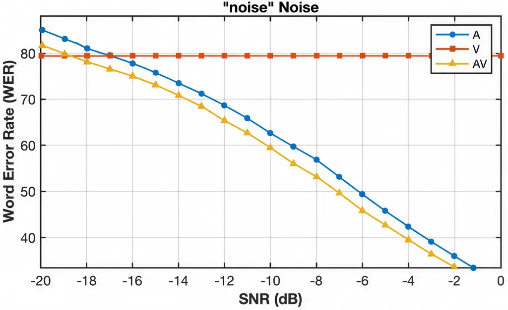

\[orcid=0009-0005-1055-129X\]

# Improving Audiovisual Speech Recognition through Synthetic Visual Data Augmentation

Pol Buitrago pol.buitrago@bsc.es    Pol Gálvez    Javier Hernando
organization=Universitat Politècnica de Catalunya (UPC),
addressline=Carrer de Jordi Girona, 1–3, city=Barcelona, postcode=08034,
country=Spain organization=Barcelona Supercomputing Center (BSC),
addressline=Carrer de Jordi Girona, 29, city=Barcelona, postcode=08034,
country=Spain

###### Abstract

Audiovisual Speech Recognition (AVSR) is a multimodal approach to speech
recognition that incorporates visual information from lip movements to
enhance model performance. Despite its advantages, its development
remains constrained by the limited availability of labeled audiovisual
(AV) datasets. This work explores the use of synthetic visual data as a
solution, using an audio-driven talking-head pipeline to generate
lip-synchronized visual content from existing audio data. We evaluate
the effectiveness of synthetic visual data both as an augmentation
strategy and as a standalone training resource, applying our approach to
Spanish and Catalan. Our results show that augmenting real AV data with
synthetic samples yields relative Word Error Rate (WER) reductions of up
to 16.2%, demonstrating the potential of this approach. Moreover, we
demonstrate that synthetic data alone can serve as a baseline for AVSR
training in languages lacking AV datasets. These findings provide
evidence that synthetic visual data can serve as a scalable solution to
AVSR data scarcity, enabling broader language coverage.

###### keywords

Audiovisual Speech Recognition ,Synthetic Data ,Data Augmentation
,Low-Resource Languages ,Lipreading

^(†)^(†)credit: Conceptualization, Methodology, Software, Investigation,
Formal analysis, Writing – original draft^(†)^(†)credit: Data curation,
Writing – review & editing^(†)^(†)credit: Conceptualization,
Supervision, Writing – review & editing^(†)^(†)corresponding:
Corresponding author

## 1 Introduction

Audiovisual Speech Recognition (AVSR) is a specialized field within
speech-to-text technology that improves transcription accuracy by
incorporating visual speech cues alongside the acoustic signal. Unlike
unimodal automatic speech recognition (ASR) systems, which rely
exclusively on the audio signal, AVSR leverages a multimodal strategy
that integrates lip movements and facial cues to enhance performance,
particularly in noisy environments where audio data alone is
insufficient (Sumby and Pollack, 1954; Xia et al., 2020; Shi et al.,
2022a; Shi et al., 2022b; Zhu et al., 2024).

Although AVSR offers significant benefits over unimodal recognition
approaches, its widespread development across languages is constrained
by the limited availability of speech-annotated audiovisual (AV)
datasets. While large-scale audio-only corpora are widely available,
paired audiovisual speech data remains scarce, especially for
under-resourced languages (Czyzewski et al., 2017; Brigato and Iocchi,
2021; Bansal et al., 2022; Dai et al., 2022; Anwar et al., 2023).

State-of-the-art AVSR systems commonly rely on self-supervised
pre-training over large-scale unlabeled audiovisual data, followed by
supervised fine-tuning on labeled AV corpora (Pan et al., 2022; Shi et
al., 2022a; Shi et al., 2022b; Anwar et al., 2023; Zhu et al., 2024).
While this paradigm has substantially reduced annotation requirements
(Devlin et al., 2019), it does not eliminate the need for labeled AV
data during fine-tuning, which remain scarce in many languages. This
data bottleneck limits the development of robust AVSR systems across
languages, underscoring the need for approaches that reduce dependence
on real audiovisual annotations.

This work proposes leveraging synthetic visual data paired with real
audio to address the scarcity of resources for languages with limited AV
datasets. To this end, we introduce a novel speech-driven visual
synthesis pipeline for generating synthetic audiovisual training data.
By generating visual speech sequences from existing speech recordings
and face images (Goodfellow et al., 2014; Prajwal et al., 2020), we aim
to construct scalable AV training data for AVSR systems. This approach
reduces the dependence on manually annotated video corpora while
enabling the expansion of training resources to under-resourced
languages.

Recent advances in generative modeling have made this approach feasible
by enabling the synthesis of realistic and temporally coherent visual
speech from audio signals (Prajwal et al., 2020; Vougioukas et al.,
2020; Li et al., 2022; Rakesh et al., 2025). These models have
demonstrated the ability to generate lip movements that preserve
meaningful articulatory structure (Shan et al., 2022; Varano et al.,
2022; Agarwal et al., 2023; Yu et al., 2024), supporting their use in
visual speech tasks such as lipreading (Varano et al., 2022).

Synthetic visual data has predominantly been explored in the context of
unimodal lipreading, where it has shown potential to improve visual
speech recognition performance (Liu et al., 2023; Yang et al., 2024).
However, whether these benefits transfer to audiovisual speech
recognition remains an open question. Unlike visual-only systems, AVSR
requires learning coherent joint representations from synchronized audio
and visual streams. Consequently, synthetic visual data that is
sufficiently informative to improve lipreading performance may still be
unsuitable for AVSR if it introduces domain shift, or audiovisual
misalignment, which can interfere with cross-modal learning, and degrade
overall AVSR performance.

The aim of this work is to investigate the effectiveness of synthetic
visual data for AVSR under two complementary scenarios. First, we
evaluate its use as a data augmentation strategy in a low-resource
audiovisual setting (Spanish). Second, we assess whether it can serve as
a standalone training resource in the absence of real audiovisual data
(Catalan).

## 2 Methodology

Figure 1: Audio-Visual Synthetic Data Generator (AVSynthGen) pipeline
scheme. The system generates synchronized audiovisual data by applying
lip synchronization to static images using speech audio inputs.

To explore the effectiveness of synthetic visual data for AVSR, our
methodology is organized into three main components: (i) a speech-driven
visual synthesis pipeline that generates lip-synced AV content from face
images and speech recordings, (ii) fine-tuning a pretrained AVSR model
on real, synthetic, and mixed datasets, and (iii) a robust experimental
setup to evaluate the impact of synthetic data on model performance.

### 2.1 Speech-Driven Visual Synthesis

To address the issue of audiovisual data scarcity, we propose a novel
speech-driven visual synthesis pipeline, named AVSynthGen, an automated
system that generates lip-synchronized audiovisual data by combining
speech audio with face images and animating the mouth region. The
pipeline produces synthetic visual sequences temporally aligned with
real speech, resulting in artificial audiovisual samples tailored for
lipreading and audiovisual speech recognition tasks. An overview of the
generation process is shown in Figure 1.

Figure 2: Visualization of the 68 facial landmark template used in the
morphological filtering stage. The facial landmarks are extracted using
dlib (King, 2009).

The pipeline begins with a dataset of face images covering a diverse set
of individuals, encompassing variability in gender, ethnicity, camera
viewpoints, and age. These images are processed using a face detection
and landmark-based morphological filtering stage specifically designed
as part of the proposed AVSynthGen pipeline and implemented on top of
the dlib library (King, 2009). First, a frontal face detector is applied
to localize facial regions, followed by the extraction of 68 facial
landmarks, whose structure is illustrated in Figure 2. Based on these
landmarks, we define the mouth region by selecting the subset of points
corresponding to the lip contour and inner mouth area (as illustrated in
Figure 3) and its visibility is assessed through simple geometric
criteria derived from mouth width and opening estimated from
inter-landmark distances. Images that do not satisfy these mouth
visibility constraints are discarded, ensuring a minimum level of facial
detail required for reliable lip motion synthesis.

  (a) Face
landmarks 
(b) Mouth region zoom

Figure 3: Morphological detection stage of the AVSynthGen pipeline.
Facial landmarks are extracted using dlib (King, 2009), and the mouth
region is defined from the corresponding keypoints. Inter-landmark
distances are used to evaluate mouth visibility through geometric
thresholds.

In parallel, an ASR dataset provides speech recordings and their
corresponding transcriptions. For each audio sample, a face image is
randomly selected from the previously filtered image set and used to
generate a still-frame video by repeating the same image over the
duration of the audio, resulting in temporally aligned image sequences
that serve as input to the animation stage. These still-frame videos,
together with the corresponding speech signals, are then processed by a
lip synchronization model acting as a talking head generator focused
specifically on the mouth region. Rather than synthesizing full facial
motion, the model modifies only the lip area to match the input speech
while preserving the rest of the face unchanged, transforming static
facial images into temporally consistent visual speech sequences and
producing synchronized audiovisual samples, as illustrated in Figure 4.

|                                                              |                                                              |                                                              |                                                              |
| ------------------------------------------------------------ | ------------------------------------------------------------ | ------------------------------------------------------------ | ------------------------------------------------------------ |
|   |   |   |   |
|   |  |  |  |
|  |  |  |  |

Figure 4: Synthetic visual examples generated by the AVSynthGen
pipeline. The images show lip-synchronized faces produced by animating
static images using real speech audio.

Talking head generation models enable speech-driven facial animation
directly from still images, removing the need for preexisting video data
(Zhen et al., 2023). This choice is motivated by two main factors.
First, constructing large-scale audiovisual datasets with sufficient
diversity remains challenging and would reintroduce the AV data scarcity
problem this work aims to address. Second, image datasets naturally
provide a broad range of poses and camera viewpoints without requiring
temporally continuous recordings. As a result, the pipeline can leverage
widely available image and audio resources to generate diverse
audiovisual data.

The animation stage is implemented using the Wav2Lip + GAN model
(Prajwal et al., 2020), a state-of-the-art system for speech-driven
facial animation that produces realistic lip movements aligned with a
given audio input. We employ an enhanced variant of Wav2Lip that
integrates a generative adversarial network (GAN) (Goodfellow et al., 2014) to improve the visual quality and realism of the synthesized mouth
movements. This model ensures accurate temporal alignment between audio
and visual streams while maintaining perceptual consistency in the
generated facial dynamics.

The final output of the pipeline is a synthetic audiovisual dataset
composed of generated video sequences paired with transcriptions derived
from the original speech corpus. The AVSynthGen framework enables
scalable data generation from existing resources, facilitating the
creation of large multimodal datasets for languages with limited
audiovisual data availability¹¹ 1 Code for the AVSynthGen pipeline is
available at
[https://github.com/Pol-Buitrago/SynthAVSR](https://github.com/Pol-Buitrago/SynthAVSR).

### 2.2 Semi-automatic Annotation Pipeline

As discussed in Section 1, no labeled Catalan audiovisual corpus is
currently available, which motivates our synthetic data generation
strategy. However, while this approach still allows us to train an AVSR
model for zero-AV-resource languages such as Catalan, it does not solve
the evaluation problem, since the absence of real AV data still prevents
a direct assessment of the resulting system. To enable meaningful
evaluation in this zero-AV-resource setting, we additionally developed a
semi-automatic annotation pipeline for constructing a Catalan AV test
set from raw, unlabeled video material²² 2 Code available in the same
repository as AVSynthGen, see Section 2.1. and use it to evaluate our
resulting AVSR models.

The annotation pipeline operates by segmenting raw video material into
short clips, which are first filtered using the landmark-based
morphological filtering stage described in Section 2.1 and illustrated
in Figures 2 and 3, ensuring clear facial and mouth visibility in all
retained samples. The filtered segments are then automatically
pseudo-labeled using a state-of-the-art ASR system (Radford et al.,
2022), after which transcriptions are normalized. The resulting labels
are manually reviewed and corrected using a developed custom graphical
interface, which we refer to as Label-Inspector, enabling accurate human
annotation with minimal manual effort. Figure 5 summarizes the
annotation workflow.

Figure 5: Semi-automatic pipeline for annotating the Catalan AV
benchmark. Raw video material is segmented into short clips, filtered
using the morphological detection stage (Section 2.1) to ensure mouth
visibility, automatically pseudo-labeled with an ASR system (Radford et
al., 2022), normalized, and manually reviewed and corrected via a custom
graphical interface (Label-Inspector).

This tool was developed primarily to obtain a reliable evaluation
benchmark for the experiments in Catalan presented in this work, but it
can naturally be extended into a general-purpose AV annotation tool for
low-resource languages, although this lies beyond the scope of the
present work.

### 2.3 AVSR Model and Training

We adopt the AV-HuBERT framework introduced by Shi et al. (2022a) and
extended in Shi et al. (2022b) as the baseline in our experiments.
AV-HuBERT is an open-source, well-established self-supervised
architecture for learning joint audio-visual representations and has
demonstrated strong performance across multiple AVSR benchmarks.

Rather than training from scratch, our strategy focuses on fine-tuning
AV-HuBERT to our specific experimental setup, leveraging publicly
available pre-trained checkpoints designed to be generic and adaptable
to multiple tasks. The selected checkpoint³³ 3 Referenced checkpoint:
[https://dl.fbaipublicfiles.com/avhubert/model/lrs3_vox/clean-pretrain/large_vox_iter5.pt](https://dl.fbaipublicfiles.com/avhubert/model/lrs3_vox/clean-pretrain/large_vox_iter5.pt)
was pre-trained on unlabeled audiovisual data from the English LRS3
(Afouras et al., 2018) and VoxCeleb2 (Chung et al., 2018) datasets.
Although these corpora contain only English speech, prior research on
multilingual pre-training of language models has shown significant
transfer capabilities to other languages (Conneau et al., 2020),
suggesting that similar benefits can be leveraged for AVSR in
low-resource language scenarios.

For our setting, we adopt an attention-based sequence-to-sequence
fine-tuning strategy with cross-entropy loss (Bahdanau et al., 2016),
following the formulation described by Shi et al. (2022a). A randomly
initialized 6-layer Transformer decoder is attached to the pre-trained
encoder to map its output representations into SentencePiece (unigram)
subword units (Kudo, 2018), enabling robust recognition across our
target languages.

The model is optimized using the Adam optimizer (Kingma and Ba, 2015)
with a base learning rate of $`1\times 10^{-3}`$ and a tri-stage
learning rate schedule with warmup and decay. To stabilize training, the
pre-trained encoder is partially frozen during the initial phase (first
22,500 updates), after which full fine-tuning is performed. Model
selection is based on validation performance.

## 3 Experimental Setup

### 3.1 Datasets

The dataset collection is divided into two categories: first, the
datasets used to generate synthetic audiovisual data through the
pipeline described in Section 2.1, consisting of audio and image
sources; and second, the real audiovisual datasets used for training and
evaluation.

#### 3.1.1 Synthetic Data Generation

For the image dataset, we employed the Flickr-Faces-HQ (FFHQ) dataset
(Karras et al., 2019), which provides high-resolution images of human
faces with significant variation in facial attributes, poses, and
identities, making it particularly well-suited for our lip
synchronization task.

For Spanish audio, we used the Spanish subset of the Mozilla Common
Voice dataset (version 19.0) (Ardila et al., 2020) ($`\approx`$512
hours), a large-scale corpus of manually validated speech recordings.
For Catalan audio, we relied on two primary sources: TV3Parla (Külebi
and Öktem, 2018) ($`\approx`$291 hours) and ParlamentParla (Külebi et
al., 2022) ($`\approx`$432 hours). TV3Parla consists of broadcast speech
from television programs, while ParlamentParla contains recordings from
parliamentary sessions, providing complementary variations in speaking
style, formality, and acoustic conditions.

It is important to note that we excluded the test splits from all audio
datasets, as the audio data is used exclusively for the generation of
synthetic audiovisual samples. Evaluation is conducted only on real
audiovisual data to ensure a realistic assessment of model performance.

The selected audio data is then paired with the previously described
image samples to generate synthetic audiovisual datasets, following the
speech-driven visual synthesis procedure detailed in Section 2.1. For
clarity, we refer to the resulting audiovisual versions of each audio
corpus as SynthAV-CV (synthetic audiovisual version of Common Voice),
TV3ParlAV (synthetic audiovisual version of TV3Parla), and ParlAVment
(synthetic audiovisual version of ParlamentParla). A summary of each
corpus is provided in Table 1.

#### 3.1.2 Real Audiovisual Data

Following the two experimental scenarios described in Section 1, Spanish
is used as a low-resource augmentation setting, where synthetic data is
used to complement existing real audiovisual corpora, while Catalan is
used as a zero-AV-resource setting, where training relies exclusively on
synthetic audiovisual data.

For this purpose, in the Spanish setting, we employ three widely used
Spanish audiovisual speech corpora: LIP-RTVE (Lleida et al., 2019;
Gimeno-Gómez and Martínez-Hinarejos, 2022) ($`\approx`$13h),
CMU-MOSEAS_(es) (BagherZadeh et al., 2020) ($`\approx`$13h), and
MuAViC_(es) (Anwar et al., 2023) ($`\approx`$180h) (see Table 1). The
train and validation subsets are used for model training, while the test
subsets are used to evaluate model performance on real audiovisual data.

Although the Catalan experiments are conducted under a zero-AV-resource
setting, real audiovisual data is still required for meaningful
evaluation. However, no existing Catalan audiovisual corpus is
available. To address this, we used the proposed annotation pipeline
described in Section 2.2 to construct a manually curated test set for
Catalan evaluation.

The dataset, named AV-CAT, consists of 51 minutes and 38 seconds of
footage (see Table 1), divided into approximately 5-second segments
extracted from videos of the public Catalan television channel. These
segments ensure clear visibility of the mouth and adhere to diversity
criteria in content. AV-CAT serves as the evaluation benchmark for
Catalan, providing the first labeled AV dataset for this language.

|                           |             |                  |
| ------------------------- | ----------- | ---------------- |
| Name                      | Language    | Duration         |
| — Real AV Datasets —      |             |                  |
| LIP-RTVE                  | Spanish     | $`\approx`$13h   |
| CMU-MOSEAS\_(es)          | Spanish     | $`\approx`$13h   |
| MuAViC\_(es)              | Spanish     | $`\approx`$180h  |
| AV-CAT (custom test)      | Catalan     | $`\approx`$51min |
| — Synthetic AV Datasets — |             |                  |
| SynthAV-CV                | Spanish     | $`\approx`$512h  |
| TV3ParlAV                 | Catalan     | $`\approx`$291h  |
| ParlAVment                | Catalan     | $`\approx`$432h  |

Table 1: AV datasets employed in our experiments.

As shown in Table 1, the synthetic datasets have a considerably longer
duration than the real AV datasets. This difference reflects the
inherent scalability advantage of synthetic data. Real AV corpora are
constrained by the cost of audiovisual collection and annotation,
whereas synthetic visual streams can be generated from large ASR
resources without such limitations.

Although matching dataset sizes could provide a more controlled
comparison, it would eliminate one of the main practical advantages of
synthetic data, namely its scalability. Rather than demonstrating that
synthetic visual data is equivalent or superior to real audiovisual data
under strictly controlled conditions, our objective is to evaluate
whether it can serve as an effective and scalable alternative when real
AV resources are limited or unavailable.

### 3.2 Experiments

This section describes the models trained and the experimental protocol
designed to measure the contribution of synthetic visual data to
audiovisual speech recognition. We evaluate two language settings:
Spanish (limited but available AV resources) and Catalan (a
zero-AV-resource scenario). Word Error Rate (WER) is used as the sole
evaluation metric, with model selection based on validation WER.

#### 3.2.1 Training configurations

Our training process follows a comparative approach by evaluating three
audiovisual training configurations that differ only in the source of
the visual modality. Since the audio stream is always real, the
configuration names refer exclusively to the origin of the _visual_
training data. Specifically, we compare training with exclusively real
visual data, exclusively synthetic visual data, and a combination of
both. This design allows us to assess the impact of synthetic visual
content on AVSR performance and its potential to complement or replace
real-world audiovisual datasets.

|                    |                                                                      |
| ------------------ | -------------------------------------------------------------------- |
| Configuration      | Training Datasets                                                    |
| RealVisual\_(es)   | LIP-RTVE, CMU-MOSEAS*(es), MuAViC*(es) ($`\approx`$206h)             |
| SynthVisual\_(es)  | SynthAV-CV ($`\approx`$512h)                                         |
| MixedVisual\_(es)  | LIP-RTVE, CMU-MOSEAS*(es), MuAViC*(es), SynthAV-CV ($`\approx`$718h) |
|                    |                                                                      |
| SynthVisual\_(cat) | TV3ParlAV, ParlAVment ($`\approx`$723h)                              |

Table 2: Overview of the training datasets used for each AVSR training
configuration. Configuration names indicate the source of the visual
training data and the target language.

Under the Spanish setting, we define three AVSR training configurations:
RealVisual*(es), trained using real AV data; SynthVisual*(es), trained
using synthetic AV data generated from real speech recordings; and
MixedVisual*(es), trained on the union of both datasets, combining all
real AV samples from RealVisual*(es) with the complete synthetic AV
corpus from SynthVisual*(es). Under the Catalan setting, given the
absence of real audiovisual datasets, we define a single training
configuration, SynthVisual*(cat), using only synthetic audiovisual data.
The training datasets corresponding to each configuration are summarized
in Table 2.

Each training configuration is used to train three model variants using
the same training dataset but differing only in the input modalities
available during training: an audiovisual (AV) model, which has access
to both audio and video; an audio-only (A) model, in which the visual
input is masked; and a video-only (V) model, in which the audio input is
masked. This design enables a controlled evaluation of the contribution
of each modality.

#### 3.2.2 Experiments in Spanish

The experiments in Spanish are designed to evaluate the three training
configurations introduced above, RealVisual*(es), SynthVisual*(es), and
MixedVisual\_(es), and to assess the impact of synthetic visual data on
audiovisual speech recognition. As described previously, each training
configuration is used to train three modality-specific variants:
audiovisual (AV), audio-only (A), and video-only (V).

Since the audio stream is always real, evaluating only the audiovisual
models would make it difficult to isolate the contribution of synthetic
visual data, as it could be masked by the audio modality. Therefore, we
first evaluate the video-only (V) variants to determine whether
synthetic visual data alone provides meaningful articulatory information
for speech recognition. This initial analysis determines whether the
synthesized visual stream contributes useful visual cues before
assessing its impact in the multimodal setting.

Once the usefulness of the synthetic visual modality has been
established, we evaluate the audiovisual (AV) variants on the same
benchmarks to quantify the effectiveness of synthetic visual data as an
augmentation strategy and compare our best-performing model against
previously reported AVSR baselines.

Beyond the primary performance evaluation, we perform a series of
complementary analyses. First, we compare the AV, A, and V variants of
the best-performing training configuration under identical experimental
conditions to quantify the contribution of each modality. Next, we
investigate modality reliance using Integrated Gradients (IG)
(Sundararajan et al., 2017) by comparing the video-channel attributions
of the AV variants of RealVisual*(es) and SynthVisual*(es). Finally, we
assess robustness under adverse acoustic conditions to determine whether
the multimodal benefits obtained through synthetic visual training are
preserved in noisy environments.

#### 3.2.3 Experiments in Catalan

The Catalan experimental setting represents a fundamentally different
scenario from the Spanish setting. Since no labeled audiovisual datasets
are available for Catalan, it constitutes a zero-AV-resource setting in
which training relies exclusively on synthetic audiovisual data. In this
scenario, we evaluate the audiovisual (AV), audio-only (A), and
video-only (V) variants of SynthVisual\_(cat) on our manually annotated
Catalan AV test set (Section 3.1).

The objective is to determine whether synthetic audiovisual data alone
can train an effective AVSR model and, in particular, whether multimodal
training provides measurable improvements over an audio-only system
despite the absence of real audiovisual training data.

## 4 Results

This section presents the results of the experiments described in
Section 3.2, analyzing the impact of synthetic visual data across
different evaluation settings.

Regarding the Spanish experiments, Section 4.1 reports visual-only
speech recognition performance with synthetic video, Section 4.2 reports
AVSR performance, including comparisons with published models trained
under the same baseline, and Section 4.3 compares AVSR against unimodal
baselines. Section 4.4 then investigates modality reliance through input
attribution methods, and Section 4.5 evaluates robustness under varying
noise conditions.

Finally, Section 4.6 reports results for Catalan, testing whether
synthetic audiovisual data alone can train a functional AVSR model in a
zero-AV-resource scenario.

### 4.1 VSR Performance with Synthetic Video

As a first step, we evaluate whether synthetic visual data provides
meaningful articulatory information on its own, isolating the visual
modality from the audio stream. Table 3 and Figure 6 report the Visual
Speech Recognition (VSR) performance of the three training
configurations on different benchmarks.

|                   |                          |                          |                         |
| ----------------- | ------------------------ | ------------------------ | ----------------------- |
| Model (V)         | LIP-RTVE                 | CMU-MOSEAS\_(es)         | MuAViC\_(es)            |
| RealVisual\_(es)  | 90.4%                    | 90.7%                    | 102%                    |
| SynthVisual\_(es) | 97.4%                    | 97%                      | 101.9%                  |
|                   |                          |                          |                         |
| MixedVisual\_(es) | 68%($`\downarrow`$24.7%) | 67.1%($`\downarrow`$26%) | 98%($`\downarrow`$3.9%) |

Table 3: WER comparison of the trained Spanish models in the video-only
modality on different benchmarks. The values in parentheses indicate the
relative improvement over the RealVisual\_(es) (video-only) model.

Figure 6: WER comparison for the video-only modality on different
datasets. The “Average” bar represents the mean WER across the three
datasets.

As shown in Table 3, models trained exclusively on either real or
synthetic visual data achieve limited visual speech recognition
performance across all evaluated benchmarks. This outcome is expected
for two main reasons. First, visual speech recognition is inherently
more challenging than audio-based recognition because lip movements
alone provide only partial information about the spoken content (Sumby
and Pollack, 1954; Erber, 1975). Second, each training configuration
presents its own limitations. The RealVisual*(es) model is trained on a
relatively small amount of real audiovisual data, limiting the diversity
of visual speech patterns it can learn. Conversely, although
SynthVisual*(es) is trained on substantially more data, the synthesized
visual streams remain less intelligible than real video, as also
observed in previous work on synthetic lipreading (Shan et al., 2022;
Liu et al., 2023), where video-only WERs exceeding 100% have also been
reported.

However, when synthetic video is used to augment the real audiovisual
corpus, the MixedVisual*(es) model achieves substantially lower WERs on
two of the three benchmarks (LIP-RTVE and CMU-MOSEAS*(es)), with
relative reductions of 24.7% and 26.0%, respectively. On MuAViC\_(es),
the improvement is smaller (3.9%), which is expected given the greater
variability and less controlled recording conditions of this corpus,
where visual-only speech recognition is inherently more difficult.

These results reveal a clear complementary effect between real and
synthetic visual data. Neither source of visual data is sufficient on
its own. Real audiovisual data provides high-fidelity visual speech
examples but is limited in scale, whereas synthetic data substantially
increases the amount and diversity of visual training samples despite
its lower visual quality. Combining both sources allows the model to
benefit simultaneously from the realism of the former and the scale of
the latter, resulting in consistently improved VSR performance.

### 4.2 AVSR Performance with Synthetic Video

The previous results demonstrate that synthetic visual data contributes
meaningful articulatory information and can strengthen visual speech
representations when used to augment real audiovisual data.

Once the effectiveness of synthetic visual data has been established in
the video-only setting, we evaluate whether these benefits translate to
audiovisual speech recognition. Specifically, we assess whether
augmenting real AV training data with synthetic visual data improves
multimodal speech recognition performance.

|                   |                           |                            |                           |
| ----------------- | ------------------------- | -------------------------- | ------------------------- |
| Model (AV)        | LIP-RTVE                  | CMU-MOSEAS\_(es)           | MuAViC\_(es)              |
| RealVisual\_(es)  | 9.3%                      | 15.4%                      | 16.6%                     |
| SynthVisual\_(es) | 21.1%                     | 35.2%                      | 39.6%                     |
|                   |                           |                            |                           |
| MixedVisual\_(es) | 8.1%($`\downarrow`$12.9%) | 12.9%($`\downarrow`$16.2%) | 15.7%($`\downarrow`$5.4%) |

Table 4: WER comparison of the trained Spanish AVSR models on different
benchmarks. The values in parentheses indicate the relative improvement
over the RealVisual\_(es) model.

Figure 7: WER comparison for the audiovisual modality of AVSR models on
different datasets. The “Average” bar represents the mean WER across the
three datasets. The results for the SynthVisual\_(es) model are omitted
to focus on the relative improvement achieved through the data
augmentation strategy.

As shown in Table 4, the model trained on real AV data consistently
outperforms the one trained exclusively on synthetic video. However,
when synthetic video is used to augment the real AV corpus, the
MixedVisual*(es) model achieves lower WERs across all benchmarks. The
gains are particularly notable on LIP-RTVE and CMU-MOSEAS*(es), with
relative improvements of 12.9% and 16.2%, respectively. The improvement
is more moderate on MuAViC\_(es) (5.4%), which, as explained in
Section 4.1, is consistent with the higher variability and less
controlled recording conditions of this dataset, where visual cues are
inherently less informative.

These trends are also illustrated in Figure 7, which shows how
augmenting real audiovisual training data with synthetic video
consistently improves AVSR performance, although the magnitude of the
gain depends on the dataset’s visual characteristics.

To contextualize these results, we compare our models directly against
the AVSR baselines introduced by Anwar et al. (2023), who first applied
the AV-HuBERT framework (the same architecture used in this work) to
both multilingual and monolingual training settings. Table 5 reports WER
results for their multilingual and monolingual Spanish AVSR models
alongside our RealVisual*(es) and MixedVisual*(es) AVSR models.

|                             |          |                  |              |
| --------------------------- | -------- | ---------------- | ------------ |
| Model                       | LIP-RTVE | CMU-MOSEAS\_(es) | MuAViC\_(es) |
| Anwar et al. (multilingual) | 24.8%    | 25.5%            | 16.2%        |
| Anwar et al. (monolingual)  | 17.6%    | 16.7%            | 15.9%        |
| RealVisual\_(es) \[Ours\]   | 9.3%     | 15.4%            | 16.6%        |
| MixedVisual\_(es) \[Ours\]  | 8.1%     | 12.9%            | 15.7%        |

Table 5: WER comparison of our models against the multilingual and
monolingual Spanish AVSR baselines from Anwar et al. (2023) on different
benchmarks.

The comparison first shows that our RealVisual*(es) model already
achieves competitive performance with respect to the AVSR baselines of
Anwar et al., outperforming them on two of the three benchmarks while
slightly underperforming on MuAViC*(es). This improvement is likely due
to the use of a slightly larger real audiovisual training set
($`\approx`$206h vs. $`\approx`$180h used by Anwar et al. (2023)),
suggesting that performance could be further improved with additional
real AV data. However, such data is scarce and no larger Spanish AV
corpus is currently available, which limits this direction as a viable
path for further gains.

To overcome this limitation, we augment the available real audiovisual
data with our synthetically generated visual data through the
MixedVisual*(es) training configuration. As a result, MixedVisual*(es)
consistently improves upon RealVisual\_(es) across all three benchmarks,
achieving the lowest WER in every case without requiring additional real
audiovisual recordings or architectural modifications.

### 4.3 Comparison of AVSR with Unimodal Baselines

To further quantify the contribution of each modality when synthetic
visual data is used as a training resource, we conducted a controlled
comparison using our best-performing training configuration,
MixedVisual\_(es). Within this configuration, we evaluated the three
corresponding model variants, each trained on the same data but using
audiovisual (AV), audio-only (A), or video-only (V) input, while keeping
all other factors constant.

Modality LIP-RTVE CMU-MOSEAS*(es) MuAViC*(es) AV _((AVSR))
8.1%($`\downarrow`$5.8%) 12.9%($`\downarrow`$4.4%)
15.7%($`\downarrow`$1.3%) A _((ASR)) 8.6% 13.5% 15.9% V \_((VSR)) 68%
67.1% 98%

Table 6: WER (%) comparison between audiovisual (AV), audio-only (A),
and video-only (V) models on three Spanish AVSR benchmarks using
MixedVisual\_(es). Relative WER reduction of AV over A is shown in
parentheses.

As shown in Table 6, the audiovisual (AV) model consistently achieves
the best performance across all three benchmarks, with relative WER
reductions ranging from 1.3% to 5.8% compared to the audio-only model.
These results suggest that, even under relatively clean acoustic
conditions, incorporating visual information can provide modest but
consistent improvements in recognition accuracy when synthetic visual
data is used during training.

The video-only variant, as expected, performs substantially worse across
all benchmarks, with the largest degradation observed on MuAViC\_(es),
consistent with the challenging visual conditions discussed in
Section 4.1.

### 4.4 Input Attribution Analysis in AVSR

To investigate whether training with synthetic visual data influences
how the model exploits visual information during inference, we perform
an input attribution analysis using Integrated Gradients (IG)
(Sundararajan et al., 2017).

Unlike performance metrics such as WER, which only quantify final
recognition accuracy, IG provides insight into the model’s internal
decision process by estimating the contribution of each input feature to
its predictions. In the context of AVSR, this allows us to assess
whether training with synthetic visual data alters the model’s reliance
on visual information. If the synthetic visual stream were less
informative than real video, the model might learn to place less
emphasis on visual cues and rely more heavily on the audio modality.

IG estimates feature importance by accumulating the gradients of the
model output along a continuous interpolation path between a baseline
input and the actual sample. Features that consistently produce larger
gradients along this path receive higher attribution scores. Following
the standard IG formulation, we use zero-valued audio and video inputs
as baselines.

We compute IG attributions for both the audio and video streams of two
AV model variants, RealVisual*(es) and SynthVisual*(es), trained with
real and synthetic visual data respectively. Although attributions are
obtained for both modalities, our analysis focuses on the visual stream,
since the objective is to determine whether training with synthetic
visual data changes the model’s reliance on visual information.

For every utterance in all evaluation benchmarks, IG produces a
spatio-temporal attribution map for the video input. To facilitate
quantitative comparison across utterances and models, each map is
summarized by its mean attribution value, yielding a single video
attribution score per sample, where higher values indicate a greater
contribution of the visual modality to the model’s prediction. For a
given model, we denote by $`\bar{A}`$ the mean video attribution score,
averaged across all evaluation samples.

Figure 8: Split violin plot of mean Integrated Gradients for the video
modality, comparing RealVisual*(es) (real video) and SynthVisual*(es)
(synthetic video).

Figure 8 compares the distributions of these sample-level video
attribution scores between RealVisual*(es) and SynthVisual*(es) using a
split violin plot. The distributions largely overlap, with
RealVisual*(es) exhibiting only a marginal 1.87% higher mean video
attribution than SynthVisual*(es), computed as
$`(\bar{A}_{real}-\bar{A}_{synth})/\bar{A}_{real}\times 100`$.

Both models present nearly identical distribution shapes, as reflected
in the close agreement between the dashed outlines representing the
mirrored distributions. This negligible difference indicates that models
trained with synthetic video retain a comparable level of reliance on
visual information, suggesting that synthetic visual data does not bias
the model toward predominantly audio-based recognition.

### 4.5 Noise Robustness in AVSR

One of the main advantages of audiovisual speech recognition over
audio-only systems is its improved robustness under adverse acoustic
conditions. To determine whether this benefit is preserved when
synthetic visual data is used for training, we evaluated the noise
robustness of our best-performing model, MixedVisual\_(es). Background
noise from the MUSAN corpus (Snyder et al., 2015) was added to the audio
stream using two noise categories: “babble”, simulating background
conversations, and “noise”, comprising technical and environmental
sounds. Each noise type was injected at Signal-to-Noise Ratios (SNRs)
ranging from moderately noisy (0 dB) to severely degraded (-20 dB).

The reported WER values were computed over the combined evaluation data
from the three benchmark datasets (LIP-RTVE, CMU-MOSEAS*(es), and
MuAViC*(es)), providing an overall assessment of the model’s robustness.

(a) Babble noise.

(b) Technical and environmental noise.

Figure 9: WER performance of MixedVisual\_(es) under different acoustic
noise conditions. Results are shown for audiovisual (AV), audio-only
(A), and video-only (V) modalities across varying SNR levels.

The results under babble noise conditions (top panel of Figure 9) show a
consistent robustness advantage of the audiovisual (AV) model over the
audio-only (A) model. Between 0 dB and -20 dB SNR, the AV model achieves
relative WER improvements ranging from approximately 5% to 10%, with the
gap generally increasing as the acoustic conditions become more
challenging. Only at very low SNRs (below -3 dB), where babble noise
severely degrades the audio signal due to its spectral similarity to
speech, does the video-only (V) model slightly outperform AV, indicating
that the audio modality contributes little useful information under
these conditions.

Under technical and environmental noise (bottom panel of Figure 9), a
similar overall trend is observed. The AV model consistently outperforms
the audio-only model, although the relative improvements are slightly
smaller than under babble noise, remaining above 4% in most conditions.
Unlike babble noise, technical and environmental noise degrades the
audio modality less severely, allowing both the AV and A models to
maintain better performance over a wider range of SNRs. Consequently,
the video-only model does not outperform the AV model until
approximately -18 dB, substantially later than in the babble noise
setting.

Overall, these results indicate that models trained with synthetic
visual data preserve the characteristic robustness of audiovisual speech
recognition under adverse acoustic conditions. Although the gains over
audio-only recognition are more modest than those reported for
comparable systems trained on real audiovisual data (Anwar et al.,
2023), they remain consistent across both noise types and a wide range
of SNRs, indicating that training with synthetic visual data enables the
model to exploit complementary visual information when the acoustic
signal is degraded.

### 4.6 Zero-AV-Resource Adaptability

After demonstrating the effectiveness of synthetic visual data as an
augmentation strategy for AVSR in Spanish, a language with limited but
existing audiovisual resources, we extend this methodology to a more
challenging scenario in which no real labeled AV data are available for
training. Catalan serves as a representative case study, as no publicly
available labeled AV corpora currently exist for the language.

To this end, we defined the SynthVisual\_(cat) training configuration
(Table 2) using only synthetic AV data generated with the pipeline
presented in Section 2.1. Since the objective is to evaluate
generalization to real AV speech, the models were evaluated on our
manually annotated benchmark of real Catalan AV recordings, AV-CAT,
created specifically for this work due to the absence of an existing
evaluation dataset. The resulting performance for the three model
variants is summarized in Table 7.

|                    |             |            |            |
| ------------------ | ----------- | ---------- | ---------- |
| Model / Modality   | Audiovisual | Audio-only | Video-only |
| SynthVisual\_(cat) | 19.6%       | 23.1%      | 105%       |

Table 7: WER of the SynthVisual\_(cat) model, evaluated on the manually
labeled AV-CAT benchmark. Results are shown for audiovisual (AV),
audio-only (A), and video-only (V) trained variants.

The results show that the audiovisual (AV) model trained entirely on
synthetic data outperforms both unimodal baselines, confirming the
benefit of multimodal integration even in a zero-AV-resource context.
Specifically, it achieves a relative WER reduction of 15.2% compared to
the audio-only model, and 81.3% compared to the video-only model.

Although the overall WER is slightly higher than that achieved by the
Spanish MixedVisual\_(es) model (Table 6), the multimodal advantage is
consistently preserved. This performance gap is expected, as the Catalan
model relies exclusively on synthetic audiovisual training data and
therefore cannot benefit from the diversity and quality of real
audiovisual recordings.

Despite being the first AVSR model for Catalan, SynthVisual\_(cat)
achieves promising performance, supporting the feasibility of developing
AVSR systems based solely on synthetic video and demonstrating the
potential of this approach in low-resource scenarios where audiovisual
corpora are not available.

## 5 Conclusions

This work investigated the use of synthetic visual data to address the
scarcity of labeled audiovisual resources for audiovisual speech
recognition (AVSR). By generating lip-synchronized visual speech from
existing audio recordings, we explored two complementary scenarios:
augmenting limited real audiovisual datasets and enabling AVSR training
when no real labeled audiovisual data are available.

Our experimental results demonstrate that synthetic visual data
constitute an effective augmentation strategy, consistently improving
AVSR performance across all Spanish benchmarks, with relative WER
reductions of up to 16.2%, while maintaining the robustness advantages
of multimodal speech recognition under noisy conditions. Furthermore,
our Catalan case study suggests that synthetic visual data alone can
provide sufficient cross-modal information to train an AVSR system in a
zero-AV-resource setting, highlighting the potential of this approach to
extend AVSR to languages lacking labeled audiovisual corpora.

Overall, the proposed methodology reduces the dependence on
language-specific audiovisual datasets and provides a scalable strategy
for training AVSR systems in low-resource scenarios. By leveraging
existing speech corpora to generate synthetic visual data, it
facilitates the development of multimodal speech recognition systems and
broadens their accessibility across languages.

## Funding

This research did not receive any specific grant from funding agencies
in the public, commercial, or not-for-profit sectors.

## Declaration of competing interest

The authors declare that they have no known competing financial
interests or personal relationships that could have appeared to
influence the work reported in this paper.

## Acknowledgements

Not applicable.

## Data availability

The publicly available datasets used in this study can be obtained from
the original sources cited throughout the manuscript. The implementation
of the proposed methodology, together with the scripts required to
reproduce the experiments, is publicly available at
[https://github.com/Pol-Buitrago/SynthAVSR](https://github.com/Pol-Buitrago/SynthAVSR).

The synthetic audiovisual datasets and the manually annotated Catalan
audiovisual benchmark generated during this study are not publicly
available because they are derived from third-party audiovisual content
that cannot be redistributed. Additional information may be provided by
the corresponding author upon request, subject to the licensing
restrictions of the original data sources.

## References

- Afouras et al. (2018) T. Afouras, J. S. Chung, and A. Zisserman
  LRS3-TED: a large-scale dataset for visual speech recognition. arXiv
  preprint arXiv:1809.00496. Cited by: §2.3.
- Agarwal et al. (2023) A. Agarwal, B. Sen, R. Mukhopadhyay, V. P.
  Namboodiri, and C. V. Jawahar Towards MOOCs for lipreading: using
  synthetic talking heads to train humans in lipreading at scale. In
  Proceedings of the IEEE/CVF Winter Conference on Applications of
  Computer Vision (WACV), pp. 2217–2226. External Links:
  [Document](https://dx.doi.org/10.1109/WACV56688.2023.00225) Cited by:
  §1.
- Anwar et al. (2023) M. Anwar, B. Shi, V. Goswami, W. Hsu, J. Pino,
  and C. Wang MuAViC: a multilingual audio-visual corpus for robust
  speech recognition and robust speech-to-text translation. In Proc.
  Interspeech 2023, pp. 4064–4068. External Links:
  [Document](https://dx.doi.org/10.21437/Interspeech.2023-2279) Cited
  by: §1, §1, §3.1.2, §4.2, §4.2, §4.5, Table 5, Table 5.
- Ardila et al. (2020) R. Ardila, M. Branson, K. Davis, M. Kohler, J.
  Meyer, M. Henretty, R. Morais, L. Saunders, F. Tyers, and G. Weber
  Common Voice: a massively-multilingual speech corpus. In Proceedings
  of the Twelfth Language Resources and Evaluation Conference,
  pp. 4218–4222. Cited by: §3.1.1.
- BagherZadeh et al. (2020) A. BagherZadeh, Y. Cao, S. Hessner, P. P.
  Liang, S. Poria, and L. Morency CMU-MOSEAS: a multimodal language
  dataset for spanish, portuguese, german and french. In Proceedings of
  the 2020 Conference on Empirical Methods in Natural Language
  Processing (EMNLP), pp. 1801–1812. External Links:
  [Document](https://dx.doi.org/10.18653/v1/2020.emnlp-main.141) Cited
  by: §3.1.2.
- Bahdanau et al. (2016) D. Bahdanau, J. Chorowski, D. Serdyuk, P.
  Brakel, and Y. Bengio End-to-end attention-based large vocabulary
  speech recognition. In Proceedings of the IEEE International
  Conference on Acoustics, Speech and Signal Processing (ICASSP),
  pp. 4945–4949. External Links:
  [Document](https://dx.doi.org/10.1109/ICASSP.2016.7472618) Cited by:
  §2.3.
- Bansal et al. (2022) A. Bansal, R. Sharma, and M. Kathuria A
  systematic review on data scarcity problem in deep learning: solution
  and applications. ACM Computing Surveys 54 (10S), pp. 208. External
  Links: [Document](https://dx.doi.org/10.1145/3502287) Cited by: §1.
- Brigato and Iocchi (2021) L. Brigato and L. Iocchi A close look at
  deep learning with small data. In 2020 25th International Conference
  on Pattern Recognition (ICPR), pp. 2490–2497. External Links:
  [Document](https://dx.doi.org/10.1109/ICPR48806.2021.9412492) Cited
  by: §1.
- Chung et al. (2018) J. S. Chung, A. Nagrani, and A. Zisserman
  VoxCeleb2: deep speaker recognition. In Proc. Interspeech 2018,
  pp. 1086–1090. External Links:
  [Document](https://dx.doi.org/10.21437/Interspeech.2018-1929) Cited
  by: §2.3.
- Conneau et al. (2020) A. Conneau, K. Khandelwal, N. Goyal, V.
  Chaudhary, G. Wenzek, F. Guzmán, E. Grave, M. Ott, L. Zettlemoyer,
  and V. Stoyanov Unsupervised cross-lingual representation learning at
  scale. In Proceedings of the 58th Annual Meeting of the Association
  for Computational Linguistics, pp. 8440–8451. External Links:
  [Document](https://dx.doi.org/10.18653/v1/2020.acl-main.747) Cited by:
  §2.3.
- Czyzewski et al. (2017) A. Czyzewski, B. Kostek, P. Bratoszewski, J.
  Kotus, and M. Szykulski An audio-visual corpus for multimodal
  automatic speech recognition. Journal of Intelligent Information
  Systems 49 (2), pp. 167–192. External Links:
  [Document](https://dx.doi.org/10.1007/s10844-016-0438-z) Cited by: §1.
- Dai et al. (2022) W. Dai, S. Cahyawijaya, T. Yu, E. J. Barezi, P.
  Xu, C. T. S. Yiu, R. Frieske, H. Lovenia, G. I. Winata, Q. Chen, X.
  Ma, B. E. Shi, and P. Fung CI-AVSR: a cantonese audio-visual speech
  dataset for in-car command recognition. In Proceedings of the
  Thirteenth Language Resources and Evaluation Conference,
  pp. 6786–6793. Cited by: §1.
- Devlin et al. (2019) J. Devlin, M. Chang, K. Lee, and K. Toutanova
  BERT: pre-training of deep bidirectional transformers for language
  understanding. In Proceedings of the 2019 Conference of the North
  American Chapter of the Association for Computational Linguistics:
  Human Language Technologies, pp. 4171–4186. External Links:
  [Document](https://dx.doi.org/10.18653/v1/N19-1423) Cited by: §1.
- Erber (1975) N. P. Erber Auditory-visual perception of speech. Journal
  of Speech and Hearing Disorders 40 (4), pp. 481–492. External Links:
  [Document](https://dx.doi.org/10.1044/jshd.4004.481) Cited by: §4.1.
- Gimeno-Gómez and Martínez-Hinarejos (2022) D. Gimeno-Gómez and
  Carlos-D. Martínez-Hinarejos LIP-RTVE: an audiovisual database for
  continuous spanish in the wild. In Proceedings of the Thirteenth
  Language Resources and Evaluation Conference, pp. 2750–2758. Cited by:
  §3.1.2.
- Goodfellow et al. (2014) I. J. Goodfellow, J. Pouget-Abadie, M.
  Mirza, B. Xu, D. Warde-Farley, S. Ozair, A. Courville, and Y. Bengio
  Generative adversarial nets. In Advances in Neural Information
  Processing Systems 27 (NeurIPS 2014), pp. 2672–2680. Cited by: §1,
  §2.1.
- Karras et al. (2019) T. Karras, S. Laine, and T. Aila A style-based
  generator architecture for generative adversarial networks. In
  Proceedings of the IEEE/CVF Conference on Computer Vision and Pattern
  Recognition (CVPR), pp. 4396–4405. External Links:
  [Document](https://dx.doi.org/10.1109/CVPR.2019.00453) Cited by:
  §3.1.1.
- King (2009) D. E. King Dlib-ML: a machine learning toolkit. Journal of
  Machine Learning Research 10, pp. 1755–1758. Cited by: Figure 2,
  Figure 2, Figure 3, Figure 3, §2.1.
- Kingma and Ba (2015) D. P. Kingma and J. Ba Adam: a method for
  stochastic optimization. In Proceedings of the 3rd International
  Conference on Learning Representations (ICLR), Cited by: §2.3.
- Kudo (2018) T. Kudo Subword regularization: improving neural network
  translation models with multiple subword candidates. In Proceedings of
  the 56th Annual Meeting of the Association for Computational
  Linguistics (Volume 1: Long Papers), pp. 66–75. External Links:
  [Document](https://dx.doi.org/10.18653/v1/P18-1007) Cited by: §2.3.
- Külebi et al. (2022) B. Külebi, C. Armentano-Oller, C.
  Rodriguez-Penagos, and M. Villegas ParlamentParla: a speech corpus of
  catalan parliamentary sessions. In Proceedings of the Workshop
  ParlaCLARIN III within the 13th Language Resources and Evaluation
  Conference, pp. 125–130. Cited by: §3.1.1.
- Külebi and Öktem (2018) B. Külebi and A. Öktem Building an open source
  automatic speech recognition system for catalan. In Proc. IberSPEECH
  2018, pp. 25–29. External Links:
  [Document](https://dx.doi.org/10.21437/IberSPEECH.2018-6) Cited by:
  §3.1.1.
- Li et al. (2022) X. Li, J. Zhang, and Y. Liu Speech driven facial
  animation generation based on GAN. Displays 74, pp. 102260. External
  Links: [Document](https://dx.doi.org/10.1016/j.displa.2022.102260)
  Cited by: §1.
- Liu et al. (2023) X. Liu, E. Lakomkin, K. Vougioukas, P. Ma, H.
  Chen, R. Xie, M. Doulaty, N. Moritz, J. Kolar, S. Petridis, M. Pantic,
  and C. Fuegen SynthVSR: scaling up visual speech recognition with
  synthetic supervision. In Proceedings of the IEEE/CVF Conference on
  Computer Vision and Pattern Recognition (CVPR), pp. 18806–18815. Cited
  by: §1, §4.1.
- Lleida et al. (2019) E. Lleida, A. Ortega, A. Miguel, V. Bazán-Gil, C.
  Pérez, M. Gómez, and A. de Prada Albayzin 2018 evaluation: the
  iberspeech-rtve challenge on speech technologies for spanish broadcast
  media. Applied Sciences 9 (24), pp. 5412. External Links:
  [Document](https://dx.doi.org/10.3390/app9245412) Cited by: §3.1.2.
- Pan et al. (2022) X. Pan, P. Chen, Y. Gong, H. Zhou, X. Wang, and Z.
  Lin Leveraging unimodal self-supervised learning for multimodal
  audio-visual speech recognition. In Proceedings of the 60th Annual
  Meeting of the Association for Computational Linguistics (Volume 1:
  Long Papers), pp. 4491–4503. External Links:
  [Document](https://dx.doi.org/10.18653/v1/2022.acl-long.308) Cited by:
  §1.
- Prajwal et al. (2020) K. R. Prajwal, R. Mukhopadhyay, V. P.
  Namboodiri, and C. V. Jawahar A lip sync expert is all you need for
  speech to lip generation in the wild. In Proceedings of the 28th ACM
  International Conference on Multimedia, pp. 484–492. External Links:
  [Document](https://dx.doi.org/10.1145/3394171.3413532) Cited by: §1,
  §1, §2.1.
- Radford et al. (2022) A. Radford, J. W. Kim, T. Xu, G. Brockman, C.
  McLeavey, and I. Sutskever Robust speech recognition via large-scale
  weak supervision. arXiv preprint arXiv:2212.04356. Cited by: Figure 5,
  Figure 5, §2.2.
- Rakesh et al. (2025) V. K. Rakesh, S. Mazumdar, R. P. Maity, S.
  Pal, A. Das, and T. Samanta Advancements in talking head generation: a
  comprehensive review of techniques, metrics, and challenges. The
  Visual Computer 42 (1), pp. 9. External Links:
  [Document](https://dx.doi.org/10.1007/s00371-025-04232-w) Cited by:
  §1.
- Shan et al. (2022) T. Shan, C. E. Wenner, C. Xu, Z. Duan, and R. K.
  Maddox Speech-in-noise comprehension is improved when viewing a
  deep-neural-network-generated talking face. Trends in Hearing 26,
  pp. 23312165221136934. External Links:
  [Document](https://dx.doi.org/10.1177/23312165221136934) Cited by: §1,
  §4.1.
- Shi et al. (2022a) B. Shi, W. Hsu, K. Lakhotia, and A. Mohamed
  Learning audio-visual speech representation by masked multimodal
  cluster prediction. In International Conference on Learning
  Representations (ICLR), Cited by: §1, §1, §2.3, §2.3.
- Shi et al. (2022b) B. Shi, W. Hsu, and A. Mohamed Robust
  self-supervised audio-visual speech recognition. In Proc. Interspeech
  2022, pp. 2118–2122. External Links:
  [Document](https://dx.doi.org/10.21437/Interspeech.2022-99) Cited by:
  §1, §1, §2.3.
- Snyder et al. (2015) D. Snyder, G. Chen, and D. Povey MUSAN: a music,
  speech, and noise corpus. arXiv preprint arXiv:1510.08484. Cited by:
  §4.5.
- Sumby and Pollack (1954) W. H. Sumby and I. Pollack Visual
  contribution to speech intelligibility in noise. Journal of the
  Acoustical Society of America 26, pp. 212–215. External Links:
  [Document](https://dx.doi.org/10.1121/1.1907309) Cited by: §1, §4.1.
- Sundararajan et al. (2017) M. Sundararajan, A. Taly, and Q. Yan
  Axiomatic attribution for deep networks. In Proceedings of the 34th
  International Conference on Machine Learning, pp. 3319–3328. Cited by:
  §3.2.2, §4.4.
- Varano et al. (2022) E. Varano, K. Vougioukas, P. Ma, S. Petridis, M.
  Pantic, and T. Reichenbach Speech-driven facial animations improve
  speech-in-noise comprehension of humans. Frontiers in Neuroscience 15,
  pp. 781196. External Links:
  [Document](https://dx.doi.org/10.3389/fnins.2021.781196) Cited by: §1.
- Vougioukas et al. (2020) K. Vougioukas, S. Petridis, and M. Pantic
  Realistic speech-driven facial animation with gans. International
  Journal of Computer Vision 128 (5), pp. 1398–1413. External Links:
  [Document](https://dx.doi.org/10.1007/s11263-019-01251-8) Cited by:
  §1.
- Xia et al. (2020) L. Xia, G. Chen, X. Xu, J. Cui, and Y. Gao
  Audiovisual speech recognition: a review and forecast. International
  Journal of Advanced Robotic Systems 17 (6), pp. 1729881420976082.
  External Links:
  [Document](https://dx.doi.org/10.1177/1729881420976082) Cited by: §1.
- Yang et al. (2024) X. Yang, X. Cheng, J. Duan, H. Qiu, M. Hong, M.
  Fang, S. Ji, J. Zuo, Z. Hong, Z. Zhang, and T. Jin AudioVSR: enhancing
  video speech recognition with audio data. In Proceedings of the 2024
  Conference on Empirical Methods in Natural Language Processing,
  pp. 15352–15361. External Links:
  [Document](https://dx.doi.org/10.18653/v1/2024.emnlp-main.858) Cited
  by: §1.
- Yu et al. (2024) Y. Yu, A. Lado, Y. Zhang, J. F. Magnotti, and M. S.
  Beauchamp Synthetic faces generated with the facial action coding
  system or deep neural networks improve speech-in-noise perception, but
  not as much as real faces. Frontiers in Neuroscience 18, pp. 1379988.
  External Links:
  [Document](https://dx.doi.org/10.3389/fnins.2024.1379988) Cited by:
  §1.
- Zhen et al. (2023) R. Zhen, W. Song, Q. He, J. Cao, L. Shi, and J. Luo
  Human-computer interaction system: a survey of talking-head
  generation. Electronics 12 (1), pp. 218. External Links:
  [Document](https://dx.doi.org/10.3390/electronics12010218) Cited by:
  §2.1.
- Zhu et al. (2024) Q. Zhu, J. Zhang, Y. Gu, Y. Hu, and L. Dai
  Multichannel AV-wav2vec2: a framework for learning multichannel
  multi-modal speech representation. In Proceedings of the AAAI
  Conference on Artificial Intelligence, Vol. 38, pp. 19768–19776.
  External Links:
  [Document](https://dx.doi.org/10.1609/aaai.v38i17.29951) Cited by: §1,
  §1.
