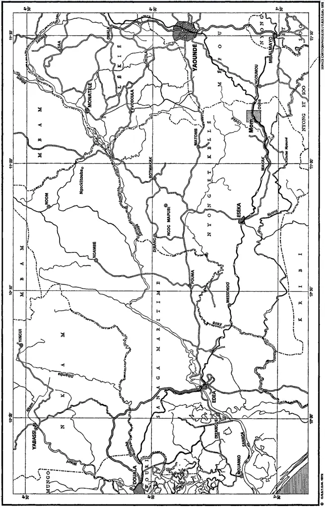
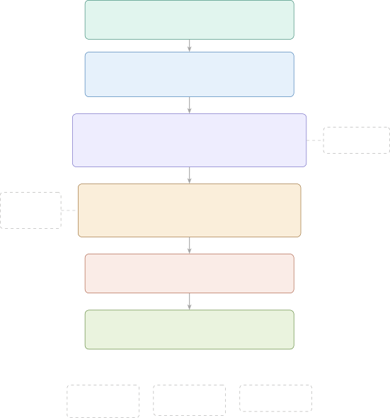
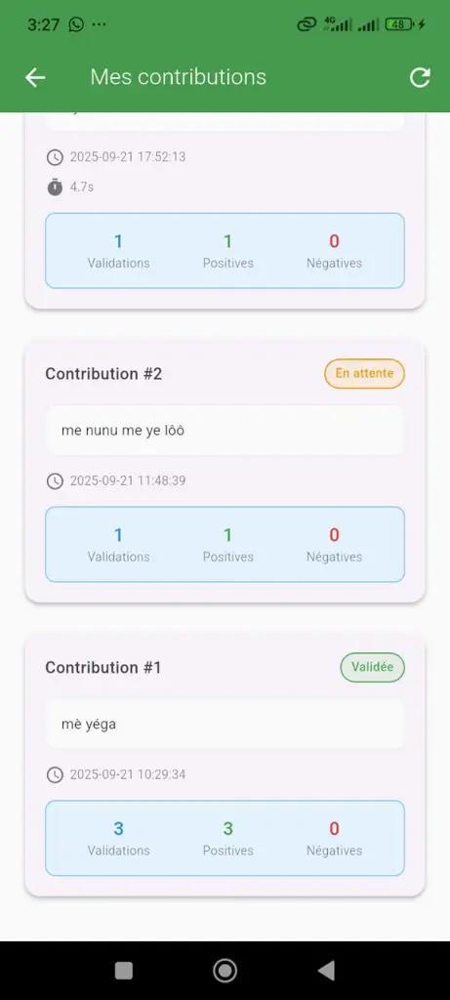
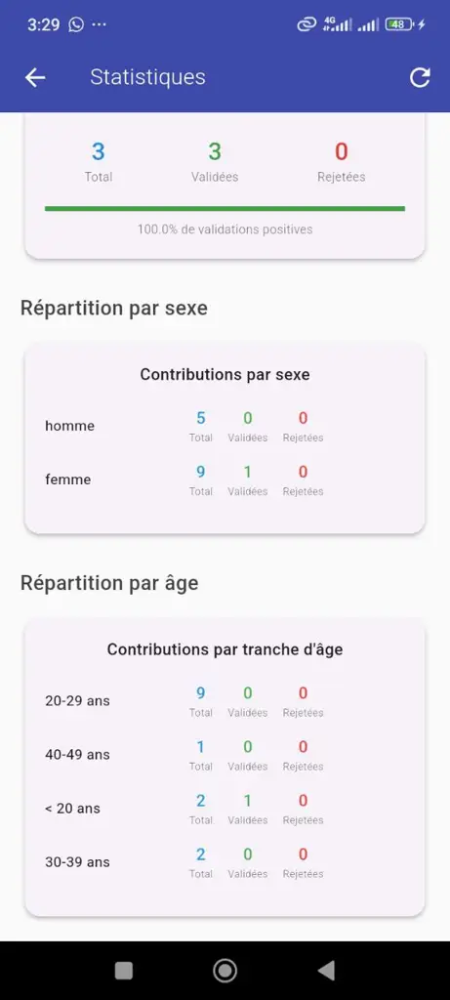

# Automatic Speech Recognition for the Basaà Language: A Low-Resource Approach

SOPHIE GERTRUDE NGO MOCK¹    CHARLES MOUDINA VARMANTCHAONALA ²    PAUL
DAYANG ¹    JEAN MICHEL NLONG II¹    CHRISTOPHER GIES²

###### Abstract

The rapid advancement of Artificial Intelligence (AI) and Natural
Language Processing (NLP) has revolutionized the way humans interact
with machines. Among the most impactful developments is Automatic Speech
Recognition (ASR), which enables computers to convert spoken language
into text. Systems such as those built on deep neural networks,
transformer architectures, and self-supervised learning have achieved
near-human performance for well-resourced languages such as English and
French. Yet, these advances have disproportionately benefited a small
fraction of the world’s languages.

###### Index Terms: 

Natural Language Processing, Machine learning, Speech Processing,
Low-resource Language, Basaà Language, Basaà Speech.

^(†)^(†)address: Department of Mathematics and Computer Science, Faculty
of Science, University of Ngaoundere, Ngaoundere, 454,
Cameroon^(†)^(†)address: Institute for Physics, Faculty V, Carl von
Ossietzky University of Oldenburg, 26129 Oldenburg,
Germany^(†)^(†)corresponding: Corresponding author: Paul Dayang (e-mail:
pdayang@univ-ndere.cm)

## I Introduction

The rapid advancement of Artificial Intelligence (AI) and Natural
Language Processing (NLP) has revolutionized the way humans interact
with machines. Among the most impactful developments is Automatic Speech
Recognition (ASR), which enables computers to convert spoken language
into text. Systems such as those built on deep neural networks,
transformer architectures, and self-supervised learning have achieved
near-human performance for well-resourced languages such as English and
French \[1, 2\]. Yet, these advances have disproportionately benefited a
small fraction of the world’s languages.

Africa is home to more than 2 000 languages, many of which possess rich
oral traditions and serve as primary means of communication for millions
of people \[3\] . However, the vast majority of African languages,
including Basaà, remain severely under-resourced in the digital domain.
As defined by \[4\], an under-resourced language is one that lacks
adequate digital linguistic resources, including normalized orthography,
annotated corpora, phonetic dictionaries, and computational tools. The
Basaà language, a Bantu language spoken by approximately 300 000 people
in the Centre and Littoral regions of Cameroon, exemplifies this digital
marginalization. Despite its cultural significance and growing urban
speaker community, Basaà has no known prior ASR system.

The absence of ASR tools for Basaà represents both a technological gap
and a cultural challenge. In a world where voice interfaces are
increasingly embedded in everyday life, from virtual assistants to
healthcare applications and educational platforms, communities that
speak underrepresented languages are effectively excluded from these
technological benefits. Bridging this gap is not merely a matter of
technical interest; it is a question of linguistic equity and digital
inclusion.

The central research question driving this work is: How can modern ASR
techniques be effectively applied to a low-resource language like Basaà,
where annotated data is scarce, orthographic standards are limited, and
the language presents typologically complex features such as tonal
contrasts and a rich morphosyntactic system.

To address this question, this paper makes the following contributions:

- •
  We provide a comprehensive morphosyntactic and phonological analysis
  of the Basaà language, identifying features that are directly relevant
  to ASR system design, such as tone, vowel quantity, and the consonant
  inventory.
- •
  We present the first end-to-end ASR pipeline for Basaà, based on
  fine-tuning the XLS-R model, a large-scale multilingual
  self-supervised speech model, on a Basaà – French corpus from Mozilla
  Common Voice.
- •
  We report quantitative evaluation results (WER = 14.13%, CER = 3.51%)
  on a test set of 1 671 utterances, establishing a first baseline for
  ASR research on Basaà.
- •
  We present a prototype mobile application (Mahop) integrating the ASR
  model, enabling real-world speech transcription and crowdsourced data
  collection.

The remainder of this paper is organized as follows. Section II presents
a linguistic analysis of Basaà, focusing on features relevant to ASR.
Section III describes the proposed ASR model architecture and its
components. Section IV presents the evaluation methodology, experimental
results, and a discussion of findings. Section V concludes the paper
with future directions.

## II Analysis of the Basaà Language

A thorough understanding of the linguistic structure of a target
language is a prerequisite for designing effective ASR systems. The
phonological, morphological, and syntactic properties of Basaà directly
influence acoustic modeling decisions, tokenization strategies, and the
expected difficulty of recognition. In this section, we present the key
characteristics of the Basaà language relevant to speech processing.

### II-A General Overview of Basaà

Basaà (also spelled bàsàa or Bassa) is a Bantu language belonging to the
Niger-Congo language family. Figure 1 illustrates the regions of
Cameroon where the Basaà language is spoken. It is classified under the
Bantoïde-Sud group and bears the Guthrie code A.43a \[5\]. The language
is spoken predominantly in two regions of Cameroon: the Centre Region
(Nyong and Kellé department) and the Littoral Region (Wouri, Sanaga
Maritime, and Nkam departments). Urbanization has also established
significant Basaà-speaking communities in Douala and Yaoundé, as well as
among the Cameroonian diaspora in Europe and North America.

Ethnologists ¹¹ 1 https://www.ethnologue.com/language/bas/#typology
\[5\] identify approximately twelve dialectal varieties of Basaà,
including Bakem, Bibeng, Diboum, Log, Mpo, Mbang, Ndokama, Basso,
Ndokbele, Ndokpenda, and Nyamtam. This dialectal diversity presents a
challenge for ASR systems, which must ideally account for phonological
and lexical variation across dialects. The present work focuses on the
Mpo dialect, specifically the Basaà Babimbi spoken in the Ngambè region,
which constitutes the primary dialect represented in the Mozilla Common
Voice corpus used for this study.

Sociolinguistically, Basaà occupies an intermediate position: it
functions as a vehicular language in trade and transport across
Cameroonian communities, yet it enjoys no official status under
Cameroon’s constitution, which recognizes only French and English as
official languages \[6\]. Despite this institutional marginalization,
organizational initiatives such as CABTAL (Cameroon Association for
Bible Translation and Literacy) have contributed to orthographic
standardization through biblical translations, providing a limited but
valuable textual resource base.

\tikzscale@endList\tikzscale@endList

Fig. 1: An overview of the regions of Cameroon where the Basaà language
is spoken, adapted from \[7\].

### II-B Morphosyntactic Analysis of Basaà

This part describes some key aspects of Basaà such as the phonological
system, the morphological properties and the syntactic propertied.

#### II-B1 Phonological System

The phonological system of Basaà presents several features that directly
impact ASR system design. Understanding these features is critical for
making informed decisions about the tokenization unit (phoneme-level vs.
character-level), the design of the vocabulary, and the interpretation
of recognition errors.

Basaà possesses a seven-vowel inventory comprising three front vowels
(/i/, /e/, /E/), three back vowels (/u/, /o/, /O/), and one central low
vowel (/a/) \[5, 8\]. These vowels are fully represented in the symbol
inventory of the General Alphabet of Cameroonian Languages (GACL), a
reference orthographic system designed to harmonize the transcription of
Cameroon’s indigenous languages, from which Basaà draws its graphemes
for its standardized writing system  \[9\]. A phonologically distinctive
feature of the Basaà vowel system is the opposition between short and
long vowels, which carries lexical meaning. For example, the short vowel
/i/ in tí (to give) contrasts with the long vowel /ii/ in tíí (to
touch). This quantity distinction implies that ASR systems must be
sensitive to vowel duration, a feature that is often challenging to
capture with standard acoustic models trained on languages without such
distinctions.

|     | Vowel | Short Form | Meaning       | Long Form | Meaning   |
| --- | ----- | ---------- | ------------- | --------- | --------- |
| I   | /i/   | tí         | to give       | tíí       | to touch  |
| U   | /u/   | hú         | audacity      | húú       | to return |
| E   | /e/   | é          | to clear land | péé       | viper     |
| O   | /o/   | só         | antelope      | sòò       | to hide   |
| E   | /E/   | é          | tree          | EE        | to cry    |
| A   | /a/   | bà         | to skin       | bàà       | to filter |

TABLE I: Short/long vowel oppositions in Basaà \[5\]

The consonant inventory of Basaà is rich and typologically marked.
According to \[10\], it comprises 30 consonants including plosives,
nasals, fricatives, affricates, implosives (notably /b/), and
pre-nasalized consonants. The presence of implosives (/b/) and
pre-nasalized stops (/^(m)b/, /^(n)d/, /^(N)g/) represents a significant
challenge for ASR systems trained primarily on European languages, as
these sounds may not have close acoustic equivalents in the pre-training
data. The implication for ASR design is the need for a character-level
or phoneme-level vocabulary that explicitly encodes these distinctive
sounds.

The syllabic structure of Basaà includes the following patterns: V, VV,
CV, VC, CVV, and CVC \[5\]. This variety of syllable types, including
vowel-initial syllables and closed syllables with long vowels, creates
phonotactic constraints that an ASR system must implicitly learn to
model.

Crucially, Basaà is a tonal language with two simple tones: a high tone
(marked with an acute accent: \[$`\acute{\,}`$\]) and a low tone (marked
with a grave accent: \[$`\grave{\,}`$\]). In certain phonological
contexts, the low tone can manifest as a rising contour, and the high
tone as a falling or mid-level tone \[5\]. Tone in Basaà is lexically
and grammatically distinctive: two words differing only in their tonal
pattern can have entirely different meanings. This tonal dimension adds
a layer of complexity to ASR, as spectral features alone may be
insufficient to distinguish tonal minimal pairs. Integrating tonal
information into the ASR pipeline either through specialized acoustic
features or post-processing with a tonal language model is therefore an
important avenue for future work.

#### II-B2 Morphological Properties

Basaà is an agglutinative language with a well-developed system of
nominal classes, a characteristic feature of Bantu languages. Nouns are
organized into singular-plural pairs determined by noun class
membership, and this classification governs agreement patterns
throughout the sentence. Unlike the masculine/feminine gender
distinction in French, Bantu noun classes are semantically and formally
diverse, and the same lexical root can appear with different
morphosyntactic properties depending on its class prefix.

The verb system in Basaà is particularly rich. According to Bitja’a Kody
(1990) as cited in \[5\], the morphological structure of a verbal theme
follows the pattern: Verbal Radical + Extensions + Final Vowel. Verbal
extensions encode a wide range of grammatical meanings including
applicative, passive, reflexive, frequentative, direct causative,
indirect causative, simultaneous, associative, and possessive forms.
This means that from a single root verb such as tèN (to attach), a large
number of morphologically derived forms can be produced, each with a
distinct pronunciation. For ASR, this productivity implies a large and
open vocabulary, making word-level language models less practical and
strengthening the case for character-level modeling with connectionist
temporal classification (CTC) decoding.

Furthermore, vowel alternations occur in verbal radicals under the
influence of extensions: mid vowels /e/ and /o/ raise to /i/ and /u/
respectively, and /E/ and /a/ raise to /e/, while /O/ raises to /o/.
This regular but non-trivial morphophonological process affects the
acoustic realization of verb roots and must be handled by the ASR
acoustic model.

#### II-B3 Syntactic Properties

The basic word order in Basaà is Subject-Verb-Object (SVO), with the
subject pronoun always preceding the verb. Demonstratives and possessive
suffixes agree with the noun class of the head noun. The language
employs two coordinative conjunctions, \[nì\] and \[nà\], both
translatable as ‘and/with’, with \[nì\] used for independent association
and \[nà\] for joint action or inclusive reference.

Personal pronouns in Basaà vary according to their grammatical function
(subject, object, emphatic) and according to the noun class of the
referent. Following the first two persons (singular and plural), all
remaining classes correspond to the third person with singular and
plural forms for each class. This complex pronominal system, along with
the rich verbal morphology, implies that ASR systems for Basaà must
handle a wide range of surface forms for related semantic content, a
challenge that character-level CTC modeling is well-suited to address.

## III Proposed ASR Model for Basaà

This section presents the architecture of our proposed ASR system for
Basaà. We describe the overall pipeline from raw audio input to text
output, provide an overview of the model architecture, and detail each
component and its role, highlighting the specific adaptations made to
address the linguistic characteristics of Basaà identified in
Section II.

### III-A Overview of the ASR Pipeline

Our ASR system follows an end-to-end architecture based on fine-tuning
the XLS-R model \[11\], a cross-lingual speech representation model
derived from Wav2Vec 2.0 \[1\]. The pipeline encompasses four major
stages: (1) data collection and preprocessing, (2) model configuration
and adaptation, (3) CTC-based training, and (4) inference and
evaluation.

The overall architecture of the model, in Figure 2, can be summarized as
follows: a raw audio signal in WAV format (sampled at 16   kHz) is sent
as input to a feature extractor (a convolutional neural network) that
produces a sequence of continuous latent representations. These
representations are then processed by a multi-layer transformer encoder,
which captures long-range temporal dependencies and cross-lingual
acoustic patterns learned during pre-training. A linear projection layer
(the CTC head) maps the transformer outputs to a probability
distribution over the Basaà character vocabulary at each time step.
During training, the CTC loss function enables the model to learn the
alignment between acoustic frames and character sequences without
requiring frame-level annotations. During inference, a greedy or beam
search decoder produces the final transcription.

The key insight motivating the use of XLS-R is that it was pre-trained
on 436 000 hours of unlabeled speech data from 128 languages using
self-supervised contrastive learning \[11\]. Although Basaà is not among
the languages explicitly documented in the pre-training data of XLS-R,
the model was trained on several Bantu languages, including Swahili,
Kinyarwanda, Shona, and Zulu, among others  \[11\]. These languages
belong to the same linguistic family as Basaà and share several
important phonological and morphological characteristics with it. This
massive multilingual pre-training endows the model with rich,
cross-lingual phonetic representations that generalize to new languages,
including low-resource ones, through a relatively small amount of
fine-tuning data. This is particularly relevant for Basaà, where labeled
data is scarce. During the pre-training phase of the XLS-R model, it is
important to note that the language’s alphabet plays no role, as the
model learns directly from raw acoustic speech signals without using any
alphabet or textual transcriptions. The alphabet is only introduced
during the fine-tuning stage, where the learned acoustic representations
are mapped to the orthographic units of the target language  \[1,
12\].This shows that learning takes place before any transcription is
introduced.

### III-B Model Architecture and Components

In this section, we present the components of the proposed model, shown
in Figure 2, along with their respective functions.

#### III-B1 Input: Raw Audio Signal

In Figure 2, the input to the system is a raw mono-channel audio file in
WAV format, resampled to 16 kHz. Audio preprocessing involves
normalization of amplitude (to ensure consistent input volume across
speakers and recording conditions), conversion from MP3 to WAV (required
by the Hugging Face feature extractor), and padding or truncation to
accommodate variable-length utterances within a batch.

A key architectural decision is the use of raw waveforms as input,
bypassing traditional handcrafted features such as Mel-frequency
cepstral coefficients (MFCCs). This choice is justified by the findings
of \[1\], who demonstrated that end-to-end models operating on raw audio
outperform MFCC-based systems, particularly in low-resource settings.
For a tonal language like Basaà, where fine-grained pitch information is
linguistically relevant, operating on raw waveforms preserves
spectro-temporal details that MFCC compression might discard.

#### III-B2 Feature Extraction: Multi-Layer CNN

The first processing stage of XLS-R consists of a multi-layer
convolutional neural network (CNN) that maps the raw waveform into a
sequence of latent feature vectors. These vectors capture local acoustic
patterns at a rate of approximately one frame per 20 milliseconds. The
CNN acts as a learned feature extractor, replacing traditional signal
processing steps.

This stage processes the audio input before it reaches the transformer
encoder. The output of the CNN feature extractor is a sequence of dense
vectors that encode the acoustic content of the speech at a compressed
temporal resolution. The specific architecture of the convolutional
feature extractor (number of layers, kernel sizes, strides) follows the
original Wav2Vec 2.0 specification as implemented in the Facebook AI
Research (FAIR) XLS-R-300M checkpoint.

#### III-B3 Transformer Encoder: Cross-Lingual Representation

The core of the XLS-R model is a multi-layer transformer encoder with a
multi-head self-attention mechanism. The model variant used in this work
(XLS-R-300M) contains approximately 300 million parameters organized in
24 transformer layers, each with 16 attention heads and a hidden
dimension of 1 024. This large capacity enables the model to capture
complex, long-range acoustic dependencies.

Crucially, the pre-training of XLS-R used a contrastive self-supervised
objective on audio from 128 languages. During pre-training, the model
learned to predict the correct quantized speech unit from a set of
distractors, given a masked context. This objective encourages the model
to develop phonetically meaningful, language-universal representations.
For Basaà specifically, although the language may not have been included
in the pre-training data, the linguistic proximity of Basaà to other
Bantu languages, several of which were represented in the XLS-R training
set, provides a favorable starting point for transfer.

Our contribution at this stage consists of fine-tuning all transformer
layers on the Basaà corpus. We observed that full fine-tuning (as
opposed to freezing lower layers) yielded better results, consistent
with findings in the low-resource ASR literature \[12\]. This is likely
because the acoustic properties of Basaà, particularly its tonal
contrasts and pre-nasalized consonants, require adaptation of all
representational levels.

#### III-B4 CTC Head and Basaà Vocabulary

A linear projection layer (the CTC head) is appended to the transformer
encoder. This layer maps the transformer output at each time step to a
probability distribution over the Basaà character vocabulary. The
vocabulary was constructed from the training corpus and includes all
unique characters appearing in Basaà transcriptions, including
diacritic-marked characters for tones (acute and grave accents), the ñ
character, and special characters specific to Basaà orthography.

Our contribution at this stage is the design of the Basaà-specific
vocabulary and the corresponding CTC tokenizer. The Basaà orthography
includes tonal diacritics and characters (such as ñ, E, O) \[5, 8\] that
must be explicitly represented. The tokenizer maps each character to an
integer index, and the CTC loss function enables the model to learn
character-level alignments without requiring explicit segmentation.

The CTC decoding strategy used during inference is greedy decoding
(argmax at each time step), which selects the most probable character at
each frame and collapses repeated characters and blank tokens. This
simple approach proves effective given the character-level granularity
of the vocabulary.

#### III-B5 Architecture Specificity for Basaà: Comparison with French and English

A central architectural motivation for this work is the observation that
standard ASR systems designed for French or English cannot be directly
applied to Basaà without significant adaptation. French and English
benefit from massive labeled corpora (thousands of hours), standardized
orthographies, and absence of phonemic tone. Basaà, by contrast,
presents tonal distinctions, a small but growing corpus (approximately
14 hours in Common Voice 21.0), pre-nasalized and implosive consonants,
and high morphological productivity.

The XLS-R architecture is particularly well-suited to bridge this gap
because: (1) its self-supervised pre-training on 128 languages means it
has already encountered diverse phonetic inventories including some
African languages; (2) its end-to-end character-level CTC formulation
avoids the need for a lexicon or pronunciation dictionary, which do not
yet exist for Basaà in machine-readable form; and (3) the transfer
learning approach allows the model to leverage its rich cross-lingual
representations while adapting to the specific acoustic and phonological
properties of Basaà through fine-tuning.

Fig. 2: End-to-end ASR pipeline for the Basaà language — Fine-tuned
XLS-R-300M.

## IV Evaluation and Discussion

This section focuses on the presentation of the Dataset, the
Experimental Setup and hyper parameters, and the key Results we
obtained.

### IV-A Dataset

The corpus used in this work was collected from Mozilla Common Voice
(version 21.0, released March 2025), an open-source platform for
multilingual speech data collection. The Basaà dataset²² 2
https://mozilladatacollective.com/datasets/cmqigrvys00i3nr07ngkpb6b2
comprises approximately 241.59 MB of MP3 audio recordings, totaling 14
recorded hours with 13 validated hours, collected from 52 speakers.
Alongside the audio files, the corpus includes a tab-separated value
(TSV) file (validated.tsv) containing client identifiers, audio file
paths, transcription sentences, up-vote and down-vote counts, and
speaker metadata.

The dataset was partitioned into three subsets: a training set (70% of
validated utterances), a validation set (15%), and a test set (15%). The
test set used for final evaluation contains 1 671 audio-transcription
pairs. All audio files were resampled to 16 kHz and normalized in
amplitude before being passed to the model.

### IV-B Experimental Setup and Hyperparameters

All experiments were conducted using GPU NVIDIA Tesla T4/P100, 25 GB
RAM. The implementation used PyTorch and the Hugging Face Transformers
and Datasets libraries.

Fine-tuning was performed for 10 epochs with the following
hyperparameters: effective batch size of 16 (batch size of 4 with
gradient accumulation over 4 steps), learning rate of
$`3\times 10^{-4}`$ with a linear warmup over 500 steps, AdamW
optimizer, and CTC loss function. These choices were guided by
established best practices for low-resource ASR fine-tuning \[12, 13\].

| Epoch | Train Loss | Val. Loss | WER (Val.) |
| ----- | ---------- | --------- | ---------- |
| 500   | 1.3005     | 0.7516    | 93.77%     |
| 1000  | 0.5123     | 0.2769    | 60.90%     |
| 1500  | 0.3527     | 0.2222    | 52.34%     |
| 2000  | 0.2750     | 0.2069    | 50.12%     |
| 2500  | 0.2272     | 0.1727    | 43.29%     |
| 3000  | 0.1910     | 0.1617    | 40.54%     |
| 3500  | 0.1624     | 0.1414    | 37.43%     |
| 4000  | 0.1412     | 0.1422    | 36.11%     |
| 4500  | 0.1388     | 0.1342    | 33.71%     |
| 5000  | 0.1180     | 0.1298    | 14.13%     |

TABLE II: Evolution of WER on the validation set during training

### IV-C Results

The final evaluation on the held-out test set of 1 671 utterances
yielded the following performance metrics: Word Error Rate (WER)of 14.13
and Character Error Rate (CER) of 3.51. The WER of 14.13% indicates
that, on average, approximately 86 out of every 100 words are correctly
transcribed by the system. The substantially lower CER of 3.51% reveals
that errors are predominantly localized to specific characters within
words, rather than wholesale word misrecognition. This gap between WER
and CER is characteristic of morphologically rich languages where small
character-level errors, such as missing diacritics or tone marks, can
render an entire word incorrect at the word level while leaving most
characters intact.

|     |             |       |                              |                              |                                   |
| --- | ----------- | ----- | ---------------------------- | ---------------------------- | --------------------------------- |
|     | Time (sec.) | WER   | Reference                    | Predicted                    | Error type                        |
| 1   | 3.9         | 0.200 | mudaa a ék ndap libii        | mudaa a yék ndap libii       | Char. substitution (é $`\to`$ yé) |
| 2   | 4.0         | 0.375 | u ntop bé nok maéba          | u ntop bénok mayéba          | Missing space + vowel change      |
| 3   | 3.9         | 0.000 | men me nlok lipondo li malép | men me nlok lipondo li malép | Perfect transcription             |
| 4   | 3.3         | 0.000 | me nnek bé nye               | me nnek bé nye               | Perfect transcription             |
| 5   | 3.8         | 0.500 | bajo sañ ba mbébna           | bajosañ ba mbébna            | Missing word boundary             |
| 6   | 3.0         | 0.000 | nyañ a yé malét              | nyañ a yé malét              | Perfect transcription             |
| 7   | 2.6         | 0.000 | yom yem i                    | yom yem i                    | Perfect transcription             |
| 8   | 3.1         | 0.250 | a nsihil mut isi             | a nsihil mut hisi            | Consonant insertion (h)           |

TABLE III: Sample transcriptions from the test set

The qualitative analysis in Table III reveals several recurring patterns
of errors. First, word boundary errors (missing spaces between tokens)
account for a meaningful proportion of word-level mistakes; these are
likely related to the agglutinative morphology of Basaà, where prefixes
and roots are frequently written together in natural usage. Second,
diacritic-related substitutions (e.g., é $`\to`$ yé) suggest that tonal
and phonemic distinctions encoded in diacritics remain challenging for
the model, consistent with the known difficulty of tonal language ASR.
Third, occasional consonant insertions (e.g., isi $`\to`$ hisi) point to
acoustic ambiguity between certain segments. Importantly, a significant
proportion of test utterances receive perfect transcriptions
(WER = 0.0), demonstrating that the model has successfully generalized
to recognizable Basaà speech patterns.

### IV-D Discussion

The results reported here must be interpreted in light of the specific
challenges of the Basaà ASR task and the broader low-resource ASR
literature.

Regarding performance, a WER of 14.13% is a strong result for a
first-ever ASR system for a low-resource language with approximately 14
hours of training audio. For reference, state-of-the-art WERs for
well-resourced languages like English typically fall below 5% on
standard benchmarks with thousands of hours of data. More relevantly,
systems for comparably low-resource African languages such as Wolof and
Swahili, trained with similar methodologies, have reported WERs in the
range of 30–88% \[14\], suggesting that our result is competitive or
superior for this category of languages, though direct comparison is
difficult due to dataset differences.

Several factors contribute to the residual errors. First, the limited
size of the training corpus (approximately 11 134 utterances, 13
validated hours) constrains the model’s ability to learn all
phonological contrasts of Basaà. Tonal distinctions in particular
require sufficient examples of minimal pairs to be reliably learned.
Second, the dialectal diversity of Basaà (twelve dialects) introduces
acoustic variation that the model must generalize across, despite being
trained predominantly on one dialect. Third, the orthographic
conventions for Basaà are not yet as uniform as those for French or
English, introducing inconsistency in the training labels.

The notably low CER (3.51%) relative to WER (14.13%) suggests that
errors are systematic and localized, often affecting specific characters
(diacritics, tonal markers) rather than producing unintelligible
outputs. This pattern indicates that the model has a strong underlying
understanding of Basaà phonology and primarily struggles with
fine-grained distinctions. Post-processing with a Basaà character
$`n`$-gram language model or a tonal correction module could potentially
reduce these errors significantly.

From a linguistic perspective, the success of the character-level CTC
approach validates the design decision to bypass word-level modeling in
favor of character-level decoding. Given Basaà’s morphological richness
and the absence of a machine-readable Basaà lexicon, character-level CTC
provides a flexible and linguistically principled framework that does
not presuppose knowledge of the word inventory.

### IV-E Future Directions

Based on the results and observations from this work, we identify
several high-priority directions for future research:

- •
  Corpus expansion: The most impactful improvement would come from
  enlarging the training corpus, particularly through the Mahop
  application’s data collection mechanism. Increasing the corpus to 50+
  hours with diverse speakers, dialects, and acoustic conditions would
  likely reduce the WER substantially.
- •
  Tonal language modeling: Developing a Basaà $`n`$-gram or neural
  language model trained on existing Basaà text (Biblical translations,
  community web content) and integrating it as a post-processor with the
  acoustic model could correct tonally induced errors.
- •
  Dialect adaptation: Training dialect-specific sub-models or
  incorporating dialect identification into the pipeline would improve
  robustness across Basaà’s twelve documented dialects.
- •
  Extended training: Training for additional epochs with learning rate
  scheduling and regularization techniques (weight decay, dropout) could
  further reduce the WER.
- •
  Cloud deployment: Hosting the Mahop API on a cloud GPU instance would
  make the ASR system publicly accessible and accelerate
  community-driven data collection.
- •
  Extension to other Cameroonian languages: The methodology developed
  here is directly applicable to other low-resource Cameroonian
  languages such as Ewondo, Fulfulde, and Ghomala, contributing to the
  broader digital inclusion of Cameroon’s linguistic heritage.

## V Conclusion

This paper has presented the first ASR system for the Basaà language, a
low-resource Bantu language spoken by approximately 300 000 people in
Cameroon. We motivated the system design through a detailed linguistic
analysis of Basaà’s phonological, morphological, and syntactic
properties including its tonal system, vowel quantity distinctions, rich
consonant inventory, and agglutinative morphology and showed how these
properties informed our modeling decisions.

Our proposed system fine-tunes the XLS-R-300M model, a large-scale
multilingual self-supervised speech model, on a Basaà–French corpus from
Mozilla Common Voice using a character-level CTC objective. The system
achieves a WER of 14.13% and a CER of 3.51% on a test set of 1 671
utterances, establishing the first quantitative baseline for Basaà ASR.
Qualitative analysis confirms that the model achieves perfect
transcriptions on many utterances and that remaining errors are
predominantly localized to diacritics, tonal markers, and word
boundaries.

This work demonstrates that modern transfer learning techniques, when
paired with thoughtful linguistic analysis and an appropriate
architecture, can yield meaningful ASR performance even for very
low-resource African languages. We hope that it will serve as both a
technical baseline and a methodological blueprint for future ASR
research on Basaà and on the many other underrepresented languages of
Cameroon and Africa.

## References

- \[1\] A. Baevski, Y. Zhou, A. Mohamed, and M. Auli (2020) Wav2vec 2.0:
  A framework for self-supervised learning of speech representations. In
  Advances in Neural Information Processing Systems (NeurIPS), Vol. 33,
  pp. 12449–12460. Cited by: §I, §III-A, §III-A, §III-B1.
- \[2\] A. Vaswani, N. Shazeer, N. Parmar, J. Uszkoreit, L. Jones, A. N.
  Gomez, Ł. Kaiser, and I. Polosukhin (2017) Attention is all you need.
  In Advances in Neural Information Processing Systems (NeurIPS), Vol. 30. Cited by: §I.
- \[3\] J. O. Alabi, M. A. Hedderich, D. I. Adelani, and D.
  Klakow (2025) Charting the landscape of African NLP: mapping progress
  and shaping the road ahead. arXiv preprint arXiv:2505.21315. External
  Links: [Document](https://dx.doi.org/10.48550/arXiv.2505.21315) Cited
  by: §I.
- \[4\] L. Besacier, E. Barnard, A. Karpov, and T. Schultz (2014)
  Automatic speech recognition for under-resourced languages: A survey.
  Speech Communication 56, pp. 85–100. External Links:
  [Document](https://dx.doi.org/10.1016/j.specom.2013.07.008) Cited by:
  §I.
- \[5\] E. Makasso (2008) Intonation et mélismes dans le discours oral
  spontané en Basaà. TIPA. Travaux interdisciplinaires sur la parole et
  le langage (27). External Links:
  [Document](https://dx.doi.org/10.4000/tipa.394) Cited by: §II-A,
  §II-A, §II-B1, §II-B1, §II-B1, §II-B2, TABLE I, TABLE I, §III-B4.
- \[6\] S. Kamdem, C. Ojongnkpot, and B. Van Pinxteren (2025)
  Decolonizing Cameroon’s language policies: A critical assessment.
  Applied Linguistics Review 16 (2), pp. 1007–1029. External Links:
  [Document](https://dx.doi.org/10.1515/applirev-2023-0273) Cited by:
  §II-A.
- \[7\] J. Champaud (2021) Mom: terroir bassa (cameroun). Vol. 9, Walter
  de Gruyter GmbH & Co KG. Cited by: Fig. 1, Fig. 1.
- \[8\] A. Zribi-Hertz and R. Ndiki-Mayi (1989) Préliminaires à l’étude
  syntaxique du Basaà (Cameroun). Technical report Technical Report 3,
  Langues et Grammaire. Cited by: §II-B1, §III-B4.
- \[9\] M. D. T. Nzali et al. (2022) Tone prediction and orthographic
  conversion for Basaà. arXiv preprint arXiv:2210.06986. External Links:
  [Document](https://dx.doi.org/10.48550/arXiv.2210.06986) Cited by:
  §II-B1.
- \[10\] E. Makasso and S. J. Lee (2015) Basaá. Journal of the
  International Phonetic Association 45 (1), pp. 71–79. External Links:
  [Document](https://dx.doi.org/10.1017/S0025100314000383) Cited by:
  §II-B1.
- \[11\] A. Babu, C. Wang, A. Tjandra, K. Lakhotia, Q. Xu, N. Goyal, K.
  Singh, P. von Platen, Y. Saraf, J. Pino, A. Baevski, A. Conneau,
  and M. Auli (2021) XLS-R: self-supervised cross-lingual speech
  representation learning at scale. arXiv preprint arXiv:2111.09296.
  External Links:
  [Document](https://dx.doi.org/10.48550/arXiv.2111.09296) Cited by:
  §III-A, §III-A.
- \[12\] A. Conneau, A. Baevski, R. Collobert, A. Mohamed, and M.
  Auli (2020) Unsupervised cross-lingual representation learning for
  speech recognition. arXiv preprint arXiv:2006.13979. External Links:
  [Document](https://dx.doi.org/10.48550/arXiv.2006.13979) Cited by:
  §III-A, §III-B3, §IV-B.
- \[13\] J. Zhao and W. Zhang (2022) Improving automatic speech
  recognition performance for low-resource languages with
  self-supervised models. IEEE Journal of Selected Topics in Signal
  Processing 16 (6), pp. 1227–1241. Cited by: §IV-B.
- \[14\] P. D. Pindoh and P. M. Yonta (2025) Self-supervised and
  multilingual learning applied to the Wolof, Swahili and Fongbe. Revue
  Africaine de Recherche en Informatique et Mathématiques Appliquées 42.
  External Links: [Link](https://inria.hal.science/hal-04547298/) Cited
  by: §IV-D.

## Appendix

Beyond the scientific contribution, we developed a prototype mobile
application named Mahop, integrating the fine-tuned XLS-R model into a
real-world speech transcription interface. The application is built
using Flutter (frontend) and Flask (backend API), with the ASR model
served via a local Python server.

Mahop supports three user roles: (1) standard users, who can record
speech and receive real-time Basaà transcriptions; (2) contributors, who
can record new audio and propose corresponding transcriptions, thereby
expanding the dataset; and (3) validators, who can review contributor
submissions, accept or reject them, and export validated data. This
crowdsourcing mechanism directly addresses the primary bottleneck of
low-resource ASR: the lack of labeled training data. By enabling
community participation in data collection, Mahop has the potential to
grow the Basaà corpus organically over time.

In its current state, the backend is deployed locally, with the Flask
server running on a development machine accessible via IP address. Data
are stored in a PostgreSQL database. Future work will involve deploying
the backend on a cloud GPU instance to enable wide-scale public access.
Some screenshots of the application are as follows.

- •
  Login/Registration Screen: In our system, three categories of users
  can be distinguished, namely simple users, contributors, and
  annotators.

  \tikzscale@endList\tikzscale@endList

  \tikzscale@endList\tikzscale@endList

  \tikzscale@endList\tikzscale@endList

  Fig. 3: Registration and login interface

- •
  Simple user view: the user can perform transcriptions and manage their
  transcription history.

  \tikzscale@endList\tikzscale@endList

  \tikzscale@endList\tikzscale@endList

  \tikzscale@endList\tikzscale@endList

  Fig. 4: Simple user interface

- •
  Contributor view: the contributor can add a new contribution and view
  their different contributions.

  \tikzscale@endList\tikzscale@endList

  \tikzscale@endList\tikzscale@endList

  \tikzscale@endList\tikzscale@endList

  Fig. 5: Contributor Interface

- •
  Validator view: The validator can review and validate contributions,
  view validation statistics, and export validated data in Excel format.

  \tikzscale@endList\tikzscale@endList

  \tikzscale@endList\tikzscale@endList

  \tikzscale@endList\tikzscale@endList

  Fig. 6: Validator Interface

  \tikzscale@endList\tikzscale@endList

  \tikzscale@endList\tikzscale@endList

  \tikzscale@endList\tikzscale@endList

  Fig. 7: Validator interface
