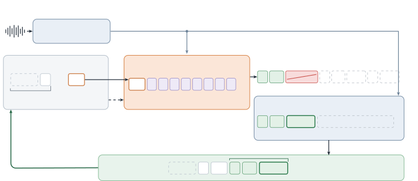

# Whisper-Flash: Acoustically Conditioned Parallel Drafting for Faster Whisper Decoding

Huapeng Zhou    Huayu Wang    Junkai Wu    Kangqi Wang    Xinyu Wang

###### Abstract

Whisper is a widely used encoder–decoder model for speech recognition.
Its encoder reads an utterance in one parallel pass, but its decoder
writes the transcript one token at a time, which dominates inference
time. Speculative decoding shortens such loops without changing their
output: a small drafter guesses several upcoming tokens, and the
original model verifies them all in one forward pass. We present
Whisper-Flash, a two-layer drafter built on a property of speech
recognition: the words still to be written have already been spoken. It
reads Whisper’s encoded audio and accepted decoder states and proposes
eight tokens in a single forward pass. On the complete LibriSpeech test
sets, Whisper-Flash processes 3.16$`\times`$/2.85$`\times`$ as much
audio per second as greedy decoding with identical outputs, and it
remains faster at batch sizes up to 96 and under temperature sampling.
Ablations show that direct access to the audio matters most.

###### Index Terms: 

speech recognition, Whisper, speculative decoding, parallel drafting

^(†)^(†)address: ¹Boson AI  ²University of Washington  
³Independent Researcher  ⁴McGill University  
^(∗)Corresponding authors. Contact: Huapeng Zhou \<zhouhp.me@gmail.com\>

## 1 Introduction

Whisper \[1\] is an encoder–decoder Transformer for speech recognition,
trained on 680,000 hours of weakly supervised multilingual audio. Its
robustness to accents, noise and domain shift has made it a widely used
open-source recognizer, so the cost of running it matters at scale.

Whisper transcribes in two stages. The encoder turns up to 30 s of audio
into acoustic representations in one parallel pass; the decoder then
writes the transcript one token at a time, running all 32 of its layers
for every word piece, punctuation mark and control symbol. The second
stage dominates: for representative LibriSpeech requests on an H100, the
encoder takes only 5–12% of the time of greedy decoding.

Each decoding step does little arithmetic. Its cost comes from reading
the decoder’s weights and running dozens of small kernels, so processing
several tokens in one step costs little more than processing one.
Speculative decoding \[2, 3\] exploits this: a small _drafter_ guesses
several upcoming tokens, and the original _target_ model checks them all
in one forward pass, keeping the longest prefix it agrees with and
supplying its own token at the first disagreement. The greedy transcript
thus stays exactly the target’s own, and a rejection rule preserves the
target’s distribution when sampling, yet each expensive call can now
emit several tokens.

How much this helps depends on the drafter, which must guess both
accurately and cheaply. Autoregressive drafters such as
Distil-Whisper \[4\] guess well but also write one token at a time, so
$`K`$ guesses cost $`K`$ sequential drafter steps. Parallel drafters
guess a whole block in one forward pass, removing this sequential stage,
but each position must then predict its token without seeing the guesses
before it.

Speech recognition eases this dilemma in a way text generation cannot. A
language model continuing a prompt faces an open future, but the words a
recognizer has yet to write have already been spoken and encoded. A
parallel drafter can therefore read upcoming tokens from the audio
instead of inventing them, provided each proposed position can look at
the right part of the recording. The audio cannot, however, reveal how
Whisper will write those words or where the transcript currently stands;
that knowledge lives in the target decoder’s hidden states.

Whisper-Flash combines the two (Fig. 1). Following the
target-conditioned block drafting of DFlash \[5\], a two-layer drafter
initialized from Whisper’s decoder fills eight mask positions after the
latest token. Each position attends to hidden states left by earlier
verification passes and cross-attends directly to the encoded audio, so
the whole block emerges from one forward pass, while frozen Whisper
keeps the final say over every token. We evaluate it on the complete
LibriSpeech test sets, across batch sizes and at sampling temperatures,
and test what each memory contributes.



Figure 1: Whisper-Flash drafts eight tokens in one pass from Whisper’s
acoustic memory and accepted decoder states. The verifier accepts “a
cat,” replaces “standing” with “sitting” and discards later guesses; the
correction becomes the next anchor. Words stand in for token IDs.

## 2 Related Work

Speculative decoding for Whisper has mostly used autoregressive
drafters: Distil-Whisper \[4\] distills the decoder into two layers that
share Whisper’s encoder, Whisper-Turbo \[6\] can serve with its own
encoder, and WhisperKit \[7\] conditions a recurrent drafter \[8\] on
Whisper’s hidden states. Among parallel drafters, blockwise parallel
decoding \[9\] and Medusa \[10\] predict several future tokens from the
target’s current state with separate heads, and Whisper-Medusa \[11\]
applies the idea to Whisper; its block variant adds a cross-attending
layer, yet all heads read one vector at the current position.
DFlash \[5\] lets a block of mask positions attend to multi-layer target
features, and TreeSpark \[12\] grows calibrated, load-adaptive draft
trees from such block drafters; both were designed for language models,
whose future is unobserved. Drax \[13\] starts from the audio: its
flow-matching recognizer drafts for Whisper in two function evaluations
without the target’s states. Whisper-Flash gives every proposed position
its own query into both the target’s history and the audio.

## 3 Method

### 3.1 Propose, verify and advance

Let $`x`$ be the audio and $`y_{\leq t}`$ the transcript emitted so far;
greedy Whisper would continue with

```math
y_{t+1}=\arg\max_{v}p_{\mathrm{target}}(v\mid x,y_{\leq t}). \tag{1}
```

Whisper-Flash instead proposes $`K`$ candidates $`\hat{y}_{t+1:t+K}`$ at
once. The latest emitted token $`y_{t}`$, not yet processed by the
target, serves as the _anchor_. One causal target pass over the anchor
and the candidates yields the target’s prediction at every position. The
verifier keeps candidates while they agree and emits the target’s token
at the first disagreement, or a bonus token if all $`K`$ agree; in
Fig. 1, one call thus advances the transcript by three tokens. The
correction or bonus becomes the next anchor, and only the old anchor and
accepted candidates enter the target cache and the drafter’s history, so
the greedy output is unchanged; we confirm this token by token,
including punctuation and end-of-transcript (EOS).

For sampling at temperature $`T>0`$, the drafter samples each candidate
from its distribution $`q_{i}`$, and the verifier accepts it with
probability $`\min(1,p_{i}(\hat{y}_{i})/q_{i}(\hat{y}_{i}))`$, where
$`p_{i}`$ is the target distribution under the same temperature and
token rules. At the first rejection it resamples from the normalized
residual $`(p_{i}-q_{i})_{+}`$, and after a fully accepted block it
samples a bonus, which preserves the target’s distribution in exact
arithmetic \[2, 3\].

### 3.2 A drafter that reads the transcript and the audio

The drafter draws on two memories Whisper has already computed. The
acoustic memory $`A=E(x)`$ is the encoder output. The history memory
$`H_{<t}`$ holds the target’s decoder states at accepted positions
before the anchor, taken from five blocks, concatenated and projected to
the drafter’s width; since verification produces them anyway, the
drafter summarizes the prefix at no extra cost. A round’s input is the
anchor embedding followed by $`K=8`$ copies of a learned mask vector
$`m`$,

```math
X_{t}=[\operatorname{Emb}(y_{t}),m,\ldots,m], \tag{2}
```

and each mask position predicts its own token. In every drafter layer,
the block’s queries attend to the history and to the block itself within
one softmax, bidirectionally inside the block, with rotary embeddings
(RoPE) \[14\] marking text positions; cross-attention then lets each
position read the acoustic memory, followed by a feed-forward update.

The target’s states do carry acoustic information, but they were
computed to predict only the next token, so positions further ahead need
their own path to the audio. Initialized from Whisper’s first two
decoder blocks, the drafter adds 60.7M trainable parameters, while the
encoder, target decoder, embeddings and output head stay frozen and
shared: a small network learns to anticipate the recognizer, not to
replace it.

### 3.3 Training and execution

The drafter is trained to predict Whisper’s own greedy continuation
rather than the reference, since only agreement with the target counts.
Cached runs of frozen Whisper supply these tokens and hidden states.
Each utterance contributes up to 16 packed anchor blocks; each block
sees the audio but only history before its own anchor, never another
block. With $`v_{bj}`$ masking padding and labels after EOS, we minimize

```math
\mathcal{L}=-\frac{\sum_{b,j}v_{bj}e^{-(j-1)/4}\log q_{\theta}(y_{t_{b}+j})}{\sum_{b,j}v_{bj}e^{-(j-1)/4}},\quad j=1,\ldots,8. \tag{3}
```

The decaying weights favor early positions, because a later guess counts
only if all earlier ones are accepted; checkpoints are selected by mean
accepted-prefix length on validation data. At inference, CUDA
graphs \[15\] replay prefill, drafting and verification. Greedy decoding
runs through the same graph-captured target, so our speedups come from
emitting more tokens per call, not from removing launch overhead.

## 4 Experimental Setup

The target is Whisper large-v3 in FP16, transcribing known-English
speech without timestamps. The drafter is trained on the 94.5 h of
LibriSpeech train-clean-100 \[16\] and then continued on a 1,126.6 h
pool from LibriSpeech, TED-LIUM 3 \[17\] and English VoxPopuli \[18\],
with speaker-disjoint validation; this broader pool sped up TED-LIUM and
VoxPopuli development audio by 17% and 22% over the train-clean-100
drafter. The architecture and block size were fixed before testing. The
baseline is greedy decoding through the same graph-captured target;
batched comparisons add Hugging Face SDPA and faster-whisper’s batched
core \[19\].

All timings use one H100 80GB GPU, two warm-up runs and three timed
repeats. The complete test sets (2,620 test-clean and 2,939 test-other
utterances) are decoded one request at a time in rotating method order,
with the 16 recordings longer than 30 s split into independent 30 s
segments of at most 432 tokens. These runs are timed from GPU log-mel
features to the last token; batched studies time the full path from
waveform to text. Neither includes file I/O, loading or graph capture.
Throughput is given in seconds of audio processed per second (audio s/s)
and generated text tokens per second (tok/s); $`S_{G}`$ relates it to
greedy decoding on the same audio and batch size, with confidence
intervals from 2,000 paired bootstrap resamples. $`\alpha`$ is the
fraction of proposals accepted and $`\tau`$ the tokens emitted per
target call. Outputs are compared as token IDs, including EOS.

## 5 Results

### 5.1 Complete test sets

On the complete test sets, Whisper-Flash processes 192.80 and 166.91
seconds of audio per second on test-clean and test-other, 3.16$`\times`$
and 2.85$`\times`$ the 60.98 and 58.56 of greedy decoding (95% CI
\[3.13, 3.20\] and \[2.82, 2.88\]). All 5,559 transcripts match the
greedy tokens in every repeat (WER 1.98%/3.83%). Because Whisper encodes
a fixed 30 s window whatever the duration, the encoder’s cost, which
speculation cannot reduce, weighs most on short utterances: the speedup
grows from 2.28$`\times`$ below 5 s to 4.02$`\times`$ at 20–30 s.

### 5.2 Throughput across batch sizes

|                                     |                 |           |               |           |           |
| ----------------------------------- | --------------- | --------- | ------------- | --------- | --------- |
|                                     | Greedy decoding |           | Whisper-Flash |           |           |
| Batch                               | tok/s           | audio s/s | tok/s         | audio s/s | $`S_{G}`$ |
| _64 development clips (427.2 s)_    |                 |           |               |           |           |
| 1                                   | 181.7           | 51.93     | 530.8         | 151.68    | 2.92      |
| 2                                   | 266.7           | 76.22     | 765.4         | 218.71    | 2.87      |
| 4                                   | 397.8           | 113.69    | 1052.0        | 300.64    | 2.64      |
| 8                                   | 554.8           | 158.54    | 1270.4        | 363.04    | 2.29      |
| 16                                  | 680.3           | 194.42    | 1413.3        | 403.88    | 2.08      |
| 32                                  | 809.7           | 231.37    | 1577.5        | 450.80    | 1.95      |
| _192 development clips (1,286.7 s)_ |                 |           |               |           |           |
| 32                                  | 851.2           | 249.98    | 1586.7        | 466.00    | 1.86      |
| 64                                  | 972.5           | 285.63    | 1686.1        | 495.18    | 1.73      |
| 96                                  | 1027.8          | 301.87    | 1695.5        | 497.97    | 1.65      |

Table 1: Throughput by batch size on an H100, timed from waveform to
text: generated text tokens (tok/s) and seconds of audio processed per
second. $`S_{G}`$ is the speedup over greedy decoding at the same batch
size, whose tokens Whisper-Flash matches at every batch size.

Batching keeps the GPU busier and leaves speculation less idle capacity
to exploit, so we measure throughput from batch size 1 to 96 (Table 1).
On 64 development clips, Whisper-Flash rises from 530.8 to 1577.5 tokens
and from 151.68 to 450.80 seconds of audio per second between batch
sizes 1 and 32, while its lead over greedy decoding narrows from
2.92$`\times`$ to 1.95$`\times`$. Figure 2 adds two common engines: at
batch size 32, faster-whisper processes 139.37 s of audio per second,
with its own feature frontend changing some transcripts, and Hugging
Face SDPA 63.70. On a separate 192-clip set, Whisper-Flash levels off
near 500 audio s/s at batch sizes 64 and 96, still 1.73$`\times`$ and
1.65$`\times`$ faster than greedy decoding; at batch size 96, the
encoder already takes about half of its time. These are static offline
batches.

Figure 2: Throughput versus batch size on the 64 development clips of
Table 1, timed from waveform to text.

### 5.3 Comparison with Whisper-Medusa

|                            |                        |                        |
| -------------------------- | ---------------------- | ---------------------- |
| Engine                     | Audio s/s $`\uparrow`$ | WER (%) $`\downarrow`$ |
| _Whisper large-v2 systems_ |                        |                        |
| HF greedy                  | 24.72                  | 2.90                   |
| HF + length penalty        | 24.84                  | 2.90                   |
| Whisper-Medusa Linear      | 35.82                  | 5.80                   |
| Whisper-Medusa Block       | 32.14                  | 3.79                   |
| Whisper-Medusa Block^(†)   | 29.70                  | 2.90                   |
| _Whisper large-v3 systems_ |                        |                        |
| HF SDPA                    | 19.26                  | 2.18                   |
| Graph greedy               | 51.93                  | 2.18                   |
| Whisper-Flash              | 151.68                 | 2.18                   |

Table 2: Released Whisper-Medusa checkpoints and Whisper-Flash on the 64
clips of Table 1 (batch size one, waveform to text). Medusa uses
large-v2, Hugging Face Transformers and its official acceptance rule;
$`\dagger`$ is our exact strict-argmax Medusa-Block.

Whisper-Medusa \[11\] is the closest prior parallel drafter for Whisper.
Its released checkpoints build on large-v2 and run in Hugging Face
Transformers, so Table 2 compares each system with its own greedy
baseline. Medusa’s official rule gains 1.30–1.45$`\times`$ but raises
WER from 2.90% to 3.79–5.80%; kept exact, Medusa-Block gains only
1.20$`\times`$, whereas Whisper-Flash gains 2.92$`\times`$ with
identical tokens.

### 5.4 Why both memories matter

| Conditioning           | $`\alpha`$ (%) | $`\tau`$ | Audio s/s | $`S_{G}`$ |
| ---------------------- | -------------- | -------- | --------- | --------- |
| Audio + history        | 47.37          | 4.60     | 157.07    | 2.81      |
| Without direct audio   | 16.48          | 2.23     | 97.55     | 1.69      |
| Without target history | 30.15          | 3.29     | 128.63    | 2.30      |

Table 3: Conditioning ablation on 128 development clips, batch size one.
The drafters share initialization, data, seed and budget
(60.7M/47.5M/52.5M trainable parameters). Each drafter ran in its own
job, and $`S_{G}`$ is relative to greedy decoding timed in that job
(55.9/57.7/55.9 audio s/s); all outputs match greedy decoding.

Table 3 isolates the two memories with three drafters retrained on
train-clean-100 under identical conditions. With both, 47.37% of the
proposals are accepted and throughput is 2.81$`\times`$ that of greedy
decoding. Without the target history, acceptance drops to 30.15% and the
speedup to 2.30$`\times`$; without direct access to the audio,
acceptance collapses to 16.48% and the speedup to 1.69$`\times`$,
although the history still carries the target’s audio-informed states.
This variant resembles DFlash’s target-only conditioning, and its gap to
the full drafter supports our premise that a parallel drafter for speech
must look ahead in the audio.

### 5.5 Sampling at a fixed temperature

|       | Audio s/s |        |      | WER (%) |      |
| ----- | --------- | ------ | ---- | ------- | ---- |
| $`T`$ | AR        | WF     | Gain | AR      | WF   |
| 0     | 56.26     | 173.68 | 3.09 | 2.24    | 2.24 |
| 0.2   | 55.06     | 166.18 | 3.02 | 2.21    | 2.21 |
| 0.4   | 55.22     | 165.84 | 3.00 | 2.14    | 2.33 |
| 0.6   | 55.34     | 164.51 | 2.97 | 2.35    | 2.37 |
| 0.8   | 55.49     | 159.12 | 2.87 | 2.77    | 2.95 |
| 1     | 55.22     | 147.59 | 2.67 | 5.57    | 5.29 |

Table 4: Temperature sampling on 256 development clips (batch size one,
three runs per clip). AR samples autoregressively from the target; gain
is Whisper-Flash (WF) over AR.

Table 4 uses the rejection rule of Sec. 3.1 with the unchanged drafter
on 256 development clips at temperatures from 0 to 1, with top-$`p=1`$
and no top-$`k`$ or fallback. Whisper-Flash stays 2.67–3.09$`\times`$
faster than autoregressive sampling from the same target, and the gain
erodes only gradually as acceptance falls from 57.5% at $`T=0`$ to 44.8%
at $`T=1`$. WER differences between the two reflect sampling variation.

## 6 Conclusion

In speech recognition, the tokens still to be written are already
present in the encoded audio. Whisper-Flash exploits this with a small
drafter that reads the audio alongside Whisper’s decoder states, roughly
tripling greedy throughput on LibriSpeech without changing any output
token and keeping most of the gain under sampling. Other domains,
languages, long-form audio and beam search remain to be evaluated.

## 7 Compliance with Ethical Standards

This research study was conducted retrospectively using human subject
data made available in open access by LibriSpeech \[16\],
TED-LIUM 3 \[17\] and VoxPopuli \[18\]. Ethical approval was not
required as confirmed by the licenses attached with the open access
data.

## 8 Acknowledgments

This work was supported by Boson AI, which provided the computing
resources. Huapeng Zhou is an employee of Boson AI. The other authors
have no relevant financial or non-financial interests to disclose.

## References

- \[1\] Alec Radford, Jong Wook Kim, Tao Xu, Greg Brockman, Christine
  McLeavey, and Ilya Sutskever, “Robust speech recognition via
  large-scale weak supervision,” in Proc. ICML, 2023, pp. 28492–28518.
- \[2\] Yaniv Leviathan, Matan Kalman, and Yossi Matias, “Fast inference
  from transformers via speculative decoding,” in Proc. ICML, 2023, pp.
  19274–19286.
- \[3\] Charlie Chen, Sebastian Borgeaud, Geoffrey Irving, Jean-Baptiste
  Lespiau, Laurent Sifre, and John Jumper, “Accelerating large language
  model decoding with speculative sampling,” arXiv preprint
  arXiv:2302.01318, 2023.
- \[4\] Sanchit Gandhi, Patrick von Platen, and Alexander M. Rush,
  “Distil-Whisper: Robust knowledge distillation via large-scale pseudo
  labelling,” arXiv preprint arXiv:2311.00430, 2023.
- \[5\] Jian Chen, Yesheng Liang, and Zhijian Liu, “DFlash: Block
  diffusion for flash speculative decoding,” in Proc. ICML, 2026.
- \[6\] OpenAI, “Whisper large-v3-turbo,”
  https://huggingface.co/openai/whisper-large-v3-turbo, 2024.
- \[7\] Atila Orhon, Arda Okan, Berkin Durmus, Zach Nagengast, and
  Eduardo Pacheco, “WhisperKit: On-device real-time ASR with
  billion-scale transformers,” in Proc. ICML Workshop on On-Device
  Learning for Foundational Models, 2025.
- \[8\] Yunfei Cheng, Aonan Zhang, Xuanyu Zhang, Chong Wang, and
  Yi Wang, “Recurrent drafter for fast speculative decoding in large
  language models,” arXiv preprint arXiv:2403.09919, 2024.
- \[9\] Mitchell Stern, Noam Shazeer, and Jakob Uszkoreit, “Blockwise
  parallel decoding for deep autoregressive models,” in Proc.
  NeurIPS, 2018.
- \[10\] Tianle Cai, Yuhong Li, Zhengyang Geng, Hongwu Peng, Jason D.
  Lee, Deming Chen, and Tri Dao, “Medusa: Simple LLM inference
  acceleration framework with multiple decoding heads,” in Proc.
  ICML, 2024.
- \[11\] Yael Segal-Feldman, Aviv Shamsian, Aviv Navon, Gill Hetz, and
  Joseph Keshet, “Whisper in Medusa’s ear: Multi-head efficient decoding
  for transformer-based ASR,” in Proc. ICASSP, 2025.
- \[12\] Huapeng Zhou, Huayu Wang, and Xinyu Wang, “TreeSpark:
  Calibrated, load-adaptive draft trees for semi-autoregressive
  speculative decoding,” arXiv preprint arXiv:2609.22098, 2026.
- \[13\] Aviv Navon, Aviv Shamsian, Neta Glazer, Yael Segal-Feldman,
  Gill Hetz, Joseph Keshet, and Ethan Fetaya, “Drax: Speech recognition
  with discrete flow matching,” arXiv preprint arXiv:2510.04162, 2025.
- \[14\] Jianlin Su, Yu Lu, Shengfeng Pan, Ahmed Murtadha, Bo Wen, and
  Yunfeng Liu, “RoFormer: Enhanced transformer with rotary position
  embedding,” arXiv preprint arXiv:2104.09864, 2021.
- \[15\] PyTorch Contributors, “CUDA semantics: CUDA graphs,” PyTorch
  2.7 documentation, https://docs.pytorch.org/docs/2.7/notes/cuda.html,
  accessed September 21, 2026.
- \[16\] Vassil Panayotov, Guoguo Chen, Daniel Povey, and Sanjeev
  Khudanpur, “LibriSpeech: An ASR corpus based on public domain audio
  books,” in Proc. ICASSP, 2015.
- \[17\] François Hernandez, Vincent Nguyen, Sahar Ghannay, Natalia
  Tomashenko, and Yannick Estève, “TED-LIUM 3: Twice as much data and
  corpus repartition for experiments on speaker adaptation,” in Proc.
  SPECOM, 2018, pp. 198–208.
- \[18\] Changhan Wang, Morgane Riviere, Ann Lee, Anne Wu, Chaitanya
  Talnikar, Daniel Haziza, Mary Williamson, Juan Pino, and Emmanuel
  Dupoux, “VoxPopuli: A large-scale multilingual speech corpus for
  representation learning, semi-supervised learning and interpretation,”
  in Proc. ACL-IJCNLP, 2021, pp. 993–1003.
- \[19\] SYSTRAN, “Faster Whisper transcription with CTranslate2,”
  https://github.com/SYSTRAN/faster-whisper, Accessed September
  20, 2026.

## Appendix A Implementation details

### A.1 Anchor, cache and output budget

The prefill pass processes the language and task prompt and emits the
first transcript token, which becomes the first anchor, so the emitted
transcript always runs one token ahead of the target cache. Before a
round with anchor $`y_{t}`$, the target key/value cache and the drafter
history hold exactly the positions before $`t`$. If the cache has length
$`L`$ and the first $`a`$ candidates match, rollback keeps $`L+1+a`$
positions, the old anchor plus the accepted candidates, and the
correction or bonus becomes the next unprocessed anchor. An accepted EOS
ends the transcript without a bonus. With $`R`$ output tokens left, at
most $`R-1`$ candidates are proposed, reserving one slot for the
target’s own token.

### A.2 Drafter architecture

History features are the residual streams after target decoder blocks 1,
8, 15, 22 and 29 (zero-based), taken before the final layer
normalization; their 6,400-dimensional concatenation is projected to the
drafter width of 1,280. The projected history and the current block form
the keys and values of one attention softmax, so a masked position sees
all accepted history, the anchor and the other masked positions, but
never history at or beyond its anchor. RoPE uses base 10,000, FP32
phases and explicit text positions, so cached history keys keep their
indices across rounds. The drafter has its own acoustic key/value
projections, while the encoder states, token embedding and output head
are shared with the frozen target.

### A.3 Training

Labels are frozen Whisper’s greedy continuations rather than reference
transcripts, extracted with the history features in one teacher-forced
pass; trajectories that reach the length limit or have fewer than two
tokens are excluded. Each utterance contributes up to 16 anchors sampled
without replacement, and packed blocks attend only to history strictly
before their own anchor. The drafter is first trained on train-clean-100
(26,749 utterances, 94.5 h, 235 speakers) for 40,000 updates with AdamW,
batch size 4, peak learning rate $`6\times 10^{-4}`$, 4% warmup, cosine
decay and gradient clipping at 1.0, using FP32 parameters with BF16
autocast; validation on 1,790 utterances from 16 held-out speakers
selects step 38,000. It is then continued for 80,000 updates at peak
learning rate $`2\times 10^{-4}`$ on a pool of 371,235 clips
(1,126.6 h), sampling LibriSpeech clean, LibriSpeech other, TED-LIUM 3
and VoxPopuli with probabilities 0.3, 0.5, 0.1 and 0.1; the run sees
656.5 h of unique audio. The ablation drafters of Table 3 use only the
first stage, with identical seeds and anchor draws; their speedups have
95% confidence intervals of \[2.64, 2.97\], \[1.63, 1.74\] and \[2.20,
2.40\].

### A.4 Sampling

For temperature sampling, draft and target logits receive the same token
suppression and temperature scaling, and softmax and acceptance
probabilities are computed in FP32 while both models run in FP16. Each
masked position is sampled independently from its draft distribution
given the history and anchor, which keeps the proposal probabilities
that the rejection rule needs. EOS and the output budget are handled as
in greedy decoding. This implements fixed-temperature sampling, not
Whisper’s temperature fallback, beam search or best-of selection.

### A.5 Execution and output equality

CUDA graphs are captured once for prefill, drafting and each needed
verification length, with preallocated caches and tensor-valued
positions; rejected positions stay allocated but masked. Every request
re-encodes its audio and refreshes the acoustic key/value projections of
target and drafter. Output equality is measured against greedy decoding
through the same graph-captured target. Compared with eager PyTorch
decoding, this graph-captured greedy decoding differs on two
sentence-final punctuation tokens across 512 development clips, caused
by FP16 argmax ties, with identical normalized WER; Whisper-Flash
reproduces the graph-captured tokens in every case.

## Appendix B Additional results

### B.1 Throughput of all engines

|                         |         |         |        |               |
| ----------------------- | ------- | ------- | ------ | ------------- |
| Batch                   | HF SDPA | FW core | Greedy | Whisper-Flash |
| _64 development clips_  |         |         |        |               |
| 1                       | 19.26   | 38.33   | 51.93  | 151.68        |
| 2                       | 26.66   | 55.72   | 76.22  | 218.71        |
| 4                       | 36.15   | 82.02   | 113.69 | 300.64        |
| 8                       | 47.13   | 104.71  | 158.54 | 363.04        |
| 16                      | 55.46   | 121.77  | 194.42 | 403.88        |
| 32                      | 63.70   | 139.37  | 231.37 | 450.80        |
| _192 development clips_ |         |         |        |               |
| 32                      | 63.89   | 141.26  | 249.98 | 466.00        |
| 64                      | 64.31   | 156.59  | 285.63 | 495.18        |
| 96                      | 63.82   | 160.91  | 301.87 | 497.97        |

Table A1: Audio s/s of all engines by batch size (H100, waveform to
text), the data behind Fig. 2 and Table 1. FW denotes faster-whisper.

Table A1 lists every engine at every batch size. Peak PyTorch memory of
Whisper-Flash is 14.9, 26.4 and 38.0 GiB at batch sizes 32, 64 and 96.
faster-whisper computes its own log-mel features: on the 192 clips its
WER is 2.39% at batch sizes 32 and 64 and 2.87% at 96, against 2.20% for
greedy decoding and Whisper-Flash, and feeding it Whisper’s own features
reduces the clips whose normalized text differs from greedy decoding
from 20/20/22 to 1/1/3 (WER 2.17/2.17/2.66%).

### B.2 Where the time goes

| Batch | Request or group | Greedy (%) | Whisper-Flash (%) |
| ----- | ---------------- | ---------- | ----------------- |
| 1     | p25 length       | 12.01      | 34.19             |
| 1     | p50 length       | 8.51       | 20.94             |
| 1     | p90 length       | 4.94       | 15.30             |
| 32    | group 0          | 29.25      | 50.01             |
| 32    | group 5          | 29.60      | 55.82             |
| 96    | group 0          | 30.23      | 52.04             |
| 96    | group 1          | 37.14      | 57.59             |

Table A2: Encoder share of request time, from CUDA events that include
host submission gaps. Batch one uses representative requests at the
25th, 50th and 90th length percentiles; larger batches use complete
groups.

Removing most decoder calls makes the fixed encoder cost more visible
(Table A2): at batch size one the encoder takes 5–12% of greedy decoding
but 15–34% of Whisper-Flash, and at batch sizes 32 and 96 it reaches
half of Whisper-Flash’s time. In the two batch-96 groups, verification
calls fall from 70 and 48 with greedy decoding to 15 and 10, so further
gains at large batch sizes must come from the encoder rather than the
decoder.

### B.3 Speedup by utterance length

| Duration (s)    | Utterances | Speedup |
| --------------- | ---------- | ------- |
| $`[0,5)`$       | 2508       | 2.278   |
| $`[5,10)`$      | 1948       | 3.045   |
| $`[10,20)`$     | 965        | 3.807   |
| $`[20,30)`$     | 122        | 4.024   |
| $`[30,\infty)`$ | 16         | 3.280   |

Table A3: Speedup over greedy decoding on the complete test sets by
utterance duration (test-clean and test-other combined, batch size one).
Recordings longer than 30 s are decoded as independent 30 s segments.

The fixed encoder pass also explains the length dependence in Table A3:
short utterances have few tokens to accelerate, while 20–30 s utterances
reach a 4.02$`\times`$ speedup. Utterance durations have medians of 5.79
and 5.15 s on test-clean and test-other, and outputs have medians of 20
and 18 tokens.

### B.4 Design choices

|                                   |          |                |       |      |
| --------------------------------- | -------- | -------------- | ----- | ---- |
| Layers                            | Position | $`\alpha`$ (%) | $`a`$ | ms   |
| _1,914 clips, 6,000 updates_      |          |                |       |      |
| 2                                 | Abs.     | 9.68           | 0.77  | 97.4 |
| 2                                 | RoPE     | 31.94          | 2.56  | 59.3 |
| _train-clean-100, 40,000 updates_ |          |                |       |      |
| 2                                 | Abs.     | 48.12          | 3.85  | 47.1 |
| 5                                 | Abs.     | 52.72          | 4.22  | 47.8 |
| 2                                 | RoPE     | 56.58          | 4.53  | 44.7 |
| 5                                 | RoPE     | 58.93          | 4.71  | 47.6 |

Table A4: Position encoding and depth, trained with matched data, seed
and budget; 32 dev-clean clips, batch size one. $`a`$ is the mean number
of accepted candidates per round.

| $`K`$ | ms    | $`S_{G}`$ | $`\alpha`$ (%) | $`\tau`$ |
| ----- | ----- | --------- | -------------- | -------- |
| 1     | 84.74 | 1.41      | 92.54          | 1.89     |
| 2     | 66.37 | 1.80      | 87.14          | 2.67     |
| 4     | 49.94 | 2.39      | 74.74          | 3.85     |
| 8     | 43.77 | 2.72      | 54.76          | 5.17     |

Table A5: Verifying only the first $`K`$ of the eight proposals of the
same drafter; 64 development clips, batch size one, timed from waveform
to text.

Table A4 shows why the drafter uses two layers with RoPE. With little
data, RoPE is essential (31.9% vs. 9.7% acceptance); with the full
train-clean-100 split, absolute positions recover much of the gap, but
RoPE still leads. Five layers accept slightly more proposals but cost
more drafting time than they save. Table A5 shows that later positions
are accepted less often, yet verifying all eight proposals still lowers
latency, because each extra proposal is almost free to check; the
speedup at $`K=8`$ has a 95% confidence interval of \[2.54, 2.90\].

### B.5 Training data

| Continuation          | First (%) | $`\alpha`$ (%) | $`\tau`$ | ms    |
| --------------------- | --------- | -------------- | -------- | ----- |
| No continuation       | 82.02     | 46.45          | 4.52     | 41.53 |
| train-clean-100 only  | 81.42     | 46.75          | 4.54     | 41.52 |
| LibriSpeech (925.6 h) | 87.69     | 53.95          | 5.09     | 38.84 |
| + TED-LIUM, VoxPopuli | 87.24     | 54.21          | 5.12     | 38.77 |

Table A6: Continuing the train-clean-100 drafter for 80,000 updates on
different pools, evaluated on 128 dev-other clips at batch size one.
“First” is first-candidate acceptance; the last row is the released
drafter.

Continuing on train-clean-100 alone changes little, while adding the
other LibriSpeech splits raises acceptance and speed on dev-other
(Table A6); relative to the drafter without continuation, the released
drafter is 1.07$`\times`$ faster there (95% CI \[1.05, 1.10\]). Adding
TED-LIUM and VoxPopuli keeps the LibriSpeech gains, and relative to the
drafter without continuation it speeds up the TED-LIUM and VoxPopuli
development sets by 17% and 22%.

### B.6 Temperature sampling

| $`T`$ | $`\alpha`$ (%) | $`\tau`$ | Gain CI        | $`\Delta`$WER \[CI\]   |
| ----- | -------------- | -------- | -------------- | ---------------------- |
| 0     | 57.53          | 5.39     | \[2.99, 3.19\] | 0.00 \[0.00, 0.00\]    |
| 0.2   | 57.20          | 5.37     | \[2.93, 3.11\] | 0.00 \[-0.10, +0.09\]  |
| 0.4   | 56.48          | 5.31     | \[2.91, 3.10\] | +0.18 \[+0.03, +0.33\] |
| 0.6   | 55.46          | 5.23     | \[2.88, 3.06\] | +0.01 \[-0.15, +0.17\] |
| 0.8   | 51.66          | 4.94     | \[2.78, 2.96\] | +0.18 \[-0.20, +0.59\] |
| 1     | 44.79          | 4.42     | \[2.58, 2.77\] | -0.28 \[-1.25, +0.61\] |

Table A7: Temperature-sampling diagnostics for Table 4. Gain CI is the
95% interval of the throughput gain over autoregressive sampling;
$`\Delta`$WER is Whisper-Flash minus autoregressive sampling in
percentage points, with paired 95% intervals.

Acceptance falls slowly up to $`T=0.6`$ and faster beyond it, and every
gain interval stays above 2.5$`\times`$ (Table A7). The WER intervals
are pointwise and unadjusted across the six temperatures; only $`T=0.4`$
excludes zero (+0.18 points). Each clip is sampled three times with
fixed seeds, 2,000 paired bootstrap resamples are stratified by split,
and no request reaches the 432-token limit.
