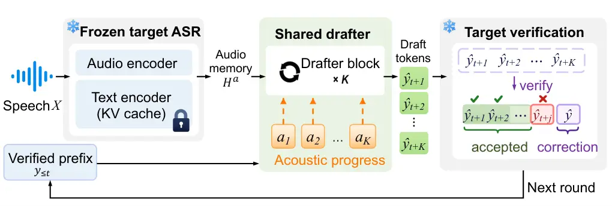
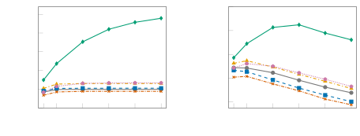

# Acoustic Progress Propagation for Long-Horizon Speculative Decoding in ASR

Yuanyuan Jia    Qianqian Yang

###### Abstract

Speculative decoding accelerates autoregressive automatic speech
recognition (ASR), but the acceptance length of alignment-aware drafters
can saturate as the draft horizon increases. We propose a progress-aware
speculative drafter that recurrently propagates an acoustic progress
state across draft steps and feeds it back into audio cross-attention to
guide token generation. We jointly train the drafter and progress
predictor over variable draft horizons. On five ASR test sets, our
method achieves lossless, macro-averaged end-to-end speedups of
$`1.657\times`$ and $`1.227\times`$ over target-only autoregressive
decoding with Qwen3-ASR-0.6B and Qwen3-ASR-1.7B, respectively. Relative
to AnchorDraft, our method improves the macro-averaged speedup by 34.3%
and 9.0%, respectively. Horizon sweeps show continued growth in
acceptance length beyond the baselines’ saturation. Code is available at
[https://github.com/yuanyuanjia71-spec/ProgDraft](https://github.com/yuanyuanjia71-spec/ProgDraft).

###### Index Terms: 

Automatic speech recognition, speculative decoding, inference
acceleration

^(†)^(†)address: Zhejiang University, Hangzhou, China

## 1 Introduction

Recent state-of-the-art automatic speech recognition (ASR) models
typically employ an autoregressive Transformer-based decoder to generate
transcriptions conditioned on acoustic representations \[1, 2\].
However, this autoregressive paradigm generates tokens one by one,
resulting in high inference latency that limits its ability to meet the
requirements of latency-sensitive applications, such as real-time
transcription and voice assistants \[3\]. To overcome this limitation,
speculative decoding \[4, 5, 6, 7\] has emerged as a possible solution.
It uses a lightweight draft model to propose multiple candidate tokens,
which the target model verifies in parallel within a single forward
pass, reducing sequential decoding overhead.

Recent works have explored this approach for speech recognition.
Whisper-Medusa \[8\] extends Medusa-style multi-head prediction \[9\] to
ASR, while SpecASR \[3\] accelerates decoding through adaptive draft
lengths and draft reuse. However, generating accurate ASR drafts also
requires tracking which speech segment corresponds to each predicted
token. Because different tokens span different amounts of audio,
advancing the text by one word or subword does not directly show where
to look next in the speech. A lightweight drafter must therefore track
its own acoustic position across multiple steps. Recent work \[10\] also
shows that this audio attention often drifts away from the correct
position during rollouts, even when the drafter can see the full audio
context. This drift lowers token acceptance at later steps, limiting the
speedup of longer drafts. To address this problem, AnchorDraft adds
stepwise supervision to the drafter’s audio attention during
training \[10\].

However, improving per-step alignment accuracy does not necessarily
enable effective use of longer drafts. We observe pronounced
long-horizon saturation. As draft length increases, AnchorDraft’s
acceptance length quickly saturates, and additional draft steps yield
little further decoding progress. Stepwise alignment supervision can
improve the drafter’s acoustic localization accuracy, but it does not
change how localization is performed at inference time. At each draft
step, the drafter must use its current state to re-identify the acoustic
region corresponding to the next token within the full acoustic
context \[10\]. Thus, accurate local alignment over short horizons does
not ensure that the drafter can continuously and reliably track its
position in the audio as the draft trajectory advances.

Building on prior recurrent position updates and Gaussian
acoustic-attention weighting \[11\], we propose a progress-aware
speculative drafter that propagates acoustic progress from a
target-attention anchor across draft steps to improve long-horizon
acceptance. We further adopt variable-horizon training, randomly
sampling draft lengths during training so that the model learns this
acoustic progression over rollouts of different lengths, thereby
improving stability and enabling more effective use of longer draft
horizons.

Our contributions are threefold:

1.  1.  We propose acoustic progress propagation to guide successive
        speculative ASR draft steps through recurrent updates of an acoustic
        position state and feedback to audio cross-attention.
2.  2.  We jointly train the drafter and progress predictor over variable
        draft horizons, combining token prediction and alignment supervision
        to learn acoustic progress transitions across rollouts of different
        lengths.
3.  3.  Experiments on five ASR test sets show that our method makes more
        effective use of long draft horizons, achieving longer acceptance
        lengths and higher lossless end-to-end speedups than the evaluated
        baselines.



(a) Progress-conditioned speculative ASR decoding

(b) Shared drafter block

Figure 1: Overview of the proposed progress-conditioned speculative ASR
decoding. (a) Draft-and-verify pipeline. (b) Acoustic-progress
prediction and feedback within one shared draft step.

## 2 Method

### 2.1 Speculative Drafter Architecture

As illustrated in Fig. 1(a), given speech $`X`$ encoded by the target
model as $`H^{a}`$ and a verified prefix $`y_{\leq t}`$, the drafter
proposes $`K`$ candidates
$`\hat{\mathbf{y}}=(\hat{y}_{t+1},\ldots,\hat{y}_{t+K})`$. The target
verifies them in parallel, accepting the longest prefix consistent with
its greedy predictions. Unless decoding terminates, it appends a
correction token at the first mismatch or a bonus token if all
candidates are accepted \[4\].

We use a lightweight acoustic-conditioned drafter initialized by fusing
the embedding $`E(y_{t})`$ of the last committed token with hidden
features $`F_{\ell}(t)`$ from target decoder block $`\ell`$ after
processing that token:

```math
x_{1}=W_{f}\bigl[E(y_{t});F_{\ell_{1}}(t);\cdots;F_{\ell_{m}}(t)\bigr], \tag{1}
```

where $`[\,;\,]`$ denotes concatenation, $`W_{f}`$ is a linear
projection, and $`\ell_{1},\ldots,\ell_{m}`$ index the $`m`$ selected
target decoder blocks. Multi-layer target-feature fusion is also used in
EAGLE-3 \[12\]. Restart features are extracted during a single-token
target context update; both this pass and batched verification are
included in timing (Sec. 3.1).

As shown in Fig. 1(b), a single Transformer decoder block \[13\] applies
causal self-attention, cross-attention over the full $`H^{a}`$, and a
feed-forward network to produce draft state $`z_{k}`$ from input
$`x_{k}`$. The frozen target LM head maps $`z_{k}`$ to a token
distribution, whose argmax gives $`\hat{y}_{t+k}`$. The next input
combines the draft state with the new token embedding:

```math
x_{k+1}=z_{k}+E(\hat{y}_{t+k}). \tag{2}
```

The target parameters remain frozen, and the drafter hidden size matches
the target embedding and LM-head input dimensions. Draft states and the
self-attention cache are carried across steps.

|                |                   | LibriSpeech test-clean       |          | LibriSpeech test-other       |          | TED-LIUM 3 test              |          | GigaSpeech test              |          | FLEURS en-us test            |          |
| -------------- | ----------------- | ---------------------------- | -------- | ---------------------------- | -------- | ---------------------------- | -------- | ---------------------------- | -------- | ---------------------------- | -------- |
| Model          | Method            | Speedup                      | $`\tau`$ | Speedup                      | $`\tau`$ | Speedup                      | $`\tau`$ | Speedup                      | $`\tau`$ | Speedup                      | $`\tau`$ |
| Qwen3-ASR 0.6B | Base Drafter      | 1.203$`\times`$              | 3.043    | 1.172$`\times`$              | 2.976    | 1.227$`\times`$              | 3.102    | 1.186$`\times`$              | 3.012    | 1.131$`\times`$              | 2.864    |
|                | SpeechSpec-EAGLE3 | 0.555$`\times`$              | 1.545    | 0.560$`\times`$              | 1.544    | 0.580$`\times`$              | 1.616    | 0.573$`\times`$              | 1.568    | 0.532$`\times`$              | 1.451    |
|                | AnchorDraft       | 1.260$`\times`$              | 3.241    | 1.223$`\times`$              | 3.137    | 1.263$`\times`$              | 3.245    | 1.246$`\times`$              | 3.178    | 1.176$`\times`$              | 2.986    |
|                | AnchorDraft + RC  | 1.120$`\times`$              | 3.071    | 1.105$`\times`$              | 3.009    | 1.179$`\times`$              | 3.173    | 1.120$`\times`$              | 3.047    | 1.065$`\times`$              | 2.854    |
|                | Ours              | 1.786$`\boldsymbol{\times}`$ | 5.055    | 1.624$`\boldsymbol{\times}`$ | 4.553    | 1.737$`\boldsymbol{\times}`$ | 4.867    | 1.633$`\boldsymbol{\times}`$ | 4.533    | 1.504$`\boldsymbol{\times}`$ | 4.135    |
| Qwen3-ASR 1.7B | Base Drafter      | 0.994$`\times`$              | 2.871    | 0.968$`\times`$              | 2.781    | 1.009$`\times`$              | 2.918    | 0.986$`\times`$              | 2.839    | 0.929$`\times`$              | 2.663    |
|                | SpeechSpec-EAGLE3 | 0.588$`\times`$              | 1.625    | 0.594$`\times`$              | 1.640    | 0.619$`\times`$              | 1.721    | 0.610$`\times`$              | 1.669    | 0.558$`\times`$              | 1.522    |
|                | AnchorDraft       | 1.157$`\times`$              | 3.349    | 1.101$`\times`$              | 3.202    | 1.150$`\times`$              | 3.335    | 1.134$`\times`$              | 3.267    | 1.089$`\times`$              | 3.100    |
|                | AnchorDraft + RC  | 1.059$`\times`$              | 3.147    | 1.021$`\times`$              | 3.032    | 1.090$`\times`$              | 3.196    | 1.057$`\times`$              | 3.101    | 0.997$`\times`$              | 2.929    |
|                | Ours              | 1.289$`\boldsymbol{\times}`$ | 4.009    | 1.224$`\boldsymbol{\times}`$ | 3.752    | 1.291$`\boldsymbol{\times}`$ | 3.967    | 1.216$`\boldsymbol{\times}`$ | 3.751    | 1.116$`\boldsymbol{\times}`$ | 3.416    |

Table 1: End-to-end speedup over target-only autoregressive decoding and
average acceptance length $`\tau`$ on five ASR test sets with
Qwen3-ASR-0.6B and Qwen3-ASR-1.7B. All methods use inference draft
length $`K=8`$.

### 2.2 Acoustic Progress Propagation

The recurrence in Sec. 2.1 propagates hidden states and the
self-attention cache but leaves acoustic progression to cross-attention.
We condition audio cross-attention on a recurrently propagated acoustic
progress state $`a_{k}`$, which estimates the temporal position in the
encoded speech at step $`k`$.

Following prior work \[10\], we initialize each round from target layer
21 (zero-indexed), using the query at the last committed prefix token.
Let $`\mathcal{A}`$ denote valid audio keys, $`s_{j}`$ their timestamps,
and $`\alpha^{\mathrm{tar}}_{h,j}`$ the attention weight from head
$`h`$. Averaging over all $`N_{h}`$ heads, we select the peak as the
initial anchor:

```math
j^{\star}=\arg\max_{j\in\mathcal{A}}\frac{1}{N_{h}}\sum_{h=1}^{N_{h}}\alpha^{\mathrm{tar}}_{h,j},\qquad a_{1}=s_{j^{\star}}. \tag{3}
```

These weights are reused from normal target decoding without an extra
forward pass. Later steps use drafter-predicted progress without further
target-attention queries.

For $`k\geq 2`$, let $`u_{k}`$ denote the representation after
self-attention and before audio cross-attention. Following the monotonic
position-update principle \[11\], we model acoustic progression as a
recurrent state transition conditioned on $`u_{k}`$ and the preceding
progress state:

```math
\displaystyle\Delta_{k} \displaystyle=\operatorname{Softplus}\left(f_{\theta}\left([a_{k-1}/T;u_{k}]\right)\right), \tag{4}
```

```math
\displaystyle a_{k} \displaystyle=a_{k-1}+\Delta_{k},
```

where $`f_{\theta}`$ is the progress predictor and $`T`$ is the
utterance duration. Positions and increments are measured in seconds;
only the predictor’s position input is normalized by $`T`$.

Acoustic retrieval uses $`\bar{a}_{k}`$, the position clipped to
$`[0,T]`$, to form a Gaussian log-bias added to cross-attention scores
before softmax:

```math
\displaystyle B_{k,j} \displaystyle=[\Psi(\bar{a}_{k})]_{j}=-\frac{(s_{j}-\bar{a}_{k})^{2}}{2\sigma^{2}}, \tag{5}
```

```math
\displaystyle S^{\prime}_{k,j} \displaystyle=S_{k,j}+B_{k,j},
```

where $`S_{k,j}`$ is the original score and $`\sigma>0`$ controls the
temporal width. This bias favors positions near $`\bar{a}_{k}`$ while
retaining access to the full $`H^{a}`$; recurrence and supervision use
the unclipped $`a_{k}`$.

Through the recurrence in Eq. (2), the retrieved acoustic context
influences $`u_{k+1}`$ and thus the next progress prediction, closing
the feedback loop.

### 2.3 Training

With the target frozen, we jointly train the drafter and progress
predictor on target-generated greedy trajectories. Teacher forcing
supplies $`E(y_{t+k})`$ to the next step, while progress follows its own
recurrence from the target-attention anchor $`a_{1}`$, without
forced-alignment resets.

We apply token cross-entropy $`\mathcal{L}_{\mathrm{tok},i,k}`$ at each
unrolled depth. Both auxiliary losses use Smooth L1 ($`\beta=1`$). Once
per rollout, feature matching $`\mathcal{L}_{\mathrm{feat},i}`$ compares
$`z_{i,1}`$ with the target’s final normalized decoder state at position
$`t`$, averaging the loss over hidden dimensions.

We align the target-generated transcript with TorchAudio’s MMS forced
aligner \[14\] and use each token’s aligned time-span midpoint as
$`a^{*}_{i,k}`$. For $`k\geq 2`$, $`\mathcal{L}_{\mathrm{prog},i,k}`$
compares the unclipped $`a_{i,k}`$ with $`a^{*}_{i,k}`$ in seconds,
excluding tokens without valid alignments. Progress feedback also passes
token-loss gradients to the predictor.

For each anchor $`i`$, we independently sample $`K_{i}`$ and unroll
$`K_{i}^{\mathrm{act}}=\min(K_{i},R_{i})`$ steps, where $`R_{i}`$ counts
remaining target-trajectory tokens, including terminal EOS. Define
$`m_{i,k}=\mathbf{1}\{K_{i}^{\mathrm{act}}\geq k\}`$ and the empirical
occurrence rate
$`q_{k}=N_{\mathrm{ep}}^{-1}\sum_{i=1}^{N_{\mathrm{ep}}}m_{i,k}`$ from
the epoch’s rollout plan of $`N_{\mathrm{ep}}`$ anchors. Unexecuted
steps contribute zero loss. The per-anchor objective is

```math
\displaystyle\mathcal{L}_{i}={} \displaystyle\sum_{k=1}^{K_{\max}}\frac{m_{i,k}\gamma^{k-1}}{q_{k}}\mathcal{L}_{\mathrm{tok},i,k}+\lambda_{f}\mathcal{L}_{\mathrm{feat},i} \tag{6}
```

```math
\displaystyle+\lambda_{p}\sum_{k=2}^{K_{\max}}\frac{m_{i,k}\gamma^{k-1}}{q_{k}}\mathcal{L}_{\mathrm{prog},i,k},
```

where $`\gamma`$ controls loss decay across draft depths, and
$`\lambda_{f}`$ and $`\lambda_{p}`$ weight feature matching and progress
supervision, respectively. The training horizon range is specified in
Sec. 3.1.

## 3 Experiments

### 3.1 Experimental Setup

Datasets and Target Models. We freeze Qwen3-ASR-0.6B and
Qwen3-ASR-1.7B \[2\] and train drafters on 3,933 English utterances from
LibriSpeech clean/other \[15\], TED-LIUM 3 \[16\], GigaSpeech \[17\],
and FLEURS \[18\]. All methods share 200 utterances per test split
(1,000 total; FLEURS en-us).

Baselines. _Base Drafter_ uses the single-layer recurrent block
(Sec. 2.1) with unrestricted audio cross-attention and no alignment
supervision, progress prediction, or progress-based bias. Base Drafter
and *AnchorDraft* \[10\] train at fixed $`K_{\mathrm{train}}=3`$ unless
specified. Base Drafter sums equally weighted token losses and uses
$`\lambda_{f}=0.5`$. _AnchorDraft + RC_ reuses the AnchorDraft
checkpoint; at inference, peak head-averaged target verification
attention centers the next round’s acoustic window.
*SpeechSpec-EAGLE3* \[19, 12\] uses native five-step training unrolling.
Drafters share each target’s generated corpus.

Metrics. All test token sequences matched Target-only AR, preserving
word/character error rates (WER/CER). Throughout, we report end-to-end
speedup over Target-only AR and acceptance length
$`\tau=R^{-1}\sum_{r=1}^{R}(A_{r}+b_{r})`$, pooling all $`R`$ rounds per
evaluated set. $`A_{r}`$ counts accepted draft-prefix tokens and
$`b_{r}\in\{0,1\}`$ the emitted correction/bonus token ($`b_{r}=0`$ if
EOS terminates without one).

Implementation. Except for the frozen-drafter ablation, drafters train
for 45 epochs (14,760 updates) at effective batch size 12 for both
targets. Our drafters contain 17.85M/71.34M parameters (0.6B/1.7B
targets) and use features from decoder blocks 0, 9, 18, and 27
(zero-indexed). Our joint training uses AdamW \[20\] (learning rate
$`10^{-3}`$, cosine decay) and independent per-anchor sampling
$`K\sim\mathcal{U}\{3,\ldots,8\}`$ (Sec. 2.3). We set $`\sigma=0.2`$ s,
$`\gamma=0.7`$, $`\lambda_{f}=0.5`$, and $`\lambda_{p}=0.1`$. All
methods decode greedily; end-to-end timing uses one H100 80GB GPU, batch
size 1, FP32 eager attention for the target, and BF16 autocast for the
drafter.

### 3.2 Main Results

Across all five test sets and both target model sizes, our method
achieved the highest end-to-end speedup and average acceptance length
(Table 1). Relative to AnchorDraft, the macro-averaged speedup and
$`\tau`$ improved by 34.3% and 46.6%, respectively, with Qwen3-ASR-0.6B,
and by 9.0% and 16.3% with Qwen3-ASR-1.7B. AnchorDraft consistently
outperformed Base Drafter, but adding runtime correction reduced both
metrics. SpeechSpec-EAGLE3 did not achieve end-to-end speedup under the
shared-training-corpus setting.



Figure 2: Average acceptance length $`\tau`$ (left) and end-to-end
speedup over Target-only AR (right) versus inference horizon $`K`$, with
Qwen3-ASR-0.6B on the 1,000-utterance test set.

Our drafter’s acceptance length continued to grow beyond baseline
saturation (Fig. 2). Because verification accepts only a consecutive
matching prefix, early mismatches limit the benefit of extending a
draft. AnchorDraft with variable-horizon training (VHT;
$`K\sim\mathcal{U}\{3,\ldots,8\}`$) plateaued by $`K=6`$, with or
without runtime correction, supporting acoustic progress propagation
under matched training horizon ranges. Our method achieved the highest
speedup at every tested horizon, peaking at $`K=8`$. Beyond this point,
further acceptance gains did not offset the increased cost of longer
draft-and-verify rounds.

### 3.3 Ablation Study

We evaluate six ablations (Table 2). _w/o Acoustic Progress_ matches
Base Drafter’s architecture and inference, training from scratch with
our variable horizons and reweighted token loss (Eq. (6)). _w/o Progress
Feedback_ removes attention feedback but retains progress prediction and
supervision. _Absolute-position prediction_ uses
$`a_{k}=g_{\phi}(u_{k})`$ without position recurrence, retaining
supervision and feedback. _w/o Joint Training_ freezes the final Base
Drafter. A randomly initialized predictor trains for five position-only
epochs (selecting epoch 3), then five variable-horizon epochs with token
CE and progress loss ($`\lambda_{p}=0.1`$). We report the final
checkpoint. _Fixed-$`K`$ training_ fixes $`K=3`$ or $`K=8`$.

| Model Variant                | Acceptance length $`\tau\uparrow`$ | E2E Speedup $`\uparrow`$     |
| ---------------------------- | ---------------------------------- | ---------------------------- |
| w/o Acoustic Progress        | 3.078                              | 1.206$`\times`$              |
| w/o Progress Feedback        | 3.069                              | 1.210$`\times`$              |
| Absolute-position prediction | 3.214                              | 1.233$`\times`$              |
| w/o Joint Training           | 3.130                              | 1.121$`\times`$              |
| Fixed-$`K=3`$ training       | 3.760                              | 1.331$`\times`$              |
| Fixed-$`K=8`$ training       | 4.572                              | 1.611$`\times`$              |
| Ours                         | 4.601                              | 1.649$`\boldsymbol{\times}`$ |

Table 2: Ablations on Qwen3-ASR-0.6B using 1,000 test utterances and
inference horizon $`K=8`$.

Table 2 supports the contribution of cross-step propagation: recurrence
outperformed absolute-position prediction in both metrics with
supervision and feedback retained, whereas supervision without feedback
performed comparably to removing progress modeling. An explicit position
reference may ease tracking compared with recovering absolute location
from each hidden state.

The frozen-drafter variant underperformed joint training, but the
schedules differ, so this comparison does not isolate joint
optimization. Variable-horizon training outperformed fixed-$`K=8`$
training in both metrics at the same maximum horizon, indicating gains
beyond exposure to longer drafts. The fixed-horizon model also improved
both metrics over $`K=3`$.

## 4 Conclusion

We have proposed a speculative ASR drafter that propagates acoustic
progress to guide audio cross-attention. Joint training over variable
horizons improves its use of longer drafts. Across five ASR test sets
and two target sizes, higher acceptance lengths and lossless end-to-end
speedups over the evaluated baselines support acoustic progress
propagation beyond local alignment alone.

## References

- \[1\] Alec Radford, Jong Wook Kim, Tao Xu, Greg Brockman, Christine
  McLeavey, and Ilya Sutskever, “Robust speech recognition via
  large-scale weak supervision,” in Proc. ICML, 2023, vol. 202 of PMLR,
  pp. 28492–28518.
- \[2\] Xian Shi, Xiong Wang, Zhifang Guo, Yongqi Wang, Pei Zhang, Xinyu
  Zhang, Zishan Guo, Hongkun Hao, Yu Xi, Baosong Yang, Jin Xu, Jingren
  Zhou, and Junyang Lin, “Qwen3-ASR technical report,” arXiv preprint
  arXiv:2601.21337, 2026.
- \[3\] Linye Wei, Shuzhang Zhong, Songqiang Xu, Runsheng Wang,
  Ru Huang, and Meng Li, “SpecASR: Accelerating LLM-based automatic
  speech recognition via speculative decoding,” in Proc. ACM/IEEE DAC,
  2025, pp. 1–7.
- \[4\] Yaniv Leviathan, Matan Kalman, and Yossi Matias, “Fast inference
  from transformers via speculative decoding,” in Proc. ICML, 2023, vol.
  202 of PMLR, pp. 19274–19286.
- \[5\] Charlie Chen, Sebastian Borgeaud, Geoffrey Irving, Jean-Baptiste
  Lespiau, Laurent Sifre, and John Jumper, “Accelerating large language
  model decoding with speculative sampling,” arXiv preprint
  arXiv:2302.01318, 2023.
- \[6\] Yuhui Li, Fangyun Wei, Chao Zhang, and Hongyang Zhang, “EAGLE:
  Speculative sampling requires rethinking feature uncertainty,” in
  Proc. ICML, 2024, vol. 235 of PMLR, pp. 28935–28948.
- \[7\] Jian Chen, Yesheng Liang, and Zhijian Liu, “DFlash: Block
  diffusion for flash speculative decoding,” in Proc. ICML, 2026.
- \[8\] Yael Segal-Feldman, Aviv Shamsian, Aviv Navon, Gill Hetz, and
  Joseph Keshet, “Whisper in Medusa’s ear: Multi-head efficient decoding
  for transformer-based ASR,” in Proc. IEEE ICASSP, 2025, pp. 1–5.
- \[9\] Tianle Cai, Yuhong Li, Zhengyang Geng, Hongwu Peng, Jason D.
  Lee, Deming Chen, and Tri Dao, “Medusa: Simple LLM inference
  acceleration framework with multiple decoding heads,” in Proc. ICML,
  2024, vol. 235 of PMLR, pp. 5209–5235.
- \[10\] Xinyu Wang, Huapeng Zhou, Ziyu Zhao, Silin Meng, Ke Bai,
  Dongming Shen, Xiao-Wen Chang, and Alex Smola, “Alignment drift in
  single-model speculative decoding for ASR: Mechanism, correction, and
  cost,” arXiv preprint arXiv:2608.12703, 2026.
- \[11\] Andros Tjandra, Sakriani Sakti, and Satoshi Nakamura, “Local
  monotonic attention mechanism for end-to-end speech and language
  processing,” in Proc. IJCNLP, 2017, pp. 431–440.
- \[12\] Yuhui Li, Fangyun Wei, Chao Zhang, and Hongyang Zhang,
  “EAGLE-3: Scaling up inference acceleration of large language models
  via training-time test,” in Proc. NeurIPS. 2025, vol. 38, pp.
  136737–136756, Curran Associates, Inc.
- \[13\] Ashish Vaswani, Noam Shazeer, Niki Parmar, Jakob Uszkoreit,
  Llion Jones, Aidan N. Gomez, Lukasz Kaiser, and Illia Polosukhin,
  “Attention is all you need,” in Proc. NeurIPS. 2017, vol. 30, Curran
  Associates, Inc.
- \[14\] Vineel Pratap, Andros Tjandra, Bowen Shi, Paden Tomasello, Arun
  Babu, Sayani Kundu, Ali Elkahky, Zhaoheng Ni, Apoorv Vyas, Maryam
  Fazel-Zarandi, Alexei Baevski, Yossi Adi, Xiaohui Zhang, Wei-Ning Hsu,
  Alexis Conneau, and Michael Auli, “Scaling speech technology to 1,000+
  languages,” J. Mach. Learn. Res., vol. 25, no. 97, pp. 1–52, 2024.
- \[15\] Vassil Panayotov, Guoguo Chen, Daniel Povey, and Sanjeev
  Khudanpur, “LibriSpeech: An ASR corpus based on public domain audio
  books,” in Proc. IEEE ICASSP, 2015, pp. 5206–5210.
- \[16\] François Hernandez, Vincent Nguyen, Sahar Ghannay, Natalia
  Tomashenko, and Yannick Estève, “TED-LIUM 3: Twice as much data and
  corpus repartition for experiments on speaker adaptation,” in Proc.
  SPECOM, 2018, vol. 11096 of LNCS, pp. 198–208.
- \[17\] Guoguo Chen, Shuzhou Chai, Guan-Bo Wang, Jiayu Du, Wei-Qiang
  Zhang, Chao Weng, Dan Su, Daniel Povey, Jan Trmal, Junbo Zhang,
  Mingjie Jin, Sanjeev Khudanpur, Shinji Watanabe, Shuaijiang Zhao, Wei
  Zou, Xiangang Li, Xuchen Yao, Yongqing Wang, Zhao You, and Zhiyong
  Yan, “GigaSpeech: An evolving, multi-domain ASR corpus with 10,000
  hours of transcribed audio,” in Proc. Interspeech, 2021, pp.
  3670–3674.
- \[18\] Alexis Conneau, Min Ma, Simran Khanuja, Yu Zhang, Vera Axelrod,
  Siddharth Dalmia, Jason Riesa, Clara Rivera, and Ankur Bapna, “FLEURS:
  Few-shot learning evaluation of universal representations of speech,”
  in Proc. IEEE SLT 2022, 2023, pp. 798–805.
- \[19\] yuekaizhang, “SpeechSpec: Speculative decoding for ASR and
  TTS,” GitHub repository, Accessed: Sep. 14, 2026. \[Online\].
  Available:
  [https://github.com/yuekaizhang/SpeechSpec](https://github.com/yuekaizhang/SpeechSpec).
- \[20\] Ilya Loshchilov and Frank Hutter, “Decoupled weight decay
  regularization,” in Proc. ICLR, 2019.
