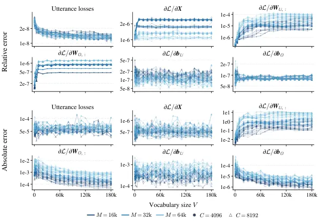

# Pruned CTC for Memory-Efficient Large- Vocabulary ASR Training

Yifan Yang^(\*) ^(†)^(†)thanks: Work done during internship at Alibaba
Token Hub, Alibaba Group. Affiliation: Shanghai Jiao Tong University   
Xiaoyu Yang Affiliation: University of Cambridge    Zengrui Jin
Affiliation: Tsinghua University    Xian Shi Affiliation: Alibaba Token
Hub, Alibaba Group    Yuxuan Wang Affiliation: Alibaba Token Hub,
Alibaba Group    Yu Xi Affiliation: Alibaba Token Hub, Alibaba Group   
Ziyang Ma Affiliation: Shanghai Jiao Tong University    Qi Chen
Affiliation: Shanghai Jiao Tong University    Ruiyang Xu
Affiliation: Shanghai Jiao Tong University    Hui Wang
Affiliation: Nankai University    Dongchao Yang Affiliation: Chinese
University of Hong Kong    Jin Xu^(†) Affiliation: Alibaba Token Hub,
Alibaba Group    Xie Chen³³footnotemark: 3 Affiliation: Shanghai Jiao
Tong University Affiliation: SII [
 https://github.com/yfyeung/PrunedCTC](https://github.com/yfyeung/PrunedCTC)

###### Abstract

Connectionist temporal classification (CTC) naturally supports offline
and streaming speech recognition with utterance-level supervision, but
conventional implementations materialize frame-by-vocabulary activations
in memory, making CTC training with native LLM vocabularies
prohibitively memory-intensive. A key observation is that every valid
CTC alignment uses only target tokens and blank, and their union across
a batch typically forms a small subset of the full vocabulary. We
introduce Pruned CTC, which restricts alignment computation to this
subset while retaining full-vocabulary normalization. We prove that this
vocabulary reduction is exactly equivalent to full-vocabulary CTC in
loss and gradients. Head-and-loss activation memory no longer scales
linearly with vocabulary size. We further apply finite-beam alignment
pruning. Building on Pruned CTC, we develop LLM-CTC, which adapts
pretrained LLMs for non-autoregressive ASR while retaining causal
attention and native vocabularies, and extend it to bounded-history
streaming, avoiding chunk-level speech–text alignments. Experiments show
that, with Zipformer-M encoder and 180K vocabulary, Pruned CTC reduces
full-step memory by 5.1$`\times`$ with only 17% step-time overhead.
Across three corpora, it matches standard CTC accuracy. On GigaSpeech,
across six Qwen3 model sizes from 0.6B to 32B, LLM-CTC remains within 7%
relative WER of LLM-CE with 7 to 10$`\times`$ faster recognition; when
fine-tuning Qwen3-ASR for bounded-history streaming, LLM-CTC remains
within 3% relative WER of matched offline models on the test set.
Together, these results establish Pruned CTC as a scalable sequence
objective for native-vocabulary LLM ASR across offline and streaming
settings.

|     |
| --- |
|     |

## 1 Introduction

Automatic speech recognition (ASR) systems increasingly use pretrained
large language models (LLMs) to draw on their linguistic knowledge (Ma
et al., 2024; Shi et al., 2026). However, LLM-based ASR typically uses
token-level cross-entropy (CE) training and autoregressive generation,
which we call LLM-CE, requiring sequential decoding. Streaming further
requires coordinating text emission with incoming speech, often relying
on chunk-level speech–text alignments for training (Seide et al., 2024;
Jia et al., 2025).

Connectionist temporal classification (CTC) (Graves et al., 2006)
provides a natural alternative, supporting offline and streaming
recognition with utterance-level transcripts. However, standard
implementations materialize frame-by-vocabulary activations in memory,
making CTC training costly with native LLM vocabularies. Note that every
valid CTC alignment contains only blank and the target tokens, while all
other vocabulary classes contribute only through the softmax normalizer.
We therefore introduce Pruned CTC, which restricts alignment computation
to the target classes present in a batch along with blank while
retaining full-vocabulary normalization. Pruned CTC’s head-and-loss
activation memory no longer scales linearly with vocabulary size. We
prove that this reduction is exactly equivalent to full-vocabulary CTC
in loss and first-order gradients, and further apply finite-beam
alignment pruning.

Making large-vocabulary CTC practical allows us to revisit how
pretrained LLMs are used for ASR. Building on Pruned CTC, we propose
LLM-CTC to adapt pretrained LLMs for non-autoregressive ASR over their
native vocabularies. This design extends to bounded-history streaming
recognition under utterance-level supervision, avoiding chunk-level
speech–text alignments during training.

All code and pretrained models will be open-source to facilitate further
research and applications. In summary, our contributions to the
community include:

- •
  A memory-efficient CTC training method, Pruned CTC, with exact loss
  and first-order gradient equivalence under vocabulary reduction and
  head-and-loss activation memory that no longer scales linearly with
  vocabulary size, further combined with finite-beam alignment pruning.
- •
  A CTC-based LLM adaptation method, LLM-CTC, that enables
  non-autoregressive ASR with pretrained causal LLMs while retaining
  causal attention and native vocabularies. Across six Qwen3 model sizes
  from 0.6B to 32B, LLM-CTC remains within 7% relative WER of LLM-CE
  with 7 to 10$`\times`$ faster recognition.
- •
  A streaming extension of LLM-CTC that avoids chunk-level speech–text
  alignments during training and enables bounded-history inference with
  key-value (KV) cache reuse.

## 2 Related Work

#### Memory-efficient loss.

Pruned RNN-T (Kuang et al., 2022) restricts the time–label region the
full joiner evaluates while keeping the vocabulary dimension unchanged.
CoLaCTC (Zhang et al., 2023) coarsens the CTC label inventory for
auxiliary speech-translation training. Cut Cross-Entropy (Wijmans et
al., 2025) avoids storing full-vocabulary logits for tokenwise CE, where
the target class is known at each position. CTC lacks frame-level
targets: label posteriors are computed by forward–backward over the
transcript. These posteriors are supported only on transcript labels and
blank, while full-vocabulary normalization yields dense gradients.
Pruned CTC exploits this structure by separating reduced-vocabulary
alignment computation from full-vocabulary normalization and gradients,
using chunked recomputation to avoid materializing frame-by-vocabulary
activations. Finite-beam pruning separately limits the alignment sum.

#### CTC with large language models.

LegoSLM (Ma et al., 2025) uses speech-encoder CTC posteriors over an LLM
vocabulary as weighted inputs for autoregressive decoding. Baskar et al.
(2024) add auxiliary CTC to speech-prefix outputs under bidirectional
prefix attention and evaluate CTC and autoregressive decoding. Schmitt
et al. (2026) report reduced recognition accuracy from auxiliary CTC on
pretrained LLM speech-prefix outputs. With CTC as the main
objective, Syu et al. (2024) fine-tune bidirectional pretrained language
models and their vocabulary heads for non-autoregressive translation.
NLE (Dekel et al., 2026) converts a pretrained causal LLM into a
bidirectional editor conditioned on speech and an initial CTC hypothesis
with insertion slots. Ablations retain causal attention or replace the
initial hypothesis with equal-length blank sequences.

#### Streaming LLM-based ASR.

Speech ReaLLM (Seide et al., 2024) interleaves speech and text using
external CTC alignments for CE training, including adaptation of a
pretrained 7B LLM. SpeechLLM-XL (Jia et al., 2025) assigns transcript
segments to audio chunks using alignments and limits cached history.
BESTOW (Chen et al., 2024) uses a fixed read/write policy, while Wan et
al. (2026) learn emission timing with monotonic chunkwise attention.

## 3 Pruned CTC

### 3.1 Preliminary: Connectionist Temporal Classification

#### Formulation.

Speech recognition maps a sequence of encoder frames to a sequence of
target labels, typically with more frames than labels. CTC (Graves et
al., 2006) augments the label vocabulary with a blank symbol, yielding
an output vocabulary $`{\mathbb{V}}`$ of size $`V=|{\mathbb{V}}|`$. CTC
assigns to a blank-free target sequence $`y`$ the total probability of
all frame-level alignments $`\pi`$ that collapse to $`y`$. Let
$`{\mathcal{B}}`$ denote the many-to-one collapse map that first merges
consecutive repetitions and then removes blank symbols. The set of
length-$`t`$ alignments consistent with $`y`$ is
$`{\mathcal{B}}^{-1}_{t}(y)=\{\pi\in{\mathbb{V}}^{t}:{\mathcal{B}}(\pi)=y\}`$.

A batch holds $`N`$ utterances, with positive frame count $`T_{n}`$ and
blank-free target $`y_{n}`$ for utterance $`n`$. Let $`T=\max_{n}T_{n}`$
and $`M=\sum_{n}T_{n}\leq NT`$. Stacking the $`M`$ frames row-wise gives
$`{\bm{X}}\in\mathbb{R}^{M\times D}`$, with $`D`$ the head input width
and $`{\mathbb{I}}_{n}`$ the row indices of utterance $`n`$ in frame
order. All class column indices start at zero, sequence positions start
at one, and slices include both endpoints. Let
$`{\mathcal{N}}_{+}\subseteq\{1,\dots,N\}`$ index the utterances whose
alignment set $`{\mathcal{B}}^{-1}_{T_{n}}(y_{n})`$ is nonempty. A
vocabulary head, an affine map with weight
$`{\bm{W}}\in\mathbb{R}^{V\times D}`$ and bias
$`{\bm{b}}\in\mathbb{R}^{V}`$, turns them into logits
$`{\bm{Z}}={\bm{X}}{\bm{W}}^{\top}+{\bm{1}}_{M}{\bm{b}}^{\top}\in\mathbb{R}^{M\times V}`$,
where $`{\bm{1}}_{M}`$ is the all-ones vector of length $`M`$, so that
one column of $`{\bm{Z}}`$ is one class. A $`\mathrm{softmax}`$
normalizes row $`m`$ into a per-frame class distribution, or in log
space

```math
\log p_{v}(m)={Z}_{m,v}-{\lambda}_{m},\qquad{\lambda}_{m}=\log\sum_{u\in{\mathbb{V}}}\exp{Z}_{m,u}. \tag{1}
```

We call $`{\lambda}_{m}`$ the normalizer, which depends on all class
scores at frame $`m`$. CTC assumes conditionally independent frame-level
labels given the input sequence, so the batch loss is

```math
\mathcal{L}=-\sum_{n\in{\mathcal{N}}_{+}}\log\sum_{\pi\in{\mathcal{B}}^{-1}_{T_{n}}(y_{n})}\prod_{t=1}^{T_{n}}p_{\pi_{t}}({\mathbb{I}}_{n}[t]).\vskip-5.0pt \tag{2}
```

#### Discussion.

A standard implementation evaluates Equation 2 by materializing
$`{\bm{Z}}`$, normalizing it along the class axis, and passing the
log-probabilities to a dynamic program. A trainable vocabulary head
requires $`\Theta(VD)`$ storage for parameters, gradients and optimizer
state, and $`\Theta(MVD)`$ projection arithmetic. Full-vocabulary logits
and their gradients require additional activation storage.

- •
  The forward and backward passes store several $`M\times V`$ arrays. At
  large $`V`$, these arrays can exceed the encoder’s activation storage
  and dominate training memory.
- •
  The dynamic program uses only blank and the labels appearing in the
  transcripts of the batch. When these classes make up a small fraction
  of the vocabulary, most columns are materialized solely for the
  normalizer $`{\lambda}_{m}`$.
- •
  Removing classes with positive probability mass changes the normalizer
  and hence the CTC objective. The reduced input must retain
  full-vocabulary normalization.

### 3.2 Pruned CTC via vocabulary reduction

#### Reformulation.

We propose _Pruned CTC_, a memory-efficient CTC training method that
separates alignment computation for the target transcript from
normalization over the full vocabulary. The selected classes
$`{\mathbb{U}}_{n}`$ are blank and the distinct labels of $`y_{n}`$. For
$`n\in{\mathcal{N}}_{+}`$, all valid alignments visit each frame once
and share the same normalization factors, giving the utterance loss
$`\mathcal{L}_{n}`$:

```math
\mathcal{L}_{n}=\sum_{t=1}^{T_{n}}\log\sum_{v\in{\mathbb{V}}}\exp{Z}_{{\mathbb{I}}_{n}[t],v}-\log\sum_{\pi\in{\mathcal{B}}^{-1}_{T_{n}}(y_{n})}\exp\!\left(\sum_{t=1}^{T_{n}}{Z}_{{\mathbb{I}}_{n}[t],\pi_{t}}\right). \tag{3}
```

The first term normalizes over the entire vocabulary. Every valid
alignment satisfies $`\pi_{t}\in{\mathbb{U}}_{n}`$, so the second term
uses only logits for these classes. Classes outside $`{\mathbb{U}}_{n}`$
still affect the loss and receive gradients through the first term.
Vocabulary reduction, chunked projection and dense gradient
reconstruction evaluate Equation 2 without retaining the full
frame-by-vocabulary logit matrix.

Let $`{\mathbb{U}}=\bigcup_{n}{\mathbb{U}}_{n}`$ be the selected classes
for the batch, with $`K=|{\mathbb{U}}|`$, and
$`{\mathbb{O}}={\mathbb{V}}\setminus{\mathbb{U}}`$ its complement. To
preserve the normalization term in Equation 3, we pool the nonblank
classes in $`{\mathbb{O}}`$ into the _other class_. Order
$`{\mathbb{U}}`$ with blank first and relabel each target token by its
index in $`{\mathbb{U}}`$. When $`{\mathbb{O}}`$ is nonempty, define
$`{\bm{R}}\in\mathbb{R}^{M\times(K+1)}`$ by

```math
{R}_{m,j}={Z}_{m,\,{\mathbb{U}}[j]}\quad(j=0,\dots,K-1),\qquad{R}_{m,K}=\log\sum_{v\in{\mathbb{O}}}\exp{Z}_{m,v}, \tag{4}
```

whose first and last columns represent blank and the complement’s mass,
respectively. When $`{\mathbb{O}}`$ is empty, the grouped logits
$`{\bm{R}}`$ have only the $`K`$ columns indexed by $`{\mathbb{U}}`$.
The other class is nonblank and absent from every target, so its symbol
survives collapsing and cannot appear in valid alignments. Pooling
preserves the normalizer, $`\log\sum_{j}\exp{R}_{m,j}={\lambda}_{m}`$,
so each class in $`{\mathbb{U}}`$ keeps its probability.

###### Proposition 1.

In exact arithmetic, CTC on $`\log\mathrm{softmax}({\bm{R}})`$ with
relabeled targets and all valid alignments, summed over the same
utterances in $`{\mathcal{N}}_{+}`$, equals $`\mathcal{L}`$ as a
function of $`{\bm{Z}}`$. The reduced and full-vocabulary losses
therefore have identical first-order gradients with respect to
$`{\bm{Z}}`$, $`{\bm{X}}`$, $`{\bm{W}}`$ and $`{\bm{b}}`$.

We call this computation with vocabulary reduction and all valid
alignments _unpruned reduced CTC_.

For utterance $`n\in{\mathcal{N}}_{+}`$, the occupancy $`\gamma_{v}(m)`$
is the posterior probability of label $`v`$ at frame $`m`$, conditioned
on $`y_{n}`$. Appendix A proves the proposition and derives the logit
gradient:

```math
\frac{\partial\mathcal{L}}{\partial{Z}_{m,v}}=p_{v}(m)-\gamma_{v}(m)\qquad\text{for all }v\in{\mathbb{V}},\ m\in{\mathbb{I}}_{n},\ n\in{\mathcal{N}}_{+}. \tag{5}
```

Labels outside $`{\mathbb{U}}_{n}`$ have zero occupancy and retain
gradient $`p_{v}(m)`$, so the head gradient remains dense over the
vocabulary. Frames of an utterance outside $`{\mathcal{N}}_{+}`$ have
zero gradient.

### 3.3 Finite-beam approximation

Our implementation additionally prunes the alignment lattice using
k2 (Next-gen Kaldi, ). The alignment beam $`\beta`$ sets a log-score
tolerance relative to the best alignment. Appendix B.3 details this
pruning rule and bounds the error in logit gradients. Let
$`{\mathcal{P}}_{\beta,n}\subseteq{\mathcal{B}}^{-1}_{T_{n}}(y_{n})`$ be
the retained alignments for utterance $`n`$. When every utterance in
$`{\mathcal{N}}_{+}`$ has a nonempty retained lattice, we denote its
loss by $`\mathcal{L}_{\beta,n}`$ and use the batch objective

```math
\mathcal{L}_{\beta}=-\sum_{n\in{\mathcal{N}}_{+}}\log\sum_{\pi\in{\mathcal{P}}_{\beta,n}}\prod_{t=1}^{T_{n}}p_{\pi_{t}}({\mathbb{I}}_{n}[t]). \tag{6}
```

Vocabulary reduction preserves every retained alignment’s probability.
Restricting the alignment sum gives
$`\mathcal{L}_{\beta}\geq\mathcal{L}`$, with equality when all valid
alignments are retained. With the retained lattice locally fixed, frames
$`m\in{\mathbb{I}}_{n}`$ for $`n\in{\mathcal{N}}_{+}`$ have logit
gradient $`p_{v}(m)-\gamma_{v}^{\beta}(m)`$, where
$`\gamma_{v}^{\beta}(m)`$ is the posterior occupancy over retained
alignments. Excluded utterances have zero gradient. Pruning boundaries
can introduce discontinuities in the loss.

All Pruned CTC training runs use an alignment beam of 100. Across random
initializations of encoder-based and LLM-based ASR in Appendix B.3, the
estimated discarded alignment posterior mass does not exceed
$`10^{-11}`$ per utterance at this beam.

### 3.4 Forward and backward computation

Algorithm 1 projects vocabulary chunks of at most $`C`$ columns to
compute $`\mathcal{L}_{\beta}`$ when every utterance in
$`{\mathcal{N}}_{+}`$ has a finite retained-lattice loss. Online
log-sum-exp updates $`{\bm{\lambda}}\in\mathbb{R}^{M}`$, one
full-vocabulary normalizer per frame. Each chunk is released after use.
Projecting onto the selected classes and subtracting $`{\bm{\lambda}}`$
gives their log-probabilities
$`{\bm{S}}=(\log\mathrm{softmax}({\bm{R}}))_{:,0:K-1}`$. The complement
contributes through $`{\bm{\lambda}}`$, so the dynamic program uses only
these $`K`$ columns. The backward pass recomputes each chunk, forms
gradients, and releases it. Appendix B.1 details target relabeling and
padding.

#### Recomputed dense gradient.

With $`{\bm{G}}=\partial\mathcal{L}_{\beta}/\partial{\bm{S}}`$ from the
dynamic program and row sums $`{g}_{m}=\sum_{j<K}{G}_{m,j}`$,

```math
\frac{\partial\mathcal{L}_{\beta}}{\partial{Z}_{m,v}}=\operatorname{scatter}_{{\mathbb{U}}}({\bm{G}})_{m,v}-{g}_{m}\,p_{v}(m). \tag{7}
```

1:  input: padded head-input states
$`{\bm{\mathsfit{X}}}\in\mathbb{R}^{N\times T\times D}`$,targets
$`y_{1:N}`$, frame counts $`T_{1:N}`$, head
$`({\bm{W}},{\bm{b}})`$,chunk width $`C`$, alignment beam $`\beta`$

2:  $`{\mathbb{U}}\leftarrow`$ blank followed by sorted distinct labels
in $`y_{1:N}`$

3:  $`K\leftarrow|{\mathbb{U}}|`$, $`\tilde{y}_{1:N}\leftarrow y_{1:N}`$
relabeled by $`{\mathbb{U}}`$

4:  $`{\bm{X}}\leftarrow`$ the $`M=\sum_{n}T_{n}`$ valid frames of
$`{\bm{\mathsfit{X}}}`$

5:  $`{\bm{\lambda}}\leftarrow`$ online log-sum-exp over vocabulary
chunks $`{\bm{Z}}_{:,\,v_{0}:v_{1}-1}`$

6:
 $`{\bm{S}}\leftarrow{\bm{X}}{\bm{W}}_{{\mathbb{U}}}^{\top}+{\bm{1}}_{M}{\bm{b}}_{{\mathbb{U}}}^{\top}-{\bm{\lambda}}{\bm{1}}_{K}^{\top}`$

7:
 $`{\mathcal{A}}\leftarrow\textsc{Intersect}(\textsc{CtcGraph}(\tilde{y}_{1:N}),{\bm{S}},\beta)`$

8:
 $`\mathcal{L}_{\beta,1:N}\leftarrow-\textsc{TotalScores}({\mathcal{A}};\,\text{log semiring})`$

9:  zero nonfinite entries of $`\mathcal{L}_{\beta,1:N}`$

10:  output: $`\mathcal{L}_{\beta}=\sum_{n}\mathcal{L}_{\beta,n}`$ and
$`{\bm{G}}=\partial\mathcal{L}_{\beta}/\partial{\bm{S}}`$

11:  backward: $`{g}_{m}\leftarrow\sum_{j<K}{G}_{m,j}`$

12:  for each vocabulary chunk $`v_{0}:v_{1}-1`$ do

13:   recompute $`{\bm{Z}}_{:,\,v_{0}:v_{1}-1}`$

14:   form Equation 7 for this chunk

15:   accumulate into $`\partial\mathcal{L}_{\beta}/\partial{\bm{X}}`$

16:   write its rows of $`\partial\mathcal{L}_{\beta}/\partial{\bm{W}}`$
and $`\partial\mathcal{L}_{\beta}/\partial{\bm{b}}`$

17:  end for

Algorithm 1 Pruned CTC

The first term places $`{\bm{G}}`$ in columns $`{\mathbb{U}}`$ and zeros
elsewhere, giving at most $`K`$ nonzero columns. The second uses the
full-vocabulary probabilities of Equation 1 and supplies normalization
gradients to all columns, including the complement. For a unit-weight
loss on a nonempty retained lattice,
$`{G}_{m,j}=-\gamma_{{\mathbb{U}}[j]}^{\beta}(m)`$ and $`-{g}_{m}=1`$.
With all valid alignments retained, Equation 7 recovers Equation 5. The
actual row sums also account for loss scaling and excluded utterances,
as described in Appendix B.1. Recomputing and consuming one dense chunk
at a time reduces class-axis activation storage from $`\Theta(MV)`$ to
$`\Theta(MK+M)`$ plus a temporary block of at most $`M\times C`$
entries. Storage for the dynamic program also depends on sequence
lengths and the alignment beam.

When the two gradient terms nearly cancel for the selected classes,
rounding errors can dominate their difference. Appendix B.2 compares
precision strategies and quantifies loss and gradient errors across
vocabulary and batch sizes.

## 4 LLM-CTC

### 4.1 Preliminary: LLM-based ASR

#### Formulation.

A speech encoder and projector map utterance $`n`$ to
$`{\bm{E}}_{n}\in\mathbb{R}^{T_{n}\times D}`$. A pretrained decoder-only
language model receives these speech embeddings and a $`P`$-token prompt
$`{\bm{P}}\in\mathbb{R}^{P\times D}`$. The model’s causal transformer
backbone $`f`$, including the final normalization, produces one
$`D`$-dimensional state per position. The pretrained vocabulary
projection, or LLM head, uses the weight $`{\bm{W}}`$ from Section 3.1
and a pretrained bias $`{\bm{b}}^{\mathrm{pre}}\in\mathbb{R}^{V}`$. For
autoregressive recognition, $`{\bm{b}}={\bm{b}}^{\mathrm{pre}}`$.

Adding the end-of-sequence token gives
$`y_{n}^{+}=(y_{n},\mathrm{EOS})`$. Autoregressive (AR) training
minimizes

```math
\mathcal{L}_{\mathrm{CE}}=-\sum_{n}\sum_{i=1}^{|y_{n}|+1}\log p_{\rm{model}}\!\left(y^{+}_{n,i}\mid{\bm{P}},{\bm{E}}_{n},y^{+}_{n,<i}\right). \tag{8}
```

LLM-CE generates one token per sequential LLM forward pass, conditioned
on preceding text, and reuses a KV cache across forward passes.

Figure 1: Offline LLM-based ASR under causal attention. (a) LLM-CE
predicts transcript tokens and EOS ($`E`$). (b) Speech-readout LLM-CTC
reads speech positions with prefix access. (c) Query-readout LLM-CTC
reads appended queries with access to all speech embeddings.
$`\mathcal{L}_{\mathrm{CE}}`$ is cross-entropy, and
$`\mathcal{L}_{\text{Pruned CTC}}=\mathcal{L}_{\beta}`$ is finite-beam
CTC with alignment beam $`\beta`$.

### 4.2 Offline LLM-CTC

#### Formulation.

LLM-CTC adapts pretrained LLMs for direct, non-autoregressive speech
recognition over their native vocabularies using Pruned CTC. Offline
systems process the entire utterance before decoding. We retain causal
attention to preserve the pretrained attention structure and facilitate
streaming with KV cache reuse. Figure 1 compares LLM-CE with the two
LLM-CTC readouts, which select different LLM positions for CTC
prediction.

_Speech-readout LLM-CTC_ processes the prompt followed by speech
embeddings to obtain
$`{\bm{H}}_{n}^{\mathrm{s}}=f([{\bm{P}}^{\top}\,{\bm{E}}_{n}^{\top}]^{\top})`$
and selects
$`{\bm{X}}_{{\mathbb{I}}_{n},:}=({\bm{H}}_{n}^{\mathrm{s}})_{P+1:P+T_{n},:}`$
as the CTC states. Each speech position can attend to the prompt and the
speech positions up to itself.

_Query-readout LLM-CTC_ appends $`T_{n}`$ copies of one learned vector
$`{\bm{q}}\in\mathbb{R}^{D}`$ after the speech embeddings, computes
$`{\bm{H}}_{n}^{\mathrm{q}}=f([{\bm{P}}^{\top}\,{\bm{E}}_{n}^{\top}\,{\bm{q}}{\bm{1}}_{T_{n}}^{\top}]^{\top})`$
and selects
$`{\bm{X}}_{{\mathbb{I}}_{n},:}=({\bm{H}}_{n}^{\mathrm{q}})_{P+T_{n}+1:P+2T_{n},:}`$
as the CTC states. The copies occupy distinct sequence positions. Every
query can attend to the prompt, all speech embeddings and query
positions up to itself.

Both variants provide $`T_{n}`$ CTC states for utterance $`n`$, stacked
into the batch matrix $`{\bm{X}}`$. An output class $`v_{\mathrm{bl}}`$
unused by the tokenizer serves as blank, preserving the text vocabulary.
Since the LLM head is frozen, we learn a blank offset $`\eta`$ to adjust
the blank logit:
$`{\bm{b}}={\bm{b}}^{\mathrm{pre}}+\eta{\bm{e}}_{v_{\mathrm{bl}}}`$,
where $`{\bm{e}}_{v_{\mathrm{bl}}}\in\mathbb{R}^{V}`$ is the standard
basis vector for blank. Full-vocabulary normalization of the LLM head
logits gives $`p_{v}(m)`$, including blank, as defined in Equation 1.
Both variants minimize the finite-beam objective $`\mathcal{L}_{\beta}`$
in Equation 6 using these probabilities.

#### Discussion.

Both variants support non-autoregressive (NAR) recognition, producing
$`T_{n}`$ CTC frames in $`\Theta(1)`$ LLM forward passes and admitting
the same valid alignments for a given transcript.

- •
  Speech embeddings already carry encoder context. Within the LLM,
  Query-readout LLM-CTC gives every CTC prediction position direct
  access to the speech embeddings of the entire utterance.
  Speech-readout LLM-CTC restricts this access to a growing speech
  prefix.
- •
  Query-readout LLM-CTC adds $`D`$ parameters and increases the LLM
  input length from $`P+T_{n}`$ to $`P+2T_{n}`$, increasing tokenwise
  and attention work in the same LLM layers. Appendix E.1 gives the
  corresponding cost analysis.

### 4.3 Streaming LLM-CTC

Figure 2: Streaming Query-readout LLM-CTC. (a) Chunk positions attend to
prompt $`{\bm{P}}`$, $`h`$ seconds of speech/query history before the
chunk, and their causal prefixes within the chunk. (b) Speech blocks
$`{\bm{E}}_{b}`$ alternate with shared-query blocks $`{\bm{Q}}_{b}`$.
Concatenated query outputs are trained against the entire $`U`$-token
transcript using
$`\mathcal{L}_{\text{Pruned CTC}}=\mathcal{L}_{\beta}`$. (c) Each chunk
uses one LLM forward pass with a KV cache, while CTC prefixes and scores
persist across chunks.

#### Formulation.

_Streaming Query-readout LLM-CTC_ extends the causal query readout by
processing utterance $`n`$ in $`B_{n}`$ chunks. For chunk $`b`$, the
encoder uses $`h`$ seconds of left history and returns only
current-chunk outputs. The projector maps them to speech embeddings
$`{\bm{E}}_{n,b}\in\mathbb{R}^{T_{n,b}\times D}`$. We append the
shared-query block $`{\bm{Q}}_{n,b}={\bm{1}}_{T_{n,b}}{\bm{q}}^{\top}`$.
Let $`f_{h}`$ denote $`f`$ with the mask in Figure 2(a) at every LLM
layer. A position in chunk $`b`$ can attend to the prompt, speech/query
positions from the $`h`$ seconds before that chunk, and positions up to
itself within the chunk. The LLM outputs
$`{\bm{H}}_{n}^{\mathrm{str}}=f_{h}([{\bm{P}}^{\top}\,{\bm{E}}_{n,1}^{\top}\,{\bm{Q}}_{n,1}^{\top}\,\cdots\,{\bm{E}}_{n,B_{n}}^{\top}\,{\bm{Q}}_{n,B_{n}}^{\top}]^{\top})`$.
Each CTC prediction position can directly attend to the entire current
speech block. Feature extraction and encoding exclude audio from later
chunks.

#### Training.

We sample the left-history length $`h`$ per microbatch as specified in
Appendix D.4 and use it for the speech encoder and LLM attention mask.
With $`T_{n}=\sum_{b=1}^{B_{n}}T_{n,b}`$ and sequence offset
$`o_{n,b}=P+2\sum_{c=1}^{b-1}T_{n,c}`$, we concatenate query outputs in
chunk order as in Figure 2(b):

```math
{\bm{X}}_{{\mathbb{I}}_{n},:}=\operatorname{Concat}_{b=1}^{B_{n}}({\bm{H}}_{n}^{\mathrm{str}})_{o_{n,b}+T_{n,b}+1:o_{n,b}+2T_{n,b},:}. \tag{9}
```

The frozen LLM head and blank offset $`\eta`$ produce frame
probabilities for $`\mathcal{L}_{\beta}`$. Applied once to the entire
transcript, this loss sums over retained alignments across chunks,
avoiding chunk-level speech–text alignments. Training can process all
chunks in parallel under this attention rule.

#### Inference.

Each chunk produces its query emissions in one LLM forward pass, as in
Figure 2(c). The speech encoder retains at most $`h`$ seconds of left
history between chunks. The LLM reuses the KV cache for the prompt and
retained speech/query positions, discarding older entries. CTC prefix
beam search carries candidate prefixes and scores across chunks. The
best CTC hypothesis may change as new emissions arrive, while earlier
LLM emissions remain fixed. Appendix E.1 proves the equivalence of
parallel batch computation and per-utterance cached computation for the
LLM in exact arithmetic. Appendix E.2 quantifies their finite-precision
differences.

## 5 Experiments

### 5.1 Memory and runtime

#### Encoder-based ASR.

We benchmark Pruned CTC with a Zipformer-M encoder on GigaSpeech using
one H100 80G GPU. Standard CTC uses a dense vocabulary head followed by
PyTorch’s CTC loss. We vary vocabulary size from 500 to 180,000 classes
and total batch frames $`M`$ over 16,000, 32,000 and 64,000,
retokenizing transcripts for each vocabulary. Both methods process the
same batches. We measure forward and backward through the vocabulary
head and CTC loss, and full training steps including the speech encoder
and optimizer. Appendix C.2 gives the settings.

Figure 3: Vocabulary head and CTC loss memory (top) and time (bottom)
for forward and backward passes. Crosses: extrapolated out-of-memory
(OOM) points.

|       |       |          |        |               |                  |
| ----- | ----- | -------- | ------ | ------------- | ---------------- |
| $`M`$ | $`V`$ | Memory   |        |               | Runtime overhead |
|       |       | Standard | Pruned | Reduction     |                  |
| 16k   | 180k  | 51.7     | 10.1   | 5.1$`\times`$ | +17%             |
| 32k   | 130k  | 77.3     | 17.9   | 4.3$`\times`$ | +17%             |
| 64k   | 50k   | 76.2     | 33.8   | 2.3$`\times`$ | +14%             |

Figure 4: Full training steps for each batch size at the largest tested
vocabulary feasible for standard CTC. Memory is in GiB. Memory
reductions and runtime overheads are relative to standard CTC.

- •
  Head and loss. Figure 4 shows approximately constant memory for Pruned
  CTC over 10,000 to 180,000 classes at each batch size, while standard
  CTC’s memory grows linearly with vocabulary size. At $`M=16{,}000`$
  and $`V=180{,}000`$, Pruned CTC reduces memory from 43.0 to 1.29 GiB,
  a factor of 33.3. At the same $`V`$, it uses 2.58 and 5.16 GiB for
  $`M=32{,}000`$ and $`M=64{,}000`$, respectively. Memory savings begin
  between 2,000 and 5,000 classes at all three batch sizes. Pruned CTC
  completes all tested head-and-loss configurations, including those
  where standard CTC runs out of memory. Pruned CTC’s runtime ratio to
  standard CTC generally decreases with vocabulary size. At
  $`M=16{,}000`$, the ratio is 9.14 at 500 classes and 1.41 at 180,000
  classes.
- •
  Full training steps. Table 4 uses the largest tested vocabulary
  feasible for standard CTC at each batch size. Pruned CTC reduces
  memory by a factor of 2.3 to 5.1, with 14 to 17% more time per step.
  At $`V=180{,}000`$, Pruned CTC also completes full steps at
  $`M=32{,}000`$ and $`64{,}000`$, using 18.2 and 34.5 GiB,
  respectively. Standard CTC runs out of memory in both settings.

#### LLM-based ASR.

We profile the 8B and 14B LLM-CTC models in Section 5.3 on one A100 80G
GPU, using LoRA and frozen native LLM heads with $`V=151{,}936`$. We
compare standard CTC, unpruned reduced CTC and Pruned CTC under the
settings in Appendix C.3.

- •
  Head and loss. Memory is the peak increase above resident head
  parameters and inputs during forward and backward. Relative to
  standard CTC, Pruned CTC reduces this from 29.21 to 1.14 GiB for 8B
  and from 29.79 to 1.20 GiB for 14B, by factors of 25.7 and 24.8,
  respectively.
- •
  Full training steps. Including resident model and optimizer storage,
  Pruned CTC reduces peak memory from 56.06 to 34.67 GiB for 8B and from
  72.71 to 52.84 GiB for 14B relative to standard CTC. These are
  reductions of 38.2% and 27.3%, with 7.5% and 5.6% more time per step,
  respectively. Storage and activations outside the head and loss limit
  the full-step reductions. Unpruned reduced CTC achieves nearly the
  same full-step memory and runtime as Pruned CTC. Exact vocabulary
  reduction and recomputation provide most of the measured memory
  savings.

### 5.2 Encoder-based ASR

#### Setup.

We compare Pruned CTC with standard CTC on three Mandarin and English
corpora. LibriSpeech (Panayotov et al., 2015) is 960 hours of read
English, GigaSpeech (Chen et al., 2021) is 10,000 hours of read and
spontaneous English speech, and AISHELL-1 (Bu et al., 2017) is 170 hours
of read Mandarin. LibriSpeech and GigaSpeech use byte-pair encoding
(BPE) (Kudo and Richardson, 2018) with 500-class vocabularies. AISHELL-1
uses a 4336-class character vocabulary. We use a Zipformer-M
encoder (Yao et al., 2024) and follow the standard CTC configurations in
CR-CTC (Yao et al., 2025), replacing the loss with Pruned CTC. Decoding
uses prefix beam search with beam size 4. We report word error rate
(WER) for English and character error rate (CER) for Mandarin.
Appendix D.1 details training configurations.

|                                 |             |            |            |       |           |      |
| ------------------------------- | ----------- | ---------- | ---------- | ----- | --------- | ---- |
| Method                          | LibriSpeech |            | GigaSpeech |       | AISHELL-1 |      |
|                                 | test-clean  | test-other | dev        | test  | dev       | test |
| Standard CTC (Yao et al., 2025) | 2.52        | 6.02       | 11.23      | 11.27 | 4.47      | 4.80 |
| Pruned CTC (ours)               | 2.52        | 6.02       | 11.25      | 11.24 | 4.49      | 4.79 |

Table 1: ASR performance comparison between standard CTC and Pruned CTC
with a Zipformer-M encoder: WER (%) on LibriSpeech and GigaSpeech, and
CER (%) on AISHELL-1.

#### Results.

Pruned CTC yields nearly identical WER and CER to standard CTC across
all three corpora in Table 1. These results show that Pruned CTC with
finite-beam alignment pruning can replace standard CTC in the evaluated
ASR recipes without sacrificing recognition accuracy.

### 5.3 Offline LLM-based ASR

#### Setup.

On GigaSpeech, we pair a frozen SPEAR-XLarge v2 speech encoder (Yang et
al., 2026) with Qwen3 LLMs (Yang et al., 2025) and refer to this model
family as SPEAR-Qwen3. We evaluate Qwen3 backbones at 0.6B, 1.7B, 4B,
8B, 14B, and 32B parameters. Paired LLM-CE and LLM-CTC models share the
encoder and Qwen3 size. WER uses beam search for LLM-CE and prefix beam
search for LLM-CTC, both with beam size 4. Real-time factor (RTF) is
total timed recognition time divided by total audio duration. We measure
it on the trained checkpoints used for WER, with greedy decoding on one
H100 80G GPU. Appendix D.3 details the timing protocol. Appendix D.2
gives shared training settings, and Appendix D.3 specifies the models.
Additional baselines include Whisper (Radford et al., 2023),
Qwen2-Audio (Chu et al., 2024), and Qwen3-ASR (Shi et al., 2026), all
decoded with beam size 4 as detailed in Appendix D.5.

|         |           |            |       |        |
| ------- | --------- | ---------- | ----- | ------ |
| Readout | Attention | GigaSpeech |       | RTF    |
|         |           | dev        | test  |        |
| Speech  | Causal    | 10.24      | 10.46 | 0.0108 |
| Speech  | Full      | 10.01      | 10.16 | 0.0114 |
| Query   | Causal    | 10.05      | 10.21 | 0.0109 |

Table 2: Readout and attention ablations on GigaSpeech, using
SPEAR-Qwen3-4B. WER (%) and RTF.

#### Readout and attention.

Table 2 compares SPEAR-Qwen3-4B readouts under matched initialization,
training and decoding settings, with one CTC frame per speech embedding.
Under causal attention, Query-readout LLM-CTC has lower WER on both
splits at similar RTF. The full-attention ablation makes prompt and
speech positions mutually visible during training and decoding.
Speech-readout LLM-CTC with full attention gives slightly lower WER at
higher RTF, but bidirectional attention over the entire utterance must
become causal across chunks for streaming with KV cache reuse. We use
Query-readout LLM-CTC to access the entire utterance offline or the
current speech block in streaming with causal attention in the LLM.

#### Accuracy and speed.

Table 3 shows that Query-readout LLM-CTC benefits from larger Qwen3
backbones. With the speech encoder and native LLM head frozen, test WER
decreases from 10.57% at 0.6B to 9.94% at 32B, while remaining within 7%
relative WER of LLM-CE across all six sizes. The 4B, 8B, 14B and 32B
LLM-CTC systems also achieve lower test WER than SPEAR-XLarge CTC and
RNN-T, suggesting that non-autoregressive ASR can benefit from
linguistic knowledge in pretrained LLMs. LLM-CE also provides a strong
autoregressive baseline, achieving test WERs of 9.43% and 9.41% at 14B
and 32B, respectively. The 14B and 32B LLM-CE models outperform the
strong baseline Qwen3-ASR-1.7B, whose audio encoder was pretrained on
approximately 40M hours of ASR data (Shi et al., 2026). LLM-CTC reduces
RTF by 7.2 to 10.3$`\times`$ relative to LLM-CE, reflecting the removal
of sequential AR generation.

|      |            |      |        |            |       |           |                    |            |       |
| ---- | ---------- | ---- | ------ | ---------- | ----- | --------- | ------------------ | ---------- | ----- |
|      | LLM-CE     |      |        | LLM-CTC    |       |           | Baselines          |            |       |
| Size | GigaSpeech |      | RTF    | GigaSpeech |       | RTF       | Model              | GigaSpeech |       |
|      | dev        | test |        | dev        | test  |           |                    | dev        | test  |
| 0.6B | 9.81       | 9.88 | 0.0724 | 10.43      | 10.57 | 0.0099    | SPEAR-XLarge CTC   | 10.30      | 10.41 |
| 1.7B | 9.60       | 9.78 | 0.0732 | 10.12      | 10.34 | 0.0102    | SPEAR-XLarge RNN-T | 10.09      | 10.26 |
| 4B   | 9.56       | 9.65 | 0.0944 | 10.05      | 10.21 | 0.0109    | Whisper large-v3   | 11.75      | 11.25 |
| 8B   | 9.56       | 9.59 | 0.0963 | 9.90       | 10.11 | 0.0111    | Qwen2-Audio-7B     | 11.14      | 11.06 |
| 14B  | 9.34       | 9.43 | 0.1014 | 9.78       | 10.03 | 0.0121    | Qwen3-ASR-0.6B     | 9.70       | 9.66  |
| 32B  | 9.35       | 9.41 | 0.1546 | 9.73       | 9.94  | 0.0150    | Qwen3-ASR-1.7B     | 9.53       | 9.62  |

Table 3: ASR performance comparison between LLM-CE and Query-readout
LLM-CTC using SPEAR-Qwen3 on GigaSpeech. WER (%) and RTF are reported.
Gray baselines use ASR training data not restricted to GigaSpeech. WER
uses official GigaSpeech normalization, with num2words(en) and
punctuation removal first applied to hypotheses from gray baselines.

### 5.4 Streaming LLM-based ASR

|           |       |            |       |            |       |
| --------- | ----- | ---------- | ----- | ---------- | ----- |
| Mode      | $`h`$ | 0.6B       |       | 1.7B       |       |
|           |       | GigaSpeech |       | GigaSpeech |       |
|           |       | dev        | test  | dev        | test  |
| Offline   | —     | 10.69      | 10.73 | 10.00      | 10.16 |
| Streaming | 2     | 10.98      | 11.02 | 10.30      | 10.35 |
|           | 4     | 10.96      | 11.01 | 10.32      | 10.33 |
|           | 8     | 10.95      | 10.99 | 10.32      | 10.32 |

Table 4: Offline and streaming Query-readout LLM-CTC with fine-tuned
Qwen3-ASR. WER (%) and left-history length $`h`$ (seconds).

#### Setup.

On GigaSpeech, we separately fine-tune Qwen3-ASR (Shi et al., 2026) 0.6B
and 1.7B for offline and streaming Query-readout LLM-CTC. Both use
Pruned CTC with utterance-level transcripts. LoRA fine-tuning keeps the
speech encoder and LLM head frozen. Streaming follows Section 4.3 with
2-second chunks and a shared left-history length $`h`$ for the encoder
and LLM. We vary $`h`$ during fine-tuning and evaluate each streaming
model with 2, 4, and 8 seconds of left history. Both modes use prefix
beam search with beam size 4. See Appendix D.4 for details.

#### Results.

Table 4 shows that Query-readout LLM-CTC retains near-offline accuracy
in bounded-history streaming. On test, streaming increases WER by less
than 3% relative to matched offline models across both model sizes and
all evaluated left-history lengths. Increasing left history from 2 to 8
seconds changes WER little, indicating limited benefit from longer
history.

## 6 Conclusion

We present Pruned CTC, a memory-efficient CTC training method combining
exact vocabulary reduction and full-vocabulary normalization with
finite-beam alignment pruning. Compared to standard CTC, its
head-and-loss activation memory no longer scales linearly with
vocabulary size, while matching standard CTC accuracy. Building on
Pruned CTC, we propose LLM-CTC to adapt pretrained LLMs for
non-autoregressive ASR while retaining causal attention and native
vocabularies. Across six Qwen3 sizes, LLM-CTC remains within 7% relative
WER of LLM-CE with 7 to 10$`\times`$ faster recognition. The streaming
extension of LLM-CTC pairs utterance-level supervision with
bounded-history inference and KV cache reuse, staying within 3% relative
WER of matched offline models on the GigaSpeech test set. Pruned CTC
makes native-vocabulary CTC a practical basis for adapting pretrained
LLMs to both offline and streaming ASR.

### AI use statement

In this work, we used generative AI tools only to aid and polish
writing, specifically to correct grammar and improve the clarity of
passages drafted by the authors. We have not used generative AI tools
for research ideation, method design, code implementation, experiments,
result analysis, or the literature review. We have reviewed all
AI-assisted work and take responsibility for the final content of this
work, including text, claims or artifacts produced with the aid of
generative AI.

### Reproducibility statement

The datasets used in our experiments are publicly available. The
algorithm is specified in Section 3.4, implementation and precision
details in Appendix B, and the experimental setup and model
configurations in Section 5, Appendix C and Appendix D. To facilitate
the reproduction of our results, the source code and pretrained
checkpoints will be publicly available.

## References

- Baskar et al. (2024) M. K. Baskar, A. Rosenberg, B. Ramabhadran, N.
  Gaur, and Z. Meng Speech prefix-tuning with RNNT loss for improving
  LLM predictions. In Proc. Interspeech, Kos. Cited by: §2.
- Bu et al. (2017) H. Bu, J. Du, X. Na, B. Wu, and H. Zheng AISHELL-1:
  an open-source Mandarin speech corpus and a speech recognition
  baseline. In Proc. O-COCOSDA, Seoul. Cited by: §5.2.
- Chen et al. (2021) G. Chen, S. Chai, G. Wang, J. Du, W. Zhang, C.
  Weng, D. Su, D. Povey, J. Trmal, J. Zhang, M. Jin, S. Khudanpur, S.
  Watanabe, S. Zhao, W. Zou, X. Li, X. Yao, Y. Wang, Z. You, and Z. Yan
  GigaSpeech: an evolving, multi-domain ASR corpus with 10,000 hours of
  transcribed audio. In Proc. Interspeech, Brno. Cited by: §5.2.
- Chen et al. (2024) Z. Chen, H. Huang, O. Hrinchuk, K. C.
  Puvvada, N. R. Koluguri, P. Żelasko, J. Balam, and B. Ginsburg BESTOW:
  efficient and streamable speech language model with the best of two
  worlds in GPT and T5. In Proc. SLT, Macao. Cited by: §2.
- Chu et al. (2024) Y. Chu, J. Xu, Q. Yang, H. Wei, X. Wei, Z. Guo, Y.
  Leng, Y. Lv, J. He, J. Lin, C. Zhou, and J. Zhou Qwen2-Audio technical
  report. arXiv preprint arXiv:2407.10759. Cited by: §5.3.
- Dekel et al. (2026) A. Dekel, S. Thomas, T. Fukada, and G. Saon NLE:
  non-autoregressive LLM-based ASR by transcript editing. arXiv preprint
  arXiv:2603.08397. Cited by: §2.
- Graves et al. (2006) A. Graves, S. Fernández, F. Gomez, and J.
  Schmidhuber Connectionist temporal classification: labelling
  unsegmented sequence data with recurrent neural networks. In Proc.
  ICML, Pittsburgh. Cited by: §1, §3.1.
- Hu et al. (2022) E. J. Hu, Y. Shen, P. Wallis, Z. Allen-Zhu, Y. Li, S.
  Wang, L. Wang, and W. Chen LoRA: low-rank adaptation of large language
  models. In Proc. ICLR, Cited by: §D.2.
- Jia et al. (2025) J. Jia, G. Keren, W. Zhou, E. Lakomkin, X. Zhang, C.
  Wu, F. Seide, J. Mahadeokar, and O. Kalinli Efficient streaming LLM
  for speech recognition. In Proc. ICASSP, Hyderabad. Cited by: §1, §2.
- Kuang et al. (2022) F. Kuang, L. Guo, W. Kang, L. Lin, M. Luo, Z. Yao,
  and D. Povey Pruned RNN-T for fast, memory-efficient ASR training. In
  Proc. Interspeech, Incheon. Cited by: §2.
- Kudo and Richardson (2018) T. Kudo and J. Richardson SentencePiece: a
  simple and language independent subword tokenizer and detokenizer for
  neural text processing. In Proc. EMNLP: System Demonstrations,
  Brussels. Cited by: §5.2.
- Ma et al. (2025) R. Ma, T. Chen, K. Audhkhasi, and B. Ramabhadran
  LegoSLM: connecting LLM with speech encoder using CTC posteriors. In
  Findings of EMNLP, Suzhou. Cited by: §2.
- Ma et al. (2024) Z. Ma, G. Yang, Y. Yang, Z. Gao, J. Wang, Z. Du, F.
  Yu, Q. Chen, S. Zheng, S. Zhang, and X. Chen An embarrassingly simple
  approach for LLM with strong ASR capacity. arXiv preprint
  arXiv:2402.08846. Cited by: §1.
- \[14\] Next-gen Kaldi K2: FSA/FST algorithms, differentiable, with
  PyTorch compatibility. Note:
  [https://github.com/k2-fsa/k2](https://github.com/k2-fsa/k2)Software
  Cited by: §B.1, §3.3.
- Panayotov et al. (2015) V. Panayotov, G. Chen, D. Povey, and S.
  Khudanpur LibriSpeech: an ASR corpus based on public domain audio
  books. In Proc. ICASSP, Brisbane. Cited by: §5.2.
- Park et al. (2019) D. S. Park, W. Chan, Y. Zhang, C. Chiu, B.
  Zoph, E. D. Cubuk, and Q. V. Le SpecAugment: a simple data
  augmentation method for automatic speech recognition. In Proc.
  Interspeech, Graz. Cited by: §B.3.
- Radford et al. (2023) A. Radford, J. W. Kim, T. Xu, G. Brockman, C.
  McLeavey, and I. Sutskever Robust speech recognition via large-scale
  weak supervision. In Proc. ICML, Honolulu. Cited by: §5.3.
- Schmitt et al. (2026) R. Schmitt, A. Zeyer, M. Zeineldeen, R.
  Schlüter, and H. Ney LLMs and speech: integration vs. combination.
  Note: arXiv:2603.15045v3 Cited by: §2.
- Seide et al. (2024) F. Seide, Y. Shi, M. Doulaty, Y. Gaur, J. Jia,
  and C. Wu Speech ReaLLM: real-time speech recognition with multimodal
  language models by teaching the flow of time. In Proc. Interspeech,
  Kos. Cited by: §1, §2.
- Shi et al. (2026) X. Shi, X. Wang, Z. Guo, Y. Wang, P. Zhang, X.
  Zhang, Z. Guo, H. Hao, Y. Xi, B. Yang, J. Xu, J. Zhou, and J. Lin
  Qwen3-ASR technical report. arXiv preprint arXiv:2601.21337. Cited by:
  §1, §5.3, §5.3, §5.4.
- Snyder et al. (2015) D. Snyder, G. Chen, and D. Povey MUSAN: a music,
  speech, and noise corpus. arXiv preprint arXiv:1510.08484. Cited by:
  §B.3, §C.1, §D.2.
- Syu et al. (2024) S. Syu, J. Xie, and H. Lee Improving
  non-autoregressive translation quality with pretrained language model,
  embedding distillation and upsampling strategy for CTC. IEEE/ACM
  Transactions on Audio, Speech, and Language Processing 32,
  pp. 4121–4133. Cited by: §2.
- Wan et al. (2026) G. Wan, W. Zhang, J. Zhang, S. Xiong, J. Gao, and Z.
  Ye Streaming speech recognition with decoder-only large language
  models and latency optimization. In Proc. ICASSP, Barcelona. Cited by:
  §2.
- Wijmans et al. (2025) E. Wijmans, B. Huval, A. Hertzberg, V. Koltun,
  and P. Krähenbühl Cut your losses in large-vocabulary language models.
  In Proc. ICLR, Singapore. Cited by: §2.
- Yang et al. (2025) A. Yang, A. Li, B. Yang, B. Zhang, B. Hui, B.
  Zheng, B. Yu, C. Gao, C. Huang, C. Lv, C. Zheng, D. Liu, F. Zhou, F.
  Huang, F. Hu, H. Ge, H. Wei, H. Lin, J. Tang, J. Yang, J. Tu, J.
  Zhang, J. Yang, J. Yang, J. Zhou, J. Zhou, J. Lin, K. Dang, K. Bao, K.
  Yang, L. Yu, L. Deng, M. Li, M. Xue, M. Li, P. Zhang, P. Wang, Q.
  Zhu, R. Men, R. Gao, S. Liu, S. Luo, T. Li, T. Tang, W. Yin, X.
  Ren, X. Wang, X. Zhang, X. Ren, Y. Fan, Y. Su, Y. Zhang, Y. Zhang, Y.
  Wan, Y. Liu, Z. Wang, Z. Cui, Z. Zhang, Z. Zhou, and Z. Qiu Qwen3
  technical report. arXiv preprint arXiv:2505.09388. Cited by: §D.3,
  §5.3.
- Yang et al. (2026) X. Yang, Y. Yang, Z. Jin, Z. Cui, W. Wu, B. Li, C.
  Zhang, and P. Woodland SPEAR: a unified SSL framework for learning
  speech and audio representations. In Proc. ICML, Seoul. Cited by:
  §D.3, §5.3.
- Yao et al. (2024) Z. Yao, L. Guo, X. Yang, W. Kang, F. Kuang, Y.
  Yang, Z. Jin, L. Lin, and D. Povey Zipformer: a faster and better
  encoder for automatic speech recognition. In Proc. ICLR, Vienna. Cited
  by: §5.2.
- Yao et al. (2025) Z. Yao, W. Kang, X. Yang, F. Kuang, L. Guo, H.
  Zhu, Z. Jin, Z. Li, L. Lin, and D. Povey CR-CTC: consistency
  regularization on CTC for improved speech recognition. In Proc. ICLR,
  Singapore. Cited by: §5.2, Table 1.
- Zhang et al. (2023) B. Zhang, B. Haddow, and R. Sennrich Efficient CTC
  regularization via coarse labels for end-to-end speech translation. In
  Proc. EACL, Dubrovnik. Cited by: §2.

## Appendix A Proof of Proposition 1

Let $`m`$ index the stacked frames and $`j`$ the grouped columns in
Equation 4. We derive gradients on frames of utterances in
$`{\mathcal{N}}_{+}`$, whose alignment sets are nonempty. Utterances
outside this set contribute zero loss and gradient under Equation 2.
With the normalizer $`{\lambda}_{m}`$ of Equation 1, write

```math
\bar{p}_{j}(m)=\mathrm{softmax}({\bm{R}}_{m,\cdot})_{j}\qquad\text{and}\qquad P_{{\mathbb{O}}}(m)=\sum_{v\in{\mathbb{O}}}p_{v}(m),
```

for the grouped class distribution and for the probability mass assigned
to the complement $`{\mathbb{O}}`$. If $`{\mathbb{O}}`$ is empty the
other column is dropped, $`{\bm{R}}`$ is a permutation of the columns of
$`{\bm{Z}}`$ and the claim is immediate, so take $`{\mathbb{O}}`$ to be
nonempty below.

###### Proof.

We first show that grouping preserves the CTC loss and then verify
equality of the gradients.

#### Step 1: valid alignments use only $`{\mathbb{U}}_{n}`$.

Every alignment in $`{\mathcal{B}}^{-1}_{T_{n}}(y_{n})`$ emits only
blank and labels of $`y_{n}`$. A nonblank symbol absent from $`y_{n}`$
would survive collapsing, so it cannot appear in such an alignment. This
excludes the other class and gives

```math
\gamma_{v}(m)\equiv 0\qquad\text{for all }m\in{\mathbb{I}}_{n}\text{ and }v\in{\mathbb{V}}\setminus{\mathbb{U}}_{n}.
```

Labels contributed by other utterances therefore add no valid alignments
for utterance $`n`$. Relabeling by the indices in $`{\mathbb{U}}`$
preserves blank positions and label equality, so it gives a bijection
between the original and grouped valid alignments.

#### Step 2: the other column reproduces the normalizer.

Log-sum-exp is associative over any partition of the class axis, and
$`\{{\mathbb{U}},{\mathbb{O}}\}`$ partitions $`{\mathbb{V}}`$. With
$`{\bm{R}}`$ as defined in Equation 4,

```math
\log\sum_{j=0}^{K}\exp{R}_{m,j}\;=\;\log\Big(\sum_{v\in{\mathbb{U}}}\exp{Z}_{m,v}\;+\sum_{v\in{\mathbb{O}}}\exp{Z}_{m,v}\Big)\;=\;\log\sum_{v\in{\mathbb{V}}}\exp{Z}_{m,v}\;=\;{\lambda}_{m}.
```

The first $`K`$ columns of $`\log\mathrm{softmax}({\bm{R}})`$ are
consequently

```math
{R}_{m,j}-{\lambda}_{m}={Z}_{m,\,{\mathbb{U}}[j]}-{\lambda}_{m}=\log p_{{\mathbb{U}}[j]}(m),
```

the full-vocabulary normalized log-probabilities themselves, so
$`\bar{p}_{j}(m)=p_{{\mathbb{U}}[j]}(m)`$ for $`j<K`$ and
$`\bar{p}_{K}(m)=P_{{\mathbb{O}}}(m)`$. Every valid alignment from Step
1 therefore keeps its original probability. The utterance loss in
Equation 3 is unchanged by grouping. The alignment posteriors and frame
occupancies $`\gamma_{v}(m)`$ are therefore unchanged under relabeling.
The objectives agree as functions of $`{\bm{Z}}`$. Finite logits give a
positive alignment sum for each alignable utterance, so their gradients
agree.

#### Step 3: gradient equivalence.

Treating the log-probabilities as independent inputs to the CTC
recurrence, differentiating the negative log of the sum of alignment
probabilities gives

```math
\frac{\partial\mathcal{L}}{\partial\log\bar{p}_{j}(m)}=-\gamma_{{\mathbb{U}}[j]}(m)\qquad(j<K),
```

and zero on the other column. Every alignment emits one label at each
frame, so the posterior occupancies at that frame satisfy
$`\sum_{v\in{\mathbb{V}}}\gamma_{v}(m)=1`$. Applying the log-softmax
Jacobian gives

```math
\frac{\partial\mathcal{L}}{\partial{R}_{m,j}}=-\gamma_{{\mathbb{U}}[j]}(m)+\bar{p}_{j}(m)\sum_{v\in{\mathbb{V}}}\gamma_{v}(m)=\bar{p}_{j}(m)-\gamma_{{\mathbb{U}}[j]}(m),\qquad\frac{\partial\mathcal{L}}{\partial{R}_{m,K}}=P_{{\mathbb{O}}}(m), \tag{10}
```

since the other column has zero alignment occupancy. For a selected
class at column $`j<K`$, the map
$`{Z}_{m,{\mathbb{U}}[j]}\mapsto{R}_{m,j}`$ is the identity, so Step 2
turns the first half of Equation 10 into $`p_{v}(m)-\gamma_{v}(m)`$ at
$`v={\mathbb{U}}[j]`$. On a complementary column, the chain rule through
Equation 4 gives

```math
\frac{\partial{R}_{m,K}}{\partial{Z}_{m,v}}=\exp({Z}_{m,v}-{R}_{m,K}),
```

so the explicit log-sum-exp over $`{\mathbb{O}}`$ cancels:

```math
\displaystyle\frac{\partial\mathcal{L}}{\partial{Z}_{m,v}} \displaystyle=P_{{\mathbb{O}}}(m)\,\exp({Z}_{m,v}-{R}_{m,K}) \tag{11}
```

```math
\displaystyle=\exp({R}_{m,K}-{\lambda}_{m})\,\exp({Z}_{m,v}-{R}_{m,K})\;=\;p_{v}(m),\qquad v\in{\mathbb{O}}.
```

Since $`\gamma_{v}(m)\equiv 0`$ for $`v\in{\mathbb{O}}`$, the right-hand
side is also $`p_{v}(m)-\gamma_{v}(m)`$, so both cases recover
Equation 5. By the chain rule, the gradients with respect to
$`{\bm{X}}`$, $`{\bm{W}}`$ and $`{\bm{b}}`$ are
$`(\partial\mathcal{L}/\partial{\bm{Z}}){\bm{W}}`$,
$`(\partial\mathcal{L}/\partial{\bm{Z}})^{\top}{\bm{X}}`$ and
$`(\partial\mathcal{L}/\partial{\bm{Z}})^{\top}{\bm{1}}_{M}`$,
respectively. Since both formulations use the same vocabulary head and
give the same logit gradient, these three gradients also agree. ∎

## Appendix B Pruned CTC Implementation and Validation

### B.1 Loss and gradient computation

#### Forward computation.

We stack the $`M`$ head-input states without padding before applying the
vocabulary head. The selected classes $`{\mathbb{U}}`$ are ordered with
blank first, followed by sorted distinct target labels. Targets are
relabeled with these indices, with blank at index zero for k2 (Next-gen
Kaldi, ). The finite-beam CTC computation evaluates
$`\mathcal{L}_{\beta}`$ from the $`K`$ columns of $`{\bm{S}}`$ and each
utterance’s starting row and frame count. The full-vocabulary normalizer
is accumulated and subtracted in 64-bit floating point (FP64) before the
entries of $`{\bm{S}}`$ are rounded once to 32-bit floating point
(FP32). For unpruned reduced CTC, we retain all valid alignments and
apply class-axis log-softmax to grouped logits $`{\bm{R}}`$. We then
restore padding for PyTorch CTC, using frame counts to exclude padded
frames.

#### Loss aggregation.

A target with $`r_{n}`$ pairs of identical adjacent labels requires at
least $`|y_{n}|+r_{n}`$ frames. This condition defines the structurally
alignable utterances $`{\mathcal{N}}_{+}`$ in Equation 2. The
finite-beam computation sums finite per-utterance losses and replaces
nonfinite losses with zero. This selects the same utterances as
Equation 2 when every structurally alignable utterance has a finite
loss. Lattice capacity limits can narrow the beam or leave an empty
lattice. Numerical failures can also make a loss nonfinite.

#### Backward computation.

With the retained lattice locally fixed, differentiate
$`{S}_{m,j}={Z}_{m,{\mathbb{U}}[j]}-{\lambda}_{m}`$ using
$`\partial{\lambda}_{m}/\partial{Z}_{m,v}=p_{v}(m)`$. The chain rule
gives

```math
\frac{\partial\mathcal{L}_{\beta}}{\partial{Z}_{m,v}}=\sum_{j:{\mathbb{U}}[j]=v}{G}_{m,j}-\left(\sum_{j<K}{G}_{m,j}\right)p_{v}(m),
```

where the first sum is zero outside $`{\mathbb{U}}`$, yielding
Equation 7. The row sums of $`{\bm{G}}`$ account for loss scaling and
excluded utterances. Sparse and dense terms are combined before matrix
products and sums. Each vocabulary chunk computes distinct rows of the
head gradients and adds its contribution to the head-input gradient. For
unpruned reduced CTC, gradients pass through log-softmax on
$`{\bm{R}}`$, distributing the other-column gradient to complement
classes through log-sum-exp, as in Equation 11. This computation also
proceeds in chunks. Finite-beam CTC stores $`M`$ normalizers and $`MK`$
log-probabilities for the selected classes, with a temporary FP64
normalization block of at most $`M\times C`$ entries. Each device stores
the full head.

### B.2 Numerical accuracy

We compare Pruned CTC with a dense reference that computes vocabulary
projection, normalization and unpruned CTC in FP64. Paired evaluations
share encoder outputs, head parameters and targets. Relative error is
the norm of the difference divided by the reference norm, using
Frobenius norms for matrices and Euclidean norms for vectors. Absolute
error is the largest entrywise difference. Gradients use the sum of
utterance losses.

#### Effect of precision and score reuse.

We use NVIDIA-H100-SXM5-80GB GPUs to compare precision choices when
$`p_{v}(m)-\gamma_{v}^{\beta}(m)`$ can nearly cancel. We use a 500-class
CTC model trained for 50 epochs, with a Zipformer-M encoder that
produces 512-dimensional outputs. Five GigaSpeech dev batches contain
41,368 to 58,903 frames and 477 to 486 selected classes. Projections and
CTC inputs use FP32, with alignment beam 100 and chunk width 4096. We
vary forward normalization precision, reuse of $`{\bm{S}}`$ during the
backward pass, and the precision of the matrix products and sums that
form gradients. With FP64 forward normalization, reuse preserves the
subtraction in FP64 before rounding to FP32. Recomputation subtracts an
FP32 copy of the normalizer.

|                       |                                                    |                            |                      |                  |
| --------------------- | -------------------------------------------------- | -------------------------- | -------------------- | ---------------- |
| Forward normalization | Log-probabilities for selected classes in backward | Gradient products and sums | Gradient error ratio |                  |
|                       |                                                    |                            | Weight               | Bias             |
| FP32                  | recomputed                                         | FP32                       | 1.000                | 1.000            |
| FP32                  | reused                                             | FP32                       | 1.000                | \[0.998, 1.000\] |
| FP64                  | recomputed                                         | FP32                       | \[0.348, 0.474\]     | \[0.229, 0.357\] |
| FP64                  | reused                                             | FP32                       | \[0.061, 0.141\]     | \[0.062, 0.095\] |
| FP64                  | reused                                             | FP64                       | \[0.047, 0.087\]     | \[0.062, 0.097\] |

Table 5: Precision choices after training. Entries are gradient error
ratios for the selected classes relative to the first configuration’s
error on each batch. Ranges span five batches.



Figure 5: Numerical error across vocabulary sizes: relative error above
and absolute error below. Every panel shows all 1,188 comparisons with a
linear x-axis and logarithmic y-axis. Each curve tracks one
initialization and batch at fixed $`M`$ and $`C`$.

Table 5 supports the combined precision strategy used in Pruned CTC:
FP64 normalization, reuse of $`{\bm{S}}`$ and FP32 gradient products and
sums. Relative weight-gradient errors for the selected classes range
from $`1.18\times 10^{-6}`$ to $`3.32\times 10^{-6}`$. FP64 gradient
products improve weight accuracy further, with mixed effects on bias
gradients.

#### Effect of vocabulary and batch size.

We measure loss and gradient accuracy across vocabulary and batch sizes
on NVIDIA-H100-SXM5-80GB GPUs, using randomly initialized CTC models
with Zipformer-M encoders. We use 22 vocabularies: 500, 1,000, 2,000 and
5,000 classes, followed by 10,000 to 180,000 in increments of 10,000.
Batch frame counts are 16,000, 32,000 and 64,000. Each vocabulary and
frame-count pair uses three initializations, three GigaSpeech training
batches per initialization and chunk widths 4096 and 8192, giving 1,188
comparisons. Encoder inference uses bfloat16 (BF16) mixed precision,
with outputs converted to FP32 for the vocabulary head. The dense
reference groups entire utterances to bound memory, while the reduced
computation processes full batches. Both use unpruned FP64 CTC
recurrences to isolate class-axis arithmetic error.

Figure 5 shows every comparison, with loss errors measured over the
vector of utterance losses. Maximum relative errors are
$`3.45\times 10^{-8}`$ for loss, $`2.65\times 10^{-6}`$ for head-input
gradients and $`1.21\times 10^{-4}`$ for weight gradients for the
selected classes. The latter persists when both implementations receive
identical gradients with respect to $`{\bm{S}}`$. On the worst batch,
with $`M=64{,}000`$ and $`V=80{,}000`$, FP64 gradient products reduce
the relative weight-gradient error to $`9.94\times 10^{-8}`$, showing
that FP32 accumulation is the main source of error.

### B.3 Alignment pruning

Each CTC alignment traverses the lattice from its start state to a final
state. k2’s dense intersection routine prunes states and arcs using the
score of the best alignment passing through each one, relative to the
best alignment overall. The CTC loss computation sums over all retained
alignments. Retained arcs can recombine into alignments scoring more
than $`\beta`$ below the best alignment.

#### Discarded posterior mass.

For $`n\in{\mathcal{N}}_{+}`$, use identical emission scores and a
nonempty retained lattice. The loss gap
$`\Delta_{n}=\mathcal{L}_{\beta,n}-\mathcal{L}_{n}\geq 0`$ satisfies

```math
\exp(-\Delta_{n})=\frac{\displaystyle\sum_{\pi\in{\mathcal{P}}_{\beta,n}}\prod_{t=1}^{T_{n}}p_{\pi_{t}}({\mathbb{I}}_{n}[t])}{\displaystyle\sum_{\pi\in{\mathcal{B}}^{-1}_{T_{n}}(y_{n})}\prod_{t=1}^{T_{n}}p_{\pi_{t}}({\mathbb{I}}_{n}[t])}=1-\delta_{n}.
```

Thus $`\delta_{n}=1-\exp(-\Delta_{n})`$ is the posterior mass of
discarded alignments, conditioned on the target transcript. When
$`\delta_{n}>0`$, let $`\gamma_{v}^{\mathrm{drop}}(m)`$ be the occupancy
conditioned on discarded alignments. The full occupancy is the mixture

```math
\gamma_{v}(m)=(1-\delta_{n})\gamma_{v}^{\beta}(m)+\delta_{n}\gamma_{v}^{\mathrm{drop}}(m),\qquad m\in{\mathbb{I}}_{n}.
```

Each occupancy vector is a probability distribution, so in exact
arithmetic

```math
|\gamma_{v}^{\beta}(m)-\gamma_{v}(m)|\leq\delta_{n},\qquad\sum_{v\in{\mathbb{V}}}|\gamma_{v}^{\beta}(m)-\gamma_{v}(m)|\leq 2\delta_{n}.
```

When $`\delta_{n}=0`$, the occupancies agree. For a locally fixed
retained lattice, the shared $`p_{v}(m)`$ terms cancel, giving the same
bounds on differences between unit-weight logit gradients.

Numerical estimates $`\widehat{\delta}_{n}`$ include rounding from both
dynamic programs and are not certified upper bounds. A batch meets the
criterion when $`\max_{n}\widehat{\delta}_{n}\leq 10^{-11}`$. The
required alignment beam is the smallest tested value meeting this
criterion. We retain signed estimates, including zeros.

#### Encoder-based ASR.

We evaluate CTC models with Zipformer-M encoders at random
initialization on NVIDIA-H100-SXM5-80GB GPUs. We use shared FP32 scores,
promoted to FP64 for the unpruned recurrence. Both losses and
$`\widehat{\Delta}_{n}=\widehat{\mathcal{L}}_{\beta,n}-\widehat{\mathcal{L}}_{n}`$
are computed in FP64, with
$`\widehat{\delta}_{n}=-\operatorname{expm1}(-\widehat{\Delta}_{n})`$.

We first evaluate a 500-class model on ten GigaSpeech training batches
containing 6,090 utterances at three random initializations and under
eight independent augmentations with MUSAN (Snyder et al., 2015) and
SpecAugment (Park et al., 2019). These combinations yield 240 batch
evaluations and 146,160 utterance evaluations at each of 18 alignment
beams from 10 to 150. Initializations share audio batches within each
augmentation.

Across augmentations, the largest required alignment beam ranges from 80
to 90. All batches meet the criterion at $`\beta=90`$, ten log-score
units below the training value of 100, as shown in Figure 7. The largest
$`\widehat{\delta}_{n}`$ at $`\beta=150`$ is about
$`2.3\times 10^{-12}`$. The log plot shows positive upper-tail
statistics.

We then evaluate a grid of 22 vocabularies: 500, 1,000, 2,000 and 5,000
classes, followed by 10,000 to 180,000 in increments of 10,000. Batch
frame counts are 16,000, 32,000 and 64,000. Batches contain 160, 320 or
640 utterances, each with exactly 100 encoder frames. Each vocabulary
and batch-size pair is evaluated at three random initializations, using
three batches per initialization. For each of these 198 configurations,
we report the largest required alignment beam across its three batches,
for 594 batch evaluations in total.

All requirements lie between 40 and 70 in Figure 7. The dashed line
marks the training alignment beam of 100, which meets the measured
criterion across both the variable-length training batches and this
vocabulary grid at the sampled initializations. A separate
numerical-accuracy check over these vocabulary sizes and frame counts
uses three random initializations and three batches per initialization.
At $`C=4096`$ and $`\beta=100`$, its 594 paired comparisons with
unpruned CTC use identical emission scores and give a maximum absolute
loss difference of $`6.82\times 10^{-13}`$ per utterance.

Figure 6: Estimated discarded posterior mass on GigaSpeech over eight
augmentations, with three initializations each.

Figure 7: Required alignment beam for
$`\widehat{\delta}_{n}\leq 10^{-11}`$ per utterance on GigaSpeech:
median and range over initializations.

#### LLM-based ASR.

We evaluate offline Query-readout LLM-CTC using the SPEAR-Qwen3-8B
architecture, with $`V=151{,}936`$. All components are initialized from
configuration without pretrained weights. No parameters are updated. We
use 25 GigaSpeech training batches containing 1,383 utterances at three
random initializations, giving 4,149 evaluations per beam. All
initializations and beams share features augmented with MUSAN noise and
SpecAugment.

Independent recurrences in extended precision compute the full and
retained alignment sums on identical FP32 scores with shared per-frame
scaling. We obtain $`\widehat{\delta}_{n}`$ as one minus the ratio of
retained to full alignment sums.

Table 6 shows that 75 is the smallest tested alignment beam meeting the
$`10^{-11}`$ criterion for all evaluations. Across all tested beams, no
empty retained lattices or nonfinite losses occur before zeroing.
Estimates at $`\beta\geq 100`$ are at the numerical floor of an unpruned
lattice control and do not establish exact zero discarded mass.

|                          |                                  |                    |
| ------------------------ | -------------------------------- | ------------------ |
| Alignment beam $`\beta`$ | Maximum $`\widehat{\delta}_{n}`$ | Above $`10^{-11}`$ |
| 10                       | 0.999858                         | 2,847 / 4,149      |
| 25                       | 0.749547                         | 1,301 / 4,149      |
| 50                       | $`2.09\times 10^{-4}`$           | 14 / 4,149         |
| 75                       | $`1.42\times 10^{-12}`$          | 0 / 4,149          |
| 100, 150, 200            | Numerical floor                  | 0 / 4,149          |

Table 6: Discarded posterior mass for randomly initialized
SPEAR-Qwen3-8B.

## Appendix C Resource Benchmarks

### C.1 Shared settings

#### Data.

The resource benchmarks use GigaSpeech training audio and the same
augmentation methods as training: MUSAN (Snyder et al., 2015) noise and
SpecAugment.

#### Measurement.

We measure forward and backward through the vocabulary head and CTC
loss, and full training steps. For the head and loss, memory is the
largest increase above resident head parameters and inputs after
clearing their gradients. Full-step memory is the largest allocated
amount during the complete model forward pass, CTC loss, backward, the
optimizer update and gradient reset, including resident model and
optimizer storage. Elapsed wall-clock time is measured with device
synchronization at both boundaries. Memory uses PyTorch’s
allocated-memory counters.

### C.2 Encoder-based ASR

#### Data and vocabularies.

We use 80-dimensional FBank features. Each utterance contributes exactly
100 encoder frames without frame padding, giving $`M/100`$ utterances
per batch. The three batch sizes contain 16,000, 32,000 and 64,000
frames. We train 22 BPE vocabularies on the transcripts: 500, 1,000,
2,000 and 5,000 classes, followed by increments of 10,000 from 10,000 to
180,000. Every count includes blank. For each batch size, augmented
features are fixed across vocabularies, while retokenization can change
target lengths and the number of selected classes.

#### Model and computation.

The Zipformer-M encoder produces 512-dimensional states in BF16 mixed
precision. Both methods apply dropout and the vocabulary head in FP32,
using PyTorch 2.9.1 and k2 1.24.4.dev20251118. Standard CTC applies
log-softmax followed by PyTorch’s native CUDA CTC. For Pruned CTC, we
use the precision strategy of Appendix B.2, vocabulary chunk width 4096,
alignment beam 100, and lattice limits of 100,000,000 states and
1,073,741,824 arcs. Both dynamic programs receive FP32 scores, and
Pruned CTC computes the retained alignment log-likelihood in FP64. The
head-and-loss benchmark keeps its initial head weights fixed and uses
identical FP32 encoder outputs and dropout masks for both methods,
without propagating gradients into the encoder. Full training steps
start from the same initialization and process the same ordered batches.
Each method updates its own weights with ScaledAdam and the Eden
learning-rate schedule, using a base learning rate of 0.045.

#### Measurement.

Each configuration uses one NVIDIA-H100-SXM5-80GB GPU for three runs of
five warmup and 50 measured batches. We average run medians after
computing memory and time ratios per paired batch.

#### Memory scaling.

On this grid, memory for the standard CTC head and loss is approximated
by $`(4MV+640M)`$ FP32 values, within 0.24% of every measured point.
This empirical model describes the benchmark’s vocabulary-dependent
allocations. For Pruned CTC, the temporary $`M\times C`$ block used by
the FP64 normalizer dominates memory once the vocabulary spans several
chunks. The selected classes require at most 2,580 columns across the
grid. Standard CTC first runs out of memory in the head and loss at
$`V=170{,}000`$ for $`M=32{,}000`$, and at $`V=90{,}000`$ for
$`M=64{,}000`$. The crosses in Figure 4 extrapolate a linear fit to the
four largest feasible vocabularies in each column, giving 81.1 and 86.0
GiB at these two points. For full training steps, the first failures
occur at $`V=140{,}000`$ at $`M=32{,}000`$ and $`V=60{,}000`$ at
$`M=64{,}000`$. Table 4 reports the largest tested vocabulary at which
standard CTC completes a training step for each batch size.

### C.3 LLM-based ASR

#### Setup.

We profile Query-readout LLM-CTC with SPEAR-Qwen3-8B and SPEAR-Qwen3-14B
on one NVIDIA A100-SXM4-80GB GPU, with activation checkpointing enabled
for both. The frozen LLM head has $`V=151{,}936`$, with $`D=4096`$ and
$`D=5120`$, respectively. Appendix D.2 and Appendix D.3 give the shared
training and model settings. These measurements use a 1,200-second
padded duration budget. The GigaSpeech batch has $`N=107`$, $`T=111`$
and $`M=11{,}458`$, using the same augmented 128-dimensional FBank
features and targets for every method. The 8B and 14B LLM-CTC training
runs in Table 10 use eight GPUs and 200-second microbatches, with
activation checkpointing enabled only for 14B.

|                            |           |           |          |           |           |       |
| -------------------------- | --------- | --------- | -------- | --------- | --------- | ----- |
|                            | 8B        |           |          | 14B       |           |       |
| Method                     | Head/loss | Full step | Time     | Head/loss | Full step | Time  |
| Standard CTC               | 29.21     | 56.06     | 10.23    | 29.79     | 72.71     | 15.73 |
| Unpruned reduced CTC       | 1.21      | 34.67     | 11.04    | 1.33      | 52.82     | 16.66 |
| Pruned CTC ($`\beta=100`$) | 1.14      | 34.67     | 11.00    | 1.20      | 52.84     | 16.61 |

Table 7: Memory and runtime comparison for SPEAR-Qwen3. Head/loss
reports memory above the resident head and inputs. Memory is in GiB and
time is in seconds per full training step.

#### CTC computation.

Standard CTC applies the FP32 LLM head projection and log-softmax in
$`N\times T\times V`$ layout, then transposes for PyTorch CTC. Unpruned
reduced CTC evaluates $`\mathcal{L}`$ with grouped logits $`{\bm{R}}`$
and recomputation. Pruned CTC uses $`\mathcal{L}_{\beta}`$ with
$`\beta=100`$. Both reduced implementations use $`C=4096`$ and FP64
normalization. The head is stored in BF16 and converted to FP32 for
projection, in full for standard CTC and in chunks for the reduced
implementations. Losses are normalized by the batch’s target-token
count. We use PyTorch 2.9.1 and k2 1.24.4.dev20260625.

#### Measurement.

Within each model, methods start from the same trained checkpoint with
fresh AdamW states and update independently. Each repeats the batch for
five warmup steps, a capture step, three measured steps and a diagnostic
trace step. Table 7 reports the largest memory and median time over the
three measured steps. Timing includes prepared FBank transfer through
the optimizer update and gradient reset. For the head and loss, methods
share states $`{\bm{\mathsfit{X}}}`$ and blank offset $`\eta`$ from the
unpruned reduced run, with the same frame counts, frozen head and
targets within each model. Two warmup passes precede three measured
forward and backward passes.

#### Results.

Table 7 shows that Pruned CTC reduces full-step memory by 38.2% for 8B
and 27.3% for 14B, with 7.5% and 5.6% more time than standard CTC,
respectively. Memory for the head and loss falls by a factor of 24.8 to
25.7, showing that the savings persist with a frozen native LLM head
during LoRA adaptation. Model storage and activations elsewhere in the
training step limit the full-step reduction. Unpruned reduced CTC
retains all valid alignments and already achieves nearly the same
full-step memory and runtime as Pruned CTC. Exact vocabulary reduction
and recomputation therefore account for most of the measured savings.
The implementation with finite-beam pruning further lowers memory for
the head and loss, with little additional effect on full-step cost.

## Appendix D Experimental Settings

### D.1 Encoder-based ASR

The Pruned CTC systems in Section 5.2 use 80-dimensional FBank features
and train on NVIDIA A100-SXM4-80GB GPUs. Training uses one GPU for 120
epochs on AISHELL-1 and two GPUs for 100 epochs on LibriSpeech and 60
epochs on GigaSpeech.

### D.2 Shared LLM-based ASR settings

#### Training.

We train on GigaSpeech using NVIDIA A100-SXM4-80GB GPUs, with
MUSAN (Snyder et al., 2015) and SpecAugment. The speech encoder and
pretrained LLM parameters, including the LLM head, remain frozen. We
train the projector and apply LoRA (Hu et al., 2022) to attention query,
key, value and output projections and feed-forward up, gate and down
projections. CTC adds a scalar blank offset, and query readouts use one
shared query whose entries are initialized from a zero-mean Gaussian
distribution.

|                     |             |
| ------------------- | ----------- |
| Setting             | Value       |
| Optimizer           | AdamW       |
| Peak LR (default)   | 0.0001      |
| Weight decay        | 0.1         |
| Moment coefficients | 0.9, 0.95   |
| Epsilon             | 0.000001    |
| Warmup              | 200, linear |
| LR decay            | Cosine      |
| LR floor            | 5% of peak  |
| Clip norm           | 5           |
| Mixed precision     | BF16        |

|                          |             |
| ------------------------ | ----------- |
| Setting                  | Value       |
| LoRA rank                | 64          |
| LoRA $`\alpha`$          | 64          |
| LoRA dropout             | 0.05        |
| Query std.               | 0.02        |
| LLM head classes         | 151,936     |
| Vocabulary chunk         | 4,096       |
| Alignment beam           | 100         |
| Lattice states           | 100,000,000 |
| Qwen3 tokenizer size     | 151,669     |
| Qwen3-ASR tokenizer size | 151,705     |

Table 8: Shared LLM-based ASR settings. LR: learning rate. Warmup is in
optimizer updates. For SPEAR-Qwen3-32B, the peak LR is 0.00005 for both
LLM-CE and LLM-CTC.

#### Targets.

Transcripts are lowercased. CE uses a user/assistant template and
supervises the transcript followed by EOS. CTC uses the five-token
prompt “Transcribe the speech.” Blank occupies the first unused row of
the LLM head beyond the tokenizer vocabulary, and all head classes
remain in the normalizer. Training utterances have positive frame counts
and fit the LLM context window. CTC targets also satisfy
$`T_{n}\geq|y_{n}|+r_{n}`$.

#### Blank initialization.

We initialize the blank offset from Section 4.2 as
$`\eta=\log c_{\mathrm{bl}}`$, where
$`c_{\mathrm{bl}}=|\{v\in{\mathbb{V}}:\cos({\bm{W}}_{v,:},{\bm{W}}_{v_{\mathrm{bl}},:})>0.999\}|`$
includes the blank row itself. This heuristic raises the initial blank
logit to account for probability mass shared with similarly directed
head rows.

### D.3 SPEAR-Qwen3

#### Models.

SPEAR-XLarge v2 (Yang et al., 2026) takes 128-dimensional FBank features
and produces 1280-dimensional embeddings at about 50 frames/s. The
projector applies layer normalization, stacks five frames, and uses two
linear layers with hidden width 4096 and ReLU, producing about ten
embeddings/s. Table 9 lists the Qwen3 (Yang et al., 2025) backbones, and
Table 10 gives their training configurations.

|       |            |                 |                           |
| ----- | ---------- | --------------- | ------------------------- |
| Qwen3 | LLM layers | LLM width $`D`$ | Tied input/output weights |
| 0.6B  | 28         | 1024            | Yes                       |
| 1.7B  | 28         | 2048            | Yes                       |
| 4B    | 36         | 2560            | Yes                       |
| 8B    | 36         | 4096            | No                        |
| 14B   | 40         | 5120            | No                        |
| 32B   | 64         | 5120            | No                        |

Table 9: Qwen3 backbone configurations for SPEAR-Qwen3.

#### Training.

All runs use eight GPUs, 180,000 optimizer updates and ZeRO stage 1.
Audio/update is 1,600 seconds, the upper limit across GPUs and
accumulated microbatches.

|                    |            |     |     |            |     |     |
| ------------------ | ---------- | --- | --- | ---------- | --- | --- |
|                    | LLM-CE     |     |     | LLM-CTC    |     |     |
| Qwen3              | Microbatch | GA  | AC  | Microbatch | GA  | AC  |
| 0.6B, 1.7B, 4B, 8B | 200        | 1   | No  | 200        | 1   | No  |
| 14B                | 100        | 2   | No  | 200        | 1   | Yes |
| 32B                | 100        | 2   | Yes | 200        | 1   | Yes |

Table 10: Training configurations for SPEAR-Qwen3. GA: gradient
accumulation. AC: activation checkpointing. Microbatch bounds audio
duration in seconds per GPU.

#### Decoding.

For WER evaluation, LLM-CE uses beam search with length penalty 1.0, and
LLM-CTC uses prefix beam search with token penalty 0.3. Both use beam
size 4 and no external LM. AR generation stops at EOS or after 200
generated tokens.

#### Timing protocol.

Table 11 gives the timing settings. Timing uses the same trained
checkpoints as the WER evaluation, with LoRA weights merged for
inference. All systems use the same 1,024 duration-stratified GigaSpeech
test utterances, totaling 1.82 hours. LLM-CE uses greedy generation with
beam size 1, stopping at EOS or after 200 generated tokens. LLM-CTC uses
framewise greedy decoding followed by CTC collapse, with frame counts
determined by the audio. FBank extraction finishes before timing. Timing
includes transfer of prepared CPU FBank features, the encoder,
projector, LLM, LLM head and text decoding. Paired systems use the same
GPU and utterance order, with GPU synchronization before and after each
utterance. For each pass, we divide total recognition time by total
audio duration and report the median of the three ratios.

|                   |                                    |
| ----------------- | ---------------------------------- |
| Setting           | Value                              |
| GPU model         | NVIDIA-H100-SXM5-80GB              |
| LLM weights       | BF16                               |
| Encoder/projector | BF16 mixed precision               |
| LLM head          | FP32                               |
| Vocabulary chunk  | 4,096                              |
| Batch size        | 1 utterance                        |
| CPU threads       | 1                                  |
| Software          | PyTorch 2.9.1, Transformers 4.57.6 |
| Warmup utterances | 32                                 |
| Timed passes      | 3                                  |

Table 11: SPEAR-Qwen3 timing settings.

### D.4 Qwen3-ASR

#### Models and inputs.

Table 12 supplements the shared settings in Table 8. The projector has
two linear layers separated by GELU, and the frozen speech encoder
remains in evaluation mode. Offline and streaming modes use
128-dimensional log-mel FBank from 16 kHz audio, with a 25 ms window and
10 ms hop. Training targets are nonempty token sequences without special
tokens.

|                 |      |      |
| --------------- | ---- | ---- |
| Setting         | 0.6B | 1.7B |
| Encoder blocks  | 18   | 24   |
| Encoder width   | 896  | 1024 |
| LLM layers      | 28   | 28   |
| LLM width $`D`$ | 1024 | 2048 |

|              |         |         |
| ------------ | ------- | ------- |
| Setting      | 0.6B    | 1.7B    |
| GPUs         | 8       | 8       |
| Microbatch   | 200     | 200     |
| GA           | 1       | 1       |
| Audio/update | 1,600   | 1,600   |
| Updates      | 180,000 | 180,000 |
| AC           | No      | No      |
| ZeRO stage   | 1       | 1       |

Table 12: Qwen3-ASR configurations for offline and streaming
fine-tuning. GA: gradient accumulation. AC: activation checkpointing.
Microbatch bounds audio duration in seconds per GPU. Audio/update is the
upper limit in seconds across GPUs and accumulated microbatches.

#### Offline inputs.

Feature extraction, normalization and SpecAugment operate on entire
utterances. The encoder retains its pretrained 1-second convolution
chunks and 8-second bidirectional attention windows. All speech
embeddings precede queries under causal attention in the LLM.

#### Streaming inputs.

Feature extraction, normalization and SpecAugment operate independently
on each 2-second chunk. The encoder processes the preceding $`h`$
seconds together with the current chunk using bidirectional attention
and returns only current-chunk outputs. Training batches the overlapping
encoder windows in Figure 2(b) as independent sequences. Each full chunk
yields 200 mel frames, 26 speech embeddings and 26 queries. Final
partial chunks retain their actual lengths, with padding only as
required by the analysis window and hop. Each training microbatch shares
one integer $`h`$ across utterances and devices. We select 8 seconds
with probability one half and each value from 1 to 7 seconds with
probability $`1/14`$. The encoder and LLM attention mask use the same
$`h`$. Validation uses 8 seconds. Decoding reuses each streaming
checkpoint across the histories in Table 4, with at most 10 seconds of
encoder input per chunk. History boundaries follow audio time and may
split an earlier chunk, as defined in Appendix E.1.

#### Decoding.

Both offline and streaming modes use token penalty 0.7. Streaming prefix
beam search retains candidate prefixes and their blank/nonblank
probabilities, so CTC collapse $`{\mathcal{B}}`$ spans chunk boundaries.
Greedy collapse retains the preceding raw label, including blank. Each
utterance maintains independent mel history, KV cache and CTC state.
Accumulated token IDs are decoded together, and states are reset when
the utterance ends. Evaluation retains utterances independently of
reference token counts.

### D.5 External ASR baselines

#### Scoring.

All models use 16 kHz mono audio and beam size 4. Model-specific prompts
and language IDs are given below. References use official GigaSpeech
normalization. For hypotheses, we convert standalone numeric literals to
English cardinal words with num2words 0.5.14. We remove non-scoring tags
and punctuation while preserving word-internal apostrophes and splitting
hyphens, then apply official GigaSpeech normalization.

- •
  Whisper: The large-v3 model¹¹ 1
  [https://huggingface.co/openai/whisper-large-v3](https://huggingface.co/openai/whisper-large-v3)
  is decoded with the language ID fixed to English.
- •
  Qwen2-Audio: The base Qwen2-Audio-7B²² 2
  [https://huggingface.co/Qwen/Qwen2-Audio-7B](https://huggingface.co/Qwen/Qwen2-Audio-7B)
  uses the official English prompt, “Detect the language and recognize
  the speech:”, followed by the English language token.
- •
  Qwen3-ASR: The 0.6B³³ 3
  [https://huggingface.co/Qwen/Qwen3-ASR-0.6B](https://huggingface.co/Qwen/Qwen3-ASR-0.6B)
  and 1.7B⁴⁴ 4
  [https://huggingface.co/Qwen/Qwen3-ASR-1.7B](https://huggingface.co/Qwen/Qwen3-ASR-1.7B)
  models are decoded using the official qwen-asr Python package, with
  the language ID fixed to English.

## Appendix E LLM-CTC Analysis

### E.1 Context and computation

#### Readout structure and offline cost.

Table 13 compares the speech and query readouts defined in Section 4.
For a fixed number $`T_{n}`$ of speech embeddings, all provide $`T_{n}`$
CTC frames and the same valid alignment set for a given transcript.
Speech embeddings already carry encoder context. Query copies share
their initial vector but occupy distinct rotary positions: the distance
from query $`j`$ to speech position $`t`$ is $`T_{n}+j-t`$ offline and
$`T_{n,b}+j-t`$ within streaming chunk $`b`$. Each LLM layer performs
tokenwise work proportional to its input length $`S`$, with $`S(S+1)/2`$
attention pairs under causal attention over the full sequence. The
offline query readout increases $`S`$ from $`P+T_{n}`$ to $`P+2T_{n}`$.
Both offline readouts incur the same encoder and projector work. All
readouts apply the frozen LLM head to $`T_{n}`$ normalized CTC states.

|                    |                   |                   |                         |
| ------------------ | ----------------- | ----------------- | ----------------------- |
| Property           | Speech            | Query             | Streaming query         |
| LLM positions      | $`P+T_{n}`$       | $`P+2T_{n}`$      | $`P+2T_{n}`$            |
| CTC frames         | $`T_{n}`$         | $`T_{n}`$         | $`T_{n}`$               |
| Query parameters   | 0                 | $`D`$             | $`D`$                   |
| Speech access      | Prefix            | Entire utterance  | Current chunk + history |
| Initial content    | Speech embedding  | Shared query      | Shared query            |
| LLM forward passes | One per utterance | One per utterance | One per chunk           |

Table 13: CTC readout structure for $`T_{n}`$ speech embeddings, prompt
length $`P`$ and LLM width $`D`$. Speech, Query and Streaming query
denote the speech, query and streaming query readouts. Position counts
are per utterance. Forward passes refer to inference. Speech access
describes direct attention within the LLM, with streaming left history
bounded by $`h`$ seconds.

#### Streaming time coordinates.

For the Qwen3-ASR frontend in Appendix D.4, let $`s_{n,b}`$ be the
waveform sample count of nonempty chunk $`b`$ and $`F_{n,b}`$ its mel
frame count after required end padding. With 16 kHz audio, a 400-sample
analysis window and a 160-sample hop,

```math
F_{n,b}=\left\lceil\frac{\max(s_{n,b},400)}{160}\right\rceil,\qquad T_{n,b}=13\left\lfloor\frac{F_{n,b}}{100}\right\rfloor+\left\lceil\frac{F_{n,b}\bmod 100}{8}\right\rceil.
```

Chunk $`b`$ starts at $`a_{n,b}=2(b-1)`$ seconds from the utterance
start under the 2-second schedule. For $`j=1,\dots,T_{n,b}`$, its speech
position and corresponding query position in Equation 9 share the
nominal time coordinate

```math
\tau_{n}(o_{n,b}+j)=\tau_{n}(o_{n,b}+T_{n,b}+j)=a_{n,b}+\left\lfloor\frac{j-1}{13}\right\rfloor+0.08\bigl((j-1)\bmod 13\bigr).
```

These coordinates, in seconds, follow the frontend geometry and govern
cache selection without imposing token alignments or emission times. A
final 10 ms chunk yields three mel frames after padding and one CTC
frame.

#### Streaming attention.

For the mask in Figure 2(a), let
$`{\mathbb{J}}_{n}=\{P+1,\dots,P+2T_{n}\}`$ contain the valid non-prompt
sequence positions, and let $`b_{n}(k)`$ give the chunk containing
position $`k`$. For position $`i\in{\mathbb{J}}_{n}`$ in chunk $`b`$,
the visible key positions at every LLM layer are

```math
\displaystyle{\mathcal{V}}_{n}(i)={} \displaystyle\{1,\dots,P\}
```

```math
\displaystyle}{\displaystyle\cup\{k\in{\mathbb{J}}_{n}:b_{n}(k)<b,\ a_{n,b}-h\leq\tau_{n}(k)<a_{n,b}\}
```

```math
\displaystyle}{\displaystyle\cup\{k\in{\mathbb{J}}_{n}:b_{n}(k)=b,\ k\leq i\}.
```

A prompt position $`i`$ sees only prompt positions $`1,\dots,i`$, and
batch padding is excluded. The history cutoff is fixed at the chunk
start for all its positions. For example, a 1-second history retains the
last 13 speech positions and the last 13 query positions of the
preceding full chunk, which occupy two separate ranges in the
concatenated sequence. After chunk $`b`$, the KV cache keeps the prompt
and non-prompt entries with $`\tau_{n}(k)\geq a_{n,b}+0.01F_{n,b}-h`$.
For a full chunk, this is the next chunk’s history cutoff. Retained
entries keep their original sequence indices and rotary positions.

#### Computation equivalence.

Consider parallel batch computation and per-utterance cached computation
with fixed speech embeddings, parameters, rotary frequencies and $`h`$,
and with dropout disabled. The prompt states agree because prompt
attention is causal. Suppose the cached states from earlier chunks match
those from parallel batch computation at every LLM layer. The first
layer of the current chunk receives the same speech and query
embeddings. If a layer’s current input states agree, its query, key and
value projections agree. Together with the matching historical keys and
values, these give the same attention output because both computations
use $`{\mathcal{V}}_{n}(i)`$ and the original rotary positions. The
positionwise transformations then give identical next-layer states.
Induction over LLM layers and chunks proves equality of query states in
exact arithmetic. Cache eviction preserves this argument because it
removes only entries outside the next chunk’s visible history.

#### Streaming computation.

Let $`A`$ bound the number of speech embeddings per audio chunk and
$`J`$ the number of historical speech and query positions retained
before a chunk. The LLM processes at most $`2A`$ new positions per
chunk. Excluding the one-time prompt computation, each LLM layer has at
most $`2A(P+J)+A(2A+1)`$ attention pairs. The speech encoder recomputes
its bounded left history with the current chunk, while the LLM reuses
its KV cache. Each new query still requires full-vocabulary projection.
For fixed chunk and history lengths, attention work per chunk and cache
size remain bounded as the utterance grows. Retained states can carry
earlier context through the LLM layers. For the 2-second chunks and
8-second history in Appendix D.4, $`A=26`$ and $`J=208`$. The KV cache
holds at most $`P+208`$ positions between chunks and $`P+260`$ while
processing a chunk. These bounds concern attention storage, separately
from model weights, CTC search state and accumulated text.

### E.2 Streaming consistency checks

#### Setup.

For Qwen3-ASR 0.6B and 1.7B, we compare parallel batch computation of
all chunks with per-utterance cached computation that processes chunks
sequentially using a KV cache, as in Figure 2(b) and (c). Both follow
the same streaming attention rule. All conditions use an FP32 LLM head
on NVIDIA A100-SXM4-80GB GPUs, with dropout and augmentation disabled.
The same eight GigaSpeech training batches use the training sampler’s
padded 200-second budget. Chunks are 2 seconds, and integer left
histories range from 1 to 8 seconds.

Figure 8: Comparing parallel batch computation with per-utterance cached
computation on GigaSpeech. Rows show relative and maximum absolute logit
errors and the greedy frame-label disagreement rate. FA2 stands for
FlashAttention 2.

#### Input and precision controls.

The baseline uses BF16 mixed precision and FlashAttention 2.8.3, with
speech embeddings computed separately for the two computation modes.
Fixed-input comparisons reuse speech embeddings saved once per history
in both LLM computations, preserving parameter values, original
positions, rotary frequencies and attention visibility. We evaluate
fixed inputs with BF16 FlashAttention and with an unfused attention
implementation in BF16 and FP32, which computes matrix products and
softmax separately.

#### Results.

For each model, condition and history, we pool valid query positions
across the eight batches. Figure 8 reports relative full-vocabulary
logit error,
$`\|{\bm{Z}}_{\mathrm{cache}}-{\bm{Z}}_{\mathrm{par}}\|_{F}/\|{\bm{Z}}_{\mathrm{par}}\|_{F}`$,
maximum entrywise absolute error over all head classes, and the greedy
frame-label disagreement rate. The baseline’s relative logit error
ranges from 0.0538 to 0.0567 for 0.6B and from 0.0327 to 0.0353 for
1.7B. Fixed embeddings yield ranges of 0.0241 to 0.0250 and 0.0190 to
0.0202, respectively. With fixed inputs and BF16 unfused attention, the
ranges are 0.0334 to 0.0351 and 0.0271 to 0.0285. FP32 unfused attention
yields relative errors of 0.00000299 to 0.00000489 across both models,
with a maximum absolute error of $`6.41\times 10^{-3}`$ and no greedy
frame-label disagreements. Fixing the embeddings improves BF16
agreement, and the remaining differences depend strongly on LLM
precision and attention implementation.
