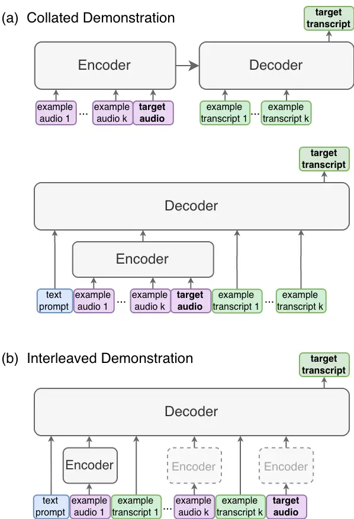
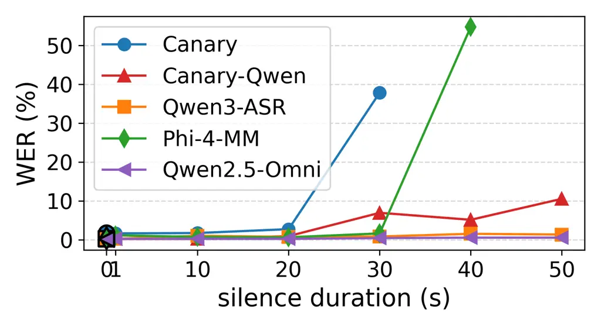
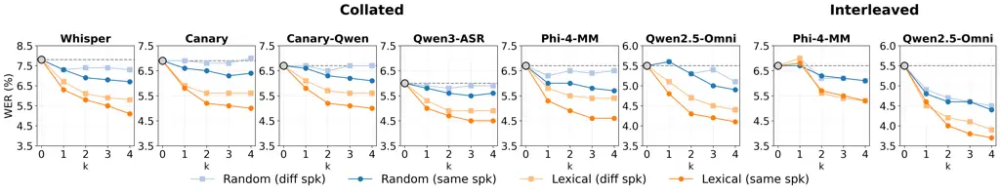
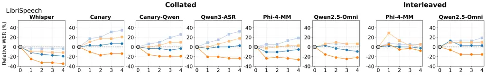
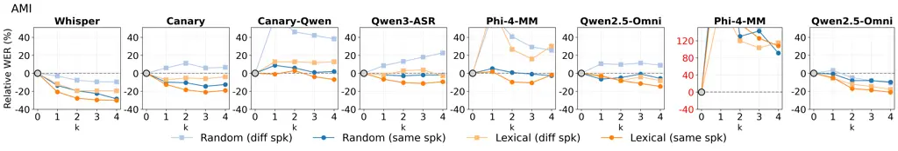

# In-Context Adaptation of Encoder-Decoder Models in Speech Recognition

Yen Meng   Sharon Goldwater   Hao Tang Affiliation: The Centre for
Speech Technology Research, University of Edinburgh, United Kingdom  
yen.meng@ed.ac.uk, sgwater@inf.ed.ac.uk, hao.tang@ed.ac.uk Affiliation: 

###### Abstract

In-context learning offers an appealing approach to adapt automatic
speech recognition (ASR) models to new speakers, accents, and domains by
providing speech-text pairs as demonstrations at inference time. Recent
work shows that some LLM-based speech models are capable of ASR
in-context adaptation, when providing interleaved speech-text
demonstrations. In this work, we ask whether in-context adaptation is an
inherent ability for all encoder-decoder models. We study two forms of
demonstration, collated and interleaved demonstration, across six
encoder-decoder models, spanning conventional cross-attention-based and
LLM-based architectures. We find that all tested models are able to
perform in-context adaptation out of the box, achieving up to 30%
relative improvement in the oracle experiments and up to 23% using
first-pass hypotheses. Through controlled experiments on three English
datasets, we show that lexical and speaker information both contribute
to successful adaptation. While interleaved demonstration is effective
in certain cases, collated demonstration brings consistent adaptation
across the board. Our results suggest that in-context adaptation for ASR
is not unique to specific architectures, training, or demonstration
approaches.

###### Index Terms: 

in-context learning, automatic speech recognition, speech LLM, attention
encoder-decoder

## I Introduction

In-context learning (ICL) is the ability to learn new tasks not
explicitly seen during training, typically through a few demonstrations
(i.e., example-label pairs) provided at inference time. ICL emerged as a
special capability in large language models (LLMs) \[1, 2\], and has
since been studied in various speech tasks, such as speech emotion
recognition \[3, 4, 5\], speech translation \[6, 7, 8\], and
text-to-speech systems \[9, 10\], and audio or spoken language
understanding \[11, 12, 13, 8\]. However, studies of ICL have mostly
focused on learning new tasks and overlook the potential of using ICL to
adapt to different domains. If models are capable of learning new tasks
at inference time, they should also be able to adapt themselves to
unseen domains for the tasks seen during training.

In this work, we study ICL for adaptation, or in-context adaptation for
short. A model that is able to use the demonstrations provided at
inference time to improve performance is said to be capable of
in-context adaptation. A model capable of in-context adaptation can, for
example, adapt itself to a new accent given the examples of that accent
in the demonstrations (accent adaptation) or adapt its output preference
given the words in the demonstrations (contextual biasing). We focus on
automatic speech recognition (ASR), as it is a fertile ground for
adapting models to new speakers, accents, dialects, and domains. In this
work, we restrict our empirical study to English ASR, enabling
controlled comparison across models and datasets. Several prior studies
have approached ASR adaptation with ICL \[14, 15, 16, 17, 18, 19, 20,
21\]. However, prior studies are often limited to a specific model, such
as Whisper \[14, 15, 17\] and Phi-4-multimodal-instruct \[19, 21, 22\],
or suggest that ICL capability is elicited or reinforced through
training \[17, 23, 18\]. Other studies focus solely on finding
demonstrations that improve performance \[15, 24, 20, 22\] but fail to
address what exact properties in demonstrations are the most useful for
adaptation.

In this work, we study whether modern ASR models can perform in-context
adaptation and what properties of demonstrations impact the adaptation
the most. Contrary to common belief, demonstrations in ICL for ASR do
not necessarily need to be interleaved speech and text. We study two
demonstration approaches, interleaved demonstration (where a transcript
is provided immediately after each of several speech examples) and
collated demonstration (where all speech examples are provided, followed
by all transcripts). We evaluate a diverse set of encoder-decoder models
with different architectures and training recipes, including
Whisper-large-v2 (Whisper) \[25\], Canary-1B (Canary) \[26\],
Canary-Qwen-2.5B (Canary-Qwen) \[27\], Qwen3-ASR-1.7B
(Qwen3-ASR) \[28\], Phi-4-multimodal-instruct (Phi-4-MM) \[29\], and
Qwen2.5-Omni-7B (Qwen2.5-Omni) \[30\]. We find that all of them are able
to perform in-context adaptation _out of the box_, i.e., without any
additional training. All models are able to adapt with collated
demonstration, whereas adapting with interleaved demonstration is only
possible for those that inherit ICL from large language models (LLMs).

We expect the adaptation performance to depend heavily on the
demonstrations. To understand what contributes to the adaptation, we
study in-context adaptation on L2-Arctic, conducting oracle experiments
and controlling the speaker, lexical content, and phonetic content in
the demonstrations. We find that sharing both lexical similarity and
speaker identity leads to the most performance gains, ranging from 25%
to 30% WER reduction across models with collated demonstration. To
evaluate in-context adaptation across domains, we extend our analysis to
read speech that is less clean (LibriSpeech _test-other_) and
spontaneous speech (AMI). Demonstrations sharing similar lexical content
still consistently lead to performance gains, though the limitation of
in-context adaptation becomes more obvious.

Finally, to confirm our findings, we relax the oracle experiments by
using first-pass hypotheses. The sizable improvements are still present
when using first-pass hypotheses, closing up to 60% of the gap against
the oracle.

## II Collated and Interleaved Demonstration



Fig. 1: Two demonstration approaches for in-context adaptation of
encoder-decoder models: (a) _Collated demonstration_ for AED models
(top) and for decoder-only/LLM-based models (bottom) and (b)
_Interleaved demonstration_ for LLM-based models.

When studying in-context adaptation in ASR, we focus on encoder-decoder
models, including models with cross attention (sometimes known as
attention-based encoder-decoder models, or AED \[31, 32, 25\]), and
those without (sometimes known as decoder-only models \[33, 34\]).
Recent LLM-based ASR models are of the second kind \[18, 28\] and still
require speech encoders.

As the name suggests, an encoder-decoder model has an encoder (Enc) and
decoder (Dec), and ASR is done by the generic equation

```math
\displaystyle y=\text{Dec}(\text{Enc}(x)) \tag{1}
```

where $`y`$ is the output transcript when the model receives the audio
$`x`$ as input.

The input to the decoder is usually more than just the encoded speech
$`\text{Enc}(x)`$, and the additional input is the context that the
decoder might adapt to when predicting $`y`$. Formally, when using $`x`$
to predict $`y`$, the decoder has access to additional $`k`$ example
recordings $`x_{1},x_{2},\dots,x_{k}`$ and their respective example
transcripts $`y_{1},y_{2},\dots,y_{k}`$. We refer to $`x`$ and $`y`$ as
the target speech and transcript, and the pairs
$`(x_{1},y_{1}),\dots,(x_{k},y_{k})`$ as demonstrations. It is common,
especially in text applications, to interleave example-label pairs as
demonstrations, but, as we show next, there are potentially better and
more natural alternatives.

### II-A Collated demonstration

Since an encoder-decoder model transcribes speech in sequence, a simple
approach to providing demonstrations is, in fact, to present all the
example recordings $`x_{1},\dots,x_{k},x`$ first followed by all the
example transcripts $`y_{1},\dots,y_{k}`$ and let the model complete the
prediction $`y`$. Formally, given the $`k`$ demonstration pairs
$`(x_{1},y_{1}),\dots,(x_{k},y_{k})`$, decoding with collated
demonstration for AED models is defined as

```math
\displaystyle y=\text{Dec}(\text{Enc}([x_{1};\ldots;x_{k};x]),[y_{1};\ldots;y_{k}]), \tag{2}
```

where brackets (\[\]) and semicolons (;) are used for concatenating
vectors. Fig. 1(a) (top) shows how collated demonstration is done for
AED models. The hope is that the additional transcripts
$`y_{1},\dots,y_{k}`$ condition the decoder (to attend to
$`x_{1},\dots,x_{k}`$ using attention) when producing $`y`$.

Collated demonstration can be done similarly for decoder-only
architectures (such as the LLM-based ones) using the equation

```math
\displaystyle y=\text{Dec}\Big(\Big[\text{Enc}([x_{1};\ldots;x_{k};x]);y_{1};\ldots;y_{k}\Big]\Big). \tag{3}
```

The only difference lies in the final concatenation. Additional text
prompts are sometimes necessary for LLM-based models. Fig. 1(a) (bottom)
shows how collated demonstration is done for decoder-only architectures.

In this approach, the decoder sees one long recording that is partially
transcribed, and is asked to complete the transcription. In other words,
this approach is a form of continued decoding or prefix decoding, and is
applicable to _any_ encoder-decoder models. Collated demonstration has
been explored mostly with Whisper \[14, 15, 17, 24\]. Pan et al. \[23\]
is the closest to applying collated demonstration to an LLM-based ASR
model, albeit with additional instruction fine-tuning. Some work in
text-to-speech apply a similar collated demonstration form for the
synthesis to follow the speaker style, prosody, accent, etc., \[35, 36,
37\], where they often frame it as in-context learning or conditioning.

### II-B Interleaved demonstration

Many recent encoder-decoder ASR models are based on LLMs, and part of
the reason to build ASR models with LLMs is to inherit their ICL
ability. Text-based ICL typically interleaves example-label pairs when
constructing demonstrations, and the hope is that LLM-based ASR models
can adapt themselves when receiving speech-transcript pairs as context.
Formally, given $`k`$ demonstrations
$`(x_{1},y_{1}),\dots,(x_{k},y_{k})`$, decoding with interleaved
demonstration is defined as

```math
\displaystyle y=\text{Dec}([\text{Enc}(x_{1});y_{1};\ldots;\text{Enc}(x_{k});y_{k};\text{Enc}(x)]). \tag{4}
```

Additional text prompts are almost always needed to instruct the decoder
if the model is not trained explicitly on the exact interleaved input of
the same task. Fig. 1(b) shows how interleaved demonstration is done for
LLM-based ASR models. Models other than those based on LLMs are not
intended to be used this way, unless the models are explicitly trained
to do so.

Interleaved demonstration has been studied in LLM-based ASR models \[19,
20, 21, 18\]. While effective in certain models \[29, 18\], interleaved
demonstration heavily depends on how models are trained and how the text
prompts are constructed.

## III Experimental Setup

We expect the adaptation performance to heavily depend on the relevance
between the demonstrations and the speech to be transcribed, and we need
settings suitable for controlling phonetic, lexical, and speaker
identity. We sample six models and construct controlled demonstration
settings on three data sets, with the goal of answering 1) whether the
selected models can perform in-context adaptation and 2) what properties
of the demonstrations impact adaptation the most.

Results are based on word error rates (WER). We follow the Open ASR
Leaderboard \[38\] and use the Whisper normalizer \[25\] to normalize
hypotheses and references to ensure consistent evaluation. Preliminary
experiments show that collated demonstration can be quite sensitive to
the text format or the selected examples, so to stabilize the
generation, we suppress the EOS token for the first decoding step for
all models to ensure the model produces at least one output token for
the target audio.

### III-A Models and Data

We sample six open-sourced models, mainly from the Open ASR Leaderboard,
covering attention-based encoder-decoder models (AED) and decoder-only
LLM-based models. For LLM-based models, some are omni models that
preserve LLM capabilities and can process text, image, and audio, while
others behave strictly as an ASR model. Table I summarizes the selected
models, their architecture, and whether the model is designed for taking
interleaved speech and text. Even though Canary-Qwen and Qwen3-ASR use
an LLM, they are not intended to be used for ICL. Phi-4-MM and
Qwen2.5-Omni are potentially designed with ICL in mind, since they are
exposed to interleaving modality during training and preserve LLM
capabilities with speech input.

| Model               | Architecture         | ICL          |
| ------------------- | -------------------- | ------------ |
| Whisper \[25\]      | AED                  | not intended |
| Canary \[26\]       | AED                  | not intended |
| Canary-Qwen \[27\]  | LLM-based (ASR-only) | not intended |
| Qwen3-ASR \[28\]    | LLM-based (ASR-only) | not intended |
| Phi-4-MM \[29\]     | LLM-based (Omni)     | intended     |
| Qwen2.5-Omni \[30\] | LLM-based (Omni)     | intended     |

TABLE I: A summary of the selected ASR models. Models that are exposed
to interleaved input modality during training are marked as intended for
ICL.

To control the properties of demonstrations, we evaluate in-context
adaptation on L2-Arctic \[39\], LibriSpeech \[40\], and AMI \[41, 42\].
L2-Arctic is a data set consisting of read speech from non-native
English speakers. L2-Arctic is ideal for our purpose because the
sentences are phonetically balanced and the same set of sentences are
read by multiple speakers. L2-Arctic has been recently used to study
in-context adaptation to speaker, accent, and lexical content \[19,
20\]. LibriSpeech is commonly used in ASR, but more importantly, it is
useful for studying contextual biasing \[43, 44, 45\] and in our case,
for controlling demonstrations of lexical similarities. AMI consists of
spontaneous speech in meetings and is used to test the generalization
beyond read speech.

### III-B Demonstration settings

To study what properties of demonstrations impact the adaptation the
most, we consider eight demonstration settings, exploring phonetic,
lexical, and speaker similarity. We consider two extreme settings, one
with demonstrations randomly sampled from a data set (labeled as Random)
and one with the demonstration containing the same ground truth
transcript as the target (labeled as Gold text). We consider two other
settings based on phonetic and lexical similarity (labeled as Phonetic
and Lexical respectively). Given an utterance to be decoded, other
utterances in the data set are first ranked based on either phonetic
similarity or lexical similarity to the current utterance. The first few
that are ranked top are used as demonstrations. More formally, given the
target speech $`x`$ and its transcript $`y`$, the $`k`$ demonstrations
are collected from a data set $`S`$ using

```math
\displaystyle(x_{1},y_{1}),\dots,(x_{k},y_{k})=\mathop{\text{top-$k$}}_{(x^{\prime},y^{\prime})\in S}\text{sim}((x,y),(x^{\prime},y^{\prime})), \tag{5}
```

where $`\text{sim}(\cdot,\cdot)`$ is a similarity function. Note that
$`y`$ does not need to be the ground truth transcript of the target
speech $`x`$ and can be the first-pass transcription of an ASR system,
whereas the utterances in the data set $`S`$ always have the ground
truth transcript. For simplicity, phonetic similarity is computed based
on term frequency-inverse document frequency (TF-IDF) of phone trigrams,
and lexical similarity is based on TF-IDF of words excluding stopwords.
Designing retrieval methods to select useful demonstrations is an active
research area \[20, 15, 24\], though our choice works sufficiently well
as we will see in the experiments. The demonstrations presented to a
model are ordered by similarity, with the most similar ordered last,
i.e., closest to the utterance to be decoded. All settings are then
doubled by controlling whether the demonstrations come from the same
speaker or not. Except in the Gold text setting, we ensure that the same
text as the target is never included in the demonstrations. For the Gold
text setting with the same speaker, the demonstration is the target
speech and its ground truth transcript.

Even though the Phonetic and Lexical settings require access to the
ground truth transcript of the target utterance, we will relax this
assumption and experiment in the same setting with first-pass
transcripts to select the demonstrations. We emphasize the importance of
these oracle experiments as they answer whether a model is capable of
in-context adaptation and to what extent the properties of
demonstrations impact the adaptation. The oracle results are also
largely missing in prior work.

## IV Results

To see whether the selected models can perform in-context adaptation, we
first test the corner cases, providing random demonstrations or gold
demonstrations. We will then present a comprehensive comparison
including the phonetic and lexical settings, and study generalization of
in-context adaptation to other data sets.

### IV-A In-context adaptation in corner cases

|              | $`\emptyset`$ | Random | Gold text |
| ------------ | ------------- | ------ | --------- |
| Whisper      | 7.8           | 7.3    | 0.6       |
| Canary       | 6.8           | 6.7    | 2.2       |
| Canary-Qwen  | 6.7           | 6.6    | 0.2       |
| Qwen3-ASR    | 6.0           | 5.9    | 0.1       |
| Phi-4-MM     | 6.7           | 6.7    | 0.3       |
| Qwen2.5-Omni | 5.5           | 5.6    | 0.1       |

TABLE II: WERs of in-context adaptation in corner cases on L2-Arctic.
The symbol $`\emptyset`$ denotes the baseline without demonstrations.
The Random setting includes a single random demonstration from a
different speaker, and the Gold text setting includes the target speech
and its ground truth transcript as the demonstration.



Fig. 2: WERs when separating the demonstration and the target speech
with silence in the Gold text setting on L2-Arctic. The results show the
potential limit of a model’s ability to handle long-form audio.

There are two corner cases tested here: 1) whether models can ignore
irrelevant demonstrations and 2) whether models can copy the ground
truth when they are given. For the first case, one irrelevant
demonstration is selected randomly from other speakers, and for the
second, we provide the identical recording and its ground truth as
demonstration. These two corner cases serve as sanity checks that the
models need to pass if we want to claim that they can perform in-context
adaptation. We limit ourselves to collated demonstration here because,
as we have argued, it is trivially applicable to all models.

Table II shows the results of the two corner cases, and we see that all
models pass the test. The results with random demonstrations are close
to the results without demonstrations. All models achieve near-perfect
WERs when providing the ground truth. Together, all models are capable
of in-context adaptation in these two corner cases.

In addition, we insert an arbitrarily long silence between the
demonstration and the speech to be decoded. A model that is capable of
in-context adaptation should be able to ignore the silence. However, it
is well known that encoder-decoder models suffer when the input audio is
too long, beyond the typical length seen during training \[31, 46, 47\].
Fig. 2 shows how models cope with the inserted silence, and we indeed
see that Canary and Phi-4-MM (and perhaps Canary-Qwen to a certain
degree) can only perform in-context adaptation within a certain context
length. For the rest of the experiments, we respect this limit and fit
as many demonstrations as possible without breaking the models.¹¹ 1 In
the case of L2-Arctic, 30 seconds are sufficient to fit 4
demonstrations.

### IV-B Impact of different demonstration settings

Fig. 3: WERs of in-context adaptation on L2-Arctic for different
demonstration settings. We use 4 demonstrations for all settings except
the Gold text, which only has 1 demonstration.



Fig. 4: The _absolute_ WER on L2-Arctic under the Random and Lexical
settings as we increase the number of demonstrations from 1 to 4.

To quantify how different sources of information in speech contribute to
adaptation, we compare demonstrations selected based on phonetic and
lexical similarities, in addition to the two corner cases. We also
extend the number of demonstrations up to four. After controlling the
speakers, we have a total of eight demonstration settings.

Fig. 3 shows how much models are able to adapt based on four
demonstrations of different types. First, except Random with different
speakers, all demonstration settings lead to improved WERs. In
particular, all models have no trouble getting near-perfect WERs with
the Gold text demonstrations. While Gold text is not realistic, it does
show the importance of speakers in the demonstrations. The Gold text
WERs are slightly higher when the speakers are different from the target
speech.

We then look at demonstration settings that do not contain duplicate
text to the target transcript. Selecting random utterances from the same
speaker achieves a small but consistent gain. Demonstrations selected
based on phonetic and lexical similarity (especially from the same
speaker) lead to the most improvement, with lexical similarity slightly
better. This trend holds across all models.

Notably, the smaller AED models, Whisper and Canary-1B, achieve similar
relative WER reduction to larger models equipped with pretrained LLM
decoders. This suggests that the adaptation capability does not
inherently depend on the use of a pre-trained LLM.

The amount of adaptation for different numbers of demonstrations is
shown in Fig. 4. We only contrast the Random and the Lexical setting for
clarity. Overall, from one to four examples, the more demonstrations we
provide, the lower the WER. The first two demonstrations bring the most
improvement, and adding more demonstrations diminishes the return.

### IV-C Comparing collated and interleaved demonstration

Comparing Phi-4-MM and Qwen2.5-Omni in Fig. 3 and Fig. 5, we see that
both models are able to adapt based on collated and interleaved
demonstration. For interleaved demonstration, we follow the exact same
instruction prompt in Roll et al. \[19\] for both Phi-4-MM and
Qwen2.5-Omni. Note that prompt engineering is required for interleaved
demonstration for both models. Without this instruction prompt, we
observe much weaker adaptation, especially if only a single example is
provided.

Even though Canary-Qwen and Qwen3-ASR are based on LLMs, they are not
intended to take interleaved input and we also do not observe any
adaptation effect when providing interleaved demonstrations for these
two models. A key advantage of collated demonstration is that it is
applicable to all models, requires no modification to the text
instruction and task prompt, and works out of the box.





Fig. 5: Relative WER reduction of in-context adaptation against no
adaptation on LibriSpeech test-other (top) and AMI test split from Open
ASR Leaderboard (bottom). We use relative reduction because the WERs
span a larger dynamic range across models compared to L2-Arctic.

### IV-D In-context adaptation on different domains

We extend our analysis to LibriSpeech (test-other) and AMI. We again
contrast Random and Lexical for clarity. The top row of Fig. 5 shows the
results on LibriSpeech test-other. We see that the overall improvement
is smaller on these two data sets compared to L2-Arctic. In particular,
providing utterances just from the same speaker is overall less
effective. Using lexically similar utterances from the same speaker
continues to be the best strategy, achieving at least 20% relative WER
reduction with collated demonstration.

Results on AMI are shown in the bottom row of Fig. 5. Since AMI is the
more challenging data set consisting of spontaneous speech, the
adaptation is again less effective. In fact, Phi-4-MM completely fails
under interleaved demonstration, where we found the WER collapses due to
severe copying from the demonstration transcripts, though Qwen2.5-Omni
adapts just fine. The conclusion is largely the same as in LibriSpeech,
lexically similar demonstrations from the same speaker achieve the most
improvement.

Interestingly, while LLM-based models show marginal gains under the
Lexical setting, Whisper shows the largest gains, almost closing the WER
gap to the LLM-based ASR models. This again suggests that the
effectiveness of in-context adaptation does not necessarily require the
use of an LLM.

## V Second-pass in-context adaptation

Our oracle results, though promising, assume access to the ground truth
transcript of the target speech. To evaluate the gains in practical
scenarios, we relax the assumption and use first-pass transcriptions to
find demonstrations of the same speaker and of high lexical similarity.
For simplicity, we use the same TF-IDF in the Lexical setting in §III-B.
We decide to measure similarity using ASR transcripts but still use gold
transcriptions in demonstrations. Formally, assuming that we have a data
set $`S`$ with gold transcriptions, we construct the demonstrations with

```math
\displaystyle(x_{1},y_{1}),\dots,(x_{k},y_{k})=\mathop{\text{top-$k$}}_{(x^{\prime},y^{\prime})\in S}\text{TF-IDF}(T(x),T(x^{\prime})), \tag{6}
```

where $`T`$ is an ASR system and $`T(x)`$ is the first-pass transcript
of the target speech $`x`$. Note that the ground truth transcript of the
example $`y^{\prime}`$ is _not_ used in computing TF-IDF.

Results with this _second-pass_ in-context adaptation on L2-Arctic are
shown in Table III. We see a further 3% to 12% relative WER reduction
over the Random setting, corresponding to closing 25% to 60% of the gaps
against the oracle. The second-pass approach is similar to those based
on retrieval \[20, 15, 24\]. While the retrieval approaches are
complementary to ours, a simple second pass already brings a significant
improvement.

|                           |               |        |            |        |
| ------------------------- | ------------- | ------ | ---------- | ------ |
| Model                     | $`\emptyset`$ | Random | Lexical    |        |
|                           |               |        | first pass | oracle |
| Collated demonstration    |               |        |            |        |
| Whisper                   | 7.8           | 6.7    | 6.0        | 5.1    |
| Canary                    | 6.8           | 6.1    | 5.5        | 5.0    |
| Canary-Qwen               | 6.7           | 6.2    | 5.5        | 5.0    |
| Qwen3-ASR                 | 6.0           | 5.6    | 5.0        | 4.5    |
| Phi-4-MM                  | 6.7           | 5.7    | 5.4        | 4.6    |
| Qwen2.5-Omni              | 5.5           | 5.1    | 4.5        | 4.1    |
| Interleaved demonstration |               |        |            |        |
| Phi-4-MM                  | 6.7           | 6.1    | 5.9        | 5.3    |
| Qwen2.5-Omni              | 5.5           | 4.4    | 4.2        | 3.7    |

TABLE III: WERs of second-pass in-context adaptation on L2-Arctic in the
Random and Lexical settings using 4 demonstrations from the _same_
speakers. The _first pass_ column uses the first-pass transcription for
selecting demonstrations, whereas the _oracle_ column selects
demonstrations with the ground truth transcripts.

## VI Discussion

Though both collated and interleaved demonstration can achieve
in-context adaptation, their underlying mechanism might be different.
Collated demonstration operates as one ASR task, while interleaved
demonstration requires additional understanding of text instructions and
the interleaving format. This fact makes collated demonstration widely
applicable to any encoder-decoder ASR system, and makes interleaved
demonstration sensitive to exact wording of the text prompts. Partly
because of this, the performance of interleaved demonstration varies a
lot more across data sets compared to that of collated demonstration.

Both demonstration approaches, however, are limited by the context
length of the model. It is well known that ASR systems suffer from
long-form audio or the audio length beyond training \[31, 46, 47\]. The
problem is partially addressed by the use of an LLM, as long-context
modeling \[48, 29\] are now an integrated part of training LLMs. The
gains of using more demonstrations do diminish in our experiments, so
this limitation might not be as significant.

## VII Conclusion

In this work, we study in-context adaptation in ASR with two approaches,
collated and interleaved demonstration. We show that, without any
training, in-context adaptation achieves significant gains across a
diverse set of models and settings.

The oracle experiments not only establish the fact that all models
tested are capable of in-context adaptation but also show the limit of
what in-context adaptation can achieve. Notably, smaller AED models
adapt as effectively as larger LLM-based models, suggesting that
in-context adaptation in ASR does not inherently depend on an LLM
decoder.

Between the two demonstration approaches, collated demonstration is
trivially applicable to any encoder-decoder ASR system, while
interleaved demonstration is only applicable to certain models,
requiring specific text prompts.

We also show that our approaches are practical, relaxing the oracle
results with first-pass hypotheses while maintaining a large proportion
of the improvements. Future work includes a deeper understanding of the
mechanism behind in-context adaptation, designing experiments to
disentangle the contribution of text and audio, developing retrieval
approaches for finding better demonstrations, and extending to other
settings, such as noise robustness and low-resource ASR.

## VIII Generative AI Use Disclosure

Generative AI tools (Claude) were only used for language and grammar
polishing of the manuscript. All technical content, experimental design,
and results were produced by the authors.

## References

- \[1\] Q. Dong, L. Li, D. Dai, C. Zheng, J. Ma, R. Li, H. Xia, J.
  Xu, Z. Wu, B. Chang, et al. (2024) A survey on in-context learning. In
  EMNLP, Cited by: §I.
- \[2\] S. Min, X. Lyu, A. Holtzman, M. Artetxe, M. Lewis, H.
  Hajishirzi, and L. Zettlemoyer (2022) Rethinking the role of
  demonstrations: what makes in-context learning work?. In EMNLP, Cited
  by: §I.
- \[3\] K. Chang, M. Hsu, S. Li, and H. Lee (2024) Exploring in-context
  learning of textless speech language model for speech classification
  tasks. In Interspeech, Cited by: §I.
- \[4\] J. H. Wong, M. Huzaifah, N. F. Chen, and A. T. Aw (2025) Speech
  in-context learning of paralinguistic tasks. In ASRU, Cited by: §I.
- \[5\] M. Ihori, T. Yamane, N. Kawata, N. Makishima, T. Tanaka, S.
  Suzuki, S. Orihashi, and R. Masumura (2025) Few-shot personalization
  via in-context learning for speech emotion recognition based on
  speech-language model. In ASRU, Cited by: §I.
- \[6\] Z. Chen, H. Huang, A. Andrusenko, O. Hrinchuk, K. C. Puvvada, J.
  Li, S. Ghosh, J. Balam, and B. Ginsburg (2024) SALM: speech-augmented
  language model with in-context learning for speech recognition and
  translation. In ICASSP, Cited by: §I.
- \[7\] I. Tsiamas, M. Sperber, A. Finch, and S. Garg (2024) Speech is
  more than words: do speech-to-text translation systems leverage
  prosody?. In Conference on Machine Translation, Cited by: §I.
- \[8\] D. Zhang, G. Wang, J. Xue, K. Fang, L. Zhao, R. Ma, S. Ren, S.
  Liu, T. Guo, W. Zhuang, et al. (2025) MiMo-audio: audio language
  models are few-shot learners. arXiv preprint arXiv:2512.23808. Cited
  by: §I.
- \[9\] T. A. Nguyen, B. Muller, B. Yu, M. R. Costa-Jussa, M.
  Elbayad, S. Popuri, C. Ropers, P. Duquenne, R. Algayres, R. Mavlyutov,
  et al. (2025) Spirit-LM: interleaved spoken and written language
  model. Transactions of ACL. Cited by: §I.
- \[10\] C. Pouw, H. Mohebbi, A. Alishahi, and W. Zuidema (2026)
  In-context learning in speech language models: analyzing the role of
  acoustic features, linguistic structure, and induction heads. arXiv
  preprint arXiv:2604.06356. Cited by: §I.
- \[11\] Z. Kong, A. Goel, R. Badlani, W. Ping, R. Valle, and B.
  Catanzaro (2024) Audio Flamingo: a novel audio language model with
  few-shot learning and dialogue abilities. In ICML, Cited by: §I.
- \[12\] Y. Piao, J. C. Liao, W. Chien, T. Ogimoto, S. Chen, Y. Chen, C.
  Lee, and S. Lo (2026) ALICE: a multifaceted evaluation framework of
  large audio-language models’ in-context learning ability. arXiv
  preprint arXiv:2603.20433. Cited by: §I.
- \[13\] N. Agrawal and S. Ganapathy (2025) Spoken language
  understanding on unseen tasks with in-context learning. In
  Interspeech, Cited by: §I.
- \[14\] S. Wang, C. Yang, J. Wu, and C. Zhang (2024) Can Whisper
  perform speech-based in-context learning?. In ICASSP, Cited by: §I,
  §II-A.
- \[15\] J. Zhou, S. Zhao, J. He, H. Wang, W. Zeng, Y. Chen, H. Sun, A.
  Kong, and Y. Qin (2025) M2R-Whisper: multi-stage and multi-scale
  retrieval augmentation for enhancing Whisper. In ICASSP, Cited by: §I,
  §II-A, §III-B, §V.
- \[16\] J. Cheng and S. Nguyen (2025) Speech few-shot learning for
  language learners’ speech recognition. In ICASSP, Cited by: §I.
- \[17\] M. Hsu and H. Lee (2025) SMILE: speech meta in-context learning
  for low-resource language automatic speech recognition. In ASRU, Cited
  by: §I, §II-A.
- \[18\] Omnilingual ASR team, G. Keren, A. Kozhevnikov, Y. Meng, C.
  Ropers, M. Setzler, S. Wang, I. Adebara, M. Auli, C. Balioglu, K.
  Chan, C. Cheng, J. Chuang, C. Droof, M. Duppenthaler, P. Duquenne, A.
  Erben, C. Gao, G. M. Gonzalez, K. Lyu, S. Miglani, V. Pratap, K. R.
  Sadagopan, S. Saleem, A. Turkatenko, A. Ventayol-Boada, Z. Yong, Y.
  Chung, J. Maillard, R. Moritz, A. Mourachko, M. Williamson, and S.
  Yates (2025) Omnilingual ASR: open-source multilingual speech
  recognition for 1600+ languages. External Links:
  [Link](https://arxiv.org/abs/2511.09690) Cited by: §I, §II-B, §II.
- \[19\] N. Roll, C. Graham, Y. Tatsumi, K. T. Nguyen, M. Sumner, and D.
  Jurafsky (2025) In-context learning boosts speech recognition via
  human-like adaptation to speakers and language varieties. In EMNLP,
  Cited by: §I, §II-B, §III-A, §IV-C.
- \[20\] H. Zheng, Y. Yegorova, and M. Hasegawa-Johnson (2025) TICL:
  text-embedding KNN for speech in-context learning unlocks speech
  recognition abilities of large multimodal models. In ICASSP, Cited by:
  §I, §II-B, §III-A, §III-B, §V.
- \[21\] Z. Li and J. Niehues (2026) Multimodal in-context learning for
  ASR of low-resource languages. In Findings of the ACL, Cited by: §I,
  §II-B.
- \[22\] H. Zheng, Y. Yegorova, and M. Hasegawa-Johnson (2025) TICL+: a
  case study on speech in-context learning for children’s speech
  recognition. In ASRU Satellite Workshop—AI for Children’s Speech and
  Language, Cited by: §I.
- \[23\] J. Pan, J. Wu, Y. Gaur, S. Sivasankaran, Z. Chen, S. Liu,
  and J. Li (2024) COSMIC: data efficient instruction-tuning for speech
  in-context learning. In Interspeech, Cited by: §I, §II-A.
- \[24\] S. Wang, C. H. Yang, J. Wu, and C. Zhang (2024) Bayesian
  example selection improves in-context learning for speech, text and
  visual modalities. In EMNLP, Cited by: §I, §II-A, §III-B, §V.
- \[25\] A. Radford, J. W. Kim, T. Xu, G. Brockman, C. McLeavey, and I.
  Sutskever (2023) Robust speech recognition via large-scale weak
  supervision. In ICML, Cited by: §I, §II, TABLE I, §III.
- \[26\] K. C. Puvvada, P. Żelasko, H. Huang, O. Hrinchuk, N. R.
  Koluguri, K. Dhawan, S. Majumdar, E. Rastorgueva, Z. Chen, V.
  Lavrukhin, et al. (2024) Less is more: accurate speech recognition &
  translation without web-scale data. In Interspeech, Cited by: §I,
  TABLE I.
- \[27\] NVIDIA (2025) NVIDIA NeMo Canary-Qwen-2.5B. Note:
  https://huggingface.co/nvidia/canary-qwen-2.5bHugging Face model card.
  Accessed: 2026-06-08 Cited by: §I, TABLE I.
- \[28\] X. Shi, X. Wang, Z. Guo, Y. Wang, P. Zhang, X. Zhang, Z.
  Guo, H. Hao, Y. Xi, B. Yang, et al. (2026) Qwen3-ASR technical report.
  arXiv preprint arXiv:2601.21337. Cited by: §I, §II, TABLE I.
- \[29\] A. Abouelenin, A. Ashfaq, A. Atkinson, H. Awadalla, N. Bach, J.
  Bao, A. Benhaim, M. Cai, V. Chaudhary, C. Chen, et al. (2025)
  Phi-4-mini technical report: compact yet powerful multimodal language
  models via mixture-of-LoRAs. arXiv preprint arXiv:2503.01743. Cited
  by: §I, §II-B, TABLE I, §VI.
- \[30\] J. Xu, Z. Guo, J. He, H. Hu, T. He, S. Bai, K. Chen, J.
  Wang, Y. Fan, K. Dang, B. Zhang, X. Wang, Y. Chu, and J. Lin (2025)
  Qwen2.5-Omni technical report. arXiv preprint arXiv:2503.20215. Cited
  by: §I, TABLE I.
- \[31\] J. K. Chorowski, D. Bahdanau, D. Serdyuk, K. Cho, and Y.
  Bengio (2015) Attention-based models for speech recognition. In
  Advances in Neural Information Processing Systems, Cited by: §II,
  §IV-A, §VI.
- \[32\] W. Chan, N. Jaitly, Q. V. Le, and O. Vinyals (2016) Listen,
  attend and spell: a neural network for large vocabulary conversational
  speech recognition. In ICASSP, Cited by: §II.
- \[33\] J. Wu, Y. Gaur, Z. Chen, L. Zhou, Y. Zhu, T. Wang, J. Li, S.
  Liu, B. Ren, L. Liu, et al. (2023) On decoder-only architecture for
  speech-to-text and large language model integration. In ASRU, Cited
  by: §II.
- \[34\] E. Tsunoo, H. Futami, Y. Kashiwagi, S. Arora, and S.
  Watanabe (2023) Decoder-only architecture for speech recognition with
  CTC prompts and text data augmentation. arXiv preprint
  arXiv:2309.08876. Cited by: §II.
- \[35\] L. Meng, L. Zhou, S. Liu, S. Chen, B. Han, S. Hu, Y. Liu, J.
  Li, S. Zhao, X. Wu, et al. (2025) Autoregressive speech synthesis
  without vector quantization. In ACL, Cited by: §II-A.
- \[36\] Z. Jiang, J. Liu, Y. Ren, J. He, Z. Ye, S. Ji, Q. Yang, C.
  Zhang, P. Wei, C. Wang, X. Yin, Z. MA, and Z. Zhao (2024) Mega-TTS 2:
  boosting prompting mechanisms for zero-shot speech synthesis. In ICLR,
  Cited by: §II-A.
- \[37\] Z. Du, Y. Wang, Q. Chen, X. Shi, X. Lv, T. Zhao, Z. Gao, Y.
  Yang, C. Gao, H. Wang, et al. (2024) Cosyvoice 2: scalable streaming
  speech synthesis with large language models. arXiv preprint
  arXiv:2412.10117. Cited by: §II-A.
- \[38\] V. Srivastav, S. Zheng, E. Bezzam, E. L. Bihan, N. Koluguri, P.
  Żelasko, S. Majumdar, A. Moumen, and S. Gandhi (2025) Open ASR
  leaderboard: towards reproducible and transparent multilingual and
  long-form speech recognition evaluation. arXiv preprint
  arXiv:2510.06961. Cited by: §III.
- \[39\] G. Zhao, S. Sonsaat, A. Silpachai, I. Lucic, E.
  Chukharev-Hudilainen, J. M. Levis, and R. Gutierrez-Osuna (2018)
  L2-ARCTIC: a non-native english speech corpus. In Interspeech, Cited
  by: §III-A.
- \[40\] V. Panayotov, G. Chen, D. Povey, and S. Khudanpur (2015)
  LibriSpeech: an ASR corpus based on public domain audio books. In
  ICASSP, Cited by: §III-A.
- \[41\] J. Carletta, S. Ashby, S. Bourban, M. Flynn, M. Guillemot, T.
  Hain, J. Kadlec, V. Karaiskos, W. Kraaij, M. Kronenthal, et al. (2005)
  The AMI meeting corpus: a pre-announcement. In International Workshop
  on Machine Learning for Multimodal Interaction, Cited by: §III-A.
- \[42\] S. Renals, T. Hain, and H. Bourlard (2007) Recognition and
  understanding of meetings the AMI and AMIDA projects. In ASRU, Cited
  by: §III-A.
- \[43\] J. Tang, K. Kim, S. Shon, F. Wu, and P. Sridhar (2024)
  Improving ASR contextual biasing with guided attention. In ICASSP,
  Cited by: §III-A.
- \[44\] X. Gong, A. Lv, Z. Wang, H. Zhu, and Y. Qian (2025) BR-ASR:
  efficient and scalable bias retrieval framework for contextual biasing
  ASR in speech LLM. In Interspeech, Cited by: §III-A.
- \[45\] X. Fu, K. M. Sathyendra, A. Gandhe, J. Liu, G. P. Strimel, R.
  McGowan, and A. Mouchtaris (2023) Robust acoustic and semantic
  contextual biasing in neural transducers for speech recognition. In
  ICASSP, Cited by: §III-A.
- \[46\] C. Chiu, W. Han, Y. Zhang, R. Pang, S. Kishchenko, P.
  Nguyen, A. Narayanan, H. Liao, S. Zhang, A. Kannan, et al. (2019) A
  comparison of end-to-end models for long-form speech recognition. In
  ASRU, Cited by: §IV-A, §VI.
- \[47\] Y. Zhang, W. Han, J. Qin, Y. Wang, A. Bapna, Z. Chen, N.
  Chen, B. Li, V. Axelrod, G. Wang, et al. (2023) Google USM: scaling
  automatic speech recognition beyond 100 languages. arXiv preprint
  arXiv:2303.01037. Cited by: §IV-A, §VI.
- \[48\] A. Yang, A. Li, B. Yang, B. Zhang, B. Hui, B. Zheng, B. Yu, C.
  Gao, C. Huang, C. Lv, et al. (2025) Qwen3 technical report. arXiv
  preprint arXiv:2505.09388. Cited by: §VI.
