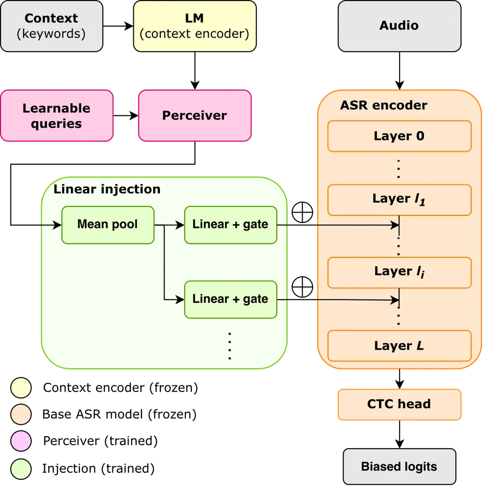
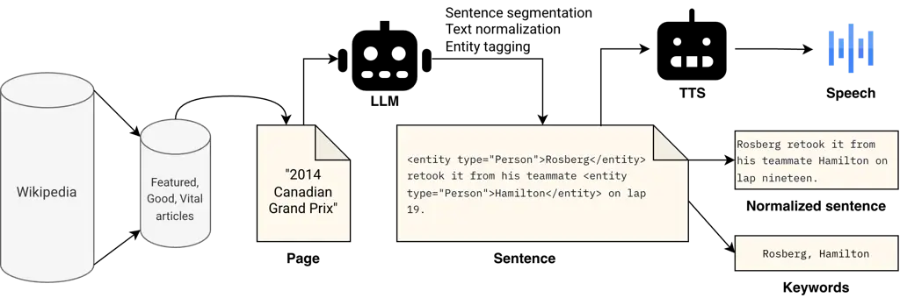

# BaLEEN: Biasing with Latent Encoded ENtities for context-aware ASR

Chihiro Taguchi^(⋆)\sthanksWork done at Sakana AI    Yotaro Kubo^(†)   
Rujikorn Charakorn^(†)

###### Abstract

Transcribing domain-specific entities and rare proper nouns remains a
major challenge in automatic speech recognition (ASR). In this paper, we
propose BaLEEN (Biasing with Latent Encoded Entities), a lightweight,
hypernetwork-based framework for dynamic contextual adaptation without
fine-tuning the underlying ASR model. BaLEEN encodes variable-length
contextual keywords using a pretrained language model, compresses them
into a fixed sequence of latent vectors via a Perceiver bottleneck, and
injects context-dependent bias vectors directly into the intermediate
encoder representations of the ASR model. Because both the language
model and the backbone ASR model remain entirely frozen during training,
BaLEEN operates as a plug-and-play adapter that incurs zero
computational overhead at inference time when context biases are
precomputed. We evaluate our method on a CTC-based ASR model using a
Wikipedia-derived corpus with annotated named entities and synthetic
speech. Experimental results demonstrate that BaLEEN reduces keyword
miss rate by 8.7% on the test set relative to the unbiased baseline
while simultaneously improving overall word error rate by 21% and
character error rate by 28%.

###### Index Terms: 

automatic speech recognition, contextual biasing, hypernetworks,
Perceiver, CTC models

^(†)^(†)address: ^(⋆) University of Notre Dame, Department of Computer
Science and Engineering, IN, USA  
^(†) Sakana AI, Tokyo, Japan

## 1 Introduction

Context-awareness in automatic speech recognition (ASR) remains a
central challenge in the field, even as ASR technology has been widely
adopted in practical applications. To achieve higher recognition
accuracy and tailored user experiences, the model must transcribe speech
by appropriately accounting for context in which they are deployed. For
example, in mobile ASR, the model should recognize proper nouns such as
the contact names stored on the device. Similarly, an ASR model for
specific business domains should accurately identify specialized
terminology and organization names. Because the spelling of these named
entities can be highly arbitrary and irregular, modern ASR architectures
require access to external contextual information for transcribing them
accurately.

Since many modern ASR models rely on attention mechanisms, several
proposed extensions inject contextual phrases directly into a
cross-attention module \[18, 10\]. Another common approach integrates an
external language model to adjust token probability distributions
\[28\]. However, both types of the extensions incur additional
computational cost and search latency at inference time, with
cross-attention scaling linearly with the number of contextual keywords.

Alternatively, fine-tuning can adapt a model to a specific target domain
if sufficient domain-specific audio–text pairs are available. For
instance, LoRA \[6\] is a widely adopted parameter-efficient method for
domain adaptation that only trains lightweight adapter matrices while
keeping the backbone model frozen. However, acquiring sufficient data
and training a dedicated model for every domain with arbitrary context
poses severe practical limitations due to high costs.

In this paper, we propose BaLEEN (Biasing with Latent Encoded Entities),
an adaptation method that relaxes training-data constraints without
modifying or updating the target ASR model’s parameters. Our approach
utilizes a hypernetwork architecture \[5\], a neural network designed to
generate parameters for another network. Specifically, we construct a
hypernetwork that converts context embeddings into layer-wise offset
parameters for the ASR model. By integrating these generated parameters
directly into hidden representations, one can obtain a task-specialized
model instantly, eliminating the need to fine-tune or retrain the
backbone ASR architecture.

To train and evaluate hypernetwork-based biasing under rich domain
diversity, we construct a synthetic dataset comprising 144k audio
samples derived from English Wikipedia articles using LLM entity
extraction and neural text-to-speech (TTS) synthesis. Using this
dataset, we train a Perceiver-based hypernetwork \[9\] to generate bias
injected to the English ParakeetCTC baseline. When contextual bias
vectors are precomputed, our method incurs virtually zero computational
overhead at inference time. Experimental results demonstrate that BaLEEN
reduces the keyword miss rate (KMR) by 14.3% relative to the unbiased
baseline while simultaneously improving overall word and character error
rates. Our code, dataset, and trained models will be made publicly
available.

## 2 Related work

Prior adaptation methods can be broadly categorized into three
paradigms: decoding-time biasing, training a separate bias encoder
module, and biasing the decoding CTC layer.

Decoding-time biasing. The earliest approaches leave the acoustic model
untouched and intervene during decoding. Shallow fusion interpolates an
external LM into the beam search score computation \[28\], and trie- or
WFST-based deep biasing restricts and reweights hypotheses using a
prefix structure built from a keyword list \[11\]. More recent work has
shifted toward training-free setups, utilizing CTC-based word spotting
to trigger boosting \[2\] or synthetic multi-pronunciation tries to bias
a frozen model zero-shot \[13\]. For autoregressive models, prompt
prefixing has also emerged as a practical decoding-time solution \[19\].

Learned bias encoders. Another line of research directly models the
interaction between acoustic features and contextual information. CLAS
introduced an attention-based bias encoder that embeds each phrase,
allowing the decoder to attend to the resulting embedding set \[18\].
The context-aware Transformer-Transducer extended this mechanism to
multi-head attention over both audio and label representations \[3\].
Contextual adapters made this framework parameter-efficient by inserting
lightweight attention modules into a frozen transducer \[21\], which was
later refined using learned gating to deactivate biasing on non-entity
frames \[1\]. However, because these approaches represent the bias list
as one embedding per phrase, the computational cost of attending to the
list scales linearly with its size, and the attention distributions
become increasingly diffuse on large lists. The neural associative
memory line makes this tension explicit, addressing it with two-pass
top-$`K`$ retrieval so that the acoustic encoder attends only to a
shortlist \[14, 15, 24, 25\].

Biasing CTC models. Because CTC decoding is non-autoregressive and
assumes frame-level conditional independence, contextual information
must be injected into the encoder representations or frame posteriors
rather than a decoder state. CPPNet fuses an attention-derived context
vector into the encoder output and adds an auxiliary contextual-phrase
prediction loss \[7\], whereas Zhang et al. \[27\] add an
attention-weighted bias score directly to the CTC linear projections in
a hybrid CTC/attention architecture. Other approaches inject contextual
supervision at intermediate encoder layers \[23, 16, 17\], apply biasing
exclusively at CTC spike frames \[8\], or expand the output vocabulary
with dedicated bias tokens \[12\].

Unlike these methods incurring additional computation to inject keyword
bias, our proposed BaLEEN uses a hypernetwork to add latent contextual
bias vectors directly into the backbone model without changing its
decoding pipeline.



Figure 1: Our proposed methods for context biasing. The linear injection
layer is instantiated for each target ASR layer.



Figure 2: Synthetic dataset construction flow.

## 3 Method

Our architecture comprises three main components: (1) a language model
(LM) for context encoding, (2) a CTC-based ASR backbone, and (3) a
bottleneck module that compresses the encoded context and injects
contextual knowledge into the ASR model. To convert a conventional ASR
model into a dynamically adaptable system, we adopt a hypernetwork
framework that computes context-dependent bias parameters for the ASR
model. Figure 1 provides a schematic overview of our method.

In this architecture, the model is designed to handle arbitrary textual
context. The LM converts the context into a sequence of representation
vectors, and the context bottleneck compresses these token-wise
representations into fixed-size semantic representations. Because
contextual inputs vary in length, we implement the bottleneck using a
Perceiver network \[9\]. The Perceiver compresses variable-length
sequence inputs into a fixed-length latent sequence via cross-attention
with learnable query vectors. While originally proposed for non-text
modality integration (e.g., vision), the Perceiver has also proven
effective for compressing text \[4\].

Formally, let $`x`$ denote the input context. We extract hidden outputs
from the $`\ell`$-th intermediate layer of the LM and project them into
$`d`$-dimensional embeddings:
$`C=\operatorname{FFN}(\operatorname{LM}^{(\ell)}(x))\in\mathbb{R}^{n\times d}`$,
where $`n`$ is the number of context tokens. Let
$`Q\in\mathbb{R}^{N\times d}`$ denote the learnable latent query
vectors, where $`N`$ and $`d`$ are the latent query length and hidden
dimension, respectively (set to $`N=16`$ and $`d=512`$ by default).¹¹ 1
For simplicity, normalization layers are omitted in equations
henceforth; see our implementation details released publicly upon
acceptance.. The sequence $`C`$ passes through a single Perceiver block
consisting of cross-attention followed by self-attention, with residual
connections around each layer:
$`M=\operatorname{Perceiver}(Q,C)\in\mathbb{R}^{N\times d}`$.

The compressed representation $`M`$ is subsequently injected into
targeted intermediate layers of the ASR encoder via linear projections.
For a selected subset of target ASR layers
$`\mathcal{L}\subseteq\{1,\dots,L\}`$ (where $`L`$ is the total number
of encoder layers), $`M`$ is mean-pooled across its sequence dimension
into a vector $`m=\pi(M)\in\mathbb{R}^{d}`$. For each target layer
$`l\in\mathcal{L}`$, $`m`$ is projected through a layer-specific weight
matrix $`W_{l}\in\mathbb{R}^{d\times d_{\text{ASR}}}`$ and bias vector
$`b_{l}\in\mathbb{R}^{d_{\text{ASR}}}`$:

```math
B_{l}=W_{l}^{\top}m+b_{l}\in\mathbb{R}^{d_{\text{ASR}}}. \tag{1}
```

The resulting contextual bias vector $`B_{l}`$ is injected into the
hidden representation matrix
$`H^{(l)}\in\mathbb{R}^{T\times d_{\text{ASR}}}`$ across all $`T`$
acoustic frames:

```math
H^{(l)}\leftarrow H^{(l)}+\gamma_{l}\bm{1}_{T}B_{l}^{\top}, \tag{2}
```

where $`\bm{1}_{T}\in\mathbb{R}^{T\times 1}`$ is a column vector of ones
and $`\gamma_{l}\in\mathbb{R}`$ is a scalar scaling parameter. At the
beginning of training, $`\gamma_{l}`$ is initialized to zero for all
$`l`$ to avoid catastrophic forgetting. Under this design, the generated
context bias is independent of the audio input and can be added to the
ASR intermediate representations in a modular, plug-and-play fashion.
The user can easily disable contextual biasing at inference time by
detaching the hypernetwork module or setting $`\gamma_{l}=0`$.

A natural question regarding uniform bias injection is whether adding a
static, time-invariant offset $`B_{l}`$ across all time frames risks
degrading non-keyword speech or triggering false positives. Our
framework is motivated by the hypothesis that the internal
self-attention and non-linear projections of the backbone ASR encoder
serve as dynamic temporal filters. While $`B_{l}`$ remains constant over
time, local acoustic representations vary. When acoustic evidence
phonetically aligns with a target entity, self-attention and
feed-forward projections amplify the context-biased manifold.
Conversely, on frames lacking relevant acoustic support, non-linear
activations suppress $`B_{l}`$, mapping hidden states back toward
standard subword or CTC blank ($`\epsilon`$) posterior distributions. By
distributing this static injection across all encoder layers, the
network achieves progressive, multi-stage contextual steering without
requiring frame-wise cross-attention or on-the-fly context encoding at
inference time.

The model is trained by minimizing the standard CTC loss. Throughout
training, the parameters of both the context encoder LM and the backbone
ASR model remain frozen, and only the parameters of the auxiliary
context bottleneck and projection layers are updated. At inference time,
when the context set is fixed, the bias term
$`\gamma_{l}\bm{1}_{T}B_{l}^{\top}`$ can be precomputed once. As a
result, the bias acts as a set of static offset parameters, avoiding any
recomputation through the LM or bottleneck module and incurring
virtually zero runtime overhead.

## 4 Dataset

Training the context bottleneck requires triplet data consisting of
(audio, transcription, keyword list) across a sufficiently diverse
sample space to achieve robust generalized context adaptation. To
address this, we construct a synthetic dataset comprising 144k audio
samples derived from 993 English Wikipedia articles using LLM-powered
entity tagging and text-to-speech (TTS) synthesis. Figure 2 illustrates
the dataset generation pipeline to obtain the triplet data.

We leverage Wikipedia to construct a corpus spanning diverse domains
with high keyword density and high-quality text. First, we extract the
Featured Articles²² 2
[https://en.wikipedia.org/wiki/Wikipedia:Featured_articles](https://en.wikipedia.org/wiki/Wikipedia:Featured_articles),
Good Articles³³ 3
[https://en.wikipedia.org/wiki/Wikipedia:Good_articles](https://en.wikipedia.org/wiki/Wikipedia:Good_articles),
and Vital Articles⁴⁴ 4
[https://en.wikipedia.org/wiki/Wikipedia:Vital_articles](https://en.wikipedia.org/wiki/Wikipedia:Vital_articles),
curated by Wikipedia editors based on completeness, neutrality, and
prose depth, using the Wikipedia-API Python library⁵⁵ 5
[https://pypi.org/project/Wikipedia-API](https://pypi.org/project/Wikipedia-API).
We then filter out disambiguation pages and articles shorter than 3,000
characters. Next, each remaining article is segmented into sentences and
annotated with named entity tags using GPT-5.4 Mini. Finally, each
sentence is converted to speech using Gemini 3.1 Flash TTS, where a
voice is randomly sampled from 30 prebuilt speaker profiles to ensure
acoustic and speaker diversity.

The dataset supports two keyword sampling configurations: (1) using only
the keywords that appear strictly in the spoken audio transcription, or
(2) using all keywords appearing within the source article. The latter
configuration introduces contextually relevant hard-negative distractors
alongside spoken keywords, creating a more challenging training scenario
that fosters stronger context adaptability.

We partition the dataset into 80% training, 10% validation, and 10% test
splits. Crucially, these splits have zero overlap in their source
articles (i.e., unique contexts) to prevent context leakage during
evaluation.

## 5 Experiments

To encode keywords in a spelling-aware manner, we extract hidden
representations from layer $`\ell`$ ($`\ell=7`$ by default) of ByT5
\[26\]. For the ASR backbone, we employ the CTC variant of
parakeet-tdt_ctc-110m \[20\], which consists of 17 Conformer encoder
layers followed by a CTC layer trained on English. The CTC vocabulary
comprises 1,025 case-sensitive subword tokens constructed via Byte-Pair
Encoding \[22\]. To prevent out-of-vocabulary (OOV) issues arising from
the CTC model’s relatively small subword vocabulary, all transcript text
in the dataset is normalized. For example, because the ParakeetCTC
vocabulary does not contain numeric digits, numbers are expanded into
spelled-out words (e.g., “3” to “three”) by the sentence processing LLM
at the dataset creation phase (cf. Figure 2). Additionally, non-phonetic
punctuation marks (excluding periods and commas) are removed prior to
TTS synthesis. Utterances containing any remaining unsupported
characters are filtered out from both training and evaluation splits. To
evaluate performance, we report the _keyword miss rate_ (KMR), which is
defined as the proportion of ground-truth keywords omitted in
predictions ($`1-\text{Recall}`$), alongside word error rate (WER) and
character error rate (CER).

To investigate which ASR layers are critical for keyword biasing, we
evaluate four distinct layer selection configuration s$`\mathcal{L}`$:
(1) later layers
($`\mathcal{L}=\{l^{(13)},l^{(14)},l^{(15)},l^{(16)}\}`$), (2)
middle-to-later layers
($`\mathcal{L}=\{l^{(10)},l^{(12)},l^{(14)},l^{(16)}\}`$), (3) uniformly
distributed layers
($`\mathcal{L}=\{l^{(4)},l^{(8)},l^{(12)},l^{(16)}\}`$), (4) all layers
($`\mathcal{L}=\{l^{(i)}\}_{i=0}^{16}`$). Additionally, we evaluate
whether augmenting training context lists with probabilistically sampled
hard negatives from the same source article enhances model
generalization. Note that dynamic distractor sampling is used only
during training, while evaluation contexts remain fixed with keywords
strictly appearing in the utterance. In total, $`4\times 2=8`$ settings
are compared against the non-fine-tuned ASR baseline. The resulting
context bottleneck module comprises 37.7M parameters, with each linear
layer projection adding 2.6M parameters.

Unless specified otherwise, we adopt the following hyperparameter
settings across all experiments: a learning rate of $`5\times 10^{-5}`$
with a 10% linear warmup followed by linear decay, 10 training epochs, a
batch size of 32, and a single Perceiver encoder block. The Perceiver
decoder was omitted after preliminary experiments indicated it provided
no measurable performance benefit. For each sample, keywords were
concatenated into a single string, separated by a comma and a space. For
training stability and batching efficiency, speech samples shorter than
1 second or longer than 20 seconds are excluded from training. All
experiments are run on an NVIDIA H100 GPU (80GB), and all reported
metrics are computed using greedy decoding.

Inspired by prior work using cross-attention for contextual injection
\[3\] we also implement a direct-biasing baseline that modifies logits
$`\bm{s}=\operatorname{CTC}(H^{(L)})`$ by integrating the compressed
vectors $`M`$ through cross-attention:
$`\bm{s}\leftarrow\bm{s}+\operatorname{XAttn}(H^{(L)},M,M)`$.

## 6 Results

|                               |           |           |           |
| ----------------------------- | --------- | --------- | --------- |
| Architecture                  | WER^((↓)) | CER^((↓)) | KMR^((↓)) |
| Baseline (no FT)              | 9.53      | 2.74      | 40.66     |
| Baseline (XAttn + logits)     | 11.47     | 3.29      | 35.59     |
| Baseline (XAttn + logits), DC | 11.16     | 2.58      | 35.26     |
| Linear + hidden (late)        | 7.97      | 2.06      | 36.37     |
| Linear + hidden (midlate)     | 7.86      | 2.06      | 36.15     |
| Linear + hidden (uniform)     | 7.86      | 2.04      | 35.67     |
| Linear + hidden (all)         | 7.62      | 1.98      | 35.71     |
| Linear + hidden (late), DC    | 7.75      | 2.01      | 35.57     |
| Linear + hidden (midlate), DC | 7.97      | 2.09      | 35.81     |
| Linear + hidden (uniform), DC | 8.31      | 2.12      | 35.47     |
| Linear + hidden (all), DC     | 7.38      | 1.87      | 34.85     |

Table 1: Evaluation results on the validation set. All metrics are
reported in percentages (%). DC stands for dynamic context with
probabilistically mixed hard-negative keywords.

Table 1 reports the performance metrics for model checkpoints achieving
the lowest KMR on the validation set. All proposed adaptation variants
improve keyword recognizability while simultaneously outperforming the
non-fine-tuned baseline ASR model in overall WER and CER. Incorporating
hard-negative distractors into the contextual keyword list during
training further enhances model robustness. The overall best-performing
configuration, injecting linearly generated biases into every ASR
encoder layer using dynamic context with hard-negative distractors,
reduces WER by 22.6%, CER by 31.7%, and KMR by 14.3% relative to the
baseline. While directly biasing output logits via cross-attention also
improves keyword recognition, it exhibits training instability,
consistently appending an extraneous random token to the end of
predicted transcripts, likely due to unconditioned cross-attention
corrupting the CTC blank token distribution.

Evaluation on the test set (Table 2) reveals similar trends. Direct
logit biasing via cross-attention without distractor keywords achieves
the lowest KMR, yielding an 11.0% relative improvement over the
non-fine-tuned baseline. Nevertheless, it suffers from the same decoding
instability, consistently appending spurious tokens and degrading
overall WER and CER. Furthermore, this KMR gain occurs only when the
keyword lists are restricted to keywords uttered in the audio; however,
this idealized setup is rarely encountered in real-world deployments.
Under realistic dynamic context conditions, hidden-state biasing across
all ASR layers yields the best balanced performance. This setting
reduces WER by 21% and CER by 28% relative to the non-fine-tuned
baseline, while maintaining a competitive 8.7% relative reduction in
KMR. It is also important to note that the compressed context vectors in
the direct logit biasing baseline can attend to encoded acoustic frames
with incurred computational costs. In contrast, our proposed method
injects bias under a more restrictive condition agnostic of the audio
input.

Comparing late, middle-late, and uniform 4-layer injection strategies
indicates that among partial layer subsets, the specific choice of
targeted encoder layers does not significantly alter performance.
However, comparing performance metrics across the validation and test
sets reveals that targeting only a subset of ASR encoder layers yields
weak generalization, while biasing all layers with dynamic context
simultaneously shows improvement over the non-fine-tuned baseline.

Finally, constructing a large-scale synthetic dataset was necessary to
evaluate contextual biasing under dense, arbitrary keyword lists.
Accordingly, the primary objective of our experiments was to establish
context generalizability under these complex synthetic conditions, which
was validated by our results. Nevertheless, we acknowledge that relying
on synthesized speech presents a practical limitation regarding
generalization to real-world human voices, accents, and diverse acoustic
environments.

|                               |           |           |           |
| ----------------------------- | --------- | --------- | --------- |
| Architecture                  | WER^((↓)) | CER^((↓)) | KMR^((↓)) |
| Baseline (no FT)              | 10.36     | 3.04      | 43.34     |
| Baseline (XAttn + logits)     | 11.19     | 3.21      | 38.59     |
| Baseline (XAttn + logits), DC | 13.91     | 5.12      | 42.32     |
| Linear + hidden (late)        | 9.51      | 2.63      | 45.92     |
| Linear + hidden (midlate)     | 9.16      | 2.49      | 44.41     |
| Linear + hidden (uniform)     | 8.70      | 2.36      | 41.32     |
| Linear + hidden (all)         | 9.22      | 2.56      | 44.05     |
| Linear + hidden (late), DC    | 8.69      | 2.36      | 42.24     |
| Linear + hidden (midlate), DC | 9.78      | 2.72      | 47.39     |
| Linear + hidden (uniform), DC | 10.05     | 2.70      | 43.48     |
| Linear + hidden (all), DC     | 8.18      | 2.19      | 39.55     |

Table 2: Evaluation results on the test set. All metrics are reported in
percentages (%).

## 7 Conclusion

This paper introduced BaLEEN (Biasing with Latent Encoded Entities), a
lightweight, plug-and-play contextual biasing framework based on
hypernetworks. Our method encodes and compresses arbitrary,
variable-length contextual entities into fixed-length latent vectors,
which are then injected into intermediate hidden representations of a
frozen ASR model. This approach enables context-aware adaptation without
modifying or fine-tuning the underlying backbone weights. Furthermore,
because the generated bias vectors can be precomputed for a static
context list, runtime computational overhead and latency are zero during
inference. To train and benchmark our model, we constructed a
large-scale Wikipedia-based synthetic dataset consisting of triplets of
audio, transcripts, and contextual keyword lists. Experimental
evaluations demonstrate that injecting linearly projected bias vectors
across all ASR encoder layers achieves the best overall performance,
reducing the KMR by 14.3% while simultaneously improving WER and CER
over the baseline. In addition, we showed that incorporating
hard-negative distractors into the context list during training enhances
model generalization under realistic deployment conditions.

## References

- \[1\] A. Alexandridis, K. M. Sathyendra, G. Strimel, F. (. Chang, A.
  Rastrow, N. Susanj, and T. Mouchtaris (2023) Gated contextual adapters
  for selective contextual biasing in neural transducers. In Proc.
  ICASSP, pp. 1–5. External Links:
  [Link](https://www.amazon.science/publications/gated-contextual-adapters-for-selective-contextual-biasing-in-neural-transducers)
  Cited by: §2.
- \[2\] A. Andrusenko, A. Laptev, V. Bataev, V. Lavrukhin, and B.
  Ginsburg (2024) Fast context-biasing for CTC and transducer ASR models
  with CTC-based word spotter. In Proc. Interspeech, pp. 757–761.
  External Links:
  [Document](https://dx.doi.org/10.21437/Interspeech.2024-1002), ISSN
  2958-1796 Cited by: §2.
- \[3\] F. Chang, J. Liu, M. Radfar, A. Mouchtaris, M. Omologo, A.
  Rastrow, and S. Kunzmann (2021) Context-aware transformer transducer
  for speech recognition. In Proc. IEEE ASRU, External Links:
  2111.03250, [Link](https://arxiv.org/abs/2111.03250) Cited by: §2, §5.
- \[4\] R. Charakorn, E. Cetin, Y. Tang, and R. T. Lange (2024) Instant
  transformer adaption via hyperloRA. In Proc. FITML, External Links:
  [Link](https://openreview.net/forum?id=Mbgk4Xhrha) Cited by: §3.
- \[5\] D. Ha, A. M. Dai, and Q. V. Le (2017) HyperNetworks. In Proc.
  ICLR, External Links:
  [Link](https://openreview.net/forum?id=rkpACe1lx) Cited by: §1.
- \[6\] E. J. Hu, Y. Shen, P. Wallis, Z. Allen-Zhu, Y. Li, S. Wang, L.
  Wang, and W. Chen (2022) LoRA: low-rank adaptation of large language
  models. In Proc. ICLR, External Links:
  [Link](https://openreview.net/forum?id=nZeVKeeFYf9) Cited by: §1.
- \[7\] K. Huang, A. Zhang, Z. Yang, P. Guo, B. Mu, T. Xu, and L.
  Xie (2023) Contextualized End-to-End Speech Recognition with
  Contextual Phrase Prediction Network. In Proc. Interspeech,
  pp. 4933–4937. External Links:
  [Document](https://dx.doi.org/10.21437/Interspeech.2023-767), ISSN
  2958-1796 Cited by: §2.
- \[8\] K. Huang, A. Zhang, B. Zhang, T. Xu, X. Song, and L. Xie (2023)
  Spike-triggered contextual biasing for end-to-end mandarin speech
  recognition. In Proc. IEEE ASRU, pp. 1–8. External Links:
  [Document](https://dx.doi.org/10.1109/ASRU57964.2023.10389631) Cited
  by: §2.
- \[9\] A. Jaegle, F. Gimeno, A. Brock, O. Vinyals, A. Zisserman, and J.
  Carreira (2021) Perceiver: general perception with iterative
  attention. In Proc. ICML, pp. 4651–4664. External Links:
  [Link](https://proceedings.mlr.press/v139/jaegle21a.html) Cited by:
  §1, §3.
- \[10\] S. Kim and F. Metze (2018) Dialog-context aware end-to-end
  speech recognition. In Proc. IEEE SLT, Vol. , pp. 434–440. External
  Links: [Document](https://dx.doi.org/10.1109/SLT.2018.8639044) Cited
  by: §1.
- \[11\] D. Le, M. Jain, G. Keren, S. Kim, Y. Shi, J. Mahadeokar, J.
  Chan, Y. Shangguan, C. Fuegen, O. Kalinli, Y. Saraf, and M. L.
  Seltzer (2021) Contextualized streaming end-to-end speech recognition
  with trie-based deep biasing and shallow fusion. In Proc. Interspeech,
  pp. 1772–1776. External Links:
  [Document](https://dx.doi.org/10.21437/Interspeech.2021-1566), ISSN
  2958-1796 Cited by: §2.
- \[12\] Z. Lin, K. Huang, W. Ren, L. Yang, and L. Xie (2025)
  Contextualized automatic speech recognition with dynamic vocabulary
  prediction and activation. In Proc. Interspeech, pp. 3174–3178.
  External Links:
  [Document](https://dx.doi.org/10.21437/Interspeech.2025-1785), ISSN
  2958-1796 Cited by: §2.
- \[13\] C. Liu, Y. Peng, and E. S. Chng (2025) Zero-shot context
  biasing with trie-based decoding using synthetic multi-pronunciation.
  In Proc. APSIPA, External Links: 2508.17796,
  [Link](https://arxiv.org/abs/2508.17796) Cited by: §2.
- \[14\] T. Munkhdalai, K. C. Sim, A. Chandorkar, F. Gao, M. Chua, T.
  Strohman, and F. Beaufays (2022) Fast contextual adaptation with
  neural associative memory for on-device personalized speech
  recognition. In Proc. ICASSP, Vol. , pp. 6632–6636. External Links:
  [Document](https://dx.doi.org/10.1109/ICASSP43922.2022.9747726) Cited
  by: §2.
- \[15\] T. Munkhdalai, Z. Wu, G. Pundak, K. C. Sim, J. Li, P. Rondon,
  and T. N. Sainath (2023) NAM+: towards scalable end-to-end contextual
  biasing for adaptive asr. In Proc. IEEE SLT, Vol. , pp. 190–196.
  External Links:
  [Document](https://dx.doi.org/10.1109/SLT54892.2023.10023323) Cited
  by: §2.
- \[16\] Y. Nakagome and M. Hentschel (2024) InterBiasing: boost unseen
  word recognition through biasing intermediate predictions. In Proc.
  Interspeech, pp. 207–211. External Links:
  [Document](https://dx.doi.org/10.21437/Interspeech.2024-619), ISSN
  2958-1796 Cited by: §2.
- \[17\] Y. Nakagome and M. Hentschel (2025) WCTC-Biasing:
  Retraining-free Contextual Biasing ASR with Wildcard CTC-based Keyword
  Spotting and Inter-layer Biasing. In Proc. Interspeech, pp. 5178–5182.
  External Links:
  [Document](https://dx.doi.org/10.21437/Interspeech.2025-1300), ISSN
  2958-1796 Cited by: §2.
- \[18\] G. Pundak, T. N. Sainath, R. Prabhavalkar, A. Kannan, and D.
  Zhao (2018) Deep context: end-to-end contextual speech recognition. In
  arXiv preprint arXiv:1808.02480, External Links: 1808.02480,
  [Link](https://arxiv.org/abs/1808.02480) Cited by: §1, §2.
- \[19\] A. Radford, J. W. Kim, T. Xu, G. Brockman, C. McLeavey, and I.
  Sutskever (2022) Robust speech recognition via large-scale weak
  supervision. In arXiv preprint arXiv:2212.04356, External Links:
  2212.04356, [Link](https://arxiv.org/abs/2212.04356) Cited by: §2.
- \[20\] D. Rekesh, N. R. Koluguri, S. Kriman, S. Majumdar, V.
  Noroozi, H. Huang, O. Hrinchuk, K. Puvvada, A. Kumar, J. Balam, and B.
  Ginsburg (2023) Fast conformer with linearly scalable attention for
  efficient speech recognition. In Proc. IEEE ASRU, pp. 1–8. External
  Links: [Document](https://dx.doi.org/10.1109/ASRU57964.2023.10389701)
  Cited by: §5.
- \[21\] K. M. Sathyendra, T. Muniyappa, F. Chang, J. Liu, J. Su, G. P.
  Strimel, A. Mouchtaris, and S. Kunzmann (2022) Contextual adapters for
  personalized speech recognition in neural transducers. In Proc.
  ICASSP, pp. 8537–8541. Cited by: §2.
- \[22\] R. Sennrich, B. Haddow, and A. Birch (2016) Neural machine
  translation of rare words with subword units. In Proc. ACL,
  pp. 1715–1725. External Links:
  [Link](https://aclanthology.org/P16-1162/),
  [Document](https://dx.doi.org/10.18653/v1/P16-1162) Cited by: §5.
- \[23\] M. Shakeel, Y. Sudo, Y. Peng, and S. Watanabe (2024)
  Contextualized end-to-end automatic speech recognition with
  intermediate biasing loss. In Proc. Interspeech, pp. 3909–3913.
  External Links:
  [Link](http://dx.doi.org/10.21437/Interspeech.2024-1257),
  [Document](https://dx.doi.org/10.21437/interspeech.2024-1257) Cited
  by: §2.
- \[24\] Z. Wu, T. Munkhdalai, P. Rondon, G. Pundak, K. C. Sim, and C.
  Li (2023) Dual-Mode NAM: Effective Top-K Context Injection for
  End-to-End ASR. In Proc. Interspeech, pp. 221–225. External Links:
  [Document](https://dx.doi.org/10.21437/Interspeech.2023-1124), ISSN
  2958-1796 Cited by: §2.
- \[25\] Z. Wu, G. Song, C. Li, P. Rondon, Z. Meng, X. Velez, W.
  Wang, D. Caseiro, G. Pundak, T. Munkhdalai, A. Chandorkar, and R.
  Prabhavalkar (2024) Deferred NAM: low-latency top-k context injection
  via deferred context encoding for non-streaming ASR. External Links:
  2404.10180, [Link](https://arxiv.org/abs/2404.10180) Cited by: §2.
- \[26\] L. Xue, A. Barua, N. Constant, R. Al-Rfou, S. Narang, M.
  Kale, A. Roberts, and C. Raffel (2022) ByT5: towards a token-free
  future with pre-trained byte-to-byte models. TACL 10, pp. 291–306.
  External Links: [Link](https://aclanthology.org/2022.tacl-1.17/),
  [Document](https://dx.doi.org/10.1162/tacl%5Fa%5F00461) Cited by: §5.
- \[27\] Z. Zhang and P. Zhou (2022) End-to-end contextual asr based on
  posterior distribution adaptation for hybrid ctc/attention system. In
  arXiv preprint arXiv:2202.09003, External Links: 2202.09003,
  [Link](https://arxiv.org/abs/2202.09003) Cited by: §2.
- \[28\] D. Zhao, T. N. Sainath, D. Rybach, P. Rondon, D. Bhatia, B. Li,
  and R. Pang (2019) Shallow-Fusion End-to-End Contextual Biasing. In
  Proc. Interspeech, pp. 1418–1422. External Links:
  [Document](https://dx.doi.org/10.21437/Interspeech.2019-1209), ISSN
  2958-1796 Cited by: §1, §2.
