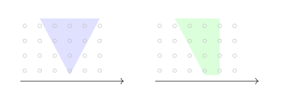
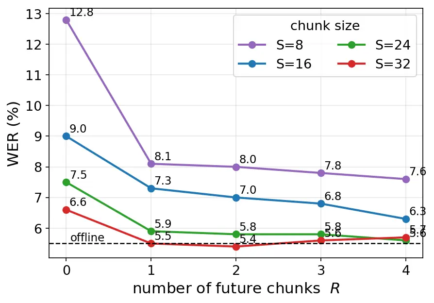
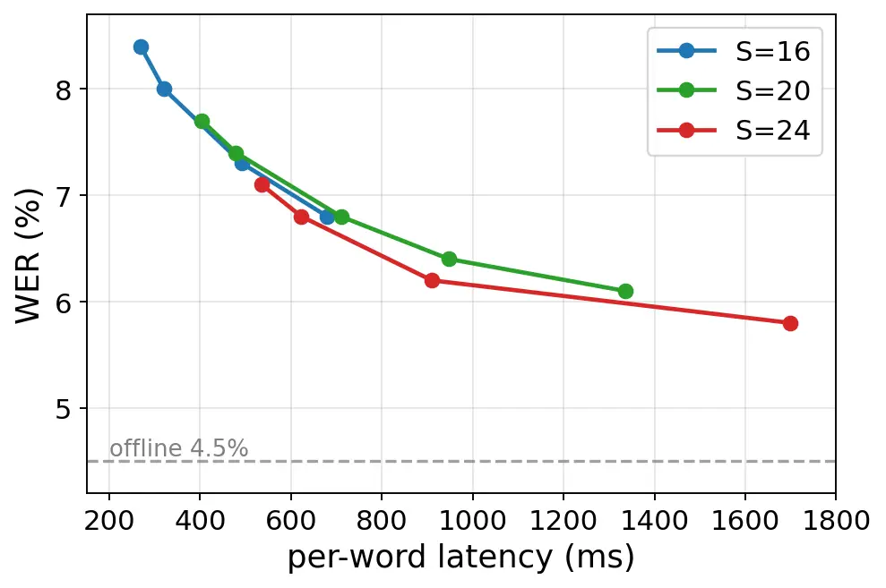

# Selective Lookahead for Attention-Based Streaming ASRThanks: Code: [https://github.com/windskylionheart1023/selective-lookahead-asr](https://github.com/windskylionheart1023/selective-lookahead-asr)

Yichen Jia, Bastiaan Tamm, Hugo Van hamme Affiliation: Department of
Electrical Engineering (ESAT–PSI)  
KU Leuven, Leuven, Belgium  
{yichen.jia, bastiaan.tamm, hugo.vanhamme}@kuleuven.be Affiliation: 

###### Abstract

End-to-end attention-based speech recognition is accurate offline but
hard to stream: outputs can depend on future audio, and a little future
context per layer makes the lookahead grow with the number of layers. We
address this with two mechanisms. A _bounded-lookahead chunk encoder_
caps every chunk’s future receptive field at a constant number of
chunks, independent of the number of layers, via one age-selection rule
shared by self-attention and the depthwise convolution. On this encoder,
_dynamic future-chunk decoding_ lets a per-token trigger commit a token
or wait and re-decode it; we propose a learned trigger as the general
mechanism, with a simple confidence threshold as an effective fallback.
On full LibriSpeech test-clean the dynamic system matches the best
static-lookahead accuracy ($`6.5\%`$) at a median latency of $`306`$ ms
versus $`860`$ ms for one-chunk static lookahead, and a wait budget
bounds the deferral tail below the static baseline’s 90th percentile at
$`0.1`$ points more WER.

###### Index Terms: 

streaming ASR, bounded lookahead, asymmetric attention mask, dynamic
future-chunk decoding, latency-accuracy trade-off.

## I Introduction

End-to-end automatic speech recognition (ASR) based on the joint
connectionist temporal classification (CTC) and attention
architecture \[1\] is accurate offline, where the encoder attends to all
frames and the decoder sees the complete utterance. _Streaming_ ASR must
emit tokens from partial audio, which limits each decision’s acoustic
context and raises the word error rate (WER). Live captioning, voice
assistants, and simultaneous translation need a transcript within
seconds of speech \[2\], so the central engineering question is how to
move along the latency–accuracy trade-off in a controlled way.

We adopt the standard chunked formulation: split the audio into
fixed-size chunks and decode chunk by chunk. While decoding a chunk, a
_trigger_ may pause inference to wait for one or more future chunks;
with the added acoustic evidence the model re-decodes the affected
tokens more accurately.

Fixed lookahead applies the same delay to every token, and emission
regularizers such as FastEmit \[3\] only change _when_ a fixed-context
model emits. We instead decide at inference time, per token, whether
more future acoustic context is worth the delay (e.g. committing \_IRIS
early versus waiting one chunk to recover \_IRISH; Fig. 1). Two design
questions organize the paper:

- •
  Q1 (training/encoding). How can the model be trained to _use_ future
  chunks effectively, without its per-chunk receptive field growing with
  the number of layers?
- •
  Q2 (inference). What signal reliably indicates _when_ waiting for a
  future chunk actually helps, so that delay is added only where it
  improves accuracy?

Fig. 1: Dynamic future-chunk decoding. A per-token trigger commits most
tokens immediately (green, zero added delay) and waits one chunk to
re-decode only the uncertain few (orange): \_IRIS is deferred and
resolved to \_IRISH once the next chunk arrives. $`s_{t}`$ is the
trigger signal; the dashed line its threshold.

Our contributions are threefold. 1) We introduce a _bounded-lookahead
chunk encoder_ whose self-attention and depthwise convolution share one
age-selection rule. The rule caps each chunk’s future receptive field at
a tunable constant number of chunks regardless of the number of layers,
and lets a committed chunk be re-encoded under more context at inference
(Section III). 2) We propose _dynamic future-chunk decoding_, a
chunk-synchronous beam search whose per-token trigger commits a token or
waits and re-decodes it under richer encoder context (Section IV). 3) We
characterize the chunk-size/lookahead/latency trade-off on measured
per-word emission latency against streaming baselines; the dynamic
trigger defers only where future context changes the token (Section V).
We will release code and configurations upon acceptance.

## II Background and Related Work

Streaming ASR. End-to-end ASR rests on three model families, each with a
streaming variant. Connectionist temporal classification (CTC) \[4, 5\]
is frame-synchronous and naturally streamable. Neural transducers
(RNN-T) \[6\] add a label-context predictor and support much on-device
streaming ASR \[7, 8\], often with a second rescoring pass \[9\].
Attention-based encoder–decoders \[10, 1\], which we adopt for their
offline accuracy, are the hardest to stream because attention is
inherently global. Across families, methods differ mainly in _where_
they control latency: the encoder’s streaming receptive field, or the
timing of emission.

Attention-based streaming. Most attention-based methods restrict the
encoder to a streaming receptive field: blockwise/chunked
processing \[11, 12\], dynamic-chunk training (U2/WeNet) \[13, 14\], a
right-context memory bank (Emformer) \[15\], simulated future context
(CUSIDE) \[16\], and bounded per-step right context \[17, 18\], all with
a _fixed_ lookahead per token. Two of these also hold the lookahead
independent of the number of layers: Emformer hard-copies its
right-context frames from the input so lookahead cannot leak across
layers \[15\], and the dual causal/non-causal attention of Moritz et
al. \[19\] restricts future keys to their causal versions, capping the
lookahead at one layer’s window. Our age-versioned encoder differs in
three ways. Its $`R{+}1`$ versions are graded: a future key holds the
partial future context it has already absorbed instead of none. One age
rule covers the Conformer convolution as well as self-attention. And the
versions let a committed chunk be _re-encoded_ under richer context,
which dynamic decoding relies on (Sections III, IV).

Latency control. A complementary line regularizes _emission_ timing at
training, as in FastEmit \[3\], TrimTail \[20\], and delay-penalized
transducers \[21\], but it only adjusts emission timing within a fixed
acoustic context. Triggered attention \[22\] fires the decoder from CTC
spikes at fixed lookahead, adaptive non-causal transducers \[23\] learn
an input-adaptive per-frame lookahead inside a single-pass transducer,
and monotonic chunkwise attention \[26\] decides per token when to stop
reading input, within a soft window set at training. Closest to us,
asynchronous revision \[24\] re-decodes committed history under later
right context at a fixed schedule, and the Scout network \[25\] learns
word boundaries at which to stop reading. We instead defer an
already-decoded token and re-decode it under a re-encoded input,
deciding per token at inference whether one more chunk of latency is
worth it (Section IV).

## III Bounded-Lookahead Chunk Encoder

### III-A The Growing-Receptive-Field Problem

Let the encoder process the input in chunks of $`S`$ frames. Suppose the
“current” chunk $`C_{t}`$ attends to one future chunk $`C_{t+1}`$ at
_every_ layer, and that future chunk in turn looks one step ahead of
itself; we call this the _symmetric_ case (Fig. 2). At layer 1,
$`C_{t}`$ sees $`C_{t+1}`$. But at layer 2 the representation of
$`C_{t+1}`$ already absorbed $`C_{t+2}`$ at layer 1, so $`C_{t}`$ now
implicitly sees $`C_{t+2}`$; by induction, after $`\ell`$ layers
$`C_{t}`$ depends on $`C_{t+\ell}`$. The effective lookahead grows
linearly with the number of layers \[19\], and the streaming guarantee
is lost: the inference engine would have to wait for far more than one
chunk of future audio. The same compounding arises through every
operation that crosses chunk boundaries: the Conformer \[27\]
convolution module also reads future frames through its symmetric kernel
at every layer \[28\]. A streaming bound must cover every cross-chunk
path; we bound attention and convolution in turn, with one shared rule.



Fig. 2: Receptive field of the current chunk $`C_{t}`$ (filled) across
stacked encoder layers. A symmetric per-layer mask (left) lets the
future lookahead grow with the number of layers. Our asymmetric mask
(right, drawn for $`R{=}1`$) caps the future at a constant $`R`$ chunks,
the vertical right edge, while past context can still grow with the
number of layers.

### III-B Attention: Asymmetric Age-Versioned Mask

We break the recursion by forbidding a future chunk from ever looking
further into the future. Concretely, the current chunk $`C_{t}`$ may
attend to $`L`$ past chunks, itself, and $`R`$ future chunks, while a
future chunk attends only to its own past and itself, never beyond.
Because $`C_{t+1}`$ can never import $`C_{t+2}`$ at any layer,
$`C_{t}`$’s future receptive field is permanently capped at $`R`$
chunks, _independent of the number of layers_. The mask is static and
identical at every layer.

To realize this in a single tensor, we build each chunk in $`R{+}1`$
_age versions_ stacked along one new tensor axis: version $`0`$ has no
future context (the “preliminary” view available the moment the chunk
arrives), and each newer version absorbs one more future chunk. For a
query position $`q`$ in age version $`c_{q}`$ and a key position $`k`$,
the readable key version is given by an age index

```math
a(q,c_{q},k)=\mathrm{clip}\!\left(\Big\lfloor\tfrac{q}{S}\Big\rfloor-\Big\lfloor\tfrac{k}{S}\Big\rfloor+c_{q},\;-1,\;R\right), \tag{1}
```

where $`a\!=\!-1`$ marks an illegal (too-far-future) key that is masked
out; otherwise the query in version $`c_{q}`$ reads key version
$`c_{k}\!=\!a`$. The upper clip means that any key chunk far enough in
the past is read in its final, fully contextualized version $`R`$, the
only version that must be cached once a chunk is finalized. A key is
also admissible only if it lies within the $`L`$-chunk past window of
the query (Fig. 3); Eq. (1) governs the future side and the version
selection. Age versioning is disabled under full attention (no bound is
needed) and at $`R\!=\!0`$, where the chunked mask is already causal and
one version per chunk suffices.


Fig. 3: Chunk-level attention mask for $`L{=}2`$ past chunks and
$`R{=}1`$ (filled $`=`$ attend). Past rows are drawn in their final
versions, which saw their own $`+1`$ future when encoded. The current
chunk $`C_{t}`$ reaches one future chunk; the future chunk $`C_{t+1}`$
is available only in its causal version and never reaches beyond itself,
which bounds the receptive field. Rows show only the part of each window
inside this $`4{\times}4`$ view.

### III-C Convolution: Cross-Age Depthwise Convolution

The convolution path needs the same care as dynamic chunk
convolution \[28\]. Making it causal preserves the bound but discards
future audio the attention path may see, while restoring the kernel’s
natural right half-window reintroduces the growth of Section III-A, the
future horizon again growing by half a kernel per layer. We instead
route the taps by the _same age-selection rule_ as Eq. (1): for the
age-$`k`$ version of chunk $`i`$, a tap in chunk $`j`$ reads age version
$`\mathrm{clip}(k{-}(j{-}i),0,R)`$, and taps with $`j{-}i>k`$ are
zeroed. Every reachable version has a future horizon of at most chunk
$`i{+}k`$, so the convolution preserves the attention bound at every
layer while still mixing real future audio. Attention and convolution
are the only cross-chunk paths, so the bound holds for the whole
network.

### III-D Efficient Masking and Cost

The block-structured mask runs on a fast block-sparse kernel,
FlexAttention \[29\]; the standard fused FlashAttention kernel \[30\]
does not natively express such irregular masks, so we use it only for
the dense fallback. Age-versioning trades compute and memory for the
bound: training builds up to $`R{+}1`$ versions per chunk, and streaming
inference re-encodes each chunk $`R{+}1`$ times as future chunks arrive
(for $`R\!=\!1`$, a preliminary causal pass then a final pass, with past
key/value states cached). This gives the property the dynamic decoder
(Section IV) relies on: because all $`R{+}1`$ versions are seen in
training, re-encoding a committed chunk under more future context is
in-distribution.

## IV Dynamic Future-Chunk Decoding

### IV-A Chunk-Synchronous Beam Search with a Trigger

At inference the encoder emits chunk-causal features and the joint
CTC/attention beam search proceeds chunk by chunk. The CTC prefix score
grows incrementally as each chunk arrives, following the
blockwise-synchronous formulation \[31\]; the attention decoder scores
each candidate against the encoder features released so far. After
decoding from the current buffer, a trigger decides whether to _commit_
the new tokens or to _wait_ for the next chunk. The model commits tokens
up to the first step at which the trigger fires; from that step on, it
waits for the next chunk and resumes there.

### IV-B Latency Definition

We measure per-word emission latency: how long after a word’s acoustic
end the system commits it. The acoustic end comes from a forced
alignment, the Montreal Forced Aligner (MFA) \[32\]; the commit time is
the end of the audio buffer consumed at commitment. Each word is
credited to its slowest-settling sub-word token. Hypothesis words are
matched to reference words by the edit-distance alignment, so latency is
measured over correctly recognized words ($`92.7`$, $`94.0`$, and
$`94.2\%`$ of reference words for static $`R{=}0`$, $`R{=}1`$, and the
dynamic system, a similar share in each), and every evaluation set uses
its own MFA reference; wrong words have no anchor and are excluded,
which can censor some long-latency errors. We report the mean, median,
and 90th percentile. Because the acoustic anchor is system-independent,
differences between systems on the same utterances directly measure
added emission delay; each deferred chunk moves the buffer endpoint by
one chunk, $`48{\times}S`$ ms ($`768`$ ms at $`S\!=\!16`$). This is
emission delay: decoding runs faster than real time (Table III), and we
do not add compute time.

### IV-C When Does Waiting Help?

Two situations motivate waiting. First, a word whose sub-word pieces
span a chunk boundary is prone to a glitch if committed early. Under
limited context, the decoder favors a shorter, locally probable
byte-pair encoding (BPE) piece (e.g. \_I RI S) that cannot be taken back
once emitted. Decoded with one more chunk, the decoder recovers the same
word as a single in-vocabulary piece (\_IRISH). Second, tokens whose
identity depends on future context (homophones such as “write” vs.
“right”) are ambiguous until later audio arrives.

### IV-D Controller

The dynamic controller is inference-only. On a defer, every strategy
re-encodes the affected chunk with one more future chunk and exposes the
result to both the encoder and the decoder cross-attention; the
strategies differ only in what a defer rolls back (the last token for A,
the whole chunk for B–D) and how it is triggered (Table I). A wait
budget bounds how long any chunk may defer, and the final chunk always
force-commits. Section V compares the strategies on small.

| strategy         | trigger               | rolls back  |
| ---------------- | --------------------- | ----------- |
| A token-resume   | per token             | last token  |
| B chunk-rollback | per chunk             | whole chunk |
| C chunk-rollback | per token, aggregated | whole chunk |
| D chunk-resume   | per token             | whole chunk |

TABLE I: The four dynamic-controller strategies, differing in what
triggers a defer (per token or per chunk) and how much is rolled back
and re-decoded (the last token or the whole chunk). Strategy D, used for
all dynamic results, triggers per token and resumes the whole chunk
under more context. Rolling back discards the chunk’s tokens and
re-decodes the chunk from its start; resuming keeps the prefix committed
before the trigger fired. Strategy C defers the chunk when any token’s
signal fires.

Commit-stable-prefix. Whole-chunk rollback (strategies B–D) re-decodes
the entire deferred chunk on each pass and commits it only at the final
pass, so every word in the chunk waits out the full deferral, a heavy
latency tail, even though typically only a short boundary suffix changes
across the re-decode passes. We instead use the local-agreement rule of
incremental decoding \[33, 34\], committing after each pass the longest
prefix that _agrees_ with the previous pass: those words commit as soon
as two consecutive passes agree, while only the uncertain suffix waits
for more context. The committed tokens are unchanged except for the rare
word that is locked and would later have flipped under deeper context:
$`191`$ of $`52.6`$k hypothesis words on full test-clean, $`1.1\%`$ of
deferred words, with WER unchanged at $`6.5\%`$. Accuracy is preserved
while the deferral tail collapses (Table V). The diagnostic curve
(Fig. 5) keeps whole-chunk rollback for comparability. Under strategy D,
deferral without a trigger is not a distinct baseline: a chunk that
always waits its full budget is decoded once, which is static lookahead;
only a selective trigger creates the second pass that local agreement
compares. Algorithm 1 states one deferral round.

0:  $`y`$: tokens decoded for chunk $`t`$ in the current pass; $`c`$:
committed prefix of $`y`$; $`u`$: uncommitted rest of $`y`$

1:  save beam state $`\mathcal{S}`$ (hypotheses, decoder and CTC prefix
states, encoder buffer); $`k\leftarrow 0`$; $`c\leftarrow`$ empty

2:  loop

3:   re-encode chunk $`t`$ with $`k`$ future chunks; restore
$`\mathcal{S}`$; decode $`y`$, forced to start with $`c`$

4:   extend $`c`$ to the longest prefix on which $`y`$ and the previous
pass agree; commit $`c`$; $`u\leftarrow`$ rest of $`y`$

5:   if no trigger fires on $`u`$, or $`k=B`$ then commit $`u`$; break

6:   $`k\leftarrow k{+}1`$; wait for the next chunk

7:  end loop

Algorithm 1 Deferral of chunk $`t`$ (strategy D, wait budget $`B`$)

### IV-E Trigger Signals

A good trigger fires exactly when an early commitment would be wrong.
Each trigger reads a per-token signal $`s_{t}`$ and fires against a
threshold $`\theta`$: below $`\theta`$ for the confidence family, above
$`\theta`$ for the learned defer probability. We study these two
families.

Confidence. When the model is uncertain about a token, more audio is
likely to help, so a threshold on its confidence is a natural trigger.
The raw softmax top-$`1`$ probability is poorly calibrated \[35, 36\],
so we evaluate it against two calibrated alternatives: temperature
scaling \[37\] and SR-CEM \[38\], a lightweight score-rank confidence
estimator for end-to-end ASR that we adapt for the streaming setting.
The signal (top-$`1`$ probability, top-$`1`$/top-$`2`$ margin, entropy,
top-$`k`$ mass) is read on the decoder step or aggregated over non-blank
CTC frames; uncertainty-based emission control \[39\] is a related
learned alternative.

Learned. Mimicking SR-CEM’s setup but skipping the calibrated-confidence
step, we train a _learned trigger_ on the same score-rank features to
predict the defer decision directly (whether deferring would fix the
token); predicting the stability of incremental hypotheses this way has
precedent \[40, 41\]. Section V compares it against the confidence
thresholds.

## V Experiments

We first describe the setup and characterize the chunk-size and
lookahead trade-off, then decompose where streaming errors arise,
analyze candidate trigger signals and their latency cost, and finally
evaluate the dynamic controller.

### V-A Setup

We use a $`12`$-layer Conformer \[27\] encoder ($`d{=}256`$) with rotary
positional encoding \[42\] and a $`6`$-layer Transformer decoder,
trained in ESPnet \[43\] on LibriSpeech train-clean-360
($`\sim`$$`360`$ h) \[44\] with a $`5000`$-token unigram vocabulary,
jointly with CTC weight $`0.3`$ (attention weight $`0.7`$) and label
smoothing $`0.1`$, optimized with Adam \[45\], Noam schedule with factor
$`0.4`$ and $`25`$k warmup steps, batch size $`32`$, gradient
accumulation $`2`$, SpecAugment, $`40`$ epochs, and $`10`$-best
checkpoint averaging by accuracy on LibriSpeech dev-clean. At inference
we use a beam size of $`20`$, CTC weight $`0.3`$, and no external
language model. The encoder keeps unlimited left context, and a deferred
token waits at most four future chunks (the training cap). We vary the
confidence threshold and tune the learned trigger on held-out dev,
LibriSpeech dev-clean, disjoint from the dev-other evaluation in
Table VI. The front end produces one mel frame per $`8`$ ms and the
convolutional stem subsamples by a factor of six, so one encoder frame
spans $`48`$ ms and a chunk of $`S`$ encoder frames spans
$`48{\times}S`$ ms (e.g. $`S\!=\!16`$ is $`768`$ ms). Following dynamic
chunk training \[13\], we fine-tune with the chunk size sampled in
$`[8,32]`$ and right context up to four future chunks per utterance, so
one model decodes offline and streams at any chunk size, a dual-mode
design \[46\]. Fine-tuning adds soft early-emission losses (weight
$`0.1`$ each): forced alignments set each token’s deadline chunk, and
the decoder cross-attention mass and CTC probability mass falling after
it are penalized, keeping emission timely without a hard cross-attention
mask; we evaluate $`S\!\in\!\{8,16,24,32\}`$ statically (Fig. 4) and add
$`S\!=\!20`$ on the measured dynamic curve (Fig. 5). We train every
system on train-clean-360, baselines included, so that all results share
one training set; systems trained on the full $`960`$ h reach lower
absolute WER. Every main accuracy result below is on _full_ LibriSpeech
test-clean ($`2620`$ utterances, $`52.6`$k words), with generalization
on test-other and dev-other (Table VI). The smaller small set ($`95`$
utterances) is a subset of test-clean and is harder than the full set:
offline $`5.5`$ vs. $`4.5\%`$. We use it for the chunk-size trend of
Fig. 4, the fine-tuning gap of Table II, the controller-strategy
comparison, and the cost measurements of Table III; the main results are
on the full sets. For out-of-domain transfer (Table IV) we also evaluate
$`500`$-utterance subsets of *LibriAdapt-US* \[47\], noisy re-recordings
of LibriSpeech; *TED-LIUM 3* \[48\], spontaneous talks;
*WSJCAM0* \[49\], British read speech; and *Common Voice US* \[50\],
crowd-sourced read speech. Absolute levels differ across sets. The
binomial $`95\%`$ confidence interval is about $`{\pm}0.2`$ percentage
points on full test-clean ($`52.6`$k words) and roughly $`{\pm}0.8`$ on
a $`500`$-utterance subset, so we read WER differences inside these
intervals as ties. We report paired bootstrap tests over utterances
($`10`$k resamples) for the main comparisons. Our WER claims are
matched-accuracy comparisons; the gains we report are in latency.

### V-B Chunk Size, Lookahead, and the Static Baseline

Fig. 4 shows WER against the number of future chunks $`R`$ for each
chunk size on small. Chunk size is the dominant factor: enlarging the
chunk lowers WER at any fixed $`R`$, with most of the gain realized by
$`S\!\approx\!32`$. Additional lookahead helps most when chunks are
small and flattens for large chunks: a long chunk already contains most
of the locally useful right context. We caution that WER is _not_
strictly monotonic in $`R`$ (several points vary by $`0.1`$–$`0.3`$
points, within noise), and that chunk sizes outside $`[8,32]`$ (e.g.
$`S\!=\!48`$) lie outside the training range.

We operate at $`S\!=\!16`$, the low-latency end (larger chunks lower WER
but proportionally raise latency); there the static streaming WERs on
small are $`9.0\%`$, $`7.3\%`$, and $`7.0\%`$ for $`R\!=\!0,1,2`$,
against an offline reference of $`5.5\%`$ on the same subset. Table II
contrasts it with the un-fine-tuned offline initialization (no chunked
FT), which is far worse: $`23.8\%`$ at $`R\!=\!0`$ and $`{\sim}12.5\%`$
for $`R\!\geq\!1`$. Chunked fine-tuning is the essential step.



Fig. 4: Streaming WER vs. number of future chunks $`R`$, one curve per
chunk size, on small. These static curves use a chunk-synchronous
decoder that agrees with the dynamic-section decoder (Section IV) to
within $`0.4`$ points at $`S{=}16`$. Chunk sizes $`S\!\in\![8,32]`$ are
in-distribution; the horizontal line is the offline ceiling ($`5.5\%`$).

|               | offline | $`R{=}0`$ | $`R{=}1`$ | $`R{=}2`$ | $`R{=}3`$ | $`R{=}4`$ |
| ------------- | ------- | --------- | --------- | --------- | --------- | --------- |
| Chunked FT    | 5.5     | 9.0       | 7.3       | 7.0       | 6.8       | 6.3       |
| No chunked FT | 6.4     | 23.8      | 12.8      | 12.6      | 12.5      | 12.4      |

TABLE II: Streaming WER (%, $`\downarrow`$) at $`S{=}16`$ on small: our
bounded-lookahead chunk encoder vs. its un-fine-tuned offline
initialization (“no chunked FT”). Offline is each model’s own
non-streaming ceiling, not a controlled comparison (the two differ in
training stage); the streaming columns are the contrast.

### V-C Trigger Study

Deferral only helps errors the decoder makes by committing too early:
under limited context it emits word and phrase duplications at chunk
boundaries, which never occur offline and which waiting for the next
chunk can undo. The encoder is a separate limit: in streaming it has not
yet seen future audio, so some tokens stay acoustically ambiguous no
matter how long we wait. Those errors set the gap between the streaming
ceiling and offline accuracy that no trigger can close. We study the two
trigger families of Section IV on held-out dev.

Confidence thresholds. We test three scores as the threshold: the raw
softmax top-$`1`$ probability, its temperature-scaled \[37\]
calibration, and the SR-CEM \[38\] calibrated confidence. All three fall
on essentially one WER–latency curve and reach nearly the same accuracy
floor: each ranks the uncertain tokens similarly enough that the floor
is set by the model and chunk size, not by the confidence estimator.
Table V shows the SR-CEM and raw top-$`1`$ operating points on full
test-clean.

Learned trigger. We train a small classifier to predict, for each token,
whether waiting one chunk would turn it from wrong to right; labels come
from paired static decodes of dev at adjacent lookaheads, pooled over
$`R{=}0`$–$`3`$. The classifier is a $`7{\to}32{\to}1`$ multilayer
perceptron over the seven per-token SR-CEM features with class-weighted
cross-entropy; the features are the token’s score, its rank among the
beam candidates, the preceding cumulative hypothesis score, and the four
best cumulative candidate scores at that step \[38\]. We fit it and set
its threshold on held-out dev. On a held-out split of dev, the
confidence score alone orders these fixable tokens at ROC AUC $`0.90`$;
the learned trigger adds the top-$`k`$ margins to reach $`0.92`$, with
the top-1/top-2 margin the most useful of these, while the token’s rank
among candidates adds nothing. At the matched $`6.5\%`$ WER on full
test-clean the learned trigger commits at $`630/306`$ ms mean/median
versus the SR-CEM threshold’s $`644/312`$ and the raw top-1’s
$`688/320`$ (Table V), a gap of tens of milliseconds; pushed further,
the SR-CEM threshold reaches $`6.3\%`$ at $`919`$ ms mean, and the
learned trigger tracks it at lower thresholds ($`6.5\%`$ at
$`\theta{=}0.60`$, $`731`$ ms mean). We use the learned trigger for the
primary dynamic results because it ranks these tokens best and is the
mechanism we propose. The confidence threshold is a practical fallback:
it needs no extra training and works about as well.



Fig. 5: Measured per-word mean latency vs. WER (strategy D) at
$`S\!=\!16/20/24`$ on full test-clean. Chunk size is the dominant
factor: larger chunks reach a lower WER floor at higher latency
($`S\!=\!24`$ reaches $`5.8\%`$), $`S\!=\!16`$ holds the low-latency
region, $`S\!=\!20`$ sits between. Latency here is whole-chunk rollback;
commit-stable-prefix (Table V) lowers all three curves.

### V-D Dynamic Future-Chunk Results

Table V reports the $`S\!=\!16`$ latency–WER trade-off on full
test-clean, with per-word emission latency measured against MFA word
ends as defined in Section IV, not a convergence proxy. Among controller
strategies we use strategy D (chunk-resume in Table I), a per-token
rollback that re-encodes the whole chunk, fired by the learned
wait-policy trigger trained on dev. On small ($`95`$ utterances),
strategy D reaches $`7.1\%`$ WER, the static $`R{=}1`$ level of the same
decoder (the static decoder of Table II reads $`7.3\%`$ for this cell);
strategies B and C sit within $`0.1`$ points, inside this subset’s
noise. The token-only strategy A trails ($`8.0\%`$) and cannot re-encode
lookahead, a structural limit, so we use D.

Static lookahead plateaus at $`6.5\text{--}6.7\%`$ once $`R\!\geq\!1`$
but delays every token by the same amount: $`813`$ ms mean ($`860`$ ms
median) latency at $`R\!=\!1`$, rising to $`2490`$ ms at $`R\!=\!4`$.
The dynamic trigger reaches the best static accuracy ($`6.5\%`$, static
$`R{=}4`$; paired bootstrap $`p{=}0.50`$) at a _median_ latency of
$`306`$ ms, a third of static $`R{=}1`$’s $`860`$ ms. Its $`0.2`$-point
WER edge over static $`R{=}1`$ is statistically distinguishable under
the paired test ($`p{=}0.02`$) though small in absolute WER. Two
controls on the same pipeline bound what the trigger contributes
(Table V). A _random_ trigger that defers the same $`34\%`$ of tokens
reaches $`7.0\%`$ at $`1078`$ ms median, worse than static $`R{=}1`$ on
both axes. An _oracle_ trigger, which reads the reference transcript and
defers exactly the chunks whose first decode contains an error, is the
upper bound for any trigger: $`6.3\%`$ at $`292`$ ms median under
whole-chunk rollback, where the learned trigger reaches $`6.5\%`$ at
$`442`$ ms. The tail moves the other way at this operating point,
$`p_{90}`$ $`2800`$ versus static $`R{=}1`$’s $`1298`$ ms; the budget
row below brings it under. Commit-stable-prefix releases the stable
words of a deferred chunk early, so the deferring minority no longer
lengthens the tail against the matched-accuracy anchor: versus static
$`R{=}4`$ the dynamic trigger is lower at every percentile (mean $`630`$
vs $`2490`$, $`p_{90}`$ $`2800`$ vs $`3518`$ ms; on test-other the
dynamic WER is also slightly lower, $`p{<}0.01`$). The pattern holds on
test-other and dev-other (Table VI): at a matched $`{\sim}17.5\%`$ WER
the dynamic trigger commits the typical word in $`{\sim}463`$ ms
(median) versus static $`R{=}2`$’s $`{\sim}1550`$ ms, at higher absolute
WER (out of domain). Varying the trigger across chunk sizes traces the
measured WER–latency curve (Fig. 5): a larger chunk reaches a lower
floor at higher latency, with $`S\!=\!20`$ a balanced midpoint.

Budget bounds the tail. Capping the wait budget $`B`$ (Table V) trades a
little WER for a much shorter tail: at $`\theta{=}0.70`$, $`B{=}1`$
reaches $`964`$ ms $`p_{90}`$ for $`0.3`$ points more WER, and it is
below static $`R{=}1`$ on mean, median, and $`p_{90}`$ at $`0.1`$ points
higher WER ($`6.8`$ vs $`6.7`$), inside the test-set confidence
interval. When tail latency matters, $`B{=}1`$ is the operating point we
would deploy.

| system                      | WER (%) | RTF      | mem (GB) | waited (%) |
| --------------------------- | ------- | -------- | -------- | ---------- |
| Static $`R{=}1`$            | $`6.7`$ | $`0.40`$ | $`3.4`$  | 100        |
| Dynamic ($`\theta{=}0.70`$) | $`6.5`$ | $`0.60`$ | $`3.5`$  | 34         |
| Dynamic ($`\theta{=}0.85`$) | $`7.0`$ | $`0.51`$ | $`3.2`$  | 19         |

TABLE III: WER and deployment cost at $`S{=}16`$. WER on full test-clean
(single stream, beam $`20`$); RTF (decoding only, model load excluded)
and peak memory on the $`95`$-utterance subset, single NVIDIA RTX 2080
Ti. “waited” is the fraction of words that use future audio beyond their
own chunk (static waits on all, $`100\%`$). All configurations run
faster than real time. “Dynamic” uses strategy D with the learned
wait-policy trigger and commit-stable-prefix (Section IV); its RTF rises
modestly with deferral (lower $`\theta`$).

Compute. All configurations decode faster than real time and use modest
memory (Table III), so the latency we report is emission delay, not
throughput. With the decoder K/V cache \[51\] enabled, the footprint is
set by the encoder, run by recompute over the left-context window.

Out-of-domain datasets. Beyond LibriSpeech we test $`500`$-utterance
subsets of four datasets outside the training domain (Table IV), ordered
by WER. On noisy LibriAdapt-US re-recordings the trade-off holds: the
dynamic trigger matches the static WER ($`16.3`$ vs $`16.7\%`$, a tie at
this sample size, $`p{=}0.11`$) while committing the typical word in
$`426`$ vs $`890`$ ms (median), a $`{\sim}52\%`$ latency reduction. Two
moderate-WER sets confirm the gain survives well above LibriSpeech’s
operating point. On TED-LIUM 3 spontaneous conference speech the dynamic
trigger reaches $`22.0\%`$ at $`506`$ ms median, the one set where
deferral also lowers WER significantly ($`p{<}0.001`$); on WSJCAM0
British read speech it attains static $`R{=}2`$’s $`26.0\%`$ WER at
about a third of its median latency (Table IV), at the cost of a heavier
deferral tail ($`p_{90}`$ $`{\sim}3.4`$ s, not shown in the table) that
the budget setting bounds. On Common Voice, by contrast, deferral
slightly worsens WER ($`38.3`$ vs $`37.5\%`$, $`p{=}0.05`$): the
lookahead saturates after one chunk ($`R{=}1`$ and $`R{=}2`$ both
$`37.5\%`$). Deferral lowers WER on the lower-WER out-of-domain sets but
not on Common Voice at $`37.5\%`$; as WER rises, more of the errors are
intrinsic to the domain and one more chunk cannot fix them, so future
chunks help less. The latency reduction still transfers across domains,
even where the WER benefit does not.

|                        |           |           |      |             |           |      |
| ---------------------- | --------- | --------- | ---- | ----------- | --------- | ---- |
|                        | WER (%)   |           |      | median (ms) |           |      |
|                        | $`R{=}1`$ | $`R{=}2`$ | dyn. | $`R{=}1`$   | $`R{=}2`$ | dyn. |
| LibriAdapt-US \[47\]   | 16.7      | 16.6      | 16.3 | 890         | 1608      | 426  |
| TED-LIUM 3 \[48\]      | 22.9      | 22.6      | 22.0 | 894         | 1590      | 506  |
| WSJCAM0 \[49\]         | 26.3      | 26.0      | 26.0 | 934         | 1632      | 574  |
| Common Voice US \[50\] | 37.5      | 37.5      | 38.3 | 954         | 1634      | 704  |

TABLE IV: Out-of-domain transfer ($`S{=}16`$, $`500`$-utterance subsets,
ordered by WER): static $`R{=}1`$ and $`R{=}2`$ versus the dynamic
trigger (learned wait-policy, commit-stable-prefix, the same
LibriSpeech-dev trigger throughout); latency uses the same MFA word-end
anchoring with per-set reference alignments. Deferral helps up to
WSJCAM0’s $`26\%`$; on Common Voice the lookahead itself saturates
($`R{=}1`$ and $`R{=}2`$ equal) and deferral no longer lowers WER.

| system                                       | WER (%) | mean | median | $`p_{90}`$ |
| -------------------------------------------- | ------- | ---- | ------ | ---------- |
| Offline (ceiling)                            | 4.5     | –    | –      | –          |
| Static $`R{=}0`$ (causal)                    | 8.5     | 240  | 238    | 696        |
| Static $`R{=}1`$                             | 6.7     | 813  | 860    | 1298       |
| Static $`R{=}4`$                             | 6.5     | 2490 | 2910   | 3518       |
| Dynamic $`\theta{=}0.70`$ (rollback)         | 6.5     | 906  | 442    | 3174       |
| $`+`$ stable-prefix                          | 6.5     | 630  | 306    | 2800       |
| $`+`$ budget $`B{=}1`$                       | 6.8     | 362  | 328    | 964        |
| Dynamic $`\theta{=}0.85`$ (rollback)         | 7.0     | 551  | 324    | 1496       |
| $`+`$ stable-prefix                          | 7.0     | 416  | 268    | 924        |
| SR-CEM $`\theta{=}0.85`$ $`+`$ stable-prefix | 6.5     | 644  | 312    | 2820       |
| SR-CEM $`\theta{=}0.95`$ $`+`$ stable-prefix | 6.3     | 919  | 386    | 3164       |
| Top-1 $`\theta{=}0.95`$ $`+`$ stable-prefix  | 6.5     | 688  | 320    | 2920       |
| Random trigger ($`34\%`$ deferred)           | 7.0     | 1410 | 1078   | 3248       |
| Oracle trigger (rollback)                    | 6.3     | 696  | 292    | 3072       |
| Blockwise \[31\]                             | 7.4     | 1366 | 1270   | 1654       |
| FastEmit \[3\]                               | 6.7     | 327  | 326    | 656        |

TABLE V: Latency–WER at $`S{=}16`$ on full test-clean ($`52.6`$k words):
per-word mean, median, and 90th-percentile emission latency (ms) against
MFA word ends; offline is the non-streaming ceiling. Each dynamic
$`\theta`$ is shown as whole-chunk rollback then $`+`$ stable-prefix
(same trigger; WER unchanged at this precision), which cuts the tail.
$`\theta{=}0.70`$ matches the best static accuracy ($`6.5\%`$) at a
fraction of its latency; $`\theta{=}0.85`$ gives the lowest median
($`268`$ ms) at $`7.0\%`$ WER. The confidence-trigger rows use the same
strategy D; SR-CEM pushed further reaches the lowest WER ($`6.3\%`$) at
higher latency. Random and oracle are the control triggers of Section V;
the oracle is not deployable.

|                    |         |      |        |            |
| ------------------ | ------- | ---- | ------ | ---------- |
| split & system     | WER (%) | mean | median | $`p_{90}`$ |
| test-other         |         |      |        |            |
|   static $`R{=}2`$ | 17.7    | 1405 | 1554   | 2050       |
|   dynamic          | 17.4    | 1045 | 464    | 3216       |
| dev-other          |         |      |        |            |
|   static $`R{=}2`$ | 17.5    | 1396 | 1552   | 2052       |
|   dynamic          | 17.4    | 1025 | 462    | 3220       |

TABLE VI: Generalization to the -other splits at $`S{=}16`$ (out of
domain for the LibriSpeech-360 model); latency uses the same MFA
anchoring with per-split references. The dynamic trigger (learned
wait-policy, $`\theta{=}0.70`$, commit-stable-prefix) matches static
$`R{=}2`$ in WER, slightly lower on test-other, at roughly a third of
the median latency. The unbudgeted deferral tail exceeds static
$`R{=}2`$ ($`p_{90}`$), as on test-clean (Table V, budget row).

### V-E Streaming Baselines

We evaluate two published streaming systems on the same full test-clean
set. The Offline row in Table V ($`4.5\%`$) is the non-streaming
ceiling: the $`{\sim}2`$ percentage-point gap to any streaming row below
is the structural cost of incremental emission, shared by every
streaming system here. Both systems use LibriSpeech train-clean-360 data
and $`5000`$-token BPE vocabulary, a comparable $`12`$-layer Conformer
encoder, beam-$`20`$ decoding, and the same per-word latency measured
against MFA word ends. The blockwise Conformer \[31\] (block $`40`$, hop
$`16`$, look-ahead $`16`$) is fixed-latency by design: block geometry is
baked into the encoder and there is no per-token defer; per-token
deferral also needs a bounded encoder, since with a growing receptive
field one added chunk shifts representations arbitrarily far back,
leaving no local unit to re-encode. Varying its look-ahead from $`0`$ to
$`24`$ gives no better point, up to $`15.7\%`$ at $`1628`$ ms, so we
report its best, $`7.4\%`$ WER at $`1366`$ ms mean per word; our dynamic
trigger reaches $`6.5\%`$ at $`630`$/$`306`$ ms, lower on both axes. The
FastEmit chunk-causal Conformer–Transducer \[3\] is a frame-synchronous
transducer from a different model family; we include it as a reference
point, not a comparable baseline, because it never defers and its
emission timing is fixed at training. It traces its own curve ($`8.2\%`$
at $`141`$ ms to $`5.6\%`$ at $`710`$ ms mean) and at comparable WER
reaches lower mean latency ($`327`$ vs $`630`$ ms at $`6.7`$ vs
$`6.5\%`$), as frame-synchronous transducers do; we do not claim to
close that gap. Our contribution fills the corresponding gap for
attention-based models: per-token, inference-time deferral that
re-encodes and re-decodes the deferred chunk, on a chunk-causal encoder
established in prior work \[13, 15\] and distinct from our
bounded-lookahead encoder (Section III).

## VI Conclusion and Further Research

We presented two complementary mechanisms for the latency–accuracy
trade-off in streaming attention-based ASR: a _bounded-lookahead chunk
encoder_ that uses future-chunk context without a receptive field that
grows with the number of layers, and _dynamic future-chunk decoding_
that waits only when a trigger fires; most tokens commit with no added
delay. It matches fixed-lookahead accuracy at substantially lower median
latency ($`860\!\to\!306`$ ms at matched WER), with a wait budget to
bound the heavier deferral tail, for attention-based models rather than
frame-synchronous transducers.

The dynamic system is built to match fixed-lookahead WER; the
contribution is _where_ latency is spent. The latency reductions hold
across the LibriSpeech splits and on LibriAdapt, TED-LIUM 3, and
WSJCAM0, up to $`26\%`$ WER. On Common Voice the trigger’s latency
tracks the high WER, deferring more without lowering it; the residual
error is the domain shift, which lookahead does not fix.

Age-versioning adds training memory and $`R{+}1`$ encoder passes per
chunk. A trigger acts only on _present_ uncertainty, and some tokens
have none: homophones, function-word swaps, or tokens a downstream word
overturns. These are linguistic errors that no commit-time acoustic
signal can flag; a preliminary language-model signal ranked deferrals
well below acoustic confidence. Future work targets WER monotonicity in
lookahead and a semantic signal that can catch these cases before
commitment.

## Acknowledgment

This work was supported in part by the Flemish Government under the
FWO-SBO under Grant S004923N, and in part by KU Leuven under Grant
C24M/22/025. The authors used Claude (Anthropic) to assist with scripts,
with editing the text, and with checking results; all content was
verified by the authors, who take full responsibility for it.

## References

- \[1\] S. Watanabe, T. Hori, S. Kim, J. R. Hershey, and T. Hayashi,
  “Hybrid CTC/attention architecture for end-to-end speech recognition,”
  _IEEE J. Sel. Topics Signal Process._, vol. 11, no. 8,
  pp. 1240–1253, 2017.
- \[2\] Y. Shangguan, R. Prabhavalkar, H. Su, J. Mahadeokar, Y. Shi,
  J. Zhou, C. Wu, D. Le, O. Kalinli, C. Fuegen, and M. L. Seltzer,
  “Dissecting user-perceived latency of on-device E2E speech
  recognition,” in _Proc. Interspeech_, 2021.
- \[3\] J. Yu, C.-C. Chiu, B. Li, S.-Y. Chang, T. N. Sainath, Y. He,
  A. Narayanan, W. Han, A. Gulati, Y. Wu, and R. Pang, “FastEmit:
  low-latency streaming ASR with sequence-level emission
  regularization,” in _Proc. ICASSP_, 2021.
- \[4\] A. Graves, S. Fernández, F. Gomez, and J. Schmidhuber,
  “Connectionist temporal classification: labelling unsegmented sequence
  data with recurrent neural networks,” in _Proc. ICML_, 2006,
  pp. 369–376.
- \[5\] A. Graves, A. Mohamed, and G. Hinton, “Speech recognition with
  deep recurrent neural networks,” in _Proc. ICASSP_, 2013.
- \[6\] A. Graves, “Sequence transduction with recurrent neural
  networks,” in _Proc. ICML Workshop on Representation Learning_, 2012.
- \[7\] K. Rao, H. Sak, and R. Prabhavalkar, “Exploring architectures,
  data and units for streaming end-to-end speech recognition with
  RNN-transducer,” in _Proc. ASRU_, 2017.
- \[8\] Y. He _et al._, “Streaming end-to-end speech recognition for
  mobile devices,” in _Proc. ICASSP_, 2019.
- \[9\] T. N. Sainath _et al._, “Two-pass end-to-end speech
  recognition,” in _Proc. Interspeech_, 2019.
- \[10\] W. Chan, N. Jaitly, Q. Le, and O. Vinyals, “Listen, attend and
  spell: a neural network for large vocabulary conversational speech
  recognition,” in _Proc. ICASSP_, 2016.
- \[11\] E. Tsunoo, Y. Kashiwagi, T. Kumakura, and S. Watanabe,
  “Transformer ASR with contextual block processing,”
  arXiv:1910.07204, 2019.
- \[12\] M. Zeineldeen, A. Zeyer, R. Schlüter, and H. Ney, “Chunked
  attention-based encoder-decoder model for streaming speech
  recognition,” in _Proc. ICASSP_, 2024.
- \[13\] B. Zhang, D. Wu, Z. Yao, X. Wang, F. Yu, C. Yang, L. Guo,
  Y. Hu, L. Xie, and X. Lei, “Unified streaming and non-streaming
  two-pass end-to-end model for speech recognition,”
  arXiv:2012.05481, 2021.
- \[14\] Z. Yao, D. Wu, X. Wang, B. Zhang, F. Yu, C. Yang, Z. Peng,
  X. Chen, L. Xie, and X. Lei, “WeNet: production oriented streaming and
  non-streaming end-to-end speech recognition toolkit,” in _Proc.
  Interspeech_, 2021.
- \[15\] Y. Shi, Y. Wang, C. Wu, C.-F. Yeh, J. Chan, F. Zhang, D. Le,
  and M. L. Seltzer, “Emformer: efficient memory transformer based
  acoustic model for low latency streaming speech recognition,” in
  _Proc. ICASSP_, 2021.
- \[16\] K. An, H. Zheng, Z. Ou, H. Xiang, K. Ding, and G. Wan, “CUSIDE:
  chunking, simulating future context and decoding for streaming ASR,”
  in _Proc. Interspeech_, 2022.
- \[17\] K. Le and D. Chau, “Improving streaming speech recognition with
  time-shifted contextual attention and dynamic right context masking,”
  in _Proc. Interspeech_, 2024.
- \[18\] Y. Xia, H. Li, C. Le, M. Wang, Y. Sun, X. Ma, and Y. Qian,
  “MFLA: monotonic finite look-ahead attention for streaming speech
  recognition,” in _Proc. Interspeech_, 2025.
- \[19\] N. Moritz, T. Hori, and J. Le Roux, “Dual causal/non-causal
  self-attention for streaming end-to-end speech recognition,”
  arXiv:2107.01269, 2021.
- \[20\] X. Song, D. Wu, Z. Wu, B. Zhang, Y. Zhang, Z. Peng, W. Li,
  F. Pan, and C. Zhu, “TrimTail: low-latency streaming ASR with simple
  but effective spectrogram-level length penalty,” in _Proc.
  ICASSP_, 2023.
- \[21\] W. Kang, Z. Yao, F. Kuang, L. Guo, X. Yang, L. Lin, P. Żelasko,
  and D. Povey, “Delay-penalized transducer for low-latency streaming
  ASR,” in _Proc. ICASSP_, 2023.
- \[22\] N. Moritz, T. Hori, and J. Le Roux, “Triggered attention for
  end-to-end speech recognition,” in _Proc. ICASSP_, 2019.
- \[23\] G. P. Strimel, Y. Xie, B. King, M. Radfar, A. Rastrow, and
  A. Mouchtaris, “Lookahead when it matters: adaptive non-causal
  transformers for streaming neural transducers,” in _Proc. ICML_, 2023.
- \[24\] M. Huang, M. Cai, J. Zhang, Y. Zhang, Y. You, Y. He, and Z. Ma,
  “Dynamic latency speech recognition with asynchronous revision,”
  arXiv:2011.01570, 2020.
- \[25\] C. Wang, Y. Wu, L. Lu, S. Liu, J. Li, G. Ye, and M. Zhou, “Low
  latency end-to-end streaming speech recognition with a Scout network,”
  in _Proc. Interspeech_, 2020, pp. 2112–2116.
- \[26\] C.-C. Chiu and C. Raffel, “Monotonic chunkwise attention,” in
  _Proc. ICLR_, 2018.
- \[27\] A. Gulati, J. Qin, C.-C. Chiu, N. Parmar, Y. Zhang, J. Yu,
  W. Han, S. Wang, Z. Zhang, Y. Wu, and R. Pang, “Conformer:
  convolution-augmented Transformer for speech recognition,” in _Proc.
  Interspeech_, 2020, pp. 5036–5040.
- \[28\] X. Li, G. Huybrechts, S. Ronanki, J. Farris, and S. Bodapati,
  “Dynamic chunk convolution for unified streaming and non-streaming
  Conformer ASR,” in _Proc. ICASSP_, 2023.
- \[29\] J. Dong, B. Feng, D. Guessous, Y. Liang, and H. He, “Flex
  attention: a programming model for generating optimized attention
  kernels,” arXiv:2412.05496, 2024.
- \[30\] T. Dao, D. Y. Fu, S. Ermon, A. Rudra, and C. Ré,
  “FlashAttention: fast and memory-efficient exact attention with
  IO-awareness,” in _Proc. NeurIPS_, 2022.
- \[31\] E. Tsunoo, Y. Kashiwagi, and S. Watanabe, “Streaming
  Transformer ASR with blockwise synchronous beam search,” in _Proc.
  IEEE SLT_, 2021.
- \[32\] M. McAuliffe, M. Socolof, S. Mihuc, M. Wagner, and
  M. Sonderegger, “Montreal Forced Aligner: trainable text-speech
  alignment using Kaldi,” in _Proc. Interspeech_, 2017, pp. 498–502.
- \[33\] D. Liu, G. Spanakis, and J. Niehues, “Low-latency
  sequence-to-sequence speech recognition and translation by partial
  hypothesis selection,” in _Proc. Interspeech_, 2020.
- \[34\] P. Polák, N.-Q. Pham, T. N. Nguyen, D. Liu, C. Mullov,
  J. Niehues, O. Bojar, and A. Waibel, “CUNI-KIT system for simultaneous
  speech translation task at IWSLT 2022,” in _Proc. IWSLT_, 2022.
- \[35\] Q. Li _et al._, “Confidence estimation for attention-based
  sequence-to-sequence models for speech recognition,” in _Proc.
  ICASSP_, 2021.
- \[36\] D. Qiu _et al._, “Learning word-level confidence for subword
  end-to-end ASR,” in _Proc. ICASSP_, 2021.
- \[37\] C. Guo, G. Pleiss, Y. Sun, and K. Q. Weinberger, “On
  calibration of modern neural networks,” in _Proc. ICML_, 2017.
- \[38\] Y. Jia and H. Van hamme, “Leveraging beam search information
  for confidence estimation in E2E ASR,” _IEEE Open J. Signal
  Process._, 2026.
- \[39\] H. Sato, A. Sakuma, R. Sugano, T. Kumano, Y. Kawai,
  S. Watanabe, and T. Ogawa, “Uncertainty-based streaming ASR with
  evidential deep learning,” _IEEE Open J. Signal Process._, 2026.
- \[40\] E. Selfridge, I. Arizmendi, P. A. Heeman, and J. D. Williams,
  “Stability and accuracy in incremental speech recognition,” in _Proc.
  SIGDIAL_, 2011.
- \[41\] I. McGraw and A. Gruenstein, “Estimating word-stability during
  incremental speech recognition,” in _Proc. Interspeech_, 2012.
- \[42\] J. Su, Y. Lu, S. Pan, A. Murtadha, B. Wen, and Y. Liu,
  “RoFormer: enhanced Transformer with rotary position embedding,”
  arXiv:2104.09864, 2021.
- \[43\] S. Watanabe, T. Hori, S. Karita, _et al._, “ESPnet: end-to-end
  speech processing toolkit,” in _Proc. Interspeech_, 2018.
- \[44\] V. Panayotov, G. Chen, D. Povey, and S. Khudanpur,
  “Librispeech: an ASR corpus based on public domain audio books,” in
  _Proc. ICASSP_, 2015.
- \[45\] D. P. Kingma and J. Ba, “Adam: a method for stochastic
  optimization,” in _Proc. ICLR_, 2015.
- \[46\] J. Yu, W. Han, A. Gulati, C.-C. Chiu, B. Li, T. N. Sainath,
  Y. Wu, and R. Pang, “Dual-mode ASR: Unify and improve streaming ASR
  with full-context modeling,” in _Proc. ICLR_, 2021.
- \[47\] A. Mathur, F. Kawsar, N. Bianchi-Berthouze, and N. D. Lane,
  “Libri-Adapt: a new speech dataset for unsupervised domain
  adaptation,” in _Proc. ICASSP_, 2020.
- \[48\] F. Hernandez, V. Nguyen, S. Ghannay, N. Tomashenko, and
  Y. Estève, “TED-LIUM 3: twice as much data and corpus repartition for
  experiments on speaker adaptation,” in _Proc. SPECOM_, 2018.
- \[49\] T. Robinson, J. Fransen, D. Pye, J. Foote, and S. Renals,
  “WSJCAM0: a British English speech corpus for large vocabulary
  continuous speech recognition,” in _Proc. ICASSP_, 1995.
- \[50\] R. Ardila, M. Branson, K. Davis, _et al._, “Common Voice: a
  massively-multilingual speech corpus,” in _Proc. LREC_, 2020.
- \[51\] A. Vaswani, N. Shazeer, N. Parmar, _et al._, “Attention is all
  you need,” in _Proc. NeurIPS_, 2017.
