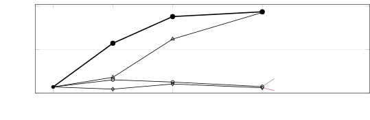
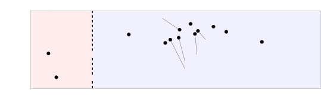

# Audio Token Attention Is Predictable Before the Language Model Runs

Kyoungjun Park    Yunzhe Li    Lili Qiu Affiliation: The University of
Texas at Austin Email: [{kjpark,lili}@cs.utexas.edu](mailto:)

###### Abstract

A large audio language model (LALM) turns a minute of speech into
$`750`$–$`1{,}500`$ tokens and prefills every one. Image-token pruning
often cuts after the language model’s first layers, where image tokens
draw little attention. Audio tokens draw much more attention there, and
their ranking is still far from final, so audio needs a ranking before
the language model runs. Surprisingly, the attention an audio token will
receive across the language model is already linearly predictable from
its encoder output, before the language model runs. A linear map, fitted
in closed form without labels, predicts this all-layer attention ranking
at $`\rho{\geq}.69`$ on eleven of thirteen LALMs. Our method, Triage,
cuts audio tokens by this prediction and, on multiple choice, cuts again
at layer $`2`$, correcting the prediction with the attention observed
there. Triage sets its compression without labels, under two budgets
that limit how far its output may differ from the model’s own full-audio
output. At the conservative budget, its word error rate and accuracy
stay within $`.04`$ of full audio. At the aggressive budget, Triage
beats every baseline in all twelve transcription cases. On multiple
choice, at $`2.2`$–$`5\times`$ compression, it outperforms DART, the
strongest baseline on average, by $`.043`$ in mean accuracy. Because it
cuts before the language model, it raises the audio that fits in
Qwen2.5-Omni-3B’s context window from $`21.8`$ to about $`62`$ minutes.
At its most compressive point, Triage lets one GPU serve $`4\times`$ as
many concurrent $`5`$-minute streams of that model. Project page:
[https://audio-triage.github.io](https://audio-triage.github.io)

|     |
| --- |
|     |

## 1 Introduction

A large audio language model (LALM) answers questions about speech,
sound and music directly from the audio \[24; 25; 27; 28\]. Its audio
encoder and projector, which together we call the _encoder_, turn the
waveform into one vector per audio token, the _encoder output_
$`\mathbf{e}_{i}`$ that the language model receives for token $`i`$. A
minute of speech becomes $`750`$ to $`1{,}500`$ tokens, and each costs
twice: the language model must prefill it, and it takes up space in the
context window. The context window of Qwen2.5-Omni-3B (Qwen 3B) holds
$`21.8`$ minutes of audio, so an hour-long lecture does not fit.

1. The prior predicts attention

2. Audio is not yet prunable

3. Other signals available before the language model predict attention
   weakly

Figure 1: Before the language model runs, the prior predicts which audio
tokens it will attend to, but other signals available at that point do
so only weakly. All panels: Qwen 30B. (1) A held-out LibriSpeech clip
with the median $`\rho`$: each audio token’s language-model attention
and the prior’s prediction of it. (2) At layer 2, each modality’s share
of the text positions’ attention and how well the tokens’ ranking by the
answer’s attention through that layer agrees with their all-layer
ranking. The shading is schematic. (3) Language-model attention against
the prior (green) and four other signals available before the language
model, over held-out LibriSpeech tokens ($`\rho`$ pooled over all
tokens).

Only a cut before the language model reduces both costs: a cut inside it
saves only the later layers, and the tokens it drops already hold
positions in the context window. Yet methods that rank by the language
model’s attention must run it first \[19; 18; 2; 22; 43; 44; 8; 7\], and
methods that cut earlier rank by position, acoustic energy,
self-information, similarity or the encoder’s own attention \[1; 6; 5;
13; 4; 23\]. The loudness, self-information and encoder-attention scores
predict the language model’s attention only weakly (Fig. 1, panel 3).
Two vision methods train a network to predict the language model’s
attention before it runs \[61; 62\]. SpeechPrune \[59\] needs the
question and approximates only layer 1’s attention.

Image-token pruning often cuts after the language model’s first layers,
which costs little if tokens are weakly attended by then or already
ranked. Audio tokens meet neither condition (§3.1). When the same
passages are given as speech and as rendered pages, with the same
questions, audio draws over twice the page’s attention at layer 2 on
both Qwen3-Omni-30B (Qwen 30B) and Qwen 3B, and it draws more than the
page on every passage and per token. At that layer, ranking the audio
tokens by the attention the answer has paid them so far agrees with
their all-layer ranking at only Spearman $`\rho{=}.39`$ (Fig. 1,
panel 2). So audio needs a ranking before the language model forms its
own.

Let $`g_{i}`$, the _language-model attention_ of audio token $`i`$, be
the attention it receives from the audio positions, summed over all
layers and heads. In our prompts the question follows the audio, so
under causal attention the audio positions never see it: $`g`$ does not
depend on the question, and a cut made before the question arrives can
use it. Surprisingly, $`g`$ is already linearly decodable from the
encoder output, before the language model processes any audio tokens. A
linear map, $`s_{i}=\mathbf{w}^{\top}\mathbf{e}_{i}+b`$, predicts
$`g_{i}`$ (Fig. 1, panels 1 and 3), and we call it _the prior_. Our
method, _Triage_, cuts in two stages (§4): _Stage 1_ cuts on the prior
before the language model runs, and _Stage 2_, used on multiple choice,
cuts again after the first two layers, correcting the prior with the
attention observed there. A label-free calibration sets how much each
stage cuts, under a conservative or an aggressive budget on how far the
output may drift from the full-audio output. App. A lists where each
main claim is measured. Our contributions:

- •
  Audio needs a ranking before the language model runs. Where
  image-token pruning cuts, at layer 2, audio tokens are still heavily
  attended and far from their final ranking (§3.1).
- •
  Future language-model attention is predictable before the language
  model runs. Fitted in closed form without labels, the prior predicts
  $`g`$ at $`\rho{\geq}.69`$ on eleven of thirteen LALMs. On seven of
  them, the loudness, self-information and encoder-attention scores used
  by other methods reach at most $`|\rho|{=}.31`$. With position,
  loudness and other waveform and word properties controlled, Qwen 3B’s
  prior keeps $`95`$ to $`97\%`$ of its $`\rho`$. Even against the
  answer’s attention, which depends on the question, the prior ranks
  tokens better than layer 2’s attention does (§3.2). Deleting its top
  tokens raises Voxtral’s word error rate (WER) more than deleting
  energy- or position-matched sets (§3.3).
- •
  Triage stays close to full audio at one budget and leads the baselines
  at the other. At its conservative budget, WER and accuracy stay within
  $`.04`$ of full audio. At its aggressive budget, it has lower WER than
  every baseline, mid-prefill included, in all twelve transcription
  cases. On multiple choice, at $`2.2`$ to $`5\times`$ compression, it
  outperforms DART, the strongest baseline on average, by $`.043`$ in
  mean accuracy (§4.2).
- •
  Only a cut before the language model saves context. On Qwen 3B,
  cutting the tokens $`2.86\times`$ raises the audio that fits in the
  context window from $`21.8`$ to about $`62`$ minutes. On natural
  recordings of $`20`$ to $`43`$ minutes, aggressive Triage outperforms
  truncating them to fit, voting over one-minute windows and DART at the
  same compression. At its most compressive point, Triage also lets one
  GPU serve $`4\times`$ as many concurrent streams (§4.3).

## 2 Related Work

#### Where existing methods cut, and by what.

KV eviction ranks tokens by the language model’s attention after the
prefill, so it frees only the decode cache \[43; 44; 8; 7\]. Mid-prefill
pruning ranks them by the attention paid so far and cuts inside the
language model: at layer 2 in FastV \[19\] and the concurrent
HeadRouter \[2\], at the middle layer in FastAV \[18\], and after the
first layers in IVTP’s second stage \[17\]. Lei et al. \[22\] cut at the
input using layer 1’s attention, and DART \[3\] at layer 2 by
dissimilarity to a few pivots. Methods that cut before the language
model rank tokens by position \[1\], by similarity to nearby
tokens \[6\], by acoustic energy or the encoder’s own attention \[4; 23;
17; 5\], or by self-information \[13; 14\], which LLMLingua-2 \[15\]
replaced with a distilled token classifier. In speech, one work learns
an entropy-based compressed representation \[12\] and a concurrent one
pools acoustically similar tokens \[16\]. §3.2 tests these signals
against language-model attention.

#### Predicting the language model’s attention.

Closest to our work, Fast3D \[61\] and the concurrent MAP \[62\] train a
network to predict the language model’s attention to visual tokens
before it runs. Fast3D fits a $`159`$M-parameter network that also sees
the prompt and cuts inside the language model from layer 2 on. MAP
distils one middle layer’s attention into a light predictor and cuts
before the first layer. In speech, SpeechPrune \[59\] also cuts before
the language model, but it needs the question and approximates only the
first layer’s attention. The prior differs in its target and its fit: it
predicts $`g`$, the attention summed over all layers, without seeing the
question, and it is a linear map on the encoder output alone, fitted in
closed form in seconds, without labels. The prior reaches
$`\rho{\geq}.69`$ on eleven of thirteen LALMs, and on three models a
trained MLP cuts no more accurately (§3.4).

## 3 Analysis: What Decides a Cut, and When

### 3.1 At Layer 2, Audio Is Still Heavily Attended and Not Yet Ranked

A cut at layer 2 of the language model is safe under either of two
conditions. Under the _attention condition_, the tokens it drops are
already weakly attended, so losing them costs little. Under the _ranking
condition_, the model has already ranked the tokens, so the cut can pick
the right ones. For images, FastV \[19\] shows the first: in
LLaVA \[10\], each image token draws $`0.21\%`$ of the attention a
system-prompt token draws after layer 2. We test both conditions on Qwen
30B with $`100`$ items per modality: audio from
AudioMarathon-RACE \[37\], images from MMMU \[41\] and token-dense video
from MVBench SSv2 \[42\].

Only images and video meet the attention condition. At layer 2 the text
positions send $`16.2\%`$ of their attention to audio, against $`3.6\%`$
to images and $`3.9\%`$ to video (Fig. 1, panel 2). A controlled run
confirms the gap. Given the same RACE passage as speech and as a
rendered page, with the same question, audio draws more attention at
layer 2 on all $`40`$ passages: $`2.3\times`$ the page’s share on Qwen
30B and $`2.1\times`$ on Qwen 3B. Per token, it also draws more on Qwen
30B, Qwen 3B and Phi-4. Token count and temporal structure do not
explain the gap: video has more tokens than audio and is also temporal,
yet from layer 2 onward it draws much less attention than audio, closer
to images.

On Qwen 30B, no modality meets the ranking condition. At layer 2 the
tokens’ ranking by the attention the model’s answer pays them agrees
with their all-layer ranking at only Spearman $`\rho{=}.39`$ for audio,
$`.39`$ for video and $`.46`$ for images. Images and video can afford an
unsettled ranking, since they meet the attention condition, but audio
meets neither condition. Deeper layers rank better (Fig. 2), but a token
dropped inside the language model has already taken a position in the
context window. So audio needs a ranking before the language model runs.

### 3.2 The Encoder Output Predicts Language-Model Attention

#### Target.

The target $`g_{i}`$ is the attention audio token $`i`$ receives from
the audio positions over the whole forward pass,

```math
g_{i}\;=\;\sum_{\ell=1}^{N_{\mathrm{layer}}}\sum_{h=1}^{H}\sum_{q\in\mathcal{Q}}a_{\ell,h}(q,i), \tag{1}
```

where $`a_{\ell,h}(q,i)`$ is the post-softmax attention from
position $`q`$ to token $`i`$ at layer $`\ell`$ and head $`h`$ of $`H`$
(zero for $`q{<}i`$ under causal masking), and $`\mathcal{Q}`$ is the
set of audio positions. We call $`g`$ _language-model attention_. Unlike
§3.1’s share, $`g`$ ranks the audio tokens against each other. We use
the audio positions for two reasons. In our prompts the question follows
the audio, so under causal attention the audio positions never see it,
and $`g`$ does not depend on the question, as required for a score used
before the question arrives. Even positions that do see the question
attend mostly to the same tokens: on Qwen 3B, the top $`25\%`$ of tokens
by attention from the last eight prompt rows overlap at Jaccard $`.71`$
across different questions on the same RACE passage, against $`.14`$ for
random sets of that size. We chose $`g`$ once, on a separate sample on
Qwen 3B (§3.4), and use it unchanged on transcription, on every other
model and on long recordings (§4.3). One full-audio forward pass gives
$`g`$, so fitting against it needs no labels, while cutting on $`g`$
itself would cost the full prefill.

#### The prior.

A ridge regression on the encoder output predicts $`g`$ on all seven
models of Tab. 1, at Spearman $`\rho{=}.69`$ to $`.83`$ on $`100`$
held-out clips. It maps each encoder output $`\mathbf{e}_{i}`$, the
vector the language model receives for audio token $`i`$, to the
per-clip $`z`$-normalised $`g_{i}`$ ($`\lambda{=}10`$, closed form) and
is fitted in seconds on a CPU, without labels. Its score
$`s_{i}=\mathbf{w}^{\top}\mathbf{e}_{i}+b`$ is _the prior_, known before
the language model runs and corrected by Stage 2 with the attention
observed at layer 2. In effect, the prior ranks the audio tokens by how
far each lies along one learned direction in the encoder’s output space.
In Tab. 1, the four models that attach a Whisper or conformer \[47\]
encoder to a pretrained language model (Ultravox, Phi-4, Voxtral and
Granite) span the whole range, so the prior does not need the encoder
and the language model to be trained together. Triage deploys one prior
per model, fitted on clips from several benchmarks at once: on Qwen 3B,
a prior pooled over six benchmarks, including sound and music, predicts
attention on each at least as well as one fitted to that benchmark
alone.

|                        |                   |                |                 |                                       |                  |
| ---------------------- | ----------------- | -------------- | --------------- | ------------------------------------- | ---------------- |
| $`\rho`$ against $`g`$ | the prior         | enc. self-attn | acoustic energy | state norm $`\|\mathbf{e}_{i}\|_{2}`$ | self-information |
| Ultravox, $`1`$B       | $`\mathbf{+.83}`$ | $`+.17`$       | $`+.28`$        | $`-.45`$                              | $`-.26`$         |
| Phi-4, $`5.6`$B        | $`\mathbf{+.79}`$ | $`+.23`$       | $`+.12`$        | $`+.03`$                              | $`+.12`$         |
| Voxtral, $`3`$B        | $`\mathbf{+.79}`$ | $`+.10`$       | $`+.15`$        | $`-.36`$                              | $`-.13`$         |
| Qwen2.5-Omni, $`3`$B   | $`\mathbf{+.75}`$ | $`+.17`$       | $`+.27`$        | $`-.49`$                              | $`-.12`$         |
| Qwen2.5-Omni, $`7`$B   | $`\mathbf{+.73}`$ | $`+.18`$       | $`+.29`$        | $`-.54`$                              | $`-.27`$         |
| Qwen3-Omni, $`30`$B    | $`\mathbf{+.70}`$ | $`+.31`$       | $`+.19`$        | $`-.33`$                              | $`-.14`$         |
| Granite, $`2`$B        | $`\mathbf{+.69}`$ | $`+.08`$       | $`+.18`$        | $`+.12`$                              | $`+.25`$         |

Table 1: The prior predicts language-model attention on all seven
models, while three signals used by existing methods predict it weakly
and the state norm changes sign across models. Each entry is the
per-clip Spearman $`\rho`$ against $`g`$, averaged over $`100`$ held-out
LibriSpeech clips per model. Fig. 3b adds three more LALMs
($`\rho{=}.82`$ to $`.88`$), DiVA ($`\rho{=}.91`$) and the two
Qwen-Audio models, where the prior fails. DiVA is left out here because
its learned query tokens have no time order. Bold: each row’s largest
$`|\rho|`$.

#### Simpler signals.

The signals used by existing methods (the encoder’s self-attention,
acoustic energy and self-information) reach at most $`|\rho|{=}.31`$ on
the seven models of Tab. 1, and the state norm, the strongest unfitted
signal on five models, flips sign on Phi-4 and Granite. A regression
fitted to the waveform stays well below the prior: on Qwen 3B, the same
regression refit on seven waveform descriptors of each token, including
its position and loudness, reaches only $`\rho{=}.49`$ on LibriSpeech,
against the prior’s $`.76`$. Position is the most informative of them,
since under causal attention an early token is seen by more positions,
but the prior correlates with it far less ($`\rho{=}{-}.226`$, against
$`-.485`$ for $`g`$). Such properties do not explain the prior, even
combined linearly: on Qwen 3B the prior keeps $`95`$ to $`97\%`$ of its
$`\rho`$ on two benchmarks when eleven such properties of the waveform
and its words, including each token’s position, are controlled for at
once.

#### Deep layers.

The prior predicts attention deep in the model, not just the layer-1
attention between audio positions, which is a function of $`\mathbf{e}`$
by construction. Refit against $`g`$ restricted to a range of layers, it
does worst on layer 1 alone, and on the deepest quarter of layers it
still reaches $`\rho{=}.78`$ on Voxtral and $`.71`$ on Qwen 3B. The
prior also predicts more than the attention sink: with the sink’s column
dropped from $`g`$, its $`\rho`$ does not fall ($`.82`$ and $`.77`$).

Figure 2: Where Stage 2 cuts, the prior ranks the audio tokens better
than the language model’s own attention, and the two combined rank them
best. Qwen 30B, AudioMarathon-RACE. Every ranking is scored against the
answer’s attention: the attention the answer pays each audio token over
all $`48`$ layers. The blue curve ranks the tokens by that attention
summed only through each layer, so it reaches $`1`$ at layer 48 by
construction. The green line is the prior, fixed before layer 1. The
diamond averages the two rankings at the cut. Past the strip marked
_cut_, the prefill over every token is paid.

#### Ranking at layer 2.

Where Stage 2 cuts, the prior already ranks the audio tokens better than
the language model’s own attention, and a token the prior drops costs no
prefill. Fig. 2 scores both against a harder target than the $`g`$ of
Tab. 1: the answer’s attention, which depends on a question the prior
never sees. At layer 2 the prior scores $`\rho{=}.46`$ against the
attention’s $`.39`$, and averaging the two rankings beats both
($`.51`$). Stage 2 builds on this combination. On Qwen 3B, we cut at
layer 2 to keep three different fractions of the audio tokens on three
multiple-choice benchmarks. In eight of these nine settings, cutting on
the prior is more accurate than cutting on the attention observed there.
FastV’s signal takes that attention from the last prompt rows only, and
the prior beats it in all nine.

### 3.3 The Prior’s Top Tokens Matter, and One Pass Separates Its Failures

Deleting the prior’s top tokens costs the most. If the model relies on
the tokens the prior ranks highest, deleting them should hurt more than
deleting other tokens. On Voxtral, this deletion raises WER more than
deleting the same number of tokens by any of the three other rules in
Fig. 3a, though self-information nearly matches it at the $`35\%`$ rate.
Two of those rules match the prior’s top tokens in acoustic energy or in
position, and both cost far less, so the prior captures more than energy
or position: at the $`10\%`$ rate its deletion costs $`+.53`$ WER more
than the same-energy one. On Phi-4, and on Qwen 3B with multiple-choice
questions, this deletion also costs more than the same-energy one.



(a) Deleting the prior’s top tokens costs the most.



(b) One pass, before fitting, separates the prior’s failures.

Figure 3: Deleting the prior’s top tokens costs the most, and one
forward pass separates the prior’s failures. (a) Voxtral, LibriSpeech.
Each line deletes the same number of tokens by a different rule. _Same
energy_ and _position_ delete other tokens that match the prior’s top
tokens in acoustic energy or in their spread over the clip. The three
controls not drawn (random, the prior’s lowest-ranked and the loudest
tokens) cost less at every rate. (b) Thirteen LALMs \[24; 25; 27; 28;
53; 51; 50; 52; 26; 63; 64; 65\]. Each is screened with one forward pass
over $`20`$ unlabelled clips.

One unlabelled forward pass separates the LALMs the prior fails on. The
prior reaches $`\rho{\geq}.69`$ on eleven of the thirteen LALMs in
Fig. 3b, from five language-model families, and fails on the two
Qwen-Audio models ($`\rho{=}.29`$ and $`.57`$). A screen tells the two
groups apart before anything is fitted: one forward pass over $`20`$
unlabelled clips measures how far the audio positions move through the
language model’s first two layers, where Stage 2 cuts. This drift,
averaged over audio positions and clips, is
$`\Delta_{2}=\lVert\mathbf{h}_{2}-\mathbf{h}_{0}\rVert/\lVert\mathbf{h}_{0}\rVert`$,
where $`\mathbf{h}_{0}`$ is the language model’s input at an audio
position and $`\mathbf{h}_{\ell}`$ its hidden state after
layer $`\ell`$. A threshold of $`0.25`$ splits the thirteen models.
SeaLLMs-Audio and Aero-1-Audio attach Qwen2-Audio’s encoder to Qwen2.5
language models, and the prior works on both, so the screen does not
simply flag that encoder. The screen needs no prior, labels or task run
and takes under two minutes on one A100.

### 3.4 A Linear Map Is Enough

Targets. For targets taken from the language model, the better the prior
predicts a target, the more accurate the cut. On Qwen 3B and DREAM, we
fit the prior to each of thirteen such targets, including variants of
$`g`$ and gradient saliency, and cut on each prediction, keeping
$`25\%`$ of the tokens. A target’s $`\rho`$ and its cut’s accuracy have
a rank correlation of $`+.66`$, and $`g`$’s cut is the most accurate of
the thirteen ($`.815`$). Targets that also use the attention of the text
positions, which see the question, do no better (at most $`.812`$).
Acoustic energy, a property of the sound rather than of the model, is
the exception: the prior predicts it best ($`\rho{=}.88`$), but its cut
reaches only $`.662`$. A target must therefore come from the model
itself, not merely be easy to predict.

Predictors. Training a network to predict attention, as Fast3D \[61\]
and MAP \[62\] do, does not help here. A $`1.3`$M-parameter MLP fits
$`g`$ better than the prior, mostly among low-ranked tokens a cut
discards, yet on Qwen 3B it cuts no more accurately: over nine paired
settings (three benchmarks at three operating points), the median
accuracy difference is $`+.005`$ in the prior’s favour. On Qwen 30B and
Voxtral, at the deployed operating points, its cut is never
significantly more accurate than the prior’s either. An
$`8.5`$M-parameter Perceiver connector \[45\], trained against the
frozen model’s own answers, does not significantly beat the prior at the
deployed compressions and is less accurate at a higher compression. It
also leaves Stage 2 no per-token score to refine, since it replaces the
audio tokens with new vectors. A closed-form linear map is therefore
enough, and Triage uses it.

## 4 Triage: Cutting with the Prior

Triage uses one prior per model and a label-free calibration, and leaves
the encoder and the language model frozen (Fig. 4). Stage 1 cuts the
$`N`$ audio tokens to a shortlist of $`K_{1}`$ with the prior of §3.2,
before the language model runs. Stage 2 cuts the shortlist to $`K`$ at
layer 2, correcting the prior with the attention observed there. The
task decides how the cut is made. Transcription needs all of the speech,
so Stage 1 covers the whole timeline and makes the only cut. A question
needs only the parts it asks about, so Stage 1 keeps the prior’s top
tokens and Stage 2 makes the final cut.

#### Stage 1.

Stage 1 scores each audio token with the prior,
$`s_{i}=\mathbf{w}^{\top}\mathbf{e}_{i}+b`$, on the encoder output the
model has already computed, so it needs no extra forward pass. It keeps
$`K_{1}=\max(2,\lfloor r_{1}N\rfloor)`$ tokens in their original time
order. The language model receives only this shorter sequence, with
contiguous positions. On multiple choice it keeps the $`K_{1}`$
highest-scoring tokens (_top-$`K`$_). On transcription it keeps the
highest-scoring token in each of $`K_{1}`$ equal time bins (_bin
coverage_), allocating tokens as segmentwise pruning \[4\] does.
Transcription uses bin coverage alone ($`K_{1}{=}K`$): at seven of the
eight Qwen operating points on LibriSpeech and FLEURS, it has lower WER
than both stages together. We keep this choice unchanged for TEDLIUM,
Voxtral and Phi-4.

#### Stage 2.

At layer 2 the prior is still ahead of the attention observed there
(§3.2), so Stage 2 uses that attention to correct the prior’s ranking,
not to replace it. It runs the language model over $`[\,`$prompt prefix;
shortlist; prompt suffix$`\,]`$ for two layers and, for each head $`h`$,
sums over both layers the attention $`c_{hi}`$ that shortlist token
$`i`$ receives from every prompt-suffix position. The prompt suffix
holds the question, which the prior never sees, so the question first
affects the cut here. Prior and observation are put on one scale as
percentile ranks over the shortlist, $`r^{\text{pred}}_{i}`$ of
$`s_{i}`$ and $`r^{\text{obs}}_{i}`$ of $`\sum_{h}c_{hi}`$, and combined
per token as

```math
\gamma_{i}\;=\;\alpha_{i}\,r^{\text{obs}}_{i}\;+\;(1-\alpha_{i})\,r^{\text{pred}}_{i}, \tag{2}
```

where the head-agreement weight $`\alpha_{i}\in[0,1]`$ is the percentile
rank of $`\operatorname{mean}_{h}c_{hi}/\operatorname{std}_{h}c_{hi}`$.
We call Eq. 2 _precision fusion_ because $`\alpha_{i}`$ acts like a
precision: where the heads disagree, the observed score is noisy and the
prior keeps more weight, and where they agree, the observed attention,
which has seen the question, gets more weight. Stage 2 keeps the top
$`K=\max(1,\lfloor r_{2}N\rfloor)`$ tokens by $`\gamma`$, and survivors
keep their position IDs, which are already in the KV cache.

Figure 4: Triage: two cuts, one prior. Stage 1 cuts the encoder’s $`N`$
audio tokens to $`K_{1}`$ before the language model runs. The bars above
the first strip are the prior $`s`$, solid where Stage 1 keeps the
token. Stage 2 cuts $`K_{1}{\to}K`$ at layer 2, correcting the prior
with the attention observed there. Transcription runs Stage 1 alone.
Lower left (schematic): _top-$`K`$_, used on multiple choice, can leave
whole bins with no token, while _bin coverage_, used on transcription,
keeps one token from each of $`K_{1}`$ equal time bins.

#### Calibration.

For each benchmark and budget, the calibration sets $`r_{1}`$ and
$`r_{2}`$ by self-consistency with the model’s own full-audio output. On
unlabelled clips it decodes once from the full audio and once per
candidate $`(r_{1},r_{2})`$, and measures the _drop_: WER against the
full-audio transcript, or on multiple choice the fall in the probability
of the full-audio answer. Step 1 takes the most compressive $`r_{2}`$
whose drop stays within the budget, $`.08`$ (conservative) or $`.20`$
(aggressive), on both a calibration and a held-out split. Step 2 then
sets the shortlist fraction $`r_{1}{>}r_{2}`$.

### 4.1 Setup

We run Qwen 3B, Qwen 30B, Voxtral and Phi-4 on six benchmarks at both
budgets, giving $`24`$ _cases_ (model, benchmark and budget) per task.
Transcription uses LibriSpeech \[32\], FLEURS \[34\] and TEDLIUM \[33\],
scored by corpus WER. Multiple choice uses MMSU \[35\], DREAM \[36; 49\]
in AudioBench’s text-to-speech version, and AudioMarathon-RACE \[37\],
scored by accuracy. The prior and the calibration see only unlabelled
audio.

Baselines are grouped by where they cut, which sets their cost.
_Encoder-side_ baselines select from the encoder output alone: uniform
pooling \[1\], energy-based voice activity detection (VAD), random
selection, and DART \[3\], a vision-token method whose criterion needs
only the token sequence. On multiple choice we add SpeechPrune \[59\],
which also cuts before the language model but ranks tokens by their
similarity to the question and by an approximation of the first layer’s
attention. _Mid-prefill_ baselines, FastV*(N) \[19\] and
HeadRouter*(N) \[2\], rank all $`N`$ audio tokens at layer 2 and then
cut to the same $`K`$. HeadRouter’s released head weights cover only
Qwen 3B, and elsewhere its heads are weighted uniformly. On Qwen 3B,
Triage leads HeadRouter*(N) in all six aggressive cases, three per task.
FastV*(N) scores tokens by the attention from the trailing prompt rows,
as FastV is usually implemented. Triage also matches or beats an
all-rows variant in eleven of the twelve Qwen multiple-choice cases. We
compare against DART, the strongest encoder-side baseline on average,
and against the best baseline in each case. Intervals are paired
bootstraps over clips.

### 4.2 Main Results

|                                           |                 |          |      |     |                |          |      |     |         |          |      |     |       |          |      |
| ----------------------------------------- | --------------- | -------- | ---- | --- | -------------- | -------- | ---- | --- | ------- | -------- | ---- | --- | ----- | -------- | ---- |
|                                           | Qwen2.5-Omni-3B |          |      |     | Qwen3-Omni-30B |          |      |     | Voxtral |          |      |     | Phi-4 |          |      |
| (a) WER                                   | Libri           | FLEURS   | TED  |     | Libri          | FLEURS   | TED  |     | Libri   | FLEURS   | TED  |     | Libri | FLEURS   | TED  |
| full audio                                | .083            | .153     | .215 |     | .011           | .037     | .020 |     | .020    | .043     | .032 |     | .017  | .045     | .085 |
| \[2pt/1.5pt\] _conservative_ ($`\times`$) | 1.54            | 1.11     | 1.25 |     | 1.54           | 1.54     | 1.67 |     | 1.54    | 1.54     | 2.00 |     | 1.54  | 1.54     | 1.54 |
| ours                                      | .099            | .177     | .197 |     | .025           | .050     | .049 |     | .025    | .043     | .071 |     | .045  | .064     | .102 |
| \[2pt/1.5pt\] _aggressive_ ($`\times`$)   | 2.00            | 1.18     | 1.67 |     | 2.00           | 2.00     | 2.00 |     | 2.86    | 2.86     | 2.38 |     | 2.86  | 2.86     | 2.86 |
| uniform pooling                           | .348            | .325     | .403 |     | .160           | .140     | .123 |     | .398    | .385     | .241 |     | .383  | .368     | .488 |
| VAD                                       | .327            | .355     | .496 |     | .199           | .138     | .166 |     | .665    | .719     | .317 |     | .472  | .402     | .531 |
| random                                    | .496            | .236     | .409 |     | .429           | .385     | .378 |     | .627    | .646     | .521 |     | .597  | .583     | .646 |
| DART                                      | .160            | .221     | .290 |     | .134           | .119     | .123 |     | .139    | .119     | .441 |     | .612  | .529     | .697 |
| FastV\_(N)                                | .395            | .200     | .364 |     | .354           | .386     | .381 |     | .753    | .782     | .304 |     | .456  | .426     | .422 |
| HeadRouter\_(N)                           | .173            | .215     | .288 |     | .305           | .210     | .258 |     | .190    | .109     | .170 |     | .550  | .472     | .441 |
| ours                                      | .116            | .174     | .195 |     | .060           | .081     | .083 |     | .088    | .066     | .152 |     | .312  | .285     | .397 |
| (b) accuracy                              | MMSU            | DREAM    | RACE |     | MMSU           | DREAM    | RACE |     | MMSU    | DREAM    | RACE |     | MMSU  | DREAM    | RACE |
| full audio                                | .603            | .892     | .818 |     | .715           | .922     | .870 |     | .552    | .882     | .765 |     | .550  | .843     | .688 |
| \[2pt/1.5pt\] _conservative_ ($`\times`$) | 1.54            | 2.22     | 1.54 |     | 1.82           | 1.54     | 1.82 |     | 2.86    | 1.54     | 1.54 |     | 1.54  | 1.54     | 1.54 |
| ours                                      | .600            | .865     | .823 |     | .690           | .940     | .863 |     | .535    | .885     | .748 |     | .540  | .812     | .685 |
| \[2pt/1.5pt\] _aggressive_ ($`\times`$)   | 4.00            | 5.00     | 2.86 |     | 2.86           | 2.22     | 2.86 |     | 5.00    | 2.86     | 2.86 |     | 2.86  | 2.86     | 2.86 |
| uniform pooling                           | .517            | .530     | .705 |     | .588           | .848     | .755 |     | .443    | .735     | .675 |     | .507  | .740     | .647 |
| VAD                                       | .552            | .620     | .718 |     | .652           | .877     | .740 |     | .405    | .603     | .610 |     | .505  | .690     | .630 |
| random                                    | .505            | .569     | .677 |     | .573           | .759     | .723 |     | .415    | .596     | .608 |     | .486  | .604     | .600 |
| DART                                      | .547            | .757     | .805 |     | .620           | .902     | .807 |     | .532    | .800     | .632 |     | .460  | .667     | .610 |
| SpeechPrune                               | .485            | .530     | .608 |     | .593           | .843     | .720 |     | .532    | .818     | .562 |     | .445  | .560     | .585 |
| bin coverage                              | .595            | .767     | .818 |     | .642           | .915     | .802 |     | .520    | .835     | .657 |     | .510  | .767     | .627 |
| FastV\_(N)                                | .557            | .688     | .730 |     | .578           | .818     | .740 |     | .502    | .802     | .608 |     | .458  | .675     | .613 |
| HeadRouter\_(N)                           | .557            | .740     | .807 |     | .588           | .805     | .752 |     | .527    | .860     | .690 |     | .472  | .665     | .635 |
| ours                                      | .585            | .863^(†) | .820 |     | .682^(†)       | .943^(†) | .828 |     | .525    | .873^(†) | .655 |     | .492  | .743^(†) | .650 |

Table 2: Both tasks at both budgets (full results in App. H). Every
selector in a column keeps the same number of tokens, $`K{=}N/c`$, where
$`c`$ is the compression in the first row of each budget.
(a) Transcription, corpus WER (lower is better; $`n{=}300`$ per case,
$`100`$ on Qwen 30B, seven talks on TEDLIUM). Ours is bin coverage.
(b) Multiple choice, accuracy (higher is better; $`n{=}400`$ per case;
RACE is AudioMarathon-RACE). Ours is two-stage Triage with precision
fusion. Bin coverage is the same one-stage cut as ours in (a) and never
sees the question. ^(†)Ahead of DART in a one-sided exact McNemar test,
Holm-corrected over the twelve cases. Bold: the best selector at the
aggressive budget.

#### Transcription.

At the conservative budget ($`1.11`$–$`2.00\times`$), bin coverage costs
a median of $`.017`$ WER against full audio and has lower WER than every
baseline in ten of the twelve cases. The aggressive budget
($`1.18`$–$`2.86\times`$) is a stress test: bin coverage has lower WER
than every baseline in all twelve cases, the mid-prefill ones included,
and is below DART by a median of $`.064`$ (Tab. 2a). Covering the
timeline is not enough: uniform pooling covers it too and has higher WER
in all $`24`$ cases. In the eight Qwen LibriSpeech and FLEURS cases, bin
coverage also matches or beats a neural VAD, a word-onset selector and
decimation, which keeps evenly spaced tokens (WER $`.369`$ against
$`.116`$ for Qwen 3B on LibriSpeech at the aggressive budget).
Segmentwise pruning keeps the same bins but scores the tokens by the
encoder’s self-attention. It has higher WER in all eight cases, by a
median of $`.018`$, and trails DART on mean WER. Both parts count: the
bins cover the timeline, and the prior picks the token within each bin.

Figure 5: At the same $`K`$, Triage stays within two points of full
audio to higher compression than every baseline. Qwen 3B on a second
sample of clips ($`n{=}400`$ per benchmark, $`241`$ on RACE), disjoint
from Tab. 2’s clips on MMSU and DREAM. The red dashed line is full
audio, and the shaded area is the two-point band. Triage is inside the
band to $`2.9\times`$ on MMSU and DREAM and through $`6.7\times`$, the
highest ratio swept, on RACE. No baseline is inside it past $`2\times`$
on MMSU and DREAM or past $`4\times`$ on RACE.

#### Multiple choice.

At the aggressive budget ($`2.22`$–$`5.00\times`$), precision fusion is
ahead of DART by $`+.043`$ $`[+.032,+.053]`$ averaged over the twelve
cases (Tab. 2b). It is ahead of DART in eleven of the twelve cases and
on each benchmark on average, by $`.024`$ to $`.073`$, and ahead of the
best baseline in nine cases. It still leads DART in five of the six
Voxtral and Phi-4 cases, and on natural read speech (§4.3). No baseline
is a safe substitute: each trails Triage by at least $`.07`$ in some
Voxtral or Phi-4 case, while Triage is never more than $`.035`$ behind
any. SpeechPrune, which also sees the question, trails Triage in eleven
of the twelve cases. Even when DART is applied to the language model’s
layer-2 states, it trails Triage by at least $`.075`$ on DREAM. At the
conservative budget ($`1.54`$–$`2.86\times`$), Triage is within $`.02`$
of full audio in nine of the twelve cases and never more than $`.031`$
below. Within two points of full audio, it compresses $`1.4`$ to
$`2.0\times`$ more than every baseline we swept on Qwen 3B, on every
benchmark and in each of two samples (Fig. 5). Beyond speech, on the
sound questions of MMAU-mini and MMAR, the conservative cut stays within
$`.03`$ of full audio on both Qwen models.

#### What each part adds.

The prior alone already leads: cutting once with bin coverage, before
the language model runs and without the question, it is ahead of DART by
$`.026`$ on average and in ten of the twelve aggressive cases (Tab. 2b).
The full two-stage Triage, whose Stage 2 sees the question, leads DART
by $`.043`$, and is ahead of Stage 1’s top-$`K`$ cut at the same $`K`$
in eleven of the twelve aggressive cases and tied in the twelfth. The
layer-2 cut depends on the prior’s shortlist: replacing it with a random
shortlist of the same size costs Triage $`.047`$ to $`.147`$ accuracy at
Qwen 3B’s three aggressive points. On the same shortlist, precision
fusion is on average $`.024`$ above cutting on the observed attention
alone, and on Qwen 3B, averaged over cuts at layers 2 and 8, it is the
most accurate of eight fusion rules, above a supervised learned gate.
The prior thus picks the shortlist, and the observed attention, which
has seen the question, refines it.

### 4.3 Efficiency

Fewer audio tokens mean faster prefill, more concurrent streams and more
audio per context window.

Language-model prefill. Stage 1 cuts before the first layer, so every
layer runs on the shorter sequence. At eight deployed operating points
(two models, two tasks, two budgets), prefill time falls by $`1.2`$ to
$`3.7\times`$ on a GH200, on $`5`$ minutes of audio for Qwen 3B and
$`40`$ minutes for Qwen 30B. The saving grows with length: on an A100,
Qwen 3B’s aggressive DREAM point ($`5\times`$) gives $`4.5\times`$ on
$`5`$ minutes and $`6.3\times`$ on $`20`$. The two layers before
Stage 2’s cut add $`3\%`$ on average over a prefill of only the $`K`$
kept tokens.

Batched serving. At the same point on $`5`$ minutes of audio, one GH200
serves $`1{,}024`$ concurrent streams, the most we tried and $`4\times`$
as many as with full audio, at $`4.5\times`$ the decode throughput.
Fewer tokens shrink each stream’s KV cache, so more streams fit in GPU
memory.

With the encoder. The encoder still runs on all $`N`$ tokens, and
Stage 1 adds only one dot product per token. On the A100, encoder and
prefill together speed up $`1.28`$ to $`1.51\times`$ for $`5`$ to $`40`$
minutes of audio.

Context window. Only a cut before the language model extends the context
window: the tokens it keeps take contiguous positions. Qwen 3B’s window
has room for $`21.8`$ minutes of audio ($`32{,}768`$ positions at
$`1{,}500`$ audio tokens a minute). On needle-in-a-haystack QA over
$`20`$ to $`45`$ minutes of concatenated RACE articles, Stage 1 at the
aggressive point cuts the tokens $`2.86\times`$, which fits about $`62`$
minutes into the window, and one forward pass matches per-minute window
voting, which needs $`20`$ to $`45`$ passes ($`.722`$ against $`.706`$).
On $`90`$ natural recordings of $`20`$ to $`43`$ minutes (QuALITY
stories \[56\] read by LibriVox volunteers \[57\]), only $`6`$ fit Qwen
3B’s window at full length. Here, aggressive Triage reaches $`.584`$
accuracy: $`.046`$ above truncating each recording to fit the window,
$`.026`$ above per-minute window voting, which keeps every token, and
$`.023`$ and $`.132`$ above DART and uniform pooling at the same $`K`$,
with all intervals above zero. Truncation loses each recording’s end and
voting sees one minute at a time, while Triage keeps the whole recording
in one pass.

## 5 Conclusion

Where image pruning cuts, audio tokens are still heavily attended and
far from their final ranking, so audio needs a ranking before the
language model runs. A linear map on the encoder output, fitted in
closed form on unlabelled clips, supplies one on eleven of thirteen
LALMs, far better than the signals used by existing methods. At layer 2
it even ranks the tokens better than the language model’s own attention.
Cutting on it, Triage stays close to full audio at its conservative
budget. At its aggressive budget it beats every baseline on
transcription and leads DART on multiple choice. Because it cuts before
the language model, the context window holds nearly $`3\times`$ as much
audio, about an hour on Qwen 3B. Triage needs no labels and keeps the
model frozen.

#### Limitations and future work.

The linear prior fails on the two Qwen-Audio models (§3.3). The screen
flags such models from one forward pass, and a nonlinear prior may
extend Triage to them. The prior is fitted to attention, a proxy for
usefulness, but the same closed-form fit applies to any per-token
target, so a closer proxy can replace attention. Combining Triage with
KV-cache eviction during decoding is a natural next step.

## References

- \[1\] S. Bhati, S. Thomas, H. Kuehne, R. Feris, and J. Glass. Towards
  audio token compression in large audio language models.
  _arXiv:2511.20973_, 2025.
- \[2\] P. He, Y. Luo, X. Liu, X. Liu, J. Deng, Y. Du, B. Li, X. Gui,
  Y. Chen, and L. Zhang. HeadRouter: dynamic head-weight routing for
  task-adaptive audio token pruning in large audio language models. In
  _ACM MM_, 2026. arXiv:2604.23717.
  [https://github.com/DabDans/HeadRouter](https://github.com/DabDans/HeadRouter).
- \[3\] Z. Wen, Y. Gao, S. Wang, J. Zhang, Q. Zhang, W. Li, C. He, and
  L. Zhang. Stop looking for important tokens in multimodal language
  models: duplication matters more. In _EMNLP_, 2025.
- \[4\] M. Gibier, P. Serrano, O. Boeffard, R. Duroselle, and
  J.-F. Bonastre. Segmentwise pruning in audio-language models. In
  _ICASSP_, 2026.
- \[5\] T. Lee and H. Lee. Token pruning in audio transformers:
  optimizing performance and decoding patch importance. In _ECAI_, 2025.
- \[6\] J. Luo, X. Liang, and H. Hu. Locality matters for training-free
  audio token compression in audio-language models.
  _arXiv:2605.25179_, 2026.
- \[7\] Y. Wang, P. He, X. Gui, et al. AudioKV: KV cache eviction in
  efficient large audio language models. _arXiv:2604.06694_, 2026.
- \[8\] Z. Cai, Y. Zhang, B. Gao, et al. PyramidKV: dynamic KV cache
  compression based on pyramidal information funneling. In _COLM_, 2025.
- \[9\] Y. Shang, M. Cai, B. Xu, Y. J. Lee, and Y. Yan. LLaVA-PruMerge:
  adaptive token reduction for efficient large multimodal models. In
  _ICCV_, 2025.
- \[10\] H. Liu, C. Li, Y. Li, and Y. J. Lee. Improved baselines with
  visual instruction tuning. In _CVPR_, pages 26286–26296, 2024.
- \[11\] D. Bolya, C.-Y. Fu, X. Dai, P. Zhang, C. Feichtenhofer, and
  J. Hoffman. Token Merging: your ViT but faster. In _ICLR_, 2023.
- \[12\] J. Zuo, G. Zhang, M. Fang, et al. Entropy-based coarse and
  compressed semantic speech representation learning.
  _arXiv:2509.00503_, 2025.
- \[13\] H. Jiang, Q. Wu, C.-Y. Lin, Y. Yang, and L. Qiu. LLMLingua:
  compressing prompts for accelerated inference of large language
  models. In _EMNLP_, 2023.
- \[14\] H. Jiang, Q. Wu, X. Luo, D. Li, C.-Y. Lin, Y. Yang, and L. Qiu.
  LongLLMLingua: accelerating and enhancing LLMs in long context
  scenarios via prompt compression. In _ACL_, 2024.
- \[15\] Z. Pan, Q. Wu, H. Jiang, M. Xia, X. Luo, J. Zhang, Q. Lin,
  V. Rühle, Y. Yang, C.-Y. Lin, H. V. Zhao, L. Qiu, and D. Zhang.
  LLMLingua-2: data distillation for efficient and faithful
  task-agnostic prompt compression. In _Findings of ACL_, 2024.
- \[16\] B. Xiang, T. Guo, X. Chen, and Y. Han. Do we need distinct
  representations for every speech token? Unveiling and exploiting
  redundancy in large speech language models. In _Findings of
  ACL_, 2026.
- \[17\] K. Huang, H. Zou, Y. Xi, et al. IVTP: instruction-guided visual
  token pruning for large vision-language models. In _ECCV_, 2024.
- \[18\] C. Jung, Y. Jang, S. Lee, and J. S. Chung. FastAV: efficient
  token pruning for audio-visual large language model inference. In
  _ICASSP_, 2026.
- \[19\] L. Chen, H. Zhao, T. Liu, et al. An image is worth 1/2 tokens
  after layer 2: plug-and-play inference acceleration for large
  vision-language models. In _ECCV_, 2024.
- \[20\] Y. Rao et al. DynamicViT: efficient vision transformers with
  dynamic token sparsification. In _NeurIPS_, 2021.
- \[21\] Y. Zhang, C.-K. Fan, J. Ma, et al. SparseVLM: visual token
  sparsification for efficient vision-language model inference. In
  _ICML_, 2025.
- \[22\] L. Lei, J. Gu, X. Ma, et al. Task-related token compression in
  multimodal large language models from an explainability perspective.
  In _ICLR_, 2026.
- \[23\] Q. Zhang, A. Cheng, M. Lu, et al. Beyond text-visual attention:
  exploiting visual cues for effective token pruning in VLMs. In
  _ICCV_, 2025.
- \[24\] J. Xu et al. Qwen2.5-Omni technical report.
  _arXiv:2503.20215_, 2025.
- \[25\] J. Xu et al. Qwen3-Omni technical report.
  _arXiv:2509.17765_, 2025.
- \[26\] Y. Chu et al. Qwen2-Audio technical report.
  _arXiv:2407.10759_, 2024.
- \[27\] A. H. Liu et al. Voxtral. _arXiv:2507.13264_, 2025.
- \[28\] A. Abouelenin et al. Phi-4-Mini technical report: compact yet
  powerful multimodal language models via mixture-of-LoRAs.
  _arXiv:2503.01743_, 2025.
- \[29\] A. Radford, J. W. Kim, T. Xu, G. Brockman, C. McLeavey, and
  I. Sutskever. Robust speech recognition via large-scale weak
  supervision. In _ICML_, 2023.
- \[30\] A. Baevski, Y. Zhou, A. Mohamed, and M. Auli. wav2vec 2.0: a
  framework for self-supervised learning of speech representations. In
  _NeurIPS_, 2020.
- \[31\] B. McFee, C. Raffel, D. Liang, D. P. W. Ellis, M. McVicar,
  E. Battenberg, and O. Nieto. librosa: audio and music signal analysis
  in Python. In _Proc. 14th Python in Science Conference_, pages
  18–24, 2015.
- \[32\] V. Panayotov, G. Chen, D. Povey, and S. Khudanpur. LibriSpeech:
  an ASR corpus based on public domain audio books. In _ICASSP_, pages
  5206–5210, 2015.
- \[33\] F. Hernandez, V. Nguyen, S. Ghannay, N. Tomashenko, and
  Y. Estève. TED-LIUM 3: twice as much data and corpus repartition for
  experiments on speaker adaptation. In _SPECOM_, volume 11096 of
  _LNCS_, pages 198–208, 2018.
- \[34\] A. Conneau et al. FLEURS: few-shot learning evaluation of
  universal representations of speech. In _SLT_, 2022.
- \[35\] D. Wang et al. MMSU: a massive multi-task spoken language
  understanding and reasoning benchmark. In _ICLR_, 2026.
- \[36\] K. Sun, D. Yu, J. Chen, D. Yu, Y. Choi, and C. Cardie. DREAM: a
  challenge data set and models for dialogue-based reading
  comprehension. _TACL_, 7:217–231, 2019.
- \[37\] P. He et al. AudioMarathon: a comprehensive benchmark for
  long-context audio understanding and efficiency in audio LLMs.
  _arXiv:2510.07293_, 2025.
- \[38\] S. Sakshi et al. MMAU: a massive multi-task audio understanding
  and reasoning benchmark. In _ICLR_, 2025.
- \[39\] Z. Ma et al. MMAR: a challenging benchmark for deep reasoning
  in speech, audio, music, and their mix. In _NeurIPS Datasets and
  Benchmarks Track_, 2025.
- \[40\] C. Busso, M. Bulut, C.-C. Lee, A. Kazemzadeh, E. Mower, S. Kim,
  J. N. Chang, S. Lee, and S. S. Narayanan. IEMOCAP: interactive
  emotional dyadic motion capture database. _Language Resources and
  Evaluation_, 42(4):335–359, 2008.
- \[41\] X. Yue et al. MMMU: a massive multi-discipline multimodal
  understanding and reasoning benchmark for expert AGI. In _CVPR_, 2024.
- \[42\] K. Li et al. MVBench: a comprehensive multi-modal video
  understanding benchmark. In _CVPR_, 2024.
- \[43\] Y. Li et al. SnapKV: LLM knows what you are looking for before
  generation. In _NeurIPS_, 2024.
- \[44\] Z. Zhang et al. H₂O: heavy-hitter oracle for efficient
  generative inference of large language models. In _NeurIPS_, 2023.
- \[45\] A. Jaegle, F. Gimeno, A. Brock, O. Vinyals, A. Zisserman, and
  J. Carreira. Perceiver: general perception with iterative attention.
  In _ICML_, 2021.
- \[46\] J. Li, D. Li, S. Savarese, and S. Hoi. BLIP-2: bootstrapping
  language-image pre-training with frozen image encoders and large
  language models. In _ICML_, 2023.
- \[47\] A. Gulati et al. Conformer: convolution-augmented transformer
  for speech recognition. In _Interspeech_, 2020.
- \[48\] Q. McNemar. Note on the sampling error of the difference
  between correlated proportions or percentages. _Psychometrika_,
  12(2):153–157, 1947.
- \[49\] B. Wang et al. AudioBench: a universal benchmark for audio
  large language models. In _NAACL_, 2025.
- \[50\] G. Saon et al. Granite-speech: open-source speech-aware LLMs
  with strong English ASR capabilities. In _ASRU_, 2025.
- \[51\] W. Held, Y. Zhang, M. Li, W. Shi, M. J. Ryan, and D. Yang.
  Distilling an end-to-end voice assistant without instruction training
  data. In _ACL_, 2025.
- \[52\] Y. Chu et al. Qwen-Audio: advancing universal audio
  understanding via unified large-scale audio-language models.
  _arXiv:2311.07919_, 2023.
- \[53\] Fixie.ai. Ultravox: a multimodal speech LLM. Model card,
  fixie-ai/ultravox-v0_5-llama-3_2-1b,
  [https://github.com/fixie-ai/ultravox](https://github.com/fixie-ai/ultravox), 2025.
- \[54\] Silero Team. Silero VAD: pre-trained enterprise-grade voice
  activity detector (VAD), number detector and language classifier.
  GitHub repository,
  [https://github.com/snakers4/silero-vad](https://github.com/snakers4/silero-vad), 2024.
- \[55\] G. Lai, Q. Xie, H. Liu, Y. Yang, and E. Hovy. RACE: large-scale
  ReAding comprehension dataset from examinations. In _EMNLP_, pages
  785–794, 2017.
- \[56\] R. Y. Pang et al. QuALITY: question answering with long input
  texts, yes! In _NAACL_, 2022.
- \[57\] LibriVox. LibriVox: free public domain audiobooks.
  [https://librivox.org](https://librivox.org).
- \[58\] Y. Lu et al. FastAdaSP: multitask-adapted efficient inference
  for large speech language model. In _EMNLP (Industry Track)_, 2024.
- \[59\] Y. Lin et al. SpeechPrune: context-aware token pruning for
  speech information retrieval. In _ICME_, 2025.
- \[60\] J. Liu et al. Speculative prefill: turbocharging TTFT with
  lightweight and training-free token importance estimation. In
  _ICML_, 2025.
- \[61\] W. Huang, D. Liu, and W. Hu. Fast3D: accelerating 3D
  multi-modal large language models for efficient 3D scene
  understanding. In _ACM MM_, 2025.
- \[62\] Y. Sun, T. Deng, S. Li, D. Wang, H. Geng, and M. Yu. Learning
  to predict middle-layer attention in MLLMs for visual token pruning.
  _arXiv:2608.06411_, 2026.
- \[63\] C. Liu, M. Aljunied, G. Chen, H. P. Chan, W. Xu, Y. Rong, and
  W. Zhang. SeaLLMs-Audio: large audio-language models for Southeast
  Asia. _arXiv:2511.01670_, 2025.
- \[64\] H. Dinkel et al. MiDashengLM: efficient audio understanding
  with general audio captions. _arXiv:2508.03983_, 2025.
- \[65\] LMMs-Lab. Aero-1-Audio. Model card,
  lmms-lab/Aero-1-Audio, 2025.

## Appendix A Where Each Main Claim Is Measured

Table A.1: Where each main claim of the body is measured, in body order,
with the sample it is measured on. 3B and 30B denote Qwen 3B and Qwen
30B; $`n`$ counts clips unless the row names another unit.

|      |                                                                                                                                                             |                              |                                                                                        |
| ---- | ----------------------------------------------------------------------------------------------------------------------------------------------------------- | ---------------------------- | -------------------------------------------------------------------------------------- |
| Body | Claim                                                                                                                                                       | Measured in                  | Sample                                                                                 |
| §3.1 | Audio fails both conditions; images and video fail only the ranking one                                                                                     | Fig. 1, panel 2; Fig. B.1    | 30B; RACE, MMMU, MVBench; $`n{=}100`$ each                                             |
|      | The same passage draws more attention as speech than as a rendered page                                                                                     | Tab. B.1                     | 30B, 3B, Phi-4; $`40`$ passages                                                        |
| §3.2 | Positions that see the question attend mostly to the same tokens                                                                                            | App. E.1                     | 3B; $`50`$ RACE passages, $`186`$ questions                                            |
|      | $`g`$ is chosen once, on a separate sample, and used unchanged everywhere                                                                                   | Tab. H.6; Tab. F.4           | 3B; DREAM, $`n{=}400`$; MMSU, DREAM, RACE                                              |
|      | The prior predicts $`g`$ on all seven models                                                                                                                | Tab. 1; App. C.1             | LibriSpeech; $`n_{\text{train}}{=}120`$, $`n_{\text{test}}{=}100`$                     |
|      | One prior pooled over six benchmarks, including sound and music, at least matches per-benchmark priors                                                      | Tab. C.5                     | 3B; six benchmarks, $`n{=}200`$ each                                                   |
|      | The signals used by existing methods predict $`g`$ weakly                                                                                                   | Tab. 1; Tab. D.1; Tab. D.2   | as Tab. 1; 3B, MMSU, $`n{=}120`$                                                       |
|      | A regression fitted to the waveform stays well below the prior, and eleven waveform and lexical properties do not explain the prior, even combined linearly | Tab. E.2; App. E             | 3B; LibriSpeech, FLEURS; $`n_{\text{test}}{=}100`$                                     |
|      | The prior predicts attention deep in the model, not just the layer-1 attention, and more than the attention sink                                            | Tab. E.3                     | Voxtral, 3B; $`n_{\text{test}}{=}100`$                                                 |
|      | Where Stage 2 cuts, the prior ranks the audio tokens better than the language model’s own attention                                                         | Fig. 2; App. E; Tab. F.1     | 30B, RACE, $`n{=}100`$; 3B, $`n{=}400`$ per benchmark                                  |
| §3.3 | Deleting the prior’s top tokens costs the most                                                                                                              | Fig. 3a; Tab. E.4; App. E.3  | Voxtral, Phi-4: LibriSpeech, $`n{=}100`$; 3B: $`150`$ per benchmark                    |
|      | The prior works on eleven of thirteen LALMs, and one unlabelled forward pass separates the ones it fails on                                                 | Fig. 3b; Tab. C.3; App. C.2  | $`\rho`$: LibriSpeech, $`n_{\text{test}}{=}100`$; screen: $`n{=}20`$ per model         |
| §3.4 | For targets taken from the language model, the better the prior predicts a target, the more accurate the cut                                                | Tab. H.6                     | 3B; DREAM, $`n{=}400`$                                                                 |
|      | Training a network to predict attention does not make the cut significantly more accurate                                                                   | App. E.2                     | 3B, 30B, Voxtral; $`400`$ per benchmark; MMAU-mini, $`150`$                            |
| §4   | On transcription, bin coverage alone has lower WER than both stages together at seven of the eight Qwen points                                              | Tab. H.4                     | 3B, 30B; LibriSpeech, FLEURS; $`n{=}300`$, $`100`$ on 30B                              |
|      | Kept tokens get contiguous positions after Stage 1 and keep their position IDs after Stage 2                                                                | App. G.5                     | every case                                                                             |
|      | Calibration needs no labels                                                                                                                                 | App. F.1                     | every case                                                                             |
| §4.1 | Triage leads HeadRouter*(N) in all six aggressive Qwen 3B cases and matches or beats an all-rows FastV*(N) in eleven of twelve Qwen multiple-choice cases   | Tab. 2; App. G.4; App. H.1   | as Tab. 2; 3B, 30B; $`n{=}400`$ per case                                               |
| §4.2 | Bin coverage stays close to full audio at the conservative budget and has lower WER than every baseline at the aggressive one                               | Tab. 2a; Tab. H.4; Tab. H.5  | $`n{=}300`$ per case, $`100`$ on 30B; seven TEDLIUM talks                              |
|      | Bin coverage matches or beats a neural VAD, a word-onset selector, decimation and segmentwise pruning                                                       | Tab. D.4; App. G.4           | $`n{=}300`$ per 3B case, $`100`$ per 30B case                                          |
|      | On multiple choice, Triage leads DART in eleven of twelve aggressive cases and the best baseline in nine                                                    | Tab. 2b; Tab. H.2; Tab. H.3  | $`n{=}400`$ per case                                                                   |
|      | Within two points of full audio, Triage compresses more than every baseline                                                                                 | Fig. 5; Tab. H.1; App. C.7   | 3B; $`n{=}400`$, $`241`$ on RACE; two disjoint samples                                 |
|      | On sound questions, the conservative cut stays close to full audio                                                                                          | Tab. I.3                     | 3B, 30B; MMAU-mini, MMAR; $`n{=}200`$ each                                             |
|      | Bin coverage alone, before the language model and without the question, is ahead of DART on average and in ten of twelve aggressive cases                   | Tab. 2b; Tab. H.3            | all four models; $`n{=}400`$ per case                                                  |
|      | The prior’s shortlist, precision fusion and the layer-2 cut each add accuracy                                                                               | Tab. F.2; Tab. F.3; Tab. H.3 | shortlist, eight rules: 3B; fusion, layer-2 cut: all four models; $`n{=}400`$ per case |
| §4.3 | Prefill falls at all eight timed points and more on longer audio, the pre-cut layers cost little, and encoder plus prefill still speeds up                  | Tab. I.1; App. I             | GH200; A100 for audio length and the encoder                                           |
|      | One GPU serves $`4\times`$ as many streams as with full audio                                                                                               | Tab. I.1; Tab. I.2           | GH200                                                                                  |
|      | Stage 1 extends the context window, and one compressed pass matches window voting on needle QA                                                              | Tab. C.6; App. C.5           | 3B; $`n{=}100`$ per needle position                                                    |
|      | On natural long recordings, aggressive Triage outperforms truncation, window voting, DART and uniform pooling                                               | Tab. C.8; App. C.6           | 3B; $`90`$ recordings, $`1{,}590`$ questions                                           |

## Appendix B Modality Controls

Audio draws more attention than either visual modality at each of the
first eight layers in Fig. B.1. So a blanket cut at the depth where a
mid-prefill method acts would remove tokens that the language model
still attends to. Attention mass is a share, so it depends on how many
modal tokens each prefill carries. The median is $`1{,}170`$ tokens for
audio ($`n{=}100`$, with every RACE passage truncated to $`90`$ s). On
separate draws, it is $`286`$ for MMMU images ($`n{=}120`$) and
$`1{,}728`$ for MVBench video ($`n{=}20`$). Video carries _more_ tokens
than audio, yet at layer 2 it draws a quarter as much attention, so the
gap between audio and video is not a matter of token count. Against
images, the matched run below holds the task and the words fixed.

Figure B.1: Attention mass by layer, the panel behind the attention
condition of §3.1. Each curve is the share of the text positions’
attention that goes to one modality, at each of the first eight
language-model layers (Qwen 30B, $`n{=}100`$; audio from RACE, images
from MMMU, video from MVBench). Audio draws more attention than _both_
visual modalities at every one of these layers. From layer 2 onward,
_video_ draws much less attention than audio, closer to images, although
it has more tokens than audio and is also temporal.

### B.1 The Same Passage, Heard or Read

§3.1 sets audio against MMMU images, a different task on different
material. Tab. B.1 removes that confound. Each item is one
AudioMarathon-RACE passage, given in one of three forms: heard, read as
a rendered page, or read as text. In each form, the passage is followed
by its own multiple-choice question under the same system prompt and
chat template. The page shows the words that the text-to-speech system
read aloud. The audio is truncated to $`90`$ s, and the page and the
text are cut to the matching prefix.

|                  |                 |                     |                           |              |                |
| ---------------- | --------------- | ------------------- | ------------------------- | ------------ | -------------- |
| Model            | the passage     | tokens              | mass at $`L{=}2`$         | mass / token | answered right |
| Qwen3-Omni-30B   | heard           | $`1{,}170`$         | $`10.16\pm.14`$           | $`.0087\%`$  | $`32/40`$      |
| ($`n{=}40`$)     | read, as a page | $`1{,}080`$         | $`\phantom{0}4.36\pm.06`$ | $`.0041\%`$  | $`31/40`$      |
|                  | read, as text   | $`\phantom{00}318`$ | $`25.87\pm.23`$           | $`.0806\%`$  | $`33/40`$      |
| Qwen2.5-Omni-3B  | heard           | $`2{,}250`$         | $`23.17\pm.24`$           | $`.0103\%`$  | $`29/40`$      |
| ($`n{=}40`$)     | read, as a page | $`1{,}426`$         | $`10.80\pm.13`$           | $`.0077\%`$  | $`30/40`$      |
|                  | read, as text   | $`\phantom{00}318`$ | $`25.03\pm.23`$           | $`.0780\%`$  | $`30/40`$      |
| Phi-4-multimodal | heard           | $`1{,}125`$         | $`11.72\pm.21`$           | $`.0104\%`$  | $`30/40`$      |
| ($`n{=}40`$)     | read, as a page | $`1{,}792`$         | $`10.63\pm.14`$           | $`.0059\%`$  | $`31/40`$      |
|                  | read, as text   | —                   | —                         | —            | —              |

Table B.1: One passage, three channels, same question. Mass is the
attention mass at layer 2, where Stage 2 cuts, as a mean over passages
$`\pm`$ its standard error. Tokens are the median over passages, and
mass / token is the mean of each passage’s own mass per token. Every
$`\times`$ ratio in the text is a per-passage median. Each model answers
about as many questions right from the page as from the audio, so both
are channels it can use. Phi-4 is not run on text: its two modalities
take different LoRA adapters, and plain text takes neither. This run
uses its own prompt, so its masses can be compared across its rows but
not with the $`16.2\%`$ of §3.1.

Holding the task and the words fixed leaves audio ahead at the cut
layer. At layer 2, audio draws $`2.3\times`$ the page’s attention on
Qwen 30B and $`2.1\times`$ on Qwen 3B, and it leads on every one of the
$`40`$ passages in both models. On Phi-4 it draws $`1.1\times`$, and its
lead is mainly per token ($`1.8\times`$). So audio leads on both
measures, share and per token, in all three models. The $`2.3\times`$
understates the gap. The page runs $`1{,}080`$ tokens on Qwen 30B,
against $`286`$ for a median MMMU image, so this control gives the
visual side about four times as many tokens as the cross-benchmark
comparison did.

Audio spreads the attention it draws over many more tokens than the same
words need as text. Text is the reference here, not a pruning target.
Read as text, the passage draws $`9.2\times`$ as much attention per
token as when it is heard on Qwen 30B, and $`7.5\times`$ as much on Qwen
3B. The mass at layer 2 is why a blanket cut there is unsafe, and this
per-token gap is why a selective cut has room.

## Appendix C Generalisation: Across Models, Audio Types, and Lengths

The prior is fitted once per model. We test how well it transfers: to
other models, to other audio types and to recordings too long for the
uncompressed path. For a new model, one forward pass also predicts in
advance whether the prior will work on it. A last subsection fixes the
quality and asks how far each selector can compress.

### C.1 Across Models

Every $`\rho`$ in Tabs. 1 and C.3 comes from one protocol: LibriSpeech,
$`n_{\text{train}}{=}120`$, $`n_{\text{test}}{=}100`$, with $`g`$ summed
over all language-model layers and heads as in Eq. 1. Voxtral and
Qwen2-Audio \[26\] are HF-native, so we replicate their audio path (the
audio encoder and projector give $`\mathbf{e}_{i}`$, and the selected
subset is spliced back in), while Phi-4 uses its speech-LoRA adapter.
Each model family runs in a separate harness, on an independent
$`100`$-clip sample.

The encoder and the language model need not be trained together. The
four models of Tab. 1 whose encoder and language model were _not_
trained together hold its three highest rows and its lowest. These four
are Ultravox at $`.83`$, Phi-4 and Voxtral at $`.79`$ each, and Granite
at $`.69`$, with the three Qwen-Omni models between them. DiVA, a
Whisper encoder attached to a _frozen_ Llama-3, reaches the highest
$`\rho`$ in Tab. C.3. Its connector emits $`448`$ learned queries
whatever the clip’s length, so its tokens carry no time order. The prior
holds on the two Qwen2.5-Omni models, which adopt Qwen2-Audio’s audio
encoder, and on SeaLLMs-Audio-7B and Aero-1-Audio, which attach that
encoder to Qwen2.5 language models (Tab. C.3). Our hypothesis is that
the prior holds when the encoder output already lies in the space the
language model takes as input, a property the screen of App. C.2
measures from one forward pass.

#### The full pipeline.

Voxtral and Phi-4 run Triage in the main harness (Tabs. H.3, H.4
and H.5). On transcription, Triage’s bin coverage has a lower WER than
every baseline at both budgets on both models. On multiple choice, over
both budgets, Triage leads DART in five of Voxtral’s six cases and in
all six of Phi-4’s. The prefill saving holds on Voxtral and Phi-4 as on
Qwen 3B: on a matched $`7{,}500`$ audio tokens, the tightest cut in
Tab. C.2 speeds prefill up $`2.8`$–$`3.0\times`$ on all three models.

#### Phi-4’s two modalities.

On Phi-4, the only non-Qwen model here that takes images as well as
audio, audio is again the less reliable modality under the ranking
condition of §3.1: on $`20`$ LibriSpeech streams concatenated to
$`150`$ s and $`20`$ MMMU images, its audio tokens’ ranking at
layer $`2`$ agrees with their all-layer ranking at $`\rho{=}.44`$,
against $`.68`$ for the image tokens. As in §3.1, the tokens are ranked
by the attention the model’s response pays them, up to its first $`16`$
tokens. The response is a verbatim transcript for the audio and an
answer to the MMMU question for the image.

#### The two Qwen-Audio models.

On these two models the prior fails because it is linear. The MLP of
App. E.2 reaches $`\rho{\geq}.90`$ on both models, in both prompt
formats, so the encoder output carries the signal in a form the linear
prior misses. On Qwen2-Audio, which Tab. 1 leaves out, the prior still
leads the other four signals, at $`\rho{=}.57`$ against at most
$`|\rho|{=}.32`$. The screen of App. C.2 places both models below its
threshold without fitting anything.

#### MLP prior on Qwen2-Audio.

We replace the linear prior inside Stage 1’s bin coverage with an MLP
fitted to the same $`120`$ clips as the linear one. The MLP reaches
held-out $`\rho{=}.94`$ and $`.95`$ on two halves of the test set. On
$`200`$ LibriSpeech clips (full-audio WER $`.083`$), it lowers WER
against the linear prior at every budget, by $`.05`$ to $`.15`$, with
every $`95\%`$ interval below zero. Against the best baseline, the
difference is not significant at the two milder budgets, and the MLP is
significantly ahead at the tightest, $`.195`$ against DART’s $`.285`$
($`[-.119,-.060]`$), where it equals bin coverage on the true attention
(Tab. C.1).

|                         |                   |                   |                   |
| ----------------------- | ----------------- | ----------------- | ----------------- |
| audio tokens kept       | $`65\%`$          | $`50\%`$          | $`35\%`$          |
| linear prior            | $`.139`$          | $`.186`$          | $`.348`$          |
| MLP prior               | $`\mathbf{.092}`$ | $`\mathbf{.126}`$ | $`\mathbf{.195}`$ |
| best baseline           | $`.101`$ (vad)    | $`.144`$ (dart)   | $`.285`$ (dart)   |
| true attention (oracle) | $`.094`$          | $`.111`$          | $`.195`$          |

Table C.1: On Qwen2-Audio, an MLP in the prior’s place gives Stage 1 the
lowest WER of any deployable score. The model is Qwen2-Audio-7B-Instruct
on LibriSpeech ($`n{=}200`$), where full audio has WER $`.083`$. Each
row gives the WER of Stage 1’s bin coverage with one score, or of the
best of six baselines at each budget (pool, vad, random, dart, fastv and
FastV’s all-rows variant). _True attention_ is bin coverage on the
language model’s own $`g`$, an oracle that needs the full prefill. Bold
marks the lowest WER without the oracle.

|                             |            |              |           |                |                |                         |
| --------------------------- | ---------- | ------------ | --------- | -------------- | -------------- | ----------------------- |
| Model (tok/s)               | audio      | $`N`$        | full (ms) | $`.65`$        | $`.50`$        | $`.35`$                 |
| Qwen2.5-Omni-3B ($`25`$)    | $`5`$ min  | $`7{,}500`$  | $`315.2`$ | $`1.61\times`$ | $`2.06\times`$ | $`\mathbf{2.92\times}`$ |
|                             | $`10`$ min | $`15{,}000`$ | $`695.1`$ | $`1.65\times`$ | $`2.19\times`$ | $`3.16\times`$          |
| Voxtral-Mini-3B ($`12.5`$)  | $`5`$ min  | $`3{,}750`$  | $`194.5`$ | $`1.56\times`$ | $`2.01\times`$ | $`2.71\times`$          |
|                             | $`10`$ min | $`7{,}500`$  | $`406.6`$ | $`1.59\times`$ | $`2.08\times`$ | $`\mathbf{2.98\times}`$ |
| Phi-4-multimodal ($`12.5`$) | $`5`$ min  | $`3{,}750`$  | $`267.8`$ | $`1.46\times`$ | $`1.86\times`$ | $`2.08\times`$          |
|                             | $`10`$ min | $`7{,}500`$  | $`540.7`$ | $`1.56\times`$ | $`2.02\times`$ | $`\mathbf{2.78\times}`$ |

Table C.2: At a matched $`N{=}7{,}500`$ audio tokens, keeping $`35\%`$
speeds prefill up $`2.8`$–$`3.0\times`$ on all three models. We measure
prefill latency (A100-80GB, bf16, sdpa on all three) on synthetic audio
of the stated duration, for full audio and for keeping $`65/50/35\%`$ of
the audio tokens. Each latency is a mean over timed passes after two
warm-up passes. “$`\times`$” is full$`\,\div\,`$kept. Voxtral and Phi-4
emit $`12.5`$ tok/s, and Qwen 3B emits $`25`$ tok/s. Bold marks the
entry that keeps $`35\%`$ in the matched $`N{=}7{,}500`$ row of each
block. Absolute latencies differ with language-model width and depth.

### C.2 Predicting Where the Prior Works Before Fitting Anything

The screen is one forward pass over $`20`$ unlabelled clips, spliced
into the model’s deployment prompt. The pass records how far the audio
positions move through the language model’s first two layers,
$`\Delta_{2}=\lVert\mathbf{h}_{2}-\mathbf{h}_{0}\rVert/\lVert\mathbf{h}_{0}\rVert`$,
averaged over audio positions and clips. The screen needs no prior, no
labels and no downstream run, and it finishes in under two minutes on
one A100, model loading included. Layer $`2`$ is where Stage 2 already
cuts.

#### The threshold.

The threshold, $`0.25`$, is the geometric mean of the two class edges,
Voxtral’s $`0.395`$ and Qwen-Audio-Chat’s $`0.159`$, and it splits all
thirteen models of Tab. C.3 correctly (Fig. 3(b)). Under leave-one-out
on the first nine models screened, it places all nine correctly, and so
does a threshold anywhere from $`1.1`$ to $`2.2\times`$ the higher of
the two Qwen-Audio readings, so the chosen value sits on a plateau. Qwen
30B sits far above the threshold, at $`2.100`$. SeaLLMs-Audio and Aero
attach Qwen2-Audio’s encoder to Qwen2.5 language models through a
one-layer linear connector, and the prior works on both ($`\rho{=}.819`$
and $`.879`$), so the screen does not simply flag that encoder. Two
larger checkpoints of families already in the table,
granite-speech-3.3-8b and Ultravox-v0.5-Llama-3.1-8B, also fall above
the threshold, at $`\Delta_{2}{=}0.685`$ and $`1.275`$, and their priors
reach $`\rho{=}.646`$ and $`.748`$.

Across $`79`$ measurements of $`\Delta_{2}`$, every model stays on the
same side of the threshold. The measurements cover the first nine models
screened, four of them under both a bare and a chat prompt, on
LibriSpeech, FLEURS and TEDLIUM $`60`$ s windows with $`6`$ to $`100`$
clips. Six models, including both class edges, were measured on disjoint
samples. The two class edges come closest to the threshold, with worst
readings of $`0.165`$ for Qwen-Audio-Chat and $`0.340`$ for Voxtral.
Qwen-Audio-Chat’s entry in Tab. C.3 uses its bare prompt, and in its
ChatML format it stays below the threshold ($`\Delta_{2}{=}0.160`$,
$`\rho{=}.255`$).

|                                                 |                                  |                  |                   |
| ----------------------------------------------- | -------------------------------- | ---------------- | ----------------- |
|                                                 |                                  | _before fitting_ | _after fitting_   |
| model                                           | audio front end                  | $`\Delta_{2}`$   | $`\rho`$          |
| _above the $`0.25`$ threshold: the prior works_ |                                  |                  |                   |
| Qwen3-Omni-30B (MoE)                            | trained together                 | $`2.100`$        | $`.701`$          |
| SeaLLMs-Audio-7B \[63\]                         | Qwen2-Audio $`\to`$ Qwen2.5      | $`1.342`$        | $`.819`$          |
| Aero-1-Audio \[65\]                             | Qwen2-Audio $`\to`$ Qwen2.5      | $`1.143`$        | $`.879`$          |
| Ultravox-v0.5-Llama-3.2-1B \[53\]               | Whisper $`\to`$ Llama-3.2        | $`0.941`$        | $`.829`$          |
| Phi-4-multimodal                                | conformer $`\to`$ Phi-4          | $`0.906`$        | $`.794`$          |
| DiVA-llama-3-v0-8b \[51\]                       | Whisper $`\to`$ _frozen_ Llama-3 | $`0.858`$        | $`\mathbf{.911}`$ |
| MiDashengLM-7B-0804 \[64\]                      | Dasheng $`\to`$ Qwen2.5-Omni     | $`0.747`$        | $`.843`$          |
| Qwen2.5-Omni-3B                                 | trained together                 | $`0.739`$        | $`.750`$          |
| Qwen2.5-Omni-7B                                 | trained together                 | $`0.665`$        | $`.727`$          |
| granite-speech-3.3-2b \[50\]                    | conformer $`\to`$ Granite        | $`0.624`$        | $`.689`$          |
| Voxtral-Mini-3B                                 | Whisper $`\to`$ Mistral          | $`0.395`$        | $`.787`$          |
| _below it: the prior fails_                     |                                  |                  |                   |
| Qwen-Audio-Chat \[52\]                          | Whisper $`\to`$ Qwen-7B          | $`0.159`$        | $`.288`$          |
| Qwen2-Audio-7B-Instruct                         | Whisper $`\to`$ Qwen-7B          | $`0.144`$        | $`.566`$          |

Table C.3: A threshold of $`0.25`$ on $`\Delta_{2}`$ splits the thirteen
models.
$`\Delta_{2}=\lVert\mathbf{h}_{2}-\mathbf{h}_{0}\rVert/\lVert\mathbf{h}_{0}\rVert`$
is the relative distance the audio positions move over the language
model’s first two layers, from one forward pass over $`20`$ unlabelled
clips. Nine of the thirteen start from a Whisper encoder and fall on
both sides, so the encoder family alone does not decide the side. Above
the threshold, $`\Delta_{2}`$ does not rank $`\rho`$: it returns a side,
not a distance. Bold: the highest $`\rho`$.

### C.3 Triage on Qwen 30B

On Qwen 30B’s multiple choice, Stage 2 supplies the discrimination that
a direct Stage 1 cut lacks. The prior is weaker on Qwen 30B than on Qwen
3B, so calibration keeps a wider shortlist ($`r_{1}{=}.85`$ in five of
the six multiple-choice cases). At the aggressive points, precision
fusion raises accuracy over top-$`K`$ on all three benchmarks, most on
DREAM ($`.877`$ to $`.943`$; Tab. H.3). The prior still guides Stage 2
at this scale: on Qwen 30B it recalls the top-$`g`$ tokens
$`15.7`$–$`17.6`$ points better than raw layer-$`2`$ observation
(Tab. C.4). On transcription, Triage’s bin coverage leads DART at five
of the six Qwen 30B operating points, by $`+.005`$ to $`+.074`$
(Tabs. H.4 and H.5).

|          |           |       |      |
| -------- | --------- | ----- | ---- |
| Model    | benchmark | prior | obs. |
| Qwen 3B  | MMSU      | .678  | .516 |
|          | DREAM     | .644  | .467 |
|          | RACE      | .564  | .497 |
| Qwen 30B | MMSU      | .574  | .414 |
|          | DREAM     | .577  | .401 |
|          | RACE      | .548  | .391 |

Table C.4: The encoder-side prior remains necessary at Stage 2. Each
entry is the token-level top-$`g`$ recall when keeping $`20\%`$ of the
tokens. The prior retrieves the top tokens by converged $`g`$ better
than raw cumulative layer-2 observation (_obs._) in all six
multiple-choice cases, by $`+.067`$ to $`+.177`$, with five of the six
gaps above $`+.15`$. Each benchmark uses up to $`150`$ clips.

### C.4 Across Audio Types

On Qwen 3B, one prior fit on a pooled mix of six benchmarks predicts
language-model attention on each of them at least as well as a prior fit
to that benchmark alone (Tab. C.5). The universal prior is ahead on all
six, significantly on four, and reaches $`\rho{=}.72`$ on both
general-audio benchmarks, MMAR \[39\] and MMAU-mini \[38\]. A benchmark
held out of the fit is still predicted well: the zero-shot prior, fitted
on the other five, is ahead of the in-domain prior on four of the six
benchmarks, by up to $`+.065`$, and on MMAR reaches $`\rho{=}.69`$
against $`.72`$ in-domain. On transcription, the universal prior does
about as well as a per-task refit. Across seven calibrated cases, the
median $`|\Delta|`$ in WER is $`.0045`$, with differences in both
directions. For bin coverage, which Triage deploys on transcription, the
mean $`\Delta`$ is $`+.0001`$. Triage therefore deploys one universal
prior per model, for multiple choice, transcription and long audio
alike.

|                                        |                 |                      |                 |     |                      |                      |                 |
| -------------------------------------- | --------------- | -------------------- | --------------- | --- | -------------------- | -------------------- | --------------- |
|                                        | Qwen2.5-Omni-3B |                      |                 |     | Qwen3-Omni-30B (MoE) |                      |                 |
| Benchmark                              | in-dom.         | univ.                | 0-shot          |     | in-dom.              | univ.                | 0-shot          |
| _speech QA_                            |                 |                      |                 |     |                      |                      |                 |
| MMSU                                   | .698$`\pm`$.006 | .759$`\pm`$.003^(∗∗) | .756$`\pm`$.004 |     | .653$`\pm`$.007^(∗∗) | .629$`\pm`$.007      | .613$`\pm`$.007 |
| AudioM.-RACE                           | .666$`\pm`$.002 | .713$`\pm`$.002^(∗∗) | .690$`\pm`$.002 |     | .561$`\pm`$.003      | .559$`\pm`$.003      | .549$`\pm`$.003 |
| DREAM                                  | .675$`\pm`$.004 | .745$`\pm`$.003^(∗∗) | .740$`\pm`$.003 |     | .646$`\pm`$.005      | .645$`\pm`$.005      | .635$`\pm`$.005 |
| _transcription_                        |                 |                      |                 |     |                      |                      |                 |
| LibriSpeech                            | .740$`\pm`$.004 | .767$`\pm`$.003^(∗∗) | .745$`\pm`$.003 |     | .760$`\pm`$.004^(∗∗) | .713$`\pm`$.005      | .692$`\pm`$.005 |
| _general audio (sound, music, speech)_ |                 |                      |                 |     |                      |                      |                 |
| MMAR                                   | .717$`\pm`$.004 | .718$`\pm`$.004      | .691$`\pm`$.004 |     | .552$`\pm`$.006      | .559$`\pm`$.007      | .554$`\pm`$.007 |
| MMAU-mini                              | .716$`\pm`$.004 | .722$`\pm`$.004      | .702$`\pm`$.005 |     | .486$`\pm`$.007      | .640$`\pm`$.007^(∗∗) | .640$`\pm`$.006 |

Table C.5: What draws language-model attention is largely universal, not
task-specific ($`n{=}200`$ per benchmark). Each entry is the Spearman
$`\rho`$ between predicted and measured language-model attention $`g`$,
for a _per-task_ prior (_in-dom._), one _universal_ prior trained on a
pooled mix of all six benchmarks, or a _0-shot_ prior trained on all
_other_ benchmarks and tested on the held-out one. Bold marks the better
of in-dom./univ. where the pair differs (^(∗∗): beyond $`2`$ SE and
$`{\geq}.01`$) and _both_ where it does not. On Qwen 3B the universal
prior leads the per-task one on all six benchmarks, significantly on
four, and the 0-shot prior is at most $`.027`$ below the universal one.
On Qwen 30B the per-task prior keeps an edge on MMSU and LibriSpeech,
the universal prior has a far larger edge on MMAU-mini, and the 0-shot
prior is at most $`.021`$ below the universal one.

### C.5 Long Audio: Needle in a Haystack

Each needle stream concatenates RACE articles into $`20`$ to $`45`$
minutes of audio, and one of the articles answers the question
(Tab. C.6). Past $`{\approx}21.8`$ minutes, full audio no longer fits in
Qwen 3B’s context. The default single call runs at every duration but
silently truncates: the processor’s feature extractor keeps only the
first five minutes of any stream. Every other condition, Triage and the
baselines alike, encodes the stream one five-minute window at a time and
concatenates the outputs, so its tokens cover the whole stream before
any cut. We encode the natural recordings of App. C.6 in the same way.
Per-minute window voting is the one baseline that both runs and answers
the question asked. Triage runs as deployed, with the universal prior
and both stages, at the two operating points the label-free calibration
picks at $`20`$ minutes (App. F).

One forward pass over the compressed audio matches per-minute window
voting, which needs $`20`$ to $`45`$ passes. The conservative point
keeps $`35\%`$ of the tokens and leads voting, $`.731`$ against
$`.706`$. The lead’s paired $`95\%`$ interval is $`[+.003,+.047]`$. The
aggressive point keeps $`20\%`$ and scores $`.722`$, and its interval
against voting, $`[-.005,+.037]`$, covers zero. On the $`1{,}626`$
questions whose answer-bearing article lies outside the prior’s fit set,
both points still match voting.

|                                  |       |          |      |                                      |      |      |      |        |      |
| -------------------------------- | ----- | -------- | ---- | ------------------------------------ | ---- | ---- | ---- | ------ | ---- |
| Condition                        | fwd   | tokens   | 20   | 25                                   | 30   | 35   | 40   | 45 min | mean |
| oracle span (ceiling)            | 1     | —        | .847 | .857                                 | .873 | .803 | .800 | .843   | .837 |
| chunked, full audio              | 1     | $`N`$    | .730 | _fails: every question over context_ |      |      |      |        | —    |
| single call (today’s default)    | 1     | $`N`$    | .513 | .500                                 | .497 | .410 | .470 | .500   | .482 |
| per-minute window voting         | $`D`$ | $`N`$    | .700 | .717                                 | .740 | .667 | .677 | .733   | .706 |
| Triage, conserv. (.50/.35)       | 1     | $`.35N`$ | .787 | .773                                 | .780 | .630 | .700 | .713   | .731 |
| Triage, aggr. (.35/.20)          | 1     | $`.20N`$ | .733 | .763                                 | .787 | .607 | .697 | .743   | .722 |
| _Stage 1 alone_                  |       |          |      |                                      |      |      |      |        |      |
|   universal prior                | 1     | $`.35N`$ | .737 | .757                                 | .793 | .590 | .680 | .740   | .716 |
|   universal prior                | 1     | $`.25N`$ | .717 | .717                                 | .723 | .597 | .673 | .740   | .694 |
|   universal prior                | 1     | $`.20N`$ | .670 | .677                                 | .723 | .593 | .677 | .700   | .673 |
|   prior fit on $`40`$ RACE clips | 1     | $`.25N`$ | .720 | .730                                 | .733 | .600 | .693 | .710   | .698 |

Table C.6: Long audio: what runs, and at what cost (Qwen 3B,
needle-in-a-haystack QA over concatenated RACE articles, accuracy
$`\uparrow`$). Each entry averages $`100`$ questions at each of three
needle positions, and the six durations hold $`1{,}800`$ questions. The
positions are $`15`$, $`50`$ and $`85\%`$ of the stream. $`D`$ is the
nominal duration in minutes and $`N`$ the encoder tokens, about
$`1{,}500D`$ and fewer where a stream runs short of $`D`$. Two rows are
failure modes. Chunked full audio overflows the context on every
question past $`{\approx}21.8`$ minutes, and the single call, today’s
default, _silently truncates_. The informative baseline is per-minute
voting, the only other condition that both runs and answers the question
asked. Triage runs at the two operating points the label-free
calibration picked at $`20`$ minutes, kept unchanged at every duration.
Its shortlists are $`.50N`$ and $`.35N`$. A shortlist wider than the
context window is clamped to the positions the prompt leaves free, which
at $`45`$ minutes trims the conservative one on $`282`$ of $`300`$
streams. The last row uses a prior fit on $`40`$ RACE clips from outside
the article pool the streams are built from, and is the selector run at
$`80`$ minutes. Bold marks the best method at each duration, not
counting the oracle. The mean column is not bolded.

#### Several needles.

Tab. C.7 spreads $`k`$ answer-bearing articles through one $`20`$-minute
stream and counts an item as right only when all $`k`$ answers are
right, so keeping one region of the stream no longer suffices. Both
deployed points keep at least $`89\%`$ of full audio’s accuracy at every
$`k`$, and the conservative point never falls below full audio. Uniform
pooling and truncation fall to $`46\%`$ and $`31\%`$ of full audio’s
accuracy by $`k{=}2`$. On streams whose answer-bearing articles all lie
outside the prior’s fit set, the conservative point still stays at or
above full audio at every $`k`$.

|                                        |          |                  |                  |                  |                  |
| -------------------------------------- | -------- | ---------------- | ---------------- | ---------------- | ---------------- |
| $`20`$ min, all $`k`$ needles required | tokens   | $`k{=}1`$        | $`k{=}2`$        | $`k{=}3`$        | $`k{=}4`$        |
| full audio (uncompressed reference)    | $`N`$    | $`.71`$          | $`.52`$          | $`.40`$          | $`.38`$          |
| Triage, conserv. (.50/.35)             | $`.35N`$ | $`\mathbf{.78}`$ | $`\mathbf{.62}`$ | $`.48`$          | $`\mathbf{.40}`$ |
| Triage, aggr. (.35/.20)                | $`.20N`$ | $`.72`$          | $`.56`$          | $`\mathbf{.51}`$ | $`.34`$          |
| _Stage 1 alone_                        |          |                  |                  |                  |                  |
|    universal prior                     | $`.35N`$ | $`.73`$          | $`\mathbf{.62}`$ | $`.49`$          | $`.37`$          |
|    universal prior                     | $`.25N`$ | $`.74`$          | $`.57`$          | $`.36`$          | $`.29`$          |
|    universal prior                     | $`.20N`$ | $`.67`$          | $`.48`$          | $`.30`$          | $`.23`$          |
|    prior fit on $`40`$ RACE clips      | $`.25N`$ | $`.74`$          | $`.48`$          | $`.34`$          | $`.35`$          |
| uniform pooling                        | $`.25N`$ | $`.48`$          | $`.24`$          | $`.11`$          | $`.08`$          |
| truncation                             | $`.25N`$ | $`.44`$          | $`.16`$          | $`.09`$          | $`.09`$          |

Table C.7: $`k`$ answer-bearing articles spread through one
$`20`$-minute stream ($`n{=}100`$ per $`k`$). An item counts as right
only when all $`k`$ answers are right, and the stream stays below the
context limit, so full audio still runs. The tokens column gives how
many tokens each condition keeps in the end. Triage runs the two
operating points of Tab. C.6. Bold marks the best _selector_ in each
column. Full audio is the uncompressed reference and is not one of the
selectors.

#### Past the context limit.

An encoder-side cut moves the context limit in proportion to the budget.
For Triage, the shortlist sets the limit: the conservative point’s
$`.50N`$ raises the limit to roughly $`44`$ minutes, and the aggressive
point’s $`.35N`$, a $`2.86\times`$ cut, raises it to roughly $`62`$
minutes. At $`80`$ minutes ($`112{,}059`$ encoder tokens against
$`32{,}768`$ positions), full audio fails on every item. Stage 1 alone
leads every other single-pass condition measured there ($`100`$
questions at each needle position). Here Stage 1 uses a prior fitted on
$`40`$ RACE clips from outside the streams’ article pool (Tab. C.6’s
last row), not the universal one. At $`4\times`$ it scores $`.653`$,
against $`.527`$ for uniform pooling and $`.557`$ for truncation. At
$`6.7\times`$ it scores $`.573`$, against $`.533`$ and $`.480`$ for the
same two.

### C.6 Natural Recordings of Twenty to Sixty Minutes

#### Data and protocol.

The needle grid splices short articles into one stream, so we also test
on recordings that are long by nature: stories from QuALITY \[56\], read
aloud by LibriVox volunteers \[57\] and asked about with QuALITY’s
four-option multiple-choice questions. The main set holds $`90`$ stories
and $`1{,}590`$ questions over $`47`$ hours of audio. Each recording
runs $`20`$ to $`43`$ minutes. The target, the prior, the fusion rule
and each model’s operating points (its calibrated RACE points) were
fixed before these recordings were first run. Each model runs its one
universal prior, with no refitting on these recordings. Qwen 30B answers
$`815`$ of the questions, a fixed subset that covers all $`90`$ stories,
and Qwen 3B answers all $`1{,}590`$. Every $`\Delta`$ is paired on
questions, with a $`95\%`$ interval from a bootstrap that resamples
stories. The questions were written for readers of the text, so the
no-audio row measures how much can be answered without listening.

|                                                                                                                   |                                         |                               |            |                               |
| ----------------------------------------------------------------------------------------------------------------- | --------------------------------------- | ----------------------------- | ---------- | ----------------------------- |
|                                                                                                                   | conservative                            |                               | aggressive |                               |
| Method                                                                                                            | acc                                     | $`\Delta`$ \[95% CI\]         | acc        | $`\Delta`$ \[95% CI\]         |
| _(a) Qwen3-Omni-30B, $`r_{1}/r_{2}`$ of $`.85/.55`$ and $`.65/.35`$, reference full audio_                        |                                         |                               |            |                               |
| full audio (reference)                                                                                            | $`.779`$                                |                               |            |                               |
| no audio                                                                                                          | $`.428`$  $`-.351`$ \[$`-.390,-.313`$\] |                               |            |                               |
| one-minute window vote                                                                                            | $`.667`$  $`-.112`$ \[$`-.142,-.084`$\] |                               |            |                               |
| pool                                                                                                              | $`.708`$                                | $`-.071`$ \[$`-.097,-.044`$\] | $`.476`$   | $`-.303`$ \[$`-.345,-.261`$\] |
| vad                                                                                                               | $`.713`$                                | $`-.066`$ \[$`-.093,-.040`$\] | $`.589`$   | $`-.190`$ \[$`-.227,-.154`$\] |
| random                                                                                                            | $`.620`$                                | $`-.160`$ \[$`-.185,-.134`$\] | $`.507`$   | $`-.272`$ \[$`-.307,-.237`$\] |
| dart                                                                                                              | $`.729`$                                | $`-.050`$ \[$`-.073,-.029`$\] | $`.600`$   | $`-.179`$ \[$`-.214,-.142`$\] |
| fastv                                                                                                             | $`.710`$                                | $`-.069`$ \[$`-.093,-.044`$\] | $`.647`$   | $`-.133`$ \[$`-.160,-.105`$\] |
| Triage, Stage 1 only                                                                                              |                                         |                               |            |                               |
| top-$`K`$                                                                                                         | $`.688`$                                | $`-.091`$ \[$`-.117,-.065`$\] | $`.573`$   | $`-.206`$ \[$`-.243,-.170`$\] |
| bin coverage                                                                                                      | $`.702`$                                | $`-.077`$ \[$`-.104,-.051`$\] | $`.531`$   | $`-.248`$ \[$`-.284,-.213`$\] |
| Triage, both stages                                                                                               |                                         |                               |            |                               |
| deployed                                                                                                          | $`.737`$                                | $`-.042`$ \[$`-.063,-.020`$\] | $`.652`$   | $`-.128`$ \[$`-.161,-.094`$\] |
| prior at the cut                                                                                                  | $`.733`$                                | $`-.047`$ \[$`-.065,-.028`$\] | $`.677`$   | $`-.102`$ \[$`-.131,-.074`$\] |
| observed-only at the cut                                                                                          | $`.707`$                                | $`-.072`$ \[$`-.095,-.050`$\] | $`.653`$   | $`-.126`$ \[$`-.156,-.096`$\] |
| _(b) Qwen2.5-Omni-3B, $`r_{1}/r_{2}`$ of $`.85/.65`$ and $`.50/.35`$, reference truncation to the context window_ |                                         |                               |            |                               |
| truncation (reference)                                                                                            | $`.538`$                                |                               |            |                               |
| no audio                                                                                                          | $`.370`$  $`-.168`$ \[$`-.199,-.137`$\] |                               |            |                               |
| one-minute window vote                                                                                            | $`.558`$  $`+.020`$ \[$`-.005,+.046`$\] |                               |            |                               |
| pool                                                                                                              | $`.544`$                                | $`+.017`$ \[$`-.007,+.041`$\] | $`.452`$   | $`-.086`$ \[$`-.109,-.064`$\] |
| vad                                                                                                               | $`.575`$                                | $`+.048`$ \[$`+.021,+.075`$\] | $`.531`$   | $`-.007`$ \[$`-.031,+.016`$\] |
| random                                                                                                            | $`.526`$                                | $`-.001`$ \[$`-.024,+.023`$\] | $`.467`$   | $`-.071`$ \[$`-.093,-.049`$\] |
| dart                                                                                                              | $`.576`$                                | $`+.049`$ \[$`+.019,+.080`$\] | $`.560`$   | $`+.023`$ \[$`0,+.045`$\]     |
| fastv (part that fits)                                                                                            | $`.526`$                                | $`-.001`$ \[$`-.014,+.012`$\] | $`.524`$   | $`-.014`$ \[$`-.029,+.001`$\] |
| Triage, Stage 1 only                                                                                              |                                         |                               |            |                               |
| top-$`K`$                                                                                                         | $`.571`$                                | $`+.044`$ \[$`+.020,+.068`$\] | $`.577`$   | $`+.040`$ \[$`+.017,+.062`$\] |
| bin coverage                                                                                                      | $`.571`$                                | $`+.044`$ \[$`+.018,+.070`$\] | $`.580`$   | $`+.042`$ \[$`+.018,+.066`$\] |
| Triage, both stages                                                                                               |                                         |                               |            |                               |
| deployed                                                                                                          | $`.557`$                                | $`+.030`$ \[$`+.002,+.058`$\] | $`.584`$   | $`+.046`$ \[$`+.024,+.067`$\] |
| prior at the cut                                                                                                  | $`.562`$                                | $`+.035`$ \[$`+.008,+.062`$\] | $`.583`$   | $`+.045`$ \[$`+.024,+.067`$\] |
| observed-only at the cut                                                                                          | $`.550`$                                | $`+.023`$ \[$`-.005,+.051`$\] | $`.570`$   | $`+.032`$ \[$`+.010,+.053`$\] |

Table C.8: Natural long recordings, main set (QuALITY stories read by
LibriVox volunteers, $`20`$–$`43`$ minutes, four-option multiple choice,
accuracy $`\uparrow`$). $`\Delta`$ is paired against each panel’s
reference, with a $`95\%`$ interval from a bootstrap that resamples
stories. Qwen 30B answers $`815`$ questions in $`90`$ stories, and Qwen
3B answers all $`1{,}590`$. Qwen 3B’s conservative point overflows its
context on the longest stories, so that column covers $`56`$ stories
($`999`$ questions, on which truncation scores $`.527`$), and on $`40`$
of them its shortlist is trimmed to fit. Here fastv ranks all $`N`$
tokens by the attention that Stage 2 reads and, like FastV, continues
the same forward pass after the cut. On Qwen 3B, it needs the whole
recording in context, so it is run on the same truncated recording as
the reference. Every row under an operating point keeps the same number
of tokens.

On Qwen 3B, aggressive Triage leads both truncation and the one-minute
window vote. Full audio fits in Qwen 3B’s context on only $`6`$ of the
$`90`$ stories, so its reference is the recording truncated to the
context window. At the aggressive point, Triage leads truncation by
$`+.046`$ (Tab. C.8b) and the vote, which keeps every token, by
$`+.026`$ $`[+.001,+.050]`$. Aggressive Triage also leads every
same-budget baseline there, DART by $`+.023`$ $`[+.007,+.040]`$ and
uniform pooling by $`+.132`$ $`[+.109,+.156]`$. FastV\_(N), given only
the part that fits, trails Triage by $`.060`$ \[$`+.038,+.082`$\]. On
Qwen 30B, where full audio fits and is the reference, aggressive Triage
is likewise ahead of every same-budget baseline (Tab. C.8a).

#### Continuation set.

The longest main-set recording runs $`43.1`$ minutes. Tab. C.9 therefore
extends $`27`$ of the stories to $`45.6`$–$`60`$ minutes with the
reader’s narration of the rest of the story, and asks the same
questions. These $`27`$ are all the main-set stories whose reading
continues past the questioned text, in the same reader’s voice, to at
least $`45`$ minutes, so we report them in a separate table. At the
aggressive point, Triage on Qwen 30B again leads every same-budget
baseline. On Qwen 3B, the context window trims the shortlist on all
$`27`$ stories to barely more than the final cut, so Stage 2 has little
left to choose from. On Qwen 30B, Triage answers a question on this set
$`1.58\times`$ faster than full audio at the conservative point and
$`1.91\times`$ at the aggressive one, timed on another A100.

#### Timing and throughput.

Tab. C.10 times Triage, each model’s reference, no audio and window
voting on one question per story at batch $`1`$, from the waveform in
memory to the answer letter, with the encoder rerun for every question
and method. On Qwen 30B, aggressive Triage lowers the language-model
prefill from $`5.54`$ to $`3.57`$ seconds. The whole question takes
$`4.45`$ seconds against $`6.39`$ with full audio, and Stage 2 adds
little to it: Stage 1 alone takes $`4.37`$. We also served Qwen 30B in
batches, on $`23`$ of the timed questions. At a batch of four, the
largest at which full audio fits, one A100 answers $`1.57\times`$ as
many questions per second at the conservative point and $`1.97\times`$
at the aggressive one. The aggressive point also fits a batch of eight,
where it answers $`2.26\times`$ as many as full audio at its largest
batch. On the continuation set, where full audio again fits at most a
batch of four, the two points reach $`1.77\times`$ and $`2.39\times`$.

|                                                                                |                                         |                               |                               |                               |                               |                               |
| ------------------------------------------------------------------------------ | --------------------------------------- | ----------------------------- | ----------------------------- | ----------------------------- | ----------------------------- | ----------------------------- |
|                                                                                | Qwen 30B, conservative                  |                               | Qwen 30B, aggressive          |                               | Qwen 3B, aggressive           |                               |
| Method                                                                         | acc                                     | $`\Delta`$ \[95% CI\]         | acc                           | $`\Delta`$ \[95% CI\]         | acc                           | $`\Delta`$ \[95% CI\]         |
| reference                                                                      | $`.703`$                                |                               |                               |                               | $`.560`$                      |                               |
| no audio                                                                       | $`.484`$  $`-.220`$ \[$`-.293,-.141`$\] |                               |                               |                               | $`.363`$                      | $`-.197`$ \[$`-.264,-.130`$\] |
| one-minute window vote                                                         | $`.703`$  $`0`$ \[$`-.058,+.056`$\]     |                               |                               |                               | $`.591`$                      | $`+.031`$ \[$`-.021,+.082`$\] |
| pool                                                                           | $`.679`$                                | $`-.024`$ \[$`-.070,+.021`$\] | $`.508`$                      | $`-.195`$ \[$`-.265,-.127`$\] | $`.456`$                      | $`-.104`$ \[$`-.147,-.062`$\] |
| vad                                                                            | $`.715`$                                | $`+.012`$ \[$`-.045,+.072`$\] | $`.598`$                      | $`-.106`$ \[$`-.173,-.041`$\] | $`.519`$                      | $`-.041`$ \[$`-.092,+.008`$\] |
| random                                                                         | $`.622`$                                | $`-.081`$ \[$`-.138,-.028`$\] | $`.514`$                      | $`-.189`$ \[$`-.255,-.125`$\] | $`.459`$                      | $`-.102`$ \[$`-.142,-.063`$\] |
| dart                                                                           | $`.707`$                                | $`+.004`$ \[$`-.048,+.049`$\] | $`.606`$                      | $`-.098`$ \[$`-.160,-.036`$\] | $`.548`$                      | $`-.012`$ \[$`-.069,+.043`$\] |
| fastv                                                                          | $`.654`$                                | $`-.049`$ \[$`-.095,0`$\]     | $`.565`$                      | $`-.138`$ \[$`-.206,-.073`$\] | —                             | —                             |
| Triage, Stage 1 only                                                           |                                         |                               |                               |                               |                               |                               |
| top-$`K`$                                                                      | $`.679`$                                | $`-.024`$ \[$`-.066,+.016`$\] | $`.606`$                      | $`-.098`$ \[$`-.164,-.033`$\] | $`.581`$                      | $`+.021`$ \[$`-.027,+.066`$\] |
| bin coverage                                                                   | $`.654`$                                | $`-.049`$ \[$`-.094,-.004`$\] | $`.545`$                      | $`-.159`$ \[$`-.226,-.089`$\] | $`.558`$                      | $`-.002`$ \[$`-.049,+.043`$\] |
| Triage, both stages                                                            |                                         |                               |                               |                               |                               |                               |
| deployed                                                                       | $`.691`$                                | $`-.012`$ \[$`-.049,+.025`$\] | $`.626`$                      | $`-.077`$ \[$`-.126,-.029`$\] | $`.577`$                      | $`+.017`$ \[$`-.034,+.066`$\] |
| prior at the cut                                                               | $`.687`$                                | $`-.016`$ \[$`-.055,+.024`$\] | $`.642`$                      | $`-.061`$ \[$`-.107,-.016`$\] | $`.566`$                      | $`+.006`$ \[$`-.047,+.057`$\] |
| observed-only at the cut                                                       | $`.675`$                                | $`-.028`$ \[$`-.080,+.024`$\] | $`.585`$                      | $`-.118`$ \[$`-.172,-.069`$\] | $`.575`$                      | $`+.015`$ \[$`-.039,+.067`$\] |
| _Continuation minus main set, same questions (accuracy $`\Delta`$ \[95% CI\])_ |                                         |                               |                               |                               |                               |                               |
| reference                                                                      | $`-.057`$ \[$`-.101,-.012`$\]           |                               |                               |                               | $`0`$ \[$`0,0`$\]             |                               |
| Triage, both stages (deployed)                                                 | $`-.033`$ \[$`-.080,+.016`$\]           |                               | $`-.033`$ \[$`-.090,+.028`$\] |                               | $`-.031`$ \[$`-.063,+.004`$\] |                               |

Table C.9: Natural long recordings, continuation set ($`27`$ of the
stories extended with the reader’s narration of the rest of the story,
$`45.6`$ to $`60`$ minutes). The questions are the main set’s, and none
asks about the added narration. Rows are as in Tab. C.8. $`\Delta`$ is
paired against full audio on Qwen 30B and against truncation on Qwen 3B.
Qwen 30B answers $`246`$ questions, and Qwen 3B answers $`482`$. On Qwen
3B only the aggressive point fits, and fastv does not run. The last
block compares the reference and deployed Triage with the main set, on
the same questions. Truncation never reaches the added narration, so its
difference is zero by construction.

|          |                                               |          |                        |            |
| -------- | --------------------------------------------- | -------- | ---------------------- | ---------- |
| Model    | Method                                        | encoder  | language-model prefill | end to end |
| Qwen 30B | no audio                                      | —        | $`2.26`$               | $`2.26`$   |
|          | full audio (reference)                        | $`0.85`$ | $`5.54`$               | $`6.39`$   |
|          | one-minute window vote                        | $`0.85`$ | $`7.43`$               | $`8.31`$   |
|          | Triage, Stage 1 only: top-$`K`$, conservative | $`0.85`$ | $`4.02`$               | $`4.84`$   |
|          | Triage, both stages, conservative             | $`0.84`$ | $`4.09`$               | $`4.96`$   |
|          | Triage, Stage 1 only: top-$`K`$, aggressive   | $`0.85`$ | $`3.51`$               | $`4.37`$   |
|          | Triage, both stages, aggressive               | $`0.83`$ | $`3.57`$               | $`4.45`$   |
| Qwen 3B  | no audio                                      | —        | $`0.06`$               | $`0.06`$   |
|          | truncation (reference)                        | $`4.45`$ | $`1.96`$               | $`6.41`$   |
|          | one-minute window vote                        | $`5.65`$ | $`1.85`$               | $`7.51`$   |
|          | Triage, Stage 1 only: top-$`K`$, conservative | $`5.09`$ | $`1.58`$               | $`6.68`$   |
|          | Triage, both stages, conservative             | $`5.12`$ | $`1.63`$               | $`6.73`$   |
|          | Triage, Stage 1 only: top-$`K`$, aggressive   | $`5.65`$ | $`0.80`$               | $`6.44`$   |
|          | Triage, both stages, aggressive               | $`5.63`$ | $`0.84`$               | $`6.47`$   |

Table C.10: Where the time goes on the main set (median seconds per
question on one A100, timed _cold_: nothing is cached across questions
or methods, though the weights stay loaded and discarded runs warm the
GPU first; batch $`1`$, except that window voting batches its windows).
Each column is a median taken separately over the timed questions, so
the columns need not add up. Qwen 3B’s conservative rows cover the
stories where that point fits.

### C.7 How Far Each Selector Can Compress

We sweep the eight selectors that appear at every budget over five
ratios, $`1.5\times`$ to $`6.7\times`$, and record the largest
compression each sustains within two points of full audio (Tab. H.1;
selector names as in App. H).

On Qwen 3B, Triage sustains $`1.4`$ to $`2.0\times`$ more compression
than any baseline at the same quality, on every benchmark and in both of
two disjoint samples. Every baseline stays at or below $`2\times`$ on
MMSU and DREAM, while Triage reaches $`4\times`$ on both in the first
sample and $`2.9\times`$ in the second. On RACE the baselines are
stronger, with HeadRouter\_(N) at $`2.9\times`$ and DART at $`4\times`$
in the second sample. Triage reaches $`4\times`$ there in the first
sample and $`{\geq}6.7\times`$ in the second. The ordering also holds
away from the threshold: in the second sample, which Fig. 5 plots,
Triage at $`4\times`$ scores $`.823`$ on DREAM against DART’s $`.765`$.
At $`6.7\times`$ it scores $`.555`$ on MMSU and $`.813`$ on RACE,
against at most $`.525`$ and $`.730`$ for any baseline.

#### Qwen 30B.

On Qwen 30B, whose full audio scores higher on a separate iso-quality
sample ($`.950`$ on DREAM, $`.713`$ on MMSU), the same band is stricter.
There, one of our two selectors sustains $`2\times`$ on each benchmark,
against $`1.5\times`$ for DART on MMSU. Two selectors tie at $`2\times`$
on DREAM and three on RACE. Past the tie, the ordering favours our
selector in every case.

## Appendix D Alternatives to the Prior, Measured on the Same Footing

Each alternative below is scored against the prior on the same clips,
and none displaces it. Selector names are defined in App. H.

### D.1 Free Signals Against the Language Model’s Attention

No free signal tracks language-model attention both strongly and with a
stable sign. On Qwen 3B (Tab. D.1), acoustic energy keeps its sign
across benchmarks but stays weak, self-information changes sign with the
benchmark, and the state norm, the only signal far from noise, is
negative: high-norm frames are less attended. Across the seven models of
Tab. 1 the state norm runs from $`-.54`$ to $`+.12`$. In text
compression, LLMLingua-2 \[15\] likewise replaces self-information with
a learned classifier.

|                                       |           |           |           |                  |
| ------------------------------------- | --------- | --------- | --------- | ---------------- |
| Signal                                | MMSU      | DREAM     | RACE      | MMSU, 2nd sample |
| Acoustic energy                       | $`+.236`$ | $`+.216`$ | $`+.115`$ | $`+.276`$        |
| Self-information ($`k{=}4`$)          | $`+.059`$ | $`-.080`$ | $`-.150`$ | $`-.191`$        |
| State norm $`\|\mathbf{e}_{i}\|_{2}`$ | $`-.346`$ | $`-.514`$ | $`-.538`$ | $`-.370`$        |

Table D.1: Three free signals are scored against language-model
attention on each benchmark. Each entry is the Spearman $`\rho`$ of a
signal against $`g`$ on Qwen 3B. Self-information is the residual of a
linear autoregressor that predicts each token’s encoder output from the
$`k`$ before it. The last column is a second MMSU sample ($`120`$ clips,
$`23{,}951`$ tokens), which Tab. D.2 and App. D.2 also use.

Tab. D.2 recomputes self-information on the raw waveform, both as a
log-mel autoregressor residual and as per-frame spectral entropy.
Self-information is weakly negative on the encoder states and weakly
positive on the waveform. Nothing in that table except the prior
($`+.67`$) exceeds $`|\rho|{=}.28`$. One-step novelty
$`\|\mathbf{e}_{i}-\mathbf{e}_{i-1}\|`$ and local redundancy, close
relatives of self-information, give $`-.05`$ and $`-.13`$ on Qwen 3B. On
Qwen 30B they give $`+.07`$ and $`+.04`$ (both models on MMSU,
$`n{=}200`$).

|                               |                            |                    |
| ----------------------------- | -------------------------- | ------------------ |
| Signal                        | Representation             | $`\rho`$ vs. $`g`$ |
| The prior (ours)              | encoder $`\mathbf{e}_{i}`$ | $`\mathbf{+.67}`$  |
| Self-information ($`k{=}4`$)  | encoder $`\mathbf{e}_{i}`$ | $`-.16`$           |
| Self-information ($`k{=}4`$)  | raw waveform               | $`+.24`$           |
| Self-information ($`k{=}16`$) | raw waveform               | $`+.11`$           |
| Spectral entropy              | raw waveform               | $`+.01`$           |
| Acoustic energy               | raw waveform               | $`+.28`$           |

Table D.2: However self-information is measured, it stays far below the
prior. Each entry is the Spearman $`\rho`$ of a signal against $`g`$ per
clip, on the second MMSU sample of Tab. D.1. Here self-information is
the residual of a linear autoregressor fitted on training clips and
applied to test clips. The last column of Tab. D.1 fits one
autoregressor per clip, which gives $`-.191`$.

We run LLMLingua’s rule \[13\], adapted to audio, as a Stage-1 selector:
it keeps the top-$`K`$ audio tokens by self-information ($`k{=}4`$ over
$`\mathbf{e}_{i}`$). On DREAM it falls far below random ($`.582`$
against $`.747`$ at the conservative budget, Tab. D.3). The inverted
rule, which keeps the most predictable tokens, scores above random on
DREAM. Top-$`K`$ on the prior still leads the better of the two rules in
every case, by $`.018`$ to $`.222`$. The lead exceeds the $`{\pm}.021`$
SE in five of the six cases. LLMLingua’s iterative pass (ITPC), which
re-estimates self-information on the already-compressed prefix, lowers
accuracy further on RACE, to $`.677`$ at the conservative budget and
$`.585`$ at the aggressive one (a separate run, $`n{=}400`$).

|       |                 |      |                  |           |         |      |        |
| ----- | --------------- | ---- | ---------------- | --------- | ------- | ---- | ------ |
| Bench | Operating point | full | top-$`K`$ (ours) | self-info | inverse | VAD  | random |
| MMSU  | conserv.        | .603 | .603             | .583      | .585    | .595 | .608   |
|       | aggressive      |      | .583             | .515      | .520    | .552 | .505   |
| DREAM | conserv.        | .894 | .861             | .582      | .801    | .831 | .747   |
|       | aggressive      |      | .806             | .489      | .584    | .622 | .554   |
| RACE  | conserv.        | .818 | .835             | .738      | .777    | .820 | .782   |
|       | aggressive      |      | .820             | .615      | .688    | .718 | .677   |

Table D.3: Prompt compression’s rule, adapted to audio, is at or below
random in five of six cases. Each entry is gold accuracy on Qwen 3B at
the two deployed operating points ($`n{=}400`$). The clips are those of
Tab. 2b, except that DREAM uses a separate sample, on which full audio
scores $`.894`$ (against $`.892`$ on the grid). _self-info_ keeps the
top-$`K`$ tokens by self-information, and _inverse_ keeps the
bottom-$`K`$. Bold marks our selector, which is ahead of every baseline
in five of the six cases. In four of them the lead exceeds the
$`{\pm}.021`$ SE, and the largest lead is $`.184`$.

### D.2 The Same Signals Fitted

Fitting the free signals does not rescue them. This control fits a
regression like the prior’s on the four unfitted signals of panel 3 of
Fig. 1 (encoder self-attention, self-information, acoustic energy and
the state norm). The control uses Qwen 3B’s second MMSU sample of
Tab. D.1, while the figure uses Qwen 30B. The regression uses the four
signals jointly and is cross-validated five-fold on $`4{,}000`$ of that
sample’s tokens. The fitted regression predicts language-model attention
at $`\rho{=}.42`$, against $`.66`$ for the prior on the same tokens
($`.67`$ on the whole sample, Tab. D.2). From the signals that can be
computed from the waveform alone, it reaches $`.33`$.

### D.3 Three Baselines an ASR Practitioner Reaches for First

The grid of §4.1 has no decimation, neural VAD or word-onset selector,
so Tab. D.4 adds all three. Bin coverage has the lowest WER of all the
selectors in seven of the eight cases. The two speech-specific selectors
keep the $`K`$ most speech-like frames, which spends the budget on the
clearest speech and drops whole stretches of the utterance. On Qwen 3B
even decimation therefore has lower WER than both. A transcript needs
coverage more than clarity, which is also why our transcription selector
is bin coverage rather than top-$`K`$.

|                        |                    |                    |                    |                    |
| ---------------------- | ------------------ | ------------------ | ------------------ | ------------------ |
|                        | LibriSpeech        |                    | FLEURS             |                    |
| Selector               | aggressive         | conservative       | aggressive         | conservative       |
| Qwen2.5-Omni-3B        |                    |                    |                    |                    |
| _kept_                 | $`.50`$            | $`.65`$            | $`.85`$            | $`.90`$            |
| full audio (ceiling)   | $`.0827`$          | $`.0827`$          | $`.1528`$          | $`.1528`$          |
| bin coverage (ours)    | $`\mathbf{.1160}`$ | $`\mathbf{.0989}`$ | $`\mathbf{.1738}`$ | $`\mathbf{.1774}`$ |
| stride (decimation)    | $`.3693`$          | $`.2195`$          | $`.1976`$          | $`.1778`$          |
| vadnn (Silero)         | $`.5990`$          | $`.4736`$          | $`.4462`$          | $`.3133`$          |
| wordonset (CTC onsets) | $`.4166`$          | $`.2531`$          | $`.4720`$          | $`.3397`$          |
| random (control)       | $`.4964`$          | $`.2966`$          | $`.2355`$          | $`.2416`$          |
| pool                   | $`.3480`$          | $`.3085`$          | $`.3247`$          | $`.2969`$          |
| vad (energy)           | $`.3269`$          | $`.2648`$          | $`.3549`$          | $`.2683`$          |
| Qwen3-Omni-30B (MoE)   |                    |                    |                    |                    |
| _kept_                 | $`.50`$            | $`.65`$            | $`.50`$            | $`.65`$            |
| full audio (ceiling)   | $`.0111`$          | $`.0111`$          | $`.0373`$          | $`.0373`$          |
| bin coverage (ours)    | $`\mathbf{.0605}`$ | $`\mathbf{.0252}`$ | $`\mathbf{.0812}`$ | $`.0500`$          |
| stride (decimation)    | $`.2190`$          | $`.0847`$          | $`.1803`$          | $`.0849`$          |
| vadnn (Silero)         | $`.3086`$          | $`.1507`$          | $`.2322`$          | $`.1085`$          |
| wordonset (CTC onsets) | $`.2112`$          | $`.0667`$          | $`.1548`$          | $`.0656`$          |
| random (control)       | $`.4289`$          | $`.2135`$          | $`.3851`$          | $`.2166`$          |
| pool                   | $`.1602`$          | $`.1255`$          | $`.1397`$          | $`.1274`$          |
| vad (energy)           | $`.1991`$          | $`.0510`$          | $`.1383`$          | $`\mathbf{.0491}`$ |

Table D.4: Bin coverage has lower WER than decimation, neural VAD and
word onsets in every case. Each entry is corpus WER (_lower is better_)
on the clips of Tab. H.4, with $`n{=}300`$ per Qwen 3B case and $`100`$
per Qwen 30B case. Selectors shared with that table score the same here,
and each model runs at its own operating points for the two budgets.
stride keeps $`K`$ evenly spaced frames and discards the rest. vadnn is
the released Silero VAD \[54\], and wordonset keeps the frames nearest a
word onset in a greedy CTC decode by wav2vec 2.0 (base-960h) \[30\], so
neither uses a reference. Bold marks the best selector in each column.

## Appendix E What the Prior Keeps, What Each Stage Removes, and Whether the Model Needs It

_Every result in this section is on Qwen 3B unless it names another
model._ We map each retained audio token back to its time window and
label it by acoustics (librosa \[31\] VAD, RMS energy) and by lexicon
(wav2vec2 \[30\] CTC word offsets, content against function words). At a
kept fraction of $`10\%`$, the prior’s retained set carries less
silence, fewer function words and more energy than attention top-$`K`$
or random (Tab. E.1a). On spontaneous TEDLIUM speech ($`n{=}50`$),
$`1.8\%`$ of the retained tokens are silent, against the corpus’s
$`15.4\%`$. On LibriSpeech ($`n{=}100`$) the function-word share is
$`14.4\%`$, against random’s $`29.1\%`$, and content-word recall is
higher, $`.132`$ against $`.096`$. The prior is more than a silence
detector: deleting the silent tokens and re-scoring on speech alone
raises its $`\rho`$ on LibriSpeech from $`.755`$ to $`.770`$, while
acoustic energy’s falls from $`.255`$ to $`.228`$.

|                                            |          |                   |           |
| ------------------------------------------ | -------- | ----------------- | --------- |
| _(a) Retained set, $`10\%`$ kept_          |          |                   |           |
| Metric                                     | Ours     | attn top-$`K`$    | Random    |
| Silence fraction (TEDLIUM)                 | .018     | .088              | .154      |
| Function-word share (LibriSpeech)          | .144     | .190              | .291      |
| Mean RMS energy                            | .091     | .074              | .060      |
| _(b) What each stage drops ($`z`$-scored)_ |          |                   |           |
| Removed at                                 | prior    | observed          | all-layer |
| Stage 1 (query-agnostic)                   | $`-.92`$ | $`-.22`$          | $`-.11`$  |
| Stage 2 (observed refinement)              | $`+.12`$ | $`\mathbf{-.35}`$ | $`-.06`$  |
| Kept (final)                               | $`+.94`$ | $`+.66`$          | $`+.19`$  |

Table E.1: The prior keeps the least silence and the fewest function
words, and each stage drops a different kind of token. (a) Composition
of the retained set at a kept fraction of $`10\%`$, against attention
top-$`K`$ and random. Attention top-$`K`$ keeps the tokens the language
model itself attends to most, summed over its layers and heads. Bold
marks the best value on each metric. (b) Every audio token, grouped by
the stage that drops it ($`z`$-scored within clip; RACE, $`n{=}60`$). In
this panel Stage 2 reads only the last eight prompt rows. Stage 1 drops
low-prior tokens. Stage 2 drops tokens that the prior does not rank low
but that receive low observed attention (bold). The kept set ranks
highest in every column, including the language model’s all-layer
attention. Stage 1 never uses that attention, and Stage 2 sees only its
first two layers.

#### The prior keeps its $`\rho`$ when surface properties are controlled for.

We take seven per-token waveform descriptors: position in the clip, RMS,
spectral centroid, flatness, rolloff, zero-crossing rate and onset
strength. The same ridge regression, refit on them alone, reaches only
$`\rho{=}.494`$, against the prior’s $`.755`$. Controlling for all of
them lowers the prior’s $`\rho`$ only to $`.741`$ ($`150`$ clips to fit,
$`100`$ to test). Position, the most informative descriptor, correlates
far more with $`g`$ ($`-.485`$) than with the prior ($`-.226`$), so it
is not what the prior’s weights encode. When four lexical descriptors
are controlled for as well, $`\rho`$ stays at $`.735`$ on LibriSpeech
and $`.733`$ on FLEURS, $`97`$ and $`95\%`$ of its uncontrolled value
(Tab. E.2).

|                                                                                              |                   |                   |
| -------------------------------------------------------------------------------------------- | ----------------- | ----------------- |
| $`\rho`$ between the prior and $`g`$                                                         | on LibriSpeech    | on FLEURS         |
| no controls                                                                                  | $`.755`$          | $`.770`$          |
|    controlling for waveform descriptors                                                      | $`.741`$          | $`.741`$          |
|    (position, RMS, spectral centroid, flatness, rolloff, zero-crossing rate, onset strength) |                   |                   |
|    controlling for lexical descriptors                                                       | $`.740`$          | $`.747`$          |
|    (in-word, content-word, distance to a word boundary, word duration)                       |                   |                   |
|    controlling for both                                                                      | $`\mathbf{.735}`$ | $`\mathbf{.733}`$ |
| _share of the prior that survives_                                                           | $`97\%`$          | $`95\%`$          |

Table E.2: The prior keeps nearly all of its $`\rho`$ when waveform and
lexical descriptors are controlled for ($`\rho`$ between the prior and
$`g`$, so _higher is better_; $`150`$ clips to fit and $`100`$ to test).
Each row removes from both the prior and $`g`$ everything that the
listed descriptors explain. Nothing is removed from the audio. If the
prior were a linear readout of loudness and position, the bold row, with
both families removed at once, would be zero. The last row gives the
bold row as a share of the uncontrolled $`\rho`$.

#### The prior also predicts attention in the deep layers.

At layer 1 the attention between audio positions is a function of
$`\mathbf{e}`$ by construction, so the prior could be recovering that
term rather than anything the deeper layers add. When the prior is refit
against $`g`$ restricted to a range of layers, it does worst on layer 1
alone, on both Voxtral and Qwen 3B. Over the deepest quarter of layers
it still reaches $`.784`$ on Voxtral and $`.710`$ on Qwen 3B (Tab. E.3).
On Voxtral and Qwen 3B, the first two layers carry only $`6.6\%`$ and
$`11.7\%`$ of $`g`$. Dropping the attention sink, the audio token that
receives the most attention, raises $`\rho`$.

|                                  |                                 |                   |                                 |                   |
| -------------------------------- | ------------------------------- | ----------------- | ------------------------------- | ----------------- |
|                                  | Voxtral-Mini-3B ($`30`$ layers) |                   | Qwen2.5-Omni-3B ($`36`$ layers) |                   |
| $`g`$ summed over                | share of $`g`$                  | $`\rho`$          | share of $`g`$                  | $`\rho`$          |
| every layer                      | $`100\%`$                       | $`\mathbf{.821}`$ | $`100\%`$                       | $`\mathbf{.764}`$ |
|    layer $`3`$ and deeper        | $`93\%`$                        | $`.816`$          | $`88\%`$                        | $`.759`$          |
|    layer $`9`$ and deeper        | $`72\%`$                        | $`.794`$          | $`74\%`$                        | $`.751`$          |
|    the deepest quarter           | $`21\%`$                        | $`.784`$          | $`22\%`$                        | $`.710`$          |
| layer $`1`$ alone                | $`3\%`$                         | $`.474`$          | $`6\%`$                         | $`.491`$          |
| every layer, sink column dropped | —                               | $`.822`$          | —                               | $`.772`$          |

Table E.3: The prior predicts attention in the deepest layers too, and
does worst on layer 1 alone ($`\rho`$ against $`g`$ restricted to a
layer range, with the prior refit to each range; $`120`$ clips to fit,
$`100`$ to test, in a run separate from Tab. 1’s). If the prior only
recovered layer 1’s bilinear form from $`\mathbf{e}`$, the row for
layer 1 alone would have the highest $`\rho`$ here and the deep ranges
would collapse. Neither happens. Bold: the all-layer target the prior is
fit against.

#### At the cut layer the prior ranks the audio tokens better than the model’s own attention.

On the $`100`$ RACE clips of Fig. 2 (Qwen 30B), the deployed prior,
fitted to $`g`$ rather than to the figure’s target, reaches
$`\rho{=}.457`$ (s.e. $`.005`$). The prior is ahead of the model’s
attention through layer 2 ($`.386`$) on $`74`$ of the clips. Averaging
the two rankings gives $`.511`$ (s.e. $`.007`$), ahead of the deployed
prior on $`84`$ clips and of the layer-2 attention on all $`100`$.

### E.1 What Each Stage Removes

#### The two stages remove different kinds of token.

Stage 1 removes what the audio itself makes unimportant. When Stage 1
keeps the prior’s top half ($`r_{1}{=}.5`$) on $`120`$ LibriSpeech
clips, $`41\%`$ of the tokens it drops fall outside every forced-aligned
word, against $`33\%`$ of all tokens. On $`120`$ clips outside the
prior’s fit set, the two shares are $`46\%`$ and $`37\%`$. Stage 2 drops
tokens the prior does not rank low (prior $`z{=}{+}.12`$, essentially
the clip mean) but that receive low observed attention ($`z{=}{-}.35`$;
Tab. E.1b), though they are acoustically ordinary speech. Relative to
the prior’s own top-$`K`$, Stage 2 re-selects $`23\%`$ of the kept set
(Jaccard $`.62`$). The observed attention it uses is only partly
correlated with the prior ($`\rho{=}.37`$), so Stage 2 recovers tokens
that the language model attends to but the prior ranks too low.

#### Attention depends little on the question.

On AudioMarathon-RACE passages with $`{\geq}3`$ distinct questions, the
kept sets of attention top-$`K`$ overlap at Jaccard $`.71`$ across a
passage’s questions ($`50`$ passages, $`25\%`$ of the tokens kept). Two
random sets of that size would overlap at about $`.14`$, and $`1.0`$
would mean that the question changes nothing. The attention is read from
the last eight prompt rows, which come after the question and so attend
to it. An MLP given the encoder output plus the pooled question predicts
that attention no better than the query-blind MLP ($`\rho{=}{+}.62`$
against $`{+}.66`$), so Stage 1 can ignore the question at little cost.

### E.2 Other Predictors and Inputs

#### The MLP fits $`g`$ better, mostly among the tokens a cut discards.

The $`1.3`$M-parameter MLP fits $`g`$ better than the prior, which has
$`2{,}049`$ weights ($`\rho{=}.72`$ against $`.67`$ on the $`120`$-clip
MMSU sample of Tab. D.1). The MLP’s advantage lies among the low-ranked
tokens that a cut discards: over the bottom $`75\%`$ of the true
ranking, it scores $`.493`$ against the prior’s $`.392`$. Over the true
top $`10\%`$ and top $`25\%`$, neither predictor is significantly ahead.
As selectors, the two stay within $`.025`$ of each other in Recall@$`K`$
at every kept fraction from $`5`$ to $`90\%`$. So the MLP’s better fit
does not make the cut more accurate. On Qwen 3B, over nine paired
settings (MMSU, DREAM and RACE at three operating points each, $`400`$
clips per benchmark), the prior is ahead in $`5`$ (sign test,
$`p{=}1.00`$), and no difference is significant. The median difference,
prior minus MLP, is $`+.005`$, with a $`96\%`$ interval of
$`[-.005,{+}.010]`$ (the order-statistic interval for nine settings).
Fitted the same way on Qwen 30B and Voxtral, the MLP and the prior
differ by at most $`.03`$ at both deployed operating points, never
significantly (MMSU, DREAM and RACE on each model). The MLP is therefore
a control, not a competing method: it shows that the signal in the
encoder output does not depend on one kind of predictor. We deploy the
prior because it needs only one closed-form solve per model, which takes
seconds on a CPU.

A trained resampler is not significantly more accurate than the prior in
the deployed range, and is less accurate below that range. On the speech
category of MMAU-mini \[38\], not the sound clips of Tab. I.3, we train
an $`8.5`$M-parameter Perceiver \[45\] connector, self-distilled against
the frozen model’s own answer distribution and anchored on uniform
pooling, and fit the prior on the same $`120`$ training clips. Both are
scored with paired $`95\%`$ bootstrap intervals on $`150`$ held-out
clips, where full audio scores $`.527`$. The deployed range starts at a
kept fraction of $`20\%`$, the smallest final kept fraction across the
paper’s $`48`$ operating points, so $`25\%`$ and $`50\%`$ lie inside it
and $`10\%`$ below it. At a kept fraction of $`25\%`$ the connector
leads the prior by $`+.040`$ $`[-.027,+.107]`$. At $`50\%`$ it leads by
$`+.027`$ $`[-.027,+.080]`$, so neither lead is significant. At
$`10\%`$, below the range, the prior leads by $`+.173`$
$`[+.100,+.247]`$: the connector’s $`.360`$ there (one training run)
against the prior’s $`.533`$. Uniform pooling, the connector’s starting
point, scores $`.313`$, $`.420`$ and $`.487`$ from the smallest kept
fraction to the largest, below both methods at every kept fraction.
Trained on MMSU and scored on MMAU-mini, or the reverse, the two do not
differ significantly at any kept fraction. The connector has
$`4{,}166\times`$ the prior’s parameters and needs $`4{,}000`$ gradient
steps through the frozen model, where the prior needs one closed-form
solve. The connector also has to be trained for each model. Because it
outputs new vectors instead of keeping tokens, it gives Stage 2 no
per-token score to correct.

### E.3 The Deletion Test: the Prior Marks Tokens the Model Needs

|                                       |                                        |                                        |                                           |
| ------------------------------------- | -------------------------------------- | -------------------------------------- | ----------------------------------------- |
| Control (same \#tokens removed)       | delete $`10\%`$                        | delete $`20\%`$                        | delete $`35\%`$                           |
| _Voxtral-Mini-3B, WER_                |                                        |                                        |                                           |
| at random                             | $`+.510`$ \[$`+.440,+.580`$\]          | $`+.738`$ \[$`+.666,+.813`$\]          | $`+.659`$ \[$`+.541,+.741`$\]             |
| the prior’s own bottom                | $`+.544`$ \[$`+.471,+.617`$\]          | $`+.851`$ \[$`+.788,+.918`$\]          | $`+.911`$ \[$`+.879,+.941`$\]             |
| the highest-energy frames             | $`+.461`$ \[$`+.391,+.532`$\]          | $`+.632`$ \[$`+.533,+.719`$\]          | $`+.542`$ \[$`+.445,+.608`$\]             |
| matched to its position               | $`+.421`$ \[$`+.347,+.497`$\]          | $`+.754`$ \[$`+.693,+.817`$\]          | $`+.860`$ \[$`+.819,+.901`$\]             |
| self-information                      | $`+.391`$ \[$`+.318,+.465`$\]          | $`+.259`$ \[$`+.050,+.427`$\]          | $`+.007`$ \[$`-.075,+.082`$\]             |
| matched to its energy                 | $`\mathbf{+.528}`$ \[$`+.457,+.598`$\] | $`\mathbf{+.776}`$ \[$`+.666,+.866`$\] | $`\mathbf{+.875}`$ \[$`+.832,+.914`$\]    |
| _Qwen2.5-Omni-3B, gold-answer margin_ |                                        |                                        |                                           |
| at random                             | $`+.293`$ \[$`+.184,+.400`$\]          | $`+.643`$ \[$`+.509,+.784`$\]          | $`+1.059`$ \[$`+.858,+1.274`$\]           |
| the prior’s own bottom                | $`+.383`$ \[$`+.286,+.485`$\]          | $`+.788`$ \[$`+.644,+.929`$\]          | $`+1.457`$ \[$`+1.234,+1.672`$\]          |
| the highest-energy frames             | $`+.127`$ \[$`-.0001,+.246`$\]         | $`+.225`$ \[$`+.085,+.364`$\]          | $`+.158`$ \[$`-.011,+.326`$\]             |
| matched to its position               | $`+.361`$ \[$`+.260,+.468`$\]          | $`+.759`$ \[$`+.614,+.903`$\]          | $`+1.459`$ \[$`+1.239,+1.682`$\]          |
| self-information                      | $`+.351`$ \[$`+.252,+.453`$\]          | $`+.716`$ \[$`+.572,+.860`$\]          | $`+1.251`$ \[$`+1.043,+1.463`$\]          |
| matched to its energy                 | $`\mathbf{+.362}`$ \[$`+.258,+.472`$\] | $`\mathbf{+.782}`$ \[$`+.639,+.926`$\] | $`\mathbf{+1.413}`$ \[$`+1.190,+1.642`$\] |

Table E.4: Deleting the prior’s top tokens costs more than every
control, on Voxtral and on Qwen 3B. Each cell is prior-top deletion
_minus_ control deletion, with a $`95\%`$ bootstrap interval over the
same clips. Top: the margins of Fig. 3(a), on Voxtral-Mini-3B and
LibriSpeech ($`n{=}100`$), in mean per-clip WER. Voxtral’s prior is fit
for this intervention on $`120`$ other LibriSpeech clips. Seventeen of
its eighteen margins exclude zero. The exception is self-information at
$`35\%`$, where both deletions have saturated ($`.935`$ against $`.927`$
WER, full audio $`.070`$). Bottom: Qwen 3B on MMSU, DREAM and RACE
($`150`$ clips each), in gold-answer margin (the gold option’s logit
minus the best other option’s), entered as its drop from full audio.
This run uses the deployed prior unchanged ($`\rho{=}.71`$ to $`.75`$ on
its clips). Sixteen of its eighteen margins exclude zero, and both
exceptions are against the highest-energy frames. Bold: the
energy-matched control, the one the claim depends on.

A high $`\rho`$ shows that the prior tracks attention, not that the
model needs the prior’s top tokens. We therefore delete a fixed fraction
of the tokens the prior ranks highest and compare the damage with six
controls that delete the _same number_ of tokens by other rules: the
prior’s own bottom, random, the highest-energy frames, self-information,
a set matched to the prior-top set’s distribution over position, and a
set matched to its energy profile. If prior-top deletion costs more than
an equally large energy-matched deletion, the prior tracks what the
model uses rather than loudness. Of the two energy controls, deleting
the highest-energy frames is the less informative: the loudest frames
are speech rather than silence, so deleting them also removes words the
model needs, and the prior itself favours energetic tokens (Tab. E.1a).
The energy-matched set holds the energy profile fixed and takes its
tokens only from those the prior did not rank highest, so its margin is
what the prior adds beyond loudness.

#### On Voxtral, prior-top deletion raises WER more than every control at every rate.

On LibriSpeech ($`n{=}100`$; the selection uses no reference
transcript), seventeen of the eighteen $`95\%`$ intervals exclude zero
(Tab. E.4, top), and the margin over the energy-matched set, $`+.53`$ to
$`+.88`$ WER, is as large as the margin over random, in a model family
the prior was not designed on. Self-information comes closest: the
prior’s margin over it is $`+.391`$ at $`10\%`$ and $`+.259`$ at
$`20\%`$, and its interval spans zero only at $`35\%`$, where both
deletions have destroyed the transcript. Both matched controls cost less
at $`35\%`$ than at $`20\%`$ in Fig. 3a because a matched set is drawn
from the tokens the prior did not rank highest, a pool that shrinks as
the rate grows. The paired margins, each taken within a rate, are
unaffected.

#### The contrast also holds on Qwen 3B and on Phi-4.

On Qwen 3B we use the deployed prior unchanged, $`150`$ clips from each
of MMSU, DREAM and RACE, and the gold-answer margin. Prior-top deletion
costs $`+.36`$ more than the energy-matched set at $`10\%`$, and the gap
widens with the rate (Tab. E.4, bottom). All fifteen intervals against
the five controls other than the highest-energy frames exclude zero.
Against the same five controls, the contrast is also significant at
every rate on KL to the full-audio answer distribution. On accuracy it
is significant against the energy-matched set at $`20\%`$ and $`35\%`$,
reaching $`+.11`$ at $`35\%`$. On Phi-4 we follow the same protocol on
LibriSpeech ($`n{=}100`$), with a prior fit for this intervention on
$`100`$ other clips ($`\rho{=}.80`$), and run four of the six controls
at the three rates: the prior’s own bottom, random, the highest-energy
frames and the energy-matched set. Prior-top deletion is worse in all
twelve comparisons. Ten of the twelve intervals exclude zero, and the
two exceptions are the highest-energy frames at $`20`$ and $`35\%`$. Its
margins over the energy-matched set are $`+.076`$, $`+.143`$ and
$`+.291`$ WER at $`10`$, $`20`$ and $`35\%`$ deletion. The test thus
covers three model families: two with Whisper-style encoders and one
with a conformer encoder attached by a speech adapter.

#### A prior fitted to the trailing-row target fails the same test.

On Phi-4, with the same clips, controls and rates, a prior fitted to the
trailing-row target instead of $`g`$ ($`\rho{=}.59`$) inverts the sign:
deleting its top tokens degrades the model _less_ than deleting its
bottom tokens ($`-.028`$, $`-.048`$, $`-.067`$ WER). Ten of its twelve
comparisons are negative, seven of them significantly, while all twelve
are positive for the prior fitted to $`g`$. On Qwen 3B’s DREAM
target-study sample, cutting on either target itself gives accuracies
within $`.03`$ of each other (Tab. H.6). So a direct cut does not tell
the two targets apart, but the deletion test does.

## Appendix F What Each Design Choice Contributes, and How the Budgets Are Set

#### Ranking at layer 2.

At layer 2, where our pipeline cuts, the prior alone is ahead of FastV’s
trailing-row signal in every setting of Tab. F.1, by $`.020`$ to
$`.118`$. The best selector in every row is one of ours, precision
fusion in six and the prior alone in the other three. Precision fusion’s
largest gain over the prior alone is $`+.035`$, on DREAM when keeping
$`10\%`$ of the tokens.

|       |                |          |             |          |                   |                   |
| ----- | -------------- | -------- | ----------- | -------- | ----------------- | ----------------- |
| Bench | kept $`r_{2}`$ | full     | obs\_(tail) | obs      | prior             | precision fusion  |
| MMSU  | $`35\%`$       | $`.603`$ | $`.560`$    | $`.570`$ | $`.580`$          | $`\mathbf{.585}`$ |
|       | $`20\%`$       |          | $`.535`$    | $`.573`$ | $`\mathbf{.583}`$ | $`.580`$          |
|       | $`10\%`$       |          | $`.507`$    | $`.525`$ | $`.545`$          | $`\mathbf{.550}`$ |
| DREAM | $`35\%`$       | $`.877`$ | $`.792`$    | $`.828`$ | $`.830`$          | $`\mathbf{.835}`$ |
|       | $`20\%`$       |          | $`.723`$    | $`.745`$ | $`\mathbf{.797}`$ | $`.777`$          |
|       | $`10\%`$       |          | $`.600`$    | $`.613`$ | $`.630`$          | $`\mathbf{.665}`$ |
| RACE  | $`35\%`$       | $`.825`$ | $`.730`$    | $`.792`$ | $`\mathbf{.830}`$ | $`.823`$          |
|       | $`20\%`$       |          | $`.652`$    | $`.745`$ | $`.770`$          | $`\mathbf{.772}`$ |
|       | $`10\%`$       |          | $`.625`$    | $`.675`$ | $`.660`$          | $`\mathbf{.682}`$ |

Table F.1: At layer 2 the prior selects better than the attention
observed there, in eight of the nine settings. Each entry is gold
accuracy on Qwen 3B after a cut at layer 2 that keeps the fraction
$`r_{2}`$ of audio tokens ranked highest by each signal ($`n{=}400`$ per
benchmark). The DREAM and RACE clips differ from those of the
multiple-choice grid. Every selector chooses from the full $`N`$, so
only the ranking signal differs, and the prior alone is computed before
any language-model layer runs. The obs\_(tail) column is FastV’s signal
as usually implemented, the attention from the trailing prompt
positions. The obs column takes the same attention from every
prompt-suffix position, as Eq. 2 does. Bold marks the best selector in
each row, which is always the prior or precision fusion.

#### Cut depth.

FastV observes before it cuts, so it prefills all $`N`$ tokens, and on
DREAM it needs about eight layers to reach the answer fidelity our
shortlist gives at layer 2 (Fig. F.1a). Cutting that late also retains
more of the audio KV and of the prefill (panel b).

\(a\) only the prior makes an early cut accurate

(b) an early cut retains less KV

Figure F.1: The prior’s shortlist makes a cut at layer 2 accurate, and a
cut that early retains little KV. (a) plots answer fidelity against cut
layer $`L`$ on DREAM at the aggressive point ($`r_{1}{=}.5`$,
$`r_{2}{=}.2`$, $`n{=}100`$). Answer fidelity is the pruned model’s
probability for the option that the full-audio pass picks. FastV, which
observes before it cuts and so prefills all $`N`$, needs about eight
layers to reach what our shortlist gives at layer 2, and precision
fusion adds to it. (b) plots retained audio KV and prefill against $`L`$
at the same point. Our cut at layer 2 retains about $`22\%`$ of the
audio KV. FastV’s cut at layer 8, where it first matches that fidelity,
retains $`38\%`$, and later cuts retain more.

#### Shortlist and rule.

The shortlist does most of the work, and precision fusion adds to it.
The control of Tab. F.2 crosses two shortlists (the prior’s, or a random
one of the same size) with two survivor rules (observed-only, or
precision fusion), at each benchmark’s deployed operating points. The
shortlist changes accuracy more than the rule in five of the six cases.
Under precision fusion, which is the deployed rule, a random shortlist
costs $`.047`$ to $`.147`$ at the aggressive point, and on all three
benchmarks it costs more there than at the conservative point. On a
random shortlist, precision fusion adds $`.038`$ at the aggressive point
on both DREAM and RACE. On the full grid of Tab. H.3, precision fusion
leads observed-only on the same shortlist in $`17`$ of the $`24`$ cases.
At the aggressive budget, its lead averaged over the four models is
$`+.024`$. On transcription, bin coverage alone has lower WER than
two-stage precision fusion at seven of the eight short-form Qwen
operating points of Tab. H.4, so a single cut is deployed there.

|       |                    |      |                 |                  |                  |                  |                            |                       |
| ----- | ------------------ | ---- | --------------- | ---------------- | ---------------- | ---------------- | -------------------------- | --------------------- |
|       |                    |      | prior shortlist |                  | random shortlist |                  | effect                     |                       |
| Bench | Operating point    | full | observed- only  | precision fusion | observed- only   | precision fusion | $`\Delta_{\rm shortlist}`$ | $`\Delta_{\rm rule}`$ |
| MMSU  | conserv. (.85/.65) | .603 | .600            | .600             | .595             | .593             | $`+.005`$                  | $`.000`$              |
|       | aggr. (.35/.25)    |      | .580            | .585             | .548             | .538             | $`+.033`$                  | $`+.005`$             |
| DREAM | conserv. (.65/.45) | .892 | .878            | .865             | .788             | .805             | $`+.090`$                  | $`-.013`$             |
|       | aggr. (.50/.20)    |      | .815            | .860             | .675             | .713             | $`+.140`$                  | $`+.045`$             |
| RACE  | conserv. (.85/.65) | .818 | .815            | .823             | .808             | .813             | $`+.008`$                  | $`+.008`$             |
|       | aggr. (.50/.35)    |      | .833            | .820             | .710             | .748             | $`+.123`$                  | $`-.013`$             |

Table F.2: Replacing the prior’s shortlist with a random one costs
accuracy, most at the aggressive point. Each entry is gold accuracy on
Qwen 3B with the universal prior and a cut at layer 2 ($`n{=}400`$ clips
per benchmark), at each benchmark’s deployed operating points
($`r_{1}`$/$`r_{2}`$ in parentheses). Columns cross two shortlists (the
prior’s, or a random one of the same size $`K_{1}`$) with two survivor
rules (observed-only, which is FastV on that shortlist, or precision
fusion). $`\Delta_{\rm shortlist}`$ is prior minus random under the
observed-only rule, and $`\Delta_{\rm rule}`$ is precision fusion minus
observed-only on the prior shortlist, both computed before rounding. The
three largest shortlist effects, on DREAM at both points and on RACE at
the aggressive one, are $`3.4`$ to $`4.6`$ times their unpaired standard
error. This table comes from a separate run, and its margins are taken
within that run. Its entries differ from Tab. H.3 only in three DREAM
cells, each by $`.003`$.

#### Precision fusion.

Precision fusion fits no parameters, yet on a fixed shortlist it is the
most accurate of the eight survivor rules in Tab. F.3, including a
supervised learned gate. Percentile ranks put the prior and the observed
attention on a common scale, since one is a linear score on the encoder
output and the other a sum of attention mass (Eq. 2). The weight
$`\alpha_{i}`$ is set per token because head agreement varies from token
to token. Across the twelve matched-shortlist comparisons of Tab. F.2,
precision fusion is ahead of observed-only by more than the unpaired
standard error in three, and it is never behind by more than that error.
The cut is also batching-safe at fixed $`L`$ and $`K`$, since every
request in a batch keeps the same number of tokens at the same layer.

|                                                                    |      |
| ------------------------------------------------------------------ | ---- |
| Design choice                                                      | acc  |
| _Stage 2, fusion rule on a fixed shortlist_ (prior only: $`.750`$) |      |
| observed-only ($`\alpha{=}1`$)                                     | .762 |
| product                                                            | .765 |
| uniform blend ($`\alpha{=}.5`$)                                    | .766 |
| max-rank                                                           | .767 |
| cascade (multi-layer)                                              | .767 |
| learned gate (supervised)                                          | .767 |
| bayes (precision, smooth)                                          | .771 |
| precision fusion (per-token, ours)                                 | .777 |

Table F.3: Precision fusion is the most accurate of eight survivor rules
on a fixed shortlist. Each entry is the mean accuracy of Qwen 3B on the
multiple-choice grid ($`n{=}400`$ per benchmark), averaged over
benchmarks, budgets and cut layers $`L{\in}\{2,8\}`$. The shortlist,
$`L`$ and $`K`$ are the same in every row, so only the rule changes. The
$`\alpha{=}1`$ row ranks by the observed attention alone, which is FastV
on that shortlist. Precision fusion fits no parameters, yet it is above
five unlearned fusions and a supervised learned gate. Bold marks our
rule.

#### Needle-task calibration.

The needle task of App. C.5 is calibrated by the same label-free rule on
separate streams at $`10`$ and $`20`$ minutes, where full audio still
fits and supplies the reference answer. These streams are built from the
same RACE article pool as the test streams. Past the context limit no
full-audio answer exists, so the operating points chosen at $`20`$
minutes are used unchanged at every longer duration. In the larger grid
of Tab. C.6, both stages lead Stage 1 alone at the same final $`K`$ by
$`.015`$ at the conservative point and by $`.049`$ at the aggressive
one, on average over durations.

### F.1 Label-Free Calibration

#### Procedure.

The calibration of §4 scores every candidate $`(r_{1},r_{2})`$ against
the model’s full-audio output, so no label enters at any point. Each
candidate is judged by the larger of its drops on a calibration split
and on a held-out split. Step 1 fixes the final kept fraction $`r_{2}`$
as the smallest $`r_{2}`$ whose drop stays within the budget. On
multiple choice the drop is taken at a full shortlist, and on
transcription $`r_{2}`$ qualifies if some shortlist
$`r_{2}{<}r_{1}{<}1`$ keeps the drop within the budget. Step 2 then
fixes the shortlist $`r_{1}{>}r_{2}`$, again taking the smallest value
that qualifies. On multiple choice, $`r_{1}`$ qualifies if it is not
clearly worse than the full shortlist. On transcription, it qualifies if
its drop is within $`.01`$ of the best in-budget shortlist at that
$`r_{2}`$. The final pair must also keep the drop within the budget. The
deployed points are printed in the operating-point columns of Tabs. H.3,
H.4 and H.5.

#### Samples and scoring.

On both Qwen models, each multiple-choice case is calibrated on $`100`$
calibration and $`100`$ held-out clips, and each transcription case on
$`50`$ and $`50`$ ($`25`$ each on Qwen 30B). Long-form cases use a
coarser grid of candidates, scored on $`60`$ s TEDLIUM windows. On
transcription the drop is the WER against the full-audio transcript,
averaged over clips.

#### Overlap with evaluation.

Calibration clips overlap the evaluation clips, but the calibration
never sees a reference transcript, a gold answer or any other label. On
the evaluation clips that the calibration did not use, our selector
still leads every baseline of Tab. 2 at the aggressive budget: in all
four short-form Qwen transcription cases by at least $`.034`$ WER, and
on MMSU and DREAM for both Qwen models.

### F.2 Every Candidate Target

The candidates in this section are the acoustic-energy control and
sixteen language-model targets. Tab. H.6 prints thirteen of the sixteen
for Qwen 3B on DREAM ($`n{=}400`$). Nine of them are attention variants,
and four need a backward pass (gradient saliency and three
attention–gradient mixtures). The other three, added for Tab. F.4, are
trailing-row attention weighted by value norm, input-times-gradient
saliency and a fourth mixture (all rows RoPE-free $`+`$ gradient).

#### Predictability and accuracy.

Over the thirteen targets of Tab. H.6, the rank correlation between
$`\rho`$ and achieved accuracy is $`+.66`$ when $`25\%`$ of the tokens
are kept. With $`35\%`$ of the tokens kept, the same rank correlation is
$`+.91`$. At $`25\%`$ kept, the targets within one per-case SE of the
best are exactly the eight that the prior predicts best.

#### Dispersion test.

Tab. F.4 compares two spreads across the sixteen language-model targets.
The _direct cut_ keeps the tokens that a target itself ranks highest,
and the _achieved_ accuracy is that of the cut on the prior fitted to
the target. The achieved spread is significantly wider than the
direct-cut spread in six of the seven rows, all but MMSU at $`25\%`$
kept. On DREAM the SD ratio grows as the budget tightens, from $`1.63`$
to $`1.99`$ to $`2.25`$, and RACE shows the same growth at larger
ratios. The exact $`p`$ comes from a swap permutation test, which
centres both series and enumerates all $`2^{16}`$ ways of swapping or
keeping each target’s pair of deviations. At $`25\%`$ kept, the deployed
target has the highest achieved accuracy of all the candidates on every
benchmark.

|           |          |         |            |                    |                        |             |
| --------- | -------- | ------- | ---------- | ------------------ | ---------------------- | ----------- |
|           |          |         | direct cut |                    | achieved vs direct cut |             |
| Benchmark | kept     | $`n`$   | SD / SE    | $`\chi^{2}`$ $`p`$ | SD ratio               | exact $`p`$ |
| DREAM     | $`35\%`$ | $`400`$ | $`1.05`$   | $`.34`$            | $`1.63`$               | $`<.0001`$  |
| DREAM     | $`25\%`$ | $`400`$ | $`1.48`$   | $`.005`$           | $`1.99`$               | $`.0005`$   |
| DREAM     | $`15\%`$ | $`399`$ | $`1.54`$   | $`.002`$           | $`\mathbf{2.25}`$      | $`<.0001`$  |
| RACE      | $`35\%`$ | $`317`$ | $`0.45`$   | $`1.00`$           | $`2.59`$               | $`.042`$    |
| RACE      | $`25\%`$ | $`316`$ | $`0.75`$   | $`.90`$            | $`\mathbf{2.87}`$      | $`.0004`$   |
| MMSU      | $`35\%`$ | $`400`$ | $`0.57`$   | $`.99`$            | $`1.31`$               | $`.043`$    |
| MMSU      | $`25\%`$ | $`400`$ | $`0.77`$   | $`.88`$            | $`0.96`$               | $`.67`$     |

Table F.4: On DREAM and RACE the SD ratio grows as the budget tightens,
and only MMSU at $`25\%`$ kept shows no effect. The test covers the
sixteen language-model targets of App. F.2 on Qwen 3B. MMSU uses the
clips of the multiple-choice grid, and DREAM and RACE use those of the
target study. The _direct cut_ keeps the tokens that each target itself
ranks highest, and _achieved_ is the accuracy of cutting on the prior
fitted to that target. SD / SE puts the spread of direct-cut accuracy
across targets in units of the binomial error of a test set that size,
and $`\chi^{2}`$ $`p`$ tests it against a flat direct cut. The SD ratio
divides the achieved spread by the direct-cut spread, with an exact
$`p`$ from the swap permutation test. Bold marks the largest SD ratio on
each of DREAM and RACE.

### F.3 Long-Form Transcription

#### Protocol.

The long-form results in the TEDLIUM columns of Tab. 2a and in Tab. H.5
use the universal prior. Following the standard long-form
protocol \[29\], the hypotheses of each talk’s $`60`$ s windows are
concatenated and scored against the gold transcript of the whole talk.
The test split holds seven whole TEDLIUM talks ($`92`$ minutes of
audio), and the bootstrap resamples talks. Selection never uses a
reference, and the generation cap is a fixed $`400`$ tokens per window.

#### Results.

On Qwen 3B, bin coverage leads the nearest baseline significantly at
both budgets, and it is ahead on six of the seven talks at each. At
$`1.67\times`$ the margin over DART is $`.095`$, wider than at any of
Qwen 3B’s short-form points (at most $`.047`$). VAD, an energy-based
heuristic, is the worst selector at both Qwen 3B TEDLIUM points. On each
of two disjoint halves of the $`60`$ s chunks, bin coverage leads every
encoder-side baseline.

## Appendix G Protocol, Data, and Provenance

This appendix records how the measurements were made: the hardware, the
evaluation settings, decoding and scoring, the sample behind each
$`\rho`$, how each baseline was reproduced, and how a cut token is
removed.

### G.1 Hardware

The accuracy tables run on a GH200 ($`96`$ GB, aarch64;
PyTorch 2.7.1+cu128, Transformers 4.57, bf16), as do Tab. I.1 and the
prefill and serving measurements behind it. The target-definition study
(Tab. H.6), the baseline re-runs, the prefill-scaling table across
models (Tab. C.2) and the encoder-plus-prefill accounting of App. I run
on an A100-80GB (x86; PyTorch 2.6, Transformers 4.57, bf16). Every
speedup is a ratio taken within one platform. Qwen 30B’s all-layer
attention capture does not fit in $`80`$ GB, so Qwen 30B’s accuracies
come from the GH200, except those of SpeechPrune, layer-2 DART and the
MLP, which need no such capture and run on the A100. Its
encoder-plus-prefill figure comes from one A100 run on $`40`$ min of
audio at its aggressive MMSU point ($`r_{1}{=}.85`$, $`r_{2}{=}.35`$),
since the GH200 encoder runs stop at $`10`$ min. There, the encoder
takes $`1.44`$ s, and the language-model prefill takes $`6.72`$ s on
full audio and $`3.96`$ s on ours, which gives the $`1.51\times`$.

### G.2 The Nine Evaluation Settings

The deployed grids use six of the nine settings in Tab. G.1, and the
other three are breadth checks. Multiple choice is scored on $`400`$
clips per benchmark, drawn after the prior’s fit clips are set aside,
and transcription on $`300`$ clips each of LibriSpeech and FLEURS. Each
list serves all four models, but Qwen 30B takes only the first $`100`$
clips of each transcription list. Transcription is also scored on seven
TEDLIUM talks per model. MMAU-mini is the AudioBench \[49\] copy of MMAU
test-mini (AudioLLMs/MMAU-mini-do-not-use on Hugging Face, revision
db5fcbf6), released before MMAU’s v05.15.25 revision.

|                                   |                                          |                         |                |
| --------------------------------- | ---------------------------------------- | ----------------------- | -------------- |
| Benchmark                         | What it tests                            | Metric                  | Scored in      |
| _Multiple-choice QA_              |                                          |                         |                |
| MMSU \[35\]                       | targeted listening, $`{\sim}6`$ s        | gold accuracy           | Tab. H.3       |
| DREAM \[36; 49\]                  | dialogue comprehension, $`{\sim}45`$ s   | gold accuracy           | Tab. H.3       |
| AudioMarathon-RACE \[37; 55\]     | reading comprehension, $`{\sim}2.5`$ min | gold accuracy           | Tab. H.3       |
| _Transcription_                   |                                          |                         |                |
| LibriSpeech \[32\]                | read-aloud speech, test-clean            | corpus WER              | Tab. 2         |
| FLEURS \[34\]                     | read-aloud speech, English split         | corpus WER              | Tab. 2         |
| TEDLIUM \[33\]                    | spontaneous talks, $`6`$–$`20`$ min      | corpus WER              | Tab. 2         |
| _Breadth check: beyond the words_ |                                          |                         |                |
| MMAR \[39\]                       | sound                                    | gold accuracy, $`\rho`$ | Tabs. I.3, C.5 |
| MMAU-mini \[38\]                  | sound and music                          | gold accuracy, $`\rho`$ | Tabs. I.3, C.5 |
| IEMOCAP \[40\]                    | emotion                                  | gold accuracy           | Tab. I.3       |

Table G.1: The nine settings, what each one tests, and where it is
scored. The three breadth checks sit outside the deployed grids.
Architecture figures quoted in the text are Qwen 3B’s: a frozen audio
encoder ($`32`$ layers, $`{\approx}25`$ tokens per second of audio)
feeding a $`36`$-layer language model.

### G.3 Decoding, Scoring and How the Prior Is Fitted

Transcription uses greedy decoding, with no sampling, beam search or
rescoring, so selectors differ only in which tokens they keep. It is
scored by _corpus_ WER (total edit distance over total reference words)
after Whisper’s \[29\] spelling normaliser. On a few clips, the model
given full audio answers with commentary rather than a transcript: six
of Qwen 3B’s $`300`$ LibriSpeech clips, two of its FLEURS clips, and
none on the other models. These clips are dropped for every selector. A
compressed selector that answers with commentary is scored as it stands.
If we instead drop every clip on which any selector answers with
commentary, our lead at Qwen 3B’s aggressive LibriSpeech budget widens:
our WER goes from $`.116`$ to $`.090`$, and DART’s from $`.160`$ to
$`.145`$. Multiple choice is scored from the option-letter logits, so no
answer is lost to parsing.

Unless the text names another sample, _the prior’s $`\rho`$_ is the
per-clip Spearman correlation on one split: $`120`$ unlabelled
LibriSpeech clips to fit and $`100`$ held out to test. This is the
protocol of Tab. 1 and of the screen in §3.3. Other $`\rho`$ values in
the paper are labelled with what they measure (pooled over tokens,
leave-one-out, after controls, or per audio type) and are compared only
with values measured the same way.

One universal prior per model serves every run and every task, with
three exceptions that fit their own prior: the Voxtral and Phi-4
deletion tests of App. E.3; the cascade runs of Tab. I.3, fitted on
$`40`$ clips of each benchmark; and the long-audio rows labelled “prior
fit on $`40`$ RACE clips”, whose prior also serves the $`80`$-minute
runs (App. C.5). Studies that vary the prior itself, such as the target
study of Tab. H.6, refit it for each candidate. Two runs over the same
test sample, on the same GPU type and batch size, agree to the third
decimal in every column in which nothing is fitted (full audio, uniform
pooling, VAD, random, DART, FastV*(N) and HeadRouter*(N)). Every margin
is taken inside one table (App. H.1). Within a case, every selector
keeps the same $`K`$, and all selectors with the same kind of cut remove
tokens the same way (App. G.5).

#### What the prior and the target were chosen on.

The deployed prior is fitted the same way as the one behind _the prior’s
$`\rho`$_, but on a larger pool of clips from several benchmarks (§3.2).
Its fit clips are set aside from the multiple-choice evaluation samples,
and the fit sees only audio under a generic prompt, never a transcript,
an answer or a label. The target was chosen once, on Qwen 3B’s DREAM
target-study sample (Tab. H.6). Transcription’s one-stage rule was
chosen on the Qwen models’ LibriSpeech and FLEURS points and then kept
unchanged for TEDLIUM, Voxtral and Phi-4. On the two Qwen models, its
WER is below that of both two-stage variants in eleven of the twelve
cases (Tabs. H.4 and H.5). On Voxtral and Phi-4, a two-stage variant is
lower in eight of the twelve, but we kept the rule fixed rather than
tune it per model. The two-stage design was chosen for multiple choice
on the evaluation runs. It still sustains more compression than Stage 1
alone on all three benchmarks of Qwen 3B’s second iso-quality sample
(sample B of Tab. H.1), which is disjoint from the grid on MMSU and
DREAM. The target, the prior, the fusion rule and each model’s operating
points were all fixed before the natural long recordings of App. C.6
were first run, so those recordings test the whole method on data it was
never chosen on.

### G.4 Baseline Fidelity

We checked each baseline against its source paper. Unless stated
otherwise, figures in this subsection come from a separate fidelity
sample on Qwen 3B and Qwen 30B, with $`n{=}400`$ per case.

#### HeadRouter and FastV.

HeadRouter*(N) follows its source on Qwen 3B and uses HeadRouter’s own
head weights only there, since the released weights are for Qwen 3B
(App. H.1). FastV’s paper defines its score as “the average
attention-score one token received from all other tokens”, whereas
HeadRouter describes FastV as using the attention from the last
generated text token, so we run both readings. FastV*(N) scores tokens
by the attention from the trailing prompt rows, as FastV is usually
implemented, and is the reading Tab. H.3 reports.
FastV$`{}_{N}^{\text{all}}`$ takes the attention from all rows. On the
runs behind Tab. H.3, Triage is at or above FastV$`{}_{N}^{\text{all}}`$
in eleven of the twelve Qwen multiple-choice cases.

#### DART and pooling.

DART \[3\] is a vision-token method, but its criterion uses only the
token sequence, so we port it. The port cuts once, on the encoder output
before the language model. Like DART, it keeps $`8`$ pivot tokens and
fills the rest of the budget with the tokens whose highest cosine
similarity to any pivot is lowest. DART takes as pivots the tokens with
the largest key norm inside the language model. Before the language
model there are no keys, so the port takes the $`8`$ encoder outputs
with the largest $`\ell_{1}`$ norm. On Qwen 3B’s RACE fidelity sample at
the aggressive point, DART scores $`.800`$ with these pivots and
$`.745`$ with $`8`$ random ones. Uniform pooling averages $`K`$
contiguous segments, as published.

#### DART on layer-2 states.

DART reads keys inside the language model, so we also run its rule where
FastV*(N) cuts: on the audio tokens’ hidden states at layer $`2`$, with
the $`8`$ pivots of largest norm there. We run it on all $`N`$ tokens
(*layer 2*) and, like Triage, on Stage 1’s shortlist of $`K*{1}`$ tokens
(*shortlist*), on the clips of Tab. H.3. Neither variant closes the gap
on DREAM, where Triage leads both by at least $`.075`$ on all three
models (Tab. G.2). On MMSU and RACE, no variant is significantly ahead
of Triage.

|          |       |        |      |         |           |
| -------- | ----- | ------ | ---- | ------- | --------- |
| Model    | Bench | Triage | DART | layer 2 | shortlist |
| Qwen 3B  | MMSU  | .585   | .547 | .550    | .565      |
|          | DREAM | .863   | .757 | .738    | .778      |
|          | RACE  | .820   | .805 | .812    | .818      |
| Qwen 30B | MMSU  | .682   | .620 | .652    | .618      |
|          | DREAM | .943   | .907 | .853    | .843      |
| Voxtral  | MMSU  | .525   | .532 | .537    | .448      |
|          | DREAM | .873   | .800 | .797    | .775      |
|          | RACE  | .655   | .632 | .647    | .632      |

Table G.2: Moving DART into the language model does not close the gap on
DREAM (accuracy on the clips and at the aggressive operating points of
Tab. H.3, $`n{=}400`$ per case). _layer 2_ runs DART’s rule on the
layer-$`2`$ hidden states over all $`N`$ tokens, and _shortlist_ does so
over Stage 1’s $`K_{1}`$ tokens. On Qwen 30B, all three DART columns
come from an A100 run (App. G.1), so they can differ slightly from
Tab. H.3. Bold: the best selector in each row.

#### Segmentwise pruning.

Segmentwise pruning \[4\] scores each audio token by the attention it
receives inside the audio encoder, which we sum over layers and heads,
and keeps the best-scoring token in each equal time segment, so it
differs from bin coverage only in the score. On the clips and operating
points of Tab. H.4’s Qwen blocks, where this run reproduces the
full-audio column clip for clip, bin coverage has the lower WER in all
eight cases, by a median of $`.018`$, and five of the eight paired
bootstrap intervals exclude zero. Segmentwise pruning trails DART on
mean WER, $`.134`$ against $`.129`$, so DART remains the strongest
encoder-side baseline on average. Tab. H.3 does not print segmentwise
pruning, but on the clips and operating points of its six Qwen 3B
multiple-choice cases, segmentwise pruning trails DART in all six.
Triage leads it in five, four of them with a paired bootstrap interval
that excludes zero.

#### SpeechPrune.

SpeechPrune \[59\] releases no code, so we implement it from its
equations. Its first phase scores each audio token by its cosine
similarity to the text of the question and splits the budget across
one-second frames by their total similarity. Its second phase keeps the
tokens that receive the most attention in a binarized copy of the
language model’s first layer, leaving out biases, normalization and RoPE
as its equations do. The first phase keeps $`K_{1}`$ tokens, as many as
Triage’s shortlist, and the second keeps the same $`K`$ as every other
selector. On Phi-4 the second phase uses the first layer’s
speech-adapted projection. Tab. H.3 prints it as sp. Our implementation
is competitive: at the conservative budget on Voxtral DREAM, it is the
best encoder-side selector, $`.025`$ above top-$`K`$ with a paired
bootstrap interval that excludes zero.

### G.5 How a Dropped Token Is Dropped

An _encoder-side_ cut hands the language model a genuinely shorter
sequence, so positions run $`0`$ to $`K{-}1`$. A _mid-prefill_ cut
cannot shorten the sequence, because the positions are already in the KV
cache, so the kept set indexes into position_ids, cache_position and the
RoPE $`(\cos,\sin)`$ alike. Within each kind of cut, the splice is
identical for every selector, so the gap between selectors comes from
selection, not bookkeeping. At Qwen 3B’s conservative LibriSpeech
budget, for example, random selection scores $`.297`$ WER and our
selector $`.099`$.

## Appendix H Reading the Main Tables

This appendix holds the full results behind Tab. 2. It gives the table
conventions, the counts that the body cites, the full grids and notes on
individual tables.

### H.1 Conventions

Cases and protocol. Each task has $`24`$ cases: four models, three
benchmarks and two budgets. Every multiple-choice cut at layer $`2`$ is
_faithful_: the $`K_{1}`$ shortlist tokens pass through layers
$`1`$–$`2`$ together, and only the $`K`$ survivors continue to the later
layers. On transcription, selection runs on a forward pass over the
prompt alone, so no reference transcript enters it. Comparisons stay
within one sample. A model’s full-audio score on a benchmark is the same
in Tabs. 2, H.3, H.4 and H.5, and each short-clip benchmark has one clip
list for all four models, of which Qwen 30B’s transcription cases use
the first $`100`$.

Comparator. $`\Delta`$ compares two fixed selectors: ours (bin coverage
on transcription, precision fusion on multiple choice) and DART, the
strongest encoder-side baseline on average. $`\Delta`$ is ours minus
DART on accuracy and DART minus ours on WER, so a positive $`\Delta`$
favours us. Full audio is the uncompressed reference, not a competitor.

Columns. The grids use short code names, given here with the names used
in the body. Bold names are ours, and the group headings show where each
group of selectors cuts, which sets its cost. _Encoder-side_ selectors
cut before the language model, and all but sp choose from the encoder
output alone: pool (uniform pooling), vad (energy-based VAD), random (a
random-selection control), dart (DART \[3\], which uses no attention),
sp (SpeechPrune \[59\], which also reads the question and so runs on
multiple choice only), top-$`K`$ (keeps the tokens that the prior scores
highest) and bin coverage (keeps the highest-scoring token in each of
$`K`$ equal time bins \[4\]). _Mid-prefill_ selectors, fastv (FastV*(N))
and headrouter (HeadRouter*(N)), rank all $`N`$ tokens at layer $`2`$,
so they save no prefill before the cut. _Shortlist_ selectors cut twice
and differ only in the Stage-2 rule: raw observed attention
(_observed-only_) or _precision fusion_ (Eq. 2). The reference column,
full@N, is full audio and keeps every token.

#### The headrouter column.

HeadRouter \[2\] ranks tokens by RoPE-free query–key attention and
weights the heads by a released profile for Qwen 3B’s $`16`$ heads, so
only Qwen 3B uses the released head weights. On Qwen 30B and Voxtral
($`32`$ query heads), and on Phi-4 after slicing its fused $`QKV`$
projection, HeadRouter\_(N) uses RoPE-free query–key attention with
uniform head weights.

|                                                                                                     |                                            |                                           |                                                |
| --------------------------------------------------------------------------------------------------- | ------------------------------------------ | ----------------------------------------- | ---------------------------------------------- |
| Selector                                                                                            | MMSU                                       | DREAM                                     | RACE                                           |
| Qwen2.5-Omni-3B, two disjoint samples, A / B ($`n{=}400`$; RACE $`n{=}241`$ each)                   |                                            |                                           |                                                |
| precision fusion (ours)                                                                             | $`\mathbf{4.0}`$ / $`\mathbf{2.9\times}`$  | $`\mathbf{4.0}`$ / $`\mathbf{2.9\times}`$ | $`\mathbf{4.0}`$ / $`\mathbf{\geq 6.7\times}`$ |
| top-$`K`$ (prior only, ours)                                                                        | $`\mathbf{4.0}^{\dagger}`$ / $`2.0\times`$ | $`1.5`$ / $`1.5\times`$                   | $`2.9`$ / $`4.0\times`$                        |
| DART                                                                                                | $`2.0`$ / $`2.0\times`$                    | $`2.0`$ / $`2.0\times`$                   | $`2.0`$ / $`4.0\times`$                        |
| HeadRouter\_(N)                                                                                     | $`2.0`$ / $`2.0\times`$                    | $`2.0`$ / $`2.0\times`$                   | $`2.9`$ / $`2.9\times`$                        |
| FastV\_(N)                                                                                          | $`2.0`$ / $`2.0\times`$                    | $`1.5`$ / $`1.5\times`$                   | $`1.5`$ / $`1.5\times`$                        |
| uniform pooling                                                                                     | $`2.0`$ / $`1.5\times`$                    | — / $`1.5\times`$                         | $`2.0`$ / $`1.5\times`$                        |
| energy VAD                                                                                          | $`2.0`$ / —                                | $`1.5`$ / $`1.5\times`$                   | $`1.5`$ / $`1.5\times`$                        |
| random                                                                                              | $`1.5`$ / $`1.5\times`$                    | — / —                                     | — / $`1.5\times`$                              |
| Qwen3-Omni-30B (MoE), $`n{=}400`$; DREAM $`n{=}397`$, leaving out $`3`$ clips too long for this run |                                            |                                           |                                                |
| precision fusion (ours)                                                                             | $`\mathbf{2.0\times}`$                     | $`\mathbf{2.0\times}`$                    | $`1.5\times`$                                  |
| top-$`K`$ (prior only, ours)                                                                        | $`\mathbf{2.0\times}`$                     | $`1.5\times`$                             | $`\mathbf{2.0\times}`$                         |
| DART                                                                                                | $`1.5\times`$                              | $`\mathbf{2.0\times}`$                    | $`\mathbf{2.0\times}`$                         |
| uniform pooling                                                                                     | —                                          | $`1.5\times`$                             | $`\mathbf{2.0\times}`$                         |

^(†)This entry is the largest ratio inside the band: top-$`K`$ alone is
inside it at $`4\times`$ ($`.583`$) but just outside it at $`2.9\times`$
($`.580`$).

Table H.1: Iso-quality compression: the largest ratio each selector
sustains within two points of full audio. Each selector is swept over
five compression ratios, $`1.5\times`$ to $`6.7\times`$, with
$`n{=}400`$ per case unless a block header says otherwise. On Qwen 3B,
sample A is the grid sample of Tab. H.3 and sample B is the next $`400`$
clips of the same pool, so the two are disjoint. RACE’s pool holds only
$`483`$ clips, so there A is the first $`241`$ clips of the grid sample
and B the next $`241`$. “—” means the selector is outside the band even
at the smallest ratio, and “$`\geq 6.7\times`$” means it is still inside
at the largest. Bold marks the largest ratio in a column, ties included.
On Qwen 3B, precision fusion is one to two ratio steps above DART in all
six samples. On Qwen 30B, precision fusion or top-$`K`$ sustains
$`2\times`$ on each benchmark, and DART does so on DREAM and RACE.

### H.2 Case Counts and the Aggregate

Transcription. Bin coverage has lower WER than DART in $`23`$ of the
$`24`$ transcription cases. The exception is Qwen 30B on FLEURS at the
conservative budget, where DART is ahead by $`.002`$. In the four
conservative LibriSpeech and FLEURS cases on Voxtral and Phi-4, bin
coverage leads DART by $`+.024`$ to $`+.149`$. At the conservative
budget, Tab. 2a prints only bin coverage, and Tabs. H.4 and H.5 print
every baseline. Over the twelve conservative cases, the median margin
over DART is $`+.031`$.

Multiple choice. Precision fusion is ahead of DART in $`11`$ of the
$`12`$ aggressive cases and $`19`$ of the $`24`$ overall, and ahead of
the best baseline in nine of the twelve aggressive cases. Over those
twelve, its mean margin over DART is $`+.043`$ $`[+.032,+.053]`$ under a
stratified paired bootstrap over clips. On average it also leads
HeadRouter*(N) by $`+.047`$, FastV*(N) by $`+.074`$ and uniform pooling
by $`+.081`$. Even at $`n{=}400`$ per case, five of the twelve cases are
significant on their own after Holm correction (Tab. H.2). At fixed
quality, within two points of full audio, precision fusion sustains the
largest compression in all six Qwen 3B samples (Tab. H.1).

|                  |       |          |          |            |        |        |      |
| ---------------- | ----- | -------- | -------- | ---------- | ------ | ------ | ---- |
| model            | bench | ours     | dart     | $`\Delta`$ | $`b`$  | $`c`$  | Holm |
| Qwen2.5-Omni-3B  | MMSU  | $`.585`$ | $`.547`$ | $`+.037`$  | $`30`$ | $`15`$ |      |
|                  | DREAM | $`.863`$ | $`.757`$ | $`+.105`$  | $`51`$ | $`9`$  | ✓    |
|                  | RACE  | $`.820`$ | $`.805`$ | $`+.015`$  | $`13`$ | $`7`$  |      |
| Qwen3-Omni-30B   | MMSU  | $`.682`$ | $`.620`$ | $`+.062`$  | $`45`$ | $`20`$ | ✓    |
|                  | DREAM | $`.943`$ | $`.902`$ | $`+.040`$  | $`22`$ | $`6`$  | ✓    |
|                  | RACE  | $`.828`$ | $`.807`$ | $`+.020`$  | $`27`$ | $`19`$ |      |
| Voxtral-Mini-3B  | MMSU  | $`.525`$ | $`.532`$ | $`-.007`$  | $`16`$ | $`19`$ |      |
|                  | DREAM | $`.873`$ | $`.800`$ | $`+.072`$  | $`43`$ | $`14`$ | ✓    |
|                  | RACE  | $`.655`$ | $`.632`$ | $`+.022`$  | $`42`$ | $`33`$ |      |
| Phi-4-multimodal | MMSU  | $`.492`$ | $`.460`$ | $`+.032`$  | $`39`$ | $`26`$ |      |
|                  | DREAM | $`.743`$ | $`.667`$ | $`+.075`$  | $`58`$ | $`28`$ | ✓    |
|                  | RACE  | $`.650`$ | $`.610`$ | $`+.040`$  | $`54`$ | $`38`$ |      |

Table H.2: Precision fusion leads DART in eleven of the twelve
aggressive multiple-choice cases. Ours is precision fusion, and each
case has $`n{=}400`$ items. $`b`$ counts the items that precision fusion
answers correctly and DART does not, and $`c`$ counts the reverse, so
$`\Delta=(b-c)/n`$, computed before rounding. Significance comes from an
exact McNemar test \[48\] on the $`b+c`$ items where the two differ, and
Holm’s method corrects the one-sided $`p`$-values across the twelve
cases. The Holm column marks the five cases that are significant on
their own after this correction. Pooled over all $`4{,}800`$ items, the
margin is $`+.043`$.

|                      |                                       |             |                                                                              |      |        |      |      |           |                |                                                                             |              |                                                                                   |                  |
| -------------------- | ------------------------------------- | ----------- | ---------------------------------------------------------------------------- | ---- | ------ | ---- | ---- | --------- | -------------- | --------------------------------------------------------------------------- | ------------ | --------------------------------------------------------------------------------- | ---------------- |
|                      |                                       | reference   | encoder-side cut $`N\xrightarrow{\text{cut}}K\xrightarrow{\text{prefill}}K`$ |      |        |      |      |           |                | mid-prefill cut $`N\xrightarrow{\text{prefill}}N\xrightarrow{\text{cut}}K`$ |              | shortlist cut $`N\xrightarrow{\text{top-$K$}}K_{1}\xrightarrow{\text{prefill}}K`$ |                  |
| Bench                | Operating pt. ($`r_{1}/r_{2}`$)       | full@N      |  pool                                                                        | vad  | random | dart | sp   | top-$`K`$ | bin coverage   |  fastv                                                                      | headrouter   |   observed- only                                                                  | precision fusion |
| Qwen2.5-Omni-3B      |                                       |             |                                                                              |      |        |      |      |           |                |                                                                             |              |                                                                                   |                  |
| MMSU                 | conserv. .85/.65 ($`1.54\times`$)^(∘) | .603        |  .600                                                                        | .595 | .608   | .598 | .585 | .603      | .595           |  .598                                                                       | .603         |  .600                                                                             | .600             |
|                      | aggr. .35/.25 ($`4.00\times`$)        |             |  .517                                                                        | .552 | .505   | .547 | .485 | .583      | .595           |  .557                                                                       | .557         |  .580                                                                             | .585             |
| DREAM                | conserv. .65/.45 ($`2.22\times`$)     | .892        |  .812                                                                        | .833 | .733   | .868 | .645 | .858      | .870           |  .833                                                                       | .868         |  .875                                                                             | .865             |
|                      | aggr. .50/.20 ($`5.00\times`$)        |             |  .530                                                                        | .620 | .569   | .757 | .530 | .805      | .767           |  .688                                                                       | .740         |  .818                                                                             | .863             |
| RACE                 | conserv. .85/.65 ($`1.54\times`$)     | .818        |  .815                                                                        | .820 | .782   | .828 | .782 | .835      | .823           |  .820                                                                       | .810         |  .815                                                                             | .823             |
|                      | aggr. .50/.35 ($`2.86\times`$)        |             |  .705                                                                        | .718 | .677   | .805 | .608 | .820      | .818           |  .730                                                                       | .807         |  .833                                                                             | .820             |
| Qwen3-Omni-30B (MoE) |                                       |             |                                                                              |      |        |      |      |           |                |                                                                             |              |                                                                                   |                  |
| MMSU                 | conserv. .85/.55 ($`1.82\times`$)     | .715        |  .662                                                                        | .688 | .652   | .698 | .635 | .690      | .695           |  .672                                                                       | .662         |  .685                                                                             | .690             |
|                      | aggr. .85/.35 ($`2.86\times`$)        |             |  .588                                                                        | .652 | .573   | .620 | .593 | .637      | .642           |  .578                                                                       | .588         |  .632                                                                             | .682             |
| DREAM                | conserv. .85/.65 ($`1.54\times`$)     | .922        |  .915                                                                        | .927 | .873   | .930 | .912 | .922      | .952           |  .900                                                                       | .917         |  .935                                                                             | .940             |
|                      | aggr. .85/.45 ($`2.22\times`$)        |             |  .848                                                                        | .877 | .759   | .902 | .843 | .877      | .915           |  .818                                                                       | .805         |  .887                                                                             | .943             |
| RACE                 | conserv. .85/.55 ($`1.82\times`$)     | .870        |  .858                                                                        | .848 | .804   | .868 | .843 | .850      | .865           |  .828                                                                       | .833         |  .840                                                                             | .863             |
|                      | aggr. .65/.35 ($`2.86\times`$)        |             |  .755                                                                        | .740 | .723   | .807 | .720 | .790      | .802           |  .740                                                                       | .752         |  .797                                                                             | .828             |
| Voxtral-Mini-3B      |                                       |             |                                                                              |      |        |      |      |           |                |                                                                             |              |                                                                                   |                  |
| MMSU                 | conserv. .65/.35 ($`2.86\times`$)     | .552        |  .512                                                                        | .420 | .460   | .527 | .527 | .527      | .535           |  .542                                                                       | .552         |  .532                                                                             | .535             |
|                      | aggr. .35/.20 ($`5.00\times`$)        |             |  .443                                                                        | .405 | .415   | .532 | .532 | .520      | .520           |  .502                                                                       | .527         |  .525                                                                             | .525             |
| DREAM                | conserv. .85/.65 ($`1.54\times`$)     | .882        |  .865                                                                        | .743 | .800   | .863 | .895 | .870      | .875           |  .880                                                                       | .887         |  .882                                                                             | .885             |
|                      | aggr. .50/.35 ($`2.86\times`$)        |             |  .735                                                                        | .603 | .596   | .800 | .818 | .850      | .835           |  .802                                                                       | .860         |  .850                                                                             | .873             |
| RACE                 | conserv. .85/.65 ($`1.54\times`$)     | .765        |  .735                                                                        | .693 | .716   | .725 | .740 | .740      | .743           |  .713                                                                       | .757         |  .708                                                                             | .748             |
|                      | aggr. .50/.35 ($`2.86\times`$)        |             |  .675                                                                        | .610 | .608   | .632 | .562 | .625      | .657           |  .608                                                                       | .690         |  .627                                                                             | .655             |
| Phi-4-multimodal     |                                       |             |                                                                              |      |        |      |      |           |                |                                                                             |              |                                                                                   |                  |
| MMSU                 | conserv. .85/.65 ($`1.54\times`$)^(∘) | .550        |  .547                                                                        | .547 | .536   | .515 | .535 | .527      | .530           |  .537                                                                       | .530         |  .530                                                                             | .540             |
|                      | aggr. .50/.35 ($`2.86\times`$)        |             |  .507                                                                        | .505 | .486   | .460 | .445 | .487      | .510           |  .458                                                                       | .472         |  .492                                                                             | .492             |
| DREAM                | conserv. .85/.65 ($`1.54\times`$)     | .843        |  .830                                                                        | .787 | .746   | .772 | .723 | .812      | .828           |  .833                                                                       | .805         |  .828                                                                             | .812             |
|                      | aggr. .50/.35 ($`2.86\times`$)        |             |  .740                                                                        | .690 | .604   | .667 | .560 | .662      | .767           |  .675                                                                       | .665         |  .733                                                                             | .743             |
| RACE                 | conserv. .85/.65 ($`1.54\times`$)     | .688        |  .688                                                                        | .677 | .655   | .655 | .647 | .672      | .695           |  .682                                                                       | .708         |  .698                                                                             | .685             |
|                      | aggr. .50/.35 ($`2.86\times`$)        |             |  .647                                                                        | .630 | .600   | .610 | .585 | .620      | .627           |  .613                                                                       | .635         |  .598                                                                             | .650             |

Table H.3: The full multiple-choice grid: full audio and all eleven
selectors at both budgets. Scores are accuracy against the gold answers
($`n{=}400`$ per case), and every cut at layer $`2`$ is faithful.
Selectors are grouped by where they cut, which sets their cost. Bold
marks the best selector within each group, because the groups cost
different amounts of prefill. The random control and the reference
column, which keeps every token, are not bolded. ^(∘) marks a row whose
non-reference columns all lie within $`2`$ per-case SE of each other.
Significance tests are in App. H.2, not in this table. App. H.1 defines
the columns and the faithful cut.

|                      |                                   |             |                                                                              |      |        |      |           |                |                                                                             |              |                                                                                        |                  |
| -------------------- | --------------------------------- | ----------- | ---------------------------------------------------------------------------- | ---- | ------ | ---- | --------- | -------------- | --------------------------------------------------------------------------- | ------------ | -------------------------------------------------------------------------------------- | ---------------- |
|                      |                                   | reference   | encoder-side cut $`N\xrightarrow{\text{cut}}K\xrightarrow{\text{prefill}}K`$ |      |        |      |           |                | mid-prefill cut $`N\xrightarrow{\text{prefill}}N\xrightarrow{\text{cut}}K`$ |              | shortlist cut $`N\xrightarrow{\text{bin coverage}}K_{1}\xrightarrow{\text{prefill}}K`$ |                  |
| Bench                | Operating pt. ($`r_{1}/r_{2}`$)   | full@N      |  pool                                                                        | vad  | random | dart | top-$`K`$ | bin coverage   |  fastv                                                                      | headrouter   |   observed- only                                                                       | precision fusion |
| Qwen2.5-Omni-3B      |                                   |             |                                                                              |      |        |      |           |                |                                                                             |              |                                                                                        |                  |
| LibriSpeech          | conserv. .85/.65 ($`1.54\times`$) | .083        |  .309                                                                        | .265 | .297   | .123 | .106      | .099           |  .214                                                                       | .124         |  .126                                                                                  | .118             |
|                      | aggr. .80/.50 ($`2.00\times`$)    |             |  .348                                                                        | .327 | .496   | .160 | .158      | .116           |  .395                                                                       | .173         |  .172                                                                                  | .159             |
| FLEURS-en            | conserv. .95/.90 ($`1.11\times`$) | .153        |  .297                                                                        | .268 | .242   | .199 | .226      | .177           |  .175                                                                       | .191         |  .220                                                                                  | .217             |
|                      | aggr. .95/.85 ($`1.18\times`$)    |             |  .325                                                                        | .355 | .236   | .221 | .249      | .174           |  .200                                                                       | .215         |  .258                                                                                  | .252             |
| Qwen3-Omni-30B (MoE) |                                   |             |                                                                              |      |        |      |           |                |                                                                             |              |                                                                                        |                  |
| LibriSpeech          | conserv. .90/.65 ($`1.54\times`$) | .011        |  .126                                                                        | .051 | .213   | .030 | .055      | .025           |  .162                                                                       | .120         |  .056                                                                                  | .047             |
|                      | aggr. .70/.50 ($`2.00\times`$)    |             |  .160                                                                        | .199 | .429   | .134 | .133      | .060           |  .354                                                                       | .305         |  .107                                                                                  | .096             |
| FLEURS-en            | conserv. .80/.65 ($`1.54\times`$) | .037        |  .127                                                                        | .049 | .217   | .048 | .054      | .050           |  .181                                                                       | .080         |  .046                                                                                  | .045             |
|                      | aggr. .70/.50 ($`2.00\times`$)    |             |  .140                                                                        | .138 | .385   | .119 | .109      | .081           |  .386                                                                       | .210         |  .101                                                                                  | .085             |
| Voxtral-Mini-3B      |                                   |             |                                                                              |      |        |      |           |                |                                                                             |              |                                                                                        |                  |
| LibriSpeech          | conserv. .70/.65 ($`1.54\times`$) | .020        |  .062                                                                        | .373 | .220   | .063 | .062      | .025           |  .492                                                                       | .051         |  .022                                                                                  | .024             |
|                      | aggr. .50/.35 ($`2.86\times`$)    |             |  .398                                                                        | .665 | .627   | .139 | .217      | .088           |  .753                                                                       | .190         |  .086                                                                                  | .108             |
| FLEURS-en            | conserv. .70/.65 ($`1.54\times`$) | .043        |  .080                                                                        | .399 | .219   | .067 | .061      | .043           |  .515                                                                       | .050         |  .041                                                                                  | .043             |
|                      | aggr. .50/.35 ($`2.86\times`$)    |             |  .385                                                                        | .719 | .646   | .119 | .160      | .066           |  .782                                                                       | .109         |  .059                                                                                  | .077             |
| Phi-4-multimodal     |                                   |             |                                                                              |      |        |      |           |                |                                                                             |              |                                                                                        |                  |
| LibriSpeech          | conserv. .70/.65 ($`1.54\times`$) | .017        |  .051                                                                        | .093 | .212   | .194 | .145      | .045           |  .075                                                                       | .129         |  .060                                                                                  | .051             |
|                      | aggr. .50/.35 ($`2.86\times`$)    |             |  .383                                                                        | .472 | .597   | .612 | .476      | .312           |  .456                                                                       | .550         |  .334                                                                                  | .320             |
| FLEURS-en            | conserv. .70/.65 ($`1.54\times`$) | .045        |  .068                                                                        | .077 | .199   | .163 | .110      | .064           |  .081                                                                       | .109         |  .061                                                                                  | .063             |
|                      | aggr. .50/.35 ($`2.86\times`$)    |             |  .368                                                                        | .402 | .583   | .529 | .389      | .285           |  .426                                                                       | .472         |  .273                                                                                  | .244             |

Table H.4: The full transcription grid: full audio and all ten selectors
on LibriSpeech and FLEURS. The LibriSpeech and FLEURS columns of Tab. 2a
summarize it. Scores are corpus WER, the total edit distance over the
total number of reference words (lower is better). Bold marks the best
selector within each column group. The operating points come from the
label-free calibration of §4. Each benchmark has one sample, with
$`n{=}300`$ clips per case on every model except Qwen 30B, which has
$`n{=}100`$. On Qwen 3B, dropping the clips on which full audio answers
with commentary instead of a transcript (App. G.3) leaves $`294`$ on
LibriSpeech and $`298`$ on FLEURS. FLEURS uses English clips only.
App. H.1 defines the columns.

|                      |                                   |             |                                                                              |      |        |      |           |                |                                                                             |              |                                                                                        |                  |
| -------------------- | --------------------------------- | ----------- | ---------------------------------------------------------------------------- | ---- | ------ | ---- | --------- | -------------- | --------------------------------------------------------------------------- | ------------ | -------------------------------------------------------------------------------------- | ---------------- |
|                      |                                   | reference   | encoder-side cut $`N\xrightarrow{\text{cut}}K\xrightarrow{\text{prefill}}K`$ |      |        |      |           |                | mid-prefill cut $`N\xrightarrow{\text{prefill}}N\xrightarrow{\text{cut}}K`$ |              | shortlist cut $`N\xrightarrow{\text{bin coverage}}K_{1}\xrightarrow{\text{prefill}}K`$ |                  |
|                      | Operating pt. ($`r_{1}/r_{2}`$)   | full@N      |  pool                                                                        | vad  | random | dart | top-$`K`$ | bin coverage   |  fastv                                                                      | headrouter   |   observed- only                                                                       | precision fusion |
| Qwen2.5-Omni-3B      |                                   |             |                                                                              |      |        |      |           |                |                                                                             |              |                                                                                        |                  |
|                      | conserv. .85/.80 ($`1.25\times`$) | .215        |  .397                                                                        | .473 | .280   | .247 | .208      | .197           |  .245                                                                       | .259         |  .221                                                                                  | .200             |
|                      | aggr. .75/.60 ($`1.67\times`$)    |             |  .403                                                                        | .496 | .409   | .290 | .224      | .195           |  .364                                                                       | .288         |  .234                                                                                  | .235             |
| Qwen3-Omni-30B (MoE) |                                   |             |                                                                              |      |        |      |           |                |                                                                             |              |                                                                                        |                  |
|                      | conserv. .75/.60 ($`1.67\times`$) | .020        |  .102                                                                        | .073 | .242   | .059 | .087      | .049           |  .253                                                                       | .145         |  .124                                                                                  | .085             |
|                      | aggr. .75/.50 ($`2.00\times`$)    |             |  .123                                                                        | .166 | .378   | .123 | .141      | .083           |  .381                                                                       | .258         |  .260                                                                                  | .166             |
| Phi-4-multimodal     |                                   |             |                                                                              |      |        |      |           |                |                                                                             |              |                                                                                        |                  |
|                      | conserv. .85/.65 ($`1.54\times`$) | .085        |  .109                                                                        | .156 | .346   | .351 | .173      | .102           |  .149                                                                       | .111         |  .149                                                                                  | .119             |
|                      | aggr. .50/.35 ($`2.86\times`$)    |             |  .488                                                                        | .531 | .646   | .697 | .480      | .397           |  .422                                                                       | .441         |  .355                                                                                  | .347             |
| Voxtral-Mini-3B      |                                   |             |                                                                              |      |        |      |           |                |                                                                             |              |                                                                                        |                  |
|                      | conserv. .70/.50 ($`2.00\times`$) | .032        |  .076                                                                        | .203 | .403   | .329 | .094      | .071           |  .232                                                                       | .100         |  .169                                                                                  | .100             |
|                      | aggr. .60/.42 ($`2.38\times`$)    |             |  .241                                                                        | .317 | .521   | .441 | .154      | .152           |  .304                                                                       | .170         |  .220                                                                                  | .145             |

Table H.5: The full long-form grid: full audio and all ten selectors on
TEDLIUM. The TEDLIUM columns of Tab. 2a summarize it, and it has the
same columns as Tab. H.4. Every model transcribes the same seven talks
($`92`$ minutes of audio), and scores are corpus WER over whole talks
against the gold transcripts. Bold marks the best selector within each
column group, and the reference column is not bolded.

|                                                                       |          |               |          |               |          |
| --------------------------------------------------------------------- | -------- | ------------- | -------- | ------------- | -------- |
|                                                                       |          | keep $`35\%`$ |          | keep $`25\%`$ |          |
| Target $`g`$: query rows $`\mathcal{Q}`$                              | $`\rho`$ | direct cut    | achieved | direct cut    | achieved |
| trailing rows                                                         | .658     | .817          | .782     | .780          | .695     |
| all text rows                                                         | .677     | .825          | .825     | .818          | .770     |
| text rows, template tail dropped                                      | .675     | .827          | .823     | .810          | .772     |
| audio rows (ours)                                                     | .707     | .815          | .825     | .798          | .815     |
| all rows                                                              | .714     | .815          | .825     | .802          | .812     |
| trailing, RoPE-free                                                   | .656     | .778          | .742     | .735          | .643     |
| text, RoPE-free                                                       | .712     | .833          | .830     | .792          | .810     |
| audio, RoPE-free                                                      | .775     | .843          | .825     | .795          | .800     |
| all rows, RoPE-free                                                   | .768     | .840          | .830     | .795          | .798     |
| audio rows $`+`$ gradient ($`\tfrac{1}{2}`$/$`\tfrac{1}{2}`$)         | .790     | .833          | .833     | .805          | .805     |
| text RoPE-free $`+`$ gradient ($`\tfrac{1}{2}`$/$`\tfrac{1}{2}`$)     | .794     | .830          | .837     | .812          | .810     |
| all rows $`+`$ gradient ($`\tfrac{1}{2}`$/$`\tfrac{1}{2}`$)           | .794     | .840          | .835     | .815          | .810     |
| gradient saliency $`\|\partial\text{logit}/\partial\mathbf{e}_{i}\|`$ | .617     | .825          | .823     | .808          | .765     |
| acoustic energy _(control)_                                           | .881     | .762          | .752     | .677          | .662     |

Table H.6: What should the Stage-1 target be? The study runs Qwen 3B on
DREAM ($`n{=}400`$, a sample of its own rather than the grid’s) at two
keep rates within the deployed range. Each row is a candidate definition
of $`g`$. _Direct cut_ is the accuracy of cutting on the target itself,
_$`\rho`$_ is how well the prior predicts the target, and _achieved_ is
the accuracy of cutting on the prior fitted to that target. Setting the
energy control aside, achieved accuracy is more closely rank-correlated
with $`\rho`$ than with the direct cut: $`+.91`$ against $`+.64`$ at
$`35\%`$ kept, and $`+.66`$ against $`+.23`$ at $`25\%`$. Bold marks the
deployed target. At $`25\%`$ kept it has the highest achieved accuracy,
and the top five lie within $`.005`$ of each other (per-case SE
$`\pm.020`$ at these accuracies). The trailing-row target has a direct
cut close to ours but achieves far less, and on Phi-4 the deletion test
of App. E.3 separates the two as well.

The lead over DART holds across clips, cases, benchmarks and models. The
bootstrap interval of the aggressive mean margin stays clear of zero
whether clips or cases are resampled. The mean margin is also positive
on every benchmark ($`+.024`$ to $`+.073`$) and for every model
(Tab. H.2).

Distance to full audio. At the conservative budget, a paired bootstrap
over clips finds nine of the twelve cases indistinguishable from full
audio. Of the other three, precision fusion is above full audio in one
and below it in two, Qwen 3B and Phi-4 on DREAM ($`-.027`$ and
$`-.031`$).

### H.3 Notes on Individual Tables

#### Tab. H.3, the multiple-choice grid.

Full audio is a reference, not a ceiling: some selector exceeds it in
seven of the $`24`$ rows, and one of ours exceeds it in six of them, on
all four models. The per-case SE, binomial at each case’s full-audio
accuracy, is $`\pm.023`$–$`.025`$ on MMSU, $`\pm.017`$–$`.023`$ on RACE
and $`\pm.013`$–$`.018`$ on DREAM.

#### Operating points.

The label-free calibration of App. F.1 sets every model’s operating
points; no label enters the choice of any of them.

#### Tab. H.6, the Stage-1 target.

Over the thirteen language-model targets, at $`25\%`$ kept, achieved
accuracy rank-correlates $`+.66`$ with $`\rho`$ but only $`+.23`$ with
the direct cut. What separates the targets is therefore how well the
prior predicts them, not the accuracy of their direct cut (App. F.2).
The energy control is predicted best ($`\rho{=}.88`$) but achieves only
$`.662`$ at $`25\%`$ kept, against $`.815`$ for our target. Our target
also leads the trailing-row target by $`+.120\,[+.080,+.163]`$ under a
paired bootstrap.

## Appendix I Efficiency and Cost

We time language-model prefill and batched serving at the eight deployed
operating points on a GH200 (Tab. I.1), then encoder plus prefill on an
A100, and compare the pipeline with an ASR$`\to`$text cascade
(App. I.1).

|      |          |                             |                          |                    |               |     |                                  |                          |               |               |
| ---- | -------- | --------------------------- | ------------------------ | ------------------ | ------------- | --- | -------------------------------- | ------------------------ | ------------- | ------------- |
|      |          | Qwen2.5-Omni-3B ($`5`$ min) |                          |                    |               |     | Qwen3-Omni-30B (MoE, $`40`$ min) |                          |               |               |
| Task | Budget   | $`r_{1}/r_{2}`$             | prefill / KV%            | streams            | tok/s         |     | $`r_{1}/r_{2}`$                  | prefill / KV%            | streams       | tok/s         |
| MCQ  | conserv. | .65/.45                     | 2.3$`\times`$ / $`46\%`$ | 2$`\times`$        | 2.1$`\times`$ |     | .85/.55                          | 1.4$`\times`$ / $`56\%`$ | 2$`\times`$   | 1.9$`\times`$ |
| MCQ  | aggr.    | .50/.20                     | 3.7$`\times`$ / $`22\%`$ | 4$`\times^{\ast}`$ | 4.5$`\times`$ |     | .85/.35                          | 1.6$`\times`$ / $`37\%`$ | 3$`\times`$   | 2.8$`\times`$ |
| ASR  | conserv. | .85/.65                     | 1.6$`\times`$ / $`66\%`$ | 1.5$`\times`$      | 1.5$`\times`$ |     | .90/.65                          | 1.2$`\times`$ / $`66\%`$ | 1.5$`\times`$ | 1.5$`\times`$ |
| ASR  | aggr.    | .80/.50                     | 2.0$`\times`$ / $`52\%`$ | 2$`\times`$        | 1.9$`\times`$ |     | .70/.50                          | 1.5$`\times`$ / $`51\%`$ | 2$`\times`$   | 2.0$`\times`$ |

Table I.1: Efficiency at the deployed operating points, against full
audio on one $`96`$ GB GH200. Per request, we report the language-model
prefill speedup and the share of the audio KV cache that is kept (KV%).
We also report the largest number of concurrent streams that fit in
memory and their aggregate decode throughput (tok/s), timed on one
decoding step at that batch size. Prefill excludes the audio encoder,
which both sides run on every frame and which holds no KV cache. Each
row is the most compressible multiple-choice (MCQ) or short-utterance
transcription (ASR) point at its budget: DREAM on Qwen 3B and MMSU on
Qwen 30B for MCQ, and LibriSpeech for ASR. The ASR rows time both stages
at the transcription points. Transcription itself deploys a single cut
to $`r_{2}`$ before the language model, which passes $`K`$ rather than
$`K_{1}`$ tokens through the first two layers, so it saves at least as
much. Bold marks the aggressive rows. ^(∗) The batch search stops at
$`1024`$ streams, and this point reaches it.

Cutting before the language model shortens its prefill at all eight
timed points, and the saving grows with audio length. On the GH200,
prefill falls by up to $`3.7\times`$ on Qwen 3B and $`1.6\times`$ on
Qwen 30B. On an A100, Qwen 3B’s aggressive multiple-choice point gives
$`4.5\times`$ on $`5`$ minutes of audio. On $`20`$ minutes it gives
$`6.3\times`$, because the compressed prefill grows far more slowly with
the token count than the full one. Qwen 30B gains less for two reasons:
a measured $`{\sim}2.0`$ s of its MoE prefill is weight-bound and does
not fall with the token count, and on multiple choice its Stage 1 keeps
more tokens ($`r_{1}{=}.85`$, against $`.65`$ and $`.50`$ on Qwen 3B).

#### Batched serving.

Across the eight deployed points the cut shrinks the audio KV cache to
$`22`$–$`66\%`$ of its full size. A single stream’s memory is mostly the
frozen weights, so the saving shows in batched serving: there, many
concurrent streams fill the GPU, and each stream’s KV cache scales with
the tokens kept. At the aggressive multiple-choice point one GH200
serves $`4\times`$ as many concurrent Qwen 3B streams as with full
audio, at $`4.5\times`$ the decode throughput. Qwen 30B’s aggressive
multiple-choice point reaches $`3\times`$ the streams and $`2.8\times`$
the throughput.

#### Stage attribution.

Serving is set by the decode KV cache and so by $`r_{2}`$, because the
shortlist $`K_{1}`$ occupies only the first two layers (Tab. I.2).
Cutting to $`K`$ therefore provides the extra serving capacity on both
models. Stage 1 adds prefill saving to the extent that it cuts before
the language model, which is substantial on Qwen 3B at $`r_{1}{=}.5`$
and small on Qwen 30B at $`r_{1}{\approx}.85`$.

Because the cut is at layer 2, the full pipeline comes within a few
percent of the lower bound on prefill. That bound is an
encoder-only-$`K`$ prefill, in which no language-model layer ever runs
on more than $`K`$ tokens. Over the deployed points measured on the
GH200, the two pre-cut layers add $`+0.6\%`$ to $`+6.9\%`$ over it, with
a mean of $`+3.0\%`$.

The timings in Tab. I.1 use SDPA attention. Stage 2 needs only the
attention rows of the prompt suffix in the two layers before the cut, so
we recompute just those rows alongside SDPA.

|                                                         |                           |           |          |                      |
| ------------------------------------------------------- | ------------------------- | --------- | -------- | -------------------- |
| Config                                                  | prefill                   | KV%       | streams  | tok/s                |
| Qwen2.5-Omni-3B (5-min), _aggressive (MCQ)_ $`.50/.20`$ |                           |           |          |                      |
| full ($`N`$)                                            | $`120`$ ms                | $`100\%`$ | 256      | 666                  |
| Stage-1 only ($`K_{1}`$)                                | $`57`$ ms ($`2.1\times`$) | $`50\%`$  | 512      | 1326 ($`2.0\times`$) |
| + Stage-2 ($`K`$)                                       | $`32`$ ms ($`3.7\times`$) | $`22\%`$  | 1024^(∗) | 2993 ($`4.5\times`$) |
| Qwen3-Omni-30B (40-min), _aggressive (MCQ)_ $`.85/.35`$ |                           |           |          |                      |
| full ($`N`$)                                            | $`3.6`$ s                 | $`100\%`$ | 8        | $`\sim`$28           |
| Stage-1 only ($`K_{1}`$)                                | $`3.2`$ s ($`1.1\times`$) | $`85\%`$  | 8        | 30 ($`1.1\times`$)   |
| + Stage-2 ($`K`$)                                       | $`2.3`$ s ($`1.6\times`$) | $`37\%`$  | 24       | 79 ($`2.8\times`$)   |
| Qwen3-Omni-30B (40-min), _aggressive (ASR)_ $`.70/.50`$ |                           |           |          |                      |
| full ($`N`$)                                            | $`3.5`$ s                 | $`100\%`$ | 8        | $`\sim`$29           |
| Stage-1 only ($`K_{1}`$)                                | $`2.8`$ s ($`1.3\times`$) | $`70\%`$  | 12       | 42 ($`1.5\times`$)   |
| + Stage-2 ($`K`$)                                       | $`2.4`$ s ($`1.5\times`$) | $`51\%`$  | 16       | 57 ($`2.0\times`$)   |

^(∗)The Qwen 3B stream count reaches the search ceiling (1024) at
$`r_{2}{\leq}.25`$, so throughput is the cleaner metric for Qwen 3B.

Table I.2: Which stage produces the gain depends on the model. We
compare Stage 1 alone (shortlist $`K_{1}`$, no layer-2 cut) with the
full pipeline (cut to $`K`$) on one GH200, on $`5`$ minutes of audio for
Qwen 3B and $`40`$ minutes for Qwen 30B. Each ratio is against the full
audio of the same run, and run-to-run noise on Qwen 30B is
$`\pm 1`$ tok/s. Bold marks the full pipeline’s serving figures, except
the Qwen 3B stream count, which reaches the search ceiling (^(∗)).

#### Encoder plus prefill.

Full audio and ours run the same encoder over all $`N`$ frames, so it
drops out of the ratios above but adds to every request. We time it on
the A100 of App. G.1, in the same run and on the same clip as the
prefill it joins, so all figures in this paragraph come from the A100
and exclude decoding. On Qwen 3B the encoder costs more than the
full-audio language-model prefill itself, $`1.9`$ to $`2.6\times`$ as
much. The prefill speedup on $`5`$ minutes therefore falls to
$`1.28\times`$ for encoder plus prefill, and on $`20`$ minutes to
$`1.41\times`$. On $`40`$ minutes, Qwen 30B’s encoder costs only
$`21\%`$ of its full-audio language-model prefill. Its $`1.70\times`$
prefill speedup there becomes $`1.51\times`$ for encoder plus prefill.
The more a language model costs relative to its encoder, the more of the
prefill saving reaches the whole request.

### I.1 LALM against an ASR$`\to`$Text Cascade

Our conservative cut stays close to full audio on sound and ahead of the
cascade on emotion. On the four sound cases it stays within $`.03`$ of
full audio (Tab. I.3). On emotion, the same language model fed a
Whisper \[29\] transcript trails full audio by $`.05`$ and $`.09`$, and
our conservative cut is ahead of this cascade on both models.

|                          |          |            |                 |              |                    |
| ------------------------ | -------- | ---------- | --------------- | ------------ | ------------------ |
| Benchmark                | Model    | audio full | ours (conserv.) | ours (aggr.) | Whisper$`\to`$text |
| MMAU-mini sound          | Qwen 3B  | .62        | .62             | .59          | .44                |
|                          | Qwen 30B | .66        | .63             | .66          | .51                |
| MMAR sound               | Qwen 3B  | .54        | .54             | .48          | .39                |
|                          | Qwen 30B | .66        | .66             | .62          | .42                |
| IEMOCAP emotion          | Qwen 3B  | .62        | .62             | .54          | .57                |
|                          | Qwen 30B | .65        | .58             | .53          | .56                |
| MMSU lexical _(control)_ | Qwen 3B  | .90        | .89             | .77          | .84                |
|                          | Qwen 30B | .96        | .93             | .84          | .93                |

Table I.3: LALM against an ASR$`\to`$text cascade. The same Qwen
language model answers zero-shot from the audio or from a
Whisper-small.en transcript ($`n{=}200`$; $`204`$ on the lexical
control). The benchmarks cover non-speech sound (MMAU-mini, MMAR),
acted-speech emotion (IEMOCAP \[40\]) and a lexical control drawn from
MMSU, whose answer is in the words. Ours runs at each model’s MMSU
points of Tab. H.3, unchanged on every benchmark here: $`.85/.65`$ and
$`.35/.25`$ on Qwen 3B, and $`.85/.55`$ and $`.85/.35`$ on Qwen 30B.
Bold marks audio (full or our conservative cut) that is ahead of the
cascade. The control is not bolded.

#### Time to first token.

Our pipeline also answers sooner than the cascade (Tab. I.4), mostly
because it skips transcription: the cascade must transcribe before its
language model starts, so its time to first token grows with audio
length. Our compressed language-model prefill holds at
$`{\approx}30`$ ms on Qwen 3B across all three lengths, so our time to
first token grows only as fast as the model’s own encoder.

|          |        |                   |                            |                       |
| -------- | ------ | ----------------- | -------------------------- | --------------------- |
| Model    | Audio  | ours (compressed) | cascade (Whisper$`+`$text) | speedup               |
| Qwen 3B  | 30 s   | $`48`$ ms         | $`1.07`$ s                 | $`22\times`$          |
|          | 1 min  | $`61`$ ms         | $`2.40`$ s                 | $`\mathbf{39\times}`$ |
|          | 5 min  | $`497`$ ms        | $`13.9`$ s                 | $`28\times`$          |
| Qwen 30B | 30 s   | $`1.71`$ s        | $`2.62`$ s                 | $`1.5\times`$         |
|          | 5 min  | $`1.80`$ s        | $`16.1`$ s                 | $`8.9\times`$         |
|          | 10 min | $`1.97`$ s        | $`30.8`$ s                 | $`\mathbf{16\times}`$ |

Table I.4: Time to first token, our pipeline against the cascade. Both
run on the same clip on one GH200, at the aggressive multiple-choice
points ($`.50/.20`$ on Qwen 3B, $`.85/.35`$ on Qwen 30B). Ours is the
audio encoder plus the compressed prefill, and the cascade is
Whisper-small.en transcription plus the same language model on the
transcript, so both encoders are counted. Speedup is cascade over ours,
not over full audio. Qwen 3B’s margin falls after one minute because its
encoder then takes longer than its whole language-model prefill. Bold
marks the largest speedup in each block.

## Appendix J Extended Related Work

This section extends §2 with vision token reducers, the nearest
counterparts we test, an end-to-end test of self-information, and two
further methods.

#### Vision token pruning.

LLaVA-PruMerge merges visual tokens before the language model, choosing
them by the vision encoder’s CLS attention \[9\], and VisPruner selects
them by the encoder’s own self-attention \[23\]. DynamicViT and ToMe
prune or merge inside the vision transformer and never consult the
language model \[20; 11\]. SparseVLM prunes inside the language model by
the attention that text tokens give each visual token \[21\]. Like
IVTP \[17\] and Lei et al. \[22\], it must therefore run the model it
prunes. For audio, the encoder’s own self-attention reaches at most
$`\rho{=}{+}.31`$ against the language model’s attention (§3.2). Audio
is also the one modality still heavily attended at the depth where a cut
inside the language model would act (§3.1), so audio tokens have to be
chosen before the language model runs.

#### Nearest tested counterparts.

These vision methods do not apply to a frozen LALM as they stand, so for
four of their families we test the nearest counterpart. Our
uniform-pooling baseline is the nearest counterpart of content-blind
pooling and pixel-shuffle. Triage is ahead of uniform pooling in $`42`$
of the $`48`$ deployed cases of Tabs. H.3, H.4 and H.5, by a median of
$`+.056`$. Over the $`24`$ aggressive cases it is ahead in $`22`$, by a
median of $`+.090`$. Similarity-based merging (ToMe) is nearest to DART,
the comparator in our tables. DART keeps the tokens least similar to a
small pivot set. Pruning by CLS or encoder self-attention would rely on
the $`\rho{=}{+}.31`$ signal above. Its nearest counterpart, segmentwise
pruning, selects by the audio encoder’s attention and has a higher WER
than bin coverage in all eight Qwen LibriSpeech and FLEURS cases
(App. G.4). Trained resamplers such as Q-Former \[46\] and
Perceiver \[45\] emit new vectors, so they give Stage 2 no per-token
score to correct. We trained one ourselves. An $`8.5`$M-parameter
Perceiver connector does not significantly beat the
$`2{,}049`$-parameter prior at the deployed kept fractions, and it falls
behind the prior when only $`10\%`$ of the tokens are kept (App. E.2).

#### Self-information, tested end to end.

LLMLingua’s rule \[13\], adapted to audio tokens, is at or below random
selection in five of the six multiple-choice cases on Qwen 3B
(Tab. D.3). Keeping the $`K`$ tokens it ranks lowest even scores higher
than keeping the $`K`$ it ranks highest, in all six cases, by $`+.002`$
to $`+.219`$.

#### Further methods.

FastAdaSP merges audio tokens inside a speech language model’s decoder
layers \[58\], so every token first enters the model, as in FastV. In
text, SpecPrefill ranks a large model’s prompt by the attention of a
smaller draft model and prefills the large model on the kept tokens
alone \[60\]. The draft is a second language model run over every token,
and its attention is used in place of the large model’s, without being
fitted to it. The prior, in contrast, is fitted to the served model’s
own attention, in closed form and without labels. On eleven of thirteen
LALMs it reaches $`\rho{\geq}.69`$, and one unlabelled forward pass
separates the two it fails on (§3.3).
