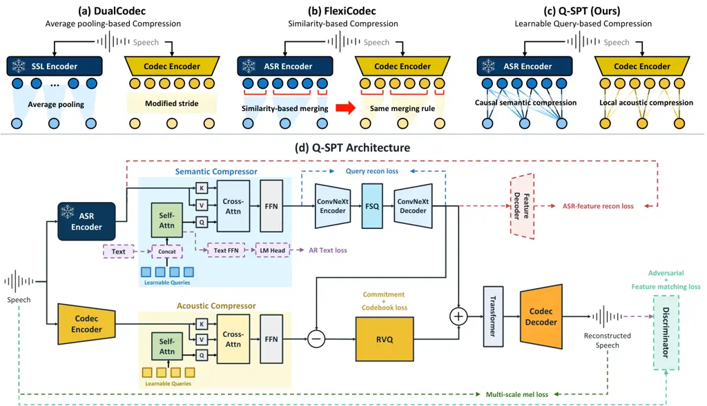

# Q-SPT: Learnable Query-Based Compression for Low-Frame-Rate Speech Tokenization

Jeeyoung Yun    Seohwan Yun    Sungwoong Kim^(†) ^(†)^(†)thanks:
^(†)Corresponding author.

###### Abstract

Neural speech codecs increasingly serve as tokenizers for speech
language models (SLMs). Lowering the frame rate reduces the
computational and memory costs of SLMs, but makes it difficult to
preserve both linguistic information and acoustic detail. Existing
approaches rely on rule-based compression: average pooling can discard
linguistic information, whereas similarity-based merging uses a fixed
threshold on adjacent-frame similarity and applies the resulting
boundaries to the acoustic stream. We propose Q-SPT, a low-frame-rate
dual-stream speech tokenizer with separate, context-aware, learnable
query-based compressors specialized for semantic and acoustic
representations. In particular, queries at a fixed rate independently
attend to the semantic and acoustic streams as separate key–value
sources, enabling stream-specific, context-aware aggregation through two
separately learned compressors. In addition, an autoregressive text loss
explicitly supervises the semantic compressor to preserve linguistic
information. Experimental results show that Q-SPT achieves the best
reconstruction among the evaluated codecs at the same frame rate. In
downstream SLMs, it yields the best speech recognition accuracy and
text-to-speech perceptual quality with competitive intelligibility.

###### Index Terms: 

Low frame rate, neural speech codec, query-based compression, speech
language model, speech tokenization

^(†)^(†)address: Korea University, Seoul, Republic of Korea  
{jee010910, jitoo6342, swkim01}@korea.ac.kr

## 1 Introduction

Neural speech codecs compress speech into compact discrete tokens and
reconstruct waveforms while preserving perceptual quality \[7, 20, 35\].
These codecs increasingly serve as tokenizers for speech language models
(SLMs), enabling speech understanding and generation through language
modeling over discrete speech tokens \[8, 5\]. Effective speech
tokenization therefore requires representations that support both
high-quality waveform reconstruction and downstream speech modeling.

Recent codecs represent speech with fewer tokens by reducing the number
of codebooks per frame \[33, 15\] or the temporal resolution \[8, 2\],
while maintaining reconstruction quality. The reduced token rate also
improves the efficiency of SLMs by lowering the computational and memory
costs of both training and inference \[2, 8\]. However, at extremely low
frame rates, each token must carry more speech content, making it
difficult to preserve both linguistic information and acoustic
detail \[23\].

To enhance linguistic information while retaining acoustic detail, prior
codecs leverage pretrained speech representations.
SpeechTokenizer \[36\] and Mimi \[8\] distill self-supervised learning
(SSL) features into the first residual vector quantization (RVQ) \[35\]
layer, while X-Codec \[34\] fuses semantic and acoustic features before
quantization. More recently, dual-stream codecs encode semantic and
acoustic features in separate streams to preserve both \[22, 23\].
DualCodec \[22\] downsamples SSL features to a fixed frame rate by
average pooling, but this uniform averaging can discard linguistic
information at extremely low frame rates, degrading
intelligibility \[16, 23\]. FlexiCodec \[23\] instead merges adjacent
frames based on semantic similarity, improving information preservation
at average frame rates as low as 6.25 Hz. However, the same merging
boundaries are applied to the acoustic stream, although semantically
similar frames may still differ in acoustic detail. Moreover, the
merging rule relies only on adjacent-frame similarity with a fixed
threshold, so it neither uses broader temporal context nor is optimized
by the training objective.

We propose Q-SPT, a low-frame-rate dual-stream speech tokenizer based on
learnable query-based compression. Unlike rule-based compression such as
average pooling or similarity-based merging (Fig. 1(a)–(b)), Q-SPT
compresses features through cross-attention with learnable queries,
which adaptively weight frames within each temporal window (Fig. 1(c)).
Since the semantic and acoustic streams carry different information,
Q-SPT employs separate semantic and acoustic compressors, each with a
distinct temporal context accessible to its fixed-rate queries. In
addition, because reconstruction objectives supervise linguistic content
only implicitly, we add an autoregressive text loss that explicitly
supervises the semantic compressor. By conditioning autoregressive
transcript prediction on the semantic queries, this loss encourages the
semantic tokens to retain linguistic information for downstream SLMs.

Our contributions are summarized as follows:

- •
  We present Q-SPT, which replaces rule-based temporal compression in
  dual-stream speech tokenization with learnable query-based compression
  specialized for each stream. Separate semantic and acoustic
  compressors with distinct temporal contexts adaptively weight frames
  to preserve both linguistic information and acoustic detail.
- •
  We introduce an autoregressive text loss that explicitly supervises
  the semantic compressor through transcript prediction, which improves
  the preservation of linguistic information in the semantic tokens and
  leads to gains in both reconstruction and downstream SLM performance.
- •
  Experiments show that Q-SPT achieves the best reconstruction among the
  evaluated codecs at the same frame rate and, in downstream SLMs, the
  best automatic speech recognition (ASR) performance and text-to-speech
  (TTS) perceptual quality.



Figure 1: Comparison of temporal compression strategies for
low-frame-rate speech tokenization: (a) average pooling in
DualCodec \[22\], (b) similarity-based merging in FlexiCodec \[23\], and
(c) learnable query-based compression in Q-SPT. (d) Detailed
architecture and training objectives of Q-SPT. Dashed elements indicate
components and connections used only during training.

## 2 Method

Fig. 1(d) illustrates the architecture of Q-SPT. A frozen ASR
encoder \[1\] and a DAC-based codec encoder \[20\] extract semantic and
acoustic features from speech, respectively. Separate semantic and
acoustic compressors use learnable queries to compress the two feature
sequences to 6.25 Hz. Semantic tokens are obtained by finite scalar
quantization (FSQ) \[26\], and acoustic tokens are obtained by applying
RVQ to the residual between the acoustic and quantized semantic
representations \[22\]. The sum of the two quantized representations is
upsampled by a Transformer with mask tokens, and the DAC-based codec
decoder reconstructs speech from the upsampled representation. During
training, an autoregressive text loss additionally supervises the
semantic compressor through transcript prediction.

### 2.1 Learnable Query-Based Compression

Given a 16-kHz waveform $`\mathbf{x}\in\mathbb{R}^{L}`$, a frozen
SenseVoice-Small \[1\] ASR encoder extracts semantic features
$`\mathbf{F}^{s}\in\mathbb{R}^{T_{s}\times d}`$ at approximately
16.7 Hz, and the codec encoder extracts acoustic features
$`\mathbf{F}^{a}\in\mathbb{R}^{T_{a}\times d}`$ at 12.5 Hz. Here,
$`T_{s}`$ and $`T_{a}`$ denote the sequence lengths of the semantic and
acoustic features, respectively, and $`d`$ is the feature dimension.
Each compressor is a stack of Transformer layers in which learnable
queries aggregate its input features within a sliding window through
cross-attention \[21\]. Both compressors output
$`\mathbf{H}^{s},\mathbf{H}^{a}\in\mathbb{R}^{T\times d}`$ at a common
frame rate of 6.25 Hz, where $`T=\lceil T_{a}/2\rceil`$ is the
compressed sequence length.

Causal semantic compression. The semantic compressor uses a wide window
with causal attention to capture linguistic information over a broader
temporal context. Specifically, the $`i`$-th query ($`i=1,\ldots,T`$)
cross-attends to a window of $`w_{s}`$ semantic frames ending at the
$`e_{i}`$-th frame, where $`e_{i}=\lceil iT_{s}/T\rceil`$ is the last
semantic frame within its time span. This window moves with the query
index and is truncated at the utterance start, forming a causal sliding
window. We set $`w_{s}=16`$, which corresponds to approximately 0.96 s.
Causal self-attention over the query sequence additionally provides
preceding context beyond the local cross-attention window. To preserve
the relative temporal order of queries and semantic frames, we apply
rotary position embeddings (RoPE) \[32\] to both attentions.

Local acoustic compression. The acoustic compressor uses a narrow window
to retain fine-grained acoustic detail. Specifically, the $`i`$-th query
cross-attends to a window of $`w_{a}`$ acoustic frames starting at the
$`(2i-1)`$-th frame. We set $`w_{a}=3`$, which corresponds to
approximately 0.24 s.

Quantization and waveform reconstruction. The semantic representation
$`\mathbf{H}^{s}`$ is quantized into
$`\widehat{\mathbf{H}}^{s}\in\mathbb{R}^{T\times d}`$ by FSQ \[26\] with
temporal ConvNeXt layers \[24\]. Following DualCodec \[22\], seven RVQ
stages quantize the residual $`\mathbf{H}^{a}-\widehat{\mathbf{H}}^{s}`$
into $`\widehat{\mathbf{H}}^{a}\in\mathbb{R}^{T\times d}`$. For
reconstruction, $`\widehat{\mathbf{H}}^{s}+\widehat{\mathbf{H}}^{a}`$ is
upsampled from 6.25 to 12.5 Hz by interleaving learnable mask tokens and
refining the sequence with a one-layer Transformer. The DAC-based codec
decoder \[20\] then reconstructs the waveform
$`\widehat{\mathbf{x}}\in\mathbb{R}^{L}`$ from the upsampled features.

### 2.2 Training with Autoregressive Text Supervision

Q-SPT is trained end-to-end with the ASR encoder kept frozen. In
addition to the standard codec losses for waveform reconstruction \[20,
22\], we use two types of losses to enhance linguistic information in
the semantic stream. An autoregressive text loss provides explicit
supervision on linguistic content, whereas semantic reconstruction
losses implicitly guide the semantic tokens to retain the information in
the ASR features.

Autoregressive text loss. Since reconstruction objectives provide only
implicit supervision for linguistic content, we explicitly supervise the
semantic compressor with the ground-truth transcript of the input speech
$`\mathbf{x}`$. During training, the transcript is tokenized into
$`\mathbf{y}=(y_{0},y_{1},\ldots,y_{M})`$ with the BERT
tokenizer \[10\], where $`y_{0}`$ is a start token and $`M`$ is the
number of target tokens. The embedded tokens are concatenated after the
semantic queries, and the resulting sequence is processed by the
semantic compressor. Queries and text tokens share the same
self-attention layers, whereas text tokens bypass cross-attention and
use a separate text feed-forward network (FFN). Queries attend causally
only among themselves and cannot attend to text tokens. In contrast,
each text token attends to all queries and causally to the text tokens,
so the loss supervises the compressor without leaking text into the
query states. The text FFN outputs are then projected by an LM head to
predict each next token. The autoregressive text loss is the next-token
cross-entropy,

```math
\mathcal{L}_{\mathrm{AR}}=-\frac{1}{M}\sum_{m=1}^{M}\log p_{\theta}\!\left(y_{m}\mid\mathbf{x},\mathbf{y}_{<m}\right), \tag{1}
```

where $`p_{\theta}`$ denotes the predicted distribution from the LM
head, conditioned on $`\mathbf{x}`$ through the semantic queries and on
the preceding tokens $`\mathbf{y}_{<m}`$.

Semantic reconstruction losses. To further enhance linguistic
information in the semantic tokens, we use two L2 reconstruction losses.
The query reconstruction loss $`\mathcal{L}_{\mathrm{QRec}}`$ matches
the quantized output $`\widehat{\mathbf{H}}^{s}`$ to the
pre-quantization representation $`\mathbf{H}^{s}`$, so that the
information shaped by the text loss is retained through FSQ. It is
defined as

```math
\mathcal{L}_{\mathrm{QRec}}=\left\|\widehat{\mathbf{H}}^{s}-\mathrm{sg}(\mathbf{H}^{s})\right\|_{2}^{2}, \tag{2}
```

where $`\mathrm{sg}(\cdot)`$ denotes the stop-gradient operator. The
ASR-feature reconstruction loss $`\mathcal{L}_{\mathrm{FRec}}`$ acts
similarly to semantic distillation \[36, 22\]. A learnable convolutional
feature decoder $`D`$ expands $`\widehat{\mathbf{H}}^{s}`$ along the
time axis to the length of $`\mathbf{F}^{s}`$, yielding
$`\widehat{\mathbf{F}}^{s}=D(\widehat{\mathbf{H}}^{s})\in\mathbb{R}^{T_{s}\times d}`$,
which is matched to $`\mathbf{F}^{s}`$ to implicitly guide the semantic
compressor with the linguistic information in the ASR features. It is
defined as

```math
\mathcal{L}_{\mathrm{FRec}}=\left\|\widehat{\mathbf{F}}^{s}-\mathbf{F}^{s}\right\|_{2}^{2}, \tag{3}
```

Codec losses. The codec losses consist of reconstruction, adversarial,
and quantization terms. For reconstruction, a multi-scale
mel-spectrogram loss $`\mathcal{L}_{\mathrm{mel}}`$ between
$`\mathbf{x}`$ and $`\widehat{\mathbf{x}}`$ is used, following
DAC \[20\]. For adversarial training, the generator is optimized with a
least-squares GAN (LSGAN) \[25\] loss $`\mathcal{L}_{\mathrm{adv}}`$ and
a feature-matching loss $`\mathcal{L}_{\mathrm{fm}}`$ against a
multi-period discriminator (MPD) \[18\] and a multi-resolution
discriminator (MRD) \[14\], while the discriminators are trained
separately with the LSGAN objective. For quantization, RVQ is trained
with a codebook loss $`\mathcal{L}_{\mathrm{cb}}`$ and a commitment loss
$`\mathcal{L}_{\mathrm{cm}}`$ \[20\]. The codec loss is

```math
\displaystyle\mathcal{L}_{\mathrm{codec}}={} \displaystyle\lambda_{\mathrm{mel}}\mathcal{L}_{\mathrm{mel}}+\lambda_{\mathrm{adv}}\mathcal{L}_{\mathrm{adv}}+\lambda_{\mathrm{fm}}\mathcal{L}_{\mathrm{fm}} \tag{4}
```

```math
\displaystyle+\lambda_{\mathrm{cb}}\mathcal{L}_{\mathrm{cb}}+\lambda_{\mathrm{cm}}\mathcal{L}_{\mathrm{cm}},
```

Overall objective. Combining these losses, the overall objective for
Q-SPT is

```math
\mathcal{L}=\mathcal{L}_{\mathrm{codec}}+\lambda_{\mathrm{AR}}\mathcal{L}_{\mathrm{AR}}+\lambda_{\mathrm{QRec}}\mathcal{L}_{\mathrm{QRec}}+\lambda_{\mathrm{FRec}}\mathcal{L}_{\mathrm{FRec}}. \tag{5}
```

We set
$`(\lambda_{\mathrm{mel}},\lambda_{\mathrm{adv}},\lambda_{\mathrm{fm}},\lambda_{\mathrm{cb}},\lambda_{\mathrm{cm}})=(15,1,2,1,0.25)`$
following FlexiCodec \[23\], and
$`(\lambda_{\mathrm{AR}},\lambda_{\mathrm{QRec}},\lambda_{\mathrm{FRec}})=(20,15,100)`$.
The text embedding, text FFN, LM head, and feature decoder $`D`$ are
used only during training.

|                   |      |                |             |                          |                   |                          |                     |                     |                   |                 |                   |
| ----------------- | ---- | -------------- | ----------- | ------------------------ | ----------------- | ------------------------ | ------------------- | ------------------- | ----------------- | --------------- | ----------------- |
|                   |      | Bitrate (kbps) |             | $`\boldsymbol{n_{q}=1}`$ |                   | $`\boldsymbol{n_{q}=8}`$ |                     |                     |                   |                 |                   |
| Model             | Hz   | $`n_{q}=1`$    | $`n_{q}=8`$ | WER$`\downarrow`$        | SIM$`\downarrow`$ | WER$`\downarrow`$        | PESQ-NB$`\uparrow`$ | PESQ-WB$`\uparrow`$ | MCD$`\downarrow`$ | SIM$`\uparrow`$ | UTMOS$`\uparrow`$ |
| Mimi \[8\]        | 12.5 | 0.138          | 1.100       | 76.78                    | 0.09              | 2.96                     | 2.90                | 2.25                | 4.28              | 0.79            | 3.34              |
| OmniCodec \[13\]  | 12.5 | 0.138          | 1.100       | 69.05                    | 0.07              | 2.53                     | 2.83                | 2.15                | 3.75              | 0.85            | 3.36              |
| LM-SPT \[16\]     | 12.5 | 0.175          | 1.225       | 3.38                     | 0.26              | 2.21                     | 3.41                | 2.76                | 3.12              | 0.91            | 3.84              |
| DualCodec \[22\]  | 12.5 | 0.175          | 1.225       | 5.19                     | 0.48              | 2.25                     | 3.42                | 2.82                | 3.01              | 0.87            | 3.97              |
| DualCodec^(∗)     | 6.25 | 0.088          | 0.613       | 48.95                    | 0.27              | 4.26                     | 2.80                | 2.12                | 3.87              | 0.72            | 3.86              |
| FlexiCodec \[23\] | 6.25 | 0.113          | 0.638       | 4.58                     | 0.22              | 2.68                     | 2.84                | 2.19                | 3.55              | 0.73            | 3.86              |
| Q-SPT             | 6.25 | 0.094          | 0.619       | 4.29                     | 0.19              | 2.52                     | 2.90                | 2.26                | 3.52              | 0.77            | 4.07              |

Table 1: Speech reconstruction results on LibriSpeech test-clean. ^(∗)
denotes our stride-modified DualCodec. Bold indicates the best result
within each frame-rate group.

|                       | ASR               | TTS               |                   |                    |
| --------------------- | ----------------- | ----------------- | ----------------- | ------------------ |
| Model                 | WER$`\downarrow`$ | WER$`\downarrow`$ | UTMOS$`\uparrow`$ | DNSMOS$`\uparrow`$ |
| DualCodec^(∗)         | 120.16            | 14.72             | 3.07              | 3.18               |
| FlexiCodec            | 6.18              | 10.65             | 3.05              | 3.10               |
| Q-SPT (w/o text loss) | 7.04              | 12.31             | 3.16              | 3.24               |
| Q-SPT                 | 5.88              | 11.82             | 3.44              | 3.28               |

Table 2: SLM results on LibriSpeech test-clean at 6.25 Hz. ASR uses the
first code stream, and TTS uses all eight streams. ^(∗) denotes our
stride-modified DualCodec. Best results are shown in bold.

|                      |                                            | $`\boldsymbol{n_{q}=1}`$ | $`\boldsymbol{n_{q}=8}`$ |                     |                   |
| -------------------- | ------------------------------------------ | ------------------------ | ------------------------ | ------------------- | ----------------- |
| Configuration        | $`\boldsymbol{\mathcal{L}_{\mathrm{AR}}}`$ | WER$`\downarrow`$        | WER$`\downarrow`$        | PESQ-WB$`\uparrow`$ | UTMOS$`\uparrow`$ |
| Shared weights       | ✗                                          | 6.16                     | 2.86                     | 2.16                | 4.02              |
| Shared boundaries    | ✓                                          | 4.29                     | 3.83                     | 2.14                | 3.99              |
| Separate compressors | ✗                                          | 4.97                     | 2.59                     | 2.25                | 4.03              |
| Separate compressors | ✓                                          | 4.29                     | 2.52                     | 2.26                | 4.07              |

Table 3: Ablation study of Q-SPT on speech reconstruction. Shared
boundaries are applied only at inference. Best results are shown in
bold.

## 3 Experiments

### 3.1 Experimental Setup

Datasets. For codec training, we use speech–text pairs with utterance
durations of at most 30 s from LibriHeavy \[17\], GigaSpeech \[3\], and
the English subset of Emilia \[11\], totaling about 47.7k hours. All
speech is resampled to 16 kHz. SLMs are trained on the full 960-hour
LibriSpeech training set \[27\]. All experiments are evaluated on
LibriSpeech test-clean.

Implementation details. Q-SPT has 104.1M parameters at inference,
excluding the frozen ASR encoder. Each compressor consists of three
Transformer layers. The semantic FSQ has a vocabulary of 32,768 codes,
and each of the seven acoustic RVQ codebooks has 4,096 entries. The
codec is trained for 950k steps on 8 NVIDIA L40S GPUs using AdamW with a
learning rate of $`10^{-4}`$ and dynamic batches of up to 30 s of audio
per GPU.

For SLM experiments, we fully fine-tune a separate Qwen3.5-4B \[28\] for
each codec, jointly on ASR and TTS in a 1:1 ratio, using tokens
extracted from the frozen codec. ASR predicts text from the first
stream, whereas TTS generates all eight streams in parallel with a delay
pattern \[6\] that shifts each stream by one frame. Each SLM is trained
for 20k steps with a global batch size of 128 using AdamW with a
learning rate of $`2\times 10^{-4}`$. FlexiCodec-based TTS additionally
predicts per-token frame lengths with a duration head \[23\].

Baselines. At 12.5 Hz, we compare with Mimi \[8\], OmniCodec \[13\],
LM-SPT \[16\], and DualCodec \[22\]. At 6.25 Hz, we compare with
FlexiCodec \[23\] and DualCodec. We adapt DualCodec to 6.25 Hz by
modifying its stride settings and train it on the same data as Q-SPT.
For FlexiCodec, we use the official threshold $`\tau=0.867`$, which
yields a nominal frame rate of 6.25 Hz.

Evaluation metrics. We denote the number of code streams used for
reconstruction by $`n_{q}`$, where $`n_{q}=1`$ uses only the semantic
stream and $`n_{q}=8`$ uses all eight streams. We report word error rate
(WER) and speaker similarity (SIM) at $`n_{q}=1`$ and $`n_{q}=8`$, and
additionally report Perceptual Evaluation of Speech Quality in
narrowband and wideband modes (PESQ-NB/WB) \[30\], mel-cepstral
distortion (MCD) \[19\], and UTMOS \[31\] at $`n_{q}=8`$. For SLMs, we
report ASR and TTS WER, together with UTMOS and DNSMOS \[29\] for TTS
quality. Reconstruction and TTS WER are computed with a HuBERT-Large ASR
model \[12\], and SIM with a fine-tuned WavLM-Large speaker-verification
model with an ECAPA-TDNN backend \[4, 9\]. At $`n_{q}=1`$, lower SIM
indicates less speaker information retained in the semantic stream,
whereas higher SIM is preferred at $`n_{q}=8`$. Bitrates are computed
from the frame rate and codebook sizes, including three bits per output
frame for FlexiCodec’s frame-length information \[23\].

### 3.2 Main Results

Codec reconstruction. Table 1 compares the reconstruction performance of
speech codecs. At 6.25 Hz, Q-SPT achieves the best results on all
metrics, including the lowest WER at both $`n_{q}=1`$ and $`n_{q}=8`$.
DualCodec performs strongly at 12.5 Hz, but when adapted to 6.25 Hz, its
WER at $`n_{q}=1`$ increases from 5.19 to 48.95 and its acoustic quality
also degrades. This suggests that average-pooling-based compression
struggles to preserve information at extremely low frame rates.
FlexiCodec preserves linguistic information better, with a WER of 4.58
at $`n_{q}=1`$, but shows lower quality than Q-SPT on all $`n_{q}=8`$
quality metrics, even at a slightly higher bitrate. This is consistent
with its semantic-derived merging boundaries being applied to the
acoustic stream. Q-SPT also yields the lowest SIM at $`n_{q}=1`$ among
the 6.25-Hz codecs and higher SIM than FlexiCodec at $`n_{q}=8`$,
indicating that speaker information is effectively separated from the
semantic stream and recovered through the acoustic residual streams.
Notably, at roughly half the bitrate, Q-SPT achieves higher UTMOS than
all 12.5-Hz codecs.

Downstream speech modeling. Table 2 shows the ASR and TTS performance of
SLMs trained on the tokens of each codec. For ASR, which uses only the
semantic tokens, Q-SPT outperforms all baselines with a WER of 5.88,
indicating that it preserves linguistic information that the SLM can
effectively exploit. In contrast, DualCodec^(∗) fails to produce
meaningful transcriptions, suggesting that the limitation of
average-pooling-based compression carries over to downstream modeling.
For TTS, Q-SPT achieves the best perceptual quality in both UTMOS and
DNSMOS, improving UTMOS from 3.05 to 3.44 over FlexiCodec. FlexiCodec,
which additionally uses a duration head, achieves a lower WER but lower
perceptual quality. This trend is consistent with Table 1, where
FlexiCodec also shows lower full-stream perceptual quality than Q-SPT.

### 3.3 Ablation Study

To analyze how each design choice contributes to Q-SPT, we conduct three
ablations in Table 3. First, we share the compressor parameters across
the two streams to test whether each stream benefits from its own
parameters. Second, we match the acoustic window boundaries to those of
the semantic compressor, analogous to the shared merging boundaries in
FlexiCodec, to examine how reconstruction quality changes. Third, we
remove the autoregressive text loss to measure the effect of explicit
linguistic supervision. The first and third variants are trained with
the same setup as Q-SPT, whereas the second is applied only at
inference.

Shared weights. We share the Transformer layers of the two compressors
while keeping the temporal windows of each stream. The shared-weight
variant uses six layers to match the parameter count of the two
three-layer compressors, and both variants are trained without the
autoregressive text loss. Sharing the layers degrades both streams,
increasing WER at $`n_{q}=1`$ from 4.97 to 6.16 and worsening WER and
PESQ-WB at $`n_{q}=8`$, while UTMOS remains nearly unchanged. This
indicates that separate compressor parameters are more effective than
shared parameters for modeling the semantic and acoustic streams.

Shared boundaries. To examine how sharing temporal boundaries across
streams affects reconstruction, we match the acoustic window boundaries
to those of the semantic compressor. At inference, each acoustic window
is shifted to end at the same point in time as the corresponding
semantic window, while the window size and all trained parameters remain
unchanged. As the semantic stream is unchanged, WER at $`n_{q}=1`$
remains at 4.29, whereas at $`n_{q}=8`$, WER increases from 2.52 to 3.83
and PESQ-WB and UTMOS also decrease. This indicates that the trained
acoustic compressor relies on its own temporal boundaries, and that
imposing the semantic boundaries at inference degrades acoustic
reconstruction.

Text supervision. To measure the effect of explicit linguistic
supervision, we compare separate-compressor models trained with and
without $`\mathcal{L}_{\mathrm{AR}}`$. Adding
$`\mathcal{L}_{\mathrm{AR}}`$ reduces WER at $`n_{q}=1`$ from 4.97 to
4.29, while slightly improving all $`n_{q}=8`$ metrics. The benefit also
transfers to downstream SLMs, reducing ASR WER from 7.04 to 5.88 and TTS
WER from 12.31 to 11.82 (Table 2). Without
$`\mathcal{L}_{\mathrm{AR}}`$, Q-SPT already outperforms FlexiCodec on
all reported $`n_{q}=8`$ reconstruction metrics, but not on WER at
$`n_{q}=1`$ (4.97 vs. 4.58). Thus, autoregressive text supervision
complements the proposed query-based compression by further
strengthening linguistic information in the semantic tokens.

## 4 Conclusion

We proposed Q-SPT, a low-frame-rate dual-stream speech tokenizer that
replaces rule-based temporal compression with learnable query-based
compression and supervises the semantic compressor with an
autoregressive text loss. At 6.25 Hz, Q-SPT achieves the best
reconstruction among the evaluated codecs, while effectively separating
speaker information from the semantic stream. In addition, the
autoregressive text loss further strengthens linguistic information in
the semantic tokens. These benefits carry over to downstream SLMs, where
Q-SPT outperforms the baselines in ASR accuracy and TTS perceptual
quality while maintaining competitive intelligibility.

## 5 Acknowledgments

This work was supported by the Institute of Information & Communications
Technology Planning & Evaluation (IITP) grant funded by the Korea
government (MSIT) (No. RS-2019-II190079, Artificial Intelligence
Graduate School Program (Korea University)).

## References

- \[1\] K. An et al. (2024) FunAudioLLM: voice understanding and
  generation foundation models for natural interaction between humans
  and LLMs. Note: arXiv preprint arXiv:2407.04051 Cited by: §2.1, §2.
- \[2\] E. Casanova et al. (2025) Low frame-rate speech codec: a codec
  designed for fast high-quality speech LLM training and inference. In
  ICASSP, pp. 1–5. Cited by: §1.
- \[3\] G. Chen et al. (2021) GigaSpeech: an evolving, multi-domain ASR
  corpus with 10,000 hours of transcribed audio. In Interspeech,
  pp. 3670–3674. Cited by: §3.1.
- \[4\] S. Chen et al. (2022) WavLM: large-scale self-supervised
  pre-training for full stack speech processing. IEEE J. Sel. Topics
  Signal Process. 16 (6), pp. 1505–1518. Cited by: §3.1.
- \[5\] S. Chen et al. (2025) Neural codec language models are zero-shot
  text to speech synthesizers. IEEE Trans. Audio, Speech, Language
  Process. 33, pp. 705–718. Cited by: §1.
- \[6\] J. Copet F. Kreuk et al. (2023) Simple and controllable music
  generation. In NeurIPS, Vol. 36. Cited by: §3.1.
- \[7\] A. Défossez, J. Copet, G. Synnaeve, and Y. Adi (2023) High
  fidelity neural audio compression. TMLR. Cited by: §1.
- \[8\] A. Défossez et al. (2024) Moshi: a speech-text foundation model
  for real-time dialogue. Note: arXiv preprint arXiv:2410.00037 Cited
  by: §1, §1, §1, Table 1, §3.1.
- \[9\] B. Desplanques, J. Thienpondt, and K. Demuynck (2020)
  ECAPA-TDNN: emphasized channel attention, propagation and aggregation
  in TDNN based speaker verification. In Interspeech, pp. 3830–3834.
  Cited by: §3.1.
- \[10\] J. Devlin, M.-W. Chang, K. Lee, and K. Toutanova (2019) BERT:
  pre-training of deep bidirectional transformers for language
  understanding. In NAACL-HLT, pp. 4171–4186. Cited by: §2.2.
- \[11\] H. He et al. (2024) Emilia: an extensive, multilingual, and
  diverse speech dataset for large-scale speech generation. In SLT,
  pp. 885–890. Cited by: §3.1.
- \[12\] W.-N. Hsu, B. Bolte, Y.-H. H. Tsai, K. Lakhotia, R.
  Salakhutdinov, and A. Mohamed (2021) HuBERT: self-supervised speech
  representation learning by masked prediction of hidden units. IEEE/ACM
  Trans. Audio, Speech, Language Process. 29, pp. 3451–3460. Cited by:
  §3.1.
- \[13\] J. Hu et al. (2026) OmniCodec: low frame rate universal audio
  codec with semantic-acoustic disentanglement. Note: arXiv preprint
  arXiv:2603.20638 Cited by: Table 1, §3.1.
- \[14\] W. Jang, D. Lim, J. Yoon, B. Kim, and J. Kim (2021) UnivNet: a
  neural vocoder with multi-resolution spectrogram discriminators for
  high-fidelity waveform generation. In Interspeech, pp. 2207–2211.
  Cited by: §2.2.
- \[15\] S. Ji et al. (2025) WavTokenizer: an efficient acoustic
  discrete codec tokenizer for audio language modeling. In ICLR, Cited
  by: §1.
- \[16\] D. Jo, J. Yun, B. Roh, and S. Kim (2026) LM-SPT: LM-aligned
  semantic distillation for speech tokenization. IEEE Trans. Audio,
  Speech, Language Process. 34, pp. 3714–3727. Cited by: §1, Table 1,
  §3.1.
- \[17\] W. Kang et al. (2024) LibriHeavy: a 50,000 hours ASR corpus
  with punctuation casing and context. In ICASSP, pp. 10991–10995. Cited
  by: §3.1.
- \[18\] J. Kong, J. Kim, and J. Bae (2020) HiFi-GAN: generative
  adversarial networks for efficient and high fidelity speech synthesis.
  In NeurIPS, Vol. 33, pp. 17022–17033. Cited by: §2.2.
- \[19\] R. F. Kubichek (1993) Mel-cepstral distance measure for
  objective speech quality assessment. In IEEE Pac. Rim Conf. Commun.,
  Comput. Signal Process., Vol. 1, pp. 125–128. Cited by: §3.1.
- \[20\] R. Kumar, P. Seetharaman, A. Luebs, I. Kumar, and K.
  Kumar (2023) High-fidelity audio compression with improved RVQGAN. In
  NeurIPS, Vol. 36, pp. 27980–27993. Cited by: §1, §2.1, §2.2, §2.2, §2.
- \[21\] J. Li, D. Li, S. Savarese, and S. Hoi (2023) BLIP-2:
  bootstrapping language-image pre-training with frozen image encoders
  and large language models. In ICML, Vol. 202, pp. 19730–19742. Cited
  by: §2.1.
- \[22\] J. Li et al. (2025) DualCodec: a low-frame-rate,
  semantically-enhanced neural audio codec for speech generation. In
  Interspeech, pp. 4883–4887. Cited by: Figure 1, §1, §2.1, §2.2, §2.2,
  Table 1, §2, §3.1.
- \[23\] J. Li et al. (2026) FlexiCodec: a dynamic neural audio codec
  for low frame rates. In ICLR, Cited by: Figure 1, §1, §1, §2.2, Table
  1, §3.1, §3.1, §3.1.
- \[24\] Z. Liu, H. Mao, C.-Y. Wu, C. Feichtenhofer, T. Darrell, and S.
  Xie (2022) A ConvNet for the 2020s. In CVPR, pp. 11976–11986. Cited
  by: §2.1.
- \[25\] X. Mao, Q. Li, H. Xie, R. Y. K. Lau, Z. Wang, and S. P.
  Smolley (2017) Least squares generative adversarial networks. In ICCV,
  pp. 2813–2821. Cited by: §2.2.
- \[26\] F. Mentzer, D. Minnen, E. Agustsson, and M. Tschannen (2024)
  Finite scalar quantization: VQ-VAE made simple. In ICLR, Cited by:
  §2.1, §2.
- \[27\] V. Panayotov, G. Chen, D. Povey, and S. Khudanpur (2015)
  LibriSpeech: an ASR corpus based on public domain audio books. In
  ICASSP, pp. 5206–5210. Cited by: §3.1.
- \[28\] Qwen Team (2026) Qwen3.5: towards native multimodal agents.
  Note: Online: qwen.ai Cited by: §3.1.
- \[29\] C. K. A. Reddy, V. Gopal, and R. Cutler (2021) DNSMOS: a
  non-intrusive perceptual objective speech quality metric to evaluate
  noise suppressors. In ICASSP, pp. 6493–6497. Cited by: §3.1.
- \[30\] A. W. Rix, J. G. Beerends, M. P. Hollier, and A. P.
  Hekstra (2001) Perceptual evaluation of speech quality (PESQ)—a new
  method for speech quality assessment of telephone networks and codecs.
  In ICASSP, Vol. 2, pp. 749–752. Cited by: §3.1.
- \[31\] T. Saeki, D. Xin, W. Nakata, T. Koriyama, S. Takamichi, and H.
  Saruwatari (2022) UTMOS: UTokyo-SaruLab system for VoiceMOS challenge 2022. In Interspeech, pp. 4521–4525. Cited by: §3.1.
- \[32\] J. Su, M. Ahmed, Y. Lu, S. Pan, W. Bo, and Y. Liu (2024)
  RoFormer: enhanced transformer with rotary position embedding.
  Neurocomputing 568, pp. 127063. Cited by: §2.1.
- \[33\] D. Yang, S. Liu, R. Huang, J. Tian, C. Weng, and Y. Zou (2023)
  HiFi-Codec: group-residual vector quantization for high fidelity audio
  codec. Note: arXiv preprint arXiv:2305.02765 Cited by: §1.
- \[34\] Z. Ye et al. (2025) Codec does matter: exploring the semantic
  shortcoming of codec for audio language model. Proc. AAAI Conf. Artif.
  Intell. 39 (24), pp. 25697–25705. Cited by: §1.
- \[35\] N. Zeghidour, A. Luebs, A. Omran, J. Skoglund, and M.
  Tagliasacchi (2022) SoundStream: an end-to-end neural audio codec.
  IEEE/ACM Trans. Audio, Speech, Language Process. 30, pp. 495–507.
  Cited by: §1, §1.
- \[36\] X. Zhang, D. Zhang, S. Li, Y. Zhou, and X. Qiu (2024)
  SpeechTokenizer: unified speech tokenizer for speech language models.
  In ICLR, Cited by: §1, §2.2.
