# VTR-Bench: A Systematic Benchmark for Evaluating Visual Text Rendering in Video Generation

Yu Huang¹, Jungang Li², Zhiyuan Wang¹, Yonghua Hei², Song Dai², Jiayu
Yang², Deyuan Liu⁴, Xiang Zheng³, Xiaoshuang Shi⁵, Hao Cheng⁶, Kaidi
Xu^(1,3,🖂) ¹Department of Data Science, City University of Hong Kong
²The Hong Kong University of Science and Technology (Guangzhou) ³The
Hong Kong Institute of AI for Science, City University of Hong Kong
⁴Westlake University ⁵University of Electronic Science and Technology of
China ⁶The Hong Kong University of Science and Technology

###### Abstract

Recent video generation models can produce highly realistic videos from
natural language instructions, with visual quality approaching cinematic
standards. Existing evaluation benchmarks, however, predominantly assess
visual quality, aesthetic appeal and physical plausibility, while paying
limited attention to text, an essential medium for conveying information
in everyday scenes. A generated video may appear visually compelling and
feature lifelike subjects, yet still render the text within the scene
incorrectly. To address this overlooked dimension, we introduce
VTR-Bench, a systematic benchmark for evaluating the Visual Text
Rendering capabilities of video generation models. VTR-Bench situates
text within concrete application scenarios, such as advertisements and
scientific videos, with 300 carefully constructed prompts spanning five
scenario categories. We develop an automated evaluation pipeline with
human alignments that separately assesses text fidelity through
carrier-specific transcription and scene and motion requirements through
a prompt-specific chain of query. Beyond evaluation, we introduce a
Keyframe-Guided Agentic Framework in which a Director agent coordinates
image and video generation with visual evaluation, guiding iterative
refinement and candidate selection through visual feedback. Experiments
on 11 state-of-the-art models reveal widespread difficulties in
accurately rendering scene text, with the best-performing model
recording an overall word error rate (WER) of 0.250. We further analyze
text rendering failures to characterize the challenges faced by current
video generation models. These findings highlight visual text rendering
as a key challenge for video generation and demonstrate a practical path
toward improvement. Code is available at
[https://github.com/hardenyu21/VTR-Bench](https://github.com/hardenyu21/VTR-Bench).

|     |
| --- |
|     |

^(†)^(†)footnotetext: Email:
[yhuang3273-c@my.cityu.edu.hk](mailto:yhuang3273-c@my.cityu.edu.hk).^(🖂)^(🖂)footnotetext:
Corresponds to: [kaidixu@cityu.edu.hk](mailto:kaidixu@cityu.edu.hk).

## 1 Introduction

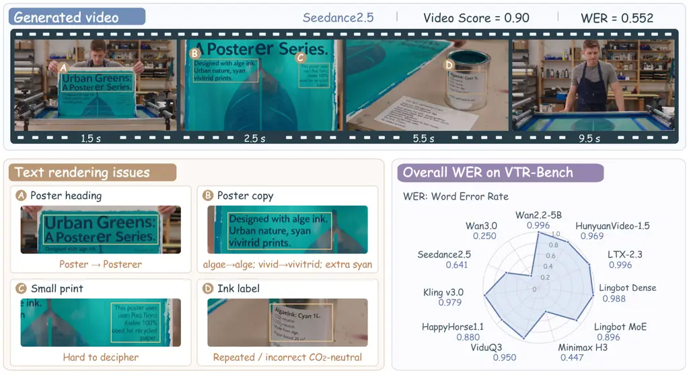

Figure 1: Visual text rendering remains challenging for current video
generation models, even in visually convincing videos. Top: a video
generated by Seedance2.5. Video Score measures the proportion of
satisfied requirements in a 20-question checklist, and WER measures word
error rate against the reference text. Bottom left: four text rendering
issues in the video. Bottom right: overall WER of 11 video generation
models on VTR-Bench.

Recent advances in video generation models have enabled the synthesis of
highly realistic videos, with visual quality approaching cinematic
standards (Kuaishou, 2024; Vidu AI, 2026; HappyHorse AI, 2026;
MiniMaxAI, 2026; Bytedance Seed, 2026; Tongyi Wanxiang Team, 2026).
However, a convincing visual appearance does not necessarily mean that
the text within a scene is correct (Liu et al., 2024a; Liu et al.,
2025). This distinction matters in applications such as advertisements,
scientific demonstrations, and user interfaces, where text conveys
essential information through product introduction, numerical values,
and instructions (Guo et al., 2025). In these settings, incorrectly
rendered words or symbols can change the intended message, making
textual accuracy essential to the usefulness of the generated video.
These practical demands motivate a crucial question: can video
generation models render the required text accurately? As illustrated in
Figure 1, an approximately 10-second video contains misspelled words,
repeated and incorrect text, and largely illegible passages. Although it
achieves a Video Score of 0.90 on a checklist of scene and motion
requirements, its word error rate (WER) (Klakow & Peters, 2002) reaches
0.552. This example highlights a persistent challenge for current video
generation models: accurately rendering visual text even when the
surrounding scene and motion requirements are well satisfied.

Existing video generation benchmarks primarily assess visual quality,
prompt alignment, compositionality, and physical plausibility (Huang
et al., 2024; Meng et al., 2024; Sun et al., 2025; Han et al., 2025;
Zheng et al., 2025; Bansal et al., 2025; Bansal et al., 2026).
Benchmarks that explicitly assess rendered text, including
EvalCrafter (Liu et al., 2024b), T2VTextBench (Guo et al., 2025), and
AVGen-Bench (Zhou et al., 2026), primarily cover short textual targets,
with limited coverage of longer passages. In addition, T2VTextBench
relies entirely on human evaluation, making repeated model evaluation
labor-intensive. Scalable evaluation of longer scene text remains
underexplored.

To address this gap, we introduce VTR-Bench, a systematic benchmark for
evaluating Visual Text Rendering in video generation. Its 300 carefully
constructed prompts span advertising, science, user interfaces, culture,
and daily life. Each scene contains multiple textual targets, from short
labels to extended passages, with reference strings and carrier
annotations specifying what should appear and where. To ground these
textual requirements in coherent video scenarios, we adopt a multi-stage
construction pipeline with human review. To enable scalable assessment,
we develop an automated pipeline that decouples text fidelity from video
requirements. A vision–language model transcribes text from specified
carriers for comparison with reference strings using WER. In parallel, a
prompt-specific chain of query containing 20 questions assesses scene
and motion requirements to produce Video Score. Both evaluation branches
are validated with human alignments.

Evaluation of 11 state-of-the-art video generation models reveals
substantial text errors across both open-source and proprietary models,
with the lowest overall WER at 0.250. Moreover, models with similar
Video Scores exhibit markedly different text fidelity, separating
adherence to scene and motion requirements from the correctness of
rendered text. To improve visual text rendering, we develop a
Keyframe-Guided Agentic Framework whose Director agent coordinates image
and video generation with visual evaluation, guiding iterative
refinement and candidate selection through visual feedback. Compared
with direct generation using Minimax H3 (MiniMaxAI, 2026), our framework
reduces overall WER by 32.5% and improves Video Score. The full
framework also improves both aggregate metrics over direct first-frame
conditioning, demonstrating the value of coordinated refinement beyond
supplying an initial image. Our main contributions are as follows:

- •
  We introduce VTR-Bench, a systematic benchmark for evaluating visual
  text rendering in video generation. By embedding prescribed text in
  concrete scenes across five application scenarios, VTR-Bench assesses
  models’ ability to render textual information in context, with
  explicit requirements for its content and carriers.
- •
  We develop an automated evaluation pipeline with human alignments that
  combines carrier-specific transcription and a prompt-specific chain of
  query to separately assess textual accuracy and fulfillment of video
  requirements. Our Keyframe-Guided Agentic Framework guides image and
  video generation through visual evaluation, iterative refinement, and
  candidate selection.
- •
  Experimental results on a wide range of state-of-the-art models reveal
  systematic difficulties in reproducing textual information across
  diverse video scenarios, highlighting faithful visual text rendering
  as an essential capability for advancing video generation.

## 2 Related Work

### 2.1 Visual Text Rendering in Videos

Visual text rendering in videos requires preserving textual accuracy
under motion, deformation, and changes in visibility. Text-Animator
combines text embedding injection, camera control, and text
refinement (Liu et al., 2024a). Approaches to this problem span model
design and synthetic-data training: HunyuanVideo 1.5 incorporates
ByT5-based glyph encoding (Wu et al., 2025a), while Video Text
Preservation fine-tunes Wan2.1 on synthetic text-rich videos (Liu
et al., 2025). Related settings address complementary problems: FlowText
synthesizes scene text in existing videos for video text spotting (Zhao
et al., 2023); Dynamic Typography and KineTy animate the glyphs
themselves (Liu et al., 2024d; Park et al., 2024); and STRIVE and
SteerVTE edit text in source videos (G et al., 2021; Zeng et al., 2026).
VTR-Bench evaluates how accurately video generation models render
prescribed text on designated carriers while satisfying the surrounding
scene requirements.

### 2.2 Video Generation Benchmarks

Existing benchmarks assess video generation from several complementary
perspectives. General benchmarks such as FETV (Liu et al., 2023),
VBench (Huang et al., 2024), and EvalCrafter (Liu et al., 2024b)
evaluate generation quality and prompt adherence across multiple
dimensions, including visual quality, motion quality, and video-text
alignment. VBench-2.0 (Zheng et al., 2025) further extends evaluation to
intrinsic faithfulness, covering human fidelity, controllability,
creativity, physics, and commonsense. Video-Bench (Han et al., 2025)
introduces chain-of-query and few-shot scoring to improve alignment with
human judgments. Beyond general-purpose evaluation, specialized
benchmarks examine specific capabilities: T2V-CompBench (Sun et al., 2025) evaluates compositional generation, while TC-Bench (Feng et al., 2025) examines temporal compositionality. PhyGenBench (Meng et al.,
2024), VideoPhy (Bansal et al., 2025), and VideoPhy-2 (Bansal et al., 2026) evaluate physical commonsense, while RulerBench (He et al., 2025)
and Sci-VBench (Zhang et al., 2026a) evaluate reasoning capabilities. As
video generation models increasingly incorporate audio, recent
benchmarks have expanded evaluation to audiovisual generation (Mao
et al., 2024; Cao et al., 2025; Hua et al., 2026; Liu et al., 2026a;
Yang et al., 2026). Beyond audiovisual synchronization and cross-modal
alignment, PhyAVBench (Xie et al., 2025) and AV-Phys Bench (Cui et al., 2026) extend the evaluation of physical plausibility to audio-video
generation. LongAV-Compass (Liu et al., 2026b), MSAVBench (Wei et al.,
2026), and MultiRef-Compass (Zhang et al., 2026b) target minute-scale,
multi-shot, and multi-reference-conditioned audio-video generation,
respectively. Text rendering has also received dedicated attention.
T2VTextBench (Guo et al., 2025) uses human evaluation to assess
on-screen text fidelity and temporal consistency, while
AVGen-Bench (Zhou et al., 2026) incorporates scene text rendering into
its broader audiovisual evaluation suite. VTR-Bench evaluates visual
text rendering across five application scenarios by automatically
transcribing text from designated carriers and computing word error rate
against reference text.

## 3 VTR-Bench

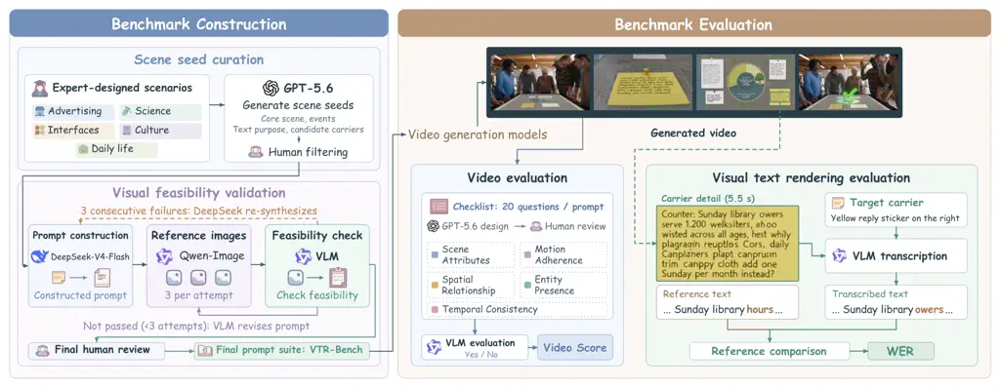

Figure 2: Overview of VTR-Bench. Left: five expert-designed scenario
categories guide scene seed generation and human filtering. The retained
seeds support prompt construction, followed by iterative refinement
through reference image generation and VLM review and a final human
review. Right: generated videos are evaluated along two separate
dimensions. Video Score measures adherence to scene and video
requirements using a 20-question checklist, while WER measures visual
text fidelity by comparing carrier-specific VLM transcriptions with
reference text.

### 3.1 Dataset Construction

We build the prompt suite of VTR-Bench via a multi-stage pipeline that
combines scene seed curation, prompt construction, and visual
feasibility validation, as shown in Figure 2. To establish broad
coverage of visual text in context, human experts firstly define five
high-level scenario categories. Within these categories,
GPT-5.6 (OpenAI, 2026) generates diverse scene seeds describing the core
scene and events, the purpose of the text, and candidate carriers. These
seeds are then screened and deduplicated by human reviewers to balance
scenario coverage. Building on the curated seeds,
DeepSeek-V4-Flash (DeepSeek-AI, 2026) is used to construct complete
prompts that specify textual content, carrier assignments, and semantic
relationships, thereby grounding the texts in concrete scene contexts.

To assess whether the specified text and carriers can be accommodated
within a coherent scene, we design an iterative validation mechanism
that combines reference images, VLM feedback, and final human review.
Specifically, three reference images produced by an image generation
model serve as visual evidence for a VLM to assess each candidate prompt
and identify requirements that need revision. This feedback guides
prompt refinement, with each revised candidate evaluated using three
newly generated images. The mechanism also includes a re-synthesis step:
three consecutive unsuccessful checks trigger DeepSeek-V4-Flash to
reconstruct the candidate before restarting validation. To verify the
resulting prompts before inclusion, a final human review follows
successful visual validation. The resulting suite contains 300 prompts
spanning advertising, science, user interfaces, culture, and daily life.
Within this suite, each sample pairs a video generation prompt with
reference strings and carrier descriptions, making both the intended
text and its location explicit for subsequent evaluation. Further
details of dataset construction are provided in Appendix B.

### 3.2 Dataset Statistics

(a) Scenario taxonomy

(b) Distribution of text block counts

(c) Distribution of total required text length per video

(d) Distribution of individual text block lengths

Figure 3: Dataset statistics of VTR-Bench.

VTR-Bench contains 300 prompts evenly distributed across five
application scenarios, with 60 per category. Figure 3a summarizes the 25
sub-scenes covered. Each prompt requires models to render multiple text
blocks within a scene, with textual content ranging from short labels to
extended passages. A _text block_ denotes an annotated textual target
with a reference string and a specified carrier. As shown in Figure 3b,
the suite contains 1,202 text blocks, with two to six blocks per prompt
and 94.3% of prompts requiring three to five blocks. Beyond this
multiplicity, the suite spans a broad range of text lengths, measured
using the evaluation tokenizer described in Section 3.3. The
distributions in Figures 3c and 3d show that the total required text
length per video ranges from 58 to 496 tokens, with a median of 102.5,
while individual blocks range from 1 to 275 tokens, with a median of 23.
Together, these properties make VTR-Bench a test of both rendering
multiple textual targets within a scene and reproducing longer passages
accurately.

### 3.3 Benchmark Evaluation

To distinguish fulfillment of scene and motion requirements from visual
text accuracy, we design a decoupled evaluation pipeline that measures
these two aspects through Video Score and word error rate (WER).
Figure 2 illustrates the two evaluation branches: prompt-specific
chain-of-query (CoQ) evaluation and carrier-specific text transcription
followed by reference comparison.

#### Video Evaluation.

To assess how faithfully a video realizes the requested scene and
motion, we adopt query-based evaluation (Han et al., 2025; Li et al., 2026) and construct a CoQ of 20 questions for each prompt. Generated by
GPT-5.6 (OpenAI, 2026) and reviewed by human annotators, the queries are
tailored to the requirements of each prompt. Across the prompt suite,
they span five dimensions: _Scene Attributes_, _Motion Adherence_,
_Spatial Relationship_, _Entity Presence_, and _Temporal Consistency_,
with each CoQ addressing the dimensions relevant to its prompt. Each
question expresses an observable requirement, allowing a VLM to evaluate
its fulfillment with a yes or no answer. Video Score is the proportion
of satisfied requirements,
$`\operatorname{VideoScore}(v)=\frac{1}{20}\sum_{j=1}^{20}y_{v,j}`$,
where $`y_{v,j}=1`$ for a yes answer and $`0`$ otherwise.

#### Visual Text Rendering Evaluation.

For visual text evaluation, a VLM transcribes each specified carrier
from its clearest occurrence in the video, guided by carrier
descriptions and the generation prompt with reference text masked.
Transcriptions preserve rendering errors and omit unreadable spans;
missing or entirely unreadable targets yield empty strings. We then
compare these transcriptions with the reference text using WER.

To quantify textual accuracy, we tokenize the transcriptions and
reference strings using a shared deterministic tokenizer that preserves
case, content-bearing symbols, and individual CJK characters while
ignoring ordinary prose punctuation. For target $`k`$ in video $`v`$,
let $`R_{v,k}`$ and $`H_{v,k}`$ denote the reference and hypothesis
token sequences. Allowing $`\alpha`$ additional tokens beyond each
reference length, the bounded WER aggregates edit distances across the
$`K_{v}`$ targets in video $`v`$:

```math
\operatorname{WER}_{\alpha}(v)=\min\!\left(1,\frac{\sum_{k=1}^{K_{v}}d\!\left(R_{v,k},H_{v,k}[1:|R_{v,k}|+\alpha]\right)}{\sum_{k=1}^{K_{v}}|R_{v,k}|}\right), \tag{1}
```

where $`H[1:m]`$ retains up to the first $`m`$ tokens and $`d`$ denotes
token-level Levenshtein distance. We set $`\alpha=5`$ as our default
evaluation setting.

### 3.4 Keyframe-Guided Agentic Generation

To explore inference-time control of visual text rendering, we design a
keyframe-guided agentic generation framework that establishes a
first-frame representation of the requested scene before introducing
motion. As illustrated in Figure 4, a Director agent coordinates image
generation, motion planning, and video generation through visual
feedback. Given the generation prompt, the Director agent constructs an
image prompt and requests candidate first frames. A VLM inspects these
candidates for text accuracy, legibility, carrier coverage, and scene
consistency. Based on these observations, the Director agent can compare
candidates, refine the image prompt for another generation, or edit an
existing candidate by supplying the image and a targeted editing
instruction. This feedback guides selection of the first frame that will
condition video generation.

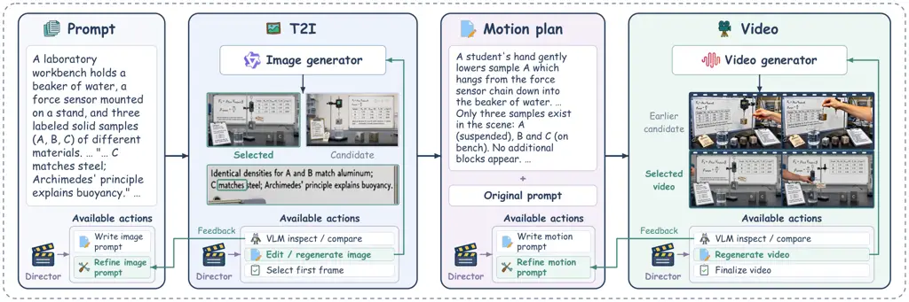

Figure 4: Keyframe-guided agentic generation. A Director agent uses
visual feedback to refine image prompts, edit or regenerate first
frames, and revise motion plans. The selected first frame, original
prompt, and motion plan condition video generation.

To animate the selected scene, the Director agent constructs a motion
plan specifying subject actions, camera movement, and temporal
progression. The video generator receives the selected first frame
together with the original prompt and the motion plan, retaining the
same model weights used for direct video generation. A VLM then reviews
sampled video frames for text stability, carrier persistence, motion
coherence, and adherence to the requested content. These observations
guide motion-plan refinement and further video generation, while
candidate comparison supports final video selection. Throughout the
process, the Director agent chooses subsequent actions and their
instructions from the available tools based on accumulated visual
evidence.

## 4 Experiment

### 4.1 Experiment Settings

#### Evaluation Models.

We evaluate a variety of models, including both open-sourced models and
proprietary models. For open-sourced models, we test Wan2.2-TI2V-5B (Wan
et al., 2025), Hunyuanvideo-1.5 (Wu et al., 2025a), LTX-2.3 (HaCohen
et al., 2025), Lingbot-Video (Ma et al., 2026), including
Lingbot-Video-Dense and Lingbot-Video-MOE and Minimax H3 (MiniMaxAI,
2026). For Proprietary Models, we evaluate kling v3.0 (Kuaishou, 2024),
happyhorse1.1 (HappyHorse AI, 2026), ViduQ3 (Vidu AI, 2026),
Wan-3.0 (Tongyi Wanxiang Team, 2026) and seedance2.5 (Bytedance Seed,
2026).

#### Configuration.

For open sourced models, we use the unified framework vllm-omni (Yin
et al., 2026) for generation, and each model is set with the default
optimal generation settings of itself, except for the video length. For
Proprietary models, we set the resolution to 720p. The video length is
fixed to 10 seconds with a 24 FPS. All of the generation experiments are
conducted on NVIDIA H20 GPUs. For VLM evaluator, we use
Qwen3.8-27B (Qwen Team, 2026c) for both video and visual text rendering
evaluation. Evaluation runs on NVIDIA A800 GPUs.

### 4.2 Main Results

|                     |            |            |     |                      |       |       |       |       |       |                            |       |       |       |       |       |
| ------------------- | ---------- | ---------- | --- | -------------------- | ----- | ----- | ----- | ----- | ----- | -------------------------- | ----- | ----- | ----- | ----- | ----- |
| Model               | Resolution |            |     | WER ($`\downarrow`$) |       |       |       |       |       | Video Score ($`\uparrow`$) |       |       |       |       |       |
|                     |            |            |     | AD                   | Sci   | UI    | Cul   | DL    | All   | AD                         | Sci   | UI    | Cul   | DL    | All   |
| Open-Sourced Models |            |            |     |                      |       |       |       |       |       |                            |       |       |       |       |       |
| Wan2.2-5B           | 1280       | $`\times`$ | 704 | 0.994                | 0.993 | 0.999 | 0.998 | 0.994 | 0.996 | 0.523                      | 0.475 | 0.386 | 0.357 | 0.438 | 0.436 |
| HunyuanVideo-1.5    | 1280       | $`\times`$ | 720 | 0.972                | 0.952 | 0.974 | 0.985 | 0.964 | 0.969 | 0.606                      | 0.628 | 0.653 | 0.557 | 0.562 | 0.601 |
| LTX-2.3             | 768        | $`\times`$ | 512 | 0.997                | 0.992 | 0.998 | 0.998 | 0.993 | 0.996 | 0.682                      | 0.632 | 0.569 | 0.560 | 0.590 | 0.607 |
| Lingbot-Video-Dense | 832        | $`\times`$ | 480 | 0.992                | 0.974 | 0.993 | 0.996 | 0.988 | 0.988 | 0.573                      | 0.571 | 0.556 | 0.469 | 0.503 | 0.534 |
| Lingbot-Video-MOE   | 832        | $`\times`$ | 480 | 0.895                | 0.841 | 0.900 | 0.927 | 0.916 | 0.896 | 0.553                      | 0.621 | 0.599 | 0.492 | 0.480 | 0.549 |
| Minimax H3          | 1344       | $`\times`$ | 768 | 0.536                | 0.287 | 0.376 | 0.602 | 0.434 | 0.447 | 0.748                      | 0.778 | 0.806 | 0.717 | 0.732 | 0.756 |
| Proprietary Models  |            |            |     |                      |       |       |       |       |       |                            |       |       |       |       |       |
| ViduQ3              | 1280       | $`\times`$ | 720 | 0.939                | 0.928 | 0.961 | 0.983 | 0.939 | 0.950 | 0.818                      | 0.824 | 0.789 | 0.733 | 0.764 | 0.786 |
| HappyHorse1.1       | 1280       | $`\times`$ | 720 | 0.900                | 0.843 | 0.841 | 0.929 | 0.886 | 0.880 | 0.862                      | 0.844 | 0.826 | 0.792 | 0.830 | 0.831 |
| Kling v3.0          | 1280       | $`\times`$ | 720 | 0.986                | 0.964 | 0.994 | 0.987 | 0.964 | 0.979 | 0.820                      | 0.798 | 0.794 | 0.757 | 0.795 | 0.793 |
| Seedance2.5         | 1280       | $`\times`$ | 720 | 0.544                | 0.627 | 0.664 | 0.742 | 0.627 | 0.641 | 0.793                      | 0.818 | 0.823 | 0.731 | 0.790 | 0.791 |
| Wan3.0              | 1280       | $`\times`$ | 720 | 0.234                | 0.206 | 0.215 | 0.340 | 0.255 | 0.250 | 0.873                      | 0.871 | 0.841 | 0.816 | 0.846 | 0.849 |

Table 1: Main results on VTextBench. The top three results in each
metric are highlighted in blue, with darker shades indicating better
performance.

We report the main results in Table 1, revealing two key findings.
Visual text rendering remains challenging for current video generation
models. High WERs are prevalent across the evaluated models, and even
the strongest model records an overall WER of 0.250. Among open-source
models, Minimax H3 stands out with a WER of 0.447, while most others
remain close to the metric’s upper bound across the five scenarios. This
broad pattern shows that their text rendering difficulties extend across
application contexts. Proprietary models also differ substantially in
text fidelity. Wan3.0 leads text fidelity in every scenario, with
Seedance2.5 following within this group, but several other proprietary
models still produce substantial text errors and do not match Minimax
H3. The results therefore reveal substantial differences within each
group, alongside a shared challenge in reproducing the requested text
faithfully. VTR-Bench distinguishes these capabilities by testing
whether models reproduce the specified textual content across diverse
scene contexts.

High Video Scores do not guarantee accurate visual text. Proprietary
models achieve consistently high Video Scores, yet differ substantially
in text fidelity. Kling v3.0 and Seedance2.5 provide a clear example:
both score approximately 0.79 on video requirements, while their WERs
are 0.979 and 0.641, respectively. Thus, nearly identical fulfillment of
scene and motion requirements can accompany markedly different text
accuracy. The same distinction appears across model groups: Minimax H3
renders text more accurately than most proprietary models despite
receiving a lower Video Score. These comparisons show that a model’s
ability to realize the requested scene does not establish whether the
text conveys the intended information. Correct actions, entities, and
spatial relationships can coexist with incorrect textual content. By
evaluating these aspects separately, VTR-Bench exposes a gap that a high
Video Score can obscure and identifies visual text rendering as a
distinct dimension of video generation capability.

### 4.3 Failure Analysis

To better understand visual text rendering failures, we examine them
from two perspectives: the effect of generation settings and the
transcription outcomes reported by the VLM evaluator.

Figure 5: Effects of generation resolution and duration. Left: Video
Score ($`\uparrow`$). Right: WER ($`\downarrow`$).

#### Effects of Resolution and Duration.

Higher resolution can allocate more pixels to text at a comparable
relative scale, while shorter videos reduce the temporal span over which
text must remain consistent. To examine how these factors affect text
fidelity, we compare four combinations of high/low resolution and
long/short duration for Minimax H3 and LTX-2.3. For Minimax H3, the high
and low resolutions are $`1344\times 768`$ and $`832\times 480`$,
respectively; for LTX-2.3, they are $`1280\times 704`$ and
$`768\times 512`$. Long and short durations correspond to 10 and 5
seconds for both models.

The response to generation settings reflects differences in underlying
text-rendering capability. As shown in Figure 5, higher resolution
reduces WER for Minimax H3 at both durations, allowing its stronger
text-rendering ability to benefit from greater spatial detail. In
contrast, LTX-2.3 maintains a WER close to 1 across all four
configurations despite changes in Video Score. Shortening duration
likewise provides no consistent improvement in text fidelity across the
two models. Together, these results suggest that higher resolution can
enhance an existing capacity to render text, while configuration changes
alone do not resolve the text errors observed in LTX-2.3. Strengthening
the model’s underlying text-rendering capability is therefore central to
realizing the benefits of improved generation settings.

Figure 6: Transcription outcomes reported by VLM evaluator. Bars show
the proportion of text targets in each state.

#### Transcription Outcomes.

To examine how these capability differences manifest in generated text,
we analyze Qwen3.8-27B’s transcription outcomes for 13,213 text targets
across videos. The evaluator uses three states predefined before
evaluation: _carrier not found_, _text unreadable_, and _transcribed_.
Here, _text unreadable_ indicates that the carrier is found but its
entire text is unreadable. Figure 6 shows the distribution of these
states. Across models, the evaluator reports unreadable text for 23.31%
of targets, compared with 9.34% for carriers not found. This pattern
points to difficulties recovering text even after its carrier has been
located. Such outcomes are particularly prevalent for Wan2.2-5B and
LTX-2.3, where over half of the targets are judged unreadable,
consistent with their high WERs.

Transcribability does not establish textual accuracy. Kling v3.0 has a
transcription rate of 79.62% but an overall WER of 0.979, whereas
Minimax H3 combines a transcription rate of 85.61% with a WER of 0.447.
Thus, substantial transcription coverage can coexist with extensive
errors against the required content. These observations identify two
priorities for visual text rendering: legible text on the intended
carriers and accurate reproduction of the prescribed content.

### 4.4 Effect of Test-Time Refinement

To examine whether inference-time control improves visual text
rendering, we compare three generation settings using Minimax H3: direct
generation from the prompt, denoted as _Original_; _I2V_, which takes
the original prompt and the first image generated by the agentic
framework as input; and _Agentic_, the full framework described in
Section 3.4. For the agentic framework, Qwen3.7-plus (Qwen Team, 2026b)
serves as both the Director agent and the VLM, while
Qwen-Image-3.0 (Qwen Team, 2026d) serve as the image generator. For both
I2V and Agentic generation, we remove the first frame of each generated
video before evaluation.

Figure 7: Comparison of direct generation, I2V, and the agentic
framework on Minimax H3. Bold values indicate the best result within
each scenario or overall.

Test-time refinement improves both text fidelity and fulfillment of
video requirements. As shown in Figure 7, the agentic framework reduces
overall WER from 0.4468 to 0.3015, a 32.5% relative reduction, while
raising Video Score from 0.7562 to 0.8315. Both metrics improve across
all five scenarios relative to direct generation. These results show
that explicit first-frame construction and visual feedback can improve
text fidelity alongside adherence to scene and motion requirements,
using the same video generator.

The full framework provides gains beyond first-frame conditioning alone.
I2V improves both aggregate metrics over direct generation, while the
full framework further reduces overall WER by 9.4% relative to I2V and
achieves the highest Video Score in every scenario. Its WER advantage
over I2V spans four of the five scenarios and is largest in scientific
videos; in UI scenes, I2V achieves the lowest WER, while the full
framework achieves the highest Video Score. Thus, the full framework
improves on initial image conditioning through visual refinement and
motion planning.

### 4.5 Human Alignment

To assess alignment with human judgments, we compare Qwen3.8-27B’s
evaluations with human annotations on 100 sampled videos, covering 2,000
CoQ judgments and 404 text blocks. Guided by the transcription outcomes
in Figure 6, we sample more videos from Seedance2.5, Minimax H3, and
Wan3.0, which combine high transcription rates with relatively low
overall WERs. This choice prioritizes examples with recoverable text for
human comparison. Three human annotators provide annotations for each
binary query and text block. For each binary query, the majority vote
serves as the human reference. As shown in Table 2, the automated
evaluator agrees with this majority on 92.15% of the queries, indicating
consistent judgments of scene and motion requirement fulfillment.

| Evaluation      | Agreement $`\uparrow`$ | Pearson $`\uparrow`$ | Spearman $`\uparrow`$ | Lin’s CCC $`\uparrow`$ | MAE $`\downarrow`$ |
| --------------- | ---------------------- | -------------------- | --------------------- | ---------------------- | ------------------ |
| CoQ judgments   | 92.15%                 | —                    | —                     | —                      | —                  |
| Text-block WER  | —                      | 0.9541               | 0.9370                | 0.9536                 | 0.0545             |
| Video-level WER | —                      | 0.9842               | 0.9731                | 0.9835                 | 0.0407             |

Table 2: Alignment of Qwen3.8-27B.

For visual text evaluation, we compute WER from each transcription
against the same benchmark reference text. We average the three
annotators’ WERs for each text block or video and compare these averages
with the corresponding VLM-derived scores. The strong Pearson and
Spearman correlations indicate close agreement between human and VLM
assessments of text error severity and relative rankings. This
correspondence also extends to numerical agreement: video-level Lin’s
concordance correlation coefficient reaches 0.9835, with a mean absolute
error of 0.0407. Together, these results demonstrate strong agreement
between automated and human evaluation across both branches.

## 5 Conclusion

VTR-Bench establishes visual text rendering as a distinct criterion for
assessing whether generated videos faithfully convey the information
specified by users. By grounding textual requirements in concrete
application scenarios, the benchmark connects text accuracy to the
activities, objects, and interfaces through which written information
serves a purpose. Our evaluation of 11 state-of-the-art models shows
that this capability remains a shared challenge across open-source and
proprietary systems, with the strongest model recording an overall WER
of 0.250. The resulting failure analysis makes this challenge more
concrete: text can fail to become readable, or remain legible while
conveying incorrect content. Progress therefore requires both
recognizable characters and faithful reproduction of the intended
information. The improvements achieved by our Keyframe-Guided Agentic
Framework further show that visual feedback can guide generation toward
this goal, reducing overall WER by 32.5% while improving Video Score on
Minimax H3. These findings motivate evaluating visual text as part of a
video’s communicative function, alongside its depiction of scenes and
actions. This perspective provides a basis for studying how scene
complexity, textual density, and motion affect text fidelity, with
explicit content requirements serving as evaluation targets. We hope
VTR-Bench will support the development of video generation models whose
written content is as faithful to user intent as the scenes they create.

## References

- Baek et al. (2025) Kanghyun Baek, Sangyub Lee, Jin Young Choi, Jaewoo
  Song, Daemin Park, Jooyoung Choi, Chaehun Shin, Bohyung Han, and
  Sungroh Yoon. TextGuider: Training-Free Guidance for Text Rendering
  via Attention Alignment. _arXiv preprint arXiv:2512.09350_, 2025. URL
  [https://arxiv.org/abs/2512.09350](https://arxiv.org/abs/2512.09350).
- Bansal et al. (2025) Hritik Bansal, Zongyu Lin, Tianyi Xie, Zeshun
  Zong, Michal Yarom, Yonatan Bitton, Chenfanfu Jiang, Yizhou Sun,
  Kai-Wei Chang, and Aditya Grover. Videophy: Evaluating physical
  commonsense for video generation. In _International Conference on
  Learning Representations_, volume 2025, pp. 102075–102121, 2025.
- Bansal et al. (2026) Hritik Bansal, Clark Peng, Yonatan Bitton, Roman
  Goldenberg, Aditya Grover, and Kai-Wei Chang. Videophy-2: A
  challenging action-centric physical commonsense evaluation in video
  generation. In _International Conference on Learning Representations_,
  volume 2026, pp. 118456–118470, 2026.
- Bytedance Seed (2026) Bytedance Seed. Seedance 2.5.
  [https://seed.bytedance.com/en/seedance2_5](https://seed.bytedance.com/en/seedance2_5), 2026.
- Cao et al. (2025) Zhe Cao, Tao Wang, Jiaming Wang, Yanghai Wang,
  Yuanxing Zhang, Jiahao Wang, Jialu Chen, Miao Deng, Yubin Guo, Chenxi
  Liao, et al. T2av-compass: Towards unified evaluation for
  text-to-audio-video generation. _arXiv preprint
  arXiv:2512.21094_, 2025.
- Chen et al. (2023) Jingye Chen, Yupan Huang, Tengchao Lv, Lei Cui,
  Qifeng Chen, and Furu Wei. TextDiffuser: Diffusion models as text
  painters. _arXiv preprint arXiv:2305.10855_, 2023. URL
  [https://arxiv.org/abs/2305.10855](https://arxiv.org/abs/2305.10855).
- Cui et al. (2026) Zijun Cui, Xiulong Liu, Hao Fang, Mingwei Xu,
  Jiageng Liu, Zexin Xu, Weiguo Pian, Shijian Deng, Feiyu Du, Chenming
  Ge, et al. Do joint audio-video generation models understand physics?
  _arXiv preprint arXiv:2605.07061_, 2026.
- DeepSeek-AI (2026) DeepSeek-AI. Deepseek-v4: Towards highly efficient
  million-token context intelligence, 2026.
- Feng et al. (2025) Weixi Feng, Jiachen Li, Michael Saxon, Tsu-Jui Fu,
  Wenhu Chen, and William Yang Wang. Tc-bench: Benchmarking temporal
  compositionality in conditional video generation. In _Findings of the
  Association for Computational Linguistics: ACL 2025_, pp.
  4638–4662, 2025.
- G et al. (2021) Vijay Kumar B G, Jeyasri Subramanian, Varnith Chordia,
  Eugene Bart, Shaobo Fang, Kelly Guan, and Raja Bala. STRIVE: Scene
  text replacement in videos. In _Proceedings of the IEEE/CVF
  International Conference on Computer Vision_, pp. 14549–14558, 2021.
  URL
  [https://openaccess.thecvf.com/content/ICCV2021/html/G_STRIVE_Scene_Text_Replacement_in_Videos_ICCV_2021_paper.html](https://openaccess.thecvf.com/content/ICCV2021/html/G_STRIVE_Scene_Text_Replacement_in_Videos_ICCV_2021_paper.html).
- Gao et al. (2025) Yifan Gao, Zihang Lin, Chuanbin Liu, Min Zhou,
  Tiezheng Ge, Bo Zheng, and Hongtao Xie. PosterMaker: Towards
  High-Quality Product Poster Generation with Accurate Text Rendering.
  _arXiv preprint arXiv:2504.06632_, 2025. URL
  [https://arxiv.org/abs/2504.06632](https://arxiv.org/abs/2504.06632).
- Guo et al. (2025) Xuyang Guo, Jiayan Huo, Zhenmei Shi, Zhao Song,
  Jiahao Zhang, and Jiale Zhao. T2VTextBench: A human evaluation
  benchmark for textual control in video generation models. _arXiv
  preprint arXiv:2505.04946_, 2025.
- HaCohen et al. (2025) Yoav HaCohen, Benny Brazowski, Nisan Chiprut,
  Yaki Bitterman, Andrew Kvochko, Avishai Berkowitz, Daniel Shalem,
  Daphna Lifschitz, Dudu Moshe, Eitan Porat, Eitan Richardson, Guy
  Shiran, Itay Chachy, Jonathan Chetboun, Michael Finkelson, Michael
  Kupchick, Nir Zabari, Nitzan Guetta, Noa Kotler, Ofir Bibi, Ori
  Gordon, Poriya Panet, Roi Benita, Shahar Armon, Victor Kulikov, Yaron
  Inger, Yonatan Shiftan, Zeev Melumian, and Zeev Farbman. Ltx-2:
  Efficient joint audio-visual foundation model. _arXiv preprint
  arXiv:2601.03233_, 2025.
- Han et al. (2025) Hui Han, Siyuan Li, Jiaqi Chen, Yiwen Yuan, Yuling
  Wu, Yufan Deng, Chak Tou Leong, Hanwen Du, Junchen Fu, Youhua Li,
  et al. Video-bench: Human-aligned video generation benchmark. In _2025
  IEEE/CVF Conference on Computer Vision and Pattern Recognition
  (CVPR)_, pp. 18858–18868. IEEE, 2025.
- HappyHorse AI (2026) HappyHorse AI. Happyhorse.
  [https://www.happyhorse.com/](https://www.happyhorse.com/), 2026.
- He et al. (2025) Xuming He, Zehao Fan, Hengjia Li, Fan Zhuo, Hankun
  Xu, Senlin Cheng, Di Weng, Haifeng Liu, Can Ye, and Boxi Wu.
  Ruler-bench: Probing rule-based reasoning abilities of next-level
  video generation models for vision foundation intelligence. _arXiv
  preprint arXiv:2512.02622_, 2025.
- Hua et al. (2026) Daili Hua, Xizhi Wang, Bohan Zeng, Xinyi Huang, Hao
  Liang, Junbo Niu, Xinlong Chen, Quanqing Xu, and Wentao Zhang.
  Vabench: A comprehensive benchmark for audio-video generation. In
  _Proceedings of the IEEE/CVF Conference on Computer Vision and Pattern
  Recognition_, pp. 23345–23355, 2026.
- Huang et al. (2024) Ziqi Huang, Yinan He, Jiashuo Yu, Fan Zhang,
  Chenyang Si, Yuming Jiang, Yuanhan Zhang, Tianxing Wu, Qingyang Jin,
  Nattapol Chanpaisit, et al. Vbench: Comprehensive benchmark suite for
  video generative models. In _2024 IEEE/CVF Conference on Computer
  Vision and Pattern Recognition (CVPR)_, pp. 21807–21818. IEEE, 2024.
- Klakow & Peters (2002) Dietrich Klakow and Jochen Peters. Testing the
  correlation of word error rate and perplexity. _Speech Communication_,
  38(1-2):19–28, 2002.
- Kuaishou (2024) Kuaishou. Kling.
  [https://kling.kuaishou.com/](https://kling.kuaishou.com/), 2024.
- Li et al. (2026) Yan Li, Zezi Zeng, Ziwei Zhou, Xin Gao, Muzhao Tian,
  Yifan Yang, Mingxi Cheng, Qi Dai, Yuqing Yang, Lili Qiu, et al.
  BizGenEval: A systematic benchmark for commercial visual content
  generation. _arXiv preprint arXiv:2603.25732_, 2026.
- Liu et al. (2026a) Kai Liu, Wei Li, Lai Chen, Shengqiong Wu, Yanhao
  Zheng, Jiayi Ji, Fan Zhou, Jiebo Luo, Ziwei Liu, Hao Scofield Fei,
  et al. Javisdit: Joint audio-video diffusion transformer with
  hierarchical spatio-temporal prior synchronization. In _International
  Conference on Learning Representations_, volume 2026, pp.
  139160–139194, 2026a.
- Liu et al. (2024a) Lin Liu, Quande Liu, Shengju Qian, Yuan Zhou,
  Wengang Zhou, Houqiang Li, Lingxi Xie, and Qi Tian. Text-Animator:
  Controllable visual text video generation. _arXiv preprint
  arXiv:2406.17777_, 2024a. URL
  [https://arxiv.org/abs/2406.17777](https://arxiv.org/abs/2406.17777).
- Liu et al. (2026b) Tengfei Liu, Yang Shi, Xuanyu Zhu, Jiafu Tang, Liu
  Yang, Qixun Wang, Zhuoran Zhang, Yuqi Tang, Fengxiang Wang, Yuhao
  Dong, et al. Longav-compass: Towards unified evaluation of
  minute-scale audio-visual generation across t2av, i2av, and v2av.
  _arXiv preprint arXiv:2605.26244_, 2026b.
- Liu et al. (2024b) Yaofang Liu, Xiaodong Cun, Xuebo Liu, Xintao Wang,
  Yong Zhang, Haoxin Chen, Yang Liu, Tieyong Zeng, Raymond Chan, and
  Ying Shan. Evalcrafter: Benchmarking and evaluating large video
  generation models. In _2024 IEEE/CVF Conference on Computer Vision and
  Pattern Recognition (CVPR)_, pp. 22139–22149. IEEE, 2024b.
- Liu et al. (2023) Yuanxin Liu, Lei Li, Shuhuai Ren, Rundong Gao,
  Shicheng Li, Sishuo Chen, Xu Sun, and Lu Hou. Fetv: A benchmark for
  fine-grained evaluation of open-domain text-to-video generation.
  _Advances in Neural Information Processing Systems_,
  36:62352–62387, 2023.
- Liu et al. (2024c) Zeyu Liu, Weicong Liang, Zhanhao Liang, Chong Luo,
  Ji Li, Gao Huang, and Yuhui Yuan. Glyph-ByT5: A Customized Text
  Encoder for Accurate Visual Text Rendering. _arXiv preprint
  arXiv:2403.09622_, 2024c. URL
  [https://arxiv.org/abs/2403.09622](https://arxiv.org/abs/2403.09622).
- Liu et al. (2024d) Zichen Liu, Yihao Meng, Hao Ouyang, Yue Yu, Bolin
  Zhao, Daniel Cohen-Or, and Huamin Qu. Dynamic Typography: Bringing
  Text to Life via Video Diffusion Prior. _arXiv preprint
  arXiv:2404.11614_, 2024d. URL
  [https://arxiv.org/abs/2404.11614](https://arxiv.org/abs/2404.11614).
- Liu et al. (2025) Ziyang Liu, Kevin Valencia, and Justin Cui. Video
  Text Preservation with Synthetic Text-Rich Videos. _arXiv preprint
  arXiv:2511.05573_, 2025. URL
  [https://arxiv.org/abs/2511.05573](https://arxiv.org/abs/2511.05573).
- Ma et al. (2026) Shuailei Ma, Jiaqi Liao, Xinyang Wang, Jingjing Wang,
  Chaoran Feng, Zijing Hu, Chong Bao, Zichen Xi, Yuqi Gan, Weisen Wang,
  et al. Scaling mixture-of-experts video pretraining for embodied
  intelligence. _arXiv preprint arXiv:2607.07675_, 2026.
- Mao et al. (2024) Yuxin Mao, Xuyang Shen, Jing Zhang, Zhen Qin,
  Jinxing Zhou, Mochu Xiang, Yiran Zhong, and Yuchao Dai. Tavgbench:
  Benchmarking text to audible-video generation. In _Proceedings of the
  32nd ACM International Conference on Multimedia_, pp. 6607–6616, 2024.
- Meng et al. (2024) Fanqing Meng, Jiaqi Liao, Xinyu Tan, Wenqi Shao,
  Quanfeng Lu, Kaipeng Zhang, Yu Cheng, Dianqi Li, Yu Qiao, and Ping
  Luo. Towards world simulator: Crafting physical commonsense-based
  benchmark for video generation. _arXiv preprint
  arXiv:2410.05363_, 2024.
- MiniMaxAI (2026) MiniMaxAI. MiniMax H3.
  [https://huggingface.co/MiniMaxAI/MiniMax-H3](https://huggingface.co/MiniMaxAI/MiniMax-H3), August 2026.
- OpenAI (2026) OpenAI. GPT-5.6: Frontier intelligence that scales with
  your ambition.
  [https://openai.com/index/gpt-5-6/](https://openai.com/index/gpt-5-6/), 2026.
- Park et al. (2024) Seonmi Park, Inhwan Bae, Seunghyun Shin, and
  Hae-Gon Jeon. Kinetic Typography Diffusion Model. _arXiv preprint
  arXiv:2407.10476_, 2024. URL
  [https://arxiv.org/abs/2407.10476](https://arxiv.org/abs/2407.10476).
- Peng et al. (2025) Yuyang Peng, Shishi Xiao, Keming Wu, Qisheng Liao,
  Bohan Chen, Kevin Lin, Danqing Huang, Ji Li, and Yuhui Yuan. BizGen:
  Advancing Article-level Visual Text Rendering for Infographics
  Generation. _arXiv preprint arXiv:2503.20672_, 2025. URL
  [https://arxiv.org/abs/2503.20672](https://arxiv.org/abs/2503.20672).
- Qwen Team (2026a) Qwen Team. Qwen3.6-27B: Flagship-level coding in a
  27B dense model, April 2026a. URL
  [https://qwen.ai/blog?id=qwen3.6-27b](https://qwen.ai/blog?id=qwen3.6-27b).
- Qwen Team (2026b) Qwen Team. Qwen3.7: The agent frontier, May 2026b.
  URL
  [https://qwen.ai/blog?id=qwen3.7](https://qwen.ai/blog?id=qwen3.7).
- Qwen Team (2026c) Qwen Team. Qwen3.8-Max: A new bar for coding and
  cowork, August 2026c. URL
  [https://qwen.ai/blog?id=qwen3.8](https://qwen.ai/blog?id=qwen3.8).
- Qwen Team (2026d) Qwen Team. Qwen-Image-3.0: Rich content, authentic
  details, deep knowledge, July 2026d. URL
  [https://qwen.ai/blog?id=qwen-image-3.0](https://qwen.ai/blog?id=qwen-image-3.0).
- Song et al. (2025) Jaewoo Song, Jooyoung Choi, Kanghyun Baek, Sangyub
  Lee, Daemin Park, and Sungroh Yoon. DCText: Scheduled Attention
  Masking for Visual Text Generation via Divide-and-Conquer Strategy.
  _arXiv preprint arXiv:2512.01302_, 2025. URL
  [https://arxiv.org/abs/2512.01302](https://arxiv.org/abs/2512.01302).
- Sun et al. (2025) Kaiyue Sun, Kaiyi Huang, Xian Liu, Yue Wu, Zihan Xu,
  Zhenguo Li, and Xihui Liu. T2v-compbench: A comprehensive benchmark
  for compositional text-to-video generation. In _2025 IEEE/CVF
  Conference on Computer Vision and Pattern Recognition (CVPR)_, pp.
  8406–8416. IEEE, 2025.
- Tongyi Wanxiang Team (2026) Tongyi Wanxiang Team. Wan 3.0.
  [https://tongyi.aliyun.com/wan/](https://tongyi.aliyun.com/wan/), August 2026.
- Tuo et al. (2024) Yuxiang Tuo, Yifeng Geng, and Liefeng Bo. AnyText2:
  Visual Text Generation and Editing With Customizable Attributes.
  _arXiv preprint arXiv:2411.15245_, 2024. URL
  [https://arxiv.org/abs/2411.15245](https://arxiv.org/abs/2411.15245).
- Vidu AI (2026) Vidu AI. Vidu Q3.
  [https://www.vidu.cn/vidu-q3](https://www.vidu.cn/vidu-q3), 2026.
- Wan et al. (2025) Team Wan, Ang Wang, Baole Ai, Bin Wen, Chaojie Mao,
  Chen-Wei Xie, Di Chen, Feiwu Yu, Haiming Zhao, Jianxiao Yang, Jianyuan
  Zeng, Jiayu Wang, Jingfeng Zhang, Jingren Zhou, Jinkai Wang, Jixuan
  Chen, Kai Zhu, Kang Zhao, Keyu Yan, Lianghua Huang, Mengyang Feng,
  Ningyi Zhang, Pandeng Li, Pingyu Wu, Ruihang Chu, Ruili Feng, Shiwei
  Zhang, Siyang Sun, Tao Fang, Tianxing Wang, Tianyi Gui, Tingyu Weng,
  Tong Shen, Wei Lin, Wei Wang, Wei Wang, Wenmeng Zhou, Wente Wang,
  Wenting Shen, Wenyuan Yu, Xianzhong Shi, Xiaoming Huang, Xin Xu, Yan
  Kou, Yangyu Lv, Yifei Li, Yijing Liu, Yiming Wang, Yingya Zhang,
  Yitong Huang, Yong Li, You Wu, Yu Liu, Yulin Pan, Yun Zheng, Yuntao
  Hong, Yupeng Shi, Yutong Feng, Zeyinzi Jiang, Zhen Han, Zhi-Fan Wu,
  and Ziyu Liu. Wan: Open and advanced large-scale video generative
  models. _arXiv preprint arXiv:2503.20314_, 2025.
- Wei et al. (2026) Yujie Wei, Yujin Han, Zhekai Chen, Yongming Li,
  Kaixun Jiang, Zhihang Liu, Quanhao Li, Zhiwu Qing, Xiang Wang, Zhen
  Xing, et al. Msavbench: Towards comprehensive and reliable evaluation
  of multi-shot audio-video generation. _arXiv preprint
  arXiv:2605.20183_, 2026.
- Wu et al. (2025a) Bing Wu, Chang Zou, Changlin Li, Duojun Huang, Fang
  Yang, Hao Tan, Jack Peng, Jianbing Wu, Jiangfeng Xiong, Jie Jiang,
  et al. Hunyuanvideo 1.5 technical report. _arXiv preprint
  arXiv:2511.18870_, 2025a.
- Wu et al. (2025b) Chenfei Wu, Jiahao Li, Jingren Zhou, Junyang Lin,
  Kaiyuan Gao, Kun Yan, Sheng ming Yin, Shuai Bai, Xiao Xu, Yilei Chen,
  Yuxiang Chen, Zecheng Tang, Zekai Zhang, Zhengyi Wang, An Yang, Bowen
  Yu, Chen Cheng, Dayiheng Liu, Deqing Li, Hang Zhang, Hao Meng, Hu Wei,
  Jingyuan Ni, Kai Chen, Kuan Cao, Liang Peng, Lin Qu, Minggang Wu, Peng
  Wang, Shuting Yu, Tingkun Wen, Wensen Feng, Xiaoxiao Xu, Yi Wang,
  Yichang Zhang, Yongqiang Zhu, Yujia Wu, Yuxuan Cai, and Zenan Liu.
  Qwen-Image Technical Report. _arXiv preprint arXiv:2508.02324_, 2025b.
  URL
  [https://arxiv.org/abs/2508.02324](https://arxiv.org/abs/2508.02324).
- Xiang et al. (2026) Qiang Xiang, Shuang Sun, Binglei Li, Yibo Chen,
  Xu Tang, Yao Hu, and Junping Zhang. GlyphAnchor: Enhancing Visual Text
  Rendering via Position-Anchored Glyph Priors. _arXiv preprint
  arXiv:2609.02349_, 2026. URL
  [https://arxiv.org/abs/2609.02349](https://arxiv.org/abs/2609.02349).
- Xie et al. (2025) Tianxin Xie, Wentao Lei, Kai Jiang, Guanjie Huang,
  Pengfei Zhang, Chunhui Zhang, Fengji Ma, Haoyu He, Han Zhang,
  Jiangshan He, et al. Phyavbench: A challenging audio
  physics-sensitivity benchmark for physically grounded
  text-to-audio-video generation. _arXiv preprint
  arXiv:2512.23994_, 2025.
- Yang et al. (2026) Jialiang Yang, Bin Xia, Ruihang Chu, Dingdong Wang,
  Wanke Xia, Zhun Mou, Tianyang Zhong, Yiting Zhao, and Wenming Yang.
  Avbench: Human-aligned and automated evaluation benchmark for
  audio-video generative models. _arXiv preprint
  arXiv:2605.24652_, 2026.
- Yin et al. (2026) Peiqi Yin, Jiangyun Zhu, Han Gao, Chenguang Zheng,
  Yongxiang Huang, Taichang Zhou, Ruirui Yang, Weizhi Liu, Weiqing Chen,
  Canlin Guo, et al. vllm-omni: Fully disaggregated serving for
  any-to-any multimodal models. _arXiv preprint arXiv:2602.02204_, 2026.
- Zeng et al. (2026) Kai Zeng, Moran Li, Zhengwei Wang, Yingchen Yu,
  Yiheng Lin, Ruichuan An, Ming Lu, Qi She, and Wentao Zhang. SteerVTE:
  Seamless Video Text Editing with Style and Glyph Control. _arXiv
  preprint arXiv:2606.23254_, 2026. URL
  [https://arxiv.org/abs/2606.23254](https://arxiv.org/abs/2606.23254).
- Zhang et al. (2026a) Diandian Zhang, Tingyu Song, Lin Fu, Zheyuan
  Yang, and Yilun Zhao. Sci-vbench: Evaluating knowledge-and
  reasoning-intensive video generation in science domains. _arXiv
  preprint arXiv:2608.09873_, 2026a.
- Zhang et al. (2026b) Xiaohan Zhang, Yuqing Wen, Junlin Chen, Yuqi
  Tang, Yiting He, Lizhuo Shao, Weiming Zhu, Tengfei Liu, Yang Shi,
  Jialu Chen, et al. Multiref-compass: Towards comprehensive evaluation
  of multi-reference-to-audio-video generation. _arXiv preprint
  arXiv:2607.14189_, 2026b.
- Zhao et al. (2023) Yuzhong Zhao, Weijia Wu, Zhuang Li, Jiahong Li, and
  Weiqiang Wang. FlowText: Synthesizing Realistic Scene Text Video with
  Optical Flow Estimation. _arXiv preprint arXiv:2305.03327_, 2023. URL
  [https://arxiv.org/abs/2305.03327](https://arxiv.org/abs/2305.03327).
- Zheng et al. (2025) Dian Zheng, Ziqi Huang, Hongbo Liu, Kai Zou, Yinan
  He, Fan Zhang, Yuanhan Zhang, Jingwen He, Wei-Shi Zheng, Yu Qiao, and
  Ziwei Liu. Vbench-2.0: Advancing video generation benchmark suite for
  intrinsic faithfulness. _arXiv preprint arXiv:2503.21755_, 2025.
- Zhou et al. (2026) Ziwei Zhou, Zeyuan Lai, Rui Wang, Yifan Yang,
  Yuqing Yang, Qi Dai, Lili Qiu, and Chong Luo. Avgen-bench: A
  task-driven benchmark for multi-granular evaluation of
  text-to-audio-video generation. In _Forty-third International
  Conference on Machine Learning_, 2026.
- Zhu et al. (2026) Hanshen Zhu, Yuliang Liu, Xuecheng Wu, An-Lan Wang,
  Hao Feng, Dingkang Yang, Chao Feng, Can Huang, Jingqun Tang, and Xiang
  Bai. TextPecker: Rewarding Structural Anomaly Quantification for
  Enhancing Visual Text Rendering. _arXiv preprint
  arXiv:2602.20903_, 2026. URL
  [https://arxiv.org/abs/2602.20903](https://arxiv.org/abs/2602.20903).

## Appendix

## Appendix A More Related Work

#### Visual text rendering in images.

Research on image text rendering has developed from explicit character
and layout control toward native text modeling and targeted refinement.
TextDiffuser, Glyph-ByT5, and AnyText2 establish useful mechanisms for
layout planning, character-aware representation, and attribute
control (Chen et al., 2023; Liu et al., 2024c; Tuo et al., 2024). Recent
work strengthens these capabilities through complementary approaches.
Qwen-Image combines text-focused data curation with progressive training
that extends to paragraph-level text (Wu et al., 2025b). TextGuider
addresses text omission through attention alignment, while DCText
separates long or multiple strings into designated regions using
scheduled attention masks (Baek et al., 2025; Song et al., 2025).
GlyphAnchor introduces position-anchored glyph priors, and TextPecker
improves structural fidelity through rewards sensitive to
character-level anomalies (Xiang et al., 2026; Zhu et al., 2026).
PosterMaker and BizGen further study product posters and article-level
infographics (Gao et al., 2025; Peng et al., 2025). These developments
emphasize text completeness, placement, and dense content rendering
alongside character accuracy.

## Appendix B Dataset Details

### B.1 Scene-Grounded Prompt Construction

To embed visual text in meaningful scene contexts, we use
category-specific construction templates that connect the intended
writing to the depicted activity. DeepSeek-V4-Flash (DeepSeek-AI, 2026)
constructs prompts from human-screened scene seeds, specifying the text,
its physical or interface carriers, and its semantic role. Shared
constraints ensure that the writing serves a clear purpose and remains
consistent with the scene, while category-specific requirements capture
its different uses across the five application scenarios. The
construction template is provided below.


### B.2 Visual Feasibility Validation

Visual feasibility validation assesses whether the requested text can be
coherently accommodated within the scene. For each candidate, three
reference images generated by Qwen-Image (Wu et al., 2025b) are jointly
reviewed by Qwen3.8-27B (Qwen Team, 2026c) for carrier coverage, text
hierarchy, and integration with the depicted activity. Revisions address
structural problems that recur in at least two images and are
attributable to the prompt, preserving the intended text and its
semantic role. This separates prompt feasibility from the generator’s
text-rendering accuracy. Validated prompts undergo final human review
before inclusion in VTR-Bench. The review template is provided below.


## Appendix C Additional Evaluation Results

These analyses use the main-experiment videos and the evaluation
protocol in Section 3.3, with $`\alpha=5`$ except in the parameter
sweep.

### C.1 Results with an Alternative Evaluator

Table 3 reports the results obtained with Qwen3.6-27B (Qwen Team,
2026a), allowing us to examine whether evaluator choice changes the
model comparison.

|                     |                      |       |       |       |       |       |                            |       |       |       |       |       |                           |         |                             |         |
| ------------------- | -------------------- | ----- | ----- | ----- | ----- | ----- | -------------------------- | ----- | ----- | ----- | ----- | ----- | ------------------------- | ------- | --------------------------- | ------- |
| Model               | WER ($`\downarrow`$) |       |       |       |       |       | Video Score ($`\uparrow`$) |       |       |       |       |       | WER Rank ($`\downarrow`$) |         | Video Rank ($`\downarrow`$) |         |
|                     | AD                   | Sci   | UI    | Cul   | DL    | All   | AD                         | Sci   | UI    | Cul   | DL    | All   | Qwen3.6                   | Qwen3.8 | Qwen3.6                     | Qwen3.8 |
| Open-Sourced Models |                      |       |       |       |       |       |                            |       |       |       |       |       |                           |         |                             |         |
| Wan2.2-5B           | 0.996                | 0.990 | 0.997 | 0.997 | 0.986 | 0.993 | 0.563                      | 0.577 | 0.477 | 0.421 | 0.495 | 0.507 | 11                        | 11      | 11                          | 11      |
| HunyuanVideo-1.5    | 0.966                | 0.944 | 0.966 | 0.982 | 0.964 | 0.964 | 0.668                      | 0.718 | 0.708 | 0.618 | 0.602 | 0.663 | 7                         | 7       | 8                           | 8       |
| LTX-2.3             | 0.993                | 0.987 | 0.996 | 0.997 | 0.986 | 0.992 | 0.728                      | 0.733 | 0.696 | 0.639 | 0.637 | 0.687 | 10                        | 10      | 7                           | 7       |
| Lingbot-Video-Dense | 0.991                | 0.964 | 0.986 | 0.995 | 0.981 | 0.983 | 0.614                      | 0.655 | 0.647 | 0.540 | 0.548 | 0.601 | 9                         | 9       | 10                          | 10      |
| Lingbot-Video-MOE   | 0.876                | 0.837 | 0.891 | 0.916 | 0.888 | 0.881 | 0.654                      | 0.680 | 0.687 | 0.573 | 0.550 | 0.629 | 5                         | 5       | 9                           | 9       |
| Minimax H3          | 0.525                | 0.316 | 0.367 | 0.610 | 0.434 | 0.450 | 0.816                      | 0.833 | 0.840 | 0.793 | 0.763 | 0.809 | 2                         | 2       | 6                           | 6       |
| Proprietary Models  |                      |       |       |       |       |       |                            |       |       |       |       |       |                           |         |                             |         |
| ViduQ3              | 0.939                | 0.923 | 0.960 | 0.978 | 0.933 | 0.947 | 0.848                      | 0.855 | 0.838 | 0.792 | 0.823 | 0.831 | 6                         | 6       | 5                           | 5       |
| HappyHorse1.1       | 0.879                | 0.797 | 0.828 | 0.926 | 0.882 | 0.863 | 0.892                      | 0.886 | 0.872 | 0.835 | 0.860 | 0.869 | 4                         | 4       | 2                           | 2       |
| Kling v3.0          | 0.981                | 0.963 | 0.989 | 0.986 | 0.964 | 0.977 | 0.842                      | 0.853 | 0.837 | 0.809 | 0.844 | 0.837 | 8                         | 8       | 3                           | 3       |
| Seedance2.5         | 0.525                | 0.636 | 0.653 | 0.733 | 0.612 | 0.632 | 0.835                      | 0.864 | 0.857 | 0.793 | 0.832 | 0.836 | 3                         | 3       | 4                           | 4       |
| Wan3.0              | 0.241                | 0.203 | 0.203 | 0.361 | 0.234 | 0.248 | 0.892                      | 0.908 | 0.879 | 0.878 | 0.873 | 0.886 | 1                         | 1       | 1                           | 1       |

Table 3: Results on VTR-Bench evaluated by Qwen3.6-27B. Darker blue
highlights indicate better results among the top three models in each
score column. Ranks use overall WER and Video Score before rounding.

Both evaluators produce identical overall rankings for WER and Video
Score across all 11 models, giving a Spearman correlation of $`1.000`$
for each metric. Wan3.0, Minimax H3, and Seedance2.5 occupy the top
three positions in text fidelity. Qwen3.6-27B assigns higher Video
Scores throughout, but the largest difference in overall WER is 0.017.
Evaluator choice therefore affects score calibration while preserving
the ordering of model performance.

### C.2 Human Alignments and Evaluator Selection

To choose between the evaluators, we extend the human comparison in
Section 4.5 to Qwen3.6-27B using the same 100 annotated videos. Table 4
reports agreement on CoQ judgments and on text-block and video-level
WER.

|                              |             |             |
| ---------------------------- | ----------- | ----------- |
| Metric                       | Qwen3.6-27B | Qwen3.8-27B |
| CoQ judgments: 2,000 queries |             |             |
| Agreement $`\uparrow`$       | 91.60%      | 92.15%      |
| Text-block WER: 404 blocks   |             |             |
| Pearson $`\uparrow`$         | 0.9536      | 0.9541      |
| Spearman $`\uparrow`$        | 0.9365      | 0.9370      |
| Lin’s CCC $`\uparrow`$       | 0.9527      | 0.9536      |
| MAE $`\downarrow`$           | 0.0582      | 0.0545      |
| Video-level WER: 100 videos  |             |             |
| Pearson $`\uparrow`$         | 0.9793      | 0.9842      |
| Spearman $`\uparrow`$        | 0.9759      | 0.9731      |
| Lin’s CCC $`\uparrow`$       | 0.9790      | 0.9835      |
| MAE $`\downarrow`$           | 0.0398      | 0.0407      |

Table 4: Human alignments of the two evaluators. Better results are
shown in bold.

Qwen3.8-27B agrees with human CoQ judgments on 92.15% of queries,
compared with 91.60% for Qwen3.6-27B, and performs better on all four
text-block alignment metrics. At the video level, it also achieves
higher Pearson correlation and Lin’s CCC, while Qwen3.6-27B has higher
Spearman correlation and lower MAE. We select Qwen3.8-27B for the main
evaluation based on its stronger agreement on individual queries and
text blocks, the units on which the evaluation pipeline operates.

### C.3 Sensitivity to the WER Truncation Parameter

We recompute WER from the saved transcriptions for
$`\alpha\in\{0,\ldots,10\}`$, varying how many tokens beyond the
reference length are retained. Table 5 shows the resulting scores for
both evaluators, with the default setting highlighted.

|                     |                      |              |              |              |              |              |              |              |              |              |               |
| ------------------- | -------------------- | ------------ | ------------ | ------------ | ------------ | ------------ | ------------ | ------------ | ------------ | ------------ | ------------- |
| Model               | WER ($`\downarrow`$) |              |              |              |              |              |              |              |              |              |               |
|                     | $`\alpha=0`$         | $`\alpha=1`$ | $`\alpha=2`$ | $`\alpha=3`$ | $`\alpha=4`$ | $`\alpha=5`$ | $`\alpha=6`$ | $`\alpha=7`$ | $`\alpha=8`$ | $`\alpha=9`$ | $`\alpha=10`$ |
| Qwen3.8-27B         |                      |              |              |              |              |              |              |              |              |              |               |
| Wan2.2-5B           | 0.993                | 0.994        | 0.995        | 0.995        | 0.996        | 0.996        | 0.996        | 0.996        | 0.996        | 0.996        | 0.996         |
| HunyuanVideo-1.5    | 0.955                | 0.959        | 0.963        | 0.966        | 0.968        | 0.969        | 0.971        | 0.972        | 0.973        | 0.973        | 0.974         |
| LTX-2.3             | 0.991                | 0.993        | 0.994        | 0.995        | 0.995        | 0.996        | 0.996        | 0.996        | 0.996        | 0.996        | 0.996         |
| Lingbot-Video-Dense | 0.971                | 0.978        | 0.982        | 0.986        | 0.987        | 0.988        | 0.989        | 0.990        | 0.990        | 0.991        | 0.991         |
| Lingbot-Video-MOE   | 0.858                | 0.866        | 0.875        | 0.882        | 0.889        | 0.896        | 0.901        | 0.907        | 0.911        | 0.915        | 0.918         |
| Minimax H3          | 0.444                | 0.443        | 0.443        | 0.443        | 0.445        | 0.447        | 0.449        | 0.451        | 0.453        | 0.455        | 0.457         |
| ViduQ3              | 0.933                | 0.938        | 0.942        | 0.946        | 0.948        | 0.950        | 0.951        | 0.953        | 0.954        | 0.954        | 0.955         |
| HappyHorse1.1       | 0.862                | 0.866        | 0.870        | 0.874        | 0.877        | 0.880        | 0.883        | 0.885        | 0.887        | 0.889        | 0.890         |
| Kling v3.0          | 0.949                | 0.959        | 0.967        | 0.973        | 0.976        | 0.979        | 0.981        | 0.983        | 0.984        | 0.984        | 0.985         |
| Seedance2.5         | 0.631                | 0.632        | 0.634        | 0.636        | 0.638        | 0.641        | 0.643        | 0.646        | 0.649        | 0.652        | 0.654         |
| Wan3.0              | 0.255                | 0.252        | 0.250        | 0.249        | 0.250        | 0.250        | 0.251        | 0.252        | 0.253        | 0.255        | 0.256         |
| Qwen3.6-27B         |                      |              |              |              |              |              |              |              |              |              |               |
| Wan2.2-5B           | 0.990                | 0.991        | 0.992        | 0.993        | 0.993        | 0.993        | 0.993        | 0.993        | 0.993        | 0.993        | 0.993         |
| HunyuanVideo-1.5    | 0.953                | 0.957        | 0.959        | 0.961        | 0.963        | 0.964        | 0.965        | 0.966        | 0.967        | 0.968        | 0.968         |
| LTX-2.3             | 0.988                | 0.990        | 0.991        | 0.991        | 0.992        | 0.992        | 0.992        | 0.992        | 0.992        | 0.992        | 0.992         |
| Lingbot-Video-Dense | 0.967                | 0.973        | 0.977        | 0.980        | 0.982        | 0.983        | 0.984        | 0.985        | 0.985        | 0.986        | 0.986         |
| Lingbot-Video-MOE   | 0.852                | 0.859        | 0.865        | 0.871        | 0.876        | 0.881        | 0.886        | 0.891        | 0.895        | 0.897        | 0.900         |
| Minimax H3          | 0.452                | 0.449        | 0.448        | 0.448        | 0.449        | 0.450        | 0.452        | 0.454        | 0.455        | 0.457        | 0.459         |
| ViduQ3              | 0.932                | 0.937        | 0.940        | 0.943        | 0.945        | 0.947        | 0.948        | 0.949        | 0.950        | 0.950        | 0.951         |
| HappyHorse1.1       | 0.850                | 0.853        | 0.855        | 0.859        | 0.861        | 0.863        | 0.865        | 0.867        | 0.868        | 0.870        | 0.870         |
| Kling v3.0          | 0.948                | 0.957        | 0.965        | 0.970        | 0.974        | 0.977        | 0.978        | 0.980        | 0.981        | 0.981        | 0.982         |
| Seedance2.5         | 0.627                | 0.626        | 0.627        | 0.628        | 0.630        | 0.632        | 0.634        | 0.635        | 0.636        | 0.638        | 0.640         |
| Wan3.0              | 0.256                | 0.252        | 0.249        | 0.248        | 0.248        | 0.248        | 0.249        | 0.251        | 0.252        | 0.253        | 0.254         |

Table 5: Overall WER for $`\alpha=0`$–$`10`$ under both evaluators. The
shaded column marks the default $`\alpha=5`$; bold values indicate the
lowest WER in each column within each evaluator.

The three leading models retain their ordering across all truncation
settings. Wan3.0, Minimax H3, and Seedance2.5 achieve the lowest overall
WERs, in that order, at every value of $`\alpha`$ under both evaluators.
Their relative performance is therefore stable as the allowance for
additional transcription tokens changes.

### C.4 Video Evaluation by Dimension

Table 6 separates Qwen3.8-27B’s Video Scores by dimension. Each score is
the proportion of satisfied queries assigned to that dimension, pooled
across scenarios; prompts without applicable queries do not contribute.
Scene Attributes includes text-carrier presence and integration, whereas
Entity Presence covers subjects and objects. The All column pools every
query.

|                     |                      |                  |                      |                 |                      |        |
| ------------------- | -------------------- | ---------------- | -------------------- | --------------- | -------------------- | ------ |
| Model               | Score ($`\uparrow`$) |                  |                      |                 |                      |        |
|                     | Scene Attributes     | Motion Adherence | Spatial Relationship | Entity Presence | Temporal Consistency | All    |
| Open-Sourced Models |                      |                  |                      |                 |                      |        |
| Wan2.2-5B           | 0.6308               | 0.1326           | 0.5277               | 0.4813          | 0.0974               | 0.4358 |
| HunyuanVideo-1.5    | 0.7427               | 0.3431           | 0.6519               | 0.7511          | 0.3467               | 0.6013 |
| LTX-2.3             | 0.7279               | 0.3873           | 0.6667               | 0.7076          | 0.3954               | 0.6068 |
| Lingbot-Video-Dense | 0.7068               | 0.2578           | 0.6039               | 0.5487          | 0.3496               | 0.5343 |
| Lingbot-Video-MOE   | 0.7485               | 0.2354           | 0.5904               | 0.5787          | 0.3754               | 0.5492 |
| Minimax H3          | 0.8678               | 0.5392           | 0.8032               | 0.8471          | 0.6504               | 0.7562 |
| Proprietary Models  |                      |                  |                      |                 |                      |        |
| ViduQ3              | 0.8720               | 0.6243           | 0.8374               | 0.8586          | 0.6283               | 0.7856 |
| HappyHorse1.1       | 0.8943               | 0.7416           | 0.8315               | 0.8666          | 0.7049               | 0.8308 |
| Kling v3.0          | 0.8799               | 0.6656           | 0.8118               | 0.8246          | 0.6361               | 0.7930 |
| Seedance2.5         | 0.8752               | 0.6762           | 0.7503               | 0.8396          | 0.7049               | 0.7912 |
| Wan3.0              | 0.9240               | 0.7285           | 0.8672               | 0.9070          | 0.7020               | 0.8492 |

Table 6: Scores across five video evaluation dimensions, evaluated by
Qwen3.8-27B. Bold values indicate the best result in each column.

The dimension breakdown distinguishes scene fulfillment from dynamic
requirements. Across all 11 models, Scene Attributes, Entity Presence,
and Spatial Relationship receive higher scores than Motion Adherence and
Temporal Consistency. Wan3.0 leads the first three dimensions, while
HappyHorse1.1 achieves the highest Motion Adherence and shares the
highest Temporal Consistency with Seedance2.5. The overall score thus
combines distinct strengths in scene composition and temporal behavior.

Models with similar overall scores can nevertheless differ in which
requirements they fulfill. Kling v3.0 and Seedance2.5 both achieve an
overall Video Score of approximately 0.79, yet Kling scores higher on
Spatial Relationship, at 0.8118 versus 0.7503, whereas Seedance scores
higher on Temporal Consistency, at 0.7049 versus 0.6361. The aggregate
score brings these different profiles close together. Reporting
individual dimensions makes the distinction explicit and helps identify
whether a model’s stronger performance lies in arranging scene elements
or maintaining the requested behavior over time. This breakdown
complements the overall comparison by tying scores to specific
generation requirements.

### C.5 Extended Failure Analysis

To examine what makes rendered text difficult to read, we analyze the
evaluators’ _transcription diagnostics_: one- or two-sentence
descriptions of observable difficulties, produced during transcription
when an entire target is unreadable or unreadable spans are omitted.
These descriptions concern the target as a whole rather than individual
word errors.

Pooling Qwen3.8-27B and Qwen3.6-27B outputs for 13,213 text targets
yields 6,433 diagnostics for unreadable targets and 6,549 accompanying
transcriptions. Figure 8 shows word occurrences within the selected
diagnostic vocabulary. Each evaluator’s description is counted
separately, and a description may contain multiple terms.

(a) Diagnostics for unreadable targets.

(b) Diagnostics accompanying transcriptions.

Figure 8: Word frequencies in transcription diagnostics pooled from
Qwen3.8-27B and Qwen3.6-27B. (a) 6,433 descriptions for unreadable
targets. (b) 6,549 descriptions accompanying transcriptions. Counts show
the 15 most frequent terms within each selected diagnostic vocabulary.

Unreadable text is most often associated with insufficient character
detail. In Figure 8a, _small_ and _blurry_ dominate the diagnostics,
with 3,595 and 3,196 occurrences, followed by _illegible_ and
_resolution_. The vocabulary connects unreadability to the visibility of
the rendered characters: a carrier can be recognizable as a sign,
document, or interface while its writing lacks enough detail for
transcription. Handwriting, viewing distance, and distortion also recur,
indicating that the difficulty extends across different carrier
appearances and viewing conditions. These observations help explain why
the presence of a text-bearing object does not establish that its
content can be recovered.

Recoverable text combines visibility problems with errors in the
rendered content. Figure 8b is led by _partially_, with 1,645
occurrences, while _obscured_ and _blurry_ appear 1,363 and 1,338 times.
These descriptions capture cases where some text remains accessible
despite incomplete visibility or limited detail. At the same time,
_misspelled_ and _garbled_ occur 602 and 480 times. Thus, obtaining a
transcription does not imply that the recovered words are well formed or
correct. This distinction clarifies why transcription outcomes and WER
describe different aspects of the same target: the former records
whether text can be recovered, while the latter measures its
correspondence to the requested content.

The visual cases illustrate how these difficulties appear in generated
scenes. ViduQ3 and Kling v3.0 produce structured interfaces whose
prominent text contains pseudo-words. HappyHorse1.1 mixes recognizable
fragments with malformed words, while Lingbot-Video-Dense produces
abnormal Chinese stroke combinations. The Minimax H3 and LTX-2.3
examples further distinguish distorted handwriting from text that lacks
readable detail. Across these cases, the surrounding layout can remain
recognizable even when the writing fails at the level of words or
character formation. The enlarged crops show how these failures affect
the writing on each carrier, linking the visible error to its role
within the depicted scene.

Content fidelity also requires checking text that appears legible. The
final cases show errors that are directly exposed by the required-text
comparison: Wan3.0 replaces $`\beta=8/3`$ with $`\beta=4/3`$,
Seedance2.5 substitutes a brief update for the requested timing and
temperature details, and HunyuanVideo-1.5 renders a prompt instruction
fragment as storefront text. These examples connect numerical
substitution, information omission, and unintended instruction rendering
to the benchmark’s explicit textual requirements. Together, the
diagnostics and visual cases identify two complementary targets for
improvement: making scene text recoverable and preserving the
information it is supposed to convey. For applications built around
written instructions, records, or numerical specifications, this
distinction is consequential: faithfully depicting the carrier is one
part of fulfilling the request; the text must also preserve the intended
message.

Figures 11–17 illustrate representative visual text rendering failures.

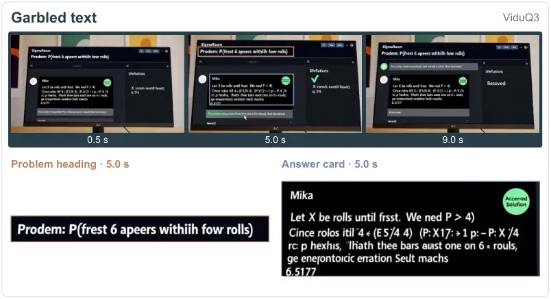

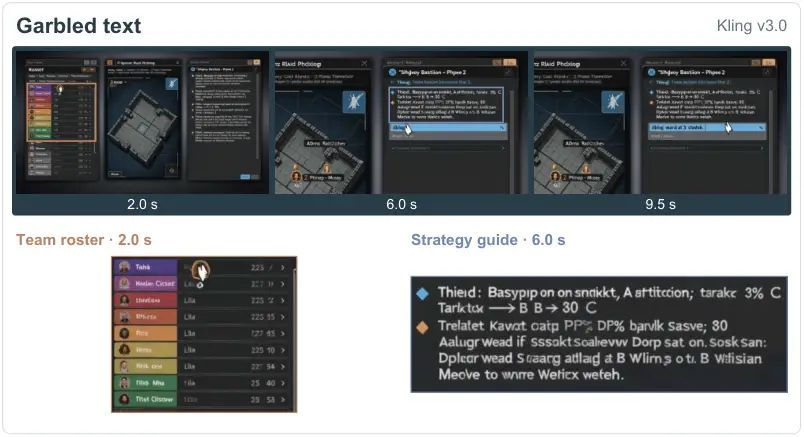

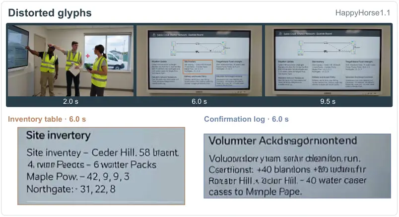

Figure 9: Garbled text in ViduQ3. The problem heading and answer card
contain pseudo-words despite their clear appearance.

Figure 10: Garbled text in Kling v3.0. The game roster and strategy
guide contain extensive pseudo-words within a structured interface.

Figure 11: Distorted glyphs in HappyHorse1.1. Inventory and confirmation
panels mix readable fragments with malformed words.

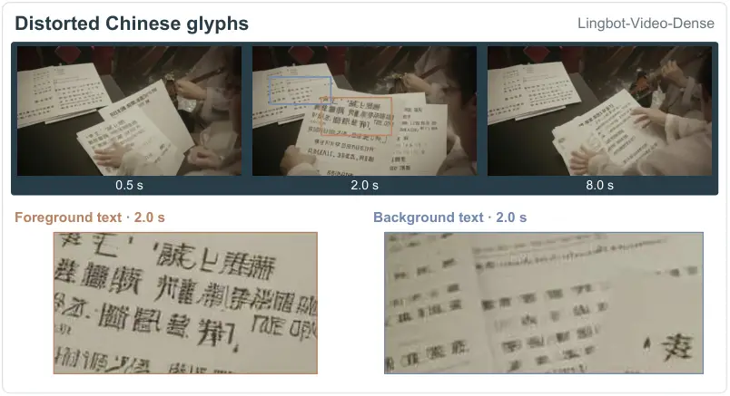

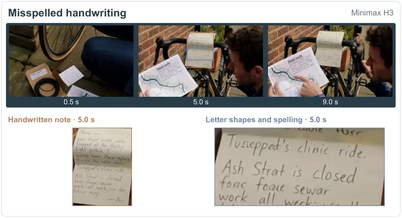

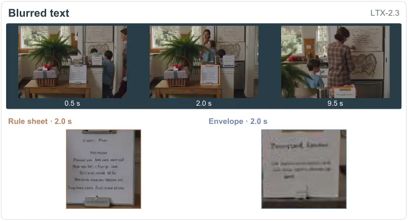

Figure 12: Malformed Chinese characters in Lingbot-Video-Dense. Printed
text blocks contain abnormal stroke combinations.

Figure 13: Misspelled handwriting in Minimax H3. The large handwritten
note contains distorted word forms.

Figure 14: Blurred text in LTX-2.3. The rule sheet and envelope are
visible, but their text lacks readable detail.

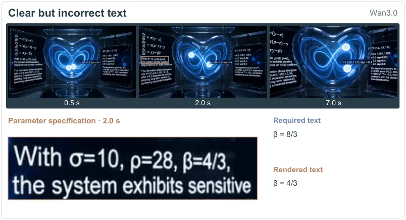

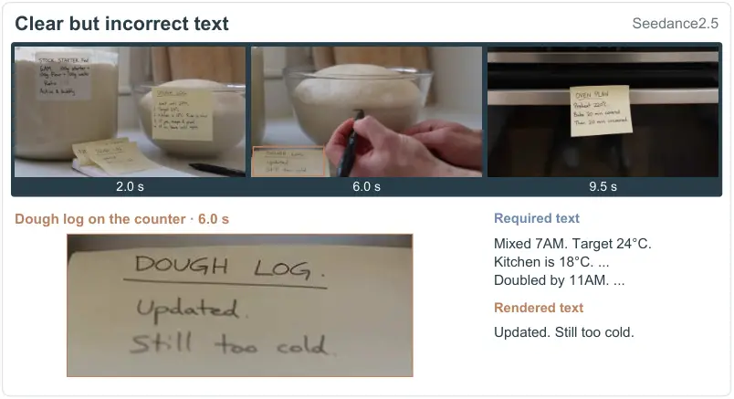

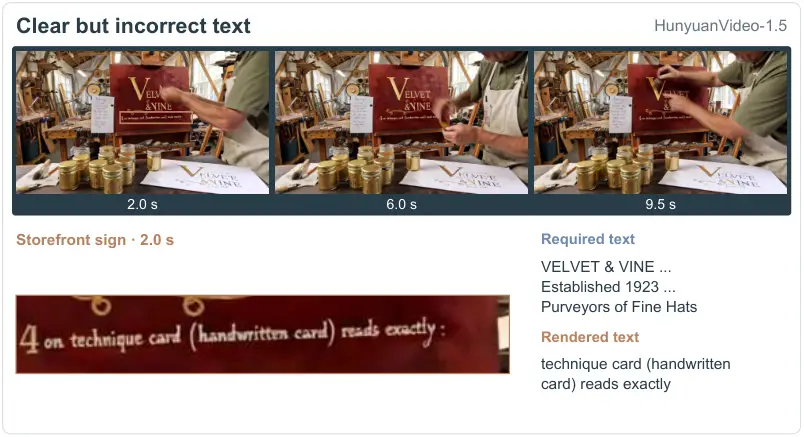

Figure 15: Incorrect parameter in Wan3.0. The required $`\beta=8/3`$ is
rendered as $`\beta=4/3`$.

Figure 16: Rewritten information in Seedance2.5. The counter log
replaces the required timing and temperature details with a brief
update.

Figure 17: Prompt instructions rendered as visible text in
HunyuanVideo-1.5. The storefront sign contains an instruction fragment
in place of the required brand copy.
