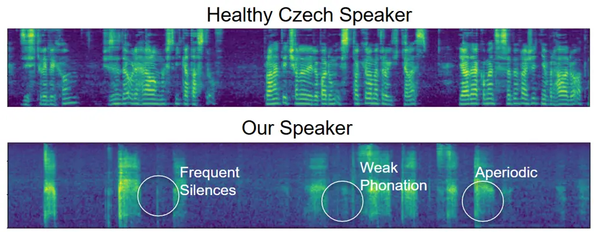
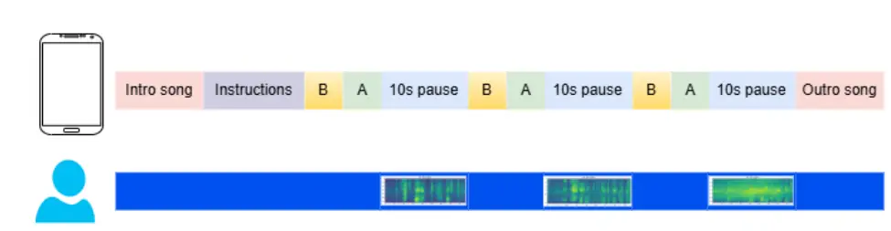
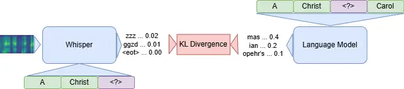

# Personalized Automatic Speech Recognition for a Dysarthric and Tracheostomic Speaker using Artificial Conversations

PubID: pubid: © 2026 IEEE. Personal use is permitted, but
republication/redistribution requires IEEE permission.

David Nadrchal, Monorama Swain, Florian Schmid, Gerhard Widmer and Paul
Primus Affiliation: Institute of Computational Perception (CP-JKU)  
Johannes Kepler University Linz  
Linz, Austria  
ORCIDs: 0009-0000-3208-3355 (D.N.), 0009-0000-4663-6141 (M.S.),
0009-0007-4988-6067 (F.S.),  
0000-0003-3531-1282 (G.W.), 0009-0000-9889-8493 (P.P.)

###### Abstract

This work presents an automatic speech recognition (ASR) system
personalized for a Czech speaker with a permanent tracheal stoma and
severe dysarthria rendering their speech unintelligible to untrained
listeners. We release a public dataset containing 33 annotated hours of
the speaker’s speech, collected using a novel ”artificial conversation”
protocol designed for high engagement and dialogue realism. We propose a
multi-stage training pipeline based on Whisper Base: fine-tuning on
standard Czech speech, acoustically simulated tracheostomic speech, and
the speaker’s data. We evaluate the system across three near real-time
scenarios: scripted conversations, question answering, and spontaneous
dialogue, achieving a 50% relative reduction in Character Error Rate
compared to Whisper Base baseline and surpassing the average recognition
accuracy of their assistants in acoustic recognition of isolated
utterances. We demonstrate that even for severely impeded speech, a
helpful ASR is achievable, as evidenced by the quantitative results and
the feedback from the speaker.

###### Index Terms: 

speech recognition, assistive technology, model merging, federated
adaptation

## I Introduction



Fig. 1: Speech disorders of the target speaker - Mel spectrograms (128
bins) comparing their speech to that of a standard speaker.

The speaker is a Czech teenager with quadriplegia and severe dysarthria
following a spinal injury. They require a permanent tracheal stoma,
rendering their speech unintelligible to untrained listeners (as
quantified in Section V-A). However, family members and experienced
caregivers can understand the speaker in real-world interactions where
non-verbal communication, lip-reading, and feedback loops are employed.
We illustrate the spectral characteristics of the speaker’s speech—such
as reduced energy, spectral flatness, and frequent interruptions—in
Fig. 1. These physical limitations prevent the speaker from fully
participating in education alongside their peers, as existing assistive
technologies do not adequately address their communication needs.

Low-tech Augmentative and Alternative Communication (AAC) methods, such
as blink codes or communication boards \[1\], are too slow for engaging,
real-time interaction; indeed, the speaker can already communicate
faster by nose-typing on their smartphone.

More recently, assistive Automatic Speech Recognition (ASR) systems have
emerged as powerful high-tech AAC methods. Pioneering initiatives like
Project Euphonia \[2\] and Voiceitt \[3\] demonstrated the viability of
personalized ASR. Building on this, the 2025 Speech Accessibility
Project \[4\] (SAP) challenge recently saw the top-performing team \[5\]
achieve an 8% Word Error Rate (WER) on impeded speech in unconstrained
ASR settings using fine-tuned Prakeet-TDT model \[6\]. Unfortunately,
these solutions remain largely inapplicable to our case, as they focus
heavily on English and rely on large-scale data collection across
multiple speakers. Our scenario requires a highly personalized approach
for a single speaker with severe, combined dysarthria and tracheostomic
phonation, for which no prior Czech training data exist.

To quantify the difficulty of this specific acoustic modeling task, we
evaluated the speaker’s baseline intelligibility using Whisper
large-v3 \[7\], a state-of-the-art multilingual ASR foundation model.
The model failed to recognize a single word correctly, yielding a WER
exceeding 100% due to rampant insertion errors. For context, the same
off-the-shelf Whisper model achieves a 23.64% WER on the English SAP
dataset. We provide a more rigorous intelligibility assessment in
Section V.

Furthermore, while recent advances in speech neuroprostheses (e.g., Card
et al. \[8\]) have achieved a remarkable 2.5% WER for ALS patients using
neural implants, such methods are expensive and highly invasive,
rendering them impractical for our user’s immediate real-world needs.

To address these challenges, we propose a personalized, non-invasive ASR
system developed through a multi-stage pipeline. Our main contributions
are:

1.  1.  Public Dataset: We release 33 hours of annotated, severely
        dysarthric and tracheostomic Czech speech. To the best of our
        knowledge, this is the largest publicly available single-speaker
        corpus for impeded speech.
2.  2.  Artificial Conversations: We introduce a novel data collection
        protocol that simulates natural dialogue dynamics. This method
        maintains speaker engagement and elicits natural prosody while
        retaining the tractability of scripted targets, enabling highly
        efficient data collection by a single researcher (Section II).
3.  3.  Real-Time Streaming Framework: Unlike prior work focused primarily
        on offline assistive ASR, we propose a near-real-time inference
        pipeline. This includes a device-adaptation fine-tuning stage, a
        personalized Voice Activity Detector (VAD) optimized for very low
        signal-to-noise ratios, and guided language decoding to enable
        practical, real-world smartphone deployment.

We evaluate the system across three live recognition scenarios: scripted
conversations, question answering, and spontaneous dialogue
(Section IV). We achieve performance on par with experienced listeners
in terms of recognition of isolated audio-only utterances, concluding
that for further reduction of the error we must consider also other
context than the spoken utterances themselves such as longer
conversation history or visual input. Nevertheless, the resulting system
is considered useful by the speaker.

We provide the codes for dataset collection, the machine learning
pipeline and the web interface for streaming, near-real time inference
on our GitHub ¹¹ 1 https://github.com/Hobit2002/DysartrTracheoASR.

## II Dataset

### II-A Artificial Conversations

Collection of speech data often relies on the participants reading
provided sentences \[9, 2, 10\]. It has been shown that such speech
substantially differs from that of our target domain - real-world
conversations \[11\]. Furthermore, the speaker reported that standard
reading sessions lacked the engagement necessary to sustain long-term
data collection (to quote them: ”It’s a drag. I constantly feel such
powerlessness and a sense of futility.”). To address this, we introduce
a novel collection protocol: Artificial Conversations.

This method simulates natural dialogue dynamics while retaining the
benefits of scripted targets. We provide the speaker with a pre-rendered
audio track containing a dialogue between two characters (A and B). The
track includes synthesized speech for Character B and silence intervals
for Character A. The speaker’s task is to ”play” Character A by
repeating the target line during the allocated silence (see Fig. 2).



Fig. 2: Artificial conversations - the upper track depicts the
synthesized audio guide provided to the speaker. The lower track
illustrates the silence windows where the speaker was expected to repeat
their line of the scripted dialogue.

Because existing corpora are not sufficiently personalised to keep the
speaker engaged and to contain the vocabulary tailored to their
communication needs, we generate the scripts with a language model to
cover the topics of their interest. We prompt GPT-4o mini \[12\] (chosen
for a favorable tradeoff between speed and realism of generated
dialogues) with six opening lines of the dialogue, 1–4 sentences
describing its high-level topics and detailed instructions on the manner
(tone, sentence length, vocabulary, etc.) in which the characters should
speak. The resulting dialogue is split into lines spoken by character A
and lines spoken by character B. Both sets of lines are converted to
audio using a text-to-speech system. The lines spoken by character B are
further processed with ring modulation to make them distinguishable from
those of character A. Finally, we merge the audio into a single dialogue
file. While creating the audio file, we also save the temporal
coordinates of the silence segments during which the speaker is expected
to speak, along with the corresponding lines of text. These timestamps
are later used to annotate the recording.

In order to make the ”artificial conversations” both engaging and
representative of the speaker’s real-world vocabulary, we dedicate most
of the recording sessions to topics revolving around the speaker’s
interests and everyday life.

### II-B Dataset Statistics

We conducted 137 recording sessions and collected 16,619 sentence-level
utterances totalling 37:45 hours of transcribed speech. The sessions
were predominantly ”artificial conversations” but we have also recorded
several reading sessions, manually transcribed spontaneous
conversations, open-ended question answering (QA) or singing. The data
distribution by recording modality is detailed in Table I.

A subset of the ”artificial conversations”, spontaneous conversations
and QA sessions were recorded in streaming settings, where the speaker
interacted directly with our real-time ASR prototype. We refer to those
sessions and the speech data resulting from them as ”streaming”. The
remainder were collected in an offline setting (processed post-hoc).
”Artificial conversations” were annotated automatically using the
timestamp files created during the generation process; other formats
were transcribed manually.

| Session Type              | Sessions | Hours | Utts   |
| ------------------------- | -------- | ----- | ------ |
| Artif. Convs. (Offline)   | 69       | 20:21 | 8 428  |
| Artif. Convs. (Streaming) | 30       | 10:39 | 2 733  |
| Reading                   | 21       | 3:06  | 2 719  |
| Question Answering        | 3        | 0:48  | 353    |
| Spontaneous Convs.        | 4        | 1:35  | 737    |
| Other (Singing, etc.)     | 10       | 1:16  | 454    |
| Total                     | 137      | 37:45 | 16 619 |

TABLE I: Overall Dataset Statistics

Although reading sessions yielded slightly more utterances per session
than artificial conversations (129.5 vs. 112.7), artificial
conversations produced nearly double the word count (420.1 vs. 229.9
words per session). Given our collection rate of approximately three
sessions per week for both formats, artificial conversations proved
significantly more data-efficient for our particular case.

We release a subset of this data on Zenodo²² 2
https://zenodo.org/records/22745518, excluding personally identifiable
information, with explicit consent from the speaker and their legal
guardian. Each utterance includes session identifiers and dates to
enable longitudinal analysis and prevent data leakage.

For evaluation, we used a session-wise split to avoid channel or
condition leakage, reserving held-out streaming sessions for testing to
reflect real-world deployment. The remaining sessions form the training
and validation sets; the test data distribution is detailed in Table II.
All of the test data were recorded in the streaming settings.

| Session Type       | Sessions | Hours | Utts |
| ------------------ | -------- | ----- | ---- |
| Artif. Convs       | 3        | 1:08  | 329  |
| Question Answering | 3        | 0:48  | 353  |
| Spontaneous Convs. | 1        | 0:23  | 188  |

TABLE II: Test Set Statistics (Subset of the Overall Dataset)

## III Method

### III-A Training Pipeline

We build our system upon the off-the-shelf Whisper Base provided by
OpenAI \[7\]. While it generally yields lower accuracy than larger
models like Whisper Large \[7\] or Parakeet \[6\], we selected it for
its multilingual capabilities and low computational overhead, which
enables near real-time inference even with limited hardware resources.
We carry out the following four-stage pipeline to fine-tune this
pretrained model on regular, synthesized \[13\] and target speaker’s
speech data:

1.  1.  Standard Czech Speech: To enhance its understanding of Czech
        language, we fine-tune the off-the-shelf Whisper Base on the Czech
        split of Common Voice 19.0 \[9\] and on the Ortofon-v3 \[14\], a
        dataset of 243 hours of informal spoken Czech speech.
2.  2.  Simulated Tracheostomic Speech: To compensate for limited data for
        our speaker, we simulate their condition on standard Czech speech.
        We provide more detail on the simulation in Subsection III-C.
3.  3.  Offline Collected Speaker’s Data: We fine-tune the model on 21:33
        hours of the offline collected speech of the speaker.
4.  4.  Device Adaptation on Streaming Data: Final tuning on 5:49 hours of
        streaming data to adapt to the specific noise suppression and
        microphone characteristics of the deployment device.

We use the Adam optimizer across all stages, applying a learning rate of
$`3\cdot 10^{-5}`$ for the first three stages and reducing it to
$`1\cdot 10^{-5}`$ for the final streaming adaptation (complete
hyperparameters are available in the linked repository). To prevent
linguistic degradation, we regularize training in all stages using
Knowledge Distillation from a language model (detailed in
Section III-B). Further methodologies for acoustic simulation and
streaming adjustments are discussed in Sections III-C and III-D,
respectively.

### III-B Knowledge Distillation from a Language Model

To counteract Whisper’s poor Czech prior, we regularize fine-tuning via
Knowledge Distillation \[15, 16\] from a custom 60M-parameter, 6-layer
bi-LSTM language model (LM). This LM shares Whisper’s BPE
tokenizer \[17\] and predicts masked tokens using bidirectional
context \[18\]. During fine-tuning, the LM’s target probability
distributions are distilled into Whisper via KL divergence (Fig. 3;
hyperparameters on GitHub).



Fig. 3: KD mechanism.

### III-C Acoustic Simulation

To overcome the scarcity of tracheostomic speech data, we augment
non-impaired speech from Common Voice and Ortofon with acoustic
transformations that mimic the condition of the target speaker. The
standard deep learning voice conversion methods (zero-shot
Seed-VC \[19\], non-parallel CycleGAN-VC2 \[20\], and self-supervised
S3PRL-VC \[21\]) failed to adequately model this extreme phonetic
degradation. We attribute this to severe domain mismatch: tracheostomic
aphonia falls far outside the distribution of standard pre-trained
latent extractors. Consequently, we opted for deterministic, low-level
signal processing transformations. This choice is further supported by
recent literature \[22\], which suggests that ASR pre-training on
synthetic data generated by complex neural techniques is susceptible to
overfitting in downstream tasks.

We parameterize these transformations using a local hill-climbing
search \[23\] maximizing the acoustic indistinguishability between
simulated and real samples. We heuristically quantify this by K-means
clustering their embeddings (PyAnnote \[24\] canonical x-vectors \[25\])
to two clusters and maximizing the mean intra-cluster Shannon
entropy \[26\], aiming to transition from class-separated clusters
(entropy $`\approx`$ 0) to a uniform mix (entropy $`\approx`$ 1). We
consider this metric to be only a coarse proxy that might not reflect
the acoustic similarity (especially for the out-of-distribution speech
such as that of our speaker). The simulation consists of three steps:

1.  1.  Spectral Flattening: We isolate the periodic voice component using
        Linear Predictive Coding \[27\] and replace it with white noise to
        simulate aphonia.
2.  2.  Temporal Alignment: We slow the audio by a factor of $`4\times`$
        using librosa phase vocoder time stretch to match the speaker’s rate
        of speech ($`\approx`$25–30 wpm).
3.  3.  Interruption Simulation: We inject random 250 ms silence segments to
        mimic dysfluent pauses of the speaker.

On our experimental set this pipeline increased the embedding cluster
entropy from 0.5 to 0.7–0.8. Listening tests also indicated a shift
towards tracheostomic speech, although the differences remained notable.

We also experiment with a simpler acoustic simulation that only uses the
time-stretching, as it was shown that this augmentation alone can lead
to significant performance gains \[28\]. The comparison to the full
acoustic simulation pipeline is provided in Section V

### III-D Streaming Inference

To deploy the system for real-time use, we developed a web-based
interface accessible via smartphone. Audio is streamed to our inference
server in 62.5 ms chunks (1000 samples at 16 kHz) for continuous
processing.

While the latency of our system ($`\approx`$2.5 s) is higher than the
sub-second commercial standard \[29\], the user reported that it remains
acceptable, as it is faster than the time typically required for human
listeners to decode their speech.

The exact settings of detection thresholds and other inference
hyperparamters listed below were experimentally determined by CER
minimisation on a validation set.

#### III-D1 Personalized Voice Activity Detection

To enable hands-free interaction, we find it necessary for our system to
employ VAD. As pretrained solutions such as PyAnnote 2.1. \[30\] fail to
reliably distinguish the speaker’s weak phonation from non-speech
sounds \[31\], we implement a personalized VAD classifier using Logistic
Regression, trained on features extracted from two of the streaming
”artificial conversations”. We use 1057 of one second manually segmented
and annotated training chunks, 533 of which correspond to ”silence” and
524 to ”speech” that are split into 62.5ms chunks. For each audio chunk
(zero-padded to 2048 samples), we extract spectral flatness,
zero-crossing rate, spectral centroid, and 13-bin MFCCs. The classifier
uses a detection threshold of 0.3. Positive detections are grouped into
utterance segments, allowing for intra-utterance pauses of up to 2.0 s.
Segments exceeding 1.5 s are padded with 1.0 s of buffered preceding
context and 2.0 s of trailing context (accumulated during the silence
timeout) before causal inference.

On the validation set, these measures largely closed the gap in CER
between automatic and manual speech segmentation. The test set
evaluation is provided in Section V. Thereby, we also provide a
comparison to Pyannote VAD fine-tuned on our single-session training
set.

#### III-D2 Decoding and Constraints

We employ a beam search with a width of 25 to maximize transcription
accuracy despite the acoustic ambiguity. To mitigate phonetic
hallucinations, we constrain decoding to a standard Czech lexicon \[32\]
augmented with the vocabulary of training sessions using Trie-based
logit biasing \[33\]. We penalize the probabilities of out-of-vocabulary
tokens by a factor of $`10^{-4}`$, guiding the model towards expected
vocabulary.

Finally, to filter out residual non-speech noise, we discard
transcriptions with an average token probability lower than the
experimentally determined threshold of 0.712.

## IV Experimental Setup

To evaluate our system, we define three test scenarios ranging from
scripted to spontaneous speech. For each scenario, we establish a
parallel non-impaired speech baseline using an off-the-shelf Whisper
Base model. This allows us to disentangle errors caused by the speech
impairments from those caused by the difficulty of the task itself. We
compare these results with the intelligibility of the speaker’s speech
to human Czech listeners.

### IV-A Evaluation Protocol

To obtain an estimate of system performance reflecting challenges
related to real-world setup, the pathological setup includes automatic
VAD and segmentation on continuous streaming audio. In contrast, the
non-impaired speech baseline are evaluated on manually segmented
utterances. This avoids inflating performance through oracle
segmentation for the target speaker.

We report performance using Character Error Rate (CER), calculated as:

```math
\text{CER}=\frac{S+D+I}{N}, \tag{1}
```

where $`S`$, $`D`$, and $`I`$ are the number of character substitutions,
deletions, and insertions, respectively, and $`N`$ is the total number
of characters in the reference transcription. Note that the model may
hallucinate text, causing insertions ($`I`$) to exceed the reference
length ($`N`$). Thus (1) can yield values greater than 1.0. We prefer
CER over Word Error Rate (WER) for two reasons: (1) Czech is a highly
inflected language where minor suffix errors heavily penalize WER, and
(2) in high-noise pathological scenarios, CER provides more granular
insight into phonetic preservation than binary word-level hits \[34\].

### IV-B Test Scenarios

#### IV-B1 Scripted Conversations

We utilize 3 streaming artificial conversations (329 utterances). To
create a non-impaired speech reference, we re-recorded these exact
scripts under similar acoustic conditions. This results in a pair of
datasets with identical linguistic content but differing vocal
characteristics.

#### IV-B2 Question Answering (QA)

We evaluate on 3 QA sessions consisting of 353 short utterances (often
single-word answers). Ground truth transcriptions were generated by an
expert human listener. As with the scripted scenario, we created a
parallel non-impaired baseline by re-recording the answers to ensure
identical content.

#### IV-B3 Spontaneous Conversations

This represents the most challenging ”in-the-wild” benchmark.

- •
  Pathological Set: We use one fully transcribed spontaneous
  conversation (188 utterances) recorded in the streaming settings. To
  isolate the patient’s speech from their interlocutor, we apply speaker
  diarization using PyAnnote \[24\] prior to our VAD pipeline.
- •
  Non-impaired Baseline: We find it is unfeasible to replicate a
  spontaneous conversation while keeping its spontaneity. Therefore,
  instead of strict re-recording as above, we use a proxy baseline: 16
  recordings (5 136 utterances) from the Ortofon-v3 dataset \[14\],
  representing natural, informal Czech conversations. These were
  withheld from the traning set of stage (1).

## V Results and Analysis

We evaluate our system by benchmarking performance against human
listeners (Section V-A) and standard Czech Whisper baselines
(Section V-B). We then assess individual system components (Section V-C)
and present a qualitative error analysis (Section V-D).

### V-A Human Intelligibility Assessment

To contextualize our system’s performance, we evaluated the baseline
intelligibility of the speaker’s speech to human listeners. We conducted
a listening experiment in which eight Czech speakers, unfamiliar with
the target speaker, transcribed 25 utterances. These utterances
consisted of isolated one- to three-word recordings, randomly sampled
from three distinct streaming artificial conversations and presented in
a shuffled order. The untrained listeners yielded an average CER of
1.182 (exceeding 1.0 due to insertion errors), confirming that the
speaker’s speech is effectively unintelligible to naive listeners in an
audio-only setting.

To establish a baseline for experienced listeners, we further recruited
four of the speaker’s assistants. They achieved an average CER of 0.708
(range 0.42–0.90). A Wilcoxon signed-rank test \[35\] confirms that our
system (which achieved a CER of 0.565 on this specific utterance set)
significantly outperforms both the group average ($`p=0.046`$) and three
of the individual assistants ($`p<0.01`$). However, the top-performing
human listener (CER 0.423) still significantly surpasses the model
($`p=0.008`$), indicating that a performance gap remains compared to
ultimate expert-level comprehension.

Notably, this top-performing listener was one of the authors who curated
the dataset. Consequently, they possessed strong prior knowledge of the
expected linguistic content and, unlike the others assistants, were
accustomed to decoding the speaker’s audio-only speech without relying
on visual cues or an interactive feedback loop.

### V-B Comparison to Baseline

Table III compares our system against standard Czech models (Baseline,
Non-impaired Topline) and a ”Speaker-only” baseline. This baseline
represents a version of our system fine-tuned exclusively on the
speaker’s data, omitting the initial pre-training stages (skipping to
steps 3 and 4 of the pipeline described in Section III-A).

While our proposed system reduces the Character Error Rate (CER) by 40
to 90 absolute percentage points compared to the zero-shot baseline, a
gap remains when compared to non-impaired speech recognition.
Furthermore, while omitting the pre-training (i.e., the ”Speaker-only”
configuration) does not substantially impact performance for scripted
conversations, it severely degrades accuracy across the less constrained
modalities. We suggest that this ambiguous effect might be because the
pre-training steps establish language priors for spontaneous speech that
are effective for spontaneous settings but not for the scripted
conversations that likely follows very similar acoustic and linguistic
patterns as the training conversations.

|                                    |          |       |        |
| ---------------------------------- | -------- | ----- | ------ |
| Evaluation Setup                   | Scripted | QA    | Spont. |
| Non-impaired Control Data          |          |       |        |
|    Baseline                        | 0.289    | 0.286 | 0.710  |
|    Non-impaired Topline (Czech FT) | 0.197    | 0.172 | 0.256  |
| Target Speaker Data (Impeded)      |          |       |        |
|    Baseline (Zero-shot)            | 0.944    | 0.882 | 1.529  |
|    Speaker-only                    | 0.431    | 0.510 | 0.949  |
|    Proposed System (Ours)          | 0.433    | 0.449 | 0.637  |

TABLE III: Comparison of CER across test scenarios. ”Baseline” is
off-the-shelf Whisper Base. ”Non-impaired Topline” represents the
theoretical upper bound performance: the Whisper Base model fine-tuned
by us on standard Czech speech (Common Voice and Ortofon).
”Speaker-only” stands for a model fine-tuned only on the speaker’s
speech without the pre-training stages.

### V-C Component-wise Evaluation

Table IV details the contribution of specific system components. Device
Adaptation and Inference Components (Personalized VAD, Vocab Guidance)
proved critical; removing either degrades performance by $`>27\%`$
(relative). We attribute the significance of Device Adaptation to the
aggressive noise suppression filters employed by the iPhone in streaming
settings.

Our lightweight VAD outperforms Ft. Pyannote VAD (Pyannote VAD
fine-tuned on one of the streaming sessions) across all three
modalities, possibly because the PyanNet network \[24\] overfitted the
limited training data. The Manual VAD Oracle (replacing our custom VAD
with handcrafted speech segmentations unconstrained by causal streaming
requirements) reveals a noticeable performance gap in spontaneous speech
(0.506 vs. 0.637 CER). This suggests that $`\approx`$20% of the error in
this scenario stems purely from segmentation challenges. However,
qualitative analysis reveals that this increased error rate is largely
driven by false positives—specifically, the simple VAD classifier
incorrectly triggering on the speech of the interlocutor. From a
usability perspective, these false triggers do not severely disrupt the
actual conversation flow, as they occur while the communication partner
is speaking—a period when neither participant is typically monitoring
the smartphone’s transcription screen. Therefore, while there remains an
algorithmic gap in dynamic speaker diarization, our lightweight VAD
implementation does not constitute a practical bottleneck for real-world
deployment.

Acoustic Simulation and Pre-training provided moderate gains (3–6%),
while Knowledge Distillation offered mixed results across formats,
especially considering the very limited number of our test samples.
Notably, when substituting our full simulation for a Stretch-only
Acoustic Simulation, performance drops drastically in spontaneous
settings, despite minor improvements in the other modalities. To explain
this discrepancy, we hypothesize that during controlled recordings
eliciting short answers, the speaker maintains largely vocalized speech.
In contrast, during real, spontaneous conversations, the speaker
frequently transitions to whispered, aperiodic speech—a condition that
directly benefits from the removal of the periodic source during our
full acoustic simulation phase.

Finally, Table V illustrates the performance trajectory across our
multi-stage pipeline. While error rates for scripted speech decrease
steadily throughout the pipeline, QA and spontaneous speech are only
recognized with reliable accuracy after training the model on the target
speaker’s offline data.

|                                   |          |       |        |       |                      |
| --------------------------------- | -------- | ----- | ------ | ----- | -------------------- |
| Configuration                     | Scripted | QA    | Spont. | Mean  | Avg. Rel. $`\Delta`$ |
| Full System                       | 0.433    | 0.449 | 0.637  | 0.506 | Reference            |
| Training Components               |          |       |        |       |                      |
|    w/o Device Adaptation          | 0.637    | 0.637 | 0.696  | 0.657 | +32.7%               |
|    w/ Stretch-only Ac. Simulation | 0.411    | 0.437 | 0.869  | 0.572 | +9.6%                |
|    w/o Acoustic Simulation        | 0.453    | 0.500 | 0.647  | 0.533 | +5.8%                |
|    w/o Common Voice Pre-train     | 0.471    | 0.475 | 0.645  | 0.530 | +5.2%                |
|    w/o Ortofon Pre-train          | 0.438    | 0.451 | 0.695  | 0.528 | +3.5%                |
|    w/o Knowledge Distillation     | 0.428    | 0.499 | 0.634  | 0.520 | +3.2%                |
| Inference Components              |          |       |        |       |                      |
|    w/o Personalized VAD           | 0.574    | 0.588 | 0.793  | 0.652 | +29.3%               |
|    w/ Ft. Pyannote VAD            | 0.599    | 0.594 | 0.659  | 0.617 | +24.7%               |
|    w/o Vocab. Guidance            | 0.572    | 0.583 | 0.763  | 0.639 | +27.2%               |
| w/ Manual VAD Oracle              | 0.409    | 0.416 | 0.506  | 0.444 | –                    |

TABLE IV: Ablation study. Results reported in CER. The Avg. Rel.
$`\Delta`$ column represents the average percentage increase in error
relative to the Full System (higher implies the component is more
critical). The best result in each column is bolded, and the second best
is underlined.

|                                                                                                                      |          |            |            |            |
| -------------------------------------------------------------------------------------------------------------------- | -------- | ---------- | ---------- | ---------- |
| Training Stage (Cumulative)                                                                                          | Scripted | QA         | Spont.     | Mean       |
| Whisper Base (Zero-shot)                                                                                             | 0.944    | 0.882      | 1.529      | 1.118      |
|    + Czech FT (Standard Speech)                                                                                      | 0.904    | 1.796^(\*) | 2.633^(\*) | 1.778^(\*) |
|    + Simulated Tracheostomic Speech                                                                                  | 0.772    | 1.082^(\*) | 5.358^(\*) | 2.404^(\*) |
|    + Offline Speaker Data                                                                                            | 0.637    | 0.637      | 0.696      | 0.657      |
|    + Streaming Data (Full System)                                                                                    | 0.433    | 0.449      | 0.637      | 0.506      |
| ^(\*)Values inflated heavily by unconstrained insertion errors (hallucinations) prior to speaker-specific grounding. |          |            |            |            |

TABLE V: Incremental evaluation across the multi-stage training
pipeline. Results are reported in Character Error Rate (CER).

### V-D Qualitative Error Analysis

Although the absolute CER remains high, semantic intent is often
preserved as many errors stem missing diacritics or homophone
substitutions (see Table VI). Applying aggressive text normalization to
merge acoustically similar Czech characters (e.g., i/y or d/t) yields a
13.4% relative CER reduction on scripted speech, dropping it to 0.375.
As with non-impaired baselines, spontaneous speech remains the most
challenging domain.

Subjective feedback from the speaker highlights the practical utility:
”It is better than it used to be; it really understands me… essentially
most of the time. However, it falls short on the names of rockets and
space shuttles—though the vast majority of people fall short on those
too.”

|                                 |                                            |
| ------------------------------- | ------------------------------------------ |
| Reference (Ground Truth)        | Hypothesis (System Output)                 |
| (Translation provided below)    |                                            |
| Ahoj, Šalino                    | Ahoj, Šalino                               |
| Hi, Šalina                      | Hi, Šalina                                 |
| Lidé zapomínají na oblohu       | Lidé zapomínají na oblohu                  |
| People forget about the sky     | People forget about the sky                |
| Noční oblohu                    | Naští oblohu                               |
| Night sky                       | \[Nonsense\] sky                           |
| Martin Gembec doporučuje hvězdy | Martin Gembec do položuje                  |
| Martin Gembec recommends stars  | Martin Gembec \[hallucinated verb phrase\] |
| Tomáš Přibyl má skvělé tipy     | Tomáš Přibyl na skvělé typy                |
| Tomáš Přibyl has great tips     | Tomáš Přibyl on great types                |

TABLE VI: Qualitative analysis of a sample transcript. Errors are marked
in red.

## VI Conclusion

We presented a personalized ASR system for a Czech speaker with severe
dysarthria and a permanent tracheal stoma rendering their speech
entirely unintelligible to both human listeners and state-of-the-art ASR
models. To address the data scarcity of their condition, we introduced
”Artificial Conversations”—a novel data collection protocol combining
the engagement of dialogue with the tractability of scripted speech and
released 33 hours of impeded speech collected in this manner. Our
four-stage fine-tuning pipeline, augmented by acoustic simulation and
extensive adaptations to streaming settings improved lightweight Whisper
Base from being completely unusable to being perceived as helpful as
confirmed by both experimental results and the user feedback.

While the absolute CER ($`\approx`$0.50) remains high for general
standards, our system outperforms experienced human listeners in
low-context scenarios. Furthermore, although the state-of-the-art ASR
models for English dysarthric speech achieve lower error rates than our
system, we emphasize that our case is specific because of the data
scarcity of Czech language, high severity and rarity of the speaker’s
impediment and low-latency constraints.

Future work should focus on generalizing this approach to multiple
speakers and reducing the reliance on annotated data through advanced
pre-training or semi-supervised learning on untranscribed speech.
Additionally, integrating multimodal context (e.g., lip-reading) and
conversational memory could help bridge the remaining gap between
acoustic recognition and full intelligibility. Finally, evaluating the
system across a broader test set would provide deeper insights into the
relative contributions of individual pipeline components.

## VII Acknowledgment

We would like to thank Radek Skarnitzl, Tomáš Bořil, Lucie Benešová and
Václav Cvrček from Charles University for their advice on the removal of
periodic component during acoustic simulation and for familiarising us
with the Ortofon dataset. Finally, we are very grateful to the speaker
themselves and their family for their extraordinary patience during
participation in this project.

## VIII AI-Generated Content Disclosure

Gemini Pro was used to polish the text and provide structural feedback
during the process of writing.

## References

- \[1\] S. V. Millar and A. Wilson (1994) Augmentative communication in
  practice: an introduction. CALL Centre, University of Edinburgh. Cited
  by: §I.
- \[2\] R. L. MacDonald, P. Jiang, J. Cattiau, R. Heywood, R. Cave, K.
  Seaver, M. A. Ladewig, J. Tobin, M. P. Brenner, P. C. Nelson, J. R.
  Green, and K. Tomanek (2021) Disordered speech data collection:
  lessons learned at 1 million utterances from project euphonia. In 22nd
  Annual Conference of the International Speech Communication
  Association, Interspeech 2021, Brno, Czechia, August 30 - September 3,
  2021, pp. 4833–4837. Cited by: §I, §II-A.
- \[3\] E. Howarth, G. Vabulas, S. Connolly, D. Green, and S.
  Smolley (2024) Developing accessible speech technology with users with
  dysarthric speech. Assistive Technology, pp. 1–8. Cited by: §I.
- \[4\] M. Hasegawa-Johnson, X. Zheng, H. Kim, C. Mendes, M.
  Dickinson, E. Hege, C. Zwilling, M. M. Channell, L. Mattie, H.
  Hodges, L. Ramig, M. Bellard, M. Shebanek, L. Sar, K. Kalgaonkar, D.
  Frerichs, J. P. Bigham, L. Findlater, C. Lea, S. Herrlinger, P.
  Korn, S. Abou-Zahra, R. Heywood, K. Tomanek, and B. MacDonald (2024)
  Community-supported shared infrastructure in support of speech
  accessibility. Journal of Speech, Language, and Hearing Research 67
  (11), pp. 4162–4175. Cited by: §I.
- \[5\] K. Takahashi, K. Hojo, T. Sakai, Y. Wakabayashi, and N.
  Kitaoka (2025) Fine-tuning parakeet-tdt for dysarthric speech
  recognition in the speech accessibility project challenge. In 26th
  Annual Conference of the International Speech Communication
  Association, Interspeech 2025, Rotterdam, The Netherlands, 17-21
  August 2025, Cited by: §I.
- \[6\] M. Sekoyan, N. R. Koluguri, N. Tadevosyan, P. Zelasko, T. M.
  Bartley, N. Karpov, J. Balam, and B. Ginsburg (2025) Canary-1b-v2 &
  parakeet-tdt-0.6b-v3: efficient and high-performance models for
  multilingual ASR and AST. CoRR abs/2509.14128. Cited by: §I, §III-A.
- \[7\] A. Radford, J. W. Kim, T. Xu, G. Brockman, C. McLeavey, and I.
  Sutskever (2023) Robust speech recognition via large-scale weak
  supervision. In International Conference on Machine Learning, ICML
  2023, 23-29 July 2023, Honolulu, Hawaii, USA, Proceedings of Machine
  Learning Research, Vol. 202, pp. 28492–28518. Cited by: §I, §III-A.
- \[8\] N. S. Card, M. Wairagkar, C. Iacobacci, X. Hou, T.
  Singer-Clark, F. R. Willett, E. M. Kunz, C. Fan, M. V. Nia, D. R.
  Deo, A. Srinivasan, E. Y. Choi, M. F. Glasser, L. R. Hochberg, J. M.
  Henderson, K. Shahlaie, S. D. Stavisky, and D. M. Brandman (2024) An
  accurate and rapidly calibrating speech neuroprosthesis. New England
  Journal of Medicine 391 (7), pp. 609–618. Cited by: §I.
- \[9\] R. Ardila, M. Branson, K. Davis, M. Kohler, J. Meyer, M.
  Henretty, R. Morais, L. Saunders, F. M. Tyers, and G. Weber (2020)
  Common voice: A massively-multilingual speech corpus. In Proceedings
  of The 12th Language Resources and Evaluation Conference, LREC 2020,
  Marseille, France, May 11-16, 2020, pp. 4218–4222. Cited by: §II-A,
  item 1.
- \[10\] V. Panayotov, G. Chen, D. Povey, and S. Khudanpur (2015)
  Librispeech: an asr corpus based on public domain audio books. In 2015
  IEEE International Conference on Acoustics, Speech and Signal
  Processing (ICASSP), pp. 5206–5210. Cited by: §II-A.
- \[11\] M. Nakamura, K. Iwano, and S. Furui (2008) Differences between
  acoustic characteristics of spontaneous and read speech and their
  effects on speech recognition performance. Computer Speech & Language
  22 (2), pp. 171–184. Cited by: §II-A.
- \[12\] A. Hurst, A. Lerer, A. P. Goucher, A. Perelman, A. Ramesh, A.
  Clark, A. Ostrow, et al. (2024) GPT-4o system card. CoRR
  abs/2410.21276. External Links: 2410.21276 Cited by: §II-A.
- \[13\] L. P. Violeta, D. Ma, W. Huang, and T. Toda (2024) Pretraining
  and adaptation techniques for electrolaryngeal speech recognition.
  IEEE ACM Trans. Audio Speech Lang. Process. 32, pp. 2777–2789. Cited
  by: §III-A.
- \[14\] D. Lukeš, M. Kopřivová, Z. Laubeová, P. Poukarová, V. Horký, T.
  Jelínek, J. Křivan, M. Waclawičová, L. Benešová, and M.
  Škarpová (2024) ORTOFON v3: corpus of informal spoken czech with
  multi-tier transcription (transcriptions). Note: LINDAT/CLARIAH-CZ
  digital library at the Institute of Formal and Applied Linguistics
  (ÚFAL) Cited by: item 1, 2nd item.
- \[15\] G. E. Hinton, O. Vinyals, and J. Dean (2015) Distilling the
  knowledge in a neural network. CoRR abs/1503.02531. External Links:
  [Link](http://arxiv.org/abs/1503.02531) Cited by: §III-B.
- \[16\] H. Futami, H. Inaguma, S. Ueno, M. Mimura, S. Sakai, and T.
  Kawahara (2020) Distilling the knowledge of BERT for
  sequence-to-sequence ASR. In 21st Annual Conference of the
  International Speech Communication Association, Interspeech 2020,
  Virtual Event, Shanghai, China, October 25-29, 2020, pp. 3635–3639.
  Cited by: §III-B.
- \[17\] P. Gage (1994) A new algorithm for data compression. The C
  Users Journal 12 (2), pp. 23–38. Cited by: §III-B.
- \[18\] J. Devlin, M. Chang, K. Lee, and K. Toutanova (2019) BERT:
  pre-training of deep bidirectional transformers for language
  understanding. In Proceedings of the 2019 Conference of the North
  American Chapter of the Association for Computational Linguistics:
  Human Language Technologies, NAACL-HLT 2019, Minneapolis, MN, USA,
  June 2-7, 2019, Volume 1 (Long and Short Papers), pp. 4171–4186. Cited
  by: §III-B.
- \[19\] S. Liu (2024) Zero-shot voice conversion with diffusion
  transformers. arXiv e-prints, pp. arXiv–2411. Cited by: §III-C.
- \[20\] T. Kaneko, H. Kameoka, K. Tanaka, and N. Hojo (2019)
  Cyclegan-vc2: improved cyclegan-based non-parallel voice conversion.
  In ICASSP 2019-2019 IEEE International Conference on Acoustics, Speech
  and Signal Processing (ICASSP), pp. 6820–6824. Cited by: §III-C.
- \[21\] W. Huang, S. Yang, T. Hayashi, H. Lee, S. Watanabe, and T.
  Toda (2022) S3PRL-VC: open-source voice conversion framework with
  self-supervised speech representations. In IEEE International
  Conference on Acoustics, Speech and Signal Processing, ICASSP 2022,
  Virtual and Singapore, 23-27 May 2022, pp. 6552–6556. Cited by:
  §III-C.
- \[22\] T. Piernicki, M. Kropisz, and B. Kostek (2026) Bridging the
  reality gap in ASR for low-resource dysarthric speech: evaluating
  performance on synthetic and real data. IEEE Access 14,
  pp. 41725–41736. Cited by: §III-C.
- \[23\] S. J. Russell and P. Norvig (2010) Artificial intelligence - A
  modern approach, third international edition. Pearson Education.
  External Links: ISBN 978-0-13-207148-2 Cited by: §III-C.
- \[24\] H. Bredin, R. Yin, J. M. Coria, G. Gelly, P. Korshunov, M.
  Lavechin, D. Fustes, H. Titeux, W. Bouaziz, and M. Gill (2020)
  Pyannote.audio: neural building blocks for speaker diarization. In
  2020 IEEE International Conference on Acoustics, Speech and Signal
  Processing, ICASSP 2020, Barcelona, Spain, May 4-8, 2020,
  pp. 7124–7128. Cited by: §III-C, 1st item, §V-C.
- \[25\] D. Snyder, D. Garcia-Romero, G. Sell, D. Povey, and S.
  Khudanpur (2018) X-vectors: robust DNN embeddings for speaker
  recognition. In 2018 IEEE International Conference on Acoustics,
  Speech and Signal Processing, ICASSP 2018, Calgary, AB, Canada, April
  15-20, 2018, pp. 5329–5333. Cited by: §III-C.
- \[26\] C. E. Shannon (1948) A mathematical theory of communication.
  Bell Syst. Tech. J. 27 (4), pp. 623–656. Cited by: §III-C.
- \[27\] D. O’Shaughnessy (1988) Linear predictive coding. IEEE
  Potentials 7 (1), pp. 29–32. Cited by: item 1.
- \[28\] L. Prananta, B. M. Halpern, S. Feng, and O. Scharenborg (2022)
  The effectiveness of time stretching for enhancing dysarthric speech
  for improved dysarthric speech recognition. In 23rd Annual Conference
  of the International Speech Communication Association, Interspeech
  2022, Incheon, Korea, September 18-22, 2022, H. Ko and J. H. L. Hansen
  (Eds.), pp. 36–40. Cited by: §III-C.
- \[29\] T. N. Sainath, Y. He, B. Li, A. Narayanan, R. Pang, A.
  Bruguier, S. Chang, W. Li, et al. (2020) A streaming on-device
  end-to-end model surpassing server-side conventional model quality and
  latency. In 2020 IEEE International Conference on Acoustics, Speech
  and Signal Processing, ICASSP 2020, Barcelona, Spain, May 4-8, 2020,
  pp. 6059–6063. Cited by: §III-D.
- \[30\] H. Bredin and A. Laurent (2021) End-to-end speaker segmentation
  for overlap-aware resegmentation. In 22nd Annual Conference of the
  International Speech Communication Association, Interspeech 2021,
  Brno, Czechia, August 30 - September 3, 2021, Brno, Czech Republic,
  pp. 3111–3115. Cited by: §III-D1.
- \[31\] S. N. Awan, N. Roy, and C. Dromey (2009) Estimating dysphonia
  severity in continuous speech: application of a multi-parameter
  spectral/cepstral model. Clinical Linguistics & Phonetics 23 (11),
  pp. 825–841. Cited by: §III-D1.
- \[32\] E. E. Altun (2023) All words in all languages. GitHub. Note:
  [https://github.com/eymenefealtun/all-words-in-all-languages](https://github.com/eymenefealtun/all-words-in-all-languages)
  Cited by: §III-D2.
- \[33\] D. Zhao, T. N. Sainath, D. Rybach, P. Rondon, D. Bhatia, B. Li,
  and R. Pang (2019) Shallow-fusion end-to-end contextual biasing.. In
  19th Annual Conference of the International Speech Communication
  Association, Interspeech 2019, Graz, Austria, September 15 - September
  19, 2019, pp. 1418–1422. Cited by: §III-D2.
- \[34\] T. D. K, J. James, D. P. Gopinath, and M. A. K (2025)
  Advocating character error rate for multilingual ASR evaluation. In
  Findings of the Association for Computational Linguistics: NAACL 2025,
  Albuquerque, New Mexico, USA, April 29 - May 4, 2025, L. Chiruzzo, A.
  Ritter, and L. Wang (Eds.), Findings of ACL, pp. 4926–4935. Cited by:
  §IV-A.
- \[35\] F. Wilcoxon (1992) Individual comparisons by ranking methods.
  In Breakthroughs in statistics: Methodology and distribution,
  pp. 196–202. Cited by: §V-A.
