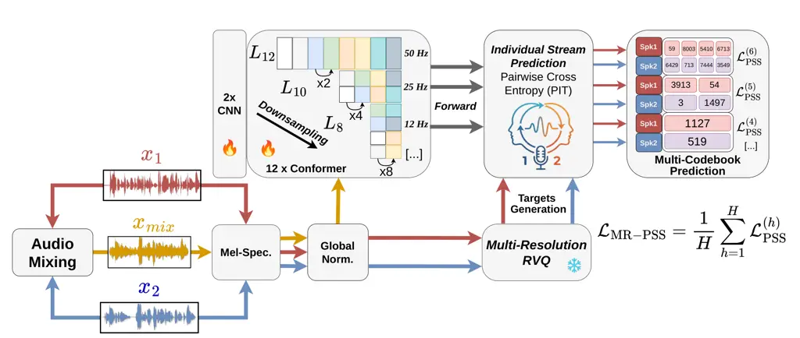

# SepRQ : Self-Supervised Speech Mixture Representation Learning via Mask-Free, Multi-Scale Source Separation

Severin Baroudi    Herve Bredin    Ricard Marxer

###### Abstract

Self-supervised learning (SSL) is standard for speech representation
learning, but mainstream models are designed around single-speaker
audio, limiting their usefulness in multi-speakers scenarios. We present
SepRQ, an open-source SSL framework that replaces masked prediction with
a pseudo-source-separation objective over frozen random-projection
codebooks. By adopting a novel mask-free, multiresolution approach,
SepRQ achieves state-of-the-art performance in Speaker Diarization and
Speech Separation on the SUPERB benchmark, surpassing WavLM and other
cocktail-party derived SSLs at both Base and Large scales, while
requiring only 85.68M inference parameters. SepRQ also demonstrates
strong performance across target-speaker tasks requiring enrollment
(such as Target-Speaker Automatic Speech Recognition), and on the
challenging multi-domain DIHARD 3 diarization dataset. Notably, we
report strong separation capabilities on three-speaker mixtures
(WSJ0-3Mix), where current SSL literature struggles. While
cocktail-party SSLs remain scarce and closed-source, limited to C-HuBERT
and the enrollment-based SA-WavLM, we open-source SepRQ to the
community.

###### Index Terms: 

speech separation, self-supervised learning, speaker diarization,
multi-talker, target-speaker extraction

^(†)^(†)address: ¹Univ Toulon, Aix Marseille Univ, CNRS, LIS, Toulon,
France  
²pyannoteAI, Toulouse, France   ³CNRS, ILLS, Montréal, Canada



Figure 1: Architecture of the proposed SepRQ. The model performs pseudo
source separation in the discrete space, using Random Vector Quantizers
(RVQs), as speaker-specific discrete labels, in a multiresolution
fashion.

## 1 Introduction

Real-world conversational speech often contains overlapping speakers,
room reverberation, and background noise, giving rise to the “cocktail
party” problem of separating and disentangling concurrent speech
sources. While self-supervised learning (SSL) has been widely used in
speech processing, mainstream models such as HuBERT and BestRQ \[1, 11,
7\] have primarily focused on single-speaker tasks, typically using
masked prediction on read-speech corpora such as LibriSpeech \[16\].
Unlike HuBERT, which relies on an impractical offline $`k`$-means
clustering stage to generate discrete targets before pre-training,
BestRQ derives its targets from a single frozen random vector quantizer
(RVQ).

Although adapting pretraining data to the target domain strongly
influences downstream performance on multi-speaker tasks \[3, 2\], a gap
remains in designing SSL architectures explicitly designed for
cocktail-party scenarios. The emergence of multi-speaker benchmarks such
as TS-SUPERB \[18\] and real-world conversational challenges such as
CHiME \[22\] further highlights this need. Overlapping speech requires
representations capable of more than isolated phoneme recognition, since
downstream tasks such as Speech Separation (SS), Speaker Diarization
(SD), and Target-Speaker Automatic Speech Recognition (TS-ASR) demand
disentangling phonetic content, tracking speaker identities, and
identifying precise turn boundaries. Although models such as
UniSpeech-SAT \[5\] or WavLM \[6\] improve acoustic robustness through a
pretrained denoising task, their core objectives remain inherently
single-source. To the best of our knowledge, only few approaches
introduce dedicated pretext tasks associated with separation objectives.
Cocktail-HuBERT (C-HuBERT) \[9\] enforces both stream separation and
discrete masked unit prediction on each target speakers simultaneously,
through the use of a Pseudo Source Separation (PSS) objective. On the
other hand, Speaker-Aware WavLM (SA-WavLM) \[12\] uses embeddings from
enrolled voices to sequentially extract target speakers, relying on
necessary single-speaker sources at inference.

Speech tasks differ substantially in the temporal granularity of the
information they exploit. ASR performance is sensitive to the temporal
resolution of SSL representations, while allowing substantial
compression when representations capture appropriate linguistic
units \[14\]. Speaker diarization presents an explicit multi-timescale
trade-off: short segments provide accurate temporal localization,
whereas longer segments yield more reliable speaker
representations \[17\]. Meanwhile, speech separation typically operates
on fine-grained acoustic representations to disentangle overlapping
sources. These differing temporal requirements motivate our hypothesis
that cocktail-party SSL could benefit from representations learned at
multiple temporal resolutions. This direction is also consistent with
recent multiresolution approaches in single-speaker SSL \[21\] and
supervised speech separation \[15, 24\]. Additionally, while masking can
encourage robust representation learning for single-speaker signals,
concealing portions of a mixture, as employed by C-HuBERT, may suppress
necessary content for speech disentanglement. From an experimental
perspective, existing approaches are only evaluated on synthetic
mixtures derived only from Librispeech, which differ substantially from
real-world speech recordings. Real corpora typically exhibit partial
speaker overlap, varying numbers of active speakers, and dynamic
turn-taking, making it unclear how well cocktail-party SSL models
generalize beyond controlled synthetic conditions. Moreover, C-HuBERT
and SA-WavLM remain the only SSL architectures specifically designed for
the cocktail-party setting, and the absence of open-source
implementations further limits their accessibility and extensibility.

The contributions of this paper are as follows: (i) We introduce SepRQ,
an open-source self-supervised model derived from BestRQ, that features
a pseudo source-separation objective targeted on discrete
speaker-attributed codebook targets, essentially removing the need for
offline clustering employed by WavLM or HuBERT. (ii) We introduce a
multiresolution separation objective with progressive downsampling
across encoder layers, improving separable speaker representation at
every conformer layers. (iii) We conduct a systematic ablation study to
identify the architectural components most beneficial for
self-supervisesd multi-speaker representations. (iv) We evaluate SepRQ
on a broad set of multi-speaker downstream tasks, out-domain datasets
and challenging three speakers mixtures, to evaluate the scalability and
generalizibility of our approach. (v) Finally, we make our SepRQ model
available ¹¹ 1 SepRQ available at :
[https://sevkod.github.io/SepRQ/](https://sevkod.github.io/SepRQ/) to
the community in order to help promote future research on the topic of
separation-based and multi-speaker SSL.

## 2 SepRQ

Following the initial approach introduced by C-HuBERT, our objective is
to enforce source separation directly in a shared discrete
representation space by predicting a separate sequence of quantized
units for each speaker, as illustrated in Figure 1. Rather than
explicitly reconstructing the separated waveforms, the model is trained
to disentangle the discrete representations corresponding to the
individual speakers present in a mixture.

Given a target number of $`K`$ output sources, we construct each
training mixture by sampling up to $`K`$ single-speaker utterances
$`\{x_{k}\}`$, with a decreasing $`50\%`$ probability of adding 1
source, 2 source, …K sources. Each utterance is independently scaled by
an uniformly sampled gain $`g_{k}`$ to account for variations in
relative speaker loudness. The decreasing probability of including
additional sources reflects the lower presence of real-world mixtures
having three or more overlapping speakers.

As demonstrated by WavLM, a denoising pretext task is essential to
produce robust speech representations in noisy scenarios. Since noise is
a fundamental aspect of cocktail-party problems, we add a background
noise utterance $`x_{b}`$ and a low-gain interfering speech utterance
$`x_{n}`$ on top of the mixture, scaled uniformly by $`g_{b}`$ and
$`g_{n}`$ respectively, each being added independently with a
probability of $`20\%`$, to promote overall variability in generated
interferences. The resulting mixture $`x_{\mathrm{mix}}`$ is defined as:

```math
x_{\mathrm{mix}}=g_{b}x_{b}+g_{n}x_{n}+\sum_{k=1}^{K}g_{k}x_{k}. \tag{1}
```

In a cocktail-party setting, we want to enforce the mixture and its
clean constituent speakers to lie in the same representation space,
despite differences in background noise and speaker gain. This ensures
that acoustic and semantic information remain meaningful across the
sources to disentangle. We therefore normalize both mixture and
clean-reference spectrograms with a shared global mean and standard
deviation, estimated over a portion of the mixture and clean reference
training data via moving average.

The normalized mixture spectrogram is processed by two convolutional
layers followed by twelve Conformer layers, following the core
architecture of BestRQ \[7\]. BestRQ’s original front-end operates at
25 Hz, a frame rate that may be too coarse for cocktail-party generation
tasks such as separation or enhancement, which need fine-grained
representations for accurate reconstruction. We therefore halve the
stride of the final convolutional layer, raising the frame rate to 50 Hz
(20 ms) and matching WavLM and C-HuBERT for direct comparison.

The central contribution of SepRQ is the introduction of separation
objectives at multiple temporal resolutions. A separation objective is
applied after every two consecutive Conformer layers, with progressive
temporal downsampling so that the entire encoder captures both
fine-grained acoustics and longer-term structure. The downsampling
process folds (or concatenate) $`H`$ consecutive latent frames along the
hidden dimension (a factor-of-two for every additional pair of Conformer
layers), gradually reducing the resolution (for 12 layers, this
represents $`H=6`$ foldings : 20 ms $`\rightarrow`$ 40 ms
$`\rightarrow`$ 80 ms $`\rightarrow`$ 160 ms $`\rightarrow`$ 320 ms).
Through experimentation, folding has shown to outperform methods such as
mean or attention pooling.

While WavLM relies on $`k`$-means clustering to construct the discrete
targets used for the masked prediction objective, we instead employ the
more practical frozen Random Vector Quantizer (RVQ) approach introduced
in the BestRQ framework to map our clean sources onto a shared discrete
codebook. In a multiresolution setting, we assign a dedicated codebook
to each temporal scale to account for the differences in structured
information captured at each scale. Each separation layer uses $`K`$
independent projection heads, which can be either linear layers or
multilayer perceptrons (MLPs). Since folding frames at a specific layer
essentially multiplies the hidden dimension by a scaling factor $`H`$,
the overall parameter count grows exponentially as we add more
layers/downsampling operations. To compensate we halve the codebook
dimensionality at each downsampling stage (8192 codewords at 50 Hz, 4096
at 25 Hz, and proportionally adjusted for other sampling rates), keeping
the pre-training parameter count manageable. Lowering the frame rate
reduces the number of speech representations that need to be quantized.
Empirically, we find that these lower-rate representations can be
effectively quantized using a smaller codebook, without degrading
downstream performance.

As speaker assignment has no predefinite order for each set of heads, we
apply utterance-level Permutation Invariant Training (PIT) independently
at each resolution. Since each head has its specific set of features,
temporal fold, and codebook, we hypothesize that the best
speaker-to-stream match is local to that head. At inference time, only
the encoder layers are retained, therefore avoiding the need to solve
any permutation problem. For codebook $`h`$, the pseudo
source-separation loss is the utterance-level permutation-invariant
cross-entropy, averaged over the $`K`$ sources and $`T_{h}`$ frames at
that resolution:

```math
\mathcal{L}_{\mathrm{PSS}}^{(h)}=\min_{\pi\in\mathcal{P}_{K}}\frac{1}{KT_{h}}\sum_{i=1}^{K}\sum_{\tau=1}^{T_{h}}CE\!\left(t_{i,\tau}^{(h)},p_{\pi(i),\tau}^{(h)}\right) \tag{2}
```

where $`\mathcal{P}_{K}`$ is the set of permutations of the $`K`$
sources, $`t_{i,\tau}^{(h)}`$ and $`p_{j,\tau}^{(h)}`$ are the target
and predicted codewords at frame $`\tau`$, and $`CE`$ denotes the
per-frame cross-entropy. The multiresolution objective averages these
losses over the $`H`$ prediction layers:

```math
\mathcal{L}_{\mathrm{MR\text{-}PSS}}=\frac{1}{H}\sum_{h=1}^{H}\mathcal{L}_{\mathrm{PSS}}^{(h)} \tag{3}
```

Finally, unlike C-HuBERT, we do not employ an additional masked modeling
objective on top of the PSS objective. Without masking, the model
predicts discrete units across the entire utterance rather than only at
masked positions, making more efficient use of the training data by
leveraging the full sequence for prediction. The absence of masking also
enables our multiresolution approach to work in a SSL fashion, as
otherwise, masked frames could be folded together with unmasked ones.

## 3 EXPERIMENTS

|         |                                                 |                      |                    |
| ------- | ----------------------------------------------- | -------------------- | ------------------ |
| Dataset | Model                                           | SI-SDRi $`\uparrow`$ | DER $`\downarrow`$ |
| LS-100h | BestRQ (50 Hz)                                  | $`9.55`$             | $`7.24`$           |
|         | $`+`$ Trained on mixtures                       | $`10.03`$            | $`5.91`$           |
|         | $`+`$ $`\mathcal{L}_{\mathrm{PSS}}^{(6)}`$ only | $`10.57`$            | $`4.01`$           |
|         |     $`-`$ Masked Language Modeling              | $`10.87`$            | $`3.57`$           |
|         |      $`+`$ Multilayer Perceptron                | $`10.81`$            | $`3.42`$           |
|         |       $`+`$ Multiresolution (SepRQ)             | $`\mathbf{11.22}`$   | $`\mathbf{2.73}`$  |
| LS-960h |      $`+`$ Multilayer Perceptron                | $`11.51`$            | $`2.35`$           |
|         |       $`+`$ Multiresolution (SepRQ)             | $`\mathbf{12.10}`$   | $`\mathbf{2.08}`$  |

Table 1: Ablation study of SepRQ design choices on SUPERB speech
separation (SI-SDRi, dB) and speaker diarization (DER, %)

Our experimental protocol proceeds in two stages: first, we perform a
reduced-budget ablation on LibriSpeech-100 h (single H100 GPU) to
isolate the contribution of each SepRQ design choice by scoring every
variant on the SUPERB speech separation and diarization \[25\] tasks;
the selected configuration is then scaled to full pre-training and
evaluated under both in-domain multi-speaker benchmarks and
out-of-domain (OOD) conditions. For full scale, we pretrain two SepRQ
models with $`K{=}2`$ ($`3`$ resp.) output sources using a 12-layer
Conformer encoder for $`266.9`$M ($`357.5`$M resp.) parameters;
$`{\approx}41`$ ($`{\approx}49`$ resp.) GFLOPs per second of audio, on
mixtures assembled on the fly from LibriSpeech 960 h  \[16\] utterances.
The mixtures are optionally augmented with WHAM \[23\] noise and
LibriSpeech interfering utterances at SNRs up to $`15`$ dB, as described
in section 2. We train all full scales on four H100 GPUs with batch
sizes of $`1000`$ ($`500`$ resp.) seconds of audio per GPU, and gradient
accumulation factors of $`2`$ ($`4`$ resp.). The learning rate follows a
trapezoidal schedule (linear warmup over $`16{,}000`$ steps, constant
rate $`1.4{\times}10^{-3}`$ until step $`150{,}000`$, linear cooldown
over the final $`30{,}000`$ steps; $`180{,}000`$ steps total). We
experimentally observe a noticeable improvement in performance using a
constant learning rate for a long period of time, as the model is
equally exposed to a diverse combination of possible mixtures.

At inference time, we freeze SepRQ and retain only the convolutional
front-end, Conformer encoder, and global normalization statistics,
dropping the total effective parameter count down to $`85.68`$M
parameters ($`{\approx}8.7`$ GFLOPs per second of audio at $`50`$ Hz).
As frame folding is used only during pre-training as a pretext task for
the separation objective, the multi-speaker structural information
remains encoded in the Conformer representation, allowing inference to
run at $`50`$ Hz as standard SSL models would. All our downstream tasks
use a weighted-average representation of the twelve Conformer outputs.

We first evaluate SepRQ on the multi-speaker SUPERB suite, using for all
following tasks the hyperparameters used in \[6\]: Speaker Diarization
(SD), Speech separation (SS), and Speech Enhancement (SE). We then
evaluate the scalability of SepRQ accross other tasks, on the
target-speaker benchmark TS-SUPERB. The latter includes Target Speaker
Extraction (TSE), Personalized Speaker Extraction (PSE), Personalized
Voice Activity Detection (PVAD), and TS-ASR, all trained on Libri2Mix
(for TSE and TS-ASR) / SparseLibriMix \[8\] (for PVAD and PSE). All
chosen hyperparameters follow the implementation from \[18\]. Finally,
to probe OOD robustness of SepRQ, we evaluate EEND-based diarization
\[4\] on DIHARD 3 \[19\] and ConvTasNet \[13\] separation on
WSJ0-2/3mix \[10\], following the protocol and hyperparameters described
in \[2\]. For SS, SE, TSE, and PSE, we either report the Scale-Invariant
Signal-to-Distortion Ratio Improvement (SI-SDRi), SDRi or Short-Time
Objective Intelligibility (STOI). For SD and PVAD, we report Diarization
Error Rate (DER) and the mean Average Precision (mAP) of the target
speaker respectively. TS-ASR is evaluated using the Word Error Rate
(WER) of the extracted target-speaker.

|                               |             |          |                   |                     |                  |                  |
| ----------------------------- | ----------- | -------- | ----------------- | ------------------- | ---------------- | ---------------- |
| Methods                       | \#Param (M) | Data (h) | SD                | SS                  | SE               |                  |
|                               |             |          | DER$`\downarrow`$ | SI-SDRi$`\uparrow`$ | PESQ$`\uparrow`$ | STOI$`\uparrow`$ |
| Base-class ($`{\approx}95`$M) |             |          |                   |                     |                  |                  |
| Generic SSL Models            |             |          |                   |                     |                  |                  |
| HuBERT Base                   | 94.68       | LS-960   | 5.88              | 9.36                | 2.58             | 93.9             |
| WavLM Base                    | 94.70       | LS-960   | 4.55              | 10.37               | 2.58             | 94.0             |
| WavLM Base+                   | 94.70       | Mix-94k  | 3.50              | 10.85               | 2.63             | 94.3             |
| Cocktail-Party SSL Models     |             |          |                   |                     |                  |                  |
| C-HuBERT Base                 | 96.00       | LS-960   | 2.77              | 11.08               | 2.63             | 94.0             |
| SA-WavLM^(†)                  | 94.97       | LS-960   | 1.88              | 11.13               | 2.62             | 94.2             |
| SepRQ (ours)                  | 85.68       | LS-960   | 2.08              | 12.10               | 2.67             | 94.4             |
| Large-class ($`{>}316`$M)     |             |          |                   |                     |                  |                  |
| Generic SSL Models            |             |          |                   |                     |                  |                  |
| HuBERT Large                  | 316.62      | LL-60k   | 5.75              | 10.45               | 2.64             | 94.2             |
| WavLM Large                   | 316.62      | Mix-94k  | 3.24              | 11.19               | 2.70             | 94.5             |
| Cocktail-Party SSL Models     |             |          |                   |                     |                  |                  |
| C-HuBERT Large                | 318.00      | LL-60k   | 2.65              | 11.24               | 2.65             | 94.3             |

Table 2: Multi-speaker SUPERB results (speaker diarization, speech
separation, and speech enhancement) for SepRQ. Pre-training data in
hours: LS = LibriSpeech, LL = Libri-Light, Mix = LL-60k +
GigaSpeech-10k + VoxPopuli-24k

### 3.1 Ablation study

Table 1 isolates each core component of SepRQ, comparing each
architectural choice with the SS and SD downstream tasks of SUPERB. One
could argue that the improvements on multi-speaker tasks are simply a
consequence of domain matching: since SepRQ is pretrained on mixtures
rather than single-speaker audio, the encoder may benefit from seeing
overlapped speech, independently of the separation-oriented objective.
To address this, we train a reduced-budget BestRQ model on the same
on-the-fly mixture process used by SepRQ, comparing it to the pseudo
source separation approach applied at the final encoder layer only
($`\mathcal{L}_{\mathrm{PSS}}^{(6)}`$). A cocktail-party loss improves
SS by $`0.54`$ dB SI-SDRi over mixture-trained BestRQ, confirming a real
benefit from a PSS objective, rather than from simply applying Masked
Language Modelling to mixture audio. Removing masking for full-utterance
separation further raises SI-SDRi, showing that masking indeed
bottlenecks separation performance. Finally, although MLPs slightly
underperform linear heads in terms of SI-SDRi, they achieve more
accurate codeword prediction during pretraining, which translates into
improved downstream diarization performance. Furthermore, we observe
that MLP heads yield better separation results when combined with the
multiresolution setup, because projectors are deployed across multiple
layers. At full scale, the multiresolution approach yields a more
substantial gain in separation than under the reduced budget
($`+0.59`$ dB SI-SDRi), displaying both the scalability and the
transferability in gains of SepRQ from low to high budget.

### 3.2 SUPERB & TS-SUPERB

Table 2 summarizes the results of the SepRQ model on the multi-speaker
SUPERB suite, compared to generic and cocktail-party SSL baselines, for
Base and Large versions. ¹¹footnotetext: Uses oracle speaker embeddings
of the target speakers at inference time.SepRQ sets a new
state-of-the-art on diarization and separation among enrollment-free SSL
models, beating Base and Large versions, with the fewest parameters
(85.68M) and pretraining data. Against WavLM Base, SepRQ reduces DER by
54.3% relative and improves SI-SDRi by an absolute $`+1.7`$ dB. It also
outperforms C-HuBERT, reducing DER by 24.9% over its Base version, and
improving SI-SDRi by a noticeable $`+1.02`$ dB. The model also achieves
state-of-the-art performance on SE accross all the base-class models,
beating WavLM Base and Base+, while also outperforming C-HuBERT Large
and remaining competitive with WavLM Large. Compared to SA-WavLM, SepRQ
improves SI-SDRi in SS by a similar margin ($`+0.97`$ dB), while also
achieving higher PESQ and STOI in SE. On SD, SA-WavLM retains a slight
edge (1.88 vs. 2.08 DER); however SA-WavLM exploits prior speaker
identity information during pretraining, an advantage directly aligned
with diarization. SepRQ, in contrast, remains fully enrollment-free.

| Upstream    | TSE                 |                  | PSE                 |                  | PVAD            | TS-ASR (WER$`\downarrow`$) |       |
| ----------- | ------------------- | ---------------- | ------------------- | ---------------- | --------------- | -------------------------- | ----- |
|             | SI-SDRi$`\uparrow`$ | STOI$`\uparrow`$ | SI-SDRi$`\uparrow`$ | STOI$`\uparrow`$ | mAP$`\uparrow`$ | w/o LM                     | w/ LM |
| HuBERT Base | 9.64                | 87.30            | 8.61                | 79.92            | 94.60           | 36.86                      | 30.52 |
| WavLM Base  | 10.26               | 88.40            | 9.65                | 81.57            | 94.40           | 27.82                      | 22.68 |
| WavLM Base+ | 10.69               | 89.00            | 10.01               | 82.67            | 95.00           | 24.75                      | 20.06 |
| SepRQ       | 12.53               | 91.45            | 11.18               | 85.60            | 96.61           | 22.26                      | 16.78 |

Table 3: TS-SUPERB results for SepRQ on target speech extraction (TSE),
personalized speech extraction (PSE), personalized VAD (PVAD), and
target-speaker ASR (TS-ASR).

On TS-SUPERB (Table 3), SepRQ is best across all current SSL models
reported to date on TSE, PSE, PVAD, and TS-ASR. Relative to WavLM Base+,
extraction improves by $`+1.84`$ dB on TSE and $`+1.17`$ dB on PSE. The
same trend appears on TS-ASR, displaying a relative improvement of
around 5% in WER over WavLM Base, with or without using a Language Model
(LM) for decoding. The lower WER achieved with SepRQ indicates not only
improved overall signal reconstruction but enhanced extraction of the
semantic of the target-speaker, consistent with the higher STOI scores
observed for both TSE and PSE. This gap becomes even more pronounced
when using a language-model (LM) head for ASR, when comparing to other
SSL models. Finally, at the dataset scale, SepRQ outperforms WavLM Base+
and Large on every reported SUPERB and TS-SUPERB tasks despite requiring
a much smaller corpus ($`960`$ h vs. $`{\approx}94`$k h), proving the
effectiveness of the on-the-fly mixture pre-training process.

|                        |                          |                   |                  |                  |
| ---------------------- | ------------------------ | ----------------- | ---------------- | ---------------- |
| Methods                | Diarization              |                   | Separation       |                  |
|                        | DIHARD 3                 |                   | WSJ0-2mix        | WSJ0-3mix        |
|                        | FA/MD/SC %$`\downarrow`$ | DER$`\downarrow`$ | SDRi$`\uparrow`$ | SDRi$`\uparrow`$ |
| w/o SSL features       | 6.1 / 8.1 / 4.9          | 19.3              | 16.4             | 13.1             |
| HuBERT Base            | 4.3 / 8.6 / 4.7          | 17.7              | 17.0             | 12.7             |
| WavLM Base             | 4.4 / 8.3 / 4.5          | 17.3              | 17.5             | 13.2             |
| WavLM Base+            | 4.8 / 7.6 / 4.2          | 16.6              | 18.2             | 13.4             |
| SepRQ ($`2\;sources`$) | 4.9 / 7.4 / 3.8          | 16.1              | 19.8             | 14.5             |
| SepRQ ($`3\;sources`$) | 5.0 / 7.3 / 4.1          | 16.4              | 19.4             | 17.2             |

Table 4: Out-of-domain evaluation on DIHARD 3 diarization (FA/MD/SC:
False Alarm / Missed Detection / Speaker Confusion; DER: Diarization
Error Rate) and WSJ0-2mix / WSJ0-3mix separation SDRi
(Signal-to-Distortion Ratio improvement)

### 3.3 Out-of-domain evaluation

On OOD evaluation (Table 4), SepRQ outperforms WavLM Base and the other
SSL baselines on DIHARD 3, confirming usefulness in realistic
conversational conditions through lower missed-detection and
speaker-confusion rates. The $`K{=}2`$ model slightly outperforms
$`K{=}3`$ on DER, which we attribute to mild over-specialization of the
three-sources model toward three-speaker mixtures. On WSJ0-2mix, SepRQ
($`K{=}2`$) improves SDRi by $`2.3`$ dB over WavLM Base and $`3.4`$ dB
over a system with no SSL features, supporting its use as a strong
upstream SSL model for speech separation. The gain is more pronounced on
WSJ0-3mix: while WavLM Base and even Base+ struggle to improve the SDRi
over the no-SSL baseline, SepRQ trained on $`K{=}2`$ sources already
gains $`1.4`$ dB of SDR improvement. The $`K{=}3`$ source version nearly
triples that margin ($`+4.1`$ dB over WavLM Base); displaying strong
separation capabilities in more challenging cocktail-party scenarios,
while retaining stable performance on WSJ0-2mix, and DIHARD 3.

## 4 CONCLUSION

We present SepRQ, an open-source self-supervised framework that learns
mixture-aware representations through multiresolution pseudo-source
separation. Thanks to an elaborate synthetic mixture generation process
and a mask-free approach, SepRQ adopts a discrete multi-scale source
separation objective to enforce linearly separable speaker
representations at multiple levels. SepRQ achieves state-of-the-art
performance on multi-speaker SUPERB and all reported TS-SUPERB tasks,
beating mainstream models such as WavLM, or closed-source cocktail-party
approaches such as C-HuBERT. Our approach transfers effectively to
out-of-domain DIHARD 3 diarization and WSJ0-2mix / WSJ0-3mix separation,
with particularly strong gains on three-speaker mixtures. Despite its
strong performance on multi-speaker tasks, a non-finetuned SepRQ remains
limited on single-speaker tasks such as ASR. We hypothesize that
combining a single speaker pretraining modality with the current PSS
approach, or adopting unified frameworks \[20\] are promising directions
to reduce this gap.

## 5 Acknowledgments

This work was granted access to the HPC resources of IDRIS under the
allocations AD011014044R2, 2024-AD011015163 and AD011016519 made by
GENCI, and supported by the Agence de l’Innovation Defense under the
grant number 2022 65 0079. It also benefited from the support of the
French National Research Agency through the ANR-20-CE23-0012-01 (MIM)
grant. LLMs (Gemini 3 Pro, ChatGPT) were used only to edit certain
portions of the manuscript’s wording.

## 6 Compliance with Ethical Standards

This research was conducted retrospectively using human subject speech
data made available in open access or under institutional license
(LibriSpeech, WHAM!, WSJ0, DIHARD 3). Ethical approval was not required,
as confirmed by the licenses of these corpora. No new data were
collected from human subjects.

## References

- \[1\] A. Baevski, Y. Zhou, A. Mohamed, and M. Auli (2020) Wav2vec 2.0:
  a framework for self-supervised learning of speech representations. In
  Advances in Neural Information Processing Systems, H. Larochelle, M.
  Ranzato, R. Hadsell, M.F. Balcan, and H. Lin (Eds.), Vol. 33,
  pp. 12449–12460. External Links:
  [Link](https://proceedings.neurips.cc/paper_files/paper/2020/file/92d1e1eb1cd6f9fba3227870bb6d7f07-Paper.pdf)
  Cited by: §1.
- \[2\] S. Baroudi, H. Bredin, J. Razik, and R. Marxer (2025) On the use
  of self-supervised representation learning for speaker diarization and
  separation. In 2025 IEEE Automatic Speech Recognition and
  Understanding Workshop (ASRU), Vol. , pp. 1–7. External Links:
  [Document](https://dx.doi.org/10.1109/ASRU65441.2025.11434629) Cited
  by: §1, §3.
- \[3\] S. Baroudi, T. Pellegrini, and H. Bredin (2024) Specializing
  self-supervised speech representations for speaker segmentation. In
  Interspeech 2024, pp. 3769–3773. External Links:
  [Document](https://dx.doi.org/10.21437/Interspeech.2024-962), ISSN
  2958-1796 Cited by: §1.
- \[4\] H. Bredin and A. Laurent (2021) End-To-End Speaker Segmentation
  for Overlap-Aware Resegmentation. In Interspeech 2021, pp. 3111–3115.
  External Links:
  [Document](https://dx.doi.org/10.21437/Interspeech.2021-560), ISSN
  2958-1796 Cited by: §3.
- \[5\] S. Chen et al. (2022) Unispeech-sat: universal speech
  representation learning with speaker aware pre-training. In ICASSP
  2022 - 2022 IEEE International Conference on Acoustics, Speech and
  Signal Processing (ICASSP), pp. 6152–6156. External Links:
  [Document](https://dx.doi.org/10.1109/ICASSP43922.2022.9747077) Cited
  by: §1.
- \[6\] S. Chen et al. (2022) WavLM: large-scale self-supervised
  pre-training for full stack speech processing. IEEE J. Sel. Topics
  Signal Process. 16 (6), pp. 1505–1518. External Links:
  [Document](https://dx.doi.org/10.1109/JSTSP.2022.3188113) Cited by:
  §1, §3.
- \[7\] C. Chiu, J. Qin, Y. Zhang, J. Yu, and Y. Wu (2022)
  Self-supervised learning with random-projection quantizer for speech
  recognition. In Proc. ICML, pp. 3915–3924. Cited by: §1, §2.
- \[8\] J. Cosentino, M. Pariente, S. Cornell, A. Deleforge, and E.
  Vincent (2020) LibriMix: an open-source dataset for generalizable
  speech separation. External Links: 2005.11262 Cited by: §3.
- \[9\] M. Fazel-Zarandi and W. Hsu (2023) Cocktail hubert: generalized
  self-supervised pre-training for mixture and single-source speech. In
  ICASSP 2023 - 2023 IEEE International Conference on Acoustics, Speech
  and Signal Processing (ICASSP), Vol. , pp. 1–5. External Links:
  [Document](https://dx.doi.org/10.1109/ICASSP49357.2023.10096630) Cited
  by: §1.
- \[10\] J. R. Hershey, Z. Chen, J. Le Roux, and S. Watanabe (2016) Deep
  clustering: discriminative embeddings for segmentation and separation.
  In 2016 IEEE International Conference on Acoustics, Speech and Signal
  Processing (ICASSP), Vol. , pp. 31–35. External Links:
  [Document](https://dx.doi.org/10.1109/ICASSP.2016.7471631) Cited by:
  §3.
- \[11\] W. Hsu, B. Bolte, Y. Tsai, K. Lakhotia, R. Salakhutdinov,
  and A. Mohamed (2021) HuBERT: self-supervised speech representation
  learning by masked prediction of hidden units. IEEE/ACM Transactions
  on Audio, Speech, and Language Processing 29, pp. 3451–3460. External
  Links: [Document](https://dx.doi.org/10.1109/TASLP.2021.3122291) Cited
  by: §1.
- \[12\] J. Lin, M. Ge, J. Ao, L. Deng, and H. Li (2024) SA-WavLM:
  Speaker-Aware Self-Supervised Pre-training for Mixture Speech. In
  Interspeech 2024, pp. 597–601. External Links:
  [Document](https://dx.doi.org/10.21437/Interspeech.2024-787), ISSN
  2958-1796 Cited by: §1.
- \[13\] Y. Luo and N. Mesgarani (2019) Conv-tasnet: surpassing ideal
  time–frequency magnitude masking for speech separation. IEEE/ACM
  Transactions on Audio, Speech, and Language Processing 27 (8),
  pp. 1256–1266. External Links:
  [Document](https://dx.doi.org/10.1109/TASLP.2019.2915167) Cited by:
  §3.
- \[14\] Y. Meng et al. (2023) On compressing sequences for
  self-supervised speech models. In 2022 IEEE Spoken Language Technology
  Workshop (SLT), Vol. , pp. 1128–1135. External Links:
  [Document](https://dx.doi.org/10.1109/SLT54892.2023.10022991) Cited
  by: §1.
- \[15\] Z. Mu, X. Yang, and W. Zhu (2023) Multi-dimensional and
  multi-scale modeling for speech separation optimized by discriminative
  learning. In ICASSP 2023 - 2023 IEEE International Conference on
  Acoustics, Speech and Signal Processing (ICASSP), Vol. , pp. 1–5.
  External Links:
  [Document](https://dx.doi.org/10.1109/ICASSP49357.2023.10094612) Cited
  by: §1.
- \[16\] V. Panayotov, G. Chen, D. Povey, and S. Khudanpur (2015)
  Librispeech: an asr corpus based on public domain audio books. In 2015
  IEEE International Conference on Acoustics, Speech and Signal
  Processing (ICASSP), Vol. , pp. 5206–5210. External Links:
  [Document](https://dx.doi.org/10.1109/ICASSP.2015.7178964) Cited by:
  §1, §3.
- \[17\] T. Park, M. Kumar, and S. Narayanan (2021) MULTI-scale speaker
  diarization with neural affinity score fusion. In In proceedings of
  ICASSP, External Links:
  [Document](https://dx.doi.org/10.1109/ICASSP39728.2021.9414578) Cited
  by: §1.
- \[18\] J. Peng et al. (2025) TS-SUPERB: a target speech processing
  benchmark for speech self-supervised learning models. In IEEE
  International Conference on Acoustics, Speech, and Signal Processing
  (ICASSP), Cited by: §1, §3.
- \[19\] N. Ryant et al. (2021) The third DIHARD diarization challenge.
  In Proc. Interspeech, pp. 3570–3574. External Links:
  [Document](https://dx.doi.org/10.21437/Interspeech.2021-1208) Cited
  by: §3.
- \[20\] M. Shakeel, Y. Sudo, Y. Peng, C. Lin, and S. Watanabe (2025)
  Unifying diarization, separation, and asr with multi-speaker encoder.
  In 2025 IEEE Automatic Speech Recognition and Understanding Workshop
  (ASRU), Vol. , pp. 1–7. External Links:
  [Document](https://dx.doi.org/10.1109/ASRU65441.2025.11434654) Cited
  by: §4.
- \[21\] J. Shi, H. Inaguma, X. Ma, I. Kulikov, and A. Sun (2024)
  Multi-resolution huBERT: multi-resolution speech self-supervised
  learning with masked unit prediction. In The Twelfth International
  Conference on Learning Representations, External Links:
  [Link](https://openreview.net/forum?id=kUuKFW7DIF) Cited by: §1.
- \[22\] S. Watanabe et al. (2020) CHiME-6 challenge: tackling
  multispeaker speech recognition for unsegmented recordings. In Proc.
  CHiME, pp. 1–7. External Links:
  [Document](https://dx.doi.org/10.21437/CHiME.2020-1) Cited by: §1.
- \[23\] G. Wichern et al. (2019) WHAM!: extending speech separation to
  noisy environments. In Proc. Interspeech, pp. 1368–1372. External
  Links: [Document](https://dx.doi.org/10.21437/Interspeech.2019-2821)
  Cited by: §3.
- \[24\] M. Xu, K. Li, G. Chen, and X. Hu (2025) TIGER: time-frequency
  interleaved gain extraction and reconstruction for efficient speech
  separation. In International Conference on Learning
  Representations, Y. Yue, A. Garg, N. Peng, F. Sha, and R. Yu (Eds.),
  Vol. 2025, pp. 70205–70222. External Links:
  [Link](https://proceedings.iclr.cc/paper_files/paper/2025/file/af790b7ae573771689438bbcfc5933fe-Paper-Conference.pdf)
  Cited by: §1.
- \[25\] S.-W. Yang et al. (2021) SUPERB: speech processing universal
  performance benchmark. In Proc. Interspeech, pp. 1194–1198. External
  Links: [Document](https://dx.doi.org/10.21437/Interspeech.2021-1775)
  Cited by: §3.
