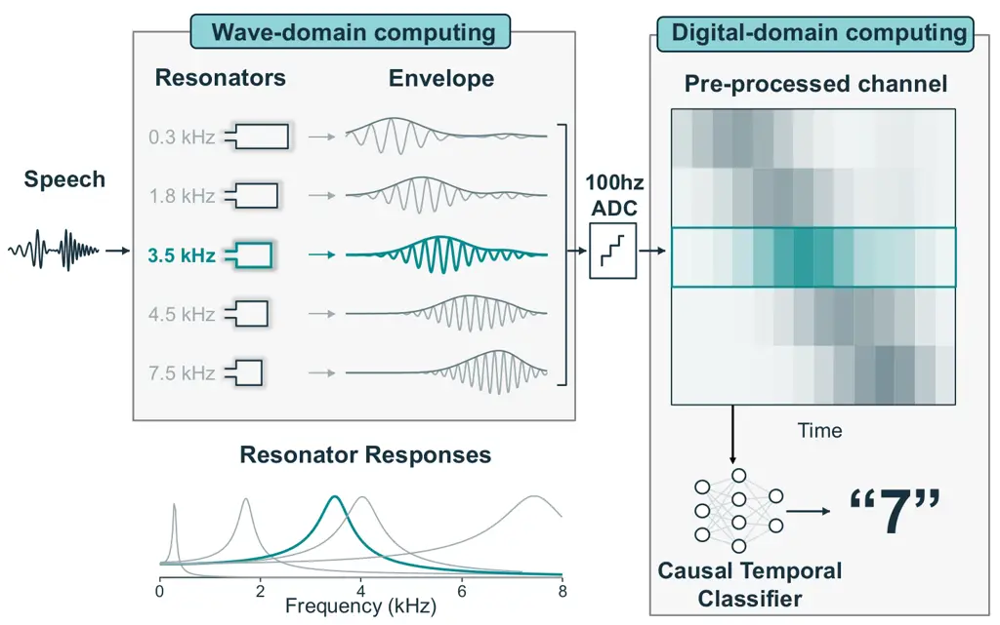
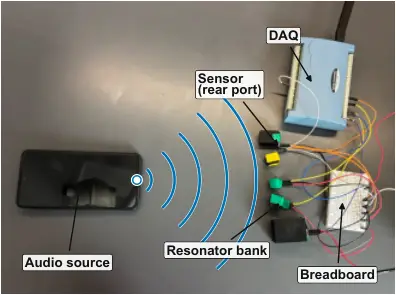
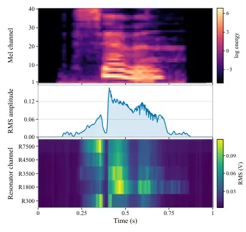
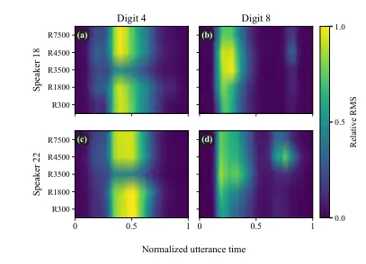

# LYRIC: Wave-Domain Computing for Efficient Spoken-Digit Recognition

Jeeven Balasubramaniam    Nakul Garg

###### Abstract

Low-power speech recognition requires reducing audio acquisition and
feature-processing costs as well as neural inference. We present Lyric,
a speech-recognition front end that uses wave-domain computing to
extract features before digitization. Our proposed system uses passive
acoustic resonators to separate speech by frequency and supplies their
slowly varying envelopes to a compact temporal neural network. This
moves spectral filtering into the acoustic structure, reducing the data
and processing needed for recognition. We build a prototype and evaluate
spoken-digit recognition on a speaker-disjoint AudioMNIST split across
nine classifier families. The front end acquires 32 times fewer scalar
samples than a 16-kHz waveform. In the EdgeSpeechNet-A comparison on a
Raspberry Pi 4, we reduce preprocessing-plus-inference latency and
estimated processor energy per inference by 98.6%, with a
3.58-percentage-point decrease in accuracy to 95.70%.

###### Index Terms: 

wave-domain computing, acoustic front end, keyword spotting, low-power
speech recognition, cochlea

^(†)^(†)address: Rice University

## 1 Introduction

Speech is becoming an everyday way to interact with computers, from
giving commands to transcribing conversations. Bringing these
capabilities onto small, battery-powered devices remains energy
intensive. Conventional systems capture high-rate audio, compute
spectral features, and run neural networks to recognize speech. This
pipeline preserves a detailed waveform before extracting the information
needed to recover the words. Yet a speech interface needs to understand
what was said, without necessarily retaining everything needed to
reproduce the sound. In this paper, we ask: _can we capture the
information needed for speech recognition directly from sound, before
high-rate digitization and digital feature extraction?_

Our proposed system, Lyric, uses _wave-domain computing_ to separate
speech by frequency before digitization (Fig. 1). We build on the
observation that, similar to the human cochlea, acoustic resonators
respond selectively to different parts of the speech spectrum. Their
channel identities encode coarse frequency information, while their
envelopes capture how the response amplitudes change over time. We
acquire these slower signals directly and train a temporal network to
recognize the resulting patterns, without reconstructing the waveform or
computing a digital spectrogram. We use passive acoustics for frequency
selection and a trainable temporal network for recognition.

We design the front end around a small set of channels that retains
useful differences between speech sounds. Using physics-based
simulations and a separate set of alphabet recordings, we compare
candidate channel combinations before evaluating on the target digit
dataset. We build the selected five channels with 3D-printed Helmholtz
resonators, microphones and analog envelope readout. At 100 samples/s
per channel, the prototype produces 32 times fewer scalar samples than a
16-kHz waveform while preserving the 100-Hz update rate of the log-Mel
baseline.

We build on prior demonstrations of physical frequency separation and
speech recognition \[1, 2, 3\]. Related work has also explored analog
filter-bank feature extraction for ultra-low-power keyword spotting \[4,
5\]. Our focus is the compact representation passed from acoustics to a
trainable recognizer and the processing cost it removes. This
complements pruning and quantization \[6, 7\], which reduce the cost of
the network itself.



Figure 1: Speech recognition with wave-domain computing.

We evaluate Lyric on physically recorded AudioMNIST utterances using a
speaker-disjoint split and nine classifier families \[8\]. The measured
responses show that digits differ both in which channels respond and in
when those responses occur. In our ablations, a single broadband
envelope gives substantially lower accuracy, while increasing the
five-channel envelope rate from 100 to 400 Hz provides no consistent
accuracy gain across the tested models. These observations support
retaining frequency-selective temporal patterns while reducing how much
audio the processor receives.

We measure the resulting accuracy–computation tradeoff against log-Mel
inputs using representation-specific models from the same classifier
families. The seven larger envelope models achieve 91.07–95.70% digit
accuracy, and all nine families reduce preprocessing-plus-inference
latency on a Raspberry Pi 4. For EdgeSpeechNet-A, accuracy changes from
99.28% to 95.70%, while computation latency and estimated processor
energy per inference fall by 98.6% under the same processor-power model.
We thus demonstrate a 3.58-percentage-point accuracy tradeoff for
substantially lower digital processing cost in this spoken-digit test.

## 2 Problem Formulation and Intuitions

Our problem is to recognize speech from sparse measurements produced by
the acoustic front end. To solve this, we seek a latent representation
that compresses the analog signals while preserving features between
digits spoken by previously unseen speakers.

Intuition. We draw inspiration from the human cochlea’s separation of
sound into frequency-dependent responses \[9\]. Human listening
experiments also show that speech can remain intelligible when temporal
envelopes are retained in a few broad frequency bands \[10\]. In our
resonators, air moving in the neck compresses the air in the cavity
while their geometry determines which frequencies produce a strong
response. The envelopes then describe how energy in these frequency
regions changes through the sound. Our hypothesis is that we can
engineer these resonance responses to retain enough information for
recognition even when the detailed waveform is discarded.

Physical frequency encoding already has close precedents, so we focus on
the representation and resource tradeoff it enables. Prior work has
demonstrated recurrent computation through simulated wave propagation
and a tunable nonlinear acoustic cavity \[11, 12\], as well as passive
phononic structures designed for pairwise word discrimination \[2\].
Cochlea-inspired approaches include a 3D-printed tonotopic spiral \[1\],
an artificial basilar-membrane system for keyword recognition \[13\],
and an event-driven silicon-cochlea front end for low-compute keyword
spotting \[14\]. Beoletto et al. extended mechanically
frequency-selective sensing to digit recognition using a
piezoelectrically driven spiral, 16 readout channels, and fixed-size
tonograms \[3\]. More broadly, physical computing has recently been
demonstrated for analogue speech recognition using in-materia
temporal-signal processing \[15\]. We use five microphone-coupled
resonators driven directly by airborne speech, read their envelopes at
low rate, and evaluate both recognition accuracy and digital processing
cost. Our contribution is the implementation and evaluation of this
compact acoustic-to-digital representation, rather than the principle of
physical frequency separation alone.

Challenges. We must choose channels that preserve complementary speech
cues without sacrificing their timing. Channels that respond similarly
provide redundant information, while gaps in coverage can remove
distinctions between digits. A sharply tuned resonator can continue
ringing after the sound changes, and envelope smoothing can blur onsets
and transitions. We therefore select channels using their simulated
speech responses and retain a temporal network to combine the measured
envelopes over the utterance. The envelope signals still require
appropriate filtering and sampling; only acoustic frequency selection is
passive. We next describe the physics-based simulations, resonator
realization, and temporal recognition pipeline used to test this design.

## 3 System Design

### 3.1 Design Overview

Lyric uses acoustic filtering and analog envelope extraction to replace
digital log-Mel computation (Fig. 1). Airborne speech drives five
passive Helmholtz resonators, each tuned to a different region of the
speech spectrum. A microphone sealed into each cavity measures its
pressure response. An analog AC-RMS circuit extracts the slowly varying
amplitude over a 10-ms integration interval. The five envelopes are
digitized at 100 samples/s per channel and passed to a causal temporal
network. This path requires no digital framing, FFT, Mel filtering, or
logarithmic compression.

We first select five channels using simulated responses to alphabet
speech (Sec. 3.2), then fabricate and adjust the resonators (Sec. 3.3).
We examine the spectral and temporal structure retained by the array in
Sec. 3.4 and account for its acquisition and processing costs in
Sec. 3.5.

### 3.2 Choosing the Channels

Channel selection must balance redundancy against spectral coverage.
Channels with similar responses can carry overlapping information, while
gaps in coverage can discard differences between sounds. We therefore
screened candidate banks in simulation using a separate alphabet
dataset, before recording any AudioMNIST data.

We simulated eight candidate resonators in COMSOL at target frequencies
of 110, 180, 300, 1800, 3500, 4500, 6000, and 7500 Hz. Let $`v_{i}(f)`$
denote the complex sensor velocity of candidate $`i`$ and
$`p_{\mathrm{in}}(f)`$ the complex inlet pressure exported by the
frequency-domain simulation. We define the peak-normalized
transfer-energy response as

```math
G_{i}(f)=\frac{\left|v_{i}(f)/p_{\mathrm{in}}(f)\right|^{2}}{\max_{f^{\prime}}\left|v_{i}(f^{\prime})/p_{\mathrm{in}}(f^{\prime})\right|^{2}}. \tag{1}
```

For an utterance with short-time power spectrum $`S_{x}(f,t)`$, the
predicted response trajectory is
$`r_{i}(t)=\sum_{f}G_{i}(f)\,S_{x}(f,t)`$, summed over 80 Hz–8 kHz. We
compute $`S_{x}(f,t)`$ from 16-kHz speech using a 40-ms Hann window, a
10-ms hop, and a 2048-point FFT. These 100-Hz trajectories provide a
spectral-energy proxy for channel selection.

We evaluated all $`\binom{8}{5}=56`$ five-resonator subsets on 182
labeled A–Z segments from seven recordings. Each subset was represented
by 25 features describing per-channel energy proportions and their
temporal changes. We used a class-balanced linear SVM ($`C=0.3`$) with
seven-fold leave-one-recording-out cross-validation, fitting
standardization only on each fold’s training recordings.

The subset targeting 300, 1800, 3500, 4500, and 7500 Hz ranked first at
67.03% mean balanced accuracy, compared with 66.48% for the runner-up.
Its fold standard deviation was 15.23 percentage points. We selected the
highest-scoring bank, but the narrow margin and large fold variation do
not establish a unique optimum. The selection used alphabet speech only,
so no digit data informed the channel choice. We denote a channel
targeting frequency $`f`$ by R$`f`$, giving R300, R1800, R3500, R4500,
and R7500.

### 3.3 Building the Resonators

Each channel is a monolithic PLA Helmholtz resonator (Fig. 2). We print
the neck, cavity, transition, and microphone port as one part to
eliminate assembly seams that could alter the cavity response.



Figure 2: Our setup for fabricated five-channel Lyric resonator bank.

For a neck of area $`A`$ and effective length $`L_{\mathrm{eff}}`$
coupled to a total acoustic volume $`V`$, the first-order design
relation is

```math
f_{\mathrm{H}}=\frac{c}{2\pi}\sqrt{\frac{A}{VL_{\mathrm{eff}}}}, \tag{2}
```

where $`c`$ is the speed of sound and $`L_{\mathrm{eff}}=L+0.85\,d`$
accounts for the end correction of a neck with physical length $`L`$ and
diameter $`d`$. Table 1 lists the final geometries, with total acoustic
volumes ranging from 0.077 to 9.213 mL.

| $`f_{\mathrm{target}}`$ | Neck (mm) |       |                      | Cavity (mm) |       | $`V`$ |
| ----------------------- | --------- | ----- | -------------------- | ----------- | ----- | ----- |
| (Hz)                    | $`d`$     | $`L`$ | $`L_{\mathrm{eff}}`$ | Side        | Depth | (mL)  |
| 300                     | 2.50      | 16.28 | 18.41                | 23.46       | 12.00 | 9.213 |
| 1800                    | 3.39      | 4.00  | 6.88                 | 8.87        | 15.36 | 1.404 |
| 3500                    | 6.00      | 10.00 | 15.10                | 12.16       | 3.20  | 0.475 |
| 4500                    | 5.00      | 6.40  | 10.65                | 8.01        | 3.04  | 0.283 |
| 7500                    | 4.00      | 4.00  | 7.40                 | 6.84        | 1.60  | 0.077 |

Table 1: The final resonator geometries.

Equation (2) provides an initial geometry. Fabrication tolerances,
acoustic loading, and differences in effective neck length can shift the
realized resonance. Where prototype measurements were available, we used
the measured peak to adjust the cavity volume while holding the neck
fixed:

```math
V_{\mathrm{new}}=V_{\mathrm{old}}\left(\frac{f_{\mathrm{meas}}}{f_{\mathrm{target}}}\right)^{2}. \tag{3}
```

For the 1800-Hz channel, a predecessor peaked at 2150 Hz. Applying this
correction increased its volume from 0.984 to 1.404 mL.

### 3.4 What the Array Measures

Fig. 3 compares the measured five-channel stream with the digital
representations evaluated in Sec. 4. The broadband envelope retains
amplitude changes over time but does not separate frequency bands. The
log-Mel representation retains finer spectral structure. The resonator
array retains a coarser spectral representation, separating five regions
and tracking their amplitudes over time. Sec. 4.3 will test the effects
of retaining separate channels and varying sampling rates.



Figure 3: Representations of one spoken “seven”: log-Mel, broadband
envelope, and Lyric, from top to bottom.

Fig. 4 shows class templates averaged over 50 repetitions through the
fabricated array. For “four,” the response contains a sustained
mid-utterance burst, with strong R300, R1800, R4500, and R7500 responses
and a weaker R3500 response. For “eight,” an early burst is concentrated
in R3500–R4500 in both speakers; a separate late high-frequency burst is
more visible for speaker 22. The templates differ in both channel
activity and event timing. We retain a temporal network to use this
timing structure, which would be lost by pooling each channel over the
utterance.



Figure 4: Measured five-channel envelope templates for  digit 4 and  8
from different speakers, averaged over 50 repetitions per class.

Resonator ringing and envelope integration can blur the onsets and
transitions that distinguish short speech sounds. A resonator continues
to respond after excitation ends, and the 10-ms RMS integration further
smooths its output. The envelope integration interval is shorter than
the baseline’s 50-ms log-Mel window, with both representations using a
10-ms hop. This difference alone does not establish the array’s temporal
resolution because we did not measure the ring-down of each fabricated
channel. The separated bursts visible in Fig. 4, particularly for
speaker 22’s “eight,” show that these events remain distinguishable in
the averaged envelopes; they do not provide a measured bound on
transient response.

### 3.5 Acquisition and Processing Cost

The conventional front end used for comparison \[16, 17, 18\] acquires
16,000 waveform samples/s and computes a 40-bin log-Mel spectrogram
using a 50-ms window and a 10-ms hop. This produces 100 frames/s. Before
classification, each overlapping frame requires windowing, an FFT,
power-spectrum computation, Mel filtering, logarithmic compression, and
normalization. Reducing the classifier size does not remove this
preprocessing.

Lyric performs frequency selection and extracts the envelopes before
digitization. The ADCs therefore sample five amplitude signals at 100
samples/s each: 500 scalar samples/s in total. This is $`32\times`$
fewer samples than the 16-kHz waveform and one-eighth the number of
log-Mel feature values, at the same 100-Hz frame rate. Channel identity
carries the coarse spectral position, so the ADCs do not need to sample
the acoustic carriers. The 50-Hz Nyquist limit applies to _envelope
modulation_, while the channel target frequencies extend to 7.5 kHz.
Modulation above 50 Hz must still be attenuated by the analog envelope
response before digitization.

## 4 Evaluation

### 4.1 Experimental Setup

We evaluate on AudioMNIST \[8\], with 30,000 digit recordings split into
36 training, 12 validation, and 12 test speakers. Audio was
peak-normalized to $`-9`$ dBFS and replayed 15 cm from the fixed
resonator array, one speaker per session, with 150-ms gaps. The five
channels were recorded simultaneously and segmented using the playback
schedule. Normalization uses training statistics only; test replay
followed model selection.

We compare 100-Hz resonator envelopes with 40-bin log-Mel features from
16-kHz audio (Sec. 3.5). Digital recordings are normalized and cropped
or padded to 1 s. For ablations we also use a 400-Hz resonator variant
with a 10-ms window and a 2.5-ms hop, and a single broadband RMS
envelope computed from the unfiltered waveform with the same window and
rate but no resonator filtering. The classifiers are MicroCNN \[19\],
StrideCNN and PoolCNN \[16\], DS-CNN \[20\], TC-ResNet8 \[17\],
BC-ResNet-1/2 \[18\], MatchboxNet-3$`\times`$1$`\times`$64 \[21\], and
EdgeSpeechNet-A \[22\]. Envelope models use causal 1-D adaptations of
these families and length-masked mean logits:

```math
\hat{\mathbf{y}}=\frac{1}{T^{\prime}}\sum_{t=1}^{T^{\prime}}\mathbf{z}_{t},\qquad T^{\prime}=\lceil T/s\rceil, \tag{4}
```

where $`T`$ counts valid input frames and $`s`$ is temporal stride.
Paired models retain the classifier family’s main structure but differ
in input representation and architecture. The comparison therefore
measures the complete pipeline tradeoff rather than isolating the effect
of physical filtering.

Training uses cross-entropy and AdamW with learning rate $`10^{-3}`$ and
weight decay $`10^{-4}`$. Each configuration uses one seed; validation
accuracy selects the checkpoint, with validation loss breaking ties.
Resonator/broadband models use batch sizes 128/256 and up to 180/50
epochs. We report median preprocessing-plus-inference time over 6,000
utterances on a Raspberry Pi 4 (1.8 GHz, 8 GB, performance governor, one
thread, batch size 1, PyTorch 2.14). This measures processor
computation, excluding acquisition and the wait for the complete
utterance.

|                        |         |       |        |        |       |       |
| ---------------------- | ------- | ----- | ------ | ------ | ----- | ----- |
|                        | log-Mel |       |        | Lyric  |       |       |
| Model                  | Params  | Acc.  | Time   | Params | Acc.  | Time  |
|                        | \(k\)   | (%)   | (ms)   | \(k\)  | (%)   | (ms)  |
| MicroCNN \[19\]        | 0.7     | 43.88 | 13.41  | 0.5    | 74.72 | 1.29  |
| StrideCNN \[16\]       | 1.2     | 47.52 | 13.59  | 0.8    | 80.92 | 1.39  |
| BC-ResNet-1 \[18\]     | 9.2     | 98.42 | 91.88  | 9.1    | 92.07 | 15.59 |
| PoolCNN \[16\]         | 13.0    | 96.00 | 32.22  | 4.4    | 91.07 | 1.81  |
| DS-CNN \[20\]          | 23.1    | 99.02 | 55.31  | 22.2   | 94.47 | 6.21  |
| TC-ResNet8 \[17\]      | 25.5    | 98.60 | 16.87  | 23.9   | 93.57 | 3.83  |
| BC-ResNet-2 \[18\]     | 27.2    | 98.55 | 109.50 | 31.8   | 92.78 | 16.26 |
| MatchboxNet \[21\]     | 62.9    | 99.10 | 30.37  | 58.0   | 93.93 | 9.26  |
| EdgeSpeechNet-A \[22\] | 108.1   | 99.28 | 454.31 | 37.4   | 95.70 | 6.56  |

Table 2: AudioMNIST accuracy and compute cost across nine classifier
families using log-Mel and Lyric inputs. Highlighted configurations
achieve $`\geq 90\%`$ accuracy in $`<10`$ ms.

### 4.2 Recognition Accuracy and Processing Cost

Lyric achieves 95.70% accuracy with EdgeSpeechNet-A at 6.56 ms and an
estimated 1.97 mJ of dynamic processor energy per inference, compared
with 99.28%, 454.31 ms, and 136.29 mJ for its log-Mel counterpart
(Table 2). Compute time and estimated energy fall by approximately
$`69\times`$, with a 3.58-percentage-point accuracy loss. Across the
seven families exceeding 95% with log-Mel, the five-channel input
achieves 91.07–95.70% accuracy. The two smallest classifiers improve
instead: MicroCNN rises from 43.88% to 74.72%, and StrideCNN from 47.52%
to 80.92%, despite fewer parameters.

Replacing digital log-Mel extraction with envelope normalization reduces
mean front-end time from 8.48 to 0.28 ms. The five-channel input and its
adapted networks also require fewer MACs in every pair, while retaining
the 100-Hz input frame rate. Together, these changes reduce total
compute latency by 69.5–98.6% across the nine families.

Figure 5: Recognition accuracy versus latency for log-Mel and Lyric
inputs. Arrows mark the paired EdgeSpeechNet-A comparison.

Five Lyric configurations exceed 90% accuracy in under 10 ms and no
evaluated log-Mel configuration meets both thresholds (shaded cells in
Table 2). Resonator PoolCNN reaches 91.07% at 1.81 ms and 0.54 mJ; the
cheapest log-Mel model above 90%, TC-ResNet8, requires 16.87 ms and
5.06 mJ (Fig. 5). For higher accuracy, resonator EdgeSpeechNet-A is 2.9
points below log-Mel TC-ResNet8, with a $`2.6\times`$ reduction in
compute time and estimated energy. The gain thus remains against a
lower-cost log-Mel baseline, although it is smaller than the paired
EdgeSpeechNet-A reduction. For fair comparison of computation cost,
energy estimates use the measured 0.30-W dynamic processor draw and
exclude microphones, envelope circuitry, ADC, and acquisition time.

### 4.3 Ablations

_Envelope rate._ Increasing the resonator rate from 100 to 400 Hz raises
MACs $`3.8`$–$`4.0\times`$ and total latency $`2.3`$–$`4.6\times`$, but
changes mean accuracy across the seven stronger families only from
93.37% to 93.59%. MicroCNN and StrideCNN instead lose 7.45 and 4.57
points. The 100-Hz input avoids this additional compute cost without a
consistent loss of accuracy in these runs. Single-seed results cannot
quantify run-to-run variation.

_Spectral channels._ At 400 Hz, using identical 10-ms windows and 2.5-ms
hops, five resonator channels outperform a single broadband RMS envelope
by 21.1–44.9 percentage points across the tested architectures.
Different training budgets limit attribution of this gain to spectral
selectivity. This comparison does not establish an advantage over an
equivalent five-channel digital filter bank.

## 5 Conclusion

We presented Lyric, which uses wave-domain computing to extract speech
features before digitization. Our spoken-digit experiments show that
low-rate resonator envelopes preserve useful spectral and temporal cues,
enabling recognition with substantially less digital processing than a
log-Mel pipeline. Future work will integrate the sensing and inference
hardware, measure total system energy, and evaluate the approach on
continuous speech.

## References

- \[1\] V. F. Dal Poggetto, F. Bosia, D. Urban, P. H. Beoletto,
  J. Torgersen, N. M. Pugno, and A. S. Gliozzi, “Cochlea-inspired
  tonotopic resonators,” _Materials & Design_, vol. 227, p. 111712,
  Mar 2023. \[Online\]. Available:
  http://dx.doi.org/10.1016/j.matdes.2023.111712
- \[2\] T. Dubček, D. Moreno-Garcia, T. Haag, P. Omidvar, H. R. Thomsen,
  T. S. Becker, L. Gebraad, C. Bärlocher, F. Andersson, S. D. Huber,
  D.-J. van Manen, L. G. Villanueva, J. O. A. Robertsson, and
  M. Serra-Garcia, “In-sensor passive speech classification with
  phononic metamaterials,” _Advanced Functional Materials_, vol. 34,
  no. 17, p. 2311877, 2024. \[Online\]. Available:
  http://dx.doi.org/10.1002/adfm.202311877
- \[3\] P. H. Beoletto, G. Milano, C. Ricciardi, F. Bosia, and A. S.
  Gliozzi, “Speech recognition with cochlea-inspired in-sensor
  computing,” _Advanced Intelligent Systems_, vol. 8, no. 1, p.
  2500526, 2026. \[Online\]. Available:
  http://dx.doi.org/10.1002/aisy.202500526
- \[4\] S. Ray, X. Sun, N. Tremelling, M. Gordiyenko, and P. R. Kinget,
  “How tiny can analog filterbank features be made for ultra-low-power
  on-device keyword spotting?” in _Proceedings of the tinyML Research
  Symposium_, 2023.
- \[5\] Y. Shen, B. Wu, D. Straeussnigg, and E. Gutierrez, “A kws system
  for edge-computing applications with analog-based feature extraction
  and learned step size quantized classifier,” _Sensors_, vol. 25,
  no. 8, p. 2550, 2025.
- \[6\] S. Han, H. Mao, and W. J. Dally, “Deep compression: Compressing
  deep neural networks with pruning, trained quantization and huffman
  coding,” arXiv preprint arXiv:1510.00149, 2015. \[Online\]. Available:
  https://arxiv.org/abs/1510.00149
- \[7\] B. Jacob, S. Kligys, B. Chen, M. Zhu, M. Tang, A. Howard,
  H. Adam, and D. Kalenichenko, “Quantization and training of neural
  networks for efficient integer-arithmetic-only inference,” in
  _Proceedings of the IEEE Conference on Computer Vision and Pattern
  Recognition (CVPR)_, June 2018, pp. 2704–2713.
- \[8\] S. Becker, J. Vielhaben, M. Ackermann, K.-R. Müller,
  S. Lapuschkin, and W. Samek, “AudioMNIST: Exploring explainable
  artificial intelligence for audio analysis on a simple benchmark,”
  _Journal of the Franklin Institute_, vol. 361, no. 1, pp. 418–428,
  Jan 2024. \[Online\]. Available:
  http://dx.doi.org/10.1016/j.jfranklin.2023.11.038
- \[9\] R. F. Lyon and C. Mead, “An analog electronic cochlea,” _IEEE
  Transactions on Acoustics, Speech, and Signal Processing_, vol. 36,
  no. 7, pp. 1119–1134, July 1988. \[Online\]. Available:
  http://dx.doi.org/10.1109/29.1639
- \[10\] R. V. Shannon, F.-G. Zeng, V. Kamath, J. Wygonski, and
  M. Ekelid, “Speech recognition with primarily temporal cues,”
  _Science_, vol. 270, no. 5234, pp. 303–304, Oct. 1995. \[Online\].
  Available: http://dx.doi.org/10.1126/science.270.5234.303
- \[11\] T. W. Hughes, I. A. D. Williamson, M. Minkov, and S. Fan, “Wave
  physics as an analog recurrent neural network,” _Science Advances_,
  vol. 5, no. 12, p. eaay6946, 2019. \[Online\]. Available:
  http://dx.doi.org/10.1126/sciadv.aay6946
- \[12\] A. Momeni, X. Guo, H. Lissek, and R. Fleury, “Physics-inspired
  neuroacoustic computing based on tunable nonlinear
  multiple-scattering,” arXiv preprint arXiv:2304.08380, 2023.
  \[Online\]. Available: https://arxiv.org/abs/2304.08380
- \[13\] U. Lee, E.-S. Jeon, S. Hur, and C.-S. Han, “Artificial basilar
  membrane/hair cell integrated acoustic system for keyword spotting in
  noisy environments inspired by human cochlea,” _Measurement_, vol.
  241, p. 115722, 2025.
- \[14\] E. Ceolini, J. Anumula, S. Braun, and S.-C. Liu, “Event-driven
  pipeline for low-latency low-compute keyword spotting and speaker
  verification system,” in _2019 IEEE International Conference on
  Acoustics, Speech and Signal Processing (ICASSP)_, 2019, pp.
  7953–7957.
- \[15\] M. Zolfagharinejad, J. Büchel, L. Cassola, S. Kinge, G. S.
  Syed, A. Sebastian, and W. G. van der Wiel, “Analogue speech
  recognition based on physical computing,” _Nature_, vol. 645, no.
  8082, pp. 886–892, Sept 2025. \[Online\]. Available:
  http://dx.doi.org/10.1038/s41586-025-09501-1
- \[16\] T. N. Sainath and C. Parada, “Convolutional neural networks for
  small-footprint keyword spotting,” in _Interspeech 2015_, 2015, pp.
  1478–1482.
- \[17\] S. Choi, S. Seo, B. Shin, H. Byun, M. Kersner, B. Kim, D. Kim,
  and S. Ha, “Temporal Convolution for Real-Time Keyword Spotting on
  Mobile Devices,” in _Interspeech 2019_, 2019, pp. 3372–3376.
- \[18\] B. Kim, S. Chang, J. Lee, and D. Sung, “Broadcasted residual
  learning for efficient keyword spotting,” in _Proc. Interspeech_,
  2021, pp. 4538–4542.
- \[19\] TensorFlow Authors, “TensorFlow Lite Micro: Micro Speech
  Example,”
  https://github.com/tensorflow/tflite-micro/tree/main/tensorflow/lite/micro/examples/micro_speech,
  2026, accessed: Sept. 16, 2026.
- \[20\] C. Banbury, V. J. Reddi, P. Torelli, J. Holleman, N. Jeffries,
  C. Kiraly, P. Montino, D. Kanter, S. Ahmed, D. Pau _et al._, “MLPerf
  tiny benchmark,” in _Proc. NeurIPS Datasets and Benchmarks
  Track_, 2021.
- \[21\] S. Majumdar and B. Ginsburg, “MatchboxNet: 1d time-channel
  separable convolutional neural network architecture for speech
  commands recognition,” in _Proc. Interspeech_, 2020, pp. 3356–3360.
- \[22\] Z. Q. Lin, A. G. Chung, and A. Wong, “EdgeSpeechNets: Highly
  efficient deep neural networks for speech recognition on the edge,”
  _arXiv preprint arXiv:1810.08559_, 2018.
