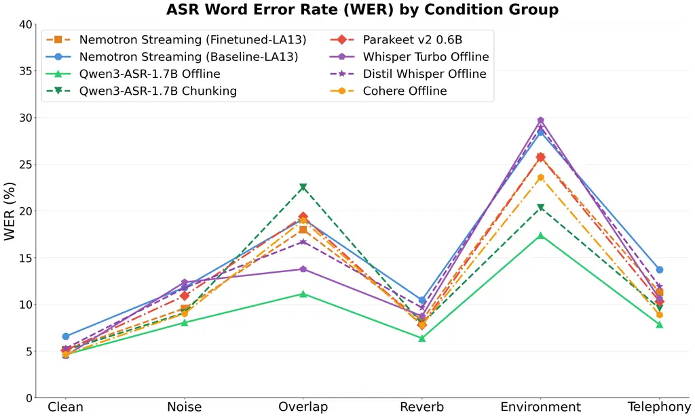
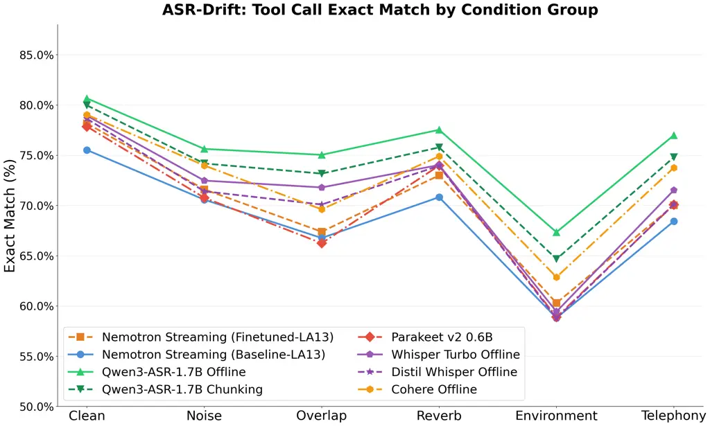

# MIND THE ACCENT GAP: BRITISH ACCENT ROBUSTNESS IN SPEECH-DRIVEN FINANCIAL VOICE ASSISTANTS

###### Abstract

AI voice assistants often use Automatic Speech Recognition (ASR) with an
LLM reasoning, yet, existing systems struggle with regional British
accents (Scottish, Irish, Welsh), since most ASR models are trained
predominantly on American English voice data. Consequently, errors carry
through to the LLM stage, corrupting tool-call arguments and producing
wrong or missing responses, which is especially costly in finance.
Deployable ASR must also meet tight latency and memory budgets, making
an accent-robust model choice even harder. We introduce CavaBench, the
first internally collected benchmark of spoken financial queries, and
use it to evaluate a range of ASR models and their full ASR-LLM pipeline
behavior across self-reported British accents. We find that WER strongly
predicts downstream tool-calling accuracy (r = -0.93) but can fail to
reflect task-level performance, with accent-related failures varying
substantially across models and acoustic conditions. These findings
guide the design of more inclusive, reliable voice-based financial
assistants.

###### Index Terms: 

streaming ASR, LLM, financial assistants

^(†)^(†)address: NatWest, UK

## 1 Introduction

Most finance virtual assistants are text-based \[1\]; speech interfaces
are a more natural, engaging alternative \[2\] but add Automatic Speech
Recognition (ASR) as a source of error. State-of-the-art voice
assistants (VAs) increasingly combine ASR with Large Language Model
(LLM) reasoning in a cascade. These systems generalize well for
well-represented language groups but remain fragile to regional accents,
especially British English accents (Scottish, Irish, Welsh), because
most ASR systems are optimized for American English. Accent-induced
errors compound downstream, so VAs misrepresent user intent and
systematically underperform for specific accent groups.

Figure 1: Cascaded voice-assistant pipeline. The streaming ASR stage and
its downstream effect on LLM tool-calling accuracy.

This work is motivated by two complementary, and at times competing,
requirements for a production-grade ASR component handling financial
queries: (i) accent robustness, since ASR trained predominantly on
American-accented speech introduces systematic bias against specific
customer groups rather than uniform error; and (ii) streaming efficiency
without sacrificing accuracy, since a deployed component must emit
transcripts incrementally for a responsive assistant while still
supporting correct downstream tool-calling. These requirements must be
optimized jointly, since the accent-robustness gap is not static – it
widens or narrows with the chosen latency operating point.

To our knowledge, no publicly available benchmark targets spoken
financial queries, annotated by British-accent group, a prerequisite for
measuring accent robustness in this setting rather than in
general-purpose speech. We study how accent affects streaming ASR Word
Error Rate (WER), and how that error propagates into end-to-end task
completion, measured through the tool-calling behavior of the downstream
LLM. However, WER weights all word errors equally, but effects on a
financial assistant are highly unequal: errors in task-critical tokens
such as merchant names, monetary amounts, dates, durations, and temporal
expressions can change the resulting tool call, while errors in less
informative words may have little effect on task completion. Our main
contributions are: (i) CavaBench, the first internally collected,
human-labeled audio benchmark for spoken financial queries, balanced
across four British-accent categories; (ii) a joint evaluation of accent
and acoustic robustness across various simulated acoustic conditions,
linking ASR WER to downstream tool-calling Exact Match (EM).

## 2 Related Work and Methods

Accent and dialect bias in ASR. Large-scale audits document systematic
ASR disparities across speaker demographics: Koenecke *et al.* \[3\]
found higher WER for African American speakers across five commercial
systems, and DiChristofano *et al.* \[4\] showed ASR performance
correlates with speakers’ country of origin. Within British English,
Markl \[5\] showed algorithmic bias reflects existing prejudice against
non-standard varieties. Demirsahin *et al.* \[7\] released open-source
multi-speaker corpora of British Isles accents to support more equitable
ASR. Accent benchmarks such as VCTK \[8\] (British-accent read speech),
EdAcc \[9\] (spontaneous conversational speech across global English
varieties), and Common Voice \[10\] (crowd-sourced multilingual speech)
evaluate general accent robustness. In these, the American English WERs
are consistently several points lower than British varieties – 9.4% vs.
15.2–16.6% on VCTK and $`\sim`$11% vs. 14–15% on Common Voice – an error
range consistent with the realistic acoustic conditions we simulate in
this work. To our knowledge, none of this work evaluates accent
robustness in the financial domain: CavaBench pairs accent variability
with financial queries and evaluates the full cascaded pipeline rather
than ASR in isolation.

ASR architecture families. The evaluated systems span four families.
FastConformer-transducer models \[14\] (Parakeet \[19\],
Nemotron \[20\]) can be configured for offline or streaming ASR
depending on encoder context and decoder design. While both 0.6B models
share a FastConformer backbone, Parakeet TDT pairs full-context encoder
attention with a TDT decoder for high-accuracy offline decoding. In
contrast, the Nemotron streaming model uses a cache-aware FastConformer
encoder with causal convolutions and limited-context attention,
alongside a frame-synchronous RNN-T decoder for low-latency incremental
processing (Section 5). Attention encoder–decoder models
(Whisper \[21\]) process fixed-length windows with full-context
attention and are offline-oriented. Audio-conditioned language models
(Qwen3-ASR \[22\]) achieve strong offline accuracy but are less suited
to low-latency streaming. The fourth family (Cohere Offline) is
available only through a hosted API, with undisclosed architecture.
RNN-T \[11\] established the streaming formulation underlying the first
family. Subsequent advances in Conformer encoders \[13\] and on-device
streaming \[12\] improved the accuracy–latency trade-off. However, these
advances have rarely been evaluated jointly for accent robustness and
downstream tool-calling correctness.

Error propagation into downstream understanding. Avila *et al.* \[15\]
studied how ASR errors degrade NLU in cascaded spoken language
understanding, and Jung and Choi \[16\] found that WER alone does not
fully explain semantic degradation in ASR–LLM cascades. This motivates
task-level metrics alongside transcription-level ones; we therefore
evaluate tool-calling EM to examine how accent-related ASR errors affect
downstream performance in finance. The ASR transcript is the _sole_
textual representation of customer intent available to the LLM, and
errors often corrupt the low-frequency, high-perplexity tokens on which
tool-calling depends most, such as amounts, dates and merchant names. A
single substitution in such a token can silently redirect a tool call,
and a user acting on the result may make a materially incorrect
financial decision.

## 3 CavaBench: Dataset

Cascaded ASR–LLM pipelines degrade for underrepresented accents, and in
financial this can cause failed tasks, reduced user trust, and can
create measurable bias. No prior benchmark targets this domain–accent
intersection, motivating CavaBench (Cascaded Audio and Voice Assistant
Benchmarking). It was collected from 90 participants (50 male/40 female)
via an in-house recording interface, in a clean acoustic environment,
isolating accent as the primary variable. Acoustic robustness is
evaluated separately, under the acoustic conditions in Section 5
(Section 5.2). Each speaker recorded at least one round of 20 queries
sampled from a pool of 200 realistic financial queries, including
spending summaries, budget tracking, merchant lookups, trend analysis
and numerical queries. The queries were phrased naturally to elicit
realistic prosody, yielding 3,079 utterances of which 2,919 were
retained after quality inspection, with reference transcripts taken
directly from the prompt text. Utterance duration averages 4.73 s (range
2.16–20.82 s; 3.94 h total). Self-reported accent (76 raw free-text
values) was grouped to support balanced group-level comparisons:
Scottish ($`\sim`$685, $`\sim`$23 speakers), Southern English
($`\sim`$710, $`\sim`$23), Other British ($`\sim`$747, $`\sim`$20 –
Northern Irish, Mancunian, Yorkshire, Welsh, Midlands), Non-British
($`\sim`$784, $`\sim`$26).

## 4 Experimental Setup

ASR models and configurations. We evaluate: (i) _Nemotron Streaming_
(0.6B parameters)¹¹ 1 Fine-tuned in-house on internal data; our
regulatory and data-governance constraints permit in-house fine-tuning
only for open-weight models such as this one. is evaluated using
_Baseline_ and _Finetuned_ variants, at two streaming lookahead
settings, LA6 and LA13 yielding four configurations.²² 2 The corpus
contains various British-accented financial queries recorded under
telephony-style channel and noise conditions and internally cleaned and
filtered for transcription accuracy. Shorter lookahead settings were
also evaluated but underperformed relative to longer lookaheads.
Similarly, the larger Parakeet-RNNT-1.1B underperformed. (ii)
_Parakeet-TDT-0.6B_ is evaluated as both a _Base Offline_ variant and a
_Parakeet v2 0.6B_ variant, the latter fine-tuned in-house on the same
corpus using a gated encoder adapter on its 24-layer FastConformer
encoder with TDT loss (lr=$`3\times 10^{-5}`$). (iii) _Qwen3-ASR-1.7B_
is evaluated offline using chunked pseudo-streaming mode (audio
processed in 1-sec chunks), hereafter _Qwen3-ASR-1.7B Chunking_. (iv)
_Whisper Turbo_ and _Distil-Whisper_, and (v) _Cohere Offline_ are
evaluated as offline references. Note that in this work, we fine-tune
the smaller Nemotron and Parakeet ASR models with additional in-domain
data to investigate the effect of targeted adaptation on end-to-end
performance.

Deployment-relevant properties. Nemotron Streaming’s cache-aware design
gives it a substantial deployment edge over the alternatives: roughly
3.5$`\times`$ lower latency and less than half the memory footprint of
Qwen3-ASR-1.7B Chunking, the closest streaming-emulating alternative,
the latency of which stays high because its non-causal encoder must
re-decode a growing prefix on every chunk rather than reuse cached
state. None of the other evaluated models are natively streaming. LLM
reasoning component. Tool-calling is performed by _Gemma-4-26B-A4B-it_
reasoning model (Fig. 1), prompted with the same tool schema for all ASR
transcripts. Query set and gold labels. We use the same 200-query from
CavaBench (Section 4). Gold tool-call labels are obtained by running a
10-fold LLM validation on each of the 200 reference queries, and taking
the majority-vote as gold, with manual inspection. Task-level metric.
Exact Match (EM) is computed over five tool-call fields: metric,
time_period, group_by, filter, and compare_with; a prediction counts as
correct only if all five fields match gold. Acoustic conditions. Each
recording is evaluated under 6 groups, across all 4 accent groups:
_Clean_ (unmodified); _Noise_ – MUSAN \[17\] additive
noise/music/babble, +20 to $`-5`$ dB SNR; _Overlap_ – competing-speaker
babble, +20 to +5 dB SIR; _Reverb_ – RIRS_NOISES \[18\] convolution,
RT60 0.3–0.8 s; _Environment_ – compound device/codec profiles with
speaker-level attenuation; _Telephony_ – narrowband codec/bandwidth
degradation, evaluated separately.

## 5 Results

### 5.1 Accent-robustness results (Clean condition)

Table 1 reports WER by accent group, averaged (sample-weighted) across 6
acoustic condition groups. Text normalization lowercases text, strips
punctuation, and canonicalizes numbers and currency. First, fine-tuning
helps Nemotron Streaming without widening the accent gap: Nemotron
(FT-LA13) improves overall WER from 18.2% to 16.1%, and narrows the
max-min accent spread (1.5% vs. 2.3%, the fairness metric in Section 7).
Second, applying the same procedure to Parakeet narrows the accent
spread from 2.7% to 1.7%, with only a marginal improvement in overall
WER (16.6% to 16.5%) and EM is not improved. Third, accent sensitivity
is model-dependent: Qwen3-ASR-1.7B Chunking has the largest spread of
any model (9.4%, driven by Scottish speech collapse at 22.2%). Cohere
Offline achieves the third-lowest overall WER (15.3%) and one of the
tightest accent spreads (1.6%). In the Clean-only condition, overall EM
ranges from 75.1% (Nemotron Base-LA6) to 80.7% (Qwen3-ASR-1.7B Offline);
with fine-tuning raising Nemotron Streaming’s (LA13) EM from 75.5% to
78.2%.

| Model                   | Non-Br. | Other Br. | Scot. | S. Eng. | Avg  |
| ----------------------- | ------- | --------- | ----- | ------- | ---- |
| Nemotron (Base-LA13)    | 18.1    | 19.7      | 17.4  | 17.4    | 18.2 |
| Nemotron (FT-LA13)      | 16.6    | 16.7      | 15.2  | 15.8    | 16.1 |
| Nemotron (Base-LA6)     | 19.5    | 22.1      | 19.4  | 18.8    | 20.0 |
| Nemotron (FT-LA6)       | 17.9    | 18.9      | 16.7  | 17.0    | 17.6 |
| Qwen3-ASR-1.7B Offline  | 10.2    | 11.1      | 11.4  | 11.8    | 11.1 |
| Qwen3-ASR-1.7B Chunking | 12.8    | 13.3      | 22.2  | 12.9    | 15.2 |
| Parakeet FT Offline     | 16.6    | 17.1      | 15.4  | 16.7    | 16.5 |
| Parakeet Base Offline   | 16.2    | 18.2      | 15.5  | 16.7    | 16.6 |
| Whisper Turbo           | 14.9    | 17.8      | 16.1  | 18.2    | 16.7 |
| Distil-Whisper          | 16.4    | 18.8      | 16.7  | 17.7    | 17.4 |
| Cohere Offline          | 14.5    | 16.1      | 14.8  | 15.8    | 15.3 |

Table 1: WER (%) by accent group, averaged over all 6 acoustic condition
groups, with each model’s overall average WER. Bold marks the top-3
(lowest-WER) models.

### 5.2 Robustness across acoustic conditions

ASR robustness decreases monotonically across conditions: Clean (6.0%
WER) $`<`$ Reverb (9.8%) $`<`$ Noise (11.8%) $`<`$ Telephony (12.9%)
$`<`$ Overlap (20.0%) $`<`$ Environment (28.6%) (Figs. 3–3), confirming
joint degradation (Environment) is substantially harder. All models do
not degrade uniformly: Whisper Turbo, differing from its distilled
variant only in the decoder size, has the steepest single-condition
collapse (29% WER at Environment), while Qwen3-ASR-1.7B Offline is the
most robust throughout, retaining the highest EM except for Reverb.
Cohere Offline is behind only the two Qwen3-ASR-1.7B variants. The
Nemotron Streaming baseline, comparable in scale to Parakeet but
2-4$`\times`$ smaller than the Whisper and Qwen3-ASR-1.7B shows less
robustness, likely because it uses less acoustically diverse pretraining
data, and model size. The fine-tuned models reduce the gap at Telephony,
matching the fine-tuning corpus’s own domain.

Figure 2: Word Error Rate (%) by condition group, per model, averaged
over the 4 CavaBench accent groups.

Figure 3: Tool-calling Exact Match (%) by condition group, per model,
averaged over the 4 CavaBench accent groups.

Averaged over the acoustic conditions, overall WER and EM are strongly
anti-correlated across models ($`r=-0.93`$), indicating that WER is
generally informative for model-selection. However the relationship
varies by accent: correlations range from $`r=-0.87`$ to $`-0.98`$ for
3/4 groups but weaken substantially for Scottish ($`r=-0.29`$), largely
driven by Qwen3-ASR-1.7B Chunking’s disproportionate Scottish WER spike.
All four Nemotron Streaming variants show strong within-model
correlations ($`r=-0.74`$ to $`-0.96`$) and the same ranking pattern –
Southern English achieves marginally higher EM than Scottish despite
slightly higher WER – indicating that the pattern is consistent across
fine-tuning and lookahead settings. Comparing LA6 (shorter context,
lower latency) against LA13 (longer context, higher latency) isolates
the lookahead effect. The Baseline configuration improves from
20.0%/64.6% (LA6) to 18.2%/66.5% (LA13), while the Finetuned
configuration improves from 17.6%/66.4% to 16.1%/67.9%. This corresponds
to a consistent but modest improvement of 1.5–1.8% in WER and 1.5–1.9%
in EM.

### 5.3 Error analysis

Impact on downstream tool-calling. In the Clean condition, 21.9% of
tool-call predictions were incorrect: time_period is the largest failure
mode (33.5%), followed by compare_with (25.4%) and group_by (25.3%);
abstention accounts for 16.2%, filter for 12.3%, false positives for
8.7%, and metric is rarely wrong (0.7%) – numeric/temporal arguments
drive downstream failure, not metric choice (Section 3.2). This
interacts with accent in ways Table 1’s condition-averaged spread cannot
capture. Other British bundles several distinct regional accents into
one category, yet it is the lowest-EM group under most individual
conditions for every evaluated model, not just on average. The harder
robustness challenge is accent diversity itself rather than any single
accent; and fine-tuning narrows this gap.

Task-critical token preservation matters more than aggregate WER. A
common UK retailer name is transcribed correctly in only 56.3% of 2,703
utterances (197 distinct variants; 24.4% dropped outright), and “last
quarter” survives verbatim in just 43.3% of 61,786 transcriptions (36.5%
dropped, 19.4% flattened to a bare “Q1”–“Q4” label, occasionally “last
water”); day counts fare better (85.9–98.4% correct) but show a
systematic 60$`\to`$“sixteen”/“six” confusion – unlike the abstentions
below, this substitution returns a confident, wrong answer (a 60-day
spending query silently computed over 6 or 16 days instead). These are
exactly the tokens tool-calling depends on.

Qualitative cases. Manual inspection reveals two representative
failures: an Other British-accent query, _“How much have I spent at
Tesco last year?”_, was transcribed as _“Hi Monte Santesco last year”_ –
the merchant name was destroyed, triggering abstention; and _“List
purchases over £600 in the last 90 days”_ became _“This purchase is over
six hundred pounds in the last ninety days”_, the dropped imperative
again causing abstention. In both cases, a lower-WER system preserved
the reference verbatim on the same audio; for the customer, abstention
at least surfaces as a retryable stall, unlike the silent wrong answer
above.

WER is necessary but not sufficient. Qwen3-ASR-1.7B Chunking has the
worst WER observed (49.8% at overlap +5 dB) yet retains 67% EM there,
since its errors are mostly filler padding while task-critical financial
keywords survive at a higher rate than in lower-WER competitors (e.g.,
“groceries” 86.8% vs. 76.3% for Whisper Turbo). Consistently, Nemotron
Streaming (Finetuned-LA13) beats both Parakeet variants on WER and EM
despite streaming (16.1%/67.9% vs. 16.5–16.6%/67.1–67.8%), and Cohere
Offline – with no fine-tuning at all – still edges past it
(15.3%/70.1%), though both trail Qwen3-ASR-1.7B Offline (11.1%/73.7%).
_Which_ words are garbled can matter more than _how many_: preserving
task-critical keywords and intent-bearing tokens is more directly tied
to correct tool-calling and end-to-end user experience than aggregate
WER alone.

## 6 Conclusion and Future Work

We conducted a study using CavaBench, our internally collected
financial-query benchmark, to identify general trends in how accent,
model architecture, and acoustic conditions jointly shape end-to-end ASR
accuracy. WER and Exact Match are strongly correlated overall, but
different accents reveal different challenges: a single model’s WER
spike breaks the correlation for Scottish, while for Other British –
which bundles several distinct regional accents into one category –
accent diversity itself, not any single accent, is the harder challenge.
Aggregate WER also masks the unequal cost of errors: preserving
task-critical tokens (merchant names, amounts, dates) matters more than
reducing total word errors. The robustness gap itself traces to training
data rather than architecture: targeted fine-tuning closed much of it
for the smaller streaming model, pointing to efficient streaming models
trained on more diverse data as a path to closing the gap with offline
counterparts.

## References

- \[1\] Consumer Financial Protection Bureau, “Chatbots in consumer
  finance,” Issue Spotlight, Jun. 2023. \[Online\]. Available:
  https://www.consumerfinance.gov/data-research/research-reports/chatbots-in-consumer-finance/
- \[2\] C. Rzepka, B. Berger, and T. Hess, “Voice assistant vs. chatbot
  – examining the fit between conversational agents’ interaction
  modalities and information search tasks,” _Information Systems
  Frontiers_, vol. 24, no. 3, pp. 839–856, 2022.
- \[3\] A. Koenecke, A. Nam, E. Lake, J. Nudell, M. Quartey,
  Z. Mengesha, C. Toups, J. R. Rickford, D. Jurafsky, and S. Goel,
  “Racial disparities in automated speech recognition,” _Proceedings of
  the National Academy of Sciences_, vol. 117, no. 14,
  pp. 7684–7689, 2020.
- \[4\] A. DiChristofano, H. Shuster, S. Chandra, and N. Patwari,
  “Global performance disparities between English-language accents in
  automatic speech recognition,” _arXiv preprint
  arXiv:2208.01157_, 2022.
- \[5\] N. Markl, “Language variation and algorithmic bias:
  understanding algorithmic bias in British English automatic speech
  recognition,” in _Proc. ACM Conference on Fairness, Accountability,
  and Transparency (FAccT)_, 2022.
- \[6\] E. Levon, D. Sharma, D. J. L. Watt, A. Cardoso, and Y. Ye,
  “Accent bias and perceptions of professional competence in England,”
  _Journal of English Linguistics_, vol. 49, no. 4, pp. 355–388, 2021.
- \[7\] I. Demirsahin, O. Kjartansson, A. Gutkin, and C. Rivera,
  “Open-source multi-speaker corpora of the English accents in the
  British Isles,” in _Proc. 12th Language Resources and Evaluation
  Conference (LREC)_, 2020, pp. 6532–6541.
- \[8\] J. Yamagishi, C. Veaux, and K. MacDonald, “CSTR VCTK Corpus:
  English multi-speaker corpus for CSTR voice cloning toolkit (version
  0.92),” University of Edinburgh, The Centre for Speech Technology
  Research (CSTR), 2019.
- \[9\] R. Sanabria, N. Bogoychev, N. Markl, A. Carmantini, O. Klejch,
  and P. Bell, “The Edinburgh International Accents of English Corpus:
  towards the democratization of English ASR,” in _Proc. IEEE
  ICASSP_, 2023.
- \[10\] R. Ardila, M. Branson, K. Davis, M. Kohler, J. Meyer,
  M. Henretty, R. Morais, L. Saunders, F. Tyers, and G. Weber, “Common
  Voice: a massively-multilingual speech corpus,” in _Proc. 12th
  Language Resources and Evaluation Conference (LREC)_, 2020,
  pp. 4218–4222.
- \[11\] K. Rao, H. Sak, and R. Prabhavalkar, “Exploring architectures,
  data and units for streaming end-to-end speech recognition with
  RNN-transducer,” in _Proc. IEEE ASRU_, 2017, pp. 193–199.
- \[12\] Y. He, T. N. Sainath, R. Prabhavalkar, I. McGraw, R. Alvarez,
  D. Zhao, D. Rybach, A. Kannan, Y. Wu, R. Pang, _et al._, “Streaming
  end-to-end speech recognition for mobile devices,” in _Proc. IEEE
  ICASSP_, 2019, pp. 6381–6385.
- \[13\] B. Li, A. Gulati, J. Yu, T. N. Sainath, C.-C. Chiu,
  A. Narayanan, S.-Y. Chang, R. Pang, Y. He, J. Qin, W. Han, Q. Liang,
  Y. Zhang, T. Strohman, and Y. Wu, “A better and faster end-to-end
  model for streaming ASR,” in _Proc. IEEE ICASSP_, 2021.
- \[14\] V. Noroozi, S. Majumdar, A. Kumar, J. Balam, and B. Ginsburg,
  “Stateful Conformer with cache-based inference for streaming automatic
  speech recognition,” _arXiv preprint arXiv:2312.17279_, 2023.
- \[15\] A. R. Avila, M. Rezagholizadeh, and C. Xing, “Multimodal
  audio-textual architecture for robust spoken language understanding,”
  _arXiv preprint arXiv:2306.06819_, 2023.
- \[16\] D. Jung and Y. Choi, “Analyzing error propagation in Korean
  spoken QA with ASR–LLM cascades,” _arXiv preprint
  arXiv:2605.17443_, 2026.
- \[17\] D. Snyder, G. Chen, and D. Povey, “MUSAN: A music, speech, and
  noise corpus,” _arXiv preprint arXiv:1510.08484_, 2015.
- \[18\] T. Ko, V. Peddinti, D. Povey, M. L. Seltzer, and S. Khudanpur,
  “A study on data augmentation of reverberant speech for robust speech
  recognition,” in _Proc. IEEE ICASSP_, 2017, pp. 5220–5224.
- \[19\] NVIDIA, “Parakeet-TDT: Efficient and high-performance models
  for multilingual ASR,” _arXiv preprint arXiv:2509.14128_, 2025.
- \[20\] NVIDIA, “Nemotron Speech Streaming: Real-time speech
  recognition for English,” NVIDIA, 2026.
- \[21\] A. Radford, J. W. Kim, T. Xu, G. Brockman, C. McLeavey, and
  I. Sutskever, “Robust speech recognition via large-scale weak
  supervision,” in _Proc. ICML_, 2023.
- \[22\] Qwen Team, Alibaba, “Qwen3-ASR technical report,” _arXiv
  preprint arXiv:2601.21337_, 2026.
