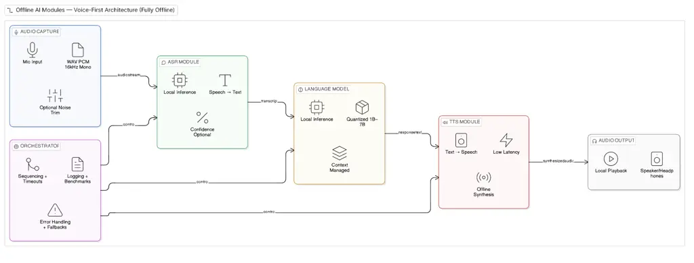

# Offline AI Modules: Voice-First Offline Architecture, Hardware Reference Stack, and Quantization & BenchmarkingThanks: Awarri (https://www.awarri.com/) is an African AI company that builds multilingual language infrastructure for African contexts and voice-first deployment.Thanks: The GSM Association (https://www.open-telco.ai/) African AI Language Initiative is an open collaborative programme to develop practical AI tools that serve African language communities.

Sunday Afariogun Affiliation: Awarri Technologies Limited   
Odunolaoluwa Jenrola Affiliation: Awarri Technologies Limited    Zeinab
Nezami Affiliation: GSM Association

###### Abstract

The Offline AI Modules workstream enables practical, low-power, and
community-accessible deployment of voice-first AI systems that operate
fully offline. Designed for African language communities where speech is
the dominant mode of interaction and internet connectivity is unreliable
or absent, the workstream delivers three reinforcing components: a
modular voice-first offline architecture, a low-cost hardware reference
bill of materials, and a reproducible quantization and a reproducible
quantization and benchmarking pipeline for instruction-tuned language
models in the 2–5 B parameter class. This paper presents the first
end-to-end benchmark evaluation of the stack across two hardware tiers:
an NVIDIA Jetson Orin NX (Tier B) and a Raspberry Pi 5 (Tier A). Three
instruction-tuned models are evaluated across four quantization formats,
assessed for deployment metrics (decode throughput, chat latency,
memory, power) and multilingual quality (topic classification accuracy
on MasakhaNEWS across English, Hausa, Igbo, Nigerian Pidgin, and Yoruba;
per-language perplexity drift). Speech recognition is evaluated using
Ethio-ASR on Amharic and Oromo across both tiers. The principal finding
is that Q4_K_M quantization represents the best size-to-quality
trade-off for deployment on both tiers: gemma-4-E2B-it achieves 28.8 t/s
decode throughput and 89.2% topic classification accuracy at Q4_K_M on
Tier B, while all three models run within the 16 GB memory budget on
Tier A.

###### Index Terms: 

Offline AI, African languages, voice-first, edge inference,
quantization, GGUF, llama.cpp, Raspberry Pi, benchmarking, low-resource
NLP.

## I Introduction

The Offline AI Modules workstream enables practical, low-power, and
community-accessible deployment of voice-first AI systems that operate
fully offline. It exists in direct response to the realities of African
language use and connectivity conditions, where many communities
interact primarily through speech and where internet access is often
limited, unreliable, expensive, or absent.

For many African languages, the dominant mode of interaction is spoken,
not typed. Combined with infrastructure conditions that make always-on
cloud inference impractical, a voice-first offline system is not a
stylistic preference but a functional requirement for inclusion,
usability, and adoption. Offline deployment delivers five concrete
benefits in this context: (i) access in low-connectivity and rural
environments; (ii) resilience under unstable network conditions; (iii)
privacy by keeping voice and language data on-device; (iv) cost
reduction by eliminating per-call cloud inference charges; (v) and local
experimentation through reproducible, low-cost hardware that
contributors can build themselves.

The stack combines three reinforcing components: (i) a modular
voice-first offline architecture supporting speech-based interaction
end-to-end; (ii) a low-cost hardware reference stack with a complete
bill of materials across two compute tiers; (iii) and a reproducible
quantization and benchmarking pipeline for small language models in the
2–5 B parameter class with shared, comparable metrics. This paper
presents the system design, hardware reference stack, and quantization
methodology of the workstream, together with the first end-to-end
benchmark evaluation of the stack across two hardware tiers: (i) a
Raspberry Pi 5 (Tier A); (ii) an NVIDIA Jetson Orin NX (Tier B).

The remainder of this paper is organised as follows. Section II
describes the voice-first offline system architecture. Section III
presents the hardware bill of materials. Section IV details the
quantization pipeline and reference models. Section V defines the
benchmarking methodology. Section VI reports the evaluation results.
Section VII concludes.

## II Voice-First Offline System Architecture

This section describes a practical, deployable offline architecture
supporting voice-first interaction end-to-end on constrained edge
hardware. The design is intentionally modular so that individual
components can be replaced as models and hardware improve, and
sufficiently simple for community contributors to replicate without
specialist tooling.

### II-A Architecture Overview

The system comprises five independent modules connected through
well-defined interfaces, as illustrated in Fig. 1. Each module owns a
single function and can be substituted without redesigning the pipeline:

- •
  Audio Capture & Preprocessing
- •
  ASR (Speech $`\rightarrow`$ Text)
- •
  Language Model (Text $`\rightarrow`$ Text)
- •
  TTS (Text $`\rightarrow`$ Speech)
- •
  Orchestration & Control

Fig. 1: System architecture of the voice-first African language AI
framework.

The system operates in two supported configurations: Configuration A
(CPU-first, low-cost), optimised for 2–5 B-parameter models; and
Configuration B (edge-accelerated), optimised for larger models and
lower latency.

### II-B Module Responsibilities

#### II-B1 Audio Capture & Preprocessing

Captures audio from microphone or file, normalises to a consistent
internal format, and applies optional lightweight preprocessing: silence
trimming, amplitude normalisation, and basic noise suppression.
Preprocessing is intentionally minimal to preserve performance on
CPU-first devices.

#### II-B2 ASR (Automatic Speech Recognition)

Converts normalised speech to text locally. Returns transcription plus
optional metadata (confidence score, language identifier, segmentation
timestamps). Must run within a predictable time budget on low-cost
devices and support multiple languages without internet connectivity.

#### II-B3 Language Model

Accepts ASR output text, generates response text locally, and applies
prompt formatting rules to keep behaviour consistent across models. Must
support multiple small-model variants as different communities may adopt
different open-source or locally-built models.

#### II-B4 TTS (Text-to-Speech)

Converts response text into audio output and returns a WAV waveform plus
playback metadata. Prioritises low latency and intelligibility, and must
be small enough to run locally without GPU acceleration.

#### II-B5 Orchestration & Control

Coordinates execution across ASR $`\rightarrow`$ LM $`\rightarrow`$ TTS,
handles timeouts, fallbacks, and errors, provides consistent logging for
benchmarking and debugging, and exposes a control interface for
contributor testing and automated benchmarking.

### II-C Interfaces and Data Exchange Standards

Table I summarises the interface standards used for data exchange across
all system modalities.

| Data Type    | Standard                       | Notes                                               |
| ------------ | ------------------------------ | --------------------------------------------------- |
| Audio input  | WAV PCM, 16 kHz, mono          | All ASR inputs normalised to this format.           |
| Audio output | WAV PCM, 16 or 22.05 kHz, mono | TTS may output 16 kHz for lightweight playback.     |
| Text         | UTF-8                          | All module text payloads must be UTF-8.             |
| Metadata     | JSON                           | Timestamps, confidence, language tags, device info. |

TABLE I: Interface Standards

### II-D Execution Model

The system adopts a single-device sequential execution model (ASR
$`\rightarrow`$ LM $`\rightarrow`$ TTS) with minimal background services
and benchmarking logging enabled by default. This design keeps peak
memory predictable and simplifies contributor replication.

### II-E Hardware-Aware Architecture Constraints

Tier A — Low-Cost CPU-First Devices: Designed for 2–5 B-class language
models with context windows limited to 256–512 tokens. Sequential module
execution keeps peak memory predictable. Thermal and power constraints
are acknowledged in runtime behaviour.

Tier B — Edge-Accelerated Devices: Supports larger models and lower
latency, allows more aggressive batching and longer contexts, and
enables lower-latency interaction loops.

### II-F Architecture-Level Benchmarking Hooks

Benchmarking is treated as a first-class architectural feature. The
orchestration layer captures the following on every run:

- •
  End-to-end latency (audio in $`\rightarrow`$ audio out).
- •
  Per-module latency (capture, ASR, LM, TTS, playback).
- •
  LM throughput (tokens/second) and first-token latency.
- •
  Peak RAM usage during the interaction.
- •
  Model load time from storage.

## III Hardware Reference Stack

This section describes the hardware reference stack used for testing and
benchmarking the offline AI pipeline under realistic deployment
constraints. The stack is documented as a reproducible bill of materials
that community contributors can replicate without specialist tooling or
equipment.

### III-A Selection Strategy

Hardware selection follows three criteria: (1) reproducibility:
components widely available, no specialised tooling required;
(2) coverage: supports both low-cost CPU-first and edge-accelerated
testing; (3) voice-first enablement: clean microphone input, speaker
output, and a minimal interaction surface.

### III-B Hardware Bill of Materials

Table II summarises the selected hardware components across the two
defined compute tiers.

| \#  | Part                                  | Tier | Role                                             |
| --- | ------------------------------------- | ---- | ------------------------------------------------ |
| 1   | Raspberry Pi 5 (16 GB RAM)            | A    | Primary CPU-first compute platform.              |
| 2   | Raspberry Pi AI HAT+                  | A    | Optional NPU acceleration (ASR / small LMs).     |
| 3   | MicroSD ($`\geq`$64 GB, A2 class)     | A    | Boot media; secondary storage for logs.          |
| 4   | Battery pack (UPS HAT or compatible)  | A    | Stable power for portable / field deployments.   |
| 5   | Whisplay HAT                          | A    | Integrated mic, speaker, buttons, small display. |
| 6   | Waveshare Dual M.2 HAT                | A    | Adds NVMe storage to Pi 5 for fast model loads.  |
| 7   | NVMe SSD ($`\geq`$256 GB)             | A    | Primary model/dataset storage via Dual M.2 HAT.  |
| 8   | LLM-8850 M.2 AI Accelerator           | A    | Axera AX8850 SoC, 24 TOPS @ INT8; offloads       |
|     |                                       |      | multimodal LLM and video-analysis workloads.     |
| 9   | Header spacers and standoffs          | A    | Mechanical assembly for stacked HATs.            |
| 10  | USB-C 5 V / 5 A power supply          | A    | Stable supply for sustained inference workloads. |
| 11  | NVIDIA Jetson Orin NX Dev Kit (16 GB) | B    | Edge-accelerated platform, larger models.        |
| 12  | NVIDIA Jetson Nano Dev Kit            | B    | Legacy comparison baseline (not required).       |
| 13  | Active cooling (fan / heatsink)       | A&B  | Prevents thermal throttling during inference.    |

TABLE II: Hardware Bill of Materials

### III-C Functional Mapping

#### III-C1 CPU-First Low-Cost Platform (Primary Baseline)

The Raspberry Pi 5 is the baseline environment for running quantised
small models (2–5 B parameters), validating offline pipeline execution
under strict RAM and thermal limits, and supporting contributor
replication.

#### III-C2 LLM-8850 M.2 AI Accelerator

The LLM-8850 is an M.2 M-key 2242 card built around the Axera AX8850
SoC, delivering 24 TOPS at INT8 in a 42 mm form factor. Mounted on the
Waveshare Dual M.2 HAT, it offloads multimodal and video-analysis
workloads from the Pi 5 CPU, freeing the main cores for the voice-first
pipeline. It also provides a low-cost step up toward Tier B without
changing the physical platform. Plug-and-play compatibility extends to
RK3588-class SBCs and x86 hosts.

#### III-C3 Edge Acceleration Tier

The Jetson Orin NX Developer Kit supports higher-performance inference,
faster interaction loops, and benchmarking of larger model sizes.

#### III-C4 Storage and Model Management

High-speed storage (microSD plus NVMe via the Dual M.2 HAT) ensures fast
model loading, stable throughput, and capacity for multiple quantised
models. Model load time and I/O bottlenecks are common failure points in
offline inference setups.

#### III-C5 Voice Interaction Interface

The Whisplay HAT bundles microphone, speaker, buttons, and a small
display into a single add-on board, reducing integration overhead and
providing a consistent audio interface across all benchmark runs.

#### III-C6 Power and Mobility

A battery component supports portability, testing under realistic field
constraints, and validation of power draw under battery operation. Many
target deployment environments lack stable mains electricity.

### III-D Test Readiness Checks

Four readiness checks are applied before each benchmark run to ensure
that results reflect model performance rather than hardware instability:

- •
  Thermal stability — sustained inference does not cause throttling.
- •
  Storage performance — models load reliably without I/O bottlenecks.
- •
  Audio stability — microphone and speaker behave consistently across
  runs.
- •
  Power stability — stable operation on both mains and battery.

## IV Quantization Pipeline

This section describes the quantization workflow used to compress
open-weight and African-built language models into offline-runnable
artifacts for the Tier A and Tier B reference platforms. The pipeline is
fully reproducible: each stage is driven by a single shell script
published alongside the workstream documentation.

### IV-A Motivation

Quantization is the single most important determinant of whether a given
model is deployable on Tier A hardware. A model in the 3 B parameter
class occupies approximately 6 GB of RAM in FP16 and rarely runs at
usable speeds on a Raspberry Pi 5. The same model in Q4_K_M GGUF format
occupies approximately 1.8–2.0 GB and runs at interactive speeds on CPU.
Choosing the right quantization format requires measuring the trade-off
between model quality, file size, memory footprint, and
tokens-per-second throughput on the actual target device.

### IV-B Reference Pipeline

The reference pipeline takes a Hugging Face checkpoint and produces GGUF
artifacts ready for llama.cpp on both the Raspberry Pi 5 and the Jetson
Orin NX. Table III summarises the six stages of the pipeline; reference
commands for the key stages are provided below.

|                            |                               |                                     |
| -------------------------- | ----------------------------- | ----------------------------------- |
| Stage                      | Tooling                       | Output                              |
| 1\. Acquire checkpoint     | huggingface_hub               | Local FP16/BF16 safetensors.        |
| 2\. Convert to GGUF (FP16) | convert_hf_to_gguf.py         | model-f16.gguf (intermediate).      |
| 3\. Quantize               | llama-quantize                | Q4_K_M, Q5_K_M, Q8_0 GGUFs.         |
| 4\. Smoke-test             | llama-cli, fixed prompt set   | Pass/fail per quantization.         |
| 5\. Benchmark              | llama-bench + harness         | JSON + CSV per schema in Section V. |
| 6\. Publish                | HF Hub or shared object store | Versioned GGUFs with model card.    |

TABLE III: Quantization Pipeline Stages

Stage 2 — convert FP16 safetensors to GGUF:

python convert_hf_to_gguf.py ./model-hf \\

--outfile ./model-f16.gguf \\

--outtype f16

Stage 3 — produce three quantization variants:

for QT in Q4_K_M Q5_K_M Q8_0; do

./llama-quantize ./model-f16.gguf \\

./model-\${QT}.gguf \${QT}

done

Stage 5 — run the standard benchmark evaluation on the target device:

./llama-bench -m ./model-Q4_K_M.gguf \\

-p 32,64 -n 64,128 -t 4 -ngl 0 \\

-o json \> bench-Q4_K_M.json

### IV-C Supported Quantization Formats

Three GGUF k-quant formats are supported as the primary evaluation
targets, spanning the realistic range a contributor would consider on
Tier A hardware. Table IV summarises their characteristics. Q4_K_M is
the recommended default for community deployments because it represents
the best size-to-quality ratio currently available for CPU inference.

| Format | Bits/wt (avg) | Size (3B)      | Quality vs FP16                       | Use                           |
| ------ | ------------- | -------------- | ------------------------------------- | ----------------------------- |
| Q4_K_M | $`\sim`$4.85  | $`\sim`$1.9 GB | Task accuracy preserved (see Sec. VI) | Default, Pi 5 (Tier A).       |
| Q5_K_M | $`\sim`$5.7   | $`\sim`$2.2 GB | Near-FP16 for most prompts            | Pi 5 + NVMe; better quality.  |
| Q8_0   | $`\sim`$8.5   | $`\sim`$3.3 GB | Effectively lossless                  | Jetson Orin NX (Tier B).      |
| F16    | 16            | $`\sim`$6.0 GB | Reference                             | Tier B; calibration baseline. |

TABLE IV: Supported GGUF Quantization Formats

Q4_K_M is the recommended default for community deployments because it
represents the best size-to-quality ratio currently available for CPU
inference.

### IV-D Quality Validation

Each quantised artifact is validated along three axes before inclusion
in the evaluation:

- •
  Perplexity drift — measured against held-out text for the
  full-precision reference and each quantization, reported per language.
  Drift is treated as a diagnostic to be read alongside task-level
  metrics rather than a pass/fail gate: the evaluation in Section VI
  shows drift of up to 6.4% at Q4_K_M coexisting with stable task
  accuracy. Q8_0 drift is expected to be near-zero (under 0.8% observed
  across all models and languages).
- •
  Smoke-test pass rate — a fixed set of 20 prompts covering greetings,
  intent classification, simple QA, and short instructions in each
  supported language, marked pass / partial / fail.
- •
  Behavioural diff — quantised outputs compared to the full-precision
  reference on the same prompt set. High divergence at Q4_K_M is a
  signal to evaluate Q5_K_M as a fallback for that model.

### IV-E Reference Models

Table V lists the three open-weight models selected as the primary
evaluation targets. Selection criteria included instruction-tuning,
parameter count compatible with Tier A deployment, permissive licensing,
and multilingual pre-training coverage relevant to African languages.

| Model               | Params               | License            | Why included                            |
| ------------------- | -------------------- | ------------------ | --------------------------------------- |
| gemma-4-E2B-it      | 5 B total / 2 B eff. | Gemma Terms of Use | Mixture-of-experts architecture;        |
|                     |                      |                    | highest accuracy in evaluation.         |
| gemma-2-2b-it       | 2.6 B                | Gemma Terms of Use | Smallest memory footprint;              |
|                     |                      |                    | viable on memory-constrained Tier A.    |
| Qwen2.5-3B-Instruct | 3.1 B                | Apache 2.0         | Permissive license; strong multilingual |
|                     |                      |                    | coverage; lowest PPL drift at Q4_K_M.   |

TABLE V: Reference Models for Quantization and Evaluation

As African-built models are released by parallel workstreams, they will
be added using the same pipeline, evaluation prompts, and publication
format.

## V Benchmarking Methodology

This section defines the metrics, harness, and reporting format used to
evaluate the offline AI stack. A shared methodology ensures that results
across devices, models, and contributors are directly comparable and can
be aggregated into a consistent picture of deployment feasibility.
Table VI summarises the benchmark metrics used to evaluate system
performance across latency, throughput, and resource usage. Table VII
defines the standard test conditions applied to ensure reproducibility.

| Metric                 | Unit     | Definition                                       |
| ---------------------- | -------- | ------------------------------------------------ |
| End-to-end latency     | ms       | Audio-in start to audio-out start.               |
| ASR latency            | ms       | End-of-speech to ASR text output.                |
| LM first-token latency | ms       | Prompt submission to first generated token.      |
| LM throughput          | tokens/s | Sustained rate over $`\geq`$64 generated tokens. |
| TTS latency            | ms       | Text input to first audio sample available.      |
| Peak RAM               | MB       | Maximum resident memory during interaction.      |
| Model load time        | s        | Process start to model ready (cold cache).       |

TABLE VI: Benchmark Metrics

| Condition       | Default                                     | Rationale                                   |
| --------------- | ------------------------------------------- | ------------------------------------------- |
| Network         | Disconnected                                | Enforces the offline guarantee.             |
| Background load | Idle desktop, no other workloads            | Removes contention from the measurement.    |
| Storage state   | Cold cache for load; warm for runs          | Separates load-time from inference effects. |
| Thermal state   | 5-min idle before run; ambient $`\leq`$28°C | Prevents thermal bias.                      |
| Power           | Documented (mains vs battery)               | Battery can throttle or affect clocks.      |
| Run length      | $`\geq`$10 consecutive interactions         | Smooths out one-off outliers.               |
| Warm-up         | Discard first interaction                   | Load time reported separately.              |

TABLE VII: Standard Test Conditions

### V-A Logging Schema (JSON)

Every run produces one run-header record (Fig. 2) and one metrics record
per interaction (Fig. 3).

{

"run_id": "2026-07-21T22:34:17Z_pi5_e2b_q4km",

"device": { "name": "Raspberry Pi 5", "ram_gb": 16, "storage": "NVMe",

"os": "Raspberry Pi OS 12 (bookworm)", "tier": "A", "cooling": "active
fan" },

"pipeline": { "mode": "voice_to_voice", "asr_engine": "whisper.cpp
1.6.x",

"lm_runtime": "llama.cpp build 9670", "tts_engine": "piper 1.2.x" },

"model": { "name": "gemma-4-E2B-it", "params_b": 5.0, "format": "GGUF",

"quantization": "Q4_K_M", "context_tokens": 512 },

"timestamp_utc": "2026-07-21T22:34:17Z"

}

Fig. 2: Run header JSON record.

{

"run_id": "2026-07-21T22:34:17Z_pi5_e2b_q4km",

"interaction_id": "0001",

"input": { "audio_duration_ms": 3400, "language": "auto" },

"metrics": {

"end_to_end_latency_ms": 8970,

"asr": { "latency_ms": 2100, "confidence": 0.86 },

"lm": { "prompt_tokens": 62, "tokens_generated": 128,

"first_token_latency_ms": 2019, "tokens_per_second": 7.5, "peak_ram_mb":
2600 },

"tts": { "latency_ms": 1450, "output_audio_duration_ms": 4200 }

},

"errors": \[\],

"timestamp_utc": "2026-07-21T22:34:41Z"

}

Fig. 3: Per-interaction metrics JSON record.

### V-B CSV Logging Schema

A flat CSV is provided for contributors who prefer spreadsheets. One row
per interaction; the header is fixed:

run_id, interaction_id, device, ram_gb, model_name,

params_b, quant, context_tokens, asr_engine,

tts_engine, end_to_end_latency_ms, asr_latency_ms,

lm_first_token_latency_ms, lm_tokens_generated,

lm_tokens_per_second, tts_latency_ms, peak_ram_mb,

model_load_time_s, errors

### V-C Statistical Protocol

The following statistical procedures are applied to quality evaluation
results reported in Section VI. Topic classification accuracy is
reported with 95% Wilson score intervals (approximately $`\pm 3.5`$
percentage points at 85% accuracy on $`n=400`$ items). To test whether
quantization changes task accuracy, each quantized format is compared
against its own full-precision reference using an exact McNemar test on
paired per-item outcomes, with Holm correction applied across the nine
planned comparisons (three models $`\times`$ three quantization
formats). A non-significant result indicates that the evaluation cannot
resolve a difference at this sample size; it does not establish
equivalence.

## VI Benchmark Results

This section reports the benchmark evaluation for the Offline AI Modules
stack. Two device tiers were evaluated under the standard test
conditions defined in Table VII: Tier B (an NVIDIA Jetson Orin NX 16 GB,
Ampere GPU) and Tier A (a Raspberry Pi 5 16 GB, quad-core Cortex-A76,
CPU-only). The Tier B evaluation covers three instruction-tuned models,
gemma-4-E2B-it (5 B total / 2 B effective parameters), gemma-2-2b-it
(2.6 B), and Qwen2.5-3B-Instruct (3.1 B), each assessed across four
precision levels: a full-precision reference (BF16 for gemma-4-E2B-it,
F16 for the others), Q8_0, Q5_K_M, and Q4_K_M. Deployment metrics
reported include decode throughput, prefill throughput, chat
time-to-first-token (TTFT), warm-cache server startup time, process
resident memory (RSS), and peak power draw. Quality is assessed through
two complementary measures: topic classification accuracy on the
MasakhaNEWS benchmark \[12\] (400 stratified items across English,
Hausa, Igbo, Nigerian Pidgin, and Yoruba; chance level 25%) and
per-language perplexity drift relative to the full-precision reference.
Tier A deployment metrics were collected under an earlier harness
revision and are reported for feasibility context; they were not
re-measured under the revised protocol applied to Tier B.

The principal finding is that Q4_K_M represents the best size-to-quality
trade-off for deployment on both tiers, as illustrated in Fig. 4.
gemma-4-E2B-it achieves the highest decode throughput on Tier B at
28.8 t/s and the highest topic classification accuracy at 89.2%, with a
macro PPL drift of only 0.63% relative to its BF16 reference. Its
relative ranking among the three models is consistent across deployment
metrics and quality measures, confirming that its efficiency and
accuracy advantages are not format-dependent artefacts.

Fig. 4: Quality–cost trade-off on Tier B: topic accuracy versus decode
throughput, with marker area proportional to peak process RSS
(3.4–13.5 GiB). gemma-4-E2B-it Q4_K_M dominates the upper-right
frontier.

### VI-A Benchmark Datasets

The quality evaluation uses five held-out corpora drawn from the
MasakhaNEWS dataset \[12\], one per language: English (eng), Hausa
(hau), Igbo (ibo), Nigerian Pidgin (pcm), and Yoruba (yor). Each corpus
contains approximately 50,000 whitespace-delimited words, providing a
consistent scale for perplexity measurement across languages. Article
count and length vary by language, reflecting differences in news
article conventions: English comprises 95 longer articles (mean 531
words), while Hausa, Igbo, Nigerian Pidgin, and Yoruba each contain
109–154 shorter articles (mean 325–461 words). The topic classification
evaluation uses a stratified subset of 400 items, 80 per language,
balanced across four classes (entertainment, health, politics, sports),
giving a chance-level accuracy of 25%.

The corpora differ meaningfully in orthographic complexity, which is
relevant to tokenization efficiency and perplexity interpretation.
English uses only 9 non-ASCII characters; Hausa and Igbo use 22 and 20
respectively, including tone-marked vowels and implosive consonant
characters specific to their phonological inventories; Yoruba uses 40
unique non-ASCII characters, the highest among the five languages,
reflecting its extensive use of diacritically marked vowels and nasal
tones. This orthographic variation means that raw perplexity values are
not directly comparable across language families; results are therefore
reported as drift relative to each model’s full-precision reference,
isolating the effect of quantization from baseline tokenization
differences.

### VI-B Tier B (Jetson Orin NX, GPU): Full Quantization Evaluation

Table VIII presents the complete Tier B evaluation results across all
model and quantization combinations. Deployment metrics and quality
measures are reported jointly to enable format selection that accounts
for both inference cost and task performance. Decode and prefill
throughput are measured via the llama.cpp server. TTFT is the end-to-end
chat time-to-first-token (median) from HTTP request after one warm-up.
Startup reports warm-cache server readiness, not cold disk load. RSS is
the process resident memory, which is the preferred measure on the
Jetson’s unified-memory architecture. Power reports VDD_IN peak. Quality
is assessed via MasakhaNEWS four-class topic classification over 400
stratified items (chance = 25%); 95% Wilson confidence intervals are
omitted here for space. The reference precision used for PPL drift is
BF16 for gemma-4-E2B-it and F16 for the other two models. Bold rows
indicate the recommended deployment format per model.

Fig. 5: Decode throughput on Tier B (Jetson Orin NX, GPU) by precision
level. Quantization to Q4_K_M yields $`1.7`$–$`2.6\times`$ the
full-precision decode rate.

#### VI-B1 Deployment Metrics

Q4_K_M consistently achieves the highest decode throughput and smallest
memory footprint across all three models (Fig. 5). Transitioning from
Q4_K_M to Q8_0 incurs approximately 35% decode throughput degradation
for gemma-4-E2B-it (28.8 $`\rightarrow`$ 18.6 t/s) and approximately 18%
for gemma-2-2b-it (23.4 $`\rightarrow`$ 19.2 t/s). Full-precision
references are not viable for on-device deployment: gemma-2-2b-it F16
achieves only 14.0 t/s with 10,237 MiB resident memory, and
gemma-4-E2B-it BF16 requires 13,508 MiB at 11.0 t/s. Chat TTFT for the
deployable quantization formats (Q4_K_M, Q5_K_M, Q8_0) ranges from 446
to 501 ms at the median, remaining within an acceptable threshold for
interactive voice agents. Peak power consumption held stable at 20–24 W
across all configurations, with no thermal throttling observed.

#### VI-B2 Quality Evaluation

Topic classification accuracy on MasakhaNEWS was evaluated across five
African languages; Fig. 6 shows all twelve model–precision combinations
with their 95% Wilson intervals. gemma-4-E2B-it achieves the highest
overall accuracy at 89.2% (Q4_K_M), with macro F1 of 89.3% and a PPL
drift of only 0.63% relative to BF16, confirming that quantization
introduces negligible quality degradation for this model. gemma-2-2b-it
Q4_K_M achieves 86.0% accuracy with a macro F1 of 86.4%. Notably, this
is the only configuration in the study whose accuracy differs
significantly from its full-precision reference (exact McNemar
$`p=0.0033`$, Holm-corrected $`p=0.030`$), and the difference is an
improvement of $`+4.25`$ percentage points over F16 (81.8%). Its PPL
drift of 6.41% is simultaneously the highest among the deployable
formats, illustrating that perplexity drift neither predicts nor bounds
task-level accuracy change (Fig. 7). No other quant–reference pair
differs significantly after correction. Qwen2.5-3B-Instruct Q4_K_M
achieves 82.5% accuracy with a PPL drift of 2.46%, and its accuracy is
stable across all quantization levels (82.2–84.0%).

Fig. 6: MasakhaNEWS topic accuracy with 95% Wilson intervals ($`n=400`$)
for all model–precision combinations on Tier B. Hollow markers denote
full-precision references. gemma-2-2b-it Q4_K_M is the only quantization
differing significantly from its reference (exact McNemar,
Holm-corrected $`p=0.030`$) — an improvement.

Fig. 7: Macro perplexity drift of each quantization relative to its own
full-precision reference. Drift does not track task accuracy:
gemma-2-2b-it Q4_K_M shows the largest drift ($`+6.41\%`$) yet the
largest accuracy gain (Fig. 6).

| Model          | Quant  | Size  | Decode | Prefill | TTFT     | Startup | RSS   | Power | Accuracy | Macro F1 |
| -------------- | ------ | ----- | ------ | ------- | -------- | ------- | ----- | ----- | -------- | -------- |
|                |        | (GiB) | (t/s)  | (t/s)   | med (ms) | (s)     | (MiB) | (W)   | (%)      | (%)      |
| Gemma-4-E2B-it | BF16   | 8.67  | 11.0   | 601.1   | 550      | 11.07   | 13508 | 20.9  | 88.8     | 88.9     |
| Gemma-4-E2B-it | Q8_0   | 4.70  | 18.6   | 972.0   | 466      | 5.03    | 7565  | 20.3  | 89.0     | 89.2     |
| Gemma-4-E2B-it | Q5_K_M | 3.13  | 24.7   | 909.7   | 487      | 4.52    | 5177  | 21.2  | 88.0     | 88.2     |
| Gemma-4-E2B-it | Q4_K_M | 2.89  | 28.8   | 940.5   | 477      | 4.52    | 4701  | 21.2  | 89.2     | 89.3     |
| Gemma-2-2b-it  | F16    | 4.88  | 14.0   | 896.6   | 425      | 5.03    | 10237 | 23.4  | 81.8     | 82.3     |
| Gemma-2-2b-it  | Q8_0   | 2.59  | 19.2   | 1033.1  | 446      | 3.52    | 5563  | 21.8  | 81.2     | 81.8     |
| Gemma-2-2b-it  | Q5_K_M | 1.79  | 22.6   | 937.2   | 501      | 3.27    | 3924  | 23.1  | 82.0     | 82.7     |
| Gemma-2-2b-it  | Q4_K_M | 1.59  | 23.4   | 961.6   | 491      | 3.09    | 3515  | 22.5  | 86.0     | 86.4     |
| Qwen2.5-3B     | F16    | 5.75  | 11.5   | 746.7   | 497      | 4.60    | 12040 | 23.0  | 83.5     | 84.0     |
| Qwen2.5-3B     | Q8_0   | 3.06  | 19.9   | 872.7   | 456      | 3.27    | 6522  | 23.8  | 84.0     | 84.6     |
| Qwen2.5-3B     | Q5_K_M | 2.07  | 20.7   | 749.8   | 499      | 2.77    | 4504  | 23.4  | 82.2     | 82.6     |
| Qwen2.5-3B     | Q4_K_M | 1.80  | 21.9   | 771.2   | 487      | 2.77    | 3936  | 23.2  | 82.5     | 82.9     |

TABLE VIII: Tier B (Jetson Orin NX) LLM Benchmark — Deployment Metrics
and Quality

Table IX reports per-language topic classification accuracy and
perplexity drift for all evaluated model and quantization combinations.
Accuracy is largely stable across quantization levels for
gemma-4-E2B-it, with Nigerian Pidgin consistently achieving the highest
per-language score (95.0–96.2%) across all formats, reflecting strong
coverage of West African English-influenced language patterns. Hausa is
the weakest language for gemma-4-E2B-it and Qwen2.5-3B-Instruct, while
gemma-2-2b-it is weakest on English; the Hausa deficit is consistent
with more limited representation in pre-training corpora. PPL drift at
Q4_K_M is small and uniformly positive for Qwen2.5-3B-Instruct (+1.35 to
+4.20%), mixed in sign and smallest in aggregate for gemma-4-E2B-it
(-4.27 to +5.97%; macro +0.63%), and highest for gemma-2-2b-it (+3.27 to
+8.29%), particularly on Hausa and Igbo. Negative drift values observed
for gemma-4-E2B-it at Q5_K_M are within measurement uncertainty and
should not be interpreted as genuine quality improvement over the BF16
reference.

|                |        | Accuracy (%) |      |      |      |      | PPL Drift (%) |       |       |       |       |
| -------------- | ------ | ------------ | ---- | ---- | ---- | ---- | ------------- | ----- | ----- | ----- | ----- |
| Model          | Quant  | eng          | hau  | ibo  | pcm  | yor  | eng           | hau   | ibo   | pcm   | yor   |
| Gemma-4-E2B-it | BF16   | 88.8         | 83.8 | 88.8 | 95.0 | 87.5 | 0.00          | 0.00  | 0.00  | 0.00  | 0.00  |
| Gemma-4-E2B-it | Q8_0   | 88.8         | 83.8 | 88.8 | 95.0 | 88.8 | +0.08         | +0.68 | +0.69 | -0.05 | +0.77 |
| Gemma-4-E2B-it | Q5_K_M | 86.2         | 83.8 | 86.2 | 96.2 | 87.5 | -5.21         | -2.33 | -1.01 | -3.37 | -1.52 |
| Gemma-4-E2B-it | Q4_K_M | 88.8         | 85.0 | 87.5 | 96.2 | 88.8 | +2.77         | -0.65 | -0.67 | +5.97 | -4.27 |
| Gemma-2-2b-it  | F16    | 77.5         | 78.8 | 83.8 | 82.5 | 86.2 | 0.00          | 0.00  | 0.00  | 0.00  | 0.00  |
| Gemma-2-2b-it  | Q8_0   | 77.5         | 78.8 | 82.5 | 81.2 | 86.2 | +0.24         | +0.57 | +0.23 | +0.13 | +0.01 |
| Gemma-2-2b-it  | Q5_K_M | 78.8         | 78.8 | 81.2 | 83.8 | 87.5 | +0.45         | +3.43 | +3.04 | +2.50 | +2.46 |
| Gemma-2-2b-it  | Q4_K_M | 82.5         | 83.8 | 88.8 | 88.8 | 86.2 | +3.27         | +8.29 | +8.26 | +5.88 | +6.37 |
| Qwen2.5-3B     | F16    | 86.2         | 73.8 | 86.2 | 87.5 | 83.8 | 0.00          | 0.00  | 0.00  | 0.00  | 0.00  |
| Qwen2.5-3B     | Q8_0   | 86.2         | 76.2 | 86.2 | 87.5 | 83.8 | +0.12         | +0.08 | -0.19 | +0.08 | +0.19 |
| Qwen2.5-3B     | Q5_K_M | 85.0         | 73.8 | 83.8 | 88.8 | 80.0 | +0.83         | +1.60 | +0.78 | +0.57 | +1.51 |
| Qwen2.5-3B     | Q4_K_M | 86.2         | 76.2 | 83.8 | 90.0 | 76.2 | +1.97         | +3.20 | +1.35 | +1.59 | +4.20 |

Accuracy: correct/80 per language (chance = 25%). PPL drift: percentage
change relative to the full-precision reference (BF16 for
gemma-4-E2B-it, F16 for others); negative values are within measurement
uncertainty and do not indicate genuine improvement. Languages: eng =
English, hau = Hausa, ibo = Igbo, pcm = Nigerian Pidgin, yor = Yoruba.

TABLE IX: Tier B (Jetson Orin NX) — Topic Accuracy (%) and PPL Drift (%)
by Language

Per-class precision, recall, and F1 are reported in Appendix C.

### VI-C Tier A (Raspberry Pi 5, CPU): Deployable Q4_K_M Evaluation

Table X presents Q4_K_M results on the Raspberry Pi 5. All three models
operate within the 16 GB memory budget (peak resident memory ranges from
2.3 to 2.6 GB), marginally lower than on the Jetson Orin NX owing to the
absence of GPU-mirrored memory allocation. The relative throughput
ranking among models is preserved from Tier B: gemma-4-E2B-it achieves
the highest decode rate at 7.5 t/s, followed by gemma-2-2b-it at 6.8 t/s
and Qwen2.5-3B-Instruct at 6.1 t/s. All smoke-test outputs were
well-formed, and no thermal throttling was observed during the
evaluation.

As Tier A uses the identical Q4_K_M GGUF artifacts evaluated on Tier B,
quality figures (accuracy, macro F1, and per-language PPL drift) are
those reported for Q4_K_M in Tables VIII and IX and are not repeated
here.

| Model               | Decode (t/s) | Prefill (t/s) | First-response (ms) | Peak RAM (MB) |
| ------------------- | ------------ | ------------- | ------------------- | ------------- |
| Gemma-4-E2B-it      | 7.5          | 31.7          | 2019                | 2278          |
| Gemma-2-2b-it       | 6.8          | 39.4          | 1624                | 2428          |
| Qwen2.5-3B-Instruct | 6.1          | 29.4          | 2180                | 2578          |

TABLE X: Tier A (Raspberry Pi 5, CPU) LLM Benchmark, Q4_K_M

### VI-D Cross-Tier Comparison (Q4_K_M)

Table XI presents a direct comparison of the Q4_K_M quantization format
across both hardware tiers. The performance penalty incurred by CPU-only
inference is highly asymmetric across operation types. Decode
throughput, which is memory-bandwidth-bound, degrades by a factor of
3.4–3.8$`\times`$, yielding a generation rate of 6.1–7.5 t/s on Tier A,
which remains usable for streaming voice output. By contrast, prefill
throughput, which is compute-bound and relies on parallel matrix
operations, degrades by a factor of 24–30$`\times`$ on four ARM
Cortex-A76 cores. This asymmetry concentrates the performance impact in
response initiation latency: on Tier A, first-response latency rises to
1.6–2.2 s, exceeding the perceptual threshold for interactive voice
response. On Tier B, chat TTFT ranges from 477 to 491 ms at the median
for Q4_K_M across the three models; this metric is not directly
comparable to Tier A first-response latency as it includes the full HTTP
chat path, but both point to the same bottleneck: prefill on
compute-constrained hardware. The primary optimisation target is
therefore prefill reduction: minimising system prompt length,
constraining retrieval context, and employing prompt caching where
applicable.

| Model       | Metric         | Jetson (GPU) | Pi 5 (CPU) | Ratio          | Note                                              |
| ----------- | -------------- | ------------ | ---------- | -------------- | ------------------------------------------------- |
| Gemma-4-E2B | Decode (t/s)   | 28.8         | 7.5        | 3.8$`\times`$  |                                                   |
| Gemma-4-E2B | Prefill (t/s)  | 940.5        | 31.7       | 29.7$`\times`$ |                                                   |
| Gemma-4-E2B | Chat TTFT (ms) | 477          | —          | —              | Tier A uses raw pipeline; not directly comparable |
| Gemma-2-2b  | Decode (t/s)   | 23.4         | 6.8        | 3.4$`\times`$  |                                                   |
| Gemma-2-2b  | Prefill (t/s)  | 961.6        | 39.4       | 24.4$`\times`$ |                                                   |
| Gemma-2-2b  | Chat TTFT (ms) | 491          | —          | —              | Tier A uses raw pipeline; not directly comparable |
| Qwen2.5-3B  | Decode (t/s)   | 21.9         | 6.1        | 3.6$`\times`$  |                                                   |
| Qwen2.5-3B  | Prefill (t/s)  | 771.2        | 29.4       | 26.2$`\times`$ |                                                   |
| Qwen2.5-3B  | Chat TTFT (ms) | 487          | —          | —              | Tier A uses raw pipeline; not directly comparable |

Tier B decode and prefill from llama.cpp server benchmark. Chat TTFT is
the median end-to-end HTTP request latency after one warm-up, available
for Tier B only. Tier A first-response latency (1.6–2.2 s) is measured
via the raw pipeline harness and is reported separately in Table X.
Ratios are computed on the overlapping metrics only.

TABLE XI: Jetson Orin NX (GPU) vs. Raspberry Pi 5 (CPU), Q4_K_M, Per
Model

### VI-E Speech Recognition (Ethio-ASR): Both Tiers

The ASR evaluation assessed two Ethio-ASR multilingual models \[13\]
(94 M and 600 M parameters) on the FLEURS Amharic and Oromo test sets.
Recognition quality is largely device-independent: normalised word error
rate (WER\_(norm)) on Amharic varies by only 0.288 $`\rightarrow`$ 0.291
for the 94 M model and 0.228 $`\rightarrow`$ 0.252 for the 600 M model
between GPU and CPU inference, differences attributable to
fp16 $`\rightarrow`$ fp32 numeric variation and limited sample size
rather than a systematic regression.

Fig. 8: Ethio-ASR benchmark results (94M and 600M models, Amharic and
Oromo) across Jetson Orin NX and Raspberry Pi 5, reporting WER\_(norm),
inference time per utterance, and peak RAM. Colour intensity encodes
magnitude independently per metric.

Inference latency is the dominant performance differentiator across
tiers. On Tier B, the 94 M model achieves $`\sim`$47 ms per utterance
and the 600 M achieves $`\sim`$478 ms; on Tier A, these increase to
3.05 s and 15.2 s respectively. The 94 M model remains above real-time
on Tier A (approximately 3$`\times`$ headroom) and is suitable for
near-real-time deployment. The 600 M model at $`\sim`$15 s per utterance
on Tier A operates below real-time and is appropriate only for offline
batch transcription. Oromo exhibits substantially higher error rates
across both tiers and model sizes (WER\_(norm) $`\approx`$0.705–0.763), a
result attributable to limited training data availability rather than
hardware or quantization effects.

| Model | Lang    | Device       | WER\_(norm) | CER   | Inf mean (s) | Power (W) |
| ----- | ------- | ------------ | ----------- | ----- | ------------ | --------- |
| 94M   | Amharic | Jetson (GPU) | 0.288       | 0.184 | 0.047        | 36.5      |
| 94M   | Amharic | Pi 5 (CPU)   | 0.291       | 0.186 | 3.05         | 10.2      |
| 600M  | Amharic | Jetson (GPU) | 0.228       | 0.163 | 0.478        | 33.9      |
| 600M  | Amharic | Pi 5 (CPU)   | 0.252       | 0.166 | 15.23        | 10.6      |
| 94M   | Oromo   | Jetson (GPU) | 0.725       | 0.260 | 0.048        | 36.6      |
| 94M   | Oromo   | Pi 5 (CPU)   | 0.725       | 0.260 | 2.92         | 10.3      |
| 600M  | Oromo   | Jetson (GPU) | 0.705       | 0.249 | 0.475        | 34.2      |
| 600M  | Oromo   | Pi 5 (CPU)   | 0.763       | 0.261 | 15.00        | 10.1      |

TABLE XII: Ethio-ASR Benchmark, Amharic & Oromo, Both Tiers

### VI-F Deployment Recommendations

Based on the evaluation results, the following deployment configurations
are recommended:

- •
  Language model — interactive voice agents: gemma-4-E2B-it at Q4_K_M is
  the recommended configuration on both tiers, offering the highest
  decode throughput (28.8 t/s on Tier B, 7.5 t/s on Tier A), the highest
  topic classification accuracy (89.2%), and a PPL drift of only 0.63%
  relative to BF16. It is particularly strong on Nigerian Pidgin (96.2%)
  and Igbo (87.5%), making it the preferred choice for West African
  deployment contexts.
- •
  Language model — memory-constrained deployments: gemma-2-2b-it at
  Q4_K_M is the recommended lightweight alternative (1.59 GiB, 3,515 MiB
  RSS), with a topic accuracy of 86.0%. Its 1.59 GiB file and 3,515 MiB
  resident memory are the smallest of any evaluated configuration,
  making it the preferred choice where memory is the binding constraint.
- •
  Language model — highest fidelity to full-precision: gemma-4-E2B-it at
  Q8_0 is recommended where near-lossless quantization behaviour is
  required. It matches the BF16 reference almost exactly (89.0% accuracy
  vs 88.8%, PPL drift 0.44%) while decoding 69% faster than BF16 at
  roughly half the memory (7,565 MiB vs 13,508 MiB RSS).
- •
  Language model — permissively licensed deployments:
  Qwen2.5-3B-Instruct at Q4_K_M is recommended where a permissive
  license is required: it is the only evaluated model released under
  Apache 2.0. It achieves 82.5% accuracy at a file size of 1.80 GiB,
  with per-language PPL drift confined to a narrow $`+1.35`$ to
  $`+4.20\%`$ band, accepting a modest accuracy trade-off relative to
  gemma-4-E2B-it.
- •
  ASR: The 94 M Ethio-ASR model is recommended for real-time deployment
  on both tiers, achieving near-real-time performance on Tier A (3.05 s
  per utterance, approximately 3$`\times`$ headroom) with a normalised
  WER of 0.291 on Amharic. The 600 M model is recommended exclusively
  for offline batch transcription on Tier A, where its marginal Amharic
  quality improvement (WER 0.252 vs 0.291) justifies the 15.23 s per
  utterance inference cost.
- •
  Tier A latency constraint: The first-response latency of 1.6–2.2 s on
  the Raspberry Pi 5 (a consequence of the 24–30$`\times`$ prefill
  throughput degradation relative to Tier B) constitutes the primary
  user-experience constraint for interactive deployment. Prompt-length
  reduction, retrieval context constraints, and prompt caching are the
  primary mitigation strategies. For applications where sub-second
  response initiation is required, Tier B deployment is recommended.

## VII Conclusion

The Offline AI Modules workstream delivers a credible, well-documented
foundation for voice-first offline AI on low-cost African-market
hardware. By combining a modular reference architecture, a reproducible
hardware BOM, a quantization pipeline, and a multilingual benchmarking
methodology, the workstream creates the conditions for community-wide
progress rather than isolated proof-of-concepts.

The benchmark results establish the first quantitative baseline for this
stack. gemma-4-E2B-it at Q4_K_M achieves 28.8 t/s on Tier B with 89.2%
topic classification accuracy across five languages and a PPL drift of
0.63%, while all three models run within budget on Tier A at
6.1–7.5 t/s. The 94 M Ethio-ASR model confirms that the full voice-first
pipeline is feasible on affordable hardware without internet
connectivity. First-response latency on Tier A (1.6–2.2 s) and Oromo ASR
quality (WER 0.705–0.763) remain the primary open challenges, pointing
respectively to prompt optimisation and African-language data
availability as the next priorities.

## Appendix A Quantization Format Quick-Reference

Q4_K_M is the recommended default for Tier A community deployments
($`\sim`$1.9 GB for a 3B model; measured task accuracy matched or
exceeded the full-precision reference for all three evaluated models,
with macro PPL drift between 0.6% and 6.4%). Q5_K_M offers near-FP16
quality at modest size cost ($`\sim`$2.2 GB). Q8_0 is effectively
lossless and targets Tier B (Jetson Orin NX). F16 is the calibration
baseline and is not suitable for deployment on Tier A hardware.

## Appendix B Benchmark JSON Schema Summary

Each run produces a run-header record (device, pipeline, model,
timestamp) and one per-interaction metrics record (end-to-end latency,
ASR latency, LM first-token latency, LM throughput, TTS latency, peak
RAM, errors). The CSV schema is a flattened view of the same fields, one
row per interaction.

## Appendix C Per-Class Precision, Recall, and F1

Table XIII reports precision, recall, and F1 per topic class for all
evaluated model and quantization combinations on the MasakhaNEWS
benchmark. Sports achieves the highest F1 across all configurations
(91.1–96.0%), while health and politics are consistently harder.
Politics recall is uniformly 95.0–100.0% across all models and formats,
indicating a systematic tendency to over-predict the politics class,
which correspondingly reduces its precision (64.1–79.5%). This pattern
is stable across quantization levels and does not appear to be induced
by compression.

| Model          | Quant  | Class         | Support | Precision (%) | Recall (%) | F1 (%) |
| -------------- | ------ | ------------- | ------- | ------------- | ---------- | ------ |
| Gemma-4-E2B-it | BF16   | entertainment | 100     | 96.3          | 79.0       | 86.8   |
|                |        | health        | 100     | 94.2          | 81.0       | 87.1   |
|                |        | politics      | 100     | 75.2          | 100.0      | 85.8   |
|                |        | sports        | 100     | 96.9          | 95.0       | 96.0   |
| Gemma-4-E2B-it | Q8_0   | entertainment | 100     | 96.3          | 79.0       | 86.8   |
|                |        | health        | 100     | 94.3          | 82.0       | 87.7   |
|                |        | politics      | 100     | 75.8          | 100.0      | 86.2   |
|                |        | sports        | 100     | 96.9          | 95.0       | 96.0   |
| Gemma-4-E2B-it | Q5_K_M | entertainment | 100     | 90.6          | 77.0       | 83.2   |
|                |        | health        | 100     | 94.3          | 83.0       | 88.3   |
|                |        | politics      | 100     | 77.3          | 99.0       | 86.8   |
|                |        | sports        | 100     | 95.9          | 93.0       | 94.4   |
| Gemma-4-E2B-it | Q4_K_M | entertainment | 100     | 90.2          | 83.0       | 86.5   |
|                |        | health        | 100     | 93.3          | 83.0       | 87.8   |
|                |        | politics      | 100     | 79.5          | 97.0       | 87.4   |
|                |        | sports        | 100     | 96.9          | 94.0       | 95.4   |
| Gemma-2-2b-it  | F16    | entertainment | 100     | 95.7          | 66.0       | 78.1   |
|                |        | health        | 100     | 92.5          | 74.0       | 82.2   |
|                |        | politics      | 100     | 65.4          | 100.0      | 79.1   |
|                |        | sports        | 100     | 92.6          | 87.0       | 89.7   |
| Gemma-2-2b-it  | Q8_0   | entertainment | 100     | 95.7          | 66.0       | 78.1   |
|                |        | health        | 100     | 92.3          | 72.0       | 80.9   |
|                |        | politics      | 100     | 64.5          | 100.0      | 78.4   |
|                |        | sports        | 100     | 92.6          | 87.0       | 89.7   |
| Gemma-2-2b-it  | Q5_K_M | entertainment | 100     | 94.5          | 69.0       | 79.8   |
|                |        | health        | 100     | 93.5          | 72.0       | 81.4   |
|                |        | politics      | 100     | 64.9          | 100.0      | 78.7   |
|                |        | sports        | 100     | 95.6          | 87.0       | 91.1   |
| Gemma-2-2b-it  | Q4_K_M | entertainment | 100     | 91.0          | 81.0       | 85.7   |
|                |        | health        | 100     | 93.8          | 76.0       | 84.0   |
|                |        | politics      | 100     | 73.6          | 95.0       | 83.0   |
|                |        | sports        | 100     | 93.9          | 92.0       | 92.9   |
| Qwen2.5-3B     | F16    | entertainment | 100     | 94.9          | 75.0       | 83.8   |
|                |        | health        | 100     | 95.6          | 65.0       | 77.4   |
|                |        | politics      | 100     | 64.9          | 100.0      | 78.7   |
|                |        | sports        | 100     | 97.9          | 94.0       | 95.9   |
| Qwen2.5-3B     | Q8_0   | entertainment | 100     | 94.9          | 75.0       | 83.8   |
|                |        | health        | 100     | 95.7          | 67.0       | 78.8   |
|                |        | politics      | 100     | 66.2          | 100.0      | 79.7   |
|                |        | sports        | 100     | 97.9          | 94.0       | 95.9   |
| Qwen2.5-3B     | Q5_K_M | entertainment | 100     | 94.8          | 73.0       | 82.5   |
|                |        | health        | 100     | 93.8          | 61.0       | 73.9   |
|                |        | politics      | 100     | 64.1          | 100.0      | 78.1   |
|                |        | sports        | 100     | 96.9          | 95.0       | 96.0   |
| Qwen2.5-3B     | Q4_K_M | entertainment | 100     | 97.0          | 65.0       | 77.8   |
|                |        | health        | 100     | 90.0          | 72.0       | 80.0   |
|                |        | politics      | 100     | 64.9          | 100.0      | 78.7   |
|                |        | sports        | 100     | 96.9          | 93.0       | 94.9   |

Support is 100 items per class across all five languages. Politics
recall is uniformly high (95.0–100.0%) across all configurations, with
correspondingly reduced precision (64.1–79.5%), indicating a systematic
over-prediction tendency that is stable across quantization levels.

TABLE XIII: Per-Class Precision, Recall, and F1 (%) — Jetson Orin NX

## References

- \[1\] G. Gerganov et al., “llama.cpp — GGUF runtime and conversion
  tools,” 2023. \[Online\]. Available:
  https://github.com/ggerganov/llama.cpp
- \[2\] G. Gerganov et al., “whisper.cpp — local ASR runtime,” 2023.
  \[Online\]. Available: https://github.com/ggerganov/whisper.cpp
- \[3\] M. Hannan et al., “Piper — local TTS engine,” 2023. \[Online\].
  Available: https://github.com/rhasspy/piper
- \[4\] “AutoGPTQ — GPTQ quantization toolkit.” \[Online\]. Available:
  https://github.com/AutoGPTQ/AutoGPTQ
- \[5\] C. Hansen et al., “AutoAWQ — AWQ quantization toolkit.”
  \[Online\]. Available: https://github.com/casper-hansen/AutoAWQ
- \[6\] T. Wolf et al., “Hugging Face Transformers,” 2020. \[Online\].
  Available: https://github.com/huggingface/transformers
- \[7\] Raspberry Pi Foundation, “Raspberry Pi 5 Documentation.”
  \[Online\]. Available:
  https://www.raspberrypi.com/documentation/computers/raspberry-pi-5.html
- \[8\] NVIDIA, “Jetson Orin NX Developer Kit,” 2023. \[Online\].
  Available:
  https://developer.nvidia.com/embedded/learn/get-started-jetson-orin-nano-devkit
- \[9\] Axera Technology, “AX8850 SoC (LLM-8850 M.2 Accelerator).”
  \[Online\]. Available: https://www.axera-tech.com/
- \[10\] E. Frantar, S. Ashkboos, T. Hoefler, and D. Alistarh, “GPTQ:
  Accurate post-training quantization for generative pre-trained
  transformers,” arXiv preprint arXiv:2210.17323, 2022.
- \[11\] J. Lin et al., “AWQ: Activation-aware weight quantization for
  LLM compression and acceleration,” arXiv preprint
  arXiv:2306.00978, 2023.
- \[12\] D. Adelani et al., “MasakhaNEWS: News topic classification for
  African languages,” in Proc. 3rd Workshop on African Natural Language
  Processing (AfricaNLP), 2023. \[Online\]. Available:
  https://arxiv.org/abs/2304.09972
- \[13\] B. M. Abdullah, I. A. Azime, A. L. Tonja, J. O. Alabi,
  A. M. Alemu, E. G. Hagos, B. F. Balcha, M. A. Nerea, D. D. Yadeta,
  D. M. Marilign et al., “Ethio-ASR: Joint multilingual speech
  recognition and language identification for Ethiopian languages,”
  arXiv preprint arXiv:2603.23654, 2026.
