# Isotropic Yet Undecodable: The Sequential Content-Sufficiency Gap in Latent-Predictive Text Representations

Kevin Putra Santoso Affiliation: Department of Information Technology,
Institut Teknologi Sepuluh Nopember Affiliation: Avalon AI
Email: <t0939544@u.nus.edu>    Naufal Zafran Fadil Affiliation: Faculty
of Computer Science, Universitas Indonesia
Email: <naufal.zafran@ui.ac.id>    Firania Putri Harsanti
Affiliation: Avalon AI Email: <firania@avalon-ai.org>    Raden Venantius
Hari Ginardi Affiliation: Department of Information Technology, Institut
Teknologi Sepuluh Nopember Email: <hari@its.ac.id>    Ganesh Neelakanta
Iyer Affiliation: School of Computing, National University of Singapore
Email: <gni@nus.edu.sg>

###### Abstract

We study sequential content sufficiency by investigating whether a
representation retains the ordered target information available in its
input. An information-theoretic decomposition separates input ambiguity,
representation loss, and readout mismatch. We construct recoverable
views where perfect agreement and joint isotropic Gaussianity coexist
with zero target information, and establish limits imposed by
deterministic canonical anchors. Token log-loss provides a one-sided
information-loss bound; a fixed-penalty ridge analysis shows why rank
alone cannot determine prediction risk. These results motivate CANOPE, a
nonautoregressive framework with ordered latent canvases,
canonical-token supervision, and geometric regularization. On 40,000
validation sequences, latent-agreement (PL0) and token-grounded (PL2)
have nearly identical pooled ranks but reach 13.5% and 98.8% positional
Recall@1, respectively, under strong natural corruption when the correct
target length is provided. On 3,930 LJSpeech validation utterances,
frozen PL2 with a trained MatchaTTS readout yields 21.54% word error
rate (WER) on corrupted text, versus 99.22% for frozen PL0, while
end-to-end MatchaTTS reaches 10.93%. These results show that geometric
regularity alone does not guarantee recoverable sequential content or
effective downstream access in the text settings studied here.

|     |
| --- |
|     |

¹¹footnotetext: This project was completed by Kevin Putra Santoso during
his internship at the School of Computing, National University of
Singapore.

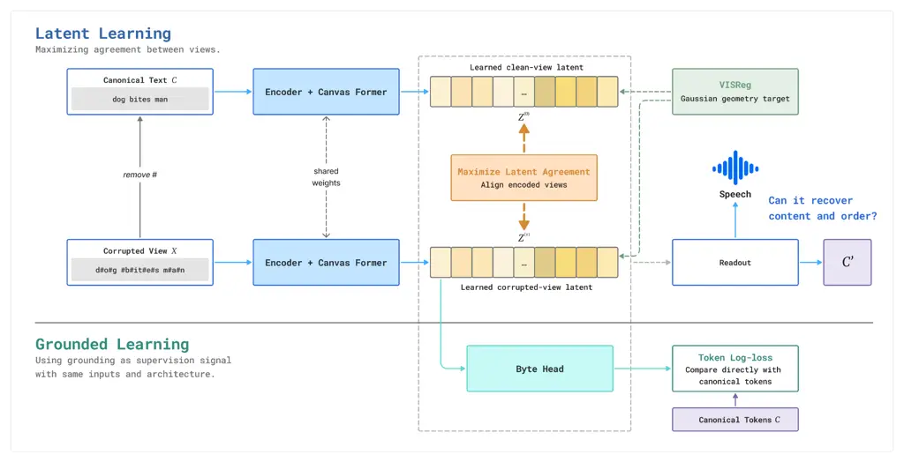

Figure 1: Latent agreement and canonical-token grounding. The
recoverable CL channel isolates access to ordered content; downstream
readouts test reconstruction and speech. Both objectives use the same
architecture.

## 1 Introduction

The information a text representation must preserve depends on how it
will be used. For identity retrieval, a representation may discard
substantial surface detail while retaining enough information to
distinguish relevant content. Sequential generation, however, requires a
downstream readout to recover the target-specific content and order
needed to control the output. In text-conditioned speech synthesis, for
instance, the generator must say the intended words in the intended
order, even when its input contains surface errors. Information treated
as nuisance or non-shared across views may therefore still matter
downstream (Wang et al., 2022). Canonicalization makes this requirement
testable: surface variations may be discarded, but the distinctions
needed to recover a specified clean sequence must remain
accessible (Tasawong et al., 2023; Lewis et al., 2020).

View-based self-supervised learning encourages agreement between related
inputs (Chen et al., 2020; Gao et al., 2021), while joint-embedding
predictive architectures (JEPAs) learn by predicting latent
targets (Assran et al., 2023; Assran et al., 2025). LeJEPA gives this
approach a geometric foundation: under its assumptions, isotropic
Gaussian representations minimize worst-case downstream risk, motivating
Sketched Isotropic Gaussian Regularization (SIGReg) (Balestriero and
LeCun, 2025). VISReg pursues this target through variance and
projected-shape constraints (Wu et al., 2026). Learning the encoder also
changes which target information its states retain. A favorable marginal
distribution does not determine the conditional target distribution, so
applying a geometric guarantee to sequential recovery additionally
requires preserving the distinctions needed to identify the target.

Our questions are: are view agreement and isotropic Gaussian
regularization sufficient to retain the ordered canonical content
available in text, and how do grounding and readout affect its recovery?
Answering this requires separating input ambiguity, representation loss,
and readout mismatch. We first show why agreement and even exact
Gaussianity leave target retention undetermined, then establish what
canonical anchors and token supervision constrain. A fixed-penalty ridge
analysis addresses the complementary case: information is preserved, yet
its accessibility changes with geometry and target alignment.

Length controls potential content: for alphabet size $`K`$ and length
$`\ell`$, sequence entropy is at most $`\ell\log K`$ (Cover and Thomas,
1991; Shannon, 1948). Controlled-length (CL) experiments supply target
lengths and use invertible corruption, so neither input ambiguity nor
length error can explain failed recovery. Parametrized-length (PL)
experiments then introduce natural corruption and predicted lengths,
before trained speech readouts test downstream consequences. Figure 1
summarizes this investigation, contrasting latent agreement with
canonical-token grounding and illustrating how downstream readouts test
whether the learned representations support recovery of the intended
content and order. Our contributions are as follows:

- $`\bullet`$
  Agreement and joint isotropic Gaussianity can coexist with zero target
  information. Nonconstant anchored codes retain information but can
  merge targets; token log-loss bounds the sufficiency gap, while ridge
  risk exposes target-dependent access.
- $`\bullet`$
  CANOPE’s controlled comparison finds near-perfect recovery with token
  grounding and poor access with latent agreement, despite recoverable
  inputs. In PL, nearly equal pooled ranks conceal sharply different
  recovery.
- $`\bullet`$
  The access contrast persists with trained speech readouts, while
  external evaluations separate canonical matching from semantic
  generalization.

## 2 Related Work

#### Joint embeddings and geometry.

SimCLR and VICReg combine cross-view agreement with representation
constraints (Chen et al., 2020; Bardes et al., 2022). I-JEPA predicts
target image regions; data2vec extends contextual latent prediction
across modalities (Assran et al., 2023; Baevski et al., 2022). LeJEPA
and VISReg target isotropic Gaussian geometry under explicit
assumptions (Balestriero and LeCun, 2025; Wu et al., 2026).

#### Task information and readouts.

InfoMin requires useful views to preserve task information (Tian et al.,
2020); augmentation-based identifiability depends on assumptions about
content and changing latent factors (von Kügelgen et al., 2021). Usable
information and the Decodable Information Bottleneck formalize
predictive-family constraints (Xu et al., 2020; Dubois et al., 2020).
RankMe provides an empirical rank diagnostic (Garrido et al., 2023).

#### Latent prediction for language.

LLM-JEPA studies language embedding objectives, and latent prediction
has been combined with masked-token reconstruction (Huang et al., 2025;
Boukhari, 2026). Recent work examines conditional concentration,
structured downstream geometry, and sequential latent prediction (Dinh
and Vo, 2026; Alvarez, 2026; Mostafa, 2026). Our focus is ordered
canonical content under a controlled, invertible corruption channel,
together with fixed-readout constraints and regularization location.

#### Canonical and semantic representations.

BART, TSDAE, and ByT5 establish noisy-to-clean supervision and robust
representations (Lewis et al., 2020; Wang et al., 2021; Xue et al.,
2022); typo-robust retrieval studies misspelling invariance (Tasawong et
al., 2023). Sentence-BERT, SimCSE, and Qwen3 provide embedding
references (Reimers and Gurevych, 2019; Gao et al., 2021; Zhang et al.,
2025); NegMPNet and SemAntoNeg address negation (Anschütz et al., 2023;
Vahtola et al., 2022). PAWS tests lexical-overlap shortcuts, and ColBERT
retains token interactions (Zhang et al., 2019; Khattab and Zaharia,
2020).

## 3 Sequential Content Sufficiency

We begin with the information a downstream task needs, before asking
what agreement and geometry guarantee about it. Proofs and extensions
appear in Appendix A.

### 3.1 What Is Preserved, and What Can a Readout Access?

Let $`C=(C_{1},\ldots,C_{L})`$ be a canonical sequence over an alphabet
$`\mathcal{A}`$ of size $`K`$, $`X`$ its corrupted view, and
$`Z_{M}\in\mathbb{R}^{M\times d}`$ an ordered latent canvas. Side
information $`S`$ is available to encoder and readout. CL and PL oracle
controls use $`S=L`$, $`M=L`$. For PL predicted-length inference, $`M`$
is predicted from $`X`$; take $`S`$ constant and $`Z_{M}`$ as a
variable-length object with observable shape. Detaching the length-head
input changes training gradients, not inference information.

A sequence readout assigns normalized probabilities $`q(C\mid Z,S)`$
under the stated routing policy. Conditional entropy $`H`$ and mutual
information $`I`$ use natural logarithms (nats); $`\mathbb{E}`$ denotes
population expectation and $`D_{\mathrm{KL}}`$ Kullback–Leibler
divergence. The notation $`C\perp Z\mid(X,S)`$ means conditional
independence, $`p(c,z\mid x,s)=p(c\mid x,s)p(z\mid x,s)`$ almost
everywhere, not orthogonality. Appendix E collects the relevant
identities.

###### Assumption 1 Evaluation information.

Regular conditional distributions (conditional probability laws given
observed variables) exist, $`H(C\mid S)<\infty`$, and
$`C\perp Z\mid(X,S)`$. The representation receives no target information
beyond the input and stated side information. Readouts access only
$`(Z,S)`$, without target-token prefixes or another target-token side
channel. Evaluated expected log-losses are finite.

A deterministic encoder $`F(X,S)`$ satisfies this requirement. We define
the content-sufficiency gap using conditional mutual information,

```math
\Delta_{\mathrm{info}}:=I(C;X\mid Z,S)=H(C\mid Z,S)-H(C\mid X,Z,S)=H(C\mid Z,S)-H(C\mid X,S). \tag{1}
```

The last equality uses Assumption 1 (Cover and Thomas, 1991, Chapter 2).
Equivalently,
$`\Delta_{\mathrm{info}}=I(C;X\mid S)-I(C;Z\mid S)\geq 0`$. This
existing information quantity measures what processing loses: zero gap
means that $`(Z,S)`$ preserves the input-conditioned target posterior
almost surely (Appendix A.1).

###### Lemma 1 Log-loss decomposition.

Under Assumption 1, every normalized readout $`q`$ with finite expected
log-loss satisfies

```math
\mathbb{E}[-\log q(C\mid Z,S)]={}\underbrace{H(C\mid X,S)}_{\text{input ambiguity}}+\underbrace{\Delta_{\mathrm{info}}}_{\begin{subarray}{c}\text{representation}\\
\text{loss}\end{subarray}}+\underbrace{\mathbb{E}_{Z,S}D_{\mathrm{KL}}\!\left(p(\cdot\mid Z,S)\!\|q(\cdot\mid Z,S)\right)}_{\text{readout mismatch}}. \tag{2}
```

where $`p`$ is the true conditional target distribution.

The terms separate unavoidable input uncertainty, representation loss,
and readout mismatch. A recoverable channel has $`H(C\mid X,S)=0`$,
hence $`\Delta_{\mathrm{info}}=H(C\mid Z,S)`$. Low population log-loss
upper-bounds the gap; high loss need not imply information loss because
the readout may be restricted or poorly fitted (Xu et al., 2020; Dubois
et al., 2020). Appendix A.1 separates family limits from fitting error.
Squared loss similarly separates input Bayes risk, its increase after
encoding, and readout error (Appendix A.2), connecting target
preservation to downstream-risk guarantees.

#### Length and ordered content.

For each $`\ell`$ with positive probability, the entropy chain rule
gives

```math
H(C\mid L=\ell)=\sum_{t=1}^{\ell}H(C_{t}\mid C_{<t},L=\ell)\leq\ell\log K. \tag{3}
```

Here $`C_{<t}=(C_{1},\ldots,C_{t-1})`$. Since $`L`$ is determined by
$`C`$, $`H(C)=H(L)+H(C\mid L)`$ when finite. Conditioning on $`L`$
removes length information, not token dependence. CL fixes each
example’s target length, not a common corpus length (Appendix E).

### 3.2 Why Agreement and Isotropy Do Not Guarantee Content

Our counterexample imposes a stronger condition than the empirical
diagnostics. Isotropic covariance means $`\cnCov(R)=\sigma^{2}I`$,
$`\sigma^{2}>0`$; standard Gaussianity additionally requires
$`R\sim\mathcal{N}(0,I)`$. We impose
$`\cnvec Z\sim\mathcal{N}(0,I_{D})`$ on the entire canvas, where
$`\cnvec`$ stacks entries and $`D=\ell d`$, rather than only pooled
vectors or sampled rows.

Perfect agreement means $`Z^{(1)}=Z^{(2)}`$ almost surely (a.s.), with
zero squared disagreement
$`\mathcal{L}_{\mathrm{dis}}=\mathbb{E}\|Z^{(1)}-Z^{(2)}\|_{F}^{2}`$.
Even this agreement and joint Gaussianity do not force target retention.

###### Theorem 2 Invariant Gaussian representations without target information.

For every nonconstant $`C\in\mathcal{A}^{\ell}`$, there exist
recoverable views and a shared deterministic encoder satisfying

```math
H(C\mid X^{(v)})=0,\quad Z^{(1)}=Z^{(2)}\ \mathrm{a.s.},\qquad\cnvec Z^{(v)}\sim\mathcal{N}(0,I_{D}),\quad I(C;Z^{(v)})=0. \tag{4}
```

Thus $`\mathcal{L}_{\mathrm{dis}}=0`$, its global minimum.

#### Construction and interpretation.

Let $`X^{(v)}=(C,U,N_{v})`$, where $`U\sim\mathcal{N}(0,I_{D})`$ is
shared but independent of $`C`$, and $`N_{v}`$ is independent
view-specific noise. Output only $`U`$, reshaped as a canvas. The input
determines $`C`$, but the representation discards it while satisfying
agreement and Gaussianity. Two equiprobable word orders are therefore
undecodable beyond chance. Appendix A.3 proves the claim. Exact
continuous Gaussianity is impossible for a deterministic finite-string
encoder; Appendix A.4 gives finite-string counterparts with identity
covariance and arbitrarily small Wasserstein-2 distance to a Gaussian.

###### Proposition 3 Canonical-anchor restriction.

Let $`X^{(0)}=a(C)`$ be a deterministic canonical anchor, $`C`$
finite-valued, and the shared encoder deterministic. Exact agreement
with the anchor forces $`Z=g(C)`$ and $`I(C;Z)=H(Z)`$. Nonconstant
representations retain some information, but can still merge distinct
sequences.

The anchor has no extra shared randomness, so it excludes the
zero-information construction unless the representation is constant.
Conditionally independent identically distributed views given $`C`$
yield the same conclusion for finite-second-moment outputs
(Appendix A.5). Anchoring thus restricts the counterexample; token
supervision specifies which distinctions must survive. CL latent arms
use a differentiable mean of selected views including the clean view,
while PL0 uses a detached clean target (Section 5.2).

## 4 Readout Constraints and Target-Dependent Geometry

We next connect token supervision to retained distinctions, then isolate
how geometry affects readout access when information is preserved.

### 4.1 What Canonical Token Supervision Constrains

Fix $`L=\ell`$, $`S=L`$ as in CL and the PL oracle control. Token
grounding predicts each canonical token from its canvas position. For a
fixed head $`q_{W}(\cdot\mid z)=\cnsoftmax(Wz+b)`$,
$`W\in\mathbb{R}^{K\times d}`$, $`b\in\mathbb{R}^{K}`$, a common logit
shift leaves probabilities unchanged. Let
$`P_{K}=I_{K}-\mathbf{1}\mathbf{1}^{\top}/K`$, $`A=P_{K}W`$, and
$`r_{W}=\cnrank(A)`$. The population average token log-loss is

```math
\mathcal{L}_{\mathrm{tok}}=\frac{1}{\ell}\mathbb{E}\sum_{t=1}^{\ell}-\log q_{W}(C_{t}\mid z_{t}). \tag{5}
```

###### Proposition 4 Observable directions and content bound.

For finite logits, fixed $`(W,b)`$, and any perturbation
$`\delta\in\mathbb{R}^{d}`$,

```math
q_{W}(\cdot\mid z+\delta)=q_{W}(\cdot\mid z)\iff A\delta=0,\qquad r_{W}\leq\min(d,K-1). \tag{6}
```

Under Assumption 1,
$`0\leq\Delta_{\mathrm{info}}\leq H(C\mid Z,S)\leq\ell\mathcal{L}_{\mathrm{tok}}`$.

The fixed head observes logit differences and is blind to the
$`d-r_{W}`$ dimensional null space $`\ker A`$. Applying Lemma 1 to
$`\prod_{t}q_{W}(C_{t}\mid z_{t})`$ gives the bound without assuming
independent true tokens. Low population loss over every target position
certifies a small gap, but does not constrain all latent directions.
Appendix A.6 proves the variable-length and curvature extensions;
prefix-only supervision cannot certify the suffix.

#### Local access is stricter than full-canvas access.

A local head sees only $`z_{t}`$, whereas a sequence readout sees all of
$`Z`$. For independent fair bits and $`Z=(C_{2},C_{1})`$, each local
prediction is at chance, but swapping positions recovers the target.
Equation (26) decomposes optimal local loss into full-canvas
uncertainty, residual token dependence, and information at other
positions. A fixed linear head is further restricted; its failure alone
cannot prove information loss.

### 4.2 Why Higher Effective Rank Can Help or Hurt a Fixed Readout

We rescale representation directions while preserving target
information, then fit a population predictor with fixed ridge penalty.
This isolates geometry–readout interaction without finite-sample
estimation error.

#### The target and its coefficients.

Let $`G\sim\mathcal{N}(0,I_{d})`$ and $`Y=\theta^{\top}G+\varepsilon`$.
Fixed $`\theta`$ selects target-relevant factors; $`w`$ denotes learned
readout coefficients and $`\|\cdot\|`$ the Euclidean norm.

###### Assumption 2 Population ridge model.

Fix $`\theta\neq 0`$, penalty $`\mu>0`$, and noise with
$`\mathbb{E}[\varepsilon\mid G]=0`$ and
$`\mathbb{E}\varepsilon^{2}=\sigma^{2}<\infty`$. For a positive-definite
covariance $`\Sigma`$ with total variance $`\cntr\Sigma=d`$, define

```math
Z_{\Sigma}=\Sigma^{1/2}G,\qquad w_{\Sigma}=\arg\min_{w}\left\{\mathbb{E}(Y-w^{\top}Z_{\Sigma})^{2}+\mu\|w\|^{2}\right\}. \tag{7}
```

Invertibility, $`G=\Sigma^{-1/2}Z_{\Sigma}`$, preserves target
information and unrestricted risk $`\sigma^{2}`$. Fixing total variance
prevents trivial penalty reduction by uniformly scaling features.

#### Spectrum, effective rank, and excess risk.

In a covariance eigenbasis, let $`\lambda_{i}`$ be variances and
$`\theta_{i}`$ target coefficients. With
$`p_{i}=\lambda_{i}/\cntr\Sigma`$, define

```math
r_{\mathrm{eff}}(\Sigma)=\exp\!\left(-\sum_{i=1}^{d}p_{i}\log p_{i}\right). \tag{8}
```

Effective rank approaches 1 for one-direction concentration and equals
$`d`$ for equal eigenvalues. It measures neither target alignment nor
Gaussian shape; unlike RankMe (Garrido et al., 2023), it uses covariance
eigenvalues. Ridge normal equations give excess risk, excluding the
penalty:

```math
R_{\mu}:=\mathbb{E}(Y-w_{\Sigma}^{\top}Z_{\Sigma})^{2}-\sigma^{2}=\mu^{2}\sum_{i=1}^{d}\frac{\theta_{i}^{2}}{(\lambda_{i}+\mu)^{2}}. \tag{9}
```

Small-variance target directions require larger coefficients and are
penalized more strongly (derivation: Appendix A.7).

#### A path toward isotropy.

Fix the eigenbasis and split it into blocks of sizes $`r`$ and $`d-r`$,
with $`1\leq r<d`$. Set their variances to $`a=[d-(d-r)\rho]/r`$ and
$`b=\rho`$, where $`0<\rho<1`$. This preserves total variance $`d`$. As
$`\rho`$ increases, both variances approach 1 and effective rank
increases. Let $`\eta=\sum_{i\leq r}\theta_{i}^{2}/\|\theta\|^{2}`$ be
the target’s energy share in the first block. This analytical family is
not an assumed trained-model spectrum.

###### Theorem 5 Target-alignment threshold.

Under Assumption 2, along the fixed-basis family above,

```math
\cnsign\!\left(\frac{dR_{\mu}}{dr_{\mathrm{eff}}}\right)=\cnsign(\eta-\eta_{*}),\qquad\eta_{*}:=\frac{r(a+\mu)^{3}}{r(a+\mu)^{3}+(d-r)(b+\mu)^{3}}. \tag{10}
```

Higher effective rank lowers risk when $`\eta<\eta_{*}`$ and raises it
when $`\eta>\eta_{*}`$. Equality gives zero local derivative. The
threshold depends on $`\rho`$, so this is a local comparison, not a
universal ordering of representations (proof: Appendix A.8).

#### A two-dimensional example.

For $`d=2`$, $`r=\mu=1`$, $`\sigma^{2}=0`$, increasing $`\rho`$ from 0.2
to 0.8 changes the spectrum from $`(1.8,0.2)`$ to $`(1.2,0.8)`$ and
effective rank from 1.3841 to 1.9601. Risk rises from 0.1276 to 0.2066
for $`\theta=(1,0)^{\top}`$, but falls from 0.6944 to 0.3086 for
$`\theta=(0,1)^{\top}`$. No information is lost; variance moves away
from the first target direction toward the second (Figure 4).

#### Scope and implication.

Penalty retuning is excluded; excess risk vanishes as $`\mu\to 0`$ for
fixed positive-definite $`\Sigma`$. Yet $`I_{d}`$ uniquely minimizes
worst-target risk at fixed target norm and trace $`d`$ (Appendix A.9).
LeJEPA-type guarantees (Balestriero and LeCun, 2025) therefore coexist
with target-specific differences: rank changes need not reflect
information changes.

## 5 CANOPE Framework

CANOPE (Canonicalization-Oriented Predictive Embedding) makes these
distinctions testable by mapping corrupted text to ordered latent
canvases. Its common architecture separates the choice of predictive
target, regularization location, and readout.

### 5.1 Architecture and Canvas Length

For input $`x`$ containing $`N`$ UTF-8 bytes, a Transformer encoder
produces $`H\in\mathbb{R}^{N\times d}`$ (Vaswani et al., 2017). A
resampler $`\mathcal{R}_{N\to M}`$ forms $`M`$ query vectors from $`H`$;
sinusoidal positions $`P_{M}`$ specify their output order. A noncausal
decoder attends to both these queries and the encoder states.

```math
H=E_{\vartheta}(x),\qquad p_{t}=\cnsoftmax(Wz_{t}+b),\qquad Z_{M}=D_{\vartheta}\!\left(\operatorname{LN}(\mathcal{R}_{N\to M}(H)+P_{M}),H\right). \tag{11}
```

Here $`\vartheta`$ denotes network parameters, distinct from ridge
target $`\theta`$, and $`\operatorname{LN}`$ is layer normalization. The
head predicts 256 bytes and PAD. All positions are computed in parallel
without target-token prefixes (Gu et al., 2018). Runs use width 512,
four encoder blocks, two decoder blocks, and eight heads (Appendix B.2).

Oracle routing sets $`M=L`$; predicted routing uses
$`M=\max(1,\lceil\widehat{L}\rceil)`$ from a learned head; input routing
sets $`M=N`$ as a stress test. The resampler Gaussian-averages valid
source states, with explicit identity at $`M=N`$ (Appendix B.2). CL
removes final decoder normalization; PL retains it, so raw geometry
comparisons stay within each series.

### 5.2 Objectives and the CL/PL Comparisons

#### Controlled-Length (CL): Isolate the predictive objective and regularization location.

CL uses oracle lengths. Grounding (G) averages canonical-byte negative
log-probabilities; latent agreement (L) minimizes squared distance to a
differentiable mean of designated views. Both add
$`0.01\mathcal{R}_{\mathrm{VIS}}`$, with no application auxiliary loss
(Appendix B.3).

Pooled (P) regularizes mean canvas rows; sampled token (T) regularizes
one uniformly sampled valid position per item, shared across views.
CL-GP/GT/LP/LT form a two-by-two design with equal vector counts per
batch; T constrains a position mixture, not the joint canvas. The four
configurations are summarized in Table 6.

Our VISReg adaptation penalizes coordinate means and nonunit standard
deviations, then matches sorted standardized projections to Gaussian
quantiles. Its center, scale, and shape constraints do not certify exact
Gaussianity. Equation (48) specifies normalization, stop-gradients, and
256 projection directions.

#### Parametrized-Length (PL): Compare parametrized-length recipes.

The PL setting adds objectives for length, surface invariance, and
premise–negation distinctions. Its token-grounded recipe is

```math
\mathcal{L}_{\mathrm{app}}={}\mathcal{L}_{\mathrm{CE}}+\eta_{\mathrm{e}}\mathcal{L}_{\mathrm{empty}}+\gamma\mathcal{L}_{\mathrm{len}}+\alpha\mathcal{L}_{\mathrm{inv}}+\beta\mathcal{L}_{\mathrm{neg}}+\zeta\mathcal{R}_{\mathrm{VIS}}. \tag{12}
```

CE supervises canonical bytes and a short PAD band; empty-tail loss
discourages confident later predictions; length loss predicts $`L`$;
pooled invariance aligns views; negation loss ranks same-content anchors
above negated and unrelated anchors. We use
$`(\eta_{\mathrm{e}},\gamma,\alpha,\beta)=(0.1,1,0.5,0.3)`$ and pooled
VISReg weights $`\zeta=0.1/0.5`$ for PL2/PL3 (Appendix B.4).

PL0 uses detached-anchor latent agreement, geometric weight 0.3, and
detached token-head inputs: token loss trains the head but not the
backbone. PL0–PL2 thus compares complete recipes (Appendix B.5); Table 7
maps all variants to checkpoints.

### 5.3 Readouts: Identity Retrieval and Token Reconstruction

Retrieval matches a corrupted query to its canonical target in a fixed
gallery. We compare either mean-canvas cosines or the average cosine at
16 linearly interpolated relative positions. The latter retains coarse
order across different lengths without target-token alignment; it does
not certify word-order understanding. Appendix B.1 gives the exact
score.

Native reconstruction uses per-position argmax and stops at PAD. These
diagnostics fit no new probes and exclude untrained CL-LP/LT token
heads. Section 6.4 separately trains a speech readout. Each task
measures access through a specified readout, not
$`\Delta_{\mathrm{info}}`$ itself.

## 6 Experiments and Results

We test the contrast in Figure 1 on 40,000 validation targets per
series, with one training seed and 500 paired bootstrap resamples.
Pretraining uses English–Singlish G2P text (English–Singlish G2P, 2026),
without phonemes; Appendix B.6 details data and evaluation.

Figure 2: CL relative-position retrieval with oracle or input lengths
(40,000 targets; level 0: clean). CL-GT is strongly length-sensitive
(Table 9).

### 6.1 Controlled Content Recovery

Under recoverable severity 3 and oracle lengths, CL-GP/GT reach
99.985%/99.980% retrieval and 98.97%/98.78% exact reconstruction, while
CL-LP/LT reach only 0.52%/0.75% retrieval (Table 10). Grounding enables
recovery at either location.

Input-length routing instead leaves CL-GP/GT at 97.48%/16.53% retrieval
(Figure 2); CL-GP’s 91.84% CER separates identity matching from
reconstruction. Centering CL-LT raises clean retrieval from 0.76% to
100%, but corrupted retrieval only from 0.75% to 1.58%, revealing clean
distinctions without restoring cross-view access (Appendix C.2).

Figure 3: PL identity access despite similar pooled ranks: oracle (a)
and predicted (b) lengths, 40,000 targets per query. Checkpoints and
reconstruction: Table 1.

### 6.2 Natural Corruption

With natural severity 3 and oracle lengths, PL0/PL2 have nearly equal
pooled ranks (15.76/15.82), yet retrieval differs sharply
(13.46%/98.80%; Figure 3). Rank misses this contrast.

| Model   | Eff. rank |        | R1 $`\uparrow`$ |       | CER $`\downarrow`$ | EM $`\uparrow`$ |
| ------- | --------- | ------ | --------------- | ----- | ------------------ | --------------- |
|         | Pool      | Token  | Pool            | Rel.  |                    |                 |
| PL0     | 15.76     | 15.76  | 6.15            | 6.31  | 87.50              | 0.00            |
| PL1     | 4.79      | 9.72   | 86.76           | 97.34 | 21.38              | 12.81           |
| PL2     | 15.82     | 33.04  | 94.45           | 98.80 | 23.09              | 12.64           |
| PL3     | 36.06     | 65.11  | 97.57           | 99.19 | 22.51              | 12.53           |
| PL4     | 83.59     | 126.10 | 91.31           | 99.30 | 21.63              | 12.80           |
| PL5^(†) | 10.19     | 36.46  | 68.68           | 78.41 | 28.35              | 6.68            |
| PL6     | 7.28      | 16.89  | 82.72           | 97.24 | 21.95              | 12.68           |
| PL7     | 6.16      | 19.13  | 74.44           | 96.63 | 22.46              | 12.64           |

PL0: latent agreement; PL1: token baseline; PL2/3: weak/stronger VISReg;
PL4/5/6: no invariance/negation/empty loss; PL7: zero second margin.
PL4–7 modify the historical unregularized recipe, not PL2. ^(†)PL5 has a
different training budget and is excluded from controlled component
comparisons. Checkpoint IDs: Table 7.

Table 1: All evaluated PL setting checkpoints at natural severity 3.
Rank and reconstruction use oracle lengths; retrieval uses predicted
lengths. R1, CER, and exact match (EM) are percentages.

Predicted lengths and centering leave this contrast intact. PL2’s 23.09%
CER and 12.64% exact match nevertheless limit what retrieval
establishes, while PL7’s positional gain shows that readout choice also
matters (Table 1).

### 6.3 External Identity and Semantic Transfer

LexNorm2015 (Baldwin et al., 2015) tests natural noncanonical text
against frozen references (Table 2).

| Model        | R1 (%) $`\uparrow`$ | MRR $`\uparrow`$ | WS3 (%) $`\uparrow`$ |
| ------------ | ------------------- | ---------------- | -------------------- |
| PL0          | 23.34               | 0.281            | 1.96                 |
| PL2          | 88.82               | 0.908            | 83.82                |
| PL3          | 97.37               | 0.979            | 81.20                |
| ByT5 encoder | 87.48               | 0.894            | 22.05                |
| SimCSE       | 98.71               | 0.991            | 98.71                |
| NegMPNet     | 99.12               | 0.994            | 99.12                |
| Qwen3-0.6B   | 99.69               | 0.998            | 99.64                |

Table 2: LexNorm identity retrieval (1,941 queries, 1,954 targets). R1:
original Recall@1; WS3: strongest whitespace perturbation. CANOPE uses
predicted lengths and relative positions; external readouts are in
Appendix B.6.

PL3 leads CANOPE on original queries, but PL2 leads under whitespace
perturbation. Relative positions improve both (Figure 9), yet weak
external semantics limit generalization (Table 4). Strong synthetic-foil
results (Table 4) indicate sensitivity to specified changes, rather than
general semantic equivalence.

Table 3: External semantic results on complete common cohorts. SAN
(SemAntoNeg): three-choice accuracy (%); PAWS: ROC AUC; STS-B and
packaged SICK-R: Spearman correlation. CANOPE uses predicted lengths and
relative positions.

| Model        | SAN $`\uparrow`$ | PAWS $`\uparrow`$ | STS-B $`\uparrow`$ | SICK-R $`\uparrow`$ |
| ------------ | ---------------- | ----------------- | ------------------ | ------------------- |
| PL0          | 26.24            | 0.488             | 0.003              | 0.143               |
| PL2          | 2.28             | 0.585             | 0.154              | 0.333               |
| PL3          | 9.11             | 0.587             | 0.177              | 0.375               |
| ByT5 encoder | 8.12             | 0.584             | 0.248              | 0.283               |
| SimCSE       | 63.80            | 0.647             | 0.842              | 0.808               |
| NegMPNet     | 69.57            | 0.623             | 0.842              | 0.767               |
| Qwen3-0.6B   | 45.11            | 0.684             | 0.846              | 0.812               |

Table 4: Synthetic semantic-foil decisions (%): 512 base groups per
type, two directions per group. Neg.: negation; Num.: number; Role: role
swap. Chance is 50%. All encoders have zero failures.

| Model        | Neg. $`\uparrow`$ | Num. $`\uparrow`$ | Entity $`\uparrow`$ | Role $`\uparrow`$ |
| ------------ | ----------------- | ----------------- | ------------------- | ----------------- |
| PL0          | 42.48             | 50.39             | 79.10               | 81.93             |
| PL2          | 100.00            | 90.62             | 100.00              | 100.00            |
| PL3          | 96.19             | 97.75             | 100.00              | 100.00            |
| ByT5 encoder | 85.94             | 53.42             | 67.09               | 57.71             |
| SimCSE       | 100.00            | 100.00            | 100.00              | 100.00            |
| NegMPNet     | 100.00            | 100.00            | 100.00              | 100.00            |
| Qwen3-0.6B   | 98.63             | 97.85             | 100.00              | 57.71             |

Cohort sizes: 3,152 groups; 8,000 pairs; 1,379 pairs; and 9,927 pairs,
respectively. The SICK-derived split is the packaged mteb/sickr-sts test
split, not a claim about the original SICK test-set size.

### 6.4 Speech from Frozen Canvases

We train MatchaTTS (Mehta et al., 2024) on frozen PL0/PL2
predicted-length canvases, without decoded text, alongside an end-to-end
phoneme baseline. All use identical LJSpeech pairs, 70% corrupted
inputs, and pretrained acoustic modules (Appendix D).

| System              | Clean $`\downarrow`$ | Augmented $`\downarrow`$ | $`\Delta`$ |
| ------------------- | -------------------- | ------------------------ | ---------- |
| MatchaTTS           | 2.21                 | 10.93                    | +8.71      |
| Frozen PL2 + Matcha | 13.60                | 21.54                    | +7.94      |
| Frozen PL0 + Matcha | 99.12                | 99.22                    | +0.09      |

Table 5: Downstream speech WER (% $`\downarrow`$); 3,930 utterances and
66,489 reference words per cell. $`\Delta`$: augmented minus clean WER
(percentage points), reported descriptively.

Whisper large-v3 (Radford et al., 2023; OpenAI, 2023) gives corrupted
WER of 21.54% for PL2 versus 99.22% for PL0, extending the contrast to
speech (Table 5). The end-to-end baseline remains stronger (10.93%),
despite PL2’s smaller degradation.

## 7 Discussion

The central issue is what an agreement target requires the encoder to
preserve. Both CL objectives see canonical text, but the latent target
is learned along with the encoder. If two sequences become
indistinguishable, agreement with their encoded anchors need not
separate them again. Proposition 3 makes this precise at exact
agreement. A nonconstant anchored code retains some information, yet can
still merge targets. Canonical-token grounding instead penalizes
distinctions lost at the supervised positions. The relevant difference
is a fixed content target versus a jointly learned latent target, not
cross-entropy versus squared loss itself.

CL connects this distinction to Lemma 1. Invertible corruption and
oracle lengths make input ambiguity zero, leaving representation loss
and readout mismatch as the possible sources of failure. Near-perfect
grounded reconstruction and low empirical token loss are consistent with
Proposition 4, which bounds the gap through population token loss while
leaving latent null-space directions unconstrained. Failed latent
retrieval cannot separate the remaining terms, but shows that agreement
training left available content difficult to access through these
readouts.

The centering control further explains why small disagreement is an
inadequate diagnostic. CL-LT has a large common mean and tiny residual
variance (Appendix C.2); small absolute discrepancies can then coexist
with unstable content distinctions. Removing the mean exposes clean
identity but barely helps corrupted views. This behavior is consistent
with the scale mechanism in Eq. (50): shrinking residuals reduces raw
disagreement without improving their separation relative to corruption.
Theorem 2 establishes a stronger logical limit under ideal geometry,
while these trained states expose a practical failure before that ideal
is attained.

This also clarifies the relationship to LeJEPA. Its optimality results
concern downstream risk under specified learner, target, and
distributional assumptions (Balestriero and LeCun, 2025); a learned
encoder must additionally preserve the target-conditioned information to
which a risk guarantee applies. Equation (17) separates the resulting
Bayes-risk increase from readout error. Our ridge analysis holds the
former at zero by invertibility, and Theorem 5 shows how target
alignment still changes fixed-penalty access. Isotropy remains minimax
in that model (Appendix A.9). Thus favorable worst-target geometry and
poor access to a particular target are compatible. PL’s matched pooled
ranks support the need for target-specific evaluation; they neither
certify joint Gaussianity nor instantiate the ridge spectrum path.

CL identifies a controlled access gap, PL extends it to natural
corruption, and speech shows its downstream consequence.
Retrieval–reconstruction differences and weak semantics delimit what
canonical matching establishes. Causal attribution remains strongest in
CL: PL compares complete recipes with different auxiliary losses and
weights. Bootstrap intervals omit seed variation; speech uses validation
data with pretraining exposure, and frontend, freezing, and alignment
differences remain. ASR WER measures lexical fidelity, not naturalness.
These factors motivate broader readout and pretraining-disjoint
evaluations.

## 8 Conclusion

Agreement and geometric regularity alone do not guarantee recoverable
sequential content. CANOPE’s controlled experiments reveal recovery
failures despite recoverable inputs and known target lengths.
Canonical-token grounding supports accurate recovery, with benefits
extending to downstream speech. These findings motivate evaluating
ordered-content recovery alongside geometric diagnostics for sequential
generation.

## References

- Alvarez (2026) R. J. Alvarez Beyond isotropy in JEPAs: hamiltonian
  geometry and symplectic prediction. arXiv preprint arXiv:2605.20107.
  External Links: [Link](https://arxiv.org/abs/2605.20107) Cited by: §2.
- Anschütz et al. (2023) M. Anschütz, D. Miguel Lozano, and G. Groh This
  is not correct! negation-aware evaluation of language generation
  systems. In Proceedings of the 16th International Natural Language
  Generation Conference, External Links:
  [Link](https://arxiv.org/abs/2307.13989) Cited by: §B.6, §2.
- Assran et al. (2025) M. Assran, A. Bardes, D. Fan, Q. Garrido, R.
  Howes, M. Komeili, M. Muckley, A. Rizvi, C. Roberts, K. Sinha, A.
  Zholus, S. Arnaud, A. Gejji, A. Martin, F. R. Hogan, D. Dugas, P.
  Bojanowski, V. Khalidov, P. Labatut, F. Massa, M. Szafraniec, K.
  Krishnakumar, Y. Li, X. Ma, S. Chandar, F. Meier, Y. LeCun, M. Rabbat,
  and N. Ballas V-JEPA 2: self-supervised video models enable
  understanding, prediction and planning. arXiv preprint
  arXiv:2506.09985. External Links:
  [Document](https://dx.doi.org/10.48550/arXiv.2506.09985),
  [Link](https://arxiv.org/abs/2506.09985) Cited by: §1.
- Assran et al. (2023) M. Assran, Q. Duval, I. Misra, P. Bojanowski, P.
  Vincent, M. Rabbat, Y. LeCun, and N. Ballas Self-supervised learning
  from images with a joint-embedding predictive architecture. In
  Proceedings of the IEEE/CVF Conference on Computer Vision and Pattern
  Recognition, External Links: [Link](https://arxiv.org/abs/2301.08243)
  Cited by: §1, §2.
- Baevski et al. (2022) A. Baevski, W. Hsu, Q. Xu, A. Babu, J. Gu,
  and M. Auli Data2vec: a general framework for self-supervised learning
  in speech, vision and language. In Proceedings of the 39th
  International Conference on Machine Learning, External Links:
  [Link](https://arxiv.org/abs/2202.03555) Cited by: §2.
- Baldwin et al. (2015) T. Baldwin, M. C. de Marneffe, B. Han, Y.
  Kim, A. Ritter, and W. Xu Shared tasks of the 2015 workshop on noisy
  user-generated text: twitter lexical normalization and named entity
  recognition. In Proceedings of the Workshop on Noisy User-generated
  Text, External Links: [Link](https://aclanthology.org/W15-4319/) Cited
  by: §H.4, §6.3.
- Balestriero and LeCun (2025) R. Balestriero and Y. LeCun LeJEPA:
  provable and scalable self-supervised learning without the heuristics.
  arXiv preprint arXiv:2511.08544. External Links:
  [Document](https://dx.doi.org/10.48550/arXiv.2511.08544),
  [Link](https://arxiv.org/abs/2511.08544) Cited by: §A.9, §1, §2, §4.2,
  §7.
- Bardes et al. (2022) A. Bardes, J. Ponce, and Y. LeCun VICReg:
  variance-invariance-covariance regularization for self-supervised
  learning. In International Conference on Learning Representations,
  External Links: [Link](https://arxiv.org/abs/2105.04906) Cited by: §2.
- Boukhari (2026) A. Boukhari Predict and reconstruct: joint objectives
  for self-supervised language representation learning. arXiv preprint
  arXiv:2606.05173. External Links:
  [Link](https://arxiv.org/abs/2606.05173) Cited by: §2.
- Cer et al. (2017) D. Cer, M. Diab, E. Agirre, I. Lopez-Gazpio, and L.
  Specia SemEval-2017 task 1: semantic textual similarity multilingual
  and crosslingual focused evaluation. In Proceedings of the 11th
  International Workshop on Semantic Evaluation, External Links:
  [Link](https://aclanthology.org/S17-2001/) Cited by: §H.4.
- Chen and Kan (2013) T. Chen and M. Kan Creating a live, public short
  message service corpus: the NUS SMS corpus. Language Resources and
  Evaluation 47, pp. 299–335. External Links:
  [Document](https://dx.doi.org/10.1007/s10579-012-9197-9),
  [Link](https://doi.org/10.1007/s10579-012-9197-9) Cited by: §B.6.
- Chen et al. (2020) T. Chen, S. Kornblith, M. Norouzi, and G. Hinton A
  simple framework for contrastive learning of visual representations.
  In Proceedings of the 37th International Conference on Machine
  Learning, Proceedings of Machine Learning Research, Vol. 119,
  pp. 1597–1607. External Links:
  [Link](https://proceedings.mlr.press/v119/chen20j.html) Cited by: §1,
  §2.
- Cover and Thomas (1991) T. M. Cover and J. A. Thomas Elements of
  information theory. John Wiley & Sons. External Links:
  [Link](https://www.cs.columbia.edu/~vh/courses/LexicalSemantics/Association/Cover&Thomas-Ch2.pdf)
  Cited by: Appendix E, §1, §3.1.
- Dinh and Vo (2026) A. T. D. Dinh and K. N. H. Vo The JEPA paradox in
  language: the geometry of linguistic alternatives. arXiv preprint
  arXiv:2607.23531. External Links:
  [Link](https://arxiv.org/abs/2607.23531) Cited by: §2.
- Dubois et al. (2020) Y. Dubois, D. Kiela, D. J. Schwab, and R.
  Vedantam Learning optimal representations with the decodable
  information bottleneck. In Advances in Neural Information Processing
  Systems, Vol. 33. External Links:
  [Link](https://arxiv.org/abs/2009.12789) Cited by: §2, §3.1.
- English–Singlish G2P (2026) English–singlish G2P corpus. Note: Derived
  compilation assembled by the authors. Component sources are credited
  separately. External Links:
  [Link](https://huggingface.co/datasets/avalonai/english-singlish-g2p)
  Cited by: §B.6, §6.
- Gao et al. (2021) T. Gao, X. Yao, and D. Chen SimCSE: simple
  contrastive learning of sentence embeddings. In Proceedings of the
  2021 Conference on Empirical Methods in Natural Language Processing,
  pp. 6894–6910. External Links:
  [Document](https://dx.doi.org/10.18653/v1/2021.emnlp-main.552),
  [Link](https://aclanthology.org/2021.emnlp-main.552/) Cited by: §1,
  §2.
- Garrido et al. (2023) Q. Garrido, R. Balestriero, L. Najman, and Y.
  LeCun RankMe: assessing the downstream performance of pretrained
  self-supervised representations by their rank. In Proceedings of the
  40th International Conference on Machine Learning, Proceedings of
  Machine Learning Research, Vol. 202, pp. 10929–10974. External Links:
  [Link](https://proceedings.mlr.press/v202/garrido23a.html) Cited by:
  §2, §4.2.
- Gu et al. (2018) J. Gu, J. Bradbury, C. Xiong, V. O. K. Li, and R.
  Socher Non-autoregressive neural machine translation. In International
  Conference on Learning Representations, External Links:
  [Link](https://arxiv.org/abs/1711.02281) Cited by: §5.1.
- Huang et al. (2025) H. Huang, Y. LeCun, and R. Balestriero LLM-JEPA:
  large language models meet joint embedding predictive architectures.
  arXiv preprint arXiv:2509.14252. External Links:
  [Link](https://arxiv.org/abs/2509.14252) Cited by: §2.
- Ito and Johnson (2017) K. Ito and L. Johnson The LJ Speech dataset.
  External Links: [Link](https://keithito.com/LJ-Speech-Dataset/) Cited
  by: §B.6, §D.1.
- Khattab and Zaharia (2020) O. Khattab and M. Zaharia ColBERT:
  efficient and effective passage search via contextualized late
  interaction over BERT. In Proceedings of the 43rd International ACM
  SIGIR Conference on Research and Development in Information Retrieval,
  External Links: [Link](https://arxiv.org/abs/2004.12832) Cited by: §2.
- Kong et al. (2020) J. Kong, J. Kim, and J. Bae HiFi-GAN: generative
  adversarial networks for efficient and high fidelity speech synthesis.
  In Advances in Neural Information Processing Systems, Vol. 33,
  pp. 17022–17033. External Links:
  [Link](https://proceedings.neurips.cc/paper/2020/hash/c5d736809766d46260d816d8dbc9eb44-Abstract.html)
  Cited by: §D.1.
- Lewis et al. (2020) M. Lewis, Y. Liu, N. Goyal, M. Ghazvininejad, A.
  Mohamed, O. Levy, V. Stoyanov, and L. Zettlemoyer BART: denoising
  sequence-to-sequence pre-training for natural language generation,
  translation, and comprehension. In Proceedings of the 58th Annual
  Meeting of the Association for Computational Linguistics,
  pp. 7871–7880. External Links:
  [Document](https://dx.doi.org/10.18653/v1/2020.acl-main.703),
  [Link](https://aclanthology.org/2020.acl-main.703/) Cited by: §1, §2.
- Marelli et al. (2014) M. Marelli, S. Menini, M. Baroni, L.
  Bentivogli, R. Bernardi, and R. Zamparelli A SICK cure for the
  evaluation of compositional distributional semantic models. In
  Proceedings of the Ninth International Conference on Language
  Resources and Evaluation, External Links:
  [Link](https://aclanthology.org/L14-1314/) Cited by: §H.4.
- Mehta et al. (2024) S. Mehta, R. Tu, J. Beskow, É. Székely, and G. E.
  Henter Matcha-TTS: a fast TTS architecture with conditional flow
  matching. In IEEE International Conference on Acoustics, Speech and
  Signal Processing, External Links:
  [Document](https://dx.doi.org/10.1109/ICASSP48485.2024.10448291),
  [Link](https://arxiv.org/abs/2309.03199) Cited by: §D.1, §6.4.
- Mostafa (2026) M. Mostafa Dynamic LeJEPA: maximum entropy
  representations for sequential prediction and latent planning with
  theoretical guarantees. Preprints.org. Note: Preprint, version 1
  External Links:
  [Document](https://dx.doi.org/10.20944/preprints202609.0981.v1),
  [Link](https://doi.org/10.20944/preprints202609.0981.v1) Cited by: §2.
- OpenAI (2023) OpenAI Whisper large-v3 model card. External Links:
  [Link](https://huggingface.co/openai/whisper-large-v3) Cited by: §D.3,
  §6.4.
- Panayotov et al. (2015) V. Panayotov, G. Chen, D. Povey, and S.
  Khudanpur LibriSpeech: an ASR corpus based on public domain audio
  books. In IEEE International Conference on Acoustics, Speech and
  Signal Processing, pp. 5206–5210. External Links:
  [Document](https://dx.doi.org/10.1109/ICASSP.2015.7178964),
  [Link](https://www.openslr.org/12/) Cited by: §B.6.
- Radford et al. (2023) A. Radford, J. W. Kim, T. Xu, G. Brockman, C.
  McLeavey, and I. Sutskever Robust speech recognition via large-scale
  weak supervision. In Proceedings of the 40th International Conference
  on Machine Learning, Proceedings of Machine Learning Research, Vol.
  202, pp. 28492–28518. External Links:
  [Link](https://proceedings.mlr.press/v202/radford23a.html) Cited by:
  §D.3, §6.4.
- Reimers and Gurevych (2019) N. Reimers and I. Gurevych Sentence-BERT:
  sentence embeddings using siamese BERT-networks. In Proceedings of the
  2019 Conference on Empirical Methods in Natural Language Processing
  and the 9th International Joint Conference on Natural Language
  Processing, External Links: [Link](https://arxiv.org/abs/1908.10084)
  Cited by: §2.
- Shannon (1948) C. E. Shannon A mathematical theory of communication.
  Bell System Technical Journal 27 (3), pp. 379–423. External Links:
  [Document](https://dx.doi.org/10.1002/j.1538-7305.1948.tb01338.x),
  [Link](https://www.princeton.edu/~wbialek/rome/refs/shannon_48.pdf)
  Cited by: §E.3, §1.
- Tasawong et al. (2023) P. Tasawong, W. Ponwitayarat, P.
  Limkonchotiwat, C. Udomcharoenchaikit, E. Chuangsuwanich, and S.
  Nutanong Typo-robust representation learning for dense retrieval. In
  Proceedings of the 61st Annual Meeting of the Association for
  Computational Linguistics (Volume 2: Short Papers), pp. 1106–1115.
  External Links:
  [Document](https://dx.doi.org/10.18653/v1/2023.acl-short.95),
  [Link](https://aclanthology.org/2023.acl-short.95/) Cited by: §1, §2.
- Tian et al. (2020) Y. Tian, C. Sun, B. Poole, D. Krishnan, C. Schmid,
  and P. Isola What makes for good views for contrastive learning?. In
  Advances in Neural Information Processing Systems, External Links:
  [Link](https://arxiv.org/abs/2005.10243) Cited by: §2.
- Vahtola et al. (2022) T. Vahtola, M. Creutz, and J. Tiedemann It is
  not easy to detect paraphrases: analysing semantic similarity with
  antonyms and negation using the new SemAntoNeg benchmark. In
  Proceedings of the Fifth BlackboxNLP Workshop on Analyzing and
  Interpreting Neural Networks for NLP, External Links:
  [Link](https://aclanthology.org/2022.blackboxnlp-1.20/) Cited by:
  §H.4, §2.
- Vaswani et al. (2017) A. Vaswani, N. Shazeer, N. Parmar, J.
  Uszkoreit, L. Jones, A. N. Gomez, Ł. Kaiser, and I. Polosukhin
  Attention is all you need. In Advances in Neural Information
  Processing Systems, External Links:
  [Link](https://arxiv.org/abs/1706.03762) Cited by: §5.1.
- von Kügelgen et al. (2021) J. von Kügelgen, Y. Sharma, L. Gresele, W.
  Brendel, B. Schölkopf, M. Besserve, and F. Locatello Self-supervised
  learning with data augmentations provably isolates content from style.
  In Advances in Neural Information Processing Systems, External Links:
  [Link](https://arxiv.org/abs/2106.04619) Cited by: §2.
- Wang et al. (2022) H. Wang, X. Guo, Z. Deng, and Y. Lu Rethinking
  minimal sufficient representation in contrastive learning. In
  Proceedings of the IEEE/CVF Conference on Computer Vision and Pattern
  Recognition, pp. 16041–16050. External Links:
  [Link](https://arxiv.org/abs/2203.07004) Cited by: §1.
- Wang et al. (2021) K. Wang, N. Reimers, and I. Gurevych TSDAE: using
  transformer-based sequential denoising auto-encoder for unsupervised
  sentence embedding learning. In Findings of the Association for
  Computational Linguistics: EMNLP 2021, pp. 671–688. External Links:
  [Document](https://dx.doi.org/10.18653/v1/2021.findings-emnlp.59),
  [Link](https://aclanthology.org/2021.findings-emnlp.59/) Cited by: §2.
- Wikipedia contributors (n.d.) Wikipedia contributors English
  Wikipedia. Note: Wikimedia FoundationCommunity-authored encyclopedia;
  the compilation’s source snapshot is unspecified External Links:
  [Link](https://en.wikipedia.org/) Cited by: §B.6.
- Wu et al. (2026) H. Wu, R. Balestriero, and M. Levine VISReg:
  variance-invariance-sketching regularization for JEPA training. arXiv
  preprint arXiv:2606.02572. External Links:
  [Document](https://dx.doi.org/10.48550/arXiv.2606.02572),
  [Link](https://arxiv.org/abs/2606.02572) Cited by: §B.4, §1, §2.
- Xu et al. (2020) Y. Xu, S. Zhao, J. Song, R. Stewart, and S. Ermon A
  theory of usable information under computational constraints. In
  International Conference on Learning Representations, External Links:
  [Link](https://arxiv.org/abs/2002.10689) Cited by: §2, §3.1.
- Xue et al. (2022) L. Xue, A. Barua, N. Constant, R. Al-Rfou, S.
  Narang, M. Kale, A. Roberts, and C. Raffel ByT5: towards a token-free
  future with pre-trained byte-to-byte models. Transactions of the
  Association for Computational Linguistics 10, pp. 291–306. External
  Links: [Document](https://dx.doi.org/10.1162/tacl%5Fa%5F00461),
  [Link](https://aclanthology.org/2022.tacl-1.17/) Cited by: §2.
- Zhang et al. (2025) Y. Zhang, M. Li, D. Long, X. Zhang, H. Lin, B.
  Yang, P. Xie, A. Yang, D. Liu, J. Lin, F. Huang, and J. Zhou Qwen3
  Embedding: advancing text embedding and reranking through foundation
  models. arXiv preprint arXiv:2506.05176. External Links:
  [Link](https://arxiv.org/abs/2506.05176) Cited by: §2.
- Zhang et al. (2019) Y. Zhang, J. Baldridge, and L. He PAWS: paraphrase
  adversaries from word scrambling. In Proceedings of the 2019
  Conference of the North American Chapter of the Association for
  Computational Linguistics: Human Language Technologies, External
  Links: [Link](https://arxiv.org/abs/1904.01130) Cited by: §H.4, §2.

## Appendix A Proofs and Scope of the Theoretical Results

All information quantities concern the discrete target $`C`$, including
when $`Z`$ is continuous. The analysis requires no differential-entropy
identity. Appendix A.1 proves the content-gap decomposition;
Appendix A.2 connects it to squared prediction risk; Appendices A.3–A.5
give the Gaussian construction and its channel restrictions;
Appendix A.6 treats token-head observability and local access; and
Appendices A.7–A.9 derive the ridge comparison. The main text states the
definitions and assumptions used to interpret each result.

### A.1 Information Decomposition and Readout Mismatch

###### Proof of Lemma 1.

The conditional Markov property gives $`H(C\mid X,Z,S)=H(C\mid X,S)`$.
Hence

```math
I(C;X\mid Z,S)=H(C\mid Z,S)-H(C\mid X,S)=I(C;X\mid S)-I(C;Z\mid S). \tag{13}
```

Finite $`H(C\mid S)`$ makes these differences well defined. Adding and
subtracting $`\log p(C\mid Z,S)`$ yields

```math
\displaystyle\mathbb{E}[-\log q(C\mid Z,S)] \displaystyle=\mathbb{E}[-\log p(C\mid Z,S)]+\mathbb{E}\log\frac{p(C\mid Z,S)}{q(C\mid Z,S)}
```

```math
\displaystyle=H(C\mid Z,S)+\mathbb{E}_{Z,S}D_{\mathrm{KL}}(p(\cdot\mid Z,S)\|q(\cdot\mid Z,S)). \tag{14}
```

Substituting (13) proves (2). A readout assigning zero probability to a
positive-probability target event has infinite loss and is excluded by
the assumption. Nonnegativity of the three terms gives the stated
bounds. Moreover,

```math
I(C;X\mid Z,S)=\mathbb{E}_{X,Z,S}D_{\mathrm{KL}}(p(\cdot\mid X,S)\|p(\cdot\mid Z,S)), \tag{15}
```

so $`\Delta_{\mathrm{info}}=0`$ is equivalent to preserving the
input-conditioned target posterior almost surely. ∎

For a readout family $`\mathcal{Q}`$ containing a finite-loss predictor,
define $`L(q)=\mathbb{E}[-\log q(C\mid Z,S)]`$,
$`R_{\mathcal{Q}}=\inf_{q\in\mathcal{Q}}L(q)`$, and
$`\Delta_{\mathcal{Q}}=\inf_{q\in\mathcal{Q}}\mathbb{E}D_{\mathrm{KL}}(p\|q)`$.
Every fitted $`\widehat{q}\in\mathcal{Q}`$ satisfies

```math
L(\widehat{q})=H(C\mid X,S)+\Delta_{\mathrm{info}}+\Delta_{\mathcal{Q}}+[L(\widehat{q})-R_{\mathcal{Q}}]. \tag{16}
```

The final terms separate approximation limits from excess population
loss of the fitted predictor; neither infimum needs to be attained. An
empirical estimate additionally has sampling uncertainty. This
distinction motivates readout-family comparisons without interpreting a
failed probe as a proof of information loss.

### A.2 From Target Preservation to Squared Prediction Risk

The information decomposition has a standard squared-loss counterpart
that makes its connection to downstream-risk guarantees explicit. Let
$`T`$ be a square-integrable vector target satisfying
$`T\perp Z\mid(X,S)`$, and define $`m_{X}=\mathbb{E}[T\mid X,S]`$ and
$`m_{Z}=\mathbb{E}[T\mid Z,S]`$. For any square-integrable readout
$`g(Z,S)`$,

```math
\mathbb{E}\|T-g(Z,S)\|^{2}={}\underbrace{\mathbb{E}\|T-m_{X}\|^{2}}_{\text{input Bayes risk}}+\underbrace{\mathbb{E}\|m_{X}-m_{Z}\|^{2}}_{\begin{subarray}{c}\text{increase in Bayes risk}\\
\text{after encoding}\end{subarray}}+\underbrace{\mathbb{E}\|m_{Z}-g(Z,S)\|^{2}}_{\begin{subarray}{c}\text{readout error above the}\\
\text{representation Bayes risk}\end{subarray}}. \tag{17}
```

###### Proof.

Write $`T-g=(T-m_{X})+(m_{X}-m_{Z})+(m_{Z}-g)`$. Conditional
independence gives $`\mathbb{E}[T\mid X,Z,S]=m_{X}`$, so $`T-m_{X}`$ is
orthogonal in $`L^{2}`$ to both remaining terms. The tower property
gives $`\mathbb{E}[m_{X}\mid Z,S]=m_{Z}`$, making the last two terms
orthogonal as well. Expanding the squared norm proves the identity. ∎

For finite-valued $`C`$, choose $`T`$ to be its one-hot encoding. Then
$`m_{X}`$ and $`m_{Z}`$ are the input- and representation-conditioned
target probability vectors. The middle term vanishes exactly when these
posteriors agree almost surely, equivalently
$`\Delta_{\mathrm{info}}=0`$ under Assumption 1. Its value is not
$`\Delta_{\mathrm{info}}`$: it measures squared posterior discrepancy
rather than expected KL divergence. For a general vector target, it
instead certifies preservation of the conditional mean relevant to
squared loss.

This identity separates two ways in which a representation can affect
downstream prediction. Geometry can change a learner’s error above the
representation Bayes risk, while a learned encoder can also change that
Bayes risk by discarding target information. The ridge family in
Section 4.2 makes the latter increase zero through invertibility,
isolating the former effect. The counterexample below makes target
information vanish despite exact agreement and Gaussianity. Thus the two
analyses address complementary terms rather than competing claims about
the same risk.

### A.3 Invariant Gaussian Counterexample

###### Proof of Theorem 2.

Choose $`U\sim\mathcal{N}(0,I_{D})`$ independently of $`C`$, and
view-specific $`N_{v}`$ independent of $`(C,U)`$. Set
$`X^{(v)}=(C,U,N_{v})`$ and
$`F(c,u,n)=\operatorname{reshape}_{\ell\times d}(u)`$. The first input
coordinate determines $`C`$, whereas the encoder retains only the shared
second coordinate. Therefore $`H(C\mid X^{(v)})=0`$, $`Z^{(1)}=Z^{(2)}`$
almost surely, $`\cnvec Z^{(v)}\sim\mathcal{N}(0,I_{D})`$, and
$`I(C;Z^{(v)})=0`$. Disagreement is nonnegative and equals zero, proving
global optimality for that objective. ∎

Independence implies $`p(C\mid Z)=p(C)`$. Thus every readout, including
randomized ones with randomness independent of $`C`$, has sequence error
at least $`1-\max_{c}p(c)`$; the optimal log-loss is $`H(C)`$. For two
equiprobable orders $`(a,b)`$ and $`(b,a)`$, these are $`1/2`$ and
$`\log 2`$. Each row $`z_{t}`$ is standard Gaussian, as is
$`\ell^{-1/2}\sum_{t}z_{t}`$. Ordinary mean pooling instead has
covariance $`I_{d}/\ell`$; this scaling is distinct from normalizing
vector length.

For a finite-variance vector target $`T`$ and
$`m(Z)=\mathbb{E}[T\mid Z]`$, expansion and conditional centering give

```math
\mathbb{E}\|T-h(Z)\|^{2}=\mathbb{E}\|T-m(Z)\|^{2}+\mathbb{E}\|m(Z)-h(Z)\|^{2}. \tag{18}
```

The cross term vanishes because $`\mathbb{E}[T-m(Z)\mid Z]=0`$. If $`T`$
is the one-hot encoding of $`C\perp Z`$, the Bayes risk is
$`1-\sum_{c}p(c)^{2}>0`$. A perfectly fitted conditional mean therefore
need not imply preservation of the original target. Likewise, the
Gaussian construction is a population existence result, not a claim that
a finite-batch regularizer returns zero or that optimization finds this
encoder.

### A.4 Finite-String Construction

A deterministic encoder of countably many strings has countable image,
which a nondegenerate Gaussian assigns probability zero. Exact equality
of these laws is impossible. We instead construct, for every
$`\epsilon>0`$, a finite code $`V`$ with zero target information, exact
identity covariance, and
$`W_{2}(\mathcal{L}(V),\mathcal{N}(0,I_{D}))<\epsilon`$.

Let $`G\sim\mathcal{N}(0,I_{D})`$ independently of $`C`$. For an integer
$`m\geq 1`$, clip coordinates to $`[-m,m]`$ and round to a grid of
spacing $`1/m`$, symmetrically at ties. The resulting $`Q_{m}(G)`$ has
finite support, zero mean, and covariance $`s_{m}^{2}I_{D}`$ with
$`s_{m}>0`$, because identical odd coordinate maps preserve symmetry and
independence and each coordinate remains nonconstant. The $`L^{2}`$
triangle inequality gives

```math
\|Q_{m}(G)-G\|_{L^{2}}\leq\frac{\sqrt{D}}{2m}+\|\cnclip(G,-m,m)-G\|_{L^{2}}\longrightarrow 0. \tag{19}
```

The clipping term converges by dominated convergence using
$`\mathbb{E}\|G\|^{2}<\infty`$. Consequently $`s_{m}\to 1`$. Set
$`V_{m}=Q_{m}(G)/s_{m}`$. Then $`\mathbb{E}V_{m}=0`$,
$`\cnCov(V_{m})=I_{D}`$, and

```math
\|V_{m}-G\|_{L^{2}}\leq|s_{m}^{-1}-1|\|Q_{m}(G)\|_{L^{2}}+\|Q_{m}(G)-G\|_{L^{2}}\longrightarrow 0. \tag{20}
```

This coupling bounds $`W_{2}(\mathcal{L}(V_{m}),\mathcal{N}(0,I_{D}))`$
by $`\|V_{m}-G\|_{L^{2}}`$. Choose $`m`$ large enough for the prescribed
$`\epsilon`$.

Let $`J_{m}`$ index the finite support of $`V_{m}`$. Encode
$`(C,J_{m},N_{v})`$ injectively as a finite string, with finite-valued
nuisances $`N_{v}`$. Such an encoding exists because the tuple space is
finite. The input decoder recovers $`C`$; the representation decoder
returns the vector indexed by $`J_{m}`$. Sharing $`J_{m}`$ across views
gives exact agreement, and $`J_{m}\perp C`$ gives zero target
information. This establishes the finite-string counterpart of Theorem 2
on a synthetic channel.

Approximation is in Wasserstein-2, not total variation or KL: the
discrete law remains singular to the Gaussian. For any unit $`u`$ and
frequency $`\omega`$, however,

```math
\left|\mathbb{E}e^{\mathrm{i}\omega u^{\top}V_{m}}-e^{-\omega^{2}/2}\right|\leq|\omega|\mathbb{E}\|V_{m}-G\|\leq|\omega|\|V_{m}-G\|_{L^{2}}. \tag{21}
```

The first inequality follows from
$`|e^{\mathrm{i}a}-e^{\mathrm{i}b}|\leq|a-b|`$. Squaring and integrating
on bounded frequencies shows convergence of the population
characteristic-function diagnostic in Appendix B.3. Finite-sample
fluctuations remain present even under an exact Gaussian null.

### A.5 Canonical Anchors and Conditionally Independent Views

###### Proof of Proposition 3.

For $`X^{(0)}=a(C)`$ and a deterministic shared encoder, exact agreement
forces $`Z^{(v)}=F(a(C))=:g(C)`$. Since $`C`$ is finite-valued,
$`H(Z\mid C)=0`$ and $`I(C;Z)=H(Z)`$. Zero mutual information implies
zero entropy and an almost-sure constant. Nonconstant $`g`$ must retain
some information, but need not be injective: if $`C`$ contains two
independent bits and $`g`$ retains only one, one bit remains
unrecoverable. ∎

More generally, let $`C=(A,B)`$ encode two independent, nonconstant
finite factors as an equal-length canonical sequence. An agreeing
encoder $`Z=h(A)`$ with injective $`h`$ satisfies

```math
I(C;Z)=H(A)>0,\qquad H(C\mid Z)=H(B)>0. \tag{22}
```

Every view can contain enough information to recover $`(A,B)`$, while
its encoder retains only $`A`$. Agreement with a clean anchor then holds
exactly because the anchor is encoded in the same way. The example
establishes partial retention under anchoring; it imposes no Gaussian
marginal. Its relevance to CL is that access to clean text during
training does not itself force the latent target to distinguish every
canonical sequence.

If views are conditionally independent and identically distributed given
$`C`$, and their encoded outputs have finite second moments, then

```math
\mathbb{E}[\|Z^{(1)}-Z^{(2)}\|_{F}^{2}\mid C]=2\mathbb{E}[\|\cnvec Z\|^{2}\mid C]-2\|\mathbb{E}[\cnvec Z\mid C]\|^{2}=2\cntr\cnCov(\cnvec Z\mid C). \tag{23}
```

Conditional independence factors the cross moment. Zero disagreement
forces the nonnegative conditional variance to vanish, hence $`Z=g(C)`$
almost surely and the preceding argument applies. Shared nuisance in
Theorem 2 violates this conditional-independence premise.

### A.6 Fixed Token Heads and Local Readouts

###### Proof of Proposition 4.

For finite logits $`u`$, the softmax probabilities satisfy
$`\log(p_{i}/p_{j})=u_{i}-u_{j}`$. Two softmax outputs therefore agree
exactly when their logits differ by a constant multiple of
$`\mathbf{1}`$. For logits $`W(z+\delta)+b`$ and $`Wz+b`$, this is
$`P_{K}W\delta=0`$. Since $`\cnrank(P_{K})=K-1`$,
$`r_{W}\leq\min(d,K-1)`$, and rank–nullity gives $`\dim\ker A=d-r_{W}`$.

The product
$`q_{\mathrm{prod}}(C\mid Z,S)=\prod_{t}q_{W}(C_{t}\mid z_{t})`$ is
normalized because each factor sums to one. Its population log-loss is
$`\ell\mathcal{L}_{\mathrm{tok}}`$. Lemma 1 gives

```math
\ell\mathcal{L}_{\mathrm{tok}}=H(C\mid Z,S)+\mathbb{E}D_{\mathrm{KL}}(p\|q_{\mathrm{prod}})\geq H(C\mid Z,S)\geq\Delta_{\mathrm{info}}\geq 0. \tag{24}
```

This model factorization imposes no independence assumption on the true
tokens. For variable $`L`$ and $`S=L`$, condition on each length and
average, obtaining
$`H(C\mid Z,L)\leq\mathbb{E}\sum_{t=1}^{L}-\log q_{W}(C_{t}\mid z_{t})`$.
Prefix-only supervision bounds prefix uncertainty only. ∎

The complete probability vector identifies $`Az`$ through
$`P_{K}\log p=Az+P_{K}b`$; a scalar CE value need not. For one label
$`c`$,

```math
\nabla_{z}(-\log p_{c})=W^{\top}(p-e_{c}),\qquad\nabla_{z}^{2}(-\log p_{c})=W^{\top}(\operatorname{diag}(p)-pp^{\top})W. \tag{25}
```

For any direction $`\delta`$, the Hessian quadratic form equals
$`\operatorname{Var}_{k\sim p}((W\delta)_{k})`$. Since all probabilities
are positive, it vanishes exactly when $`W\delta`$ is constant across
classes, equivalently $`A\delta=0`$. Thus the Hessian has kernel
$`\ker A`$ and rank $`r_{W}`$. These are fixed-head statements; joint
training can change the observable subspace.

At fixed length $`\ell`$, let $`Z_{-t}`$ denote all canvas rows except
$`z_{t}`$. Each unrestricted local factor is optimized by its local
posterior, so

```math
\displaystyle\inf_{\{q_{t}\}}\mathbb{E}[-\log\textstyle\prod_{t}q_{t}(C_{t}\mid z_{t},S)] \displaystyle=\sum_{t}H(C_{t}\mid z_{t},S)
```

```math
\displaystyle=\sum_{t}H(C_{t}\mid Z,S)+\sum_{t}I(C_{t};Z_{-t}\mid z_{t},S)
```

```math
\displaystyle=H(C\mid Z,S)+\cnTC(C\mid Z,S)+\sum_{t}I(C_{t};Z_{-t}\mid z_{t},S). \tag{26}
```

Here $`\cnTC(C\mid Z,S)=\sum_{t}H(C_{t}\mid Z,S)-H(C\mid Z,S)`$ is
conditional total correlation, the dependence remaining among target
tokens after observing the canvas. It is nonnegative because it equals
the expected KL divergence between $`p(C\mid Z,S)`$ and
$`\prod_{t}p(C_{t}\mid Z,S)`$. The positional terms measure additional
information from other positions beyond $`z_{t}`$, including possible
synergistic dependencies. With independent fair bits and
$`Z=(C_{2},C_{1})`$, the full canvas determines $`C`$, but the local
optimum is $`2\log 2`$; a sequence readout can swap the positions and
recover $`C`$ exactly. A shared linear head is more restricted than the
unrestricted factors and may incur additional loss.

### A.7 Population Ridge Risk

Under Assumption 2, $`\mathbb{E}[Z_{\Sigma}Z_{\Sigma}^{\top}]=\Sigma`$
and $`\mathbb{E}[Z_{\Sigma}Y]=\Sigma^{1/2}\theta`$, since
$`\mathbb{E}[G\varepsilon]=\mathbb{E}[G\mathbb{E}(\varepsilon\mid G)]=0`$.
Thus

```math
J(w)=\mathbb{E}Y^{2}-2w^{\top}\Sigma^{1/2}\theta+w^{\top}(\Sigma+\mu I)w. \tag{27}
```

Its positive-definite Hessian $`2(\Sigma+\mu I)`$ gives the unique
solution $`w_{\Sigma}=(\Sigma+\mu I)^{-1}\Sigma^{1/2}\theta`$. Functions
of $`\Sigma`$ commute, so

```math
Y-w_{\Sigma}^{\top}Z_{\Sigma}=\varepsilon+\theta^{\top}[I-\Sigma(\Sigma+\mu I)^{-1}]G=\varepsilon+\mu\theta^{\top}(\Sigma+\mu I)^{-1}G. \tag{28}
```

The noise cross term is zero. Taking the expectation of the squared
residual gives
$`\sigma^{2}+\mu^{2}\theta^{\top}(\Sigma+\mu I)^{-2}\theta`$,
proving (9). Since $`G=\Sigma^{-1/2}Z_{\Sigma}`$, all representations
yield Bayes risk $`\sigma^{2}`$. Excess risk arises from the fixed ridge
penalty, not information loss. The comparison fixes $`\theta`$ in the
factor coordinates; fixing coefficients in $`Z_{\Sigma}`$ coordinates
while changing $`\Sigma`$ would instead change the target.

### A.8 Effective-Rank Threshold with All Intermediate Steps

The basis and the target vector $`\theta`$ remain fixed while $`\rho`$
varies. In particular, $`q_{0}=\|\theta\|^{2}`$ and
$`\eta=\sum_{i\leq r}\theta_{i}^{2}/q_{0}`$ are constants in the
derivatives below. The two eigenvalues are

```math
a(\rho)=\frac{d-(d-r)\rho}{r},\qquad b(\rho)=\rho,\qquad a^{\prime}=-\frac{d-r}{r},\qquad b^{\prime}=1. \tag{29}
```

There are $`r`$ copies of $`a`$ and $`d-r`$ copies of $`b`$. Their sum
is $`d`$, so their normalized weights are $`a/d`$ and $`b/d`$. Restating
the definition in Eq. (8) makes the dependence on $`\rho`$ explicit,

```math
h(\rho):=\log r_{\mathrm{eff}}(\Sigma(\rho))=-r\frac{a}{d}\log\frac{a}{d}-(d-r)\frac{b}{d}\log\frac{b}{d},\qquad r_{\mathrm{eff}}(\Sigma(\rho))=\exp(h(\rho)). \tag{30}
```

#### Constructing a path toward isotropy.

Fix the eigenbasis; split its directions into blocks of sizes $`r`$ and
$`d-r`$, $`1\leq r<d`$. Give the second block variance
$`b=\rho\in(0,1)`$. The trace constraint determines first-block variance
$`a`$:

```math
\underbrace{ra}_{\text{first block}}+\underbrace{(d-r)\rho}_{\text{second block}}=d\Longrightarrow\quad a=\frac{d-(d-r)\rho}{r},\qquad b=\rho. \tag{31}
```

The spectrum is
$`(\underbrace{a,\ldots,a}_{r},\underbrace{b,\ldots,b}_{d-r})`$. As
$`\rho`$ increases, $`a>1>b>0`$ both approach 1; every map remains
invertible. This analytical family is not an assumed trained-model
spectrum.

Let $`q_{0}=\|\theta\|^{2}`$ and
$`\eta=\sum_{i\leq r}\theta_{i}^{2}/q_{0}`$. Fixed target and basis keep
$`\eta`$ constant, so Eq. (9) becomes

```math
R_{\mu}(\rho)=\mu^{2}q_{0}\left[\frac{\eta}{(a+\mu)^{2}}+\frac{1-\eta}{(b+\mu)^{2}}\right]. \tag{32}
```

Increasing $`\rho`$ raises the first contribution and lowers the second.
Their balance gives the threshold below.

###### Proof of Theorem 5.

Step 1. Differentiate the effective-rank function. For any positive
differentiable $`x(\rho)`$, the product and chain rules give

```math
\frac{d}{d\rho}[x\log x]=x^{\prime}\log x+x\frac{x^{\prime}}{x}=x^{\prime}(\log x+1). \tag{33}
```

Apply this identity to $`x=a/d`$ and $`x=b/d`$, noting that $`d`$ is
fixed,

```math
\displaystyle h^{\prime}(\rho) \displaystyle=-\frac{ra^{\prime}}{d}\left(\log\frac{a}{d}+1\right)-\frac{(d-r)b^{\prime}}{d}\left(\log\frac{b}{d}+1\right)
```

```math
\displaystyle=\frac{d-r}{d}\left(\log\frac{a}{d}+1\right)-\frac{d-r}{d}\left(\log\frac{b}{d}+1\right)
```

```math
\displaystyle=\frac{d-r}{d}\log\frac{a}{b}>0. \tag{34}
```

The last inequality follows from $`d-r>0`$ and $`a>b>0`$ for
$`0<\rho<1`$. Differentiating the exponential in Eq. (30) then gives

```math
\frac{dr_{\mathrm{eff}}}{d\rho}=e^{h(\rho)}h^{\prime}(\rho)=r_{\mathrm{eff}}\,h^{\prime}(\rho)>0. \tag{35}
```

Thus increasing $`\rho`$ strictly increases effective rank on the open
interval.

Step 2. Differentiate prediction risk. Grouping Eq. (9) by the two
blocks yields

```math
R_{\mu}(\rho)=\mu^{2}q_{0}\left[\eta(a+\mu)^{-2}+(1-\eta)(b+\mu)^{-2}\right]. \tag{36}
```

Since $`d(x+\mu)^{-2}/d\rho=-2x^{\prime}(x+\mu)^{-3}`$,

```math
R_{\mu}^{\prime}(\rho)=\mu^{2}q_{0}\left[-\frac{2\eta a^{\prime}}{(a+\mu)^{3}}-\frac{2(1-\eta)b^{\prime}}{(b+\mu)^{3}}\right]=2\mu^{2}q_{0}\left[\frac{\eta(d-r)}{r(a+\mu)^{3}}-\frac{1-\eta}{(b+\mu)^{3}}\right]. \tag{37}
```

The positive term is the cost of reducing variance in the first block;
the negative term is the benefit of increasing variance in the second
block.

Step 3. Solve for the sign change. Multiply the bracket by
$`r(a+\mu)^{3}(b+\mu)^{3}>0`$. This preserves its sign and gives

```math
\displaystyle\eta(d-r)(b+\mu)^{3}-(1-\eta)r(a+\mu)^{3}
```

```math
\displaystyle\quad=\eta\bigl[(d-r)(b+\mu)^{3}+r(a+\mu)^{3}\bigr]-r(a+\mu)^{3}
```

```math
\displaystyle\quad=\bigl[(d-r)(b+\mu)^{3}+r(a+\mu)^{3}\bigr](\eta-\eta_{*}), \tag{38}
```

where

```math
\eta_{*}=\frac{r(a+\mu)^{3}}{r(a+\mu)^{3}+(d-r)(b+\mu)^{3}}. \tag{39}
```

All prefactors are positive. Therefore
$`\cnsign(R_{\mu}^{\prime})=\cnsign(\eta-\eta_{*})`$.

Step 4. Change from $`\rho`$ to effective rank. Because Eq. (35) is
strictly positive, effective rank is locally invertible as a function of
$`\rho`$, and

```math
\frac{dR_{\mu}}{dr_{\mathrm{eff}}}=\frac{dR_{\mu}/d\rho}{dr_{\mathrm{eff}}/d\rho}=\frac{R_{\mu}^{\prime}(\rho)}{r_{\mathrm{eff}}\,h^{\prime}(\rho)}. \tag{40}
```

Its denominator is positive, so the sign is again
$`\cnsign(\eta-\eta_{*})`$, proving the theorem. ∎

The threshold tends to $`r/d`$ as $`\rho\uparrow 1`$. It can change
relative to a fixed $`\eta`$ along the path, which is why the theorem
states a local derivative. At $`\rho=1`$, $`h^{\prime}=0`$ and the ratio
above is not asserted. For $`\mu\to 0`$ at a fixed positive-definite
covariance, the excess risk tends to zero.

For $`d=2`$, $`r=1`$, and $`\mu=q_{0}=1`$, moving from $`\rho=0.2`$ to
$`0.8`$ changes the eigenvalues from $`(1.8,0.2)`$ to $`(1.2,0.8)`$ and
effective rank from $`1.3841`$ to $`1.9601`$. Risk increases from
$`0.1276`$ to $`0.2066`$ for $`Y=G_{1}`$, and decreases from $`0.6944`$
to $`0.3086`$ for $`Y=G_{2}`$. Figure 4 plots these exact population
quantities.

Figure 4: The same increase in effective rank can help or hurt a fixed
readout. (a) Increasing $`\rho`$ transfers variance from the first
direction to the second while keeping $`a+b=2`$. (b) Ridge risk rises
when the target uses the first direction and falls when it uses the
second. The map remains invertible for every $`0<\rho<1`$, so both
targets remain fully represented. These are exact population curves for
$`d=2`$, $`r=1`$, $`\mu=q_{0}=1`$, and zero observation noise,
illustrating Theorem 5.

### A.9 Minimax Compatibility and Scope Relative to LeJEPA

For fixed $`\Sigma`$, $`R_{\mu}=\sum_{i}b_{i}\theta_{i}^{2}`$ with
$`b_{i}=\mu^{2}/(\lambda_{i}+\mu)^{2}`$. Under
$`\sum_{i}\theta_{i}^{2}=q_{0}`$, the maximum is $`q_{0}\max_{i}b_{i}`$,
attained by placing all energy in a minimum-eigenvalue direction. This
proves the main-text supremum. The trace constraint implies
$`\lambda_{\min}\leq 1`$, and the supremum decreases strictly with
$`\lambda_{\min}`$. Equality $`\lambda_{\min}=1`$ forces every
eigenvalue to equal one, hence uniquely $`\Sigma=I_{d}`$. This is
uniqueness of covariance within the assumed Gaussian family, not
uniqueness among arbitrary distributions.

LeJEPA’s linear results compare fixed feature spans and energy. Its
nonlinear results assume smooth embedding densities and regression
functions; the radial-neighbor result additionally uses a mean-zero
isotropic target-gradient prior, while the kernel result controls a
worst-case integrated-bias bound over a smooth function
class (Balestriero and LeCun, 2025). Atomic laws induced by
deterministic string encoders do not automatically meet the density
assumptions. Likewise, the fixed ridge target has gradient
$`\Sigma^{-1/2}\theta`$, whose outer product is rank one for $`d>1`$,
rather than a positive isotropic gradient second moment. These examples
delimit direct applicability; continuous encoder noise or a different
target prior changes the assumptions. Our information decomposition
addresses target retention, whereas the ridge analysis preserves
information and isolates geometry–readout interaction.

## Appendix B Implementation and Evaluation Details

### B.1 Readout Implementation

Retrieval matches a corrupted query to its canonical target in a fixed
gallery. Pooling compares mean-canvas cosines; relative-position scoring
preserves coarse order. For $`Z\in\mathbb{R}^{M\times d}`$, linearly
interpolate $`\widetilde{z}_{j}`$ at $`j(M-1)/15`$ and define

```math
\phi_{16}(Z)=\frac{1}{4}\operatorname{concat}_{j=0}^{15}\frac{\widetilde{z}_{j}}{\max(\|\widetilde{z}_{j}\|,10^{-12})},\qquad s_{16}(U,V)=\langle\phi_{16}(U),\phi_{16}(V)\rangle. \tag{41}
```

The factor $`1/4=1/\sqrt{16}`$ makes the inner product a mean cosine for
nonzero rows. This compares lengths without target-token alignment but
does not preserve every detail or certify word-order understanding.

Native reconstruction uses per-position argmax and stops at PAD,
requiring the whole sequence rather than candidate selection. These
diagnostics fit no new probes and exclude untrained CL-LP/LT heads.
Section 6.4 separately trains a downstream speech readout. Each task
measures specified readout access, not $`\Delta_{\mathrm{info}}`$
itself.

### B.2 Architecture and Length Policies

The application architecture uses width 512, eight attention heads, four
encoder blocks, two decoder blocks, feed-forward width 2048, and a
2048-position cap. Source masks exclude padding from resampling and
attention; output masks exclude batch padding from losses. Valid queries
originate from resampled source states, not zero padding. Application
states retain final decoder layer normalization; mechanism runs remove
it. With zero-based source and query indices, the resampler uses weights
$`\omega_{tj}\propto\exp(-(j-c_{t})^{2}/0.3)`$ normalized over valid
source positions, where $`c_{t}=t(N-1)/(M-1)`$ for $`M>1`$ and
$`c_{0}=0`$ for $`M=1`$. It returns the input unchanged when $`M=N`$.
Gaussian diagnostics on raw mechanism states therefore do not transfer
automatically to application states.

$`U\{a,\ldots,b\}`$ and $`U[a,b]`$ below denote discrete and continuous
uniform draws. The prediction $`\widehat{L}`$ is the learned target
length. The length head attention-pools detached encoder states and uses
the source log length. Training samples near-oracle
$`M=L+U\{0,\ldots,8\}`$, overestimated $`M=\lceil LU[1.15,1.80]\rceil`$,
or underestimated $`M=\lceil LU[0.50,0.95]\rceil`$, clipped to the
supported range. At progress $`0,0.15,0.40,0.65,1`$, the corresponding
mixture probabilities are $`(1,0,0)`$, $`(1,0,0)`$, $`(0.5,0.5,0)`$,
$`(0.35,0.45,0.20)`$, and $`(0.20,0.60,0.20)`$, with smoothstep
interpolation. Only lengths, not target-token identities, enter decoder
routing.

The reported native-head evaluation uses a single canvas, per-position
argmax, and stopping at the first PAD; it does not expand and retry. PL
setting practical routing uses $`M=\max(1,\lceil\widehat{L}\rceil)`$ for
both queries and clean candidates. CL setting input routing uses
$`M=N`$, the number of input bytes, as a length-sensitivity control
rather than a trained length predictor. Oracle routing uses $`M=L`$.
Capacity violations fail explicitly rather than truncate. The same
extracted states feed retrieval and the native head. Oracle token
cross-entropy covers every canonical target byte; empirical corpus loss
per byte is reported descriptively, not substituted directly into the
population sequence-entropy bound.

### B.3 Recoverable Channel and VISReg

The channel escapes literal \# as \## and inserts removable \#~ markers;
held-out patterns use \#? at word boundaries. A left-to-right inverse
removes insertion markers and reverses escaping without the corruption
seed. Thus case, punctuation, numbers, and canonical bytes remain
recoverable. Natural spelling errors form a separate channel because
unique recovery can fail. Canonical-content hashes determine splits and
group all related views.

The seven configured views comprise two deterministic clean copies,
three easy corruptions, and two stronger corruptions. The global-view
indices are $`\mathcal{G}=\{0,2\}`$, indexed from zero. The available
training entry point sets global*views=(0,2), and the loss
implementation computes z\[:, global_views\].mean(1) without detaching
that center. This differs from PL0’s detached view-0 target. For batch
size $`B`$, view count $`V`$, target byte $`c*{it}`$, token probability
$`p*{ivt}`$, state $`z*{ivt}`$, and target length $`L*{i}`$, let
$`\bar{z}*{it}=|\mathcal{G}|^{-1}\sum*{v\in\mathcal{G}}z*{ivt}`$. The
implemented predictive terms are

```math
\displaystyle\mathcal{L}_{\mathrm{lat}} \displaystyle=\frac{1}{BV}\sum_{i,v}\frac{1}{L_{i}d}\sum_{t=1}^{L_{i}}\|z_{ivt}-\bar{z}_{it}\|^{2}, \tag{42}
```

```math
\displaystyle\mathcal{L}_{\mathrm{ground}} \displaystyle=\frac{1}{BV}\sum_{i,v}\frac{1}{L_{i}}\sum_{t=1}^{L_{i}}-\log p_{ivt}(c_{it}). \tag{43}
```

The latent center receives gradients. The latent runs have no
canonical-token CE contribution to backbone training. The grounded runs
use the token head on undetached states. Neither branch includes the
application auxiliary losses. Table 6 specifies the training
configurations.

Pooled regularization uses
$`r_{iv}=L_{i}^{-1}\sum_{t=1}^{L_{i}}z_{ivt}`$. Sampled-token
regularization draws $`T_{i}`$ uniformly from $`\{1,\ldots,L_{i}\}`$ and
sets $`r_{iv}=z_{ivT_{i}}`$, using the same position across all views of
an item. Thus both use $`B`$ vectors per view. Token sampling targets a
sentence-balanced mixture of valid positions, not Gaussianity at every
position or of the joint canvas. Position and projection draws use
separate seeded generators. VISReg uses 256 unit projections, coordinate
standard deviations with divisor $`B`$, unit center/scale/shape weights,
and the detached standard-deviation floor $`0.1`$ in Eq. (48).
Finite-batch Gaussian samples need not attain zero penalty.

#### Geometry diagnostic.

The evaluation code separately computes a characteristic-function
discrepancy. For $`n`$ vectors $`r_{i}`$, $`J`$ unit directions
$`u_{j}`$, frequency $`\omega`$, and imaginary unit $`\mathrm{i}`$,

```math
D_{\mathrm{CF}}=\frac{1}{3J}\sum_{j=1}^{J}\int_{0}^{3}\left|\frac{1}{n}\sum_{i=1}^{n}e^{\mathrm{i}\omega u_{j}^{\top}r_{i}}-e^{-\omega^{2}/2}\right|^{2}\,d\omega. \tag{44}
```

The integral uses trapezoidal quadrature at 31 equally spaced
frequencies; $`J=32`$ unit directions are seeded for evaluation. This is
a diagnostic, not the CL setting training loss or a calibrated
$`p`$-value. It has no sample-size multiplier. Evaluation also records
covariance eigenvalues, covariance effective rank, and deviation from
identity, with sampling units and finite-sample Gaussian references.
This distinction permits assessment of geometry independently of the
VISReg training objective.

No new readout is fitted in the reported evaluation. Native heads are
assessed only where training supplied a token objective: PL0’s
detached-input head is included, while the untrained heads of
CL-LP/CL-LT are excluded. Geometry uses all 40,000 sentence means and
one deterministic valid token per sentence, before post-hoc centering or
whitening. The token statistic is a position mixture, not a joint-canvas
Gaussianity test. A separate set of 1,024 nonoverlapping validation
examples defines the centering vector as the average of clean sentence
means; no label fitting or test-dependent centering is used.
Finite-sample Gaussian reference files exist in the evaluation output,
but no calibrated Gaussian goodness-of-fit conclusion is inferred from
the summary statistics reported here.

### B.4 Application Objective and Regularization

Let $`v=0`$ denote the clean anchor, $`v>0`$ its training corruptions
(natural corruptions are not certified invertible), and $`M_{iv}`$ the
requested canvas length. The coefficients
$`\eta_{\mathrm{e}},\gamma,\alpha,\beta,\zeta`$ weight empty-tail,
length, invariance, negation, and geometry terms, respectively. The
combined application objective is Eq. (12) in the main text.

#### Content, termination, and length.

Set $`s_{iv}=\min(M_{iv},L_{i}+4)`$, $`y_{it}=c_{it}`$ for
$`t\leq L_{i}`$ and PAD otherwise, and
$`\mathcal{T}=\{(i,v,t):s_{iv}<t\leq M_{iv}\}`$. Then

```math
\mathcal{L}_{\mathrm{CE}}=\frac{1}{BV}\sum_{i,v}\frac{1}{s_{iv}}\sum_{t\leq s_{iv}}-\log p_{ivt}(y_{it}),\qquad\mathcal{L}_{\mathrm{empty}}=\frac{1}{|\mathcal{T}|}\sum_{(i,v,t)\in\mathcal{T}}\sum_{k=1}^{257}p_{ivtk}^{2}. \tag{45}
```

Here $`p_{ivtk}`$ is the predicted probability of class $`k`$ at output
position $`t`$. CE grounds ordered bytes and a short PAD band.
Empty-tail loss is zero for $`\mathcal{T}=\varnothing`$; otherwise its
minimum $`1/257`$ encourages uniform tail predictions. Underestimated
canvases supervise only a prefix and do not yield a full-content
guarantee. For source length $`N_{iv}`$, a head using detached encoder
states predicts the log length ratio $`\rho_{\mathrm{len},iv}`$ with

```math
\mathcal{L}_{\mathrm{len}}=\tfrac{1}{2}\operatorname{mean}_{i,v}|\log L_{i}-\log N_{iv}-\rho_{\mathrm{len},iv}|,\qquad\widehat{L}=N\exp\!\bigl(\cnclip(\rho_{\mathrm{len}},-2.5,2.5)\bigr). \tag{46}
```

$`\cnclip(x,a,b)`$ clips $`x`$ to $`[a,b]`$. This symmetric log-ratio
loss trains the length head; routing is detached. PAD-based text
generation and direct latent extraction use distinct length policies
(Appendix B.2).

#### Surface invariance and polarity.

Let $`r_{iv}`$ average the first $`\min(L_{i},M_{iv})`$ states and
$`q_{iv}=r_{iv}/\max(\|r_{iv}\|,\epsilon)`$, where $`\epsilon>0`$
prevents division by zero. Both sides of pooled invariance receive
gradients:

```math
\mathcal{L}_{\mathrm{inv}}=\frac{1}{B(V-1)}\sum_{i,v>0}(1-\langle q_{iv},q_{i0}\rangle),\qquad\ell_{P\to N}^{(v)}=[s_{-}-s_{+}+m_{1}]_{+}+[s_{U}-s_{-}+m_{2}]_{+}. \tag{47}
```

Write $`[a]_{+}=\max(a,0)`$ and let $`m_{1},m_{2}`$ be hinge margins;
$`\ell_{P\to N}^{(v)}`$ is the per-view directional negation loss. For a
premise–negation pair $`(P,N)`$, $`s_{+}=\langle q_{Pv},q_{P0}\rangle`$,
$`s_{-}=\langle q_{Pv},q_{N0}\rangle`$, and $`s_{U}`$ averages
similarity to detached unrelated anchors. $`\mathcal{L}_{\mathrm{neg}}`$
averages both directions over pairs and corrupted views, with
$`m_{1}=m_{2}=0.2`$. The hinges favor $`s_{+}>s_{-}>s_{U}`$: negations
retain topical relatedness but are not positive views. This ranking bias
uses paired data without a semantic teacher; invariance alone does not
enforce order.

#### Geometry and configurations.

For vectors $`r_{iv}\in\mathbb{R}^{d}`$, our VISReg adaptation (Wu et
al., 2026) uses coordinate means $`\mu_{v}`$ and standard deviations
$`\sigma_{v}`$ (divisor $`B`$), then matches standardized projections to
Gaussian quantiles:

```math
\mathcal{R}_{\mathrm{VIS}}=\operatorname{mean}_{v,k}[\mu_{vk}^{2}+(\sigma_{vk}-1)^{2}]+\operatorname{mean}_{v,j,i}\left[a_{vj,(i)}-\Phi^{-1}\!\left(\frac{i}{B+1}\right)\right]^{2}, \tag{48}
```

Here $`k`$ indexes coordinates, $`j`$ indexes projection directions, and
$`(i)`$ denotes sorted batch order. The standardized state
$`\widetilde{r}_{iv}=(r_{iv}-\mu_{v})/\max(\cnsg(\sigma_{v}),0.1)`$ uses
coordinatewise division and stop-gradient $`\cnsg`$; $`a_{vj,(i)}`$
sorts $`u_{j}^{\top}\widetilde{r}_{iv}`$ for unit $`u_{j}`$, and
$`\Phi`$ is the standard Gaussian CDF. Center, scale, and shape have
unit internal weights; 256 directions are sampled per call and shared
across views. Application runs use pooled content states. CL setting
runs use pooled or sampled-token states with outer weight $`0.01`$
(Appendix B.3). This single definition applies to both series.

We use $`(\eta_{\mathrm{e}},\gamma,\alpha,\beta)=(0.1,1,0.5,0.3)`$. The
historical unregularized recipe and PL2 set $`\zeta=0/0.1`$,
respectively. The former retains all nongeometric losses. PL0 instead
uses $`\zeta=0.3`$, detached-anchor latent agreement of weight one, and
detached inputs to the token head. Its CE/empty terms train the head but
not the backbone. Thus PL0–PL2 compares full recipes, whereas the
historical unregularized recipe and PL2 differ only in the configured
geometric term (Appendix B.5).

### B.5 Application Losses and Gradient Paths

Application runs use the same VISReg definition and internal settings as
Eq. (48), applied to pooled available-content states. Their outer
weights differ from the CL setting: PL0 uses $`\zeta=0.3`$, PL1 uses
$`0`$, and PL2 uses $`0.1`$. Mean pooling during training uses the
available canonical-content mask; inference does not receive the true
query length for this purpose.

For PL0, canvas lengths are shared across views of an item. Let
$`\mathcal{M}=\{(i,v,t):v>0,1\leq t\leq M_{iv}\}`$. Its additional
latent term is

```math
\mathcal{L}_{\mathrm{PL0,lat}}=\frac{1}{d|\mathcal{M}|}\sum_{(i,v,t)\in\mathcal{M}}\|z_{ivt}-\cnsg(z_{i0t})\|^{2}. \tag{49}
```

PL0 uses logits $`W\cnsg(z)+b`$, so both CE and empty-tail losses update
the head only. Invariance, negation, geometry, and latent agreement
still affect its backbone. PL1/PL2 use $`Wz+b`$; CE and empty-tail
losses can therefore update their backbones. Length-head inputs are
detached in every configuration. Invariance differentiates through the
corrupted view and clean anchor, while unrelated negation anchors are
detached. PL0 is neither the auxiliary-free mechanism arm nor a faithful
reproduction of LeJEPA’s complete training recipe.

The mean squared probability sum in (45) satisfies
$`\sum_{k=1}^{257}p_{k}^{2}\geq 1/257`$ by Cauchy–Schwarz, with equality
at uniform probabilities. It suppresses confident predictions after the
supervised PAD band and does not itself train PAD. Content accuracy
excludes the PAD band; sequence metrics count missing suffixes when
canvases are too short. An underestimated-canvas CE loss cannot certify
sufficiency of the entire target.

| Run   | Predictive objective        | Vectors regularized      |
| ----- | --------------------------- | ------------------------ |
| CL-GP | Canonical-token grounding   | Mean of canvas rows      |
| CL-GT | Canonical-token grounding   | One sampled row per item |
| CL-LP | Cross-view latent agreement | Mean of canvas rows      |
| CL-LT | Cross-view latent agreement | One sampled row per item |

Table 6: CL setting design. All four use oracle target lengths and
VISReg weight 0.01. Only G sends canonical-token loss gradients into the
representation.

### B.6 Executed Retrieval and Semantic Protocols

Within each PL/CL suite, candidate identities and paired queries are
fixed across all severities. Full-gallery search uses unit-normalized
pooled states or Eq. (41); the latter interpolates 16 relative positions
and has no absolute-position length-mismatch penalty. The same routing
applies to queries and clean candidates. No dynamic time warping,
target-token matching, or best permutation enters the score. Centered
controls subtract the clean calibration mean before constructing the
same vectors. All reported failures remain in the query denominator; a
failed query receives zero retrieval credit. No input is silently
truncated. All reported PL/CL retrieval conditions have zero failures
and full 40,000-candidate coverage.

If $`g`$ candidates score strictly above a tie of size $`e`$, the
relevant item’s expected Recall@$`k`$ contribution is
$`\min(\max(k-g,0),e)/e`$ and reciprocal rank is
$`e^{-1}\sum_{r=g+1}^{g+e}1/r`$. Exact score ties can yield fractional
counts. This is particularly relevant for CL-LT, whose nearly common
states produce poor raw cosine discrimination even on clean
self-retrieval. Centering is estimated once on the disjoint
1,024-example calibration cohort, rather than fitted to individual
evaluation targets. The changed-query LexNorm confidence intervals
resample its 1,928 canonical identities, retaining duplicate-associated
queries. Intervals for multiple contrasts are descriptive and are not
familywise-corrected tests.

#### Data provenance.

Training data come from the English–Singlish G2P
compilation (English–Singlish G2P, 2026). Its documented source
inventory combines LJSpeech transcriptions (LJ) by Keith Ito and Linda
Johnson (Ito and Johnson, 2017), LibriSpeech transcriptions (LIBR) by
Vassil Panayotov and colleagues (Panayotov et al., 2015),
community-authored English Wikipedia text (WIKI) (Wikipedia
contributors, n.d.), the NUS SMS corpus (NUS) by Tao Chen and Min-Yen
Kan (Chen and Kan, 2013), and CANNOT negation data (CANNOT) by Miriam
Anschütz and colleagues (Anschütz et al., 2023). CANNOT is itself a
derived resource produced with a rule-based negation tool. The
compilation combines and processes existing resources; it does not
confer authorship of their original sentences, annotations, or
recordings. We credit the compilation and these source creators
separately and claim no new collection of the underlying text.

The corpus documentation describes more than ten million text–phoneme
pairs with canonical English text, informal/Singlish variants, and
negation pairs. The compilation was assembled by the authors and is
available at
[https://huggingface.co/datasets/avalonai/english-singlish-g2p](https://huggingface.co/datasets/avalonai/english-singlish-g2p).
The prepared-data counts below describe the combined corpus used in our
experiments. Component sources retain their own attribution and
licensing terms.

CANOPE pretraining and the text diagnostics use only graphemic text,
encoded as UTF-8 bytes, rather than the corpus’s phoneme modality. The
text-side fields are text (canonical sentence), unnormalized_text
(informal/Singlish variant), and negation; a literal - marks an
unavailable variant or negation. Although the corpus also provides
eSpeak NG transcriptions in phoneme and phoneme_negation, neither field
supplies model inputs, targets, or auxiliary supervision. The legacy
loader nevertheless requires a nonempty phoneme field when filtering
rows; reproduction must retain this field to preserve the selected
cohort. These experiments concern text representations and
canonical-byte recovery, not G2P prediction. The separate downstream
MatchaTTS baseline uses its own phonemizer, not the compilation’s stored
phoneme annotations (Appendix D). The corpus-level size describes the
source collection; the filtered PL and prepared CL counts below describe
the data used in the reported protocols.

The PL loader reproduces the original filtered corpus and seeded
validation split: 9,595,548 filtered rows, 8,635,993 training rows, and
959,555 validation rows. The CL prepared corpus has 8,656,553 training,
470,530 validation, and 468,465 test rows, split by the hash of exact
canonical text; duplicates remain in one partition. Each suite samples
40,000 unique targets with selection seed 9028 (evaluation seed 9027
plus one), and an additional 1,024 calibration targets with zero
overlap. The CL source manifest reports an inverse-channel audit over
4,096 accepted examples and all strengths of both marker channels; the
evaluation channel also checks recovery when generating its views. These
are validation-cohort analyses, and the PL evaluation does not rerun a
complete train/validation content-overlap audit. No numerical result
from a separate test partition is substituted for these cohorts.

#### External extraction.

Published checkpoints are princeton-nlp/sup-simcse-bert-base-uncased
(supervised pooler output), tum-nlp/NegMPNet (published
sentence-transformers modules), Qwen/Qwen3-Embedding-0.6B (last
non-padding token), and google/byt5-small (masked mean of frozen encoder
states). All vectors are unit-normalized. The ByT5 result uses neither
generation nor task-specific fine-tuning. The configured input cap is
512 tokenizer tokens, further limited by the model interface; NegMPNet’s
recorded cap is 75. Capacity checks precede encoding, and the recorded
external comparisons have full valid coverage. CANOPE uses width-512
canvases and a 2,048-byte/position cap; Eq. (41) produces an
8,192-coordinate vector, so parameter count alone would not establish
retrieval-storage efficiency.

Qwen’s canonical retrieval queries use the instruction: “Retrieve the
canonical text with the same meaning as the query, preserving negation,
entities, numbers, and word order.” Candidates and symmetric semantic
pairs are encoded without that query instruction. For every model,
LexNorm targets are deduplicated annotated canonical strings and are
held fixed when query whitespace changes. Added whitespace is a
controlled surface perturbation and may disappear under a subword
tokenizer; robustness differences therefore concern the complete
representation pipeline. The primary changed-input subset avoids credit
for already canonical queries, while the complete original cohort
remains in the accompanying results.

#### Semantic benchmarks and synthetic controls.

SemAntoNeg supplies 3,152 three-choice groups (9,456 scored pairs),
using the annotated equivalent candidate as the positive. PAWS uses the
8,000-example labeled_final/test split and reports threshold-free ROC
AUC. STS-B uses the 1,379-pair sentence-transformers/stsb test split,
and the SICK-derived result uses the 9,927-pair mteb/sickr-sts split
named test. We label the latter by its packaged source rather than imply
the original SICK test cardinality. Both report Spearman correlation.
The finite-pair intersection contains every example for these runs, so
common-cohort metrics retain the full recorded coverage.

Synthetic controls use 512 base groups per type (negation, number,
entity, and role swap), each in both directions, giving 1,024 decisions
per type. A noisy query chooses between its same-content anchor and a
specified semantic foil; ties receive half credit. Whitespace noise is
applied identically to all methods. These template controls do not
establish open-domain semantic equivalence or isolate word order from
every other cue. We do not report unexecuted state-shuffle,
random-encoder, or newly fitted readout controls as empirical findings.

| Run                    | Source ID           | Defining setting                 |
| ---------------------- | ------------------- | -------------------------------- |
| PL0/JEPA-based         | a0_jepa_s42         | Detached-anchor latent agreement |
| PL1/Baseline           | a10_dec2_s42        | Token supervision, $`\zeta=0`$   |
| PL2/VISReg-Weak        | a2_visreg_s42       | Pooled VISReg, $`\zeta=0.1`$     |
| PL3/VISReg-Stronger    | a3_visreg_kuat_s42  | Pooled VISReg, $`\zeta=0.5`$     |
| PL4/No-Invariance      | a4_no_inv_s42       | $`\alpha=0`$                     |
| PL5/No-Negation        | a5_no_neg_s42       | $`\beta=0`$                      |
| PL6/No-Empty           | a6_no_empty_s42     | $`\eta_{\mathrm{e}}=0`$          |
| PL7/Zero-Second-Margin | a9_single_hinge_s42 | $`m_{2}=0`$                      |

Table 7: Run names and their source identities. Short IDs in the text
refer to this convention; raw result files retain the original
checkpoint keys.

The historical keys a1_ce_s42, a7_no_soft_s42, and a8_no_uniform_s42 are
distinct from the revised PL1 and PL7.

#### Checkpoint and compute scope.

All training runs used a combination of NVIDIA A100 GPUs with 80 GB
memory and NVIDIA H100 GPUs with 96 GB memory. These are the training
devices; the forward-only evaluation infrastructure is reported
separately below.

The recorded PL0/PL2/PL3 external checkpoints share width 512, eight
heads, four encoder layers, two decoder layers, and step 1,199,440.
Their optimizer settings are AdamW, learning rate $`5\times 10^{-5}`$,
weight decay 0.01, batch size 36, and five configured epochs. Table 7
defines the revised run names and their source IDs. PL4, PL5, PL6, and
PL7 modify the historical unregularized recipe, not PL2. PL1/Baseline is
the evaluated checkpoint with source key a10*dec2_s42, with two decoder
layers, batch size 36, and eight unrelated negatives. The historical
unregularized checkpoint was not evaluated; it is distinct from the
renamed PL1. In PL7, $`m*{2}=0`$ removes the second positive margin, not
necessarily its hinge term. PL5 is retained only in the historical
measurement record. Its evaluated checkpoint has a different recorded
training budget, so it is excluded from controlled component
comparisons.

Evaluation uses PyTorch 2.11.0+cu128 and NumPy 2.2.6. PL and the
external benchmark ran on an A100 40GB; CL ran on an H100 NVL reporting
93.1 GiB. No hardware-speed comparison is made. PL/CL use forward-only
extraction with batch size 4; external encoders use batch size 16;
retrieval query chunks contain 64 vectors. No backbone or readout
parameters are updated. Numeric summaries, paired intervals,
figure-generation code, and the compiled manuscript accompany the LaTeX
source.

## Appendix C Additional Empirical Results

| Model               | Pooled rank | Token rank | Oracle R1 $`\uparrow`$ | Predicted R1 $`\uparrow`$ | CER $`\downarrow`$ |
| ------------------- | ----------- | ---------- | ---------------------- | ------------------------- | ------------------ |
| PL0/JEPA-based      | 15.76       | 15.76      | 13.46                  | 6.31                      | 87.50              |
| PL2/VISReg-Weak     | 15.82       | 33.04      | 98.80                  | 98.80                     | 23.09              |
| PL3/VISReg-Stronger | 36.06       | 65.11      | 99.16                  | 99.19                     | 22.51              |

Table 8: PL setting at natural severity 3. Rank and CER use oracle
routing; Recall@1 (R1) uses relative positions. Percentages except rank.

| Model | Recov. oracle $`\uparrow`$ | Recov. input $`\uparrow`$ | Heldout oracle $`\uparrow`$ | Heldout input $`\uparrow`$ |
| ----- | -------------------------- | ------------------------- | --------------------------- | -------------------------- |
| CL-GP | 99.985                     | 97.475                    | 84.278                      | 84.665                     |
| CL-GT | 99.980                     | 16.532                    | 89.472                      | 31.220                     |
| CL-LP | 0.520                      | 0.090                     | 8.183                       | 6.759                      |
| CL-LT | 0.747                      | 0.002                     | 0.715                       | 0.014                      |

Table 9: CL setting relative-position Recall@1 (%) at severity 3. Input
routing uses source length, not a learned length predictor.

Tables 1, 2, 4, and 4 in the main paper report all PL checkpoints and
external comparisons. Tables 8, 9, and 10 below add oracle/predicted PL
comparisons and CL retrieval and reconstruction details. The
accompanying machine-readable summaries retain all measured severities
and readouts.

| Model | Channel     | Or. CER $`\downarrow`$ | Or. EM $`\uparrow`$ | Or. CE $`\downarrow`$ | In. CER $`\downarrow`$ | In. EM $`\uparrow`$ |
| ----- | ----------- | ---------------------- | ------------------- | --------------------- | ---------------------- | ------------------- |
| CL-GP | recoverable | 0.13                   | 98.97               | 0.0094                | 91.84                  | 0.09                |
| CL-GP | heldout     | 18.13                  | 6.86                | 16.3316               | 17.62                  | 6.83                |
| CL-GT | recoverable | 0.15                   | 98.78               | 0.0109                | 91.70                  | 0.09                |
| CL-GT | heldout     | 19.08                  | 6.86                | 12.8150               | 17.06                  | 6.83                |

Table 10: Native-head reconstruction at E severity 3. CER and exact
match (EM) are percentages; CE is corpus nats per target byte under
oracle routing. CL-LP/CL-LT heads were not trained and are excluded.

### C.1 Semantic Generalization and Synthetic Controls

Canonical identity retrieval and semantic equivalence exhibit markedly
different behavior. Although PL3 achieves 100% accuracy on synthetic
role-swap controls, its SemAntoNeg accuracy is only 9.11%. Thus,
successful discrimination of controlled content changes does not
establish general semantic equivalence recognition. The evidence
supports CANOPE’s utility for canonical identity matching while
revealing limitations in how the evaluated similarity functions expose
semantic relationships. Tables 4 and 4 in the main paper retain the
complete reported semantic comparisons, including weak performance.
Their protocols appear in Appendix B.6.

### C.2 Raw Geometry and Its Interpretation

| Model | States | Eff. rank | $`\|\mu\|`$ $`\downarrow`$ | $`\bar{v}`$ | $`D_{\Sigma}`$ $`\downarrow`$ | $`D_{\rm CF}`$ $`\downarrow`$ |
| ----- | ------ | --------- | -------------------------- | ----------- | ----------------------------- | ----------------------------- |
| CL-GP | Pool   | 55.08     | 6.94                       | 0.73763     | 2.456                         | 0.03175                       |
| CL-GP | Token  | 41.59     | 6.94                       | 26.37623    | 109.941                       | 0.15207                       |
| CL-GT | Pool   | 114.14    | 1.04                       | 0.02654     | 0.977                         | 0.40322                       |
| CL-GT | Token  | 194.47    | 1.05                       | 0.82981     | 1.375                         | 0.00280                       |
| CL-LP | Pool   | 5.36      | 32.53                      | 0.04498     | 1.103                         | 0.69940                       |
| CL-LP | Token  | 15.57     | 32.53                      | 0.06938     | 1.101                         | 0.65024                       |
| CL-LT | Pool   | 3.68      | 543.35                     | 0.00038     | 1.000                         | 1.18631                       |
| CL-LT | Token  | 28.59     | 543.35                     | 0.00266     | 0.997                         | 1.17967                       |

Table 11: Raw CL geometry at recoverable severity 3, oracle routing.
$`\bar{v}`$ is mean coordinate variance,
$`D_{\Sigma}=\|\widehat{\Sigma}-I\|_{F}/\sqrt{d}`$, and $`D_{\rm CF}`$
is Eq. (44). Arrows indicate closer agreement with the zero-mean,
identity-covariance Gaussian reference, not better content access;
$`\bar{v}`$ has target 1. Token statistics use one valid token per
sentence.

Table 11 separates pooled and sampled-token diagnostics. Isotropic
covariance requires $`\Sigma=\sigma^{2}I`$; the standard Gaussian target
additionally requires zero mean, unit variance, and Gaussian shape. Low
effective rank indicates unequal eigenvalues. A covariance discrepancy
near one can also result from near-zero variance. These distinct
diagnostics complement the content tests.

CL-GT has substantially lower token characteristic-function discrepancy
than CL-GP (0.00280 versus 0.15207), but CL-GT’s token covariance
deviation from identity remains 1.375 and its effective rank is 194.47.
Improved projected shape diagnostics therefore do not justify replacing
measured geometry with an assumption of exact isotropy. CL-LT has low
variance, low effective rank, and a dominant common mean; its near-zero
raw agreement MSE must be interpreted with those scales. Mean-centering
improves clean identity access without demonstrating preservation of all
ordered bytes. The theoretical Gaussian construction and these
learned-state diagnostics answer different questions.

Figure 5: Pooled effective rank and content access. The left panel uses
PL natural severity 3 with oracle lengths for the principal
configurations. The right panel shows that mean subtraction restores
CL-LT clean identity access much more than cross-view retrieval. Both
panels summarize full-cohort measurements.

#### Geometry and mean subtraction.

CL-LT has pooled mean norm 543.35, coordinate variance
$`3.79\times 10^{-4}`$, rank 3.68, and raw cross-view MSE
$`6.67\times 10^{-7}`$: agreement occurs at a highly concentrated scale.
Centering restores clean retrieval from 0.76% to 100%, but severity-3
retrieval rises only from 0.75% to 1.58% (Figure 8). Clean access does
not imply corruption robustness. The first three PCA components retain
9.90%/11.01% of CL-GP/GT clean variance versus 88.44% for CL-LT. Thus
similar clean/corrupted clouds can coexist with concentrated geometry
and poor access.

#### Why small disagreement need not mean robust separation.

A scale illustration clarifies these diagnostics without assuming a
training trajectory. Let $`Z^{(v)}=m+\epsilon[s(C)+e_{v}(C)]`$, where
$`m`$ is a shared vector, $`s(C)`$ carries content, $`e_{v}(C)`$ is a
view-dependent perturbation, and $`\epsilon>0`$. For finite second
moments,

```math
\mathbb{E}\|Z^{(1)}-Z^{(2)}\|^{2}=\epsilon^{2}\mathbb{E}\|e_{1}(C)-e_{2}(C)\|^{2}. \tag{50}
```

As $`\epsilon`$ decreases, absolute disagreement vanishes, but both
inter-target separation and view perturbations shrink at the same rate.
Their relative scale need not improve. If $`m\neq 0`$ is fixed,
uncentered cosine similarities also approach one as $`\epsilon\to 0`$
for finite residuals. Removing the common mean can expose clean
distinctions while leaving corruption-induced mismatches. This explains
how the reported diagnostics can coexist; it does not identify the
learned residuals or prove that the optimizer follows this path. In
particular, VISReg’s variance term penalizes vanishing variance, so the
illustration concerns the agreement term, not a global optimum of the
combined objective.

### C.3 Paired 3D Views and Distribution Geometry

The visual diagnostics use a fixed 4,096-item subset, distinct from the
40,000-item full-gallery summaries. PCA is fit to clean raw states
separately for each model and representation type. The same basis
projects its clean and corrupted views. Distribution panels display
1,200 points; trajectory panels display 12 matched identities. Figure 10
uses the PL natural channel; the pooled distribution grid (Figure 11)
and Figure 6 use CL recoverable corruption, all with oracle lengths.
Panel sizes are identical within each grid. Bases and units differ
across models; common axes and limits apply within each three-panel
distribution row.

The pooled distribution grid shows all four CL objectives as averaged
text vectors. The matched views below add identity correspondence.
Appendix F extends both views to sampled tokens, PL natural corruption,
and the CL heldout channel, and indexes the complete visual atlas.

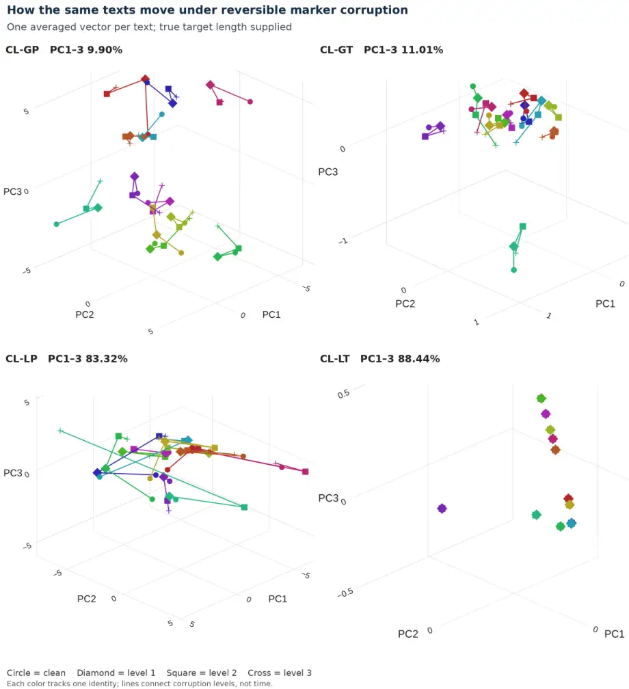

Figure 6: Matched CL identities in a $`2\times 2`$ grid. Each panel uses
pooled states, oracle lengths, and its own clean PCA basis. Colors
identify 12 matched texts; markers distinguish clean and recoverable
severities 1–3. Lines connect views rather than time steps. CL-LP
exhibits visible displacement for several identities, while some
concentrated representations show short trajectories despite poor
full-gallery retrieval. The figure illustrates selected within-model
behavior, not an estimate of retrieval accuracy.

#### Pairwise margins and Gaussian projections.

The supplied cosine histograms compare the correct identity with a
random wrong identity. Their ECDFs use the margin
$`s(q,c^{+})-s(q,c^{-}_{\mathrm{random}})`$, whereas Recall@1 requires
the correct candidate to outrank the full gallery. A positive
random-foil margin can therefore coexist with poor Recall@1. The
supplied Q–Q plots compare four seeded projections with normal
quantiles; their standardized rows remove projection mean and scale.
Close agreement on these directions supports the projected shape
diagnostic but does not test every direction or the joint canvas. The
token mixture and the 3D PCA projections also concern different sampling
units and subspaces.

### C.4 Corruption Sensitivity and Positional Access

Figure 7: Relative-position retrieval across corruption strengths. The
panels use PL predicted lengths, CL input lengths, and LexNorm
changed-input queries with extra whitespace. Level 0 denotes clean PL/CL
inputs and the original noisy LexNorm query. Channels and cohorts
differ, so severity scales are not directly comparable.

These within-checkpoint comparisons isolate the choice of similarity
readout. The benefit of relative positions is largest under the
strongest whitespace perturbation. It supports the utility of canvas
structure for canonical identity access without a claim that the
16-position score recovers every byte or all semantic relations.

### C.5 Supporting Readout Controls

The main-text comparisons retain the original full-cohort centering and
positional-access plots below.

Figure 8: Centering restores clean access, not robustness. CL-LT, oracle
lengths, relative-position scoring, 40,000 targets. Blue subtracts the
clean mean of 1,024 disjoint calibration examples; red uses raw states.
Labels give Recall@1 (%).

Figure 9: Position improves access within a fixed checkpoint and
predicted length. Gray pools states; blue compares 16 relative
positions. All 1,941 changed-input queries search the same 1,954
targets. At maximum whitespace perturbation, PL2/PL3 gain 36.89/21.54
points.

## Appendix D Downstream Text-to-Speech: Protocol and Audit

### D.1 Data, Training, and the Frozen Interface

The downstream experiment uses LJSpeech 1.1 (Ito and Johnson, 2017),
with normalized transcriptions paired to the original single-speaker
recordings. The preparation code shuffles the 13,100 utterance IDs with
seed 42 and makes a 70/30 split (9,170 training and 3,930 validation
utterances). Each ID has a stored clean transcription and a fixed
augmented version; both target the same recording. The conservative
augmenter attempts up to eight medium-strength rule-based corruptions
and accepts a nonempty changed string only when one minus the
character-level SequenceMatcher ratio is at most 0.10. It otherwise
retains the clean text. This bound is a string-similarity heuristic, not
a certified information-preserving channel or a Levenshtein-error bound.

The training loader chooses the stored augmented branch with probability
0.7 using a hash of training seed, epoch, and utterance ID; it also
fixes the per-epoch example order across systems. Validation always
selects the stored augmented branch, while the reported downstream
evaluation synthesizes both branches. No target audio is corrupted. We
trained all three systems for 1,000 epochs using the default
submission-script configuration: Adam with learning rate $`10^{-4}`$,
zero weight decay, batch size 36, training seed 42, mixed bfloat16
precision, and gradient clipping at 5.0. The launcher selects one A100
80 GB for the baseline and one H100 96 GB per frozen system. The
accompanying source and Slurm configuration specify these training
settings.

All three systems initialize from the official LJSpeech MatchaTTS
checkpoint (Mehta et al., 2024). The native baseline fine-tunes its text
encoder and acoustic model. Its frontend applies english_cleaners2
(including lowercasing and eSpeak phonemization) and intersperses blank
tokens. PL0 and PL2 instead receive UTF-8 bytes without inserted blanks.
The integration restores their canonical-canvas backbones from the
latent-agreement and token-grounded checkpoints, respectively, disables
all backbone gradients, and keeps them in evaluation mode. Canvas length
is the ceiling of the model’s predicted canonical length, bounded below
by one; over-capacity inputs or predictions raise an error rather than
being silently truncated. Neither system uses oracle target lengths, a
canonical-token prefix, nor the CANOPE token head at inference.

For both frozen systems, a trainable LayerNorm and linear map project
each width-512 canvas row to 192 channels. The integration reuses
MatchaTTS’s pretrained acoustic-mean projection, duration predictor, and
flow-matching decoder. The adapter and acoustic modules train while
CANOPE stays frozen; the duration predictor receives detached adapter
features, as implemented in the interface. Thus this is latent
conditioning of a trained speech generator, not text correction followed
by an unchanged TTS model. The common downstream architecture makes
PL0/PL2 an informative accessibility comparison, but their canvas
lengths, state distributions, and learned alignments can differ.

Synthesis uses ten flow steps, temperature 1, length scale 1, and
synthesis seed 9027, followed by a shared pretrained HiFi-GAN
vocoder (Kong et al., 2020) at 22,050 Hz. Its random seed is derived
from the utterance ID and input view; systems share that seed for a
given ID/view, but clean and augmented views use different derived
seeds. Consequently, the clean-to-augmented contrast includes the
realized synthesis variation. We evaluate the generated speech with
Whisper large-v3. The archived CSVs retain both raw and normalized
references and hypotheses, but not the ASR command-line flags. The
accompanying evaluator implements English text normalization and
unprompted transcription (temperature zero, no previous-text
conditioning); the exact ASR invocation is not independently documented.
The audit below uses the archived normalized strings directly.

### D.2 Recomputed Word Error Rates and Paired Uncertainty

Let $`e_{imv}=S_{imv}+D_{imv}+I_{imv}`$ denote the word edit count for
utterance $`i`$, model $`m`$, and view $`v`$, and let $`n_{i}`$ be its
normalized clean-reference word count. We report

```math
\operatorname{WER}_{mv}=100\frac{\sum_{i}e_{imv}}{\sum_{i}n_{i}},\qquad\Delta_{m}=\operatorname{WER}_{m,\mathrm{aug}}-\operatorname{WER}_{m,\mathrm{clean}},\qquad D=\Delta_{\mathrm{PL2}}-\Delta_{\mathrm{base}}. \tag{51}
```

These are corpus ratios, not means of utterance WERs. All six cells
contain the same 3,930 unique IDs, one recorded synthesis seed, and
66,489 reference words. We verified unique model/view/ID keys, identical
references across the six cells, reference-token counts, every stored
utterance ratio, and each total edit count against a fresh word-level
Levenshtein calculation on the archived normalized strings. The
recomputed corpus totals match both archived summary CSVs. There are
3,923 unique normalized reference strings; the sampling unit remains the
audio utterance ID. The CSVs contain scores for every expected cell, but
they do not carry synthesis/ASR failure flags for the full cohort.
Complete score coverage alone therefore does not establish that every
synthesis or ASR call succeeded; empty hypotheses remain in the metric.

| System     | Input     | S $`\downarrow`$ | D $`\downarrow`$ | I $`\downarrow`$ | WER $`\downarrow`$ \[95% interval\] | Zero-WER clips $`\uparrow`$ |
| ---------- | --------- | ---------------- | ---------------- | ---------------- | ----------------------------------- | --------------------------- |
| MatchaTTS  | Clean     | 868              | 259              | 345              | 2.21 \[2.04, 2.40\]                 | 3,083                       |
| MatchaTTS  | Augmented | 4,910            | 701              | 1,654            | 10.93 \[10.47, 11.40\]              | 1,647                       |
| Frozen PL2 | Clean     | 6,657            | 1,398            | 988              | 13.60 \[13.21, 14.01\]              | 816                         |
| Frozen PL2 | Augmented | 10,880           | 2,085            | 1,359            | 21.54 \[21.01, 22.09\]              | 458                         |
| Frozen PL0 | Clean     | 39,958           | 24,689           | 1,259            | 99.12 \[98.33, 100.10\]             | 0                           |
| Frozen PL0 | Augmented | 39,465           | 25,231           | 1,272            | 99.22 \[98.45, 100.15\]             | 0                           |

Table 12: Audited downstream error counts and utterance-paired
percentile intervals. S/D/I denote substitutions, deletions, and
insertions. The word denominator is 66,489 in every row.

For uncertainty, we draw 10,000 bootstrap samples of the 3,930 utterance
IDs with replacement using NumPy seed 9027, retaining all three systems
and both views for each selected ID. We recompute the numerator and word
denominator on every draw and take the 2.5th and 97.5th percentiles.
This preserves pairing and estimates sampling variation conditional on
the fitted checkpoints and realized synthesis/ASR outputs. It does not
measure variation across training seeds, other ASR engines, or
independent domains. WER can exceed 100% because insertions are
included.

The corruption increments are 8.71 points \[8.26, 9.18\] for the
baseline, 7.94 \[7.43, 8.44\] for PL2, and 0.09 \[$`-1.03`$, 1.21\] for
PL0. The paired contrast $`D=-0.77`$ points has interval \[$`-1.34`$,
$`-0.22`$\]. PL2 nevertheless has 10.62 points more augmented WER than
the baseline \[10.07, 11.18\]. Its advantage over PL0 is 77.67 points
\[76.72, 78.72\]. These contrasts describe the evaluated runs; they are
not multiple-comparison-adjusted hypothesis tests.

PL0’s clean errors are dominated by 39,958 substitutions and 24,689
deletions, with no zero-WER utterances. Its near-zero corruption
increment accompanies failure on the clean view and therefore does not
demonstrate useful invariance. The baseline has 3,083 zero-WER clean
clips and 1,647 augmented clips; PL2 has 816 and 458. PL0 has 44 empty
normalized hypotheses on clean audio and 43 on augmented audio, versus
none for the other systems. This pattern is consistent with poor
linguistic accessibility under the trained interface, but it does not
identify the population information gap or distinguish representation
loss from optimization, alignment, length, and readout mismatch.

### D.3 Scope of the Downstream Evidence

The native baseline is an end-to-end adaptation reference with a
pretrained phoneme encoder; the CANOPE systems replace that encoder with
frozen byte-based states and a newly trained adapter. A casing change
may disappear before entering the baseline encoder yet remain visible to
CANOPE. The comparison therefore does not isolate the causal effect of
freezing or of the CANOPE objective. Likewise, the small reduction in
PL2’s corruption increment is conditional on its higher clean error and
this particular perturbation mixture; it is not a general robustness
guarantee.

The 3,930 items are held out from the reported acoustic fine-tuning
split, not demonstrated to be unseen during pretraining. The shared
MatchaTTS initializer was trained on LJSpeech, and LJSpeech
transcriptions are among CANOPE’s pretraining sources. A
pretraining-to-evaluation overlap audit and original-recording Whisper
WER are unavailable. We therefore avoid interpreting these numbers as
out-of-domain transfer, a ground-truth intelligibility ceiling, or a
clean test-set estimate. Whisper WER (Radford et al., 2023; OpenAI, 2023) measures ASR-mediated lexical fidelity and can include recognizer
errors; no human listening score or perceptual naturalness claim is
made.

### D.4 Reproducibility and Waveform Displays

The accompanying analyze_tts.py recreates the audit, tables, bootstrap
intervals, and spectrogram panels from the archived CSVs and samples.
Source names baseline, canope, and jepa map to MatchaTTS, frozen
CANOPE-PL2, and frozen CANOPE-PL0, respectively; the historical jepa
name is not a claim that PL0 reproduces an unmodified JEPA method. The
package retains the original source mapping and a machine-readable audit
of counts, audio hashes, and display settings.

The final ten sample pages show every utterance in the archived sample
subset, retaining its recorded order. We do not select a further subset
by WER. The original selection procedure is undocumented, so these
examples are illustrative rather than a random sample of the evaluation
cohort. Each page includes all six waveforms as mel-spectrograms, the
exact clean and augmented inputs, and the normalized Whisper hypotheses
joined by utterance ID, model, and view. The plots are recomputed from
the generated WAV files, not from saved decoder mel targets. All 60 WAV
hashes, durations, sampling rates, and mel-frame counts match their
sidecar metadata. No original reference recordings were supplied in the
sample archive, so no ground-truth-audio panel is shown.

We use a 1,024-sample periodic Hann window, 256-sample hop, 384-sample
reflection padding at both ends, and 80 Slaney area-normalized mel
filters over 0–8 kHz, matching the supplied Matcha acoustic transform.
Magnitudes are displayed as $`20\log_{10}(M/M_{\max})`$, clipped to
\[$`-80`$, 0\] dB, where $`M_{\max}`$ is shared across all 60 clips.
Time axes are shared within each six-panel example without time warping;
gray beyond a waveform’s end denotes absence of samples. These plots
expose timing and spectral differences but do not independently
establish which words were spoken or how natural the audio sounds.

## Appendix E Probability and Information Identities Used in This Paper

This appendix explains the identities needed for the content-gap and
readout arguments. It also separates population quantities from the
finite-cohort diagnostics. The information identities follow standard
definitions and chain rules (Cover and Thomas, 1991, Chapter 2); the
applications below use this paper’s variables and examples.

### E.1 Random Variables, Expectations, and Conditional Distributions

Uppercase letters denote random variables, while lowercase letters
denote realizations. For example, $`C`$ is a random target and $`c`$ is
one particular string. An expectation averages a function under the
joint law of its arguments. For discrete $`C`$ and possibly continuous
$`Z`$,

```math
\mathbb{E}[f(C,Z,S)]=\mathbb{E}_{Z,S}\left[\sum_{c}p(c\mid Z,S)f(c,Z,S)\right]. \tag{52}
```

Thus $`\mathbb{E}`$ without a subscript is shorthand when the variables
are clear. In the KL term of Eq. (2), the inner divergence already sums
over $`c`$ at fixed $`(z,s)`$. The outer $`\mathbb{E}_{Z,S}`$ averages
that divergence across contexts. Omitting this outer average would leave
a context-dependent quantity rather than population log-loss.

The notation $`C\perp Z\mid(X,S)`$ means that after $`(X,S)`$ is known,
$`Z`$ gives no additional information about $`C`$. It permits $`C`$ and
$`Z`$ to be strongly dependent before conditioning. A deterministic
$`Z=F(X,S)`$ satisfies it because $`Z`$ is then already fixed by
$`(X,S)`$. Independent encoder randomness also satisfies it if it
introduces no target-dependent side channel.

### E.2 Entropy, Log-Loss, and the Information Gap

For a discrete target, conditional entropy is

```math
H(C\mid Z,S)=\mathbb{E}_{Z,S}\left[-\sum_{c}p(c\mid Z,S)\log p(c\mid Z,S)\right]. \tag{53}
```

For two discrete laws,
$`D_{\mathrm{KL}}(p\|q)=\sum_{c}p(c)\log[p(c)/q(c)]`$, with value
$`+\infty`$ if $`q`$ assigns zero probability to a positive-probability
event under $`p`$. It measures distributional mismatch and is zero
exactly when the laws agree. Conditional entropy is uncertainty under
the true conditional law. A readout $`q`$ instead incurs log-loss
$`\mathbb{E}[-\log q(C\mid Z,S)]`$. Subtracting the true entropy leaves
an expected KL divergence, which is nonnegative. Hence an inaccurate
readout can have high loss even when the target is fully determined by
$`Z`$.

The standard identity

```math
I(C;X\mid Z,S)=H(C\mid Z,S)-H(C\mid X,Z,S) \tag{54}
```

measures how much $`X`$ reduces the remaining uncertainty after
$`(Z,S)`$ is given. Under the conditional-independence assumption, its
final entropy becomes $`H(C\mid X,S)`$, yielding Eq. (1). This
identifies a processing loss relative to the input, not necessarily the
entire uncertainty about $`C`$.

For a concrete example, let $`C=(B_{1},B_{2})`$ contain independent fair
bits, $`X=C`$, and $`Z=B_{1}`$. In nats, $`H(C)=2\log 2`$,
$`H(C\mid X)=0`$, and $`H(C\mid Z)=\log 2`$. The encoder loses one bit,
so $`\Delta_{\mathrm{info}}=\log 2`$. If instead $`Z=(B_{2},B_{1})`$,
the full representation loses no information. A position-local head
still fails, because it sees the wrong independent bit at each position.
This is the difference between information loss and local readout
mismatch.

If the input itself contains only $`X=B_{1}`$ and the encoder preserves
$`Z=X`$, then $`H(C\mid X)=\log 2`$ but $`\Delta_{\mathrm{info}}=0`$.
The irreducible uncertainty arose before the encoder. Recoverable
corruption removes this confound by ensuring $`H(C\mid X,L)=0`$.

### E.3 Why Length Is a Separate Information Variable

At a given length $`\ell`$, the chain rule expands the entropy of the
sequence into $`\ell`$ conditional token entropies. Each term is at most
$`\log K`$, which proves Eq. (3). Equality requires the uniform
distribution over all $`K^{\ell}`$ strings, not ordinary linguistic
text. Repetition can add almost no new uncertainty, whereas independent
symbols add a constant amount per position.

For an infinite stationary finite-alphabet process with entropy rate
$`h`$, the block entropy satisfies

```math
h=\lim_{n\to\infty}\frac{H(C_{1},\ldots,C_{n})}{n},\qquad H(C_{1},\ldots,C_{n})=nh+o(n). \tag{55}
```

This is an asymptotic statement about a source process (Shannon, 1948).
It does not imply that arbitrary variable-length sentences, or their
meanings, contain exactly $`h`$ units of information per token.
Conditioning on the event $`L=\ell`$ can change the token law.

Because sequence length is a function of the sequence, $`H(L\mid C)=0`$.
The joint-entropy chain rule therefore yields $`H(C)=H(L)+H(C\mid L)`$
when finite. CL supplies $`L`$ and studies the remaining ordered
content. PL predicted inference must infer a length from $`X`$. Its
output shape is itself part of the representation available to the
readout. Stopping gradients through the length-head input does not
supply the unknown length or change this inference-time information
structure.

### E.4 Covariance, Eigenvalues, and the Quantity Called Rank

For a random vector $`R`$ with finite second moments,

```math
\Sigma=\cnCov(R)=\mathbb{E}[(R-\mathbb{E}R)(R-\mathbb{E}R)^{\top}]. \tag{56}
```

An eigenvector $`u_{i}`$ with unit norm identifies a direction whose
projected variance is $`u_{i}^{\top}\Sigma u_{i}=\lambda_{i}`$. Equal
eigenvalues mean equal variance in all directions. The eigenbasis
describes directions, while the spectrum lists their variances.

Algebraic rank counts nonzero eigenvalues. Covariance effective rank
instead applies entropy to their relative weights
$`p_{i}=\lambda_{i}/\sum_{j}\lambda_{j}`$ and exponentiates the result.
It is sensitive to the unevenness of the spectrum even if every
eigenvalue remains positive. For example, both
$`\operatorname{diag}(1.8,0.2)`$ and $`\operatorname{diag}(1.2,0.8)`$
have algebraic rank two, but their effective ranks are 1.3841 and
1.9601. This is the function differentiated in Appendix A.8.

Neither covariance isotropy nor effective rank determines the full
distribution. An isotropic covariance can occur in a non-Gaussian law,
and a standard Gaussian sample has unequal empirical eigenvalues at
finite sample size. Our Gaussian reference uses matched sample count and
dimension to contextualize this sampling effect.

### E.5 Population Guarantees and Measured Diagnostics

Theorems use population expectations. An empirical token-loss average is
an estimate, and a per-byte corpus average is not the expected summed
sequence loss used in the information bound. Paired bootstrap intervals
resample canonical identities while keeping each comparison paired; they
describe evaluation-cohort uncertainty conditional on the checkpoint.

Recall@1 asks whether the true target outranks every candidate in the
gallery. A positive cosine margin against one random wrong target is a
weaker event. Similarly, a 3D principal-component plot shows only three
directions. Short trajectories indicate stability in that displayed
subspace; interpreting robustness also requires the retained variance,
correspondence structure, and full-gallery retrieval curves.

## Appendix F Complete Distribution and Paired-View Comparisons

The distribution and paired-view grids in this section complete the
coverage across all seven models with supplied feature diagnostics. PL
includes natural corruption; CL includes both recoverable and heldout
corruption. Every combination is shown for pooled and sampled-token
states. The primary pooled CL distribution is in Figure 11, and the
primary pooled paired views are in Figures 10 and 6. All feature-level
plots supply the true target length (oracle length). Pooled means one
vector obtained by averaging the valid positions of a text; token means
one sampled valid position per text. Recoverable denotes reversible
inserted markers; heldout denotes the alternative marker pattern defined
in Section 6. The full-cohort tables and curves separately report PL
predicted-length and CL input-length performance.

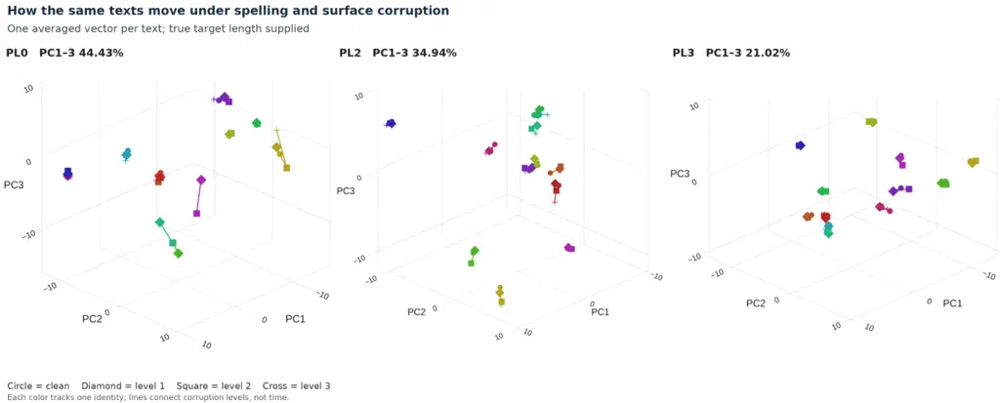

Figure 10: Following the same identities through natural corruption.
Each panel shows 12 texts, one color per text. Follow a line from the
clean circle through the diamond, square, and cross at corruption levels
1, 2, and 3. The displayed states are averaged text vectors with true
target lengths supplied. Axes are fitted on clean states separately for
each model. Some PL0 views stay close even though full-gallery retrieval
is poor in Figure 3; visual proximity must therefore be read together
with identity access. Percentages state how much clean variance the
three displayed axes retain.

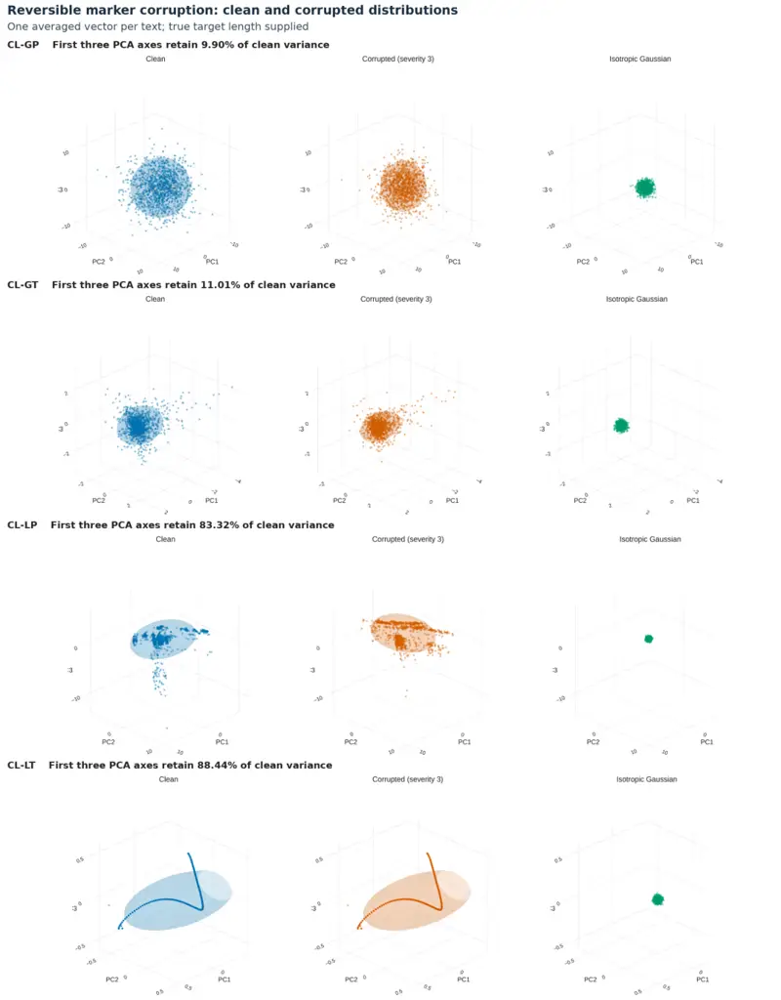

Figure 11: What the geometry diagnostic sees in the four CL
configurations. Rows identify the models; columns show clean text,
reversible corruption at level 3, and an isotropic Gaussian reference.
Each point is one averaged text vector; true target lengths are
supplied. The same clean PCA axes and scale apply across a row. CL-GP/GT
spread most variance beyond the three displayed axes, whereas CL-LP/LT
concentrate it in this subspace. Compare these clouds with retrieval in
Figure 2, rather than reading a compact cloud as evidence of content
preservation. Axes are fitted to 4,096 clean examples; each cloud
displays 1,200 points. Surfaces span two standard deviations, not
confidence regions.

#### How to read the grids.

A distribution row compares clean states, severity-3 states, and the
supplied standard isotropic Gaussian reference. The clean PCA basis,
coordinate units, and limits are fixed within the row. Each paired panel
instead follows 12 individual canonical identities through clean and
severity levels 1–3. A color identifies a target; a circle marks clean,
a diamond level 1, a square level 2, and a cross level 3. The connecting
lines show a change across corruption levels, not temporal dynamics.
Inspect whether identities remain separated as well as how far their
views move. Full-gallery retrieval measures the corresponding identity
access beyond these selected examples and three coordinates.

The first three principal components retain a model-dependent fraction
of variance. For example, the clean pooled CL-LP and CL-LT projections
retain 83.32% and 88.44%, while the corresponding token projections
retain 59.56% and 37.50%. The grids therefore expose different subspaces
and scales, not a shared coordinate system for measuring cross-model
distances. Table 13 gives the exact subset metrics needed to interpret
them.

| Model | Representation | Effective rank | $`d_{90}`$ | $`d_{95}`$ | PC1–3 (%) |
| ----- | -------------- | -------------- | ---------- | ---------- | --------- |
| PL0   | pooled         | 15.62          | 15         | 18         | 44.43     |
| PL0   | token          | 15.63          | 15         | 18         | 44.43     |
| PL2   | pooled         | 15.54          | 12         | 14         | 34.94     |
| PL2   | token          | 34.22          | 31         | 48         | 25.55     |
| PL3   | pooled         | 35.49          | 29         | 37         | 21.02     |
| PL3   | token          | 65.41          | 58         | 85         | 15.44     |
| CL-GP | pooled         | 54.09          | 41         | 52         | 9.90      |
| CL-GP | token          | 42.53          | 34         | 46         | 17.53     |
| CL-GT | pooled         | 108.23         | 97         | 131        | 11.01     |
| CL-GT | token          | 164.74         | 135        | 177        | 5.46      |
| CL-LP | pooled         | 4.65           | 5          | 6          | 83.32     |
| CL-LP | token          | 14.25          | 20         | 35         | 59.56     |
| CL-LT | pooled         | 3.59           | 4          | 6          | 88.44     |
| CL-LT | token          | 28.28          | 32         | 44         | 37.50     |

Table 13: Clean 4,096-item visualization subset, oracle length. The
dimensions $`d_{90}`$ and $`d_{95}`$ are the smallest numbers of
principal components explaining 90% and 95% of variance. These subset
ranks need not equal the full-cohort ranks.

| Diagnostic                     | PL  | CL  | Total |
| ------------------------------ | --- | --- | ----- |
| Full-cohort summary charts     | 5   | 10  | 15    |
| Full-cohort covariance spectra | 2   | 3   | 5     |
| Clean-subset spectra           | 6   | 8   | 14    |
| 3D distributions               | 6   | 16  | 22    |
| Paired 3D trajectories         | 6   | 16  | 22    |
| Projected Gaussian Q–Q plots   | 6   | 16  | 22    |
| Positive/random-foil cosines   | 3   | 8   | 11    |
| Random-foil margin ECDFs       | 3   | 8   | 11    |
| Total                          | 37  | 85  | 122   |

Table 14: Coverage of the complete accompanying visual atlas. Each
registered source PNG appears on its own landscape page. The panel index
supplies page numbers, original paths, notes, and SHA-256 hashes.

#### Data and reproducibility.

The source package includes all 122 registered PNGs, their render and
selection manifests, the clean-subset JSON metrics, the full-cohort CSV
summaries, and the paired uncertainty summaries. The CSV hashes match
the source identities in both supplied geometry manifests. Display names
use PL/CL; original checkpoint keys remain in machine-readable files for
traceability. The archives supply rendered feature plots and feature
hashes, but no latent arrays or per-point PCA coordinates. The included
scripts regenerate compositions and CSV-based figures; recomputing
feature projections requires the original arrays. The atlas includes all
supplied spectral, Gaussian-projection, pairwise-score, and centering
panels listed in Table 14.

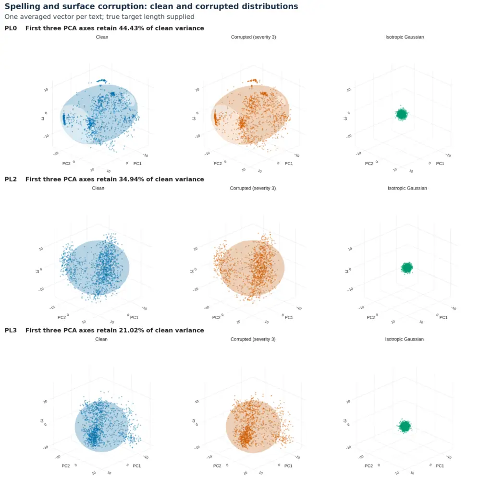

Figure 12: PL natural distributions of pooled states with oracle length.
Each row shows clean, severity 3, and the isotropic Gaussian reference
in the same clean PCA coordinates. All supplied models are included.
Clouds contain 1,200 points; surfaces span two standard deviations and
are not confidence regions.

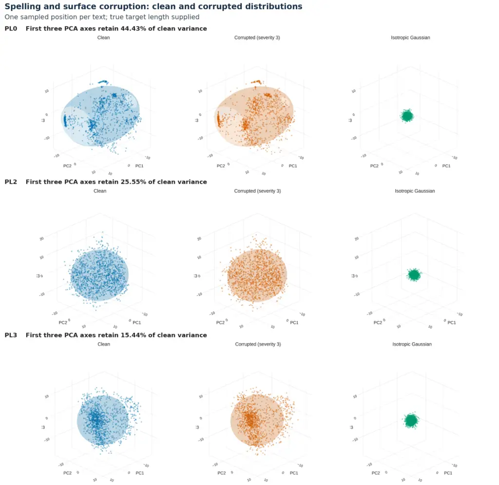

Figure 13: PL natural distributions of token states with oracle length.
Each row shows clean, severity 3, and the isotropic Gaussian reference
in the same clean PCA coordinates. All supplied models are included.
Clouds contain 1,200 points; surfaces span two standard deviations and
are not confidence regions.

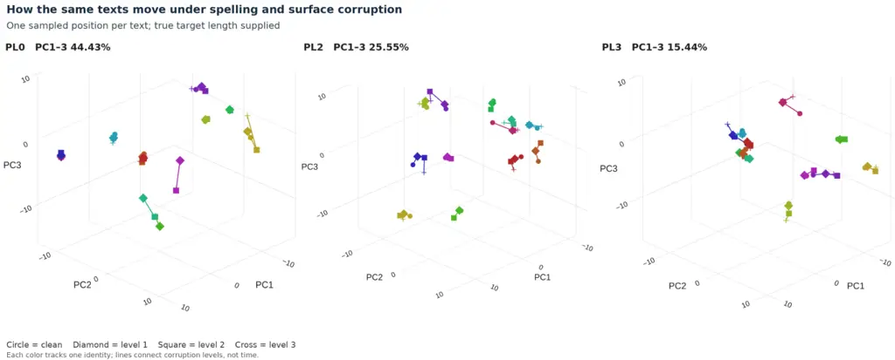

Figure 14: Paired PL natural trajectories for token states with oracle
length. Each panel follows 12 canonical identities through clean and
severity levels 1–3 using one clean PCA basis per model. Colors identify
targets and markers identify corruption levels. Differences in axes and
captured variance require within-model interpretation.

Figure 15: Full-cohort PL natural diagnostics across severity, using
oracle length. Retrieval, pooled and token effective rank, mean
magnitude, variance scale, and cross-view error are shown separately.
The bottom row uses a symmetric logarithmic scale with a linear region
near zero. These curves use the original 40,000-item numeric summaries,
independently of the smaller visualization subset.

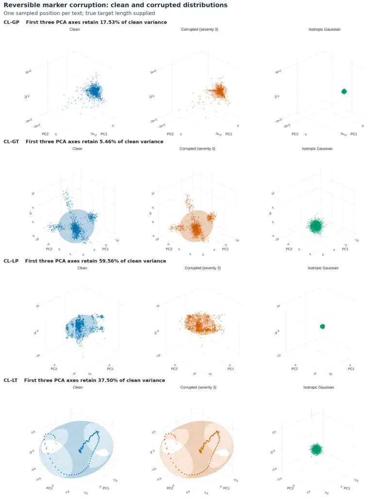

Figure 16: CL recoverable distributions of token states with oracle
length. Each row shows clean, severity 3, and the isotropic Gaussian
reference in the same clean PCA coordinates. All supplied models are
included. Clouds contain 1,200 points; surfaces span two standard
deviations and are not confidence regions.

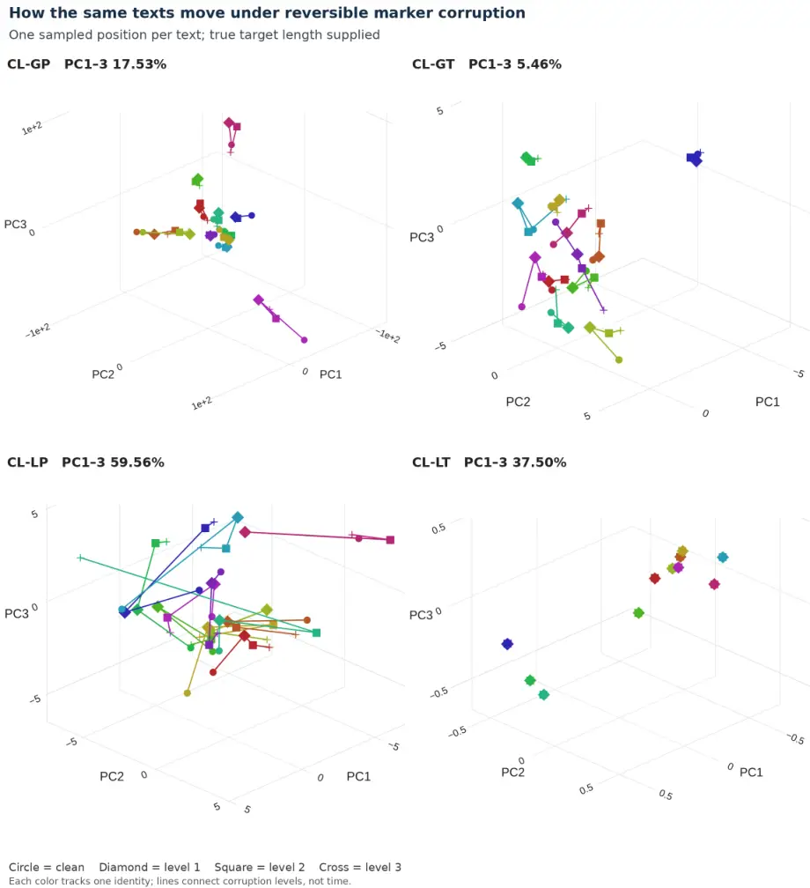

Figure 17: Paired CL recoverable trajectories for token states with
oracle length. Each panel follows 12 canonical identities through clean
and severity levels 1–3 using one clean PCA basis per model. Colors
identify targets and markers identify corruption levels. Differences in
axes and captured variance require within-model interpretation.

Figure 18: Full-cohort CL recoverable diagnostics across severity, using
oracle length. Retrieval, pooled and token effective rank, mean
magnitude, variance scale, and cross-view error are shown separately.
The bottom row uses a symmetric logarithmic scale with a linear region
near zero. These curves use the original 40,000-item numeric summaries,
independently of the smaller visualization subset.

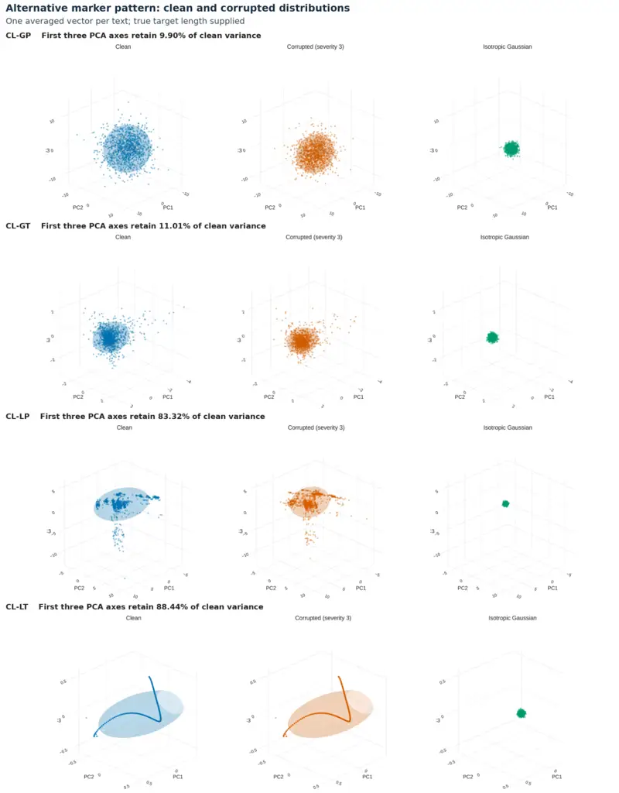

Figure 19: CL heldout distributions of pooled states with oracle length.
Each row shows clean, severity 3, and the isotropic Gaussian reference
in the same clean PCA coordinates. All supplied models are included.
Clouds contain 1,200 points; surfaces span two standard deviations and
are not confidence regions.

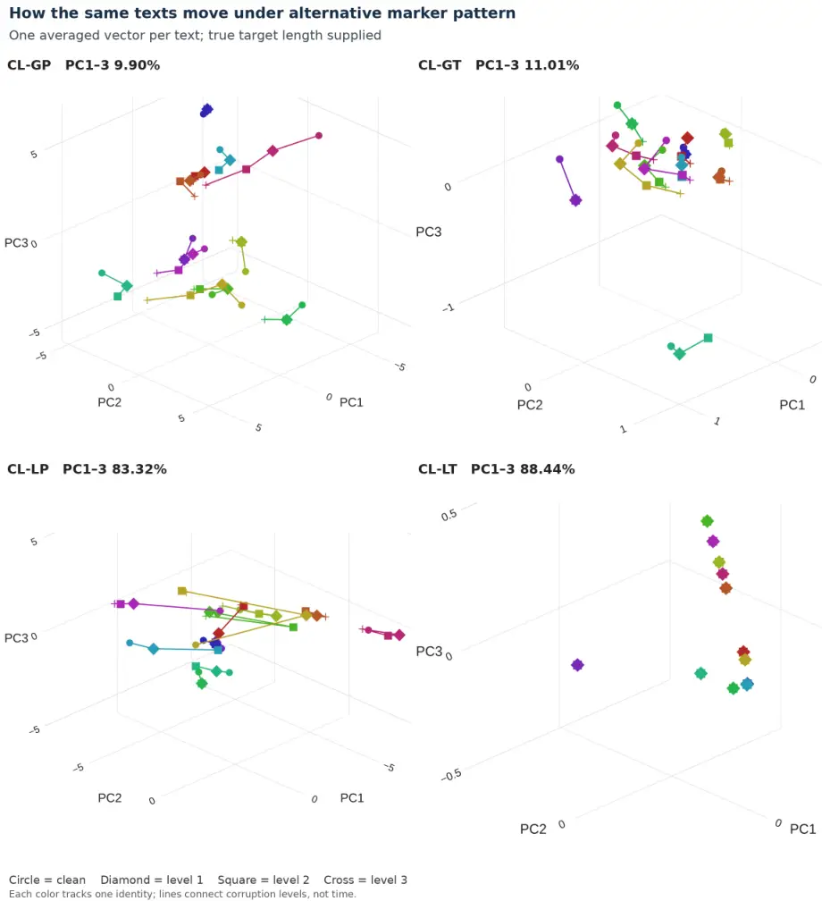

Figure 20: Paired CL heldout trajectories for pooled states with oracle
length. Each panel follows 12 canonical identities through clean and
severity levels 1–3 using one clean PCA basis per model. Colors identify
targets and markers identify corruption levels. Differences in axes and
captured variance require within-model interpretation.

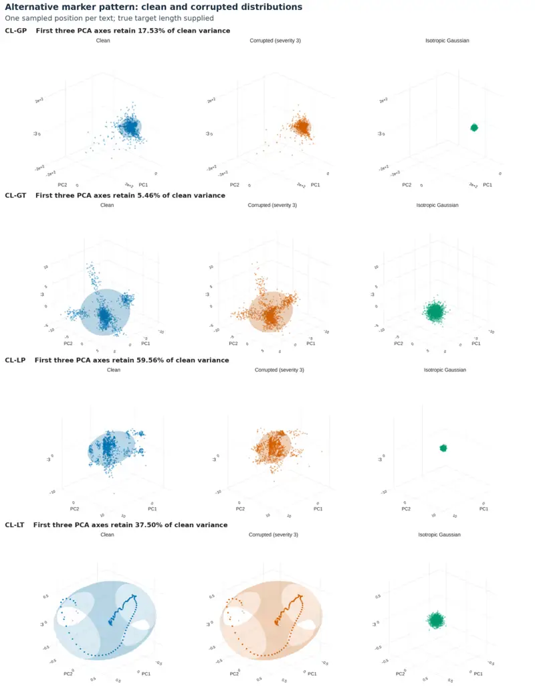

Figure 21: CL heldout distributions of token states with oracle length.
Each row shows clean, severity 3, and the isotropic Gaussian reference
in the same clean PCA coordinates. All supplied models are included.
Clouds contain 1,200 points; surfaces span two standard deviations and
are not confidence regions.

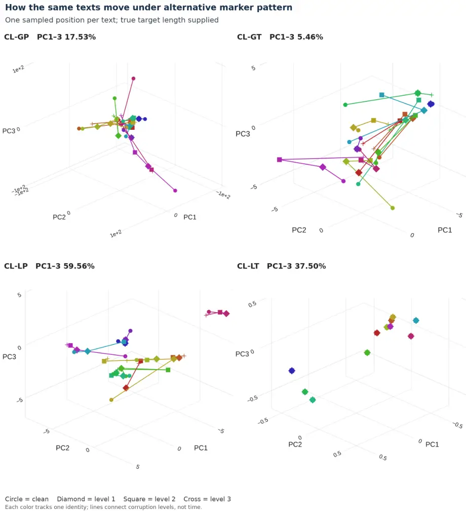

Figure 22: Paired CL heldout trajectories for token states with oracle
length. Each panel follows 12 canonical identities through clean and
severity levels 1–3 using one clean PCA basis per model. Colors identify
targets and markers identify corruption levels. Differences in axes and
captured variance require within-model interpretation.

Figure 23: Full-cohort CL heldout diagnostics across severity, using
oracle length. Retrieval, pooled and token effective rank, mean
magnitude, variance scale, and cross-view error are shown separately.
The bottom row uses a symmetric logarithmic scale with a linear region
near zero. These curves use the original 40,000-item numeric summaries,
independently of the smaller visualization subset.

## Appendix G Downstream Speech Samples

### Sample 1: LJ033-0072

Reference/clean input: I then stepped off of it and the officer picked
it up in the middle and it bent so.

Augmented input: I theN stepped off of it and the officer picked IT up
in the middle and it bent so.

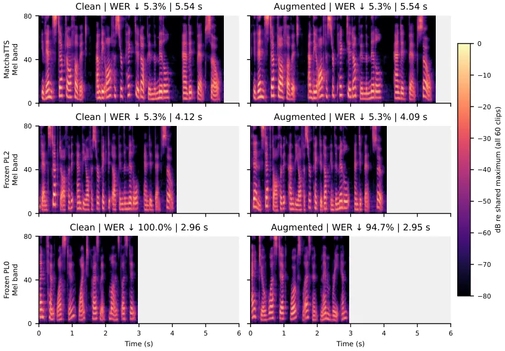

Figure 24: LJ033-0072: all three systems under both input views. WER
uses the clean reference; gray after a panel ends indicates no generated
audio. Axes are shared within this example; the color reference is
shared across all ten examples.

Whisper hypotheses (normalized, as scored).

| System     | Clean audio                                                                         | Augmented audio                                                                       |
| ---------- | ----------------------------------------------------------------------------------- | ------------------------------------------------------------------------------------- |
| MatchaTTS  | he then stepped off of it and the officer picked it up in the middle and it bent so | they then stepped off of it and the officer picked it up in the middle and it bent so |
| Frozen PL2 | then stepped off of it and the officer picked it up in the middle and it bent so    | then stepped off of it and the officer picked it up in the middle and it bent so      |
| Frozen PL0 | when kent was still white as mid months was still                                   | at your worst at works placement memory and                                           |

### Sample 2: LJ006-0145

Reference/clean input: He could indulge in snuff if a snuff-taker,

Augmented input: He cou,d indulge ib snuff if a snuff-taker,

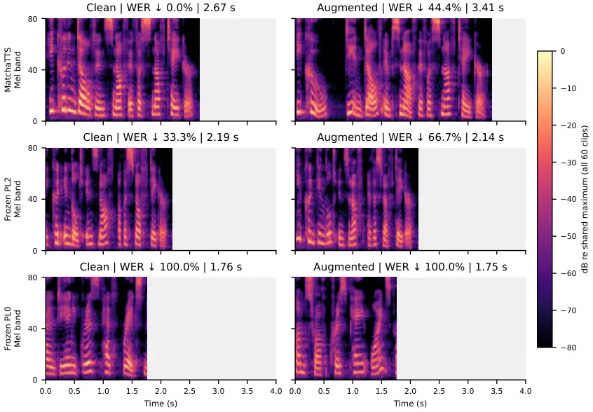

Figure 25: LJ006-0145: all three systems under both input views. WER
uses the clean reference; gray after a panel ends indicates no generated
audio. Axes are shared within this example; the color reference is
shared across all ten examples.

Whisper hypotheses (normalized, as scored).

| System     | Clean audio                                 | Augmented audio                                 |
| ---------- | ------------------------------------------- | ----------------------------------------------- |
| MatchaTTS  | he could indulge in snuff if a snuff taker  | he could be an adult and snuff if a snuff taker |
| Frozen PL2 | it could indulge in snuff of a snuff digger | you can kindle it in snuff at the snuff taker   |
| Frozen PL0 | _Empty hypothesis_                          | plums truffle crisp paint wine spray            |

### Sample 3: LJ002-0239

Reference/clean input: also for prisoners committed by the Admiralty
Court.

Augmented input: also for prisoners committed by the ADmIralTY Court.

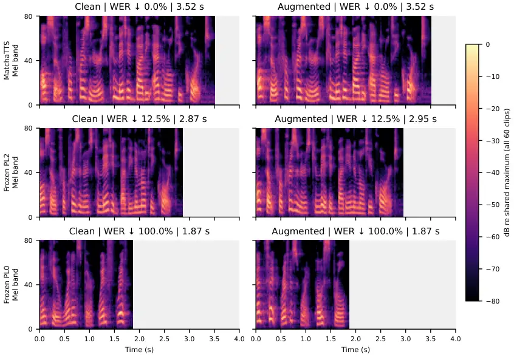

Figure 26: LJ002-0239: all three systems under both input views. WER
uses the clean reference; gray after a panel ends indicates no generated
audio. Axes are shared within this example; the color reference is
shared across all ten examples.

Whisper hypotheses (normalized, as scored).

| System     | Clean audio                                         | Augmented audio                                     |
| ---------- | --------------------------------------------------- | --------------------------------------------------- |
| MatchaTTS  | also for prisoners committed by the admiralty court | also for prisoners committed by the admiralty court |
| Frozen PL2 | also for prisoners committed by the mimralty court  | also for prisoners committed by the indemnity court |
| Frozen PL0 | and he would not spare winfrey                      | that is it riffus roy post sprawl                   |

### Sample 4: LJ038-0296

Reference/clean input: Marina Oswald also testified that her husband had
used a bus to return home.

Augmented input: Marina Oswald also tstfd that her hsb had used a bus to
return home.

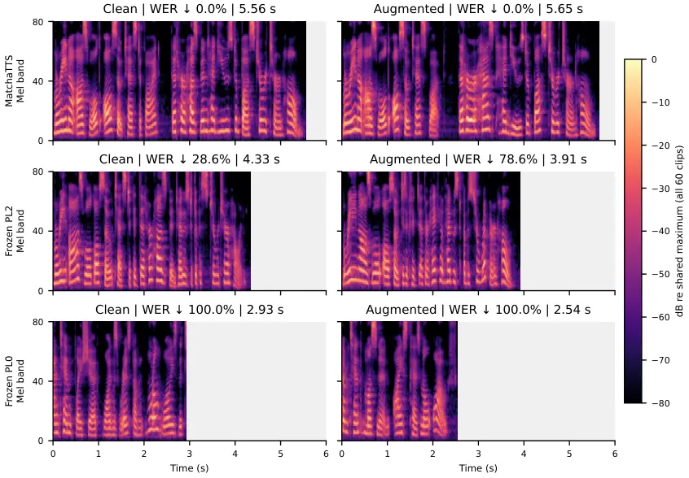

Figure 27: LJ038-0296: all three systems under both input views. WER
uses the clean reference; gray after a panel ends indicates no generated
audio. Axes are shared within this example; the color reference is
shared across all ten examples.

Whisper hypotheses (normalized, as scored).

| System     | Clean audio                                                                  | Augmented audio                                                             |
| ---------- | ---------------------------------------------------------------------------- | --------------------------------------------------------------------------- |
| MatchaTTS  | marina oswald also testified that her husband had used a bus to return home  | marina oswald also testified that her husband had used a bus to return home |
| Frozen PL2 | marie oswald also testified that her husband had his deputist to return home | marine oswald also disappeared at the head of mister rippon is home         |
| Frozen PL0 | and template shared one is rest of the world                                 | the 2nd tent must know an ice cold mill of                                  |

### Sample 5: LJ014-0142

Reference/clean input: was strewn in front of the dock, and sprinkled it
towards the bench with a contemptuous gesture.

Augmented input: was strewn in front of the dock, and sprinkled it
tOWards the bench with a contemptuous gesture.

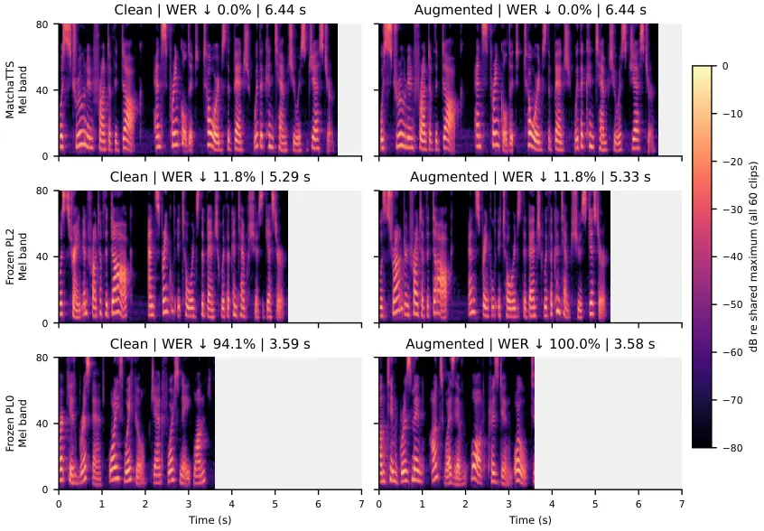

Figure 28: LJ014-0142: all three systems under both input views. WER
uses the clean reference; gray after a panel ends indicates no generated
audio. Axes are shared within this example; the color reference is
shared across all ten examples.

Whisper hypotheses (normalized, as scored).

| System     | Clean audio                                                                                     | Augmented audio                                                                                   |
| ---------- | ----------------------------------------------------------------------------------------------- | ------------------------------------------------------------------------------------------------- |
| MatchaTTS  | was strewn in front of the dock and sprinkled it towards the bench with a contemptuous gesture  | was strewn in front of the dock and sprinkled it towards the bench with a contemptuous gesture    |
| Frozen PL2 | was strained in front of the dock and sprinkled it towards the bench with a contemptuous gister | was surrounded in front of the dock and sprinkled it towards the bench with a contemptuous dister |
| Frozen PL0 | perkins brest and west waco jan 14 1981                                                         | tim grismond antwesif walt christian orlton                                                       |

### Sample 6: LJ012-0270

Reference/clean input: She had realized all her effects, and brought
them with her furniture to Greenacre’s lodgings. The two when married
were to emigrate to Hudson’s Bay.

Augmented input: She h ad realized all her effects, andbrought them with
Herfurniture to Greenacres lodgings.The two when married were to
emigrate to HudsonsBay.

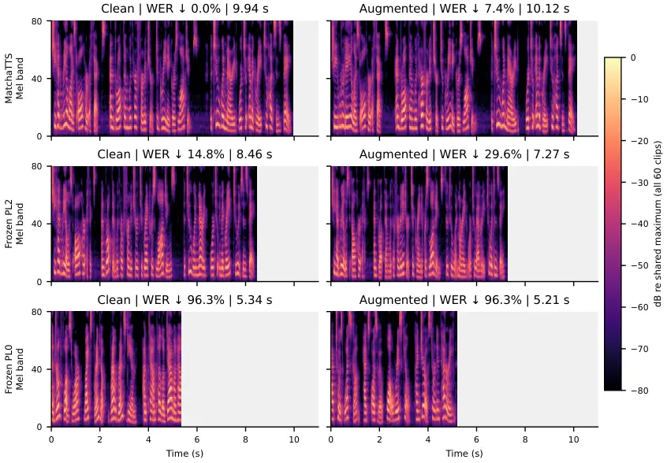

Figure 29: LJ012-0270: all three systems under both input views. WER
uses the clean reference; gray after a panel ends indicates no generated
audio. Axes are shared within this example; the color reference is
shared across all ten examples.

Whisper hypotheses (normalized, as scored).

| System     | Clean audio                                                                                                                                        | Augmented audio                                                                                                                                         |
| ---------- | -------------------------------------------------------------------------------------------------------------------------------------------------- | ------------------------------------------------------------------------------------------------------------------------------------------------------- |
| MatchaTTS  | she had realized all her effects and brought them with her furniture to greenacre is lodgings the 2 when married were to emigrate to hudson is bay | she radialized all her effects and brought them with her furniture to greenacre is lodgings the 2 when married were to emigrate to hudson is bay        |
| Frozen PL2 | she had realized all her ethics and brought them with her furniture to grecker is lodgings the 2 when married or to immigrate to hudson is bay     | she had realized all her effects and brought them with her furniture to gray nipper is lodgings through to when moraine wore to agarty to witton is bay |
| Frozen PL0 | drum flows to our white sprint of brown rents dm on town pillow down on how                                                                        | apto is wescon heads oswald while rhys kill hanjuro is turn in petare                                                                                   |

### Sample 7: LJ011-0213

Reference/clean input: married the said Ellen Turner.

Augmented input: married the said eLlen Turner.

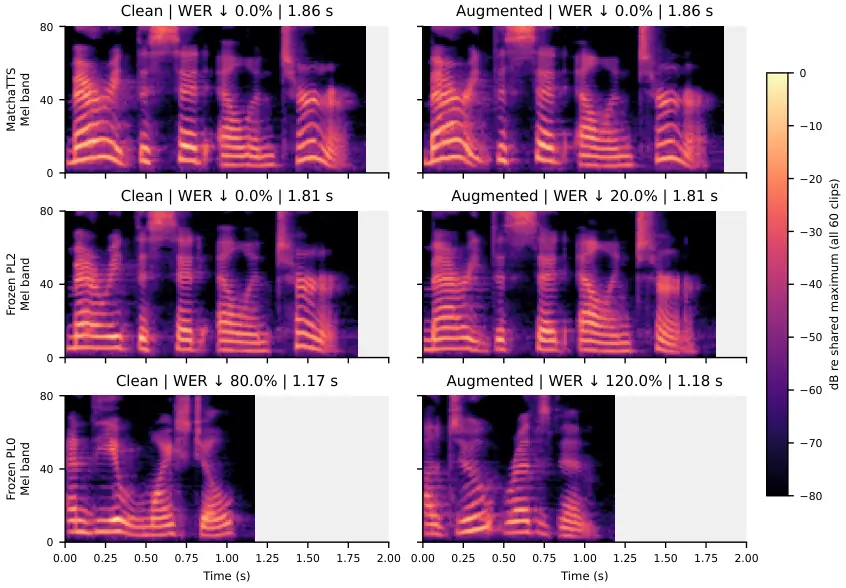

Figure 30: LJ011-0213: all three systems under both input views. WER
uses the clean reference; gray after a panel ends indicates no generated
audio. Axes are shared within this example; the color reference is
shared across all ten examples.

Whisper hypotheses (normalized, as scored).

| System     | Clean audio                   | Augmented audio               |
| ---------- | ----------------------------- | ----------------------------- |
| MatchaTTS  | married the said ellen turner | married the said ellen turner |
| Frozen PL2 | married the said ellen turner | married the said alan turner  |
| Frozen PL0 | and the moisture              | i will do reverend is bim     |

### Sample 8: LJ007-0211

Reference/clean input: In our late visits, they say, ”we have seen
manifest indications of a retrograde movement in this respect,

Augmented input: In ourlate visits, they say, ”we haveSEEN manifest
indications of a retrograde movementin this rspct,

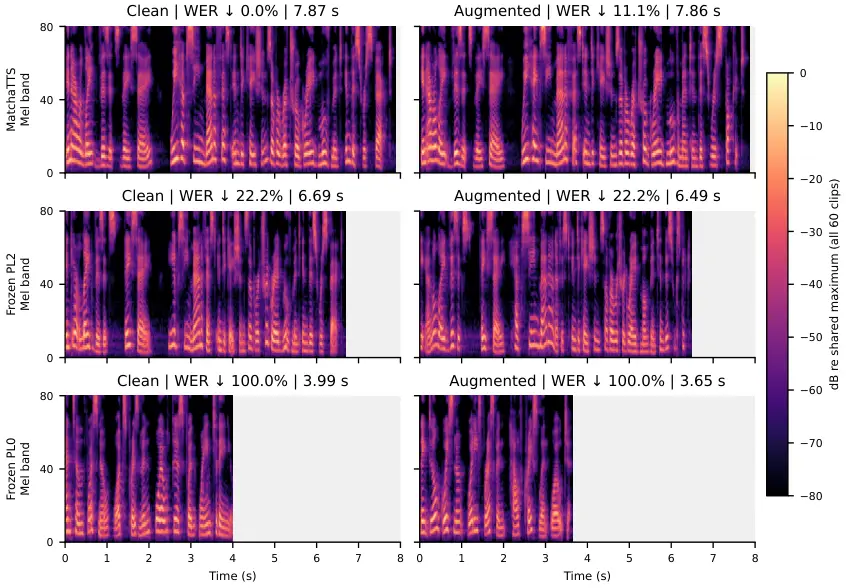

Figure 31: LJ007-0211: all three systems under both input views. WER
uses the clean reference; gray after a panel ends indicates no generated
audio. Axes are shared within this example; the color reference is
shared across all ten examples.

Whisper hypotheses (normalized, as scored).

| System     | Clean audio                                                                                            | Augmented audio                                                                                             |
| ---------- | ------------------------------------------------------------------------------------------------------ | ----------------------------------------------------------------------------------------------------------- |
| MatchaTTS  | in our late visits they say we have seen manifest indications of a retrograde movement in this respect | in our late visits they say we have seen manifest indications of a retrograde movement in this wrist pocket |
| Frozen PL2 | in your late visits they say you have seen manifest indications of retrigarid movement in this respect | the annalite visits they say have seen manifest indications of a retrograde movement in this respect        |
| Frozen PL0 | anthem for snow what is prison well this point went to the new                                         | thank you                                                                                                   |

### Sample 9: LJ038-0221

Reference/clean input: and the second month’s rent was paid on either
April two or April three.

Augmented input: and the second months rent was paid on eITHer April two
or April three.

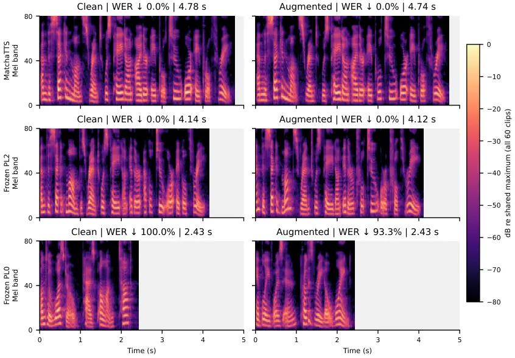

Figure 32: LJ038-0221: all three systems under both input views. WER
uses the clean reference; gray after a panel ends indicates no generated
audio. Axes are shared within this example; the color reference is
shared across all ten examples.

Whisper hypotheses (normalized, as scored).

| System     | Clean audio                                                     | Augmented audio                                                 |
| ---------- | --------------------------------------------------------------- | --------------------------------------------------------------- |
| MatchaTTS  | and the 2nd month is rent was paid on either april 2 or april 3 | and the 2nd month is rent was paid on either april 2 or april 3 |
| Frozen PL2 | and the 2nd month is rent was paid on either april 2 or april 3 | and the 2nd month is rent was paid on either april 2 or april 3 |
| Frozen PL0 | uncle wuzdrow has a long tot                                    | can not believe what is in professor regal is mind              |

### Sample 10: LJ006-0020

Reference/clean input: William Crawford had been one of the promoters
and managers of the Philanthropic Society’s farm school.

Augmented input: William crawfrd had been one OF the promoters and
managers of the Philanthropic Societys farm sch.

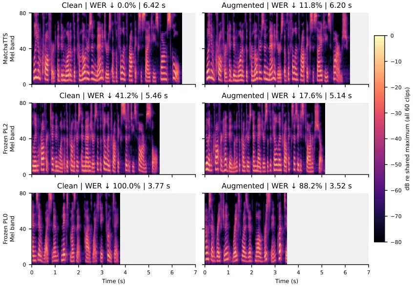

Figure 33: LJ006-0020: all three systems under both input views. WER
uses the clean reference; gray after a panel ends indicates no generated
audio. Axes are shared within this example; the color reference is
shared across all ten examples.

Whisper hypotheses (normalized, as scored).

| System     | Clean audio                                                                                             | Augmented audio                                                                                       |
| ---------- | ------------------------------------------------------------------------------------------------------- | ----------------------------------------------------------------------------------------------------- |
| MatchaTTS  | william crawford had been one of the promoters and managers of the philanthropic society is farm school | william crawford had been one of the promoters and managers of the philanthropic society is farms     |
| Frozen PL2 | lynn crawford tedbin one of the promoters and managers of the philanthropic societies farms             | lillian crawford had been one of the prompters and managers of the philanthropic society is farm show |
| Frozen PL0 | and then we met my husband kyle is wife dave fruits                                                     | of gravestone and rice residue while bristling cut to                                                 |

## Appendix H Computational Properties, Training Recipe, and Responsible Asset Use

This appendix describes computational cost, the training configuration,
and the source-code workflow. It also records the provenance and reuse
conditions of the datasets and software used in the experiments.

### H.1 Computational Properties and Sample Budget

Let $`B`$ be the number of sequences actually encoded per view, $`V`$
the number of views, $`N`$ the padded input length, $`M`$ the
latent-canvas length, $`d`$ the width, $`h`$ the number of attention
heads, and $`L_{e},L_{d}`$ the encoder and decoder depths. Let $`K=257`$
be the output vocabulary size. The bounds describe dense operations in
the supplied implementation. Additional sampled negatives are included
in $`B`$; the sampler’s nominal batch size need not equal this effective
count.

A forward pass through the encoder, Gaussian resampling, decoder, and
token head costs

```math
\displaystyle O\!\left(BV\left[L_{e}(Nd^{2}+N^{2}d)+L_{d}((N+M)d^{2}+(M^{2}+MN)d)+NMd+MdK\right]\right).
```

The terms account for projection/feed-forward layers, encoder
self-attention, decoder self/cross-attention, Gaussian resampling, and
token logits. Backpropagation has the same asymptotic arithmetic order.
The decoder produces all positions in parallel, but attention remains
quadratic in sequence length. Gaussian resampling is evaluated even when
an equal-length identity branch replaces its result, so this computation
is included in the bound.

The parameter count scales as $`O((L_{e}+L_{d})d^{2}+Kd)`$, apart from
positional buffers; gradients and AdamW states require the same
asymptotic parameter storage. A conservative dense training-activation
bound is

```math
\displaystyle O\!\left(BV\left[(L_{e}N+L_{d}(M+N))d+h\{L_{e}N^{2}+L_{d}(M^{2}+MN)\}+MN+MK\right]\right).
```

Attention kernels can reduce materialized score storage without changing
the dense arithmetic bound. Resampling processes target positions in
chunks of at most 256, bounding the temporary weight block by
$`O(BV\min(M,256)N)`$. The training bound also accounts for concatenated
outputs and tensors retained for backward.

For $`P`$ random projections, VISReg projection and per-projection
sorting cost $`O(V(BdP+PB\log B))`$, in addition to centering and scale
terms. With projection chunks of size $`P_{c}`$, the forward workspace
is bounded by $`O(VBd+VBP_{c}+dP_{c})`$, excluding backward state. The
CL defaults use $`P=P_{c}=256`$. Token regularization samples one
position per sentence, so this branch operates on $`B`$ sampled states
per view rather than all $`BM`$ positions. Pooling and dense cross-view
agreement still require $`O(BVMd)`$ operations.

For $`n_{q}`$ queries and $`n_{g}`$ candidates, the exact positional
retrieval diagnostic costs $`O(n_{q}n_{g}Rd)`$, where $`R=16`$ sampled
relative positions give $`Rd=8{,}192`$ coordinates. A query block of
size $`Q`$ needs $`O(Qn_{g})`$ score storage, in addition to stored
features of order $`O((n_{q}+n_{g})Rd)`$. The default $`Q=64`$ limits
score workspace but does not remove the quadratic all-pairs cost. Saving
full canvases instead requires $`O(nMd)`$ storage. Forming and
decomposing a $`d`$-dimensional covariance matrix costs
$`O(nd^{2}+d^{3})`$.

Over $`S`$ optimizer steps, training costs $`S`$ times the per-step
forward/backward cost, plus optimizer updates. PL and CL use a
five-epoch budget and nominal training batch size 36; their samplers
determine the corresponding number of optimizer steps. The prepared PL
and CL training sets contain 8,635,993 and 8,656,553 rows, respectively;
their split construction and duplicates are described above. Evaluation
uses 40,000 unique targets and 1,024 disjoint calibration targets, while
TTS uses 9,170 training and 3,930 validation utterances. These empirical
budgets specify the scale of the experiments; the theoretical results
concern information retention and population risk. Bootstrap intervals
describe the sampled evaluation cohort and do not quantify variation
across retraining seeds.

### H.2 Executable Defaults and Training Details

The effective settings are obtained by merging the shared configuration
with each variant’s overrides, then applying unoverridden parser and
MatchaTTS configuration defaults. All models use a nominal training
batch size of 36. The accompanying code package contains the full
configs/experiment.json, provenance/parser_defaults.json, the MatchaTTS
configuration tree, pinned requirements, and a Slurm launcher that
prints every command with --dry-run. Together, these files specify the
full execution recipe.

#### PL.

The launcher uses seed 42, width 512, eight heads, four encoder layers,
two decoder layers, a 2,048-position cap, zero dropout, and resampling
temperature 0.3. AdamW uses learning rate $`5\times 10^{-5}`$, weight
decay 0.01, betas $`(0.9,0.98)`$, 5% warmup followed by cosine decay to
0.0005 of the initial rate, gradient clipping at 1, and enabled
automatic mixed precision. Training lasts five epochs with no additional
positive step cap. The nominal batch is 36, with eight workers, bucket
factor 32, and prefetch factor 4. Each canonical item supplies three
easy and two hard augmented views in addition to its clean view. The
sampler requests six informal and sixteen negated examples, and the
default unrelated pool has sixteen entries. The remaining shared
objective settings are $`n_{\rm pad}=4`$, $`\tau=0.5`$, $`\eta=0.1`$,
$`\gamma=1`$, $`\alpha=0.5`$, $`\beta=0.3`$, and $`m_{1}=m_{2}=0.2`$.

PL0 selects the latent objective with $`\lambda=1`$ and VISReg weight
0.3. PL1 uses batch 36 and eight unrelated entries. PL2 and PL3 set
VISReg weights 0.1 and 0.5. PL4, PL5, PL6, and PL7 respectively set
$`\alpha`$, $`\beta`$, $`\eta`$, and $`m_{2}`$ to zero. Checkpointing
and validation occur every 2,000 steps; logging occurs every 50 steps.
The probe interval is 4,000 steps with 400 probe epochs and 160
evaluation texts. The historical PL5 budget exception and the recorded
PL0/PL2/PL3 checkpoint steps remain as stated in Appendix B.6; the
variant mapping identifies the corresponding experimental comparisons.

#### CL.

The default training seed is 1; the data seed is 2027. The nominal batch
is 36 with eight workers, and the width, heads, encoder/decoder depths,
length cap, dropout, resampling temperature, learning rate, decay,
warmup, gradient clip, and five-epoch budget match the settings above.
CL uses oracle lengths and recoverable corruption. All four primary arms
use VISReg weight 0.01; LP/LT use latent agreement and GP/GT use token
grounding, with pooled/token regularization selected by the final
letter. VISReg center, scale, and shape weights are one, with shape
standard-deviation floor 0.1 and global views 0 and 2. The data
preparation fractions are 0.90/0.05/0.05, the streaming shuffle buffer
is 10,000, insertion probability is 0.1, and the maximum insertion run
is two. The round-trip audit checks 4,096 accepted examples. Nonfinite
batches follow the configured skip policy. Logging is every 50 steps,
validation/checkpointing every 2,000, and monitoring every 4,000.

#### Speech and evaluation.

The MatchaTTS recipe uses seed 42, Adam at $`10^{-4}`$ with zero weight
decay, batch 36, twelve data workers, gradient clipping at 5, mixed
bfloat16 precision, and 1,000 epochs. Its architecture and frozen-state
interfaces are provided in the code and Appendix D. Stored augmentation
is selected with probability 0.7. Evaluation uses ten flow steps,
temperature and length scale one, and Whisper large-v3 with float16
inference, English normalization, and beam size five. Text evaluation
uses seed 9027, batch four, retrieval blocks of 64, and 500 bootstrap
replicates. The executable TTS default is 1,000 bootstrap replicates;
the retrospective manuscript WER audit uses 10,000. The executable
geometry subset defaults to 2,048 items; the historical PCA diagnostic
uses the separately reported 4,096-item subset. The audit and plotting
settings identify the corresponding reported analyses.

#### Environment and selection record.

The supplied recipe targets Python 3.10–3.12, PyTorch/torchaudio 2.8.0,
torchvision 0.23.0, and CUDA 12.8 wheels. All other direct Python
requirements are version-pinned, including NumPy 1.26.4, Transformers
4.53.3, Datasets 3.6.0, Lightning 2.5.2, and sentence-transformers
5.0.0. GCC/C++, eSpeak NG, FFmpeg, and a compatible CUDA/cuDNN runtime
are system prerequisites. Setup checks dependency consistency and
records the installed environment. The evaluation environment is
reported separately in Appendix B.6. Training uses the author-confirmed
configuration and explicit variant settings described above. The Slurm
launcher records resource requests and leaves cluster-specific account
and partition fields configurable.

### H.3 Reproduction Workflow

The companion archive supplies data preparation, PL/CL training, feature
extraction, text evaluation, speech training, and figure generation,
together with pinned dependencies and Slurm instructions. The workflow
prepares the corpus, trains the selected models, and passes their
outputs to the evaluation and plotting stages. The README gives the
setup commands, configuration fields, and output locations; --dry-run
prints the complete command and dependency plan before submission.

Corpus input is configured through CANOPE_DATASET_ID or the documented
local CSV/JSONL interface. The compilation is hosted at
[https://huggingface.co/datasets/avalonai/english-singlish-g2p](https://huggingface.co/datasets/avalonai/english-singlish-g2p).
The schema, filtering rules, split construction, and prepared-data
counts are specified in Appendix B.6. Run manifests record
configuration, data provenance, and evaluation identities so that
comparisons use consistent inputs. The numeric summaries and row-level
speech results also support the supplied figure scripts and paired WER
audit.

### H.4 Attribution, Licenses, Consent, and Sensitive Content

#### Attribution and licenses.

The component corpora are credited in Appendix B.6. Reused encoders,
MatchaTTS, HiFi-GAN, and Whisper are cited in the evaluation and speech
sections. Benchmark attribution includes LexNorm (Baldwin et al., 2015),
SemAntoNeg (Vahtola et al., 2022), PAWS (Zhang et al., 2019), STS-B (Cer
et al., 2017), and SICK (Marelli et al., 2014). The authors assembled
the training compilation from the component corpora identified in
Appendix B.6. The code preserves upstream software notices, and its
requirements identify external libraries and versions.

The compilation card specifies Apache-2.0, while component data retain
their original terms. LJSpeech declares its audio and transcriptions
public domain; LibriSpeech specifies CC BY 4.0; and CANNOT specifies CC
BY-SA 4.0.¹¹ 1 Creator and dataset pages:
[https://keithito.com/LJ-Speech-Dataset/](https://keithito.com/LJ-Speech-Dataset/),
[https://www.openslr.org/12/](https://www.openslr.org/12/), and
[https://huggingface.co/datasets/tum-nlp/cannot-dataset](https://huggingface.co/datasets/tum-nlp/cannot-dataset).
Wikipedia text is distributed under attribution/share-alike terms, with
the applicable version determined by the source revision.²² 2
Wikipedia’s licensing transition is documented at
[https://creativecommons.org/2023/06/29/wikipedia-moves-to-cc-4-0-licenses/](https://creativecommons.org/2023/06/29/wikipedia-moves-to-cc-4-0-licenses/).
The supplied MatchaTTS and HiFi-GAN source includes MIT license notices.
The companion asset inventory records asset-specific provenance and
licensing information; separately distributed data and model weights
remain subject to their respective release terms. The compilation label
does not replace these component conditions.

#### Data-provider and consent context.

This study reuses publicly released corpora distributed by their
original providers and curators. It involved no new participant
recruitment, crowdsourcing, or collection of private messages. The
authors’ contribution to the dataset was aggregation and preparation for
the experiments. Collection procedures and participant-consent
conditions belong to the original source releases and are described in
the cited curator documentation; aggregation does not introduce a new
participant-consent process. This statement describes the context of
secondary use rather than asserting independently obtained consent from
every person mentioned in the source text.

#### Potentially sensitive content.

Personal messages, user-authored text, and historical material can
contain identifying details, offensive language, or stereotypes.
Informal-language and negation transformations can preserve or alter
this content. The experiments analyze aggregate representation and
speech metrics; data-validity and invertibility checks address the
experimental protocol rather than sensitive-content screening. Reuse of
individual examples should therefore follow the source terms and take
the original content context into account.
