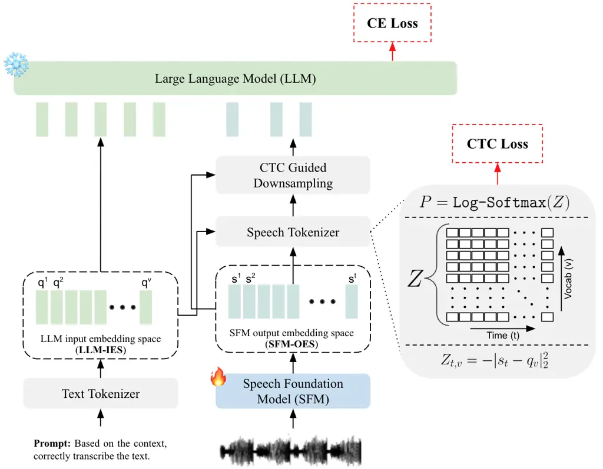
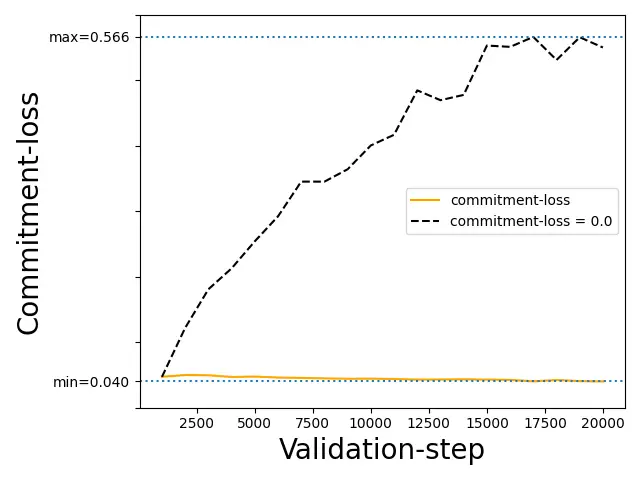
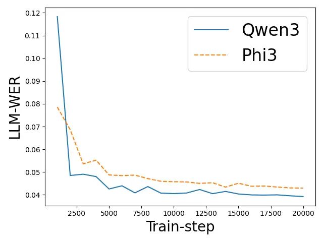
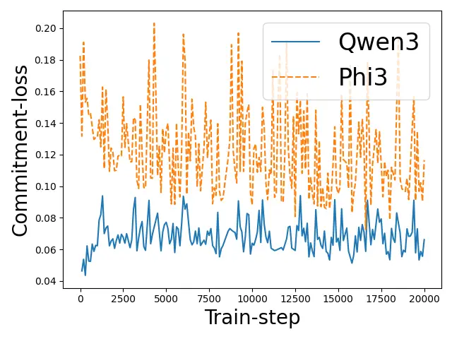
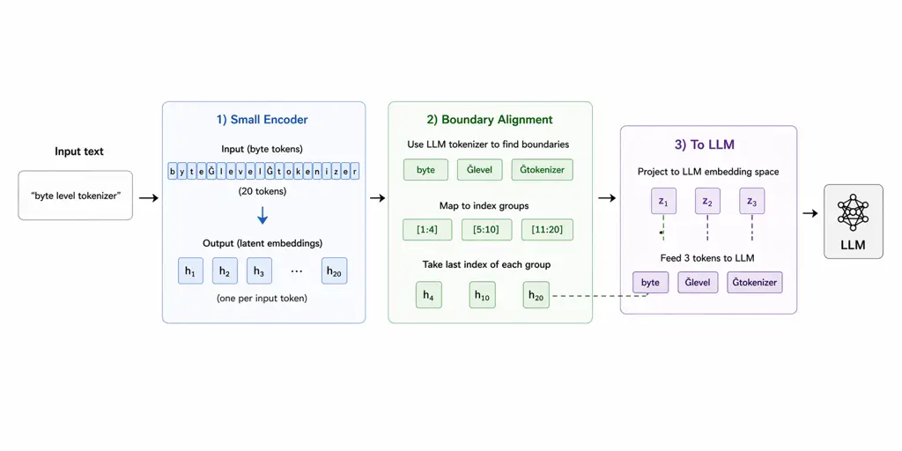
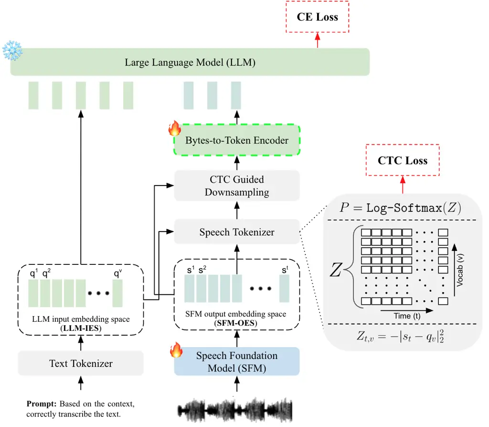

# DirectSpeech2LLM: A Simple End-to-End Framework to Mitigate Prompt Overfitting in Speech-LLMs

Hemant Yadav ^(†)^(†)thanks: indicates the corresponding author.
Affiliation: IIIT Delhi, India Email: [hemantya@iiitd.ac.in](mailto:)   
Sunayana Sitaram Affiliation: Microsoft Research, India
Email: [sunayana.sitaram@microsoft.com](mailto:)    Roger Zimmermann
Affiliation: National University of Singapore
Email: [dcsrz@nus.edu.sg](mailto:)    Rajiv Ratn Shah Affiliation: IIIT
Delhi, India Email: [rajivratn@iiitd.ac.in](mailto:)

###### Abstract

Speech-LLMs often exhibit prompt overfitting, where models solely
trained on automatic speech recognition (ASR) instruction fail to
generalize to new instructions such as speech translation and continue
to behave primarily as ASR system. We propose DirectSpeech2LLM, a simple
end-to-end framework that preserves the instruction-following ability of
the LLM on unseen tasks when conditioned on speech. It computes
distance-based CTC loss over the frozen LLM embedding matrix and uses
greedy CTC labels to derive geometrically and temporally aligned speech
embeddings respectively as an input to the LLM. Trained solely on 960
hours of LibriSpeech ASR data, DirectSpeech2LLM outperforms the cascaded
system on ASR (seen task) and generalizes zero-shot to speech
translation and emotion recognition (two unseen tasks), closely matching
the cascaded system upper bound on these two new instructions despite
seeing neither during training. We also find that geometric alignment
strength plays a smaller role than previously assumed, as our modified
CTC loss is shown to provide sufficient implicit geometric grounding
without requiring an explicit regression loss. Results are consistent
across two LLM families and scale with both more training data and model
capacity.

^(†)^(†)footnotetext: Code available at:
[https://github.com/raotnameh/DirectSpeech2LLM](https://github.com/raotnameh/DirectSpeech2LLM)

## 1 Introduction



Figure 1: Overview of DirectSpeech2LLM. Given an input speech signal,
the SFM produces frame representations $`s_{t}\in\mathbb{R}^{d}`$, where
$`d`$ matches the dimensionality of the LLM input embeddings $`Q`$.
Logits are computed as negative squared distances ($`Z_{t,v}`$) followed
by log-softmax and CTC loss ($`\mathcal{L}_{\text{ctc}}`$) is applied.
Next, the resulting greedy CTC predicted labels are then used to
downsample SFM output embeddings via mean pooling. The LLM is fed with
the resulting updated sequence embeddings from SFM and is trained with
cross-entropy loss ($`\mathcal{L}_{\text{llm}}`$). The reader should
keep in mind that the LLM-IES serves only as a geometric anchor for the
SFM-OES, without being replaced or discretized with the LLM input
embeddings. Commitment loss is not shown in the figure for clarity.

Large language models (LLMs) have shown a remarkable ability to learn
rich linguistic information from raw text, enabling strong
generalization across language understanding, generation, and reasoning
tasks \[1, 2, 3\]. Speech, in contrast, is a continuous acoustic signal
that conveys the same underlying linguistic information that LLMs
already represent effectively in discrete textual form. The ability of a
pretrained LLM (the “brain”) to process auditory inputs (the “ears”)
while preserving its original generalization ability is referred to as a
desirable Speech-LLM \[4\]. Speech also encodes other information such
as speaker identity, prosody, and noise \[5\]. However, current large
audio language models are shown to behave largely as transcription
systems, relying on lexical semantics and underutilizing acoustic cues
\[6\]. This work focuses on improving the linguistic modeling of
Speech-LLMs to new tasks not seen during training and leave improving
non-linguistic modeling for future.

Enabling LLMs to process linguistic content present in speech requires
transforming speech into embeddings aligned with the LLM input embedding
space (IES) along two dimensions: geometric and temporal \[7\].
Geometric alignment ensures that speech derived embeddings are
consistent with the geometry of the trained LLM-IES by minimizing a
distance metric. Temporal alignment ensures that the embedding sequence
exhibits statistical properties consistent with those observed during
LLM training.

Existing Speech-LLMs connect a pretrained speech foundation model (SFM)
to an LLM using a projection module¹¹ 1 for simplicity, from now on we
assume the projection module is also part of SFM., implemented using a
linear layer \[8, 9\], non-linear layers \[10\], CNN layers \[11\],
Q-former \[12\] or a combination of them. While effective on seen tasks,
current models often fail to generalize to unseen tasks \[13\] or prompt
overfitting²² 2 The terms prompt overfitting and failure to generalize
to unseen tasks are used interchangeably to describe the same
phenomenon. Both refer to the loss of the original instruction-following
ability of the underlying LLM in Speech-LLMs. For example, a Speech-LLM
model trained solely on ASR task continues to behave as an ASR system
even when prompted differently to perform translation or question
answering \[4, 14\].

We hypothesize that this lack of generalization arises because of two
factors. First, the SFM output embedding space (OES) is not constrained
geometrically with the LLM-IES, so embeddings can occupy arbitrary
regions in $`\mathbb{R}^{d}`$ during training, degrading the LLM’s
generalization ability. Prior work has shown that LLMs do tolerate small
perturbations in their input embeddings, but performance degrades
sharply beyond a threshold \[15\]. Since the LLM is frozen, only the SFM
outputs can be constrained to lie close to the LLM-IES, otherwise the
system reduces to a task-specific pipeline similar to Whisper \[16\].

Second, most approaches rely on fixed temporal downsampling \[17, 18,
19\], which is inherently misaligned with the highly variable temporal
dynamics of continuous speech. Because phoneme durations vary across
speakers, speaking rates, and linguistic contexts, fixed downsampling
produces inconsistent sequence boundaries for identical linguistic units
causing overfitting. Consequently, the embedding sequence length for a
given token becomes an artifact of speaking rate rather than semantic
content. Given the LLM is fixed, such temporal mismatch shifts the input
distribution away from that seen during LLM’s training, impacting its
generalization ability \[20\].

In this work, we propose DirectSpeech2LLM, a simple end-to-end
Speech-LLM framework that jointly enforces geometric and temporal
alignment. Figure 1 illustrates the overall framework. To save compute
time DirectSpeech2LLM is trained in two stages to save on compute time.
In Stage 1, the SFM is trained using a modified CTC objective augmented
with vector quantization (VQ) to enforce alignment along the two
dimensions of LLM. In Stage 2 (end-to-end), we add the LLM cross-entropy
loss to the Stage 1 objectives to further improve performance.

AlignFormer enforces temporal alignment by dynamically downsampling the
speech embeddings using Connectionist Temporal Classification (CTC) to
match the LLM’s input temporal distribution \[13\]. However, they do not
enforce geometric constraint between the SFM-OES and LLM-IES. A similar
work, Wav2Prompt \[7\] uses continuous integrate-and-fire (CIF) module
to align temporally and regression loss to map speech embeddings to
equivalent LLM tokens but suffers from a train/inference mismatch due to
length dependent weight scaling and the performance is very sensitive to
geometric alignment strength on unseen tasks, unlike our method.

Empirically, DirectSpeech2LLM achieves strong performance on ASR (seen
task) and generalizes zero-shot to speech translation and emotion
recognition (two unseen tasks or two new instructions). DirectSpeech2LLM
also demonstrates robustness to out-of-domain setting on the ASR task,
similar to CTC trained methods, which is shown to be a limitation of
simple adapter based methods \[21, 22\].

Our main contributions are as follows.

1.  1.  We propose DirectSpeech2LLM, a simple end-to-end Speech-LLM
        framework that preserves LLM’s generalization ability to new
        instructions without relying on (i) large amount of multitask
        instruction tuning dataset or (ii) costly multiple forward passes to
        LLM.
2.  2.  Our method treats CTC as a primary objective rather than an
        auxiliary loss, giving the SFM three independently usable operating
        modes at test time: (i) standalone CTC-based ASR, (ii) CTC $`+`$
        n-gram LM ASR, or (iii) full end-to-end Speech-LLM. Unlike most
        prior approaches that tightly couple the SFM and LLM into a single
        pipeline, SFM output embeddings here are fed directly to the LLM
        without any projection module, discretization, or separate adapter –
        hence the name DirectSpeech2LLM.

The rest of the paper is organized as follows: Section 2 reviews related
work, Section 3 describes the proposed method, Section 4 details the
experimental setup, Section 5 presents results and ablations, and
Section 6 concludes with future directions and limitations.

## 2 Related works

Recent advancements in Speech-LLMs have explored various strategies to
align SFM with LLM. One common direction focuses on solving the modality
gap through behavior alignment. BLSP \[23\] trains Speech-LLMs to mimic
LLM responses to repeat task based prompts. While this improves
zero-shot capabilities, performance lags behind instruction-tuned
models. SALAD \[14\] extends this work by combining cross-modal
distillation with targeted synthetic data to improve alignment. But
behavior alignment methods require two LLM forward passes during
training, roughly doubling compute, compared to one forward pass in
instruction tuned methods. Other approaches rely on computationally
expensive large-scale synthetic or data-driven pretraining to preserve
LLM generalization capabilities \[24, 12, 11, 25\]. Behavior alignment
is applied on the LLM-OES while our method is aligning the LLM-IES.
Therefore, these two are complementary and can be applied together.

Another direction, focuses on temporal alignment using CTC. In the
context of Speech-LLMs AlignFormer \[13\] utilizes CTC alignments as a
temporal guide to form dynamic windows for a Q-Former adapter. A similar
work is Soundwave \[25\] which uses simple projection layers instead of
Q-former. LegoSLM \[26\] bypass adapters completely by utilizing CTC
posterior distributions and finetune the LLM. It computes a weighted sum
of the LLM’s existing text embeddings based on CTC posteriors to create
pseudo-speech embeddings. While TASU \[27\] uses simulated pseudo CTC
erroneous text during training to learn the adapter without using paired
speech data.

Prior speech translation work \[28, 29\] separates temporal alignment
(CTC) and distribution-level geometric alignment (Optimal Transport).
DirectSpeech2LLM unifies both by computing CTC logits as negative
squared distances to frozen LLM embeddings as fixed codebooks, jointly
achieving dynamic temporal compression and geometric grounding.

Unlike Wav2Prompt \[7\], which uses CIF followed by regression,
DirectSpeech2LLM uses modified CTC to compute logits as negative squared
distances to the frozen LLM embedding matrix. As CTC is the canonical
ASR framework, DirectSpeech2LLM provides a conceptually simpler and
robust, single objective solution that unifies temporal and geometric
alignment without extra hyper parameters or mismatch between
train/inference. Wav2Prompt also collapses if regression loss
(geometric) is removed compared to our method where commitment loss
(geometric) is optional as CTC implicit has geometric constraint, making
our method simpler. Lastly the geometric loss used in Wav2Prompt does
not take into account negative LLM token embeddings, whereas our
distance-based logits i.e., move the positive embedding closer while
negative embeddings are pushed farther apart. This could be the reason
for our method’s less sensitivity to the regression loss

Different to AlignFormer \[13\], which uses CTC to handle temporal
alignment but leaves the SFM-OES geometrically unconstrained.
DirectSpeech2LLM enforces geometric grounding using distance-based
logits (implicit) and a commitment constraint (explicit). Which is shown
to prevent prompt overfitting without relying on input ordering tricks
as in Alignformer. Again, AlignFormer input ordering trick is
complementary to our method both can be applied together.

## 3 Method

### 3.1 Preliminaries

Please refer to Section A.1 for preliminaries.

### 3.2 Problem formulation

Let $`X=(x_{1},\dots,x_{M})`$ denote an input acoustic sequence and
$`Y=(y_{1},\dots,y_{U})`$ its corresponding ground truth labels, where
$`y_{u}\in\mathcal{V}_{\text{ctc}}\subseteq\mathcal{V}_{\text{llm}}`$.
We assume a trained LLM ($`\mathcal{M}_{\theta}`$) with frozen
parameters $`\theta`$ and embedding matrix
$`Q\in\mathbb{R}^{|\mathcal{V}_{\text{llm}}|\times d_{\text{llm}}}`$.
where each row $`q_{j}`$ uniquely corresponds to one of the LLM’s
vocabulary embedding. The SFM produces frame level embeddings with the
same dimension as $`\mathcal{Q}`$.

```math
E_{\phi}:X\mapsto S=(s_{1},\dots,s_{T}),\quad s_{t}\in\mathbb{R}^{d_{\text{llm}}},
```

Our objective is to learn $`\phi`$ such that $`S`$ is aligned with
LLM-IES i.e., each $`s_{t}`$ lies closer to its equivalent in $`Q`$ in
both temporal and geometric dimensions.

### 3.3 Speech tokenizer

Speech Tokenizer computes frame level logits given (i) SFM output
embeddings and (ii) LLM input embedding matrix $`\mathcal{Q}`$ using
negative squared Euclidean distance similar to \[30\].

```math
Z_{t,v}=-|s_{t}-q_{v}|_{2}^{2}. \tag{1}
```

Expanding,

```math
Z_{t,v}=-\left(\lVert s_{t}\rVert_{2}^{2}-2s_{t}^{\top}q_{v}+\lVert q_{v}\rVert_{2}^{2}\right). \tag{2}
```

Since $`\lVert s_{t}\rVert_{2}^{2}`$ does not depend on $`v`$, this
formulation is equivalent to a linear projection with fixed weights
$`Q`$. This is equivalent to selecting the nearest token embedding in
the LLM input embedding space.

The LLM has a large vocabulary $`\mathcal{V}_{\text{llm}}`$ in thousands
if not hundreds of thousands. Directly using this vocabulary for CTC
loss is suboptimal. CTC training is more stable and sample efficient
when prediction units correspond to smaller, frequently occurring
acoustic segments.

To obtain acoustically suitable prediction units, we instead construct a
dedicated CTC vocabulary $`\mathcal{V}_{\text{ctc}}`$ using byte-pair
encoding (BPE) trained on the normalized LibriSpeech transcripts³³ 3
[https://openslr.trmal.net/resources/11/librispeech-lm-norm.txt.gz](https://openslr.trmal.net/resources/11/librispeech-lm-norm.txt.gz).
We use a vocabulary size of 1000, which is a widely adopted starting
point in end-to-end ASR systems, particularly for CTC and seq2seq
baselines on the LibriSpeech dataset, as it provides a favorable
trade-off between sequence length and acoustic consistency⁴⁴ 4
[https://speechbrain.readthedocs.io/en/stable/tutorials/tasks/speech-recognition-from-scratch.html](https://speechbrain.readthedocs.io/en/stable/tutorials/tasks/speech-recognition-from-scratch.html).
In the next step, we discard tokens which do not appear in the Qwen-3
LLM tokenizer vocabulary, resulting in 984 valid tokens for computing
CTC loss (see Algorithm 2 in Section A.7 for pseudo code). For
experiments with Phi-3, we initialize BPE with 2000 merge operations to
obtain a final retained subset comparable in size to that derived from
Qwen-3. The reader should keep in mind that the LLM still
generate/output tokens over its original full vocabulary space.

During training, frame level logits are computed over the full LLM
embedding matrix $`Q`$ followed by log-softmax, meaning the negatives in
the softmax function are consisting of the full LLM vocabulary. This is
different from Wav2Prompt. Our earlier experiments showed that it
resulted in better geometric alignment during stage 1. The final CTC
loss is calculated only over $`\mathcal{V}_{\text{ctc}}`$ vocabulary
indices. We obtain:
$`P_{\text{ctc}}=\mathrm{logsoftmax}(Z[\mathcal{V}_{\text{ctc}}]).`$ The
CTC objective is then:

```math
\mathcal{L}_{\text{ctc}}=-\log\sum_{\pi\in\mathcal{B}^{-1}(Y)}\prod_{t=1}^{T}P_{\text{ctc}}(\pi_{t}\mid t), \tag{3}
```

where $`\mathcal{B}`$ denotes the CTC collapse function. The modified
CTC loss enforces explicit temporal alignment and implicit geometric
alignment between the SFM-OES and the LLM-IES.

### 3.4 CTC guided downsampling

For each output frame of SFM, we compute a greedy label assignment:

```math
\hat{I}_{t}=\arg\min_{j}|s_{t}-q_{j}|_{2}^{2}. \tag{4}
```

Next, we partition the output embeddings into consecutive runs of
identical predictions. Let $`\mathcal{T}_{i}`$ denote the set of indices
belonging to the $`i`$-th run. Then each segment embedding is obtained
by mean pooling the corresponding identical labels.

```math
s_{i}^{\mathrm{seg}}=\frac{1}{|\mathcal{T}_{i}|}\sum_{t\in\mathcal{T}_{i}}s_{t},\qquad i=1,\dots,U^{\prime}.
```

Collecting all segment embeddings yields
$`S_{\mathrm{seg}}\in\mathbb{R}^{U^{\prime}\times d_{\mathrm{llm}}}`$,
where $`U^{\prime}`$ is the number of runs.

Lastly we global mean pool all the blank segments into 1 embedding. This
step compresses the original SFM output embedding sequence of length
$`T`$ into 1 blank embedding, followed by remaining non-blank
embeddings. The position of blank embedding is always at the start and
the equivalent token in $`Q`$ is underscore ( $`\_`$ ).

Exploring learnt embeddings for blank token and its ability to capture
paralinguistic information of the speech utterance is out of scope of
this work and is left for future work.

### 3.5 Commitment loss

Using the greedy CTC labels from Equation 4, we explicitly constrain SFM
outputs to be close to the pretrained LLM-IES using a commitment loss:

```math
\mathcal{L}_{\text{commit}}=\frac{1}{\sqrt{d_{\text{llm}}}}\sum_{t=1}^{T}M_{t}|s_{t}-q_{\hat{I}_{t}}|_{2}^{2}. \tag{5}
```

Where $`M_{t}=\mathbbm{1}[\hat{I}_{t}\neq b]`$ is the mask of valid
indices excluding blank token $`b`$. Commitment loss is not applied to
the blank token indices because it does not encode linguistic
information of the input utterance that has an equivalent in $`Q`$.
Blank embedding is similar to Prefix-Tuning in LLM \[31\], that is it is
same for all the samples in training.

The reader should keep in mind that the modified CTC loss (in Section
3.3) itself encourages the SFM output to lie closer to the LLM-IES
geometrically, not as directly as using a commitment loss.

### 3.6 LLM

The segmented embeddings ($`S_{\mathrm{seg}}`$) are concatenated with
prompt embeddings $`E_{p}`$ (e.g., “Prompt: Correctly transcribe the
following text:”). The resulting interleaved sequence is fed to the LLM
and is trained using a standard auto regressive cross-entropy loss over
the target text sequence $`Y=(y_{1},\dots,y_{U})`$.

```math
\mathcal{L}_{\text{llm}}=-\sum_{u=1}^{U}\log p_{\theta}(y_{u}\mid X=[E_{p}=Q(Prompt),S_{\text{seg}}],y_{<u}).
```

### 3.7 Overall training objective

The final loss is:

```math
\mathcal{L}=\mathcal{L}_{\text{ctc}}+\mathcal{L}_{\text{commit}}+\lambda_{\text{llm}}\mathcal{L}_{\text{llm}}. \tag{6}
```

The commitment loss is clamped to never exceed CTC loss because its
targets are derived from greedy CTC predictions, meaning commitment loss
is logically downstream of CTC. If CTC predictions are poor, the greedy
labels are noisy, and the commitment loss would be pushing SFM
embeddings toward incorrect geometric anchors in the LLM-IES.

Only the SFM parameters, $`\phi`$, are optimized and the LLM parameters
are fixed. Training proceeds in two stages. In stage 1 we set
$`(\lambda_{\text{llm}}=0)`$. In the stage 2 (end-to-end) the LLM loss
is enabled, allowing contextual feedback from the frozen LLM to further
improve performance. For full training pseudocode see Algorithm 1 in
Section A.7.

## 4 Experimental details

### 4.1 Training data

All models are trained using only the English ASR data (single task
training setup) with SpecAugment \[32\].

LibriSpeech: We train on the full 960-hour LibriSpeech corpus \[33\].
This is referred as 1k data.

Common Voice: We additionally experiment with training on combined 1800
hours of the English subset of Mozilla Common Voice (version 24) \[34\]
and 960 hours LibriSpeech. We use the official train split and no
additional filtering or data cleaning is applied. This is referred as
2.8k data.

### 4.2 Model configuration

LLM Backbone: We use Qwen3-4B⁵⁵ 5
[https://huggingface.co/Qwen/Qwen3-4B](https://huggingface.co/Qwen/Qwen3-4B)
and Phi3.1-3.8B⁶⁶ 6
[https://huggingface.co/microsoft/Phi-3-mini-128k-instruct](https://huggingface.co/microsoft/Phi-3-mini-128k-instruct)
from HuggingFace as the language model backbone. All parameters of the
LLM, including its token embedding matrix $`Q`$, remain frozen during
training.

SFM backbone: It is initialized from the ASR finetuned Data2Vec-Large
\[35\] checkpoint having 24 transformer layers ($`\approx`$300 million
parameters). The original linear CTC head is removed and reinitialized
to match the LLM input embedding dimension and is retrained with the
modified CTC loss during stage 1.

### 4.3 Training procedure

Training proceeds in two stages. Stage 1 is computationally cheap to
temporally align SFM-OES and act as a good starting point for stage 2
training to save on compute. All training runs use only English ASR
data, no other task specific supervised finetuning is done in any way,
unless mentioned otherwise. All models are trained for a fixed number of
optimization steps, rather than until convergence. Specifically, Stage 1
is trained for 50k steps, while Stage 2 is trained for 20k steps, unless
mentioned otherwise. For more training details, please refer to Section
A.2.

### 4.4 Evaluation procedure

During training both the blank embeddings and non blank embedding were
fed to the LLM (WB setup). During inference for the ASR task, we follow
the same setup. But on unseen tasks, we find that not using blank tokens
(NB setup) consistently gives better results. Therefore we do not use
blank token when evaluating on unseen tasks (NB setup). We use different
task prompts for each task as shown in Figure 6 in the Section A.8. We
use mms text normalization⁷⁷ 7
[https://github.com/facebookresearch/fairseq/blob/main/examples/mms/data_prep/text_normalization.py](https://github.com/facebookresearch/fairseq/blob/main/examples/mms/data_prep/text_normalization.py)
to normalize the LLM output and ground truth.

Automatic Speech Recognition (ASR): We evaluate in-domain ASR
performance on the LibriSpeech test-clean and test-other splits and
out-of-domain (OOD) using VoxPopuli (VP) test set \[36\]. The number of
LLM output words are clamped at
$`\max(\text{CTC}+5,\;\lfloor 1.1\times\text{CTC}\rfloor)`$. Performance
is measured using Word Error Rate (WER) computed with the jiwer toolkit.

Speech Translation (ST): Zero-shot speech translation is evaluated on
CoVoST2 \[37\] dataset for English-German (en-de) and English-Chinese
(en-zh) split. No translation data is used during training. The LLM
output characters are clamped at $`\lfloor 2\times\text{CTC}\rfloor`$
Performance is measured using BLEU computed with the SacreBLEU toolkit⁸⁸
8 SacreBLEU (v2.3.1):
nrefs:1\|case:mixed\|eff:no\|tok:13a,zh\|smooth:exp.

Spoken Question Answering (SQA): We evaluate zero-shot spoken question
answering using the IEMOCAP emotion recognition (ER) dataset \[38\] with
the standard 4-class (angry, happy, neutral, and sad) setup using set 5.
Performance is reported using classification accuracy. This task is
primarily to study the instruction following rate (IFR) of the model,
that is, can the model follow new instructions effectively different
from what seen during training?

## 5 Results

The closest prior works to DirectSpeech2LLM are LegoSLM, TASU, and
AlignFormer. LegoSLM uses CTC posterior probabilities to construct
weighted LLM input embeddings and finetunes the LLM on paired
speech-text data (ASR and en–de translation). TASU, in contrast,
simulates CTC erroneous text to train the adapter using text-only data
(ASR and en–zh translation). AlignFormer freezes the LLM and jointly
trains the SFM with a dynamic Q-Former adapter using only ASR paired
speech text data. Wav2Prompt is related but not directly comparable due
to its smaller SFM and an older family of LLM backbone, we only compare
its regression loss sensitivity to unseen tasks in Section 5.3.

|                                   |                 |                           |                    |                   |             |                    |
| --------------------------------- | --------------- | ------------------------- | ------------------ | ----------------- | ----------- | ------------------ |
| Model                             | LLM (Learnable) | Train data duration (hrs) | ASR (Librispeech)  | ST (CoVoST2)      |             | SQA (IEMOCAP)      |
|                                   |                 |                           | WER $`\downarrow`$ | BLEU $`\uparrow`$ |             | ACC $`\uparrow`$   |
|                                   |                 |                           | t-clean / t-other  | en-de             | en-zh       | Emotion            |
| Cascaded (CTC + LLM) (50k steps)  |                 |                           |                    |                   |             |                    |
| Whisper + LLM \[11\]              | LLama-7B        | \-                        | 2.7 / 5.2          | 18.2              | \-          | \-                 |
| Ours  ( Backbone )                | Phi3.1-3.8B     | 1k                        | 3.13 / 5.12        | 19.37             | 17.52       | 44.76 (IFR = 0.99) |
|                                   | Qwen3-4B        |                           | 2.35 / 4.57        | 19.88             | 34.03       | 42.98 (IFR = 1.00) |
| end-to-end (20k steps)            |                 |                           |                    |                   |             |                    |
| TASU \[27\]                       | Qwen2.5-1.5B    | 1k                        | 3.28 / 6.91        | \-                | 33.35 (SFT) | \-                 |
| LegoSLM \[26\]                    | Gemma-2B (L)    | 56k                       | \- / 5.2           | 21.1 (SFT)        | \-          | \-                 |
|                                   |                 | 1k                        | \- / 7.0           | \-                | \-          | \-                 |
| AlignFormer \[13\]                | Phi3.1-3.8B     | 38k                       | 3.52 / 6.47        | 15.70             | 10.97       | 31.18 (IFR = 0.99) |
|                                   |                 | $`\rightarrow`$ 1k        | 2.43 / 5.0         | \-                | \-          | \-                 |
| Ours  ( Backbone )                | Phi3.1-3.8B     | 1k                        | 2.47 / 4.71        | 16.82             | 16.49       | 37.50 (IFR = 0.99) |
|                                   | Qwen3-4B        |                           | 2.21 / 4.28        | 19.97             | 33.74       | 40.16 (IFR = 1.00) |
| Ours  ( Data size $`\uparrow`$ )  | Qwen3-4B        | 2.8k                      | 2.48 / 4.55        | 21.13             | 36.05       | 39.60 (IFR = 1.00) |
| Ours  ( Model size $`\uparrow`$ ) | Qwen3-1.7B      | 1k                        | 2.4 / 4.43         | 14.12             | 22.87       | 29.52 (IFR = 0.88) |
|                                   | Qwen3-4B        |                           | 2.21 / 4.28        | 19.97             | 33.74       | 40.16 (IFR = 1.00) |
|                                   | Qwen3-8B        |                           | 2.07 / 4.06        | 20.12             | 30.35       | 41.45 (IFR = 1.00) |

Table 1: Models marked with SFT uses supervised finetuning for that
task. DirectSpeech2LLM shows near perfect instruction following on two
unseen tasks, ST and ER as performance approaches to the upper bound of
cascade system showing LLM’s generalization ability to new instructions
is preserved. IFR, as explained in \[13\] is shown for SQA task.
\[($`\rightarrow`$) means continued training after 38k hours.\]

### 5.1 Main results

Table 1 compares DirectSpeech2LLM against three end-to-end systems on
three tasks: ASR, ST, and ER. The only seen task, ASR, during training
serves as the fair comparison between end-to-end and cascaded systems.

Despite training on only 1k hours of ASR data, DirectSpeech2LLM
outperforms all comparable systems on ASR, and achieves near perfect
instruction following on the two unseen tasks ST and ER (IFR = 1.00)
with performance closely matching the cascaded system. A cascaded system
passes discrete text to the LLM and therefore trivially preserves LLM’s
generalization ability. Our method approaches this upper bound zero-shot
corroborating our claim that DirectSpeech2LLM preserves the LLM’s
instruction following ability with speech as input, to unseen tasks.
When evaluated using the identical Phi3.1 backbone as AlignFormer, which
enforces temporal but not geometric alignment, our method shows
consistent improvement, confirming that the gains stem from the
methodology rather than the LLM backbone.

DirectSpeech2LLM also shows consistent scaling behavior: increasing ASR
training data from 1k to 2.8k hours further improves zero-shot
translation, and scaling the LLM backbone similarly improves
performance.

|                                                                |                            |                                                   |                       |                        |           |
| -------------------------------------------------------------- | -------------------------- | ------------------------------------------------- | --------------------- | ---------------------- | --------- |
| Hparams                                                        | ASR (WER $`\downarrow`$)   |                                                   |                       | ST (BLEU $`\uparrow`$) |           |
|                                                                | Cascaded                   | end-to-end                                        |                       |                        | Cascaded  |
|                                                                | CTC $`\rightarrow`$ +LLM   | CTC $`\;/\;`$ W(ith)B(lank) $`\;/\;`$ N(o)B(lank) |                       | WB $`\;/\;`$ NB        | CTC + LLM |
|                                                                | Libri-other (in-domain)    |                                                   | VP (out-of-domain))   | CoVoST2 (en-de)        |           |
| Stage 1: Modified-CTC (20k steps)                              |                            |                                                   |                       |                        |           |
| $`\rightarrow`$  $`\mathcal{L}_{\text{ctc}}`$                  | 4.88 $`\rightarrow`$ 4.86  | - / - / 100.00                                    | 16.14 / - / 100.00    | - / 0.00               | 19.89     |
| $`\rightarrow`$  $`+`$  $`\mathcal{L}_{\text{commit}}`$        | 4.94 $`\rightarrow`$ 4.85  | - / - / 16.05                                     | 16.18 / - / 26.43     | - / 10.44              | 19.92     |
| $`\rightarrow`$  $`+`$  30k steps                              | 4.57 $`\rightarrow`$ 4.55  | - / - / 15.91                                     | 15.98 / - / 25.24     | - / 13.57              | 19.99     |
| $`\rightarrow`$  $`+`$ CV                                      | 4.81 $`\rightarrow`$ 4.80  | - / - / 16.95                                     | 14.06 / - / 24.56     | - / 13.67              | 20.98     |
| $`\rightarrow`$  Phi3.1-3.8B                                   | 4.62 $`\rightarrow`$ 10.78 | - / - / 86.48                                     | 15.95 / - / 96.23     | - / 0.00               | 19.40     |
| Stage 2: Modified-CTC (50k steps) $`\;+\;`$ LLM-CE (20k steps) |                            |                                                   |                       |                        |           |
| $`\rightarrow`$  NB                                            | 4.63 $`\rightarrow`$ 4.62  | - / - / 4.63                                      | 15.81 / - / 13.64     | - / 19.02              | 19.92     |
| $`\rightarrow`$  $`-`$  $`\mathcal{L}_{\text{commit}}`$        | 4.62 $`\rightarrow`$ 4.61  | - / - / 4.26                                      | 15.94 / - / 13.77     | - / 15.87              | 20.00     |
| $`\rightarrow`$  WB                                            | 4.60 $`\rightarrow`$ 4.57  | - / 4.28 / 5.83                                   | 15.95 / 13.86 / 15.09 | 5.80 / 19.97           | 19.88     |
| $`\rightarrow`$  $`-`$  $`\mathcal{L}_{\text{commit}}`$        | 4.50 $`\rightarrow`$ 4.49  | - / 4.10 / 5.11                                   | 15.92 / 13.71 / 13.61 | 5.59 / 19.69           | 19.96     |
| $`\rightarrow`$  WB (decoding_E)                               | - $`\rightarrow`$ -        | - / 7.52 / -                                      | - / 15.55 / -         | 19.80 / 19.97          | -         |
| $`\rightarrow`$  WB $`+`$ \[13\]                               | 4.56 $`\rightarrow`$ 4.54  | - / 4.21 / 6.26                                   | 15.90 / 13.73 / 15.55 | 16.04 / 19.91          | 19.90     |
| $`\rightarrow`$  $`+`$ CV                                      | 4.88 $`\rightarrow`$ 4.85  | - / 4.55 / 7.71                                   | 14.18 / 12.56 / 15.01 | 5.01 / 21.13           | 21.02     |
| $`\rightarrow`$  Phi3.1-3.8B                                   | 4.53 $`\rightarrow`$ 5.35  | - / 4.71 / 7.54                                   | 15.96 / 14.31 / 15.26 | 1.57 / 16.82           | 19.37     |
| Stage 2: Linear-CTC (50k steps) $`\;+\;`$ LLM-CE (20k steps)   |                            |                                                   |                       |                        |           |
| $`\rightarrow`$ NB $`\ast`$                                    | 4.67 $`\rightarrow`$ 4.66  | - / - / 4.3                                       | 16.17 / - / 14.29     | - / 1.30               | 20.00     |
| $`\rightarrow`$ WB                                             | 4.64 $`\rightarrow`$ 4.64  | - / 4.21 / 5.13                                   | 16.05 / 13.78 / 14.13 | 1.71 / 18.43           | 19.97     |

Table 2: Ablation study of DirectSpeech2LLM on Stage 1 and Stage 2.
Assume Qwen3-4B model and LibriSpeech training data (1k) unless
mentioned otherwise. Results compare a cascaded interface (CTC + LLM)
with an end-to-end interface. WB and NB corresponds to With blank and No
blank setup in training and inference both. Different rows show training
setup and columns show inference setup. Hparams (rows) denote the effect
of different losses, extended training steps, additional speech data
(CV) or different LLM backbone. For stage 2 results, a fair comparison
to Linear-CTC loss is Modified-CTC loss
$`-\ \mathcal{L}_{\text{commit}}`$. Gray rows show the best results for
each stage. Row marked with ($`\ast`$) is the closest equivalent to
AlignFormer minus the input ordering trick.

### 5.2 Ablation study

Table 2 ablates the key design choices of DirectSpeech2LLM and their
performance on in-domain and out-of-domain seen ASR task and zero-shot
unseen ST (en-de) task. We study the effects of commitment loss, scaling
the training steps and data, blank token and, LLM backbone.

Commitment loss: In stage 1, the model becomes usable only once the
commitment loss is used. In stage 2, removing it improves ASR
performance and results in marginal degradation on unseen tasks (for
results on ER; see Table 6 in Section A.6), suggesting that even the
implicit geometric constraint within the CTC loss is sufficient to avoid
prompt overfitting. Unlike Wav2Prompt which breaks on unseen tasks if
the regression loss is removed as explained in Section 5.3. This shows
that geometric alignment strength plays a smaller role than previously
assumed for strong zero-shot performance on unseen tasks. Nonetheless,
we keep using the commitment loss as it consistently provides marginal
gains on unseen tasks. Whether it remains necessary in a multitask setup
is left for future work.

Scaling the training steps and data: Increasing training steps in
stage 1 from 20k to 50k and adding more (CV) data across both stages
consistently improves both ASR and zero-shot translation, suggesting
that more data improves robustness to out-of-domain and unseen tasks.
Figure 3 (left) in Section A.5 further shows that ASR performance has
not yet saturated in stage 2, indicating room for improvement with
additional training steps.

Role of Blank token: When the model is trained with no blank token (NB
training) there is no prompt overfitting.

A model trained with blank token (WB training) shows poor performance on
ST task not seen during training, though simply removing the blank
embedding at inference fixes this. The blank token is a fixed, shared
embedding (“\_”) across all training samples, so the overfitting could
be positional that is to say the model learns to associate the blank
embedding’s fixed position with the ASR task. This hypothesis is
confirmed by the $`decoding\_E`$ experiment, moving the blank token to
the end during inference restores instruction following. Furthermore
when training with more than one task i.e., ASR and en-de combined⁹⁹ 9
only multitask training setup in this work., positional overfitting of
the blank embedding is substantially reduced and performance on en-zh
and ER does not collapse, as shown in Table 4 in Section A.3.

Exploring the role of blank embedding to learn utterance level
information such as emotion or speaker identity is left for future work.

LLM backbone: The stage 1 is sensitive to the LLM backbone used, but
performance gap reduces once stage 2 training kicks in. The slight under
performance of Phi3.1 compared to Qwen3 after stage 2 training is may be
because the model is weaker compared to Qwen3 itself.

Lastly, using input ordering trick, from AlignFormer, combined with our
method (WB + \[13\]) reduces prompt overfitting but the performance is
poor compared to our method.

Linear CTC head: The final two rows in Table 2 evaluate replacing our
modified CTC objective with a standard linear CTC head objective.
Specifically, we replace the quantization step with a learned linear
layer to compute the CTC loss. In the NB training setup, this
modification results in substantial degradation on the unseen ST task,
consistent with the prompt overfitting observed in prior work. On the
contrary in the WB training setup, the degradation is largely mitigated
by removing the blank embedding during inference (NB decoding).

These observations suggest that the free-floating SFM-OES is learning
task-specific cues within those embeddings, a phenomenon commonly
referred to as shortcut learning \[39\]. In the case of WB training
setup, these task-specific cues are shown to be majorly restricted to
the blank token only.

### 5.3 Regression loss sensitivity of Wav2Prompt vs DirectSpeech2LLM on unseen task

|                                          | en-es | en-de |
| ---------------------------------------- | ----- | ----- |
| Wav2Prompt (CIF)                         | 13.8  | \-    |
|    $`-`$ MSE                             | 5.4   | \-    |
| DirectSpeech2LLM (Modified CTC)          | \-    | 19.97 |
|    $`-`$ $`\mathcal{L}_{\text{commit}}`$ | \-    | 19.69 |

Table 3: The BLEU scores show the sensitivity to the MSE loss in
Wav2Prompt or commitment loss in DirectSpeech2LLM. Both are regression
loss for geometric alignment.

|                                                             |
| ----------------------------------------------------------- |
|  |

Figure 2: Validation commitment loss of DirectSpeech2LLM with and
without commitment loss.

As shown in Table 3, Wav2Prompt \[7\] exhibits extreme sensitivity to
its geometric alignment objective on the performance on unseen tasks,
removing the MSE loss causes catastrophic degradation in zero-shot
translation performance (BLEU drops from 13.8 to 5.4 for en-es
language). In contrast, DirectSpeech2LLM degrades only marginally when
the commitment loss is removed (19.97 $`\rightarrow`$ 19.69 for en-de
language).

Figure 2 shows this geometric divergence, despite a $`10\times`$
increase in embedding distances, zero-shot performance remains stable.
One possible explanation is that positive-pair alignment alone does not
guarantee sufficient separation between token embeddings. The LLM
requires the target embeddings to remain sufficiently distinct to
reliably discriminate between tokens. Thus, minimizing the distance to
the positive target can be insufficient if it simultaneously reduces
separation from competing embeddings. We leave a deeper investigation of
this phenomenon to future work.

Since geometric alignment is already implicitly enforced in our modified
CTC objective through logits computed as negative squared distances,
DirectSpeech2LLM removes the need for an additional hyperparameter.
Consequently, it provides a more principled mechanism that is less
sensitive to hyperparameter tuning while also eliminating the train,
inference mismatch introduced by CIF’s length dependent weight scaling.

## 6 Conclusion and Future work

We introduce DirectSpeech2LLM, a simple end-to-end framework to align
the SFM-OES to the LLM-IES of a pretrained LLM along two dimensions:
temporal and geometric. This is achieved using a modified CTC objective
with vector quantization. It achieves strong ASR performance and
demonstrates robust instruction following on two unseen tasks, ST and
ER, despite being trained solely on English ASR data. These results
suggest that our method provides a simple and principled framework for
integrating speech to LLM while preserving its generalization ability to
unseen tasks.

##### Limitations and Future work:

Because DirectSpeech2LLM is trained on a single ASR task, its behavior
in multilingual and multi-task settings remains underexplored. The role
of blank and non blank embedding(s), particularly when jointly optimized
with paralinguistic tasks, also remains unclear. Additionally, temporal
alignment uses CTC greedy decoding, which may limit performance relative
to more expressive decoding strategies, such as beam search augmented
with an n-gram language model. The SFM, Data2Vec, is pretrained using a
student-teacher setup, though we use only the student part in this work,
in future we will extend the method to use teacher’s pseudo labels to
scale the training data in cases where we do not have the target for
computing CTC loss, a semi-supervised setup. This includes cases where
we have source speech and LLM targets but not source transcriptions.

## References

- \[1\] T. B. Brown, B. Mann, N. Ryder, M. Subbiah, J. Kaplan, P.
  Dhariwal, A. Neelakantan, P. Shyam, G. Sastry, A. Askell, S.
  Agarwal, A. Herbert-Voss, G. Krueger, T. Henighan, R. Child, A.
  Ramesh, D. M. Ziegler, J. Wu, C. Winter, C. Hesse, M. Chen, E.
  Sigler, M. Litwin, S. Gray, B. Chess, J. Clark, C. Berner, S.
  McCandlish, A. Radford, I. Sutskever, and D. Amodei (2020) Language
  models are few-shot learners. ArXiv abs/2005.14165. External Links:
  [Link](https://api.semanticscholar.org/CorpusID:218971783) Cited by:
  §1.
- \[2\] H. Touvron, T. Lavril, G. Sastry, et al. (2023) LLaMA: open and
  efficient foundation language models. Note: arXiv preprint
  arXiv:2302.13971 Cited by: §1.
- \[3\] OpenAI (2023) GPT-4 technical report. External Links:
  [Link](https://api.semanticscholar.org/CorpusID:257532815) Cited by:
  §1.
- \[4\] J. Peng, Y. Wang, B. Li, Y. Guo, H. Wang, Y. Fang, Y. Xi, H.
  Li, X. Li, K. Zhang, S. Wang, and K. Yu (2026) A survey on speech
  large language models for understanding. IEEE Journal of Selected
  Topics in Signal Processing 20 (1), pp. 2–31. External Links: ISSN
  1941-0484, [Link](http://dx.doi.org/10.1109/JSTSP.2025.3640535),
  [Document](https://dx.doi.org/10.1109/jstsp.2025.3640535) Cited by:
  §1, §1.
- \[5\] H. Yadav, R. R. Shah, and S. Sitaram (2024) JOOCI: a framework
  for learning comprehensive speech representations. arXiv preprint
  arXiv:2410.11086. Cited by: §1.
- \[6\] J. Chen, Z. Guo, J. Chun, P. Wang, A. Perrault, and M.
  Elsner (2025) Do audio llms really listen, or just transcribe?
  measuring lexical vs. acoustic emotion cues reliance. External Links:
  2510.10444, [Link](https://arxiv.org/abs/2510.10444) Cited by: §1.
- \[7\] K. Deng, G. Sun, and P. Woodland (2024) Wav2Prompt: end-to-end
  speech prompt generation and tuning for llm in zero and few-shot
  learning. ArXiv abs/2406.00522. External Links:
  [Link](https://api.semanticscholar.org/CorpusID:270220534) Cited by:
  §1, §1, §2, §5.3.
- \[8\] H. Gao, J. Ni, K. Qian, Y. Zhang, S. Chang, and M.
  Hasegawa-Johnson (2022) WAVPROMPT: towards few-shot spoken language
  understanding with frozen language models. External Links: 2203.15863,
  [Link](https://arxiv.org/abs/2203.15863) Cited by: §1.
- \[9\] J. Wu, Y. Gaur, Z. Chen, L. Zhou, Y. Zhu, T. Wang, J. Li, S.
  Liu, B. Ren, L. Liu, et al. (2023) On decoder-only architecture for
  speech-to-text and large language model integration. In 2023 IEEE
  automatic speech recognition and understanding workshop (ASRU),
  pp. 1–8. Cited by: §1.
- \[10\] Z. Ma, G. Yang, Y. Yang, Z. Gao, J. Wang, Z. Du, F. Yu, Q.
  Chen, S. Zheng, S. Zhang, and X. Chen (2024) An embarrassingly simple
  approach for llm with strong asr capacity. External Links: 2402.08846,
  [Link](https://arxiv.org/abs/2402.08846) Cited by: §1.
- \[11\] S. Hu, L. Zhou, S. Liu, S. Chen, L. Meng, H. Hao, J. Pan, X.
  Liu, J. Li, S. Sivasankaran, et al. (2024) WavLLM: towards robust and
  adaptive speech large language model. In Findings of the Association
  for Computational Linguistics: EMNLP, pp. 4552–4572. Cited by: §1, §2,
  Table 1.
- \[12\] C. Tang, W. Yu, G. Sun, X. Chen, T. Tan, W. Li, L. Lu, Z. Ma,
  and C. Zhang (2023) SALMONN: towards generic hearing abilities for
  large language models. arXiv preprint arXiv:2310.13289. Cited by: §1,
  §2.
- \[13\] R. Fan, B. Ren, Y. Hu, R. Zhao, S. Liu, and J. Li (2024)
  AlignFormer: modality matching can achieve better zero-shot
  instruction-following speech-llm. Note: arXiv preprint
  arXiv:2412.01145 Cited by: §1, §1, §2, §2, §5.2, Table 1, Table 1,
  Table 1, Table 2.
- \[14\] S. Cuervo, S. Seto, M. de Seyssel, R. H. Bai, Z. Gu, T.
  Likhomanenko, N. Jaitly, and Z. Aldeneh (2026) Closing the gap between
  text and speech understanding in llms. External Links: 2510.13632,
  [Link](https://arxiv.org/abs/2510.13632) Cited by: §1, §2.
- \[15\] B. Mohapatra, M. Z. Boito, and I. Calapodescu (2026)
  SpeechMapper: speech-to-text embedding projector for llms. arXiv
  preprint arXiv:2601.20417. Cited by: §A.1.1, §1.
- \[16\] A. Radford, J. W. Kim, T. Xu, G. Brockman, C. McLeavey, and I.
  Sutskever (2023) Robust speech recognition via large-scale weak
  supervision. In International conference on machine learning,
  pp. 28492–28518. Cited by: §1.
- \[17\] D. Zhang, S. Li, X. Zhang, J. Zhan, P. Wang, Y. Zhou, and X.
  Qiu (2023) SpeechGPT: empowering large language models with intrinsic
  cross-modal conversational abilities. arXiv preprint arXiv:2305.11000.
  Cited by: §1.
- \[18\] J. Pan, J. Wu, Y. Gaur, S. Sivasankaran, Z. Chen, S. Liu,
  and J. Li (2023) Cosmic: data efficient instruction-tuning for speech
  in-context learning. arXiv preprint arXiv:2311.02248. Cited by: §1.
- \[19\] Y. Chu, J. Xu, X. Zhou, Q. Yang, S. Zhang, Z. Yan, C. Zhou,
  and J. Zhou (2023) Qwen-audio: advancing universal audio understanding
  via unified large-scale audio-language models. External Links:
  2311.07919, [Link](https://arxiv.org/abs/2311.07919) Cited by: §1.
- \[20\] P. W. Koh, S. Sagawa, H. Marklund, S. M. Xie, M. Zhang, A.
  Balsubramani, W. Hu, M. Yasunaga, R. L. Phillips, I. Gao, et
  al. (2021) Wilds: a benchmark of in-the-wild distribution shifts. In
  International conference on machine learning, pp. 5637–5664. Cited by:
  §A.1.1, §1.
- \[21\] S. Kumar, I. Thorbecke, S. Burdisso, E. Villatoro-Tello, M.
  KE, K. Hacioğlu, P. Rangappa, P. Motlicek, A. Ganapathiraju, and A.
  Stolcke (2025) Performance evaluation of slam-asr: the good, the bad,
  the ugly, and the way forward. In 2025 IEEE International Conference
  on Acoustics, Speech, and Signal Processing Workshops (ICASSPW),
  pp. 1–5. Cited by: §1.
- \[22\] J. Oh and J. Kim (2026) SEAM: bridging the temporal-semantic
  granularity gap for llm-based speech recognition. In Findings of the
  Association for Computational Linguistics: EACL 2026, pp. 2135–2144.
  Cited by: §1.
- \[23\] C. Wang, M. Liao, Z. Huang, J. Lu, J. Wu, Y. Liu, C. Zong,
  and J. Zhang (2023) BLSP: bootstrapping language-speech pre-training
  via behavior alignment of continuation writing. arXiv preprint
  arXiv:2309.00916. Cited by: §2.
- \[24\] A. Zeng, Z. Du, M. Liu, L. Zhang, S. Jiang, Y. Dong, and J.
  Tang (2024) Scaling speech-text pre-training with synthetic
  interleaved data. External Links: 2411.17607,
  [Link](https://arxiv.org/abs/2411.17607) Cited by: §2.
- \[25\] Y. Zhang, Z. Liu, F. Bu, R. Zhang, B. Wang, and H. Li (2025)
  Soundwave: less is more for speech-text alignment in llms. In
  Proceedings of the 63rd Annual Meeting of the Association for
  Computational Linguistics (Volume 1: Long Papers), pp. 18718–18738.
  Cited by: §2, §2.
- \[26\] R. Ma, T. Chen, K. Audhkhasi, and B. Ramabhadran (2025)
  LegoSLM: connecting llm with speech encoder using ctc posteriors.
  arXiv preprint arXiv:2505.11352. Cited by: §2, Table 1.
- \[27\] J. Peng, Y. Yang, X. Li, Y. Xi, Q. Tang, Y. Fang, J. Li, and K.
  Yu (2025) TASU: text-only alignment for speech understanding. arXiv
  preprint arXiv:2511.03310. Cited by: §2, Table 1.
- \[28\] I. Tsiamas, G. I. Gállego, J. A. Fonollosa, and M. R.
  Costa-jussà (2024) Pushing the limits of zero-shot end-to-end speech
  translation. In Findings of the Association for Computational
  Linguistics: ACL 2024, pp. 14245–14267. Cited by: §A.9, §2.
- \[29\] P. Le, H. Gong, C. Wang, J. Pino, B. Lecouteux, and D.
  Schwab (2023) Pre-training for speech translation: ctc meets optimal
  transport. In International Conference on Machine Learning,
  pp. 18667–18685. Cited by: §2.
- \[30\] A. van den Oord, O. Vinyals, and K. Kavukcuoglu (2017) Neural
  discrete representation learning. Advances in Neural Information
  Processing Systems 30. Cited by: §A.1.3, §3.3.
- \[31\] X. L. Li and P. Liang (2021) Prefix-tuning: optimizing
  continuous prompts for generation. External Links: 2101.00190,
  [Link](https://arxiv.org/abs/2101.00190) Cited by: §3.5.
- \[32\] D. S. Park, W. Chan, Y. Zhang, C. Chiu, B. Zoph, E. D. Cubuk,
  and Q. V. Le (2019) SpecAugment: a simple data augmentation method for
  automatic speech recognition. ArXiv abs/1904.08779. External Links:
  [Link](https://api.semanticscholar.org/CorpusID:121321299) Cited by:
  §4.1.
- \[33\] V. Panayotov, G. Chen, D. Povey, and S. Khudanpur (2015)
  Librispeech: an asr corpus based on public domain audio books. In
  Acoustics, Speech and Signal Processing (ICASSP), 2015 IEEE
  International Conference on, pp. 5206–5210. Cited by: §4.1.
- \[34\] R. Ardila, M. Branson, K. Davis, M. Kohler, J. Meyer, M.
  Henretty, R. Morais, L. Saunders, F. Tyers, and G. Weber (2020) Common
  voice: a massively-multilingual speech corpus. In Proceedings of the
  twelfth language resources and evaluation conference, pp. 4218–4222.
  Cited by: §4.1.
- \[35\] A. Baevski, W. Hsu, Q. Xu, A. Babu, J. Gu, and M. Auli (2022)
  Data2vec: a general framework for self-supervised learning in speech,
  vision and language. In International conference on machine learning,
  pp. 1298–1312. Cited by: §4.2.
- \[36\] C. Wang, M. Riviere, A. Lee, A. Wu, C. Talnikar, D. Haziza, M.
  Williamson, J. Pino, and E. Dupoux (2021) VoxPopuli: a large-scale
  multilingual speech corpus for representation learning,
  semi-supervised learning and interpretation. In Proceedings of the
  59th Annual Meeting of the Association for Computational Linguistics
  and the 11th International Joint Conference on Natural Language
  Processing (Volume 1: Long Papers), Online, pp. 993–1003. External
  Links: [Link](https://aclanthology.org/2021.acl-long.80) Cited by:
  §4.4.
- \[37\] C. Wang, A. Wu, and J. Pino (2020) CoVoST 2: a massively
  multilingual speech-to-text translation corpus. External Links:
  2007.10310 Cited by: §4.4.
- \[38\] C. Busso, M. Bulut, C. Lee, A. Kazemzadeh, E. Mower, S.
  Kim, J. N. Chang, S. Lee, and S. S. Narayanan (2008) IEMOCAP:
  interactive emotional dyadic motion capture database. Language
  resources and evaluation 42 (4), pp. 335–359. Cited by: §4.4.
- \[39\] R. Geirhos, J. Jacobsen, C. Michaelis, R. Zemel, W. Brendel, M.
  Bethge, and F. A. Wichmann (2020) Shortcut learning in deep neural
  networks. Nature Machine Intelligence 2 (11), pp. 665–673. Cited by:
  §5.2.
- \[40\] A. Graves, S. Fernández, F. Gomez, and J. Schmidhuber (2006)
  Connectionist temporal classification: labelling unsegmented sequence
  data with recurrent neural networks. In Proceedings of the 23rd
  International Conference on Machine Learning, pp. 369–376. Cited by:
  §A.1.2.
- \[41\] W. Hsu, B. Bolte, Y. H. Tsai, K. Lakhotia, R. Salakhutdinov,
  and A. Mohamed (2021) Hubert: self-supervised speech representation
  learning by masked prediction of hidden units. IEEE/ACM transactions
  on audio, speech, and language processing 29, pp. 3451–3460. Cited by:
  §A.1.3.
- \[42\] N. Zeghidour, A. Luebs, A. Omran, J. Skoglund, and M.
  Tagliasacchi (2021) Soundstream: an end-to-end neural audio codec.
  IEEE/ACM Transactions on Audio, Speech, and Language Processing 30,
  pp. 495–507. Cited by: §A.1.3.
- \[43\] M. Caron, H. Touvron, I. Misra, H. J’egou, J. Mairal, P.
  Bojanowski, and A. Joulin (2021) Emerging properties in
  self-supervised vision transformers. 2021 IEEE/CVF International
  Conference on Computer Vision (ICCV), pp. 9630–9640. External Links:
  [Link](https://api.semanticscholar.org/CorpusID:233444273) Cited by:
  §A.1.3.
- \[44\] A. H. Liu, H. Chang, M. Auli, W. Hsu, and J. Glass (2023)
  Dinosr: self-distillation and online clustering for self-supervised
  speech representation learning. Advances in Neural Information
  Processing Systems 36, pp. 58346–58362. Cited by: §A.1.3.
- \[45\] H. Liu, W. Yan, and P. Abbeel (2023) Language quantized
  autoencoders: towards unsupervised text-image alignment. Advances in
  neural information processing systems 36, pp. 4382–4395. Cited by:
  §A.1.3.
- \[46\] F. Mentzer, D. Minnen, E. Agustsson, and M. Tschannen (2023)
  Finite scalar quantization: vq-vae made simple. arXiv preprint
  arXiv:2309.15505. Cited by: §A.1.3.
- \[47\] A. Pagnoni, R. Pasunuru, P. Rodriguez, J. Nguyen, B. Muller, M.
  Li, C. Zhou, L. Yu, J. E. Weston, L. Zettlemoyer, et al. (2025) Byte
  latent transformer: patches scale better than tokens. In Proceedings
  of the 63rd Annual Meeting of the Association for Computational
  Linguistics (Volume 1: Long Papers), pp. 9238–9258. Cited by: Figure
  4, Figure 4, §A.9.
- \[48\] L. Xue, A. Barua, N. Constant, R. Al-Rfou, S. Narang, M.
  Kale, A. Roberts, and C. Raffel (2022) ByT5: towards a token-free
  future with pre-trained byte-to-byte models. Transactions of the
  Association for Computational Linguistics 10, pp. 291–306. Cited by:
  §A.9.
- \[49\] L. Yu, D. Simig, C. Flaherty, A. Aghajanyan, L. Zettlemoyer,
  and M. Lewis (2023) Megabyte: predicting million-byte sequences with
  multiscale transformers. In Advances in Neural Information Processing
  Systems, Vol. 36, pp. 78808–78823. Cited by: §A.9.

## Appendix A Appendix

### A.1 Preliminaries

#### A.1.1 Large Language Model (LLM) Input

LLMs process language by mapping raw text into sequences of discrete
tokens using a fixed set of rules (temporal alignment). Each token is
then mapped to a high-dimensional embedding (geometric alignment).
Together, these define two dimensions along which the input can deviate
from the seen input distribution: the token sequence and the embedding
space. While LLMs tolerate small perturbations, changes to either can
significantly degrade performance \[15, 20\], resulting in a loss of its
generalization to follow instructions.

Therefore, constructing an effective Speech-LLM requires satisfying two
alignment criteria: temporal and geometric. Our hypothesis is that
minimizing distribution along these two dimensions may improve
cross-modal alignment resulting in increased generalization to unseen
tasks.

#### A.1.2 Connectionist Temporal Classification (CTC)

CTC \[40\] is a sequence learning objective designed for tasks where the
exact alignment between input frames and output tokens is unknown, such
as ASR. Given an input sequence of acoustic representations
$`\mathbf{X}`$ and a target token sequence $`\mathbf{Y}`$, CTC models
the conditional probability by marginalizing over all possible frame
level alignments that collapse to $`\mathbf{Y}`$. To enable flexible
alignment, CTC introduces a special blank symbol that allows the model
to emit no valid token at a given timestep. During inference, repeated
tokens and blanks are removed through a collapsing operation to produce
the final transcription.

#### A.1.3 Vector Quantization (VQ)

VQ \[30\] is a process of committing continuous representations to a
discrete codebook, which in this work is identified with the LLM input
embedding space (IES). Given an SFM output $`\mathbf{z}`$, the quantizer
selects the nearest codebook vector
$`\mathbf{q}_{k}\in\mathcal{E}={\mathbf{q}_{1},\dots,\mathbf{q}_{K}}`$,
encouraging the representation to align with its quantized counterpart
before passing it downstream. The use of vector quantization in speech
\[41, 42\] or in vision \[43\] representation learning is well
established. However, existing methods primarily treat the codebook as
an auxiliary component for generating pseudo-labels, or learn it jointly
during training \[44\].

Unlike standard VQ, which learns a dynamic codebook, we instead fix the
codebook to be LLM-IES, following approaches such as \[45, 46\]. We
reinterpret quantization as a classification problem, where mean squared
error scores are used as logits, reducing the quantizer to a direct
prediction layer over codebook indices, providing a stable interface for
end-to-end integration between speech and the language model.

### A.2 Training Procedure

Stage 1: The SFM is trained using the modified CTC objective and the
commitment loss as described in Section 3. During this stage, the last
six layers of the Data2Vec-Large are finetuned. Training runs for 50k
steps and the peak learning rate (LR) is $`1\times 10^{-4}`$ . The LR is
linearly warm-up for the first $`10\%`$ of the steps and then linearly
decayed for the remaining steps.

Stage 2: We add cross-entropy loss from LLM to stage 1 losses, while
keeping the LLM frozen. At this stage, only the last two layers of the
Data2Vec-Large encoder are finetuned. Training runs for 20k steps and
the peak LR is $`5\times 10^{-5}`$ . The LR is linearly warm-up for the
first $`10\%`$ of the steps and kept constant for $`80\%`$ of the steps
and then linearly decay for the remaining steps.

Both stages use the AdamW optimizer with gradient clipping set to $`1`$
using 4 B200 GPUs with 180 GB memory. Each GPU processes at max 200
seconds of audio per step and the total batch has at max 800 seconds.
All experiments are conducted using TF32 precision. Stage 1 (50k steps)
completes in approximately 2.5 hours and Stage 2 (20k steps) in
approximately 2 hours for the Qwen3-4B configuration.

### A.3 Multitask Training Setup

Table 4 reports results under a multitask training configuration in
which the model is jointly trained on LibriSpeech ASR data and
English-to-German speech translation (en-de) data from CoVoST2.
Commitment loss is excluded in this setup to isolate the effect of
multitask supervision.

The primary finding is that positional overfitting to the blank token
embedding, a limitation of the single task WB setup is substantially
reduced when more than one task is present during training. The model
learns to treat the blank token as a general purpose utterance level
embedding rather than a fixed cue for the ASR task. Notably, the WB
setup in the multitask configuration outperforms the cascaded system on
all seen tasks. This indicates that end-to-end training with a
contextual blank embedding is advantageous over the cascaded pipeline.

| Tasks       | WB    | WBdecoding_E | NB    | CTC + LLM |
| ----------- | ----- | ------------ | ----- | --------- |
| Libri-clean | 2.4   | 2.95         | 2.8   | 2.39      |
| Libri-other | 4.39  | 5.73         | 5.51  | 4.61      |
| en-de       | 21.45 | 21.61        | 21.68 | 20.29     |
| en-zh       | 34.20 | 33.91        | 35.23 | 34.98     |
| Emotion     | 40.89 | 39.35        | 41.53 | 43.55     |

Table 4: Multitask training setup with Librispeech and en-de training
data without commitment loss.

### A.4 Longform Speech Inference

We evaluate DirectSpeech2LLM on longform speech by concatenating
LibriSpeech test-clean utterances of duration ranging from 1 to 20
minutes. The model is trained on utterances of upto 20 seconds;
evaluation on longer sequences thus constitutes out-of-distribution
inference with respect to sequence length.

The results in Table 5 reveal a clear degradation pattern as duration
increases. At 1 minute, both WB and NB setups match the CTC baseline. By
10 minutes, WB degrades substantially (WER 14.26), while NB remains
comparatively robust (WER 4.22). At 20 minutes, all setups degrade
significantly.

This behavior reflects a well known limitation of transformer
self-attention, attention patterns do not extrapolate reliably to
sequence lengths beyond the training distribution. The blank embedding
in the WB setup compounds this issue by encoding a fixed positional cue
that becomes increasingly misaligned to longer durations. Restricting
the SFM to a fixed sliding-window attention mechanism (e.g., 20-60
second windows) is a natural remedy that we leave this to future work.

| Duration | WB    | NB    | CTC   |
| -------- | ----- | ----- | ----- |
| 1 min    | .62   | 0.62  | 0.62  |
| 5 min    | 2.97  | 2.6   | 3.71  |
| 10 min   | 14.26 | 4.22  | 5.08  |
| 20 min   | 38.48 | 33.12 | 12.37 |

Table 5: Longform speech inference results.

### A.5 Training dynamics

Figure 3 presents two views of training dynamics across the Qwen3-4B and
Phi-3.1-3.8B LLM backbones.

#### A.5.1 WER Convergence (Figure 3, Left)

The left panel shows Stage 2 LLM WER on LibriSpeech test-other as a
function of training step. Both backbones exhibit sustained improvement
throughout the 20,000 step training budget, with no sign of convergence
plateauing. These trends indicate that performance gains from extended
training are likely available for both backbones, and that our reported
results represent a lower bound on what is achievable with the current
framework.

#### A.5.2 Commitment Loss (Figure 3, Right)

The right panel shows the commitment loss trajectory during Stage 2
training. Phi-3.1-3.8B exhibits substantially higher and more erratic
commitment loss values compared to Qwen3-4B, which converges to a
consistently lower loss with less variance. This indicates that the SFM
outputs align more easily with the Qwen3-4B embeddings geometry. The
underlying cause of this difference whether it stems from the size,
training data, or architectural characteristics of each LLM remains an
open question that we leave for future investigation.

Taken together, these training dynamics reinforce two conclusions from
the main paper: (i) DirectSpeech2LLM’s performance has not saturated and
stands to benefit from longer training, and (ii) LLM backbone quality is
a meaningful factor in the geometric alignment between the SFM output
space and the LLM input embedding space.

|                                                             |                                                             |
| ----------------------------------------------------------- | ----------------------------------------------------------- |
|  |  |

Figure 3: Left: Stage 2 LLM WER vs LLM backbone shows training longer
would improve performance further. Right: Commitment loss vs LLM
backbone.

### A.6 Token Boundary Preservation



Figure 4: TBP method overview. The authors of Byte Latent Transformer
 \[47\] use dynamic boundaries at step 2, while TBP uses static
tokenizer dependent boundaries.

We propose Token Boundary Preservation (TBP), implemented via a
Bytes-to-Token Causal encoder (BTC) that aggregates byte-level
representations according to tokenizer-specific token spans.

Consider the input text "byte level tokenizer". Qwen3 LLM tokenizer
splits this string into 3 tokens:

```math
[\text{byte},\ \text{\.{G}level},\ \text{\.{G}tokenizer}].
```

In contrast, the Speech-LLM tokenizer of DirectSpeech2LLM method
operating on a restricted vocabulary of $`1`$K splits this string into 9
tokens:

```math
[\text{by},\ \text{te},\ \text{\.{G}le},\ \text{vel},\ \text{\.{G}to},\ \text{k},\ \text{en},\ \text{iz},\ \text{er}].
```

Similarly, a pure byte-level tokenizer splits this string into 20
tokens:

```math
[b,\ y,\ t,\ e,\ \text{\.{G}},\ l,\ e,\ v,\ e,\ l,\ \text{\.{G}},\ t,\ o,\ k,\ e,\ n,\ i,\ z,\ e,\ r].
```

Our objective is to preserve the tokenization spans seen by the LLM
during pre-training (i.e., the original 3 tokens) rather than feeding
different sequences of 9 or 20 tokens. TBP uses the LLM’s tokenizer to
define deterministic _token spans_ over byte-level representations,
different from BLT’s stochastic spans which introduces additional
complexity. Formally, let the BTC encoder process the byte-level
sequence:

```math
[b,\ y,\ t,\ e,\ \text{\.{G}},\ l,\ e,\ v,\ e,\ l,\ \text{\.{G}},\ t,\ o,\ k,\ e,\ n,\ i,\ z,\ e,\ r]
```

to produce latent embeddings $`\{h_{1},\dots,h_{20}\}`$. Applying the
LLM tokenizer to the original text yields token spans corresponding to:

```math
[\text{byte},\ \text{\.{G}level},\ \text{\.{G}tokenizer}],
```

which map to byte-index ranges $`[1\!:\!4]`$, $`[5\!:\!10]`$, and
$`[11\!:\!20]`$. Using these spans, the BTC encoder aggregates
representations by selecting the final latent vector from each span:

```math
\{h_{4},\ h_{10},\ h_{20}\}.
```

These representations are then projected into the LLM input embedding
space and passed as input to the LLM. To ensure compatibility with the
LLM input embedding space (IES), BTC encoder logits are calculated
similar to the Stage 1 of DirectSpeech2LLM but instead of CTC we use
cross-entropy loss. An overview of the TBP is illustrated in Figure 4
and the updated DirectSpeech2LLM_TBP method is illustrated in Figure 5.
The results are shown in Table 6 and 7.

Because BTC embeddings are conditioned on raw bytes, they might be more
robust to spelling errors and better at tasks which require
character-level granularity, such as counting the "r"s in "strawberry"
or solving math. Furthermore, we plan to explore using multiple TBP
rules with prefix tuning, for a single BTC. In multilingual settings,
this would allow us to dynamically choose the TBP rule that produces the
fewest tokens for a given language.

| \-                                         | \-        | \-  | t-clean / t-other         | en-de | en-zh | Emotion            |
| ------------------------------------------ | --------- | --- | ------------------------- | ----- | ----- | ------------------ |
| end-to-end                                 |           |     |                           |       |       |                    |
| Ours                                       | Qwen-3-4B | 1k  | 2.21 (2.05) / 4.28 (4.13) | 19.97 | 33.74 | 40.16 (IFR = 1.00) |
| Ours $`-`$ $`\mathcal{L}_{\text{commit}}`$ |           |     | 2.13 (1.96) / 4.09 (3.93) | 19.69 | 32.86 | 39.52 (IFR = 1.00) |
| Ours $`+`$ TBP                             |           |     | 1.96 (1.81) / 4.06 (3.90) | 19.79 | 32.74 | 40.97 (IFR = 1.00) |

Table 6: Extension to Table 1. Numbers with underline shows the best
result for each test set. The improvements except on the ASR task are
marginal. Overall, the results suggest that input tokenization has no
substantial effect on the LLM’s task-solving ability. Values in
parentheses report ASR results computed using the Whisper
EnglishTextNormalizer compared to mms normalization.

|          |                           |                                                   |                       |                                    |                            |
| -------- | ------------------------- | ------------------------------------------------- | --------------------- | ---------------------------------- | -------------------------- |
| Hparams  | ASR (WER $`\downarrow`$)  |                                                   |                       | ST (BLEU $`\uparrow`$)             |                            |
|          | Cascaded                  | end-to-end                                        |                       |                                    | Cascaded                   |
|          | CTC $`\rightarrow`$ +LLM  | CTC $`\;/\;`$ W(ith)B(lank) $`\;/\;`$ N(o)B(lank) |                       | WB $`\;/\;`$ NB                    | CTC + LLM                  |
|          | Libri-other (in-domain)   |                                                   | VP (out-of-domain))   | CoVoST2 (en-de)                    |                            |
| Stage 2  |                           |                                                   |                       |                                    |                            |
| Ours     | 4.60 $`\rightarrow`$ 4.57 | - / 4.28 / 5.83                                   | 15.95 / 13.86 / 15.09 | 5.80 / 19.97 (49.4/26.1/15.1/9.1)  | 19.88 (48.8/25.7/14.8/8.9) |
| Ours_TBP | 4.38 $`\rightarrow`$ 4.38 | - / 4.06 / 4.43                                   | 15.74 / 13.89 / 14.42 | 11.44 / 19.79 (49.0/25.8/15.0/9.0) | 20.10 (49.3/26.2/15.2/9.1) |

Table 7: Extension to Table 2. Numbers with underline shows the best
result for each test set.



Figure 5: Updated DirectSpeech2LLM_TBP method.

### A.7 Pseudocode

Algorithm 1 provides the full training procedure for DirectSpeech2LLM.
The key steps are: (i) computing distance-based logits over the frozen
LLM embedding matrix, (ii) deriving greedy CTC labels for guided
downsampling and commitment loss, and (iii) optionally applying LLM
cross-entropy in Stage 2.

Algorithm 2 describes the construction of the speech tokenizer
vocabulary $`\mathcal{V}_{\text{ctc}}`$ as the intersection of a BPE
vocabulary trained on ASR transcripts and the LLM vocabulary.

Note that the commitment loss is clamped to never exceed the CTC loss.
Because commitment targets are derived from greedy CTC predictions, a
poorly calibrated CTC head can produce noisy labels, which would push
SFM embeddings toward incorrect geometric anchors. By clamping the
commitment loss, we ensure that it cannot dominate training before CTC
has converged sufficiently.

1: Training set $`\mathcal{D}=\{(X^{(i)},Y^{(i)})\}_{i=1}^{N}`$

2: SFM $`E_{\phi}`$ with output dimension $`d_{\text{llm}}`$

3: LLM $`\mathcal{M}_{\theta}`$ and its embedding matrix
$`Q\in\mathbb{R}^{|\mathcal{V}_{\text{llm}}|\times d_{\text{llm}}}`$

4: Speech tokenizer vocab
$`\mathcal{V}_{\text{ctc}}\subset\mathcal{V}_{\text{llm}}`$

5: Blank index $`b`$

6: Loss weights $`\lambda_{\text{llm}}`$

7:

8: for each training iteration do

9:   $`S\leftarrow E_{\phi}(X)`$ $`\triangleright`$
$`S\in\mathbb{R}^{B\times T\times d_{\text{llm}}}`$

10:   Compute logits, $`Z`$, using

```math
Z_{t,v}=-\left(\lVert s_{t}\rVert_{2}^{2}-2s_{t}^{\top}q_{v}+\lVert q_{v}\rVert_{2}^{2}\right)
```

11:   $`P\leftarrow\texttt{Log-Softmax}(Z)`$ $`\triangleright`$
$`P\in\mathbb{R}^{B\times T\times\mathcal{V}_{\text{llm}}}`$

12:   $`P_{\text{ctc}}\leftarrow P[:,:,\mathcal{V}_{\text{ctc}}]`$
$`\triangleright`$ Gather valid $`\mathcal{V}_{\text{ctc}}`$ log-prob

13:
  $`\mathcal{L}_{\text{ctc}}\leftarrow\texttt{CTC\_Loss}(P_{\text{ctc}}),Y)`$

14:

15:
  $`\hat{I}\leftarrow\arg\max_{v\in\mathcal{V}_{\text{ctc}}}P_{\text{ctc}}`$
$`\triangleright`$ Greedy token indices

16:   $`S_{q}\leftarrow Q[\hat{I}]`$ $`\triangleright`$ Quantized
embeddings

17:   $`M\leftarrow\mathbbm{1}[\hat{I}_{t}\neq b]`$ $`\triangleright`$
Non blank mask

18:
  $`\mathcal{L}_{\text{commit}}\leftarrow\dfrac{\lVert(S-S_{q})\odot M\rVert_{F}^{2}}{\sqrt{d_{\text{llm}}}}`$

19:

20:   $`S_{\text{seg}}\leftarrow\texttt{CTC-Guided-Downsampling
}(S,\hat{I})`$

21:

22:   $`E_{p}\leftarrow Q(\texttt{Prompt})`$ $`\triangleright`$ Prompt
embeddings

23:
  $`\mathcal{L}_{\text{llm}}\leftarrow\texttt{CrossEntropy}(\mathcal{M}_{\theta}(E_{p},S_{\text{seg}}),Y)`$

24:

25:
  $`\mathcal{L}\leftarrow\mathcal{L}_{\text{ctc}}+\mathcal{L}_{\text{commit}}+(\mathcal{L}_{\text{llm}}\times\lambda_{\text{llm}})`$

26:   Update $`\phi`$ using $`\nabla\mathcal{L}`$

27: end for

Algorithm 1 DirectSpeech2LLM method

1: Text corpus $`\mathcal{C}`$, target vocab size $`K`$

2: LLM tokenizer with vocabulary $`\mathcal{V}_{\text{llm}}`$

3: Train a BPE tokenizer on $`\mathcal{C}`$ with size $`K`$

4: Obtain vocabulary $`\mathcal{V}_{\text{bpe}}`$ and merges
$`\mathcal{M}_{\text{bpe}}`$

5:
$`\mathcal{V}_{\text{ctc}}\leftarrow\mathcal{V}_{\text{bpe}}\cap\mathcal{V}_{\text{llm}}`$

6:
$`\mathcal{M}_{\text{ctc}}\leftarrow\{(a,b)\in\mathcal{M}_{\text{bpe}}\mid a,b,(a\|b)\in\mathcal{V}_{\text{ctc}}\}`$

7: Construct speech tokenizer using $`\mathcal{V}_{\text{ctc}}`$ and
$`\mathcal{M}_{\text{ctc}}`$

8: return speech tokenizer defining
$`\mathcal{V}_{\text{ctc}}\subset\mathcal{V}_{\text{llm}}`$

Algorithm 2 Speech tokenizer vocabulary

### A.8 Task prompts

The template used for Qwen-3 LLM is shown in Figure 6.


Figure 6: Prompt template used for Stage 2 training and inference with
Qwen3, including task-specific prompts for ASR, speech translation, and
emotion recognition.

### A.9 Discussion

Failure examples from Stage 1 using no-blank (NB) decoding for the ASR
task are shown in Table 8. These failures are due to the input
distribution mismatch between the CTC and LLM tokenizers or sometimes
the LLM ignores the instruction and starts translating. These errors are
eliminated when using the same decoding strategy as used during
training, WB or NB.

One potential direction to address the formatting errors is to use
byte-level LLMs \[48, 49\]. Although byte-level modeling increases
sequence length, recent work such as the Byte Latent Transformer (BLT)
\[47\] addresses this by learning latent token representations that
compress byte sequences dynamically while preserving modeling capacity
providing a promising direction for bridging CTC style character level
embeddings with language models. Similar to \[28\], we propose a simple
solution in Section A.6, called TBP, to make any LLM take
raw-bytes/characters as input and therefore extending it to
DirectSpeech2LLM. The results are shown in Table 6 with marginal
improvement on the ASR task and no clear gains on the unseen tasks.

Our method’s sensitivity to the duration of input speech seen in
training vs inference is shown in A.4. During training it sees speech
upto 20 seconds and is able to do inference upto 300 seconds after which
the performance lags behind cascaded system.

Lastly, it is easier to align spoken text temporally with a LLM.
However, it is non-trivial to align audio with a LLM which do not have
any direct temporal relation to align, especially if the LLM was never
exposed to audio during pre-training. Expecting such a model to suddenly
perform multimodal instruction following is unrealistic. It is analogous
to bypassing the foundational text pre-training phase in LLM
development, without learning the basic structure and representations of
the modality, consistent performance is not achievable.

| Stage 1 – Failure: Formatting                                                                                         |
| --------------------------------------------------------------------------------------------------------------------- |
| Real: i’d recommend him to you instead of blackstone thanks laughed kenneth                                           |
| CTC: i’d recommend him to you instead of blackstone thanks laupped kenneth                                            |
| LLM (NB): i d e r c o m e n d h i m t o y o u i n s t e a d o f b a c k s t o n e t h a n s l a l p e d k e n n e t h |
| Stage 2 – Failure: Formatting / Translation                                                                           |
| Real: if they tried to run they were hit from behind if they stood still they were clubbed carefully                  |
| CTC: if they tried to run they were hit from behind if they stood still they were clubbed carefully                   |
| LLM (WB): if they tried to run they were hit from behind if they stood still they were clubbed carefully              |
| LLM (NB): iftheytriedtoruntheywerehitfrombehindiftheystoodstilltheywereclubbedcarefully                               |
| Real: oh papa by that testing everything by the standard of wealth                                                    |
| CTC: oh papa by that testing everything by the standard of wealth                                                     |
| LLM (WB): oh papa by that testing everything by the standard of wealth                                                |
| LLM (NB): o papá porque tudo é avaliado pelo padrão da riqueza                                                        |

Table 8: Dominant failure cases of DirectSpeech2LLM on the ASR task when
using the NB decoding strategy. Stage 1 formatting failures are expected
as we ask the LLM to repeat. Even after stage 2 LLM finetuning, the
formatting failures of limited vocabulary of speech tokenizer are still
visible, very rare. We also found degradation in instruction following
as sometimes, instead of repeating, the llm starts translating.

### A.10 Effect of Restricted CTC Vocabulary as input to LLM

When SFM outputs are tokenized using the restricted vocabulary
$`V_{\text{ctc}}`$ and fed directly to the LLM (without Stage 2
fine-tuning), the LLM generates outputs at a different granularity than
expected, most commonly producing character-level or sub-word-level
output rather than the word level transcriptions seen during the LLM’s
own pretraining. Table 9 quantifies this effect by measuring WER when
ground-truth transcripts (rather than speech) are used as input, thereby
isolating the impact of tokenizer mismatch from acoustic modeling
errors. The results reveal two notable patterns. First, Phi-3.1-3.8B is
considerably more sensitive to vocabulary mismatch than Qwen3-4B.
Second, no clear scaling trend is observed across Qwen3 model sizes,
suggesting that the issue is not simply a function of model capacity but
rather of how well each LLM accommodates restricted vocabulary
tokenization. Importantly, the elevated WER values reported under
$`V_{\text{ctc}}`$ in Table 9 are attributable primarily to formatting
errors (character-level outputs, missing spaces, occasional translation)
rather than genuine transcription errors. These errors are resolved
after Stage 2 finetuning, as shown in the main results.

|                                       |                    |         |
| ------------------------------------- | ------------------ | ------- |
| Model                                 | Vocab              | WER (%) |
| Base comparison                       |                    |         |
| Phi-3.1-3.8B                          | $`V_{\text{llm}}`$ | 0.91    |
| Qwen-3-4B                             |                    | 0.02    |
| Phi-3.1-3.8B                          | $`V_{\text{ctc}}`$ | 6.91    |
| Qwen-3-4B                             |                    | 4.40    |
| Qwen scaling under $`V_{\text{ctc}}`$ |                    |         |
| Qwen-3-0.6B                           | $`V_{\text{ctc}}`$ | 6.46    |
| Qwen-3-1.7B                           |                    | 4.89    |
| Qwen-3-8B                             |                    | 6.33    |
| Qwen-3-14B                            |                    | 3.03    |
| Qwen-3-32B                            |                    | 10.37   |

Table 9: Effect of using a $`\sim`$1k subset of the LLM vocabulary for
tokenizing SFM-OES. When evaluated on LibriSpeech test-other using
ground-truth transcripts as input to the ASR prompt. Performance
degrades substantially under $`V_{\text{ctc}}`$, with Phi-3.1-3.8B
showing higher sensitivity than Qwen-3-4B. No clear scaling trend is
observed across Qwen models. The reader should keep in mind that
inflated WER is because of formatting errors as shown in Table 8 in the
Appendix. Furthermore, these errors to a large extent are resolved after
finetuning.
