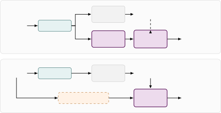

# Timestamped Hindi speech transcription using Whisper

Sanat Kumar Agrawal     Srikanth Raj Chetupalli

###### Abstract

Time accurate speech transcription is essential in critical
applications, such as medical conversation transcription, reading
assessment, and atypical speech recognition. Encoder-decoder automatic
speech recognition models, such as Whisper, do not produce word-level
timestamps out-of-the-box for all languages. Existing approaches to
word-level time stamp estimation either use an external CTC model
capable of frame level phoneme/character prediction which is
computationally expensive, or use the cross attention scores internal to
the model which gives coarse time stamps. We consider timestamped speech
transcription for Hindi in this paper. We propose a CTC-based approach,
in which we train a low-complexity character level CTC head directly on
the Whisper encoder output, to address the complexity and granularity
limitations of existing works. We evaluate the system using
manually-annotated word-level timestamps. Experiments show that the
proposed internal-CTC based approach performs similar to using an
external CTC model and better than the cross attention score-based
approaches. Further, we study the usage of CTC-head output to detect and
mitigate hallucinations in conversational speech. Our results show that
a simple token length criterion derived from the CTC output can improve
the transcription quality for short segments where hallucinations are
more probable.

###### Index Terms: 

forced alignment, word timestamps, connectionist temporal
classification, Whisper, low-resource ASR

^(†)^(†)address: Electrical Engineering, Indian Institute of Technology
Bombay, Mumbai, India  
{sanat.agrawal, srikanthrajch}@iitb.ac.in

## 1 Introduction

Large-scale weakly supervised models, such as Whisper \[18\], have shown
remarkable success and robustness for automatic speech recognition
(ASR). However, the generated transcripts often are not grounded in the
input utterance, typically noted when the model hallucinates.
Timestamped speech transcription aims to predict start and end times at
the word/token level and can be used to check for transcription
conformity with respect to the speech input. Further, timestamps are
needed in applications such as spoken-content retrieval, keyword
spotting, computer-assisted language learning, reading and fluency
assessment, and automatic subtitling. This paper addresses timestamped
speech transcription for low-resource settings, in particular for Hindi,
using Whisper \[18\].

Existing approaches to timestamped speech transcription using Whisper
can be grouped into two categories. The first approach uses dynamic time
warping (DTW) on the decoder-encoder cross-attention scores to derive
timestamp information \[13, 8, 22\]. The method was initially developed
in \[13, 8\] and CrisperWhisper \[22\] improved the timestamp accuracy
by carefully adjusting the tokenizer and extending it for verbatim
transcription. The DTW approach of \[13, 8\] is scalable and works on
all variants (monolingual, multilingual) of Whisper, but its timestamp
error is typically higher than the second approach based on
connectionist temporal classification (CTC) forced alignment. WhisperX
\[2\] uses CTC-based wav2vec2.0 model \[1\], trained for
character/phoneme level recognition, to force align the Whisper
transcripts and derive the timestamps. Framelevel posterior available in
CTC approach enables fine timestamp estimation. However, the use of a
second model, which is also language specific in \[2\], limits the
capabilities of the framework while increasing the complexity. Further,
the timestamp accuracy depends jointly on the performance of Whisper and
wav2vec2.0 models, which is not uniform across different acoustic
environments. Other similar approaches, using HMM-based forced alignment
\[14\] and massively multilingual aligners \[17\] also need a second
model and suffer from drawbacks similar to WhisperX. Both
CrisperWhisper \[22\] and WhisperX \[2\] were developed for English and
to the best of our knowledge, models capable of timestamped
transcription are not available for Hindi, and more generally for Indic
languages.

We consider timestamped speech transcription for Hindi in this paper.
Our approach builds on WhisperX \[2\], but instead of an external
CTC-based model, we propose to train a light-weight CTC head on the
Whisper encoder output. The approach is parameter and compute efficient
as it does not need a second model, and our experiments show that the
performance is comparable to that of WhisperX \[2\]. The idea of a CTC
head on Whisper encoder output is first proposed in \[24\] in the
context of streaming transcription, and later used by \[16\] to mitigate
hallucination. Both, \[24\] and \[16\], use variants of joint
CTC-attention decoding \[23\] and the CTC head was trained to predict a
large subset of Whisper output tokens ($`8`$k in \[24\] and
$`\approx 50`$k tokens in \[16\]). In the present work, we use
character-level CTC head, with a vocabulary of size $`73`$, leading to a
small number of additional parameters. We also adapted
CrisperWhisper \[22\] to Hindi and compared its performance with the
proposed approach.

One of the main issues with Whisper for transcription is hallucination,
especially in short speech segments. We investigate the use of the CTC
head to detect and correct the hallucinated transcriptions in
conversational settings. We show that simple rules based on the expected
transcription length derived from CTC output are sufficient for this
task. A demonstration of the proposed system, along with the models,
code, and the manual annotation data are available online¹¹ 1
https://sanat-agrwl.github.io/hindi-word-boundaries-demo.

## 2 Timestamped speech transcription

Figure 1: Block schematic of the proposed CTC-based approach (top) and
WhisperX \[2\] (bottom).

Figure 1 (top) shows a block schematic of the proposed approach. Whisper
is an encoder-decoder model, with it’s encoder producing fine
frame-level representations at a $`50`$ Hz rate. We propose to train a
CTC head, which is a single linear layer, on the encoder output to
predict posteriors on a chosen vocabulary. This is in contrast to
WhisperX \[2\], shown in Figure 1 (bottom), where an external
wav2vec2.0 \[1\] model trained using CTC is used for frame level
posterior computation. We chose a character-level vocabulary of size
$`73`$, composed of $`71`$ Devanagari characters, an explicit space
symbol and the CTC blank symbol in this work. The _character_ vocabulary
is chosen because the alignment resolution depends on the granularity of
the units emitted by the CTC head. Devanagari byte pair encoding (BPE)
tokens, used by Whisper, span only $`0.77`$ characters on average on our
test transcripts. Hence, the predicted token boundaries often do not
coincide with the character boundaries and they are irregular for
boundary placement. The compact head, due to the small vocabulary also
leads to computationally efficient training and timestamp estimation
during inference.

Word timestamps are obtained by using forced alignment \[10, 7\] between
the frame posteriors and the transcript words predicted by the Whisper
decoder. Forced alignment uses DTW to fit a monotonic mapping between
the transcript words and the frame-level character posteriors. A word
spans a contiguous run of characters, hence we select the first
character’s frame index as the start and the last character’s frame
index as the end to compute the time stamps.

## 3 Experimental Setup

Architecture and models. We used Whisper large-v2 \[18\] architecture in
all our experiments with pretrained weights from a model finetuned for
Hindi²² 2 hf.co/vasista22/whisper-hindi-large-v2, which we refer to as
Hindi-Whisper in the rest of the paper. The encoder in the model
generates $`1280`$ dimensional representations every $`20`$ ms for a
fixed $`30`$ s segment. In the proposed CTC-based approach, we used a
vocabulary of $`73`$ symbols, which includes $`71`$ Hindi characters
derived from the IndicVoices-R reference transcripts, an explicit space
symbol, and the blank symbol. The input, output dimensions of the linear
layer were $`1280`$ and $`73`$, respectively, leading to
$`\approx 93.5`$K additional parameters.

|        |              |                  |         |         |
| ------ | ------------ | ---------------- | ------- | ------- |
|        | Stage 1      | Stage 2: trained |         |         |
| Config | CE fine-tune | CTC head         | Encoder | Decoder |
| M1     |              | ✓                |         |         |
| M2     |              | ✓                | ✓       |         |
| M3     |              | ✓                | ✓       | ✓       |
| M4     | ✓            | ✓                |         |         |
| M5     | ✓            | ✓                | ✓       |         |
| M6     | ✓            | ✓                | ✓       | ✓       |

Table 1: Model configurations investigated in this work. Stage 1
corresponds to an optional cross-entropy fine-tuning of the
Whisper-Hindi base on IndicVoices-R and stage 2 trains the CTC head and,
optionally, Whisper’s encoder and decoder blocks.

We developed six different models (M1-M6) corresponding to the
configurations shown in Table 1. Configurations M1-M3 start from the
pretrained Hindi-Whisper model. In M1, only the proposed head was
trained with the CTC objective. Hence, the transcription quality of M1
will be the same as that of the Hindi-Whisper model, but the added CTC
head facilitates word timestamp computation. In M2, Whisper encoder was
fine tuned along with the head with the same objective, and in M3, both
the encoder and decoder were trained. For training M3, we used the
hybrid CTC/attention objective
$`\mathcal{L}=\alpha\mathcal{L}_{\mathrm{CTC}}+(1{-}\alpha)\mathcal{L}_{\mathrm{CE}}`$ \[23\],
where $`\mathcal{L}_{\mathrm{CE}}`$ is the cross-entropy loss computed
over the BPE output space of Whisper decoder. Training for
configurations M4-M6, resembles that of M1-M3, respectively. However,
the model training starts from the Hindi-Whisper variant, which was
initially finetuned on our training data.

Datasets. Experiments were carried out using the Hindi subset of
IndicVoices-R \[20\], having $`26.3`$K training utterances. The
corresponding test set is a subset of the IndicVoices-R test split. The
test set has $`125`$ utterances comprising $`1.89`$K reference words,
obtained by keeping the utterances that the external wav2vec2.0 aligner
could align with a minimum per-word confidence of $`0.30`$ (median
$`0.45`$).

Further, we evaluated on three additional corpora, (i) MPS-Hindi, (ii)
GramVaani, and (iii) DISPLACE-M, covering out of domain, noisy, and
conversational scenarios. MPS-Hindi is a children’s oral-reading corpus
collected similar to the protocol described in \[6, 19\]. The dataset
has $`3.6`$K recordings with $`{\approx}240`$K reference words in total.
GramVaani \[3\] is spontaneous telephone speech in regional Hindi
($`1{,}032`$ recordings, $`{\approx}27`$K words), and DISPLACE-M \[5\]
is the Hindi development set of the Third DISPLACE Challenge. The
dataset contains conversations between frontline health workers and care
seekers in rural India, with spontaneous dialogue, foreground overlap,
background speech and dialectal variation ($`78`$ recordings, $`163.8`$K
words). Among the three, only GramVaani corpus was part of the training
set of Hindi-Whisper, and our evaluation on MPS-Hindi and DISPLACE-M
represents true generalization.

Training. We trained the proposed CTC-based models incrementally. First,
the configurations M1 and M4 were trained; that is, only the CTC head of
the model was trained for $`15`$ epochs using AdamW optimizer \[12\]
with Cosine annealing learning rate schedule \[11\] from
$`3\times 10^{-4}`$ to $`3\times 10^{-6}`$ and an effective batchsize of
$`32`$. Then, Whisper’s encoder is also finetuned for additional $`3`$
epochs alongside the CTC head for M2 and M5 configurations. Similarly,
training for M3 and M6 starts from M1 and M4 models, respectively, and
both the encoder and decoder were finetuned for $`3`$ epochs in these
two configurations. We used different learning rates for the
encoder-decoder pair ($`10^{-5}`$) and the CTC-head ($`10^{-4}`$), along
with cosine annealing. CTC loss weight $`\alpha`$ was chosen to be
$`0.1`$ for the M3 model and $`0.3`$ for M6 and was fixed based on
limited initial hyperparameter search. Since Whisper training pads all
training examples to $`30`$ s duration, we discarded the frames
corresponding to the padded samples while training the CTC head.

Baseline systems. Existing ASR pipelines for Hindi do not provide
timestamped transcriptions. Hence, we adapted the WhisperX \[2\] and
CrisperWhisper \[22\] approaches to Hindi for a fair evaluation. For
WhisperX adaptation, we used the version of wav2vec2.0³³ 3
hf.co/theainerd/Wav2Vec2-large-xlsr-hindi, which is an XLSR-53 \[4\]
model fine-tuned for Hindi as the external CTC model and used
Hindi-Whisper model for transcription. For CrisperWhisper adaptation, we
followed the steps proposed in \[22\], that is, (i) constructed a new
tokenizer ($`\approx 50.4`$K entries) by detaching the space (”\_”)
token from all tokens, (ii) finetuned the Hindi-Whisper model with the
modified tokenizer, and (iii) re-estimated the $`15`$ attention heads
used for DTW on a calibration set of $`300`$ utterances. The time stamps
were additionally compared with wav2vec2.0 and Nemo forced aligner (NFA)
\[15\]. For NFA, we used the CTC-based IndicConformer model⁴⁴ 4
hf.co/ai4bharat/indicconformer_stt_hi_hybrid_ctc_rnnt_large to compute
frame level posteriors.

Inference. ASR inference uses the HuggingFace pipeline of Hindi-Whisper
for every system with language="hi" and task="transcribe". We evaluate
the models in both, greedy, and beam search (with a beam size of 5)
conditions.

Metrics. We report word error rate (WER), character error rate (CER) and
word-boundary error as the performance measures. WER was computed using
jiwer \[21\] after standard text normalization. The CER was computed
over Devanagari _grapheme clusters_, where each cluster is a base
character with its combining marks and conjuncts. Word-boundary error
was computed as the mean absolute difference (in ms) pooled over start
times and end times for words matching between the reference and
hypothesis transcripts. Longest common subsequence (LCS) algorithm was
used to align the two transcripts.

Manual annotation. IndicVoices-R does not have word-level timestamp
annotations, and as we show later in Section 4.1, existing forced
aligners using CTC-based models often have biased estimates for word
boundaries. Hence, we manually annotated the $`125`$-utterance test set
of IndicVoices-R. Annotators were shown the audio and the ground truth
transcript, and they were asked to mark the word boundaries. $`100`$ of
the reference utterances were annotated twice by two different
annotators, and the remaining $`25`$ were annotated once. Every
utterance contributes one human reference to the system comparisons,
giving $`3{,}784`$ scored boundaries.

## 4 Results

### 4.1 Timestamp estimation

First, we assess the quality of the estimated timestamps using the
manually annotated test samples. To decouple the effect of ASR
performance, we force align the CTC output with the ground truth speech
transcripts and compute the word boundary errors. Table 2 shows the
error metrics, averaged over the start and end times, for the different
models explored in this paper. First, we note that there is a good
inter-annotator agreement in the ground truth timestamps (median
boundary error is less than one frame duration for Whisper). We see that
force alignment using the wav2vec2.0 CTC model gives the least timestamp
estimation error (in column marked Raw). Rows M1-M6 indicate performance
using the CTC head in proposed models. Difference in performance of all
configurations of proposed approach to wa2vec2.0 (equivalent to
WhisperX) is less than $`10`$ ms. CTC is known to produce sharp frame
level posteriors and often predicting the character earlier than the end
timestamp. This introduces a systematic bias in the estimates of start
and end-times, as shown in the Table. The column Calibrated shows the
timestamp errors after correcting for the fixed offset, which shows the
proposed approach to be performing similar to the wav2vec2.0 approach.
Table 2 also shows the performance of NFA aligner using ground truth
transcriptions. We find that the NFA aligner has a higher timestamp
error compared to wav2vec2.0 approach, and the performance of proposed
models is similar to that of NFA. Hence, in the following, we compared
our models against timestamps obtained using force alignment with
wav2vec2.0 output and ground truth transcripts.

|                 |      |      |           |            |            |      |
| --------------- | ---- | ---- | --------- | ---------- | ---------- | ---- |
|                 | Raw  |      | Bias      |            | Calibrated |      |
| System          | mean | med. | onset     | offset     | mean       | med. |
| Inter annotator | 27.0 | 18.0 | —         | —          | —          | —    |
| wav2vec2.0      | 70.9 | 54.5 | $`+36.4`$ | $`-92.8`$  | 43.4       | 30.3 |
| M1              | 73.6 | 59.0 | $`+36.7`$ | $`-102.4`$ | 41.3       | 30.5 |
| M2              | 80.4 | 64.0 | $`+41.2`$ | $`-114.6`$ | 42.8       | 31.5 |
| M3              | 79.2 | 63.0 | $`+41.2`$ | $`-112.0`$ | 42.2       | 31.0 |
| M4              | 73.0 | 58.0 | $`+37.8`$ | $`-100.2`$ | 42.0       | 31.0 |
| M5              | 80.4 | 65.0 | $`+44.3`$ | $`-111.8`$ | 43.1       | 32.0 |
| M6              | 78.6 | 63.0 | $`+43.2`$ | $`-108.8`$ | 42.8       | 31.7 |
| NFA             | 79.5 | 62.0 | $`+41.2`$ | $`-102.2`$ | 52.1       | 39.6 |

Table 2: Boundary error against manual annotation (ms) over the full
$`125`$-utterance test set. “Calibrated” removes each system’s own two
constant offsets, fitted on $`100`$ utterances and applied to the
held-out $`25`$ ($`5`$-fold, so every value is out-of-sample).

### 4.2 Joint ASR and timestamp estimation performance

|       |         |      |           |                |      |            |              |        |
| ----- | ------- | ---- | --------- | -------------- | ---- | ---------- | ------------ | ------ |
|       | ASR (%) |      |           | vs. wav2vec2.0 |      |            |              | Manual |
| Conf. | WER     | CER  | $`N_{w}`$ | Mean           | Med. | $`p_{90}`$ | $`{\leq}50`$ | Mean   |
| M1    | 22.9    | 13.4 | 1466      | 20.7           | 13.7 | 39.9       | 93.1         | 73.3   |
| M2    | 23.5    | 14.5 | 1450      | 26.2           | 14.8 | 42.7       | 92.4         | 84.4   |
| M3    | 14.4    | 6.8  | 1629      | 21.5           | 13.5 | 40.7       | 93.0         | 78.8   |
| M4    | 14.6    | 7.0  | 1621      | 20.8           | 13.5 | 39.5       | 93.0         | 73.2   |
| M5    | 15.4    | 7.7  | 1606      | 22.8           | 15.1 | 42.0       | 92.7         | 81.3   |
| M6    | 14.9    | 7.2  | 1618      | 20.7           | 13.7 | 39.8       | 93.4         | 79.3   |
| CW    | 14.7    | 7.1  | 1623      | 107.2          | 60.1 | 236.9      | 40.4         | 87.4   |

Table 3: ASR and word-boundary estimation performance on the
IndicVoices-R test set. $`N_{w}`$ is the number of LCS-matched word
pairs scored. $`p_{90}`$ is the $`90`$th percentile of the absolute
boundary error and $`{\leq}50`$ the percentage of boundaries within
$`50`$ ms. ’CW’ stands for CrisperWhisper.

Table 3 shows a comparison of ASR and timestamp estimation performance
for the transcript predicted by the model. Note that our word boundary
comparison is with respect to wav2vec2.0 boundaries computed for the
ground truth transcript. We see that, the median deviation from the
reference is less than one Whisper frame shift for all the
configurations of the proposed model and $`<50`$ ms for more than
$`92\%`$ of frames. ASR performance of WhisperX is the same as that of
M1 system and it’s timestamp estimation aligns with the same wav2vec2.0
as used reference in Table 3. Against manual annotation, the timestamp
error of WhisperX, with system generated transcript, is found to be
$`71.0`$ ms. CrisperWhisper, in contrast, deviates significantly from
the reference. The performance trends are also consistent with the
results obtained using ground truth transcripts for force alignment
(Table 2).

From the ASR performance, we find that, a significant WER improvement is
obtained by either finetuning both encoder and decoder along side the
CTC head (as in M3), or by first finetuning the Whisper model before
adding the CTC head (as in M4). Comparing M4 and M6, we see that,
training Whisper model alongside the CTC head degraded the WER slightly.
However, we see in Section 4.3 that M6 is more robust than M4 on
conversational speech. Training only the encoder of Whisper alongside
the CTC head (M2 and M5) degrades both the WER and the boundary error.
From the table, we can also see that finetuning of the decoder, which
tunes the implicit language model of the encoder-decoder models, is
important while adapting Whisper to new datasets. Note that, it is
possible to read out the transcript from the CTC head output. But our
models were trained for a fixed number of epochs, without a criterion on
ASR performance on CTC head. The WER from the CTC head output is
typically high and hence it is not reported.

### 4.3 Cross-Corpus Generalisation

| Corpus        | Model | WER   | Sub   | Del   | Ins   | CER   |
| ------------- | ----- | ----- | ----- | ----- | ----- | ----- |
| IndicVoices-R | M3    | 14.38 | 12.16 | 1.27  | 0.95  | 6.79  |
|               | M4    | 14.64 | 12.47 | 1.16  | 1.00  | 7.03  |
|               | M6    | 14.90 | 12.53 | 1.22  | 1.16  | 7.15  |
|               | HW    | 22.89 | 16.86 | 5.44  | 0.58  | 13.36 |
| MPS           | M3    | 14.66 | 12.12 | 1.71  | 0.83  | 8.61  |
|               | M4    | 14.39 | 12.01 | 1.24  | 1.14  | 8.42  |
|               | M6    | 14.69 | 12.52 | 1.27  | 0.90  | 8.58  |
|               | HW    | 21.30 | 15.79 | 4.87  | 0.64  | 13.33 |
| GramVaani     | M3    | 24.98 | 18.42 | 3.01  | 3.56  | 16.55 |
|               | M4    | 24.86 | 17.95 | 3.13  | 3.77  | 16.70 |
|               | M6    | 26.60 | 19.90 | 2.83  | 3.87  | 17.55 |
|               | HW    | 26.22 | 18.70 | 4.94  | 2.57  | 18.72 |
| DISPLACE-M    | M3    | 35.60 | 21.34 | 6.98  | 7.28  | 27.82 |
|               | M4    | 39.10 | 22.63 | 4.75  | 11.73 | 31.46 |
|               | M6    | 36.03 | 24.15 | 5.04  | 6.83  | 26.98 |
|               | HW    | 67.34 | 15.36 | 25.57 | 26.41 | 62.61 |

Table 4: ASR performance on the four test tests. HW denotes the
Hindi-Whisper model.

Table 4 shows the ASR performance of the proposed models with CTC head
on the four test sets described in Section 3. Comparing HW and M4, we
see that mere finetuning of the base Whisper model on IndicVoices-R
improves the performance on all the test sets. Addition of the CTC head
(in M3, M6) does not alter the performance significantly on
IndicVoices-R, MPS and GramVaani datasets. But the performance improves
on DISPLACE-M, which has conversational speech. A closer look at the
constituent errors shows that the improvement in WER is largely due to a
reduction of insertion errors. Conversational speech often contains very
short speech segments, ($`\approx 30\%`$ of segments in DISPLACE-M data
are shorter than $`1`$ s), which are prone to hallucination. We infer
that the added CTC head acts as a regularizer limiting the instances of
hallucination, and hence reducing insertions and improving the overall
WER. This can be seen across the test sets, the variants M3 and M6 have
less number of insertions and smaller CER compared to M4 and HW.

### 4.4 ASR Error Correction

A closer look at the distribution of DISPLACE-M word errors with the
segment duration (results not shown here in the interest of space) has
shown us that the $`30\%`$ samples with $`<1`$ s duration in the dataset
had a WER of $`121.4\%`$ using the M3 model, which was largely due to
the insertions in the transcripts of these samples (sentence
completions, repeated generations, etc. \[9\]). Hence, we studied
correction of the transcript, using the information extracted from the
CTC head output. First, we note that a simple beam search during the
decoding, often, deteriorates the transcription in such samples. We
studied four policies, first two _replace_ the decoder transcript of a
segment with the one read greedily off the CTC head: (i) conf. fires
when the mean CTC alignment confidence of the decoder’s words falls
below $`0.2`$, and (ii) rep. fires when the decoder emits more than
$`3\times`$ as many characters as the CTC head. The second two
_truncate_ the decoder transcript to a maximum character length, cutting
at a word boundary, and differ only in the selection of the length
threshold: (iii) dur. takes it from the audio, one character per
$`20`$ ms encoder frame, and (iv) cap. takes it from the CTC head,
$`1.5\times`$ its character count.

|                  |          |        |                      |       |       |       |        |
| ---------------- | -------- | ------ | -------------------- | ----- | ----- | ----- | ------ |
|                  | Decoding |        | ASR error correction |       |       |       |        |
|                  | greedy   | beam-5 | conf.                | rep.  | dur.  | cap.  | oracle |
| M3 configuration |          |        |                      |       |       |       |        |
| WER              | 35.60    | 41.15  | 35.51                | 32.72 | 32.88 | 32.20 | 31.25  |
| Ins              | 7.28     | 13.37  | 7.15                 | 4.37  | 4.56  | 3.66  | 3.29   |
| Del              | 6.98     | 7.39   | 7.05                 | 7.05  | 6.98  | 8.08  | 6.65   |
| Segments         | N.A      | N.A    | 409                  | 356   | 201   | 1,975 | 1,400  |
| M4 configuration |          |        |                      |       |       |       |        |
| WER (%)          | 39.10    | 44.68  | 38.94                | 33.26 | 33.90 | 32.64 | 31.69  |
| Ins. (%)         | 11.73    | 17.93  | 11.46                | 5.77  | 6.52  | 4.79  | 4.18   |
| Del. (%)         | 4.75     | 4.75   | 4.84                 | 4.83  | 4.75  | 6.19  | 4.97   |
| Segments         | N.A      | N.A    | 609                  | 624   | 377   | 2,795 | 1,361  |
| M6 configuration |          |        |                      |       |       |       |        |
| WER              | 36.03    | 37.95  | 35.85                | 34.43 | 34.82 | 34.18 | 32.78  |
| Ins              | 6.83     | 9.20   | 6.62                 | 5.21  | 5.62  | 4.81  | 3.99   |
| Del              | 5.04     | 5.06   | 5.11                 | 5.11  | 5.04  | 5.89  | 5.11   |
| Segments         | N.A      | N.A    | 469                  | 269   | 113   | 1,680 | 1,998  |

Table 5: Performance with ASR error correction on DISPLACE-M using our
models. ”Segments” row gives the number of utterances where the
correction was applied.

Table 5 shows the ASR performance for different correction policies. We
see that beam search increased the WER (largely due to increased in
insertions) in all the configurations studied. We attribute this to the
model’s tendency to generate longer and complete sentences, the chance
of which increases with beam search. Results in the column conf. show
that, the decoder token confidence cannot predict the hallucinations.
The output token length in the rep. policy is effective, but the policy
discards the Whisper transcript and substitutes CTC policy for it, which
is poor in general. The strategies, based on the truncation of Whisper
output to a specific length (dur., cap.), improve the WER and reduce the
insertions, with a slight increase in the deletions. The cap policy,
where the transcript is truncated based on the character sequence length
predicted by the CTC is head is more effective and reaches close to the
upper limit indicated by oracle. The trend is found to be similar across
the three model configurations studied.

## 5 Conclusion

We proposed a timestamped speech transcription system for Hindi, using
an additional CTC head trained on the Whisper’s encoder and forced
alignment. Different training strategies were explored and the models
were evaluated across four different datasets covering a range of
domains. Our results show that the timestamp accuracy is comparable to
that of WhisperX, which uses an external CTC trained model for force
alignment. Further, our results show that finetuning Whisper’s encoder
and decoder alongside the added CTC head improves the generalization
performance of Whisper and helps in reducing hallucinations. Simple
thresholding strategies were explored for detecting segments with
hallucinations, which proved effective in short speech segments. Future
directions include an investigation of the variants of joint
CTC/attention decoding for better transcription.

ACKNOWLEDGEMENTS

We sincerely thank Professor Preeti Rao, Electrical Engineering, IIT
Bombay for sharing the MPS-Hindi data and the useful discussions through
the course of this project.

COMPLIANCE WITH ETHICAL STANDARDS

IndicVoices-R and GramVaani are publicly available under their
respective licences. MPS-Hindi is not yet publicly released and is used
here with the collectors’ permission. The DISPLACE-M development set is
distributed to participants of the Third DISPLACE Challenge \[5\] rather
than released publicly, and is used here with the organisers’ consent;
one author is a challenge organiser, which we disclose for transparency.
The word-boundary annotations reported in Sec. 3 were produced by two
adult annotators who participated voluntarily and with informed consent,
annotating only already-public recordings. No personal data was
collected and no new recordings were made, so ethical approval was not
required.

## References

- \[1\] A. Baevski, Y. Zhou, A. Mohamed, and M. Auli (2020) Wav2vec 2.0:
  a framework for self-supervised learning of speech representations. In
  Advances in Neural Information Processing Systems (NeurIPS), Vol. 33,
  pp. 12449–12460. Cited by: §1, §2.
- \[2\] M. Bain, J. Huh, T. Han, and A. Zisserman (2023) WhisperX:
  time-accurate speech transcription of long-form audio. In Proc.
  Interspeech, pp. 4489–4493. Cited by: §1, §1, Figure 1, §2, §3.
- \[3\] A. Bhanushali, G. Bridgman, G. Deekshitha, P. Ghosh, P.
  Kumar, S. Kumar, A. R. Kolladath, N. Ravi, A. Seth, A. Seth, A.
  Singh, V. N. Sukhadia, S. Umesh, S. Vyas, and C. Yarra (2022) Gram
  Vaani ASR challenge on spontaneous telephone speech recordings in
  regional variations of Hindi. In Proc. Interspeech, pp. 3548–3552.
  Cited by: §3.
- \[4\] A. Conneau, A. Baevski, R. Collobert, A. Mohamed, and M.
  Auli (2021) Unsupervised cross-lingual representation learning for
  speech recognition. In Proc. Interspeech, pp. 2426–2430. Cited by: §3.
- \[5\] E. Dhanya, A. Meena, M. Nanivadekar, A. Noumida, V. Azad, A. N.
  Shenoy, P. R. Chowdhuri, S. Banga, V. Chhabra, C. Bhat, S. B.
  Kalluri, S. R. Chetupalli, D. Vijayasenan, and S. Ganapathy (2026)
  Benchmarking speech systems for frontline health conversations: the
  DISPLACE-M challenge. arXiv preprint arXiv:2603.02813. Cited by: §3,
  §5.
- \[6\] R. Gothi, R. Kumar, M. Pereira, N. Nayak, and P. Rao (2024) A
  dataset and two-pass system for reading miscue detection. In Proc.
  Interspeech, Cited by: §3.
- \[7\] A. Graves, S. Fernández, F. Gomez, and J. Schmidhuber (2006)
  Connectionist temporal classification: labelling unsegmented sequence
  data with recurrent neural networks. In Proc. Int. Conf. on Machine
  Learning (ICML), pp. 369–376. Cited by: §2.
- \[8\] J. W. Kim (2023) Openai-dtw. GitHub. Note:
  https://github.com/openai/whisper/blob/main/notebooks/Multilingual_ASR.ipynb
  Cited by: §1.
- \[9\] A. Koenecke, A. S. G. Choi, K. X. Mei, H. Schellmann, and M.
  Sloane (2024) Careless Whisper: speech-to-text hallucination harms. In
  Proc. ACM Conf. on Fairness, Accountability, and Transparency (FAccT),
  pp. 1672–1681. Cited by: §4.4.
- \[10\] L. Kürzinger, D. Winkelbauer, L. Li, T. Watzel, and G.
  Rigoll (2020) CTC-segmentation of large corpora for German end-to-end
  speech recognition. In Proc. Int. Conf. on Speech and Computer
  (SPECOM), pp. 267–278. Cited by: §2.
- \[11\] I. Loshchilov and F. Hutter (2017) SGDR: stochastic gradient
  descent with warm restarts. In Proc. Int. Conf. on Learning
  Representations (ICLR), Cited by: §3.
- \[12\] I. Loshchilov and F. Hutter (2019) Decoupled weight decay
  regularization. In Proc. Int. Conf. on Learning Representations
  (ICLR), Cited by: §3.
- \[13\] J. Louradour (2023) Whisper-timestamped. GitHub. Note:
  https://github.com/linto-ai/whisper-timestamped Cited by: §1.
- \[14\] M. McAuliffe, M. Socolof, S. Mihuc, M. Wagner, and M.
  Sonderegger (2017) Montreal Forced Aligner: trainable text-speech
  alignment using Kaldi. In Proc. Interspeech, pp. 498–502. Cited by:
  §1.
- \[15\] NVIDIA (2024) NeMo Forced Aligner. Note:
  https://github.com/NVIDIA/NeMo/tree/main/tools/nemo_forced_alignerPart
  of the NVIDIA NeMo toolkit; accessed 2026 Cited by: §3.
- \[16\] A. Polok, D. Klement, M. Kocour, J. Han, F. Landini, B.
  Yusuf, M. Wiesner, S. Khudanpur, J. Černocký, and L. Burget (2025)
  DiCoW: diarization-conditioned Whisper for target speaker automatic
  speech recognition. Computer Speech & Language. Cited by: §1.
- \[17\] V. Pratap, A. Tjandra, B. Shi, P. Tomasello, A. Babu, S.
  Kundu, A. Elkahky, Z. Ni, A. Vyas, M. Fazel-Zarandi, et al. (2024)
  Scaling speech technology to 1000+ languages. J. Machine Learning
  Research 25 (97), pp. 1–52. Cited by: §1.
- \[18\] A. Radford, J. W. Kim, T. Xu, G. Brockman, C. McLeavey, and I.
  Sutskever (2023) Robust speech recognition via large-scale weak
  supervision. In Proc. Int. Conf. on Machine Learning (ICML), Cited by:
  §1, §3.
- \[19\] S. Raman and P. Rao (2025) Oral reading errors by grade 3
  children in Indian schools: a Hindi–English perspective. In Proc.
  Interspeech, Cited by: §3.
- \[20\] A. Sankar, S. Anand, P. Varadhan, S. Thomas, M. Singal, S.
  Kumar, D. Mehendale, A. Krishana, G. Raju, and M. Khapra (2024)
  INDICVOICES-R: unlocking a massive multilingual multi-speaker speech
  corpus for scaling Indian TTS. In Advances in Neural Information
  Processing Systems (NeurIPS), Datasets and Benchmarks Track, Cited by:
  §3.
- \[21\] N. Vaessen (2021) jiwer: evaluate your speech-to-text system
  with similarity measures. GitHub. Note: https://github.com/jitsi/jiwer
  Cited by: §3.
- \[22\] L. Wagner, B. Thallinger, and M. Zusag (2024) CrisperWhisper:
  accurate timestamps on verbatim speech transcriptions. In Proc.
  Interspeech, Cited by: §1, §1, §3.
- \[23\] S. Watanabe, T. Hori, S. Kim, J. R. Hershey, and T.
  Hayashi (2017) Hybrid CTC/attention architecture for end-to-end speech
  recognition. IEEE J. Sel. Topics Signal Process. 11 (8),
  pp. 1240–1253. Cited by: §1, §3.
- \[24\] H. Zhou, X. Song, B. Fahy, Q. Song, B. Zhang, Z. Peng, A.
  Wadhawan, D. Jiang, A. Verma, V. Ramesh, S. Prasad, and M. M.
  Franceschini (2025) Adapting Whisper for streaming speech recognition
  via two-pass decoding. In Proc. Interspeech, Cited by: §1.
