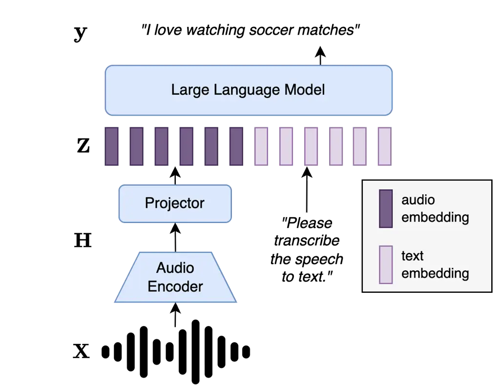
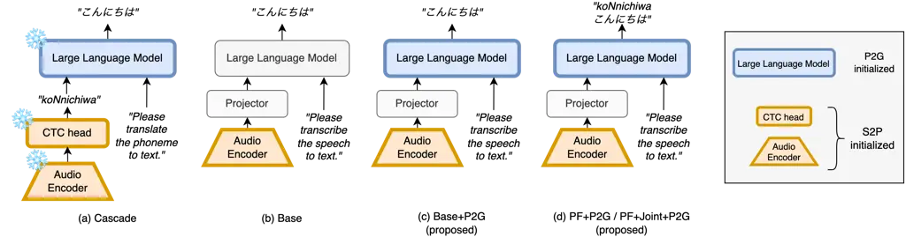

# Phoneme-Guided Initialization for LLM-based Speech Recognition

Ryo Magoshi, Shinsuke Sakai, and Tatsuya Kawahara Affiliation: Graduate
School of Informatics, Kyoto University, Japan  
{magoshi, sakai}@sap.ist.i.kyoto-u.ac.jp, kawahara@i.kyoto-u.ac.jp

###### Abstract

Speech large language models (speech LLMs) perform well on automatic
speech recognition (ASR) when sufficient paired speech-text data is
available, but their performance degrades in low-resource settings. A
cascaded pipeline that performs speech-to-phoneme (S2P) conversion
followed by phoneme-to-grapheme (P2G) conversion has been shown to
outperform end-to-end speech LLMs in this regime, suggesting that
phoneme-mediated processing is beneficial when paired data is scarce. We
propose phoneme-guided initialization, a simple method that uses this
insight within an end-to-end framework: we pre-train the audio encoder
on S2P and the LLM on P2G tasks, then connect them and fine-tune the
full model end-to-end on the target ASR task. Experiments on Japanese
(CSJ), Chinese (AISHELL-1), and two low-resource languages from Common
Voice 25.0 (Tatar and Urdu) show that our method matches or outperforms
both the cascaded S2P-P2G baseline and the end-to-end model without P2G
initialization.

###### Index Terms: 

Speech Recognition, Low-Resource, Large Language Model, Phoneme,
Initialization

## I Introduction

Augmenting large language models (LLMs) with audio input capabilities
has enabled speech LLMs to adapt to various spoken language tasks,
including automatic speech recognition (ASR) \[1\], speech
translation \[2\], speech-queried question answering \[3, 4\], speech
synthesis \[5\], and spoken dialogue \[3, 4, 6, 7\].

There are two main approaches to feeding audio into an LLM: discrete and
continuous approaches. The discrete approach quantizes audio into
discrete tokens and augments the LLM’s text vocabulary with these
tokens \[3, 4\]. The continuous approach passes the output of a
pretrained audio encoder through a lightweight learnable projector to
produce continuous representations that are directly processed by the
LLM embedding layer \[2, 8, 9\]. This work focuses on the continuous
approach, now widely adopted for LLM-based ASR.

Unlike the discrete approach, the continuous approach does not add audio
tokens to the vocabulary, but it still introduces a modality mismatch
problem \[10\]. In the LLM’s embedding space, closeness of
representations corresponds to semantic similarity, whereas in the audio
encoder’s output space, closeness of representations corresponds to
acoustic similarity. Although training only the projector can suffice in
certain settings \[11\], end-to-end training of both the projector and
the LLM is usually necessary to resolve the modality alignment
problem \[12\], and even with parameter-efficient techniques such as
LoRA \[13\], a large amount of paired speech-transcription data is still
needed for effective cross-modal alignment. This is a significant
limitation, as paired speech-text data is scarce in many conditions,
whereas text-only data is more abundant and easier to obtain.

In this work, we propose phoneme-guided initialization, an approach that
provides LLM-based ASR with initial parameters suited for modality
alignment. Our method uses abundant text data by separately initializing
the audio encoder and the LLM through supervised training on
phoneme-related tasks before combining them for end-to-end fine-tuning:

- •
  The audio encoder is trained on a speech-to-phoneme (S2P) task. Since
  phonemes are the minimal distinctive sound units of a language, this
  is simpler than directly predicting graphemes and requires relatively
  little paired data.
- •
  The LLM is trained on a phoneme-to-grapheme (P2G) task, with phoneme
  sequences generated from external text by grapheme-to-phoneme (G2P)
  tools, enabling the use of large text corpora without any speech data.

After initialization, the encoder and LLM are connected by a projector
and fine-tuned end-to-end on the target task.

Our experiments demonstrate that the proposed method outperforms
conventional approaches, particularly in low-resource settings in
homophone-rich languages. The key contribution is to show that text-only
data from the target language or domain can improve LLM-based ASR
through P2G initialization of the LLM, complementing the S2P
initialization of the audio encoder so that both components are aligned
toward phoneme-level representations before end-to-end training.



Fig. 1: Overview of continuous LLM-based ASR. The audio encoder extracts
speech representations, which are mapped to the LLM’s embedding space by
a projector. The LLM generates the transcription conditioned on both the
projected audio and a text prompt. $`\mathbf{H}`$ is the encoder output
and $`\mathbf{Z}`$ is the projector output (the audio embeddings fed to
the LLM).



Fig. 2: Overview of the LLM-based model configurations, illustrated with
the Japanese transcription of “こんにちは (koNnichiwa)”. In (a), (c),
and (d), the LLM is initialized with P2G training. In (a), all
components are frozen and the system operates in a cascaded manner.

## II Related Work

### II-A Phonemes in Speech Recognition

Phonemes are the minimal units of sound that native speakers of a
language can distinguish, and phonemic transcription is the highest
level of abstraction that still preserves meaning distinctions in a
given language. By discarding paralinguistic and non-linguistic
information and mapping sounds that do not carry distinctive meaning to
a single symbol, phoneme representations lie closer to linguistic
information than the raw speech signal.

The number of distinct phonemes in a language is typically much smaller
than the number of graphemes, especially for languages with large
character inventories such as Chinese and Japanese, where predicting
phonemes from speech is easier than predicting graphemes directly.
Consequently, using phonemic information to predict graphemes has been
explored, including in end-to-end systems \[14, 15, 16, 17, 18, 19, 10,
20\].

### II-B Phoneme-Mediated LLM-based ASR

Jie and Cheng \[18\] investigated phoneme-mediated approaches for
Chinese LLM-based ASR using pinyin, which is a romanization system that
serves as a phonemic representation for Mandarin Chinese. They proposed
two methods:

- •
  Sequential output: The LLM first generates pinyin, then generates the
  corresponding Chinese characters.
- •
  Iterative output: Pinyin and Chinese characters are interleaved in the
  output sequence.

Both improved over the grapheme-only baseline by using the easier
phoneme prediction to guide grapheme prediction. However, both require
the model to output both phoneme and grapheme sequences during training.
Resolving the modality matching problem may then be difficult when data
aligning speech, phonemes, and graphemes is scarce. The iterative method
also applies only to languages such as Chinese with a one-to-one
grapheme-phoneme correspondence.

Poncelet and Van hamme \[19\] adopted a similar sequential output
approach and showed improvements on English and Dutch, using ARPAbet for
English and Dutch phoneme annotations that were partially manually
created. They further showed that mixing phoneme-first prediction data
with standard speech-to-grapheme (S2G) training data, a joint training
strategy, further improves performance, particularly in low-resource
settings with high-quality phoneme annotations. Since the jointly
trained model is trained on both output formats, it can be decoded in
either grapheme-only or phoneme-first mode at inference time, and both
modes showed improved performance over the non-joint baseline.

Li et al. \[10\] investigated LLM-based ASR in low-resource settings.
They found that a cascaded approach, using CTC-based S2P followed by
feeding the predicted phonemes into an LLM for P2G, outperforms
end-to-end LLM-based ASR. The CTC-based S2P model was trained in a
data-efficient, multilingual manner \[21\], which is effective for
low-resource settings. They attributed the poor end-to-end performance
to the difficulty of modality matching through the projector in
low-resource settings. They also found that initializing the audio
encoder with S2P training reduces this modality mismatch. However, they
did not explore the effect of additionally training the LLM on P2G,
which we found effective for further modality alignment.

### II-C Differences from Prior Work

Unlike these prior works, which modify the output format of the LLM at
inference time, we use phoneme-related tasks exclusively for
initialization: we pre-train the audio encoder on S2P and the LLM on
P2G, then connect them with a projector and fine-tune end-to-end on the
target ASR task. Because only the initialization is modified, the model
can be trained with either grapheme-only or phoneme-first output, and we
evaluate both configurations.

## III Methods

### III-A LLM-based ASR

Fig. 1 shows the overview of LLM-based ASR. Given an input speech
waveform $`\mathbf{X}\in\mathbb{R}^{T_{\text{wav}}}`$, an LLM-based ASR
system consists of three components: an audio encoder
$`\text{Enc}(\cdot)`$, a projector $`\text{Proj}(\cdot)`$, and an LLM
$`\text{LLM}(\cdot)`$.

The audio encoder first converts the waveform into a sequence of
frame-level representations:

```math
\mathbf{H}=\text{Enc}(\mathbf{X})\in\mathbb{R}^{T\times d_{\text{enc}}} \tag{1}
```

where $`T`$ is the number of output frames and $`d_{\text{enc}}`$ is the
encoder output dimension.

The projector maps these representations into the LLM’s embedding space
while downsampling the temporal resolution by a factor of $`r`$:

```math
\mathbf{Z}=\text{Proj}(\mathbf{H})\in\mathbb{R}^{\lfloor T/r\rfloor\times d_{\text{llm}}} \tag{2}
```

where $`d_{\text{llm}}`$ is the LLM’s hidden dimension.

The projected audio representations $`\mathbf{Z}`$ are then prepended to
the text token embeddings and processed by the LLM. Let
$`\mathbf{y}=(y_{1},y_{2},\ldots,y_{N})`$ denote the target grapheme
token sequence. The model is trained to minimize the negative
log-likelihood as follows:

```math
\mathcal{L}_{\text{S2G}}=-\sum_{i=1}^{N}\log p(y_{i}\mid y_{<i},\mathbf{Z};\theta) \tag{3}
```

where $`\theta`$ denotes the parameters of the whole model. At inference
time, the output sequence is obtained by beam search, which
approximately maximizes the sequence log-likelihood:

```math
\hat{\mathbf{y}}=\arg\max_{\mathbf{y}}\,\sum_{i=1}^{N}\log p(y_{i}\mid y_{<i},\mathbf{Z};\theta) \tag{4}
```

The beam size and other decoding settings are given in the training
configuration (Section IV).

|          |                  |             |                       |                 |                      |
| -------- | ---------------- | ----------- | --------------------- | --------------- | -------------------- |
|          | Speech Data      |             | Text Data (for P2G)   |                 |                      |
| Language | Corpus           | \# of Hours | Corpus                | \# of Sentences | G2P Tool             |
| Japanese | CSJ \[22\]       | 10          | BCCWJ \[23\]          | 1.0M            | –                    |
|          |                  | 36          |                       |                 |                      |
| Chinese  | AISHELL-1 \[24\] | 10          | THUCNews \[25\]       | 2.0M            | g2pW \[26\]          |
|          |                  | 50          |                       |                 |                      |
|          |                  | full        |                       |                 |                      |
| Tatar    | CV 25.0 \[27\]   | 8.3         | Tatar Folklore \[28\] | 65k             | Phonetisaurus \[29\] |
| Urdu     | CV 25.0 \[27\]   | 8.4         | Makhzan \[30\]        | 211k            | Epitran \[31\]       |

TABLE I: Data configuration for each language. CV 25.0 denotes Common
Voice 25.0. “# of Sentences” denotes the number of phoneme-grapheme
sentence pairs used for P2G training of the LLM.  
For Japanese, the text corpus already contains phoneme transcriptions,
so no external G2P tool is needed.

### III-B Phoneme-First Prediction

In phoneme-first prediction \[19\], the LLM is trained to first generate
a phoneme sequence $`\mathbf{p}=(p_{1},\ldots,p_{M})`$ and then the
grapheme sequence $`\mathbf{y}`$, both conditioned on the audio
representation. The training objective is:

```math
\mathcal{L}_{\text{PF}}=-\sum_{j=1}^{M}\log p(p_{j}\mid p_{<j},\mathbf{Z};\theta)-\sum_{i=1}^{N}\log p(y_{i}\mid y_{<i},\mathbf{p},\mathbf{Z};\theta) \tag{5}
```

At inference time, the grapheme output is conditioned on both the audio
representation and the predicted phonemes, and is likewise decoded by
beam search as in Eq. (4):

```math
\hat{\mathbf{y}}=\arg\max_{\mathbf{y}}\,\sum_{i=1}^{N}\log p(y_{i}\mid y_{<i},\hat{\mathbf{p}},\mathbf{Z};\theta) \tag{6}
```

In the joint training variant \[19\], both phoneme-first and standard
S2G training examples are mixed, with a text prompt indicating which
output format is expected. This allows the model to learn from both
training signals simultaneously.

### III-C Proposed Method: Phoneme-Guided Initialization

Our proposed method initializes both the audio encoder and the LLM using
phoneme-related tasks before end-to-end fine-tuning. The procedure
consists of three stages:

Stage 1: Component Pre-training.

1.  1.  S2P initialization of the audio encoder: The audio encoder is
        trained with a CTC \[32\] loss to predict phoneme sequences from
        speech:

    ```math
    \mathcal{L}_{\text{S2P}}=-\log p_{\text{CTC}}(\mathbf{p}\mid\text{Enc}(\mathbf{X})) \tag{7}
    ```

    This requires paired speech-phoneme data, but phoneme sequences can
    be automatically obtained from grapheme transcriptions using G2P
    tools, and the S2P task is simpler than S2G.

2.  2.  P2G initialization of the LLM: The LLM is fine-tuned on a
        phoneme-to-grapheme conversion task:

    ```math
    \mathcal{L}_{\text{P2G}}=-\sum_{i=1}^{N}\log p(y_{i}\mid y_{<i},\mathbf{p};\theta_{\text{LLM}}) \tag{8}
    ```

    where $`\mathbf{p}`$ is the phoneme sequence generated from the
    grapheme sequence $`\mathbf{y}`$ by a G2P tool, and
    $`\theta_{\text{LLM}}\subset\theta`$ denotes the LLM parameters.
    This stage uses only text data and does not require any speech data.

Stage 2: Encoder and Projector Warmup. The S2P-initialized encoder and
P2G-initialized LLM are connected via a randomly initialized projector
and fine-tuned on the target ASR task. The training objective can be
either the standard S2G loss $`\mathcal{L}_{\text{S2G}}`$ (Eq. 3) or the
phoneme-first loss $`\mathcal{L}_{\text{PF}}`$ (Eq. 5); the proposed
method concerns only the initialization and imposes no constraint on
whether the model outputs graphemes only or phonemes followed by
graphemes. In this stage, only the encoder and projector parameters are
updated.

Stage 3: Full Fine-tuning. All parameters including the LLM are jointly
fine-tuned on the same task as Stage 2. This initialization strategy
aligns both the encoder and the LLM toward phoneme-level representations
before end-to-end training.

## IV Experiments

### IV-A Model Configuration

As described in Section III-C, our LLM-based ASR system consists of an
audio encoder, a projector, and an LLM.

As the audio encoder, we use XLS-R \[33\] 300M, a multilingual
self-supervised speech representation model. The projector consists of a
temporal downsampling layer with a factor of 4 followed by a two-layer
MLP with GeLU \[34\] activation. For the LLM, we use Qwen3.5-2B \[35\],
which originally supports both image and text inputs. Since we do not
use image input in this work, we remove the image encoder and its
associated projector from the original model.

We evaluate the following model configurations (Fig. 2):

- •
  XLS-R + CTC (not in Fig. 2): The XLS-R encoder is trained with CTC for
  direct S2G recognition, without an LLM, serving as a non-LLM baseline
  to isolate the LLM’s contribution.
- •
  Cascade: The audio encoder is trained with CTC for S2P, and a
  separately trained LLM performs P2G at inference time; the
  CTC-predicted phonemes are fed as text input to the LLM. This follows
  the cascaded approach of \[10\].
- •
  End-to-end LLM-based ASR: Following \[10\], all end-to-end models use
  an audio encoder initialized with S2P training, with the CTC head
  discarded. We found that without S2P initialization, end-to-end models
  failed to produce meaningful output (CER near 100%). There are four
  subdivided settings:
  - –
    Base: The standard end-to-end model trained with the S2G objective.
    The audio encoder, projector, and LLM are trained following Stages 2
    and 3 of Section III-C, with only the S2P part of Stage 1. In this
    setting, P2G initialization is not conducted.
  - –
    PF (Phoneme First): The model is trained to first output phonemes
    and then graphemes, following \[18, 19\]. At inference time, the
    output consists of a phoneme sequence followed by a grapheme
    sequence, and the error rate is computed only on the grapheme part.
  - –
    PF+Joint: Phoneme-first training data is mixed with standard S2G
    data within each batch, following the joint training strategy
    of \[19\]. This enables the model to be decoded with either
    grapheme-only or phoneme-first prompts at inference time.
  - –
    +P2G (proposed): The LLM is initialized with P2G training before
    end-to-end fine-tuning, as described in Stage 1 of Section III-C.
    This is our proposed method. The suffix yields Base+P2G, PF+P2G, and
    PF+Joint+P2G.

### IV-B Data Configuration

Table I summarizes the data used in the experiments. We conduct
experiments on four languages along two scenarios; each language
requires a speech corpus for ASR training and a text corpus for P2G
initialization of the LLM. The first scenario is the low-resource
setting: for Japanese (CSJ \[22\]) and Chinese (AISHELL-1 \[24\]), large
speech corpora exist but we deliberately limit the training data to
small subsets (a 10-hour subset and the 36-hour “core” subset for CSJ,
and 10-hour, 50-hour, and full subsets for AISHELL-1) to simulate
target-domain data scarcity. The second scenario is the low-resource
language: for Tatar and Urdu, paired speech-text data is inherently
scarce, and we use all available data in Common Voice 25.0 \[27\] (8.3
and 8.4 hours, respectively).

Text corpora for P2G. The text corpus and its size for each language are
listed in Table I: BCCWJ \[23\] for Japanese, THUCNews \[25\] for
Chinese, the Tatar Folklore Text Corpus \[28\] for Tatar, and
Makhzan \[30\] for Urdu. We use the full text corpus of each language
for P2G training.

Phoneme generation. To construct phoneme-grapheme pairs for P2G
training, phoneme sequences are generated from the text corpora using
the per-language G2P tools listed in Table I; BCCWJ already includes
phoneme transcriptions, so no external G2P tool is needed for Japanese.
We use a different G2P tool per language according to availability and
quality, selecting the best-performing available tool for each.
Language-specific phonological rules, including allophonic variation,
are handled by the respective G2P tool (or by manual annotation where
available, as in BCCWJ), rather than being modeled explicitly.

### IV-C Training Configuration

Training consists of multiple phases depending on the model
configuration.

XLS-R + CTC. For both S2P and S2G CTC models, we train the XLS-R encoder
with a learning rate of $`3\times 10^{-4}`$, a batch size of 48, and
1000 warmup steps. The learning rate is linearly warmed up and then
decayed following a cosine schedule. Throughout all training stages, the
CNN feature extractor of the audio encoder is kept frozen.

P2G training. The LLM is fine-tuned on the P2G task with a learning rate
of $`5\times 10^{-5}`$, a batch size of 64, and 500 warmup steps. During
P2G training, the input phoneme sequence is provided as a text prompt
and the LLM is trained to generate the corresponding grapheme sequence
autoregressively. For the Cascade model, the P2G-trained LLM is further
fine-tuned on phoneme-grapheme pairs from the target speech corpus’s
transcriptions, adapting it to the target domain, which consistently
improved P2G performance. These phoneme sequences come from manually
annotated readings for CSJ and from the same G2P tools (Table I) for the
other corpora.

End-to-end LLM-based ASR. End-to-end training follows Stages 2 and 3 of
Section III-C. Stage 2 (encoder and projector only) uses a learning rate
of $`2\times 10^{-4}`$, a batch size of 24, and 1000 warmup steps;
Stage 3 (all parameters) uses $`2\times 10^{-5}`$, a batch size of 24,
and 500 warmup steps. For models with the PF (Phoneme First)
configuration, the target output sequence is formatted as a
concatenation of the phoneme sequence followed by the grapheme sequence.
For PF+Joint, training samples with and without the phoneme prefix are
mixed within each batch.

At inference time, we use beam search with beam size 3, repetition
penalty 1.0, and prohibited repeated 3-grams.

### IV-D Results

|                     |      |                          |       |       |      |            |       |       |      |                                |      |      |                              |      |
| ------------------- | ---- | ------------------------ | ----- | ----- | ---- | ---------- | ----- | ----- | ---- | ------------------------------ | ---- | ---- | ---------------------------- | ---- |
|                     |      | CSJ (CER $`\downarrow`$) |       |       |      |            |       |       |      | AISHELL-1 (CER $`\downarrow`$) |      |      | CV 25.0 (WER $`\downarrow`$) |      |
|                     |      | 10h                      |       |       |      | core (36h) |       |       |      | 10h                            | 50h  | full | Tatar                        | Urdu |
| Model               | Dec. | eval1                    | eval2 | eval3 | avg. | eval1      | eval2 | eval3 | avg. | test                           | test | test | test                         | test |
| XLS-R + CTC         | G    | 15.5                     | 12.3  | 13.5  | 13.8 | 12.5       | 9.7   | 9.9   | 10.7 | 19.9                           | 10.1 | 6.5  | 56.0                         | 30.0 |
| Cascade             | P+G  | 20.0                     | 18.0  | 16.4  | 18.1 | 18.9       | 13.2  | 12.4  | 14.8 | 11.4                           | 8.1  | 7.0  | 55.8                         | 28.8 |
| Base                | G    | 21.2                     | 20.2  | 21.0  | 20.8 | 14.8       | 12.6  | 13.0  | 13.5 | 39.1                           | 11.2 | 6.5  | 41.6                         | 29.3 |
| PF                  | P+G  | 24.5                     | 23.9  | 24.3  | 24.3 | 16.1       | 13.9  | 14.5  | 14.8 | 18.2                           | 9.4  | 6.4  | 46.3                         | 33.2 |
| PF+Joint            | G    | 21.8                     | 20.7  | 22.9  | 21.8 | 14.8       | 13.3  | 13.6  | 13.9 | 23.7                           | 9.0  | 6.2  | 40.6                         | 29.4 |
|                     | P+G  | 21.9                     | 19.9  | 22.2  | 21.3 | 14.9       | 13.2  | 13.4  | 13.8 | 21.2                           | 8.9  | 6.0  | 43.6                         | 31.3 |
| Base+P2G (ours)     | G    | 13.4                     | 10.7  | 11.1  | 11.7 | 11.4       | 9.2   | 8.8   | 9.8  | 11.1                           | 5.7  | 4.1  | 41.6                         | 28.4 |
| PF+P2G (ours)       | P+G  | 19.5                     | 16.7  | 15.3  | 17.2 | 15.4       | 12.6  | 11.0  | 13.0 | 11.2                           | 8.2  | 6.9  | 49.3                         | 36.8 |
| PF+Joint+P2G (ours) | G    | 15.3                     | 12.4  | 13.2  | 13.6 | 12.5       | 10.9  | 9.9   | 11.1 | 17.7                           | 7.5  | 5.0  | 41.8                         | 28.5 |
|                     | P+G  | 16.3                     | 12.9  | 12.4  | 13.8 | 13.4       | 10.9  | 9.5   | 11.2 | 11.0                           | 7.3  | 5.9  | 43.6                         | 31.7 |

TABLE II: Results on four languages. CV denotes Common Voice.  
Bold and underlined values indicate the best and second best results,
respectively.  
Dec. denotes the output format at inference: G = grapheme only, P+G =
phoneme followed by grapheme.  
PF+Joint models support both decoding styles.

Table II presents the results across all languages and settings. We use
character error rate (CER) for CSJ and AISHELL-1, as Japanese and
Chinese do not have explicit word boundaries, and word error rate (WER)
for Common Voice 25.0 (Tatar and Urdu). For models with phoneme-first
decoding, the error rate is computed on the grapheme part only, removing
the phoneme prediction.

We examine the effect of P2G initialization, its interaction with
phoneme-first prediction, and the contrast between low-resource settings
and low-resource languages.

Effect of P2G initialization. P2G initialization of the LLM consistently
reduced the error rate on CSJ and AISHELL-1. On CSJ, Base+P2G lowered
the average CER from 20.8% to 11.7% at 10 hours, a 44% relative
reduction, and by 27% relative on the 36-hour core set. The gains were
larger on AISHELL-1, where the relative reduction reached 72% at 10
hours (39.1% to 11.1%), 49% at 50 hours (11.2% to 5.7%), and 37% on the
full set (6.5% to 4.1%). The relative reduction grows as the amount of
paired speech data decreases, indicating that P2G initialization is most
beneficial in low-resource conditions while remaining effective at full
scale.

Without P2G initialization, the end-to-end Base model was outperformed
by the non-LLM XLS-R + CTC baseline on CSJ, despite its 2B-parameter
LLM. P2G initialization reversed this ordering: Base+P2G outperformed
XLS-R + CTC on all CSJ evaluation sets, and outperformed the Cascade
model on all languages. The Cascade was weakest on CSJ, where CTC errors
in spontaneous speech propagate to the P2G stage. On AISHELL-1 at 10
hours it was more competitive (11.4%), as the phoneme-to-character
mapping in Chinese is relatively well defined, yet Base+P2G (11.1%)
still attained a lower error rate.

Base+P2G is additionally trained on target-language text during P2G
initialization, so phoneme-level alignment and plain text adaptation are
not fully isolated here. We therefore leave a matched text-only control
to future work. Still, P2G shifts the error profile toward
sound-faithful confusions, the same direction observed when more paired
speech-text data is added (Table III, Base rows). This shift is more
consistent with improved acoustic-to-text alignment than with better
language modeling. The LLM is also already competent in Chinese and
Japanese, limiting the gains available from added language knowledge.

Interaction with phoneme-first prediction. The effect of phoneme-first
prediction was language-dependent. Without P2G initialization, PF
improved over Base on AISHELL-1, consistent with the Chinese results
reported by Jie and Cheng \[18\], but degraded performance on CSJ. This
is likely because each Chinese character corresponds to exactly one
syllable, which strongly constrains character prediction, whereas kanji
readings are variable-length and context-dependent. When combined with
P2G initialization, phoneme-first prediction consistently hurt
performance (PF+P2G $`<`$ Base+P2G on all settings), suggesting that P2G
initialization already provides sufficient phoneme knowledge and makes
explicit phoneme output redundant. PF+Joint+P2G fell between the two,
with grapheme-only decoding competitive with Base+P2G and phoneme-first
decoding achieving the best AISHELL-1 10-hour result (11.0%).

Low-resource setting vs. low-resource language. The two evaluation
scenarios revealed different behaviors. For the low-resource setting
scenario (CSJ and AISHELL-1), where we limited the speech data for
well-resourced languages, P2G initialization was effective. For the
low-resource language scenario (Tatar and Urdu), the improvement was
limited: Base+P2G showed no improvement on Tatar (41.6%) and only a
modest improvement on Urdu (29.3% to 28.4%). This discrepancy likely has
two causes. First, the G2P tools for these low-resource languages may
produce lower-quality phonemes than the transcriptions in BCCWJ or the
specialized g2pW tool for Chinese. Second, the writing systems of Tatar
(Cyrillic, a full alphabet marking all vowels and consonants, albeit
with some ambiguities inherited from Russian) and Urdu (a segmental
abjad that omits short vowels) are more phonemic than logographic
Chinese or kanji-kana Japanese, leaving a larger phoneme-grapheme gap
for the latter. For more phonemic orthographies, P2G initialization thus
provides less additional information to the LLM. Notably, for Tatar the
best-performing model was PF+Joint without P2G initialization (40.6%),
suggesting that joint training itself can be more beneficial than P2G
initialization when text resources are scarce and the orthography is
already phonemic.

### IV-E Error Analysis

We also analyzed the nature of errors by examining homophone
substitutions on AISHELL-1 and CSJ. We compute the homophone share of
substitution errors: among all scorable substitutions (those in which
the reference and hypothesis graphemes both have a defined reading), the
fraction in which the two graphemes share a reading, i.e., the model
predicted the correct sound but the wrong surface form. Reference and
hypothesis are aligned by minimum edit distance, and readings are
compared using toneless pinyin for Mandarin and kana for Japanese; a
high share indicates that the residual errors are sound-faithful rather
than hallucinated. Table III reports this share for all six end-to-end
systems.

Across every objective variant and both homophone-rich languages, P2G
initialization raises the homophone share (Table III), and all fifteen
Mandarin and Japanese comparisons are positive. This confirms
quantitatively that P2G initialization shifts the error profile from
semantic-drift errors, in which the Base model produces fluent but
phonetically unrelated words, toward sound-faithful confusions in which
the correct sound is preserved but the wrong character is chosen;
Table IV gives representative examples of each type.

The magnitude of this shift is informative: on AISHELL-1 the P2G
increment shrinks as paired speech data grows, while the Base share
alone increases. Additional paired supervision and P2G initialization
thus shift the error profile in the same direction, and P2G reaches a
comparable profile from text alone; this is consistent with P2G
substituting for paired data and explains why its benefit is largest in
the lowest-resource setting. The effect size also tracks how much
homophony each script carries (Mandarin $`\gg`$ Japanese $`\gg`$ Urdu
$`\approx`$ Tatar): for Tatar and Urdu the share is low and essentially
unchanged by P2G, consistent with the limited ASR gains on these more
phonemic orthographies. The residual errors after P2G are therefore
primarily an orthographic disambiguation problem rather than an acoustic
one. Because tone is not distinguished by toneless pinyin, Mandarin
near-homophones that differ only in tone (e.g.,

至 zhì vs.

之 zhī) are counted as homophones in the reported share; accurately
recovering lexical tone is therefore a remaining limitation of the
current approach.

|              | AISHELL-1 (zh) |      |      | CSJ (ja) |      | Ur   | Tt   |
| ------------ | -------------- | ---- | ---- | -------- | ---- | ---- | ---- |
| System       | 10h            | 50h  | full | 10h      | core | test | test |
| Base         | 13.2           | 37.4 | 49.7 | 5.3      | 7.4  | 2.8  | 0.8  |
| Base+P2G     | 37.8           | 50.1 | 54.1 | 9.4      | 10.2 | 2.8  | 0.8  |
| PF           | 38.5           | 44.9 | 48.8 | 4.6      | 7.6  | 2.8  | 0.8  |
| PF+P2G       | 50.8           | 53.3 | 53.9 | 6.9      | 10.3 | 2.7  | 0.7  |
| PF+Joint     | 26.9           | 42.8 | 50.7 | 5.8      | 7.2  | 2.9  | 0.8  |
| PF+Joint+P2G | 43.1           | 52.4 | 54.1 | 10.8     | 9.7  | 2.8  | 0.7  |

TABLE III: Homophone (sound-faithful) share of substitution errors (%).
Readings use toneless pinyin for Mandarin (character level), kana for
Japanese (word level), and the grapheme reading for Tatar and Urdu (word
level). Higher is more sound-faithful; compare each +P2G row with the
row above it.

|           |               |                |                |
| --------- | ------------- | -------------- | -------------- |
| Model     | Reference     | Prediction     | Type           |
| AISHELL-1 |               |                |                |
| Base      | 至关 zhì-guān | 监管 jiān-guǎn | Semantic-drift |
| Base+P2G  | 至 zhì        | 之 zhī         | Near-homophone |
| CSJ       |               |                |                |
| Base      | 近似 kinji    | 認識 ninshiki  | Semantic-drift |
| Base+P2G  | 回帰 kaiki    | 快気 kaiki     | Homophone      |

TABLE IV: Examples of substitution errors (10 hours). Homophone errors
share the reference’s reading; semantic-drift errors differ in sound.
Mandarin near-homophones match segmentally but may differ in tone.

## V Conclusion

We have proposed phoneme-guided initialization for LLM-based ASR, which
pre-trains the audio encoder on S2P and the LLM on P2G before end-to-end
fine-tuning, pre-aligning the LLM toward phoneme-level representations
without any paired speech data. On Japanese and Chinese it reduced CER
by 27 to 72% relative to the end-to-end baseline and outperformed both
the CTC baseline and the cascaded S2P-P2G pipeline, with the largest
gains in low-resource settings. Error analysis showed that P2G shifts
the error profile from semantic-drift errors to sound-faithful homophone
confusions, indicating that residual errors are primarily orthographic
rather than acoustic. On Tatar and Urdu the gains were limited but not
negative, likely because their more phonemic orthographies leave a
smaller phoneme-grapheme gap; future work includes higher-quality G2P,
larger text corpora, and initialization beyond phoneme-level alignment.

## Acknowledgment

The authors used generative AI tools only to improve the manuscript’s
language, and are responsible for its content.

## References

- \[1\] Y. Hono, K. Mitsuda, T. Zhao, K. Mitsui, T. Wakatsuki, and
  K. Sawada, “Integrating pre-trained speech and language models for
  end-to-end speech recognition,” in _Findings of ACL_, 2024, pp.
  13 289–13 305.
- \[2\] Y. Fathullah, C. Wu, E. Lakomkin, J. Jia, Y. Shangguan, K. Li,
  J. Guo, W. Xiong, J. Mahadeokar, O. Kalinli, C. Fuegen, and
  M. Seltzer, “Prompting large language models with speech recognition
  abilities,” in _Proc. ICASSP_, 2024, pp. 13 351–13 355.
- \[3\] D. Zhang, S. Li, X. Zhang, J. Zhan, P. Wang, Y. Zhou, and
  X. Qiu, “SpeechGPT: Empowering large language models with intrinsic
  cross-modal conversational abilities,” in _Findings of EMNLP_, 2023,
  pp. 15 757–15 773.
- \[4\] P. K. Rubenstein, C. Asawaroengchai, D. D. Nguyen, A. Bapna,
  Z. Borsos, F. de Chaumont Quitry, P. Chen, D. El Badawy, W. Han,
  E. Kharitonov, H. Muckenhirn, D. Padfield, J. Qin, D. Rozenberg,
  T. Sainath, J. Schalkwyk, M. Sharifi, M. Tadmor Ramanovich,
  M. Tagliasacchi, A. Tudor, M. Velimirović, D. Vincent, J. Yu, Y. Wang,
  V. Zayats, N. Zeghidour, Y. Zhang, Z. Zhang, L. Zilka, and C. Frank,
  “AudioPaLM: A large language model that can speak and listen,” 2023,
  arXiv:2306.12925.
- \[5\] S. Chen, C. Wang, Y. Wu, Z. Zhang, L. Zhou, S. Liu, Z. Chen,
  Y. Liu, H. Wang, J. Li, L. He, S. Zhao, and F. Wei, “Neural codec
  language models are zero-shot text to speech synthesizers,” _TASLP_,
  vol. 33, pp. 705–718, 2025.
- \[6\] T. A. Nguyen, E. Kharitonov, J. Copet, Y. Adi, W.-N. Hsu,
  A. Elkahky, P. Tomasello, R. Algayres, B. Sagot, A. Mohamed, and
  E. Dupoux, “Generative spoken dialogue language modeling,” _TACL_,
  vol. 11, pp. 250–266, 2023.
- \[7\] A. Défossez, L. Mazaré, M. Orsini, A. Royer, P. Pérez, H. Jégou,
  E. Grave, and N. Zeghidour, “Moshi: A speech-text foundation model for
  real-time dialogue,” 2024, arXiv:2410.00037.
- \[8\] C. Tang, W. Yu, G. Sun, X. Chen, T. Tan, W. Li, L. Lu, Z. Ma,
  and C. Zhang, “SALMONN: Towards generic hearing abilities for large
  language models,” in _Proc. ICLR_, 2024.
- \[9\] S. Hu, L. Zhou, S. Liu, S. Chen, L. Meng, H. Hao, J. Pan,
  X. Liu, J. Li, S. Sivasankaran, L. Liu, and F. Wei, “WavLLM: Towards
  robust and adaptive speech large language model,” in _Findings of
  EMNLP_, 2024, pp. 4552–4572.
- \[10\] Z. Li, L. Dong, S. Yusuyin, X. Zhao, and Z. Ou, “Phonemes vs.
  projectors: An investigation of speech-language interfaces for
  LLM-based ASR,” 2026, arXiv:2604.09332.
- \[11\] Z. Ma, G. Yang, Y. Yang, Z. Gao, J. Wang, Z. Du, F. Yu,
  Q. Chen, S. Zheng, S. Zhang, and X. Chen, “An embarrassingly simple
  approach for LLM with strong ASR capacity,” 2024, arXiv:2402.08846.
- \[12\] S. Kumar, I. Thorbecke, S. Burdisso, E. Villatoro-Tello,
  M. K E, K. Hacioglu, P. Rangappa, P. Motlicek, A. Ganapathiraju, and
  A. Stolcke, “Performance evaluation of SLAM-ASR: The good, the bad,
  the ugly, and the way forward,” in _Proc. ICASSP Workshops_, 2025, pp.
  1–5.
- \[13\] E. J. Hu, Y. Shen, P. Wallis, Z. Allen-Zhu, Y. Li, S. Wang,
  L. Wang, and W. Chen, “LoRA: Low-rank adaptation of large language
  models,” in _Proc. ICLR_, 2022.
- \[14\] Z. Chen, M. Jain, Y. Wang, M. L. Seltzer, and C. Fuegen, “Joint
  Grapheme and Phoneme Embeddings for Contextual End-to-End ASR,” in
  _Proc. Interspeech_, 2019, pp. 3490–3494.
- \[15\] K. Hu, A. Bruguier, T. N. Sainath, R. Prabhavalkar, and
  G. Pundak, “Phoneme-based contextualization for cross-lingual speech
  recognition in end-to-end models,” _arXiv preprint
  arXiv:1906.09292_, 2019.
- \[16\] R. Pandey, R. Ren, Q. Luo, J. Liu, A. Rastrow, A. Gandhe,
  D. Filimonov, G. Strimel, A. Stolcke, and I. Bulyko, “Procter:
  Pronunciation-aware contextual adapter for personalized speech
  recognition in neural transducers,” in _Proc. ICASSP_, 2023, pp. 1–5.
- \[17\] H. Futami, E. Tsunoo, Y. Kashiwagi, H. Ogawa, S. Arora, and
  S. Watanabe, “Phoneme-aware encoding for prefix-tree-based contextual
  asr,” in _Proc. ICASSP_, 2024, pp. 10 641–10 645.
- \[18\] Z. Jie and G. Cheng, “Pinyin-guided Chinese speech recognition
  with large language model,” in _Proc. Interspeech_, 2025, pp. 564–568.
- \[19\] J. Poncelet and H. Van hamme, “Phoneme-first prediction for
  LLM-based speech recognition,” 2026, arXiv:2606.10864.
- \[20\] Y. Yang, Y. Peng, E. S. Chng, and X. Zhong, “Bridging speech
  and text: Enhancing ASR with pinyin-to-character pre-training in
  LLMs,” in _Proc. 14th International Symposium on Chinese Spoken
  Language Processing (ISCSLP)_, 2024, pp. 646–650.
- \[21\] S. Yusuyin, T. Ma, H. Huang, W. Zhao, and Z. Ou, “Whistle:
  Data-efficient multilingual and crosslingual speech recognition via
  weakly phonetic supervision,” _TASLP_, vol. 33, pp. 1440–1453, 2025.
- \[22\] K. Maekawa, “Corpus of spontaneous Japanese: Its design and
  evaluation,” in _Proc. ISCA/IEEE Workshop on Spontaneous Speech
  Processing and Recognition_, 2003.
- \[23\] K. Maekawa, M. Yamazaki, T. Ogiso, T. Maruyama, H. Ogura,
  W. Kashino, H. Koiso, M. Yamaguchi, M. Tanaka, and Y. Den, “Balanced
  corpus of contemporary written Japanese,” _Language Resources and
  Evaluation_, vol. 48, no. 2, pp. 345–371, 2014.
- \[24\] H. Bu, J. Du, X. Na, B. Wu, and H. Zheng, “AISHELL-1: An
  open-source Mandarin speech corpus and a speech recognition baseline,”
  in _Proc. O-COCOSDA_, 2017, pp. 1–5.
- \[25\] Z. Guo, Y. Zhao, Y. Zheng, X. Si, Z. Liu, and M. Sun, “THUCTC:
  An efficient Chinese text classifier,”
  http://thuctc.thunlp.org/, 2016.
- \[26\] Y.-C. Chen, Y.-C. Steven, Y.-C. Chang, and Y.-R. Yeh, “g2pW: A
  conditional weighted softmax BERT for polyphone disambiguation in
  Mandarin,” in _Proc. Interspeech_, 2022, pp. 1926–1930.
- \[27\] R. Ardila, M. Branson, K. Davis, M. Kohler, J. Meyer,
  M. Henretty, R. Morais, L. Saunders, F. Tyers, and G. Weber, “Common
  voice: A massively-multilingual speech corpus,” in _Proc. LREC_, 2020,
  pp. 4218–4222.
- \[28\] Taruen, “Tatar folklore text corpus,” Mozilla Data Collective,
  https://mozilladatacollective.com/datasets/cml8gixh60087o407lfgoumgu,
  n.d.
- \[29\] J. R. Novak, N. Minematsu, and K. Hirose, “Phonetisaurus:
  Exploring grapheme-to-phoneme conversion with joint n-gram models in
  the WFST framework,” _Natural Language Engineering_, vol. 22, no. 6,
  pp. 907–938, 2016.
- \[30\] Z. Ahmed _et al._, “Makhzan: An Urdu text corpus,”
  https://github.com/zeerakahmed/makhzan/, n.d.
- \[31\] D. R. Mortensen, S. Dalmia, and P. Littell, “Epitran: Precision
  G2P for many languages,” in _Proc. LREC_, 2018.
- \[32\] A. Graves, S. Fernández, F. Gomez, and J. Schmidhuber,
  “Connectionist temporal classification: Labelling unsegmented sequence
  data with recurrent neural networks,” in _Proc. ICML_, 2006, pp.
  369–376.
- \[33\] A. Babu, C. Wang, A. Tjandra, K. Lakhotia, Q. Xu, N. Goyal,
  K. Singh, P. von Platen, Y. Saraf, J. Pino, A. Baevski, A. Conneau,
  and M. Auli, “XLS-R: Self-supervised cross-lingual speech
  representation learning at scale,” in _Proc. Interspeech_, 2022, pp.
  2278–2282.
- \[34\] D. Hendrycks and K. Gimpel, “Gaussian error linear units
  (GELUs),” 2016, arXiv:1606.08415.
- \[35\] Qwen Team, “Qwen3.5: Towards native multimodal agents,”
  https://qwen.ai/blog?id=qwen3.5, 2026.
