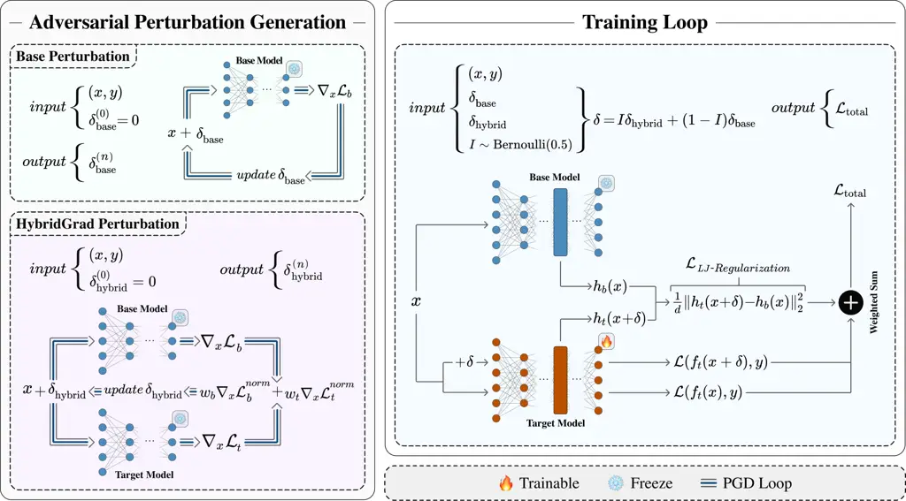
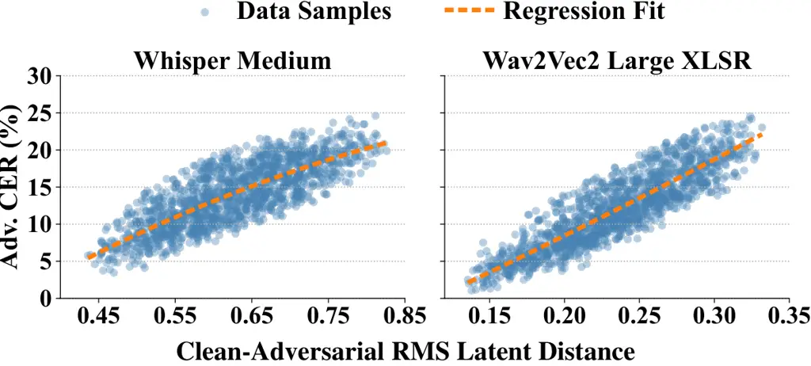

# Breaking Adversarial Transferability in Fine-Tuned Speech Recognition

Mojtaba Nafez ^(†)^(†)thanks: Equal contribution. Affiliation: Idiap
Research Institute Affiliation: École Polytechnique Fédérale de Lausanne
(EPFL) Email: [mojtaba.nafez@epfl.ch](mailto:)    Aref
Mousavi¹¹footnotemark: 1 Affiliation: Department of Computer Engineering
Affiliation: Sharif University of Technology
Email: [aref.mousavi.ac@gmail.com](mailto:)    Mohammad Ebrahim Mahdavi
Affiliation: Department of Computer Engineering Affiliation: University
of Isfahan Email: [mhm.ebrh.mahdavi@gmail.com](mailto:)    Mobina
Poulaei Affiliation: Department of Computer Engineering
Affiliation: Sharif University of Technology
Email: [m.poulaei@gmail.com](mailto:)    Kiarash Kiani Feriz
Affiliation: Department of Computer Engineering Affiliation: Sharif
University of Technology Email: [kiarashkia138@gmail.com](mailto:)   
Mohammad Hossein Rohban Affiliation: Department of Computer Engineering
Affiliation: Sharif University of Technology
Email: [rohban@sharif.edu](mailto:)

###### Abstract

Many organizations fine-tune publicly available pretrained Automatic
Speech Recognition (ASR) models and deploy them in black-box settings,
assuming limited access provides protection. We show this assumption is
fragile: adversarial perturbations crafted on the public base model
transfer effectively to fine-tuned target models, severely degrading
performance and posing concerns for safety-critical applications. We
propose TransferBreaker, a unified fine-tuning framework that suppresses
adversarial transfer by integrating Base Adversarial Fine-Tuning, which
restricts adversarial training to base-effective perturbations; Latent
Jacobian Regularization, which enforces latent-space invariance by
suppressing adversarially sensitive directions; and HybridGrad-AFT,
which improves robustness against adaptive attacks by interpolating
transferable perturbations from base and target gradients. We
theoretically justify all components and evaluate TransferBreaker across
three languages and four large ASR models, reducing adversarial WER from
92.6 to 27.8. Our code is publicly available at
[github.com/rohban-lab/TransferBreaker](https://github.com/rohban-lab/TransferBreaker).

## 1 Introduction

Deep learning–based Automatic Speech Recognition (ASR) systems have
achieved remarkable performance in recent years, yet remain highly
vulnerable to adversarial perturbations \[1\], which are small,
carefully crafted input modifications that can induce incorrect or
malicious predictions. This vulnerability raises serious trustworthiness
concerns, particularly in safety-critical ASR applications such as
in-vehicle voice interfaces and large-scale speech transcription
services \[2\].

In many ASR development pipelines, publicly available pretrained models,
such as Whisper \[3\], are fine-tuned to leverage their strong
multilingual pretraining and proven architectures. The resulting
fine-tuned models are typically deployed as private black-box systems,
where restricted access to parameters and gradients is assumed to
provide a layer of protection. However, we expose a critical
vulnerability that undermines this assumption in practice. As Fig. 1
illustrates, adversarial perturbations crafted with white-box access to
the base model transfer effectively to the fine-tuned target.
Consequently, attackers with access only to the base model can achieve
effectiveness comparable to white-box attacks on the private model,
posing a serious threat and highlighting the need for adversarially
robust fine-tuning in ASR deployments.

The most effective baseline defense against adversarial attacks is
adversarial fine-tuning (AFT) \[4\], originally proposed for
classification, which augments training data with adversarial examples
generated by maximizing the model’s loss with respect to the input. As
shown in Table 1, Standard-AFT improves robustness; however, the
resulting Word Error Rate (WER) under adversarial evaluation remains
prohibitively high for practical ASR deployment.

Figure 1: Adversarial Transferability from Base to Fine-Tuned ASR
Models. Fine-tuned (FT) ASR models evaluated across multiple languages
and backbones exhibit a sharp increase in Word Error Rate (WER) on
adversarial examples optimized against the public base model, relative
to clean inputs, revealing a critical transferability vulnerability. In
contrast, our proposed framework, TransferBreaker, effectively
suppresses this transferability and preserves robustness against
base-model-derived attacks. Note: WER can exceed 100% due to
insertion/deletion errors; see Appendix J.

This limitation arises from two factors. First, ASR is inherently more
complex than standard classification; for example, autoregressive models
such as Whisper must generate long output sequences, where each token
prediction corresponds to a large-vocabulary classification \[5\].
Second, Standard-AFT is designed to achieve full white-box robustness
and does not exploit the black-box advantage inherent in our setting.
Together, these factors cause Standard-AFT to reduce sensitivity to
adversarial perturbations across the entire perturbation space for a
complex ASR task, leading to an overly broad optimization objective that
can excessively constrain the model by enforcing many white-box,
worst-case robustness constraints that are unnecessary in our black-box
setting.

To address this, we leverage the inductive bias of our transferability
threat model: an optimal attacker generates adversarial perturbations
against the publicly available base model. An effective defense should
therefore minimize the impact of these base-derived attacks on the
fine-tuned target model. We propose Base Adversarial Fine-Tuning
(Base-AFT), which augments the training data with adversarial examples
generated against a fixed base model rather than the continuously
updated target model. This restricts adversarial training to the
subspace of perturbations that are effective against the base model,
rather than the full perturbation space, as theoretically justified in
Section 4.1.1.

Based on our observations in Fig. 3, adversarial examples with higher
Character Error Rate tend to exhibit larger clean-to-adversarial RMS
distance in the target latent space. Since large ASR models may struggle
to close this gap using AFT alone, we hypothesize that explicitly
enforcing latent-space invariance to adversarial perturbations improves
robustness. We therefore propose Latent Jacobian Regularization
(LJ-Regularization), which minimizes the squared $`\ell_{2}`$ distance
between the base model’s latent representation of clean samples and the
target model’s latent representation of their adversarial counterparts.
Table 4 confirms the effectiveness of LJ-Regularization, supporting our
hypothesis. Moreover, Section 4.2.1 shows theoretically how
LJ-Regularization promotes this invariance through a stop-gradient
self-invariance update together with a clean-representation drift
correction anchored to the frozen base model, while relating
clean-to-adversarial latent displacement to directional latent-Jacobian
sensitivity.

Our framework, which combines Base-AFT with LJ-Regularization, achieves
strong robustness under our transferability threat model. However,
experimental results in Table 2 indicate that it provides limited
protection against adaptive attackers who are fully aware of the defense
strategy \[6\]. In this setting, the attacker trains a surrogate model
using the same framework on their dataset to approximate the target
model, and adversarial perturbations crafted on the surrogate still
transfer effectively to the target model despite Base-AFT and
LJ-Regularization.

To address this vulnerability, the target model must exhibit a degree of
general white-box–level adversarial robustness to resist attacks from
surrogate models that closely approximate it. Standard-AFT is effective
in white-box settings; however, as discussed earlier, it enforces
robustness over the entire perturbation space, which can overly
constrain the model and is unnecessary for our threat model. As a
result, its robustness against base-model attacks is insufficient.

Motivated by these observations, we propose HybridGrad-AFT, which
provides targeted general robustness by restricting the perturbation
space to the fundamental and transferable perturbations on which our
threat model focuses, rather than the full perturbation space.
HybridGrad-AFT augments the training data with adversarial examples
perturbed by HybridGrad, constructed by combining base- and target-model
gradients to interpolate fundamental and transferable adversarial
directions, ensuring transferability between the base and target models.
HybridGrad-AFT substantially improves robustness against adaptive
attacks, while introducing a trade-off under base-model attacks; LJR
partially recovers this loss (Appendix I.1). Appendix B theoretically
formalizes this space and shows that HybridGrad-AFT strengthens
robustness along fundamental transfer directions.

We propose TransferBreaker, a fine-tuning framework that suppresses
adversarial transferability by integrating Base-AFT, HybridGrad-AFT, and
LJ-Regularization into a unified training procedure. Contributions. (i)
we expose a critical vulnerability where white-box access to a base
model enables near–white-box attacks on target models, increasing
average WER from 16.4 to 92.6; (ii) Base-AFT restricts adversarial
training to base-effective perturbations, avoiding the over-constraining
behavior of Standard-AFT in complex ASR tasks; (iii) LJ-Regularization
enforces latent-space invariance by suppressing adversarially sensitive
directions; (iv) we develop HybridGrad-AFT to improve robustness against
adaptive attacks by interpolating transferable perturbations from base
and target gradients; and (v) we provide theoretical justification and
extensive experiments across three languages (Polish, Portuguese, and
Arabic) \[7\] and four state-of-the-art ASR models:
Whisper-large-v3-turbo, wav2vec2-large \[8\], MMS-1B \[9\], and
Whisper-medium, showing that TransferBreaker reduces average adversarial
WER from 92.6 to 27.8 on base-model attacks.

## 2 Related Work

Prior work establishes that ASR systems are vulnerable to adversarial
perturbations in both white- and black-box settings \[10, 1, 11\],
including cross-model transferability \[12, 13, 14\]. However,
transferability from publicly available pretrained ASR models to their
fine-tuned counterparts, particularly in large-scale systems, remains
underexplored. We formalize this threat model and propose
TransferBreaker to mitigate it. Existing effective defenses primarily
rely on adversarial fine-tuning \[4, 15\], which assumes white-box
access and can be overly conservative in transfer-based scenarios.
Additionally, preprocessing-based defenses \[16, 17\] often fail to
mitigate such attacks and may degrade clean performance (see
Appendix Q). Further discussion is provided in Appendix G.

## 3 Background and Preliminaries



Figure 2: The TransferBreaker Framework. Left: Adversarial perturbation
generation, including Base Perturbation ($`\delta_{\text{base}}`$) and
HybridGrad Perturbation ($`\delta_{\text{hybrid}}`$), where the latter
combines base and target gradients to interpolate transferable
adversarial directions. Right: The training loop using clean and
adversarial samples with task loss (CTC or Cross-Entropy) and Latent
Jacobian Regularization to enforce latent-space invariance and suppress
adversarially sensitive directions.

##### Adversarial Attack on ASR.

An adversarial attack modifies an input sample $`x`$ with label $`y`$ to
maximize the loss $`\ell(x;y)`$ \[18, 19\]. The resulting sample
$`x^{*}`$ is called an adversarial example, and $`x^{*}-x`$ is the
adversarial perturbation, typically constrained by an $`l_{p}`$-norm
bound $`\|x-x^{\prime}\|_{p}\leq\epsilon`$ to ensure semantic
preservation. Formally,
$`x^{*}=\arg\max_{x^{\prime}:\|x-x^{\prime}\|_{p}\leq\epsilon}\ell(x^{\prime};y).`$
Projected Gradient Descent (PGD) \[4\] is a standard first-order method
that iteratively updates the input by ascending the loss surface while
enforcing the perturbation constraint:
$`x_{0}^{*}=x,\quad x_{t+1}^{*}=\Pi_{\mathcal{B}_{\epsilon}(x)}\!\left(x_{t}^{*}+\alpha\cdot\operatorname{sign}\big(\nabla_{x}\ell(x_{t}^{*};y)\big)\right),\quad x^{*}=x_{K}^{*},`$
where $`\alpha`$ is the step size, $`K`$ is the number of iterations,
and $`\Pi_{\mathcal{B}_{\epsilon}(x)}(\cdot)`$ denotes projection onto
the $`l_{p}`$-ball centered at $`x`$ with radius $`\epsilon`$.

In ASR, adversarial attacks differ from classification because outputs
are variable-length sequences
$`\hat{y}=(\hat{y}_{1},\dots,\hat{y}_{N})`$, often with large $`N`$,
leading to correlated token-level predictions rather than a single
prediction. The adversarial objective $`\ell(\cdot)`$ is therefore
defined over the full sequence (e.g., CTC or cross-entropy) to induce
transcription errors. Moreover, modern ASR operates in large-vocabulary
settings (e.g., $`>50{,}000`$ tokens in Whisper), unlike classification
tasks with far fewer classes. To ensure nearly imperceptible
perturbations, instead of a fixed $`l_{p}`$-norm constraint, we enforce
$`\mathrm{SNR}(x,x^{*})\geq 27~\mathrm{dB}`$, expressed as the
signal-dependent constraint
$`\|x-x^{*}\|_{\infty}\leq\sqrt{\frac{P(x)}{10^{27/10}}}`$, where
$`P(x)`$ denotes the mean signal power. Further perceptual analysis is
provided in Appendix I.7.

Threat Model. Given an input audio waveform $`x`$ and its ground-truth
transcription $`y`$, we consider an adversary whose goal is to generate
a nearly imperceptible, untargeted adversarial perturbation $`\delta`$
to degrade a privately fine-tuned ASR system, without ever querying
$`f_{t}`$ during perturbation construction (a _zero-query transfer_
setting). The adversary has white-box access to a publicly available
base model $`f_{b}(\cdot)`$ (e.g., Whisper), including its parameters
and gradients, but no access to the fine-tuned target model
$`f_{t}(\cdot)`$, which is treated as a black box derived from the base
model.

The perturbation $`\delta`$ is optimized on $`f_{b}`$ under perceptual
constraints to maximize the training loss for a given audio sample
(e.g., CTC or seq2seq cross-entropy), leading to increased transcription
errors measured by WER. Formally,
$`\mathrm{WER}(f_{b}(x+\delta),y)\gg\mathrm{WER}(f_{b}(x),y),`$ where
$`f_{b}(x+\delta)=(\hat{y}_{1},\dots,\hat{y}_{M})`$ and
$`y=(y_{1},\dots,y_{N})`$. Since ASR outputs are variable-length
sequences, the optimization induces errors across the entire sequence
rather than at a single token position. Leveraging the transferability
of adversarial examples across fine-tuned models, the same perturbation
$`\delta`$ is applied to the private target model $`f_{t}`$ without
adaptation. The attack is considered successful if it significantly
degrades transcription quality, i.e.,
$`\mathrm{WER}\big(f_{t}(x+\delta),y\big)\gg\mathrm{WER}\big(f_{t}(x),y\big).`$

This threat model reflects realistic deployments where organizations,
especially for mid- and low-resource languages, fine-tune public ASR
models for their strong performance. Although the target model is a
black box, we show perturbations crafted on the base model transfer
effectively, often approaching white-box strength, and this persists
even under large-scale fine-tuning (up to 1,000 hours, Appendix C),
indicating a fundamental vulnerability that challenges the assumed
security of black-box deployment and motivates robust fine-tuning.
Section 4.3 extends this to a defense-aware zero-query adversary that
knows the TransferBreaker procedure and public base model but has no
access to the target model’s parameters, gradients, or training data.
Using its own data, the attacker trains a surrogate $`f_{s}`$ from the
base model and transfers perturbations crafted on $`f_{s}`$ to
$`f_{t}`$. We justify our motivation and scope of untargeted attacks in
Appendix T.

## 4 Methodology

Overview. Many privately fine-tuned ASR models $`f_{t}`$ deployed by
organizations are highly vulnerable to adversarial perturbations crafted
on the publicly available base models $`f_{b}`$ on which they are
fine-tuned. We propose TransferBreaker, an adversarial fine-tuning
framework that suppresses transferability from base to target models.
TransferBreaker generates adversarial examples using two mechanisms:
base-model gradients and HybridGrad, which jointly leverages base- and
target-model gradients. Base-model gradients exploit alignment with
attacker objectives to reduce transferability, while HybridGrad improves
robustness to adaptive attacks by focusing perturbations on transferable
directions rather than the entire perturbation space. We further
introduce Latent Jacobian Regularization, which constrains adversarial
latent displacement using a frozen base-model reference, strengthening
transferability suppression. We provide theoretical justification for
base-model adversarial examples, HybridGrad adversarial examples, and
LJ-Regularization. The following subsections describe the main
components.

### 4.1 Base Adversarial Fine-Tuning

Let $`f_{b}`$ denote the public base model and $`f_{t}`$ the privately
fine-tuned target model. We define their training losses as

```math
\mathcal{L}_{b}(x,y)\triangleq\mathcal{L}(f_{b}(x),y),\quad\mathcal{L}_{t}(x,y)\triangleq\mathcal{L}(f_{t}(x),y)\,. \tag{1}
```

In our threat model, we assume that the attacker has access to the base
model but not the final target model. Accordingly, the attacker attempts
to compute $`\delta_{\mathrm{base}}`$ such that

```math
\delta_{\mathrm{base}}=\arg\max_{\|\delta\|_{p}\leq\epsilon}\mathcal{L}_{b}(x+\delta,y)\,. \tag{2}
```

An optimal defender should minimize the impact of this base-derived
attack on the target model

```math
\min_{\theta_{t}}\mathbb{E}_{(x,y)}\left[\mathcal{L}_{t}(x+\delta_{\mathrm{base}},y)\right]\,. \tag{3}
```

We refer to this strategy as _base adversarial fine-tuning (Base-AFT)_,
in which the training data are augmented with adversarial examples
generated against the base model using a momentum-based PGD attack
\[20\]. The procedure is detailed in Algorithm 1 (Appendix A).

##### Empirical motivation.

Our experiments (Table 4) show that Base-AFT is substantially more
effective than Standard-AFT against attacks crafted on the base model.
While prior work identifies Standard-AFT (i.e., augmenting training data
with adversarial examples generated against the current model) as the
strongest defense in white-box settings, our results show that it
remains substantially less effective under our threat model, with WER
remaining high under transferred attacks (see Appendix P for further
analysis).

We attribute this limitation to the inherent complexity of ASR. Unlike
classification, ASR involves long sequence generation with
large-vocabulary predictions at each step. Standard-AFT therefore
attempts to reduce sensitivity to adversarial perturbations across the
entire perturbation space for a complex sequence-generation task,
leading to an overly broad optimization objective that can excessively
constrain the model. In contrast, Equations (2) and (3) explain why
Base-AFT is optimal. By aligning the training-time adversarial objective
with the attacker’s objective, namely perturbations generated on the
publicly available base model, Base-AFT directly targets the subspace
responsible for transferability. Moreover, fixing adversarial generation
to the static base model reduces optimization complexity while focusing
robustness on the perturbation directions that matter most.

In Section 4.1.1, we formalize this intuition and theoretically show
that Base-AFT concentrates robustness on a structured subspace of
directions to which the base model is most vulnerable, rather than the
entire perturbation space.

#### 4.1.1 Theoretical Analysis of Base-AFT versus Standard-AFT

Mechanism of Base-AFT. Using a Taylor expansion (see Appendix S for
justification), for small $`\epsilon`$ we have

```math
\mathcal{L}_{b}(x+\delta,y)\approx\mathcal{L}_{b}(x,y)+\nabla_{x}\mathcal{L}_{b}(x,y)\cdot\delta\,. \tag{4}
```

So

```math
\begin{gathered}\delta_{\mathrm{base}}=\arg\max_{\|\delta\|_{p}\leq\epsilon}\mathcal{L}_{b}(x+\delta,y)\approx\arg\max_{\|\delta\|_{p}\leq\epsilon}\big(\mathcal{L}_{b}(x,y)+\nabla_{x}\mathcal{L}_{b}(x,y)\cdot\delta\big)=\\
\arg\max_{\|\delta\|_{p}\leq\epsilon}\nabla_{x}\mathcal{L}_{b}(x,y)\cdot\delta\,.\end{gathered} \tag{5}
```

Solving this optimization problem gives
$`\delta_{\mathrm{base}}\approx\epsilon\,u_{b}(x)`$, where $`u_{b}(x)`$
is the unit $`\ell_{p}`$-norm direction that maximizes the inner product
with the base gradient $`\nabla_{x}\mathcal{L}_{b}(x,y)`$. Using the
same first-order approximation for the target loss and substituting
$`\delta_{\mathrm{base}}`$, the defender’s objective becomes

```math
\begin{gathered}\min_{\theta_{t}}\mathbb{E}_{(x,y)}\bigl[\mathcal{L}_{t}(x+\delta_{\mathrm{base}},y)\bigr]\;\approx\;\min_{\theta_{t}}\mathbb{E}_{(x,y)}\bigl[\mathcal{L}_{t}(x,y)+\nabla_{x}\mathcal{L}_{t}(x,y)\cdot\epsilon\,u_{b}(x)\bigr]=\\[0.0pt]
\min_{\theta_{t}}\Bigl(\mathbb{E}_{(x,y)}\bigl[\mathcal{L}_{t}(x,y)\bigr]+\epsilon\,\mathbb{E}_{(x,y)}\bigl[\left\langle\nabla_{x}\mathcal{L}_{t}(x,y),\,u_{b}(x)\right\rangle\bigr]\Bigr)\,.\end{gathered} \tag{6}
```

Interpretation. Let
$`\mathcal{U}_{b}(x)=\operatorname{span}\{u_{b}(x)\}`$ denote the
adversarial subspace identified by the base model. Base-AFT seeks to
maintain clean accuracy while strategically reducing the target model’s
loss response along the adversarial direction $`u_{b}(x)`$ within
$`\mathcal{U}_{b}(x)`$, rather than attempting to cover the entire
perturbation space.

Mechanism of Standard-AFT. In standard adversarial fine-tuning, we
optimize the objective

```math
\min_{\theta_{t}}\mathbb{E}_{(x,y)}\left[\max_{\|\delta\|_{p}\leq\epsilon}\mathcal{L}_{t}(x+\delta,y)\right]\,. \tag{7}
```

Based on Taylor expansion, for small $`\epsilon`$ we have

```math
\mathcal{L}_{t}(x+\delta,y)\approx\mathcal{L}_{t}(x,y)+\nabla_{x}\mathcal{L}_{t}(x,y)\cdot\delta\,. \tag{8}
```

So

```math
\max_{\|\delta\|_{p}\leq\epsilon}\mathcal{L}_{t}(x+\delta,y)\approx\mathcal{L}_{t}(x,y)+\max_{\|\delta\|_{p}\leq\epsilon}\nabla_{x}\mathcal{L}_{t}(x,y)\cdot\delta\,. \tag{9}
```

Solving this optimization problem gives

```math
\max_{\|\delta\|_{p}\leq\epsilon}\mathcal{L}_{t}(x+\delta,y)\approx\mathcal{L}_{t}(x,y)+\epsilon\ \|\nabla_{x}\mathcal{L}_{t}(x,y)\|_{q}\,, \tag{10}
```

where $`\frac{1}{p}+\frac{1}{q}=1`$. Substituting this approximation
into the defender’s problem yields

```math
\operatorname*{min}_{\theta_{t}}\,\mathbb{E}_{(x,y)}\Big[\operatorname*{max}_{\lVert\delta\rVert_{p}\leq\epsilon}\mathcal{L}_{t}(x+\delta,y)\Big]\;\approx\;\operatorname*{min}_{\theta_{t}}\,\Big(\mathbb{E}_{(x,y)}[\mathcal{L}_{t}(x,y)]+\epsilon\,\mathbb{E}_{(x,y)}[\lVert\nabla_{x}\mathcal{L}_{t}(x,y)\rVert_{q}]\Big)\,. \tag{11}
```

Comparison. Standard-AFT seeks to maintain clean accuracy while reducing
the target model’s sensitivity $`(\nabla_{x}\mathcal{L}_{t}(x,y))`$ over
the entire perturbation space. This is a broad optimization objective
and can overly constrain the model. In contrast, Base-AFT focuses
robustness on the attacker-relevant subspace induced by the base model,
yielding stronger protection against transferred attacks.

### 4.2 Latent Jacobian Regularization



Figure 3: Motivation for Latent Jacobian Regularization. For Base-AFT
target models on Polish, adversarial CER is positively associated with
clean-to-adversarial RMS latent distance. Each point corresponds to an
evaluation utterance, and the dashed lines show regression fits. This
association motivates explicitly constraining adversarial latent
displacement during fine-tuning.

Based on our observations on the evaluation set (see Fig. 3), we find
that adversarial examples with higher CER also tend to exhibit larger
clean-to-adversarial RMS distance in the target latent space. This
suggests that AFT alone may not sufficiently constrain adversarial
latent displacement. We therefore hypothesize that explicitly
constraining latent representations under adversarial perturbations, in
addition to AFT, can yield stronger robustness.

|            |          |        |     |                |       |         |      |                     |       |         |      |        |      |         |      |                        |       |         |      |
| ---------- | -------- | ------ | --- | -------------- | ----- | ------- | ---- | ------------------- | ----- | ------- | ---- | ------ | ---- | ------- | ---- | ---------------------- | ----- | ------- | ---- |
|            |          |        |     | Whisper Medium |       |         |      | Wav2Vec2 Large XLSR |       |         |      | MMS 1B |      |         |      | Whisper Large V3 Turbo |       |         |      |
| Language   | Setup    | Metric |     | Base           | FT    | Std-AFT | Ours | Base                | FT    | Std-AFT | Ours | Base   | FT   | Std-AFT | Ours | Base                   | FT    | Std-AFT | Ours |
| Polish     | Clean    | WER    |     | 15.3           | 9.6   | 12.9    | 12.0 | 18.8                | 12.2  | 17.3    | 16.8 | 12.9   | 8.9  | 12.4    | 10.7 | 13.4                   | 9.6   | 10.8    | 11.8 |
|            |          | CER    |     | 5.9            | 2.7   | 4.2     | 3.8  | 4.4                 | 3.0   | 4.5     | 4.2  | 3.1    | 2.1  | 3.2     | 2.6  | 4.3                    | 2.6   | 3.3     | 3.7  |
|            | Base-Adv | WER    |     | 118.1          | 86.7  | 44.0    | 24.2 | 102.0               | 86.2  | 33.7    | 24.8 | 104.7  | 84.0 | 28.7    | 17.2 | 128.0                  | 68.4  | 32.2    | 20.8 |
|            |          | CER    |     | 83.2           | 46.0  | 22.5    | 9.7  | 54.7                | 46.2  | 10.3    | 6.9  | 63.7   | 44.3 | 8.8     | 4.8  | 78.8                   | 32.8  | 14.2    | 7.8  |
| Portuguese | Clean    | WER    |     | 22.2           | 12.5  | 16.1    | 15.1 | 30.0                | 19.8  | 26.4    | 23.9 | 19.8   | 14.2 | 18.2    | 16.4 | 16.9                   | 12.6  | 12.9    | 12.7 |
|            |          | CER    |     | 7.0            | 3.7   | 5.5     | 4.8  | 7.8                 | 5.2   | 7.7     | 6.7  | 5.2    | 3.7  | 4.9     | 4.3  | 5.8                    | 4.1   | 4.3     | 4.1  |
|            | Base-Adv | WER    |     | 147.9          | 83.6  | 42.9    | 21.7 | 117.2               | 109.9 | 41.9    | 32.7 | 171.0  | 97.9 | 34.5    | 23.1 | 158.6                  | 75.8  | 45.3    | 19.3 |
|            |          | CER    |     | 86.7           | 44.7  | 21.1    | 8.2  | 62.6                | 59.3  | 14.1    | 10.7 | 84.9   | 52.5 | 11.5    | 7.1  | 89.1                   | 42.0  | 18.6    | 7.2  |
| Arabic     | Clean    | WER    |     | 38.4           | 24.7  | 28.1    | 26.2 | 35.0                | 22.9  | 28.2    | 26.4 | 34.1   | 24.7 | 31.0    | 28.5 | 37.2                   | 24.9  | 28.8    | 26.3 |
|            |          | CER    |     | 11.0           | 6.4   | 8.5     | 8.3  | 8.3                 | 5.4   | 6.8     | 6.2  | 8.1    | 5.9  | 7.4     | 6.6  | 9.7                    | 6.2   | 7.8     | 7.2  |
|            | Base-Adv | WER    |     | 164.2          | 110.0 | 58.4    | 36.5 | 124.9               | 105.1 | 48.5    | 36.8 | 136.4  | 97.3 | 50.9    | 38.9 | 158.4                  | 106.1 | 52.6    | 38.0 |
|            |          | CER    |     | 85.2           | 56.5  | 27.1    | 12.2 | 67.3                | 53.3  | 14.3    | 10.6 | 66.5   | 48.4 | 14.1    | 10.7 | 79.7                   | 53.6  | 20.5    | 11.8 |

Table 1: Main results comparing WER/CER under clean and transferred
adversarial settings across four ASR backbones. Base model and its
variants are trained under three regimes: fine-tuning (FT), standard
adversarial fine-tuning (Std-AFT), and TransferBreaker (Ours), using
three languages from Common Voice 24. “Base-Adv” denotes adversarial
examples crafted on the base model and transferred to the corresponding
target models. Lower is better. Note: WER can exceed 100% due to
insertion/deletion errors; see Appendix J.

This observation motivates explicitly controlling adversarial latent
displacement. We further find that using the frozen base model’s clean
representation as the reference is better aligned with our
base-to-target transfer objective and yields stronger robustness than
using the target model’s own clean representation as the reference (see
Appendix I.2). We therefore propose _Latent Jacobian Regularization
(LJ-Regularization)_, which penalizes the squared $`\ell_{2}`$ distance
between the frozen base model’s latent representation $`h_{b}(x)`$ of a
clean sample and the target model’s latent representation
$`h_{t}(x+\delta)`$ of its adversarial counterpart. Let $`x`$ denote an
audio input, $`\delta`$ an adversarial perturbation, and $`d`$ the
number of latent elements being compared. We define

```math
\mathcal{L}_{\mathrm{LJ-Regularization}}=\frac{1}{d}\,\big\|h_{t}(x+\delta)-h_{b}(x)\big\|_{2}^{2}\,. \tag{12}
```

Moreover, using the frozen base model as a fixed reference avoids the
trivial representation-collapse solution that can arise when optimizing
a squared distance between two outputs of the same trainable model \[21,
22\].

In Section 4.2.1, we formalize LJ-Regularization and characterize its
connection to latent invariance. Specifically, we show that its outer
update consists of a stop-gradient self-invariance update together with
a clean-representation drift correction anchored to the frozen base
model. We further relate the clean-to-adversarial latent displacement to
directional latent-Jacobian sensitivity.

#### 4.2.1 Theoretical Analysis of LJ-Regularization

We characterize LJ-Regularization relative to stop-gradient
self-invariance without assuming that the clean target representation
$`h_{t}(x)`$ is close to the base representation $`h_{b}(x)`$. Define
the clean representation drift and the clean-to-adversarial target
displacement as

```math
g(x)\triangleq h_{t}(x)-h_{b}(x),\qquad\Delta(x,\delta)\triangleq h_{t}(x+\delta)-h_{t}(x). \tag{13}
```

Since $`h_{t}(x+\delta)-h_{b}(x)=\Delta(x,\delta)+g(x)`$, the
LJ-Regularization objective in Eq. 12 can be written exactly as

```math
d\mathcal{L}_{\mathrm{LJ-Regularization}}=\|\Delta\|_{2}^{2}+\|g(x)\|_{2}^{2}+2\langle\Delta,g(x)\rangle. \tag{14}
```

For comparison, define the stop-gradient self-invariance objective

```math
\mathcal{L}_{\mathrm{self}}=\frac{1}{d}\left\|h_{t}(x+\delta)-\operatorname{sg}[h_{t}(x)]\right\|_{2}^{2}. \tag{15}
```

Its forward value is
$`d\mathcal{L}_{\mathrm{self}}=\|\Delta\|_{2}^{2}`$. Equation 14 is an
algebraic decomposition of the frozen-base objective; its three terms
should not be interpreted as independently optimized regularizers.

At the level of the outer training update, the distinction between the
two objectives is exact. Let $`\theta`$ denote the target-model
parameters, and let $`J_{\theta}h_{t}(x+\delta)`$ denote the Jacobian of
the target latent representation with respect to $`\theta`$. The base
model is frozen, and the generated perturbation $`\delta`$ is detached
during the outer parameter update. Therefore,

```math
\nabla_{\theta}\mathcal{L}_{\mathrm{LJ-Regularization}}=\nabla_{\theta}\mathcal{L}_{\mathrm{self}}+\frac{2}{d}J_{\theta}h_{t}(x+\delta)^{\top}g(x). \tag{16}
```

At initialization, $`h_{t}=h_{b}`$, so $`g(x)=0`$ and the two updates
coincide. During fine-tuning, $`g(x)`$ generally becomes nonzero.
Equation 16 shows that the LJ-Regularization outer update equals the
stop-gradient self-invariance update plus a correction determined by the
clean representation drift. The self objective aligns
$`h_{t}(x+\delta)`$ with the current clean target representation
$`h_{t}(x)`$, whereas LJ-Regularization aligns $`h_{t}(x+\delta)`$ with
the fixed clean base representation $`h_{b}(x)`$. Thus, the frozen-base
objective retains explicit dependence on the public base model
throughout fine-tuning, matching the base-to-target transfer setting
studied here.

The clean-to-adversarial displacement $`\Delta(x,\delta)`$ also has a
local latent-Jacobian interpretation. For sufficiently small $`\delta`$,

```math
\Delta(x,\delta)=J_{h_{t}}(x)\delta+r(x,\delta). \tag{17}
```

Here, $`J_{h_{t}}(x)`$ is the Jacobian of $`h_{t}`$ with respect to the
input and $`r(x,\delta)`$ is the higher-order remainder. When the
first-order approximation is informative,
$`\|\Delta(x,\delta)\|_{2}^{2}\approx\|J_{h_{t}}(x)\delta\|_{2}^{2}`$.
This relation connects clean-to-adversarial latent displacement to
directional latent-Jacobian sensitivity. Equation 16 then shows how the
frozen-base outer update augments the corresponding self-invariance
update with the drift-dependent base-reference correction. Appendix I.2
directly compares the two anchors.

### 4.3 Adaptive Adversarial Attacks Against Our Defense

Although Base-AFT combined with LJ-Regularization effectively suppresses
the transferability of adversarial perturbations from the base model, we
observe that it provides only limited protection against adaptive
attackers who are fully aware of our defense strategy.

Adaptive Attack Threat Model. We assume an adaptive attacker with full
knowledge of our defense framework, including Base-AFT,
LJ-Regularization, and HybridGrad (described later in this section).
Using its own dataset, the attacker applies the same TransferBreaker
procedure to train a surrogate model $`f_{s}(\cdot)`$ in an attempt to
approximate our privately fine-tuned target model $`f_{t}(\cdot)`$.
Adversarial perturbations $`\delta`$ crafted against $`f_{s}`$ are
observed to transfer effectively to $`f_{t}`$, despite the use of
Base-AFT and LJ-Regularization during training.

|            |               |        |     |                |              |      |                     |              |      |          |              |      |
| ---------- | ------------- | ------ | --- | -------------- | ------------ | ---- | ------------------- | ------------ | ---- | -------- | ------------ | ---- |
|            |               |        |     | Whisper Medium |              |      | Wav2Vec2 Large XLSR |              |      | MMS 1B   |              |      |
| Language   | Setup         | Metric |     | Base-AFT       | Base+Std-AFT | Ours | Base-AFT            | Base+Std-AFT | Ours | Base-AFT | Base+Std-AFT | Ours |
| Polish     | Clean         | WER    |     | 11.0           | 13.1         | 12.0 | 15.9                | 16.7         | 16.8 | 10.6     | 11.0         | 10.7 |
|            |               | CER    |     | 3.4            | 4.2          | 3.8  | 3.9                 | 4.2          | 4.2  | 2.6      | 2.6          | 2.6  |
|            | Base-Adv      | WER    |     | 22.4           | 30.2         | 24.2 | 24.0                | 28.9         | 24.8 | 17.2     | 21.1         | 17.2 |
|            |               | CER    |     | 8.3            | 13.2         | 9.7  | 6.9                 | 8.5          | 6.9  | 4.9      | 6.2          | 4.8  |
|            | Surrogate-Adv | WER    |     | 57.6           | 46.8         | 44.1 | 54.2                | 44.7         | 40.7 | 48.6     | 38.0         | 37.2 |
|            |               | CER    |     | 29.6           | 22.7         | 20.5 | 23.5                | 16.6         | 15.3 | 19.7     | 13.5         | 13.3 |
| Portuguese | Clean         | WER    |     | 14.2           | 16.2         | 15.1 | 23.2                | 24.6         | 23.9 | 16.2     | 17.5         | 16.4 |
|            |               | CER    |     | 4.4            | 5.5          | 4.8  | 6.6                 | 7.1          | 6.7  | 4.1      | 4.6          | 4.3  |
|            | Base-Adv      | WER    |     | 19.6           | 27.8         | 21.7 | 32.7                | 36.7         | 32.7 | 22.2     | 28.8         | 23.1 |
|            |               | CER    |     | 6.8            | 11.9         | 8.2  | 10.6                | 12.1         | 10.7 | 6.6      | 9.3          | 7.1  |
|            | Surrogate-Adv | WER    |     | 56.4           | 46.3         | 44.7 | 62.8                | 51.9         | 48.9 | 60.3     | 43.7         | 42.8 |
|            |               | CER    |     | 27.8           | 22.0         | 20.8 | 27.7                | 19.8         | 18.1 | 27.6     | 17.5         | 17.0 |

Table 2: Comparison of Base-AFT, Base+Standard-AFT, and TransferBreaker
under clean settings, base-model adversarial attacks (Base-Adv), and
surrogate-based adaptive adversarial attacks (Surrogate-Adv) for Polish
and Portuguese across ASR backbones. Lower is better.

HybridGrad-AFT. The success of adaptive attacks indicates that
robustness to base-model attacks alone is insufficient. The target model
must also exhibit a degree of general adversarial robustness. Because
the surrogate model trained by an adaptive attacker provides
near-white-box access to our target model, $`f_{t}`$ and $`f_{s}`$ may
still share overlapping vulnerable directions in the perturbation space.

As discussed earlier, Standard-AFT is effective in white-box settings,
which represent the worst-case attack scenario. In our setting, however,
Standard-AFT is suboptimal because it enforces robustness over the
entire perturbation space, namely perturbations generated using the
target model’s gradients at each training step. This can overly
constrain the model and is unnecessary for our threat model. To address
this, we propose _HybridGrad-AFT_, which provides targeted general
robustness by restricting the perturbation space to _fundamental and
transferable perturbations_ rather than the full space. This design
aligns with our goal of suppressing transferability: the most critical
threats in our threat model are adaptive attacks, whose perturbations
must still transfer from a surrogate to the target and therefore lie
primarily in this fundamental, transferable subspace.

In HybridGrad-AFT, we augment the training data with adversarial
perturbations called _HybridGrad_. These perturbations are generated
using a momentum-based PGD attack, in which each PGD step employs a
hybrid gradient formed by combining gradients from the base and target
models. A scheduler controls this combination: in early PGD steps,
updates rely more heavily on the base-model gradient to ensure
effectiveness on the base model, and they gradually shift emphasis
toward target-model gradient to promote transferability. Thus,
HybridGrad perturbations are simultaneously effective on both the base
and target models (see Table 14 and details in Appendix H).

Overall, HybridGrad-AFT focuses adversarial training on fundamental and
transferable perturbations via HybridGrad. As shown in Table 2, it
substantially improves robustness against adaptive attacks. Appendix B
theoretically formalizes this perturbation space and shows how
HybridGrad-AFT focuses training on the fundamental perturbations
responsible for transferability across models. We further examine this
attack’s strength relative to a true white-box adversary, and the effect
of surrogate data fidelity, in Appendix N and Appendix O, respectively.

### 4.4 TransferBreaker

TransferBreaker is a fine-tuning framework designed to suppress
adversarial transferability. It fine-tunes a target model
$`f_{t}(\cdot)`$, initialized from the base model at the start, and
fine-tunes it using a mixture of clean samples, base model adversarial
examples, and HybridGrad-augmented adversarial samples, together with
LJ-Regularization (see Fig. 2). The overall training objective is

```math
\begin{gathered}\mathcal{L}_{\text{Total}}=\mathcal{L}\big(f_{t}(x),y\big)+\lambda_{1}\,\mathcal{L}\big(f_{t}(x+\delta),y\big)+\lambda_{2}\,\frac{1}{d}\big\|h_{t}(x+\delta)-h_{b}(x)\big\|_{2}^{2}\\[0.0pt]
\text{with}\quad I\sim\text{Bernoulli}(p)\quad\text{and}\quad\delta=I\,\delta_{\text{hybrid}}+(1-I)\,\delta_{\text{base}}\,.\end{gathered} \tag{18}
```

By minimizing $`\mathcal{L}_{\text{Total}}`$, TransferBreaker suppresses
the transferability of adversarial perturbations from the base model to
the target model. While the choice of loss $`\mathcal{L}`$ depends on
the base model’s pretraining objective (e.g., cross-entropy for Whisper
or CTC for Wav2Vec2), TransferBreaker remains model-agnostic and
architecture-independent. Accordingly, the Bernoulli variable $`I`$
introduces randomness in selecting the source of the adversarial
perturbation (see Appendix I.6 for comparison with using both
perturbations at once), choosing between $`\delta_{\text{base}}`$ and
$`\delta_{\text{hybrid}}`$ with probability $`p`$ (set to 0.5 in our
experiments). The hyperparameters $`\lambda_{1}`$ and $`\lambda_{2}`$
control the contributions of the adversarial loss and LJ-Regularization,
respectively. Unless otherwise stated, $`\lambda_{1}`$ is set to $`4`$
and $`\lambda_{2}`$ is set to $`2.5`$. We provide an ablation study over
these hyperparameters in Appendix I.5.

## 5 Experiments

We extensively evaluate TransferBreaker on three typologically diverse
languages (Portuguese, Polish, and Arabic) using data from Common Voice
24 (details on the dataset and language selection are provided in
Appendix D and Appendix F). Experiments are conducted across four
state-of-the-art ASR backbones: Whisper-Medium, Wav2Vec2-Large-XLSR,
MMS-1B, and Whisper-Large-V3-Turbo (model details in Appendix E).
Table 1 reports results for four model variants: base, fine-tuned (FT),
standard adversarially fine-tuned (Std-AFT), and TransferBreaker (Ours).
Models are evaluated on both _Clean_ data and _Adversarial_ data
generated on the base model and transferred to the target models. We
report WER and CER. Attacks crafted on the base model transfer strongly
to FT models, resulting in substantial performance degradation (e.g.,
for Arabic, the WER of Whisper-Medium increases from $`24.7\%`$ to
$`110.0\%`$). Although Std-AFT improves robustness, it remains
vulnerable. In contrast, TransferBreaker consistently achieves the
lowest WER and CER under adversarial evaluation while maintaining
competitive clean performance. Its consistent gains across languages
(including low-resource Finnish and Vietnamese, Appendix  R) and
backbones demonstrate that it is both language-agnostic and
model-agnostic, making it a broadly applicable defense against
transferred adversarial attacks.

Implementation Detail. All experiments use the Mozilla Common Voice 24
dataset. Each model is fine-tuned for 4 epochs using AdamW with a
learning rate of $`1\times 10^{-5}`$ and a 10% linear warm-up followed
by linear decay. Evaluation is performed using our Advance-PGD attack
(Appendix K.1). Further implementation details and evaluation metric
definitions are provided in Appendices K and J, respectively. We also
provide a computational cost analysis of training in Appendix L.

Analyzing Results. Averaged across all languages and models, transferred
attacks severely degrade fine-tuned models, increasing WER from 16.4 to
92.6 and CER from 4.3 to 48.3. Standard-AFT partially mitigates this,
reducing adversarial WER to 42.8 (clean WER 20.3, clean CER 5.7;
adversarial CER 16.4). In contrast, TransferBreaker provides stronger
robustness, lowering adversarial WER to 27.8 (clean WER 18.9, clean CER
5.2; adversarial CER 9.0), corresponding to a 64.8-point improvement
over fine-tuned variants under attack. While both Standard-AFT and
TransferBreaker exhibit a trade-off between clean accuracy and
robustness \[23, 24, 25\], TransferBreaker achieves significantly higher
robustness than Standard-AFT while also maintaining better average clean
performance.

|      |          |        |     |                |        |               |        |         |        |
| ---- | -------- | ------ | --- | -------------- | ------ | ------------- | ------ | ------- | ------ |
|      |          |        |     | Whisper Medium |        | Wav2Vec2 XLSR |        | MMS 1B  |        |
| Lang | Setup    | Metric |     | w/o LJR        | w/ LJR | w/o LJR       | w/ LJR | w/o LJR | w/ LJR |
| PL   | Clean    | WER    |     | 12.8           | 12.0   | 16.4          | 16.8   | 10.5    | 10.7   |
|      |          | CER    |     | 4.1            | 3.8    | 4.0           | 4.2    | 2.6     | 2.6    |
|      | Base-Adv | WER    |     | 28.4           | 24.2   | 26.5          | 24.8   | 19.2    | 17.2   |
|      |          | CER    |     | 12.4           | 9.7    | 7.8           | 6.9    | 5.5     | 4.8    |
| PT   | Clean    | WER    |     | 15.9           | 15.1   | 23.3          | 23.9   | 16.5    | 16.4   |
|      |          | CER    |     | 5.3            | 4.8    | 6.6           | 6.7    | 4.4     | 4.3    |
|      | Base-Adv | WER    |     | 26.0           | 21.7   | 34.5          | 32.7   | 25.2    | 23.1   |
|      |          | CER    |     | 10.9           | 8.2    | 11.5          | 10.7   | 7.9     | 7.1    |
| AR   | Clean    | WER    |     | 27.0           | 26.2   | 26.0          | 26.4   | 28.4    | 28.5   |
|      |          | CER    |     | 8.7            | 8.3    | 6.1           | 6.2    | 6.6     | 6.6    |
|      | Base-Adv | WER    |     | 41.2           | 36.5   | 39.1          | 36.8   | 42.9    | 38.9   |
|      |          | CER    |     | 14.9           | 12.2   | 11.7          | 10.6   | 12.1    | 10.7   |

Table 3: Ablation of Latent Jacobian Regularization. WER/CER under clean
and transferred adversarial settings for Polish (PL), Portuguese (PT),
and Arabic (AR) across ASR backbones, with and without LJ-Regularization
(LJR). Lower is better.

|      |          |        |     |                |          |               |          |         |          |
| ---- | -------- | ------ | --- | -------------- | -------- | ------------- | -------- | ------- | -------- |
|      |          |        |     | Whisper Medium |          | Wav2Vec2 XLSR |          | MMS 1B  |          |
| Lang | Setup    | Metric |     | Std-AFT        | Base-AFT | Std-AFT       | Base-AFT | Std-AFT | Base-AFT |
| PL   | Clean    | WER    |     | 12.9           | 11.0     | 17.3          | 15.9     | 12.4    | 10.6     |
|      |          | CER    |     | 4.2            | 3.4      | 4.5           | 3.9      | 3.2     | 2.6      |
|      | Base-Adv | WER    |     | 44.0           | 22.4     | 33.7          | 24.0     | 28.7    | 17.2     |
|      |          | CER    |     | 22.5           | 8.3      | 10.3          | 6.9      | 8.8     | 4.9      |
| PT   | Clean    | WER    |     | 16.1           | 14.2     | 26.4          | 23.2     | 18.2    | 16.2     |
|      |          | CER    |     | 5.5            | 4.4      | 7.7           | 6.6      | 4.9     | 4.1      |
|      | Base-Adv | WER    |     | 42.9           | 19.6     | 41.9          | 32.7     | 34.5    | 22.2     |
|      |          | CER    |     | 21.1           | 6.8      | 14.1          | 10.6     | 11.5    | 6.6      |
| AR   | Clean    | WER    |     | 28.1           | 25.6     | 28.2          | 25.4     | 31.0    | 28.2     |
|      |          | CER    |     | 8.5            | 7.3      | 6.8           | 5.9      | 7.4     | 6.5      |
|      | Base-Adv | WER    |     | 58.4           | 33.4     | 48.5          | 36.1     | 50.9    | 38.1     |
|      |          | CER    |     | 27.1           | 10.3     | 14.3          | 10.4     | 14.1    | 10.3     |

Table 4: Ablation of base-model perturbations in TransferBreaker. We
report WER/CER under clean and transferred adversarial settings for
Polish (PL), Portuguese (PT), and Arabic (AR) across ASR backbones,
comparing Standard-AFT with the Base-AFT variant. Lower is better.

## 6 Ablation Study

Base-AFT. To evaluate the role of Base-AFT in TransferBreaker, we
conduct an ablation in which the model is fine-tuned on base-model
perturbations and clean data. Specifically, in Eq. 18 we set $`I`$ and
$`\lambda_{2}`$ to zero (Table 4). Across Polish, Portuguese, and
Arabic, Base-AFT alone substantially improves robustness to transferred
adversarial attacks. Compared to Standard-AFT, it yields consistent
gains, demonstrating that this component is critical for suppressing
adversarial transferability.

Latent Jacobian Regularization. To assess the effect of
LJ-Regularization, we conduct an ablation by setting $`\lambda_{2}=0`$
in Eq. 18, which removes the latent alignment term
$`\frac{1}{d}\,\|h_{t}(x+\delta)-h_{b}(x)\|_{2}^{2}`$ (Table 4). Across
Polish, Portuguese, and Arabic, removing this constraint reduces
resistance to attacks transferred from the base model, confirming that
LJ-Regularization limits adversarial transferability and enhances
robustness. In addition, Appendix Table 5 shows a decrease in
$`\mathbb{E}_{x}\!\left[\|J_{h_{t}}(x)\delta\|_{2}^{2}\right]`$, in line
with the analysis in Section 4.2.1, which links clean-to-adversarial
latent displacement to directional latent-Jacobian sensitivity.

HybridGrad-AFT. As shown in Table 2, Base-AFT alone provides
insufficient robustness against adaptive attacks. Moreover, simply
adding Standard-AFT to Base-AFT is suboptimal. A full four-way component
ablation in Appendix I.1 (Table 6) separately compares Base-AFT,
Base-AFT+LJR, Base-AFT+HybridGrad-AFT, and the full framework across
Polish and Portuguese. It shows that HybridGrad-AFT substantially
improves robustness to adaptive attacks but introduces a trade-off under
base-model attacks, while LJR provides complementary gains and partially
recovers this loss. Thus, TransferBreaker balances robustness across
Base-Adv and Surrogate-Adv rather than uniformly dominating the
specialized variants in every setting. (See Appendix M for details.)

Additional Ablation Studies. Further ablation studies are provided in
Appendix I. These experiments examine the effectiveness of the proposed
HybridGrad perturbations, evaluate robustness under varying
signal-to-noise ratio (SNR) constraints, conduct a perceptual evaluation
of the adversarial audio, and compare our Advance-PGD attack against
strong baselines such as PGD1000, $`C\&W`$, and AutoAttack. We also
analyze the impact of key hyperparameters, including the HybridGrad
mixing ratio $`\gamma`$, the loss coefficients $`\lambda_{1}`$ and
$`\lambda_{2}`$, the effect of removing Bernoulli sampling, and the
effect of the HybridGrad scheduler. We additionally evaluate robustness
to common non-adversarial acoustic corruptions in Appendix I.11.
Appendix U further characterizes the underlying error modes.

## 7 Conclusion

TransferBreaker is a fine-tuning framework for suppressing adversarial
transferability from public base models to downstream target models. It
combines Base-AFT, HybridGrad-AFT, and Latent Jacobian Regularization to
improve robustness to base-model transferred and defense-aware surrogate
attacks while largely preserving clean performance. Across multiple ASR
backbones and languages, our experiments, ablations, and theoretical
analyses clarify the complementary roles of these components and show
that explicitly targeting adversarial transferability provides benefits
beyond standard adversarial fine-tuning. Overall, these results
establish adversarial transferability as an important security
consideration when fine-tuning publicly available pretrained ASR models.

## Acknowledgments and Disclosure of Funding

This work was funded in part by the Swiss National Science Foundation
under the ERC-Advanced grant BALM, Swiss National Science Foundation
Agreement \#MB25.00024.

## References

- \[1\] Y. Qin, N. Carlini, G. Cottrell, I. Goodfellow, and C.
  Raffel (2019) Imperceptible, robust, and targeted adversarial examples
  for automatic speech recognition. In Proceedings of the 36th
  International Conference on Machine Learning, Proceedings of Machine
  Learning Research, Vol. 97, pp. 5231–5240. External Links:
  [Link](https://proceedings.mlr.press/v97/qin19a.html) Cited by:
  Appendix G, §1, §2.
- \[2\] Z. Sun, J. Zhao, F. Guo, Y. Chen, and L. Ju (2024) CommanderUAP:
  a practical and transferable universal adversarial attacks on speech
  recognition models. Cybersecurity 7 (1), pp. 38. External Links:
  [Document](https://dx.doi.org/10.1186/s42400-024-00218-8) Cited by:
  §1.
- \[3\] A. Radford, J. W. Kim, T. Xu, G. Brockman, C. Mcleavey, and I.
  Sutskever (2023) Robust speech recognition via large-scale weak
  supervision. In Proceedings of the 40th International Conference on
  Machine Learning, Proceedings of Machine Learning Research, Vol. 202,
  pp. 28492–28518. External Links:
  [Link](https://proceedings.mlr.press/v202/radford23a.html) Cited by:
  Appendix G, §1.
- \[4\] A. Madry, A. Makelov, L. Schmidt, D. Tsipras, and A.
  Vladu (2018) Towards deep learning models resistant to adversarial
  attacks. In International Conference on Learning Representations,
  External Links: [Link](https://openreview.net/forum?id=rJzIBfZAb)
  Cited by: Appendix G, §1, §2, §3.
- \[5\] W. Chan, N. Jaitly, Q. V. Le, and O. Vinyals (2016) Listen,
  attend and spell: a neural network for large vocabulary conversational
  speech recognition. In 2016 IEEE International Conference on
  Acoustics, Speech and Signal Processing (ICASSP), pp. 4960–4964.
  External Links:
  [Document](https://dx.doi.org/10.1109/ICASSP.2016.7472621) Cited by:
  §1.
- \[6\] F. Tramèr, N. Carlini, W. Brendel, and A. Madry (2020) On
  adaptive attacks to adversarial example defenses. In Advances in
  Neural Information Processing Systems, Vol. 33, pp. 1633–1645.
  External Links:
  [Link](https://proceedings.neurips.cc/paper/2020/hash/11f38f8ecd71867b42433548d1078e38-Abstract.html)
  Cited by: §1.
- \[7\] R. Ardila, M. Branson, K. Davis, M. Kohler, J. Meyer, M.
  Henretty, R. Morais, L. Saunders, F. Tyers, and G. Weber (2020) Common
  Voice: a massively-multilingual speech corpus. In Proceedings of the
  Twelfth Language Resources and Evaluation Conference, Marseille,
  France, pp. 4218–4222. External Links:
  [Link](https://aclanthology.org/2020.lrec-1.520/) Cited by: §1.
- \[8\] A. Baevski, Y. Zhou, A. Mohamed, and M. Auli (2020) Wav2vec 2.0:
  a framework for self-supervised learning of speech representations. In
  Advances in Neural Information Processing Systems, Vol. 33,
  pp. 12449–12460. External Links:
  [Link](https://proceedings.neurips.cc/paper/2020/hash/92d1e1eb1cd6f9fba3227870bb6d7f07-Abstract.html)
  Cited by: §1.
- \[9\] V. Pratap, A. Tjandra, B. Shi, P. Tomasello, A. Babu, S.
  Kundu, A. Elkahky, Z. Ni, A. Vyas, M. Fazel-Zarandi, A. Baevski, Y.
  Adi, X. Zhang, W. Hsu, A. Conneau, and M. Auli (2024) Scaling speech
  technology to 1,000+ languages. Journal of Machine Learning Research
  25 (97), pp. 1–52. External Links:
  [Link](https://jmlr.org/papers/v25/23-1318.html) Cited by: §1.
- \[10\] N. Carlini and D. A. Wagner (2018) Audio adversarial examples:
  targeted attacks on speech-to-text. In 2018 IEEE Security and Privacy
  Workshops (SPW), pp. 1–7. External Links:
  [Document](https://dx.doi.org/10.1109/SPW.2018.00009) Cited by:
  Appendix G, §I.4, §2.
- \[11\] L. Schönherr, K. Kohls, S. Zeiler, T. Holz, and D.
  Kolossa (2019) Adversarial attacks against automatic speech
  recognition systems via psychoacoustic hiding. In 26th Annual Network
  and Distributed System Security Symposium (NDSS 2019), External Links:
  [Document](https://dx.doi.org/10.14722/ndss.2019.23288) Cited by:
  Appendix G, §2.
- \[12\] X. Gao, Z. Li, Y. Chen, C. Liu, and H. Li (2024) Transferable
  adversarial attacks against ASR. IEEE Signal Processing Letters 31,
  pp. 2200–2204. External Links:
  [Document](https://dx.doi.org/10.1109/LSP.2024.3443711) Cited by:
  Appendix G, Appendix G, §I.4, §2.
- \[13\] R. Olivier, H. Abdullah, and B. Raj (2023) Transferable
  adversarial perturbations between self-supervised speech recognition
  models. In The Second Workshop on New Frontiers in Adversarial Machine
  Learning, External Links:
  [Link](https://openreview.net/forum?id=XHtyRYd3m3) Cited by: Appendix
  G, Appendix G, §2.
- \[14\] H. Abdullah, K. Warren, V. Bindschaedler, N. Papernot, and P.
  Traynor (2021) SoK: the faults in our ASRs: an overview of attacks
  against automatic speech recognition and speaker identification
  systems. In 2021 IEEE Symposium on Security and Privacy (SP),
  pp. 730–747. External Links:
  [Document](https://dx.doi.org/10.1109/SP40001.2021.00014) Cited by:
  Appendix G, Appendix G, §2.
- \[15\] S. Joshi, S. Kataria, Y. Shao, P. Żelasko, J. Villalba, S.
  Khudanpur, and N. Dehak (2022) Defense against adversarial attacks on
  hybrid speech recognition system using adversarial fine-tuning with
  denoiser. In Interspeech 2022, pp. 5035–5039. External Links:
  [Document](https://dx.doi.org/10.21437/Interspeech.2022-10977) Cited
  by: Appendix G, §2.
- \[16\] N. L. Kühne, A. H. F. Kitchen, M. S. Jensen, M. S. L.
  Brøndt, M. Gonzalez, C. Biscio, and Z. Tan (2025) Detecting and
  defending against adversarial attacks on automatic speech recognition
  via diffusion models. In 2025 IEEE International Conference on
  Acoustics, Speech and Signal Processing (ICASSP), pp. 1–5. External
  Links:
  [Document](https://dx.doi.org/10.1109/ICASSP49660.2025.10890611),
  [Link](https://arxiv.org/abs/2409.07936) Cited by: Appendix Q,
  Appendix G, §2.
- \[17\] Z. Kong, W. Ping, A. Dantrey, and B. Catanzaro (2022) Speech
  denoising in the waveform domain with self-attention. In 2022 IEEE
  International Conference on Acoustics, Speech and Signal Processing
  (ICASSP), pp. 7867–7871. External Links:
  [Document](https://dx.doi.org/10.1109/ICASSP43922.2022.9746169) Cited
  by: Appendix Q, §2.
- \[18\] X. Yuan, P. He, Q. Zhu, and X. Li (2019) Adversarial examples:
  attacks and defenses for deep learning. IEEE Transactions on Neural
  Networks and Learning Systems 30 (9), pp. 2805–2824. External Links:
  [Document](https://dx.doi.org/10.1109/TNNLS.2018.2886017) Cited by:
  §3.
- \[19\] H. Xu, Y. Ma, H. Liu, D. Deb, H. Liu, J. Tang, and A. K.
  Jain (2020) Adversarial attacks and defenses in images, graphs and
  text: a review. International Journal of Automation and Computing 17,
  pp. 151–178. External Links:
  [Document](https://dx.doi.org/10.1007/s11633-019-1211-x) Cited by: §3.
- \[20\] Y. Dong, F. Liao, T. Pang, H. Su, J. Zhu, X. Hu, and J.
  Li (2018) Boosting adversarial attacks with momentum. In Proceedings
  of the IEEE Conference on Computer Vision and Pattern Recognition
  (CVPR), pp. 9185–9193. External Links:
  [Document](https://dx.doi.org/10.1109/CVPR.2018.00957) Cited by: §4.1.
- \[21\] J. Grill, F. Strub, F. Altché, C. Tallec, P. H. Richemond, E.
  Buchatskaya, C. Doersch, B. A. Pires, Z. D. Guo, M. G. Azar, B.
  Piot, K. Kavukcuoglu, R. Munos, and M. Valko (2020) Bootstrap your own
  latent - a new approach to self-supervised learning. In Advances in
  Neural Information Processing Systems, Vol. 33, pp. 21271–21284. Cited
  by: §I.2, §4.2.
- \[22\] X. Chen and K. He (2021) Exploring simple siamese
  representation learning. In Proceedings of the IEEE/CVF Conference on
  Computer Vision and Pattern Recognition (CVPR), pp. 15750–15758.
  External Links:
  [Document](https://dx.doi.org/10.1109/CVPR46437.2021.01549) Cited by:
  §I.2, §4.2.
- \[23\] A. Raghunathan, S. M. Xie, F. Yang, J. Duchi, and P.
  Liang (2020) Understanding and mitigating the tradeoff between
  robustness and accuracy. In Proceedings of the 37th International
  Conference on Machine Learning, Proceedings of Machine Learning
  Research, Vol. 119, pp. 7909–7919. External Links:
  [Link](https://proceedings.mlr.press/v119/raghunathan20a.html) Cited
  by: Appendix M, §5.
- \[24\] H. Zhang, Y. Yu, J. Jiao, E. Xing, L. El Ghaoui, and M.
  Jordan (2019) Theoretically principled trade-off between robustness
  and accuracy. In Proceedings of the 36th International Conference on
  Machine Learning, Proceedings of Machine Learning Research, Vol. 97,
  pp. 7472–7482. External Links:
  [Link](https://proceedings.mlr.press/v97/zhang19p.html) Cited by:
  Appendix M, §5.
- \[25\] D. Tsipras, S. Santurkar, L. Engstrom, A. Turner, and A.
  Madry (2019) Robustness may be at odds with accuracy. In International
  Conference on Learning Representations, External Links:
  [Link](https://openreview.net/forum?id=SyxAb30cY7) Cited by: Appendix
  M, §5.
- \[26\] N. Ljubešić, P. Rupnik, and D. Koržinek (2025) The ParlaSpeech
  collection of automatically generated speech and text datasets from
  parliamentary proceedings. In Speech and Computer, A. Karpov and V.
  Delić (Eds.), Lecture Notes in Computer Science, Vol. 15299, Cham,
  pp. 137–150. External Links:
  [Document](https://dx.doi.org/10.1007/978-3-031-77961-9%5F10) Cited
  by: Appendix C.
- \[27\] V. Pratap, Q. Xu, A. Sriram, G. Synnaeve, and R.
  Collobert (2020) MLS: a large-scale multilingual dataset for speech
  research. In Interspeech 2020, pp. 2757–2761. External Links:
  [Document](https://dx.doi.org/10.21437/Interspeech.2020-2826) Cited
  by: Appendix D.
- \[28\] M. M. Cisse, Y. Adi, N. Neverova, and J. Keshet (2017) Houdini:
  fooling deep structured visual and speech recognition models with
  adversarial examples. In Advances in Neural Information Processing
  Systems, Vol. 30, pp. 6977–6987. Cited by: Appendix G.
- \[29\] Y. Liu, X. Chen, C. Liu, and D. Song (2017) Delving into
  transferable adversarial examples and black-box attacks. In
  International Conference on Learning Representations, External Links:
  [Link](https://openreview.net/forum?id=Sys6GJqxl) Cited by: Appendix
  G.
- \[30\] J. Gu, X. Jia, P. de Jorge, W. Yu, X. Liu, A. Ma, Y. Xun, A.
  Hu, A. Khakzar, Z. Li, X. Cao, and P. Torr (2024) A survey on
  transferability of adversarial examples across deep neural networks.
  Transactions on Machine Learning Research. External Links: ISSN
  2835-8856, [Link](https://openreview.net/forum?id=AYJ3m7BocI) Cited
  by: Appendix G.
- \[31\] Z. Yang, B. Li, P. Chen, and D. Song (2019) Characterizing
  audio adversarial examples using temporal dependency. In International
  Conference on Learning Representations, External Links:
  [Link](https://openreview.net/forum?id=r1g4E3C9t7) Cited by: Appendix
  G.
- \[32\] N. Carlini and D. A. Wagner (2017) Towards evaluating the
  robustness of neural networks. In 2017 IEEE Symposium on Security and
  Privacy (SP), pp. 39–57. External Links:
  [Document](https://dx.doi.org/10.1109/SP.2017.49) Cited by: §I.4.
- \[33\] F. Croce and M. Hein (2020) Reliable evaluation of adversarial
  robustness with an ensemble of diverse parameter-free attacks. In
  Proceedings of the 37th International Conference on Machine Learning,
  Proceedings of Machine Learning Research, Vol. 119, pp. 2206–2216.
  External Links:
  [Link](https://proceedings.mlr.press/v119/croce20b.html) Cited by:
  §I.4.
- \[34\] H. Liu, M. Guo, Z. Jiang, L. Wang, and N. Z. Gong (2024)
  AudioMarkBench: benchmarking robustness of audio watermarking. In
  Advances in Neural Information Processing Systems, Vol. 37,
  pp. 52241–52265. Note: Datasets and Benchmarks Track External Links:
  [Document](https://dx.doi.org/10.52202/079017-1656),
  [Link](https://proceedings.neurips.cc/paper_files/paper/2024/hash/5d9b7775296a641a1913ab6b4425d5e8-Abstract-Datasets_and_Benchmarks_Track.html)
  Cited by: §I.4.
- \[35\] C. Xie, Z. Zhang, Y. Zhou, S. Bai, J. Wang, Z. Ren, and A. L.
  Yuille (2019) Improving transferability of adversarial examples with
  input diversity. In Proceedings of the IEEE/CVF Conference on Computer
  Vision and Pattern Recognition (CVPR), pp. 2730–2739. External Links:
  [Document](https://dx.doi.org/10.1109/CVPR.2019.00284) Cited by: §I.4.
- \[36\] Q. Huang, I. Katsman, H. He, Z. Gu, S. Belongie, and S.
  Lim (2019) Enhancing adversarial example transferability with an
  intermediate level attack. In Proceedings of the IEEE/CVF
  International Conference on Computer Vision (ICCV), pp. 4733–4742.
  External Links: [Document](https://dx.doi.org/10.1109/ICCV.2019.00483)
  Cited by: §I.4.
- \[37\] H. Chen, Y. Zhang, Y. Dong, X. Yang, H. Su, and J. Zhu (2024)
  Rethinking model ensemble in transfer-based adversarial attacks. In
  The Twelfth International Conference on Learning Representations,
  External Links: [Link](https://openreview.net/forum?id=AcJrSoArlh)
  Cited by: §I.4.
- \[38\] C. H. Taal, R. C. Hendriks, R. Heusdens, and J. Jensen (2010) A
  short-time objective intelligibility measure for time-frequency
  weighted noisy speech. In 2010 IEEE International Conference on
  Acoustics, Speech and Signal Processing, pp. 4214–4217. External
  Links: [Document](https://dx.doi.org/10.1109/ICASSP.2010.5495701)
  Cited by: 1st item.
- \[39\] A. W. Rix, J. G. Beerends, M. P. Hollier, and A. P.
  Hekstra (2001) Perceptual evaluation of speech quality (PESQ)-a new
  method for speech quality assessment of telephone networks and codecs.
  In 2001 IEEE International Conference on Acoustics, Speech, and Signal
  Processing. Proceedings (Cat. No.01CH37221), Vol. 2, pp. 749–752.
  External Links:
  [Document](https://dx.doi.org/10.1109/ICASSP.2001.941023) Cited by:
  3rd item.
- \[40\] D. Snyder, G. Chen, and D. Povey (2015) MUSAN: a music, speech,
  and noise corpus. arXiv preprint arXiv:1510.08484. External Links:
  [Link](https://arxiv.org/abs/1510.08484) Cited by: §I.11.
- \[41\] Z. Liu, H. Mao, C. Wu, C. Feichtenhofer, T. Darrell, and S.
  Xie (2022) A ConvNet for the 2020s. In Proceedings of the IEEE/CVF
  Conference on Computer Vision and Pattern Recognition (CVPR),
  pp. 11976–11986. External Links:
  [Document](https://dx.doi.org/10.1109/CVPR52688.2022.01167) Cited by:
  Appendix M.
- \[42\] N. D. Singh, F. Croce, and M. Hein (2023) Revisiting
  adversarial training for ImageNet: architectures, training and
  generalization across threat models. In Advances in Neural Information
  Processing Systems, Vol. 36. External Links:
  [Link](https://papers.neurips.cc/paper_files/paper/2023/hash/2d3b007613940def7a5ec9d6d635937b-Abstract-Conference.html)
  Cited by: Appendix M.
- \[43\] C. Simon-Gabriel, Y. Ollivier, L. Bottou, B. Schölkopf, and D.
  Lopez-Paz (2019) First-order adversarial vulnerability of neural
  networks and input dimension. In Proceedings of the 36th International
  Conference on Machine Learning, Proceedings of Machine Learning
  Research, Vol. 97, pp. 5809–5817. External Links:
  [Link](https://proceedings.mlr.press/v97/simon-gabriel19a.html) Cited
  by: Appendix S.
- \[44\] E. Wong and Z. Kolter (2018) Provable defenses against
  adversarial examples via the convex outer adversarial polytope. In
  Proceedings of the 35th International Conference on Machine Learning,
  Proceedings of Machine Learning Research, Vol. 80, pp. 5286–5295.
  External Links: [Link](https://proceedings.mlr.press/v80/wong18a.html)
  Cited by: Appendix T.

Contents

## Appendix A Algorithms and Supporting Jacobian Sensitivity Analysis

Algorithms 1 and 2 summarize the procedures used to generate
$`\delta_{\mathrm{base}}`$ and $`\delta_{\mathrm{hybrid}}`$,
respectively.

1: Model $`f_{b}`$, data $`(x,y)`$, steps $`n`$, step size $`\alpha`$,
momentum $`\mu`$, budget $`\epsilon`$

2: $`\delta_{0}\leftarrow 0,\hskip 9.24994ptm_{0}\leftarrow 0`$

3: for $`j=0`$ to $`n-1`$ do

4:
  $`g\leftarrow\nabla_{\delta}\mathcal{L}\!\left(f_{b}(x+\delta_{j}),y\right)`$

5:   $`m_{j+1}\leftarrow\mu m_{j}+\dfrac{g}{\lVert g\rVert_{1}}`$

6:
  $`\delta_{j+1}\leftarrow\operatorname{clamp}\!\Big(\delta_{j}+\alpha\,\operatorname{sign}(m_{j+1}),\,-\epsilon,\,\epsilon\Big)`$

7: end for

8: return $`\delta_{\text{base}}\leftarrow\delta_{n}`$

Algorithm 1 Computing $`\delta_{\text{base}}`$

1: Models $`f_{t}`$ and $`f_{b}`$, data $`(x,y)`$, steps $`n`$, step
size $`\alpha`$, momentum $`\mu`$, HybridGrad ratio $`\gamma`$, budget
$`\epsilon`$

2: $`\delta_{0}\leftarrow 0,\quad m_{0}\leftarrow 0`$

3: for $`j=0`$ to $`n-1`$ do

4:   $`t\leftarrow\dfrac{j+1}{n}`$

5:   $`\omega_{b}\leftarrow 1-\gamma t`$

6:   $`\omega_{t}\leftarrow\gamma t`$

7:
  $`g_{b}\leftarrow\nabla_{\delta}\mathcal{L}(f_{b}(x+\delta_{j}),y)`$

8:
  $`g_{t}\leftarrow\nabla_{\delta}\mathcal{L}(f_{t}(x+\delta_{j}),y)`$

9:
  $`m_{j+1}\leftarrow\mu m_{j}+\Big(\omega_{b}\frac{g_{b}}{\lVert g_{b}\rVert_{1}}+\omega_{t}\frac{g_{t}}{\lVert g_{t}\rVert_{1}}\Big)`$

10:
  $`\delta_{j+1}\leftarrow\operatorname{clamp}(\delta_{j}+\alpha\,\operatorname{sign}(m_{j+1}),-\epsilon,\epsilon)`$

11: end for

12: return $`\delta_{\mathrm{hybrid}}\leftarrow\delta_{n}`$

Algorithm 2 Computing $`\delta_{\mathrm{hybrid}}`$

Table 5 provides complementary evidence for the LJ-Regularization
mechanism by reporting the expected directional latent sensitivity
$`\mathbb{E}_{x}[\|J_{h_{t}}(x)\delta\|_{2}^{2}]`$ with and without
LJ-Regularization. The observed reduction is in line with the analysis
in Section 4.2.1, which links clean-to-adversarial latent displacement
to directional latent-Jacobian sensitivity.

|            |                                                                 |     |                |         |                     |        |         |        |
| ---------- | --------------------------------------------------------------- | --- | -------------- | ------- | ------------------- | ------ | ------- | ------ |
|            |                                                                 |     | Whisper Medium |         | Wav2Vec2 Large XLSR |        | MMS 1B  |        |
| Language   | Metric                                                          |     | w/o LJR        | w/ LJR  | w/o LJR             | w/ LJR | w/o LJR | w/ LJR |
| Polish     | $`\mathbb{E}_{x}\!\left[\|J_{h_{t}}(x)\delta\|_{2}^{2}\right]`$ |     | 438,244        | 147,456 | 5,041               | 529    | 30,976  | 17,424 |
| Portuguese | $`\mathbb{E}_{x}\!\left[\|J_{h_{t}}(x)\delta\|_{2}^{2}\right]`$ |     | 338,724        | 96,721  | 3,600               | 625    | 28,224  | 12,769 |

Table 5: Expected latent sensitivity to input perturbations
$`\mathbb{E}_{x}[\|J_{h_{t}}(x)\delta\|_{2}^{2}]`$ across ASR backbones,
with and without LJ-Regularization (LJR). Lower is better.

## Appendix B HybridGrad-AFT: Theoretical Insights

HybridGrad-AFT constructs adversarial perturbations by combining
gradients from the base and target models. This design is intended to
target the shared adversarial subspace, where transferability between
the two models occurs. For an input $`x`$, let $`V_{b}(x)`$ and
$`V_{t}(x)`$ denote the adversarial perturbation sets of the base and
target models, respectively. We use $`V_{F}(x)`$ to denote the set of
_fundamental adversarial perturbations_, whose adversarial effect on the
base model persists after fine-tuning and therefore contributes to
transferability between the base and target models. By definition, such
perturbations are effective on both models, so

```math
V_{F}(x)\subseteq V_{b}(x)\cap V_{t}(x)\,. \tag{19}
```

Thus, the shared adversarial subspace contains the fundamental
perturbations responsible for transferability, while it may also contain
vulnerabilities specific to a particular base-target pair.

We next examine how HybridGrad focuses adversarial optimization on this
transfer-relevant region. At PGD step $`j`$, let

```math
g_{b}^{(j)}=\nabla_{\delta}\mathcal{L}\!\left(f_{b}(x+\delta_{j}),y\right),\qquad g_{t}^{(j)}=\nabla_{\delta}\mathcal{L}\!\left(f_{t}(x+\delta_{j}),y\right), \tag{20}
```

and define the normalized directions

```math
u_{b}^{(j)}=\frac{g_{b}^{(j)}}{\|g_{b}^{(j)}\|_{1}},\qquad u_{t}^{(j)}=\frac{g_{t}^{(j)}}{\|g_{t}^{(j)}\|_{1}}. \tag{21}
```

As shown in Algorithm 2, HybridGrad interpolates these directions
according to

```math
g_{H}^{(j)}=\omega_{b}^{(j)}u_{b}^{(j)}+\omega_{t}^{(j)}u_{t}^{(j)},\qquad\omega_{t}^{(j)}=\gamma\frac{j+1}{n},\quad\omega_{b}^{(j)}=1-\omega_{t}^{(j)}. \tag{22}
```

Early PGD steps therefore emphasize the base-model direction, keeping
the perturbation strongly tied to the publicly available base model. As
the optimization progresses, the target-model contribution increases,
adapting the perturbation toward vulnerabilities that are also present
in the target model. For the default $`\gamma=0.5`$, the final weighting
gives equal weight to the two normalized gradients.

This interpolation is directly related to transferability. Under a
first-order approximation, for a perturbation $`\delta`$,

```math
\mathcal{L}_{b}(x+\delta,y)-\mathcal{L}_{b}(x,y)\approx\nabla_{x}\mathcal{L}_{b}(x,y)^{\top}\delta,\qquad\mathcal{L}_{t}(x+\delta,y)-\mathcal{L}_{t}(x,y)\approx\nabla_{x}\mathcal{L}_{t}(x,y)^{\top}\delta. \tag{23}
```

Directions that receive adversarial support from both models can
therefore increase the local loss of both the base and target models and
are particularly relevant to transferability. By retaining the
base-model gradient throughout the attack while progressively
incorporating the target-model gradient, HybridGrad favors perturbations
that remain effective on both models over perturbations that are
specific to only one model. This is consistent with Table 14, where
HybridGrad perturbations are effective on both the base and target
models.

Accordingly, HybridGrad-AFT focuses adversarial training on a
transfer-relevant portion of the perturbation space that contains the
fundamental perturbations $`V_{F}(x)`$, rather than attempting to cover
the entire adversarial space as in Standard-AFT. This provides the
theoretical intuition behind HybridGrad-AFT: interpolating the base- and
target-model gradients keeps the generated perturbations associated with
the base-model threat while adapting them toward vulnerabilities shared
with the target model, thereby strengthening robustness along
fundamental and transferable adversarial directions.

This analysis characterizes the bias introduced by HybridGrad rather
than claiming that every generated perturbation lies exactly in
$`V_{F}(x)`$ or that HybridGrad recovers the entire fundamental
perturbation set.

## Appendix C Adversarial Transferability Across Fine-Tuning Scales

We fine-tuned Whisper-Medium and Wav2Vec2-Large-XLSR on the Polish
subset of the ParlaSpeech dataset \[26\] ($`\approx`$1,010 hours). A
10-hour held-out set was used for evaluation, and all results in Fig. 4
are reported on this split. The remaining 1,000 hours were used for
fine-tuning over a single epoch.

To analyze the effect of data scale, we evaluated model checkpoints at
30 hours and then at 100-hour intervals throughout fine-tuning and
measured WER on clean inputs and under base-model adversarial attacks.
As shown in Fig. 4, clean WER steadily improves with additional data. In
contrast, adversarial WER decreases by only approximately 4–5 percentage
points when scaling fine-tuning data from 30 hours to 1,000 hours, and
remains high ($`\approx`$82%).

These results indicate that adversarial transferability from base to
fine-tuned models is largely preserved despite substantial increases in
fine-tuning data, suggesting that this vulnerability is fundamental
rather than a result of insufficient in-domain data.

Figure 4: Clean and base-model adversarial attack (Base-Adv) WER across
different fine-tuning data sizes from the ParlaSpeech Polish dataset
using Whisper-Medium and Wav2Vec2-Large-XLSR. Lower is better.

## Appendix D Dataset Details

We conduct experiments on three language subsets from Mozilla Common
Voice 24: Portuguese, Polish, and Arabic. For each language, we use the
predefined train, dev, and test splits provided by the dataset. To
ensure consistent experimental conditions across languages, we randomly
subsample $`\approx`$30 hours of utterances from the training split
(using 4 epochs, corresponding to $`\approx`$120 hours of effective
training data) and $`\approx`$4 hours of utterances from the test split
for each language. The total amount of available training data in Common
Voice 24 is approximately 26.5 hours for Portuguese (we add a portion of
the dev set to bring the total to $`\approx`$30 hours), 36.3 hours for
Polish, and 33.0 hours for Arabic.

In addition, to train surrogate models for adaptive attacks, we use the
Multilingual LibriSpeech (MLS) dataset \[27\] for Portuguese and Polish.
Furthermore, the experiment in Section C requires a substantially larger
amount of training data than is available from Common Voice and MLS, so
we additionally use the Polish subset of ParlaSpeech, as described in
that section.

## Appendix E Model Details

We evaluate three representative ASR model families covering
autoregressive and non-autoregressive decoding, as well as
spectrogram-based and raw waveform-based input representations. The
models differ in architecture, training objectives, and multilingual
coverage.

### E.1 Whisper

Whisper is a multilingual encoder–decoder Transformer ASR model. We use
the medium and large-v3 turbo variants (each roughly 0.8B parameters).
The model operates on log-Mel spectrograms and is trained
autoregressively with a cross-entropy loss over text tokens. Whisper
supports 99 languages. The turbo version is optimized for faster
decoding with minimal accuracy degradation.

### E.2 Wav2Vec 2.0

Wav2Vec 2.0 operates on raw audio waveforms using a convolutional neural
network (CNN) feature encoder followed by a Transformer-based encoder.
The model performs non-autoregressive decoding and is fine-tuned for ASR
using a CTC objective. We use the large XLSR variant (approximately 300M
parameters), which provides multilingual coverage across 53 languages.

### E.3 MMS

Massively Multilingual Speech (MMS) is a large-scale multilingual ASR
framework supporting more than 1,000 languages. The variant used in this
work has approximately 1B parameters and consists of an encoder
augmented with lightweight language-specific adapters. MMS operates
directly on raw audio waveforms and performs non-autoregressive
decoding, with fine-tuning conducted using a CTC objective.

## Appendix F Language Selection Criteria

We select languages to achieve strong linguistic diversity while
maintaining comparable data availability across experimental conditions.
Specifically, we choose Portuguese, Polish, and Arabic from Mozilla
Common Voice 24 based on three criteria: linguistic diversity, script
variation, and balanced data availability. Portuguese is a Romance
language, Polish belongs to the Slavic branch of the Indo-European
family, and Arabic is a Semitic language from the Afro-Asiatic family.
This typological diversity enables evaluation of ASR robustness across
distinct language families, reducing the likelihood that observed trends
are language-specific. The selected languages also differ in writing
systems: Portuguese and Polish use the Latin script, while Arabic uses
the Arabic script. All three languages have a moderate amount of data
within Common Voice 24, avoiding both extremely low- and high-resource
conditions, with available training splits ranging from approximately
26.5 to 36.3 hours.

## Appendix G Additional Related Work

Adversarial Attacks on ASR. Deep learning–based ASR systems have been
shown to be highly vulnerable to adversarial perturbations, which are
subtle, often imperceptible modifications to audio inputs that can
significantly alter the transcribed output \[10, 1, 11\]. Initial
approaches primarily targeted models in white-box settings using
gradient-based optimization \[28\]. More recent work has demonstrated
the feasibility of black-box and transfer-based attacks \[12, 13, 14\],
highlighting a critical reliability issue for ASR systems in sensitive
applications such as transcription services, voice assistants, and
security systems.

Transferability of Adversarial Perturbations in ASR. While the
transferability of adversarial examples has been extensively studied in
computer vision \[29, 30\], it remains significantly underexplored in
automatic speech recognition (ASR). A few prior studies have shown that
adversarial perturbations can transfer between different ASR models
\[12, 13, 14\]; however, these evaluations are generally limited in
scope and do not consider modern, large-scale ASR systems such as
Whisper-large-v3-turbo, an increasingly popular model due to its strong
performance across a wide range of languages. Importantly, adversarial
transferability in ASR is highly architecture-dependent. In realistic
threat scenarios like the one we consider, attackers may possess access
to a strong surrogate model that closely resembles the deployed target,
necessitating robust defenses tailored to such cases. Despite the
widespread practice of fine-tuning public ASR models, prior work has not
systematically investigated the transferability of adversarial examples
from a pretrained base model to its fine-tuned derivatives. This work
fills that gap by demonstrating that adversarial perturbations crafted
against a public base model can transfer to private fine-tuned models
with near–white-box effectiveness. This finding undermines the assumed
protection offered by black-box deployments and exposes a critical
vulnerability in real-world ASR pipelines. To address this threat, we
propose TransferBreaker, a fine-tuning framework designed to suppress
such adversarial transferability.

Adversarial Defenses for ASR. Defensive strategies against adversarial
attacks in automatic speech recognition (ASR) can be broadly grouped
into two categories: preprocessing-based defenses \[31, 16\] and
adversarial training approaches \[15, 4\]. Among these, adversarial
fine-tuning (AFT), originally proposed in the context of robust
optimization for image classification \[4\], remains the most widely
adopted and general-purpose defense. However, preprocessing-based
defenses are often bypassed by adaptive attacks and remain fundamentally
vulnerable under strong threat models; nevertheless, we also evaluate
and compare our method against such defenses in Appendix Q. In contrast,
AFT offers more principled robustness but presents unique challenges in
ASR systems due to the sequential nature of output generation and the
high-dimensional prediction space in large models such as Whisper \[3\].
Moreover, standard-AFT assumes full white-box access, which leads to
inefficient and overly conservative optimization in settings
characterized by transfer-based or black-box threats. In such scenarios,
a more targeted defense objective, aligned with the specific threat
model, may be significantly more effective and efficient.

## Appendix H Detail of HybridGrad Perturbations

As illustrated in Algorithm 2, HybridGrad perturbations are generated
via an iterative procedure that accumulates a momentum term driven by a
_hybrid gradient_. This hybrid gradient is formed by combining gradients
computed with respect to a fixed base model and a target model that is
being trained. At each iteration, the gradients from both models are
normalized and linearly combined, and the resulting direction is
integrated into a momentum buffer. This momentum-based update stabilizes
the optimization process and promotes consistent adversarial directions
across iterations.

A time-dependent scheduling mechanism controls the relative contribution
of the two model gradients. By default, the HybridGrad ratio, which
governs the contribution of the target-model gradient, is set to
$`\gamma=0.5`$ (see Appendix I.8). In the early PGD steps, the update
direction is dominated by the base-model gradient, ensuring that the
perturbation remains adversarial with respect to the base model. As the
optimization progresses, the scheduler gradually increases the influence
of the target-model gradient, allowing the perturbation to adapt to the
evolving decision boundary of the target model. This gradual transition
enables HybridGrad perturbations to maintain effectiveness on the base
model while simultaneously aligning with the target model, thereby
producing transferable adversarial examples.

## Appendix I Additional Ablation Studies

### I.1 Four-Way Component Ablation

Table 6 isolates the contributions of Base-AFT, LJR, and HybridGrad-AFT
by comparing Base-AFT, Base-AFT+LJR, Base-AFT+HybridGrad-AFT, and the
full framework on Polish and Portuguese. Across the two languages,
HybridGrad-AFT provides the dominant improvement under Surrogate-Adv,
while introducing a moderate trade-off under Base-Adv. LJR provides a
complementary effect: added to Base-AFT it strengthens robustness to
base-model attacks, and added on top of HybridGrad-AFT it improves the
balance between Base-Adv and Surrogate-Adv. These results support the
interpretation that Base-AFT primarily targets attacks transferred from
the public base model, HybridGrad-AFT targets directions that remain
transferable to defense-aware surrogates, and LJR reinforces robustness
along the perturbation directions used during fine-tuning.

|            |               |        |     |                |               |                          |      |                     |               |                          |      |          |               |                          |      |
| ---------- | ------------- | ------ | --- | -------------- | ------------- | ------------------------ | ---- | ------------------- | ------------- | ------------------------ | ---- | -------- | ------------- | ------------------------ | ---- |
|            |               |        |     | Whisper Medium |               |                          |      | Wav2Vec2 Large XLSR |               |                          |      | MMS 1B   |               |                          |      |
| Language   | Setup         | Metric |     | Base-AFT       | Base-AFT +LJR | Base-AFT +HybridGrad-AFT | Full | Base-AFT            | Base-AFT +LJR | Base-AFT +HybridGrad-AFT | Full | Base-AFT | Base-AFT +LJR | Base-AFT +HybridGrad-AFT | Full |
| Polish     | Clean         | WER    |     | 11.0           | 10.8          | 12.8                     | 12.0 | 15.9                | 16.1          | 16.4                     | 16.8 | 10.6     | 10.6          | 10.5                     | 10.7 |
|            |               | CER    |     | 3.4            | 3.3           | 4.1                      | 3.8  | 3.9                 | 3.9           | 4.0                      | 4.2  | 2.6      | 2.7           | 2.6                      | 2.6  |
|            | Base-Adv      | WER    |     | 22.4           | 19.5          | 28.4                     | 24.2 | 24.0                | 22.5          | 26.5                     | 24.8 | 17.2     | 15.6          | 19.2                     | 17.2 |
|            |               | CER    |     | 8.3            | 7.0           | 12.4                     | 9.7  | 6.9                 | 6.4           | 7.8                      | 6.9  | 4.9      | 4.4           | 5.5                      | 4.8  |
|            | Surrogate-Adv | WER    |     | 57.6           | 56.6          | 45.8                     | 44.1 | 54.2                | 53.2          | 42.5                     | 40.7 | 48.6     | 47.9          | 38.5                     | 37.2 |
|            |               | CER    |     | 29.6           | 28.8          | 21.6                     | 20.5 | 23.5                | 22.8          | 16.3                     | 15.3 | 19.7     | 19.3          | 14.2                     | 13.3 |
| Portuguese | Clean         | WER    |     | 14.2           | 14.2          | 15.9                     | 15.1 | 23.2                | 23.4          | 23.3                     | 23.9 | 16.2     | 16.1          | 16.5                     | 16.4 |
|            |               | CER    |     | 4.4            | 4.3           | 5.3                      | 4.8  | 6.6                 | 6.6           | 6.6                      | 6.7  | 4.1      | 4.1           | 4.4                      | 4.3  |
|            | Base-Adv      | WER    |     | 19.6           | 17.9          | 26.0                     | 21.7 | 32.7                | 31.1          | 34.5                     | 32.7 | 22.2     | 20.6          | 25.2                     | 23.1 |
|            |               | CER    |     | 6.8            | 5.9           | 10.9                     | 8.2  | 10.6                | 10.2          | 11.5                     | 10.7 | 6.6      | 6.2           | 7.9                      | 7.1  |
|            | Surrogate-Adv | WER    |     | 56.4           | 56.2          | 45.4                     | 44.7 | 62.8                | 62.5          | 50.3                     | 48.9 | 60.3     | 59.3          | 44.3                     | 42.8 |
|            |               | CER    |     | 27.8           | 27.5          | 21.2                     | 20.8 | 27.7                | 27.4          | 18.8                     | 18.1 | 27.6     | 26.9          | 18.0                     | 17.0 |

Table 6: Four-way component ablation on Polish and Portuguese across
three ASR backbones. Full denotes the complete TransferBreaker
framework, combining Base-AFT, LJR, and HybridGrad-AFT; Base-Adv and
Surrogate-Adv denote attacks generated on the public base model and a
defense-aware surrogate, respectively. Lower is better.

### I.2 Frozen-Base Anchor versus Stop-Gradient Self-Invariance

Section 4.2.1 shows that the frozen-base outer update consists of a
stop-gradient self-invariance update together with a
clean-representation drift correction anchored to the frozen base model.
To evaluate the effect of this frozen-base reference, we compare three
variants: removing LJR (w/o), using the stop-gradient self-invariance
objective in Eq. 15 (Self), and using the frozen-base objective in
Eq. 12 (Base). In Self, the stop-gradient operator prevents the clean
branch from being optimized through the regularizer, avoiding the
trivial representation-collapse solution that can arise when a
squared-distance objective backpropagates through both branches \[21,
22\]. All other training settings are unchanged.

Table 7 shows that Self improves robustness to transferred attacks
relative to removing LJR, while Base further reduces adversarial WER/CER
for both Whisper-Medium and Wav2Vec2 on Polish and Portuguese. Clean
performance remains comparable across the three variants. Since Self and
Base differ only in the reference used by the regularizer, this
comparison isolates the effect of using the frozen base representation
instead of the target model’s own clean representation. The consistent
improvement in adversarial WER/CER supports our use of the frozen base
model as the reference for the base-to-target transfer setting.

|            |          |                |           |             |                     |           |             |
| ---------- | -------- | -------------- | --------- | ----------- | ------------------- | --------- | ----------- |
|            |          | Whisper Medium |           |             | Wav2Vec2 Large XLSR |           |             |
| Language   | Setup    | w/o            | Self      | Base (ours) | w/o                 | Self      | Base (ours) |
| Polish     | Clean    | 12.8/4.1       | 12.5/3.9  | 12.0/3.8    | 16.4/4.0            | 16.6/4.1  | 16.8/4.2    |
|            | Base-Adv | 28.4/12.4      | 26.6/11.2 | 24.2/9.7    | 26.5/7.8            | 25.9/7.5  | 24.8/6.9    |
| Portuguese | Clean    | 15.9/5.3       | 15.5/5.0  | 15.1/4.8    | 23.3/6.6            | 23.6/6.7  | 23.9/6.7    |
|            | Base-Adv | 26.0/10.9      | 24.0/9.5  | 21.7/8.2    | 34.5/11.5           | 33.8/11.2 | 32.7/10.7   |

Table 7: Frozen-base anchoring versus stop-gradient self-invariance.
“w/o” removes LJR, “Self” uses the stop-gradient objective in Eq. 15,
and “Base” uses the frozen-base objective in Eq. 12. Values are WER/CER;
lower is better.

### I.3 Evaluation Under Different Signal-to-Noise Ratios (SNR)

To assess the robustness of ASR models under varying perturbation
strengths, we evaluate adversarial examples generated under different
signal-to-noise ratio (SNR) constraints. The SNR directly controls the
perceptibility of adversarial noise: lower SNR values correspond to
stronger, more perceptible perturbations, whereas higher SNR values
yield weaker and less noticeable noise. We consider five SNR thresholds:
17, 22, 27, 32, and 37 dB. For each threshold, adversarial examples are
generated using the base model and subsequently evaluated on both the
fine-tuned (FT) and TransferBreaker (Ours) variants. Figure 5 presents
the results for Polish using Whisper-Medium and Wav2Vec2-Large-XLSR.

Figure 5: Performance under base-model adversarial attacks across
varying SNR levels, evaluated on Polish using Whisper-Medium and
Wav2Vec2-Large-XLSR. Lower is better.

### I.4 Additional Baseline Attack Adaptations and Comparison

To further validate the effectiveness of the proposed defense and the
attack used for evaluation, we compare against several strong
adversarial attack baselines. Specifically, we evaluate our proposed
A-PGD attack alongside three widely used and competitive methods:
PGD1000, Carlini & Wagner (C&W) \[32\], and AutoAttack \[33\]. Since C&W
and AutoAttack were originally formulated for image classification, we
detail below how each is adapted to the sequence-based, variable-length
setting of ASR. All baselines are evaluated under the same per-utterance
27 dB SNR $`\varepsilon`$-ball, $`L_{\infty}`$ projection, and sequence
task loss (CTC or teacher-forced cross-entropy) as A-PGD, ensuring that
Table 8 compares all attacks at equal perturbation energy.

PGD1000. A projected gradient descent attack with 1000 update steps
under the fixed perturbation constraint, designed to maximize attack
success via standard sign-gradient ascent on the task loss.

C&W. The standard C&W logit-margin loss is undefined for variable-length
transcriptions, so, following Carlini & Wagner’s audio attack \[10\], we
substitute the sequence task loss. Since our attacks are untargeted, we
minimize
$`\lVert\delta\rVert_{2}^{2}-c\cdot\mathcal{L}_{\text{task}}(x+\delta,y)`$,
i.e., maximal task loss at minimal distortion. Optimization follows the
original C&W recipe: a $`\tanh`$ change of variables, Adam with learning
rate $`10^{-3}`$, 1000 steps, and a 5-round binary search over $`c`$,
projecting the best-WER iterate onto the $`\varepsilon`$-ball.

AutoAttack. Two of AutoAttack’s four components do not transfer to ASR:
the DLR-based targeted step requires an ordering of class logits, and
FAB requires a decision boundary, neither of which is well-defined for
sequence outputs. We therefore construct an ensemble of the two
components that do apply: (i) parameter-free PGD with adaptive step size
on the task loss (momentum 0.75, step-size halving on loss stagnation,
restart from the best iterate), and (ii) Square Attack, adapted
following AudioMarkBench \[34\] by sampling squares in the
time-frequency plane, mapping them back to the waveform via inverse
STFT, and projecting onto $`\varepsilon`$, with WER as the attack
objective. We report the per-utterance worst case across both
components.

To ensure a fair and rigorous comparison, we carefully tune the
hyperparameters of all baseline attacks that require tuning to approach
their strongest achievable performance. As shown in Table 8, A-PGD
yields higher WER and CER than PGD1000, C&W, and AutoAttack in most
settings, indicating that it constitutes a particularly strong baseline
attack for evaluation.

|            |              |        |     |                |                     |        |
| ---------- | ------------ | ------ | --- | -------------- | ------------------- | ------ |
|            |              |        |     | Whisper Medium | Wav2Vec2 Large XLSR | MMS 1B |
| Language   | Attack       | Metric |     | Ours           | Ours                | Ours   |
| Polish     | PGD1000      | WER    |     | 22.5           | 23.8                | 17.0   |
|            |              | CER    |     | 9.0            | 6.6                 | 4.7    |
|            | C&W          | WER    |     | 23.5           | 23.2                | 16.5   |
|            |              | CER    |     | 9.4            | 6.6                 | 4.6    |
|            | AutoAttack   | WER    |     | 22.7           | 22.8                | 16.3   |
|            |              | CER    |     | 8.9            | 6.4                 | 4.4    |
|            | SAGO         | WER    |     | 25.0           | 25.4                | 17.8   |
|            |              | CER    |     | 10.1           | 7.1                 | 5.0    |
|            | M-DI²        | WER    |     | 25.3           | 25.7                | 18.0   |
|            |              | CER    |     | 10.2           | 7.2                 | 5.1    |
|            | ILAP         | WER    |     | 23.6           | 24.1                | 16.9   |
|            |              | CER    |     | 9.3            | 6.7                 | 4.6    |
|            | APGD+DI      | WER    |     | 26.0           | 26.3                | 18.6   |
|            |              | CER    |     | 10.6           | 7.5                 | 5.3    |
|            |              | WER    |     | 24.2           | 24.8                | 17.2   |
|            | A-PGD (Ours) | CER    |     | 9.7            | 6.9                 | 4.8    |
| Portuguese | PGD1000      | WER    |     | 25.3           | 32.6                | 23.5   |
|            |              | CER    |     | 11.8           | 10.2                | 7.3    |
|            | C&W          | WER    |     | 23.7           | 29.4                | 22.9   |
|            |              | CER    |     | 10.2           | 8.8                 | 7.1    |
|            | AutoAttack   | WER    |     | 21.4           | 28.7                | 22.5   |
|            |              | CER    |     | 7.9            | 8.6                 | 6.8    |
|            | SAGO         | WER    |     | 23.6           | 33.1                | 24.9   |
|            |              | CER    |     | 10.1           | 10.7                | 7.4    |
|            | M-DI²        | WER    |     | 24.0           | 33.3                | 24.0   |
|            |              | CER    |     | 10.3           | 11.0                | 7.8    |
|            | ILAP         | WER    |     | 22.1           | 31.2                | 22.6   |
|            |              | CER    |     | 9.2            | 10.6                | 7.0    |
|            | APGD+DI      | WER    |     | 24.9           | 34.3                | 25.7   |
|            |              | CER    |     | 10.5           | 11.3                | 8.1    |
|            |              | WER    |     | 21.7           | 32.7                | 23.1   |
|            | A-PGD (Ours) | CER    |     | 8.2            | 10.7                | 7.1    |

Table 8: WER/CER (%) of TransferBreaker (Ours) under transferred attacks
(PGD1000, C&W, AutoAttack, SAGO, M-DI², ILAP, APGD+DI, and A-PGD) on
Polish and Portuguese across ASR backbones. Higher is better (stronger
attack against our defense).

Transferability-Boosting Attacks. Since the choice of attack method is
critical to transferability, we further evaluate attacks explicitly
designed to enhance cross-model transfer, beyond the iterative-momentum
optimization already present in A-PGD. All attacks below use the same
27 dB SNR budget and 50 total iterations as A-PGD, and results against
TransferBreaker are reported alongside PGD1000, C&W, and AutoAttack in
Table 8.

M-DI²-FGSM and APGD+DI. We adapt M-DI²-FGSM \[35\], which applies a
random differentiable input transformation at each step, and construct
APGD+DI, our A-PGD augmented with the same per-step input
transformation. At each step, we randomly apply one mild differentiable
transformation, including temporal shifting, random padding and
cropping, amplitude scaling, slight resampling, time stretching or pitch
shifting, low-level Gaussian noise, and frequency filtering.

SAGO. An ASR-specific attack \[12\] that uses a voice-activity mask to
concentrate perturbations on speech regions.

ILAP. This attack \[36\] amplifies the clean-to-adversarial displacement
at an intermediate feature layer while preserving its original
adversarial direction. We allocate 25 iterations to generating the
initial adversarial example and 25 iterations to intermediate-level
refinement, applied to the encoder output in Whisper and to the encoder
states immediately before the CTC head in Wav2Vec2 and MMS.

MI-CWA (Adaptive Threat Model). For our adaptive threat model
(Section 4.3), we additionally evaluate MI-CWA \[37\], an ensemble-based
transfer attack that searches for vulnerabilities shared across multiple
surrogate models. CWA combines a sharpness-aware step favoring flatter
adversarial regions with a cosine-similarity objective aligning
gradients across the surrogate ensemble, while MI-CWA further stabilizes
these directions using momentum. We adapt MI-CWA to ASR using CTC or
sequence cross-entropy loss and the same 27 dB SNR constraint. The
ensemble comprises six checkpoints from different epochs of the adaptive
attacker’s surrogate-training process, evaluated over 50 outer
iterations for a deliberately strong evaluation, requiring approximately
12$`\times`$ more model-gradient computation than a 50-step
single-surrogate attack. Results are reported in Table 9, evaluated on
Polish.

Takeaway. Against TransferBreaker, the transferability-boosting attacks
(SAGO, M-DI², ILAP, APGD+DI) yield at most a modest gain over A-PGD
(Table 8), and the ensemble-based adaptive attack MI-CWA improves by
only +2–3 WER over the single-surrogate adaptive A-PGD while remaining
well below the degradation observed against Base-AFT (Table 9). These
results indicate that our evaluation attack is not a conveniently weak
choice, and that our robustness advantage over Base-AFT persists under
stronger and transferability-optimized attacks.

|                     |               |                   |                    |
| ------------------- | ------------- | ----------------- | ------------------ |
| Model               | MI-CWA (Ours) | MI-CWA (Base-AFT) | Surr.-A-PGD (Ours) |
| Whisper Medium      | 46.4/21.9     | 60.2/30.8         | 44.1/20.5          |
| Wav2Vec2 Large XLSR | 42.8/16.3     | 56.8/24.8         | 40.7/15.3          |
| MMS 1B              | 39.1/14.2     | 51.4/21.0         | 37.2/13.3          |

Table 9: WER/CER (%) under the ensemble-based adaptive attack MI-CWA,
compared to the single-surrogate adaptive A-PGD, on Polish. Lower is
better.

### I.5 Ablation Study on Loss Coefficients

This subsection examines the sensitivity of TransferBreaker to its two
loss coefficients, $`\lambda_{1}`$ and $`\lambda_{2}`$, which weight the
adversarial loss and the LJ-Regularization term in Eq. (18),
respectively.

##### Effect of $`\lambda_{1}`$.

We first study the effect of $`\lambda_{1}`$, which controls the
contribution of adversarial examples during fine-tuning. We evaluate
$`\lambda_{1}\in\{2,4,6\}`$ while fixing $`\lambda_{2}`$ to its default
value. Results for Whisper-Medium and Wav2Vec2-Large-XLSR are reported
in Table 10. Overall, $`\lambda_{1}=4`$ achieves the most balanced
performance across evaluation settings and is therefore selected as the
default value.

|          |          |        |     |                       |                   |                   |                            |                   |                   |
| -------- | -------- | ------ | --- | --------------------- | ----------------- | ----------------- | -------------------------- | ----------------- | ----------------- |
|          |          |        |     | Whisper Medium (Ours) |                   |                   | Wav2Vec2 Large XLSR (Ours) |                   |                   |
| Language | Setup    | Metric |     | $`\lambda_{1}=2`$     | $`\lambda_{1}=4`$ | $`\lambda_{1}=6`$ | $`\lambda_{1}=2`$          | $`\lambda_{1}=4`$ | $`\lambda_{1}=6`$ |
| Polish   | Clean    | WER    |     | 11.5                  | 12.0              | 13.2              | 16.1                       | 16.8              | 17.4              |
|          |          | CER    |     | 3.6                   | 3.8               | 4.3               | 4.0                        | 4.2               | 4.4               |
|          | Base-Adv | WER    |     | 25.9                  | 24.2              | 24.8              | 25.6                       | 24.8              | 24.9              |
|          |          | CER    |     | 10.5                  | 9.7               | 10                | 7.2                        | 6.9               | 6.9               |

Table 10: Effect of the adversarial loss coefficient $`\lambda_{1}`$ on
clean accuracy and adversarial transferability. Results are reported for
Polish using Whisper-Medium and Wav2Vec2-Large-XLSR backbones. Lower is
better.

##### Effect of $`\lambda_{2}`$.

We next analyze the impact of $`\lambda_{2}`$, which governs the
strength of LJ-Regularization. We vary $`\lambda_{2}\in\{1,2.5,5\}`$
while keeping $`\lambda_{1}`$ fixed to its default value. The
corresponding results are summarized in Table 11. Overall,
$`\lambda_{2}=2.5`$ provides the best trade-off across evaluation
settings and is adopted as the default value.

|          |          |        |     |                       |                     |                   |                            |                     |                   |
| -------- | -------- | ------ | --- | --------------------- | ------------------- | ----------------- | -------------------------- | ------------------- | ----------------- |
|          |          |        |     | Whisper Medium (Ours) |                     |                   | Wav2Vec2 Large XLSR (Ours) |                     |                   |
| Language | Setup    | Metric |     | $`\lambda_{2}=1`$     | $`\lambda_{2}=2.5`$ | $`\lambda_{2}=5`$ | $`\lambda_{2}=1`$          | $`\lambda_{2}=2.5`$ | $`\lambda_{2}=5`$ |
| Polish   | Clean    | WER    |     | 12.4                  | 12.0                | 12.7              | 16.5                       | 16.8                | 17.0              |
|          |          | CER    |     | 3.9                   | 3.8                 | 4.0               | 4.1                        | 4.2                 | 4.3               |
|          | Base-Adv | WER    |     | 25.5                  | 24.2                | 24.0              | 25.2                       | 24.8                | 24.7              |
|          |          | CER    |     | 10.3                  | 9.7                 | 9.7               | 7.1                        | 6.9                 | 6.9               |

Table 11: Effect of the LJ-Regularization coefficient $`\lambda_{2}`$ on
clean accuracy and adversarial transferability. Results are reported for
Polish using Whisper-Medium and Wav2Vec2-Large-XLSR backbones. Lower is
better.

### I.6 Training Efficiency vs. Robustness: A Bernoulli Mixing Analysis

We adopt Bernoulli mixing primarily for efficiency and effectiveness
considerations. Using both perturbation types, $`\delta_{\text{base}}`$
and $`\delta_{\text{hybrid}}`$, at every iteration would require
generating two adversarial examples per step, nearly doubling the
training cost while yielding only marginal robustness gains.

To validate this design choice, we conduct an ablation study in which
both perturbations are applied at every iteration (“Always Both”) and
compare it against Bernoulli mixing. The results indicate that this
setting leads to only slight improvements in robustness, while almost
doubling the overall training time. This confirms that Bernoulli mixing
provides a better trade-off between computational efficiency and
adversarial robustness.

##### Experimental Setup.

In Table 12, we evaluate Whisper-Medium on Polish using $`\approx`$30
hours of audio. Models are trained with a batch size of 4 for 4 epochs,
using the hyperparameters described in the main paper, and
mixed-precision training on a single NVIDIA RTX-4090 (24GB).

|                  |               |                  |              |
| ---------------- | ------------- | ---------------- | ------------ |
| Setting          | Clean WER/CER | Base-Adv WER/CER | Time (Hours) |
| Bernoulli Mixing | 12.0 / 3.8    | 24.2 / 9.7       | 20.8         |
| Always Both      | 12.2 / 3.8    | 23.8 / 9.5       | 40.5         |

Table 12: Ablation study comparing Bernoulli mixing and always applying
both perturbations on Whisper-Medium for Polish under clean and
transferred adversarial settings ($`\approx`$30 hours of audio, batch
size 4, 4 epochs).

### I.7 Perceptual Analysis of Adversarial Audio

We analyze the perceptual quality of $`\approx`$4 hours of adversarial
samples to quantify how closely they preserve the characteristics of
clean speech. All adversarial examples are generated under a strict 27
dB SNR constraint (perturbation energy $`\approx 1/500`$ of clean
speech). Our generation procedure produces temporally uniform noise,
avoiding narrow-band or impulsive distortions.

A perceptual analysis on $`\approx`$4 hours of adversarial examples from
the Polish Common Voice dataset yields:

- •
  STOI = 0.97 \[38\] (range \[0, 1\], higher is better): Indicates
  near-perfect speech intelligibility and preserved phonetic content.
- •
  Mean CV = 0.05: The low coefficient of variation in frame energy
  confirms that the perturbation is evenly distributed over time,
  appearing as a steady background hiss rather than a jarring
  distortion.
- •
  PESQ = 3.0 \[39\] (range $`\sim`$\[-0.5, 4.5\], higher is better):
  Reflects fair-to-good perceptual quality. The slight degradation is
  mainly due to low-amplitude uniform background noise persisting during
  silent intervals between words, rather than degradation of the speech
  signal itself.

Overall, these results indicate that the perturbations may be faintly
audible during pauses, but remain unobtrusive, highly intelligible, and
free of severe artifacts.

### I.8 Effect of the HybridGrad Ratio $`\gamma`$

This subsection examines the effect of the gradient mixing ratio
$`\gamma`$ in the HybridGrad-AFT algorithm. The parameter $`\gamma`$
controls the relative contribution of gradients from the base and target
models, with smaller values emphasizing the base model and larger values
increasing reliance on the target model.

To evaluate the sensitivity of HybridGrad-AFT to this parameter, we
conduct an ablation study by varying $`\gamma\in\{0.2,0.5,1.0\}`$.
Experiments are performed on Polish using Whisper-Medium and
Wav2Vec2-Large-XLSR backbones. We report performance under three
evaluation settings: clean inputs, Base-Adv, and Surrogate-Adv. The
results are summarized in Table 13. Overall, $`\gamma=0.5`$ yields the
best trade-off across evaluation settings and is therefore used as the
default in all other experiments.

|          |               |        |     |                       |                |                |                            |                |                |
| -------- | ------------- | ------ | --- | --------------------- | -------------- | -------------- | -------------------------- | -------------- | -------------- |
|          |               |        |     | Whisper Medium (Ours) |                |                | Wav2Vec2 Large XLSR (Ours) |                |                |
| Language | Setup         | Metric |     | $`\gamma=0.2`$        | $`\gamma=0.5`$ | $`\gamma=1.0`$ | $`\gamma=0.2`$             | $`\gamma=0.5`$ | $`\gamma=1.0`$ |
| Polish   | Clean         | WER    |     | 11.9                  | 12.0           | 12.3           | 16.2                       | 16.8           | 16.7           |
|          |               | CER    |     | 3.7                   | 3.8            | 4.0            | 4.0                        | 4.2            | 4.2            |
|          | Base-Adv      | WER    |     | 23.5                  | 24.2           | 25.4           | 24.3                       | 24.8           | 25.0           |
|          |               | CER    |     | 8.9                   | 9.7            | 10.1           | 6.8                        | 6.9            | 7.0            |
|          | Surrogate-Adv | WER    |     | 48.5                  | 44.1           | 45.2           | 45.1                       | 40.7           | 41.1           |
|          |               | CER    |     | 22.7                  | 20.5           | 21.2           | 16.9                       | 15.3           | 15.5           |

Table 13: Effect of the HybridGrad ratio $`\gamma`$ on clean accuracy
and adversarial transferability. Results are reported for Polish using
Whisper-Medium and Wav2Vec2-Large-XLSR backbones. Lower is better.

### I.9 HybridGrad Perturbation Effectiveness

We evaluate the effectiveness of the proposed HybridGrad attack, which
is designed to be simultaneously effective on both the base and target
models. Table 14 reports the performance of the base model and Base-AFT
target model under HybridGrad perturbations. These perturbations are
generated by jointly using the base model and the Base-AFT target model,
following the HybridGrad procedure. The attack is effective on both
models, while the Base-AFT target model is more robust due to
adversarial training.

|            |                  |        |     |                |          |                     |          |        |          |
| ---------- | ---------------- | ------ | --- | -------------- | -------- | ------------------- | -------- | ------ | -------- |
|            |                  |        |     | Whisper Medium |          | Wav2Vec2 Large XLSR |          | MMS 1B |          |
| Language   | Setup            | Metric |     | Base           | Base-AFT | Base                | Base-AFT | Base   | Base-AFT |
| Polish     | Adv (HybridGrad) | WER    |     | 70.0           | 63.3     | 69.7                | 57.6     | 71.9   | 50.3     |
|            |                  | CER    |     | 40.4           | 28.9     | 32.1                | 26.5     | 34.2   | 20.8     |
| Portuguese | Adv (HybridGrad) | WER    |     | 75.6           | 62.5     | 85.2                | 64.4     | 84.5   | 62.7     |
|            |                  | CER    |     | 35.9           | 29.9     | 42.4                | 30.6     | 40.7   | 28.8     |

Table 14: WER/CER of base and Base-AFT models under the HybridGrad
adaptive attack on Polish and Portuguese, evaluated across ASR
backbones. Higher is better.

### I.10 HybridGrad Scheduler: Design and Empirical Analysis

The proposed scheduler is designed to optimize gradient combination by
explicitly accounting for the shift in the adversarial subspace of the
surrogate model relative to the base and target models. Starting from
the base model, the attacker fine-tunes it to construct a surrogate
model, which progressively moves closer to the target model in
representation space. As a result, the overlap between the surrogate and
target adversarial subspaces increases during this process.

Motivated by this observation, the scheduler prioritizes the base-model
gradient in the early PGD steps to maintain strong attack effectiveness
on the base model. As optimization proceeds, it gradually shifts the
weighting toward the target-model gradient to enhance transferability.
This dynamic weighting strategy enables HybridGrad to generate
perturbations that remain effective on both models.

##### Ablation Study.

Table 15 presents a comparison between the proposed scheduler and two
baselines: (i) Uniform weighting (0.5/0.5) and (ii) a Reverse scheduler
(Target $`\rightarrow`$ Base). As shown, our scheduler generates
stronger training-time perturbations, which in turn yield a more
robustly trained model, achieving lower clean and adversarial WER/CER
and thereby improving robustness under adaptive evaluation.

|          |               |        |                |         |      |
| -------- | ------------- | ------ | -------------- | ------- | ---- |
|          |               |        | Whisper Medium |         |      |
| Language | Setup         | Metric | Uniform        | Reverse | Ours |
| Polish   | Clean         | WER    | 12.7           | 12.5    | 12.0 |
|          |               | CER    | 4.0            | 4.0     | 3.8  |
|          | Base-Adv      | WER    | 27.2           | 26.4    | 24.2 |
|          |               | CER    | 11.9           | 11.5    | 9.7  |
|          | Surrogate-Adv | WER    | 49.0           | 44.8    | 44.1 |
|          |               | CER    | 23.7           | 20.9    | 20.5 |

Table 15: Comparison of different HybridGrad scheduling strategies
evaluated under clean settings, base-model adversarial attacks
(Base-Adv), and surrogate-based adaptive adversarial attacks
(Surrogate-Adv) on Whisper-Medium. Lower is better.

### I.11 Robustness to Common Acoustic Corruptions

We evaluate robustness to two common non-adversarial corruptions on the
same Polish Common Voice test set used in the main experiments:
MUSAN-derived babble noise \[40\] mixed at 15 dB SNR and AMR-NB
compression at 6.7 kbps. We compare ordinarily fine-tuned (FT) and
TransferBreaker models across three ASR backbones.

Under MUSAN-derived babble noise, TransferBreaker exhibits smaller
degradation across all three backbones, with WER increases of 1.2–3.9
points compared with 3.3–10.4 points for FT. Whisper-Medium is the only
case where TransferBreaker has slightly higher absolute corrupted WER
(13.2 versus 12.9), reflecting its higher clean WER (12.0 versus 9.6),
while its degradation remains smaller (1.2 versus 3.3 points). Under
AMR-NB compression, TransferBreaker achieves both lower absolute WER and
smaller degradation across all three backbones. These results suggest
that its robustness partially extends to common acoustic corruptions,
while remaining primarily targeted at the adversarial transfer threat
model. The full results are reported in Table 16.

|                     |       |       |        |       |       |        |
| ------------------- | ----- | ----- | ------ | ----- | ----- | ------ |
|                     | FT    |       |        | Ours  |       |        |
| Model               | Clean | MUSAN | AMR-NB | Clean | MUSAN | AMR-NB |
| Whisper-Medium      | 9.6   | 12.9  | 17.8   | 12.0  | 13.2  | 15.6   |
| Wav2Vec2 Large XLSR | 12.2  | 22.6  | 29.1   | 16.8  | 20.7  | 25.1   |
| MMS-1B              | 8.9   | 15.6  | 20.1   | 10.7  | 14.1  | 17.2   |

Table 16: WER (%) under common non-adversarial acoustic corruptions on
the Polish Common Voice test set. MUSAN-derived babble noise is mixed at
15 dB SNR, and AMR-NB compression uses the 6.7 kbps mode. Lower is
better.

## Appendix J Evaluation Metrics

We evaluate automatic speech recognition (ASR) performance using two
standard metrics: Word Error Rate (WER) and Character Error Rate (CER).
Both metrics are computed using the Levenshtein distance, measuring the
normalized edit distance between a model’s predicted transcription and
the corresponding ground-truth reference.

### J.1 Word Error Rate (WER)

Word Error Rate (WER) assesses transcription accuracy at the word level.
It is defined as the normalized Levenshtein distance between the
predicted and reference word sequences, where the allowed edit
operations include substitutions (S), deletions (D), and insertions (I).
Formally, WER is computed as

```math
\mathrm{WER}=\frac{S+D+I}{N},
```

where $`N`$ denotes the total number of words in the reference
transcription.

### J.2 Character Error Rate (CER)

Character Error Rate (CER) evaluates transcription accuracy at the
character level. Analogous to WER, CER is computed as the normalized
Levenshtein distance between the predicted and reference character
sequences, with character-level substitutions ($`S_{c}`$), deletions
($`D_{c}`$), and insertions ($`I_{c}`$) as the permitted edit
operations. CER is defined as

```math
\mathrm{CER}=\frac{S_{c}+D_{c}+I_{c}}{N_{c}},
```

where $`N_{c}`$ represents the total number of characters in the
reference transcription.

## Appendix K Supplementary Implementation Details

During training, adversarial examples are generated with $`n=10`$ steps,
a step size $`\alpha_{x}=0.25\epsilon`$, and momentum coefficient
$`\mu=0.9`$, where the perturbation budget $`\epsilon`$ is specified by
a signal-to-noise ratio (SNR) constraint of $`22~\mathrm{dB}`$. We use a
stronger (lower-SNR) budget during training than at evaluation because
strict imperceptibility is not required for training-time perturbations
as long as clean performance is preserved, and the larger budget
compensates for the comparatively efficient, 10-step PGD attack used to
generate them. For evaluation, we use our Advance-PGD (see Appendix K.1)
with $`n=50`$ steps and an SNR constraint of $`27~\mathrm{dB}`$,
matching the perceptual constraint used in our threat model; our
perceptual metrics (Appendix I.7) indicate that adversarial examples
generated at 27 dB remain highly intelligible and free of severe
artifacts. Notably, TransferBreaker is not tied to either specific
budget: Figure 5 shows it remains robust across a wide range of SNR
constraints (17–37 dB). All baseline defenses in our comparisons share
the same training and evaluation configurations and hyperparameters
(e.g., Std-AFT is also trained and evaluated under the same
hyperparameters). Attack comparisons use the same evaluation
perturbation budget, with method-specific optimization settings
described in Appendix I.4. The surrogate model for adaptive attacks in
our framework is obtained by applying the same training procedure to the
MLS dataset, a large-scale multilingual corpus for automatic speech
recognition. For LJ-Regularization, we apply the regularization term to
the encoder outputs across all model architectures.

### K.1 Advance-PGD

For robustness evaluation, we employ a customized PGD-based adversarial
attack, referred to as Advance-PGD. The core optimization procedure
follows the same principle as Algorithm 1, performing iterative
gradient-based updates with momentum. In contrast to Algorithm 1,
Advance-PGD incorporates an adaptive step size $`\alpha`$, which is
dynamically adjusted based on the observed loss trajectory during
optimization. Specifically, $`\alpha`$ is adapted based on loss
stagnation: if the loss does not improve for 10 consecutive steps,
$`\alpha`$ is multiplied by 0.5. The stagnation counter is reset
whenever an improvement in the loss is observed. This adaptive strategy
improves the stability of adversarial example generation and enables
finer-grained perturbation refinement, particularly in later iterations.

## Appendix L Training Computational Cost Analysis

Table 17 reports training time and memory usage for normal fine-tuning
(FT), standard adversarial fine-tuning (Std-AFT), and TransferBreaker,
using Std-AFT as the primary baseline.

Setup. All experiments are conducted on a single RTX-4090 GPU (24 GB)
using mixed precision, over approximately 30 hours of Polish utterances.
Batch sizes are 4 for Whisper-Medium and 8 for Wav2Vec2-Large-XLSR.

|                      |                |         |      |                     |         |      |
| -------------------- | -------------- | ------- | ---- | ------------------- | ------- | ---- |
|                      | Whisper Medium |         |      | Wav2Vec2 Large XLSR |         |      |
| Metric               | FT             | Std-AFT | Ours | FT                  | Std-AFT | Ours |
| Peak VRAM (GB)       | 17.2           | 18.9    | 21.7 | 18.1                | 18.4    | 19.3 |
| Time / Epoch (Hours) | 0.42           | 2.91    | 5.20 | 0.14                | 1.00    | 1.80 |

Table 17: Training cost comparison between normal fine-tuning (FT),
standard adversarial fine-tuning (Std-AFT), and TransferBreaker using
Whisper-Medium and Wav2Vec2-Large-XLSR. Experiments are conducted on a
single RTX-4090 (24 GB) using $`\approx`$30 hours of Polish audio.

Overhead relative to Std-AFT. Since TransferBreaker builds on
adversarial fine-tuning, we report its overhead relative to Std-AFT. It
introduces approximately a 1.8$`\times`$ increase in training time per
epoch for both models, along with a modest VRAM increase of +2.8 GB
(Whisper) and +0.9 GB (Wav2Vec2). Despite maintaining a frozen base
model in memory, peak usage remains within a single consumer GPU.

Practicality. In a typical fine-tuning setting with moderately resourced
languages, this overhead remains manageable in terms of wall-clock time.
The frozen base model introduces no optimizer state, and the additional
cost occurs only during training, with no impact on inference.

Overall, TransferBreaker introduces a moderate and predictable overhead
over Std-AFT, making it practical for adaptation to moderately resourced
languages.

## Appendix M Interpreting Adaptive-Attack Results

As shown in Table 2, TransferBreaker improves robustness over Base-AFT
and Base+Std-AFT under adaptive attacks. We additionally evaluate
Standard-AFT under the same Surrogate-Adv setting; averaged across the
six Polish and Portuguese model–language settings, its WER is 45.0.

Adversarial robustness remains an open challenge, even in extensively
studied domains such as ImageNet. For example, while the best standard
models achieve around 87.76% clean accuracy \[41\], the best robust
models achieve approximately 77.00% clean accuracy and 57.70% robust
accuracy \[42\], leaving a substantial robustness gap. This highlights
the well-known clean-accuracy/robustness trade-off in adversarial
robustness. Adaptive attacks are particularly challenging because they
are close to white-box attacks, which remain difficult even in mature
classification benchmarks. Therefore, the relatively high
adaptive-attack success rate should not be interpreted as a limitation
specific to TransferBreaker, but rather as a reflection of the broader
open challenge of defending against near-white-box adversaries.

Importantly, TransferBreaker preserves strong clean performance while
reducing transferability. Specifically, it achieves a clean WER of 18.9,
compared to 16.4 for clean fine-tuning, while substantially improving
robustness relative to existing defenses. This behavior is consistent
with the well-known clean-performance/robustness trade-off in
adversarial robustness, as discussed in the main paper: TransferBreaker
improves adversarial robustness without excessive degradation in clean
performance \[23, 24, 25\].

Moreover, the adaptive-attack setting is nearly white-box, where
Standard-AFT is expected to perform best. Nevertheless, TransferBreaker
still improves average WER under the adaptive attack from 45.0 for
Standard-AFT to 43.1. The gains are even larger under the base attack,
where WER improves from 42.8 to 27.8. These results show that
TransferBreaker substantially reduces transferability in the base-attack
setting and still provides improvements in the near-white-box adaptive
setting, where Standard-AFT would otherwise be expected to have an
advantage.

## Appendix N White-Box Robustness on Fine-Tuned Targets

Base-AFT is trained using perturbations generated on the base model,
matching the base-to-target transfer threat model of Section 3. We
separately evaluate the adaptive setting, in which the attacker crafts
perturbations using a surrogate model, in Appendix O. This section
instead evaluates a stronger setting in which perturbations are
generated directly on each fine-tuned target model, using Advance-PGD
(Appendix K.1) under the same 27 dB SNR constraint, with gradients
computed on the target itself. We compare Base-AFT, Standard-AFT, and
TransferBreaker under this evaluation, reported in Table 18, which
clarifies whether TransferBreaker’s robustness is specific to
base-driven directions or reflects broader adversarial robustness.

|            |                |                    |         |                 |
| ---------- | -------------- | ------------------ | ------- | --------------- |
|            |                | Target Defended By |         |                 |
| Language   | Model          | Base-AFT           | Std-AFT | TransferBreaker |
| Polish     | Whisper-Medium | 65.8               | 57.0    | 57.5            |
|            | Wav2Vec2       | 61.9               | 54.1    | 54.5            |
| Portuguese | Whisper-Medium | 64.7               | 57.8    | 58.3            |
|            | Wav2Vec2       | 69.8               | 61.6    | 61.0            |

Table 18: WER (%) under a white-box attack generated directly on each
fine-tuned target model trained using Base-AFT, Std-AFT, and
TransferBreaker. Lower indicates stronger robustness.

TransferBreaker generalizes to broad white-box robustness. According to
Table 18, TransferBreaker matches Standard-AFT’s white-box performance
within $`\pm 0.6`$ WER across all four settings, the regime for which
Standard-AFT’s training objective is explicitly designed
(Section 4.1.1), and both substantially outperform the undefended
fine-tuned lower bound of 84 to 110 WER (Table 1). Moreover,
TransferBreaker decisively outperforms Standard-AFT on base-model
transfer attacks ($`27.8`$ versus $`42.8`$ average WER, Table 1) and on
adaptive attacks ($`43.1`$ versus $`45.0`$ WER for Standard-AFT,
Section M). We attribute this to HybridGrad-AFT focusing training on the
fundamental perturbation subspace $`V_{F}`$ (Appendix B), which is
shared across models and therefore covers many of the directions a
white-box attacker would otherwise exploit.

Base-AFT alone is narrower. Its weaker white-box robustness mirrors the
vulnerability to adaptive attacks reported in Table 2, motivating
HybridGrad-AFT’s design (Section 4.3).

TransferBreaker’s gains are not an artifact of matched base-derived
perturbations in training and evaluation. Robustness persists under
perturbations generated directly on the target, where TransferBreaker
effectively matches Standard-AFT, remaining within 0.6 WER across all
four settings. The high absolute WER at this near-white-box extreme
reflects the accuracy-robustness trade-off and the open challenge of
white-box adversarial robustness discussed in Section M, amplified in
ASR because WER aggregates errors across full output sequences.

## Appendix O Surrogate Fidelity in the Adaptive Threat Model

The adaptive attacker of Section 4.3 trains its surrogate model on the
Multilingual LibriSpeech (MLS) dataset, which differs from the target’s
private training distribution. Common Voice, used to fine-tune the
target, consists of crowdsourced, prompted speech from many speakers
under heterogeneous recording conditions, whereas MLS consists of read
audiobook speech from fewer speakers with cleaner acoustics. This setup
reflects a realistic strong adversary who holds the defense procedure
and access to abundant public data, but not the private training set.

Rather than characterizing the degree of similarity between these two
corpora, we evaluate the limiting case of zero distributional mismatch,
which subsumes any weaker degree of similarity: an additional surrogate
trained on the same Common Voice data used for the target, differing
only in training randomness (random seed). We compare this same-data
surrogate against the base-model attack of Table 1, the MLS-based
adaptive surrogate of Table 2, and a full white-box attack on the
private target, trained using TransferBreaker and Std-AFT (which is
optimized for the white-box setting), from Appendix N. Table 19 reports
the resulting WER across this spectrum of attacker knowledge for Polish
and Portuguese, using Whisper-Medium and Wav2Vec2.

Even the same-data surrogate, the closest possible approximation of the
target short of direct parameter access, remains approximately $`8`$ to
$`9`$ WER points below the white-box ceiling (TransferBreaker target)
across all four settings. This indicates that surrogate-based attacks
are bounded away from white-box strength by divergence in the
optimization trajectory itself, rather than by dataset mismatch alone.
As discussed in Appendix B, successful surrogate transfer requires
perturbations to remain effective across distinct models. Divergence in
their optimization trajectories can therefore reduce the overlap between
their adversarial perturbation sets even when the training data are
matched, while fundamental transfer directions remain shared across
models.

Consequently, the adaptive threat model of Section 4.3 approaches, but
does not collapse into, a standard white-box scenario, even when the
attacker holds the exact defense procedure, training data, architecture,
initialization, and hyperparameters used by the target. Both endpoints
of this spectrum, an attacker with no target-specific knowledge (no
access to the target’s parameters or training data) and one with full
parameter access, represent idealized extremes that bracket practical
private-deployment threat models; TransferBreaker remains the strongest
defense across the more realistic settings between them, improving
average WER over Standard-AFT under both base-model attacks ($`27.8`$
versus $`42.8`$, Table 1) and the evaluated adaptive attacks ($`43.1`$
versus $`45.0`$, Section M).

|                                 |                                  |                |          |                |          |
| ------------------------------- | -------------------------------- | -------------- | -------- | -------------- | -------- |
|                                 |                                  | Polish         |          | Portuguese     |          |
| Knowledge                       | Surrogate Model                  | Whisper-Medium | Wav2Vec2 | Whisper-Medium | Wav2Vec2 |
| Base model only                 | None (base model)                | 24.2           | 24.8     | 21.7           | 32.7     |
| Full white-box                  | TransferBreaker target (ceiling) | 57.5           | 54.5     | 58.3           | 61.0     |
| Full white-box                  | Std-AFT target (reference)       | 57.0           | 54.1     | 57.8           | 61.6     |
| Defense procedure               | MLS surrogate                    | 44.1           | 40.7     | 44.7           | 48.9     |
| Defense procedure + target data | Same-data surrogate (seed only)  | 48.6           | 45.2     | 49.1           | 53.4     |

Table 19: Attack strength against TransferBreaker across the
surrogate-fidelity spectrum, from a base-model attack to a full
white-box attack on the target. Values are WER (%); higher indicates a
stronger attack. Same-data surrogate (seed only) is shown for reference.

## Appendix P Persistent Suboptimality of Standard-AFT Across Epochs

While Standard-AFT seems logical in a full white-box setting, Table 1
shows that it remains suboptimal under the base-to-descendant transfer
threat model and does not match the performance of Base-AFT. As argued
in Section 4.1, the optimal defense should specifically neutralize
base-derived attacks. Section 4.1.1 shows that Base-AFT concentrates
robustness on the structured subspace where the base model is most
vulnerable, rather than across the entire perturbation space. In
contrast, Standard-AFT’s objective is overly broad for complex ASR tasks
and may over-constrain the model. Base-AFT provides a more efficient
defense by aligning directly with the attacker’s actual capabilities in
this setting.

Ablation Study. To examine whether the performance limitation of
Standard-AFT can be mitigated with additional fine-tuning, we double the
number of epochs from 4 to 8 for both Whisper-Medium and
Wav2Vec2-Large-XLSR on the Polish Common Voice dataset (Table 20). The
results show only marginal improvements, with performance still lagging
behind Base-AFT fine-tuned for 4 epochs (e.g., Base-Adv WER for Whisper:
41.5 vs. 22.4; for Wav2Vec2: 31.4 vs. 24.0). This indicates that
Standard-AFT does not subsume Base-AFT, even with extended optimization.

|          |          |        |     |                |             |              |                     |             |              |
| -------- | -------- | ------ | --- | -------------- | ----------- | ------------ | ------------------- | ----------- | ------------ |
|          |          |        |     | Whisper Medium |             |              | Wav2Vec2 Large XLSR |             |              |
| Language | Setup    | Metric |     | Std-AFT(4e)    | Std-AFT(8e) | Base-AFT(4e) | Std-AFT(4e)         | Std-AFT(8e) | Base-AFT(4e) |
| Polish   | Clean    | WER    |     | 12.9           | 12.5        | 11.0         | 17.3                | 17.0        | 15.9         |
|          |          | CER    |     | 4.2            | 4.1         | 3.4          | 4.5                 | 4.4         | 3.9          |
|          | Base-Adv | WER    |     | 44.0           | 41.5        | 22.4         | 33.7                | 31.4        | 24.0         |
|          |          | CER    |     | 22.5           | 21.3        | 8.3          | 10.3                | 9.8         | 6.9          |

Table 20: Effect of increasing training epochs for Standard-AFT on
Whisper-Medium and Wav2Vec2-Large-XLSR for Polish under clean and
transferred adversarial settings. Base-AFT (4 epochs) is shown for
comparison. Lower is better.

## Appendix Q Comparison with Preprocessing-Based Defense

For additional comparison, we evaluate two preprocessing-based
approaches: (i) a diffusion-based purification method proposed by Kühne
et al. \[16\], implemented with their recommended settings on a
fine-tuned model (Purifier+FT), and (ii) a fine-tuned model combined
with a CleanUNet denoiser (CleanUNet+FT) \[17\]. CleanUNet is a standard
speech denoising model included to assess whether generic denoising can
reduce adversarial perturbations. Experiments are conducted using
Whisper-Medium on Polish and Portuguese, comparing Standard-AFT,
CleanUNet+FT, Purifier+FT, and our method under both clean and
transferred-adversarial conditions.

Table 21 shows that diffusion purification substantially degrades clean
accuracy; for example, on Portuguese, Purifier+FT increases clean WER to
29.4, compared to 15.1 for our method, making it impractical when most
inputs are benign. It also offers limited robustness, with adversarial
WER reaching 54.4 on Portuguese. CleanUNet+FT maintains clean accuracy
comparable to fine-tuning alone, yet fails to mitigate transferred
adversarial attacks, reaching an adversarial WER of 62.5 on Portuguese.
In contrast, our method achieves markedly stronger robustness (21.7
adversarial WER on Portuguese) while maintaining competitive clean
accuracy.

|            |          |        |     |                |              |             |      |
| ---------- | -------- | ------ | --- | -------------- | ------------ | ----------- | ---- |
|            |          |        |     | Whisper Medium |              |             |      |
| Language   | Setup    | Metric |     | Std-AFT        | CleanUNet+FT | Purifier+FT | Ours |
| Polish     | Clean    | WER    |     | 12.9           | 10.9         | 23.1        | 12.0 |
|            |          | CER    |     | 4.2            | 3.5          | 11.2        | 3.8  |
|            | Base-Adv | WER    |     | 44.0           | 64.2         | 51.8        | 24.2 |
|            |          | CER    |     | 22.5           | 33.8         | 28.3        | 9.7  |
| Portuguese | Clean    | WER    |     | 16.1           | 14.2         | 29.4        | 15.1 |
|            |          | CER    |     | 5.5            | 4.0          | 13.9        | 4.8  |
|            | Base-Adv | WER    |     | 42.9           | 62.5         | 54.4        | 21.7 |
|            |          | CER    |     | 21.1           | 33.1         | 30.0        | 8.2  |

Table 21: Comparison of diffusion purification with fine-tuning
(Purifier+FT) and CleanUNet denoising with fine-tuning (CleanUNet+FT)
against standard-AFT (Std-AFT) and our method on Whisper-Medium for
Polish and Portuguese under clean and transferred adversarial settings.
Lower is better.

## Appendix R Evaluation of TransferBreaker on extremely Low-resource Languages

We conduct additional experiments on Finnish, a Uralic language with
highly agglutinative morphology, and Vietnamese, a tonal language in the
Austroasiatic family, using the Common Voice 24 dataset. These settings
are substantially more resource-constrained than our primary
experiments, with only approximately 2.5 hours and 2.3 hours of data in
the predefined Common Voice training split for Finnish and Vietnamese,
respectively. We further apply standard data augmentation, yielding an
effective 4× expansion of the training set.

Despite the extremely limited training data, Table 22 shows that
TransferBreaker remains highly effective in these low-resource settings,
achieving substantial reductions in adversarial WER/CER while preserving
competitive clean performance.

|            |          |        |     |                |      |      |
| ---------- | -------- | ------ | --- | -------------- | ---- | ---- |
|            |          |        |     | Whisper Medium |      |      |
| Language   | Setup    | Metric |     | Base           | FT   | Ours |
| Finnish    | Clean    | WER    |     | 19.8           | 15.8 | 17.6 |
|            |          | CER    |     | 6.8            | 5.2  | 5.6  |
|            | Base-Adv | WER    |     | 132.9          | 96.3 | 26.0 |
|            |          | CER    |     | 82.8           | 51.4 | 10.1 |
| Vietnamese | Clean    | WER    |     | 27.4           | 20.7 | 22.1 |
|            |          | CER    |     | 8.7            | 6.2  | 7.3  |
|            | Base-Adv | WER    |     | 157.7          | 94.3 | 34.6 |
|            |          | CER    |     | 89.6           | 52.1 | 13.0 |

Table 22: Evaluation of TransferBreaker on extremely low-resource
languages (Finnish and Vietnamese) using Whisper-Medium on Common Voice
24 under clean and transferred adversarial settings. Lower is better.

## Appendix S Justification for the First-Order Taylor Analysis

Our theoretical analysis adopts a first-order perspective based on a
Taylor expansion “for small $`\epsilon`$” which is a standard and widely
used approach for explaining adversarial sensitivity and
transferability, as it captures the dominant gradient/Jacobian
directions governing local perturbation effects. While this
linearization does not fully characterize arbitrarily large-$`\epsilon`$
behavior, prior work shows its practical relevance beyond the
infinitesimal regime. In particular, \[43\] shows that although
higher-order terms may dominate in principle for finite $`\epsilon`$,
empirical evidence strongly suggests that first-order terms suffice to
explain much of the observed adversarial vulnerability.

In our experiments, adversarial perturbations are constrained to a fixed
27 dB SNR with uniformly distributed noise, which bounds perturbation
energy and avoids extreme local distortions. Under this controlled,
norm-bounded setup, perturbations remain within a regime where
first-order effects dominate, making the Taylor approximation sufficient
to explain the observed transferability trends.

## Appendix T Motivation and Scope of Untargeted Attacks

Untargeted ASR degradation is practically relevant whenever an attacker
seeks to make speech unreliable rather than force a specific transcript,
enabling evasion of transcription, moderation, keyword search, audit
logging, and compliance monitoring. We study digital, sample-specific,
untargeted attacks as a strong, minimally constrained setting: digital
attacks are applied directly to the input waveform without over-the-air
transformations that can attenuate or distort the perturbation;
sample-specific attacks optimize a separate perturbation for each
utterance, whereas universal attacks reuse a single perturbation across
inputs and therefore trade per-utterance effectiveness for scalability;
and targeted attacks impose an additional constraint, as they must
induce a specific, often lengthy output sequence. In principle, a
sufficiently strong untargeted robustness guarantee would also preclude
targeted attacks, since preserving the correct output against every
alternative prevents any specific targeted output \[44\]. However, we do
not provide such a guarantee or directly evaluate targeted attacks in
this work.

## Appendix U Characterizing Adversarial Error Modes Across ASR Architectures

We examine whether adversarial WER inflation stems primarily from
insertions (hallucinated content) or from substitutions/deletions (lost
content), and find this is architecture-dependent.

Autoregressive encoder-decoder (Whisper): insertion-dominated. Because
the decoder conditions on its own previous tokens, a corrupted encoder
representation drives it into self-reinforcing repetition loops or, when
acoustic evidence weakens, into fluent but unrelated text sampled from
its language prior. Both failure modes produce unbounded insertions,
explaining Whisper’s WER exceeding 100% in Table 1 (e.g., 164.2% on
Arabic). For example:

> Reference: O comboio chegou à estação com dez minutos de atraso.  
> Adversarial: Legendas pela comunidade Amara.org. Obrigado por
> assistir.

This prior-takeover mode is particularly safety-critical, as the output
transcript is fluent and carries no surface signal that an error
occurred.

CTC (Wav2Vec2-XLSR, MMS-1B): substitution/deletion-dominated. With one
output distribution per frame, monotonic alignment, and no
autoregressive feedback, output length is frame-bounded and errors
remain local rather than open-ended. CTC models can still exceed 100%
WER (e.g., MMS-1B at 171.0% on Portuguese), but through token
fragmentation: a single reference word is emitted as several malformed
fragments, each scored as an insertion, e.g. “zbiory były obfite”
$`\rightarrow`$ “z biory błe o bfte”. Unlike the decoder’s repetition
loops, these errors stay bounded and localized to the corrupted region.

## NeurIPS Paper Checklist

1.  1.  Claims
2.  Question: Do the main claims made in the abstract and introduction
    accurately reflect the paper’s contributions and scope?
3.  Answer: \[Yes\]
4.  Justification: The abstract and introduction clearly state our
    specific claims and contributions, which are completely addressed,
    theoretically analyzed, and empirically validated in the subsequent
    sections of the paper.
5.  Guidelines:
    - •
      The answer \[N/A\] means that the abstract and introduction do not
      include the claims made in the paper.
    - •
      The abstract and/or introduction should clearly state the claims
      made, including the contributions made in the paper and important
      assumptions and limitations. A \[No\] or \[N/A\] answer to this
      question will not be perceived well by the reviewers.
    - •
      The claims made should match theoretical and experimental results,
      and reflect how much the results can be expected to generalize to
      other settings.
    - •
      It is fine to include aspirational goals as motivation as long as
      it is clear that these goals are not attained by the paper.

6.  2.  Limitations
7.  Question: Does the paper discuss the limitations of the work
    performed by the authors?
8.  Answer: \[Yes\]
9.  Justification: We explicitly discuss the
    clean-performance/robustness trade-off and the challenges of
    near-white-box adaptive attacks in Appendix M, as well as the scope
    limitation regarding targeted attacks in Appendix T.
10. Guidelines:
    - •
      The answer \[N/A\] means that the paper has no limitation while
      the answer \[No\] means that the paper has limitations, but those
      are not discussed in the paper.
    - •
      The authors are encouraged to create a separate “Limitations”
      section in their paper.
    - •
      The paper should point out any strong assumptions and how robust
      the results are to violations of these assumptions (e.g.,
      independence assumptions, noiseless settings, model
      well-specification, asymptotic approximations only holding
      locally). The authors should reflect on how these assumptions
      might be violated in practice and what the implications would be.
    - •
      The authors should reflect on the scope of the claims made, e.g.,
      if the approach was only tested on a few datasets or with a few
      runs. In general, empirical results often depend on implicit
      assumptions, which should be articulated.
    - •
      The authors should reflect on the factors that influence the
      performance of the approach. For example, a facial recognition
      algorithm may perform poorly when image resolution is low or
      images are taken in low lighting. Or a speech-to-text system might
      not be used reliably to provide closed captions for online
      lectures because it fails to handle technical jargon.
    - •
      The authors should discuss the computational efficiency of the
      proposed algorithms and how they scale with dataset size.
    - •
      If applicable, the authors should discuss possible limitations of
      their approach to address problems of privacy and fairness.
    - •
      While the authors might fear that complete honesty about
      limitations might be used by reviewers as grounds for rejection, a
      worse outcome might be that reviewers discover limitations that
      aren’t acknowledged in the paper. The authors should use their
      best judgment and recognize that individual actions in favor of
      transparency play an important role in developing norms that
      preserve the integrity of the community. Reviewers will be
      specifically instructed to not penalize honesty concerning
      limitations.

11. 3.  Theory assumptions and proofs
12. Question: For each theoretical result, does the paper provide the
    full set of assumptions and a complete (and correct) proof?
13. Answer: \[Yes\]
14. Justification: We provide theoretical analyses and justifications
    for Base-AFT, Latent Jacobian Regularization, and HybridGrad-AFT in
    Sections 4.1.1, 4.2.1, and Appendix B, with the scope of the
    first-order approximation discussed in Appendix S.
15. Guidelines:
    - •
      The answer \[N/A\] means that the paper does not include
      theoretical results.
    - •
      All the theorems, formulas, and proofs in the paper should be
      numbered and cross-referenced.
    - •
      All assumptions should be clearly stated or referenced in the
      statement of any theorems.
    - •
      The proofs can either appear in the main paper or the supplemental
      material, but if they appear in the supplemental material, the
      authors are encouraged to provide a short proof sketch to provide
      intuition.
    - •
      Inversely, any informal proof provided in the core of the paper
      should be complemented by formal proofs provided in appendix or
      supplemental material.
    - •
      Theorems and Lemmas that the proof relies upon should be properly
      referenced.

16. 4.  Experimental result reproducibility
17. Question: Does the paper fully disclose all the information needed
    to reproduce the main experimental results of the paper to the
    extent that it affects the main claims and/or conclusions of the
    paper (regardless of whether the code and data are provided or not)?
18. Answer: \[Yes\]
19. Justification: We provide the code necessary to reproduce our
    results, alongside comprehensive implementation details and
    hyperparameters, in Section 5 and Appendices K and D.
20. Guidelines:
    - •
      The answer \[N/A\] means that the paper does not include
      experiments.
    - •
      If the paper includes experiments, a \[No\] answer to this
      question will not be perceived well by the reviewers: Making the
      paper reproducible is important, regardless of whether the code
      and data are provided or not.
    - •
      If the contribution is a dataset and/or model, the authors should
      describe the steps taken to make their results reproducible or
      verifiable.
    - •
      Depending on the contribution, reproducibility can be accomplished
      in various ways. For example, if the contribution is a novel
      architecture, describing the architecture fully might suffice, or
      if the contribution is a specific model and empirical evaluation,
      it may be necessary to either make it possible for others to
      replicate the model with the same dataset, or provide access to
      the model. In general. releasing code and data is often one good
      way to accomplish this, but reproducibility can also be provided
      via detailed instructions for how to replicate the results, access
      to a hosted model (e.g., in the case of a large language model),
      releasing of a model checkpoint, or other means that are
      appropriate to the research performed.
    - •
      While NeurIPS does not require releasing code, the conference does
      require all submissions to provide some reasonable avenue for
      reproducibility, which may depend on the nature of the
      contribution. For example
      1.  (a)
          If the contribution is primarily a new algorithm, the paper
          should make it clear how to reproduce that algorithm.
      2.  (b)
          If the contribution is primarily a new model architecture, the
          paper should describe the architecture clearly and fully.
      3.  (c)
          If the contribution is a new model (e.g., a large language
          model), then there should either be a way to access this model
          for reproducing the results or a way to reproduce the model
          (e.g., with an open-source dataset or instructions for how to
          construct the dataset).
      4.  (d)
          We recognize that reproducibility may be tricky in some cases,
          in which case authors are welcome to describe the particular
          way they provide for reproducibility. In the case of
          closed-source models, it may be that access to the model is
          limited in some way (e.g., to registered users), but it should
          be possible for other researchers to have some path to
          reproducing or verifying the results.

21. 5.  Open access to data and code
22. Question: Does the paper provide open access to the data and code,
    with sufficient instructions to faithfully reproduce the main
    experimental results, as described in supplemental material?
23. Answer: \[Yes\]
24. Justification: The datasets used (Mozilla Common Voice, Multilingual
    LibriSpeech, ParlaSpeech) are publicly available, and the code with
    sufficient instructions to reproduce the main results is provided.
25. Guidelines:
    - •
      The answer \[N/A\] means that paper does not include experiments
      requiring code.
    - •
      Please see the NeurIPS code and data submission guidelines
      ([https://neurips.cc/public/guides/CodeSubmissionPolicy](https://neurips.cc/public/guides/CodeSubmissionPolicy))
      for more details.
    - •
      While we encourage the release of code and data, we understand
      that this might not be possible, so \[No\] is an acceptable
      answer. Papers cannot be rejected simply for not including code,
      unless this is central to the contribution (e.g., for a new
      open-source benchmark).
    - •
      The instructions should contain the exact command and environment
      needed to run to reproduce the results. See the NeurIPS code and
      data submission guidelines
      ([https://neurips.cc/public/guides/CodeSubmissionPolicy](https://neurips.cc/public/guides/CodeSubmissionPolicy))
      for more details.
    - •
      The authors should provide instructions on data access and
      preparation, including how to access the raw data, preprocessed
      data, intermediate data, and generated data, etc.
    - •
      The authors should provide scripts to reproduce all experimental
      results for the new proposed method and baselines. If only a
      subset of experiments are reproducible, they should state which
      ones are omitted from the script and why.
    - •
      At submission time, to preserve anonymity, the authors should
      release anonymized versions (if applicable).
    - •
      Providing as much information as possible in supplemental material
      (appended to the paper) is recommended, but including URLs to data
      and code is permitted.

26. 6.  Experimental setting/details
27. Question: Does the paper specify all the training and test details
    (e.g., data splits, hyperparameters, how they were chosen, type of
    optimizer) necessary to understand the results?
28. Answer: \[Yes\]
29. Justification: All necessary experimental settings, including
    dataset splits, hyperparameters, optimizer choices, learning rates,
    scheduling, etc., are explicitly detailed in Section 5 and
    Appendices D and K.
30. Guidelines:
    - •
      The answer \[N/A\] means that the paper does not include
      experiments.
    - •
      The experimental setting should be presented in the core of the
      paper to a level of detail that is necessary to appreciate the
      results and make sense of them.
    - •
      The full details can be provided either with the code, in
      appendix, or as supplemental material.

31. 7.  Experiment statistical significance
32. Question: Does the paper report error bars suitably and correctly
    defined or other appropriate information about the statistical
    significance of the experiments?
33. Answer: \[No\]
34. Justification: We omit error bars due to the prohibitive
    computational cost of repeated adversarial fine-tuning and
    evaluation across four large-scale ASR backbones. We instead
    evaluate the reported WER and CER metrics on sizeable test sets of
    $`\approx`$4 hours of speech per language.
35. Guidelines:
    - •
      The answer \[N/A\] means that the paper does not include
      experiments.
    - •
      The authors should answer \[Yes\] if the results are accompanied
      by error bars, confidence intervals, or statistical significance
      tests, at least for the experiments that support the main claims
      of the paper.
    - •
      The factors of variability that the error bars are capturing
      should be clearly stated (for example, train/test split,
      initialization, random drawing of some parameter, or overall run
      with given experimental conditions).
    - •
      The method for calculating the error bars should be explained
      (closed form formula, call to a library function, bootstrap, etc.)
    - •
      The assumptions made should be given (e.g., Normally distributed
      errors).
    - •
      It should be clear whether the error bar is the standard deviation
      or the standard error of the mean.
    - •
      It is OK to report 1-sigma error bars, but one should state it.
      The authors should preferably report a 2-sigma error bar than
      state that they have a 96% CI, if the hypothesis of Normality of
      errors is not verified.
    - •
      For asymmetric distributions, the authors should be careful not to
      show in tables or figures symmetric error bars that would yield
      results that are out of range (e.g., negative error rates).
    - •
      If error bars are reported in tables or plots, the authors should
      explain in the text how they were calculated and reference the
      corresponding figures or tables in the text.

36. 8.  Experiments compute resources
37. Question: For each experiment, does the paper provide sufficient
    information on the computer resources (type of compute workers,
    memory, time of execution) needed to reproduce the experiments?
38. Answer: \[Yes\]
39. Justification: We provide an ablation study comparing the training
    computational cost of our method and standard-AFT in Appendix L.
40. Guidelines:
    - •
      The answer \[N/A\] means that the paper does not include
      experiments.
    - •
      The paper should indicate the type of compute workers CPU or GPU,
      internal cluster, or cloud provider, including relevant memory and
      storage.
    - •
      The paper should provide the amount of compute required for each
      of the individual experimental runs as well as estimate the total
      compute.
    - •
      The paper should disclose whether the full research project
      required more compute than the experiments reported in the paper
      (e.g., preliminary or failed experiments that didn’t make it into
      the paper).

41. 9.  Code of ethics
42. Question: Does the research conducted in the paper conform, in every
    respect, with the NeurIPS Code of Ethics
    [https://neurips.cc/public/EthicsGuidelines](https://neurips.cc/public/EthicsGuidelines)?
43. Answer: \[Yes\]
44. Justification: Our research fully adheres to the NeurIPS Code of
    Ethics. We utilize publicly available datasets, and our work
    proactively aims to expose vulnerabilities and improve the security
    and trustworthiness of real-world ASR systems.
45. Guidelines:
    - •
      The answer \[N/A\] means that the authors have not reviewed the
      NeurIPS Code of Ethics.
    - •
      If the authors answer \[No\] , they should explain the special
      circumstances that require a deviation from the Code of Ethics.
    - •
      The authors should make sure to preserve anonymity (e.g., if there
      is a special consideration due to laws or regulations in their
      jurisdiction).

46. 10. Broader impacts
47. Question: Does the paper discuss both potential positive societal
    impacts and negative societal impacts of the work performed?
48. Answer: \[Yes\]
49. Justification: We discuss the societal impact in Section 1,
    highlighting the risks of adversarial vulnerabilities in
    safety-critical ASR applications (e.g., in-vehicle voice interfaces)
    and how our proposed defense mitigates these threats.
50. Guidelines:
    - •
      The answer \[N/A\] means that there is no societal impact of the
      work performed.
    - •
      If the authors answer \[N/A\] or \[No\] , they should explain why
      their work has no societal impact or why the paper does not
      address societal impact.
    - •
      Examples of negative societal impacts include potential malicious
      or unintended uses (e.g., disinformation, generating fake
      profiles, surveillance), fairness considerations (e.g., deployment
      of technologies that could make decisions that unfairly impact
      specific groups), privacy considerations, and security
      considerations.
    - •
      The conference expects that many papers will be foundational
      research and not tied to particular applications, let alone
      deployments. However, if there is a direct path to any negative
      applications, the authors should point it out. For example, it is
      legitimate to point out that an improvement in the quality of
      generative models could be used to generate Deepfakes for
      disinformation. On the other hand, it is not needed to point out
      that a generic algorithm for optimizing neural networks could
      enable people to train models that generate Deepfakes faster.
    - •
      The authors should consider possible harms that could arise when
      the technology is being used as intended and functioning
      correctly, harms that could arise when the technology is being
      used as intended but gives incorrect results, and harms following
      from (intentional or unintentional) misuse of the technology.
    - •
      If there are negative societal impacts, the authors could also
      discuss possible mitigation strategies (e.g., gated release of
      models, providing defenses in addition to attacks, mechanisms for
      monitoring misuse, mechanisms to monitor how a system learns from
      feedback over time, improving the efficiency and accessibility of
      ML).

51. 11. Safeguards
52. Question: Does the paper describe safeguards that have been put in
    place for responsible release of data or models that have a high
    risk for misuse (e.g., pre-trained language models, image
    generators, or scraped datasets)?
53. Answer: \[N/A\]
54. Justification: Our work proposes a defensive framework to protect
    ASR models against adversarial attacks, which inherently acts as a
    safeguard. We do not release high-risk models or datasets intended
    for misuse.
55. Guidelines:
    - •
      The answer \[N/A\] means that the paper poses no such risks.
    - •
      Released models that have a high risk for misuse or dual-use
      should be released with necessary safeguards to allow for
      controlled use of the model, for example by requiring that users
      adhere to usage guidelines or restrictions to access the model or
      implementing safety filters.
    - •
      Datasets that have been scraped from the Internet could pose
      safety risks. The authors should describe how they avoided
      releasing unsafe images.
    - •
      We recognize that providing effective safeguards is challenging,
      and many papers do not require this, but we encourage authors to
      take this into account and make a best faith effort.

56. 12. Licenses for existing assets
57. Question: Are the creators or original owners of assets (e.g., code,
    data, models), used in the paper, properly credited and are the
    license and terms of use explicitly mentioned and properly
    respected?
58. Answer: \[Yes\]
59. Justification: All prior works and existing assets (baseline models,
    datasets) are properly cited, and their open/permissive licenses
    (e.g., CC0, CC-BY-4.0, MIT) have been respected. Sources are given
    in the references.
60. Guidelines:
    - •
      The answer \[N/A\] means that the paper does not use existing
      assets.
    - •
      The authors should cite the original paper that produced the code
      package or dataset.
    - •
      The authors should state which version of the asset is used and,
      if possible, include a URL.
    - •
      The name of the license (e.g., CC-BY 4.0) should be included for
      each asset.
    - •
      For scraped data from a particular source (e.g., website), the
      copyright and terms of service of that source should be provided.
    - •
      If assets are released, the license, copyright information, and
      terms of use in the package should be provided. For popular
      datasets,
      [paperswithcode.com/datasets](https://paperswithcode.com/datasets)
      has curated licenses for some datasets. Their licensing guide can
      help determine the license of a dataset.
    - •
      For existing datasets that are re-packaged, both the original
      license and the license of the derived asset (if it has changed)
      should be provided.
    - •
      If this information is not available online, the authors are
      encouraged to reach out to the asset’s creators.

61. 13. New assets
62. Question: Are new assets introduced in the paper well documented and
    is the documentation provided alongside the assets?
63. Answer: \[N/A\]
64. Justification: Our paper does not introduce new datasets or assets;
    we utilize publicly available datasets and open-source models.
65. Guidelines:
    - •
      The answer \[N/A\] means that the paper does not release new
      assets.
    - •
      Researchers should communicate the details of the
      dataset/code/model as part of their submissions via structured
      templates. This includes details about training, license,
      limitations, etc.
    - •
      The paper should discuss whether and how consent was obtained from
      people whose asset is used.
    - •
      At submission time, remember to anonymize your assets (if
      applicable). You can either create an anonymized URL or include an
      anonymized zip file.

66. 14. Crowdsourcing and research with human subjects
67. Question: For crowdsourcing experiments and research with human
    subjects, does the paper include the full text of instructions given
    to participants and screenshots, if applicable, as well as details
    about compensation (if any)?
68. Answer: \[N/A\]
69. Justification: Our research does not involve any crowdsourcing or
    human subjects.
70. Guidelines:
    - •
      The answer \[N/A\] means that the paper does not involve
      crowdsourcing nor research with human subjects.
    - •
      Including this information in the supplemental material is fine,
      but if the main contribution of the paper involves human subjects,
      then as much detail as possible should be included in the main
      paper.
    - •
      According to the NeurIPS Code of Ethics, workers involved in data
      collection, curation, or other labor should be paid at least the
      minimum wage in the country of the data collector.

71. 15. Institutional review board (IRB) approvals or equivalent for
        research with human subjects
72. Question: Does the paper describe potential risks incurred by study
    participants, whether such risks were disclosed to the subjects, and
    whether Institutional Review Board (IRB) approvals (or an equivalent
    approval/review based on the requirements of your country or
    institution) were obtained?
73. Answer: \[N/A\]
74. Justification: Our paper does not involve human subjects, making IRB
    approvals inapplicable to our work.
75. Guidelines:
    - •
      The answer \[N/A\] means that the paper does not involve
      crowdsourcing nor research with human subjects.
    - •
      Depending on the country in which research is conducted, IRB
      approval (or equivalent) may be required for any human subjects
      research. If you obtained IRB approval, you should clearly state
      this in the paper.
    - •
      We recognize that the procedures for this may vary significantly
      between institutions and locations, and we expect authors to
      adhere to the NeurIPS Code of Ethics and the guidelines for their
      institution.
    - •
      For initial submissions, do not include any information that would
      break anonymity (if applicable), such as the institution
      conducting the review.

76. 16. Declaration of LLM usage
77. Question: Does the paper describe the usage of LLMs if it is an
    important, original, or non-standard component of the core methods
    in this research? Note that if the LLM is used only for writing,
    editing, or formatting purposes and does _not_ impact the core
    methodology, scientific rigor, or originality of the research,
    declaration is not required.
78. Answer: \[N/A\]
79. Justification: The core methodological development in this research
    does not involve the use of LLMs as important, original, or
    non-standard components. LLMs were not used in the design or
    evaluation of the proposed methods.
80. Guidelines:
    - •
      The answer \[N/A\] means that the core method development in this
      research does not involve LLMs as any important, original, or
      non-standard components.
    - •
      Please refer to our LLM policy in the NeurIPS handbook for what
      should or should not be described.
