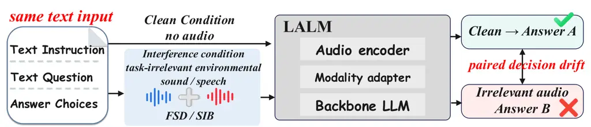
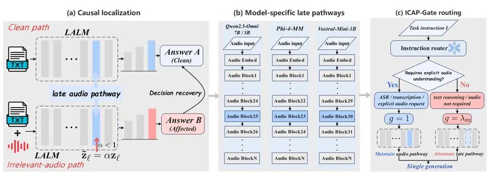
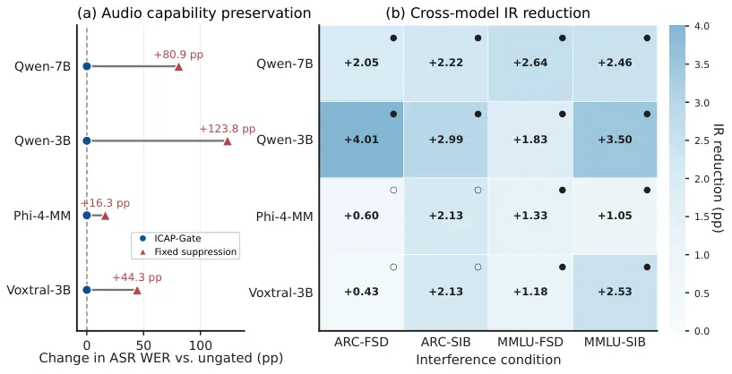

# Selective Listening: Mechanism-Guided Control of Audio Influence in Large Audio-Language Models

Yulin Sun Affiliation: College of Computer Science and Technology,
National University of Defense Technology Affiliation: State Key
Laboratory of Complex & Critical Software Environment    Kele Xu
^(†)^(†)thanks: Corresponding author. Affiliation: College of Computer
Science and Technology, National University of Defense Technology
Affiliation: State Key Laboratory of Complex & Critical Software
Environment    Yong Dou Affiliation: College of Computer Science and
Technology, National University of Defense Technology Affiliation: State
Key Laboratory of Complex & Critical Software Environment

###### Abstract

Large audio-language models (LALMs) exploit multimodal evidence, yet
task-irrelevant audio can alter text-reasoning decisions when listening
is unnecessary. Aggregate Accuracy can hide this paired drift because
audio-induced repairs and damages may cancel. Paired drift analysis and
targeted interventions identify architecture-specific,
intervention-sensitive late audio pathways as actionable control points.
We introduce ICAP-Gate, which applies mechanism-guided, task-conditioned
control to each model’s pathway. Across four LALMs, two reasoning
benchmarks, and environmental-sound and natural-speech interference,
ICAP-Gate has lower point estimates for Influence Rate and Answer Flip
than ungated inference in all 16 full-split model–condition evaluations.
Fixed suppression degrades automatic speech recognition (ASR) across all
four models, whereas ICAP-Gate matches ungated ASR performance by
preserving the pathway for explicit audio-demand instructions. ICAP-Gate
has lower paired-drift point estimates than mitigation prompting in all
four evaluated settings and provides competitive stabilization relative
to eight-sample Self-Consistency while using one generation per query;
in controlled ARC measurements, Self-Consistency incurs
$`7.0`$–$`9.2\times`$ ungated latency. These results establish
_selective modality influence control_ as a design principle for robust
multimodal reasoning.

|     |
| --- |
|     |

## 1 Introduction

Large audio-language models (LALMs) combine listening with language
reasoning, but modality availability does not imply task relevance. In
text-reasoning settings, environmental sounds or speech may provide no
evidence for the answer yet change the model’s decision. Robust
multimodal inference therefore requires control over when audio
influences computation. Figure 1 illustrates this paired decision drift.

Recent work shows that irrelevant audio can degrade text reasoning and
increase output volatility in LALMs (Li et al., 2026a). Aggregate task
scores can conceal that instability when repairs and damages cancel. We
therefore measure _paired decision drift_: whether the same text
question reaches a different decision with task-irrelevant audio.

Behavioral drift does not reveal where irrelevant audio acquires
consequential influence inside the model or identify a control point
that can be modulated according to task demand. Because the audio
pathway must remain available for explicit audio-demand instructions and
the evaluated audio-relevant tasks, the mechanistic question is: _where
does irrelevant audio become actionable in reasoning, and can its
influence be selectively controlled while preserving useful audio
processing?_

We trace unwanted modality influence from behavior through mechanism to
control. Paired clean/interference evaluation and targeted internal
interventions identify intervention-sensitive late audio pathways
through which irrelevant audio affects downstream decisions.
Qwen2.5-Omni provides the highest-resolution causal localization, while
actionable late-path control points recur in Phi-4-MM and
Voxtral-Mini-3B. This pattern motivates _selective modality influence
control_, instantiated by ICAP-Gate: it modulates each model’s pathway
according to task demand with one generation per query, stabilizing
reasoning across architectures and interference types while preserving
performance on the evaluated ASR task. Figure 2 summarizes this
mechanism-guided control.

Our contributions are threefold:

- •
  Paired drift exposes the hidden failure mode. Paired decision analysis
  reveals reasoning drift hidden by aggregate Accuracy, while targeted
  interventions causally localize an intervention-sensitive late audio
  pathway in Qwen2.5-Omni.
- •
  Late audio pathways provide actionable control points. We formulate
  _selective modality influence control_ and instantiate it with
  ICAP-Gate, which conditions architecture-adapted pathway modulation on
  task demand so that audio influence is attenuated when unnecessary and
  preserved for explicit audio-demand instructions. Corresponding
  actionable sites recur across heterogeneous audio architectures.
- •
  Task-conditioned control stabilizes reasoning while preserving
  evaluated ASR. Across four LALMs, two reasoning benchmarks, and both
  environmental and controlled natural-speech interference, ICAP-Gate
  has lower Influence Rate and Answer Flip point estimates than ungated
  inference in all 16 full-split evaluations while matching ungated WER
  on the evaluated ASR task.



Figure 1: Paired decision drift under task-irrelevant audio. The same
text input is evaluated with and without task-irrelevant environmental
sound or speech; the downstream decision may change.

## 2 Related Work

### 2.1 Large Audio-Language Models and Multimodal Reasoning

Audio-language models extend language reasoning to audio understanding
and spoken interaction. Early systems linked pretrained language models
to audio and speech representations, while later systems broadened audio
instruction tuning, long-context reasoning, and end-to-end speech
interaction (Deshmukh et al., 2023; Gong et al., 2024; Zhang et al.,
2023; Rubenstein et al., 2023; Tang et al., 2024; Ghosh et al., 2025;
Défossez et al., 2024; Huang et al., 2025; Li et al., 2025).

Recent systems expose distinct audio–language interfaces, including
Qwen2.5-Omni, Phi-4-Multimodal, and Voxtral (Xu et al., 2025; Abouelenin
et al., 2025; Liu et al., 2025; Chu et al., 2023; Chu et al., 2024).
This architectural diversity sharpens the control question: how should
an LALM regulate audio influence when listening is unnecessary?

### 2.2 Robustness to Irrelevant or Distracting Modalities

Irrelevant textual, retrieved, visual, and multimodal contexts can
disrupt reasoning across language and multimodal models (Shi et al.,
2023; Yoran et al., 2024; Yang et al., 2025; Sharma et al., 2024; Yang
et al., 2026; Cai et al., 2025; Liu et al., 2024; Tian et al., 2026).
Multimodal capability alone therefore does not ensure selective use of
available inputs.

For audio-language models, Li et al. (2026a) showed that task-irrelevant
silence, synthetic noise, and environmental sounds perturb text
reasoning across multiple LALMs, and evaluated prompting and
Self-Consistency as inference-time mitigations. We identify where
irrelevant audio becomes consequential and control that pathway
according to task demand.

### 2.3 Mechanistic Intervention and Conditional Modality Control

Mechanistic interventions—including causal mediation and tracing,
activation patching, circuit discovery, and representation
patching—localize behaviorally consequential computation (Vig et al.,
2020; Meng et al., 2022; Conmy et al., 2023; Zhang and Nanda, 2024;
Ghandeharioun et al., 2024). Multimodal studies apply related
interventions to vision–language representations and information flow
(Palit et al., 2023; Li et al., 2026b; Kim et al., 2026), establishing
internal pathways as actionable objects for explanation and control.

Conditional computation regulates information flow through gating,
feature-wise conditioning, cross-attention, and expert routing (Arevalo
et al., 2017; Perez et al., 2018; Alayrac et al., 2022; Shazeer et al.,
2017; Fedus et al., 2022); multimodal routing extends this principle
across modalities (Wu et al., 2024; Lin et al., 2026). We connect
intervention-based pathway localization with task-conditioned control:
ICAP-Gate modulates the architecture-specific pathway through which
irrelevant audio affects reasoning, realizing _selective modality
influence control_.



Figure 2: Mechanism-guided selective control of irrelevant-audio
influence in LALMs. (a) Pathway scaling identifies a late audio pathway
through which irrelevant audio changes Qwen2.5-Omni decisions. (b) The
actionable control site is architecture-adapted across Qwen2.5-Omni,
Phi-4-MM, and Voxtral-Mini-3B. (c) Instruction-conditioned routing keeps
the pathway open for explicit audio-demand requests ($`g=1`$) and
attenuates it otherwise ($`g=\lambda_{m}`$), followed by one generation.

## 3 Methodology

### 3.1 Problem Formulation and Reasoning Drift

We study _unwanted modality influence_ in large audio-language models:
audio should affect a prediction when it provides task-relevant
evidence, but its presence alone should not alter a decision when the
task can be solved from text. Let
$`\mathcal{D}=\{(x_{i},y_{i})\}_{i=1}^{N}`$ denote a text-reasoning
dataset, where $`x_{i}`$ is the reasoning input and $`y_{i}`$ is the
gold answer. Each example is evaluated under three aligned conditions:
clean text-only inference, ungated inference with task-irrelevant audio
$`a_{i}`$, and pathway-controlled inference. For the interference
conditions considered, $`y_{i}`$ is determined by $`x_{i}`$, while
$`a_{i}`$ provides no answer-bearing information. We instantiate
$`a_{i}`$ with structured environmental audio (FSD) and natural speech
(SIB), covering non-linguistic and linguistically structured
interference.

For a model $`f_{\theta}`$ and answer extractor $`E`$, the corresponding
predictions are

```math
\hat{y}^{\,c}_{i}=E\!\left(f_{\theta}(x_{i})\right),\qquad\hat{y}^{\,u}_{i}=E\!\left(f_{\theta}(x_{i},a_{i})\right),\qquad\hat{y}^{\,g}_{i}=E\!\left(f_{\theta,G}(x_{i},a_{i})\right), \tag{1}
```

where $`c`$, $`u`$, and $`g`$ denote clean, ungated, and
pathway-controlled inference, respectively, and $`G`$ denotes the
pathway-control intervention. Clean inference provides the paired
reference for isolating audio-induced change, while correctness is
tracked independently against the gold answer. We operationalize
_reasoning drift_ as a sample-level change in either correctness state
or extracted answer identity relative to this clean reference.

For $`k\in\{c,u,g\}`$, define correctness and accuracy as

```math
s_{i}^{k}=\mathbf{1}\!\left[\hat{y}^{\,k}_{i}=y_{i}\right],\qquad\mathrm{Acc}(k)=\frac{1}{N}\sum_{i=1}^{N}s_{i}^{k}. \tag{2}
```

We measure paired drift using Influence Rate (IR) for correctness-state
changes and Answer Flip for any answer change, including switches
between incorrect answers:

```math
\mathrm{IR}(k)=\frac{1}{N}\sum_{i=1}^{N}\mathbf{1}\!\left[s_{i}^{k}\neq s_{i}^{c}\right],\qquad\mathrm{Flip}(k)=\frac{1}{N}\sum_{i=1}^{N}\mathbf{1}\!\left[\hat{y}^{\,k}_{i}\neq\hat{y}^{\,c}_{i}\right]. \tag{3}
```

The distinction from aggregate accuracy is exact. Let
$`n_{\mathrm{cw}}^{(k)}`$ and $`n_{\mathrm{wc}}^{(k)}`$ denote
clean-correct$`\rightarrow`$wrong and clean-wrong$`\rightarrow`$correct
transitions under condition $`k`$. Then

```math
\mathrm{IR}(k)=\frac{n_{\mathrm{cw}}^{(k)}+n_{\mathrm{wc}}^{(k)}}{N},\qquad\mathrm{Acc}(k)-\mathrm{Acc}(c)=\frac{n_{\mathrm{wc}}^{(k)}-n_{\mathrm{cw}}^{(k)}}{N}. \tag{4}
```

Accuracy can therefore remain nearly unchanged even when many individual
predictions move, because opposing transitions cancel in aggregate. We
consequently report accuracy together with paired drift rather than
treating aggregate score as a complete measure of robustness.

Finally, we resolve the _direction_ of a pathway intervention with two
paired transition measures:

```math
\displaystyle\mathrm{NetC2W}\quad \displaystyle=\sum_{i=1}^{N}\mathbf{1}[s_{i}^{c}=1,s_{i}^{u}=0,s_{i}^{g}=1]-\sum_{i=1}^{N}\mathbf{1}[s_{i}^{c}=1,s_{i}^{u}=1,s_{i}^{g}=0], \tag{5}
```

```math
\displaystyle\mathrm{NetAnswer}\quad \displaystyle=\sum_{i=1}^{N}\mathbf{1}[\hat{y}^{\,c}_{i}\neq\hat{y}^{\,u}_{i},\,\hat{y}^{\,c}_{i}=\hat{y}^{\,g}_{i}]-\sum_{i=1}^{N}\mathbf{1}[\hat{y}^{\,c}_{i}=\hat{y}^{\,u}_{i},\,\hat{y}^{\,c}_{i}\neq\hat{y}^{\,g}_{i}]. \tag{6}
```

$`\mathrm{NetC2W}`$ measures net recovery of clean-correct cases, while
$`\mathrm{NetAnswer}`$ measures net restoration of the clean decision.
Together with IR and Answer Flip, these paired quantities expose whether
pathway control reverses the specific prediction changes introduced by
irrelevant audio.

### 3.2 Late Audio Pathways Provide Actionable Control Points

The paired drift measures establish _when_ irrelevant audio changes a
reasoning decision; we next ask _where_ that influence becomes
actionable. Paired traces and teacher-forced answer analysis identify
where executions separate, while targeted interventions test whether the
pathway controls the resulting transitions. Figure 2(a) summarizes this
localization, which is defined by its effect on paired reasoning
transitions rather than activation magnitude alone.

For an audio-pathway module at depth $`\ell`$ with output
$`\mathbf{z}_{\ell}`$, we intervene using

```math
\widetilde{\mathbf{z}}_{\ell}=\alpha\mathbf{z}_{\ell},\qquad 0\leq\alpha\leq 1, \tag{7}
```

where $`\alpha=0`$ corresponds to ablation and $`0<\alpha<1`$ to soft
attenuation. We quantify intervention sensitivity with Influence Rate,
Answer Flip, Net C2W, Net Answer, and the gold-answer margin,
identifying pathway sites whose modulation changes downstream reasoning.

In Qwen2.5-Omni, complementary diagnostics and interventions identify a
late audio pathway as an actionable control point. Intervening at this
pathway reverses audio-induced answer changes and restores clean
decisions, showing that it controls paired reasoning transitions.
Figure 3 shows that clean-correct-to-wrong and clean-stable cases have
similar audio-activation RMS at representative late sites, while their
clean gold-answer margins differ sharply. Together with the targeted
interventions, this contrast points to decision-relevant influence
through the late audio pathway rather than a simple increase in
activation magnitude.

The same intervention logic recurs across heterogeneous LALM
architectures. Phi-4-MM and Voxtral-Mini-3B expose model-specific late
audio pathways with the same actionable control role, as summarized in
Figure 2(b). The module and attenuation scale are architecture-specific,
while the higher-level pattern is consistent: unwanted audio influence
remains controllable through late audio processing. Detailed Qwen
localization evidence is provided in Appendix C.

This localization turns mitigation into internal control of audio
_influence_, rather than removal of the audio input.

Figure 3: Activation magnitude and decision margin (Qwen2.5-Omni, FSD).
(a) Activation RMS at two late audio sites for clean-correct-to-wrong
(C2W) and clean-stable controls; labels show C2W/control ratios. (b)
Shared clean gold-answer logit margins for groups. Filled blue/hollow
gray markers denote C2W/control aggregates.

### 3.3 ICAP-Gate Conditions Pathway Influence by Task Demand

The localization shows that the audio pathway can carry unwanted
influence when audio is irrelevant yet remains important for explicit
audio-demand instructions and the evaluated ASR task. We therefore use
_selective modality influence control_: Figure 2(c) instantiates this
principle as ICAP-Gate (Instruction-Conditioned Audio Pathway Gating),
which modulates the intervention-sensitive pathway identified for each
architecture.

For model $`m`$, let $`\ell_{m}`$ denote the selected audio pathway and
$`\lambda_{m}\in[0,1)`$ its calibrated attenuation scale. Given task
instruction $`I`$, we define an explicit audio-demand indicator
$`r(I)\in\{0,1\}`$ and apply

```math
g_{m}(I)=\begin{cases}1,&r(I)=1,\\
\lambda_{m},&r(I)=0,\end{cases}\qquad\widetilde{\mathbf{z}}_{\ell_{m}}=g_{m}(I)\mathbf{z}_{\ell_{m}}. \tag{8}
```

When the instruction explicitly asks for audio understanding, ICAP-Gate
leaves the pathway unchanged; otherwise, it applies the model-specific
attenuation. The rule is therefore architecture-adapted rather than tied
to a particular layer index.

ICAP-Gate routes on the _task instruction_, whose explicit audio-demand
cue determines $`r(I)`$, rather than on incidental words in the question
body. The cue inventory and routing audit are provided in Appendix F;
instruction-scoped routing keeps the decision transparent and auditable.

We obtain $`(\ell_{m},\lambda_{m})`$ offline from the intervention
analysis and report the selected pathway and full-split confirmation
scope in Table 4. Online inference requires one instruction routing
decision and one temporary pathway modulation, preserving
single-generation inference without a clean-reference pass or auxiliary
relevance model. The complete procedure is given in Appendix A.8,
Algorithm 1.

## 4 Experiments

### 4.1 Experimental Setup

#### Models and reasoning tasks.

We evaluate four LALMs—Qwen2.5-Omni-7B, Qwen2.5-Omni-3B, Phi-4-MM, and
Voxtral-Mini-3B—on the full ARC-Challenge and MMLU test sets. Each
benchmark is paired with FSD and SIB, yielding four full-split settings
per model. Table 4 reports the architecture-specific intervention
configurations; the control rule is shared across models.

#### Irrelevant-audio conditions.

FSD pairs each reasoning example with a real-world environmental clip
drawn from FSD50K (Fonseca et al., 2022). SIB complements this
non-linguistic interference with independently paired natural speech
from LibriSpeech dev-clean (Panayotov et al., 2015), while the gold
answer remains determined by the text. This tests whether unwanted
modality influence persists when the irrelevant stream carries coherent
linguistic content; construction and transcript validity are detailed in
Section 4.5 and Appendix H.

#### Inference and evaluation protocol.

For every model and example, clean, ungated-audio, and ICAP-Gate
predictions use the same text input, paired interference audio, and
model-specific decoding configuration. Detailed response handling and
source-level alignment are provided in Appendix A.

#### Statistics and audio-relevant evaluation.

We report Accuracy, Influence Rate, Answer Flip, NetC2W, and NetAnswer
as defined in Section 3.1; statistical checks and implementation details
are provided in Appendices A and A.9. Selective preservation is
evaluated with ungated, fixed-attenuation, and ICAP-Gate inference on
400 LibriSpeech dev-clean ASR utterances per model using word error rate
(WER).

### 4.2 ICAP-Gate Lowers Paired-Drift Point Estimates Across Four LALMs

ICAP-Gate has lower point estimates of both paired drift measures than
ungated inference in all 16 full-split model–condition evaluations.
Table 1 reports the complete matrix, while Figure 5(b) summarizes the
corresponding IR reductions as a cross-model heatmap. The exact
intervention pathway is architecture-specific, yet selective control of
that pathway repeatedly makes text reasoning less sensitive to an audio
stream that is unnecessary for solving the task.

|                 |                   |                           |                          |                           |                            |         |         |
| --------------- | ----------------- | ------------------------- | ------------------------ | ------------------------- | -------------------------- | ------- | ------- |
| Setting         | Acc. C/U/I        | IR U$`\rightarrow`$I      | $`\Delta`$IR$`\uparrow`$ | Flip U$`\rightarrow`$I    | $`\Delta`$Flip$`\uparrow`$ | Net C2W | Net Ans |
| Qwen2.5-Omni-7B |                   |                           |                          |                           |                            |         |         |
| ARC-FSD         | 84.56/83.53/84.90 | 8.19$`\rightarrow`$6.14   | 2.05^(∗)                 | 9.04$`\rightarrow`$7.00   | 2.04^(∗)                   | +20     | +24     |
| ARC-SIB         | 84.56/82.85/85.07 | 9.39$`\rightarrow`$7.17   | 2.22^(∗)                 | 11.09$`\rightarrow`$8.28  | 2.81^(∗)                   | +26     | +33     |
| MMLU-FSD        | 67.42/67.58/67.55 | 11.80$`\rightarrow`$9.16  | 2.64^(∗)                 | 16.06$`\rightarrow`$12.60 | 3.46^(∗)                   | +183    | +486    |
| MMLU-SIB        | 67.42/66.00/67.68 | 13.65$`\rightarrow`$11.19 | 2.46^(∗)                 | 18.89$`\rightarrow`$15.58 | 3.31^(∗)                   | +291    | +465    |
| Qwen2.5-Omni-3B |                   |                           |                          |                           |                            |         |         |
| ARC-FSD         | 77.39/77.56/77.13 | 11.77$`\rightarrow`$7.76  | 4.01^(∗)                 | 13.82$`\rightarrow`$9.73  | 4.09^(∗)                   | +21     | +48     |
| ARC-SIB         | 77.39/76.54/76.62 | 13.82$`\rightarrow`$10.84 | 2.98^(∗)                 | 16.13$`\rightarrow`$12.63 | 3.50^(∗)                   | +18     | +41     |
| MMLU-FSD        | 60.36/59.76/60.25 | 15.24$`\rightarrow`$13.41 | 1.83^(∗)                 | 21.61$`\rightarrow`$19.40 | 2.21^(∗)                   | +163    | +310    |
| MMLU-SIB        | 60.36/58.97/59.78 | 17.79$`\rightarrow`$14.29 | 3.50^(∗)                 | 25.17$`\rightarrow`$20.65 | 4.52^(∗)                   | +303    | +635    |
| Phi-4-MM (5.6B) |                   |                           |                          |                           |                            |         |         |
| ARC-FSD         | 81.66/75.51/75.77 | 22.53$`\rightarrow`$21.93 | 0.60                     | 25.00$`\rightarrow`$24.66 | 0.34                       | +5      | +4      |
| ARC-SIB         | 81.66/73.21/75.51 | 23.46$`\rightarrow`$21.33 | 2.13                     | 26.54$`\rightarrow`$24.66 | 1.88                       | +26     | +22     |
| MMLU-FSD        | 63.99/57.28/58.98 | 29.38$`\rightarrow`$28.04 | 1.34^(∗)                 | 39.56$`\rightarrow`$38.04 | 1.52^(∗)                   | +213    | +214    |
| MMLU-SIB        | 63.99/57.25/57.51 | 30.00$`\rightarrow`$28.96 | 1.04^(∗)                 | 40.51$`\rightarrow`$38.73 | 1.78^(∗)                   | +92     | +249    |
| Voxtral-Mini-3B |                   |                           |                          |                           |                            |         |         |
| ARC-FSD         | 75.77/73.38/71.76 | 21.33$`\rightarrow`$20.90 | 0.43                     | 26.02$`\rightarrow`$25.85 | 0.17                       | -7      | +2      |
| ARC-SIB         | 75.77/69.88/73.38 | 25.17$`\rightarrow`$23.04 | 2.13                     | 30.20$`\rightarrow`$27.22 | 2.98^(∗)                   | +33     | +35     |
| MMLU-FSD        | 57.79/58.00/58.21 | 27.44$`\rightarrow`$26.26 | 1.18^(∗)                 | 37.53$`\rightarrow`$36.00 | 1.53^(∗)                   | +98     | +215    |
| MMLU-SIB        | 57.79/56.62/58.76 | 28.41$`\rightarrow`$25.88 | 2.53^(∗)                 | 39.52$`\rightarrow`$36.28 | 3.24^(∗)                   | +328    | +454    |

Table 1: Main results across four LALMs. Accuracy is reported as
clean/ungated/ICAP (C/U/I); IR and Flip show ungated$`\rightarrow`$ICAP.
$`\Delta`$IR and $`\Delta`$Flip denote absolute reductions in percentage
points. Net C2W and Net Ans report directional recovery toward the clean
decision. Asterisks mark paired 95% CIs that exclude zero.

| Dataset | Method           | Gen./q. | Mean (s) | Median (s) | Rel.  | VRAM (GiB) | Tok./q. |
| ------- | ---------------- | ------- | -------- | ---------- | ----- | ---------- | ------- |
| ARC-FSD | Ungated          | 1       | 6.8881   | 6.4671     | 1.000 | 17.03      | 85.8    |
|         | Prompting        | 1       | 6.6079   | 5.8928     | 0.959 | 17.04      | 81.2    |
|         | ICAP-Gate        | 1       | 7.2840   | 6.6174     | 1.057 | 17.03      | 94.3    |
|         | Self-Consistency | 8       | 63.4709  | 57.7551    | 9.215 | 17.03      | 819.4   |
| ARC-SIB | Ungated          | 1       | 8.8734   | 8.0748     | 1.000 | 16.85      | 88.8    |
|         | Prompting        | 1       | 7.9270   | 7.1944     | 0.893 | 16.85      | 81.6    |
|         | ICAP-Gate        | 1       | 7.9317   | 7.4159     | 0.894 | 16.85      | 90.2    |
|         | Self-Consistency | 8       | 62.3897  | 53.6749    | 7.031 | 16.85      | 817.8   |

Table 2: Measured test-time cost. Statistics aggregate 200 measured
queries and three sequential repeats after 20 warm-up queries on one
NVIDIA A800 80GB GPU (bfloat16; model loading excluded). VRAM is peak
allocated memory. Green marks ICAP-Gate; red marks Self-Consistency.

Paired metrics reveal the effect beyond aggregate Accuracy. On
Qwen2.5-Omni-7B MMLU-FSD, Accuracy remains essentially unchanged
(67.58%$`\rightarrow`$67.55%), while IR drops from 11.80% to 9.16% and
Answer Flip from 16.06% to 12.60%. Across the four LALMs, the point
estimates for IR and Answer Flip are lower than under ungated inference
in all 16 settings. The natural-speech conditions show the same
point-estimate direction across architectures, extending the
stabilization result beyond environmental sounds.

### 4.3 ICAP-Gate Provides Competitive Stability Within the Single-Generation Regime

Figure 4: Matched drift relative to ICAP-Gate. Circles and diamonds
denote Prompting and Self-Consistency, respectively. Values are
comparator minus ICAP-Gate in percentage points: positive values
indicate lower drift under ICAP-Gate, whereas negative values indicate
lower drift under the comparator. Error bars are paired 95% confidence
intervals, with filled markers denoting intervals excluding zero.

We compare mechanism-guided pathway control with two inference-time
strategies from prior irrelevant-audio studies (Li et al., 2026a):
input-level prompting and eight-sample Self-Consistency decoding.
Prompting operates at the input level, Self-Consistency aggregates
outputs, and ICAP-Gate scales the late audio pathway identified by the
mechanistic analysis. Prompting and ICAP-Gate use one generation per
query, whereas Self-Consistency aggregates eight responses.

All pairwise comparisons use the same Qwen2.5-Omni-7B checkpoint and
aligned source examples within each comparison. Because mitigation
strategies can change clean predictions, Influence Rate and Answer Flip
are computed relative to each method’s own clean reference.
Matched-split sizes and protocol details are provided in Appendix B.4.

| Setting  | Prompt–ICAP (1 vs. 1 gen.) |                     | SCS–ICAP (8 vs. 1 gen.) |                    |
| -------- | -------------------------- | ------------------- | ----------------------- | ------------------ |
|          | $`\Delta`$IR               | $`\Delta`$Flip      | $`\Delta`$IR            | $`\Delta`$Flip     |
| ARC-FSD  | $`+1.54`$                  | $`+1.62`$           | $`-1.62`$               | $`-1.79`$          |
| ARC-SIB  | $`\mathbf{+3.16}`$         | $`\mathbf{+3.84}`$  | $`\mathbf{-2.99}`$      | $`\mathbf{-2.90}`$ |
| MMLU-FSD | $`\mathbf{+3.66}`$         | $`\mathbf{+4.72}`$  | $`-1.80`$               | $`-1.10`$          |
| MMLU-SIB | $`\mathbf{+8.87}`$         | $`\mathbf{+11.76}`$ | $`-0.10`$               | $`-1.20`$          |

Table 3: Matched drift relative to ICAP-Gate (percentage points). Values
are comparator minus ICAP-Gate: positive values favor ICAP-Gate, whereas
negative values favor the comparator. Bold entries denote paired
differences whose 95% confidence intervals exclude zero (20,000 paired
bootstrap resamples; seed 0), irrespective of which method is favored.

The mitigation prompt had higher IR and Answer Flip point estimates than
ICAP-Gate in all four evaluated settings; on MMLU-SIB, the differences
were $`+8.87`$ and $`+11.76`$ percentage points, with paired intervals
excluding zero. Input-level guidance therefore does not directly control
the identified pathway or reproduce the paired stability obtained
through pathway control (Table 3; Figure 4).

Self-Consistency had lower IR and Answer Flip point estimates than
ICAP-Gate in all four matched comparisons, with its clearest paired
advantage on ARC-SIB (Table 3; Appendix B.4). It used eight generations
per query. ICAP-Gate therefore provides competitive decision stability
within the single-generation regime.

We further quantified the test-time cost of each inference path under a
fixed single-GPU protocol. ICAP-Gate uses one generation per query and
requires $`0.894`$–$`1.057\times`$ the Ungated latency across ARC-FSD
and ARC-SIB. Self-Consistency uses eight generations and requires
$`7.031`$–$`9.215\times`$ the Ungated latency. Detailed timing, token,
and VRAM statistics are reported in Table 2.

Together, the comparisons place ICAP-Gate’s advantage in
mechanism-guided stability at single-generation cost: it directly
controls the identified pathway, whereas prompting acts at the input and
Self-Consistency uses repeated decoding. This reduces unwanted modality
influence while preserving audio processing for explicit audio-demand
instructions and the evaluated ASR task.

[TABLE]

Table 4: Architecture-adapted ICAP-Gate configurations. The table
reports each selected pathway $`(\ell_{m})`$, normalized depth,
attenuation scale $`(\lambda_{m})`$, and full-split confirmation scope.

### 4.4 Pathway Control Preserves Evaluated ASR Capability

Selective control preserves the pathway for explicit audio-demand
instructions while attenuating it for text-only instructions;
Figure 5(a) and Table 6 test these two requirements.

Fixed pathway suppression increases WER across all four architectures,
whereas ICAP-Gate matches ungated WER on the evaluated ASR task for
every model (Figure 5(a); Table 6(a)). This demonstrates the conditional
utility of the localized late audio pathway: attenuating its influence
is beneficial when audio is irrelevant, while preserving it supports the
evaluated ASR task.

Table 6(b) verifies the evaluated routing scope: instruction-scoped
routing preserves explicit audio requests and avoids false positives on
question-content hard negatives, unlike full-query matching. Routing on
the task instruction therefore aligns pathway control with modality
demand rather than incidental lexical content; the complete audit and
ASR diagnostics are provided in Appendices F and G.

### 4.5 Transcript Audit Supports Task-Irrelevant Speech Construction

SIB tests irrelevant audio with coherent linguistic structure. All
MMLU-SIB transcripts were screened for IDF overlap; none of the 28
manually reviewed candidates was potentially relevant or answer-bearing,
supporting the task-irrelevant construction of this condition (Table 5).
Full construction and audit details are reported in Appendix H.

| Audit item                               | Result        |
| ---------------------------------------- | ------------- |
| MMLU-SIB pairs                           | 14,042        |
| Unique source utterances                 | 2,694         |
| Speaker/chapter coverage                 | 40/97         |
| Mean/max utterance reuse                 | 5.212/14      |
| Transcripts recovered                    | 14,042/14,042 |
| IDF-overlap candidates                   | 28 (0.20%)    |
| Potentially relevant screened candidates | 0/28          |
| Answer-bearing speech                    | 0/28          |

Table 5: MMLU-SIB construction and transcript audit. All 14,042
transcripts were recovered; 28 IDF-overlap candidates were manually
reviewed, and none was potentially relevant or answer-bearing. Details
are in Appendix H.

## 5 Analysis and Implications

### 5.1 From Robustness to Selective Modality Influence

Paired Influence Rate, Answer Flip, and transition measures show why
aggregate Accuracy is insufficient: irrelevant audio can change
individual decisions while leaving the net score nearly unchanged. In
these evaluations, reasoning stability is therefore characterized
through _modality influence_ alongside final task score. The late
pathway is conditionally useful: attenuating it reduces drift when audio
is irrelevant, whereas preserving it maintains evaluated ASR capability.
ICAP-Gate treats modality influence as a task-conditioned control
property, yielding the principle that modality availability should not
imply modality influence.

### 5.2 Cross-Model Evidence Supports a Shared Computational Role

Figure 5(b) and Table 4 show that the cross-model evidence supports a
shared computational role rather than a shared layer identity.
Qwen2.5-Omni, Phi-4-MM, and Voxtral-Mini-3B use distinct audio stacks,
yet actionable sites recur in each model’s late audio pathway. With
model-specific pathway and attenuation parameters, the point estimates
for Influence Rate and Answer Flip are lower than under ungated
inference in all 16 full-split model–condition evaluations, supporting a
shared task-conditioned rule with architecture-specific realizations.
The corresponding model-specific analyses are summarized in Appendices D
and E. Within the evaluated environmental-sound and natural-speech
conditions, modality demand is specified at the instruction level and
the shared rule uses architecture-adapted pathway and attenuation
parameters.



Figure 5: Selective control preserves evaluated ASR while reducing
reasoning drift across architectures. (a) Change in ASR WER relative to
ungated inference on 400 LibriSpeech dev-clean utterances per model.
Blue circles denote ICAP-Gate, red triangles fixed suppression, and the
dashed line the ungated reference. (b) Full-split IR reduction (ungated
minus ICAP-Gate); positive values indicate lower drift under ICAP-Gate.
In Panel (b), filled and hollow circles indicate whether the paired 95%
confidence interval excludes or overlaps zero, respectively. Phi-4-MM
uses the canonical $`s=0.10`$ condition.

(a) Audio-relevant preservation

| Model           | Ungated | Fixed  | ICAP  | Recovery$`\uparrow`$ |
| --------------- | ------- | ------ | ----- | -------------------- |
| Qwen2.5-Omni-7B | 17.74   | 98.60  | 17.74 | 80.86                |
| Qwen2.5-Omni-3B | 60.82   | 184.58 | 60.82 | 123.76               |
| Phi-4-MM (5.6B) | 2.45    | 18.73  | 2.45  | 16.28                |
| Voxtral-Mini-3B | 16.72   | 61.05  | 16.72 | 44.33                |

(b) Instruction-scoped routing

| Category                        | Target | Instr.  | Full query |
| ------------------------------- | ------ | ------- | ---------- |
| Explicit audio req.             | High   | 40/40   | 40/40      |
| Ordinary text instr.            | Low    | 40/40   | 40/40      |
| Question-content hard negatives | Low    | 0/40 FP | 40/40 FP   |

Table 6: Selectivity of ICAP-Gate. (a) ASR WER (%, $`\downarrow`$) and
recovery from fixed attenuation. (b) Instruction-scoped routing on
selected categories from the $`n=240`$ hard-case audit; FP denotes false
positives.

## 6 Conclusion

We identify intervention-sensitive late audio pathways as a source of
irrelevant-audio drift in large audio-language models. ICAP-Gate
conditionally modulates each model’s pathway according to task demand,
reducing paired reasoning drift while matching ungated performance on
the evaluated ASR task. Across four heterogeneous LALMs, two reasoning
benchmarks, and environmental-sound and natural-speech interference, its
point estimates for Influence Rate and Answer Flip are lower than under
ungated inference in all 16 full-split model–condition evaluations. It
has lower paired-drift point estimates than mitigation prompting across
the four evaluated settings and provides competitive stability relative
to eight-sample Self-Consistency while using one generation per query.
These findings establish _selective modality influence control_ as a
mechanism-guided principle for robust multimodal reasoning.

### AI use statement

In this work, generative AI tools were used only to improve the grammar,
clarity, and readability of the manuscript. They were not used to
generate data, formulate mathematical claims, design or implement the
method, design or analyze experiments, process datasets, or interpret
experimental results. All AI-assisted language edits were reviewed and
revised by the authors. The authors take full responsibility for the
final text, claims, analyses, code, figures, and other artifacts in this
work.

### Reproducibility statement

The main paper specifies the paired evaluation protocol, reasoning-drift
metrics, intervention rule, ICAP-Gate formulation, model-specific
pathways, and full-split experimental settings. The appendices provide
the online inference procedure, decoding and response settings, dataset
construction and transcript audits, statistical checks, mechanistic
localization analyses, matched mitigation comparisons, routing audits,
and ASR safety evaluations. We welcome independent reproduction and
follow-up work.

## References

- Abouelenin et al. (2025) A. Abouelenin, A. Ashfaq, A. Atkinson, H.
  Awadalla, N. Bach, J. Bao, A. Benhaim, M. Cai, V. Chaudhary, C. Chen,
  et al. Phi-4-mini technical report: compact yet powerful multimodal
  language models via mixture-of-loras. arXiv preprint arXiv:2503.01743.
  Cited by: §2.1.
- Alayrac et al. (2022) J. Alayrac, J. Donahue, P. Luc, A. Miech, I.
  Barr, Y. Hasson, K. Lenc, A. Mensch, K. Millican, M. Reynolds, et al.
  Flamingo: a visual language model for few-shot learning. Advances in
  neural information processing systems 35, pp. 23716–23736. Cited by:
  §2.3.
- Arevalo et al. (2017) J. Arevalo, T. Solorio, M. Montes-y-Gómez,
  and F. A. González Gated multimodal units for information fusion. In
  International Conference on Learning Representations, Cited by: §2.3.
- Cai et al. (2025) R. Cai, B. Li, X. Wen, M. Chen, and Z. Zhao
  Diagnosing and mitigating modality interference in multimodal large
  language models. arXiv preprint arXiv:2505.19616. Cited by: §2.2.
- Chu et al. (2024) Y. Chu, J. Xu, Q. Yang, H. Wei, X. Wei, Z. Guo, Y.
  Leng, Y. Lv, J. He, J. Lin, et al. Qwen2-Audio technical report. arXiv
  preprint arXiv:2407.10759. Cited by: §2.1.
- Chu et al. (2023) Y. Chu, J. Xu, X. Zhou, Q. Yang, S. Zhang, Z.
  Yan, C. Zhou, and J. Zhou Qwen-Audio: advancing universal audio
  understanding via unified large-scale audio-language models. arXiv
  preprint arXiv:2311.07919. Cited by: §2.1.
- Conmy et al. (2023) A. Conmy, A. Mavor-Parker, A. Lynch, S.
  Heimersheim, and A. Garriga-Alonso Towards automated circuit discovery
  for mechanistic interpretability. Advances in Neural Information
  Processing Systems 36, pp. 16318–16352. Cited by: §2.3.
- Défossez et al. (2024) A. Défossez, L. Mazaré, M. Orsini, A. Royer, P.
  Pérez, H. Jégou, E. Grave, and N. Zeghidour Moshi: a speech-text
  foundation model for real-time dialogue. arXiv preprint
  arXiv:2410.00037. Cited by: §2.1.
- Deshmukh et al. (2023) S. Deshmukh, B. Elizalde, R. Singh, and H. Wang
  Pengi: an audio language model for audio tasks. In Advances in Neural
  Information Processing Systems, Vol. 36, pp. 18090–18108. Cited by:
  §2.1.
- Fedus et al. (2022) W. Fedus, B. Zoph, and N. Shazeer Switch
  transformers: scaling to trillion parameter models with simple and
  efficient sparsity. Journal of Machine Learning Research 23 (120),
  pp. 1–39. Cited by: §2.3.
- Fonseca et al. (2022) E. Fonseca, X. Favory, J. Pons, F. Font, and X.
  Serra FSD50K: an open dataset of human-labeled sound events. IEEE/ACM
  Transactions on Audio, Speech, and Language Processing 30,
  pp. 829–852. Cited by: §4.1.
- Ghandeharioun et al. (2024) A. Ghandeharioun, A. Caciularu, A.
  Pearce, L. Dixon, and M. Geva Patchscopes: a unifying framework for
  inspecting hidden representations of language models. In Proceedings
  of the 41st International Conference on Machine Learning, Proceedings
  of Machine Learning Research, Vol. 235, pp. 15466–15490. Cited by:
  §2.3.
- Ghosh et al. (2025) S. Ghosh, Z. Kong, S. Kumar, S. Sakshi, J. Kim, W.
  Ping, R. Valle, D. Manocha, and B. Catanzaro Audio Flamingo 2: an
  audio-language model with long-audio understanding and expert
  reasoning abilities. In Proceedings of the 42nd International
  Conference on Machine Learning, Proceedings of Machine Learning
  Research, Vol. 267, pp. 19358–19405. Cited by: §2.1.
- Gong et al. (2024) Y. Gong, H. Luo, A. H. Liu, L. Karlinsky, and J. R.
  Glass Listen, think, and understand. In International Conference on
  Learning Representations, Cited by: §2.1.
- Huang et al. (2025) A. Huang, B. Wu, B. Wang, C. Yan, C. Hu, C.
  Feng, F. Tian, F. Shen, J. Li, M. Chen, et al. Step-audio: unified
  understanding and generation in intelligent speech interaction. arXiv
  preprint arXiv:2502.11946. Cited by: §2.1.
- Kim et al. (2026) M. Kim, T. Kim, and B. Han Map the flow: revealing
  hidden pathways of information in VideoLLMs. In International
  Conference on Learning Representations, Cited by: §2.3.
- Li et al. (2026a) C. Li, T. Lin, and H. Lee When silence matters: the
  impact of irrelevant audio on text reasoning in large audio-language
  models. In ICASSP 2026-2026 IEEE International Conference on
  Acoustics, Speech and Signal Processing (ICASSP), pp. 17757–17761.
  Cited by: §1, §2.2, §4.3.
- Li et al. (2026b) Q. Li, Z. Ye, X. Feng, W. Zhong, W. Ma, and X. Feng
  Causal tracing of object representations in large vision language
  models: mechanistic interpretability and hallucination mitigation. In
  Proceedings of the AAAI Conference on Artificial Intelligence, Vol.
  40, pp. 31645–31653. Cited by: §2.3.
- Li et al. (2025) Y. Li, J. Liu, T. Zhang, S. Chen, T. Li, Z. Li, L.
  Liu, L. Ming, G. Dong, D. Pan, et al. Baichuan-omni-1.5 technical
  report. arXiv preprint arXiv:2501.15368. Cited by: §2.1.
- Lin et al. (2026) B. Lin, Z. Tang, Y. Ye, J. Huang, J. Zhang, Y.
  Pang, P. Jin, M. Ning, J. Luo, and L. Yuan MoE-LLaVA: mixture of
  experts for large vision-language models. IEEE Transactions on
  Multimedia 28, pp. 4408–4419. Cited by: §2.3.
- Liu et al. (2025) A. H. Liu, A. Ehrenberg, A. Lo, C. Denoix, C.
  Barreau, G. Lample, J. Delignon, K. R. Chandu, P. von Platen, P. R.
  Muddireddy, et al. Voxtral. arXiv preprint arXiv:2507.13264. Cited by:
  §2.1.
- Liu et al. (2024) X. Liu, W. Wang, Y. Yuan, J. Huang, Q. Liu, P. He,
  and Z. Tu Insight over sight: exploring the vision-knowledge conflicts
  in multimodal llms. arXiv preprint arXiv:2410.08145. Cited by: §2.2.
- Meng et al. (2022) K. Meng, D. Bau, A. Andonian, and Y. Belinkov
  Locating and editing factual associations in gpt. Advances in neural
  information processing systems 35, pp. 17359–17372. Cited by: §2.3.
- Palit et al. (2023) V. Palit, R. Pandey, A. Arora, and P. P. Liang
  Towards vision-language mechanistic interpretability: a causal tracing
  tool for BLIP. In Proceedings of the IEEE/CVF International Conference
  on Computer Vision Workshops, pp. 2856–2861. Cited by: §2.3.
- Panayotov et al. (2015) V. Panayotov, G. Chen, D. Povey, and S.
  Khudanpur LibriSpeech: an ASR corpus based on public domain audio
  books. In 2015 IEEE International Conference on Acoustics, Speech and
  Signal Processing (ICASSP), pp. 5206–5210. Cited by: §4.1.
- Perez et al. (2018) E. Perez, F. Strub, H. De Vries, V. Dumoulin,
  and A. Courville Film: visual reasoning with a general conditioning
  layer. In Proceedings of the AAAI conference on artificial
  intelligence, Vol. 32. Cited by: §2.3.
- Rubenstein et al. (2023) P. K. Rubenstein, C. Asawaroengchai, D. D.
  Nguyen, A. Bapna, Z. Borsos, F. d. C. Quitry, P. Chen, D. E.
  Badawy, W. Han, E. Kharitonov, et al. AudioPaLM: a large language
  model that can speak and listen. arXiv preprint arXiv:2306.12925.
  Cited by: §2.1.
- Sharma et al. (2024) A. Sharma, M. Saxon, and W. Y. Wang Losing visual
  needles in image haystacks: vision language models are easily
  distracted in short and long contexts. In Findings of the Association
  for Computational Linguistics: EMNLP 2024, pp. 5429–5451. Cited by:
  §2.2.
- Shazeer et al. (2017) N. Shazeer, A. Mirhoseini, K. Maziarz, A.
  Davis, Q. Le, G. Hinton, and J. Dean Outrageously large neural
  networks: the sparsely-gated mixture-of-experts layer. In
  International Conference on Learning Representations, Cited by: §2.3.
- Shi et al. (2023) F. Shi, X. Chen, K. Misra, N. Scales, D.
  Dohan, E. H. Chi, N. Schärli, and D. Zhou Large language models can be
  easily distracted by irrelevant context. In International conference
  on machine learning, pp. 31210–31227. Cited by: §2.2.
- Tang et al. (2024) C. Tang, W. Yu, G. Sun, X. Chen, T. Tan, W. Li, L.
  Lu, Z. Ma, and C. Zhang SALMONN: towards generic hearing abilities for
  large language models. In International Conference on Learning
  Representations, Cited by: §2.1.
- Tian et al. (2026) B. Tian, Y. Si, J. Wang, L. Li, Z. Bao, Z. Zhou, T.
  Wang, S. Li, Z. Xu, M. Wang, et al. Crosscheck-bench: diagnosing
  compositional failures in multimodal conflict resolution. In
  Proceedings of the AAAI Conference on Artificial Intelligence, Vol.
  40, pp. 25887–25895. Cited by: §2.2.
- Vig et al. (2020) J. Vig, S. Gehrmann, Y. Belinkov, S. Qian, D.
  Nevo, Y. Singer, and S. Shieber Investigating gender bias in language
  models using causal mediation analysis. Advances in neural information
  processing systems 33, pp. 12388–12401. Cited by: §2.3.
- Wu et al. (2024) J. Wu, X. Hu, Y. Wang, B. Pang, and R. Soricut
  Omni-smola: boosting generalist multimodal models with soft mixture of
  low-rank experts. In 2024 IEEE/CVF Conference on Computer Vision and
  Pattern Recognition (CVPR), pp. 14205–14215. Cited by: §2.3.
- Xu et al. (2025) J. Xu, Z. Guo, J. He, H. Hu, T. He, S. Bai, K.
  Chen, J. Wang, Y. Fan, K. Dang, B. Zhang, X. Wang, Y. Chu, and J. Lin
  Qwen2.5-omni technical report. arXiv preprint arXiv:2503.20215. Cited
  by: §2.1.
- Yang et al. (2026) J. Yang, M. Jiang, and Q. Zhao Defying distractions
  in multimodal tasks: a novel benchmark for large vision-language
  models. IEEE Transactions on Pattern Analysis and Machine
  Intelligence. Cited by: §2.2.
- Yang et al. (2025) M. Yang, E. Huang, L. Zhang, M. Surdeanu, W. Y.
  Wang, and L. Pan How is llm reasoning distracted by irrelevant
  context? an analysis using a controlled benchmark. In Proceedings of
  the 2025 Conference on Empirical Methods in Natural Language
  Processing, pp. 13340–13358. Cited by: §2.2.
- Yoran et al. (2024) O. Yoran, T. Wolfson, O. Ram, and J. Berant Making
  retrieval-augmented language models robust to irrelevant context. In
  International Conference on Learning Representations, Vol. 2024,
  pp. 29862–29883. Cited by: §2.2.
- Zhang et al. (2023) D. Zhang, S. Li, X. Zhang, J. Zhan, P. Wang, Y.
  Zhou, and X. Qiu Speechgpt: empowering large language models with
  intrinsic cross-modal conversational abilities. In Findings of the
  Association for Computational Linguistics: EMNLP 2023,
  pp. 15757–15773. Cited by: §2.1.
- Zhang and Nanda (2024) F. Zhang and N. Nanda Towards best practices of
  activation patching in language models: metrics and methods. In
  International Conference on Learning Representations, Cited by: §2.3.

## Appendix

## Appendix A Reproducibility and Evaluation Protocol

This appendix provides the implementation and validation details for the
evaluation protocol defined in Section 3, including dataset
configurations, paired-record requirements, answer extraction,
uncertainty estimation, and integrity checks.

### A.1 Decoding and Response Settings

Qwen2.5-Omni runs use deterministic decoding. Voxtral-Mini-3B uses
nucleus sampling with temperature $`T=0.2`$, $`p=0.95`$, and
max_new_tokens=1024. The same model-specific decoding configuration is
used for clean, ungated-audio, and ICAP-Gate conditions. Full-MMLU
outputs follow the first-response truncation protocol before answer
extraction.

### A.2 Evaluation Scope

The evaluation spans four LALMs and the four full-split conditions
summarized in Table 7. Mechanistic localization is most detailed for
Qwen2.5-Omni-7B, while all four architectures contribute full-split
behavioral evidence for architecture-adapted pathway control across
model scale and architecture.

The audio input is not required by the answer specification of the ARC
and MMLU reasoning tasks. The clean condition therefore removes the
audio input, whereas the ungated condition provides the audio input to
the model through its native multimodal pathway. The gated condition
uses the same audio input as the ungated condition but applies a pathway
intervention selected by the evaluated gating policy.

### A.3 Paired Inference Conditions

The clean, ungated, and gated conditions follow Equation 1. Records are
aligned by sample identifier, source index, question, choices, and gold
answer before any paired metric is computed. Each output retains the
generated response, extracted answer, gate decision, applied scale,
matched modules, and available run metadata. Clean inference defines
audio-induced change, while correctness is evaluated against the gold
answer.

### A.4 Dataset Construction

#### FSD interference.

FSD conditions pair the reasoning examples with unrelated environmental
recordings from FSD50K. Aligned clean, ungated, and gated conditions
preserve the question set across interventions.

#### SIB interference.

SIB uses five-second, 16-kHz mono LibriSpeech dev-clean segments paired
independently of question content. ARC-SIB samples without replacement,
whereas MMLU-SIB samples with replacement. Appendix H reports
construction, reuse, and transcript-level validity checks.

#### ASR side-effect evaluation.

We evaluate 400 LibriSpeech dev-clean utterances under ungated
inference, fixed suppression at $`s=0.25`$, and ICAP-Gate. WER against
the reference transcription measures preservation on an explicitly
audio-dependent task.

Each model uses an architecture-adapted late audio pathway and a
model-specific attenuation scale; the selected configurations are
summarized in the main-text pathway table.

| Task     | Reasoning dataset | Interference source          | Examples |
| -------- | ----------------- | ---------------------------- | -------- |
| ARC-FSD  | ARC-Challenge     | FSD50K environmental sound   | 1,172    |
| ARC-SIB  | ARC-Challenge     | LibriSpeech dev-clean speech | 1,172    |
| MMLU-FSD | MMLU              | FSD50K environmental sound   | 14,042   |
| MMLU-SIB | MMLU              | LibriSpeech dev-clean speech | 14,042   |

Table 7: Evaluation matrix used in the main full-split experiments. The
table records the task, interference source, and number of paired
examples.

### A.5 Answer Extraction and Response Handling

The reasoning tasks require the model to provide a multiple-choice
answer. The inference protocol uses the task-specific prompt format and
records the complete generated response. The evaluated answer is
extracted from the response using the corresponding answer parser, which
maps the first matching answer marker to a normalized choice or returns
an invalid parse for validation. Responses follow the configured stop
strings and the paper’s primary response truncation mode. A stricter
first-answer-line analysis applies the same parser after truncating each
response to its first answer line; it is used as a robustness check
rather than as a second metric definition. The parser implementation,
stop strings, and extraction settings are included in the anonymous
supplementary code archive.

The primary evaluation preserves the first-human response boundary
defined by the run configuration. The post-hoc first-answer-line
analysis recomputes the same metrics after truncating each response to
its first answer line. This check separates answer-decision changes from
response-continuation effects.

The clean, ungated, and gated records are required to have matching
sample identity and compatible task metadata before paired metrics are
computed. Validation scripts report and exclude records with mismatched
source indices, missing answers, or incompatible task fields.

### A.6 Metrics

Accuracy, IR, Answer Flip, NetC2W, and NetAnswer follow Equations 2–6.
The implementation computes every metric from the same aligned records.
IR operates on correctness states, while Answer Flip operates on answer
identity; NetC2W summarizes correctness repair minus damage, and
NetAnswer summarizes clean-answer restoration minus break. This
distinction is retained in all tables and case extractions.

### A.7 Instruction-Conditioned Routing

ICAP-Gate applies the model-specific low scale to text-reasoning
instructions and $`s=1.0`$ to explicit ASR or transcription requests.
Each record stores the decision scope, matched cues, scales, and
modules. The production rule parses only the instruction, preventing
question-content terms from triggering the open pathway. Appendix F
evaluates this decision rule on 240 manually curated hard cases.

### A.8 Online ICAP-Gate Inference Procedure

The online procedure applies the calibrated architecture-specific
control point without a clean-reference pass or a second generation. The
router reads only the task instruction: explicit audio-demand
instructions keep the pathway open, while other instructions use the
model-specific attenuation scale. The pathway hook is temporary and is
removed immediately after generation, so the same model remains
available for subsequent requests.

Algorithm 1 summarizes this single-generation online procedure.

1: Model $`f_{m}`$, query $`Q`$, audio $`A`$, calibrated
$`(\ell_{m},\lambda_{m})`$

2: Generated response $`\widehat{y}`$

3: $`I\leftarrow\textsc{ExtractInstruction}(Q)`$

4: $`r\leftarrow\textsc{RequiresAudio}(I)`$

5: $`g\leftarrow 1`$ if $`r=1`$, else $`\lambda_{m}`$

6: $`H\leftarrow\textsc{AttachTemporaryScale}(f_{m},\ell_{m},g)`$

7: $`\widehat{y}\leftarrow\textsc{GenerateOnce}(f_{m},Q,A)`$

8: Remove($`H`$)

9: return $`\widehat{y}`$

Algorithm 1 Online ICAP-Gate inference

Here $`\textsc{RequiresAudio}(`$) implements the deterministic
instruction-scope cue rule described above. The scale is applied to the
selected pathway representation,
$`\widetilde{\mathbf{z}}_{\ell_{m}}=g\mathbf{z}_{\ell_{m}}`$, only
during the current generation. Thus $`g=1`$ preserves the audio pathway
for explicit audio-demand instructions, whereas $`g=\lambda_{m}`$
attenuates its downstream influence for text-reasoning instructions
whose answers do not require audio.

### A.9 Statistical Analysis

All primary reasoning comparisons are paired at the example level.
Accuracy, Influence Rate, Answer Flip, and transition counts are
computed from aligned clean, ungated, and gated records. Where raw
paired outputs are available, uncertainty is estimated with paired
bootstrap resampling over examples. Sign tests are used for selected
transition analyses to test whether repair and damage directions are
symmetric among discordant paired cases.

The reported confidence intervals quantify uncertainty over the
evaluated examples. They do not quantify variation across model
checkpoints, inference backends, or independent stochastic decoding
seeds. This distinction is especially relevant for external models with
task- and scale-dependent behavior.

The routing audit uses nominal Wilson intervals for its binary
scope-level summaries. The audit contains matched scenario families and
repeated templates, so these intervals describe the controlled audit and
should not be interpreted as population-generalization intervals.

#### Self-Consistency audit.

Across 8,688 clean and interference records, 328 ties occurred
($`3.78\%`$). The implementation deterministically selected the tied
option appearing first in generation order. Unparseable generations,
all-abstention cases, and final prediction extraction failures were all
zero.

### A.10 Paired Bootstrap Input Audit

The paired bootstrap analysis used 20,000 percentile-bootstrap
replicates with seed 0 and sample-aligned records. Query,
sample-identifier, gold-answer, and MMLU-subject mismatches were zero,
and the largest point-estimate discrepancy after recomputation was 0.009
percentage points.

For MMLU, subject-stratified resampling was used as a robustness check
while preserving the observed subject sample sizes; its directional
conclusions agree with the IID bootstrap.

These checks establish the alignment and numerical reproducibility of
the reported paired estimates without listing the underlying artifact
inventory.

### A.11 Protocol Scope

The protocol covers multiple-choice ARC and MMLU reasoning under FSD and
randomly paired speech, with LibriSpeech ASR as the audio-relevant
safety task. Paths and scales are model-specific. The SIB scope
comprises random five-second speech segments; semantically similar,
conversational, multi-speaker, and adversarial speech remain future
evaluation settings.

## Appendix B Baseline Reproduction

This appendix reports the paired clean and ungated baselines used to
quantify native audio-induced instability before pathway intervention.

| Model           | Condition | Clean Acc. | Ungated Acc. | Ungated IR | Ungated Flip |
| --------------- | --------- | ---------- | ------------ | ---------- | ------------ |
| Qwen2.5-Omni-7B | ARC-FSD   | 84.56      | 83.53        | 8.19       | 9.04         |
| Qwen2.5-Omni-7B | ARC-SIB   | 84.56      | 82.85        | 9.39       | 11.09        |
| Qwen2.5-Omni-7B | MMLU-FSD  | 67.42      | 67.58        | 11.80      | 16.06        |
| Qwen2.5-Omni-7B | MMLU-SIB  | 67.42      | 66.00        | 13.65      | 18.89        |
| Qwen2.5-Omni-3B | ARC-FSD   | 77.39      | 77.56        | 11.77      | 13.82        |
| Qwen2.5-Omni-3B | ARC-SIB   | 77.39      | 76.54        | 13.82      | 16.13        |
| Qwen2.5-Omni-3B | MMLU-FSD  | 60.36      | 59.76        | 15.24      | 21.61        |
| Qwen2.5-Omni-3B | MMLU-SIB  | 60.36      | 58.97        | 17.79      | 25.17        |
| Phi-4-MM        | ARC-FSD   | 81.66      | 75.51        | 22.53      | 25.00        |
| Phi-4-MM        | ARC-SIB   | 81.66      | 73.21        | 23.46      | 26.54        |
| Phi-4-MM        | MMLU-FSD  | 63.99      | 57.28        | 29.38      | 39.56        |
| Phi-4-MM        | MMLU-SIB  | 63.99      | 57.25        | 30.00      | 40.51        |
| Voxtral-Mini-3B | ARC-FSD   | 75.77      | 73.38        | 21.33      | 26.02        |
| Voxtral-Mini-3B | ARC-SIB   | 75.77      | 69.88        | 25.17      | 30.20        |
| Voxtral-Mini-3B | MMLU-FSD  | 57.79      | 58.00        | 27.44      | 37.53        |
| Voxtral-Mini-3B | MMLU-SIB  | 57.79      | 56.62        | 28.41      | 39.52        |

Table 8: Clean and ungated baseline results for the sixteen full-split
model–task combinations. Accuracy is reported as clean/ungated, while IR
and Answer Flip are measured relative to clean inference. All values are
percentages.

| Model           | Condition | Subject            | Index | Gold | Clean | Ungated | ICAP-Gate |
| --------------- | --------- | ------------------ | ----- | ---- | ----- | ------- | --------- |
| Qwen2.5-Omni-7B | MMLU-FSD  | abstract_algebra   | 0     | B    | B     | A       | B         |
| Qwen2.5-Omni-7B | MMLU-SIB  | anatomy            | 100   | A    | A     | D       | A         |
| Qwen2.5-Omni-3B | MMLU-FSD  | clinical_knowledge | 502   | C    | C     | A       | C         |
| Qwen2.5-Omni-3B | MMLU-SIB  | astronomy          | 243   | D    | D     | B       | D         |
| Qwen2.5-Omni-7B | MMLU-FSD  | college_physics    | 1373  | B    | A     | D       | A         |
| Qwen2.5-Omni-3B | MMLU-SIB  | college_medicine   | 1204  | A    | A     | B       | A         |

Table 9: Representative Qwen transition examples under task-irrelevant
audio. The examples illustrate paired transition categories used by the
analysis and are not an additional statistical evaluation.

### B.1 Relation to the Original Phenomenon Study

| Setting                  | Clean ties | Interference ties | Clean tie rate | Interference tie rate |
| ------------------------ | ---------- | ----------------- | -------------- | --------------------- |
| ARC-FSD                  | 25         | 26                | 2.13%          | 2.22%                 |
| ARC-SIB                  | 25         | 23                | 2.13%          | 1.96%                 |
| MMLU-FSD ($`n=1{,}000`$) | 57         | 59                | 5.70%          | 5.90%                 |
| MMLU-SIB ($`n=1{,}000`$) | 57         | 56                | 5.70%          | 5.60%                 |

Table 10: Self-Consistency tie audit for the matched mitigation
comparisons. Tie rates are computed over the corresponding clean or
interference records.

### B.2 Clean and Ungated Full-Split Comparisons

Table 8 reports clean Accuracy and ungated Accuracy, IR, and Answer Flip
for all sixteen full-split model–task combinations.

Audio changes decisions across every model and both interference
families, with larger drift in several Phi-4-MM and Voxtral conditions.
This heterogeneity motivates model-specific pathway selection.

### B.3 Representative Transition Examples

Table 9 lists representative Qwen transitions that make the paired
repair and restoration categories concrete. The examples are selected by
transition category and are qualitative rather than an additional
statistical evaluation.

The baseline protocol follows the same phenomenon-level question as the
original irrelevant-audio study: can an audio-language model change its
text answer when the audio is not required? The present evaluation
extends that comparison in three ways. First, it uses paired IR and
Answer Flip measurements in addition to aggregate Accuracy. Second, it
evaluates both structured environmental sound and random speech
interference. Third, it preserves sample-aligned records for later
pathway intervention and repair–damage analysis.

The baseline results establish the behavioral phenomenon and define the
reference condition for ICAP-Gate. They motivate sample-level stability
analysis and pathway intervention across models.

### B.4 Matched Mitigation Comparison

The matched mitigation analysis compares the Prompting,
Self-Consistency, and ICAP-Gate inference paths against each method’s
own clean reference. Table 11 reports the complete matched-method
comparison. Prompting and ICAP-Gate use the full ARC and MMLU splits;
Self-Consistency uses the full ARC splits and fixed matched MMLU subsets
with $`n=1{,}000`$. Prompting is applied once before generation, whereas
Self-Consistency generates eight responses under the same task prompt
with temperature $`0.5`$ and $`p=1.0`$, then selects the modal extracted
answer; ties are resolved by the first generation in order, as audited
in Table 10. The exact prompt template and generation arguments are
included in the anonymous supplementary code archive. All records passed
source-ID alignment checks, and final extraction failures,
all-abstention cases, and unparseable Self-Consistency generations were
zero.

The paired differences show that Prompting has higher drift point
estimates than ICAP-Gate in all four settings, with confidence intervals
excluding zero on ARC-SIB and both full MMLU comparisons.
Self-Consistency has lower drift point estimates in all four matched
comparisons, with a statistically resolved advantage on ARC-SIB and no
clear difference in the other three comparisons. These results support
the paper-facing distinction between input-level guidance, output-level
aggregation, and mechanism-guided pathway control.

(a) Method-relative outcomes.

|          |                  |                       |            |                   |                 |        |             |                     |
| -------- | ---------------- | --------------------- | ---------- | ----------------- | --------------- | ------ | ----------- | ------------------- |
| Setting  | Method           | Sample                | Clean Acc. | Interference Acc. | $`\Delta`$ Acc. | IR     | Answer Flip | Repair /Damage /Net |
| ARC-FSD  | ICAP-Gate        | Full                  | 84.56%     | 84.90%            | +0.34           | 6.14%  | 7.00%       | 38/34/+4            |
| ARC-FSD  | Prompting        | Full                  | 84.98%     | 83.96%            | -1.02           | 7.68%  | 8.62%       | 39/51/-12           |
| ARC-FSD  | Self-Consistency | Full                  | 87.37%     | 87.80%            | +0.43           | 4.52%  | 5.20%       | 29/24/+5            |
| ARC-SIB  | ICAP-Gate        | Full                  | 84.56%     | 85.07%            | +0.51           | 7.17%  | 8.28%       | 45/39/+6            |
| ARC-SIB  | Prompting        | Full                  | 84.98%     | 81.31%            | -3.67           | 10.32% | 12.12%      | 39/82/-43           |
| ARC-SIB  | Self-Consistency | Full                  | 87.37%     | 87.12%            | -0.26           | 4.18%  | 5.38%       | 23/26/-3            |
| MMLU-FSD | ICAP-Gate        | Full                  | 67.42%     | 67.55%            | +0.13           | 9.16%  | 12.60%      | 652/634/+18         |
| MMLU-FSD | Prompting        | Full                  | 67.28%     | 66.86%            | -0.41           | 12.82% | 17.32%      | 871/929/-58         |
| MMLU-FSD | ICAP-Gate        | Matched $`n=1{,}000`$ | 66.90%     | 68.30%            | +1.40           | 9.60%  | 12.80%      | 55/41/+14           |
| MMLU-FSD | Self-Consistency | Matched $`n=1{,}000`$ | 69.10%     | 68.30%            | -0.80           | 7.80%  | 11.70%      | 35/43/-8            |
| MMLU-SIB | ICAP-Gate        | Full                  | 67.42%     | 67.68%            | +0.26           | 11.19% | 15.58%      | 804/767/+37         |
| MMLU-SIB | Prompting        | Full                  | 67.28%     | 60.55%            | -6.72           | 20.05% | 27.35%      | 936/1880/-944       |
| MMLU-SIB | ICAP-Gate        | Matched $`n=1{,}000`$ | 66.90%     | 67.80%            | +0.90           | 10.70% | 15.90%      | 58/49/+9            |
| MMLU-SIB | Self-Consistency | Matched $`n=1{,}000`$ | 69.10%     | 67.30%            | -1.80           | 10.60% | 14.70%      | 44/62/-18           |

(b) Paired differences relative to ICAP-Gate.

| Setting  | Comparison              | $`\Delta`$IR | 95% CI            | $`\Delta`$Flip | 95% CI              |
| -------- | ----------------------- | ------------ | ----------------- | -------------- | ------------------- |
| ARC-FSD  | Prompt–ICAP             | +1.54        | $`[-0.17,+3.24]`$ | +1.62          | $`[-0.17,+3.41]`$   |
| ARC-FSD  | SCS–ICAP                | -1.62        | $`[-3.33,+0.09]`$ | -1.79          | $`[-3.58,0.00]`$    |
| ARC-SIB  | Prompt–ICAP             | +3.16        | $`[+1.19,+5.12]`$ | +3.84          | $`[+1.79,+5.89]`$   |
| ARC-SIB  | SCS–ICAP                | -2.99        | $`[-4.78,-1.28]`$ | -2.90          | $`[-4.69,-1.11]`$   |
| MMLU-FSD | Prompt–ICAP, full       | +3.66        | $`[+3.04,+4.29]`$ | +4.72          | $`[+4.04,+5.41]`$   |
| MMLU-FSD | SCS–ICAP, $`n=1{,}000`$ | -1.80        | $`[-4.10,+0.40]`$ | -1.10          | $`[-3.60,+1.50]`$   |
| MMLU-SIB | Prompt–ICAP, full       | +8.87        | $`[+8.10,+9.63]`$ | +11.76         | $`[+10.95,+12.58]`$ |
| MMLU-SIB | SCS–ICAP, $`n=1{,}000`$ | -0.10        | $`[-2.40,+2.20]`$ | -1.20          | $`[-3.70,+1.40]`$   |

Table 11: Matched mitigation comparison. Panel (a) reports
method-relative clean/interference outcomes; Panel (b) reports
comparator-minus-ICAP-Gate paired differences in IR and Answer Flip with
95% paired percentile-bootstrap confidence intervals from 20,000
resamples (seed 0). Positive differences in Panel (b) indicate lower
drift under ICAP-Gate.

## Appendix C Qwen Mechanistic Localization

This appendix summarizes the intervention evidence supporting the
Qwen2.5-Omni late audio pathway and its confirmation on the locked
full-split conditions.

### C.1 Diagnostic Traces and the Localization Question

We compare clean text-only inputs with paired audio conditions while
recording intermediate representations and answer-token logits.
Teacher-forced traces and progressive condition comparisons show that
the audio condition changes both internal trajectories and the relative
logits of answer options. These traces establish that the behavioral
effect is accompanied by multimodal computation changes before the final
extracted answer. They do not, by themselves, identify a unique
intervention site.

Direct residual-state patching provides a complementary intervention
test. Patching a single residual state does not consistently reproduce
the full behavioral effect, indicating that the relevant disturbance is
distributed beyond one isolated hidden-state substitution. We therefore
use module-level ablation and output scaling to identify an intervention
that is both behaviorally effective and operationally stable. The
selected gate is thus a module-level control point supported by
intervention evidence.

### C.2 Offline Pathway Calibration

The Qwen pathway and attenuation scale were calibrated offline on the
prescribed selection split and then evaluated on the locked full-split
conditions. Candidate late audio modules and attenuation scales were
compared with the same paired-drift and transition-recovery criteria
used to define an actionable control point; the selected configuration
was fixed before any full-split evaluation. No full-split result was
used to choose the pathway or scale. This separation keeps calibration
provenance distinct from the confirmatory Qwen estimates reported below;
the external architecture sections describe their corresponding
candidate-intervention validation.

### C.3 Activation Statistics and the Directional Interpretation

To test whether the interference is explained simply by larger audio
activations, we compare activation RMS and the clean gold-answer logit
margin for clean-correct-to-wrong (C2W) cases and control cases.
Table 12 shows that the activation RMS changes little between the two
groups, whereas the gold-answer margin differs substantially. The
corresponding ratios are close to one at both late25 and late30. This
pattern is consistent with a directional or fusion-related change in the
representation-to-logit map rather than a generic increase in activation
magnitude. The table reports the exact aggregate values visualized in
Figure 3.

| Site   | C2W RMS | Control RMS | RMS ratio | C2W margin | Control margin |
| ------ | ------- | ----------- | --------- | ---------- | -------------- |
| late25 | 1.5023  | 1.4833      | 1.0128    | 0.2098     | 3.7383         |
| late30 | 1.7011  | 1.6731      | 1.0168    | 0.2098     | 3.7383         |

Table 12: Qwen2.5-Omni FSD activation statistics for C2W and control
cases. RMS is the activation root-mean-square at the indicated late
audio-tower site; the margin is the clean gold-answer logit margin.

The activation statistics show why raw magnitude is insufficient as a
selection criterion. We therefore evaluate pathway direction and
answer-logit stability together.

### C.4 Mechanistic Interpretation and Scope

Taken together, the drift traces, intervention evidence, and activation
statistics identify audio_tower.layers.25 as a stable actionable site
for Qwen2.5-Omni under the evaluated protocol. Qwen2.5-Omni-7B provides
higher-resolution localization evidence, while the full-split results
across all four models provide behavioral confirmation for
architecture-adapted control. Qwen2.5-Omni-3B tests same-family
transfer, and Phi-4-MM and Voxtral-Mini-3B are evaluated with
model-specific late pathways and suppression strengths.

The mechanistic conclusion is specific to the evaluated Qwen pathway:
intervention evidence identifies late audio-tower computation as a
behaviorally actionable site for irrelevant-audio drift, and selective
attenuation at a stable late site reduces decision drift. This result
motivates model-specific pathway selection and instruction-conditioned
control.

## Appendix D Phi-4-MM External Validation

Phi-4-MM provides an external architecture check after the Qwen2.5-Omni
mechanism study. Its audio stack differs from Qwen’s, so the
intervention targets the late speech/audio encoder path
audio_embed.encoder.encoders.23. This analysis tests transfer across
architectures and characterizes task- and scale-dependent responses. The
results concern this selected late pathway and are reported separately
from the primary Qwen intervention.

### D.1 Full ARC and MMLU Results

Table 13 reports the four full-split reasoning conditions. The
clean/ungated/gated Accuracy values are accompanied by IR, Answer Flip,
and paired transition summaries. The evaluated full Phi configuration
uses encoder layer 23 with low scale $`s=0.10`$. All full reasoning rows
contain 1,172 ARC examples or 14,042 MMLU examples, with source-index
alignment preserved within each comparison.

| Condition | Acc. C/U/G        | IR U$`\rightarrow`$G      | Flip U$`\rightarrow`$G    | Net C2W | Net Answer | Interpretation           |
| --------- | ----------------- | ------------------------- | ------------------------- | ------- | ---------- | ------------------------ |
| ARC-FSD   | 81.66/75.51/75.77 | 22.53$`\rightarrow`$21.93 | 25.00$`\rightarrow`$24.66 | +5      | +4         | Small drift reduction    |
| ARC-SIB   | 81.66/73.21/75.51 | 23.46$`\rightarrow`$21.33 | 26.54$`\rightarrow`$24.66 | +26     | +22        | Positive speech transfer |
| MMLU-FSD  | 63.99/57.28/58.98 | 29.38$`\rightarrow`$28.04 | 39.56$`\rightarrow`$38.04 | +213    | +214       | Best full Phi setting    |
| MMLU-SIB  | 63.99/57.25/57.51 | 30.00$`\rightarrow`$28.96 | 40.51$`\rightarrow`$38.73 | +92     | +249       | Near-neutral accuracy    |

Table 13: Phi-4-MM full-split external validation. Accuracy is
clean/ungated/gated; IR and Answer Flip are ungated $`\rightarrow`$
gated. Net C2W and Net Answer are paired transition summaries.

The Phi full-split results provide external behavioral evidence for
architecture-adapted late-pathway control: IR and Answer Flip have lower
point estimates than under ungated inference in all four conditions,
while the transition summaries quantify the associated correctness
changes.

### D.2 Scale-Dependent MMLU Response

Table 14 reports the two evaluated Phi-4-MM full-split scales. The
comparison shows architecture- and task-dependent scale behavior; the
reported full-split results use the selected scale for each condition.

| Dataset  | Scale | Gated Acc. | Gated IR | Gated Flip | Net C2W | Net Overall / Net Answer |
| -------- | ----- | ---------- | -------- | ---------- | ------- | ------------------------ |
| MMLU-FSD | 0.10  | 58.98      | 28.04    | 38.04      | +213    | +239 / +214              |
| MMLU-FSD | 0.25  | 58.21      | 28.66    | 38.83      | +116    | +131 / +102              |
| MMLU-SIB | 0.10  | 57.51      | 28.96    | 38.73      | +92     | +37 / +249               |
| MMLU-SIB | 0.25  | 56.38      | 29.43    | 39.74      | -21     | -122 / +108              |

Table 14: Phi-4-MM full MMLU scale comparison. All rows use encoder
layer 23 and 14,042 examples. Net Overall denotes repair minus damage
over correctness transitions; positive values favor gating.

The evaluated scales produce different transition profiles across the
two MMLU conditions. This result supports selecting the attenuation
scale together with the architecture-adapted pathway rather than
treating a single scale as universal.

### D.3 Cross-Model Transition Significance

Table 15 reports two-sided exact sign-test $`p`$-values over discordant
paired transitions. The columns retain the transition definitions used
by each full-split analysis; they do not represent bootstrap intervals.

| Model           | Condition | Configuration | C2W repair/damage       | Overall repair/damage  | Answer restore/break    |
| --------------- | --------- | ------------- | ----------------------- | ---------------------- | ----------------------- |
| Phi-4-MM        | MMLU-FSD  | $`s=0.10`$    | $`4.31\times 10^{-7}`$  | $`6.36\times 10^{-6}`$ | $`9.13\times 10^{-5}`$  |
| Phi-4-MM        | MMLU-FSD  | $`s=0.25`$    | $`0.00321`$             | $`0.00866`$            | $`0.0481`$              |
| Phi-4-MM        | MMLU-SIB  | $`s=0.10`$    | $`0.0378`$              | $`0.515`$              | $`1.35\times 10^{-5}`$  |
| Phi-4-MM        | MMLU-SIB  | $`s=0.25`$    | $`0.642`$               | $`0.0235`$             | $`0.0527`$              |
| Voxtral-Mini-3B | ARC-FSD   | $`s=0.25`$    | $`0.646`$               | $`0.250`$              | $`0.951`$               |
| Voxtral-Mini-3B | ARC-SIB   | $`s=0.25`$    | $`0.0296`$              | $`0.0206`$             | $`0.0498`$              |
| Voxtral-Mini-3B | MMLU-FSD  | $`s=0.25`$    | $`0.0217`$              | $`0.619`$              | $`0.000392`$            |
| Voxtral-Mini-3B | MMLU-SIB  | $`s=0.25`$    | $`3.54\times 10^{-14}`$ | $`4.38\times 10^{-7}`$ | $`2.54\times 10^{-13}`$ |

Table 15: Unified transition significance for Phi-4-MM and
Voxtral-Mini-3B. Each value is a two-sided exact sign-test $`p`$-value
over discordant paired cases within the listed model–condition.

## Appendix E Voxtral-Mini-3B Cross-Model Validation

Voxtral-Mini-3B provides a second external architecture check with a
distinct audio stack. The intervention targets audio_tower.layers.30 at
low scale $`s=0.25`$. The full-split results test model-specific
late-pathway control across the four evaluated conditions.

### E.1 Full-Split Transfer Results

Table 16 expands the Voxtral rows in the main table. ARC contains 1,172
examples and MMLU contains 14,042 examples. Accuracy is shown for clean,
ungated-interference, and gated-interference conditions; IR and Answer
Flip are reported as ungated $`\rightarrow`$ gated. The full-split rows
report the model-specific stability pattern across environmental sound
and speech interference; aggregate Accuracy and drift are interpreted as
separate outcomes.

| Condition | Acc. C/U/G        | IR U$`\rightarrow`$G      | Flip U$`\rightarrow`$G    | Net C2W  | Net Answer | Interpretation              |
| --------- | ----------------- | ------------------------- | ------------------------- | -------- | ---------- | --------------------------- |
| ARC-FSD   | 75.77/73.38/71.76 | 21.33$`\rightarrow`$20.90 | 26.02$`\rightarrow`$25.85 | $`-7`$   | $`+2`$     | Accuracy trade-off          |
| ARC-SIB   | 75.77/69.88/73.38 | 25.17$`\rightarrow`$23.04 | 30.20$`\rightarrow`$27.22 | $`+33`$  | $`+35`$    | Positive speech transfer    |
| MMLU-FSD  | 57.79/58.00/58.21 | 27.44$`\rightarrow`$26.26 | 37.53$`\rightarrow`$36.00 | $`+98`$  | $`+215`$   | Positive stability transfer |
| MMLU-SIB  | 57.79/56.62/58.76 | 28.41$`\rightarrow`$25.88 | 39.52$`\rightarrow`$36.28 | $`+328`$ | $`+454`$   | Strongest full transfer     |

Table 16: Voxtral-Mini-3B full-split transfer results. Accuracy is
clean/ungated/gated; IR and Answer Flip are ungated $`\rightarrow`$
gated. Net C2W and Net Answer are paired transition summaries.

The full matrix shows model-specific stabilization across environmental
sound and speech interference. The table is an aggregate full-split
validation and is interpreted through drift reduction and transition
counts rather than subject-level case inventories.

## Appendix F Instruction-Routing Hard-Case Audit

This appendix characterizes the operating range of the
instruction-conditioned router independently of model generation. It
asks whether the cue rule preserves the pathway for audio requests and
avoids misleading lexical triggers in text-only instructions.

### F.1 Operating Rule

The audit contains 240 manually curated instruction cases from 40
matched scenario families, balanced between 120 audio-required and 120
audio-irrelevant cases. Label one preserves the audio pathway and label
zero permits attenuation. Six categories contain 40 cases each: explicit
requests, implicit dependence, cue-free paraphrases, negated keywords,
question-content hard negatives, and ordinary text negatives.

The same cases are evaluated under two scopes. The deployed policy
inspects the instruction before the first blank line; the full-query
condition also exposes the question and answer choices, testing scope
contamination. Both runs process all 240 cases.

### F.2 Routing Coverage

Table 17 summarizes the instruction-scoped routing audit over the
evaluated categories. The table reports the operating range of the
deployed rule and the effect of exposing question content to the router.

Instruction scope prevents question-content keywords from changing
decisions on the tested hard negatives. The category rows distinguish
explicit requests, ordinary text, keyword hard negatives, and implicit
or cue-free dependence.

(a) Scope-level results.

| Scope       | TP  | TN  | FP  | FN  | Accuracy (95% CI)       | Precision | Recall | FPR    | FNR    | High-scale rate |
| ----------- | --- | --- | --- | --- | ----------------------- | --------- | ------ | ------ | ------ | --------------- |
| Instruction | 40  | 80  | 40  | 80  | 50.00% \[43.72, 56.28\] | 50.00%    | 33.33% | 33.33% | 66.67% | 33.33%          |
| Full query  | 40  | 40  | 80  | 80  | 33.33% \[27.67, 39.52\] | 33.33%    | 33.33% | 66.67% | 66.67% | 50.00%          |

(b) Category-level counts.

| Category                     | Reference class | Instruction result | Full-query result | Interpretation                                          |
| ---------------------------- | --------------- | ------------------ | ----------------- | ------------------------------------------------------- |
| explicit_positive            | Positive        | 40/0/0/0           | 40/0/0/0          | Explicit cue coverage is complete.                      |
| implicit_positive            | Positive        | 0/0/0/40           | 0/0/0/40          | Implicit audio dependence is missed.                    |
| paraphrase_positive          | Positive        | 0/0/0/40           | 0/0/0/40          | Cue-free paraphrases are missed.                        |
| instruction_keyword_negative | Negative        | 0/0/40/0           | 0/0/40/0          | Negated audio keywords trigger high scale.              |
| keyword_hard_negative        | Negative        | 0/40/0/0           | 0/0/40/0          | Full-query scope adds question-content false positives. |
| ordinary_text_negative       | Negative        | 0/40/0/0           | 0/40/0/0          | Ordinary text remains low scale.                        |

Table 17: Instruction-scoped routing audit over 240 manually curated
cases. Panel (a) reports scope-level counts and nominal Wilson
intervals; Panel (b) reports category-level TP/TN/FP/FN counts. The
audit characterizes the deployed instruction-scoped rule and is not a
general semantic audio-relevance benchmark.

### F.3 Implication

The audit bounds the claim to instruction-scoped routing over the
evaluated categories; it is not a general semantic audio-relevance
evaluation.

## Appendix G Audio-Relevant Safety and ASR Side Effects

This appendix provides the complete LibriSpeech ASR side-effect
evaluation for an explicitly audio-dependent task. Each model is
compared with its own ungated WER to measure functional preservation.

### G.1 Protocol

We evaluate 400 utterances from LibriSpeech dev-clean under three
aligned conditions: ungated inference, fixed suppression with low scale
$`s=0.25`$, and ICAP-Gate. The fixed condition applies the selected
model-specific intervention to every utterance. ICAP-Gate uses the same
low scale for non-audio instructions but restores the selected pathway
to $`s=1.0`$ when the instruction explicitly requests speech recognition
or transcription. The selected paths are audio_tower.layers.25 for both
Qwen2.5-Omni models, audio_embed.encoder.encoders.23 for Phi-4-MM, and
audio_tower.layers.30 for Voxtral-Mini-3B.

Word Error Rate (WER) is computed against the reference transcription,
with lower values indicating better recognition. Because WER includes
insertion errors, it can exceed 100% and should not be interpreted as
the fraction of incorrectly transcribed utterances. All conditions use
the same utterance set and the same answer-extraction/evaluation
protocol.

### G.2 ASR Integration

Phi-4-MM contributes both a late-audio-encoder transfer result and an
ASR safety result. Fixed suppression at encoder layer 23 increases WER,
whereas ICAP-Gate routes explicit ASR instructions to the open pathway
and matches ungated WER. Together with the full MMLU analyses, these
results support instruction-conditioned preservation across an external
architecture.

### G.3 Fixed Suppression and Instruction-Conditioned Preservation

Table 18 shows the safety contrast: fixed suppression raises WER in
every architecture, whereas ICAP-Gate matches ungated WER by routing
every ASR instruction to the open pathway.

Fixed-gate WER increases range from 16.28 to 123.76 points. Absolute
ungated WER varies with the model and inference pipeline, so the
comparison is within model.

(a) Four-model point estimates.

| Model           | Selected path | Ungated WER | Fixed WER | ICAP-Gate WER | Fixed $`\Delta`$ | ICAP $`\Delta`$ | High-scale routing |
| --------------- | ------------- | ----------- | --------- | ------------- | ---------------- | --------------- | ------------------ |
| Qwen2.5-Omni-7B | layers.25     | 17.74       | 98.60     | 17.74         | +80.86           | 0.00            | 400/400            |
| Qwen2.5-Omni-3B | layers.25     | 60.82       | 184.58    | 60.82         | +123.76          | 0.00            | 400/400            |
| Phi-4-MM        | encoders.23   | 2.45        | 18.73     | 2.45          | +16.28           | 0.00            | 400/400            |
| Voxtral-Mini-3B | layers.30     | 16.72       | 61.05     | 16.72         | +44.33           | 0.00            | 400/400            |

(b) Paired bootstrap intervals.

| Model           | Fixed $`\Delta`$ WER (95% CI) | ICAP $`\Delta`$ WER (95% CI) |
| --------------- | ----------------------------- | ---------------------------- |
| Qwen2.5-Omni-7B | +80.86 \[73.72, 88.53\]       | 0.00 \[0.00, 0.00\]          |
| Phi-4-MM        | +16.28 \[12.71, 20.23\]       | 0.00 \[0.00, 0.00\]          |

Table 18: ASR safety and uncertainty on 400 LibriSpeech dev-clean
utterances per model. Panel (a) reports point estimates for all four
models; Panel (b) reports paired bootstrap intervals for the
model-condition pairs with matched utterance-level summaries. WER
differences are measured relative to ungated inference.

### G.4 Paired Uncertainty and Routing Audit

For the two models with matched utterance-level summaries, Table 18
reports paired WER intervals; the ICAP-Gate difference is exactly zero
in these audited runs because ASR instructions use the open scale.

All 400 ASR instructions for each model are marked audio-relevant and
assigned the high scale, directly linking the routing decision to
functional preservation. Appendix F evaluates implicit and cue-free
requests separately.

### G.5 ASR Preservation

Fixed suppression remains useful for causal intervention under known
irrelevant audio, whereas ICAP-Gate adds the instruction-level control
required for explicit ASR tasks. Broader audio-understanding safety
remains outside this evaluation.

## Appendix H Speech Interference Benchmark Construction and Validity

This appendix documents SIB construction, source coverage, reuse, and
transcript-level validity. Each text question is paired with a natural
speech segment selected independently of the question and answer.

### H.1 Source Corpus

The speech pool is LibriSpeech dev-clean with 40 speakers, 97 chapters,
and approximately 5.39 hours of source speech. All retained SIB clips
are processed as 16-kHz mono segments with a fixed five-second duration.

### H.2 Pairing and Reuse Statistics

ARC-SIB contains 1,172 ARC-Challenge text–speech pairs sampled without
replacement, so every paired utterance is unique within ARC-SIB.
MMLU-SIB contains 14,042 MMLU text–speech pairs sampled with replacement
because the question set is larger than the available speech pool.
MMLU-SIB uses 2,694 unique utterances, with mean reuse 5.212, median
reuse 5, 95th-percentile reuse 9, and maximum reuse 14. Table 19 reports
the complete paired-dataset statistics.

|                                 |           |           |
| ------------------------------- | --------- | --------- |
| Statistic                       | ARC-SIB   | MMLU-SIB  |
| Source speakers                 | 40        | 40        |
| Source chapters                 | 97        | 97        |
| Source duration                 | 5.39 h    | 5.39 h    |
| Text–speech pairs               | 1,172     | 14,042    |
| Unique speech utterances        | 1,172     | 2,694     |
| Mean utterance reuse            | 1.000     | 5.212     |
| Median / p90 / p95 reuse        | 1 / 1 / 1 | 5 / 8 / 9 |
| Maximum utterance reuse         | 1         | 14        |
| Processed duration per pair     | 5 s       | 5 s       |
| Total processed paired duration | 1.63 h    | 19.50 h   |

Table 19: SIB source coverage and pairing statistics. Source rows
describe the common LibriSpeech pool; pairing rows describe the two
reasoning conditions. Processed duration counts paired clips and
therefore includes repeated use of an utterance in MMLU-SIB.

The two tasks draw from a common speech pool. A total of 1,170
utterances are shared across ARC-SIB and MMLU-SIB, and their union
contains 2,696 unique utterances. Thus, 99.83% of ARC-SIB utterances
also occur in MMLU-SIB. The two conditions evaluate different text tasks
under related speech pairings.

### H.3 Construction Protocol

The construction scripts use fixed-duration five-second clips. Long
utterances are randomly cropped and short utterances are zero-padded.
ARC-SIB samples without replacement, whereas MMLU-SIB samples with
replacement. The recorded construction defaults to seed zero and omits
RMS normalization. The dataset files and construction scripts support
recovery of speaker, chapter, and utterance identifiers from standard
LibriSpeech paths. Unrecorded command-line overrides and original
crop-offset distributions are excluded from the reported claims.

### H.4 Transcript-Level Validity Audit

To test whether random speech pairings accidentally contain
question-related or answer-bearing content, we recover transcripts for
all 14,042 MMLU-SIB pairs and apply the existing IDF overlap screen. The
screen flags 28 pairs, corresponding to 0.20% of the benchmark. Manual
review classifies 22 flagged pairs as lexical false positives and six as
weakly topical; none is judged potentially relevant to the answer and
none contains answer-bearing speech. Table 20 summarizes this audit.

|                                          |               |
| ---------------------------------------- | ------------- |
| Audit item                               | Count or rate |
| MMLU-SIB pairs                           | 14,042        |
| Pairs with recovered transcript          | 14,042        |
| Missing transcripts                      | 0             |
| IDF candidates above threshold           | 28 (0.20%)    |
| Lexical false positives among candidates | 22            |
| Weakly topical among candidates          | 6             |
| Potentially relevant among candidates    | 0             |
| Answer-bearing speech among candidates   | 0             |

Table 20: MMLU-SIB transcript-level validity audit. The audit checks the
constructed speech–question pairings and is not part of the ICAP-Gate
routing rule.

The audit supports speech_random as an irrelevant-speech condition for
MMLU-SIB. The condition targets random single-speaker speech;
conversational, multi-speaker, semantically conflicting,
language-controlled, and signal-to-noise-controlled interference remain
outside this evaluation.

### H.5 Speech-Pairing Summary

The pairing is traceable to a defined LibriSpeech pool, and the full
MMLU-SIB audit finds no answer-bearing speech among screened candidates.
MMLU-SIB reuses utterances from the same pool as ARC-SIB, allowing the
two conditions to evaluate different text tasks under related speech
pairings. The recorded source indices support the quantitative analyses
reported for both conditions.
