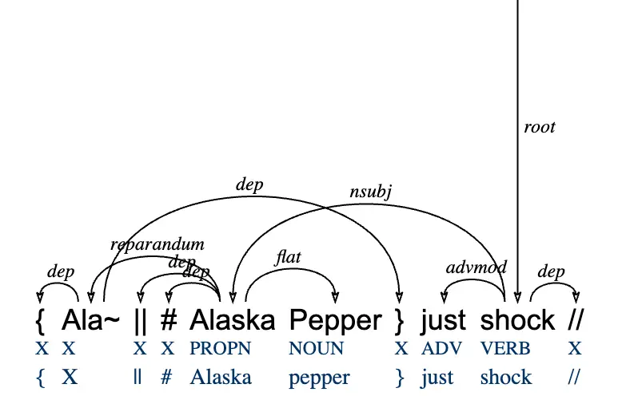
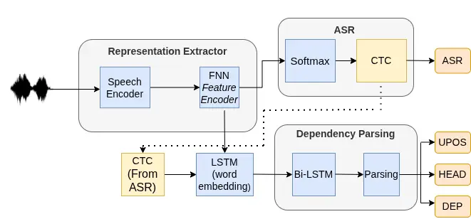
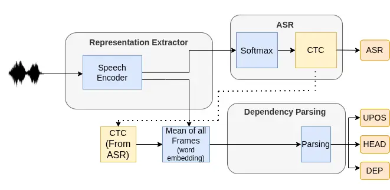
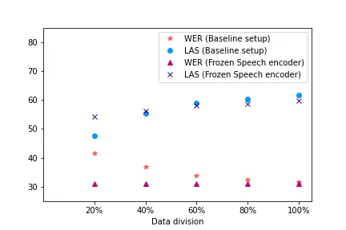
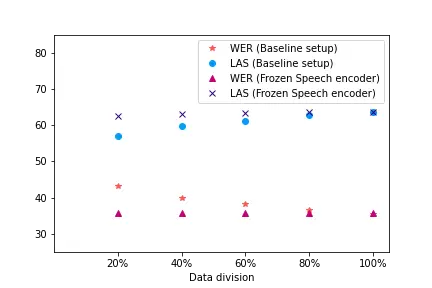
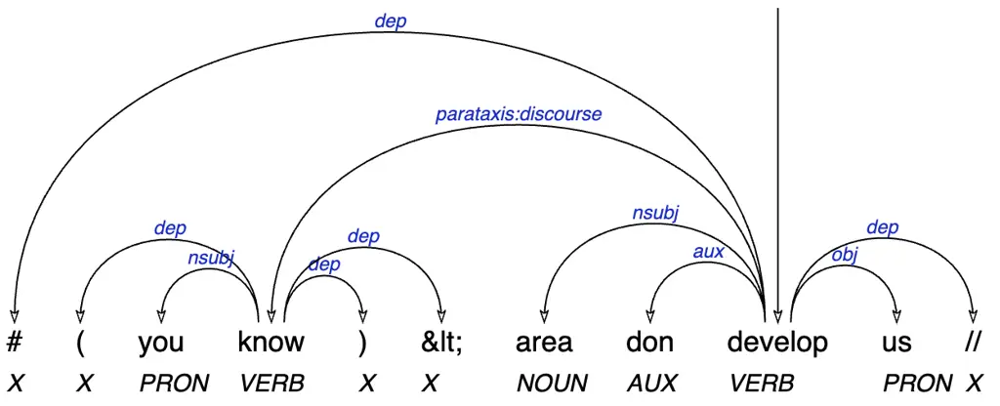
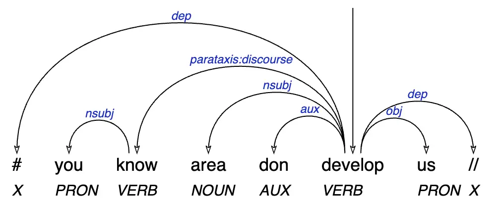

# When Can You Prune Your Network? A Study of Intermediate Neurons in Multilingual Speech Parsing

Minnie Kabra    Benjamin Lecouteux    Maximin Coavoux Affiliation: Univ.
Grenoble Alpes, CNRS, Grenoble INP, LIG, 38000 Grenoble, France
Email: [first.last@univ-grenoble-alpes.fr](mailto:)

###### Abstract

End-to-end speech parsing, a task recently proposed, consists in
predicting both the transcription and the syntactic tree for a spoken
utterance. Existing architectures for speech parsing often utilise
intermediate neural networks. In this work, we examine the effectiveness
of intermediate neural networks (NN) for parsing, and, specifically,
what role do they play. We introduce a simpler end-to-end architecture
for speech parsing, where we remove these intermediate NN units,
reducing the parameters by 12%, while achieving comparable or better
performance than prior method on both automatic speech recognition (ASR)
and parsing. We demonstrate that intermediate NN units help reduce the
representational gap when the pre-trained encoder is frozen. We do a
comprehensive evaluation of speech parsing on French, and medium-low
resource languages Slovenian and Naija. We further investigate the
impact of the training data size and intermediate layers of the
pretrained speech encoder on speech parsing.

## 1 Introduction

End-to-end architectures for speech parsing (Pupier et al., 2022; Kando
et al., 2024) connect the pre-trained speech and the parsing models
using intermediate neural network (NN) units like feedforward neural
network (FNN), recurrent neural network (RNN), and long short-term
memory (LSTM) units. These units increase the computational training
time. However, the impact of these units has not been yet studied for
parsing.

Even though dependency parsing (Figure 1) has nowadays fewer
applications in NLP, the design of accurate syntactic parsers is still
relevant for applications to data-driven linguistics (Hüll and
Dobrovoljc, 2025; Peck and Becker, 2024) whose analyses rely on
syntactic annotations. However, treebanks of spontaneous speech,
arguably the most naturalistic source of linguistic data, are scarcer
than written treebanks.The parsing of spontaneous speech is currently
not at a satisfactory level. Hence, high-quality speech parsers would
open new perspectives for the study of syntax and for computational
language documentation. More generally, besides these motivations, our
work subscribes to the current necessity for the NLP community to focus
more on speech as the most naturalistic source of linguistic data
(Chrupała, 2023).

Wav2tree (Pupier et al., 2022) is an end-to-end architecture for
spontaneous speech parsing where the pre-trained speech model is
fine-tuned jointly with the downstream parsing model, with intermediary
NN units inserted between the two models. It takes speech as input, and
produces both the transcription and the syntactic tree as the output.
Due to this joint fine-tuning setup, the representations learned by the
speech encoder, as well as those produced by the intermediate NN units,
is optimised for the downstream parsing model.



Figure 1: Dependency parsing tree from the NaijaNSC treebank. en: Ala-…
Alaska Pepper was shocked. The two lines under the wordform line are the
sequence of POS and lemma tags respectively.

Our contributions are the following:

1.  1.  We examine the role of intermediate neural network (NN) units in
        Wav2tree:
    - •
      we introduce a new end-to-end architecture, Simplified Wav2tree
      (Simplified W2T), for parsing speech to a dependency tree. It
      simplifies Wav2tree by removing these intermediate NN units, while
      generally matching or improving performance with greater
      efficiency.¹¹ 1
      [https://github.com/minniekabra/SpeechParsing](https://github.com/minniekabra/SpeechParsing)
    - •
      When the pre-trained model (encoder) is frozen within a joint
      parsing architecture, its representation remains optimised for the
      pre-training objective, and not for the downstream parsing task.
      We refer to this phenomenon as the representational gap between
      the encoder and the parsing model. We demonstrate that
      intermediate neural network units help reduce this
      representational gap between the frozen encoder and the parsing
      model.

2.  2.  We carry out a comprehensive evaluation of dependency parsing of
        speech for the spoken treebanks of Naija, Slovenian, and French:
    - •
      We compare Simplified Wav2tree with baseline Wav2tree.
    - •
      We examine the performance of dependency parsing using
      representation from intermediate Wav2Vec2Baevski et al. (2020)
      layers as the input to both ASR and parsing model in the
      Simplified architecture. The performance of parsing remains stable
      or improves, increasing the parameter efficiency of the
      architecture.
    - •
      We do a comparison with the pipeline approach and gold
      transcriptions. Except for Slovenian, the end-to-end parsing
      performs better than the pipeline.

3.  3.  We analyze the impact of scaling training data on dependency parsing
        of speech. Through a two-stage experimental setup, we assess the
        amount of speech data required by the parsing model to attain a
        near-optimal performance with the Simplified architecture.
4.  4.  We present language-specific analyses for Naija and Slovenian. For
        Naija, we assess the usefulness of segmentation annotations for
        parsing. Our experiments show that they do not lead to improvements
        as they do when parsing transcriptions. For Slovenian, we release
        the code¹ to produce filtered UD_Slovenian-SST v2.16 with a better
        speech-transcription alignment.

|              |         |          |         |          |
| ------------ | ------- | -------- | ------- | -------- |
| Dataset      | Section | Duration | Trees   | Speakers |
|              | Train   | 6.78h    | 7,268   | 67       |
| Naija        | Dev     | 0.87h    | 990     | 10       |
|              | Test    | 0.91h    | 972     | 11       |
|              | Train   | 4.88h    | 3,474   | 464      |
| Slovenian    | Dev     | 0.67h    | 400     | 80       |
|              | Test    | 0.99h    | 358     | 36       |
|              | Train   | 1.34h    | 1,265   |          |
| ParisStories | Dev     | 0.58h    | 640     | N/A      |
|              | Test    | 0.59h    | 631     |          |
|              | Train   | 122.1h   | 158,778 |          |
| Orféo        | Dev     | 11.57h   | 15,000  | 2000+    |
|              | Test    | 11.62h   | 15,000  |          |

Table 1: Data statistics for the Naija-NSC treebank, Slovenian SST,
ParisStories, and Orféo

## 2 Related work

Historically, speech parsing has mostly been addressed through parsing
transcriptions, be the gold transcriptions or predicted transcriptions
(Béchet et al., 2014, e.g. ). Early work on speech parsing aimed at
jointly detecting (and sometimes removing) disfluencies and parsing
(Charniak and Johnson, 2001; Jørgensen, 2007; Rasooli and Tetreault,
2013; Rasooli and Tetreault, 2014; Honnibal and Johnson, 2014; Yoshikawa
et al., 2016; Jamshid Lou et al., 2019). The underlying motivation for
removing the disfluencies is often to use the output tree as input to
downstream NLP tools trained on written text and reduce the domain shift
between speech and text. Prior work also proposed to include audio
features in text parsers, as an extra source of information to improve
disambiguation (Kahn et al., 2005; Dreyer and Shafran, 2007; Pate and
Goldwater, 2013; Tran and Ostendorf, 2021). In contrast, instead of
relying on transcriptions, we address speech parsing directly from the
speech signal and perform automatic speech recognition jointly, in line
with Pupier et al. (2022).

Only a few publications have dealt with speech parsing without relying
on transcriptions (Pupier et al., 2022; Pupier et al., 2024; Kando et
al., 2024). They evaluate either on the French Orféo treebank (Benzitoun
et al., 2016) for the first two, or Orféo and the English Switchboard
treebank (Godfrey et al., 1992) for the last one. This paper focuses
instead on lower-resource languages: Naija and Slovenian. A second major
novelty compared to these three publications is that we introduce a much
simpler deep learning architecture.

Our work is also connected to Lai et al. (2023); Tseng et al. (2023),
who investigate grammar inference from the speech signal and visual cues
on a multimodal dataset of images with read captions. However, the data
they use consists of captions read aloud by speakers. Texts that are
read aloud do not feature the phenomena that make speech recognition and
analysis difficult (disfluencies, interruptions, overlapping speakers).
Moreover, their syntax is similar to that of written texts. As a result,
there is a wide domain shift between spontaneous and read speech. Our
work focuses instead on corpora featuring realistic interactions.

## 3 Datasets

We conduct a multilingual evaluation of Simplified W2T on three spoken
treebanks from Universal Dependencies (Nivre et al., 2020), covering
three languages. The multilingual evaluation here refers to training and
evaluating the architecture separately on these three languages. We
additionally use the French Orféo treebank (Benzitoun et al., 2016) to
assess the impact of scaling the training data on dependency parsing.
The statistics of the datasets is presented in Table 1.

1.  1.  Naija - NaijaSynCor (Naija-SNC) treebank (Caron et al., 2019),
        released as part of Universal Dependencies (Nivre et al., 2020), was
        manually annotated using the Surface-Syntactic Universal Dependency
        (Gerdes et al., 2018, SUD) annotation scheme. Naija, officially
        named Nigerian Pidgin, is an English-based creole language, whose
        lexicon is influenced by Nigerian languages such as Yoruba, Hausa,
        and Igbo. The treebank recordings span life stories, speeches, radio
        programs, free conversations, cooking recipes, comments on the
        current state of affairs, etc.
2.  2.  Slovenian - Slovenian SST (Dobrovoljc and Nivre, 2016) was manually
        annotated using the Universal Dependencies (UD) annotation scheme.
        Its recordings cover multiple categories, including public
        informative and educational content, public entertainment,
        non-public non-private interactions, and non-public private
        conversations among friends or family members.
3.  3.  UD French ParisStories²² 2
        [https://universaldependencies.org/treebanks/fr_parisstories/index.html](https://universaldependencies.org/treebanks/fr_parisstories/index.html) -
        The dataset was annotated following the SUD guidelines and
        automatically converted to UD. Its recordings consist of personal
        life stories.
4.  4.  French Orféo treebank³³ 3 Around 5% of the Orféo treebank has been
        manually annotated (gold), the rest of the corpus is automatically
        annotated (good quality silver data) - Orféo is the only publicly
        available spoken treebank large enough for scaling experiments. It
        has multiple sub-corpora, and the recordings span work meetings,
        interviews, public meetings, storytelling, narratives, and telephone
        conversations.

We observed speech noise in the Slovenian-SST dataset which we filtered
out, and enhanced speech-transcription misalignment.We provide further
details in Appendix C.



((a)) Baseline Wav2tree (Pupier et al., 2024)



((b)) Simplified Wav2tree (ours)

Figure 2: Comparison of the original architecture (Pupier et al., 2024)
and our proposed architecture.

## 4 Background: Wav2tree Architecture

Wav2Tree (Pupier et al., 2022) is an end-to-end dependency parsing model
whose only input is the raw speech signal. Its architecture is
illustrated in Figure 2(a), and performs speech recognition and parsing
jointly. The Wav2tree architecture is composed of three modules: (i) a
speech encoder that computes a vector representation for each frame in
the speech signal, (ii) an ASR module that outputs both a transcription
and the frame boundaries of each predicted token, (iii) a parsing module
that uses the word boundaries to compute audio word embeddings and run a
standard parsing algorithm on the sequence of embeddings. These modules
are connected by three intermediate NN units.

The audio signal $`\mathbf{s}`$ is first passed to a pre-trained speech
encoder (Wav2Vec2, Eq. 1) to obtain a sequence of frame vectors
$`\mathbf{F}^{(1)}\in\mathbb{R}^{\ell\times f}`$, where  $`\ell`$ is the
length of the signal in number of frames and $`f`$ is the output size of
Wav2Vec2 representations. Then the obtained matrix is passed through the
1^(st) intermediate NN unit - Feedforward neural network (feature
encoder, Eq. 2).

```math
\displaystyle\mathbf{F}^{(1)} \displaystyle=\wavto(\mathbf{s}), \tag{1}
```

```math
\displaystyle\mathbf{F}^{(2)} \displaystyle=\fnn(\mathbf{F}^{(1)}). \tag{2}
```

The speech recognition module applies a Connectionist temporal
classification layer (Graves et al., 2006, CTC) to $`\mathbf{F}^{(2)}`$.
The granularity of the CTC prediction is at the character level: each
frame is tagged with a character (or a special blank character
representing a separation between two words).

To obtain transcriptions from CTC predictions, Wav2tree uses a greedy
decoding algorithm⁴⁴ 4
[{https://github.com/Pupiera/ParseBrain/blob/master/parsebrain/speechbrain_custom/decoders/ctc.py}](https://%7Bhttps://github.com/Pupiera/ParseBrain/blob/master/parsebrain/speechbrain_custom/decoders/ctc.py%7D)
(Eq. 3). It is a modification of the greedy decode from the SpeechBrain
library (Ravanelli et al., 2021), which outputs a single transcription.
Along with the transcription $`\hat{t}`$, the decoding algorithm outputs
a mapping $`\hat{a}`$ of the frames of Wav2Vec2 to the words, based on
the character tagged on each frame. We provide an example of a mapping
in Figure 5 in Appendix. The predicted word boundaries (start and end
frames for each transcribed word) are extracted from this mapping.

```math
\displaystyle\hat{t},\hat{a} \displaystyle=\ctc(\mathbf{F}^{(2)}). \tag{3}
```

The 2^(nd) intermediate NN unit LSTM then uses these predicted word
boundaries to compute the ‘audio’ word embedding i.e., fixed-sized
vectors for each predicted word $`w_{k}`$ ($`k\in\{1,\dots n\}`$) with
boundary indices $`(i_{k},j_{k})`$. This process is akin to using a
character LSTM to compute textual word embedding based on their internal
structure. (Ling et al., 2015; Plank et al., 2016). Instead of a
sequence of characters, spoken words are a sequence of frames (the
output of the feature encoder module).

```math
\displaystyle\mathbf{w}_{k} \displaystyle=\lstm(\mathbf{F}^{(2)}_{\cdot,i_{k}:j_{k}}). \tag{4}
```

Next, Wav2tree computes contextualised audio word embedding by passing
the sequence of embeddings $`(\mathbf{w}_{1},\dots,\mathbf{w}_{n})`$
through the 3^(rd) intermediate NN unit - a bidirectional LSTM (Eq. 5):

```math
\displaystyle\mathbf{(}\mathbf{h}_{1},\dots,\mathbf{h}_{n}) \displaystyle=\bilstm(\mathbf{w}_{1},\dots,\mathbf{w}_{n}). \tag{5}
```

The resulting word-level representations are passed to a generic
dependency parsing algorithm, either a seq2label strategy (Strzyz et
al., 2019) or a biaffine architecture (Dozat and Manning, 2017). The
whole Wav2tree model is trained end-to-end with a multitask objective
(ASR and parsing) to reduce the error propagation between the two tasks.

## 5 Experiments

The first set of experiments we conduct aims to answer the following
research questions:

- •
  RQ1: What is the role of the intermediate neural network units in
  end-to-end parsing, and when do they add value?
- •
  RQ2: How is speech parsing accuracy affected by the size of the
  training data across two successive setups (i) when the ASR model is
  fine-tuned jointly with the parsing model, and (ii) when a
  pre-fine-tuned ASR model is used to control for the effect of ASR
  accuracy.

The second set of experiments provides a comprehensive evaluation of
speech parsing across the three spoken treebanks.

### 5.1 RQ1: Role of Intermediate NN Units

When the pre-trained model is fine-tuned jointly with the parsing model,
its representations become aligned with the downstream parsing task.
Building on this observation, we propose two hypotheses regarding the
role of intermediate neural network units in the parsing architecture.

- •
  H1: When the pre-trained model is fine-tuned jointly with the parsing
  model, the intermediate NN units do not add an incremental value.
- •
  H2: However, when the pre-trained model is frozen, the intermediate NN
  units help to reduce the representational gap between the frozen
  pre-trained model and the parsing model.

#### 5.1.1 (H1) Simplified Architecture

In Wav2tree (Figure 2(a)), the speech encoder is fine-tuned jointly with
the CTC layer, the parsing model, and three intermediate NN units. We
simplify the Wav2tree architecture by removing these intermediate NN
units.

1.  1.  We removed the feature encoder module. The representations from
        Wav2Vec2, learned via a self-supervised transformer-based
        architecture, largely encapsulate cross-segment dependencies without
        requiring further transformation. Therefore, in practice, we apply
        CTC directly to $`\mathbf{F}^{(1)}`$.
2.  2.  For word-level representation, we directly use the representation
        from the speech model, by averaging all frames within each word.
        These representations are derived from a transformer-based encoder
        with self-attention, and thus integrate contextual information
        across the frames for a word. This suggests that the LSTM unit (Eq.
    4) is redundant in this setting.
3.  3.  We hypothesize that the bi-LSTM module is used to align the speech
        encoder representation with the parsing model. Since the
        architecture is fine-tuned end-to-end, i.e., the weights of the
        speech encoder are fine-tuned for the downstream parsing task, the
        bi-LSTM (Eq 5) is not required in this setting.

The last two simplifications consist of feeding the sequence of vectors
$`(\mathbf{F}^{(1)}_{\text{mean}(i_{1},j_{1})},\dots\mathbf{F}^{(1)}_{\text{mean}(i_{n},j_{n})})`$
to the parser, effectively bypassing Eq. 4 and 5.

The audio word embeddings $`(\mathbf{h}_{1},\dots,\mathbf{h}_{n})`$ in
our architecture are computed by the three following equations (that
replace Eq. 1 to 5):

```math
\displaystyle\mathbf{F}^{(1)} \displaystyle=\wavto(\mathbf{s}), \tag{6}
```

```math
\displaystyle\hat{t},\hat{a} \displaystyle=\ctc(\mathbf{F}^{(1)}), \tag{7}
```

```math
\displaystyle\mathbf{(}\mathbf{h}_{1},\dots,\mathbf{h}_{n}) \displaystyle=(\mathbf{F}^{(1)}_{\text{mean}(i_{1},j_{1})},\dots\mathbf{F}^{(1)}_{\text{mean}(i_{n},j_{n})}), \tag{8}
```

where $`\hat{a}=[(i_{1},j_{1}),\dots(i_{n},j_{n})]`$ as previously
mentioned, and $`\mathbf{F}^{(1)}_{\text{mean}(i_{k},j_{k})}`$ is the
vector representation of the mean of all frames for a word $`k`$.

In all, the output of speech representation from the speech encoder now
directly serves as the input to the parsing model (see Figure 2(b)).
With this change, the parameter count is reduced by 12% in the
simplified architecture, considering the hyperparameters used by Pupier
et al. (2024).

#### 5.1.2 (H2) When Do Intermediate NN Units Add Value?

We evaluate hypothesis H2 using a text parsing model. The text parsing
architecture we use is the same as the Simplified architecture for
speech parsing, except that the speech encoder is replaced by a
pretrained text encoder. To study and isolate the impact of intermediate
NN units, we feed gold transcriptions into the text parser. We do two
experiments across all three spoken treebanks:

1.  1.  Joint fine-tuning: We first evaluate the text parsing performance
        when the architecture is fine-tuned end-to-end, with and without an
        intermediate NN unit (LSTM).
2.  2.  Frozen pre-trained text model: Next, we freeze the pre-trained text
        model (Figure 3), and evaluate the text parsing performance with and
        without an intermediate NN unit.

    

    ((a)) No intermediate NN unit.

    

    ((b)) With LSTM Unit

    Figure 3: Text parsing with frozen text encoder - with and without
    intermediate NN unit.

We note that it is not possible to conduct the same experiment for
speech parsing, as the underlying speech model (Wav2Vec2) requires
fine-tuning for the target language.

### 5.2 RQ2: Scaling Training Data

We use the two largest spoken treebanks (Naija-SNC, 7h; Orféo, 122h) to
assess the effect of the training set size. The training data was
partitioned into five subsets for this experiment: 20%, 40%, 60%, 80%,
and 100%. With the simplified speech parsing architecture, we assess the
amount of speech required to achieve an optimal performance. We conduct
two-stage experiments for it:

1.  1.  Baseline setup : We ran the Simplified W2T, without any
        modifications, across all data partitions.
2.  2.  Frozen Speech encoder: Since the input to parsing is the learned
        representation produced by the ASR model (speech encoder & CTC
        tagging), ASR accuracy directly affects parsing performance. To
        isolate and precisely evaluate the effect of scaling training data
        on parsing, we use a pre-fine-tuned ASR system. The pre-fine-tuned
        model is obtained from step 1, when trained with 100% of the
        training data. Extending the finding from Section 5.1.2, we use an
        intermediate LSTM unit to align representation from the frozen ASR
        model to the parsing model.

### 5.3 Dependency Parsing Evaluation

##### Middle Layers of Wav2Vec2

On the simplified architecture and for all three spoken treebanks, we
assess the impact of the middle layers of the Wav2Vec2 on dependency
parsing, i.e., using the representation from intermediate layers as the
input to both ASR and parsing. This is motivated by the observations of
Shen et al. (2023) and Dugonjić et al. (2024) who found through probing
experiments that syntax is best encoded in the middle layers of the
pre-trained speech models.

##### Baseline experiments

On all three spoken treebanks, we checked the performance of text-based
dependency parsing using a PIPELINE and a GOLD approach:

- •
  PIPELINE: The input to the text model is the predicted transcriptions
  from the pre-trained speech encoder of the Simplified architecture
- •
  GOLD: The inputs to the text parser are gold transcriptions. This
  experiment is meant as an upper bound (ideal case with perfect ASR).

### 5.4 Segmentation Annotations in Naija

The Naija dataset contains syntactic and prosodic segmentation
annotations materialized by punctuation marks that are included as
tokens in the dependency trees (see the tree in Figure 1 for an
illustration). Caron et al. (2019) found these markups useful for
parsing, with gold transcriptions as the input. We found this is not the
case when parsing the audio signal (details in Appendix B).

|                |           |                 |       |        |       |       |                           |
| -------------- | --------- | --------------- | ----- | ------ | ----- | ----- | ------------------------- |
| Model          | Wav2Vec2  | Intermediate NN | WER ↓ | UPOS ↑ | UAS ↑ | LAS ↑ | Parameters                |
| Baseline W2T   | 24 layers | yes             | 31.4  | 77.8   | 70.2  | 62.7  | 315M^(w)+13M^(i)+4.5M^(p) |
| Simplified W2T | 24 layers | no              | 31.8  | 79.1   | 69.1  | 61.8  | 315M^(w)+5M^(p)           |
| Simplified W2T | 21 layers | no              | 31.5  | 78.5   | 68.5  | 61.3  | 278M^(w)+5M^(p)           |
| PIPELINE       | 24 layers | no              | 31.8  | 77.9   | 68.0  | 61.2  | 315M^(w)+5M^(p)+559M^(r)  |
| GOLD           | \-        | no              | 0.0   | 96.9   | 88.0  | 83.9  | 559M^(r)+5M^(p)           |

((a)) Evaluation on the Naija-NSC treebank.

|                |           |                 |       |        |       |       |                           |
| -------------- | --------- | --------------- | ----- | ------ | ----- | ----- | ------------------------- |
| Model          | Wav2Vec2  | Intermediate NN | WER ↓ | UPOS ↑ | UAS ↑ | LAS ↑ | Parameters                |
| Baseline W2T   | 24 layers | yes             | 33.2  | 73.0   | 46.6  | 37.7  | 315M^(w)+13M^(i)+4.5M^(p) |
| Simplified W2T | 24 layers | no              | 33.0  | 76.8   | 45.7  | 38.9  | 315M^(w)+5M^(p)           |
| Simplified W2T | 18 layers | no              | 34.3  | 76.7   | 47.4  | 40.7  | 240M^(w)+5M^(p)           |
| PIPELINE       | 24 layers | no              | 32.9  | 80.2   | 56.3  | 50.9  | 315M^(w)+5M^(p)+559M^(r)  |
| GOLD           | \-        | no              | 0.0   | 97.8   | 74.9  | 71.3  | 559M^(r)+5M^(p)           |

((b)) Evaluation on the Slovenian treebank.

|                |                 |                 |       |        |       |       |                           |
| -------------- | --------------- | --------------- | ----- | ------ | ----- | ----- | ------------------------- |
| Model          | Speech_large_fr | Intermediate NN | WER ↓ | UPOS ↑ | UAS ↑ | LAS ↑ | Parameters                |
| Baseline W2T   | 16 layers       | yes             | 38.2  | 72.1   | 58.4  | 50.9  | 313M^(g)+13M^(i)+4.5M^(p) |
| Simplified W2T | 16 layers       | no              | 37.6  | 73.6   | 59.9  | 53.3  | 313M^(g)+5M^(p)           |
| Simplified W2T | 11 layers       | no              | 38.1  | 73.5   | 60.7  | 54.2  | 250M^(g)+5M^(p)           |
| PIPELINE       | 16 layers       | no              | 37.5  | 71.7   | 55.9  | 48.7  | 313M^(g)+5M^(p)+559M^(r)  |
| GOLD           | \-              | no              | 0.0   | 96.1   | 76.4  | 71.9  | 559M^(r)+5M^(p)           |

((c)) Evaluation on the ParisStories treebank.

Table 2: Evaluation on test dataset with settings described in
Section 5.5. Parameter counts: ^(w)Wav2vec, ^(g)Speech_Large_fr_114K,
^(f)feedforward + LSTM, ^(p)parsing module, ^(r)Roberta module. W2T
refers to Wav2tree. Best scores across end-to-end speech parsing
highlighted in bold. Underlined refers to statistical significant
results

|                                      |                 |         |             |                |                         |
| ------------------------------------ | --------------- | ------- | ----------- | -------------- | ----------------------- |
| Text parsing architecture            | Intermediate NN | LAS     | LAS         | LAS            | \# of parameters        |
|                                      | (LSTM)          | (Naija) | (Slovenian) | (ParisStories) | (fine-tuned)            |
| Joint fine-tuning                    | no              | 83.9    | 71.3        | 72.0           | 559M^(r)+5M^(p)         |
| Joint fine-tuning + LSTM             | yes             | 81.7    | 66.1        | 69.8           | 559M^(r)+5M^(p)+16M^(i) |
| Frozen pre-trained text model        | no              | 51.5    | 40.9        | 44.8           | 5M^(r)                  |
| Frozen pre-trained text model + LSTM | yes             | 74.6    | 55.4        | 62.9           | 5M^(p)+16M^(i)          |

Table 3: Comparative analysis for RQ1 - LAS on the test dataset with and
without intermediate NN unit for all 3 treebanks with experiments
described in Section 5.1.2. Best scores across sections highlighted in
bold.

### 5.5 Training and Evaluation Details

##### End-to-End speech parsing

We use wav2vec2-xls-r-300m,⁵⁵ 5
[https://huggingface.co/facebook/wav2vec2-xls-r-300m](https://huggingface.co/facebook/wav2vec2-xls-r-300m)
a multilingual Wav2Vec2 pre-trained acoustic model, as the speech
encoder for both Naija-NSC treebank and Slovenian SST. It has Slovenian
as medium-resource language (11k hours), and Yoruba & Hausa (languages
associated with Naija) as low-resource language (75 hours each) in its
pre-training data. For UD French ParisStories, we use
Speech_Large_fr_114K, a data2vec (Baevski et al., 2022) pre-trained
speech model trained on 114k hours of French speech (Le et al., 2026).

The parsing module is a biaffine graph-based parser (Dozat and Manning,
2017). The baseline Wav2tree results are produced with the original
Wav2tree implementation.

##### Text parsing

We use xlm-roberta-large⁶⁶ 6
[https://huggingface.co/FacebookAI/xlm-roberta-large](https://huggingface.co/FacebookAI/xlm-roberta-large)
(Conneau et al., 2020) as text encoder for all three languages. It has
French as high-resource language (9.8 billion tokens), Slovenian as
medium-resource language (1.7 billion tokens), and Hausa as low-resource
language (56 million tokens) in its pre-training data.

We use the same hyperparameters across all architectures and datasets
(see Table 5 in Appendix A for the full list). We select the best
checkpoint on the development set in each setting, and report the
results on the test set. Our implementation uses the speechbrain library
(Ravanelli et al., 2021).

Evaluation metrics We use standard evaluation measures: Word Error Rate
(WER) for speech recognition, POS accuracy (POS), Unlabeled Attachment
Score (UAS), and Labeled Attachment Score (LAS) for dependency parsing.
The dependency parsing measures require an alignment between the ground
truth and the predicted sequences, which was performed following the
procedure described by Pupier et al. (2024).

## 6 Results

### 6.1 RQ1: Role of Intermediate NN Units

##### (H1) Simplified architecture

In Table 2, we show the comparison of baseline and simplified Wav2tree
across all three spoken treebanks (1^(st) and 2^(nd) rows of each
sub-table).

After removing the three intermediate NN units, parsing accuracy (LAS)
improved for Slovenian and French (Paris Stories). In absolute terms,
LAS increased by 1.2%, and 2.5% on Slovenian and French. There is a
slight drop for Naija (LAS decreased by 0.95%). For Slovenian and
French, the LAS improvement from the Baseline to the Simplified
architecture is statistically significant (see Appendix D for details).
For all three datasets, ASR performance remains consistent across the
Baseline and Simplified Wav2tree.

Based on this evaluation, we infer that the Simplified W2T, while being
parameter-efficient (see Appendix E for the effect on training time),
matches or improves parsing performance compared to Wav2tree. Our
results support hypothesis H1 that intermediate NN units do not provide
incremental value when the speech model is jointly fine-tuned with the
parsing model.

##### (H2) When do intermediate NN units add value?

In Table 3, we report the text parsing performance (LAS score) on all
three treebanks across the combinations of (i) text parsing
architectures with and without an intermediate NN unit (LSTM), and (ii)
whether the pre-trained text model is frozen or fine-tuned jointly with
the parsing model.

Across all three treebanks, when the pre-trained text model is
fine-tuned jointly with the parsing model (1^(st) and 2^(nd) rows), LAS
score is higher when there is no intermediate NN unit between the text
encoder and the parsing model. This is consistent with our findings from
the Simplified architecture.

When we freeze the pre-trained text model and feed its output directly
to the parsing model (3^(rd) row), the LAS score drops by at least 30%
across all three treebanks. We attribute this to the representational
gap between the frozen encoder and the parsing model. We then introduce
an intermediate NN unit into this setup (4^(th) row), and the LAS score
increases by 15-20% across all three treebanks, bringing the performance
closer to the joint fine-tuning setting. This suggests that intermediate
NN unit helps to reduce the representational gap between the frozen
pre-trained model and the parsing model.

We then measure the similarity between the text representation from the
fine-tuned text model without any intermediate NN unit and (i) the
representation from the frozen text model without any intermediate NN
unit. The representation corresponds to the encoder output of the
pre-trained model (ii) the representation from the frozen text model
with an intermediate NN unit. The representation corresponds to the
output of the intermediate NN unit.

We use linear Centered Kernel Alignment Kornblith et al. (2019) as the
similarity measure. Centered Kernel Alignment (CKA) is a widely used
pairwise feature similarity for quantifying the similarity between two
neural network representations. It measures the similarity between
features from the two representations for each pair of examples using
Hilbert-Schmidt Independence Criterion.

The similarity is shown in Table 4. Across all three treebanks, the
similarity between the representations from the fine-tuned and the
frozen text model is higher with an intermediate NN unit than without.

Based on these two evaluations, we answer RQ1 and support the hypothesis
H2 that the intermediate NN unit helps to reduce the representational
gap between the frozen pre-trained model and the parsing model.

### 6.2 RQ2: Scaling Training Data

In Figure 4, we report the performance of Naija and French (Orféo)
across the two setups described in Section 5.2. The WER is higher than
usual for Orféo because of the nature of the speech corpus (spontaneous
discussions, and lower recording quality for some sub-corpora).

Across all treebanks, in the first experiment (Baseline setup), the WER
decreases and the LAS improves with a larger training set. In the
subsequent experiment (Frozen ASR), where a pre-fine-tuned ASR is used
across all data partitions, the LAS increases as the training data
scales up, the magnitude of gains is reduced compared to the first
experiment. Here, the LAS trend differs across the two spoken treebanks
– the LAS remains relatively stable across all data partitions for
Orféo, while it increases up to 80% of the training data for Naija. We
attribute this to the difference in the amount of the training data of
the two treebanks.

This analysis suggests that with a pre-fine-tuned ASR model, parsing
accuracy gains diminish beyond 9-10 hours of training data with the
Simplified W2T.

### 6.3 Dependency Parsing Evaluation

In Table 2, we report the evaluation for Wav2Vec2 intermediate layers,
and the baseline results for all three spoken treebanks.

##### Intermediate layers

The 3^(rd) row in Table 2 corresponds to the performance when the
intermediate layer of the Wav2Vec2 model is used to produce the speech
representation, as described in Section 5.3. We report results (on the
test dataset) for the layer which has highest LAS score on the
development dataset. Across all three spoken treebanks, the LAS score
remains stable or improved. This corresponds to a 12%-24% reduction in
the parameters and 5-9% speed up in training time. We conclude that
intermediate layers of the speech encoder produce speech representations
suitable for parsing.

##### Pipeline and GOLD

The last two rows in Table 2 correspond to the Pipeline and the GOLD
setups. Apart from the Slovenian treebank, the end-to-end Simplified
architecture performs better than the Pipeline approach on parsing,
which also has 2.75$`\times`$ more parameters than the Simplified
architecture, due to the use of two pre-trained models: an acoustic
model for ASR and a pretrained text model for parsing.

##### WER for Naija

We compare word error rate (WER) for tokens in Naija depending on
whether they are in the Unix words English lexicon.⁷⁷ 7
[https://www.nltk.org/book/ch02.html](https://www.nltk.org/book/ch02.html)
We find that WER is substantially higher for tokens not belonging to the
English vocabulary, as displayed in Table 7 in Appendix. This result is
likely due to the limited size of Naija-related languages in its
pretraining data, and illustrates the English bias of
wav2vec2-xls-r-300m.

|                        |       |           |        |
| ---------------------- | ----- | --------- | ------ |
| Similarity between     | CKA   | CKA       | CKA    |
| fine-tuned encoder &   | Naija | Slovenian | French |
| Frozen encoder without | 17%   | 21%       | 23%    |
| intermediate NN unit   |       |           |        |
| Frozen encoder with    | 44%   | 32%       | 34%    |
| intermediate NN unit   |       |           |        |

Table 4: Similarity between representations from fine-tuned and frozen
text encoder described in Section 6.1



((a)) Data Scaling - Naija



((b)) Data Scaling - Orféo

Figure 4: Scaling training data across 2 setups - End-to-End (Baseline)
and Frozen ASR - as described in Section 5.2

## 7 Conclusion and Further work

We investigate the role of intermediate neural network units in the
parsing architecture and find that they provide incremental value when
the pre-trained model is frozen by reducing the representational gap
between the pre-trained model and parsing model. We further introduce an
end-to-end parser for speech that is parameter-efficient while achieving
comparable performance to the prior architecture. We evaluate the impact
of scaling training data on the Simplified architecture, and find that
gains in parsing accuracy diminish after the first 9-10h of training
data.

We present baseline dependency parsing results for three spoken
treebanks — Naija, Slovenian and French (ParisStories). We provide the
first end-to-end speech parsing experiments for Naija and Slovenian. We
assess the impact of speech representation from intermediate layers of
Wav2Vec2 as the input to the parsing architecture, and find that the
parsing performance remains stable. Lastly, we release the code to
reproduce filtered UD_Slovenian-SST v2.16 treebank with improved
speech-transcription alignment

The analysis of intermediate neural network units can be extended to
other neural architectures beyond parsing. As the future work we plan to
examine two findings from this paper: (i) why the pipeline performs
better than the end-to-end speech parser on the Slovenian treebank, and
(ii) why parsing performance remains stable when using representations
from the intermediate layer of the speech encoder as the input.

## Limitations

For all our experiments, we limited our hyperparameter search to
learning rate due to computational resource constraints. We do not
evaluate the proposed architecture on the English Switchboard corpus
(Godfrey et al., 1992) because the audio recordings are not publicly
available.

## Acknowledgements

We gratefully acknowledge the support of the French National Research
Agency (ANR) through project SynPaX (grant ANR-23-CE23-0017-01). We
thank William Havard for feedback on an earlier version of this paper,
as well as Rayan Ziane and Emmanuel Schang for fruitful discussions
about this work.

## References

- Baevski et al. (2022) A. Baevski, W. Hsu, Q. Xu, A. Babu, J. Gu,
  and M. Auli Data2vec: a general framework for self-supervised learning
  in speech, vision and language. In Proceedings of the 39th
  International Conference on Machine Learning, K. Chaudhuri, S.
  Jegelka, L. Song, C. Szepesvari, G. Niu, and S. Sabato (Eds.),
  Proceedings of Machine Learning Research, Vol. 162, pp. 1298–1312.
  External Links:
  [Link](https://proceedings.mlr.press/v162/baevski22a.html) Cited by:
  §5.5.
- Baevski et al. (2020) A. Baevski, Y. Zhou, A. Mohamed, and M. Auli
  Wav2vec 2.0: a framework for self-supervised learning of speech
  representations. Advances in neural information processing systems 33,
  pp. 12449–12460. Cited by: 2nd item.
- Béchet et al. (2014) F. Béchet, A. Nasr, and B. Favre Adapting
  dependency parsing to spontaneous speech for open domain spoken
  language understanding. In Interspeech 2014, pp. 135–139. External
  Links: [Document](https://dx.doi.org/10.21437/Interspeech.2014-39),
  ISSN 2958-1796 Cited by: §2.
- Benzitoun et al. (2016) C. Benzitoun, J. Debaisieux, and H. Deulofeu
  Le projet ORFÉO: un corpus d’étude pour le français contemporain.
  Corpus (15). Cited by: §2, §3.
- Caron et al. (2019) B. Caron, M. Courtin, K. Gerdes, and S. Kahane A
  surface-syntactic UD treebank for Naija. In Proceedings of the 18th
  International Workshop on Treebanks and Linguistic Theories (TLT,
  SyntaxFest 2019), M. Candito, K. Evang, S. Oepen, and D. Seddah
  (Eds.), Paris, France, pp. 13–24. External Links:
  [Link](https://aclanthology.org/W19-7803/),
  [Document](https://dx.doi.org/10.18653/v1/W19-7803) Cited by: 4th
  item, Appendix B, Appendix B, item 1, §5.4, footnote 8.
- Charniak and Johnson (2001) E. Charniak and M. Johnson Edit detection
  and parsing for transcribed speech. In Second Meeting of the North
  American Chapter of the Association for Computational Linguistics,
  External Links: [Link](https://aclanthology.org/N01-1016) Cited by:
  §2.
- Chrupała (2023) G. Chrupała Putting natural in natural language
  processing. In Findings of the Association for Computational
  Linguistics: ACL 2023, A. Rogers, J. Boyd-Graber, and N. Okazaki
  (Eds.), Toronto, Canada, pp. 7820–7827. External Links:
  [Link](https://aclanthology.org/2023.findings-acl.495/),
  [Document](https://dx.doi.org/10.18653/v1/2023.findings-acl.495) Cited
  by: §1.
- Conneau et al. (2020) A. Conneau, K. Khandelwal, N. Goyal, V.
  Chaudhary, G. Wenzek, F. Guzmán, E. Grave, M. Ott, L. Zettlemoyer,
  and V. Stoyanov Unsupervised cross-lingual representation learning at
  scale. External Links: 1911.02116,
  [Link](https://arxiv.org/abs/1911.02116) Cited by: §5.5.
- Demšar (2006) J. Demšar Statistical comparisons of classifiers over
  multiple data sets. Journal of Machine learning research 7 (Jan),
  pp. 1–30. Cited by: §D.1.
- Dobrovoljc and Nivre (2016) K. Dobrovoljc and J. Nivre The Universal
  Dependencies treebank of spoken Slovenian. In Proceedings of the Tenth
  International Conference on Language Resources and Evaluation
  (LREC’16), N. Calzolari, K. Choukri, T. Declerck, S. Goggi, M.
  Grobelnik, B. Maegaard, J. Mariani, H. Mazo, A. Moreno, J. Odijk,
  and S. Piperidis (Eds.), Portorož, Slovenia, pp. 1566–1573. External
  Links: [Link](https://aclanthology.org/L16-1248/) Cited by: item 2.
- Dozat and Manning (2017) T. Dozat and C. D. Manning Deep biaffine
  attention for neural dependency parsing. In 5th International
  Conference on Learning Representations, ICLR 2017, Toulon, France,
  April 24-26, 2017, Conference Track Proceedings, External Links:
  [Link](https://openreview.net/forum?id=Hk95PK9le) Cited by: §4, §5.5.
- Dreyer and Shafran (2007) M. Dreyer and I. Shafran Exploiting prosody
  for PCFGs with latent annotations. In Interspeech 2007, pp. 450–453.
  External Links:
  [Document](https://dx.doi.org/10.21437/Interspeech.2007-216), ISSN
  2958-1796 Cited by: §2.
- Dugonjić et al. (2024) Z. Dugonjić, A. Pupier, B. Lecouteux, and M.
  Coavoux What has LeBenchmark learnt about French syntax?. In
  Proceedings of the 2024 Joint International Conference on
  Computational Linguistics, Language Resources and Evaluation
  (LREC-COLING 2024), N. Calzolari, M. Kan, V. Hoste, A. Lenci, S.
  Sakti, and N. Xue (Eds.), Torino, Italia, pp. 17493–17499. External
  Links: [Link](https://aclanthology.org/2024.lrec-main.1521/) Cited by:
  §5.3.
- Gerdes et al. (2018) K. Gerdes, B. Guillaume, S. Kahane, and G.
  Perrier SUD or surface-syntactic Universal Dependencies: an annotation
  scheme near-isomorphic to UD. In Proceedings of the Second Workshop on
  Universal Dependencies (UDW 2018), M. de Marneffe, T. Lynn, and S.
  Schuster (Eds.), Brussels, Belgium, pp. 66–74. External Links:
  [Link](https://aclanthology.org/W18-6008/),
  [Document](https://dx.doi.org/10.18653/v1/W18-6008) Cited by: item 1.
- Godfrey et al. (1992) J. J. Godfrey, E. C. Holliman, and J. McDaniel
  SWITCHBOARD: telephone speech corpus for research and development. In
  \[Proceedings\] ICASSP-92: 1992 IEEE International Conference on
  Acoustics, Speech, and Signal Processing, Vol. 1, pp. 517–520 vol.1.
  External Links:
  [Document](https://dx.doi.org/10.1109/ICASSP.1992.225858) Cited by:
  §2, Limitations.
- Graves et al. (2006) A. Graves, S. Fernández, F. Gomez, and J.
  Schmidhuber Connectionist temporal classification: labelling
  unsegmented sequence data with recurrent neural networks. In
  Proceedings of the 23rd international conference on Machine learning,
  pp. 369–376. Cited by: §4.
- Honnibal and Johnson (2014) M. Honnibal and M. Johnson Joint
  incremental disfluency detection and dependency parsing. Transactions
  of the Association for Computational Linguistics 2, pp. 131–142.
  External Links: [Link](https://aclanthology.org/Q14-1011),
  [Document](https://dx.doi.org/10.1162/tacl%5Fa%5F00171) Cited by: §2.
- Hüll and Dobrovoljc (2025) N. Hüll and K. Dobrovoljc Word order
  variation in spoken and written corpora: a cross-linguistic study of
  SVO and alternative orders. In Proceedings of the Eighth International
  Conference on Dependency Linguistics (Depling, SyntaxFest 2025), E.
  Hajičová and S. Kahane (Eds.), Ljubljana, Slovenia, pp. 150–155.
  External Links: [Link](https://aclanthology.org/2025.depling-1.16/),
  ISBN 979-8-89176-290-9 Cited by: §1.
- Jamshid Lou et al. (2019) P. Jamshid Lou, Y. Wang, and M. Johnson
  Neural constituency parsing of speech transcripts. In Proceedings of
  the 2019 Conference of the North American Chapter of the Association
  for Computational Linguistics: Human Language Technologies, Volume 1
  (Long and Short Papers), J. Burstein, C. Doran, and T. Solorio (Eds.),
  Minneapolis, Minnesota, pp. 2756–2765. External Links:
  [Link](https://aclanthology.org/N19-1282/),
  [Document](https://dx.doi.org/10.18653/v1/N19-1282) Cited by: §2.
- Jørgensen (2007) F. Jørgensen The effects of disfluency detection in
  parsing spoken language. In Proceedings of the 16th Nordic Conference
  of Computational Linguistics (NODALIDA 2007), J. Nivre, H. Kaalep, K.
  Muischnek, and M. Koit (Eds.), Tartu, Estonia, pp. 240–244. External
  Links: [Link](https://aclanthology.org/W07-2435) Cited by: §2.
- Kahn et al. (2005) J. G. Kahn, M. Lease, E. Charniak, M. Johnson,
  and M. Ostendorf Effective use of prosody in parsing conversational
  speech. In Proceedings of Human Language Technology Conference and
  Conference on Empirical Methods in Natural Language Processing, R.
  Mooney, C. Brew, L. Chien, and K. Kirchhoff (Eds.), Vancouver, British
  Columbia, Canada, pp. 233–240. External Links:
  [Link](https://aclanthology.org/H05-1030) Cited by: §2.
- Kando et al. (2024) S. Kando, Y. Miyao, J. Naradowsky, and S.
  Takamichi Textless dependency parsing by labeled sequence prediction.
  In Interspeech 2024, pp. 1340–1344. External Links:
  [Document](https://dx.doi.org/10.21437/Interspeech.2024-783), ISSN
  2958-1796 Cited by: §1, §2.
- Kornblith et al. (2019) S. Kornblith, M. Norouzi, H. Lee, and G.
  Hinton Similarity of neural network representations revisited. In
  International conference on machine learning, pp. 3519–3529. Cited by:
  §6.1.
- Lai et al. (2023) C. J. Lai, F. Shi, P. Peng, Y. Kim, K. Gimpel, S.
  Chang, Y. Chuang, S. Bhati, D. Cox, D. Harwath, Y. Zhang, K. Livescu,
  and J. Glass Audio-visual neural syntax acquisition. External Links:
  2310.07654, [Link](https://arxiv.org/abs/2310.07654) Cited by: §2.
- Le et al. (2026) P. Le, V. Pelloin, A. Chatelain, M. Bouziane, M.
  Ghennai, Q. Guan, K. Milintsevich, S. Mdhaffar, A. Mannion, N.
  Defauw, S. Gu, A. D. Audibert, M. Dinarelli, Y. Estève, L.
  Goeuriot, S. Lalande, N. Hervé, M. Coavoux, F. Portet, É. Ollion, M.
  Candito, M. Peyrard, S. Rossato, B. Lecouteux, A. Nardy, G.
  Sérasset, V. Segonne, S. Evain, D. Fabre, and D. Schwab Pantagruel:
  unified self-supervised encoders for french text and speech. In
  Proceedings of the Fifteenth Language Resources and Evaluation
  Conference (LREC 2026), S. Piperidis, N. Bel, H. van den Heuvel, N.
  Ide, S. Krek, and A. Toral (Eds.), Palma, Mallorca, Spain,
  pp. 10168–10191. External Links:
  [Document](https://dx.doi.org/10.63317/573q4exhmpgd) Cited by: §5.5.
- Ling et al. (2015) W. Ling, C. Dyer, A. W. Black, I. Trancoso, R.
  Fermandez, S. Amir, L. Marujo, and T. Luís Finding function in form:
  compositional character models for open vocabulary word
  representation. In Proceedings of the 2015 Conference on Empirical
  Methods in Natural Language Processing, L. Màrquez, C. Callison-Burch,
  and J. Su (Eds.), Lisbon, Portugal, pp. 1520–1530. External Links:
  [Link](https://aclanthology.org/D15-1176/),
  [Document](https://dx.doi.org/10.18653/v1/D15-1176) Cited by: §4.
- Nivre et al. (2020) J. Nivre, M. de Marneffe, F. Ginter, J.
  Hajič, C. D. Manning, S. Pyysalo, S. Schuster, F. Tyers, and D. Zeman
  Universal Dependencies v2: an evergrowing multilingual treebank
  collection. In Proceedings of the Twelfth Language Resources and
  Evaluation Conference, N. Calzolari, F. Béchet, P. Blache, K.
  Choukri, C. Cieri, T. Declerck, S. Goggi, H. Isahara, B. Maegaard, J.
  Mariani, H. Mazo, A. Moreno, J. Odijk, and S. Piperidis (Eds.),
  Marseille, France, pp. 4034–4043 (eng). External Links:
  [Link](https://aclanthology.org/2020.lrec-1.497/), ISBN
  979-10-95546-34-4 Cited by: item 1, §3.
- Pate and Goldwater (2013) J. K. Pate and S. Goldwater Unsupervised
  dependency parsing with acoustic cues. Transactions of the Association
  for Computational Linguistics 1, pp. 63–74. External Links:
  [Link](https://aclanthology.org/Q13-1006),
  [Document](https://dx.doi.org/10.1162/tacl%5Fa%5F00210) Cited by: §2.
- Peck and Becker (2024) N. Peck and L. Becker Syntactic pausing?
  re-examining the associations. Linguistics Vanguard 10 (1),
  pp. 223–237. External Links:
  [Link](https://doi.org/10.1515/lingvan-2022-0156),
  [Document](https://dx.doi.org/doi%3A10.1515/lingvan-2022-0156) Cited
  by: §1.
- Plank et al. (2016) B. Plank, A. Søgaard, and Y. Goldberg Multilingual
  part-of-speech tagging with bidirectional long short-term memory
  models and auxiliary loss. In Proceedings of the 54th Annual Meeting
  of the Association for Computational Linguistics (Volume 2: Short
  Papers), K. Erk and N. A. Smith (Eds.), Berlin, Germany, pp. 412–418.
  External Links: [Link](https://aclanthology.org/P16-2067/),
  [Document](https://dx.doi.org/10.18653/v1/P16-2067) Cited by: §4.
- Pratap et al. (2023) V. Pratap, A. Tjandra, B. Shi, P. Tomasello, A.
  Babu, S. Kundu, A. Elkahky, Z. Ni, A. Vyas, M. Fazel-Zarandi, A.
  Baevski, Y. Adi, X. Zhang, W. Hsu, A. Conneau, and M. Auli Scaling
  speech technology to 1,000+ languages. External Links: 2305.13516,
  [Link](https://arxiv.org/abs/2305.13516) Cited by: Appendix C.
- Pupier et al. (2024) A. Pupier, M. Coavoux, J. Goulian, and B.
  Lecouteux Growing trees on sounds: assessing strategies for end-to-end
  dependency parsing of speech. In Proceedings of the 62nd Annual
  Meeting of the Association for Computational Linguistics (Volume 2:
  Short Papers), L. Ku, A. Martins, and V. Srikumar (Eds.), Bangkok,
  Thailand, pp. 225–233. External Links:
  [Link](https://aclanthology.org/2024.acl-short.22/),
  [Document](https://dx.doi.org/10.18653/v1/2024.acl-short.22) Cited by:
  Table 5, Table 5, Appendix E, §2, Figure 2, 2(a), §5.1.1, §5.5.
- Pupier et al. (2022) A. Pupier, M. Coavoux, B. Lecouteux, and J.
  Goulian End-to-end dependency parsing of spoken French. In Interspeech
  2022, pp. 1816–1820. External Links:
  [Document](https://dx.doi.org/10.21437/Interspeech.2022-381), ISSN
  2958-1796 Cited by: §1, §1, §2, §2, §4.
- Rasooli and Tetreault (2013) M. S. Rasooli and J. Tetreault Joint
  parsing and disfluency detection in linear time. In Proceedings of the
  2013 Conference on Empirical Methods in Natural Language
  Processing, D. Yarowsky, T. Baldwin, A. Korhonen, K. Livescu, and S.
  Bethard (Eds.), Seattle, Washington, USA, pp. 124–129. External Links:
  [Link](https://aclanthology.org/D13-1013) Cited by: §2.
- Rasooli and Tetreault (2014) M. S. Rasooli and J. Tetreault
  Non-monotonic parsing of fluent umm I mean disfluent sentences. In
  Proceedings of the 14th Conference of the European Chapter of the
  Association for Computational Linguistics, volume 2: Short Papers, S.
  Wintner, S. Riezler, and S. Goldwater (Eds.), Gothenburg, Sweden,
  pp. 48–53. External Links: [Link](https://aclanthology.org/E14-4010/),
  [Document](https://dx.doi.org/10.3115/v1/E14-4010) Cited by: §2.
- Ravanelli et al. (2021) M. Ravanelli, T. Parcollet, P. Plantinga, A.
  Rouhe, S. Cornell, L. Lugosch, C. Subakan, N. Dawalatabad, A. Heba, J.
  Zhong, J. Chou, S. Yeh, S. Fu, C. Liao, E. Rastorgueva, F. Grondin, W.
  Aris, H. Na, Y. Gao, R. D. Mori, and Y. Bengio SpeechBrain: a
  general-purpose speech toolkit. External Links: 2106.04624,
  [Link](https://arxiv.org/abs/2106.04624) Cited by: §4, §5.5.
- Shen et al. (2023) G. Shen, A. Alishahi, A. Bisazza, and G. Chrupała
  Wave to syntax: probing spoken language models for syntax. In
  Interspeech 2023, pp. 1259–1263. External Links:
  [Document](https://dx.doi.org/10.21437/Interspeech.2023-679), ISSN
  2958-1796 Cited by: §5.3.
- Strzyz et al. (2019) M. Strzyz, D. Vilares, and C. Gómez-Rodríguez
  Viable dependency parsing as sequence labeling. In NAACL 2019,
  External Links: [Link](https://aclanthology.org/N19-1077) Cited by:
  §4.
- Tran and Ostendorf (2021) T. Tran and M. Ostendorf Assessing the use
  of prosody in constituency parsing of imperfect transcripts. In Proc.
  Interspeech 2021, pp. 2626–2630. External Links:
  [Document](https://dx.doi.org/10.21437/Interspeech.2021-373) Cited by:
  §2.
- Tseng et al. (2023) Y. Tseng, C. J. Lai, and H. Lee Cascading and
  direct approaches to unsupervised constituency parsing on spoken
  sentences. In ICASSP 2023 - 2023 IEEE International Conference on
  Acoustics, Speech and Signal Processing (ICASSP), Vol. , pp. 1–5.
  External Links:
  [Document](https://dx.doi.org/10.1109/ICASSP49357.2023.10094575) Cited
  by: §2.
- Yoshikawa et al. (2016) M. Yoshikawa, H. Shindo, and Y. Matsumoto
  Joint transition-based dependency parsing and disfluency detection for
  automatic speech recognition texts. In Proceedings of the 2016
  Conference on Empirical Methods in Natural Language Processing, J.
  Su, K. Duh, and X. Carreras (Eds.), Austin, Texas, pp. 1036–1041.
  External Links: [Link](https://aclanthology.org/D16-1109),
  [Document](https://dx.doi.org/10.18653/v1/D16-1109) Cited by: §2.

## Appendix A Hyperparameters

We provide the full list of hyperparameters for our experiments in
Table 5.

[TABLE]

Table 5: Hyperparameters across Wav2tree architecture (Pupier et al., 2024) and Simplified Wav2tree (ours).


Figure 5: Predicted word boundary and the corresponding uncollapsed
sequence of the predicted transcription (in French) "J AI MON COLLÈGUE"
(en: I have my colleague). Symbols $`\epsilon`$ and \_ represents
respectively the blank and space labels. Indices {1,2,3,4} refer to the
word position in the output sequence.

|       |                      |       |        |       |       |
| ----- | -------------------- | ----- | ------ | ----- | ----- |
| Index | Punctuation presence | WER ↓ | UPOS ↑ | UAS ↑ | LAS ↑ |
| 1     | Train & Eval data    | 34.4  | 76.5   | 62.8  | 57.6  |
| 2     | Training data        | 32    | 78.5   | 68.8  | 61.8  |
| 3     | None                 | 31.8  | 79.1   | 69.1  | 61.8  |

Table 6: Simplified W2T results across different variations of Naija
dataset. Best scores highlighted in bold.



((a)) Gold annotation



((b)) Predicted annotation

Figure 6: Gold and predicted transcription and trees for a Naija
utterance (sent_id: WAZL_15_MC_Abi-MG\_\_180). The predicted annotation
has all UAS, UPOS and LAS as 72.7. The scores are low because not all
markups are predicted by ASR - ‘(’, ‘)’ and ‘$`<`$’(marked as ‘&lt’) are
not predicted by ASR.

|               |                 |       |
| ------------- | --------------- | ----- |
| English Vocab | Number of words | WER   |
| 1             | 8,991           | 24.5% |
| 0             | 1,269           | 52.5% |

Table 7: WER for tokens in Naija-NSC treebank.

## Appendix B Punctuation in Naija

The main punctuation marks in Naija dataset are:⁸⁸ 8 We refer the reader
to Caron et al. (2019) for a more thorough description and examples.

- •
  // delimits illocutionary units (final token of each dependency tree)
- •
  a bracketing with { } indicates a sequence of elements with the same
  syntactic function; elements in the sequence are delimited by a
  separator that depends on the type of the sequence. For example, in
  Figure 1, a disfluency with a false start is represented with the
  pattern { reparandum \|\| repair } . Possible separators are \|\| for
  reformulations and disfluencies, \|c for coordination, \|r for
  syntactic reduplication and \|a for apposition.
- •
  \# denotes a short pause.
- •
  \< and \> separate the central part of the utterance (nucleus) from
  the peripheral elements (ad-nuclei, see Caron et al., 2019, and
  Figure 6(a)).

We created three setups to investigate the impact of the punctuation
marks for speech parsing.

1.  1.  Both training and evaluation datasets have markups.
2.  2.  Only training dataset has markups. During evaluation, markups are
        removed from the prediction before computing ASR and parsing
        measures
3.  3.  Neither training nor evaluation datasets have markups

We identify punctuation marks as characters that do not contain
alphabetic characters or numbers. We first assess the utility of
punctuation marks in the evaluation dataset (comparing the first 2
setups). This evaluation is aligned with the the comparison setting of
Caron et al. (2019), who evaluated the parsing performance on treebank
with and without markups. Table 6 shows this comparison (1^(st) and
2^(nd) rows). The LAS score drops by 4.1% (in absolute terms) if there
are punctuation marks in the evaluation dataset.

We dig deeper into why the presence of segmentation annotations in the
transcription have a negative impact on parsing. We find a correlation
between the ASR punctuation recognition errors and parsing accuracy.
Specifically, as the number of markups increases in the transcript, not
all these markups are predicted by ASR, which impacts the performance of
both ASR and parsing. Table 8 displays the performance of evaluation
data with and without markups, stratified by the number of markups
present in the ground truth transcript. As the number of markups in the
transcript increases, ASR predicts fewer markups than present in the
ground truth, and this degradation also affects LAS, as evidenced by the
increasing widening gap between LAS with and without markups. Figure 6
shows a similar illustration by an example from the Naija treebank. We
hypothesize that recognition errors for segmentation symbols arise
because these markups do not correspond to identifiable sounds in the
audio signal.

Caron et al. (2019) found the punctuation marks useful for parsing,
which can be because they used gold transcriptions, an ideal case when
parsing transcriptions.

We then assess if having punctuation in the training dataset helps
parser to do a better demarcation (comparing the last 2 setups). The
2^(nd) and 3^(rd) rows in Table 6 show this comparison. The parsing
performance remains same or improved with no punctuation marks in the
training dataset, and thus we consider the Naija dataset without
punctuation for all our evaluations.

[TABLE]

Table 8: Parsing results comparison with and without syntax-prosody
segmentation annotations.

## Appendix C Slovenian dataset

Learning from our findings on the Naija punctuation marks, we have
removed the punctuations from the Slovenian dataset for our analysis.
Using the current version of the UD Slovenian dataset, we observed a low
parsing performance (30% LAS). After investigation, we identified two
types of noise, which we filtered out. Additionally, we filtered out
noisy recordings.

1.  1.  Speech misalignments noise: Multiple transcripts are sometimes
        associated with a single speech recording without start or end
        timestamps.
2.  2.  Transcription artefacts noise: The transcripts include placeholder
        tokens for personal names (eg: \[name:personal\], \[name:surname\]),
        which mislead the ASR system and consequently degrade parsing
        performance. The corresponding audio has beeps for it.

For unique recordings, the speech–transcript alignment is not fully
accurate, and we used forced alignment (Pratap et al., 2023) for it.

## Appendix D Additional Results

### D.1 Statistical Significance

Along with the parsing measures comparison, we perform significance
testing on the test dataset of all 3 treebanks. We use the
non-parametric Wilcoxon signed rank test (Demšar, 2006) with the parsing
measure LAS score as the measurement. We first check for the null
hypothesis that there is no statistically significant difference between
the performance of the simplified and the baseline architectures. The
1^(st) row in Table 10 has the p-value for this null hypothesis. For
Slovenian and ParisStories, we reject the null hypothesis at a
confidence level of 5%, and conclude that there is a difference in the
performance of 2 architectures. For Naija, this null hypothesis cannot
be rejected.

For Slovenian and ParisStories, following that simplified and baseline
architectures are statistically different, we checked for an alternative
hypothesis that the LAS score of ‘simplified’ architecture is greater
than the ‘baseline’ architecture (2^(nd) row in Table 10). Here, the
null hypothesis is that the difference in LAS score between simplified
and baseline is less than a distribution symmetrical about zero. For
these 2 treebanks, this null hypothesis can be rejected at a confidence
level of 5% , in favor of the alternative that the difference in LAS
score between simplified and baseline architecture is greater than the
distribution symmetric about zero.

|       |             |         |           |              |
| ----- | ----------- | ------- | --------- | ------------ |
| Index | Hypothesis  | p value | p value   | p value      |
|       |             | Naija   | Slovenian | ParisStories |
| 1     | Null        | 21.6%   | 0.2%      | 3.6%         |
| 2     | Alternative | \-      | 0.1%      | 1.8%         |

Table 9: Statistical significance testing between Simplified and
Baseline architecture

## Appendix E Computational Time

All experiments were conducted on an NVIDIA H100 NVL GPU (96GB memory)
with 64 cores. The total computational budget for this paper (including
preliminary experiments) was 800 GPU hours.

The computation times for training and inference with the baseline and
simplified Wav2tree on the Naija dataset are presented in Table 11. The
simplified architecture (ours) demonstrates a significant reduction in
training time compared to the baseline architecture (Pupier et al.,
2024, Wav2tree). On the Naija corpus, and under identical hyperparameter
settings, the simplified version requires only 60% of the training
computational time needed by the baseline architecture. The inference
time is also reduced by 20% with the simplified architecture.

Furthermore, with the simplified architecture, using intermediate layers
of Wav2Vec2 (21 layers) results in an 5% reduction in training time
compared to using the full set of layers.

|       |             |         |           |              |
| ----- | ----------- | ------- | --------- | ------------ |
| Index | Hypothesis  | p value | p value   | p value      |
|       |             | Naija   | Slovenian | ParisStories |
| 1     | Null        | 21.6%   | 0.2%      | 3.6%         |
| 2     | Alternative | \-      | 0.1%      | 1.8%         |

Table 10: Statistical significance testing between Simplified and
Baseline architecture

|            |           |          |           |
| ---------- | --------- | -------- | --------- |
| Wav2tree   | Wav2Vec2  | Training | Inference |
| Baseline   | 24 layers | 676min   | 25s       |
| Simplified | 24 layers | 403min   | 20s       |
| Simplified | 21 layers | 381min   | 20s       |

Table 11: Computation time on the Naija corpus.
