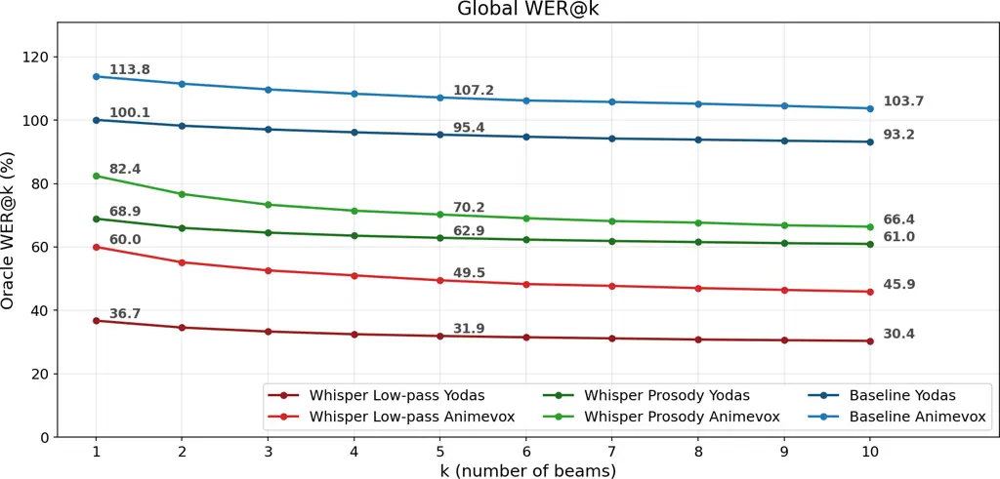
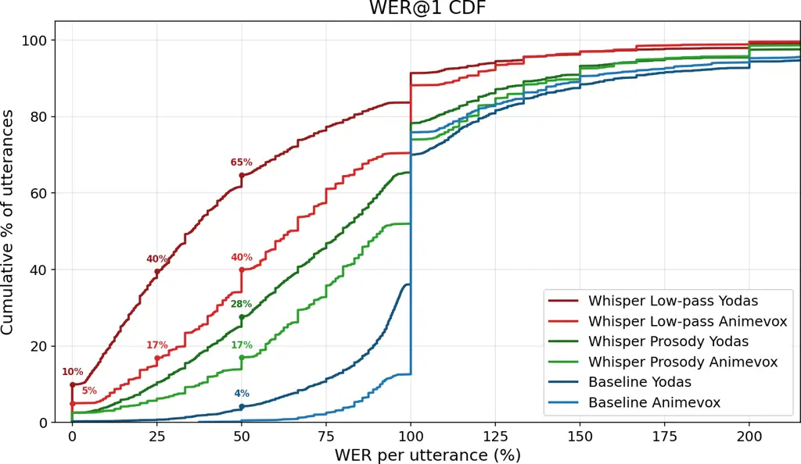
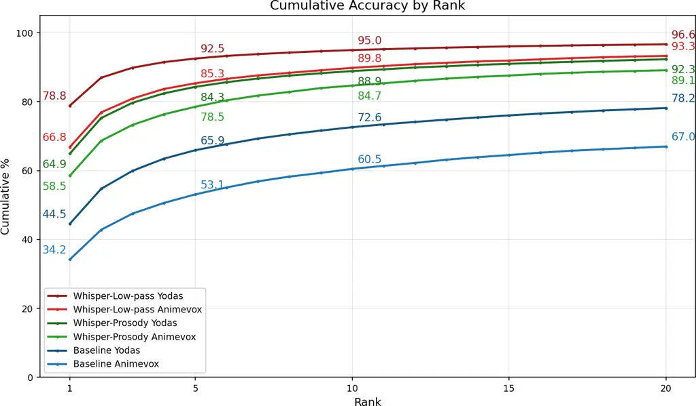
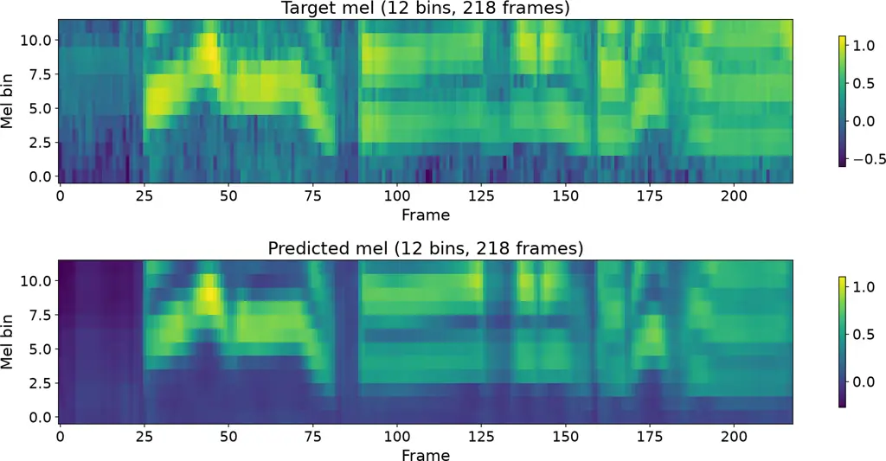

# Prosody-to-Text: Predicting text from low-pass filtered speech

David
Porteš 
   Aleš
Horák 

###### Abstract

While predicting prosody from text is an established task in the field,
the opposite direction, predicting text that fits a given prosodic
pattern, remains largely overlooked. We find this unfortunate, because
this opposite direction could lead to some very interesting use cases.
Therefore, in this paper, we make the first steps in the prosody-to-text
direction by investigating how much of the original sentence can be
recovered from its prosodic pattern. To this end, we fine-tune the
Whisper model using only the 12 lowest Mel bins (low-pass filter with
approximately 450Hz cutoff), and obtain surprisingly accurate results
(WER 36%), with 10% of utterances being recovered perfectly, and 40% of
utterances having Word Error Rate at or below 25%. We also find that,
given the correct prefix, the next token was predicted correctly in 79%
of cases. Our results suggest that the relationship between
low-frequency speech features and lexical content is much stronger than
previously thought, and we believe that directing more attention to this
topic might open the door to new applications, such as using prosody to
guide text generation of modern LLMs.

###### Index Terms: 

prosody, low-pass filter, Automatic Speech Recognition, Whisper,
Conformer

^(†)^(†)address: Natural Language Processing Centre  
Faculty of Informatics, Masaryk University  
Botanicka 68a, 602 00 Brno, Czech Republic  
xportes,hales@fi.muni.cz

## 1 Introduction

The text-prosody relationship has been extensively studied in the
literature, however, the overwhelming majority of research is concerned
with predicting prosody from text, due to its use in speech
synthesis \[6, 20, 15\]. The opposite direction, that is, predicting
text from prosody, remains largely unexplored. While past research
indicates that spoken-word recognition relies mainly on segmental
features, with prosody playing a supplementary role \[3, 5\], we were
curious whether contemporary Automatic Speech Recognition models (ASR)
could recover more than is generally thought possible from prosody
alone. If so, such prosody-to-text model could be used to recover
unintelligible or corrupted speech, help transcribe dysarthric speech,
or be used by researchers to study the prosody-text relationship from a
new angle. Additionally, even a partial result could be useful. For
example, one could use such model in combination with modern LLMs, in
order to steer the model towards texts that fit a desired prosody on a
topic of user’s choice \[17, 16\], thus unlocking a new way of human-LLM
interaction.

Therefore, in this paper, we investigate how much lexical content can
modern speech recognition models recover from the prosodic pattern of an
utterance. As a first estimate, we fine-tune the Whisper-Medium model
\[18\] using only the lowest 12 Mel bins out of 80, which corresponds
roughly to a low-pass filter with a 450Hz cutoff, on 750k samples from
the Yodas dataset \[13\]. Low-pass filtering at approximately 400–500 Hz
is a common technique to delexicalize speech while retaining prosodic
information \[1, 12, 14\].

We obtain a surprisingly low Word Error Rate on the held out Yodas test
set (WER 36%), and on a separate Animevox \[19\] dataset (WER 60%). In
both datasets, there was a non-trivial percentage of sentences which
were transcribed perfectly (10%, 5%), and, in some cases, even sentences
longer than 12 words were transcribed correctly or with minimum errors.
On the Yodas test set, given the correct prefix, the model was able to
predict the next token correctly 79% of the time, and 96% of the time
within the top 10.

In order to determine how much of this result can be attributed directly
to prosodic features, we trained a Conformer-based model \[7\] to
generate artificial 12-bin Mel spectrograms based exclusively on the
Fundamental frequency ($`f_{0}`$) and Energy derived from the speech. We
then continued fine-tuning our Whisper model on these generated
spectrograms. We found that, on the Yodas test set, using artificial
spectrograms caused WER to increase to 69%. However, given the correct
prefix, the model was still able to predict the next token correctly 64%
of the time, and 92% of the time in the top 10 predictions.

While we were not able to attribute our results directly to the prosodic
features, we did find that the relationship between low-frequency
features of speech and its lexical content is stronger than generally
believed. Our fine-tuned Whisper-Medium model, which has much fewer
parameters than State of the art models, was able to provide meaningful
reconstruction on a significant portion of sentences without access to
most segmental features. Our findings suggest that this might be an
underexplored area with great potential, and we aim to investigate it
further using additional prosodic features and larger datasets. In order
to facilitate further research in this area, we publish our models and
code¹¹ 1
[https://huggingface.co/collections/MU-NLPC/prosody-to-text](https://huggingface.co/collections/MU-NLPC/prosody-to-text).

## 2 Related Work

Predicting text from prosody is an extremely underexplored topic. In
fact, we were not able to find any works dealing with predicting text
from prosody, nor low-frequency features of speech. The closest branch
of research is probably the Temporal Patterns (TRAPS) \[8\] approach to
Automatic Speech Recognition (ASR), which proposes to conduct ASR based
on long temporal patterns within different critical frequency bands, and
combine bands with highest signal-to-noise ratio into the final
prediction. This implicitly includes our problem, which would be roughly
equivalent to the lowest critical band. However, most of the research is
dated, and we were not able to find any breakdown of accuracy by band,
which we could compare to our results.

From the more recent works, the most similar is probably \[22\], where
its authors estimate the mutual information between prosody and text.
However, they approach the problem from the text to prosody direction,
by training a LLM to predict prosody features, and they do not
investigate the relationship from the prosody to text direction.

There is a number of works that treat prosody as supplementary
information to an established lexical-related task, such as speech
translation \[21, 23\], or spoken language modeling \[10, 11\]. However,
prosody is not used as the sole input in these papers. The only
exception we are aware of is \[4\], which investigates the role of
prosody as supplementary information in Spoken Question Answering. Here,
the authors also report the performance using only the prosodic
condition, noting that the results were weaker but still very much above
chance.

Figure 1: The global oracle WER@k curves.

Figure 2: Cumulative distribution over WER.

## 3 Methods

In this section, we describe the training of our models, and the
evaluation methods used.

### 3.1 Choice of model and features

The choice of the Whisper model was driven mainly by the fact that it is
one of the most prominent ASR models, trained on a large amount of data
(680k hours). While newer models could be used, it would be difficult to
find a test dataset created after their release, in order to rule out
any contamination. We used the Whisper-Medium version, since we found
that larger versions require much bigger batch sizes for the fine-tuning
to converge.

As our representation of prosody, we used the Fundamental frequency
($`f_{0}`$) and Energy, as these are the most prominent prosodic
features, often used together in speech synthesis methods \[6, 20\].
Fundamental frequency represents the perceived pitch of the voice, while
energy reflects the loudness of the speech signal. We decided to avoid
using any text-derived features, such as duration, as these would not be
available in potential real applications. Additional spectral features
are left to future work.

### 3.2 Training: Whisper-Low-pass (LP)

In order to predict text based only on the low-frequency features of
speech, we fine-tuned the Whisper-Medium model using only the lowest 12
Mel bins out of the 80 bins generated by the Whisper preprocessor. We
did this by setting all bins above 12 to zero, in order to preserve the
shape of the data. In the Whisper Mel spectrogram, this means that the
highest bin we used was centered at 446Hz, tapering down towards 484Hz,
where the 13th bin is centered.

We fine-tuned 750k English samples from the Yodas dataset \[13\], using
only samples with duration below 30 s, with a 3k validation set. We
stopped fine-tuning after 1 epoch due to signs of overfitting.
Fine-tuning was conducted on a NVIDIA A100 GPU using batch size 64 with
4 gradient accumulation steps, making the effective batch size 256. The
process took 12 hours.

### 3.3 Training: Whisper-Prosody

Since the Whisper model expects Mel spectrograms as input, we cannot
feed it the $`f_{0}`$ and Energy prosodic features directly. For this
reason, we first trained a Conformer model to generate 750k artificial
12-bin Mel spectrograms based solely on these features, using data from
the Yodas dataset. The spectrograms were zero-padded to match the 80 bin
shape, and they were subsequently used to further fine-tune the
Whisper-Low-Pass checkpoint for an additional epoch. Fine-tuning was
conducted on a NVIDIA A100 GPU, with the same parameters and training
time as in the Whisper-Low-pass case.

### 3.4 Training: Conformer

To train the Conformer model, we extracted $`f_{0}`$ using YAAPT
algorithm \[9\], with the hop size of 5ms and frame size of 20ms on
16kHz sampled audio, resulting in $`f_{0}`$ signal sampled at 200Hz. The
unvoiced frames were interpolated over using the interpolation algorithm
in YAAPT. Energy was extracted using the PRAAT package \[2\], also at
200Hz. We trained for two epochs on 750k samples from the Yodas dataset
using a batch size of 256. The training took 48 hours on an NVIDIA A40
GPU. The total number of parameters of the Conformer model was
7,645,198.

Figure 3: Percentage of times the correct token was present in top k
predictions given correct prefix.

Figure 4: Sample reconstruction of the lowest 12 bins of the Whisper Mel
spectrogram by our Conformer model.

### 3.5 Evaluation

We evaluated each model on 3000 held out samples of the Yodas dataset
with duration under 30s. The Yodas dataset was released two years after
the Whisper models, however, since the data in the dataset might be
older, test set contamination with the non-public Whisper training set
cannot be ruled out. For this reason, we also evaluated 1,000 samples
from the AnimeVox dataset \[19\], which was made using the show Frieren:
Beyond Journey’s end (2023), released a year after the Whisper model
checkpoints. For the Whisper-Prosody model, the input Mel spectrograms
were generated using the Conformer model based exclusively on the
prosodic features $`f_{0}`$ and Energy. We used beam search with 10
beams in all our evaluations. As a baseline, we use the Whisper-Large
model without any fine-tuning, which was evaluated using the Low-pass
condition.

|                                                              |                                                                                                                                                                             |                                                             |                                                                                              |
| ------------------------------------------------------------ | --------------------------------------------------------------------------------------------------------------------------------------------------------------------------- | ----------------------------------------------------------- | -------------------------------------------------------------------------------------------- |
| Whisper Low-pass                                             |                                                                                                                                                                             | Whisper Prosody                                             |                                                                                              |
| Yodas WER: 37.0   ID: en000_00000000_Y65cyhwpYdo_877_58_9_80 |                                                                                                                                                                             | Yodas WER: 68.8   ID: en000_00000014_2kON4SqVoOY_99_00_4_00 |                                                                                              |
| P:                                                           | Unfortunately the patients knew which group they were in because the other one I didn’t block the rebirth, which gave it away, but she can’t discount the placebo effect.   | P:                                                          | You can now come in and edit the video and there is hidden in the settings.                  |
| R:                                                           | Unfortunately, the patients knew which group they were in because they were evidently getting broccoli burps, which gave it away, so you can’t discount the placebo effect. | R:                                                          | You can now send in your audition videos on the link given in the comment box.               |
| Animevox WER: 60.0   ID: 67                                  |                                                                                                                                                                             | Animevox WER: 82.4   ID: 161                                |                                                                                              |
| P:                                                           | Clearly a lawyer can handle a search in much longer.                                                                                                                        | P:                                                          | Their marriage is quite powerful, such as they don’t want to share with one another’s child. |
| R:                                                           | Surely a warrior can handle a fall from this height.                                                                                                                        | R:                                                          | Though a mage is quite powerful, she could be doubly so with a warrior by her side.          |

Figure 5: Sample sentences with WER near the mean for each model. P is
prediction, R is reference. Red indicates errors.

## 4 Results and Discussion

|     | Yodas |         |            | AnimeVox |         |            |
| --- | ----- | ------- | ---------- | -------- | ------- | ---------- |
| WER | LP    | Prosody | Base\_(LP) | LP       | Prosody | Base\_(LP) |
| @1  | 36.7  | 68.9    | 100.1      | 60.0     | 82.4    | 113.8      |
| @2  | 34.6  | 66.0    | 98.2       | 55.2     | 76.7    | 111.5      |
| @5  | 31.9  | 62.9    | 95.4       | 49.5     | 70.2    | 107.2      |
| @10 | 30.4  | 61.0    | 93.2       | 45.9     | 66.4    | 103.7      |

Table 1: Global Oracle WER@$`k`$ (%)

|             |       |         |            |          |         |            |
| ----------- | ----- | ------- | ---------- | -------- | ------- | ---------- |
|             | Yodas |         |            | AnimeVox |         |            |
| Metric      | LP    | Prosody | Base\_(LP) | LP       | Prosody | Base\_(LP) |
| Num Samples | 3000  | 3000    | 3000       | 1000     | 1000    | 1000       |
| Top1 Pct    | 78.80 | 64.90   | 44.50      | 66.80    | 58.50   | 34.20      |
| Avg Rank    | 17.33 | 39.87   | 532.44     | 81.52    | 107.14  | 959.82     |
| Median Rank | 1     | 1       | 2          | 1        | 1       | 2          |
| Perplexity  | 2.61  | 4.91    | 29.05      | 3.78     | 5.79    | 48.54      |

Table 2: Next token distribution metrics

Word Error Rates (WER) for each model-dataset combination are shown in
Table 1. Figure 1 visualizes the distribution of global WER values
across all evaluated WER@$`k`$ settings, while Figure 2 shows the
cumulative distribution function of WER values. In Table 2, we analyze
several properties of the next-token distribution given the correct
prefix. Figure 3 shows the percentage of times the correct token
appeared within the top-$`k`$ predictions, given the correct prefix. To
illustrate average reconstruction quality, Figure 5 presents
representative examples whose WER is close to the average in each
model-dataset combination.

Regarding the quality of Mel spectrogram generation, the Mean Squared
Error (MSE) between the predicted and ground-truth Mel spectrograms on
the test set was $`0.0322`$. Figure 4 shows a representative
reconstruction.

We find that, given the correct prefix, the Whisper-Low-pass model
predicted the correct next token approximately 79% of the time on the
Yodas dataset and 67% on the AnimeVox dataset (Table 2). While this was
insufficient for reliable reconstruction, the WER was very unstable, and
a nontrivial portion of sentences were even reconstructed with 0% WER
(10%/5%). There was also a substantial gap between the two datasets,
which we suspect to be due to the domain mismatch between the
fine-tuning dataset consisting of Youtube videos (Yodas) and Animevox,
containing mostly animated voice acting in a fantasy setting.

We were not able to attribute these results purely to the prosodic
features of $`f_{0}`$ and Energy, as WER increased substantially when
using the Whisper-Prosody pipeline. This may indicate that prosodic
information was only partially responsible for the performance of the
Whisper-Low-pass model, or that additional prosodic features are
required. It may also have been caused by insufficient training data, as
Whisper-Prosody relies on a more complex two-stage pipeline involving
the Conformer model. Even so, the correct next-token rate of the
Whisper-Prosody-based model remained above 58% on both datasets,
suggesting the presence of a non-trivial relationship between $`f_{0}`$,
Energy and lexical content.

Our results support the base hypothesis behind TRAPS \[8\] that
individual frequency bands carry large portions meaning redundantly, at
least in the lowest critical band. In this context, it would be
interesting to see whether current state of the art ASR models draw on
the low-frequency features to aid their predictions in cases where the
signal in other bands is corrupted.

When compared to the base Whisper models, we find that this is not a
capability that the Whisper model possessed natively, as our fine-tuned
Whisper-Medium model’s WER (36 / 60%) is much lower than the WER of even
the Whisper-Large model (WER 100 / 113%), across both datasets.

## 5 Limitations

The main limitation of our study is that, in case of the Yodas dataset,
it is not possible to rule out test set contamination with the original
Whisper training set, since it is not publicly available. We have also
extracted the test set in an interleaved manner with the training set,
meaning that the domain is mostly the same across both sets, and using a
disjoint set of the Yodas dataset might yield worse results. However,
the results on AnimeVox are guaranteed to be free from contamination,
since the data comes from a TV show recorded one year after the Whisper
checkpoints last modification date on the Huggingface website. The
AnimeVox dataset is not an established dataset in the field, however, we
were hard-pressed to find any other datasets with samples that are
guaranteed to have been created after the Whisper model cutoff. The data
used from the AnimeVox dataset also encompass only a single female
speaker.

## 6 Conclusion

Our results reveal a surprisingly strong relationship between
low-frequency features of speech and its lexical content. On the
AnimeVox dataset, using only the lowest 12 Mel bins (450Hz), our
fine-tuned Whisper-Medium model was able to correctly transcribe 5% of
utterances, with  17% of utterances having Word Error Rate at or below
25%. Our results were even better on the Yodas test set, with 10% fully
correct utterances, and 40% utterances at or below 25% WER. However, in
this case, it is not possible to rule out test set contamination with
the original Whisper training set. While the prosody-only results were
weaker, there was still indication of a nontrivial prosody-text
relationship, as our model’s next token predictions were correct in more
than 58 percent of cases, given the correct prefix. All our results were
obtained using the Whisper-Medium model, fine-tuned on very small data
compared to today’s industrial standard, suggesting that there is still
potential to improve the performance further, which could lead to new
original use cases and applications. As future work, we plan to add
additional prosodic features to see whether the performance on low-pass
filtered data can be matched.

### Acknowledgments

Computational resources were provided by the e-INFRA CZ project
(ID:90254), supported by the Ministry of Education, Youth and Sports of
the Czech Republic.

## References

- \[1\] N. Audibert, F. Carbone, M. Champagne-Lavau, A. S. Housseini,
  and C. Petrone (2023) Evaluation of delexicalization methods for
  research on emotional speech. In Interspeech 2023, pp. 2618–2622.
  External Links:
  [Document](https://dx.doi.org/10.21437/Interspeech.2023-1903), ISSN
  2958-1796 Cited by: §1.
- \[2\] P. Boersma and V. Van Heuven (2001) Speak and unspeak with
  praat. Glot International 5 (9/10), pp. 341–347. Cited by: §3.4.
- \[3\] A. Buxó-Lugo (2026) Integration of contrastive prosody and
  segmental information during spoken word recognition. Auditory
  Perception & Cognition 9 (1), pp. 43–63. External Links:
  [Document](https://dx.doi.org/10.1080/25742442.2025.2593218),
  [Link](https://doi.org/10.1080/25742442.2025.2593218),
  https://doi.org/10.1080/25742442.2025.2593218 Cited by: §1.
- \[4\] J. Chi, M. de Seyssel, and N. Schluter (2025) The role of
  prosody in spoken question answering. In Findings of the Association
  for Computational Linguistics: NAACL 2025, Albuquerque, New Mexico,
  pp. 8483–8494. External Links:
  [Link](https://aclanthology.org/2025.findings-naacl.471/),
  [Document](https://dx.doi.org/10.18653/v1/2025.findings-naacl.471),
  ISBN 979-8-89176-195-7 Cited by: §2.
- \[5\] J. Chi, M. de Seyssel, and N. Schluter (2025) The role of
  prosody in spoken question answering. In Findings of the Association
  for Computational Linguistics: NAACL 2025, pp. 8483–8494. Cited by:
  §1.
- \[6\] J. C. Galdino et al. (2025) The evaluation of prosody in speech
  synthesis: a systematic review. Journal of the Brazilian Computer
  Society 31 (1), pp. 465–486. Cited by: §1, §3.1.
- \[7\] A. Gulati et al. (2020) Conformer: Convolution-augmented
  Transformer for Speech Recognition. In Interspeech 2020,
  pp. 5036–5040. External Links:
  [Document](https://dx.doi.org/10.21437/Interspeech.2020-3015), ISSN
  2958-1796 Cited by: §1.
- \[8\] H. Heřmanský (1998) TRAPS- classifiers of temporal patterns. In
  Proc. International Conference on Spoken Language Processing (ICSLP),
  Sydney, pp. 5. Cited by: §2, §4.
- \[9\] K. Kasi and S. A. Zahorian (2002) Yet Another Algorithm for
  Pitch Tracking. In IEEE International Conference on Acoustics Speech
  and Signal Processing, Orlando, FL, USA, pp. I–361–I–364 (en).
  External Links: ISBN 978-0-7803-7402-7,
  [Document](https://dx.doi.org/10.1109/ICASSP.2002.5743729) Cited by:
  §3.4.
- \[10\] E. Kharitonov et al. (2022) Text-free prosody-aware generative
  spoken language modeling. In Proceedings of the 60th Annual Meeting of
  the Association for Computational Linguistics (Volume 1: Long Papers),
  Dublin, Ireland, pp. 8666–8681. External Links:
  [Link](https://aclanthology.org/2022.acl-long.593/),
  [Document](https://dx.doi.org/10.18653/v1/2022.acl-long.593) Cited by:
  §2.
- \[11\] H. Kim et al. (2024) Paralinguistics-aware speech-empowered
  large language models for natural conversation. In Proceedings of the
  38th International Conference on Neural Information Processing
  Systems, NIPS ’24, Red Hook, NY, USA. External Links: ISBN
  9798331314385 Cited by: §2.
- \[12\] M. A. Knoll et al. (2009) Effects of low-pass filtering on the
  judgment of vocal affect in speech directed to infants, adults and
  foreigners. Speech Communication 51 (3), pp. 210–216. External Links:
  ISSN 0167-6393,
  [Document](https://dx.doi.org/https%3A//doi.org/10.1016/j.specom.2008.08.001),
  [Link](https://www.sciencedirect.com/science/article/pii/S0167639308001283)
  Cited by: §1.
- \[13\] X. Li et al. (2023) Yodas: youtube-oriented dataset for audio
  and speech. In 2023 IEEE Automatic Speech Recognition and
  Understanding Workshop (ASRU), pp. 1–8. Cited by: §1, §3.2.
- \[14\] S. Lolli et al. (2015) Sound frequency affects speech emotion
  perception: results from congenital amusia. Frontiers in Psychology
  Volume 6 - 2015. External Links:
  [Link](https://www.frontiersin.org/journals/psychology/articles/10.3389/fpsyg.2015.01340),
  [Document](https://dx.doi.org/10.3389/fpsyg.2015.01340), ISSN
  1664-1078 Cited by: §1.
- \[15\] T. Ogura et al. (2025) GST-BERT-TTS: Prosody Prediction Without
  Accentual Labels For Multi-Speaker TTS Using BERT With Global Style
  Tokens. In Interspeech 2025, pp. 444–448. External Links:
  [Document](https://dx.doi.org/10.21437/Interspeech.2025-1098), ISSN
  2958-1796 Cited by: §1.
- \[16\] D. Porteš and A. Horák (2025) Learning Optimal Prosody
  Embedding Codebook based on F0 and Energy. In Proc. Interspeech 2025,
  pp. 4728–4732. Cited by: §1.
- \[17\] D. Porteš (2023) Towards using speech melody to guide large
  language models. In Proceedings of Recent Advances in Slavonic Natural
  Language Processing, RASLAN 2023, pp. 133–141. Cited by: §1.
- \[18\] A. Radford et al. (2022) Robust speech recognition via
  large-scale weak supervision. arXiv. External Links:
  [Document](https://dx.doi.org/10.48550/ARXIV.2212.04356),
  [Link](https://arxiv.org/abs/2212.04356) Cited by: §1.
- \[19\] T. Rajput (2025) AnimeVox. Note:
  [https://github.com/taresh18/AnimeVox](https://github.com/taresh18/AnimeVox)
  External Links: [Link](https://github.com/taresh18/AnimeVox) Cited by:
  §1, §3.5.
- \[20\] Y. Ren et al. (2022) FastSpeech 2: fast and high-quality
  end-to-end text to speech. Note: arXiv 2006.04558 External Links:
  2006.04558, [Link](https://arxiv.org/abs/2006.04558) Cited by: §1,
  §3.1.
- \[21\] I. Tsiamas, M. Sperber, A. Finch, and S. Garg (2024) Speech is
  more than words: do speech-to-text translation systems leverage
  prosody?. In Proceedings of the Ninth Conference on Machine
  Translation, USA, pp. 1235–1257. External Links:
  [Link](https://aclanthology.org/2024.wmt-1.119/),
  [Document](https://dx.doi.org/10.18653/v1/2024.wmt-1.119) Cited by:
  §2.
- \[22\] L. Wolf et al. (2023) Quantifying the redundancy between
  prosody and text. In Proceedings of the 2023 Conference on Empirical
  Methods in Natural Language Processing, Singapore, pp. 9765–9784.
  External Links: [Link](https://aclanthology.org/2023.emnlp-main.606/),
  [Document](https://dx.doi.org/10.18653/v1/2023.emnlp-main.606) Cited
  by: §2.
- \[23\] G. Zhou, T. K. Lam, A. Birch, and B. Haddow (2024) Prosody in
  cascade and direct speech-to-text translation: a case study on Korean
  wh-phrases. In Findings of the Association for Computational
  Linguistics: EACL 2024, Malta, pp. 674–683. External Links:
  [Link](https://aclanthology.org/2024.findings-eacl.46/),
  [Document](https://dx.doi.org/10.18653/v1/2024.findings-eacl.46) Cited
  by: §2.
